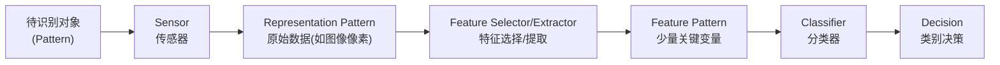
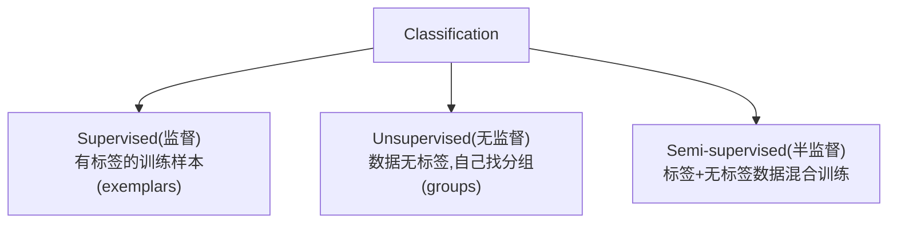
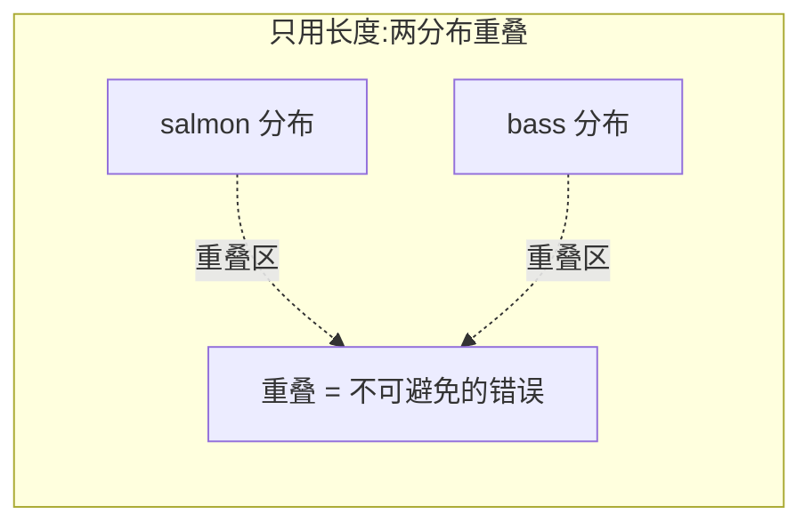
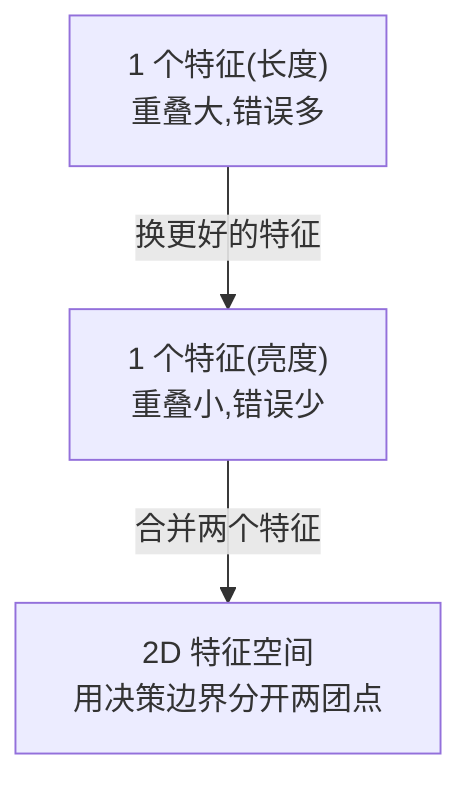
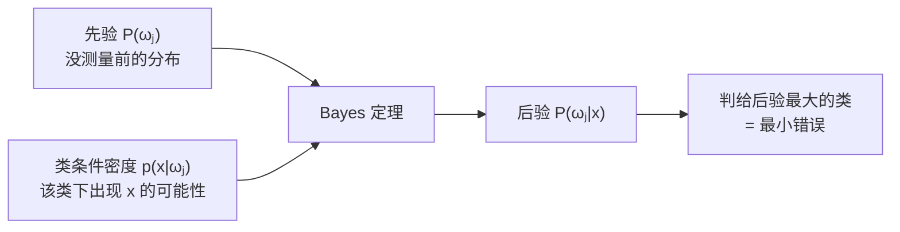
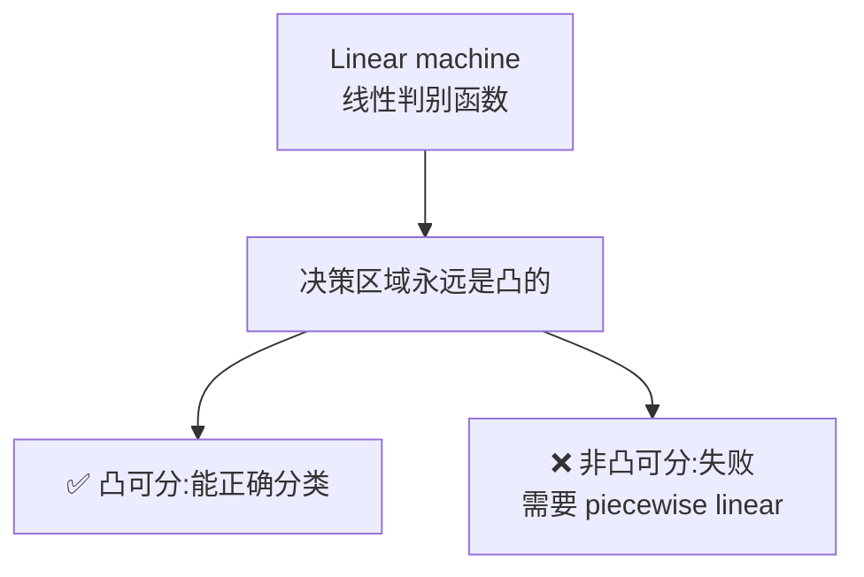
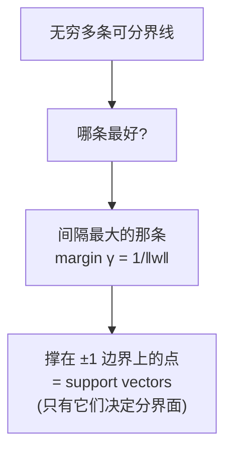
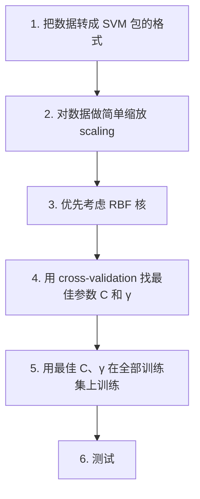
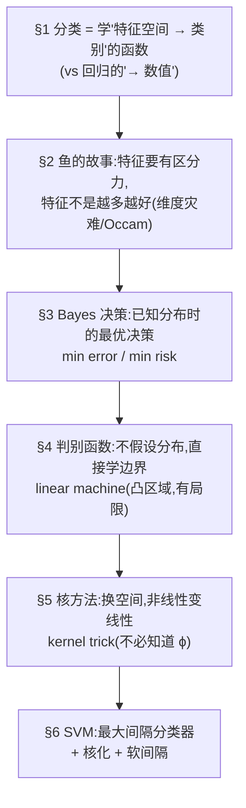

# 第四章 · 模式分类 (Pattern Classification)

> **学习目标 (Learning objectives)** — 读完本章你应该能够:
> - 说清**分类 (classification)** 与回归的根本区别,并描述一个模式分类系统的标准流程(sensor → feature → classifier → decision);
> - 用"鱼的故事"解释特征选择、决策边界、维度灾难与 Occam's razor;
> - 推导并应用 **Bayes 决策规则**:区分 minimum error 与 minimum risk,会用 likelihood ratio 和 loss matrix 做判断;
> - 解释**判别函数 (discriminant functions)** 的思路,理解 linear machine、minimum-distance classifier 及其凸决策区域的局限;
> - 讲清**核方法 (kernel methods)** 的核心思想——为什么不必知道映射 $\phi$ 也能在高维空间里算内积(kernel trick / Mercer);
> - 描述 **SVM** 如何通过最大化间隔来分类,理解 support vector、soft margin、以及如何用核把它推广到非线性。

> ⚠️ **来自课堂的考试提示(非常重要)** — 老师明确说过:本章(尤其是 kernel 和 SVM)**考试不会要求你推导或默写那些公式**。但他会考你**概念理解**:"你知道 kernelization 是什么意思吗?你知道怎么用它把非线性问题变成线性问题吗?"——**这才是重点**。所以本章读的时候,公式要"看得懂、读得出来",但真正要钻透的是每个方法"在解决什么问题、凭什么思想解决"。(另:期末是 3 小时**手写闭卷**,允许带**一页 A4 手写 cheat sheet**。)

上一章我们学会了预测连续数值(回归)。本章转向另一大类监督学习任务:**当输出不是一个数,而是一个"类别"时,怎么办?** 这就是分类。老师在课上反复强调一句要记进口袋里的话:

> **回归把输入映射到一个数值 (value);分类把输入映射到一个类别 (category)。**

这是分类与回归最根本的区别。其余一切——特征、模型、泛化——两者是相通的。事实上老师点破了一个统一视角:**所有机器学习,本质上都是在学一个函数,把一个空间映射到另一个空间**。回归学的是"特征空间 → 实数轴"的函数,分类学的是"特征空间 → 类别"的函数。记住这个"函数逼近 (function approximation)"的视角,后面神经网络一章会再次回到它。

---

## 1. 什么是模式识别:一个分类系统长什么样

### 1.1 从人类的认知说起

我们每天都在毫不费力地做分类:认出汽车、人、动物——尽管它们形态千差万别。我们是怎么做到的?**靠提取特征 (features)**。哪怕信息不完整(只看到一个轮廓),我们也能凭特征贴上"标签 (label)"。**label 就是名字**,是我们在机器学习里给类别起的称呼。

**模式识别 (pattern recognition)** 这门学问研究的就是:如何设计能识别、分类"事物"的机器。具体研究三件事:

1. 研究描述事物的那些**特征的统计规律**;
2. 研究如何设计分类机器;
3. 研究如何**度量分类系统的性能**、并选出好的系统。

### 1.2 标准流程:从原始信号到决策

一个模式分类系统有一条标准的流水线(slides 的 Figure 1):

逐段理解这条流水线(老师特别强调了"两种 pattern"的区别):

- **Sensor(传感器)** 是任何"测量"手段——相机、麦克风、激光雷达,泛指一切获取数据的方式。它给出**representation pattern(表示模式)**,也就是**原始数据**(图像像素、股票价格、语音信号……)。
- **Feature selector/extractor** 通过某种变换,从原始数据里提炼出**一小组变量**,这就是 **feature pattern(特征模式)**。
- **训练好的 classifier** 用这个特征模式做出关于输入的**决策**。

这条 pattern 可以是任何东西——图像像素、股市收盘价、语音录音、气象变量、房产数据、人的行为数据、甚至 DNA 等生物数据。无论什么,我们最终都把它整理成一个 **$p$ 维向量**:

$$x = \begin{bmatrix} x_1 & x_2 & \cdots & x_p \end{bmatrix}^t$$

其中上标 $t$(或 $T$)表示**转置 (transpose)**——老师风趣地说,这个小小的 $t$ 的意思就是"让这个向量站起来,别躺着"(列向量)。

### 1.3 类别、标签与一个关键区分

假设共有 $C$ 个类别,记作 $\omega_1, \dots, \omega_C$。引入一个变量 $z$ 指示某个模式 $x$ 属于哪一类:

$$\text{若 } z = i,\ \text{则模式 } x \text{ 属于 } \omega_i,\quad i \in \{1, \dots, C\}$$

> **🔑 例 (分类器 vs 回归器)** — 老师在课堂上反复追问这个区别,说"放进口袋、拉上拉链,别忘了":
> - **回归器 (regressor)**:输出是**数值**——比如预测幸福感 5.96。映射 = 特征空间 → 实数。
> - **分类器 (classifier)**:输出是**类别/标签**——比如判断"这是 salmon"还是"这是 bass"。映射 = 特征空间 → 类别。
>
> 这个差异决定了后面用的损失、决策规则、评价指标都不同,是本章一切讨论的起点。

> 📎 **拓展(超出 slides,但老师在录音里点了)** — 从概率角度看,分类器要学的是一个**条件概率 (conditional probability)** $P(Y|X)$——"给定观测 $X$,它属于类别 $Y$ 的概率"。记住这一点,因为 §3 的 Bayes 决策正是围绕这个条件概率展开的。

### 1.4 分类器设计的核心要求

给定一组**已知类别**的模式 $\{(x_i, z_i)\}$,称为**训练集/设计集 (training / design set)**,我们要设计一个对**预期工作条件**最优的分类器。设计时要牢记四条(slides 列得很清楚):

1. 给定的训练样本是**有限的 (finite)**;
2. 分类器模型**不能太复杂**(参数不能太多),否则会**过拟合 (over-fitting)**;
3. 在设计集上取得最优表现**并不重要**;
4. **取得最优的泛化性能 (generalization) 才最重要**——也就是在"真实工作条件所代表的、设计集所抽自的那个无限总体"上表现好。

老师把第 4 条拔到最高:**一个能泛化的模型才是可部署的模型**。只在自己电脑上、训练数据上好用的模型毫无价值;能在没见过的新数据上同样好用,才能拿出去用。这正是回归章 §2.3"经验误差 vs 泛化误差"那对张力在分类里的再现。

### 1.5 三种学习范式

- **监督分类 (Supervised)**:设计过程有一组带标签(类别)的数据样本,即训练数据。
- **无监督分类 (Unsupervised)**:数据**没有标签**,目标是在数据里**找出分组 (groups)**、以及区分各组的特征。
- **半监督 (Semi-supervised)**:训练时**同时**用标注和未标注数据。

本章聚焦监督分类。

---

## 2. 特征工程的直觉:一个关于鱼的故事

slides 和录音都花了大量篇幅讲一个经典例子(出自 Duda-Hart-Stork 的 *Pattern Classification*,老师说"这是我们当年吃着长大的书")。这个故事把抽象的分类设计讲得活灵活现,务必吃透——它是后面所有方法的直觉来源。

### 2.1 问题:给鱼分拣

你为一家渔业公司设计自动分拣系统。公司要把 **salmon(三文鱼)** 和 **bass(鲈鱼)** 分开。这事有商业代价:salmon 比 bass 贵约 3 倍,**把 salmon 错卖成 bass(或反之)代价很高**——顾客买到一半是别的鱼,会要求退款。人工分拣的工人会累、会犯困、会装错,所以需要机器学习。

第一步做什么?老师反复强调:**收集数据!Data is king。** 再好的 GPU,没有数据也建不了模型。所以你把一箱 salmon、一箱 bass 拿回家,**大量测量**。为什么要量很多条而不是一条?因为你需要**变化 (variation / variance)**——知道 salmon 的长度有哪些可能、bass 的长度有哪些可能,也就是知道每个特征的**概率分布**。只测一条会过拟合到那一条鱼;量得多还能**抵消测量误差**。

可选的特征(features of interest):**length(长度)、width(宽度)、fins 的数量和形状、嘴的位置、lightness(明暗/亮度)**……

### 2.2 用一个特征:长度,以及"决策边界"

先只用**长度**。把大量 salmon 和 bass 的长度画成两个**直方图 (histogram)**——其实就是两条长度的分布曲线。你会发现:大多数 salmon 集中在某个长度,大多数 bass 集中在另一个(通常更长),**但两条分布有重叠**——有些短的 bass、有些长的 salmon。

你在某个长度 $L^*$ 处画一条竖线作为**决策阈值/决策边界 (decision boundary)**:左边判为 salmon,右边判为 bass。$L^*$ 选在能让**错误数最小**的位置。

**关键洞见:那块重叠区域,就是分类错误的来源。** 无论阈值怎么放,落在重叠区的鱼总会有一部分被判错。光用长度,重叠太大,错误太多——顾客不满意。这个特征**不够有区分力 (discriminative)**。

### 2.3 换个特征、再合并:走向二维特征空间

于是改用 **lightness(亮度)**。同样画直方图、找阈值 $X^*$。这次两个分布的重叠**小得多**,错误也少得多——亮度比长度更有区分力。

但还能更好:**为什么不把两个特征合起来用?** 于是构造一个**二维特征向量**:

$$x = \begin{bmatrix} x_1 \\ x_2 \end{bmatrix} \quad (\text{如 } x_1 = \text{lightness},\ x_2 = \text{length})$$

现在每条鱼是二维平面上的一个点,salmon 和 bass 形成两团点云。分类器要找的不再是一条竖线,而是平面上的一条**决策边界**把两团分开。如何找到"最好"的那条决策边界,**正是分类器设计问题的核心**。用两个特征后,训练误差可能降到只剩一两个点错分——比单特征好得多。

### 2.4 特征不是越多越好:维度灾难与 Occam's Razor

既然两个特征比一个好,那十个、一百个岂不更好?**错。** 这里有两个陷阱:

**(1) 维度灾难 (curse of dimensionality)** — 特征太多时,要处理高维特征向量,数据在高维空间里变得极度稀疏,反而很难找到一条好的决策边界来漂亮地区分。"特征太多"这个问题就叫维度灾难。

**(2) 过拟合 (overfitting)** — 模型太复杂(决策边界太曲折)会把训练数据"完美"分开,但对新模式分类很差——又是**泛化问题**。slides 的 Figure 7 画的就是一条过分曲折、试图穿过每一个训练点的决策边界。

那该怎么权衡?答案是一条古老的原则——**Occam's Razor(奥卡姆剃刀)**:

> **在多个competing(相互竞争)且都能拟合数据的模型中,选最简单的那个。**

老师强调了一个常被误读的细节:**不是"为了简单而简单",而是"在能拟合数据的前提下选最简单的"**。如果模型 A 简单且能拟合,模型 B 也能拟合但更复杂,选 A;但简单到拟合不了数据的模型不在考虑之列。这条原则也是后面**稀疏表示 (sparse representation)** 方法的思想根基(呼应回归章 Lasso 的精神)。

> **🔑 小结这个故事教会我们的设计流程**:(1) 先收集大量、多样的数据;(2) 思考什么特征能**唯一地、有区分力地**描述对象;(3) 用尽量少的特征(Occam),通过特征的分布找决策边界;(4) 用独立的测试数据检验泛化。这套思路对任何分类对象都适用——鱼只是个好记的例子,换成工业质检、医学诊断、语音同理。

---

## 3. 贝叶斯决策理论:用概率做最优决策

鱼的故事给了直觉,现在要把它**数学化**。如果我们能掌握每个类别的概率分布,就能做出**最优**的决策。这就是 **Bayesian decision theory**——老师说它"无处不在,哪怕在最复杂的神经网络里也会冒出来",是经典方法里最该掌握的一块。

它有两个版本:**最小错误 (minimum error)** 和 **最小风险 (minimum risk)**。

### 3.1 Bayes 决策规则:最小错误

**前提**:我们**完全掌握每个类别的概率密度函数**。

**先验概率 (a priori / prior probability)** $P(\omega_1), \dots, P(\omega_C)$:在还没做任何测量之前,某个类别出现的概率。

> **🔑 例 (先验是什么)** — 老师用了两个比喻。一是钓鱼:"你去海里,闭着眼随手一抓,抓到 bass 的概率是多少?"——某片海域 bass 多,先验就高。二是数班里人数:若班里有 10 个女生、12 个男生(共 22 人),那么"随手点一个人是女生"的先验 $P(\text{female}) = 10/22$,$P(\text{male}) = 12/22$。**先验就是"在测量任何东西之前,事物的分布"。**

现在我们用测量向量 $x$ 把 $x$ 分配到 $C$ 个类别之一。**后验概率 (a posteriori / posterior probability)** $P(\omega_j|x)$:观测到 $x$ 之后,它属于类别 $\omega_j$ 的概率(这正是 §1.3 说的那个 $P(Y|X)$)。

**Bayes 最小错误决策规则**:把 $x$ 判给后验概率**最高**的那个类别:

$$x \in \omega_j \quad \text{若} \quad P(\omega_j | x) > P(\omega_k | x),\quad \forall k = 1, \dots, C,\ k \ne j$$

这等于把测量空间划分成 $C$ 个区域 $\Omega_1, \dots, \Omega_C$:$x \in \Omega_j \Rightarrow x$ 属于 $\omega_j$。

**问题是后验 $P(\omega_j|x)$ 不好直接得到。** 这时 **Bayes 定理**登场,把后验用我们更容易掌握的量表达出来——**先验**和**类条件密度 (class-conditional density)** $p(x|\omega_i)$:

$$P(\omega_i | x) = \frac{p(x | \omega_i)\, P(\omega_i)}{p(x)}, \qquad p(x) = \sum_{j=1}^{C} p(x | \omega_j)\, P(\omega_j)$$

分母 $p(x)$ 对所有类别都一样,它的作用只是**归一化 (normalization)**(保证后验是合法概率,加起来为 1),**不影响比较大小**。所以决策规则可以只看分子,用类条件密度写成:

$$x \in \omega_j \quad \text{若} \quad p(x | \omega_j) P(\omega_j) > p(x | \omega_k) P(\omega_k),\quad \forall k \ne j$$

这就是 **Bayes 最小错误规则**。直觉:$p(x|\omega_j)$ 是"如果是 $\omega_j$ 类,出现这个测量值的可能性有多大"(比如 salmon 的平均长度分布),$P(\omega_j)$ 是这个类本身有多常见,两者相乘,谁大就判给谁——这样做,**犯的错误是最小的**。

#### 似然比 (Likelihood Ratio)

在**两类**问题里,可以把最小错误规则写成更紧凑的**似然比 (likelihood ratio)** 形式。把 $x$ 判为 $\omega_1$ 当且仅当:

$$L_r(x) = \frac{p(x | \omega_1)}{p(x | \omega_2)} > \frac{P(\omega_2)}{P(\omega_1)}$$

左边是两个类条件密度之比(似然比),右边是一个由先验决定的**阈值**。似然比超过阈值就判 $\omega_1$,否则判 $\omega_2$。

> **🔑 例 (两个正态分布)** — slides 给了一个具体例子(老师说数据是编的,只为演示计算):
> - 类 $\omega_1$ 是标准正态:$p(x|\omega_1) = N(x \mid 0, 1)$(均值 0、方差 1 的简单钟形)。
> - 类 $\omega_2$ 是**正态混合 (normal mixture / mixture of Gaussians)**:$p(x|\omega_2) = 0.6\, N(x\mid 1,1) + 0.4\, N(x\mid -1, 2)$。
>
> 为什么用正态?因为它**易处理 (tractable)**;而且**多个正态加权叠加(混合高斯)可以拼出非常复杂的分布**,所以表达能力并不弱。取 $P(\omega_1) = P(\omega_2) = 0.5$,把似然比 $L_r(x)$ 和阈值 $P(\omega_2)/P(\omega_1) = 1$ 一起画出来:$L_r(x)$ 高于阈值的 $x$ 区域判为 $\omega_1$,低于的判为 $\omega_2$。

### 3.2 Bayes 决策规则:最小风险

最小错误规则把所有错误一视同仁。但现实中**不同的错误代价不同**——回到鱼:把 bass 当 salmon 卖(顾客花高价买到便宜鱼,会投诉退款)和反过来,损失不一样。**Minimum risk(最小风险)** 规则就是要最小化**期望损失/风险 (expected loss / risk)**。

定义一个**损失矩阵 (loss matrix)** $\Lambda$,其元素:

$$\lambda_{ji} = \text{把模式 } x \text{ 判给 } \omega_i,\ \text{而它实际属于 } \omega_j \text{ 时的代价}$$

(注意:**对角线 $\lambda_{ii} = 0$**——判对了没有代价;非对角元素是各种错判的代价,可对称也可不对称。)

把 $x$ 判给 $\omega_i$ 的**条件风险 (conditional risk)** 是各种可能真实类别下代价的加权平均(权重是后验):

$$l_i(x) = \sum_{j=1}^{C} \lambda_{ji}\, P(\omega_j | x)$$

在决策区域 $\Omega_i$ 上的**平均风险**,以及对所有类求和得到的**总体风险 (overall risk)**:

$$r_i = \int_{\Omega_i} l_i(x)\, p(x)\, dx, \qquad r = \sum_{i=1}^{C} r_i = \sum_{i=1}^{C} \int_{\Omega_i} \sum_{j=1}^{C} \lambda_{ji} P(\omega_j|x) p(x)\, dx$$

**最小风险规则**:选择决策区域 $\Omega_i$,使得当

$$\sum_{j=1}^{C} \lambda_{ji} P(\omega_j | x) p(x) \le \sum_{j=1}^{C} \lambda_{jk} P(\omega_j | x) p(x),\quad \forall k$$

时,把 $x$ 判给 $\omega_i$。达到的最小风险称为 **Bayes 风险 (Bayes risk)** $r^*$。一句话:**对每个 $x$,算出判给各类的条件风险,选风险最小的那个类。**

> **🔑 例 (三类疾病诊断)** — 这是老师在录音里详细讲的例子。要判断病人是 healthy / mild disease / severe disease。损失矩阵的某些条目:
> - 判"healthy"而病人确实 healthy → 代价 0(判对);
> - 判"healthy"而病人其实是 severe disease → 代价**很大**(误诊致命,保险可能找你索赔);
> - 判"mild"而病人 healthy → 代价 1(让人白买药);
> - 判"mild"而病人确实 mild → 代价 0……
>
> 假设算出后验 $P(\omega_1|x)=0.4$、$P(\omega_2|x)=0.3$、$P(\omega_3|x)=0.3$,就把它们代入条件风险公式,分别算出"判 healthy / 判 mild / 判 severe"三种决策的风险,**选风险最小的那个**。这就是最小风险决策的完整流程。

#### 特例:零一损失 → 回到最小错误

如果用**零一损失矩阵 (zero-one loss)**(也叫对称损失):

$$\lambda_{ij} = \begin{cases} 1, & i \ne j \\ 0, & i = j \end{cases}$$

也就是"判错代价都是 1,判对代价是 0"。把它代入最小风险规则,经过化简会得到:

$$p(x|\omega_i) P(\omega_i) \ge p(x|\omega_k) P(\omega_k),\quad \forall k \quad \Rightarrow \quad x \in \omega_i$$

这**恰好就是 §3.1 的 Bayes 最小错误规则!** 换句话说,**最小错误是最小风险在"所有错误代价相等"时的特例**。此时条件风险有个漂亮的形式:

$$l_i(x) = \sum_{j \ne i} P(\omega_j | x) = 1 - P(\omega_i | x)$$

即"判给 $\omega_i$ 的风险 = 不是 $\omega_i$ 的概率"——要让风险最小,就让 $P(\omega_i|x)$ 最大,这与最小错误完全一致。

| | minimum error | minimum risk |
|---|---|---|
| **最小化的目标** | 错误概率 | 期望损失(风险) |
| **是否区分错误代价** | 否,所有错误一样 | 是,用 loss matrix $\lambda_{ji}$ |
| **判据** | 后验 $P(\omega_j\|x)$ 最大 | 条件风险 $l_i(x)$ 最小 |
| **关系** | 是 minimum risk 在 **zero-one loss** 下的特例 | 更一般 |

---

## 4. 判别函数:不假设分布,直接学边界

Bayes 决策很优雅,但有个硬伤:**它要求知道先验和类条件密度**,而这些在现实中往往拿不到,只能从数据估计。如果连分布的形式都不想假设,怎么办?

**判别函数 (discriminant functions)** 给出另一条路:**不对 $p(x|\omega_i)$ 做任何假设,而是直接假设一个"判别函数"的形式,用它来分类。** 我们把讨论从"概率"搬到了"函数形式"上。

### 4.1 基本思想

对一个两类问题,判别函数 $h(x)$ 满足:

$$h(x) > k \Rightarrow x \in \omega_1, \qquad h(x) < k \Rightarrow x \in \omega_2$$

($k$ 是某个常数阈值。)给定 $x$,代入函数,看结果在阈值之上还是之下,做相应判断。

**判别函数不唯一。** 若 $f(\cdot)$ 是**单调函数 (monotonic function)**,则 $g(x) = f(h(x))$ 给出**相同**的决策(阈值相应变成 $k' = f(k)$)。这给了我们操纵函数形式的自由度。

对 $C$ 类问题,定义 $C$ 个判别函数 $g_i(x)$,把 $x$ 判给判别值**最大**的那个类:

$$g_i(x) > g_j(x) \Rightarrow x \in \omega_i,\quad \forall j \ne i$$

判别技术的关键特点:**它只依赖所选函数的形式,不依赖底层分布;函数的参数通过训练过程来调整。**

### 4.2 线性判别函数与 linear machine

最简单的判别函数是**线性 (linear)** 的——测量向量各分量的线性组合:

$$g(x) = \omega^t x + \omega_0 = \sum_{i=1}^{p} \omega_i x_i + \omega_0$$

其中 $\omega$ 是权重向量,$\omega_0$ 是阈值权重(bias)。这个方程描述一个**超平面 (hyperplane)**:它的单位法向量沿 $\omega$ 方向,到原点的垂直距离为 $|\omega_0| / |\omega|$。slides 的 Figure 9 给了几何图:**判别函数在某点 $x$ 的取值,正比于该点到超平面的垂直距离**($g > 0$ 在超平面一侧,$g < 0$ 在另一侧)。

使用线性判别函数的分类器叫 **linear machine(线性机)**。

**Minimum-distance classifier(最小距离分类器)** 是 linear machine 的一个典型例子,它用**最近邻 (nearest-neighbour) 决策规则**。设每个类 $\omega_i$ 由一个**原型点 (prototype point)** $p_i$ 代表,把 $x$ 判给最近的原型点所属的类。距离平方展开:

$$\|x - p_i\|^2 = x^t x - 2 x^t p_i + p_i^t p_i$$

注意 $x^t x$ 对所有类相同,可丢掉;最小化距离等价于**最大化** $x^t p_i - \frac{1}{2} p_i^t p_i$:

$$\text{判给 } \omega_i = \arg\max_i \left( x^t p_i - \tfrac{1}{2} p_i^t p_i \right)$$

这正好是一个线性判别函数 $g_i(x) = \omega_i^t x + \omega_{i0}$,其中 $\omega_i = p_i$,$\omega_{i0} = -\frac{1}{2}\|p_i\|^2$——**证明了最小距离分类器确实是 linear machine**。若把原型点取成**每类样本的均值**,就得到 **nearest class mean classifier(最近类均值分类器)**。

### 4.3 凸决策区域:linear machine 的局限

linear machine 的决策边界有一个重要几何性质(slides Figure 10):**每条边界是连接两个相邻原型点的连线的垂直平分线 (perpendicular bisector)**,而且 **linear machine 的决策区域永远是凸的 (convex)**。

凸,既是优点也是死穴。**当数据要求的决策区域是非凸 (non-convex) 的时候,linear discriminant 就无能为力了。** slides Figure 11 给了反例:两类点的分布方式让任何一条直线都分不开。

### 4.4 分段线性判别函数

解决非凸问题的一个办法是 **piecewise linear discriminant functions(分段线性判别函数)**,它推广了最小距离分类器:**允许每个类有多于一个原型**。设类 $\omega_i$ 有 $n_i$ 个原型 $p_i^1, \dots, p_i^{n_i}$,则把 $x$ 判给 $\omega_i$ 的判别函数定义为各子判别函数的**最大值**:

$$g_i(x) = \max_{j = 1, \dots, n_i} g_i^j(x), \qquad g_i^j(x) = x^t p_i^j - \tfrac{1}{2} p_i^{j\,t} p_i^j$$

用"取 max"把多段线性拼接起来,就能围出非凸的决策区域。

> 老师在录音里坦言:这些线性/分段线性方法"我讲得很快,不是因为它们不重要,而是因为实践中你**真正常用的**是接下来要讲的——**核方法和 SVM**"。所以从这里开始进入本章的重头戏。

---

## 5. 核方法:换个空间,非线性变线性

### 5.1 核心思想与一个绝妙的比喻

很多分类问题在原始特征空间里**线性不可分**——两团点纠缠在一起,画不出一条直线把它们分开。**核方法 (kernel methods)** 的主意是:

> **把数据嵌入 (embed) 到另一个空间,在那个空间里,原本非线性的模式变成了线性关系。**

> **🔑 例 (换个角度看椅子)** — 老师的比喻特别传神:"我现在这样看这把椅子,只能看到正面,分不清它和桌子。但我**换个角度**走过去,就能看到它的靠背、四条腿——一下子就认出来了。核方法做的就是这件事:**还是同一批数据,只是投影到不同的空间,突然就一目了然、可以线性区分了。**" 关键是——映射后的空间维度可能很高(甚至无穷),但正如下文 kernel trick 所示,这**不增加计算负担**。

核方法有两个步骤:(1) 映射由一个 **kernel function(核函数)** 隐式定义(取决于对数据来源的领域知识);(2) 在新空间用一个稳健的通用算法。它的算法是**高效**的——计算量是数据规模和数量的多项式;尤其精妙的是:**嵌入空间的维度可以指数级增长,却不影响计算负担**(为什么?见 §5.4 的 kernel trick)。

### 5.2 重访岭回归:primal 与 dual 两种解

要理解核方法为什么可行,老师把上一章的 **Ridge regression** 拿回来重新审视——因为核方法最早正是从这里看出门道的。岭回归的优化问题和解(primal form,原始形式):

$$\min_W F(W) = \lambda \|W\|^2 + \|X^T W - Y\|^2 \quad\Longrightarrow\quad W = (X X^T + \lambda I)^{-1} X Y \quad \text{(primal)}$$

老师指出,同一个解可以**改写**成另一种形式。利用矩阵恒等式,解可以写成训练样本的**线性组合**:

$$W = X\alpha, \qquad \alpha = (G + \lambda I)^{-1} Y \quad \text{(dual)}$$

其中 $G = X^T X$ 叫 **Gram 矩阵 (Gram matrix)**,它的**每个元素都是两个样本的内积 (inner product)**:

$$G_{ij} = \langle x_i, x_j \rangle$$

对新样本 $x$ 的预测函数也只用到内积:

$$g(x) = \langle W, x \rangle = \sum_{i=1}^{m} \alpha_i \langle x_i, x \rangle = Y^T (G + \lambda I)^{-1} k, \qquad k_i = \langle x_i, x \rangle$$

### 5.3 Primal vs Dual:为什么 dual 重要

我们有了岭回归的两种解(其他回归类似):

| | **Primal form(原始)** | **Dual form(对偶)** |
|---|---|---|
| 解的形式 | $W = (XX^T + \lambda I)^{-1}XY$ | $W = X\alpha$ |
| 求解的方程组规模 | $N \times N$($N$ = 特征维度) | $m \times m$($m$ = 样本数) |
| 计算上的含义 | 显式计算权重 | 把解表达为训练样本的线性组合 |
| 什么时候占优 | 样本多、特征少 | **特征维度 $N \gg m$ 样本数时** |

**关键观察(老师划重点):岭回归算法可以写成一种只需要"样本点之间的内积"的形式。** 当特征维度 $N$ 远大于样本数 $m$ 时,解 $m \times m$ 的系统比解 $N \times N$ 划算得多。而一旦"只需要内积",核方法的大门就打开了。

### 5.4 Kernel trick:不必知道 $\phi$,直接在原空间算内积

考虑一个嵌入映射 $\phi: x \in \mathbb{R}^N \mapsto \phi(x) \in F \subseteq \mathbb{R}^{N'}$,它把数据重新编码,目标是把非线性关系变成线性。映射后,Gram 矩阵的元素变成**新空间里的内积**:

$$G_{ij} = \langle \phi(x_i), \phi(x_j) \rangle$$

**难题来了**:若 $\phi$ 把数据映到很高(甚至无穷)维,逐个计算 $\phi(x_i)$ 再求内积,代价巨大(算 $\alpha$ 的成本 $O(m^3 + m^2 N)$,在新空间会爆炸)。

**Mercer 定理(老师口中的"Messus theorem")给出救星**:**内积可以直接在原始输入空间里算出来,根本不需要先算 $\phi(x)$!** 方法是选一个合适的**核函数 (kernel function)**。

**核函数的定义**:核是一个函数 $\kappa$,对所有 $x, z \in S$ 满足

$$\kappa(x, z) = \langle \phi(x), \phi(z) \rangle$$

其中 $\phi$ 是从 $S$ 到某个内积特征空间 $F$ 的映射。**这就是 kernel trick 的全部秘密**:你给两个原始向量喂给 $\kappa$,得到的结果**等于**先把它们映射到高维空间 $F$ 再求内积——但你完全不用踏进 $F$ 那一步。这正是 §5.1 说的"维度指数增长却不增加计算负担"的原因。

> **🔑 例 (亲手验证 kernel trick)** — 取二维输入 $x = (x_1, x_2) \in \mathbb{R}^2$,映射到三维:
> $$\phi: x \mapsto \phi(x) = (x_1^2,\ x_2^2,\ \sqrt{2}\, x_1 x_2) \in F = \mathbb{R}^3$$
> 直接在 $F$ 里算内积:
> $$\langle \phi(x), \phi(z) \rangle = x_1^2 z_1^2 + x_2^2 z_2^2 + 2 x_1 x_2 z_1 z_2 = (x_1 z_1 + x_2 z_2)^2 = \langle x, z \rangle^2$$
> **所以 $\kappa(x, z) = \langle x, z \rangle^2$ 就是这个特征空间对应的核函数。** 注意右边——我们只在原始二维空间里算了个内积再平方,就得到了三维空间的内积,完全没碰 $\phi$!
>
> **特征空间不唯一**:换一个映射 $\phi(x) = (x_1^2, x_2^2, x_1 x_2, x_2 x_1) \in \mathbb{R}^4$,算出来内积**还是** $\langle x, z\rangle^2$——**同一个核可以对应不同的特征空间**。这说明我们真正在乎的是核(内积),而不是具体的 $\phi$。

### 5.5 常用核函数

| 名称 | 数学形式 $\kappa(x_i, x_j)=$ | 备注 |
|------|------------------------------|------|
| **Linear**(线性) | $\langle x_i, x_j \rangle$ | 就是原始内积,不做非线性变换 |
| **Polynomial**(多项式) | $(\gamma \langle x_i, x_j \rangle + r)^d$,$\gamma>0$ | $d$ 阶多项式特征 |
| **Gaussian (RBF)**(高斯/径向基) | $\exp(-\gamma \|x_i - x_j\|^2)$,$\gamma>0$ | **最常用**;映到无穷维空间 |
| **Sigmoid** | $\tanh(\gamma \langle x_i, x_j \rangle + r)$ | 类似神经网络激活 |

老师反复强调:**RBF(高斯核)是实践中最常用、最万能的核**——它几乎能把任何非线性纠缠的数据变成线性可分,经验上首选它。

> **🔑 例 (RBF 核手算)** — 取 $x = [1\ 4\ 6]^T$,$z = [3\ 5\ 2]^T$,$\gamma = 0.2222$,用 RBF 核:
> $$\|x - z\|^2 = (1-3)^2 + (4-5)^2 + (6-2)^2 = 4 + 1 + 16 = 21$$
> $$\kappa(x, z) = \exp(-0.2222 \times 21) = \exp(-4.667) = 9.4 \times 10^{-3}$$
> 这个值就等于 $\langle \phi(x), \phi(z)\rangle$——而我们根本没去那个(无穷维的)$F$ 空间。老师说:"自己动手算一遍,确保理解了这个概念。"

### 5.6 核化(Kernelization)适用于一切需要内积的方法

回忆 §5.2:岭回归的 Gram 矩阵每个元素都是输入空间的内积。把映射 $\phi$ 引入高维空间后,Gram 矩阵的每个元素都能用相应的核来算:

$$G_{ij} = \langle \phi(x_i), \phi(x_j) \rangle = \kappa(x_i, x_j)$$

**核心结论(也是老师反复说的考点)**:**Kernelization 提供了处理非线性关系的通用工具**——只要一个算法能写成"只依赖样本内积"的形式,就能被核化,从而处理非线性。这适用于**回归(kernel ridge regression)、分类、降维(kernel PCA)** 等等。所以你既可以做普通 ridge,也可以做 kernel ridge;既可以做线性分类,也可以核化成非线性分类。**你只需要选一个合适的核**,其余计算照旧在原空间里高效进行。

---

## 6. 支持向量机 (Support Vector Machine, SVM)

终于到了本章的最高峰。在神经网络流行起来之前,**SVM 是当之无愧的首选分类技术**(老师:"那时它就是 go-to technique")。它把前面的核方法用到了极致。

### 6.1 问题设定:间隔最大的那条线

考虑一个**二分类 (binary classification)** 任务:数据点 $x_i$($i=1,\dots,m$),标签 $y_i = \pm 1$。决策函数:

$$g(x) = \text{sign}(\langle w, x \rangle + b)$$

对**可分 (separable)** 数据集,所有点被正确分类当且仅当 $y_i(\langle w, x_i\rangle + b) > 0,\ \forall i$。

但能把两类分开的直线有**无穷多条**(回忆回归章拟合线的直觉)。SVM 问:**哪条最好?** 答案是——**间隔 (margin) 最大的那条**。直觉上,离两类都尽量远的边界,泛化能力最强、最稳健。

定义**正则超平面 (canonical hyperplane)**:让离分界面最近的点满足 $\langle w, x\rangle + b = +1$(一侧)和 $\langle w, x\rangle + b = -1$(另一侧)。

- **分界面 (separating plane)**:$\langle w, x\rangle + b = 0$,法向量是 $\frac{w}{\|w\|}$;
- **间隔 (margin)**:由两侧最近点 $x^1, x^2$ 在分界面上的投影决定。由 $\langle w, x^1\rangle + b = 1$、$\langle w, x^2\rangle + b = -1$ 推得 **margin $\gamma = 1/\|w\|$**。

落在 $\pm 1$ 这两条边界线上的点,就是 **support vectors(支持向量)**——它们"撑起"了间隔,是唯一真正决定分界面的点(故得名)。

### 6.2 优化目标:最大化间隔 = 最小化 ‖w‖

最大化间隔 $\gamma = 1/\|w\|$,等价于最小化 $\|w\|$(或 $\frac{1}{2}\|w\|^2$,方便求导)。于是 SVM 的优化问题是:

$$\min_{w}\ \frac{1}{2}\|w\|^2 \qquad \text{subject to} \quad y_i(\langle w, x_i\rangle + b) \ge 1,\ \forall i$$

(注意这里又出现了"最小化权重范数"——和回归章 Ridge 的 L2 思想一脉相承,本质都是在做某种模型选择/复杂度控制。)

### 6.3 对偶形式:内积登场,核方法接入

用 **Lagrange 乘子法 (method of Lagrange multipliers)** 求解。原始(primal)目标函数:

$$L = \frac{1}{2}\langle w, w\rangle - \sum_{i=1}^{m} \alpha_i \big(y_i(\langle w, x_i\rangle + b) - 1\big)$$

其中 $\alpha_i \ge 0$ 是 Lagrange 乘子。对 $b$ 和 $w$ 求导、代回,得到**对偶 (dual) 目标函数**:

$$W(\alpha) = \sum_{i=1}^{m} \alpha_i - \frac{1}{2}\sum_{i,j=1}^{m} \alpha_i \alpha_j y_i y_j \langle x_i, x_j\rangle$$

在约束 $\alpha_i \ge 0$、$\sum_i \alpha_i y_i = 0$ 下**最大化**它。这是一个**二次规划 (Quadratic Program)**,解出来就得到可分数据的最大间隔最优分界面。

**注意对偶式里那个 $\langle x_i, x_j\rangle$——又是内积!** 这意味着 §5 的 kernel trick 可以无缝接入。

### 6.4 核化 SVM:对付线性不可分

对**线性不可分**的数据,把内积换成核(等于在高维特征空间里求内积):

$$\langle x_i, x_j\rangle \ \longmapsto\ \langle \phi(x_i), \phi(x_j)\rangle = \kappa(x_i, x_j)$$

无需知道 $\phi$ 的具体形式(核隐式定义了它)。核化后的对偶目标:

$$W(\alpha) = \sum_{i=1}^{m} \alpha_i - \frac{1}{2}\sum_{i,j=1}^{m} \alpha_i \alpha_j y_i y_j\, \kappa(x_i, x_j)$$

对新测试点 $z$ 的**决策函数**:

$$f(z) = \text{sign}\left( \sum_{i=1}^{m} y_i \alpha_i\, \kappa(x_i, z) + b \right)$$

比如取 $\kappa(x_i, x_j) = \exp(-\gamma\|x_i - x_j\|^2)$(RBF)。**这就是 SVM 的威力来源:线性可分时用线性核求最大间隔,线性不可分时换个核,先把数据投影到能线性可分的空间,再求最大间隔。**

### 6.5 软间隔 SVM:容忍噪声与离群点

现实数据有**噪声 (noisy data) 和离群点 (outliers)**,硬要求所有点都满足 $y_i(\langle w,x_i\rangle+b)\ge 1$ 会导致**泛化变差**(被个别坏点带跑)。**软间隔 (soft margin)** 允许少量违例。有两种做法:

- **L1 范数误差**:引入**盒约束 (box constraint)** $0 \le \alpha_i \le C$——给乘子设个上限 $C$;
- **L2 范数误差**:在核矩阵对角线上加一个小正数,$\kappa(x_i, x_j) \to \kappa(x_i, x_j) + \lambda$。

参数 $C$ 和 $\lambda$ 用来**权衡训练误差与泛化能力**,通常用**验证集 (validation set)** 来选(著名的库 **libsvm** 提供了确定 $C$ 的接口)。

### 6.6 实战:怎么用 SVM(Hsu et al. 的建议)

老师给了一个新手友好的标准流程(出自 Hsu et al. 2003–2016 的实用指南):

> 📎 **拓展(交叉验证与三路划分)** — 老师解释了 **cross-validation** 的作用:模型里有些**超参数 (hyperparameters)**(如 SVM 的 $C$ 和 $\gamma$),要选最佳值,就要把数据做**三路划分**:**training(训练) + validation(验证) + testing(测试)**。用训练集学权重,用**验证集挑超参数**,最后用从未碰过的测试集报告真实性能。Scikit-Learn 直接暴露了 cross-validation 接口,声明一下即可,不用自己写。

### 6.7 SVM 全景

---

## 7. 把整章串起来:一条主线

从"分类是把特征映射到类别"这个起点,我们先用鱼的故事建立特征工程的直觉;然后走两条互补的路线对付分类——**概率路线**(Bayes 决策,需要知道分布)和**判别路线**(判别函数,直接学边界,但线性机受限于凸区域);为突破线性的局限,核方法提供了"换空间"的通用武器;而 SVM 把"最大间隔 + 核技巧"结合,成为经典分类方法的集大成者。这一切方法,底层都是同一句话:**学一个从特征空间到类别的映射**。

---

## 本章小结 (Key takeaways)

- **分类把输入映射到类别 (category),回归映射到数值 (value)——这是两者最根本的区别。** 但更深的统一视角是:所有机器学习都在学一个"特征空间 → 输出空间"的函数(function approximation)。
- **一个模式分类系统的流程是 sensor → feature extractor → classifier → decision;模式被表示为 $p$ 维特征向量。** 设计目标不是在训练集上最优,而是**泛化**到未见数据。
- **鱼的故事(salmon vs bass)教会特征工程的直觉:特征要有区分力(分布重叠区就是错误来源),合并多个特征能改善边界,但特征过多会导致维度灾难和过拟合——Occam's razor 要我们在能拟合的前提下选最简单的模型。**
- **Bayes 决策(已知概率分布时最优):minimum error 把 $x$ 判给后验 $P(\omega_j\|x)$ 最大的类,用 Bayes 定理 $P(\omega_i\|x)=p(x\|\omega_i)P(\omega_i)/p(x)$ 转化为先验×类条件密度;minimum risk 用 loss matrix 区分错误代价、最小化条件风险;zero-one loss 下 min risk 退化为 min error。**
- **判别函数不假设分布,直接假设函数形式并学其参数;linear machine(如 minimum-distance classifier)的决策区域永远是凸的,因此无法处理非凸可分问题,需用 piecewise linear 推广。**
- **核方法的核心——kernel trick:核函数 $\kappa(x,z)=\langle\phi(x),\phi(z)\rangle$ 让我们在原始空间直接算出高维特征空间的内积,无需知道映射 $\phi$。** 任何只依赖样本内积的算法(ridge、分类、PCA)都能被核化以处理非线性;RBF 是最常用的核。**这是本章最重要的考点——理解 kernelization 在干什么,而非默写公式。**
- **SVM 寻找间隔最大的分界面(margin $\gamma=1/\|w\|$),等价于在约束 $y_i(\langle w,x_i\rangle+b)\ge1$ 下最小化 $\frac{1}{2}\|w\|^2$;其对偶形式只含内积,故可用核推广到非线性;soft margin(box constraint $0\le\alpha_i\le C$)容忍噪声与离群点;实战用 RBF + 交叉验证选 $C,\gamma$。**
- **考试提醒:本章(尤其 kernel/SVM)不要求推导公式,要求概念理解。** 期末为 3 小时手写闭卷,可带一页 A4 手写 cheat sheet。
