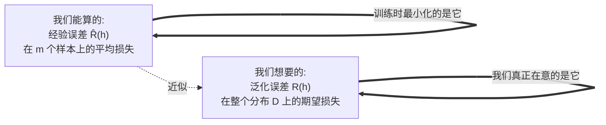
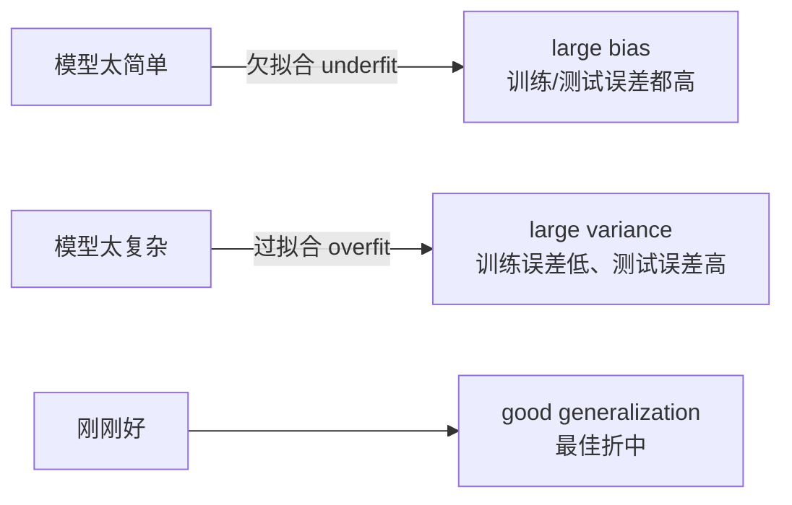
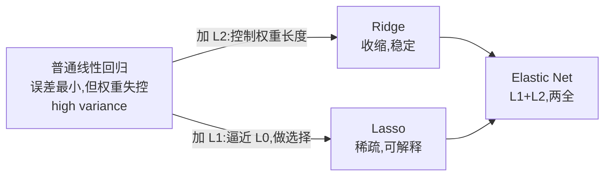
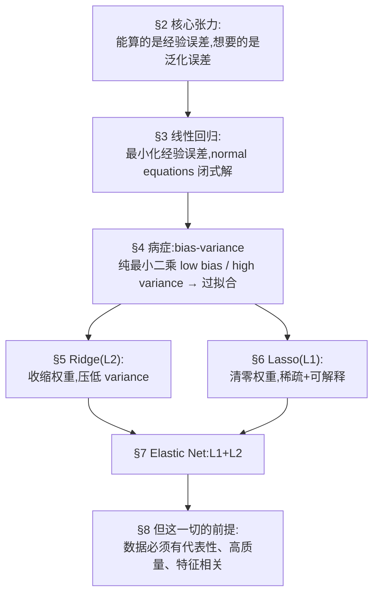

# 第三章 · 回归 (Regression)

> **学习目标 (Learning objectives)** — 读完本章你应该能够:
> - 用自己的话解释**回归 (regression)** 解决的是什么问题,并说清它与分类的根本区别;
> - 写出回归问题的形式化框架(input space、target function、loss、generalization error、empirical error),并解释我们"真正想要的"和"实际能优化的"之间的鸿沟;
> - 推导**线性回归 (linear regression)** 的 normal equations,并理解它的几何意义(正交投影);
> - 解释 **bias–variance trade-off**,并说明为什么纯最小二乘容易过拟合;
> - 区分 **Ridge**、**Lasso**、**Elastic Net** 三种正则化:各自用什么范数、对权重做了什么、什么时候选哪个;
> - 说清楚现实数据的三类毛病(non-representative、poor quality、irrelevant features)以及对应的处理手段。

回归是机器学习里最古老、也最"耐用"的一类方法。讲到这一章时老师反复强调一句话:**代码只有两三行,真正的难点在于理解每个参数背后的概念**——`model.fit(X, y)` 谁都会写,但为什么要正则化、该用 L1 还是 L2、得到的权重说明了什么,这些才是考试和实战真正考的东西。所以本章我们几乎不碰代码,而是把每个公式"读出声来",弄清它在说什么。

我们要回答的核心问题是:**给定一些输入,如何预测一个连续的数值输出?** 比如根据一个国家的人均 GDP 预测国民幸福感,根据房子的面积、位置预测房价。下面我们从这个问题的历史讲起,一步步搭起完整的数学框架,再逐个引入线性回归及其三种正则化变体,最后讨论"数据本身"这个常被忽视却决定成败的环节。

---

## 1. 回归是什么:从 Galton 的豌豆与身高说起

**回归 (regression)** 是一种**监督学习 (supervised learning)** 方法,最常用于**预测 (prediction)** 任务(稍作修改后也能用于分类)。它的名字有一段有趣的来历。

作为一种科学方法,回归大约在 **1885 年**首次出现。英国学者 **Francis Galton** 在研究**遗传身高 (hereditary stature)** 时提出了这个概念——他比较父母与子女的身高,发现一个现象:个子特别高的父母,孩子往往没那么高;个子特别矮的父母,孩子往往没那么矮——后代的身高会"回归"到群体平均值附近。"regression"(回归、回退)这个词就是这么来的。有趣的是,Galton 当时并没有把这个想法和**最小二乘法 (least squares)** 联系起来,这个数学联系是大约 **80 年后**才被建立的(Izenman 2008)。

> 📎 **拓展(超出 slides)** — 为什么叫"监督"学习?因为训练时每个输入 $x$ 都配有一个"正确答案"$y$(标签),就像有老师在旁边监督、对答案。与之相对的**无监督学习 (unsupervised learning)** 只有 $x$ 没有 $y$,要自己从数据里找结构。这个区分在下一章分类里会再次出现。

### 1.1 回归的三种规模

线性回归模型按"输入有几个、输出有几个"分成三类:

| 类型 | 输入 | 输出 | 例子 |
|------|------|------|------|
| **simple linear regression**(简单线性回归) | 一个 | 一个 | 用 GDP 预测幸福感 |
| **multiple regression**(多元回归) | 多个 | 一个 | 用面积+地段+房龄预测房价 |
| **multivariate regression**(多变量回归) | 多个 | 多个 | 用气象因子同时预测温度和湿度 |

注意中文里"多元"和"多变量"很容易混,记住分界点:**multiple 是"多输入、单输出",multivariate 是"多输出"**。

### 1.2 两套术语和一个关键自由度

回归里有两组等价的叫法,务必都认识,因为不同教材、不同老师会混用:

- 我们要预测的那个量,叫**输出 (output)**,也叫**因变量 (dependent variable)**;
- 用来做预测的那些量,叫**输入 (input)**,也叫**自变量 (independent variables)**,它们张成的空间称为 **input space(输入空间)**。

基本假设是:输出与输入之间存在**线性关系 (linearly related)**。但"线性"这个词比你想的灵活——自变量本身可以是对原始输入做了某种**非线性变换**后的结果。更精确地说,自变量可以由一组固定的非线性函数(称为 **basis functions,基函数**)的线性组合构成。

> 📎 **拓展(超出 slides)** — 这一点很重要但 slides 一笔带过:比如你想拟合一条抛物线 $y = w_0 + w_1 x + w_2 x^2$,它对 $x$ 是非线性的,但只要把 $x^2$ 当成一个"新特征",它对**权重 $w$ 仍然是线性的**。回归里所谓"线性",指的是**对权重线性**,不是对原始输入线性。这就是后面 feature mapping $\Phi$ 的全部用意——它把"对输入非线性"的问题,变回"对权重线性"的标准问题来解。

最后,我们真正想求的,是这个"关联函数"的**系数 (coefficients)**——也就是那一组权重 $w$。一旦求出系数,我们就得到一个方程,可以拿去对**新观测到的输入**做预测。这就是回归的全部目的。

---

## 2. 回归问题的数学框架:我们想要什么,又能拿到什么

slides 在这里给了一套相当形式化的定义。初学者很容易被这串符号吓退,但它其实在讲一个很朴素的故事,我们逐行翻译。

### 2.1 形式化定义

- 设 $\mathcal{X}$ 为**输入空间 (input space)**,$\mathcal{Y}$ 为实数轴 $\mathbb{R}$ 的一个可测子集(也就是输出的取值范围)。
- 存在一个**未知分布 $\mathcal{D}$**,所有输入都是按这个分布"抽"出来的。这是个关键设定:数据不是凭空来的,而是来自某个我们不知道、但客观存在的概率分布。
- 存在一个**目标标注函数 (target labelling function)** $f: \mathcal{X} \to \mathcal{Y}$——这是"上帝知道、我们不知道"的真实规律,我们的全部努力就是去逼近它。
- 学习器拿到一个**带标签样本集 (labelled sample)**

$$S = \{(x_1, y_1), \dots, (x_m, y_m)\} \in (\mathcal{X} \times \mathcal{Y})^m$$

其中 $x_1, \dots, x_m$ 是从 $\mathcal{D}$ 中**独立同分布 (i.i.d.)** 抽取的,且 $y_i = f(x_i)$。

> 📎 **拓展(超出 slides)** — **i.i.d.**(independent and identically distributed,独立同分布)是几乎所有机器学习理论的地基,slides 默认你懂。它说两件事:(1) **identically distributed**——每个样本都来自同一个分布 $\mathcal{D}$;(2) **independent**——样本之间互不影响,抽到谁不改变抽到别人的概率。直观类比:从同一副洗好的牌里反复抽一张再放回。这个假设之所以重要,是因为后面"训练集和测试集来自同一分布"正是它的直接推论——如果训练和实战的数据分布不一样,模型再好也会失灵。

### 2.2 用什么衡量"错得多离谱":损失函数

- 用一个**损失函数 (loss function)** $L: \mathcal{Y} \times \mathcal{Y} \to \mathbb{R}_+$ 来度量误差的大小。
- 最常用的是**平方误差 (squared error)**:对任意 $y, \hat{y} \in \mathcal{Y}$,

$$L(y, \hat{y}) = \|y - \hat{y}\|^2$$

读作:"真实值与预测值之差,取平方。"取平方有两个好处:一是消除正负号(预测高了和低了都算错),二是对大误差惩罚更重(差 2 倍,惩罚 4 倍),逼模型不要犯离谱的大错。
- 更一般地,可以用 **$L_p$ 损失**:$L_p(y, \hat{y}) = \|y - \hat{y}\|^p$,其中 $p \ge 1$。$p=2$ 就是平方误差,$p=1$ 就是绝对误差。

### 2.3 我们真正想要的 vs 我们实际能算的

这是整个框架最重要的一对概念,务必分清。

给定一个**假设集 (hypothesis set)** $H$(所有候选函数构成的集合,比如"所有直线"),回归问题就是用样本 $S$ 在 $H$ 里找一个假设 $h$,使得它相对于真实函数 $f$ 的**期望损失**最小。这个期望损失叫**泛化误差 (generalization error)**:

$$R(h) = \mathbb{E}_{x \sim \mathcal{D}}[L(h(x), f(x))] \tag{1}$$

这个式子在说:"在整个分布 $\mathcal{D}$ 上,我的预测 $h(x)$ 与真值 $f(x)$ 平均差多少。"——**这才是我们真正关心的**:模型在没见过的新数据上表现如何。

但问题来了:$\mathcal{D}$ 和 $f$ 我们都不知道,$R(h)$ 根本算不出来!我们手里只有 $m$ 个样本。于是退而求其次,用样本上的平均损失来近似,这叫**经验误差/经验损失 (empirical loss)**:

$$\hat{R}(h) = \frac{1}{m} \sum_{i=1}^{m} L(h(x_i), y_i) \tag{2}$$



**这一张图道破了机器学习的核心张力**:我们最小化的是 $\hat{R}(h)$(因为只有它能算),但我们真正想小的是 $R(h)$。两者不一定一致——一个在训练样本上误差为零的模型,在新数据上可能错得离谱。这个鸿沟正是后面 §4 偏差-方差权衡和 §5–§7 正则化要对付的根本问题。记住这句话,本章后半段全是它的展开。

---

## 3. 线性回归:把"拟合一条线"写成矩阵方程

### 3.1 从直觉到几何

老师在课上用了一个很形象的讲法:想象平面上撒了一堆点,你要拿一根直尺去"拟合"它们。可能的直线有无穷多条——可以这样斜、那样斜、上下平移……到处都是。**线性回归要找的,是这样一条线:当你用这条线上的值去代替每个真实点时,你"造成"的总误差最小。**

具体怎么算误差?对每个点,它的真实高度和直线在那个位置给出的高度之间有个竖直距离,这就是这个点的误差(老师叫它"我把点搬到线上,搬动了多远")。把所有点的误差平方后加起来,就是总误差。线性回归 = 找一条让这个总平方误差最小的线。


推广到高维:一维时我们找一条**线**;输入是二维(两个自变量)时,我们找的是一个**平面/超平面 (hyperplane)**——想象一张纸在三维空间里移动、倾斜,去贴近一团点,使竖直方向的总误差最小。slides 的 Figure 2 画的就是这件事:预测向量 $\hat{y}$ 是真实 $y$ 在自变量张成的超平面上的**正交投影 (orthogonal projection)**。"正交投影"这个词不是巧合——最小二乘解恰好让残差向量垂直于该超平面,这是它最优的几何标志。

### 3.2 形式化:假设集与优化目标

设 $\Phi: \mathcal{X} \to \mathbb{R}^N$ 是从输入空间到 $\mathbb{R}^N$ 的**特征映射 (feature mapping)**(回忆 §1.2:它可以是非线性的)。考虑这样一族**线性假设**:

$$H = \{x \mapsto w \cdot \Phi(x) + b : w \in \mathbb{R}^N,\ b \in \mathbb{R}\} \tag{3}$$

其中 $w$ 是权重向量,$b$ 是**偏置 (bias)**。线性回归要在 $H$ 中找**均方误差 (mean squared error)** 最小的假设。给定样本集 $S$,要解的优化问题是:

$$\min_{w, b}\ \frac{1}{m} \sum_{i=1}^{m} (w \cdot \Phi(x_i) + b - y_i)^2 \tag{4}$$

### 3.3 偏置去哪了:吸收进权重

直接处理 $w$ 和 $b$ 两个东西很麻烦。有一个标准技巧:把偏置 $b$ **吸收 (absorb)** 进权重。做法是给每个特征向量末尾添一个恒为 1 的分量,同时把 $b$ 当作对应这个"1"的权重。slides 写成:

$$y_i = w x_i + b = w' x_i + 1$$

(这里 $w'$ 是扩充后的权重,最后一维就是 $b$。)这样一来,我们就能把整个问题写成干净的矩阵形式。定义**设计矩阵 (design matrix)** $X$、权重向量 $W$、目标向量 $Y$:

$$X = \begin{bmatrix} \Phi(x_1) & \cdots & \Phi(x_m) \\ 1 & \cdots & 1 \end{bmatrix},\quad W = \begin{bmatrix} w_1 \\ \vdots \\ w_N \end{bmatrix},\quad Y = \begin{bmatrix} y_1 \\ \vdots \\ y_m \end{bmatrix}$$

那么 (4) 就紧凑地写成:

$$\min_W F(W) = \frac{1}{m} \|X^T W - Y\|^2 \tag{5}$$

为了不被矩阵维度搞晕,记住各部分的形状:$X^T \in \mathbb{R}^{m \times (N+1)}$,$W \in \mathbb{R}^{N+1}$,所以 $X^T W \in \mathbb{R}^m$,正好和 $Y \in \mathbb{R}^m$ 对得上——$X^TW - Y$ 就是 $m$ 个样本的残差向量。

### 3.4 求解:normal equations(正规方程)

这里是线性回归最漂亮的地方,也是 slides 要你"看懂为什么"的地方。目标函数 $F(W) = \frac{1}{m}\|X^TW - Y\|^2$ 有三个好性质:它是**凸的 (convex)**、**可微的 (differentiable)**、并且有一个**全局最小值 (global minimum)**。

凸 + 可微意味着:**只要找到梯度为零的点,那就一定是全局最优**——没有别的局部陷阱。于是我们对 $F(W)$ 求梯度、令其为零:

$$\nabla F(W) = 0 \ \Longrightarrow\ \frac{2}{m} X(X^T W - Y) = 0 \ \Longrightarrow\ X X^T W = X Y$$

最后一步 $XX^TW = XY$ 就是大名鼎鼎的 **normal equations(正规方程)**。解出 $W$:

$$W = \begin{cases} (X X^T)^{-1} X Y & \text{若 } X X^T \text{ 可逆} \\ (X X^T)^{\dagger} X Y & \text{否则,用伪逆 (pseudo-inverse) } \dagger \end{cases} \tag{6}$$

这个 $W$ 就是权重向量(系数)的**最小二乘估计 (least squares estimate)**。

> **🔑 例 (Worked example)** — 为什么 $\nabla F = 0$ 给出 $XX^TW = XY$?
> 把 $F(W) = \frac{1}{m}(X^TW - Y)^T(X^TW - Y)$ 展开,对 $W$ 求导用到 $\frac{\partial}{\partial W}\|X^TW-Y\|^2 = 2X(X^TW - Y)$。令它等于零,$X X^T W - XY = 0$,移项即得。**这就是 §2.3 里"最小化经验误差"在线性情形下的具体兑现**——经验误差是个二次函数,二次函数求极值就是求导置零,而且因为它是凸的,这个极值就是全局最小。

> 📎 **拓展(超出 slides)** — 老师在课上特别提醒:理论上我们有 (6) 这个**闭式解 (closed-form solution)**,一步到位。但现实中数据集可能非常大,$XX^T$ 是个巨大的矩阵,对它求逆**计算代价太高**。所以实际工程里通常改用**迭代方法**,最典型的就是**梯度下降 (gradient descent)**——不去直接求逆,而是从一个初始 $W$ 出发,沿梯度反方向一小步一小步往下挪,直到收敛。这个算法本章先按下不表,后面神经网络一章会专门讲。

### 3.5 最小二乘的"软肋"

slides 列了几条关于线性回归最小二乘解的重要提醒,每一条都是后面引入正则化的伏笔:

- **预测精度通常 low bias 但 large variance**(低偏差、高方差)——意思是它平均而言不偏,但对训练数据的微小变动非常敏感,换一批数据系数可能大变。这正是过拟合的征兆(详见 §4)。
- 当自变量很多时,我们往往**想知道哪些变量真正起关键作用**——纯最小二乘不会告诉你这件事,它给所有特征都安排上权重。
- **没有强泛化保证**:因为我们只最小化了经验误差,**完全没有控制权重向量的范数(长度)**——也就是说,**没有正则化 (no regularization)**。
- 因此存在**过拟合 (overfitting) 或欠拟合 (underfitting)** 的风险。

记住最后两条:"没有控制权重范数"是病根,而 §5–§7 的三种方法,本质上都是在给权重范数加上不同形式的约束。

### 3.6 一个完整的例子:钱能让人更幸福吗?

老师用了一个很接地气的例子(取自 Géron 2019)。问题:**人均 GDP 能预测国民的生活满意度吗?**

数据来自两个来源:OECD 网站的 **Better Life Index**(生活满意度)和 IMF 网站的**人均 GDP**。

| 国家 | 人均 GDP (USD) | 生活满意度 (0–10) |
|------|----------------|-------------------|
| Hungary | 12,240 | 4.9 |
| Korea | 27,195 | 5.8 |
| France | 37,675 | 6.5 |
| Australia | 50,962 | 7.3 |
| United States | 55,805 | 7.2 |

把这些点画到图上,会看到一个**大致线性的趋势**——越富的国家,满意度越高。注意:**"假设它是线性的"这一步本身就是一种模型选择 (model selection)**。我们选择用一条直线来建模:

$$\text{life satisfaction} = \theta_0 + \theta_1 \times \text{GDP per capita} \tag{7}$$

接下来要找的就是两个参数:截距 $\theta_0$(也就是偏置 $b$)和斜率 $\theta_1$。不同的参数给出不同的直线——slides 的 Figure 4 画了好几条:有的斜率取负、有的截距取 8,都"解释不了"数据;优化的目标就是找到那条**最好地贴合数据**的线。最终拟合结果是:

$$\text{life satisfaction} = 4.85 + 4.91 \times 10^{-5} \times \text{GDP per capita} \tag{8}$$

一旦有了这个模型,对任何一个**没有满意度数据、但有 GDP 数据**的国家,我们都能预测。比如 Cyprus 的人均 GDP 是 22,587:

$$\text{life satisfaction} = 4.85 + 4.91 \times 10^{-5} \times 22587 \approx 5.96$$

**截距的含义值得玩味**:$\theta_0 = 4.85$ 表示——按这个模型,即使一个国家 GDP 为零,国民满意度也有 4.85(老师打趣说"没人会对生活零满意,除非他已经死了,而我们不采访死人")。这正是 §1.2 说的偏置带来的自由度:没有它,直线被迫过原点,能表达的关系就受限了。

> ⚠️ **一个深刻的提醒** — 老师特别强调:模型的价值**极度依赖数据的质量**。IMF 有时发布统计说"你们国家应该很幸福",而当地人却一脸茫然——因为模型是基于数据建的,**数据本身可能有误导性**(garbage in, garbage out)。数据有多能代表你想研究的真实现象,才是真正决定成败的东西。这条线索直接通往 §8。

### 3.7 代码只有两行(但这不是重点)

老师反复演示了 Scikit-Learn 的实现,目的恰恰是说明"代码不是难点":

```python
import sklearn.linear_model
model = sklearn.linear_model.LinearRegression()   # 选模型
model.fit(X, y)                                    # 训练
model.predict(X_new)                               # 预测
```

核心就两三行。常用的库还有 Google 的 **TensorFlow** 和 Facebook 的 **PyTorch**(主要用于神经网络),而传统机器学习里 **Scikit-Learn** 几乎是首选。老师的态度很明确:**真正花时间的是数据清洗,真正需要脑子的是理解每个参数的含义**——而那取决于你对算法本身的理解。比如 `LinearRegression` 有 `fit_intercept`、`copy_X`、`tol` 等参数,不懂算法就不知道怎么设、设错了照样给你吐个数字出来,但那个数字可能是垃圾。

---

## 4. 为什么需要正则化:偏差-方差权衡

在引入 Ridge / Lasso 之前,我们必须先理解它们要解决的根本病症。这就是 **bias–variance trade-off(偏差-方差权衡)**,它是 §2.3 那对张力(经验误差 vs 泛化误差)的定量版本。

### 4.1 模型复杂度的两难

想象你不断增加模型的复杂度(比如多项式回归里不断提高次数):



slides 的 Figure 8 画的就是这个经典图景:横轴是模型复杂度,纵轴是误差。

- **训练误差 (training error)** 随复杂度增加**单调下降**——模型越复杂,越能把训练数据"背"得严丝合缝,极端情况下可以一点不差。
- **测试误差 (test error)** 却是个 **U 形**:复杂度太低时,模型连训练数据都拟合不好(**欠拟合**,large bias);复杂度太高时,模型把训练数据里的噪声也当成规律学了进去(**过拟合**,large variance),一到新数据就崩。

中间存在一个最佳复杂度——这就是**偏差与方差的权衡**:你没法同时把两者都压到最低,降低一个往往抬高另一个。

### 4.2 预测误差的三段分解

slides 给出一个更精确的说法:预测误差可以分解成**三个部分**:

1. **不可约误差 (irreducible error)**——新测试目标自身的方差,源于数据里固有的随机性,**超出我们的控制**,再好的模型也消不掉;
2. **偏差分量 (bias)**——估计的真实均值与估计的期望值之间差的平方,反映模型系统性的"偏";
3. **方差分量 (variance)**——估计自身的波动,反映模型对训练数据扰动的敏感程度。

$$\text{预测误差} = \underbrace{\text{irreducible error}}_{\text{消不掉}} + \underbrace{\text{bias}^2}_{\text{模型太简单}} + \underbrace{\text{variance}}_{\text{模型太复杂}}$$

回忆 §3.5:纯最小二乘是 **low bias, high variance**——它落在上图的右侧,容易过拟合。**那怎么办?既然 variance 太大,我们就想办法压低 variance,哪怕略微抬高一点 bias,只要总误差下降就值。** 压低 variance 的手段,就是给权重的"自由度"套上缰绳——这就是**正则化 (regularization)**,也是接下来三节的主题。

---

## 5. 岭回归:给权重套上缰绳(L2 正则化)

### 5.1 动机:控制权重的大小

回到 §3.5 的病根:普通线性回归对权重**毫无约束**,权重可以取任意值。这有两个坏处:一是可能数值不稳定(系数大到离谱、"飞出天际");二是它把所有特征一视同仁,而现实中**不同特征的重要性并不相等**。我们希望有办法把这件事"建进"模型里:**让重要的特征权重大,不那么重要的特征权重小**。

**Ridge regression(岭回归 / Kernel Ridge regression)** 就是干这个的。它的形式和线性回归很像,但在优化目标里**多加了一项**:

$$\min_W F(W) = \lambda \|W\|^2 + \|X^T W - Y\|^2 \tag{9}$$

把这个式子拆开看(老师强调这是理解的关键):

- **第二项 $\|X^TW - Y\|^2$** 就是老朋友——经验均方误差(**误差项**)。如果把第一项拿掉,(9) 就退化回普通线性回归。
- **第一项 $\lambda \|W\|^2$** 是新加的**正则化项 (regularization term)**。$\|W\|^2$ 是权重向量长度的平方(L2 范数的平方),$\lambda > 0$ 是一个控制两者**权衡 (trade-off)** 的正参数。

这一项在说什么?它说:"我**不光**要误差小,我**还**要权重短。" 因为优化器要让整个 $F(W)$ 小,而第一项随权重变大而变大,所以它会逼着权重往零靠拢——但又不能靠太狠,否则第二项(误差)会变大。两项拉锯,达成平衡。

### 5.2 求解:这次永远可逆

和线性回归一样,(9) 仍然是凸且可微的,有全局最小。对 $W$ 求导置零:

$$\nabla F(W) = 0 \iff (X X^T + \lambda I) W = X Y \iff W = (X X^T + \lambda I)^{-1} X Y \tag{10}$$

对比 (6) 和 (10),**唯一的变化是 $XX^T$ 变成了 $XX^T + \lambda I$**(在对角线上加了 $\lambda$)。这个小改动带来一个大好处:**$XX^T + \lambda I$ 永远可逆!** 

为什么?因为 $XX^T$ 是**半正定 (positive semi-definite)** 矩阵,它的特征值都 $\ge 0$;加上 $\lambda I$ 后,所有特征值都变成"原值 $+ \lambda$",而 $\lambda > 0$,于是特征值全都严格大于零,矩阵必然可逆。这解决了 (6) 里"$XX^T$ 可能不可逆、只好用伪逆"的尴尬。

岭回归还有一个等价的**约束形式**,理解正则化的几何时很有用:

$$\min_w \sum_{i=1}^{m} (w \cdot \Phi(x_i) - y_i)^2 \quad \text{subject to} \quad \|w\|^2 \le \Lambda^2 \tag{11}$$

意思是:"在权重长度不超过 $\Lambda$ 的前提下,把误差最小化。"——把权重锁在一个半径为 $\Lambda$ 的球里。

### 5.3 老师的"咸汤"妙喻(务必记住)

老师讲了一个让全班笑出声、保证忘不掉的比喻,把岭回归的精神讲透了。

> **🔑 例 (盐与肉豆蔻的汤)** — 假设你要调一锅汤,有几种配料:盐、胡椒、肉豆蔻(nutmeg)……每种配料的"用量"就是一个权重 $w_i$。你尝一口,目标是达到某个味道。
>
> 现在比较两个权重向量:$(0.2, 0.9, 1.0)$ 和 $(1.5, 2.6, 7.6)$。哪个的 $\|W\|^2$ 更小?显然是第一个。岭回归偏爱的就是第一种——**长度小、各分量都被压得比较温和**。
>
> 关键洞见:这些权重告诉你**每种配料对最终味道的贡献有多大**。如果"盐"的权重最大,意味着想调出这个味道,**盐要多放**——它最重要。岭回归做的事是:**它不会把任何一种配料的用量归零**(哪怕某种配料不太需要,它也会"留一点点,以防万一"),它只是**根据每种配料对目标的重要程度,合理地分配、并整体压小用量**,从而既稳定又能反映重要性。

这个比喻点出了岭回归的本质特征,我们正式总结如下。

### 5.4 岭回归的性质

- **它本质上是一种隐式的模型选择 (model selection) 方法**:ridge 参数 $\lambda$ 帮我们恰当地"加权"各个变量,等于在悄悄地做特征选择。
- **$\lambda$ 是调节 bias–variance 权衡的旋钮**:**$\lambda$ 越大,bias 越大、variance 越小**(权重被压得越狠,模型越"死板"但越稳定);$\lambda$ 越小,越接近无约束的最小二乘。$\lambda$ 的具体取值可以用**交叉验证 (cross-validation)** 来定(见 §8 拓展)。
- **它是一种 shrinkage estimator(收缩估计量)**:把最小二乘的权重整体**朝零收缩 (shrink towards zero)**。划重点:**是"朝零收缩",不是"变成零"**——所以你拿到的 ridge 权重往往是一堆 $0.\text{几}$ 的小值,没有一个正好是 0。这一点和下一节的 Lasso 形成鲜明对比。
- 它可以配合**正定对称核 (PDS kernels)** 使用,从而推广到**非线性回归**和更一般的特征空间——这就是"Kernel Ridge regression"里"kernel"的由来(核方法的细节在下一章分类里展开)。

### 5.5 代码与求解器

```python
from sklearn.linear_model import Ridge
ridge_reg = Ridge(alpha=1, solver="cholesky")   # alpha 就是 λ
ridge_reg.fit(X, y)
```

`alpha` 就是正则化强度 $\lambda$。`solver="cholesky"` 表示用闭式解(配合 Cholesky 分解求逆)。当**数据量和特征都很多**时,闭式解算不动,改用随机梯度:

```python
from sklearn.linear_model import SGDRegressor
sgd_reg = SGDRegressor(penalty="l2")   # penalty="l2" 即岭回归的 L2 正则
sgd_reg.fit(X, y.ravel())
```

`penalty="l2"` 点明了岭回归的数学身份就是 **L2 正则化**。老师说:**训练神经网络时用的基本就是这种随机梯度优化**——所以这里埋了通往后面章节的线。

---

## 6. Lasso 回归:把没用的特征直接清零(L1 正则化)

### 6.1 动机:我们想要一个"精简"的模型

岭回归虽好,但它**不会把任何权重变成零**。可现实中我们常常想问一个更狠的问题:**到底哪些特征是真正需要的?能不能干脆把没用的特征踢出去?** 选一个**精简的 (parsimonious / economical)** 模型,不仅更省算力,还更**可解释**。

> **🔑 例 (可解释性为什么重要)** — 老师讲了个真实例子:他请过一位纽约证券交易所的人来做讲座。对方说,美国法律规定,如果你用模型给客户建议,你必须能向客户**清楚展示**这个建议是怎么来的、对应现实中哪些具体因素。所以哪怕神经网络更强,他们也被迫用"原始"但**透明**的模型。同理,医生用模型开药,他需要知道"为什么"——这个特征是心率、那个是体温,他能理解;而如果特征是"鞋长的某种古怪线性组合",没人敢用。能让你看清"哪个特征贡献了什么"的模型,叫**可解释模型 (interpretable model)**。

在 Lasso 之前,传统的**变量选择 (variable selection)** 方法有两种,都基于 **F 检验**:

- **后向消元 (backward elimination)**:从全部变量开始,每步剔除 $F$ 比值最小的那个变量,重新拟合,迭代:

$$F = \frac{(RSS_0 - RSS_1)/(df_0 - df_1)}{RSS_1 / df_1} \tag{12}$$

(其中 $RSS_0$ 是简化模型的残差平方和、自由度 $df_0$;$RSS_1$ 是较大模型的、自由度 $df_1$。)
- **前向选择 (forward selection)**:从空集开始,每步加入能带来最大 $F$ 值的变量。

这些方法有效但笨重(要反复拟合)。Lasso 提供了一种更优雅的、一步到位的做法。

### 6.2 Lasso 是什么:L1 范数登场

**Lasso = Least Absolute Shrinkage and Selection Operator**(最小绝对值收缩与选择算子)。光看名字就知道它**同时做收缩 (shrinkage) 和选择 (selection)**。

它的形式和岭回归几乎一样,**唯一的区别是把 L2 范数换成了 L1 范数**:

$$\min_{w, b} F(w, b) = \lambda \|w\|_1 + \sum_{i=1}^{m} (w \cdot x_i + b - y_i)^2 \tag{14}$$

等价的约束形式:$\min \sum (w\cdot x_i + b - y_i)^2$ s.t. $\|w\|_1 \le \Lambda_1$。这是一个**二次规划 (Quadratic Program)**,可以用 QP 求解器解。

(一个小限制:Lasso **不方便**直接套用 PDS 核,所以这里假设输入空间就是 $\mathbb{R}^N$。)

那么不同范数到底什么区别?这是本节的核心,我们专门讲。

### 6.3 三种范数:L0、L1、L2

| 范数 | 定义 | 直观含义 | 可优化性 |
|------|------|----------|----------|
| **$L_0$** | 非零分量的**个数** | "我用了几个特征" | ❌ 不易计算(组合爆炸) |
| **$L_1$** | $\sum_i \lvert w_i \rvert$(绝对值之和) | $L_0$ 的最佳"可计算替身" | ✅ 凸,可优化 |
| **$L_2$** | $\sqrt{\sum_i w_i^2}$(平方和开根) | 权重的"长度" | ✅ 光滑,可优化 |

老师把这条逻辑链讲得很清楚:**我们真正想做的,其实是最小化 $L_0$ 范数**——也就是让"非零权重的个数"尽量少,这样没用的特征系数就是 0,模型自然精简。**但 $L_0$ 范数没法直接优化**(它是离散的、不连续的,优化技术搞不定)。于是我们找一个**最接近、又可计算的替身 (surrogate)**——这就是 **$L_1$ 范数**。用 $L_1$ 去逼近 $L_0$,就能在可计算的前提下,达到"逼着一部分权重恰好变成 0"的效果。

**这正是 Lasso 与 Ridge 的根本分野**:Ridge(L2)把权重朝零**收缩**但**不清零**;Lasso(L1)会把不重要特征的权重**直接压成 0**——也就是产生**稀疏解 (sparse solution)**:只有少数几个非零分量。回到咸汤的比喻——Lasso 允许你说"这道汤根本不用放盐",直接把盐的用量设为零。

### 6.4 为什么 L1 会产生稀疏:几何直觉

为什么换个范数,效果就从"收缩"变成"清零"?slides 的 Figure 6 用一张图道破天机(老师在课上拿笔比划的就是它)。

把优化问题想成:目标函数(误差)的等高线是一圈圈**椭圆 (ellipsoids)**,它们的中心是无约束最优解;而正则化约束是一个"球"。最优的正则化解,出现在**椭圆等高线第一次碰到这个球**的地方。

- **L2 的球是圆的**(光滑无棱角)。椭圆碰到圆,接触点几乎总在某个"斜"的位置——$x$ 和 $y$ 坐标都非零。所以 L2 给你两个都不为零的小权重。
- **L1 的球是个菱形/方块**(有尖角,尖角正好落在坐标轴上)。椭圆去碰这个菱形,**最容易碰在尖角处**,而尖角在坐标轴上意味着**某些坐标恰好为 0**。所以 L1 自然地把一部分权重清零,产生稀疏。


一句话记住:**圆没有角,所以不清零;菱形的角恰好在轴上,所以清零。** 这就是 L1 promotes sparsity 的几何根源。

### 6.5 代码

```python
from sklearn.linear_model import Lasso
lasso_reg = Lasso(alpha=0.1)
lasso_reg.fit(X, y)
```

---

## 7. 弹性网络:两全其美(L1 + L2 一起上)

### 7.1 动机与形式

既然 Ridge 和 Lasso 各有所长,能不能**同时用**?能——这就是 **Elastic Net regularization(弹性网络正则化)**,它把 lasso 和 ridge 两种惩罚**叠加**起来:

$$\min_{w, b} F(w, b) = \lambda \|w\|_1 + \beta \|W\|_2^2 + \sum_{i=1}^{m} (w \cdot x_i + b - y_i)^2 \tag{15}$$

看式子:**第一项是 L1(来自 Lasso,负责清零、做选择)**,**第二项是 L2(来自 Ridge,负责收缩、保稳定)**,第三项还是误差。

老师描述了它的**两阶段 (two stages)** 工作方式:**先**找到 ridge 回归的系数(L2 收缩,保证稳定),**再**用 lasso 式的收缩对这些系数做第二步处理(L1 清零,踢掉没用的)。

### 7.2 什么时候用 Elastic Net?

课堂上有同学问了一个好问题:既然 Lasso 已经能把没用的特征清零,为什么还需要 Ridge 那部分?

老师的回答:有时候**解并不集中在一个区域**。如果你要找的答案散落在**不同的、不相连的子空间 (disparate subspaces)** 里,单纯的 ridge 或 lasso 可能照顾不全。Elastic Net 的策略是——**先用 ridge 把"哪些区域有好东西"大致圈出来(分组、保稳),再用 lasso 在其中精细地剔除真正没用的**。所以当特征之间有**分组结构**、或解分布在多个子空间时,Elastic Net 往往比单一方法更稳健。

> 📎 **拓展(超出 slides 的细节)** — slides 还提到一个相关概念:当特征空间**天然地被划分成若干子集**、而我们希望**整组整组地**选入或剔除特征时,合适的范数是 **group / mixed norm $L_{2,1}$**——它是 $L_1$ 和 $L_2$ 的组合(组内用 L2、组间用 L1),实现"按组稀疏"。

### 7.3 代码

```python
from sklearn.linear_model import ElasticNet
elastic_net = ElasticNet(alpha=0.1, l1_ratio=0.5)   # l1_ratio 控制 L1/L2 的比例
elastic_net.fit(X, y)
```

### 7.4 三种正则化总览

| 方法 | 惩罚项 | 范数 | 对权重的作用 | 产生稀疏? | 典型用途 |
|------|--------|------|--------------|------------|----------|
| **Linear**(无正则) | 无 | — | 不约束 | 否 | 基线;特征少且干净 |
| **Ridge** | $\lambda\|W\|^2$ | L2 | 朝零**收缩**,不清零 | 否 | 稳定化;隐式加权所有特征 |
| **Lasso** | $\lambda\|w\|_1$ | L1 | 把不重要的**清零** | ✅ 是 | 特征选择;要可解释/精简模型 |
| **Elastic Net** | $\lambda\|w\|_1 + \beta\|W\|^2$ | L1+L2 | 先收缩再清零 | ✅ 是 | 特征分组/解分布在多个子空间 |



---

## 8. 数据处理:再好的算法也救不了烂数据

老师在讲完算法后,郑重地转向一个常被低估的话题——**数据本身**。他的话很扎心:"过去我们用偏微分方程去描述现象;现在我们说'让数据替我们说话'。**但如果数据不好,它说出来的就是胡话**,而你还不知道。" 优化本质上是一个**搜索过程 (search process)**——一个坏数据点可能把这个搜索带向完全错误的方向。数据问题分三类。

### 8.1 非代表性数据 (Non-representative Data)

- 要让模型能**泛化 (generalise)**,训练数据必须能**代表**部署后会遇到的新数据(生产数据)。
- 用 §2.1 的语言说:**训练数据和生产数据背后的概率分布必须是同一个**(这正是 i.i.d. 假设在现实中的兑现)。如果你在分布 A 上训练、却到分布 B 上测试/部署,模型必然失灵。
- 解决之道是**恰当的采样**:既不能太少(避免 **sampling noise,采样噪声**),也要保证代表性(避免 **sampling bias,采样偏差**)。

> **🔑 例 (幸福感调查)** — 回到 §3.6 的例子。你没钱给全世界每个人发问卷,只能抽样调查若干国家。但你要确保抽到的国家**有高收入、中等、低收入的合理分布**(spread),这样模型才能代表"GDP 与幸福"的真实关系。如果你只调查了富国,模型就带上了 sampling bias。

### 8.2 低质量数据 (Poor Quality Data)

毛病来源:**errors(错误)、outliers(离群点)、noise(噪声)**。

- **Outliers(离群点)**:手动**剔除或修正**。例:某测量设备长期没校准,某次开机吐出一个离谱的数,被记录进数据集——这种点会把模型带偏。
- **Missing values(缺失值)**:几种策略——若某特征缺失太多,干脆**忽略该特征**;或用**中位数(或均值)填补**缺失值(这一步叫 **imputation,插补**);或者训练两个模型,一个带该特征、一个不带,做对比。

> **🔑 例 (Pima 印第安人糖尿病数据集)** — 老师举了一个著名的真实例子。这个数据集里有人的"心率 = 0"。心率为零意味着人已经死了——显然是采集时的**错误**。你不能盲目把这条记录扔掉,而要判断:这是 outlier、error 还是别的?然后把这个不合理的值**修正/插补**成有意义的数(imputation)。这就是数据清洗里最考验判断力的部分。

### 8.3 无关特征 (Irrelevant Features)

- 这些特征**不给模型带来任何新信息**,却平白增加复杂度和过拟合风险。
- **Feature engineering(特征工程)** 可以解决无关特征问题,具体有两条路:
  - **Feature selection(特征选择)**:从现有特征里挑出最有用的。**这里正是 Lasso / Elastic Net 大显身手的地方**——通过 L1 正则化,模型会**隐式地**把无关特征的权重压成零,等于自动帮你做了特征选择(呼应 §6)。
  - **Feature extraction(特征提取)**:把多个特征**组合**成更有用的新特征。典型代表是**降维 (dimensionality reduction)**,比如 **PCA(主成分分析)** 或 **autoencoder(自编码器)**——把高维空间映射到一个低维空间。

> 📎 **拓展(超出 slides)** — PCA 与 Lasso 的可解释性对比(老师课上特意点出):Lasso 是从**原始特征**里挑,挑出来的还是原来那些可解释的特征(心率、体温……);而 PCA 把所有特征**揉成新的线性组合**,这些新特征(主成分)虽然按重要性排好了序,却**不再可解释**——你没法告诉医生"主成分 1"是什么。所以需要可解释性时用 Lasso,只求降维不在乎可解释时才用 PCA。

> 📎 **拓展(延伸阅读)** — 老师强烈推荐 **Géron (2019) 的 Chapter 2**,作为机器学习系统端到端设计(尤其是数据处理)的极佳参考。另一本经典是 Hastie & Tibshirani 的 *The Elements of Statistical Learning*——顺便一提,**Ridge 正是 Hastie 和 Tibshirani 提出的**。

---

## 9. 把整章串起来:一条主线

回头看,本章其实是同一个故事的层层递进:



从"我们想要泛化、却只能优化经验误差"这一根本张力出发,线性回归给了我们一个干净的闭式解,但它高方差、易过拟合;为了治这个病,我们用正则化给权重套缰绳——L2 收缩(Ridge)、L1 清零(Lasso)、两者结合(Elastic Net);而所有这些算法,最终都建立在"数据是否可靠"这块地基上。

---

## 本章小结 (Key takeaways)

- **回归是监督学习,预测连续数值输出;它的核心张力是:我们能优化的是样本上的经验误差 $\hat{R}(h)$,但真正想小的是整个分布上的泛化误差 $R(h)$。** 两者的鸿沟就是过拟合的根源。
- **线性回归通过最小化均方误差求解。** 由于目标函数凸且可微,令梯度为零得到 normal equations $XX^TW = XY$,闭式解 $W = (XX^T)^{-1}XY$;几何上,预测是真值在特征超平面上的正交投影。数据量大时改用梯度下降迭代求解。
- **纯最小二乘 low bias 但 high variance,且不控制权重范数(无正则化),容易过拟合。** 这是引入正则化的根本动机。
- **Ridge(L2 正则)给目标函数加 $\lambda\|W\|^2$,把权重朝零收缩但不清零;它使 $XX^T+\lambda I$ 永远可逆,是一种 shrinkage estimator,$\lambda$ 越大 bias 越大、variance 越小。** 记住"咸汤比喻":它按重要性给所有配料分配用量,但一种都不归零。
- **Lasso(L1 正则)的目标是最小化 $L_0$(非零特征个数),但 $L_0$ 不可优化,故用 $L_1$ 作替身;L1 的菱形约束有落在坐标轴上的尖角,因此产生稀疏解、把无关特征清零,实现自动特征选择和可解释性。**
- **Elastic Net 同时用 L1+L2,先 ridge 收缩、再 lasso 清零,适合特征分组或解分布在多个子空间的情形。**
- **再好的算法也救不了烂数据。** 三类数据问题:non-representative(需保证训练与生产同分布,避免采样噪声/偏差)、poor quality(处理 errors/outliers/missing values,如中位数插补)、irrelevant features(用特征选择如 Lasso,或特征提取如 PCA/autoencoder 降维)。
