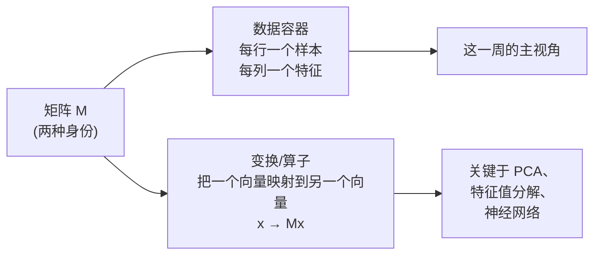
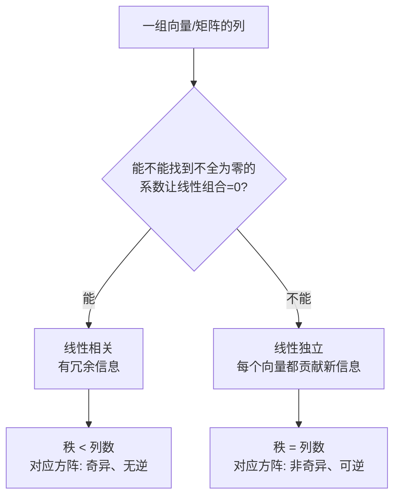
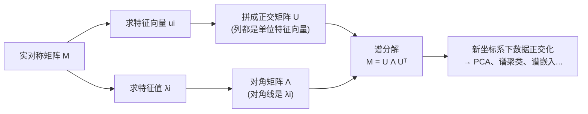
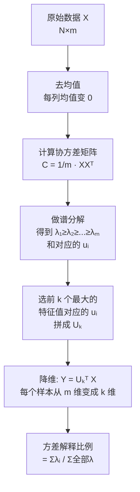
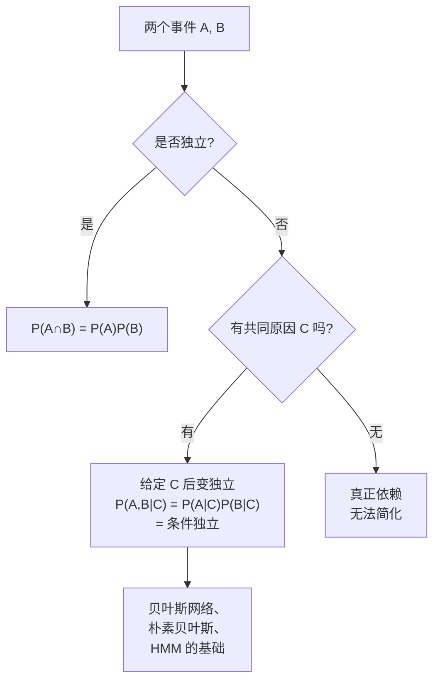
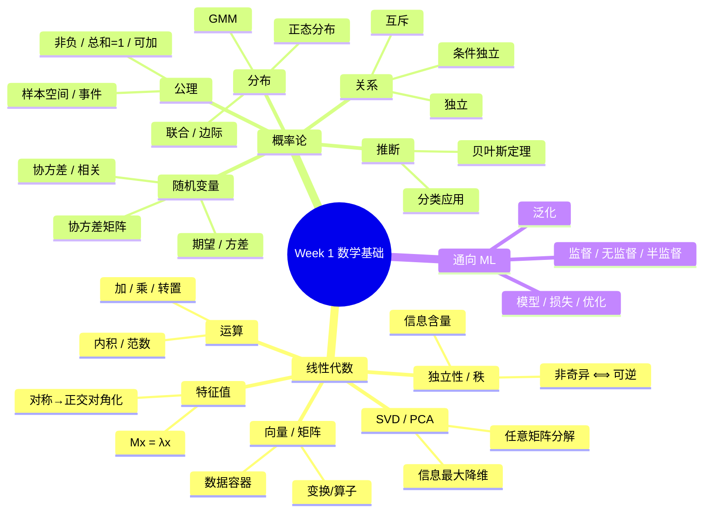

# CSCI933 第 1 周 · 机器学习的数学基础

> **学习目标 (Learning objectives)** — 读完本章你应该能够:
> - 用**向量** (vector) 和**矩阵** (matrix) 来描述一个数据集,并解释为什么数据科学家会自然地选择这种结构。
> - 进行向量和矩阵的基本运算 (加法、乘法、转置、求逆),并解释每一种运算"在数据上做了什么"。
> - 解释**内积** (inner product)、**范数** (norm)、**正交性** (orthogonality) 在度量"相似度"和"距离"上的作用。
> - 判断一个特征矩阵是否**线性独立** (linearly independent),并理解为什么这是"好数据"的标志。
> - 解释**特征值** (eigenvalue) 与**特征向量** (eigenvector) 的几何意义,并把它和 PCA、降维联系起来。
> - 用 SVD 和 PCA 把一个高维数据集压缩到低维,并理解"保留了什么、丢掉了什么"。
> - 用**样本空间** (sample space)、**事件** (event)、**概率函数** (probability function) 描述一个随机现象。
> - 区分**独立** (independence)、**互斥** (mutually exclusive)、**条件独立** (conditional independence) 这三种关系。
> - 解释**期望** (expectation)、**方差** (variance)、**协方差矩阵** (covariance matrix) 各自度量了什么。
> - 用**贝叶斯规则** (Bayes' rule) 把"测量结果"反过来转成"类别概率",并理解这就是分类的基础。

---

这一周的内容看起来像"复习高中和本科一年级的数学",但其实它在做一件非常具体的事情:把机器学习里**每一个核心操作**翻译成你能用计算器或代码算出来的数学语言。Philip 老师在录音里反复强调一句话——"I will speak the mathematics"——意思是:我们不会只在黑板上写一堆符号,而是会去说**那些符号到底在数据上做了什么**。这一周分成两半:**线性代数** (linear algebra) 教我们怎么*整齐地装*数据,**概率论** (probability theory) 教我们怎么*描述数据里的不确定性*。这两套语言加在一起,几乎覆盖了机器学习全部的"底层语法"。

---

# 第一部分 · 线性代数 Linear Algebra

## §1 数据科学家的问题:从人到向量

假设你刚入职一家公司,老板交给你一个任务:**去那间教室,把每个学生"用数据描述出来"**。你立刻面对的第一个问题是——*用什么*来描述?

如果只测身高 (height),问题很明显:这间教室一百多个人,身高相同的人一抓一大把,你描述完根本无法把张三和李四分开。所以你需要更多的"识别量"。Philip 在课堂上举的例子是:**height, weight, neck circumference, waist circumference, age** 这五样。直觉上你已经在做一件很重要的事情——**追求唯一性 (uniqueness)**:每加一个测量维度,两个人"撞描述"的概率就指数级下降。这就是为什么后面我们总说"特征越多越好"——并不是越多越准,而是越多越能把每个样本和其他样本区分开来。

> 📎 **拓展 (超出 slides)** — 这五个量,每一个都不是事先确定的数,而是"会因人而异、范围内任意取值"的——这种量数学上叫做 **random variable (随机变量)**。后面我们会再正式定义它,这里先记住一句话:**每个特征其实都是一个随机变量**,而我们要做的事情就是同时观察很多随机变量。

把这五个数装在一起,最自然的数据结构就是一个**数组** (array)——也就是计算机科学里的 array,数学里的**向量** (vector)。我们把它写成一列数:

$$
\mathbf{x} = \begin{bmatrix} x_1 \\ x_2 \\ x_3 \\ x_4 \\ x_5 \end{bmatrix}
$$

这叫**列向量** (column vector)。如果把它"放倒"写成一行,就叫**行向量** (row vector),记作 $\mathbf{x}^T$ 或 $\mathbf{x}'$——这里的 $T$ 是 **transpose (转置)** 的意思,你可以理解为"把向量顺时针旋转 90 度"。

举一个具体的例子。假设某个学生身高 1.5 米、体重 75.2 公斤、脖围 41.3 厘米、腰围 81.28 厘米、年龄 35.5 岁,那么:

$$
\mathbf{x} = \begin{bmatrix} 1.5 \\ 75.2 \\ 41.3 \\ 81.28 \\ 35.5 \end{bmatrix}, \qquad
\mathbf{x}^T = \begin{bmatrix} 1.5 & 75.2 & 41.3 & 81.28 & 35.5 \end{bmatrix}
$$

> **🔑 例 (Worked example)** — 现在请回答一个问题:为什么我们要专门区分行向量和列向量?它们装的不是同样的五个数吗?
>
> 答案是:**乘法操作对"朝向"敏感**。后面你会看到,$\mathbf{x}^T \mathbf{y}$ 给你一个数(一个标量),但 $\mathbf{x} \mathbf{y}^T$ 给你一个矩阵——形状完全不一样。所以"立着"还是"躺着"决定了你能和谁相乘、得到什么形状。

## §2 矩阵:整个数据集的容器

一个学生是一个向量。但一整个班——150 个学生——是什么?Philip 在课堂上把这个问题抛给了大家,答案脱口而出:**矩阵** (matrix)。

我们把每个学生的向量横过来当作矩阵的一行,把 150 个学生堆叠成 150 行:

$$
\mathbf{M} = \begin{bmatrix}
1.5 & 75.2 & 41.3 & 81.28 & 35.5 \\
1.75 & 80.6 & 46.7 & 102.5 & 45 \\
1.82 & 69.3 & 42.5 & 83.5 & 30 \\
\vdots & \vdots & \vdots & \vdots & \vdots
\end{bmatrix}
$$

这是一个 $n \times d$ 的矩阵——$n$ 是学生数(行数),$d$ 是特征数(列数)。一般写作 $\mathbf{M} \in \mathbb{R}^{n \times d}$。它的**转置** $\mathbf{M}^T$ 就是把行变成列、列变成行,变成 $d \times n$。

> **🔑 例** — 看一下下面这个 $3 \times 5$ 的小矩阵 $\mathbf{M}$ 和它的 $5 \times 3$ 转置 $\mathbf{M}^T$:
> $$
> \mathbf{M} = \begin{bmatrix} 1.5 & 75.2 & 41.3 & 81.28 & 35.5 \\ 1.75 & 80.6 & 46.7 & 102.5 & 45 \\ 1.82 & 69.3 & 42.5 & 83.5 & 30 \end{bmatrix}, \quad
> \mathbf{M}^T = \begin{bmatrix} 1.5 & 1.75 & 1.82 \\ 75.2 & 80.6 & 69.3 \\ 41.3 & 46.7 & 42.5 \\ 81.28 & 102.5 & 83.5 \\ 35.5 & 45 & 30 \end{bmatrix}
> $$
> 注意:**原矩阵的第 $i$ 行变成了转置矩阵的第 $i$ 列**。

我们用 $m_{ij}$ 表示矩阵第 $i$ 行第 $j$ 列的那一项,**第一个下标永远是行,第二个下标永远是列**——这个约定贯穿整个线性代数,记错就全错。

**矩阵的两种身份。** 矩阵有一个微妙之处:它可以被理解为两件不同的东西。

1. **数据容器** (data container):像上面这样,每一行是一个样本,每一列是一个特征。这是我们这一周的主视角。
2. **变换** (transformation):把一个向量"变形"成另一个向量。比如旋转、拉伸、投影。后面讲特征值的时候你会看到,这一视角对理解 PCA 至关重要。

Philip 把这件事称作"a matrix is a kind of transformation"——矩阵不只是一张表,它还是一个**作用在向量上的算子**。Fourier transform 就是一个典型的例子:它是一个矩阵,把"时间空间"里的信号变换到"频率空间"里。

## §3 矩阵的代数运算

### 加法

矩阵加法非常简单——**对应位置相加**,前提是两个矩阵的形状必须**兼容** (compatible),即行数和列数都相同。比如:

$$
\begin{bmatrix} 4.6 & 5.7 & 6.1 \\ 2.4 & 3.6 & 4.7 \\ 3.5 & 5.3 & 9.5 \end{bmatrix} + \begin{bmatrix} 3.5 & 6.2 & 1.0 \\ 1.5 & 3.7 & 3.3 \\ 4.1 & 8.7 & 7.5 \end{bmatrix} = \begin{bmatrix} 8.1 & 11.9 & 7.1 \\ 3.9 & 7.3 & 8.0 \\ 7.6 & 14.0 & 17.0 \end{bmatrix}
$$

形状不一样的两个矩阵**不能相加**——一个 $3\times 3$ 加一个 $4\times 4$,这件事没有定义。

### 乘法

矩阵乘法是机器学习里出现最频繁的运算,**没有之一**。它也是初学者最容易出错的地方,因为它**既不是逐元素相乘,也不是任意两矩阵都能乘**。

**乘法的形状规则**:$\mathbf{A}$ 的形状是 $m \times n$,$\mathbf{B}$ 的形状是 $n \times d$,那么 $\mathbf{C} = \mathbf{AB}$ 的形状是 $m \times d$。**第一个矩阵的列数必须等于第二个矩阵的行数**,否则不兼容。

**乘法的元素规则**:

$$
c_{ij} = \sum_{k=1}^{n} a_{ik} \cdot b_{kj}
$$

用话说就是:**结果矩阵的第 $i$ 行第 $j$ 列那一项**,等于 $\mathbf{A}$ 的**第 $i$ 行**和 $\mathbf{B}$ 的**第 $j$ 列**逐元素相乘再求和。

> **🔑 例** — 一个 $3 \times 4$ 矩阵乘一个 $4 \times 3$ 矩阵,得到一个 $3 \times 3$ 矩阵:
> $$
> \mathbf{M} = \begin{bmatrix} 4.6 & 5.7 & 6.1 & 5.5 \\ 2.4 & 3.6 & 4.7 & 4.9 \\ 3.5 & 5.3 & 9.5 & 8.5 \end{bmatrix} \times \begin{bmatrix} 3.5 & 6.2 & 1.0 \\ 1.5 & 3.7 & 3.3 \\ 4.1 & 8.7 & 7.5 \\ 7.5 & 4.1 & 9.5 \end{bmatrix} = \begin{bmatrix} 90.91 & 125.23 & 121.41 \\ 69.82 & 89.18 & 96.08 \\ 122.90 & 158.81 & 172.99 \end{bmatrix}
> $$
> 让我们手算一项:
> $$ m_{11} = 4.6 \times 3.5 + 5.7 \times 1.5 + 6.1 \times 4.1 + 5.5 \times 7.5 = 90.91 $$
> 这是 $\mathbf{A}$ 的第 1 行 $(4.6, 5.7, 6.1, 5.5)$ 和 $\mathbf{B}$ 的第 1 列 $(3.5, 1.5, 4.1, 7.5)$ 的内积。Philip 在课堂上说:"Bring in your calculator, put a cup of coffee right next to it, and just work it out"——一定要亲手算几个,光看公式记不住。

**矩阵-向量乘法** 是矩阵乘法的一个特例:把向量看成一个"只有一列的矩阵"。

$$
\mathbf{y} = \mathbf{M}\mathbf{x}, \qquad y_i = \sum_{j=1}^{d} m_{ij} x_j
$$

举例:

$$
\begin{bmatrix} 4.6 & 5.7 & 6.1 & 5.5 \\ 2.4 & 3.6 & 4.7 & 4.9 \\ 3.5 & 5.3 & 9.5 & 8.5 \end{bmatrix} \times \begin{bmatrix} 4.1 \\ 8.7 \\ 7.5 \\ 1.5 \end{bmatrix} = \begin{bmatrix} 122.45 \\ 83.76 \\ 144.46 \end{bmatrix}
$$

矩阵-向量乘法的关键意义就是前面提到的"变换"——这个矩阵 $\mathbf{M}$ "作用在"向量 $\mathbf{x}$ 上,把它从一个空间映射到另一个空间。在神经网络里,**每一层本质上就是一个矩阵-向量乘法**(再加上一个非线性激活函数),所以理解这件事极其关键。

### 乘法不可交换!

这是一条**必须刻在脑子里**的规则:

$$
\mathbf{AB} \neq \mathbf{BA} \quad \text{(一般情况下)}
$$

举一个具体的反例:令 $\mathbf{A} = \begin{bmatrix} 1 & 2 \\ 3 & 4 \end{bmatrix}$,$\mathbf{B} = \begin{bmatrix} 5 & 6 \\ 7 & 8 \end{bmatrix}$,则:

$$
\mathbf{AB} = \begin{bmatrix} 19 & 22 \\ 43 & 50 \end{bmatrix}, \qquad \mathbf{BA} = \begin{bmatrix} 23 & 34 \\ 31 & 46 \end{bmatrix}
$$

两个完全不同的结果。再举一个更极端的:

$$
\begin{bmatrix} 1 & 2 \\ 3 & 6 \end{bmatrix} \times \begin{bmatrix} 2 & 4 \\ -1 & -2 \end{bmatrix} = \begin{bmatrix} 0 & 0 \\ 0 & 0 \end{bmatrix}
$$

但反过来:

$$
\begin{bmatrix} 2 & 4 \\ -1 & -2 \end{bmatrix} \times \begin{bmatrix} 1 & 2 \\ 3 & 6 \end{bmatrix} = \begin{bmatrix} 14 & 28 \\ -7 & -14 \end{bmatrix}
$$

这个例子还告诉你另一件事:**两个非零矩阵相乘,结果可以是零矩阵**——这在普通数字里是不可能发生的,所以矩阵世界里的直觉和数字世界里的直觉不一样。

### 转置的规则

转置有几条非常常用的恒等式,记住即可:

$$
(\mathbf{A}\mathbf{B})^T = \mathbf{B}^T \mathbf{A}^T
$$

注意**顺序反过来了**——这是必须记住的。还有:

$$
(\mathbf{A}^T)^T = \mathbf{A}, \qquad (\mathbf{A} + \mathbf{B})^T = \mathbf{A}^T + \mathbf{B}^T
$$

## §4 几类特殊的矩阵

在机器学习的论文和教材里,你会反复看到一些专有名字描述矩阵的"形状"。这些名字本身不难,但你必须形成一种条件反射——看到名字就知道形状,看到形状就知道能做什么。

| 类别 | 定义 | 例子 | 为什么重要 |
|---|---|---|---|
| **方阵** (Square) | 行数 = 列数 ($d \times d$) | $3\times 3$, $5\times 5$ | 只有方阵才谈"特征值""逆"等概念 |
| **对称** (Symmetric) | $m_{ij} = m_{ji}$ | $\begin{bmatrix} 1 & 2 & 4 & 5 \\ 2 & -8 & 8 & 1 \\ 4 & 8 & 5 & 3 \\ 5 & 1 & 3 & 7 \end{bmatrix}$ | 协方差矩阵就是对称的;特征值都是实数 |
| **反对称** (Skew-symmetric) | $m_{ij} = -m_{ji}$ (对角线 = 0) | $\begin{bmatrix} 0 & -2 & 4 & -5 \\ 2 & 0 & 8 & 1 \\ -4 & -8 & 0 & 3 \\ 5 & -1 & -3 & 0 \end{bmatrix}$ | 与旋转、反射相关 |
| **非负** (Non-negative) | 所有 $m_{ij} \geq 0$ | $\begin{bmatrix} 1 & 2 & 0 & 5 \\ 2 & 8 & 8 & 1 \\ 4 & 8 & 5 & 3 \\ 5 & 0 & 3 & 7 \end{bmatrix}$ | 图像、计数数据天然非负 (NMF, LDA) |
| **单位矩阵** (Identity) $\mathbf{I}$ | 对角线全 1、其余全 0 | $\begin{bmatrix} 1 & 0 & 0 & 0 \\ 0 & 1 & 0 & 0 \\ 0 & 0 & 1 & 0 \\ 0 & 0 & 0 & 1 \end{bmatrix}$ | $\mathbf{IM} = \mathbf{MI} = \mathbf{M}$,矩阵世界里的"1" |
| **对角矩阵** (Diagonal) | 仅对角线非零 | $\text{diag}(4,6,2,1)$ | 计算极快,$\mathbf{D}\mathbf{x}$ 就是"每个分量乘一个数" |

单位矩阵的对角线常用 **Kronecker delta** 函数来描述:

$$
\delta_{ij} = \begin{cases} 1, & \text{if } i = j \\ 0, & \text{otherwise} \end{cases}
$$

也就是 $\mathbf{I}$ 的元素就是 $\delta_{ij}$。这个记号在物理和机器学习论文里也很常见,要认识。

对角矩阵的简写是 $\text{diag}(m_{11}, m_{22}, \ldots, m_{dd})$——只列对角线那 $d$ 个数即可,因为其余位置已知都是 0。

## §5 内积、范数、角度:度量"相似"和"距离"

到这里我们都还在做"记账"——加加乘乘。下一步,我们要让矩阵和向量帮我们回答**真正的问题**:两个数据点有多相似?它们离原点多远?

### 内积 (Inner product / Scalar product)

两个相同维度的向量 $\mathbf{x}$ 和 $\mathbf{y}$,它们的**内积**(又叫**标量积** scalar product 或**点积** dot product)定义为:

$$
\mathbf{x}^T \mathbf{y} = \sum_{i=1}^{d} x_i y_i = \mathbf{y}^T \mathbf{x}
$$

结果是**一个数**(标量)。注意三件事:

1. 它对两个向量是**对称**的——交换次序不影响结果。
2. 它需要两个向量**同维度**,否则求和那里对不上。
3. 它本质上就是逐项相乘再加起来,简单到爆,但用处大得吓人。

> **🔑 例 (Inner product)** — 设 $\mathbf{x} = (1, 3, 4, 6, 8)^T$,$\mathbf{y} = (5, 1, 0, 2, 7)^T$,那么:
> $$ \mathbf{x}^T \mathbf{y} = 1\times 5 + 3\times 1 + 4\times 0 + 6\times 2 + 8\times 7 = 76 $$

### 范数 (Norm) / 向量的长度

向量的**欧几里得范数** (Euclidean norm),也叫**模长** (magnitude) 或**长度** (length),记作 $\|\mathbf{x}\|$:

$$
\|\mathbf{x}\| = \sqrt{\mathbf{x}^T \mathbf{x}} = \sqrt{x_1^2 + x_2^2 + \cdots + x_d^2}
$$

注意:这是高中学过的二维"勾股定理"在 $d$ 维空间的自然推广。如果 $\|\mathbf{x}\| = 1$,我们说 $\mathbf{x}$ 是一个**单位向量** (normalized vector / unit vector)。把任何非零向量除以它自己的范数,就可以**归一化** (normalize) 它——这一步在机器学习的预处理里出现得非常频繁。

> **🔑 例 (Magnitude)** — 同样的 $\mathbf{x}$ 和 $\mathbf{y}$:
> $$ \|\mathbf{x}\| = \sqrt{1+9+16+36+64} = \sqrt{126} \approx 11.23 $$
> $$ \|\mathbf{y}\| = \sqrt{25+1+0+4+49} = \sqrt{79} \approx 8.89 $$

### 角度 (Angle)

两个向量之间的夹角 $\theta$ 由内积公式给出:

$$
\cos\theta = \frac{\mathbf{x}^T \mathbf{y}}{\|\mathbf{x}\| \cdot \|\mathbf{y}\|}
$$

这个公式说的是什么?**内积衡量两个向量"指向同一方向"的程度**——所以又叫做"共线性" (colinearity) 的度量,也是机器学习里"相似度" (similarity) 的最基础形式 (除了一个尺度因子)。

> **🔑 例 (Angle)** — 上面 $\mathbf{x}, \mathbf{y}$ 之间的角度:
> $$ \theta = \arccos \frac{76}{11.23 \times 8.89} = \arccos(0.761) \approx 0.707 \text{ radians} $$
> (约 40.5 度)

### 三个重要的特殊情况

| 情况 | 数学条件 | 几何意义 |
|---|---|---|
| **正交** (Orthogonal) | $\mathbf{x}^T \mathbf{y} = 0$ | 两个向量"垂直",$\theta = 90°$ |
| **共线** (Colinear) | $\mathbf{x}^T \mathbf{y} = \|\mathbf{x}\| \cdot \|\mathbf{y}\|$ | 两个向量同向,$\theta = 0°$ |
| **Cauchy-Schwartz 不等式** | $\mathbf{x}^T \mathbf{y} \leq \|\mathbf{x}\| \cdot \|\mathbf{y}\|$ | 内积永远不超过两个范数的积 |

**Cauchy-Schwartz** 其实就是上面那个角度公式的直接结果——因为 $\cos\theta \leq 1$,所以两边乘以 $\|\mathbf{x}\| \|\mathbf{y}\|$ 就得到这个不等式。

> 📎 **拓展(超出 slides)** — 当 Philip 在课堂上画两个三维点 A 和 B,然后说"我可以用内积算 $\mathbf{A}^T \mathbf{B}$ 来得到一个标量,这个标量给我两点之间的某种距离/相似度"——他实际上在告诉你:**在机器学习里,我们经常用内积来定义"距离"**。最常见的"欧氏距离" $\|\mathbf{x} - \mathbf{y}\|$ 也是通过内积算的: $\|\mathbf{x} - \mathbf{y}\|^2 = (\mathbf{x}-\mathbf{y})^T(\mathbf{x}-\mathbf{y})$。换句话说,内积、范数、距离三件事,**底层是同一个东西**。

## §6 迹、行列式、逆:三个核心标量函数

方阵(行列相等)有三个非常重要的"汇总成一个数"的操作。

### 迹 (Trace)

**迹**就是对角线之和,记作 $\text{Tr}\{\mathbf{A}\}$:

$$
\text{Tr}\{\mathbf{A}\} = \sum_{i=1}^{d} a_{ii}
$$

迹有一个看似不起眼但极其有用的性质——**循环不变性 (cyclic invariance)**:

$$
\text{Tr}\{\mathbf{CD}\} = \text{Tr}\{\mathbf{DC}\}
$$

只要乘积 $\mathbf{CD}$ 是方阵就行($\mathbf{C}$ 和 $\mathbf{D}$ 本身可以不是方阵)。这在推导损失函数、变换公式时常常用到。

> **🔑 例** — 矩阵 $\mathbf{D} = \begin{bmatrix} 4 & 2 & 9 & 0 \\ 1 & 6 & 7 & 1 \\ 4 & 9 & 2 & 3 \\ 2 & 7 & 3 & 1 \end{bmatrix}$ 的迹是 $4 + 6 + 2 + 1 = 13$。

### 行列式 (Determinant)

**行列式**是另一个汇总成一个数的标量,记作 $|\mathbf{M}|$ 或 $\det(\mathbf{M})$。它的递归定义是基于**代数余子式 (cofactor)**:

$$
|\mathbf{M}| = \sum_{j=1}^{d} m_{ij} M_{ij}
$$

其中 $M_{ij}$(代数余子式)是**把第 $i$ 行第 $j$ 列删掉后剩下的那个 $(d-1)\times(d-1)$ 矩阵的行列式,再乘上 $(-1)^{i+j}$**。这个定义看起来吓人,实际上小矩阵手算很简单——这里只需要知道行列式存在,以及它有什么用。

**几何意义**:行列式衡量这个矩阵把单位体积"放大"了多少倍。如果 $|\mathbf{M}| = 0$,意味着这个变换把某个维度"压扁"了——所有点都被映射到了一个低维子空间里。

**用途**:判断矩阵是否**可逆** (invertible) / **非奇异** (nonsingular):
- 如果 $|\mathbf{M}| \neq 0$,$\mathbf{M}$ **非奇异**,有逆。
- 如果 $|\mathbf{M}| = 0$,$\mathbf{M}$ **奇异** (singular),没有逆。

### 伴随矩阵和逆 (Adjoint and Inverse)

**伴随矩阵** (adjoint) $\text{Adj}[\mathbf{M}]$ 是"代数余子式矩阵的转置":先把每个 $m_{ij}$ 换成它对应的代数余子式 $M_{ij}$,得到一个新矩阵,再把它转置一下。

**逆矩阵** (inverse) 的定义:对 $d \times d$ 矩阵 $\mathbf{M}$,如果存在一个唯一的 $\mathbf{M}^{-1}$ 满足

$$
\mathbf{M}^{-1} \mathbf{M} = \mathbf{M} \mathbf{M}^{-1} = \mathbf{I}
$$

那么 $\mathbf{M}^{-1}$ 就是 $\mathbf{M}$ 的逆矩阵。计算公式:

$$
\mathbf{M}^{-1} = \frac{\text{Adj}[\mathbf{M}]}{|\mathbf{M}|}
$$

(这就是为什么 $|\mathbf{M}| = 0$ 时不存在逆——你不能除以零。)

**几条重要的逆运算恒等式**(记住):

$$
(\mathbf{M}^T)^{-1} = (\mathbf{M}^{-1})^T, \qquad (\mathbf{AB})^{-1} = \mathbf{B}^{-1} \mathbf{A}^{-1}
$$

注意逆运算和转置一样,作用在乘积上时**顺序反过来**。

> **🔑 例 (完整流程)** — 矩阵 $\mathbf{A} = \begin{bmatrix} 2 & 4 & 6 \\ -1 & 2 & 3 \\ 1 & 4 & 9 \end{bmatrix}$。
>
> **第一步,行列式**:沿第一行展开:
> $$ |\mathbf{A}| = 2 \times (2\times 9 - 3 \times 4) - 4 \times (-1\times 9 - 1 \times 3) + 6 \times (-1 \times 4 - 2 \times 1) = 2(6) - 4(-12) + 6(-6) = 12 + 48 - 36 = 24 $$
>
> **第二步,伴随**:伴随矩阵
> $$ \text{Adj}[\mathbf{A}] = \begin{bmatrix} 6 & -12 & 0 \\ 12 & 12 & -12 \\ -6 & -4 & 8 \end{bmatrix} $$
>
> **第三步,逆**:
> $$ \mathbf{A}^{-1} = \frac{1}{24} \begin{bmatrix} 6 & -12 & 0 \\ 12 & 12 & -12 \\ -6 & -4 & 8 \end{bmatrix} $$
>
> 验证一下 $\mathbf{A}\mathbf{A}^{-1}$ 应该等于单位矩阵——这是手算时一定要养成的习惯。

> 📎 **拓展(超出 slides)** — Philip 在课堂上提了一个非常深刻的连接:**为什么三个未知数需要三个方程才能解?** 不是因为"计数原则",而是因为三个方程对应的系数矩阵需要是**满秩** (full rank) 的——只有这样,它才有唯一逆,才能解出唯一解。如果其中一个方程能由其他两个推出来(即线性相关),你的系数矩阵就**奇异**,行列式为 0,**无逆,无唯一解**。从这个角度看,中学的"解方程组"和我们这里的"矩阵可逆性"其实是同一件事的两种表达。

## §7 线性独立和秩:衡量信息的真正含量

这是这一章最深刻的概念之一,理解了它,你才真正"懂"了数据矩阵这件事。

### 启发问题:为什么测量需要"独立"?

回到 Philip 的例子。假设你测了"身高""体重""脖围""腰围""年龄"。但**假如**有人告诉你:在这个班里,"脖围"和"身高"几乎完美线性相关——脖围 = 0.25 × 身高 + 常数。那"脖围"这个测量就**白测了**——它没有提供任何身高之外的信息。从数据的角度看,**脖围这一列可以从身高那一列推算出来**,完全多余 (redundant)。

把这件事数学化,就是**线性独立**的定义。

### 线性独立 (Linear independence)

一组向量 $\mathbf{x}_1, \mathbf{x}_2, \ldots, \mathbf{x}_k$(同维度)是**线性相关** (linearly dependent) 的,如果存在一组**不全为零**的标量 $c_1, c_2, \ldots, c_k$ 使得:

$$
c_1 \mathbf{x}_1 + c_2 \mathbf{x}_2 + \cdots + c_k \mathbf{x}_k = \mathbf{0}
$$

如果找不到这样的一组系数(也就是说,**唯一**让这个组合等于零向量的系数是全零),那么这组向量就是**线性独立** (linearly independent) 的。

**人话翻译**:线性独立 = 没有任何一个向量可以表示成其他向量的线性组合 = **每个向量都提供了其他向量给不出的信息**。

### 矩阵的秩 (Rank)

**秩** $\text{rank}(\mathbf{M})$ 就是矩阵中**最大数目的线性独立的行 (或列,两者数目相等)**。直觉上,秩就是"这个矩阵真正提供了多少不重复的信息维度"。

- 对于 $d \times d$ 方阵:如果 $\text{rank}(\mathbf{M}) = d$,我们说它是**满秩** (full rank)——这时 $|\mathbf{M}| \neq 0$,且 $\mathbf{M}^{-1}$ 存在。
- 对于 $d \times n$ 矩形矩阵:$\text{rank}(\mathbf{M}) \leq \min(d, n)$。

一个非常有用的恒等式:

$$
\text{rank}(\mathbf{M}) = \text{rank}(\mathbf{M}^T) = \text{rank}(\mathbf{M}^T \mathbf{M}) = \text{rank}(\mathbf{M} \mathbf{M}^T)
$$

后面 SVD 和 PCA 会反复用到 $\mathbf{M}^T \mathbf{M}$ 和 $\mathbf{M} \mathbf{M}^T$,所以这个性质要记住。

> 📎 **拓展 (超出 slides)** — Philip 课堂上特别强调:**做数据科学家、做机器学习,你的数据矩阵理想情况下应当每一列都线性独立**。否则你模型学到的"模式"里有一部分其实是同一个信息被重复学了好几遍。当你听人说"做特征工程要去除冗余特征"——背后就是这个原理。后面你会看到 PCA 做的另一件事,就是把可能相关的特征变换成"完全不相关"(正交)的新特征。

## §8 正交矩阵和正定矩阵

### 正交矩阵 (Orthogonal matrix)

方阵 $\mathbf{M}$ 是**正交的** (orthogonal),如果:

$$
\mathbf{M}\mathbf{M}^T = \mathbf{M}^T \mathbf{M} = \mathbf{I}
$$

这意味着 $\mathbf{M}^{-1} = \mathbf{M}^T$——**逆和转置一样**,这是一个极其方便的性质。正交矩阵的几何意义:

1. **行 (和列) 都是单位向量,且两两正交** ($\mathbf{x}_i^T \mathbf{x}_j = 0$ 当 $i \neq j$, $\mathbf{x}_i^T \mathbf{x}_i = 1$)——也就是**标准正交** (orthonormal)。
2. **它代表一种保距、保角的线性变换**——只能是旋转 (rotation) 或反射 (reflection),不会拉伸或压扁任何方向。
3. $|\mathbf{M}| = \pm 1$:$+1$ 表示纯旋转,$-1$ 表示包含反射。

正交矩阵是 PCA、SVD、神经网络初始化、傅里叶变换的核心工具。

### 正定矩阵 (Positive definite matrix)

方阵 $\mathbf{M}$ 是**正定的** (positive definite),如果对**所有非零向量** $\mathbf{x} \neq \mathbf{0}$:

$$
\mathbf{x}^T \mathbf{M} \mathbf{x} > 0
$$

如果上面那个不等式是 $\geq 0$ (允许等于零),则叫做**正半定** (positive semidefinite)。

正定矩阵必然**满秩**,所以一定可逆。

**机器学习里的两个核心应用:**

1. **凸损失函数的 Hessian**:如果损失函数的二阶导矩阵 (Hessian) 是正定的,函数是**严格凸的** (strictly convex),意味着**唯一全局最小值**存在。梯度下降在这种情况下保证收敛到这个唯一最优解。
2. **协方差矩阵**:概率论里的协方差矩阵 (covariance matrix) 永远是正半定的——这保证了"方差不为负"、概率分布有意义。

> **🔑 例** — 怎么直观地理解 $\mathbf{x}^T \mathbf{M} \mathbf{x} > 0$?
>
> 想象一个二次函数 $f(x_1, x_2) = x_1^2 + x_2^2$,它对应的 $\mathbf{M} = \mathbf{I}$。无论 $\mathbf{x}$ 取什么(只要不全为零),$\mathbf{x}^T \mathbf{I} \mathbf{x} = x_1^2 + x_2^2 > 0$。这个函数的图像是一个"碗",底部唯一最低点在原点——这就是"正定 = 严格凸 = 唯一最小"的几何画面。

## §9 特征值与特征向量

这是线性代数里**最重要的一个概念**,机器学习几乎所有降维和谱方法都基于它。

### 启发问题

矩阵作为"变换",通常会把一个向量拉伸+旋转。但有些特殊的向量——它们经过矩阵作用后,**方向不变**,只是被拉长或缩短了一定倍数。这种向量就叫**特征向量** (eigenvector),拉伸的倍数就叫**特征值** (eigenvalue)。

### 数学定义

对一个 $d \times d$ 方阵 $\mathbf{M}$,如果存在非零向量 $\mathbf{x}$ 和标量 $\lambda$ 使得:

$$
\mathbf{M}\mathbf{x} = \lambda \mathbf{x}
$$

那么 $\lambda$ 就是 $\mathbf{M}$ 的一个**特征值**,$\mathbf{x}$ 是对应的**特征向量**。

把上式移项一下:

$$
(\mathbf{M} - \lambda \mathbf{I})\mathbf{x} = \mathbf{0}
$$

要让这个齐次方程有非零解,系数矩阵必须**奇异**——也就是行列式为零:

$$
|\mathbf{M} - \lambda \mathbf{I}| = 0
$$

这就是**特征方程** (characteristic equation),它是 $\lambda$ 的一个 $d$ 次多项式。

### 关键性质

1. **个数**:特征方程有 $d$ 个根 $\lambda_1, \lambda_2, \ldots, \lambda_d$——可以是实数或复数,可以重复。
2. **每个特征值对应一个特征向量**:$\mathbf{M}\mathbf{u}_i = \lambda_i \mathbf{u}_i$。
3. **特征向量不唯一**:把 $\mathbf{u}_i$ 乘以任何非零常数,它还是同一个特征值的特征向量(方向不变)。所以我们**约定**把特征向量归一化:$\mathbf{u}_i^T \mathbf{u}_i = 1$。

### 七条必须记住的性质

| # | 性质 | 用途 |
|---|---|---|
| 1 | $\prod_{i=1}^d \lambda_i = \det(\mathbf{M})$ | 一个零特征值 ⟹ 行列式为 0 ⟹ 矩阵奇异 |
| 2 | $\sum_{i=1}^d \lambda_i = \text{Tr}(\mathbf{M})$ | 快速验证算对了 |
| 3 | **实对称矩阵的特征值全为实数,特征向量全为实数** | 协方差矩阵 ⟹ PCA 的核心 |
| 4 | **实对称矩阵的特征向量两两正交** | 给我们一组天然的"新坐标系" |
| 5 | 正定 ⟹ 所有特征值 > 0 | 严格凸的判据 |
| 6 | 正半定且秩为 $m$ ⟹ $m$ 个正特征值 + $(d-m)$ 个零特征值 | 低秩矩阵的频谱长这个样子 |
| 7 | 如果所有特征值都非零,则 $\mathbf{M}$ 可逆 | 等价于性质 1 |

### 对称矩阵的对角化 (Diagonalization)

性质 3 和 4 在一起,意味着对实对称矩阵,我们可以构造一个**正交矩阵** $\mathbf{U} = [\mathbf{u}_1, \mathbf{u}_2, \ldots, \mathbf{u}_d]$(每一列是一个特征向量),它满足 $\mathbf{U}^T \mathbf{U} = \mathbf{U}\mathbf{U}^T = \mathbf{I}$。

利用这组正交向量,可以**对角化** $\mathbf{M}$:

$$
\mathbf{U}^T \mathbf{M} \mathbf{U} = \boldsymbol{\Lambda}
$$

其中 $\boldsymbol{\Lambda} = \text{diag}(\lambda_1, \ldots, \lambda_d)$。

等价地:

$$
\mathbf{M} = \mathbf{U}\boldsymbol{\Lambda}\mathbf{U}^T = \sum_{i=1}^d \lambda_i \mathbf{u}_i \mathbf{u}_i^T
$$

这就是**谱分解** (spectral decomposition):**任何实对称矩阵都可以分解成它的特征值和特征向量**。

如果 $\mathbf{M}$ 是正定的,逆矩阵也有干净的形式:

$$
\mathbf{M}^{-1} = \mathbf{U}\boldsymbol{\Lambda}^{-1}\mathbf{U}^T, \quad \boldsymbol{\Lambda}^{-1} = \text{diag}(1/\lambda_1, \ldots, 1/\lambda_d)
$$

> 📎 **拓展(超出 slides)** — Philip 在课堂上对这件事说得很到位:"This allows us to be able to turn any square matrix into orthogonal forms"——也就是说,**特征值分解给我们一个新的坐标系,在这个新坐标系下,原本相互纠缠的特征变得完全正交、独立**。这是 PCA 之所以能"做降维"的本质原因——它换了一组坐标,让数据的"主要方向"变得显式可见。

## §10 奇异值分解 (SVD) 与主成分分析 (PCA)

### SVD 的动机

特征值分解只适用于**方阵**——但真实数据矩阵 $\mathbf{X} \in \mathbb{R}^{N \times m}$($N$ 个样本,$m$ 个特征)几乎永远是矩形的。SVD 把"分解"这件事推广到任意矩阵。

### SVD (Singular Value Decomposition) 定义

对任意 $\mathbf{M} \in \mathbb{R}^{m \times n}$,设它的秩 $r = \text{rank}(\mathbf{M}) \leq \min(m, n)$。它的**紧奇异值分解** (compact SVD) 是:

$$
\mathbf{M} = \mathbf{U}_M \boldsymbol{\Sigma}_M \mathbf{V}_M^T
$$

其中:

- $\boldsymbol{\Sigma}_M = \text{diag}(\sigma_1, \sigma_2, \ldots, \sigma_r)$ 是 $r \times r$ 的对角矩阵,$\sigma_i$ 是**奇异值** (singular values),按降序排列:$\sigma_1 \geq \sigma_2 \geq \cdots \geq \sigma_r > 0$。
- $\mathbf{U}_M \in \mathbb{R}^{m \times r}$:列是**左奇异向量** (left singular vectors),正交。
- $\mathbf{V}_M \in \mathbb{R}^{n \times r}$:列是**右奇异向量** (right singular vectors),正交。

更进一步,我们可以只保留前 $k \leq r$ 个奇异值和对应的向量,得到一个**截断版本** $\mathbf{U}_k \in \mathbb{R}^{m \times k}$,这就是**降维**的起点。

### Principal Component Analysis (PCA) 的目标

PCA 是 SVD 在机器学习里**最重要**的应用,目的是**降维**——把 $N$ 个 $m$ 维的样本压缩到 $k$ 维 ($k < m$),同时**尽可能保留信息**。

**问题陈述 (Statement of PCA):**

1. 给定一个**已中心化**的数据矩阵 $\mathbf{X} \in \mathbb{R}^{N \times m}$,即 $\sum_{i=1}^m \mathbf{x}_i = \mathbf{0}$ (每列均值为零)。
2. 给定一个参数 $k \in [1, m]$,表示想要降到的维度。
3. 设 $\mathcal{P}_k$ 为所有 $N$ 维秩 $k$ 的**正交投影矩阵** (orthogonal projection matrices) 的集合。
4. PCA 把 $N$ 维数据投影到一个 $k$ 维线性子空间,使得**重构误差** (reconstruction error) 最小。
5. 重构误差 = 原始数据点和投影后数据点之间欧氏距离平方之和。
6. 形式化:

$$
\min_{\mathbf{P} \in \mathcal{P}_k} \|\mathbf{P}\mathbf{X} - \mathbf{X}\|_F^2
$$

(这里 $\|\cdot\|_F$ 是 Frobenius 范数——所有元素平方求和再开方。)

### PCA 定理 (PCA Theorem)

设 $\mathbf{P}^* \in \mathcal{P}_k$ 是上述优化问题的解,则:

$$
\mathbf{P}^* = \mathbf{U}_k \mathbf{U}_k^T
$$

其中 $\mathbf{U}_k \in \mathbb{R}^{N \times k}$ 由 $\mathbf{C} = \frac{1}{m} \mathbf{X} \mathbf{X}^T$ 的**前 $k$ 个奇异向量**构成。$\mathbf{C}$ 就是**样本协方差矩阵** (sample covariance matrix)。

降维后的 $k$ 维表示是:

$$
\mathbf{Y} = \mathbf{U}_k^T \mathbf{X}
$$

### 一个真实数值例子

> **🔑 例 (PCA 实战)** — 在一个实验中,我们从 10,000 个人身上测了 4 个特征。计算了样本协方差矩阵后,得到它的前两个特征值是 **16.5 和 5.4**(后两个是 1.5 和 0.4),对应的前两个特征向量是:
>
> $$ \mathbf{u}_1^T = [0.39, 0.42, 0.44, 0.69], \quad \mathbf{u}_2^T = [0.40, 0.39, 0.42, -0.72] $$
>
> **问题 1**:前两个主成分解释了原数据中多少比例的方差?
>
> **答案**:特征值给我们每个主成分的方差。所以:
> $$
> \text{方差解释比例} = \frac{16.5 + 5.4}{16.5 + 5.4 + 1.5 + 0.4} \times 100\% = \frac{21.9}{23.8} \times 100\% = 92.01\%
> $$
> 也就是说,把 4 维压成 2 维,我们保留了 **92%** 的信息。
>
> **问题 2**:把新输入 $\mathbf{x}^T = [0.5, 0.6, 1.6, 0.9]$ 投影到这两个主成分上。
>
> **答案**:变换矩阵 $\mathbf{U} = \begin{bmatrix} \mathbf{u}_1^T \\ \mathbf{u}_2^T \end{bmatrix} = \begin{bmatrix} 0.39 & 0.42 & 0.44 & 0.69 \\ 0.40 & 0.39 & 0.42 & -0.72 \end{bmatrix}$,应用 $\mathbf{x}_{\text{new}} = \mathbf{U} \mathbf{x}_{\text{old}}$:
>
> $$
> \mathbf{x}_{\text{new}} = \begin{bmatrix} 0.39 & 0.42 & 0.44 & 0.69 \\ 0.40 & 0.39 & 0.42 & -0.72 \end{bmatrix} \begin{bmatrix} 0.5 \\ 0.6 \\ 1.6 \\ 0.9 \end{bmatrix} = \begin{bmatrix} 1.772 \\ 1.0412 \end{bmatrix}
> $$
>
> 这个 2 维向量就是原 4 维向量在最优 2 维子空间里的"最佳投影"。

> 📎 **拓展 (超出 slides)** — Philip 在课堂上从信息论的角度解释了 PCA 的核心思想,这是我见过对 PCA "为什么这么做" **最深刻**的一句话:"This guy guarantees that if we pick $k$, those $k$ are the best possible you can find to describe the original data." 也就是说,**PCA 不是任意降维,而是数学上证明的"在所有可能的 $k$ 维降维方案里,信息保留最多的那一个"**。这一保证来自 **Karhunen-Loève 变换定理**(Philip 提到了它的名字),是 PCA 之所以是 PCA 的根本原因。

## 线性代数 · 本章小结 (Key takeaways)

- **数据点是向量,数据集是矩阵**——线性代数为机器学习提供了存放和操作数据的最自然容器。
- **矩阵有双重身份**:既是数据容器,也是变换(算子);后一种视角是理解 PCA、神经网络层、傅里叶变换的关键。
- **矩阵乘法不可交换** ($\mathbf{AB} \neq \mathbf{BA}$),且形状必须兼容;转置和逆作用在乘积上时**顺序反过来**: $(\mathbf{AB})^T = \mathbf{B}^T \mathbf{A}^T$, $(\mathbf{AB})^{-1} = \mathbf{B}^{-1}\mathbf{A}^{-1}$。
- **内积 $\mathbf{x}^T \mathbf{y}$ 是相似度的最基本度量**;范数 $\|\mathbf{x}\| = \sqrt{\mathbf{x}^T \mathbf{x}}$ 给我们"长度";它们一起定义了"角度"和"距离"。
- **线性独立 = 没有冗余信息**;矩阵的秩 = 真正提供信息的维度数;满秩方阵 ⟺ 非奇异 ⟺ $|\mathbf{M}| \neq 0$ ⟺ $\mathbf{M}^{-1}$ 存在。
- **正交矩阵保距、保角**($\mathbf{M}^{-1} = \mathbf{M}^T$);**正定矩阵**保证凸性和唯一最优。
- **特征值/特征向量** $\mathbf{M}\mathbf{x} = \lambda \mathbf{x}$ 找出"方向不变"的特殊向量;**实对称矩阵**总是可以**正交对角化**为 $\mathbf{M} = \mathbf{U}\boldsymbol{\Lambda}\mathbf{U}^T$。
- **SVD 把分解推广到任意矩阵**;**PCA 利用前 $k$ 个奇异向量构造重构误差最小的 $k$ 维投影**——这是机器学习里最重要的降维算法,数学上可证明它"在所有 $k$ 维降维里信息保留最多"。

---

# 第二部分 · 概率论 Probability Theory

## §1 为什么机器学习需要概率

回到本课程开头的那个问题:**为什么我们需要数学?** Philip 的回答是——机器学习的本质就是从数据中**识别模式 (recognize patterns)**,而真实世界的数据有一个无法回避的特征:**不确定性 (uncertainty)** 和**变异性 (variability)**。

- 同一台机器生产的零件,长度会有微小差异。
- 同一个班的学生,身高、体重各不相同。
- 同一个问题问 100 个人,答案也不会完全一致。

如果我们只用确定性的数学(像方程组那样),我们只能描述"已经发生的事情"。但机器学习要做的是**预测** (predict)、**分类** (classify)、**生成** (generate)——这些都需要回答"在不确定的情况下,什么最可能"。这就是**概率论**的用武之地。

Philip 在课堂上做了一个非常生动的比喻:你怎么用计算机模拟一个**最厉害的足球守门员**?答案是:**学习他扑救动作的概率分布**——他往左跳的频率是多少,往右扑的频率是多少,然后从这个分布里**采样**,机器就能模拟出一个"和他风格一样"的守门员。**概率论给我们的能力,就是用一个紧凑的数学对象 (分布) 来描述整个世界的随机性,然后用它来预测、采样、生成。**

> 📎 **拓展(超出 slides)** — 这个守门员的例子并不只是有趣——它实际上就是现代**生成模型** (generative models) 的核心思想:我们用一个概率分布去近似真实世界数据的分布,然后从中采样来"创造"新数据。深度伪造 (Deepfake)、ChatGPT 生成文本、Stable Diffusion 生成图像,本质上都是在做这件事。所以即使你最终想学的是深度学习,你也跑不掉概率论这一关。

## §2 样本空间、事件、概率公理

### 样本空间和事件

**样本空间** (sample space) $S$ 是一个实验所有可能结果的集合。例如,掷一颗骰子,$S = \{f_1, f_2, f_3, f_4, f_5, f_6\}$。掷一枚公平骰子,每个结果的概率都是 $1/6$。

**事件** (event) 是样本空间的**子集**。例如:

- "出现偶数" $= \{f_2, f_4, f_6\}$
- "出现奇数" $= \{f_1, f_3, f_5\}$

事件之间可以做集合运算:并 $A \cup B$、交 $A \cap B$、补 $\bar{A}$。

**互斥** (mutually exclusive):两个事件 $A, B$ 如果 $A \cap B = \emptyset$ (没有共同结果),称它们互斥。

### 概率公理

对一个**有限样本空间** $S$ 和事件集合 $\{A, B, \ldots\}$,**概率函数** $P$ 给每个事件一个实数值,满足:

1. **非负性**:对任何事件 $A$,$0 \leq P(A) \leq 1$。
2. **规范性**:$P(S) = 1$ (总概率为 1)。
3. **可加性**:如果 $A$ 和 $B$ 互斥,则 $P(A \cup B) = P(A) + P(B)$。

如果所有样本点概率相等,我们说这是一个**等概率空间** (equiprobable / uniform space)。这时可以用"计数"算概率:

$$
P(A) = \frac{|A| \text{ (A 中元素个数)}}{|S| \text{ (S 中元素个数)}}
$$

### 一般情况下的并集公式

对**任意**两个事件(不一定互斥):

$$
P(A \cup B) = P(A) + P(B) - P(A \cap B)
$$

这个减法的原因是:**如果直接加,$A \cap B$ 那部分会被算两次**,所以减一次抵消。

> **🔑 例 (Loaded die)** — 一颗有偏骰子,$p(f_i) = 1/4$ for $i=1,2,3$ 和 $p(f_i) = 1/12$ for $i=4,5,6$。
> $P(\text{even}) = p(f_2) + p(f_4) + p(f_6) = \frac{1}{4} + \frac{1}{12} + \frac{1}{12} = \frac{5}{12}$

> **🔑 例 (Even and multiple of 3)** — 普通骰子,$A = \text{even} = \{2,4,6\}$,$B = \text{multiple of 3} = \{3, 6\}$。
> $P(A) = 1/2$, $P(B) = 1/3$, $P(A \cap B) = P(\text{偶且为3倍数}) = P(\{6\}) = 1/6$。
> $P(A \cup B) = 1/2 + 1/3 - 1/6 = 2/3$.

### 多个事件的并集

如果一族事件**两两互斥** ($A_i \cap A_j = \emptyset$ for $i \neq j$),则:

$$
P\left(\bigcup_i A_i\right) = \sum_i P(A_i)
$$

### 两颗骰子的例子

考虑掷两颗骰子,样本空间是所有 $(i, j)$ 对,$i, j \in \{1, ..., 6\}$,共 36 个等概率结果。Philip 在课堂上做了一个具体的练习——定义事件 $v_u$ = "两骰子之和为 $u$":

| 事件 | 结果 | 概率 |
|---|---|---|
| $v_2$ | $(1,1)$ | $1/36$ |
| $v_3$ | $(1,2), (2,1)$ | $2/36 = 1/18$ |
| $v_4$ | $(1,3), (2,2), (3,1)$ | $3/36 = 1/12$ |
| $v_5$ | $(1,4),(2,3),(3,2),(4,1)$ | $4/36 = 1/9$ |
| $v_6$ | $(1,5),(2,4),(3,3),(4,2),(5,1)$ | $5/36$ |
| $v_7$ | $(1,6),(2,5),(3,4),(4,3),(5,2),(6,1)$ | $6/36 = 1/6$ |
| $v_8$ | $(2,6),(3,5),(4,4),(5,3),(6,2)$ | $5/36$ |
| $v_9$ | $(3,6),(4,5),(5,4),(6,3)$ | $4/36 = 1/9$ |
| $v_{10}$ | $(4,6),(5,5),(6,4)$ | $3/36 = 1/12$ |
| $v_{11}$ | $(5,6),(6,5)$ | $2/36 = 1/18$ |
| $v_{12}$ | $(6,6)$ | $1/36$ |

(注意 $v_1$ 不可能存在,因为两颗骰子最小和为 2。) 这个表后面在条件概率中会用到。

## §3 条件概率和独立性

### 条件概率 (Conditional probability)

通常事件之间会有依赖——一个事件发生改变了另一个事件发生的概率。

**定义**:事件 $A$ 在事件 $E$ 已经发生条件下的概率是:

$$
P(A|E) = \frac{P(A \cap E)}{P(E)}, \quad P(E) > 0
$$

这个公式的直觉:**当我们知道 $E$ 发生了,我们的样本空间就缩小到了 $E$ 内部**——所以新的概率是"$A \cap E$ 在 $E$ 中所占比例"。

> **🔑 例** — 两骰子例子,定义:
> - $A = \{i + j = 2u\}$ = "和为偶数" $= \{v_2, v_4, v_6, v_8, v_{10}, v_{12}\}$
> - $E = \{i = j\}$ = "两骰相等" $= \{(1,1),(2,2),(3,3),(4,4),(5,5),(6,6)\}$
>
> $P(A) = 18/36 = 1/2$,$P(E) = 6/36 = 1/6$。注意 $E \subset A$ (两骰相等⟹和为偶数),所以 $P(A \cap E) = P(E) = 1/6$。
>
> $P(E|A) = P(A \cap E)/P(A) = (1/6)/(1/2) = 1/3$。

### 独立事件 (Independent events)

两个事件 $E$ 和 $A$ 是**独立**的,如果:

$$
P(A|E) = P(A)
$$

人话:**$E$ 是否发生,完全不影响 $A$ 发生的概率**。等价地:

$$
P(A \cap E) = P(A|E) P(E) = P(A) P(E)
$$

> **🔑 例 (公平硬币三次掷)** —
> - $A$ = "第一次正面" $= \{hhh, hht, hth, htt\}$,$P(A) = 1/2$
> - $B$ = "第二次正面" $= \{hhh, hht, thh, tht\}$,$P(B) = 1/2$
> - $A \cap B = \{hhh, hht\}$,$P(A \cap B) = 1/4$
>
> 验证:$P(A) \cdot P(B) = 1/2 \times 1/2 = 1/4 = P(A \cap B)$ ✓ 独立。

### 互斥 vs 独立——一个常见的混淆

请**特别注意**:互斥 (mutually exclusive) 和独立 (independent) 是**完全不同**的概念,而且实际上**互斥 ⟹ 不独立**(除非至少一个概率为零)。

- **互斥**:两个事件**不能同时发生**——一个发生,另一个就不可能发生。所以 $P(A|E) = 0 \neq P(A)$(只要 $P(A) > 0$)。
- **独立**:一个事件发生与否,**不影响**另一个的概率。

> **🔑 例** — 掷一颗骰子。$E$ = "出现偶数",$A = \{f_2\}$ = "出现 2"。$A \subset E$,所以:
>
> $P(A \cap E) = P(A) = 1/6$。
>
> $P(A | E) = (1/6) / (1/2) = 1/3$。
>
> 知道是偶数,出现 2 的条件概率变成了 $1/3$——不再是无条件的 $1/6$,所以这两个事件**不独立**。

### 直觉:and (乘) vs or (加)

Philip 在课堂上提了一句非常实用的"经验法则",值得记下来:

| 关系词 | 数学操作 | 直觉 |
|---|---|---|
| **A 且 B (and)** | $P(A)P(B)$ (独立时) | 两件事**同时**发生很罕见 → 概率变**小** → 乘两个分数,分数变小 |
| **A 或 B (or)** | $P(A) + P(B) - P(A \cap B)$ | 至少一件发生**比较容易** → 概率变**大** → 加 |

所以**看到"和"想到"乘",看到"或"想到"加"**——大部分推理一上来这条都对。

## §4 联合分布和边际分布

### 联合概率分布 (Joint probability distribution)

如果我们同时关心两个变量,可以列出**联合分布表**——每个单元格是 $(X = x, Y = y)$ 同时发生的概率。

> **🔑 例 (夏季温度和湿度)** — 给出温度和湿度的联合分布:
>
> | $T \backslash H$ | Low | High |
> |---|---|---|
> | 30°C | 1/6 | 1/12 |
> | 40°C | 5/18 | 1/9 |
> | 45°C | 7/36 | 2/12 |
>
> **整个表的概率之和必须等于 1**,这是联合分布作为"合法概率"的必要条件。验算:$1/6 + 1/12 + 5/18 + 1/9 + 7/36 + 2/12 = 6/36 + 3/36 + 10/36 + 4/36 + 7/36 + 6/36 = 36/36 = 1$ ✓

### 边际分布 (Marginal distribution)

如果只想知道单个变量的分布,可以**沿着另一个变量求和**——这就叫**求边际** (marginalization):

$$
P(X = x) = \sum_{y} P(X = x, Y = y)
$$
$$
P(Y = y) = \sum_{x} P(X = x, Y = y)
$$

**直觉**:把联合表里某一行 / 某一列**加起来**,得到那个变量本身的分布——把另一个变量"积分掉",不再关心它。

> **🔑 例 (从上面的表算边际)** — 沿着行求和得到温度的边际:
> $P(T = 30) = 1/6 + 1/12 = 3/12 = 9/36$
> $P(T = 40) = 5/18 + 1/9 = 14/36$
> $P(T = 45) = 7/36 + 2/12 = 7/36 + 6/36 = 13/36$
>
> 沿着列求和得到湿度的边际:
> $P(H = \text{Low}) = 6/36 + 10/36 + 7/36 = 23/36$
> $P(H = \text{High}) = 3/36 + 4/36 + 6/36 = 13/36$

### 链式法则 (Chain rule)

任意三个事件的联合概率可以写成条件概率的连乘:

$$
P(A, B, C) = P(A) P(B|A) P(C|A, B)
$$

如果三个事件**互相独立**:

$$
P(A, B, C) = P(A) P(B) P(C)
$$

## §5 条件独立 (Conditional independence)

这是机器学习(尤其是贝叶斯网络、概率图模型)里**最重要**的概念之一。

### 启发问题

考虑两个例子(Philip 在课堂上用的):

> **🔑 例 1 (独立)** — Jane 和 John 各掷自己**独立**的硬币。设 $A$ = "Jane 的结果",$B$ = "John 的结果"。
> 显然 $A$ 和 $B$ 独立——观察 $B$ 完全不会改变我对 $A$ 的判断。

> **🔑 例 2 (条件独立)** — Jane 和 John 掷**同一枚**硬币,但这枚硬币可能有偏(偏向正面)。设 $A$ = "Jane 的结果",$B$ = "John 的结果"。
>
> **现在 $A$ 和 $B$ 不再独立**——如果我观察到 Jane 掷出正面,我会增加对这枚硬币"偏向正面"的信念,进而提高我对 John 也是正面的预期。
>
> **但是**,如果我**事先知道**这枚硬币的偏向情况(记为 $C$ = "硬币偏向正面"是 True 还是 False),那么一旦 $C$ 给定,Jane 和 John 的结果就**重新变得独立**——因为这时影响他们的"共同原因"已经被锁定了。

这就是**条件独立**:$A$ 和 $B$ 在给定 $C$ 时独立,意味着:

$$
P(B | C) = P(B | A, C) \qquad P(A | C) = P(A | B, C)
$$

等价地:

$$
P(A, B | C) = P(A|C) P(B|C)
$$

**关键直觉**:**条件独立通常出现在两个事件有"共同原因"的情况下**——给定那个共同原因,它们之间的相关性就消失了。

### 用条件独立简化链式法则

回到链式法则 $P(E_1, E_2, \ldots, E_n | A = a)$。一般情况下:

$$
P(E_1, \ldots, E_n | A=a) = P(E_1 | A=a) \cdot P(E_2, E_1 | A=a) \cdots P(E_n, E_{n-1}, \ldots, E_1 | A=a)
$$

但如果各个 $E_i$ 在给定 $A=a$ 下**两两条件独立**(典型情况是 $A$ 是它们的"共同原因"):

$$
P(E_1, \ldots, E_n | A=a) = P(E_1|A=a) \cdot P(E_2|A=a) \cdots P(E_n|A=a)
$$

整个表达式**坍缩**成简单的连乘——这就是为什么条件独立在朴素贝叶斯 (Naive Bayes)、贝叶斯网络、隐马尔可夫模型 (HMM) 中如此重要:**它把指数复杂度的联合概率拆成线性数量的简单条件概率**。

## §6 随机变量:把概率搬到数轴上

### 定义

**随机变量** (random variable) $X$ 是一个把样本空间里的事件**映射到实数**的函数。

听起来抽象?直觉是这样:**事件**是"出现偶数"这种文字描述,**随机变量**则把这种描述变成数字——比如令 $X = 0$ 表示"和能被 4 整除",$X = 1$ 表示"和不能被 4 整除"。一旦有了数字,我们就能做加减乘除、求平均、求方差——一整套数学工具突然可用了。

> **🔑 例** — 两骰子例子。定义 $X = 0$ if 和可被 4 整除 ($v_4, v_8, v_{12}$),否则 $X = 1$。
> $P(X = 0) = P(v_4) + P(v_8) + P(v_{12}) = 3/36 + 5/36 + 1/36 = 9/36 = 1/4$
> $P(X = 1) = 1 - 1/4 = 3/4$。

### 期望 (Expected value)

随机变量 $X$ 取值 $x_1, x_2, \ldots, x_N$,**期望** (expectation / expected value) 定义为:

$$
E(X) = \sum_n x_n p(x_n)
$$

直觉:期望就是**随机变量的"平均值"**——但不是简单算术平均,而是**用概率作为权重**的加权平均。

> **🔑 例** — 上面的 $X$,$E(X) = 0 \times 1/4 + 1 \times 3/4 = 3/4$。

> 📎 **拓展 — 这是机器学习里最常用的均值公式吗?** 是的,但需要看穿一个表象。看 Philip 的推导:假设一个班里的年龄分布是

| 年龄 | 人数 |
|---|---|
| 20 | 5 |
| 21 | 2 |
| 22 | 30 |
| 23 | 1 |
| 24 | 12 |
| 25 | 67 |

总人数 117。**直觉上**算平均年龄就是 $(20\times 5 + 21\times 2 + 22\times 30 + 23 \times 1 + 24 \times 12 + 25 \times 67) / 117$。但如果我们把式子改写一下:
> $$ 20 \times \frac{5}{117} + 21 \times \frac{2}{117} + 22 \times \frac{30}{117} + 23 \times \frac{1}{117} + 24 \times \frac{12}{117} + 25 \times \frac{67}{117} $$
> 那些分数 $5/117, 2/117, \ldots$ 就**正好是每个年龄出现的概率**!所以"加权平均"和"按概率取期望"**就是同一个公式**。Philip 说这就是为什么我们说期望 = 平均:"**you derive it by yourself**"——你已经在做期望了,只是没起这个名字。

### 期望的线性性 (Linearity)

期望算子是**线性**的——对任意函数 $f_1, f_2$ 和标量 $\alpha_1, \alpha_2$:

$$
E[\alpha_1 f_1(x, y) + \alpha_2 f_2(x, y)] = \alpha_1 E[f_1(x, y)] + \alpha_2 E[f_2(x, y)]
$$

这条性质看似平凡,实际上**极其重要**——它让我们在推导损失函数、求梯度时可以"逐项处理"。

### 二阶矩和方差 (Second moment and Variance)

**二阶矩** (second moment) 是 $X^2$ 的期望:

$$
E[X^2] = \sum_i x_i^2 P(x_i)
$$

**方差** (variance) 衡量 $X$ 偏离其期望 $\mu = E[X]$ 的"平均平方偏离":

$$
\text{Var}\{X\} = \sigma^2 = E[(X - \mu)^2] = \sum_i (x_i - \mu)^2 P(x_i)
$$

$\sigma$(方差的平方根)叫**标准差** (standard deviation)——它和 $X$ 有相同的单位,所以更直观。

**直觉**:方差大 ⟺ 数据"散得开";方差小 ⟺ 数据"挤得近"。这个量在机器学习的"偏差-方差权衡 (bias-variance tradeoff)" 里是核心。

## §7 两个随机变量:协方差和相关系数

### 函数的期望

如果有两个联合分布的随机变量 $X, Y$,联合分布 $P(x, y)$,那么任何函数 $f(X, Y)$ 的期望是:

$$
E[f(X, Y)] = \sum_{x \in R_X} \sum_{y \in R_Y} f(x, y) P(x, y)
$$

特别地:

$$
\mu_x = E[X] = \sum_{x, y} x \cdot P(x, y), \qquad \mu_y = E[Y] = \sum_{x, y} y \cdot P(x, y)
$$

(把另一个变量"加掉"等价于取边际分布,所以这其实就是单变量期望。)

方差类似:

$$
\sigma_x^2 = E[(X - \mu_x)^2], \qquad \sigma_y^2 = E[(Y - \mu_y)^2]
$$

### 协方差 (Covariance)

**协方差**衡量两个变量"一起变化的程度":

$$
\sigma_{xy} = E[(X - \mu_x)(Y - \mu_y)] = \sum_{x, y}(x - \mu_x)(y - \mu_y) P(x, y)
$$

**解读**:

- $\sigma_{xy} > 0$:$X$ 大的时候 $Y$ 也倾向大,**同向变化**(正相关)。
- $\sigma_{xy} < 0$:$X$ 大的时候 $Y$ 倾向小,**反向变化**(负相关)。
- $\sigma_{xy} = 0$:**不相关** (uncorrelated)——线性意义上没关系。

注意:

- 如果 $X, Y$ **统计独立**,则一定 $\sigma_{xy} = 0$(独立 ⟹ 不相关)。
- 但**反过来不对**:不相关**不一定**独立!不相关只说明*线性*关系为零,但仍可能有非线性依赖。
- **特例**:当 $X, Y$ 同时服从**多元正态分布**时,不相关 ⟺ 独立。

> **🔑 例(线性依赖)** — 如果 $Y = \alpha X$(完全线性依赖),则 $\sigma_{xy} = \alpha \sigma_x^2$——协方差和斜率符号一致。

### 相关系数 (Correlation coefficient)

协方差有一个问题:它的大小受 $X, Y$ 的尺度影响。**相关系数** $\rho$ 是**归一化后的协方差**:

$$
\rho = \frac{\sigma_{xy}}{\sigma_x \sigma_y}
$$

它满足 $-1 \leq \rho \leq 1$,所以可以横向比较不同变量对之间的"相关强度":

- $\rho = 1$:完全正相关 (线性完全同向)
- $\rho = -1$:完全负相关
- $\rho = 0$:不相关
- $|\rho|$ 接近 1:相关性强

> 📎 **拓展(超出 slides)** — Cauchy-Schwartz 不等式(还记得线性代数那一节吗?)正是证明 $|\rho| \leq 1$ 的工具——把 $(X - \mu_x)$ 和 $(Y - \mu_y)$ 看成两个"向量",协方差就是它们的"内积",$\sigma_x, \sigma_y$ 就是它们的"范数",$\rho$ 就是它们的"余弦角度"。所以**相关系数和余弦相似度本质上是同一件事**——这就是为什么前面线性代数学的内容现在突然有了概率上的意义。

## §8 向量随机变量、均值向量、协方差矩阵

### 向量随机变量 (Vector random variable)

如果我们同时观察 $d$ 个随机变量 $x_1, x_2, \ldots, x_d$,把它们组成一个**向量随机变量** $\mathbf{x}$:

$$
\mathbf{x} = (x_1, x_2, \ldots, x_d)^T
$$

它的**联合概率质量函数** $P(\mathbf{x})$ 一般很复杂。但如果各分量**统计独立**,联合分布就分解为**边际分布的乘积**:

$$
P(\mathbf{x}) = P_{x_1}(x_1) P_{x_2}(x_2) \cdots P_{x_d}(x_d) = \prod_{i=1}^d P_{x_i}(x_i)
$$

### 均值向量 (Mean vector)

$d$ 维的均值向量 $\boldsymbol{\mu}$ 是每个分量期望的拼接:

$$
\boldsymbol{\mu} = E[\mathbf{x}] = \begin{bmatrix} E[x_1] \\ E[x_2] \\ \vdots \\ E[x_d] \end{bmatrix} = \begin{bmatrix} \mu_1 \\ \mu_2 \\ \vdots \\ \mu_d \end{bmatrix} = \sum_{\mathbf{x}} \mathbf{x} P(\mathbf{x})
$$

### 协方差矩阵 (Covariance matrix)

**协方差矩阵** $\boldsymbol{\Sigma}$ 是一个 $d \times d$ 矩阵,第 $(i, j)$ 项是 $x_i$ 和 $x_j$ 的协方差:

$$
\sigma_{ij} = \sigma_{ji} = E[(x_i - \mu_i)(x_j - \mu_j)]
$$

写成矩阵形式 (使用**外积**,outer product):

$$
\boldsymbol{\Sigma} = E[(\mathbf{x} - \boldsymbol{\mu})(\mathbf{x} - \boldsymbol{\mu})^T]
$$

展开:

$$
\boldsymbol{\Sigma} = \begin{bmatrix} \sigma_1^2 & \sigma_{12} & \cdots & \sigma_{1d} \\ \sigma_{21} & \sigma_2^2 & \cdots & \sigma_{2d} \\ \vdots & \vdots & \ddots & \vdots \\ \sigma_{d1} & \sigma_{d2} & \cdots & \sigma_d^2 \end{bmatrix}
$$

**关键性质**:

1. **对称**:$\sigma_{ij} = \sigma_{ji}$,所以 $\boldsymbol{\Sigma}^T = \boldsymbol{\Sigma}$。这就让线性代数里的"实对称矩阵可以正交对角化"对它生效——**这是 PCA 的核心保证**。
2. **对角元素是方差**:$\sigma_{ii} = \sigma_i^2 \geq 0$,总是非负。
3. **非对角是协方差**:可正可负。
4. **正半定**:对任何 $d$ 维向量 $\mathbf{w}$,$\mathbf{w}^T \boldsymbol{\Sigma} \mathbf{w} \geq 0$;若严格正,则**正定**。

### 独立时协方差矩阵的样子

如果 $d$ 个分量**统计独立**,所有协方差为零,只剩对角线:

$$
\boldsymbol{\Sigma} = \begin{bmatrix} \sigma_1^2 & 0 & \cdots & 0 \\ 0 & \sigma_2^2 & \cdots & 0 \\ \vdots & \vdots & \ddots & \vdots \\ 0 & 0 & \cdots & \sigma_d^2 \end{bmatrix} = \text{diag}(\sigma_1^2, \ldots, \sigma_d^2)
$$

PCA 做的事情,从这个角度看就是:**找一个正交变换,使得新坐标下数据的协方差矩阵变成对角矩阵**——也就是新特征之间统计上不相关。

## §9 连续随机变量和正态分布

### 连续随机变量

到现在为止我们都在讲**离散**随机变量 (用 PMF, 概率质量函数 $P(x)$)。但年龄、身高、温度这些量可以取**任意实数**——这叫**连续随机变量** (continuous random variable)。

对于连续 RV,我们不再用 $P(X = x)$(因为任意单点概率为零),而是用**概率密度函数** (probability density function, PDF) $p(x)$:

$$
\Pr[x \in (a, b)] = \int_a^b p(x) \, dx
$$

PDF 满足:

1. $p(x) \geq 0$ (非负)
2. $\int_{-\infty}^\infty p(x) \, dx = 1$ (总概率为 1)

注意:**$p(x)$ 本身不是概率**——它是"概率密度",可以大于 1。只有**积分**才是概率。

### 正态分布 (Normal / Gaussian distribution)

迄今为止机器学习里**最重要**的连续分布。单变量正态分布的 PDF:

$$
p(x) = \frac{1}{\sqrt{2\pi}\sigma} \exp\left(-\frac{1}{2} \cdot \frac{(x - \mu)^2}{\sigma^2}\right)
$$

它有两个参数:**均值 $\mu$** 决定中心位置,**方差 $\sigma^2$** 决定胖瘦。形状是经典的"钟形曲线":中间高,两边低,左右对称。

可以验证:

$$
\int_{-\infty}^\infty p(x) \, dx = 1, \quad E[X] = \int x p(x) dx = \mu, \quad E[(X - \mu)^2] = \int (x - \mu)^2 p(x) dx = \sigma^2
$$

也就是说,**$\mu$ 和 $\sigma^2$ 就是正态分布的均值和方差**——参数即矩。

> 📎 **拓展(超出 slides)** — Philip 在课堂上花了相当长的时间讲一件事:**真实世界的分布通常不是单个 Gaussian,而是"Gaussian 的混合 (Mixture of Gaussians, GMM)"**。如果数据有多个"峰",我们用多个 Gaussian 加权叠加来近似:
> $$ p(x) = \sum_{k=1}^K \pi_k \mathcal{N}(x | \mu_k, \sigma_k^2), \quad \sum \pi_k = 1 $$
> 找出 $\pi_k, \mu_k, \sigma_k$ 的算法叫 **Expectation-Maximization (EM)**——这是一种经典的机器学习算法,后面的课程里会再深入讲解。这里只需记住:GMM 是把"单个 Gaussian 假设"放宽,从而能近似任意复杂的分布。

## §10 贝叶斯规则:把测量"翻转"成类别

### 启发问题

机器学习里最常见的一类问题——**分类** (classification)——本质上是问:**"我观察到了一些数据 (特征),那么它属于哪一类的概率是多少?"** 用概率语言:

$$
P(\text{Class} | \text{Data}) = ?
$$

但通常我们**直接能得到**的不是这个,而是反过来的:**"假设我已经知道类别,这些数据出现的概率是多少?"** —— $P(\text{Data} | \text{Class})$。比如生病的人测试结果阳性的概率(医学统计里能算),而我们真正想要的是"测试阳性的人有多大概率确实生病"(给患者关心的答案)。

**贝叶斯规则**就是把后者翻译成前者的工具。

### 贝叶斯定理 (Bayes' Theorem)

对两个随机变量 $X, Y$:

$$
P(X = x | Y = y) = \frac{P(X = x, Y = y)}{P(Y = y)} = \frac{P(X = x) P(Y = y | X = x)}{\sum_{x'} P(X = x') P(Y = y | X = x')}
$$

更紧凑的命名形式 ("**Posterior** = **Likelihood × Prior / Evidence**"):

$$
\underbrace{P(\text{class} | \text{data})}_{\text{posterior 后验}} = \frac{\overbrace{P(\text{data} | \text{class})}^{\text{likelihood 似然}} \cdot \overbrace{P(\text{class})}^{\text{prior 先验}}}{\underbrace{P(\text{data})}_{\text{evidence 归一化}}}
$$

**直觉**:贝叶斯规则告诉你怎么把"先验信念" + "新证据"合并成"修正后的信念"。**先验**是你在看数据之前的判断,**似然**是新证据有多支持各种假设,**后验**是结合两者得到的更新版判断。这就是**贝叶斯推断**的核心。

### 真实例子:癌症筛查

> **🔑 例 (Medical diagnosis)** — 某种癌症的筛查:
>
> - 灵敏度 (sensitivity):有癌症的人测出阳性的概率 $p(x = 1 | y = 1) = 0.8$
> - 假阳性率 (false positive):没癌症的人测出阳性的概率 $p(x = 1 | y = 0) = 0.1$
> - 这种癌症很罕见:$p(y = 1) = 0.004$,所以 $p(y = 0) = 0.996$
>
> 现在某人测试阳性。问:**这个人真的有癌症的概率是多少?**
>
> 用贝叶斯规则:
> $$ p(y = 1 | x = 1) = \frac{p(x = 1 | y = 1) p(y = 1)}{p(x = 1 | y = 1) p(y = 1) + p(x = 1 | y = 0) p(y = 0)} = \frac{0.8 \times 0.004}{0.8 \times 0.004 + 0.1 \times 0.996} = \frac{0.0032}{0.0032 + 0.0996} \approx 0.031 $$
>
> 也就是说,**测试阳性的人,真正有癌症的概率只有 3.1%**!这违反直觉,但数学告诉我们:**先验概率 (这种癌症本身很罕见) 占了主导**——即使测试很准 (80% 灵敏度),由于得病的人极少,误报会**远远多于真报**。
>
> 这就是为什么医生不会基于一次筛查阳性就下诊断,会要求复检和其他证据——本质上他们是在做**多重贝叶斯更新**:每个新证据更新一次后验,直到后验足够确定。

> 📎 **拓展(超出 slides)** — 这个例子也说明了**为什么"准确率"不是一个好的指标**。这个测试在 100,000 人里:
> - 真有癌症的人 400,其中 0.8 × 400 = 320 测出阳性
> - 没癌症的人 99,600,其中 0.1 × 99,600 = 9,960 测出阳性 (假阳性!)
>
> 所以"测试阳性"的总人数 = 320 + 9,960 = 10,280,其中真正有癌症的只有 320,占 3.1%。**在罕见疾病和不平衡数据上,准确率指标会欺骗你**——这是医学统计、欺诈检测、罕见事件分类里的核心问题。机器学习里 ROC 曲线、precision-recall、F1-score 等指标都是为这个问题设计的。

## 概率论 · 本章小结 (Key takeaways)

- **概率是描述不确定性的语言**——机器学习的本质是从有噪声、有变异的数据中找模式,概率论让这件事变得可操作。
- **样本空间-事件-概率函数** 三件套构成概率公理:$0 \leq P(A) \leq 1$,$P(S) = 1$,互斥事件可加。
- **条件概率** $P(A|E) = P(A \cap E)/P(E)$ 让我们把"已经知道的信息"纳入计算。
- **独立**($P(A|E) = P(A)$)和**互斥**($A \cap E = \emptyset$)是完全不同的概念,且互斥事件通常**不**独立。
- **联合分布、边际分布、条件分布** 是三种描述多变量随机现象的视角;**链式法则** 把联合分布拆成条件概率连乘。
- **条件独立**——给定共同原因后两个变量变独立——是把复杂联合分布"砍掉指数项"的关键工具,朴素贝叶斯和概率图模型都靠它。
- **期望 = 概率加权平均**;**方差 = 平均平方偏离**,衡量分散程度;**协方差和相关系数**衡量两个变量是否"一起变"。
- **均值向量、协方差矩阵** 把单变量的描述推广到向量,**协方差矩阵永远是对称、正半定的**——所以它一定可以谱分解,**这是 PCA 的代数保证**。
- **正态分布**是机器学习里最常用的连续分布,完全由 $(\mu, \sigma^2)$ 决定;**混合高斯模型 (GMM)** 把它推广到多峰情况。
- **贝叶斯规则**让我们把 $P(\text{data}|\text{class})$ 翻转成 $P(\text{class}|\text{data})$——这是**分类**和**概率推断**的核心数学工具,癌症筛查的例子说明了"先验"如何戏剧性地改变结论。

---

# 第三部分 · 衔接:这些数学怎么进入机器学习

到这里你可能问:**学了这些数学到底怎么用?** Philip 在 Week 1 的最后给出了一个简短的"剧透",我把它整理在这里,作为通向后面章节的桥梁。

## 三种学习范式 (Three learning paradigms)

| 范式 | 直觉 | 数学装备 |
|---|---|---|
| **监督学习 (Supervised)** | 给孩子看大量"这是苹果"、"这是橙子",然后让他认 | 矩阵 (特征) + 向量 (标签);最小化损失函数;贝叶斯分类 |
| **无监督学习 (Unsupervised)** | 把一堆东西放桌上,让孩子自己分类 | PCA 降维、协方差矩阵的谱分析、聚类 |
| **半监督学习 (Semi-supervised)** | 有少量标签 + 大量无标签;用少的去推多的 | 联合分布 + 条件独立假设 |

## 一个核心概念:泛化 (Generalization)

Philip 在结束 Week 1 时留下了一个关键概念,作为后面所有内容的伏笔:

> **机器"学会了"是什么意思?**
>
> 不是它在训练数据上表现完美——任何模型记住训练集都做得到。**真正的"学会"是它在没见过的新数据上仍能正确预测**——这叫**泛化** (generalization)。
>
> 模型构建的全部目标,就是泛化能力。后面我们会看到 bias-variance tradeoff、正则化、交叉验证——它们全都是在回答同一个问题:**如何让模型在新数据上也好用**。

## 整张大图

## 一些学习建议(来自 Philip 的课堂)

1. **手算一些例子**:看公式不算数,要拿出笔和纸 (或者打开计算器),手动算几个矩阵乘法、几个 PCA 投影、几个贝叶斯更新。这是建立直觉的唯一方式。
2. **用 scikit-learn 跑代码**:大部分算法 (PCA、Naive Bayes、回归) 在 `sklearn` 里都是**一行代码**——但你必须**懂背后**,否则报错时根本不知道哪里错了。
3. **读教材而不只是 slides**:推荐 *Mathematics for Machine Learning* (Deisenroth, Faisal, & Ong, 2020) 第 2、3、4 章 (线性代数)、第 6 章 (概率)。另外 *Hands-on Machine Learning with Scikit-Learn, Keras and TensorFlow* 的第 2 章对数据科学家的工作流写得非常清楚。
4. **作业 0**:Philip 会发布一份不计分的作业,涵盖矩阵运算、PCA、贝叶斯计算等基础题。**一定要做**——这是检验你是否真的掌握的最好方式。
5. **理解优先于计算**:期末考试不会让你算 4×4 矩阵的特征值——那是计算器的活。会让你**解释**特征值代表什么、PCA 为什么能降维、贝叶斯规则为什么会颠倒直觉。**先理解为什么,再担心怎么算**。

---

**祝学习顺利!** 🎓 这一周的内容是机器学习全部技术大厦的地基。每个概念都不算复杂,但全部加起来构成了你后面几个月会反复用到的"工具箱"。读完这份指南,建议立刻做几个手算练习,然后开始下周的内容——那才是真正的机器学习登场。
