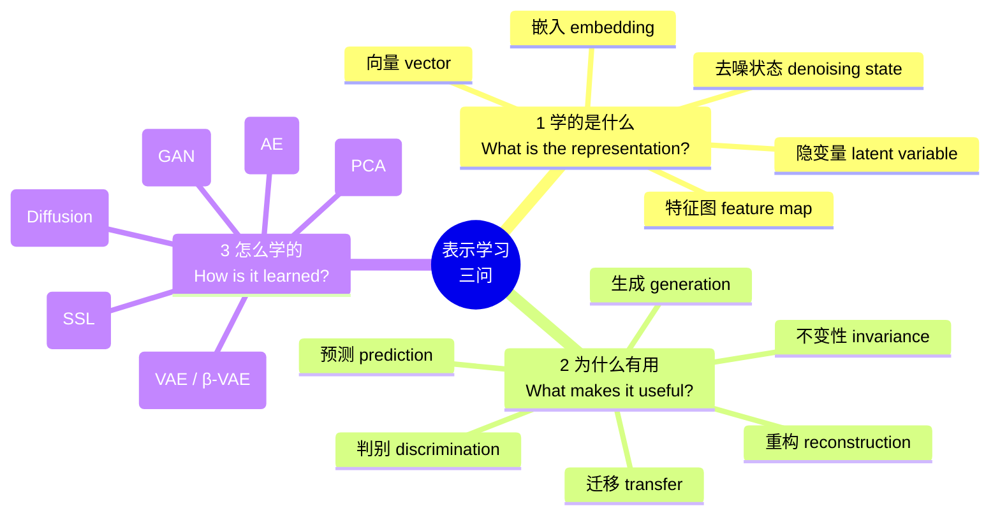
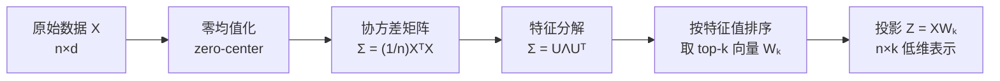
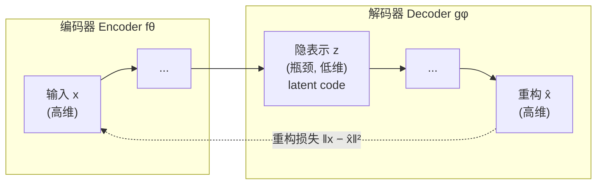
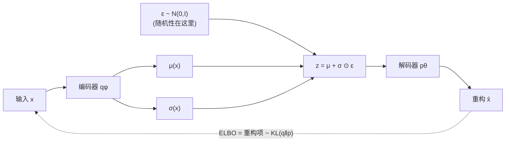
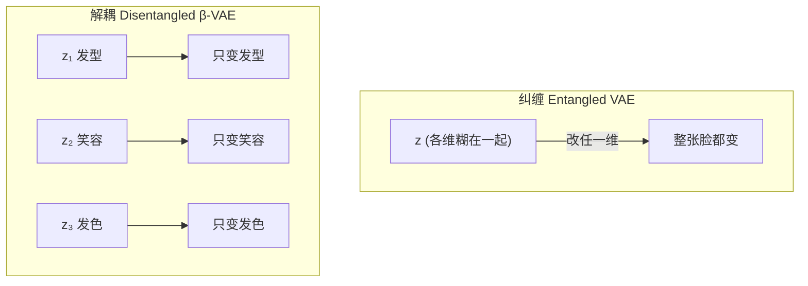
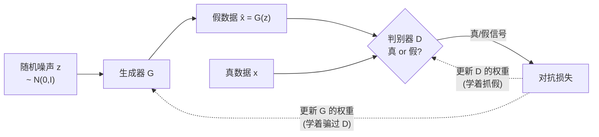
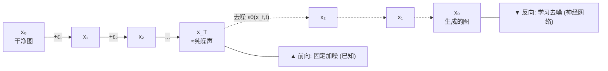
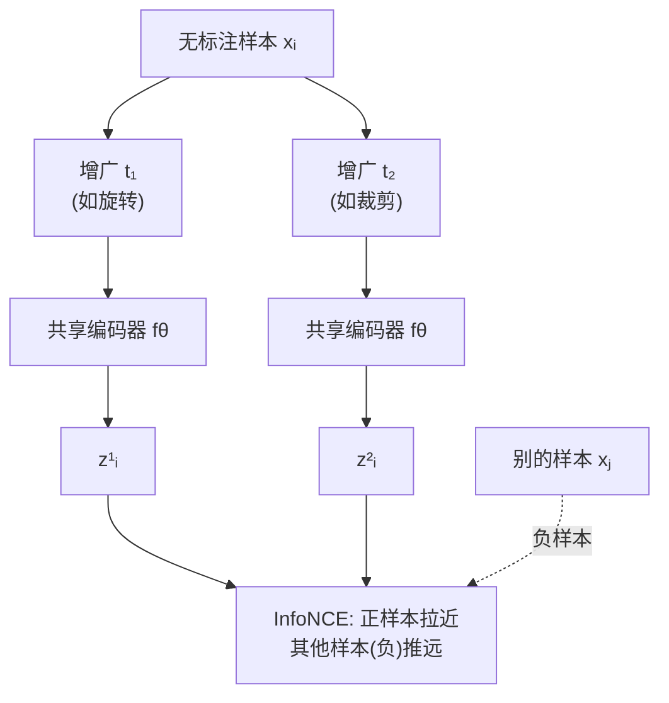
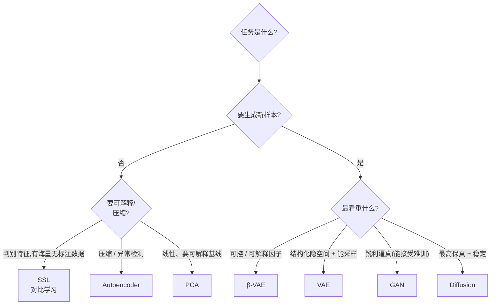

# Week 10 · 表示学习导论 (Representation Learning: An Introduction)

> **学习目标 (Learning objectives)** — 读完本章你应该能够:
> - 解释什么叫 **representation(表示)**、什么样的表示才"有用",并复述老师的"**三个问题**"统一框架(学的是什么 / 为什么有用 / 怎么学的);
> - 把 **PCA** 当作线性基线,说清它"保留最大方差的正交方向"在干什么,以及为什么 **top-K 特征向量是可证明最优的线性表示**(Karhunen–Loève);
> - 画出 **autoencoder(自编码器)** 的 encoder–bottleneck–decoder 结构,写出重构损失 $\|x-\hat{x}\|^2$,并解释为什么它特别适合**异常检测 (anomaly detection)**;
> - **准确解读** VAE 的 **ELBO**:$\mathcal{L}=\mathbb{E}_{q}[\log p(x|z)]-D_{KL}(q\|p)$,讲清重构项与 KL 项各自的作用、**reparameterization trick(重参数化技巧)** 为什么必要,以及 **β-VAE** 用 $\beta>1$ 换来 **disentanglement(解耦)** 的代价;
> - 写出 **GAN** 的 minimax 目标,解释 generator 与 discriminator 的对抗博弈、什么是 **mode collapse(模式崩溃)**;
> - 描述 **diffusion model (DDPM)** 的前向加噪 / 反向去噪两条 Markov 链,解释训练目标 $\|\epsilon-\epsilon_\theta(x_t,t)\|^2$ 把"生成"变成了"有监督去噪";
> - 解释 **self-supervised learning (SSL)** 怎样用 **pretext task(代理任务)** 和 **contrastive / InfoNCE loss** 从无标注数据里学出可迁移的特征;
> - **给定一个应用场景,选出合适的表示学习方法并说明理由与权衡**——这正是考试的核心题型。

机器视觉里的质检、能生成"不存在的人脸"的模型、Stable Diffusion 与 DALL·E、医学影像里"没多少标注也能学"的系统——这些看似毫不相干的东西,Week 10 把它们收进了**同一个主题**:我们到底怎么**表示**数据。老师在录音里把这件事说到了近乎信仰的程度:"**It's all about representation at the end of the day.**"——说到底,一切都是表示。如果你不能把原始数据表示成模型"吃得下、学得动"的形式,后面什么分类、生成、检索都无从谈起。

本章是一条清晰的工具进化线,跟着 slides 的 outline 走:先弄清**什么是表示、什么样的表示有用**(§1);再从你早就会的 **PCA** 这个线性基线出发(§2);升级到用神经网络做非线性重构的 **autoencoder**(§3);给它加上概率结构变成能"生成"的 **VAE**(§4),再加一个旋钮变成能"解耦"的 **β-VAE**(§5);换一条思路用对抗博弈来生成的 **GAN**(§6);再换一条思路把生成变成迭代去噪的 **diffusion model**(§7);最后是不需要标签、自己给自己出题的 **self-supervised learning**(§8)。§9 把六种方法横向对比、给出"该选哪个"的决策表,§10 是老师反复强调的**备考指南**。整章其实就在回答一个问题的六种答法:**怎样从原始数据里学出一个好的表示?**

> 📎 **拓展(超出 slides)— 本章在课程里的位置** — 本周(Week 10)主题是 representation learning,是 Week 9(文本处理 / Transformer)之后的自然延续:前面我们一直在"把信号变成数字",本周系统地问"怎么把数字变成*好的*表示"。老师把这部分内容拆在了**两次录音**里讲:第一次讲到 PCA→AE→VAE→β-VAE→GAN,第二次复盘 GAN 后接着讲 diffusion 与 SSL,然后才开始 **Week 11 的 graph neural network (GNN)**。**GNN 不属于本周考核范围**,本指南不展开。本章 slides 内容偏数学,但老师反复承诺:**考试不考任何推导**(详见 §10)。

---

## §1 什么是表示学习,什么样的表示才"有用"

### 1.1 从"给全班同学建模"说起

老师喜欢用同一个例子贯穿全课:开学第一节课,他说要"给这个班里的每个人做测量",取一些特征——你戴多大的帽子、头围、用多长的腰带、鞋码、身高。这五个数凑成一个向量,就是对"你"这个人的一个 **representation(表示)**。

但他当时其实埋了两个要求,正好点出"好表示"的两个核心:

1. **唯一性 / 可区分 (uniqueness, discriminative)** —— 这个表示要能把你和别人**区分**开。如果我只用一个特征,全班都"是 CSCI933 的学生",我谁也认不出来;只有多取几个**会变化的**特征,人和人才区分得开。
2. **可生成 (generative)** —— 如果我的表示框架足够好,我甚至能在特征空间里"凭空放一个点",解码出一个**看起来就该属于这个班**的"假人"。也就是说,好的表示不只是描述已有的数据,还**蕴含了生成新数据的知识**。

这两点——**判别**与**生成**——是贯穿全章六种方法的两条暗线。有的方法(PCA、AE)主要服务判别/压缩,有的(VAE、GAN、diffusion)主打生成,有的(SSL)专攻"没标签也能学出可迁移的判别特征"。

### 1.2 表示学习的定义与动机

正式地说 (S5):

> **表示学习 (Representation learning)** = 从原始数据中**自动发现**有用、有信息量的特征 / 表示,使这些表示捕捉到下游任务(分类、预测、生成等)所需的**本质结构 (essential structure)**;用学到的变换把高维、无结构的数据映射到一个**模式与关系更容易被发现**的形式,从而**减少对人工特征工程 (manual feature engineering) 的依赖**。

老师特意提醒:**这个定义不是考点,别背它**,是用来"内化"的。重点是理解它背后的几个动机:

- **原始数据不是没用,而是"夹带了垃圾"。** 老师打了个很形象的比方:原始数据里有好东西也有"会把网络搞晕的 nonsense"。你要做的是**把好的食物挑出来喂给模型,而不是把胆固醇 (cholesterol) 也塞进去把它噎住**。表示学习就是"提纯"这一步。
- **替代人工特征工程,要有"原则"。** 他常问:假如你有 100 个特征,但计算资源只够处理 25 个,你怎么挑?**不能"我喜欢你、我喜欢你"地随便选**,得有一个数学上有原则的办法(比如"保留最大方差")。
- **捕捉"变化的潜在因子" (underlying factors of variation)。** 这个词组很关键。所谓"变化的因子",就是那些**一改动就会变成另一个样本**的量。回到班级例子:帽子、头围、腰带、鞋码、身高就是因子——我把身高一调,就换了个人。再比如做**人脸编辑器**:头发长度、鼻型、嘴型各是一个因子,调一个就改一处。后面 §5 的 β-VAE 正是冲着"把这些因子一个一个分开"去的。

> **🔑 例(为什么"不平衡"逼你放弃监督学习)** — 老师抛了个真实场景:你是工厂的数据科学家,产线上做**质量控制 (QC, quality control)**——大量合格件、极少数次品。有人提议"用监督学习做二分类(好/坏)"。老师让大家**批判这个方案**。答案是:**失败数据太稀缺 (failure data is scarce)**,正负样本严重不平衡,监督学习根本喂不饱。而且一个好工厂*本来*就该次品极少——次品和合格件五五开,反而说明这台机器跟抛硬币一样烂。所以这类问题天生属于**无监督**。这个例子直接引出了 §3 用 autoencoder 做异常检测。

### 1.3 统一视角:每种方法都在回答三个问题

这是**全章最该记住的一张思维导图**(S6)。老师说,把这三个问题揣进兜里,你就是个好工程师——拿到任何问题都知道怎么下手:

第三问("怎么学的")其实就是**每种方法的损失函数**,而本章六种方法恰好对号入座:**PCA→方差最大化,AE→重构损失,VAE/β-VAE→ELBO,GAN→对抗(minimax)损失,Diffusion→去噪损失,SSL→对比损失**。后面每一节,你都可以回来对一下这张表。

表示学习为什么这么"热"?因为**一旦有了好表示,下游任务就变得容易**:预训练的视觉 / 语言模型、异常检测、聚类、压缩、可视化都建在它之上 (S7)。老师还点了一句:**大语言模型本身就是一种表示学习工具**——它学会了"怎么表示人类文本",于是摘要、生成、问答都顺手了。

> **🗝️ 本节关键回顾** — ① 表示 = 把原始数据提纯成"判别 + 可生成"的形式;② 三大动机:挑出"好食物"丢掉"胆固醇"、用有原则的数学替代人工选特征、捕捉"变化的潜在因子";③ **三问框架**(学什么 / 为何有用 / 怎么学)是贯穿全章的骨架,第三问 = 损失函数。

---

## §2 PCA:线性基线

### 2.1 复习:PCA 在干什么

老师从 PCA 开讲,理由很实在:"**从你已经会的东西出发。**" PCA(**principal component analysis,主成分分析**)你前几周见过,这里只快速复盘 (S8–S9):

PCA 是一种**线性降维 (linear dimensionality reduction)**——把数据投影到一个**更低维的子空间**,同时**尽量保留方差 (variance)**。它通过**协方差矩阵的特征向量 (eigenvectors of the covariance matrix)** 找到一组**正交的 (orthogonal)**、方差最大的方向,这些方向就叫**主成分 (principal components)**。

为什么要"正交 / 独立"?老师解释得很直白:你不希望一个特征能从另一个特征推出来。**如果看你的腰带就能猜出你的身高,那这两个特征是冗余的,留一个就够了。** 我们要的是**每个方向都给出别的方向给不了的信息**——这就是线性代数里的"线性独立"。而"保留最大方差"对应的正是 §1.2 那句"变化的潜在因子":方差大的方向,才是真正把样本区分开的方向。

### 2.2 数学定义与算法

设 $X \in \mathbb{R}^{n\times d}$ 是一个**零均值化 (zero-centered)** 的数据矩阵($n$ 个样本、$d$ 个特征)。

> 📎 **拓展(超出 slides)— "零均值化"和"读公式"** — 老师在课上花了点功夫教大家**把符号读出来**:$X\in\mathbb{R}^{n\times d}$ 念作"$X$ 是一个 $n\times d$ 的实数矩阵"。**零均值化**就是每个特征减去它的均值;如果再除以标准差,数据就被压到大致 $[-1,1]$。他强调这一步很关键——**神经网络喜欢吃这种归一化的数据,你喂别的它会"噎住" (choke)**。这也是为什么训练时到处是 normalization / layer norm。能把公式"读成人话"是本章的元技能,后面每个损失函数都这么读。

PCA 要找一个**正交矩阵 (orthonormal matrix)** $W_k \in \mathbb{R}^{d\times k}$,使投影 $Z = XW_k \in \mathbb{R}^{n\times k}$ 在 $k$ 维子空间里**尽量保留方差**。算法四步 (S10):

1. **算协方差矩阵:** $\Sigma = \frac{1}{n}X^\top X$ —— $X^\top X$ 把 $n\times d$ 的数据变成 $d\times d$ 的方阵(零均值化后它正比于协方差);
2. **特征分解:** $\Sigma = U\Lambda U^\top$ —— $U$ 的列是特征向量,$\Lambda$ 是对角阵,对角线上是特征值(= 各方向解释的方差);
3. **取前 $k$ 个特征向量:** 把特征值**从大到小**排序,$W_k = [u_1\ u_2\ \dots\ u_k]$;
4. **投影:** $Z = XW_k$ —— 数据从 $d$ 维降到 $k$ 维($k<d$)。

| 符号 | 含义 |
|---|---|
| $X$ | 零均值化的数据矩阵 |
| $\Sigma$ | $X$ 的协方差矩阵 |
| $U$ | $\Sigma$ 的特征向量矩阵 |
| $\Lambda$ | 特征值对角阵(解释的方差) |
| $W_k$ | 前 $k$ 个特征向量(主成分) |
| $Z$ | 投影后的低维表示 |

### 2.3 为什么是"基线":最优性与它的天花板

PCA 之所以是基线,是因为它有一个漂亮的理论保证。老师提到了 **Karhunen–Loève 变换**:如果你的预算只有 $k$ 个特征向量,那么**按特征值从大到小取的那前 $k$ 个,就是你能得到的最好的线性表示——没有任何其他线性方法能比它更好地保留方差**。这给了 PCA 坚实的理论地位。

但它的天花板也很明显:**PCA 是线性的**。如果数据的结构是非线性的怎么办?老师点了那个"以 k 开头"的名字——**kernel PCA (KPCA)**:先用核函数把数据**升到一个高维空间,让原本非线性的结构在那里变成线性的**,再在那个空间里做 PCA。记住这个"用核技巧把非线性掰直"的思路——它和 §3 末尾"autoencoder 像是在复杂非线性空间里做的 PCA"会呼应上。

> **🗝️ 本节关键回顾** — ① PCA = 线性降维,沿协方差矩阵的特征向量取"方差最大、相互正交"的方向;② 算法:零均值化 → 协方差 → 特征分解 → 取 top-k → 投影;③ **Karhunen–Loève**:top-k 特征向量是线性方法里可证明最优的表示;④ 局限是线性,非线性要用 **KPCA**。

---

## §3 Autoencoder:用"重构自己"来学表示

### 3.1 核心思想:逼着网络学出"本质"

PCA 是线性的。要在**非线性**世界里学表示,就轮到 **autoencoder(自编码器,AE)** 了。

它的定义很反直觉 (S12):**一个神经网络,学着把输入压缩成一个低维的隐表示(编码),再从这个压缩形式重建出原始输入(解码)**;以**无监督**方式训练,目标是最小化输入与输出之间的**重构误差 (reconstruction error)**。

"训练一个网络来重建它自己的输入"听起来很傻——我直接把输入复制到输出不就行了?关键在那个**瓶颈 (bottleneck)**:中间那层维度远小于输入。网络被逼着只能用很少的几个数,去**抓住数据的本质**,否则它没法在另一头把原图还原出来。老师的话:"**你逼它学到数据的精华 (essence),因为你要求它——不管你学到什么,都得用它把原图重建出来。**"

### 3.2 数学定义

设输入 $x \in \mathbb{R}^d$ (S13):

- **编码器 (encoder):** $z = f_\theta(x)$,其中 $z \in \mathbb{R}^k$($k<d$,参数 $\theta$);
- **解码器 (decoder):** $\hat{x} = g_\phi(z)$,其中 $\hat{x}\in\mathbb{R}^d$(参数 $\phi$);
- **目标:** 最小化重构损失
$$\mathcal{L}(x,\hat{x}) = \|x - \hat{x}\|^2 = \|x - g_\phi(f_\theta(x))\|^2$$

把这个公式"读成人话":$\hat{x}$ 头上那个**帽子 (hat)** 表示它是 $x$ 的**估计**,不是 $x$ 本身;两者相减、取平方,就是误差。**为什么取平方?** 老师反复强调一个口诀:**平方是为了惩罚大误差 (penalize large errors)**——见到平方就该想到这一层意思。中间的 $z$ 就是**隐空间 / 隐表示 (latent space)**,是网络对数据的内部表示。

### 3.3 应用:工业振动数据的异常检测

现在把 §1.2 那个"次品太少、不能用监督学习"的质检问题接上 (S16–S19)。

**场景:** 你要监控工厂里一队机器,每台都有振动传感器,产出多元时间序列。绝大多数是正常数据,只有极少数(轴承故障、转子失衡)是真异常。标注的故障数据稀缺,监督学习不可行,你需要一个**无监督**方法判断机器是否异常。

**怎么用 AE 解?** 老师让学生自己想出了关键一招:

> **🔑 例(异常检测的妙处)** — **只用正常数据训练 autoencoder**。训练完,它对"正常"长什么样了如指掌:喂进一个正常样本,它能精准重建,**重构误差很小**。可一旦喂进一个异常样本,它"没见过、没有信息去重建",于是**重构误差会突然变大**。所以:$\|x-\hat{x}\|^2$ **超过某个阈值 → 判为异常**。老师把这套逻辑总结成四步工作流:① 预处理(振动信号归一化、切成时间窗);② **只在正常数据上**训练 AE;③ 用 $\|x-\hat{x}\|^2$ 算异常分数;④ 误差超阈值就报警。

注意这招怎么巧妙地绕开了不平衡问题:它**根本不需要任何异常样本**,把"分类"问题变成了"我能不能重建你"的问题。

**架构选择**很灵活 (S19):静态特征向量用 **Dense AE**;时间序列窗口里的局部模式用 **Conv1D AE**;要学序列依赖用 **LSTM AE**。AE 不绑定 MLP——卷积、循环结构都可以当编码器 / 解码器。

> 📎 **拓展(超出 slides)— AE 与 PCA 的关系** — 老师在总结时点了一句很值得记的话:**autoencoder 本质上像是在一个复杂非线性空间里工作的 PCA**。如果把编码器 / 解码器都限制成线性、损失用平方误差,AE 学到的子空间其实就退化成 PCA 的主成分子空间。换句话说,**AE 是 PCA 的非线性推广**——这正好接上 §2.3"用 KPCA 把非线性掰直"的另一条路:KPCA 靠固定的核,AE 靠可学习的神经网络。

> **🗝️ 本节关键回顾** — ① AE = encoder→bottleneck→decoder,靠重构损失 $\|x-\hat{x}\|^2$ 逼网络学本质(平方 = 惩罚大误差);② 隐空间 = 内部表示;③ **异常检测**:只用正常数据训练,异常样本重构误差大 → 超阈值报警,天然解决不平衡;④ AE ≈ 非线性的 PCA。

---

## §4 VAE:从"确定的编码"到"概率的分布"

### 4.1 动机:AE 不会"生成"

AE 有个根本短板:它**只会重构,不会生成**。它把每个输入映射到一个**固定的 (deterministic)** 隐码 $z$;隐空间里"码与码之间"的地带是什么,它毫无概念。你没法在隐空间里随便采个点、解码出一个**全新而合理**的样本。

**variational autoencoder(变分自编码器,VAE)** 就是来补这一刀的 (S20)。它的关键改动:**编码器不再输出一个固定的 $z$,而是输出一个分布**——具体说,输出一个**均值 $\mu(x)$ 和方差 $\sigma^2(x)$**,然后从这个分布里**采样**一个 $z$ 交给解码器。

老师解释了为什么"输出分布"就能生成:**只要你描述了一个分布,你就能从它里面采样、生成新东西。** 想描述一个正态分布,有均值和方差就够了。哪怕是很怪的分布,也能用**高斯混合 (mixture of Gaussians)** 拼出来。所以 VAE 学的不是"这张图的码",而是"这类数据在隐空间里的概率分布"——这是它能生成的根本原因。他还翻出早先那个比喻:**想让游戏 AI 模仿一个板球运动员,你只要学会他打球的"分布",就能在任意位置生成一杆合理的挥击。**

### 4.2 数学定义:ELBO

输入 $x\in\mathbb{R}^d$ (S21):

- **编码器(近似后验):** $q_\phi(z|x) = \mathcal{N}\big(z;\ \mu(x),\ \mathrm{diag}(\sigma^2(x))\big)$
- **先验 (prior):** $p(z) = \mathcal{N}(0, I)$ —— 我们**希望**隐空间长成一个标准正态
- **解码器(生成似然):** $p_\theta(x|z)$
- **目标:最大化证据下界 (Evidence Lower Bound, ELBO):**
$$\mathcal{L}_{\text{VAE}}(x) = \underbrace{\mathbb{E}_{q_\phi(z|x)}\big[\log p_\theta(x|z)\big]}_{\text{重构项}} - \underbrace{D_{KL}\big(q_\phi(z|x)\ \|\ p(z)\big)}_{\text{KL 正则项}}$$

VAE 同时优化两个目标 (S22):

- **重构项(数据项):** $\mathbb{E}_{q_\phi(z|x)}[\log p_\theta(x|z)]$ —— 从隐样本 $z$ **尽量准确地还原 $x$**。这本质上还是"重构损失",和 AE 一脉相承。
- **KL 散度项:** $D_{KL}(q_\phi(z|x)\|p(z))$ —— 逼**编码器输出的分布贴近标准正态先验**。

### 4.3 KL 散度到底在干什么:"4 减 X"的直觉

这是本节最容易卡住的地方,老师用了一个特别朴素的讲法。

先说 **KL 散度 (Kullback–Leibler divergence)** 是什么:**它衡量两个分布有多不一样——是一种"距离"**。给两个分布 $P_1$、$P_2$,KL 告诉你它们差多远。**如果 $D_{KL}=0$,两个分布重合;$D_{KL}$ 越大,离得越远。** 我们希望 $q_\phi(z|x)$ 贴近先验 $\mathcal{N}(0,I)$,所以想让这个 KL **尽量小**。小到什么程度有用?小到整个隐空间被"整形"成一个规整的标准正态——这样你才能在 §4.1 说的那样,从 $\mathcal{N}(0,I)$ 里随便采点、解码出合理样本。

那为什么目标里 KL 前面是**减号**?

> **🔑 例(老师的"4 减 X"类比)** — 我们要**最大化** ELBO,而 ELBO = 重构项 **−** KL。把它想成 $4 - X$:这里 4 好比"重构得很好"的满分,$X$ 就是 KL。$X$ 能在 $[0,3]$ 间变。**什么时候 $4-X$ 最大?当 $X=0$ 时,得 4,最大。** 所以"最大化 ELBO"自动意味着"**把 KL 压到尽量小**",也就是把编码分布推向先验。一句话:**减号 + 最大化 = 逼 KL 变小 = 让隐空间贴近标准正态。** 同时那个重构项要尽量大(还原得准),两股力一起拉,VAE 既能重构又能生成。

### 4.4 重参数化技巧:让"采样"可导

还有一个工程上的坎:**从 $q_\phi(z|x)$ 里采样 $z$ 这一步是不可导的**,梯度没法穿过一个"随机采样"操作回传到 $\mu$、$\sigma$。

**reparameterization trick(重参数化技巧)** 解决它 (S23):把采样改写成
$$z = \mu(x) + \sigma(x)\odot\epsilon,\qquad \epsilon\sim\mathcal{N}(0,I)$$
其中 $\odot$ 是逐元素相乘。**随机性被挪到了与参数无关的 $\epsilon$ 上**,而 $\mu(x)$、$\sigma(x)$ 变成确定性的、可导的部分,梯度就能顺着它们流回去,用普通的梯度下降训练了。老师宽慰大家:这个技巧 PyTorch / TensorFlow 的 API 早就实现好了,你**要懂它为什么必要**,但不用自己手写。

### 4.5 AE vs VAE

| 维度 | Autoencoder (AE) | Variational Autoencoder (VAE) |
|---|---|---|
| **目标** | 精确重构 | 学一个**生成模型** |
| **编码器输出** | 确定的码 $z=f_\theta(x)$ | 概率分布 $z\sim\mathcal{N}(\mu(x),\sigma^2(x))$ |
| **解码器输入** | 固定隐码 | **采样**得到的隐向量 |
| **损失** | $\|x-\hat{x}\|^2$ | **ELBO** = 重构项 + KL 惩罚 |
| **能生成新样本?** | ✗ | ✓ |

> **🔑 例(VAE 生成 MNIST 手写数字)** — **MNIST** 是美国邮政的手写数字数据集(当年为了自动识别信封上的邮编、给信件分拣)。想用它做数据增强?(S31–S32)① 把灰度图归一化到 $[0,1]$;② 训练 VAE,编码器学 $\mu(x),\sigma(x)$,解码器从 $z=\mu+\sigma\odot\epsilon$ 重建;③ 从 $z\sim\mathcal{N}(0,I)$ 采样,解码出**全新的数字** $\hat{x}=g_\phi(z)$。VAE 的概率性保证了样本的**多样性**,还能在隐空间里**平滑地在类别间插值**。

> **🗝️ 本节关键回顾** — ① VAE 把编码器输出从"固定码"换成"分布($\mu,\sigma$)",于是能生成;② **ELBO = 重构项 − KL**,KL 是"分布间距离",减号+最大化逼它变小、把隐空间整形成 $\mathcal{N}(0,I)$("4 减 X"直觉);③ **重参数化** $z=\mu+\sigma\odot\epsilon$ 让采样可导;④ 关键区别:AE 确定+只重构,VAE 概率+能生成。

---

## §5 β-VAE:把隐空间"解耦"开来

### 5.1 纠缠 vs 解耦

VAE 能生成了,但还有个遗憾:它学到的那些隐因子**全缠在一起 (entangled)**。你想改一处,结果整张脸都跟着变,**没有一个旋钮能单独控制"头发长度"**。

老师用人脸编辑器把"解耦"讲透了:**disentangled latent space(解耦隐空间)** 就是每个隐维度对应一个**人类能理解的、独立的因子**——这一维管头发长度,那一维管发色,另一维管"笑不笑"。你拨动其中一维,**只有那一处变化,其余不变**(把你的脸 P 成长发,别人还是一眼认出是你)。反之 **entangled(纠缠)** 就是所有因子糊成一团,重构没问题,但你没有"杠杆"去单独调任何一个。

### 5.2 怎么做:给 KL 加一个 β

要鼓励解耦,只需在 ELBO 上动一个小手脚——给 KL 项**加一个权重 $\beta$** (S27–S29):

$$\mathcal{L}_{\beta\text{-VAE}} = \mathbb{E}_{q(z|x)}\big[\log p(x|z)\big] - \beta\, D_{KL}\big(q(z|x)\ \|\ p(z)\big),\qquad \beta>1$$

直觉是这样:**$\beta>1$ 加强了"逼近先验"的压力**。先验 $\mathcal{N}(0,I)$ 各维是相互独立的,所以更大的 KL 权重等于更用力地把隐各维**推向相互独立**,于是因子被一个个"挤"开,实现解耦。

**但天下没有免费的午餐。** 老师反复强调这个**权衡 (trade-off)**:$\beta$ 越大,解耦越好,但你在 ELBO 里给"重构"留的比重就越小,**重构保真度 (fidelity) 下降,生成的图会变糊 (blurry)**。所以:

- **要精确重构 / 逼真生成 → 用 VAE**($\beta=1$);
- **要可解释、可控的解耦因子 → 用 β-VAE**($\beta>1$),代价是牺牲一些清晰度。

> **🔑 例(β-VAE 做人脸属性编辑)** — 你在做一个人脸编辑工具,让用户改"笑容""发色""眼镜"(S33–S34)。① 预处理 CelebA 人脸(裁剪、缩放、归一化);② 用 $\beta>1$ 训练 β-VAE 促成解耦;③ 找出对应各个面部属性的隐维度;④ **只拨动其中一维**再解码,观察单一属性的变化(比如把"笑容"那一维调大)。β-VAE 在"可解释性和可控性压倒一切"的场景里最理想——哪怕重构质量打点折。

> **🗝️ 本节关键回顾** — ① 解耦 = 每个隐维管一个独立、可理解的因子,能单独调;② β-VAE 给 KL 项加权重 $\beta>1$,加强"逼近独立先验"的压力来促成解耦;③ **权衡**:解耦↑ 但重构保真度↓(图变糊);④ 选型:精确重构用 VAE,可控编辑用 β-VAE。

---

## §6 GAN:用对抗博弈来生成

### 6.1 直觉:造假者与鉴定师的猫鼠游戏

到目前为止(AE / VAE / β-VAE)都靠"重构"这条线索学习。**generative adversarial network(生成对抗网络,GAN)** 换了一条完全不同的思路:**让两个网络互相博弈** (S35)。

- **generator(生成器 $G$):** 学着**造假数据**,目标是骗过对手;
- **discriminator(判别器 $D$):** 学着**分辨真假**,目标是抓出赝品。

老师把它讲成一场猫鼠游戏:生成器造一张假图,判别器说"假的";生成器想"我怎么才能骗过它",换个方式再造一张,判别器再判……如此往复,**直到生成器造得太逼真,判别器再也分不清真假——只能五五开地瞎猜**。到这个**均衡 (equilibrium)** 点,生成器就**学到了数据的分布**,成了一个真正的生成器。

关键是:$G$ 的输入只是**随机噪声 (random noise)**。训练过程中 $G$ 的参数不断调整,**学会了把噪声转换成有意义的数据**。

### 6.2 数学定义:minimax

GAN 的目标函数是一个**极小极大 (minimax)** 博弈 (S37):

$$\min_{G}\ \max_{D}\ \ \mathbb{E}_{x\sim p_{\text{data}}(x)}\big[\log D(x)\big] + \mathbb{E}_{z\sim p_z(z)}\big[\log\big(1 - D(G(z))\big)\big]$$

读成人话:

- $x$ 是来自真实分布 $p_{\text{data}}$ 的真样本;$z$ 是来自先验 $p_z$(通常 $\mathcal{N}(0,I)$)的噪声;$G(z)$ 是生成器造的假货;$D(x)\in[0,1]$ 是判别器认为 $x$ 为真的概率。
- **$\max_D$:** 判别器想把"真判真、假判假"的概率拉满——所以 $D(x)$ 大、$D(G(z))$ 小。
- **$\min_G$:** 生成器想让 $D(G(z))$ **接近 1**(让判别器误以为假货是真的),所以要**最小化** $\log(1-D(G(z)))$。

训练**交替进行**:固定 $G$ 训 $D$,再固定 $D$ 训 $G$,如此反复,通常用随机梯度下降 (S39)。从**几何视角**看 (S38):有两个分布 $p_G$(生成器的)和 $p_{\text{data}}$(真实的),整个博弈就是不断**把 $p_G$ 整形、推到与 $p_{\text{data}}$ 重叠**;当两者几乎重合,生成器就学到了数据的底层分布。

> 📎 **拓展(超出 slides)— minimax 与博弈论** — 老师特意点出:这种 minimax 目标在**博弈论 (game theory)** 里很常见,典型场景是谈判——"我要**最大化我的收益、最小化你的收益**"。他还提到那部电影《美丽心灵》(A Beautiful Mind) 的主角(John Nash)正是用博弈论分析这类对抗,数学家能提前预测博弈如何收场。把 GAN 理解成"两个理性玩家的零和博弈",minimax 就不神秘了。

### 6.3 为什么用 GAN,以及它的麻烦

**优点** (S40–S43):GAN 不依赖重构精度,而是直接训练生成器去**骗过判别器**,因此往往生成**更锐利、更逼真 (sharper, more convincing)** 的图像。在"真实感压倒可解释性"的创意场景(生成抽象画、生成根本不存在的人脸)里,它比 VAE(常常糊)、AE(根本不能生成)更合适。老师感慨:GAN 能生成"看着就是个真人、却从没在世上存在过"的脸。

**但训练 GAN 出了名地不稳定**,最典型的毛病是 **mode collapse(模式崩溃)**:

> **🔑 例(老师的癫痫脑电 GAN 翻车实录)** — 老师讲了自己一个真实项目:癫痫**发作 (seizure)** 源于脑深处,可以用头皮电极记录脑电波来预测。难点是——**正常脑电海量,而"发作波"极其稀缺**(病人在医院躺一个月可能什么都没发生,回家反而又犯了)。数据太少,没法训练。于是他让一个硕士生**用 GAN 生成假的发作脑电波**。结果训练时 GAN **崩溃 (collapse) 了**:它陷入一个**循环**,翻来覆去只生成那么几种形态、不断重复,看起来在"生成新东西",其实没有。这就是 mode collapse——**网络没收敛,在原地打转**。补救手段有 **DCGAN**(用卷积、batch norm、LeakyReLU 稳住训练)等;评估则用 **Inception Score (IS)** 和 **FID (Fréchet Inception Distance)**(S43, S75–S76)。

> 📎 **拓展(超出 slides)— GAN 评估指标(附录)** — **FID** 衡量真实图与生成图在 Inception-v3 特征空间里两个分布的距离,**越低越好**,同时反映保真度和多样性,是图像合成最常用的指标;**IS** 看分类器对生成图打标签有多自信(质量)以及标签分布有多分散(多样性),**越高越好**,是早期 GAN 论文的基准指标。

> **🗝️ 本节关键回顾** — ① GAN = 生成器(造假)vs 判别器(鉴假)的对抗博弈,均衡时 $D$ 五五开、$G$ 学到数据分布;② minimax 目标 $\min_G\max_D \mathbb{E}[\log D(x)]+\mathbb{E}[\log(1-D(G(z)))]$;③ 优点是**锐利逼真**、无需重构;④ 缺点是**训练不稳、易模式崩溃**(脑电翻车案例),DCGAN 稳训练,FID/IS 做评估。

---

## §7 Diffusion Model:把"生成"变成"去噪"

### 7.1 动机:前面这些模型都有短板

GAN 锐利但难训。能不能**既稳定、又高保真**?这就是 **diffusion model(扩散模型)** 的切入点。老师先把前面几位的短板列了一遍 (S48):AE 不能生成、重构糊;VAE 能生成但先验太简单导致糊;β-VAE 拿保真度换解耦;GAN 锐利但训练不稳、模式崩溃、还没有似然。而 **diffusion 提供:稳定的、基于似然的训练 + 高保真多样的输出 + 扎实的概率框架。**

### 7.2 核心思想:加噪一条链,去噪一条链

具体说,这里讲的是 **DDPM(Denoising Diffusion Probabilistic Model,Ho et al. 2020)**(S46)。一句话抓住它:**学着把"逐步加噪"这个过程反过来,从而生成数据。** 两条 Markov 链:

- **前向过程(扩散 / 加噪,forward / diffusion):** 从一张干净图 $x_0$ 出发,**一步步加高斯噪声**,直到 $x_T$ 变成近乎纯噪声。这个过程是**固定的、已知的**(你自己定的噪声时间表)。
- **反向过程(生成 / 去噪,reverse / generation):** 从纯噪声 $x_T\sim\mathcal{N}(0,I)$ 出发,用一个**训练好的神经网络一步步去噪**,把它还原成一张真实图像。

老师把"表示学习视角"点了出来:**模型学到的是一串"去噪表示"——每个带噪状态 $x_t$ 都含有关于原图 $x_0$ 的部分信息。**

### 7.3 数学:前向、反向、训练目标

**前向单步加噪** (S50):
$$q(x_t\mid x_{t-1}) = \mathcal{N}\big(x_t;\ \sqrt{1-\beta_t}\,x_{t-1},\ \beta_t I\big)$$
其中 $\beta_t$ 是**噪声方差时间表 (noise variance schedule)**,控制第 $t$ 步加多少噪。一个漂亮的性质是**可以一步直接从 $x_0$ 采到 $x_t$**:
$$x_t = \sqrt{\bar\alpha_t}\,x_0 + \sqrt{1-\bar\alpha_t}\,\epsilon,\qquad \epsilon\sim\mathcal{N}(0,I)$$
记号:$\alpha_t = 1-\beta_t$,$\bar\alpha_t = \prod_{s=1}^{t}\alpha_s$(累积乘积)。随着 $t$ 增大,$x_t$ 越来越像标准正态。

**反向单步去噪** (S51):用神经网络参数化这个转移
$$p_\theta(x_{t-1}\mid x_t) = \mathcal{N}\big(x_{t-1};\ \mu_\theta(x_t,t),\ \Sigma_\theta(x_t,t)\big)$$
网络收到带噪样本 $x_t$ 和时间步 $t$,预测"往干净方向挪一步该怎么挪"。

**训练目标(噪声预测)** (S52)——本节的灵魂:
$$\mathcal{L}(\theta) = \mathbb{E}_{x_0,\,t,\,\epsilon}\Big[\big\|\,\epsilon - \epsilon_\theta(x_t,t)\,\big\|^2\Big],\qquad \epsilon\sim\mathcal{N}(0,I)$$
读成人话:训练时**我们恰好知道加进去的噪声 $\epsilon$ 是多少**;网络 $\epsilon_\theta(x_t,t)$ 的任务就是**把这个噪声预测出来**。老师的金句:"**如果噪声能被预测出来,它就能被去掉。**" 于是生成 = 反复地"预测噪声 → 减掉噪声"。

> **🔑 关键洞察** — **Diffusion 把"生成建模"变成了一个"有监督的去噪问题"** (S52)。这正是它训练稳定的根源:不像 GAN 那样靠对抗反馈(容易打架、崩溃),它有一个**明确的回归目标**(预测已知的 $\epsilon$),就像普通监督学习一样踏实。

### 7.4 应用与现状

> **🔑 例(高保真人脸生成)** — 为艺术家 / 游戏开发者生成照片级人像(S55–S57):① 用 CelebA-HQ / FFHQ 数据集,缩放归一化;② 训练:对训练图加 $T$ 步高斯噪声,训练网络在第 $t$ 步**预测噪声**;③ 生成:从随机噪声出发,逐步施加学到的反向过程,合成一张新脸。Diffusion 在"要极高质量 + 可控"的场景里胜出:GAN 可能崩、VAE 常糊,**diffusion 在真实感与可控性之间取得最佳平衡**。

老师补充了现状 (S58):diffusion 已是高保真图像生成的**主流**,缺点是**采样慢**(要走很多步),但 **DDIM、Latent Diffusion** 等已大幅提速,如今是 **Stable Diffusion、DALL·E 2** 背后的引擎。它也能做**条件生成**(给定"年轻、微笑的女性"这种描述)。

> **🗝️ 本节关键回顾** — ① DDPM = 前向固定加噪(Markov 链,时间表 $\beta_t$)+ 反向学习去噪两条链;② 前向可一步直采 $x_t=\sqrt{\bar\alpha_t}x_0+\sqrt{1-\bar\alpha_t}\epsilon$;③ 训练目标 = **预测噪声** $\|\epsilon-\epsilon_\theta(x_t,t)\|^2$,把生成变成**有监督去噪**(故稳定);④ 高保真、稳定但采样慢;Stable Diffusion / DALL·E 2 的内核。

---

## §8 Self-Supervised Learning:没有标签也能学

### 8.1 动机:标签太贵

前面 VAE / GAN / diffusion 都在攻"生成"。**self-supervised learning(自监督学习,SSL)** 攻的是另一个痛点:**深度模型最吃大规模标注数据,但标签昂贵、耗时、领域专属**,很多领域(医学、卫星影像)根本没多少标注 (S59)。

SSL 的洞见:**从无标注数据里,通过解一个"自己给自己出的题"(pretext / proxy task),把结构学出来** (S60)。它产出一个**特征提取器 (feature extractor)**,可以迁移到分类、分割等下游任务——而且这种预训练编码器常常**比纯监督的还强**。

### 8.2 直觉:你怎么认出背影里的朋友

老师用了两个特别接地气的比喻把 SSL 讲活了:

> **🔑 例(拳头 & 朋友的背影)** — ① 我把手攥成**拳头**看一眼,记住"这是拳头";然后我把它**挠一下、稍微变个形**,再看——我还是认得"这是拳头"。**我能认出这个小变化后还是同一个东西,正说明我学到了"拳头"的本质特征。** ② 你有个老朋友,远远看见一个**背影**走在路上,你就认出"那是他"——你学到的是他的**步态、身形**这些不变特征,哪怕没看正脸、没人给你贴标签"这是你朋友"。SSL 就是这么干的:给它同一个对象的若干"变体",它得学会"这些都是同一个",这逼它抽出本质特征。

把比喻翻译成机制:对一个样本做**两种随机增广 (augmentation)**(旋转、裁剪、改光照……)得到两个"视图",它们**本该被认成同一个东西**(正样本对);而来自**别的样本**的视图则是负样本。网络要学会**把正样本对在隐空间里拉近、把负样本推远**——这就是 **contrastive learning(对比学习)**。

### 8.3 数学:InfoNCE 对比损失

形式化 (S61):对一批输入 $\{x_i\}_{i=1}^{N}$,对每个 $x_i$ 施加两种增广:
$$x_i^1 = t_1(x_i),\quad x_i^2 = t_2(x_i);\qquad z_i^1 = f_\theta(x_i^1),\quad z_i^2 = f_\theta(x_i^2)$$
其中 $f_\theta$ 是**共享编码器**。第 $i$ 对的 **InfoNCE 损失**:
$$\mathcal{L}_i = -\log\frac{\exp\!\big(\mathrm{sim}(z_i^1,z_i^2)/\tau\big)}{\displaystyle\sum_{j=1}^{N}\Big[\exp\!\big(\mathrm{sim}(z_i^1,z_j^2)/\tau\big) + \mathbb{1}_{[j\neq i]}\exp\!\big(\mathrm{sim}(z_i^1,z_j^1)/\tau\big)\Big]},\qquad \mathcal{L}_{\text{InfoNCE}} = \frac{1}{N}\sum_{i=1}^{N}\mathcal{L}_i$$

读成人话:**分子**是正样本对的相似度(拉近),**分母**把所有负样本的相似度也加进来(推远);整体像一个 **softmax**,$\mathrm{sim}(a,b)=\frac{a^\top b}{\|a\|\|b\|}$ 是**余弦相似度**,$\tau$ 是**温度 (temperature)** 缩放(还记得 Week 9 attention 里 $\sqrt{d_k}$ 也是温度吗?同一个味道)。最小化它,就是在训练网络"认出两个增广其实同源"。InfoNCE = **info**rmation **n**oise **c**ontrastive **e**stimation。

| 符号 | 含义 |
|---|---|
| $x_i$ | 输入样本 |
| $x_i^1, x_i^2$ | $x_i$ 的两个增广视图 |
| $f_\theta$ | 共享编码器 |
| $z_i^1, z_i^2$ | 编码后的表示 |
| $\mathrm{sim}(a,b)$ | 余弦相似度 $a^\top b/(\|a\|\|b\|)$ |
| $\tau$ | 温度缩放参数 |
| $\mathbb{1}_{[j\neq i]}$ | 排除正样本自身的指示函数 |

**训练流程** (S63, S66):① 采一批无标注样本;② 每个样本做两次增广;③ 过共享编码器得 $z^1,z^2$;④ 归一化、算两两相似度;⑤ 用 InfoNCE **拉近正样本、推远负样本**;⑥ 反向传播更新编码器。

### 8.4 应用与"预训练骨干"的价值

> **🔑 例(医学影像)** — 医院有海量 X 光、MRI,但**绝大多数没标注**(专家标注又贵又慢,还有隐私顾虑)。做法 (S64–S67):先用 SSL 在大量**无标注**影像上预训练一个特征提取器,再在一小批**有标注**子集上微调,做下游分类(如肿瘤检测)。好处:**用上了所有数据(不只标注那部分)**、提升泛化、学到的表示可复用到分割 / 检索等多种任务。卫星影像同理。

老师特别点明 SSL 最实用的产物:**一个训练好的网络就成了优质的特征提取器 / 骨干 (backbone)**。下次遇到相似但不完全相同的问题,你可以拿它当骨干,**在上面再叠一个小网络,用你手头那点小标注数据训练**——大网络抽通用特征,小网络抽用于区分你那点数据的精细特征。这正是你从 Hugging Face 下载预训练编码器来用的逻辑。

> **🗝️ 本节关键回顾** — ① SSL 从**无标注**数据里靠**代理任务**学表示,省下昂贵标签;② 对比学习:同一样本的两个增广是正样本(拉近),别的样本是负样本(推远),用 **InfoNCE**(余弦相似度 + 温度 $\tau$);③ "认出拳头 / 背影"= 学到不变的本质特征;④ 产物是**可迁移的预训练骨干**,先 SSL 预训练再小数据微调(医学影像)。

---

## §9 怎么选:六种方法横向对比

到这里,你的"工具箱"里有六件家伙了。老师做整章 slides 的真正用意,就是帮你建立**"看问题的特征 → 映射到合适的模型"** 的能力。先看一张主对比表(综合 S44 / S54):

| 模型 | 有编码器? | 概率性? | 能生成? | 损失类型 | 一句话强项 |
|---|---|---|---|---|---|
| **PCA** | (线性投影) | ✗ | ✗ | 方差最大化 | 线性、可解释的基线 |
| **AE** | ✓ 确定 | ✗ | ✗ | 重构损失 $\|x-\hat x\|^2$ | 快速、可解释的嵌入;异常检测 |
| **VAE** | ✓ 概率 | ✓ | ✓ | ELBO(重构 + KL) | 结构化隐空间、能生成 |
| **β-VAE** | ✓ 概率 | ✓ | ✓ | 加权 ELBO($\beta\cdot$KL) | **解耦**、可控属性 |
| **GAN** | ✗(从噪声生成) | ✓(隐式) | ✓ | minimax 对抗损失 | **锐利逼真**的图像合成 |
| **Diffusion** | ✗ | ✓ | ✓ | 去噪 $\|\epsilon-\epsilon_\theta\|^2$ | **高保真 + 稳定训练**(采样慢) |
| **SSL** | ✓(编码器) | — | ✗(主判别) | 对比 / InfoNCE | **标签高效**、可迁移骨干 |

再看一张"**该选哪个**"的决策表(S68),这是考试最爱的角度:

| 你的目标 | 选 | 为什么 | 局限 | 例子 |
|---|---|---|---|---|
| 压缩 / 去噪 / 异常检测 | **AE** | 简单的隐码 | 并非真正生成 | 传感器异常检测 |
| 结构化生成 | **VAE** | 概率隐空间 | 样本可能糊 | 数字生成 |
| 解耦、可控因子 | **β-VAE** | 鼓励因子分解 | 保真度权衡 | 属性 / 人脸编辑 |
| 锐利图像 | **GAN** | 高感知真实感 | 训练不稳定 | 图像合成 |
| 高保真生成 | **Diffusion** | 稳定、多样 | 采样慢 | 文生图 |
| 标签高效特征 | **SSL** | 用无标注数据 | 依赖代理任务 | 医学影像预训练 |

> **🗝️ 本节关键回顾** — 记牢三组对照:**能不能生成**(AE/SSL 不行,VAE/β-VAE/GAN/Diffusion 行);**有没有编码器**(GAN/Diffusion 没有,从噪声直接生成);**损失各是什么**(回到 §1.3 三问的第三问)。选型 = 把"问题特征"映射到"模型强项",这正是 §10 的考法。

---

## §10 备考指南(老师亲口反复强调)

老师在两次课上花了**大量时间**讲考试,这些是直接的得分信息,务必当成本章的一部分来记。

**考试形式与规则:**
- **纸笔考试,3 小时,约 4 道大题**;占总成绩 **50%**(卷面按 100 分算,再映射到 50%)。
- **可带一张 A4 纸**(单张,不是本子)进考场,**正反面**随便写,自己整理 notes——目的是让你**不必死记**。老师调侃别叫它 "cheat sheet",叫 "health sheet"。但他也告诫:**别全指望那张纸**,考场上翻不到会慌;该上手的还是要烂熟于心。
- **不许写代码;不用计算器**(他不在乎你算到 2.45 还是 2.55,"large number / small number" 量级对就行);**答案限定在课上讲过的模型**,别去搬没教过的花活。
- 每题答 **3–4 句**,**别写长篇大论**(没时间),也别只写一行;给够信息让他判断"你到底懂不懂"。

**题型(最关键):**
> 📎 **拓展(超出 slides)— 这就是考题长什么样** — 老师说他出题就是**"把 slides 反过来"**:不是让你*推导*,而是给你一个**场景**,让你做**设计决策**。两类母题:
> 1. **场景选型**:"你是数据科学家,要做 X,你选什么模型?为什么?有什么权衡 / 风险?"——比如 §3 的异常检测(为什么不用监督?)、§6 的艺术生成(为什么 GAN 而不是 diffusion?反过来也能问)。
> 2. **解读损失函数**:给你一个目标函数,问"**这一项在干什么?去掉它会怎样?把它调大 / 调小会怎样?**"——比如 VAE 的 KL 项(§4.3)、β-VAE 的 $\beta$(§5.2)。
>
> 老师还举了个**跨章的范例**(回扣前几周的 regularization):有人要做回归,纠结用 **Ridge 还是 Lasso**?你要能讲出:普通回归对权重大小没有约束;**Ridge(L2)** 约束权重大小、防止过大、降模型复杂度;**Lasso(L1)** 会把一些权重**压成 0**,从而**隐式做特征选择**(本来理想是 L0 数非零元,但 L0 难优化,用 L1 近似)。看到 $w_1=0,\ w_2=0.5,\ w_3=1.5$,你要能说"特征 1 没用、特征 3 最重要"。**这种"解读 + 取舍"的语言,就是他要的答案。**

**怎么准备每一种方法**(S70,老师的官方学习法)——对每个模型家族,盯住五点:
1. 学到的是**什么表示**;
2. 用**什么目标函数**训练;
3. 引入了**什么假设 / 权衡**;
4. 适合**什么应用场景**;
5. 和**邻近方法**怎么比。

**自测题(S71,答案都在本指南里):**
1. 标注异常稀缺时,为什么 autoencoder 适合做异常检测?(→ §3.3)
2. VAE 为什么需要 KL 散度项?(→ §4.3)
3. 为什么 GAN 可能比 VAE 生成更锐利的图?(→ §6.3)
4. 为什么 SSL 在医学影像里有吸引力?(→ §8.4)

老师最后那句安慰也送给你:"**3 小时很充裕,别慌——一慌就全忘了。冷静下来,东西都会回来。**"

---

## 本章小结 (Key takeaways)

- **表示学习用"学到的变换"取代人工特征工程**,目标是从原始数据里提纯出既能**判别**又能(在某些方法里)**生成**的表示;任何方法都在回答三问——**学什么 / 为何有用 / 怎么学(=损失函数)**。
- **PCA** 是线性基线:沿协方差矩阵特征向量取方差最大的正交方向,top-K 由 **Karhunen–Loève** 保证是最优线性表示;非线性要靠 **KPCA**。
- **Autoencoder** 用 encoder–bottleneck–decoder 和重构损失 $\|x-\hat{x}\|^2$ 学紧凑隐码;**只用正常数据训练**,靠"异常样本重构误差大"做**异常检测**,天然绕开类别不平衡。
- **VAE** 把编码器输出换成分布 $(\mu,\sigma)$,于是能生成;训练最大化 **ELBO = 重构项 − KL**,KL 把隐空间整形成 $\mathcal{N}(0,I)$("4 减 X"直觉),**重参数化** $z=\mu+\sigma\odot\epsilon$ 让采样可导。
- **β-VAE** 给 KL 加权重 $\beta>1$,把隐因子**解耦**成可单独调节的旋钮(人脸编辑),代价是**重构保真度下降**。
- **GAN** 是生成器与判别器的 **minimax** 对抗:均衡时判别器分不清真假、生成器学到数据分布;产**锐利逼真**的图,但**训练不稳、易模式崩溃**(脑电翻车案例)。
- **Diffusion (DDPM)** 用"前向加噪 + 反向去噪"两条链,训练目标是**预测噪声** $\|\epsilon-\epsilon_\theta(x_t,t)\|^2$,把生成变成**有监督去噪**——稳定、高保真,但采样慢(Stable Diffusion / DALL·E 2 的内核)。
- **SSL** 用代理任务从**无标注**数据学表示,**对比学习 / InfoNCE** 把同源增广拉近、异源推远,产出**可迁移的预训练骨干**,在标签稀缺的医学影像里尤其有用。
- **方法选择取决于任务**:压缩 / 异常→AE,结构化生成→VAE,可控解耦→β-VAE,锐利图像→GAN,高保真→Diffusion,标签高效→SSL。**这套"场景→模型→理由→权衡"的判断,就是考试的核心。**
