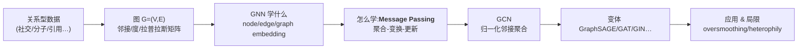
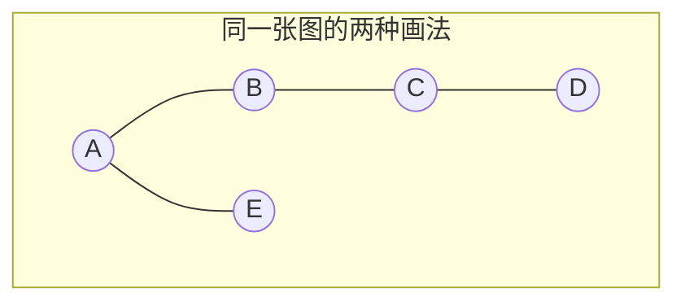
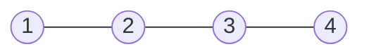
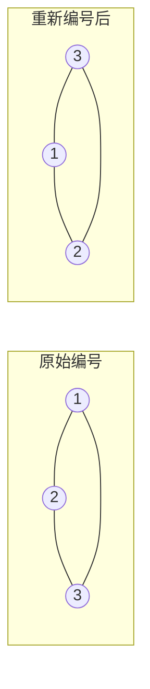
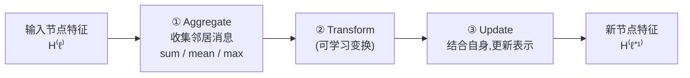
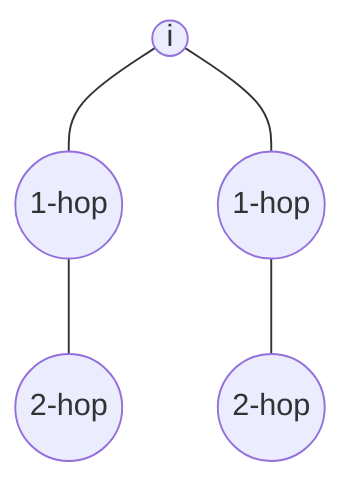
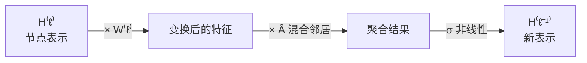
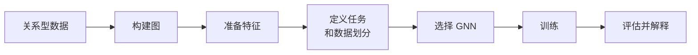
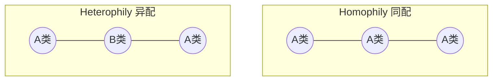

# 第十一章 · 图神经网络 Graph Neural Networks:表示、消息传递与 GCN

> **学习目标 (Learning objectives)** — 读完本章你应该能够:
> - 用 nodes、edges、feature matrix、adjacency matrix 把关系型数据表示成一张图,并写出 adjacency / degree / Laplacian 三个矩阵;
> - 解释为什么 graph 数据不能自然地交给 MLP 或 CNN 处理,以及 permutation equivariance/invariance 到底要求什么;
> - 把 **message passing**(消息传递)读成"基于邻居的表示学习",并能手算两轮消息传递;
> - 写出并解释 GCN layer 的 node-wise 形式与 matrix 形式 $H^{(\ell+1)}=\sigma(\hat A H^{(\ell)} W^{(\ell)})$;
> - 区分 node-level、edge-level、graph-level 三类预测任务;
> - 说出 GNN 的主要家族(GCN/GraphSAGE/GAT/GIN/R-GCN/Graph Transformer)各自的核心思想与适用场景;
> - 指出 GNN 的典型失败模式(oversmoothing、oversquashing、heterophily)与实践设计权衡。

我们这门课一路走来,处理的数据其实都"很规整":回归里是一行行独立的特征向量,CNN 里是排成网格的像素,RNN/Transformer 里是有先后顺序的序列。它们有一个共同点——**数据点之间要么相互独立,要么沿着某个固定的顺序(空间或时间)排列**。但现实里有一大类数据不是这样的。

老师在课上用了一个很贴切的例子:把这间教室看成数据。开学第一周,每个人都是一个孤立的特征向量(身高、成绩、兴趣……);可上了五六周课之后,你和邻座加了微信、和后排的人在 Facebook 上互相点了赞、和某人交换了邮箱——**人没变,但人和人之间长出了"连接"**。这些连接本身携带信息:谁和谁来往密切、谁是班里的"活跃节点"。要预测"谁是班委""这是个什么样的班级",光看单个人的特征是不够的,**关系结构 (relational structure) 本身就是预测信号**。这正是 graph 数据的本质,也是本章 **图神经网络 (Graph Neural Networks, GNN)** 要解决的问题。

本章的主线可以先记在脑子里:先搞清楚**图是什么**(代数对象)→ **GNN 想学什么**(node/edge/graph 表示)→ **它靠什么学**(message passing,全章的心脏)→ **GCN** 这个最常用的具体实现 → **各种变体与设计选择** → **应用、局限与考试**。

> 📎 **拓展(超出 slides)** — 课程定位提示:老师明确说本章重点是**理解与推理**,不是背公式。考试"不会要求你推导任何方程",但会给你一个方程问"如果改动这一项会怎样""为什么有人要这样设计"。所以本章每个公式,你要会**读它在说什么**,而不是会从头推它。下面的讲解会刻意强调每个符号、每一项的"含义"。

---

## 1. 为什么需要图?关系结构才是关键

### 1.1 很多数据天生不是独立的特征向量

回忆一下我们处理过的数据形态。**序列数据 (sequence)** 像股票价格、文本,靠的是**顺序**——RNN/Transformer 利用先后次序和 attention;**网格数据 (image grid)** 像图片,靠的是**局部网格邻域**——CNN 用卷积核扫描相邻像素。这两类都有一个"规则的"邻域结构(前后、上下左右)。

但社交网络、分子、引用网络这些数据,邻域是**不规则的 (irregular)**:一个节点可能连着 2 个邻居,另一个连着 200 个,而且"谁挨着谁"完全由数据本身决定,没有统一的行列坐标。老师把三者的对比讲得很清楚:

| 数据形态 | 邻域结构 | 典型模型 | 利用的归纳偏置 |
|---|---|---|---|
| Sequence(序列) | 线性、有顺序 | RNN / Transformer | 顺序 + attention |
| Image grid(网格) | 规则二维网格 | CNN | 局部网格邻域 |
| **Graph(图)** | **不规则邻域** | **GNN** | **图的连接关系** |

GNN 把 **graph connectivity(图的连接)当作 inductive bias(归纳偏置)**——也就是说,模型从一开始就假设"信息应该沿着边流动"。这一点和我们 Week 8 讲 regularization 时说过的话呼应:**选择一种网络结构,本质上就是选择了一类你愿意去逼近的函数**。你选了图结构,就等于告诉模型"请重点利用这些连接"。

> **🔑 例(为什么"结构即信息")** — 老师举的几个真实例子,值得记住,因为考试爱用它们当背景:
> - **Connected Papers** 这个网站:输入一篇论文,它画出引用它/被它引的所有论文构成的图,你一眼就能看出该读哪些相关工作。引用关系(边)本身就告诉你论文之间的脉络。
> - **推荐系统**:你在购物网站点了自行车、点了马拉松,系统把你的点击建成图,一挖掘就知道"该给他推头盔"。
> - **欺诈/异常检测**:政府或平台把人群建成图,通过连接模式发现可疑团伙;只要你用社交平台,就会"掉面包屑",有心人能从图里拼出你的画像。
> - **药物发现 (drug discovery)**:把分子建成"原子=节点、化学键=边"的图,通过和已知有效分子的结构相似性,预测新分子能不能治某种病。

### 1.2 同一张图,画法可以千变万化

这里有个关键直觉,直接决定了后面所有的设计。看下面这张图:节点 A、B、C、D、E 之间有若干连接。我**把 A 画在左上还是右下,把 E 挪到哪个角落,都不重要**——只要那些连接(边)还在,它就还是同一张图。

对比一下:如果是一张图片,我把像素位置打乱,它就变成了另一张图片;如果是股票序列,我把时间 $t$ 和 $t{+}1$ 的收盘价对调,数据的含义就全变了;甚至一句话,词序一改意思就不同。**唯独 graph,节点摆在哪里无所谓,真正定义它的是"连接"。** 这就是后面 permutation invariance(排列不变性)的来源,先记住这个画面。

> **本节小结** — 当实体之间的**关系**对预测很重要、而不只是附带的元数据时,就该用图来建模;图的价值在于连接结构,而连接结构与"节点怎么摆放"无关。

---

## 2. 图作为代数对象:从画图到矩阵

画图只是为了让我们脑子里有个直观形象。真正喂给 GNN 训练的,全是**矩阵 (matrices)**。这一节把图翻译成线性代数,这样才能"借用线性代数的全部威力"去发现规律。

### 2.1 形式定义

一个 **graph(图)** 是一个二元组(老师强调这是个 tuple):
$$G = (V, E)$$
其中 $V=\{v_1, v_2, \dots, v_n\}$ 是 **nodes(节点,也叫 vertices 顶点)** 的集合,$E \subseteq V\times V$ 是 **edges(边)** 的集合。一条边 $(i,j)\in E$ 表示节点 $i$ 和节点 $j$ 相连。几个变体:

- **Undirected(无向)**:$(u,v)\in E \Leftrightarrow (v,u)\in E$,边没有方向,你来我往是对称的。
- **Directed(有向)**:边是有序对,$u\to v$ 不等于 $v\to u$(比如"关注"关系、引用关系)。
- **Weighted(带权)**:边带实数权重(路程时间、化学键强度)。
- **Attributed(带属性)**:节点和/或边带特征向量——这是机器学习里我们最关心的情形。

再认两个常用记号,后面公式里到处都是:**$\mathcal{N}(i)$** 表示节点 $i$ 的 **neighbourhood(邻居集合)**;$|S|$ 表示集合 $S$ 的 **cardinality(基数,即元素个数)**。例如节点 B 若与 A、C、D 相连,则 $\mathcal N(B)=\{A,C,D\}$,$|\mathcal N(B)|=3$。

### 2.2 GNN 的输入到底是什么

一个 attributed graph 喂给 GNN 时,典型输入是三件套:
$$G = (A,\; X,\; E_{\text{feat}})$$

- **$A \in \mathbb{R}^{n\times n}$:adjacency matrix(邻接矩阵)**——"谁连着谁",编码图的**结构**。
- **$X \in \mathbb{R}^{n\times F}$:node-feature matrix(节点特征矩阵)**——每个节点一行 $x_i\in\mathbb R^F$,编码每个节点**自身**的信息。
- **$E_{\text{feat}}$:edge features(边特征)**——可表示关系类型、距离、化学键类型或权重。
- 此外 **labels(标签)** 可以挂在节点、边或整张图上。

一句话:$A$ 决定信息**能往哪流**,$X$ 决定每个节点**带什么信息**。

### 2.3 三个核心矩阵:邻接、度、拉普拉斯

用老师课上那个最简单的例子:4 个节点排成一条链,1–2、2–3、3–4 相连,1 和 4 不相连。

**Adjacency matrix(邻接矩阵)** $A$:$A_{ij}=1$ 表示 $i$ 与 $j$ 相连,否则为 0。对角线为 0(节点默认不连自己)。
$$A=\begin{pmatrix} 0&1&0&0\\ 1&0&1&0\\ 0&1&0&1\\ 0&0&1&0 \end{pmatrix}$$
注意它是 **symmetric(对称)** 的:因为 1 连 2,则 2 也连 1,所以 $A=A^{\mathsf T}$。这正是无向图的特征,也正因为对称,我们才能放心地把线性代数那一套用上去。

**Degree matrix(度矩阵)** $D$:对角矩阵,$D_{ii}=\sum_j A_{ij}$ 数的是节点 $i$ 有几个邻居。这里节点 1 和 4 各 1 个邻居,2 和 3 各 2 个:
$$D=\begin{pmatrix} 1&0&0&0\\ 0&2&0&0\\ 0&0&2&0\\ 0&0&0&1 \end{pmatrix}$$

**Graph Laplacian(图拉普拉斯)** $L = D - A$,它把"连接"编码进一个矩阵,是后续谱分析 (spectral analysis) 的基础:
$$L=D-A=\begin{pmatrix} 1&-1&0&0\\ -1&2&-1&0\\ 0&-1&2&-1\\ 0&0&-1&1 \end{pmatrix}$$

> 📎 **拓展(超出 slides)** — 老师顺口提了一句:Graph Laplacian 和 **Fourier transform** 有深刻关系,它支撑了 **graph signal processing(图信号处理)**——用图来处理信号的整套理论。这部分"比较玄",考试不要求,但知道"GCN 最初是从图谱卷积推出来的"有助于理解后面为什么要做对称归一化。

### 2.4 实践中会遇到的图的种类

老师建议这张表**从右往左读**:不是"背一串类型",而是"我手上这个问题,该用哪种图来建模"。

| 图的类型 | 含义 | 例子 |
|---|---|---|
| Homogeneous(同质) | 只有一种主要的节点/边类型 | 论文引用网络 |
| Heterogeneous(异质) | 多种节点或边类型 | 推荐里的用户、商品、标签 |
| Bipartite(二部图) | 两类节点,边只跨类相连 | 用户—商品 |
| Directed(有向) | 边的方向有意义 | 关注网络、引用网络 |
| Weighted(带权) | 边的强弱有意义 | 道路通行时间、化学键强度 |
| Dynamic(动态) | 图随时间变化 | 金融交易、交通网络 |
| Knowledge graph(知识图谱) | 实体 + 语义关系 | "药物 治疗 疾病""作者 写了 论文" |

> **本节小结** — 图 $G=(V,E)$ 在计算上就是三个矩阵:$A$(谁连谁)、$D$(各连几个)、$L=D-A$(连接的代数编码);GNN 的输入是 $(A, X, E_{\text{feat}})$ 加标签。

---

## 3. GNN 到底学什么:三种表示,三类任务

有了图的代数表示,下一个问题是:GNN 学出来的**到底是什么**?答案是 **embedding(嵌入/表示)**。

### 3.1 三个层次的 embedding

老师特意停下来解释 **embedding** 这个词,因为它在全课反复出现:embedding 就是把对象映射到一个 **latent space(隐空间)**,在那里对象获得了原始形式看不出来的**语义含义**。回想 NLP 里的 word2vec:词本身只是符号,映射到嵌入空间后,意思相近的词聚到一起。GNN 做的是同一件事,只不过对象是图上的东西。它可以学三个层次的表示:

- **node embedding(节点嵌入)** $h_i$ —— 用于 **node classification(节点分类)**(这个人是什么类型、这个基因是不是致病基因);
- **edge embedding(边嵌入)** $h_{ij}$ —— 用于 **link prediction(链接预测)** 或关系分类(这条关系强不强);
- **graph embedding(图嵌入)** $h_G$ —— 用于 **whole-graph prediction(整图预测)**(这个分子有什么性质、这个班是不是"高智商班")。

关键一句:**图的结构约束了表示如何被更新和共享**——一个节点的 embedding 不是孤立学出来的,而是被它的邻居"塑造"出来的。老师的说法很形象:"tell me your friends and I'll describe you"(告诉我你的朋友,我就能描述你)。

### 3.2 三类预测任务

| 任务 | 在什么层次 | 形式 | 例子 |
|---|---|---|---|
| **Node classification** | 节点 | $y_i = f(h_i)$ | 论文主题、用户类型、致病基因 |
| **Link prediction** | 边 | $p_{ij} = f(h_i, h_j)$ | 推荐、补全缺失关系、交互预测 |
| **Graph classification** | 整图 | $y_G = f(h_G)$ | 分子性质、欺诈模式、程序行为 |

> **🔑 例(link prediction 的直觉)** — 老师讲得很生动:你是 1 号的朋友,1 号是 2 号的朋友,2 号是 3 号的朋友——那么"你和 3 号会不会成为朋友?"很可能会。LinkedIn 正是这么干的:它发现你和某人是三度、四度连接,兴趣又相似,就弹窗"你可能想认识他"。这就是从图里**预测一条还不存在的边**。

> 📎 **拓展** — slides 上把"GNN 学什么"列成清单,老师提示要**反过来读**:"我能学到 node/edge/graph 表示"——这其实就是在告诉你**可能的考题方向**(给定场景,判断这是 node 还是 graph 级任务)。

---

## 4. 为什么不能直接用 MLP:排列等变与不变

既然图最后也是矩阵,为什么不把它拍扁成一个向量喂给 MLP?这一节回答这个"看似简单其实很关键"的问题——它也是 GNN 整个设计哲学的支点。

### 4.1 MLP 期望固定顺序,图没有顺序

**MLP(multilayer perceptron)** 期望输入特征有**固定的排列顺序**:第 1 维永远是身高、第 2 维永远是体重。CNN、RNN 也一样,都假设数据有某种空间或时间的**序**。可是图**没有天然的节点顺序**——我们在 §1.2 已经看到,把节点重新编号(relabel)不该改变任何预测结果。

更重要的是:**connectivity(连接)不是"又一个特征",它定义了信息的流动方式。** 你如果硬把图拍扁成特征向量喂给 MLP,这种"沿边流动"的结构信息就丢了。所以我们需要一种从设计上就尊重图结构的模型。

### 4.2 Permutation equivariance vs invariance(排列等变 vs 不变)

GNN 应当满足两条性质,区别在于"任务在哪个层次":

- **Permutation equivariance(排列等变)——node-level**:如果把节点顺序打乱,**节点的输出也跟着同样打乱**。你和某人的关系不会因为他换了个座位就消失——只要邻接矩阵 $A$ 里那条连接还在。节点级预测要的是这个。
- **Permutation invariance(排列不变)——graph-level**:如果把节点顺序打乱,**整图的预测完全不变**。这个班被判定为"高智商班",改天大家换座位坐,结论还是一样。整图级预测要的是这个。

### 4.3 为什么聚合函数能保证这两条性质

答案藏在一个简单的事实里:**sum、mean、max 这些聚合 (aggregation) 函数,天然与"邻居以什么顺序被列出"无关。** $4+5+7$ 和 $7+4+5$ 一样,$\max(4,5,7)$ 和 $\max(7,5,4)$ 一样。所以只要 GNN 用这类**与顺序无关的聚合**来融合邻居信息,排列等变/不变就自动成立。这也正是下一节 message passing 为什么非用这类聚合不可——它是把"图没有顺序"这个约束,落实到计算里的办法。

> **本节小结** — 不能用 MLP,是因为图没有节点顺序而 MLP 要求固定顺序;GNN 通过**与顺序无关的邻居聚合**,获得节点级的 permutation equivariance 和图级的 permutation invariance。

---

## 5. 消息传递 Message Passing:全章的心脏

老师反复强调:**"the heart of everything is message passing"**。前面所有铺垫,都是为了讲清楚这一个机制。一句话概括:**GNN 通过反复地把每个节点的特征,和它图邻域的信息融合,来学习表示。**

### 5.1 一个 GNN "layer" 到底是什么(最常见的误解)

先消除一个误解,老师专门为此重做了课件。在 MLP/CNN 里,"4 层"意味着 4 组堆叠的、不同的处理单元。**但 GNN 里的 "layer" 完全不是这个意思。**

> **GNN 的一个 layer = 在同一张图上,做一轮消息传递与节点更新。**

图的结构 $A$ 自始至终**没变**,节点也还是那些节点、坐在原位;**变的只是节点的表示矩阵**:
$$H^{(0)} \to H^{(1)} \to H^{(2)} \to \cdots$$
课件里把每层的图重画一遍、只是给节点换了颜色,纯粹是为了图示;真实计算是在**同一张图**上递归地精炼同一批节点的 embedding。老师的类比:这就像 CNN 里一个 filter 作用于输入得到一张新的 feature map——feature map 是数据的一种新表示;GNN 每做一轮消息传递,也得到图的一种新表示,但**架构没变,节点没动,只是"颜色"(表示)变了**。

| 维度 | MLP / CNN | GNN |
|---|---|---|
| 输入结构 | 固定向量 / 网格张量 | 不规则图(节点 + 边) |
| 层的操作 | 张量变换 | 消息传递 + 节点更新 |
| 什么在变 | feature maps / 隐藏激活 | 节点嵌入 $H^{(\ell)}$ |
| 什么在指导计算 | 权重矩阵、卷积核 | 图连接 $A$(或归一化的 $\hat A$) |
| "更深"意味着 | 更多层张量变换 | 更多轮邻域信息交换 |
| 常见误解 | 通常符合"堆叠层"的直觉 | 误以为在堆叠"新图";实则是**递归精炼同一批节点的嵌入** |

### 5.2 通用消息传递层的公式

把上面的话写成公式。对每个节点 $i$,一层消息传递分两步:

**第一步——聚合邻居的消息 (aggregate):**
$$m_i^{(\ell)} = \mathrm{AGG}_{\,j\in\mathcal N(i)}\; \phi^{(\ell)}\!\left(h_i^{(\ell)},\, h_j^{(\ell)},\, e_{ij}\right)$$

**第二步——用消息更新自己 (update):**
$$h_i^{(\ell+1)} = \psi^{(\ell)}\!\left(h_i^{(\ell)},\, m_i^{(\ell)}\right)$$

逐个符号读(这正是考试会考的"读方程"):
- $h_i^{(\ell)}$:节点 $i$ 在第 $\ell$ 层的当前表示;
- $\mathcal N(i)$:$i$ 的邻居;那个 $j\in\mathcal N(i)$ 就是"$j$ 是 $i$ 的邻居"的意思;
- **$\phi$:message function(消息函数)**——根据"我自己 $h_i$、邻居 $h_j$、连我俩的边 $e_{ij}$"算出一条消息;
- **AGG:permutation-invariant aggregation(排列不变聚合)**——把所有邻居的消息汇总成一个,与邻居顺序无关(§4.3);
- **$\psi$:update function(更新函数)**——把"我旧的表示"和"汇总来的邻居消息"结合,产生我新的表示。

用大白话说:**一个节点的新表示 = 它旧表示 + 邻居信息的、与顺序无关的汇总。**

### 5.3 三步走:Aggregate → Transform → Update

老师喜欢把一层 GNN 拆成三个动作,便于记忆:

一层 GNN 就是**一条"用局部邻域信息更新节点表示"的可学习规则**。

### 5.4 深度 = 感受野:一层一跳

为什么要堆多层?因为**一层只传递一跳 (one-hop) 的信息**。

- 做完 1 层,$h_i^{(1)}$ 包含了直接邻居(1-hop)的信息;
- 做完 2 层,$h_i^{(2)}$ 还反映了"邻居的邻居"(2-hop),因为第 2 层聚合时,邻居已经在第 1 层吸收过它们各自的邻居了;
- 一般地:**做完 $L$ 层消息传递,一个节点的表示能包含最多 $L$ 跳以外节点的信息。**

这就是 GNN 里的 **receptive field(感受野)**:深度越大,感受野越大。这和 CNN 里"层数越深、感受野越大"是一个道理,只不过这里"距离"是用图上的跳数(hop)量的。

### 5.5 手算:两轮消息传递

老师特意手算了一个数值例子。他的原则很值得学:**"能用手算,就能写代码"**——先用手把机制走一遍,你才真懂它。

设节点 $i$ 有两个邻居 $j,k$,初始(标量)表示为
$$h_i^{(0)}=2,\quad h_j^{(0)}=4,\quad h_k^{(0)}=6.$$
采用**带自身信息的 mean 聚合**(self-information,即把自己也算进去):
$$h_v^{(\ell+1)} = \frac{1}{|\mathcal N(v)|+1}\left(h_v^{(\ell)} + \sum_{u\in\mathcal N(v)} h_u^{(\ell)}\right)$$

> **🔑 例(Worked example)**
> **Round 1** — 节点 $i$ 有 2 个邻居,分母 $=|\mathcal N(i)|+1 = 3$:
> $$h_i^{(1)} = \tfrac13(2+4+6) = 4.$$
> 假设同一规则也把邻居更新为 $h_j^{(1)}=5,\; h_k^{(1)}=7$。
> **Round 2** —
> $$h_i^{(2)} = \tfrac13\!\left(h_i^{(1)}+h_j^{(1)}+h_k^{(1)}\right) = \tfrac13(4+5+7) = \tfrac{16}{3}\approx 5.33.$$
> **读这个例子的关键**:图自始至终没变,变的只是 $i$ 的嵌入 $h_i^{(0)}\!\to\! h_i^{(1)}\!\to\! h_i^{(2)}$。如果换成 **max 聚合**,Round 1 的结果就是 $\max(2,4,6)=6$;换成 **sum**,就是 $2+4+6=12$。聚合函数的选择决定了"邻居信息怎么汇总"。

### 5.6 为什么一定要带上"自己"(self-loop / self-information)

注意上面公式里那个"$+\,h_v^{(\ell)}$"——更新时**必须把节点自己也算进去**。老师的话很形象:**"你不能忘了自己,否则久而久之你就变成了别人。"** 如果只聚合邻居、不保留自身,节点会丢失自己的身份(identity),也就无法"和自己对话"。在矩阵实现里,这通过加 **self-loop(自环)** $\tilde A = A + I$ 实现——这正是下一节 GCN 的第一步。

> **本节小结** — Message passing 是 GNN 的核心:每层在同一张图上,对每个节点做"聚合邻居消息(与顺序无关)→ 变换 → 结合自身更新";堆 $L$ 层 = 感受野 $L$ 跳;更新时务必保留自身信息。

---

## 6. 图卷积网络 GCN:最常用的具体实现

通用消息传递给了我们一个框架。**Graph Convolutional Network(图卷积网络,GCN)** 是其中最常见的一个具体实例——它的特点是用**归一化的邻接矩阵**来做邻居聚合。

### 6.1 为什么需要归一化(以及自环)

直接用 $A$ 聚合有两个毛病,GCN 各用一招解决:

**毛病一:节点会忘了自己。** → 解法:**加自环 (add self-loops)**
$$\tilde A = A + I$$
这样聚合时每个节点都保留自己的信息(承接 §5.6)。

**毛病二:高度数节点 (high-degree nodes) 会主导更新。** 一个连着 200 人的节点,消息一加和,数值就爆掉,把别人都盖过去。→ 解法:**对称归一化 (symmetric normalisation)**
$$\hat A = \tilde D^{-1/2}\,\tilde A\,\tilde D^{-1/2},\qquad \tilde D_{ii}=\sum_j \tilde A_{ij}$$
其中 $\tilde D$ 是 $\tilde A$ 的度矩阵。归一化让不同度数的节点在特征混合时**尺度稳定**,谁也别想靠"朋友多"就压倒别人。这和我们之前对输入特征做归一化、避免某个大特征主导的道理完全一样。

### 6.2 GCN 层:node-wise 形式

把"归一化 + 共享变换 + 非线性"写成单个节点的更新:
$$h_i^{(\ell+1)} = \sigma\!\left(\sum_{j\in\mathcal N(i)\cup\{i\}} \frac{1}{\sqrt{\tilde d_i\,\tilde d_j}}\; h_j^{(\ell)} W^{(\ell)}\right)$$

读这个公式:
- $j\in\mathcal N(i)\cup\{i\}$:邻居**加上自己**(自环);
- $\dfrac{1}{\sqrt{\tilde d_i \tilde d_j}}$:基于两端度数的归一化系数,控制尺度;
- $W^{(\ell)}$:**所有节点共享**的可学习权重矩阵,对邻居特征做变换;
- $\sigma$:非线性激活(ReLU、tanh 等),提供非线性表达能力。

### 6.3 GCN 层:matrix 形式(Kipf–Welling)

把所有节点的更新一次性写成矩阵,就是最常被引用的 **Kipf–Welling GCN layer**:
$$\boxed{\,H^{(\ell+1)} = \sigma\!\left(\hat A\, H^{(\ell)}\, W^{(\ell)}\right)\,},\qquad \hat A = \tilde D^{-1/2}\tilde A\,\tilde D^{-1/2}$$

- $H^{(0)} = X$:第 0 层就是输入的节点特征;
- $\hat A$:**混合邻居**特征(谁连谁决定怎么混);
- $W^{(\ell)}$:可学习的特征变换;
- $\sigma$:非线性。

**怎么读这个式子(考试高频):** 虽然写成 $\hat A H^{(\ell)} W^{(\ell)}$,但可以分两步理解——
1. $H^{(\ell)}W^{(\ell)}$:对每个节点的特征做一次**可学习的变换**(transform);
2. 左乘 $\hat A$:把每个节点变换后的特征,**和它邻居的混合起来**(aggregate)。

所以一句话:**一个 GCN 层 = 归一化的邻域聚合 + 共享的可学习变换 + 非线性。** 同一个 $W^{(\ell)}$ 被所有节点共享(类比 CNN 的权重共享);**多堆几层,感受野就扩大**(§5.4)。

### 6.4 用 GCN 做半监督节点分类

GCN 最经典的应用是 **semi-supervised node classification(半监督节点分类)**:图里只有**一部分节点有标签**,大量节点没标签,我们想推断那些没标签节点的类别。

一个**两层 GCN** 的完整前向:
$$Z = \mathrm{softmax}\!\left(\hat A\;\sigma\!\left(\hat A X W^{(0)}\right) W^{(1)}\right)$$
只在**有标签的节点**上算交叉熵损失:
$$\mathcal L = -\sum_{i\in\mathcal Y_L}\sum_{c} Y_{ic}\log Z_{ic}$$

它为什么 work?**因为图结构会把信息从有标签节点"传播"到无标签节点。** 老师的说法:一个打着问号(?)的节点,本来没有值;但它和别人相连,做几轮消息传递后,它会从邻居那里"沾染"上一个值,从而能被推断、被分类。这就是半监督的精髓——**少量已知,顺着连接,推断未知。**

> **🔑 例(考试原型题)** — 一名学生提议用**两层 GCN** 对引用网络里的论文(节点)做分类:节点特征是论文摘要的 bag-of-words 向量,边代表引用。
> 1. **用了哪些信息?** 节点特征(摘要词袋)提供论文**内容**;图结构($\hat A$)提供论文之间的**引用关系**。
> 2. **$\hat A$ 的作用?** 它告诉模型哪些论文相连,从而把每篇论文的表示和它引用/被引的论文混合——让内容相似且互相引用的论文表示靠拢。
> 3. **为什么可能 work?** 互相引用的论文往往主题相近(homophily),邻域聚合会强化这种一致性。
> 4. **一个要实验检验的失败模式?** 若存在 **heterophily**(相连论文主题其实不同),或层数过多导致 **oversmoothing**,效果会变差(见 §8)。

### 6.5 Transductive vs Inductive(直推式 vs 归纳式)

最后区分两种使用设定,它决定了你该不该用 GCN 这种"吃固定邻接矩阵"的模型:

| | **Transductive(直推式)** | **Inductive(归纳式)** |
|---|---|---|
| 训练/测试节点 | 属于**同一张图**(闭集) | 要泛化到**没见过的节点或新图** |
| 标签 | 只有部分节点有标签 | 需要基于特征的泛化 |
| 典型场景 | 引用网络 | 分子、推荐、动态图 |
| 设计后果 | 直接吃整张 $A$ 即可 | 常需采样、局部聚合、可泛化的特征 |

老师特别澄清:**inductive(归纳)= generalization(泛化)**,也就是我们全课一直追求的"训练集和部署集来自**同一分布**,但具体样本不同"。在直推式里没有"新数据进来测试"——测试节点训练时就在图里,只是它的标签被遮住,做完消息传递后给它一个预测值;若真有新节点/新图进来,那就是 inductive 的活。注意别把测试节点的标签泄漏进训练(**data leakage**)。

> **本节小结** — GCN = 加自环 $\tilde A=A+I$ → 对称归一化 $\hat A=\tilde D^{-1/2}\tilde A\tilde D^{-1/2}$ → $H^{(\ell+1)}=\sigma(\hat A H^{(\ell)}W^{(\ell)})$;它把"归一化邻域聚合 + 共享变换 + 非线性"合在一层,经典用法是半监督节点分类,靠图结构把标签信息从已知传到未知。

---

## 7. GNN 家族与设计选择

GCN 只是起点。不同问题对"邻居信息怎么聚合"有不同需求,于是发展出一个 GNN 大家族。下表先纵览,再逐一讲关键的几个。

| 家族 | 核心思想 | 优势 | 典型用途 |
|---|---|---|---|
| **GCN** | 基于归一化邻接矩阵的聚合 | 简单、高效、强基线 | 引用网络、节点分类 |
| **GraphSAGE** | 采样 + 聚合邻域 | 归纳式、可扩展 | 大图、动态图 |
| **GAT** | attention 加权的邻居聚合 | 学出"哪个邻居更重要"、可解释 | 邻居相关性不均、需可解释 |
| **GIN** | sum 聚合 + 表达力强的 MLP 更新 | 图级判别力强 | 分子图分类 |
| **R-GCN** | 关系特定的变换 | 处理多关系图 | 知识图谱 |
| **Graph Transformer** | 在图感知的 token/节点上做 attention | 捕捉长程交互 | 分子、复杂关系任务 |

### 7.1 GraphSAGE:采样并聚合

GCN 要把**整个邻域**一次性聚合,大图上太贵。**GraphSAGE** 的招数是:每个节点只**采样固定数量的邻居**再聚合。
$$h_{\mathcal N(i)}^{(\ell)} = \mathrm{AGG}\big(\{h_j^{(\ell)}: j\in\mathcal N(i)\}\big)$$
$$h_i^{(\ell+1)} = \sigma\!\left(W^{(\ell)}\big[\,h_i^{(\ell)} \,\big\|\, h_{\mathcal N(i)}^{(\ell)}\,\big]\right)$$
这里 $\|$ 是**拼接 (concatenation)**——把"自己的表示"和"邻域聚合"接起来再变换。好处:当全邻域聚合太贵时省算力,而且天然支持**没见过的节点和大图**(inductive)。

### 7.2 GAT:让模型学"哪个邻居更重要"

GCN 用度数归一化系数对待邻居,但**并非所有邻居都同等重要**。**Graph Attention Network(GAT)** 用 **attention 权重 $\alpha_{ij}$** 来加权聚合:
$$h_i^{(\ell+1)} = \sigma\!\left(\sum_{j\in\mathcal N(i)} \alpha_{ij}\, W h_j^{(\ell)}\right)$$
$\alpha_{ij}$ 不是预先定死的,而是**从节点特征里学出来**的——像给图挂了一层"注意力 mask",自动判断该多看哪个邻居。**Multi-head attention(多头注意力)** 可以稳定训练。这正是我们在 Week 9 Transformer 里学的 attention,搬到了图上。

### 7.3 Graph-level Readout:从节点到整图

要做**图级**预测(如判断整个分子的性质),得把所有节点表示汇总成一个图表示——这一步叫 **readout(读出)**:
$$h_G = \mathrm{READOUT}\big(\{h_i^{(L)}: i\in V\}\big)$$
和聚合一样,readout **必须对节点顺序不变**(graph-level 要 permutation invariance)。常用 sum/mean/max 以及 attention pooling。用于分子分类、程序分析、图级异常检测。

### 7.4 怎么选架构

老师又一次提醒**从右往左读**:先看"我是什么情况",再决定"用什么"。

| 情况 | 可能的选择 | 为什么 | 注意 |
|---|---|---|---|
| 小的同质图 | GCN | 简单、可解释、强基线 | 遇到 heterophily 会吃力 |
| 大的动态图 | GraphSAGE | 邻居采样带来可扩展性 | 采样设计很关键 |
| 邻居相关性不均 | GAT | 学注意力权重 | 计算更贵 |
| 图分类 | GIN 或图池化模型 | 判别力强 | 小数据集易过拟合 |
| 多关系知识图谱 | R-GCN 或 KG 嵌入 | 关系特定参数 | 参数可能爆炸 |
| 长程依赖 | Graph Transformer / 位置编码 | 捕捉非局部交互 | 需谨慎正则化 |

> **本节小结** — 同一个 message-passing 框架,换"聚合方式"就得到不同家族:GCN(归一化和)、GraphSAGE(采样拼接)、GAT(注意力加权)、GIN(求和+MLP)、R-GCN(按关系)、Graph Transformer(全局注意力);选哪个由图规模、任务层次、关系类型、是否 heterophily、是否需要泛化共同决定。

---

## 8. 应用、局限与失败模式

### 8.1 什么时候该用 GNN

GNN 用得非常广。老师把应用分两大类:

- **科学与工程**:分子性质预测、蛋白质相互作用网络、电网/交通预测、传感器网络与故障检测;
- **信息与社会系统**:推荐系统、引用网络、欺诈/交易网络、知识图谱推理。

但有一条原则要刻在心里:**GNN 该被"关系型归纳偏置"证明其合理,而不是"因为数据长得像张图"。**

| ✅ 该用 GNN | ⚠️ 要谨慎 |
|---|---|
| 关系对预测是核心 | 边是噪声或随意定义的 |
| 邻域携带语义含义 | 标签与邻域结构无关 |
| 任务是 node/edge/graph 级 | 图太稠密、局部性失去意义 |
| "同一规则"应适用于图的各处 | 简单基线已经表现很好 |

### 8.2 实践工作流

老师说,这里的**关键工程问题**永远是那一句:**"什么是节点?什么是边?什么是特征?要预测什么?"** 在班级例子里:节点是人,边是人际关系,节点特征是每个人的属性,边特征描述两人连接的性质。

### 8.3 数据划分:别让信息泄漏

图上的 **data split** 比普通数据更微妙,因为节点是连在一起的:

| 划分方式 | 做法 |
|---|---|
| Node split | train/val/test 标签挂在同一张图的不同节点上 |
| Edge split | 藏掉一些边做 link prediction,看模型能否还原 |
| Graph split | 在一些图上训练,在没见过的图上测试 |
| Temporal split | 用过去训练,用未来的图事件测试 |

⚠️ 当图有强 homophily、重复结构或时间依赖时,**随机划分可能误导**——划分方式应当匹配真实部署场景。

### 8.4 评估指标随任务而变

| 任务 | 输出 | 常用指标 |
|---|---|---|
| Node classification | 每节点一个类别 | Accuracy、macro-F1、micro-F1 |
| Link prediction | 候选边的分数 | AUC、average precision、Hits@K |
| Graph classification | 每图一个类别 | Accuracy、F1、ROC-AUC |
| Graph regression | 每图一个实数 | MAE、RMSE、$R^2$ |
| 异常检测 | 异常分数 | AUC、precision@K、recall@K |

指标必须匹配**预测层次**和应用中**犯错的代价**。

### 8.5 三大失败模式

这是本章最该记牢的"坑",也是老师反复点名的考点。

**① Oversmoothing(过平滑)** — 堆**太多层**时,因为不停地"平均的平均的平均",所有节点的表示会越来越**相似**,最后变得"一片模糊",难以区分。老师说这就是**为什么 GNN 通常不做得很深**——你得知道"该传几跳就停"。

**② Oversquashing(过压缩)** — 一个**固定大小**的 embedding,被迫去概括越来越多的远处节点;重要的长程信息在通过图的"瓶颈"时被**压缩或丢失**。缓解办法:graph rewiring、residual connections、positional encodings、attention。

二者的区别一定要分清:

| | Oversmoothing | Oversquashing |
|---|---|---|
| 问题本质 | 表示变得**太相似** | 信息被挤过**狭窄瓶颈**而丢失 |
| 诱因 | 层数过多、反复平均 | 远处信息太多、嵌入容量固定 |
| 直觉 | "大家都变成一个样" | "太多远方信号塞进一个向量" |

**③ Homophily vs Heterophily(同配 vs 异配)** — 很多简单 GCN 默认 **相连的节点倾向于相似(homophily)**。但如果相连节点常有**不同**标签(**heterophily**),朴素的"平滑/聚合"反而会**伤害**性能——你把不同类的信息混到一起了。

### 8.6 其他实践挑战

- **Scalability(可扩展性)**:大图可能放不进内存,mini-batching 不平凡;
- **Dynamic graphs(动态图)**:边和节点特征会随时间变;
- **Feature quality(特征质量)**:节点/边特征差,模型学不到东西;
- **Graph construction(图的构造)**:边的定义不同,学习问题就不同;
- **Interpretability(可解释性)**:解释要同时涉及特征和关系路径;
- **Fairness & leakage(公平与泄漏)**:图的连接可能编码了敏感信息或未来信息。

> **本节小结** — 该用 GNN 是因为"关系是核心",不是因为"数据像图";堆太深会 oversmoothing,瓶颈会 oversquashing,异配(heterophily)会让朴素平滑失效——这三个是最常考的失败模式。

---

## 本章小结 (Key takeaways)

- **图表示实体与关系**;在计算上,一张图就是 **adjacency $A$、degree $D$、normalised adjacency $\hat A$** 等矩阵,把连接结构代数化。
- **GNN 通过 message passing 学习表示**:在同一张图上反复地"聚合邻居(与顺序无关)→ 变换 → 结合自身更新";一个 layer = 一轮消息传递 = 一跳信息,堆 $L$ 层 = 感受野 $L$ 跳。
- **不能用 MLP**,因为图没有节点顺序;GNN 用与顺序无关的聚合,获得节点级 **permutation equivariance** 与图级 **permutation invariance**。
- **GCN 是最常用的实例**:$H^{(\ell+1)}=\sigma(\hat A H^{(\ell)}W^{(\ell)})$,即"归一化邻域聚合 + 共享变换 + 非线性";经典用于**半监督节点分类**,靠图结构把标签从已知传到未知。
- **更新务必保留自身信息(self-loop $\tilde A=A+I$)**,否则节点会丢失身份;**对称归一化**防止高度数节点主导。
- **GNN 支持 node classification、link prediction、graph classification** 三类任务;readout 把节点表示汇成图表示(须排列不变)。
- **架构选择**取决于图规模、任务、关系类型、heterophily 与部署设定:GCN / GraphSAGE / GAT / GIN / R-GCN / Graph Transformer 各有所长。
- **堆层会带来 oversmoothing 与 oversquashing**;**heterophily** 会让朴素平滑失效——这些是 GNN 最重要的局限。
- 一句话:**GNN 最好被理解为"由关系结构引导的表示学习 (representation learning guided by relational structure)"。**

---

## 如何复习这一章 & 考试提示

老师在最后一节课(也是他多年来最后一堂教学课)给的复习与考试建议,几乎是"划重点",照做即可:

**对每一个 GNN 模型家族,问自己这六个问题**(这是 slides "How to Study This Topic" 的核心):
1. 表示的是什么图对象——node、edge 还是整图?
2. 邻域信息是**怎么聚合**的?
3. **学的是什么**——权重、attention 系数、关系特定变换,还是 pooling 函数?
4. 在解决**哪类预测任务**?
5. 对 locality、homophily、图结构做了**什么假设**?
6. 可能出现**什么失败模式**?

**关于考试(老师反复强调):**
- 形式:**纸笔闭卷,3 小时**,共 **4 道大题**,每题分小问,**每小问 5 分,合计 100 分**;可用**分值**判断该题要投入多少笔墨(1 分的小问别写一整页)。
- **不会考推导 (no derivation)**。考的是**推理与解释**:给你一个方程,问"这一项是什么含义""改动它会怎样""为什么这样设计"。
- 允许带 **一张 A4 cheat sheet(可双面)**。老师的忠告:**别在小抄上抄公式,纯属浪费空间**;要写就写**概念的解释**——"这一项是什么意思、有什么设计含义"。用机器学习的**专业语言**回答(说"这是 regularizer""这是 error term""$\hat A$ 是归一化邻接矩阵,决定谁连谁"),别只说"A 是个符号"。
- 别死记硬背,**靠基本功 (fundamentals) 解释问题**。空白卷拿不到分,所以"用机器学习的语言写出合理的东西"。

> **🔑 自测题(Check your understanding,来自 slides)**
> 1. 对社交网络,为什么图比特征向量更自然?
> 2. adjacency matrix 编码了什么?
> 3. GCN 为什么在归一化前要加 self-loop?
> 4. 在 $H^{(\ell+1)}=\sigma(\hat A H^{(\ell)}W^{(\ell)})$ 里,$\hat A$ 的作用是什么?
> 5. node classification 和 graph classification 有何不同?
> 6. 为什么 GNN 层数太多会导致 oversmoothing?

---

## 参考文献 (Selected references)

- Kipf, T. N. & Welling, M. (2017). *Semi-supervised classification with graph convolutional networks.* ICLR. (GCN)
- Gilmer, J. et al. (2017). *Neural message passing for quantum chemistry.* ICML. (MPNN,消息传递统一框架)
- Hamilton, W. L., Ying, R. & Leskovec, J. (2017). *Inductive representation learning on large graphs.* NeurIPS. (GraphSAGE)
- Veličković, P. et al. (2018). *Graph attention networks.* ICLR. (GAT)
- Xu, K. et al. (2019). *How powerful are graph neural networks?* ICLR. (GIN)
- Battaglia, P. W. et al. (2018). *Relational inductive biases, deep learning, and graph networks.* arXiv:1806.01261.
- Broadwater, K. & Stillman, N. (2023). *Graph Neural Networks in Action.* Manning.(老师推荐、会发给大家的入门书,带可运行代码)
