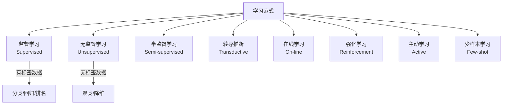
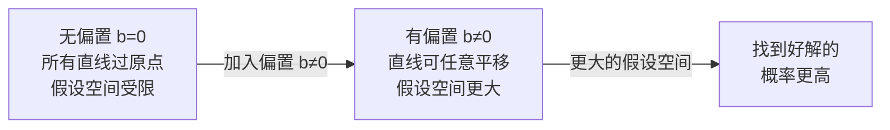
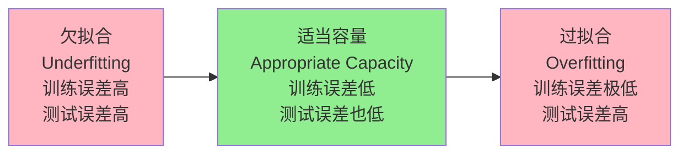
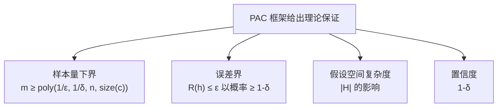
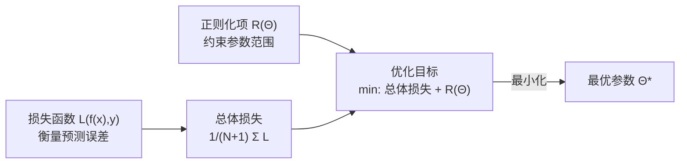

# 第二章 · 机器学习导论 (General Introduction to Machine Learning)

> **学习目标 (Learning objectives)** — 读完本章你应该能够:
> - **解释** 机器学习的本质含义,并用 Mitchell (1997) 的 T/E/P 框架准确描述"学习"
> - **区分** 八种学习范式(监督、无监督、半监督、转导推断、在线、强化、主动、少样本),并举例说明各自的适用场景
> - **列举并形式化** 至少六类 ML 任务(分类、回归、排名、聚类、降维、生成合成等),能写出对应的函数映射形式
> - **推导** 线性回归的正规方程,解释偏置项 *b* 的几何意义
> - **区分** 欠拟合与过拟合,说明容量、训练样本量与泛化误差之间的三重权衡
> - **解释** PAC 学习框架中泛化误差与经验误差的关系,理解框架给出的保证
> - **描述** 损失函数与正则化的作用,写出带正则项的优化目标

---

机器学习这个名字听起来像是一种黑魔法——让计算机"自己学会"做事。但如果你剥去这层神秘感,会发现它的核心思想极其朴素:与其手工写规则告诉程序"如果 A 就做 B",不如让程序**从数据中自动发现**那些规则。这一章就是要把这个朴素想法变成一套可以动手实现的严谨框架。

---

## 1. 什么是机器学习?——从直觉到定义

### 1.1 直觉层面:学习是寻找函数

想象你要写一个程序来识别图片里是不是一只猫。传统方法是:列出所有猫的特征(有耳朵、有胡须……),然后写一大堆 `if-else`。这个方法的致命缺陷是:特征太多、例外太多,人根本列不完。

机器学习换了一个角度:**不手写规则,而是让程序从大量(图片, 标签)样本对里自动学出判断规则**。你给它看一万张猫和非猫的图片,它自己摸索出一个从"像素向量"到"是猫/不是猫"的映射函数。

这个观察引出了 ML 的统一视角:

> **机器学习的核心任务,是从数据中学习一个函数 $f$,使其能将输入映射到期望的输出。**

具体地,slides 给出了如下要点:

- ML 是**从数据中自动提取模式 (extracting patterns)** 的过程。
- ML 是"用样本数据或过往经验来优化某个性能准则 (performance criterion) 的程序设计方法"。
- 学习算法会涉及:优化 (optimization)、代价函数 (cost function)、模型 (model)、数据集 (dataset)。
- 模型被参数所定义 (defined up to parameters),而学习就是用训练数据优化那些参数的过程。
- 训练出来的模型可以是**预测性的 (predictive)**——对新数据作预测;也可以是**描述性的 (descriptive)**——从数据中获得洞见;或二者兼具。

### 1.2 形式化:Mitchell (1997) 的 T/E/P 框架

机器学习领域最经典的定义来自 Tom Mitchell (1997):

> **定义 (Mitchell 1997):** 一个计算机程序被称为"从经验 $E$ 中学习",当且仅当:它在某类任务 $T$ 上的性能,以 $P$ 来衡量,会随着经验 $E$ 的增加而提升。

三个字母分别代表:

| 字母 | 英文 | 中文含义 | 本章例子 |
|------|------|---------|---------|
| **T** | Task | 要完成的**任务** | 识别图片里的物体 |
| **E** | Experience | 用于学习的**经验/数据** | 带标注的图片数据集 |
| **P** | Performance | 衡量"学得好不好"的**性能度量** | 测试集准确率 |

这个框架的深刻之处在于它明确区分了"什么是学习"和"学习在干什么":学习本身不是目标任务,而是**获得完成目标任务能力的手段**。

为什么需要学习而不是手工编程?因为有些任务"太难用固定程序解决了"——比如识别自然语言、理解图像。规则太复杂、例外太多、情境太多变。但如果有足够多的数据,机器可以从中归纳出比人手写更精妙的模式。

---

## 2. 学习的八种范式——谁来提供"答案"?

现实中的 ML 任务形态各异,其中最根本的区别在于:**训练时数据有没有标签?** 以及**学习过程如何组织?** 这催生了八种主要的学习范式。

### 2.1 监督学习 (Supervised Learning)

**监督学习**是最常见、也是本课程重点的范式。学习者接收一组**带标签的样本 (labelled examples)** 作为训练数据,然后对所有**未见过的点 (unseen points)** 作预测。

> **形式化地说:** 学习者拿到训练集 $\{(x_1, y_1), \ldots, (x_m, y_m)\}$,其中 $x_i$ 是特征向量,$y_i$ 是对应标签。目标是学出函数 $f$ 使得 $f(x) \approx y$ 对新样本也成立。

监督学习的典型应用包括**分类 (classification)**、**回归 (regression)**、**排名 (ranking)**。例如:垃圾邮件过滤(分类)、房价预测(回归)、搜索结果排序(排名)。

在概率论语言中,监督学习的本质是学习**条件概率分布 $p(\mathbf{y}|\mathbf{x})$**——给定特征 $\mathbf{x}$,标签 $\mathbf{y}$ 的概率。

### 2.2 无监督学习 (Unsupervised Learning)

**无监督学习**中,学习者只收到**无标签的数据**,没有人告诉它"正确答案"是什么。它的目标是**发现数据内部的结构或规律**。

讲师在课堂上打了一个生动的比方:想象你从火星来到地球,从未见过人类,却掌握了 ML 算法。你观察教室里的每个人,提取特征(身高、体型等),用聚类算法一跑——发现数据自然分成了两簇。你给这两簇起名字:A 和 B。这就是聚类。你不需要事先知道"男性/女性",算法自己发现了这个结构。

无监督学习在概率论语言中是:隐式或显式地学习**数据的概率分布 $p(\mathbf{x})$**。

典型任务:**聚类 (clustering)**、**降维 (dimensionality reduction)**。

### 2.3 半监督学习 (Semi-supervised Learning)

**半监督学习**处于监督与无监督之间:训练集中**既有带标签样本,也有无标签样本**。标注数据昂贵时(比如医疗图像需要专家标注)这个设定很实用——可以用少量标注数据配合大量无标注数据来提升模型效果。

### 2.4 转导推断 (Transductive Inference)

与监督学习类似,但目标更窄:**只预测特定的、已知的测试点的标签**,而不是学出一个通用函数。适合测试集已经给定、不需要泛化到任意新点的场景。

### 2.5 在线学习 (On-line Learning)

**在线学习**打破了"先训练后部署"的流程。学习和测试**交替进行**:在每一轮中,学习者收到一个无标签训练点,作出预测,然后承受一个损失。目标是**最小化所有轮次的累积损失**。

这个范式特别适合数据流动态变化的场景,比如推荐系统实时更新、股票价格预测。

### 2.6 强化学习 (Reinforcement Learning)

**强化学习 (RL)** 中,学习者通过**与环境交互**来收集信息,有时还会影响环境本身。每次行动后收到即时奖励 (reward),目标是**最大化长期奖励**。这个场景与动态规划密切相关。

AlphaGo 就是强化学习的代表作——它通过自我对弈来不断学习更优的落子策略。

### 2.7 主动学习 (Active Learning)

在**主动学习**中,学习者可以**主动向"标注者" (oracle) 查询**哪些新样本需要标注。它不是被动接受给定数据,而是策略性地选择最有价值的样本来询问,从而用较少的标注样本达到与完全监督学习可比的性能。

### 2.8 少样本学习 (Few-shot Learning)

**少样本学习 (few-shot learning)** 模仿人类从极少量例子中泛化的能力。想象一下:你只需给一个小孩看两三张斑马的图片,他以后就能认出任何斑马——不管角度、光线多奇特。机器能做到吗?

目前主流方法是借助**预训练模型 (pre-trained models)**、**元学习 (meta-learning)** 或**生成式方法**来创造新样本。这是当前 ML 研究的热点领域之一。

---

## 3. 学习任务的分类——机器能干什么?

在明确了学习的范式之后,我们来看 ML **具体能解决哪些任务**。下面的形式化描述非常重要——当你读论文时,这些符号会反复出现。

### 3.1 特征向量:数据的语言

一切 ML 任务的起点是**特征 (features)**。现实中的对象——一张图片、一段文字、一个人——要被送入算法,首先必须转化成数字向量。

> **定义:** 一个**样本 (example)** 是对某个对象或事件的**特征**的定量描述,表示为向量 $\mathbf{x} \in \mathbb{R}^n$。

这里 $\mathbb{R}^n$ 表示 $n$ 维实数空间——即 $\mathbf{x}$ 有 $n$ 个数字分量,每个分量 $x_i$ 是某项可测量的属性值。比如描述一个人,可以用身高 $x_1$、体重 $x_2$、年龄 $x_3$ 等组成向量 $\mathbf{x} = (x_1, x_2, x_3)^T \in \mathbb{R}^3$。

讲师反复强调的一个核心思想:

> **"机器学习本质上就是寻找一个函数。"**

所有不同类型的任务,只是这个函数的输入/输出空间不同而已。

### 3.2 分类 (Classification)

**目标:** 给每个样本分配一个类别标签 (category)。

**形式化:** 从数据中学习函数

$$f: \mathbb{R}^n \rightarrow \{1, \ldots, k\}$$

即输入 $n$ 维特征向量,输出 $k$ 个类别中的一个。$y = f(\mathbf{x})$ 将特征向量 $\mathbf{x}$ 赋给由 $y$ 标识的类别。

函数也可以输出**每个类别的概率分布**,而不只是一个离散标签——这就是概率分类的设定。

**概率视角:** 学习条件概率 $p(y|\mathbf{x})$,找到使其最大的类别。

> **🔑 例 (Worked example)**
>
> 垃圾邮件过滤:$\mathbf{x}$ = 邮件的词频向量(1000 维,每维代表一个常用词出现与否),$k=2$($y=1$ 表示垃圾邮件,$y=0$ 表示正常邮件)。学习目标:找到函数 $f: \mathbb{R}^{1000} \rightarrow \{0, 1\}$,使其对未见过的邮件也能正确分类。

### 3.3 回归 (Regression)

**目标:** 预测每个样本的一个**数值 (numerical value)**,而不是类别。

**形式化:**

$$f: \mathbb{R}^n \rightarrow \mathbb{R}$$

与分类的唯一区别是输出空间从离散集合 $\{1,\ldots,k\}$ 变成了连续实数 $\mathbb{R}$。

> **🔑 例 (Worked example)**
>
> 讲师提到了一个真实案例:通过 X 光片测量儿童的尺骨 (ulna)、桡骨 (radius) 及其他骨骼尺寸,**预测该儿童成年后的最终身高**。这就是一个回归问题:$\mathbf{x}$ = 骨骼测量值向量,$y$ = 身高(连续实数)。

### 3.4 排名 (Ranking)

**目标:** 根据某种准则对一组项目排序。

经典例子是**网络搜索**。Google 的 PageRank 算法(由 Larry Page 在博士论文中提出)就是对搜索结果按相关性排名。推荐系统中对商品按用户偏好打分也属于排名问题。

### 3.5 聚类 (Clustering)

**目标:** 在无监督设定下,将项目划分为若干**同质区域 (homogeneous regions)**。

关键特点:不需要事先知道类别。算法根据特征向量在空间中的距离,发现数据的自然分组。

> **🔑 例 (Worked example)**
>
> 顾客细分:电商平台不知道用户属于哪种类型,但把每个用户的购买行为表示成向量后,聚类算法发现了"价格敏感型"、"品质优先型"等自然群体。

### 3.6 降维与流形学习 (Dimensionality Reduction / Manifold Learning)

**目标:** 将高维数据表示转换为**低维表示**,同时保留尽量多的信息。

讲师举例:若我们用 50 个测量指标描述班上每个同学(即每人是 $\mathbb{R}^{50}$ 中的一个点),但实际上这些数据可能内在只有 5 个独立变化方向。降维就是找到这个 5 维**流形 (manifold)** 或**子空间 (subspace)**。

关键思想:从 50 维降到 5 维时,**信息量的损失要尽可能小**。这背后涉及信息论的概念。常用技术是**特征值分解 (eigenvalue decomposition)** 或**奇异值分解 (Singular Value Decomposition, SVD)**。

| 任务 | 形式 $f$ | 输出类型 | 典型场景 |
|------|---------|---------|---------|
| 分类 | $\mathbb{R}^n \to \{1,\ldots,k\}$ | 离散类别 | 图像识别、垃圾邮件 |
| 回归 | $\mathbb{R}^n \to \mathbb{R}$ | 连续值 | 房价、身高预测 |
| 排名 | — | 有序列表 | 搜索引擎、推荐系统 |
| 聚类 | — | 分组标签 | 顾客细分、基因分析 |
| 降维 | $\mathbb{R}^n \to \mathbb{R}^k$ ($k \ll n$) | 低维向量 | 数据可视化、压缩 |

### 3.7 自然语言理解、问答与对话

**目标:** 给定一段文本或语音,产生对其意义的理解 (NLU)、或用自然语言回答问题 (QA)、或维持多轮对话 (dialogue)。

这些任务的形式化略复杂。以**转录 (transcription)** 为例:

$$f: \mathbb{R}^n \rightarrow \mathbb{A}^{k(m)}$$

其中 $\mathbb{A}$ 是某种语言的字母表(英语、中文等),$k(m)$ 是依应用不同的变长输出。语音识别就是这个形式。

**机器翻译 (machine translation)** 则是:

$$f: \mathbb{A}_x^{k(n)} \rightarrow \mathbb{A}_y^{k(m)}$$

将源语言字母序列映射到目标语言字母序列。

> 📎 **拓展(超出 slides)** — ChatGPT、Claude 等大型语言模型把 NLU、QA、对话、摘要等功能集成到了一个基于 Transformer 的语言模型中。这些都是 slides 中提到的"下游任务 (downstream tasks)"在现代系统中的体现。

### 3.8 结构化输出 (Structured Output)

**目标:** 输出不是一个数字或单个类别,而是一个**内部元素有重要关系的结构化数据对象**。例如:给一张图片生成描述句子(图像说明),给一段视频生成活动描述。转录和翻译是其子集。

### 3.9 异常检测 (Anomaly Detection)

**目标:** 从一组事件或对象中**标记出不寻常的、非典型的 (unusual/atypical)** 个体。

核心思想:异常对象属于与大多数对象**非常不同的概率分布**。因此需要:

1. 估计正常数据的分布
2. 度量新样本与该分布的距离
3. 距离超过阈值则标记为异常

这自然引出两个问题:如何估计分布?如何度量分布之间的距离?

### 3.10 合成与采样 (Synthesis and Sampling)

**目标:** 生成与训练数据**相似的新样本**,输出可能有指定的结构或约束。

经典例子:从文字描述合成图像("一只有粉红色胸部和黑色翅膀的小鸟")——这正是 GAN (Generative Adversarial Network, **生成对抗网络**) 的应用。

讲师提到,GAN 曾经风靡一时,但训练极不稳定,已逐渐被**稳定扩散 (stable diffusion)** 等方法取代。当你问 ChatGPT 生成图像时,背后就是这类扩散模型。

### 3.11 缺失值填充与去噪

**缺失值填充 (Imputation of missing values):** 给定 $\mathbf{x} \in \mathbb{R}^n$,其中某些分量 $x_i$ 缺失,要预测这些缺失值。

**去噪 (Denoising):** 给定一个**被污染的版本** $\tilde{\mathbf{x}}$,预测原始的干净样本 $\mathbf{x}$。从概率论角度,这等同于学习条件概率分布 $p(\mathbf{x}|\tilde{\mathbf{x}})$。

### 3.12 密度估计 (Density Estimation)

**目标:** 直接学习数据的**概率密度函数 (probability density function)** 或**概率质量函数 (probability mass function)**:

$$p_{\text{model}}: \mathbb{R}^n \rightarrow \mathbb{R}$$

这是许多 ML 任务的基础,因为"许多 ML 任务都需要对概率密度进行估计"。

---

## 4. 性能度量——"好"是什么意思?

学完了什么,怎么知道学得"好"?这就需要**性能度量 (performance measure)**。

讲师在课堂上强调:当你说某个模型"好",你必须问自己——**"好"意味着什么?怎么量化它?**

### 4.1 基本原则

- 性能度量必须是**定量的 (quantitative)**,才能客观评价算法能力。
- 性能是**任务特定的 (task-specific)**:适合分类的指标未必适合回归。
- 性能度量必须**匹配系统的期望行为**。

### 4.2 常见指标

| 指标 | 适用场景 | 含义 |
|------|---------|------|
| **准确率 (Accuracy)** | 分类 | 预测正确的样本占总样本的比例 |
| **错误率 (Error rate)** | 分类 | $1 - \text{Accuracy}$ |
| **精确率 (Precision)** | 分类(尤其类别不均衡时) | 预测为正类中实际为正类的比例 |
| **召回率 (Recall)** | 分类(尤其检测任务) | 实际为正类中被正确检测到的比例 |
| **均方误差 MSE** | 回归 | $\frac{1}{N}\sum_i (\hat{y}_i - y_i)^2$ |

> 📎 **拓展(超出 slides)** — 精确率和召回率往往是矛盾的(提高一个会降低另一个),工程中常用 **F1 分数 = 2·Precision·Recall / (Precision+Recall)** 来折中。讲师提到对象检测 (object detection) 中会用到 Precision 和 Recall。

---

## 5. 经验与数据——学习的燃料

机器学习算法的"经验"就是**数据**。数据的性质决定了算法的范式。

### 5.1 两类经验

**无监督经验:** 数据集包含许多特征,但**没有标签**。算法隐式或显式地学习**数据的概率分布 $p(\mathbf{x})$**。

**监督经验:** 数据集既有特征,也有与每个样本关联的**标签 (label)** 或**目标值 (target)**。给定多个样本 $\mathbf{x}$ 和关联标签 $\mathbf{y}$,学习估计**条件分布 $p(\mathbf{y}|\mathbf{x})$**。

### 5.2 数据表示:设计矩阵

当我们有 $N$ 个样本,每个样本有 $P$ 个特征时,最自然的组织方式是把它们排成一个矩阵。

> **定义:** **设计矩阵 (design matrix)** $\mathbf{X} \in \mathbb{R}^{N \times P}$ 是将所有样本堆叠而成的矩阵:
>
> $$\mathbf{X} = \begin{pmatrix} \mathbf{x}_1^T \\ \vdots \\ \mathbf{x}_N^T \end{pmatrix}$$
>
> 第 $i$ 行是第 $i$ 个样本的特征向量 $\mathbf{x}_i = (x_1, \ldots, x_P)^T$。

当样本的特征数量不相等时(比如不同长度的句子),可以改用集合表示 $\{\mathbf{x}^{(1)}, \mathbf{x}^{(2)}, \ldots, \mathbf{x}^{(m)}\}$。

### 5.3 关键问题:需要多少数据?

讲师在课堂上就以下三个问题展开了讨论:

1. **建立好的 ML 系统需要多少数据?**
2. **训练集和测试集分布不匹配时,ML 系统表现如何?**
3. **如何量化这种不匹配?**

对于问题 1,答案并不简单:

- 数据质量非常重要——干净的数据比数据量更关键。
- 所需数据量取决于**模型复杂度**:越复杂的函数需要越多数据点才能充分约束。例如,一条直线只需 2 个点;而一条高次曲线需要更多点。
- 仅有 1 个点可以过无穷多条直线——数据量不足意味着欠约束。

对于问题 2,**根本假设是:**

> **训练集和测试集(部署集)的分布必须相同。**

如果分布不同(例如:在白天光照下采集的人脸图像训练的模型,在红灯光照下就可能失效),模型的性能会下降。这个问题叫做**域偏移 (domain shift)** 或**分布偏移 (distribution shift)**。应对方法称为**域适应 (domain adaptation)**,是 ML 的活跃研究领域。

对于问题 3,度量两个分布之间距离的一个常用工具是 **KL 散度 (Kullback–Leibler divergence)**。在生成模型中,通过最小化 KL 散度,可以将随机噪声分布逐渐"推向"真实数据分布,从而学会生成新样本。

---

## 6. 线性回归:ML 框架的第一个实例

前五节建立了 ML 的概念框架。现在用一个具体例子把这些概念串起来——**线性回归 (linear regression)**。

### 6.1 问题设置

**任务 T:** 构建一个系统,接收特征向量 $\mathbf{x} \in \mathbb{R}^P$,预测一个标量 $y \in \mathbb{R}$,且 $y$ 被假设为依赖于 $\mathbf{x}$。

**模型假设 (inductive bias):** 线性回归假设输出是输入的**线性函数**:

$$\hat{y} = \boldsymbol{\omega}^T \mathbf{x}$$

其中 $\boldsymbol{\omega} \in \mathbb{R}^P$ 是**参数向量 (parameter vector)**,决定每个特征对预测的贡献。

> 📎 **拓展** — 当你假设 "$y$ 与 $\mathbf{x}$ 是线性关系",你就做出了一个**归纳偏置 (inductive bias)**:你没有穷举所有可能的函数,而是只在"线性函数族"里找答案。什么让你做出这个假设?通常是先可视化数据——如果散点图大致呈直线状,线性假设就合理。

### 6.2 性能度量 P:均方误差

将数据集分为**训练集** $\mathbf{X}^{(\text{training})}$ 和**测试集** $\mathbf{X}^{(\text{test})}$。

> **定义:** **均方误差 (Mean Squared Error, MSE)** 在测试集上定义为:
>
> $$\text{MSE}_{\text{test}} = \frac{1}{N_{\text{test}}} \sum_i \left(\hat{y}_i^{(\text{test})} - y_i^{(\text{test})}\right)^2$$

MSE 越小,说明预测值 $\hat{y}_i$ 与真实值 $y_i$ 越接近,模型越好。

### 6.3 训练:最优化问题

学习的核心是找到 $\boldsymbol{\omega}$ 使训练误差最小:

$$\min_{\boldsymbol{\omega}} \frac{1}{P} \|\mathbf{X}^{(\text{training})} \boldsymbol{\omega} - \mathbf{y}^{(\text{training})}\|_2^2 \quad \text{s.t.} \quad y = \boldsymbol{\omega}^T \mathbf{x}$$

这是一个关于 $\boldsymbol{\omega}$ 的**二次优化问题 (quadratic optimization)**。

> **🔑 例 (求解过程)**
>
> 对二次函数求最小值,高中数学告诉我们:**对其求导并令导数为零**。对上面的目标函数关于 $\boldsymbol{\omega}$ 求导并令其等于零,整理后得到**正规方程 (normal equations)**:
>
> $$\boldsymbol{\omega} = \left(\mathbf{X}^{(\text{training})T} \mathbf{X}^{(\text{training})}\right)^{-1} \mathbf{X}^{(\text{training})T} \mathbf{y}^{(\text{training})}$$
>
> 把训练数据代入这个公式,就能直接求出最优参数 $\boldsymbol{\omega}$。如果矩阵不可逆,使用**伪逆 (pseudo-inverse)**。

从几何上看,这个解就是把 $\mathbf{y}$ 投影到由 $\mathbf{x}_1, \mathbf{x}_2, \ldots, \mathbf{x}_P$ 张成的子空间上——投影点就是最优估计 $\hat{\mathbf{y}}$,这是能在该子空间内做到的最好近似。

### 6.4 偏置项的作用

更一般的线性回归模型包含**偏置 (bias)** 项 $b$:

$$\hat{y} = \boldsymbol{\omega}^T \mathbf{x} + b$$

**为什么需要 $b$?** 没有 $b$ 时,模型只能拟合过原点的直线(或超平面)。加入 $b$ 后,直线可以在输出轴方向自由平移,**极大地扩大了假设空间 (hypothesis space)**。

> **🔑 例**
>
> 讲师用直线 $y = mx + c$ 来说明:$c=0$ 时所有可能的直线都过原点,你的选择被极大地约束了。$c \ne 0$ 时,直线可以在 $y$ 轴方向随意移动,自由度翻倍。这就是神经网络中每个神经元都有偏置项的根本原因——给模型更大的自由度来拟合数据。

**核心训诫:** ML 中的优化思想会一遍又一遍地出现——**你总是在找一组使误差最小的参数**。牢记这个思想。

---

## 7. 容量、过拟合与欠拟合——泛化的关键

学会了线性回归之后,一个自然的问题出现了:模型在训练集上表现好,在新数据上也能表现好吗?这就是**泛化 (generalization)** 问题——ML 中最核心的挑战。

### 7.1 泛化:你真正想要的东西

**泛化**指的是:模型在**新的、从未见过的输入**上也能表现良好的能力。

一个学生刷题刷到每道题都背下来了,考试时遇到稍微不同的题就不会了——这叫死记硬背,没有泛化。ML 中同样的问题叫**过拟合**。

理想情况:模型不仅在训练集上犯的错少,在测试集(模拟真实部署环境)上也犯的错少。

**i.i.d. 假设:** 这一切的前提是训练数据和测试数据都是从**同一个、未知的数据生成过程 (data generating process)** 中**独立同分布地 (i.i.d., independently and identically distributed)** 采样的。

形式上,训练目标和测试目标分别是:

$$\text{Train to minimize:} \quad \frac{1}{N^{(\text{training})}} \|\mathbf{X}^{(\text{training})}\boldsymbol{\omega} - \mathbf{y}^{(\text{training})}\|_2^2$$

$$\text{Judge on test error:} \quad \frac{1}{N^{(\text{test})}} \|\mathbf{X}^{(\text{test})}\boldsymbol{\omega} - \mathbf{y}^{(\text{test})}\|_2^2$$

我们优化第一个,但真正关心的是第二个——这两个之间的差距就是泛化的核心矛盾。

### 7.2 欠拟合 (Underfitting)

> **定义:** **欠拟合**是指模型连在**训练集**上都无法获得足够低的误差。

直觉:模型太简单,不足以捕捉数据的规律。用一条直线去拟合明显的二次曲线形状的数据,就是欠拟合——因为线性模型的**容量 (capacity)** 不够大。

### 7.3 过拟合 (Overfitting)

> **定义:** **过拟合**是指训练误差和测试误差之间的差距**太大**——模型在训练集上表现极好,在测试集上却很差。

直觉:模型太复杂,把训练数据中的**噪声和偶然波动也记忆下来了**,无法泛化到新数据。

Goodfellow et al. 书中的经典图示(Figure 4):
- **左图(欠拟合):** 用直线拟合二次曲线数据 → 训练误差高,无法捕捉曲率。
- **中图(适当容量):** 用二次函数拟合 → 既准确又能泛化到新数据。
- **右图(过拟合):** 用 9 次多项式拟合 → 完美穿过每个训练点,但曲线极度弯曲,测试集上表现差。

### 7.4 容量 (Capacity)

> **定义:** **容量**是模型能够拟合各种各样函数的**能力**。

控制容量的方式:
- **调整假设空间:** 假设空间 (hypothesis space) = 学习算法允许选择的函数集合。增大假设空间(允许更高次多项式)= 增大容量 = 等价于增加特征数量。
- **增加训练样本:** 更多数据可以缓解过拟合。
- 过拟合也可以通过增加训练样本数量来避免。

### 7.5 三重权衡 (Triple Trade-off)

Alpaydin (2010) 点出了 ML 中永恒的三角矛盾:

> **容量越大,需要的训练数据越多,但泛化误差可以更小——前提是有足够数据。**

三者之间的权衡:

| 因素 | 增大时的效果 |
|------|-----------|
| 假设类的复杂度 ↑ | 容量增大 → 拟合能力强,但若数据不足则过拟合风险高 |
| 训练数据量 ↑ | 过拟合风险降低,泛化误差减小 |
| 目标泛化误差 ↓ | 要求更多数据或适当容量 |

**实践建议(来自讲师):**
- 特征要**独立(非冗余)**且**信息量丰富**——不能互相预测,每个特征提供独特信息。
- 数据要**分布均匀**——如果训练数据只覆盖了真实分布的一部分区域,模型在未覆盖区域会表现差。
- **数据划分惯例:** 通常将数据集按 **70% 训练 / 30% 测试** 的比例分割。两个子集必须来自同一分布(i.i.d.),绝对不能用测试集数据参与训练——这叫**数据污染 (data contamination)**。
- **100% 训练准确率应引起警惕**——很可能是过拟合或数据污染。"98% 的准确率已经是可以上市的产品了。"

---

## 8. PAC 学习框架——泛化有理论保证吗?

到目前为止,泛化都是"希望模型能做好",缺乏严格的数学保障。**PAC 学习框架 (Probably Approximately Correct Learning)** 给出了理论层面的回答。

> 📎 **注:** PAC 框架较为数学化,讲师说"不要太紧张 (don't sweat too much)",但鼓励有兴趣的同学深入研究。考试重点在概念理解,不在严格推导。

### 8.1 基本定义

**输入空间 $\mathcal{X}$:** 所有可能样本/实例的集合。

**标签空间 $\mathcal{Y} = \{0, 1\}$:** 二分类设定下,所有可能标签的集合。

**概念 $c: \mathcal{X} \rightarrow \mathcal{Y}$:** 从输入空间到标签空间的一个映射,代表"真正的分类规则"。可以把 $c$ 等同于 $\mathcal{X}$ 中使 $c$ 取值 1 的那个子集。

**i.i.d. 假设:** 所有样本是按某个固定但未知的分布 $\mathcal{D}$ 独立同分布采样的。

### 8.2 学习问题的形式化

> **问题 (Learning):** 学习者考虑一个固定的假设集 $\mathcal{H}$(可能不包含真实概念 $c$)。学习者收到按 $\mathcal{D}$ i.i.d. 采样的样本 $S = \{x_1, \ldots, x_m\}$ 及对应标签 $(c(x_1), \ldots, c(x_m))$。任务是用带标签样本 $S$ 选出 $h_S \in \mathcal{H}$,使其相对于概念 $c$ 的**泛化误差尽量小**。

### 8.3 泛化误差与经验误差

两个关键概念:

> **定义 (Generalization error / 泛化误差):**
>
> $$R(h) = \underset{x \sim \mathcal{D}}{\Pr}[h(x) \neq c(x)] = \underset{x \sim \mathcal{D}}{\mathbb{E}}[\mathbf{1}_{h(x) \neq c(x)}]$$
>
> 在分布 $\mathcal{D}$ 上,假设 $h$ 预测错误的概率。因为 $\mathcal{D}$ 和 $c$ 未知,**泛化误差无法直接计算**。

> **定义 (Empirical error / 经验误差):**
>
> $$\hat{R}(h) = \frac{1}{m} \sum_{i=1}^m \mathbf{1}_{h(x_i) \neq c(x_i)}$$
>
> 样本 $S$ 上的平均误差——就是**训练误差**,可以直接计算。

**关键定理:**

$$\mathbb{E}[\hat{R}(h)] = R(h)$$

即:**经验误差的期望等于泛化误差**。这正是我们用训练误差作为泛化误差代理的理论依据。

训练集上的误差之所以是泛化误差的**代理 (surrogate)**,正是因为在 i.i.d. 假设下,两者的期望相等。

### 8.4 PAC 可学习性

PAC 框架的核心结论:

> **定义 (PAC-learnable):** 对于任意 $\epsilon > 0$（近似精度），$\delta > 0$（置信度），在任意分布 $\mathcal{D}$ 和任意目标概念 $c \in \mathcal{C}$ 下,若存在算法 $\mathcal{A}$ 使得对于样本量 $m \geq \text{poly}(1/\epsilon, 1/\delta, n, \text{size}(c))$:
>
> $$\underset{S \sim \mathcal{D}^m}{\Pr}[R(h_S) \leq \epsilon] \geq 1 - \delta$$
>
> 则概念类 $\mathcal{C}$ 被称为 **PAC 可学习的 (PAC-learnable)**。

**解读这个定义:**
- "**Probably**" (概率 $\geq 1-\delta$): 以至少 $1-\delta$ 的置信度……
- "**Approximately**" (误差 $\leq \epsilon$): ……学到一个泛化误差不超过 $\epsilon$ 的假设。
- "**Correct**": 找到正确(近似)的概念。

PAC 框架给出了关于以下内容的**理论界**:
- 训练样本量 $m$ 的下界
- 训练误差与真实误差的差距
- 假设空间 $\mathcal{H}$ 的复杂度
- 置信度 $1-\delta$

---

## 9. 损失函数与正则化——优化什么?

我们已经在线性回归中见过 MSE 作为优化目标。现在从更一般的角度来理解**损失函数 (loss function)** 和**正则化 (regularization)**。

### 9.1 损失函数的角色

ML 中的目标函数通常以损失函数的形式定义,**最小化损失函数**就是训练的核心。

> 引用 Ciampiconi et al. (2023):
> "在机器学习文献中,目标函数通常定义为损失函数的形式,当它们最小化时达到最优。损失函数的确切形式取决于所要解决的问题的性质、可用数据以及正在被优化的 ML 算法类型。**寻找合适的损失函数是机器学习中最重要的研究方向之一。**"

### 9.2 一般设置

**目标:** 学习函数 $f: \Phi \mapsto \mathcal{Y}$,将输入空间映射到输出空间。$f$ 可由带参数 $\Theta$ 的模型 $f_\Theta$ 近似。

给定:
- 输入: $\{x_0, \ldots, x_N\} \in \Phi$
- 目标: $\{y_0, \ldots, y_N\} \in \mathcal{Y}$

> **定义 (Loss function):** **损失函数 $\mathcal{L}$** 将预测值 $f(x)_i$ 和对应目标值 $y_i$ 映射到一个实数 $l \in \mathbb{R}$,**衡量预测与目标之间的相似程度**。

对所有数据点聚合,得到总体损失:

$$\mathcal{L}(f|\{x_0,\ldots,x_N\},\{y_0,\ldots,y_N\}) = \frac{1}{N+1}\sum_{i=0}^N L(f(x_i), y_i)$$

**优化问题:**

$$\min_f \mathcal{L}(f|\{x_0,\ldots,x_N\},\{y_0,\ldots,y_N\})$$

### 9.3 正则化 (Regularization)

不加约束地最小化损失,会让参数随意取值——可能导致过拟合或数值不稳定。**正则化**通过在损失函数中加入**惩罚项 $R(f)$** 来约束解的空间。

带正则化的优化目标:

$$\min_f \frac{1}{N+1}\sum_{i=0}^N L(f(x_i), y_i) + R(f)$$

更一般地,以参数 $\Theta$ 表示:

$$\min_\Theta \frac{1}{N+1}\sum_{i=0}^N L(f_\Theta(x_i), y_i) + R(\Theta)$$

直觉:$R(\Theta)$ 就像是给模型设置的"预算约束"——你可以自由移动,但不能走太远。它把解限制在参数空间的某个区域内,从而提高泛化能力。

> 📎 **拓展** — 两种最常见的正则化:
> - **L2 正则化 (Ridge):** $R(\Theta) = \lambda \|\Theta\|_2^2$,惩罚参数的平方和,使参数趋向于小值。
> - **L1 正则化 (Lasso):** $R(\Theta) = \lambda \|\Theta\|_1$,惩罚参数的绝对值之和,倾向于产生稀疏解(很多参数为 0)。

---

## 10. 本章小结 (Key Takeaways)

1. **机器学习的本质是函数逼近**:所有 ML 问题——无论分类、回归还是翻译——都可以归结为从数据中学习一个从输入空间到输出空间的映射函数 $f$。

2. **Mitchell 的 T/E/P 框架**是理解"什么是学习"的基石:任务 T、经验 E(数据)、性能度量 P,三者缺一不可。学习不是目标,而是获得完成目标任务能力的手段。

3. **八种学习范式**以"标签是否可得"和"学习过程如何组织"为两个维度展开,其中监督学习(有标签)和无监督学习(无标签)是两个最核心的极点,其余范式均在某种程度上介于或延伸于二者之间。

4. **i.i.d. 假设是所有机器学习系统的根本前提**:训练集和测试集必须来自同一分布。违反此假设(域偏移)会导致模型在部署时性能骤降。

5. **泛化三重权衡**:模型容量、训练数据量、泛化误差之间存在不可消除的权衡——容量越大的模型需要越多数据才能保证泛化,而数据有限时应选择恰当的容量以避免过拟合。

6. **PAC 框架给泛化提供了理论保证**:经验误差(训练误差)的期望等于泛化误差,这使得训练误差成为泛化误差的有效代理;PAC 框架进一步给出了以何种样本量、以多大置信度能达到何种精度的理论界。

7. **损失函数是训练的核心**:选择合适的损失函数是 ML 研究中最重要的问题之一;正则化项通过约束参数空间来提高模型的泛化能力。

8. **偏置项扩大假设空间**:在线性模型中,加入偏置 $b$ 将假设空间从"过原点的函数族"扩展到"整个平移-缩放函数族",极大地增加了模型找到好解的可能性——神经网络中每个神经元的偏置设计源于同一直觉。

---

## 参考文献

- Alpaydin, E. (2010). *Introduction to machine learning* (Second ed.). The MIT Press.
- Ciampiconi, L., Elwood, A., Leonardi, M., Mohamed, A., & Rozza, A. (2023). *A survey and taxonomy of loss functions in machine learning.* online.
- Goodfellow, I., Bengio, Y., & Courville, A. (2016). *Deep learning.* MIT Press.
- Kukačka, J., Golkov, V., & Cremers, D. (2017). *Regularization for deep learning: A taxonomy.* online.
- Mitchell, T. M. (1997). *Machine learning.* WCB McGraw-Hill.
- Mohri, M., Rostamizadeh, A., & Talwalkar, A. (2012). *Foundations of Machine Learning.* MIT Press.
- Parnami, A., & Lee, M. (2022). *Learning from few examples: A summary of approaches to few-shot learning.* online.
