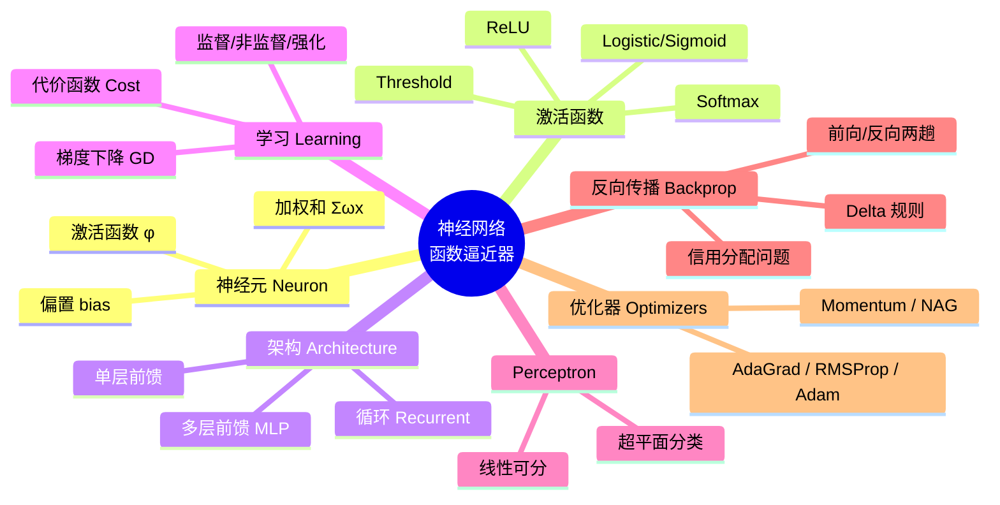
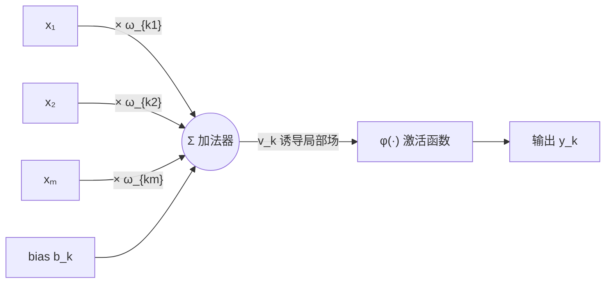
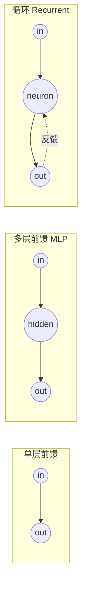
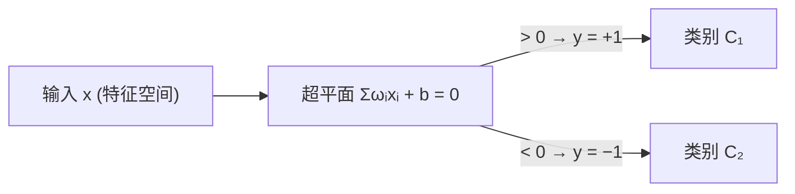
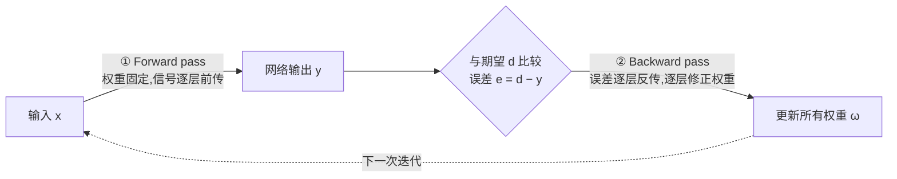

# Week 5 · 人工神经网络与深度学习导论 (I)

> **学习目标 (Learning objectives)** — 读完本章你应该能够:
> - 解释为什么一句话可以概括整个神经网络:它是一个**函数逼近器 (function approximator)**;
> - 画出并写出**单个神经元 (neuron)** 的数学模型,并说清楚"去掉激活函数后它就退化成线性回归"这件事;
> - 区分 threshold、logistic (sigmoid)、ReLU、softmax 四种 **activation function**,并说出各自的用途与"好激活函数"的性质;
> - 区分 single-layer / multilayer feedforward / recurrent 三类**网络架构**,并解释多层为什么能逐层抽取特征;
> - 从直觉(盲人下山)到公式(Taylor 展开、方向导数)推导**梯度下降 (gradient descent)**,并手算一维例子;
> - 解释 **perceptron** 如何用一个超平面做二分类,以及它"线性不可分就无能为力"的局限;
> - 讲清 **back-propagation** 的两趟(forward / backward)流程、**credit assignment problem**,并跟着链式法则推出 output 神经元与 hidden 神经元的权重更新公式;
> - 说出 momentum、Nesterov、AdaGrad、RMSProp、Adam 这些 **optimizer** 各自改进了基础梯度下降的哪一点。

机器学习走到这里,我们已经会用 regression 拟合实数、用 classification 划分类别、用 kernel/SVM 把线性不可分的数据"掰直"。这一章要登场的神经网络,初看像是另起炉灶的庞然大物,但讲师在课上反复敲黑板的一句话,其实把整章浓缩成了一颗种子:

> **"A neural network is a function approximator. 如果你这一章只记住一件事,就记住这句。"**

所有机器学习都在做同一件事——**学一个从输入空间到输出空间的映射 (a function that maps one space to another)**:从特征到类别、从特征到实数、从一种语言到另一种语言。神经网络的特别之处不在于它做的是别的事,而在于它是一个**万能 (universal)** 的函数逼近器:只要够大,它能逼近几乎任何形状的函数。本章就是要把这台机器拆开,看清它由什么零件构成(neuron、activation)、怎么搭起来(architecture)、又怎么通过数据自己调整成你要的那个函数(gradient descent + back-propagation)。

下面这张图是整章的骨架,先看个全貌,再逐节填满:

---

## 1. 从大脑到机器:神经网络是什么

**为什么会有神经网络?** 因为我们想造一台"像大脑那样工作"的机器。课本(Haykin 2009)给的定义有两层意思,值得拆开看。

第一句是工程视角:**神经网络 (neural network) 是一个大规模并行的分布式处理器,由许多简单的处理单元组成,天然倾向于储存经验知识并供以后使用**。注意这里的两个关键词——"许多简单单元"和"并行":单个单元蠢得很(只会算个加权和),但成千上万个并联起来,就能涌现出复杂的能力。这和你脑子里那 860 亿个神经元是一个道理:没有哪个神经元懂中文,但它们合起来让你读懂了这句话。

第二句是它"像大脑"的两个具体方面:

1. **知识是网络从环境中通过一个学习过程 (learning process) 获得的**——不是程序员写死的规则,而是看数据自己学出来的;
2. **神经元之间连接的强度,叫做 synaptic weights(突触权重),被用来储存学到的知识**。

第二点极其重要,后面会反复用到:**一个训练好的网络,它"学到的东西"全部藏在权重里**。讲师打了个很实在的比方——当我们说"训练一个神经网络",本质上就是在找那一堆权重该取什么值;训练完之后,你把这些权重连同网络结构打包压缩,搬到另一台机器上装好,它立刻就能替你干活。学习 = 调权重,知识 = 权重,这条等式请刻在脑子里。

> 📎 **拓展(超出 slides)** — 一个诚实的悖论:训练神经网络用的是 back-propagation,可神经科学家在真实大脑里**从来没找到**反向传播这个机制——人脑的学习方式和它完全不同。那为什么还用它?讲师的回答很工程师:"如果它走起来像鸭子、叫起来像鸭子,那它就是鸭子。" 反向传播在大脑里没有对应物,但它**有效**,于是我们就用它。这也提醒你:神经网络"模拟大脑"更多是历史灵感,而非严格仿真。

---

## 2. 神经元的解剖:一个加权和 + 一次挤压

整个网络的最小积木是 **neuron(神经元)**,一个**信息处理单元 (information-processing unit)**。它只做三件事,对应三个零件:

1. **Synapses / 连接链路 (connecting links)**:每条链路有自己的**权重 (weight)** $\omega_{kj}$。输入信号 $x_j$ 进入神经元 $k$ 的第 $j$ 条突触时,会被乘上这条突触的权重 $\omega_{kj}$。下标读法:$\omega_{kj}$ = "流向神经元 $k$、来自输入 $j$"的权重。
2. **Adder / 加法器**:把所有被加权的输入信号求和。
3. **Activation function / 激活函数(又叫 squashing function,挤压函数)**:限制神经元输出的幅度,把它"挤"到某个有限范围内。

此外还有一个**偏置 (bias)** $b_k$,它对加法器的输出做一次平移,抬高或压低送进激活函数的净输入。

把这三步写成数学,就是本章第一组要记牢的公式。先算加权和(课本叫 **linear combiner output**,线性组合器输出):

$$u_k = \sum_{j=1}^{m} \omega_{kj}\, x_j$$

再加偏置、过激活函数得到输出:

$$y_k = \phi(u_k + b_k)$$

中间那个"加完偏置、还没过激活函数"的量很关键,有个专门的名字叫**诱导局部场 (induced local field)** 或激活电位:

$$v_k = u_k + b_k$$

所以 $y_k = \phi(v_k)$。用一句话读出来:**神经元先把输入做一次加权求和,平移一个偏置得到 $v_k$,再用激活函数 $\phi$ 把它挤压成输出 $y_k$。**

**一个让公式更整洁的小技巧:把 bias 吸收进权重。** 偏置看起来像个"额外项",处理起来烦。我们可以新增一条特殊的突触:让它的输入恒为 $x_0 = +1$,权重恰好等于偏置 $\omega_{k0} = b_k$。这样偏置就变成了求和的一部分,公式从 $j=0$ 开始累加:

$$v_k = \sum_{j=0}^{m} \omega_{kj}\, x_j, \qquad y_k = \phi(v_k)$$

这不是耍花招,而是一个会贯穿全书的约定:从此**偏置就是"那个输入永远是 1 的权重"**,推导时不用再单独伺候它。

### 这颗神经元,你其实早就认识

讲师在课上演了一出"别慌"的戏:他让学生盯着 $v_k = x_1\omega_1 + x_2\omega_2 + \cdots + x_m\omega_m + b$ 看三分钟,问"这像什么?" 答案是——**这就是线性回归 (linear regression)**。还记得 Week 3 的 $y = \boldsymbol{\omega}^{\!\top}\mathbf{x} + b$ 吗?一模一样。

这给了我们一个极其重要的认识,也是本章和前几周的接口:

> **去掉激活函数,一个神经元就是一次线性回归;激活函数 $\phi$ 才是让神经网络"脱胎换骨"的地方。**

讲师甚至说:作业里要你"用一个单层神经网络实现回归",怎么做?在代码里写 `activation = None`(不加激活)就行,神经元退化成回归。是激活函数引入的**非线性 (non-linearity)**,才让网络能把数据映射到一个更丰富的空间,从而表达回归表达不了的复杂函数。所以下一节,我们必须认真对待激活函数。

> **🔑 例 (Worked example) — 手算一颗神经元(slides S15)**
>
> 设一个神经元有 3 个输入加 1 个偏置:
> - 权重:$\omega_{10}=b_1=0.5,\ \omega_{11}=0.4,\ \omega_{12}=0.6,\ \omega_{13}=0.2$
> - 输入:$x_0=1,\ x_1=1.2,\ x_2=2.0,\ x_3=1.8$
> - 激活函数:logistic sigmoid,斜率参数 $a=0.2$
>
> **第一步,算诱导局部场 $v_1$**(注意 $x_0=1$ 把偏置带进来了):
> $$v_1 = \sum_{j=0}^{3}\omega_{1j}x_j = 1{\times}0.5 + 0.4{\times}1.2 + 0.6{\times}2.0 + 0.2{\times}1.8 = 0.5+0.48+1.2+0.36 = 2.54$$
>
> **第二步,过激活函数:**
> $$y_1 = \phi(v_1) = \frac{1}{1+\exp(-a\,v_1)} = \frac{1}{1+\exp(-0.2\times 2.54)} = \frac{1}{1+\exp(-0.508)} \approx 0.624$$
>
> 这类题"没有秘密,就是代数字"——讲师建议你自己换几组数试试,培养手感。这也是考试里完全可能出现的计算题类型。

---

## 3. 激活函数:非线性的灵魂

上一节留了个悬念:激活函数到底重要在哪?这一节给出四个常用选择,并说清"好的激活函数"该长什么样。

### 3.1 四种常见激活函数

**① Threshold function(阈值函数,又称 Heaviside / 阶跃函数)** — 最古老、最简单的一个。输入过了 0 就输出 1,否则输出 0:

$$\phi(v)=\begin{cases}1 & v\ge 0\\[2pt] 0 & v<0\end{cases}$$

其中诱导局部场 $v_k=\sum_{j=1}^m \omega_{kj}x_j + b_k$。它的麻烦是在 $v=0$ 处不连续、**不可导 (not differentiable)**——而我们马上要靠"求导"来学习,所以这是个硬伤。

**② Logistic function(逻辑斯蒂函数,是 Sigmoid 的一种)** — 一条优雅的 S 形曲线,把整个实数轴平滑地压到 $(0,1)$:

$$\phi(v)=\frac{1}{1+\exp(-a v)}$$

斜率参数 $a$ 决定 S 形的陡峭程度($a$ 越大越接近阶跃)。和阈值函数最关键的区别:**logistic 处处可导**。正因如此它能用于梯度学习,曾经是神经网络的默认选择。

**③ ReLU(Rectified Linear Unit,修正线性单元)** — 自 Nair & Hinton (2010) 提出后红极一时,如今深度网络的主力:

$$\phi(v)=\begin{cases}v & v>0\\[2pt]0 & v<0\end{cases}\quad(\text{即 } \max(0,v))$$

它输出是输入的非线性函数:负的全压成 0,正的原样放行。简单、计算快、还缓解了深层网络的梯度问题。讲师顺带提了一句:提出 ReLU 的 **Geoffrey Hinton** 是神经网络的"教父"之一,在最冷清、没人给经费的年代仍坚持研究,后来拿了诺贝尔奖。

**④ Softmax(软最大)** — 当输出要表达"属于哪一类"的概率时用它。它把一组输入挤压成一组和为 1 的值,**等价于一个类别概率分布 (categorical probability distribution)**:

$$y_k=\frac{\exp(v_k)}{\sum_{k=1}^{K}\exp(v_k)}$$

形状像 logistic,但通常用在多分类任务的输出层,给输出一个概率解释——哪一类的值最大,就判给哪一类。讲师强调:**多分类 (multi-way classification) 就找 softmax**。

### 3.2 四者对比

| 激活函数 | 公式 | 输出范围 | 可导? | 典型用途 |
|---|---|---|---|---|
| **Threshold** | $\mathbf 1[v\ge 0]$ | $\{0,1\}$ | ❌ 否 | 早期 perceptron,理论说明 |
| **Logistic/Sigmoid** | $\dfrac{1}{1+e^{-av}}$ | $(0,1)$ | ✅ 是 | 二分类输出、早期隐藏层 |
| **ReLU** | $\max(0,v)$ | $[0,\infty)$ | ✅ 是(0 处除外) | 深层网络隐藏层(主力) |
| **Softmax** | $\dfrac{e^{v_k}}{\sum_k e^{v_k}}$ | $(0,1)$ 且和为 1 | ✅ 是 | 多分类输出层 |

### 3.3 什么才算"好"的激活函数

slides S14 列了几条性质,每一条背后都有理由:

- **必须非线性 (non-linear)。** 这是底线。讲师说得最重:**没有激活函数,整个神经网络就等价于一次线性回归**——叠多少层都没用,因为线性函数的复合还是线性函数。是非线性让网络能解决复杂问题。
- **导数要漂亮 (nice derivatives)。** 因为学习靠求导(下一节就懂),导数好算、不为零,学习才顺。这正是 logistic、ReLU 打败 threshold 的原因。
- **有界输入要给出有界输出 (bounded input → bounded output)。** 这条是控制论(control theory)的智慧:如果输入有界而输出能跑到无穷,系统就会**不稳定 (unstable)**。"有界输入、有界输出"才是你想要的稳定系统。
- **选激活函数既是科学也是艺术 (science and art)。** 没有万能答案,多半靠实验。想深入可读 Ramachandran et al. (2017) 和 Mhaskar & Micchelli (1994)。
- **配上合适的 cost function,激活函数才让训练成为可能。** 二者是搭档,缺一不可。

记住这条主线:**神经元 = 线性回归 + 一个非线性挤压;挤压必须非线性、可导、有界,网络才既强大又能训练、还稳定。**

---

## 4. 网络架构:把神经元组装起来

单个神经元只是线性回归。真正的威力来自**怎么把它们连起来 (network architecture)**。slides 给了三种基本架构。

### 4.1 三种基本架构

**① Single-layer feedforward(单层前馈网络)** — 最简单:一层输入源节点 (source nodes) 直接投射到一层输出神经元。注意"单层"指的是**计算层只有输出这一层**(输入节点不算一层,因为它们不做计算)。信号一路向前,不回头。

**② Multilayer feedforward(多层前馈网络)** — 在输入和输出之间插入一或多个**隐藏层 (hidden layer)**。每一层的输出作为下一层的输入,逐层向前。两个要点:
- **加入隐藏层让网络能从输入中抽取更高阶的统计特征 (higher-order statistics)**;
- 若每层的每个节点都连到下一层的每个节点,就叫**全连接 (fully connected)**。

**③ Recurrent network(循环网络)** — 与前馈不同,循环网络引入**反馈 (feedback)**:输出会绕回输入(多层时反馈甚至可以跨层)。反馈环路加上非线性激活,让网络能建模**非线性动态系统 (nonlinear dynamic systems)**。讲师提到循环网络在 Transformer 出现后已不那么流行,但仍值得了解(Week 6 会细讲)。

### 4.2 为什么"多层"如此关键:逐层抽取特征

这是讲师花了大力气讲、却**没写在 slides 上**的精华,务必理解。

> 📎 **拓展(超出 slides)— 视觉的类比:边缘 → 平面 → 物体**
>
> 当数据一层层往前流,**每一层都在把输入表达成不同形式的特征**。这和心理学/心理物理学里关于"人怎么看东西"的主流理论惊人地一致:我们的视觉也是**分层 (layered)** 的。
>
> - **低层视觉**先抽取**边缘 (edges)**、线条;
> - 这些边缘在**下一层**组合成**平面、表面**;
> - 再往上组合成**立体、物体**;
> - 直到最高层,我们才"认出"那是一张桌子或一张脸。
>
> 这叫数据的**层级表示 (hierarchical representation)**:从低层特征逐级抽象到高层语义。神经网络被认为以类似方式工作——layer 1 抽低层特征,layer 2 抽更有意义的特征,越深越抽象。**这正是深度网络 (deep networks) 有效的核心原因之一。**

这个"层级"视角还解释了一个实用到不能再实用的技巧——**迁移学习 (transfer learning)**:

> 📎 **拓展(超出 slides)— 冻结骨干 (freezing the backbone)**
>
> 假设我训练了一个网络识别**人脸**,它的低层已经学会了"圆脸、五官、四肢"这类**通用 (common)** 特征。现在我想让它识别**猫**——猫和人共享很多低层特征(都有眼睛、鼻子、嘴)。我何必从零开始?
>
> 做法:把已经学好通用特征的**低层冻结 (freeze)**(设为不可训练),只让靠近输出的、负责"专门化 (specialization)"的高层重新在猫的数据上训练。低层那部分被复用的网络,常被称为**骨干 (backbone)**。这样,我训人脸时学到的本事,直接拿来训猫——省时省力。能这么做的根本原因,就是上面那条:**网络是层级表示的,低层通用、高层专用。**

### 4.3 架构 = 一种先验(归纳偏置)

讲师在收尾时点了一句很深的话(对应 Week 6 的引子):**你选择多少层、每层多少神经元,本身就是在给网络注入一种归纳偏置 (inductive bias),一种先验 (prior)**。它不改变"网络能逼近各种函数"这个事实,但决定了它能把**哪一类函数逼近得好**。换句话说:理论上神经网络能逼近任何函数,问题永远是"逼近得**多好**",而架构就是你对答案形状的一次押注。

---

## 5. 学习的本质:梯度下降

零件齐了、架构搭好了,网络一开始的权重是随机的、输出是一堆乱码。**怎么让它自己调整成你要的函数?** 这一节讲学习的总引擎——**梯度下降 (gradient descent)**。

### 5.1 先分清三种学习

| 学习类型 | 给什么 | 目标 |
|---|---|---|
| **Supervised(监督)** | 输入向量 $\mathbf x$ + 目标 $t$ | 给定输入,预测输出 |
| **Reinforcement(强化)** | 动作的奖励/惩罚 | 选动作,最大化累计回报 (payoff) |
| **Unsupervised(非监督)** | 只有数据本身 | 发现数据的好的内部表示 |

本章主线是**监督学习**。一个监督训练样本 = 输入 $\mathbf x$ + 目标输出 $t$。再细分:**回归 (regression)** 的目标是实数(或实数向量),**分类 (classification)** 的目标是类别标签。无论哪种,我们都要学一个带权重的映射

$$y=f(\boldsymbol\omega,\mathbf x)$$

并让预测与真实值之间的**误差(也叫 loss 或 cost function)最小**。slides 给出的代价函数写法是

$$J(\boldsymbol\omega,b) = -\,\mathbb{E}\,\log p_{\text{model}}(y\mid x)$$

读出来:**它是"负的条件对数似然 (negative conditional log-likelihood)"在训练数据上的期望**,也就是训练数据分布与模型分布之间的**交叉熵 (cross-entropy)**。直觉:模型给真实答案的概率越高,$\log p$ 越大,负号一翻、代价越小——所以最小化它,就是逼模型把高概率押在正确答案上。

> 📎 **拓展(超出 slides)** — 讲师还从概率视角点了一句:网络"学会数据"到底学到了什么?**学到了数据的分布 (distribution)。** 而要学到分布,样本必须**又多又杂 (many and varied)**:同一张脸,戴眼镜、不戴、各个角度都见过,才算建起了这张脸的分布;只见过一个角度,换个样子它就不认识了。

### 5.2 盲人下山:梯度下降的直觉

代价函数 $J$ 怎么最小化?讲师给了一个本章最好用的画面:

> **想象你是个盲人,站在一条山谷曲线上,要走到谷底,但你看不见全局地形。你唯一能做的,是感受脚下的**坡度 (slope)**:哪边往下,就朝哪边迈一小步。一步步下坡,最终落到谷底。**

一位学生补了个更妙的类比:**就像一个球从山坡滚下去**——它自然往低处滚,和物理里"系统趋向最小能量"是一回事。把球放在曲面任意位置,松手,它滚到谷底停下。这就是梯度下降的全部精神。

"坡度"在数学上就是**导数 (derivative)**。对一维函数 $y=f(x)$,导数 $f'(x)$ 给出 $f$ 在点 $x$ 的斜率,它告诉我们:输入动一小步,输出会怎么变(这来自 Taylor 展开):

$$f(x+\epsilon)\approx f(x)+\epsilon f'(x)$$

由此可推出一个朴素但关键的事实:沿着**导数符号的反方向**走一小步,函数值会下降:

$$f\big(x-\epsilon\,\mathrm{sign}(f'(x))\big) < f(x)\quad(\epsilon \text{ 足够小})$$

所以"下坡"= 朝梯度反方向走。这个技巧叫**梯度下降**,也叫**最速下降 (steepest descent)**,可追溯到 **Cauchy(柯西),1847 年**——比神经网络早了一个世纪,本是信号处理、优化里的老工具。

> **🔑 例 (Worked example) — 一维梯度下降(slides S24)**
>
> 取 $f(x)=\tfrac12 x^2$,步长 $\epsilon=0.1$,导数 $f'(x)=x$。更新规则 $x_{\text{new}}=x-\epsilon f'(x)$。
>
> **从左边 $x=-1$ 出发:** $f'(-1)=-1$,
> $$x_{\text{new}}=-1-0.1\times(-1)=-0.9$$
> 检验:$f(-0.9)=0.405 < f(-1)=0.5$ ✅ 下降了,而且 $-0.9$ 在 $-1$ 的**右边**,正朝谷底(原点)走。
>
> **从右边 $x=1.5$ 出发:** $f'(1.5)=1.5$,
> $$x_{\text{new}}=1.5-0.1\times 1.5=1.35$$
> 检验:$f(1.5)=1.125,\ f(1.35)=0.911$ ✅ 下降了,$1.35$ 在 $1.5$ 的**左边**,同样朝谷底走。
>
> 注意:无论从左还是从右,同一条公式都把你推向谷底——这就是梯度下降的魅力。

### 5.3 从一维到多维:梯度、偏导、方向导数

真实网络有成千上万个权重,函数 $f$ 的输入是一个向量 $\mathbf x=\{x_1,x_2,\dots,x_m\}$。一维的导数要升级成**梯度 (gradient)** $\nabla f$——把每个方向的偏导数排成一个向量:

$$\nabla f(\mathbf x)=\left[\frac{\partial f}{\partial x_1},\ \frac{\partial f}{\partial x_2},\ \dots,\ \frac{\partial f}{\partial x_m}\right]^{\!\top}$$

- **偏导数 (partial derivative)** $\dfrac{\partial f}{\partial x_i}$:只让变量 $x_i$ 变、其余不动时,$f$ 变化多快。("只对一个维度求导",所以叫"偏")
- **方向导数 (directional derivative)**:沿任意单位向量 $\mathbf u$ 方向上的斜率。它等于 $f(\mathbf x+\alpha\mathbf u)$ 对 $\alpha$ 在 $\alpha=0$ 处的导数。

用**链式法则 (chain rule)** 可以算出方向导数的漂亮形式:

$$\frac{\partial}{\partial\alpha}f(\mathbf x+\alpha\mathbf u)=\mathbf u^{\!\top}\nabla f(\mathbf x)=\|\mathbf u\|_2\,\|\nabla f(\mathbf x)\|_2\cos\theta$$

我们想让 $f$ **下降得最快**,就要让这个方向导数最小。$\cos\theta$ 在 $\theta=180^\circ$ 时取最小值 $-1$,也就是当 $\mathbf u$ 与梯度 $\nabla f(\mathbf x)$ **正好反向**时。于是得到多维梯度下降的更新公式(本章核心之一):

$$\mathbf x' = \mathbf x - \epsilon\,\nabla f(\mathbf x)\qquad(\epsilon \text{ 是步长 / 学习率})$$

一句话:**朝负梯度方向走一步,就是下降最快的走法。**

### 5.4 两个会再遇到的现实问题

- **步长 (step size) 怎么选?** 讲师建议"自适应":一开始离谷底远,可以迈大步(有信心);快到了就放慢、迈小步,免得冲过头。这正是后面 optimizer 要解决的事。
- **曲面不会总这么光滑。** 真实误差曲面坑坑洼洼,会有**局部极小 (local minimum)**。但有个反直觉的好消息:**实验发现,即使梯度下降卡在局部极小,神经网络通常仍然好用**——因为它是万能函数逼近器,卡住时的权重往往也已经把函数逼近得够好了。(讲师强调这是经验现象,他没见过严格的理论证明。)

---

## 6. 感知机:最简单的神经网络

有了"神经元"和"梯度下降"两件武器,我们先看最简单的一种网络——**感知机 (perceptron)**,它是从单神经元迈向多层网络的桥。

感知机就是一个用阈值做判决的神经元:权重 $\omega_i\ (i=1,\dots,m)$、输入 $x_i$、外部偏置 $b$。它的任务是把输入分到两类 $C_1$ 或 $C_2$:

$$y=+1 \Rightarrow \text{判为 } C_1,\qquad y=-1 \Rightarrow \text{判为 } C_2$$

它怎么分?**感知机在特征空间里画了一个超平面 (hyperplane),把空间切成两半:**

$$\sum_{i=1}^{m}\omega_i x_i + b = 0$$

平面一侧输出 $+1$,另一侧输出 $-1$。在二维里,这个"超平面"就是一条直线;高维里是一张平面。训练时,**每来一个样本就调一次权重**,用的是**误差修正规则 (error-correction rule)**,也叫**感知机收敛算法 (perceptron convergence algorithm)**:判错了就把分界线朝正确方向推一点。

**感知机的致命局限:只能处理线性可分。** slides S29 画了两种数据:
- **线性可分 (linearly separable)**:存在一条直线/一个超平面能干净地分开两类——感知机能搞定;
- **线性不可分 (linearly non-separable)**:两类数据犬牙交错,没有任何一条直线能分开(经典例子是 XOR)——单个感知机**彻底无能为力**。

这正是历史上神经网络第一次"寒冬"的导火索,也是我们**必须走向多层**的根本动力:把一层挡不住的复杂性,交给多层去拆解。这就引出了本章的高潮。

> 📎 **拓展(超出 slides)** — Week 4 的 kernel/SVM 其实是应对线性不可分的**另一条路**:把数据投影到更高维空间,让它在新空间里变得线性可分。而神经网络选的是**另一条路**:用多层非线性变换,自己把空间"掰直"。两条路解决的是同一个痛点。

---

## 7. 多层感知机与反向传播

### 7.1 多层感知机 (MLP) 的三个特征

**多层感知机 (Multilayer Perceptron, MLP)** 在输入与输出之间放了一或多个隐藏层。它有三个基本特征(Haykin 2009):

1. 每个神经元都含一个**非线性且可导 (nonlinear and differentiable)** 的激活函数(——回想第 3 节,"非线性"给表达力,"可导"给可训练性,两个要求在这里合流);
2. 网络含一或多个**对输入输出都隐藏的层**(hidden layers);
3. 网络高度连接,连接强度由突触权重决定。

每个隐藏/输出神经元做**两件计算**:① 前向时,把输入和权重算成一个连续非线性输出;② 反向时,估计**梯度向量**(误差曲面的梯度),供训练用。这里还有两句点睛:

- **隐藏神经元是"特征侦测器" (feature detectors)**:它们发现训练数据的显著特征,把输入**非线性地变换到一个新空间(特征空间)**——这正是第 4.2 节"逐层抽特征"的微观版本。
- 训练是一种**误差修正学习**,要给每个内部神经元**分配功劳或过错 (assign blame or credit)**,这就是著名的**信用分配问题 (credit assignment problem)**。**Back-propagation 正是为 MLP 解决信用分配问题的算法。**

### 7.2 训练的总策略与两趟流程

把策略串起来(slides S33、S51):MLP 是**万能函数逼近器**;用误差修正学习训练它,等价于**最小化一个函数**——即网络输出与期望输出之间失配所对应的**误差曲面 (error surface)**;最小化用**梯度下降**;而 **back-propagation 就是梯度下降在 MLP 上的高效实现**。

具体地,反向传播每次迭代分**两趟 (two passes)**:

- **Forward pass(前向):** 权重**固定**,输入信号逐层向前传播,在输出端得到响应。每个神经元算 $v_j(n)=\sum_i \omega_{ji}(n)\,y_i(n)$、$y_j(n)=\phi(v_j(n))$。
- **Backward pass(反向):** 把输出误差和期望比较,**误差信号逐层反向传播**,逐层修正权重。

讲师的大白话版:**"我把输入喂进去 → 得到一个预测 → 和正确答案比 → 有误差 → 那么,是哪个权重该为这个误差负责?把它揪出来改掉。"** 这个"谁负责"就是信用分配问题,而反向传播就是回答它的机器。

### 7.3 跟着链式法则推一遍(本章最硬的骨头)

目标:求出每个权重该改多少,即**修正量 $\Delta\omega_{ji}(n)$**。先定义这一趟用到的量。

**误差信号**(输出神经元 $j$,期望 $d_j$,实际 $y_j$):

$$e_j(n)=d_j(n)-y_j(n)$$

**瞬时误差能量**与所有输出神经元的**总瞬时误差**:

$$E_j(n)=\tfrac12 e_j^2(n),\qquad E(n)=\sum_{j\in C}E_j(n)=\tfrac12\sum_{j\in C}e_j^2(n)$$

(顺带分清:误差在 **batch 模式**下累计所有样本再更新,在 **on-line / 随机 (stochastic)** 模式下来一个样本更一次。)

修正量应正比于 $E$ 对该权重的偏导 $\dfrac{\partial E(n)}{\partial \omega_{ji}(n)}$——它指出在权重空间里该往哪个方向搜索。难点是这个偏导不好直接算,于是请出**链式法则**,把它拆成一串"我们有办法算"的小偏导:

$$\frac{\partial E(n)}{\partial \omega_{ji}(n)}=\frac{\partial E(n)}{\partial e_j(n)}\cdot\frac{\partial e_j(n)}{\partial y_j(n)}\cdot\frac{\partial y_j(n)}{\partial v_j(n)}\cdot\frac{\partial v_j(n)}{\partial \omega_{ji}(n)}$$

逐项算(每一项都来自前面的定义):

| 小偏导 | 来源 | 结果 |
|---|---|---|
| $\partial E/\partial e_j$ | $E=\tfrac12 e_j^2$ | $e_j$ |
| $\partial e_j/\partial y_j$ | $e_j=d_j-y_j$ | $-1$ |
| $\partial y_j/\partial v_j$ | $y_j=\phi(v_j)$ | $\phi'(v_j)$ |
| $\partial v_j/\partial \omega_{ji}$ | $v_j=\sum_i \omega_{ji}y_i$ | $y_i$ |

乘起来:

$$\frac{\partial E(n)}{\partial \omega_{ji}(n)}=-\,e_j(n)\,\phi'(v_j(n))\,y_i(n)$$

### 7.4 Delta 规则与局部梯度

修正量取负梯度方向、乘上**学习率 (learning rate)** $\eta$,这叫 **delta 规则 (delta rule)**:

$$\Delta\omega_{ji}(n)=-\eta\frac{\partial E(n)}{\partial \omega_{ji}(n)}=\eta\,\underbrace{e_j(n)\,\phi'(v_j(n))}_{\textstyle \delta_j(n)}\,y_i(n)=\eta\,\delta_j(n)\,y_i(n)$$

中间那一团有个名字,**局部梯度 (local gradient)**:

$$\boxed{\;\delta_j(n)=e_j(n)\,\phi'(v_j(n))\;}$$

它是"该神经元的误差 $e_j$"乘以"它激活函数的导数 $\phi'(v_j)$"。于是权重修正量 = **学习率 × 局部梯度 × 输入**,干净漂亮:

$$\Delta\omega_{ji}(n)=\eta\,\delta_j(n)\,y_i(n)$$

**但是——这里藏着全章最关键的一道坎。** 对**输出神经元**,$e_j=d_j-y_j$ 好算,因为我们手里有期望 $d_j$ 和实际 $y_j$。可对**隐藏神经元**,**根本没有给定的期望 $d_j$**,误差 $e_j$ 无从直接算起。怎么办?

### 7.5 隐藏神经元:把误差"反传"回来

答案就是"反向传播"这个名字的由来:**隐藏神经元 $j$ 的误差,要从它右边、跟它相连的那些输出神经元 $k$ 那里"借"过来。** 推导(slides S54–57)的结论是,隐藏神经元的局部梯度为

$$\boxed{\;\delta_j(n)=\phi'(v_j(n))\sum_{k}\delta_k(n)\,\omega_{kj}(n)\;}$$

直觉读法:隐藏神经元 $j$ 该负多少责,等于它激活函数的导数 $\phi'(v_j)$,乘上**它右边每个神经元 $k$ 的局部梯度 $\delta_k$,按连接权重 $\omega_{kj}$ 加权求和**——也就是把下游的"锅"按连接强度分摊回来。这正是误差"逐层往回流"的数学形式。

> 📎 **推导梗概(供有兴趣者)** — 对隐藏神经元,$\delta_j=-\dfrac{\partial E}{\partial y_j}\phi'(v_j)$。其中 $\dfrac{\partial E}{\partial y_j}$ 要穿过所有下游输出节点 $k$:由 $E=\tfrac12\sum_k e_k^2$、$e_k=d_k-\phi_k(v_k)$、$v_k=\sum_j\omega_{kj}y_j$,链式法则给出 $\dfrac{\partial E}{\partial y_j}=-\sum_k \delta_k\,\omega_{kj}$,代回即得上式。

### 7.6 完整的权重更新规则

把两种情形合在一起,就是反向传播的最终更新公式(slides S58):

$$\omega_{ji}^{\text{new}}(n)=\omega_{ji}^{\text{old}}(n)+
\begin{cases}
\eta\,e_j(n)\,\phi'(v_j(n))\,y_i(n) & \text{输出神经元}\\[8pt]
\eta\,\phi'(v_j(n))\displaystyle\sum_k\delta_k(n)\,\omega_{kj}(n)\,y_i(n) & \text{隐藏神经元}
\end{cases}$$

两行的区别只在 $\delta_j$ 怎么来:输出层直接用误差 $e_j$,隐藏层把下游的 $\delta_k$ 加权传回。

| | 输出神经元 | 隐藏神经元 |
|---|---|---|
| 误差从哪来 | 直接:$e_j=d_j-y_j$ | 间接:从下游 $\delta_k$ 反传 |
| 局部梯度 $\delta_j$ | $e_j\,\phi'(v_j)$ | $\phi'(v_j)\sum_k \delta_k\omega_{kj}$ |
| 更新量 $\Delta\omega_{ji}$ | $\eta\,\delta_j\,y_i$ | $\eta\,\delta_j\,y_i$(同形式) |

> **考试视角** — 讲师明确说过:他给出这些方程,是为了让你**看懂这个过程怎么运转**,不是要你死记硬背、更不是要你凭空默写推导。所以复习重点应是:**能读懂每个符号、能讲清两趟流程和信用分配、知道 output 与 hidden 两种更新为何不同**;而不是把整页推导背下来。(他特别强调过这点的是 Week 4 的 kernel/SVM:"不会要求你写那些方程"。)

---

## 8. 让梯度下降跑得更快:优化器

基础梯度下降有个毛病:**收敛慢**,还容易在崎岖的误差曲面上卡住。怎么提升一个学习系统?slides S59 给了三条路:① 改进结构(比如加层);② 改进初始化(构造稀疏性);③ **用更强的学习算法(改进梯度下降本身)**。第三条路上的产物,就是各种**优化器 (optimizer)**——基础梯度下降的"进化版"。下面按"它们各自修了哪个 bug"来理解。

**① 基础梯度下降 / SGD** — 出发点:

$$g_t=\nabla f(\omega_{t-1}),\qquad \omega_t=\omega_{t-1}-\eta\,g_t$$

毛病:收敛慢,易卡在局部极小或在"峡谷"里来回震荡。

**② Classical Momentum(经典动量)** — 给它加"惯性":不只看当前梯度,还累积过去的梯度方向(就像滚下山的球攒了速度):

$$m_t=\mu\,m_{t-1}+g_t,\qquad \omega_t=\omega_{t-1}-\eta\,m_t$$

好处:**在梯度方向一致的维度上加速**(同向叠加),**在剧烈震荡的维度上减速**(正负抵消)。讲师的话:让你"带着速度穿过误差曲面,临近谷底再慢下来"。

**③ Nesterov Accelerated Gradient (NAG)** — 比动量更聪明一点:**先按动量"预走一步",再在预测的新位置上算梯度**:

$$g_t=\nabla f(\omega_{t-1}-\eta\mu\,m_{t-1}),\qquad m_t=\mu\,m_{t-1}+g_t,\qquad \omega_t=\omega_{t-1}-\eta\,m_t$$

经验上,在困难的优化目标上它优于基础 GD 和经典动量(无严格数学证明,纯属实验所得)。

**④ AdaGrad(自适应梯度)** — 思路从"动量"换成"按维度调学习率":用**所有历史梯度的 $L_2$ 范数**去除学习率 $\eta$:

$$n_t=n_{t-1}+g_t^2,\qquad \omega_t=\omega_{t-1}-\frac{\eta}{\sqrt{n_t}+\epsilon}\,g_t$$

效果:**已经变化很多的维度,学习放慢;只动过一点点的维度,学习加速**——从而稳住对常见特征的表示,又能快速学到罕见特征。**缺点:$n_t$ 只增不减,分母越滚越大,梯度被压到趋近 0,学习提前"熄火"。**

**⑤ RMSProp** — 专治 AdaGrad 的"熄火":把"累加历史梯度"换成**指数加权的滑动平均**(给旧梯度打折扣),分母就不会无限膨胀:

$$n_t=\nu\,n_{t-1}+(1-\nu)\,g_t^2,\qquad \omega_t=\omega_{t-1}-\frac{\eta}{\sqrt{n_t}+\epsilon}\,g_t$$

**⑥ Adam(Adaptive Moment Estimation)** — 集大成者:**动量(一阶矩)+ 范数自适应(二阶矩)二合一**,并用"衰减的均值"替代经典动量里"衰减的和",再做偏差校正 $\hat m_t,\hat n_t$:

$$m_t=\mu m_{t-1}+(1-\mu)g_t,\quad \hat m_t=\frac{m_t}{1-\mu^t},\quad n_t=\nu n_{t-1}+(1-\nu)g_t^2,\quad \hat n_t=\frac{n_t}{1-\nu^t}$$
$$\omega_t=\omega_{t-1}-\frac{\eta}{\sqrt{\hat n_t}+\epsilon}\,\hat m_t$$

(把二阶矩从 $L_2$ 换成 $L_\infty$ 范数,就得到变体 **AdaMax**。)Adam 是今天的默认首选之一。

| 优化器 | 关键思想 | 解决了什么 |
|---|---|---|
| **SGD** | 朝负梯度走一步 | (基线)简单但慢、易震荡 |
| **Momentum** | 累积梯度,加惯性 | 一致方向加速、震荡方向减速 |
| **Nesterov (NAG)** | 先预走再算梯度 | 比动量更准,难目标上更优 |
| **AdaGrad** | 按历史梯度范数自适应学习率 | 罕见特征学得快;但会熄火 |
| **RMSProp** | 滑动平均代替累加 | 修好 AdaGrad 的熄火 |
| **Adam / AdaMax** | 动量 + 范数自适应 + 偏差校正 | 综合最优,常用默认 |

为什么要这么多花样?回到第 5.4 节那张坑洼的误差曲面:这些优化器都在想办法**又快又准地穿过崎岖地形、跳出局部极小**——在"速度"和"精度"之间找平衡。好消息是,TensorFlow / PyTorch 把它们全部封装好了,你只需一行指定用哪个。

---

## 本章小结 (Key takeaways)

- **神经网络的一句话本质:它是一个万能函数逼近器 (universal function approximator)**——学一个从输入空间到输出空间的映射;够大就能逼近几乎任何函数,问题只在"逼近得多好"。
- **单个神经元 = 加权和 + 偏置 + 激活函数**:$y_k=\phi\big(\sum_j \omega_{kj}x_j\big)$(偏置已吸收为 $x_0=1$ 的权重)。**去掉激活函数,它就退化成线性回归;非线性激活才是神经网络威力的来源。**
- **激活函数**要非线性、可导、有界:threshold(不可导,已淘汰)、logistic/sigmoid(可导)、ReLU(深层主力)、softmax(多分类输出给概率)。
- **网络越深,特征越抽象**:每层把输入变换到新的特征空间,从低层(边缘)到高层(物体)形成**层级表示**;这也支撑了冻结骨干的迁移学习。架构本身是一种**归纳偏置**。
- **学习 = 最小化代价函数 = 梯度下降**:朝负梯度方向走小步(盲人下山 / 球滚下坡);更新式 $\mathbf x'=\mathbf x-\epsilon\nabla f(\mathbf x)$。Cauchy 1847 年的老技术。
- **Perceptron** 用超平面 $\sum\omega_i x_i+b=0$ 做二分类,但**只能处理线性可分**;线性不可分(如 XOR)逼我们走向多层。
- **Back-propagation = 梯度下降在 MLP 上的高效实现**,分**前向 / 反向两趟**,核心是用链式法则解决**信用分配问题**。局部梯度 $\delta_j=e_j\phi'(v_j)$(输出层)或 $\delta_j=\phi'(v_j)\sum_k\delta_k\omega_{kj}$(隐藏层);权重更新 $\Delta\omega_{ji}=\eta\,\delta_j\,y_i$。
- **优化器**是梯度下降的进化:Momentum/NAG 加惯性,AdaGrad/RMSProp 自适应学习率,Adam 集大成——都为了又快又准地穿过崎岖误差曲面。

---

## 附:考试提示(来自录音)

- 考试形式:**3 小时手写闭卷**,可带**一页 A4 手写 cheat sheet**(restricted,不是 open book)。
- 讲师对公式的态度:**给方程是为了让你理解过程,不是要你默写推导**。本章请把力气花在"看懂符号 + 讲清流程(前向/反向、信用分配、output vs hidden)+ 会手算小例子(单神经元、一维梯度下降)"上。
- 可手算的题型值得练熟:**神经元前向计算**(§2 例)、**一维梯度下降迭代**(§5 例)。
- Week 6(Deep Learning II)会接着讲**CNN(卷积、feature map、pooling)、RNN、张量**等——本章的"函数逼近器 + 架构即先验"正是它的引子。
