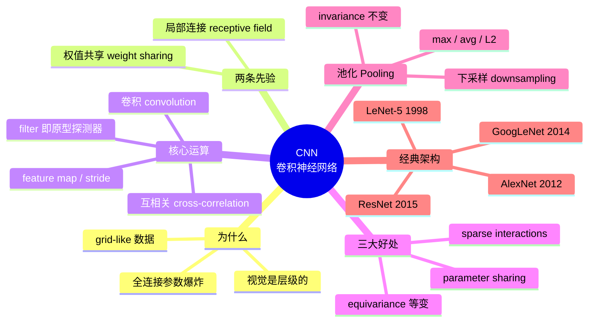
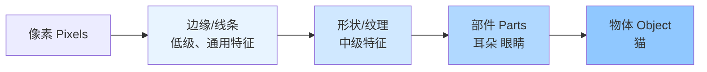
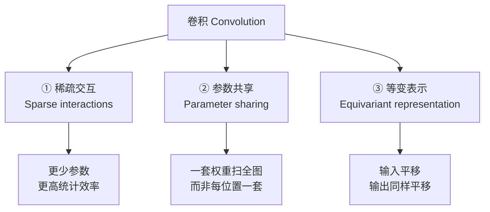
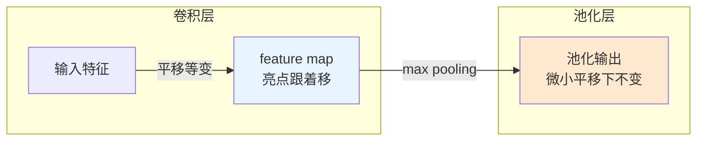
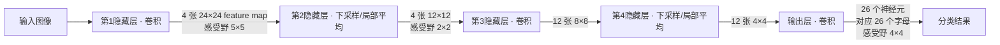
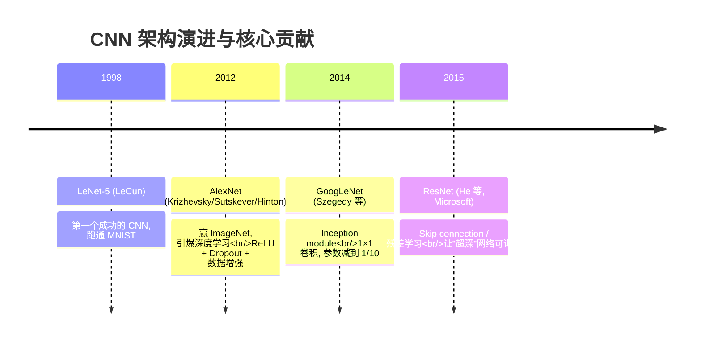
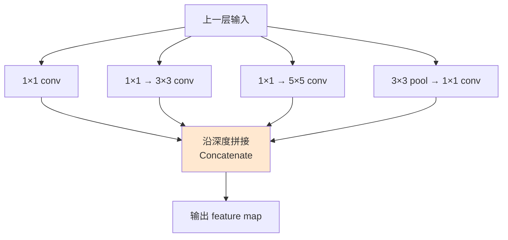

# 第六章 · 卷积神经网络与深度学习 (II) — CNN

> **学习目标 (Learning objectives)** — 读完本章你应该能够:
> - 解释为什么处理图像时**全连接网络 (fully connected MLP)** 会"参数爆炸",以及 **CNN** 用哪两条先验(local connectivity + weight sharing)把它救回来;
> - 写出一维与二维**卷积 (convolution)** 的定义,讲清"翻转—滑动—相乘求和"的过程,并说明机器学习里实际用的是 **cross-correlation**;
> - 把**滤波器 (filter / kernel)** 理解成一个"原型探测器",并解释 **feature map**、**receptive field**、**stride** 这几个词;
> - 说出卷积带来的三大好处——**sparse interactions**、**parameter sharing**、**equivariance**——并讲清 equivariance(等变)和 pooling 带来的 invariance(不变)有什么区别;
> - 解释 **pooling** 在做什么、为什么能压缩计算又能抵抗微小平移,手算一个 max pooling 例子;
> - 读懂一张 CNN 架构表(用 output-size 公式算出每层尺寸),并说出 **LeNet-5 / AlexNet / GoogLeNet / ResNet** 各自的核心贡献(尤其是 Inception module 与 skip connection)。

上一周我们把神经网络这台机器彻底拆开了:一个**神经元 (neuron)** 是"加权和 + 激活",很多神经元叠成**多层感知机 (MLP)**,再用**反向传播 (back-propagation)** 让它自己学出一个函数。那台机器有个隐含假设——**全连接 (fully connected)**:某一层的每个神经元,都连到上一层的*所有*神经元。

这个假设对小问题没事,但一碰到图像就立刻崩。设想一张并不算大的 $200\times200$ 彩色图片,它有 $200\times200\times3 = 120{,}000$ 个输入值;如果第一个隐藏层只放 1000 个神经元,光这一层的权重就是 $120{,}000 \times 1000 = 1.2$ 亿个。还没开始训练,参数量就已经失控,而且其中绝大多数都是浪费——图像里"猫的耳朵"这个特征,无论出现在左上角还是右下角都是同一个东西,凭什么要为每个位置各学一套权重?

这一周登场的**卷积神经网络 (Convolutional Neural Network, CNN)** 正是为了解决这件事。它不是另起炉灶的新物种,而是给 MLP 加了**两条结构性约束**,把"我们对图像的先验知识"直接刻进了网络设计里。讲师在课上反复强调的一句话可以当作本章的种子:

> **"CNN 说到底,就是一堆 filter,让你对输入做出一种*层级化 (hierarchical)* 的表示。"**

先看一张全章骨架图,再逐节填满:

---

## 1. 视觉是分层的:CNN 的两条先验从哪来

在写下任何公式之前,先理解 CNN 为什么长这个样子——因为它的结构是从**人类视觉**和**图像的本质**里抄来的。

### 1.1 层级表示:从线条到物体

讲师先讲了一个直觉:我们的视觉系统识别物体,不是一眼看到"猫",而是**层层抽象**的。最底层的神经元只对**简单的局部特征**敏感——一小段边缘、一个角点、一条线;这些低级特征组合起来形成**形状**(圆、轮廓);形状再组合成**物体的部件**(耳朵、眼睛);最后才拼成"猫"。

这正是上一周说过的"**逐层抽取特征**"在视觉里的具体样子:

> 📎 **拓展(超出 slides)** — 讲师说"低层是 generic features,越深越 specialized",这其实是深度学习一个被反复验证的经验事实:训练好的 CNN,第一层卷积核几乎总是学成各种方向的**边缘检测器**和**颜色块**(无论训练的是猫还是汽车都长得差不多),越深的层才学到与具体任务相关的、可辨认的部件。正因为低层特征是通用的,**迁移学习 (transfer learning)** 才能成立——这一点 §7.5 会再讲。

关键启示有两个,它们直接变成了 CNN 的两条先验:

1. **特征是局部的。** 要检测一段边缘,只需要看图像中一**小块**邻近像素,根本不需要连到整张图——于是有了**局部连接 (local connectivity)**,也叫**感受野 (receptive field)**。
2. **同一个特征可能出现在任何位置。** "竖直边缘"这个检测器,在图像左上角和右下角应该是**同一套权重**——于是有了**权值共享 (weight sharing)**。

### 1.2 把先验"刻进"网络:CNN 的正式定义

现在可以给出 slides 上的正式说法了。**CNN 是一类特殊的多层感知机,专门用来处理具有网格状拓扑 (grid-like topology) 的数据**:

- **一维网格**:时间序列(按固定间隔采样的信号,如股价、温度);
- **二维网格**:图像(像素的二维排列)。

它的定义性特征是:**在至少一层里,用卷积 (convolution) 代替了一般的矩阵乘法**。Slides 把这件事概括成一句话——CNN 是一种**把先验信息构建进网络设计**的方式,具体通过两个约束实现:

| 约束 | 全连接 MLP 怎么做 | CNN 怎么做 | 带来什么 |
|---|---|---|---|
| **连接方式** | 全局连接,每个神经元连上一层全部 | **局部连接**(receptive field),只连一小块 | 参数大减,强制学局部特征 |
| **权重选择** | 每条连接独立学一个权重 | **权值共享**(同一 filter 扫全图) | 参数再大减,得到平移特性 |

用矩阵语言看这件事会更清楚。全连接层的输入—输出关系是一次普通的矩阵乘法:

$$v_i = W\,v_{i-1}$$

其中 $W$ 是稠密(dense)的权重矩阵,每个元素都自由可学。而卷积层的输入—输出关系,写出来是这样(以一个把 6 个输入映到 4 个隐藏神经元、滤波器长度为 6 的一维例子):

$$v_j = \sum_{i=1}^{6} \omega_i\, x_{i+j-1}, \qquad j = 1,2,3,4$$

注意这里的玄机:**同一组权重 $\{\omega_i\}_{i=1}^{6}$ 被全部四个隐藏神经元共用**。换句话说,卷积层对应的权重矩阵不是自由的稠密矩阵,而是一个高度受限的、对角线方向元素相同的 **Toeplitz 矩阵**——绝大多数元素是 0(局部连接),非零元素还彼此相等(权值共享)。这就是"把先验刻进网络"的数学含义:我们不是让网络自由地学一切,而是事先掐死了大部分自由度。

> **🔑 直觉(讲师的滤波器类比)** — 想象汽车音响或播放器上那排**均衡器滑块 (equalizer sliders)**:1K、4K、15K…… 每个滑块管一个频段,能放大或压低某些频率。每个滑块背后其实就是一个**滤波器 (filter)**。CNN 干的是同一件事,只不过滤波器是*学出来*的:每个 filter 负责"放大"输入里某一种特定的模式,压制其他的。把很多个 filter 叠起来,你就得到了同一份输入的很多种不同表示——这正是层级表示的来源。

### 1.3 这一章的"形状"

把上面两节连起来:因为视觉是分层的、特征是局部且可复用的,CNN 就用**局部连接的卷积**去抽局部特征,用**多个共享权重的 filter**得到多张特征图,再用**池化**逐步压缩、抵抗位移。下面三节(卷积 → 三大好处 → 池化)把这台机器的零件逐个讲清,第 6、7 节再把它们组装成完整网络,看历史上几个里程碑架构是怎么搭出来的。

---

## 2. 卷积:CNN 的核心运算

整章只有这一个运算是真正"新"的,值得花最多笔墨。我们按"它在直觉上是什么 → 公式 → 机器学习里的变体 → 手算一遍"的顺序走。

### 2.1 直觉:filter 是一个"原型探测器"

讲师给了一个非常好用的framing:**一个 filter 就是一个你要找的"原型 (prototype)"**,而卷积就是拿这个原型在整张图上滑动,逐处问一句——

> "这里像不像我手上这个东西?像,响应就高;不像,响应就低。"

举例:如果某个 filter 长得像"一段斜线 ╱",那么把它在图上扫一遍,得到的输出图(叫 **feature map**)就会在**真的有斜线的地方**亮起来,其他地方暗下去。于是一个 filter 扫完,你就得到一张"这种斜线在哪里"的地图。换一个 filter(比如"╲"),再扫一遍,得到另一张地图。讲师的**做面条/橡皮泥**类比说的也是这件事:同一团泥(输入),压过不同的模具(filter),挤出不同形状的面条(不同的特征表示);把很多模具叠起来,就得到同一份输入的很多个侧面。

为什么"像不像"可以用乘法算?因为如果 filter 和它覆盖的那块输入**数值上很接近**,逐元素相乘再求和会得到一个**很大的正数**;如果毫不相关甚至相反,乘出来就小、甚至是负的。所以**对应相乘再求和**这个动作,天然就是一个"相似度打分"。这也解释了为什么讲师说卷积"本质上就是一个 **correlator**(相关器)"。

### 2.2 公式:翻转、滑动、相乘求和

现在把直觉写成公式。给定两个函数——输入 $x(n)$ 和**核 (kernel)** $\omega(n)$——它们的**卷积**定义为:

$$s(n) = \sum_{k} x(k)\,\omega(n-k) = \sum_{k} x(n-k)\,\omega(k) \tag{3}$$

逐字读一遍这个公式它在说什么:**把核 $\omega$ 相对 $x$ 翻转(flip),然后沿着 $x$ 滑动(slide);每滑到一个位置,就把重叠部分对应相乘、再全部加起来**,得到该位置的一个输出值。等号两边相等体现了卷积的**交换律 (commutative)**——翻转谁滑动谁都一样。

在 CNN 的语境里,三个符号各有名字:

| 符号 | 名字 | 是什么 |
|---|---|---|
| $x$ | input(输入) | 图像 / 信号 |
| $\omega$ | **kernel / filter**(核 / 滤波器) | 要学习的权重,通常很小($3\times3$、$5\times5$) |
| $s$ | **feature map**(特征图) | 卷积的输出,"这个特征在哪"的地图 |

推广到**二维**(图像),只是多了一个求和维度:

$$s(n,m) = \sum_{k,l} x(k,l)\,\omega(n-k,\,m-l) = \sum_{k,l} \omega(k,l)\,x(n-k,\,m-l) \tag{4}$$

求和只在核的非零范围内进行——这正是"局部"的体现:核通常被定义成**空间上有限**的一小块,所以每个输出只由输入的一小块邻域决定。

### 2.3 一个关键的"善意谎言":其实用的是 cross-correlation

这是一个常被考、又容易答错的细节。式 (4) 那个带翻转的"真·卷积"在机器学习里**几乎从不真的用**。实际框架(PyTorch、TensorFlow)里跑的是**互相关 (cross-correlation)**——也就是**不翻转核**,直接对齐相乘:

$$s(n,m) = \sum_{k,l} x(k,l)\,\omega(n+k,\,m+l) \tag{5}$$

注意式 (5) 里是 $\omega(n+k, m+l)$(加号,不翻转),而式 (4) 里是 $\omega(n-k, m-l)$(减号,翻转)。区别就在这一个符号。

那为什么不较真?因为**核是学出来的**:既然 $\omega$ 的每个值都是训练得到的,网络完全可以自己把权重学成"翻转后"的样子,翻不翻转最终学到的功能一模一样。于是大家图省事直接用不翻转的 cross-correlation,**却仍然管它叫 "convolution"**。所以你以后看到代码里、论文里说 convolution,心里要清楚:它技术上其实是 cross-correlation。

### 2.4 手算一遍:滑动、stride 与 feature map

光看公式没感觉,我们跟着讲师在课上比划的那个例子手算一遍二维互相关。设核是一个 $2\times2$ 的小窗 $\begin{bmatrix}W & X\\ Z & ? \end{bmatrix}$(讲师用了一串字母,我们就照着走),输入是一片更大的网格,左上角那块记作:

$$
\text{输入} = \begin{bmatrix}
A & B & C & \cdots\\
X & Y & \cdots & \\
\vdots & & &
\end{bmatrix}
$$

**第一步**:把核压在输入左上角,对应相乘求和,得到输出的第 1 个值:

$$s_1 = W\cdot A + X\cdot B + \cdots$$

**第二步**:把核**向右滑一格**(这"一格"就是 **stride = 1**),现在核盖住的是 $B, C, \dots$,再算一次得到第 2 个值。

**第三步**:滑到行尾,核回到下一行行首,继续……直到扫完整张图。所有这些输出值排起来,就是这个 filter 产生的一张 **feature map**。

这里冒出两个重要概念:

- **Stride(步幅)**:核每次滑动几格。stride = 1 逐格扫(输出大、重叠多);stride = 2 跳着扫(输出尺寸大约减半)。这是你在代码里自己指定的超参数。
- **多个 filter → 多张 feature map**:讲师强调,如果某层画了 **4 张 feature map,就是用了 4 个不同的 filter**;画了 12 张,就是 12 个 filter。每个 filter 找一种特征,几个 filter 就给你输入的几种不同表示。

> 📎 **拓展(超出 slides)— 输出尺寸公式(强烈建议记)** — slides 的架构表里那些 $28\times28$、$14\times14$ 是怎么来的?有一个一行的公式能算出任何卷积/池化层的输出边长:
> $$\text{输出边长} = \left\lfloor \frac{W - F + 2P}{S} \right\rfloor + 1$$
> 其中 $W$ = 输入边长,$F$ = 核(filter)边长,$P$ = 每边补的零(padding)数,$S$ = stride。
> 拿 LeNet-5 第一层验证:输入 $32\times32$,核 $5\times5$,无 padding($P=0$),stride $1$ → $(32-5+0)/1 + 1 = 28$,正好是表里的 $28\times28$。下一层 $2\times2$ 池化、stride 2 → $(28-2)/2+1 = 14$,正好 $14\times14$。整张 LeNet 表都能这样一路推下来。考试若让你算某层输出尺寸,套这个公式即可。

### 2.5 小结这一节

卷积 = 用一个小核(filter)在输入上滑动,逐处做"对应相乘求和"的相似度打分,扫出一张 feature map;ML 里实际用不翻转的 cross-correlation 但仍叫卷积;stride 控制滑动步长,filter 个数决定 feature map 张数。下一节我们看,正是这种"小核扫全图"的结构,带来了三个深远的好处。

---

## 3. 卷积带来的三大好处

为什么仅仅"用卷积换掉矩阵乘法"就这么管用?Slides 把好处归纳成三条,这三条几乎是 CNN 的全部理论卖点,极可能考概念题。

### 3.1 稀疏交互 (Sparse interactions)

在全连接层里,每个输出都连着*所有*输入,权重矩阵是稠密的。卷积则相反:核很小,所以**每个输出只和输入里的一小块发生关系**——这叫**稀疏交互**,也叫稀疏连接 (sparse connectivity)、稀疏权重 (sparse weights)。

好处直接而实在:**需要存储和学习的参数大大减少,统计效率 (statistical efficiency) 提高**。如果输入有 $m$ 个、输出有 $n$ 个,全连接要 $m\times n$ 个参数;用一个大小为 $k$($k \ll m$)的核,只要 $k\times n$ 甚至(因为共享)只要 $k$ 个。

但稀疏会不会让网络"看不到全局"?不会——这是 slides 强调的精妙之处:**在深层 CNN 里,深层的神经元会*间接地*连到输入的一大片**。第一层每个神经元只看 $5\times5$,但第二层的神经元看的是第一层的一片 $5\times5$,折算回原始输入就覆盖了更大的区域;越深,这个**有效感受野 (receptive field)** 越大。于是网络用"局部连接的堆叠"高效地描述了复杂的、大范围的交互——既省参数,又不失全局视野。

### 3.2 参数共享 (Parameter sharing)

稀疏交互说的是"连得少",参数共享说的是"连的那些还彼此相等"。**与其为每个位置学一套独立的参数,我们只学一套,让它在所有位置复用**——同一个 filter 滑过整张图。

为什么合理?回到 §1 的直觉:"竖直边缘"这个检测器在图像任何位置都该是同一个,没理由左上角学一套、右下角再学一套。因为核通常远小于输入($k \ll m$),**卷积因此比稠密矩阵乘法高效得多**——存储省(只存一套核),计算也省。

### 3.3 等变表示 (Equivariance) —— 注意别和"不变"搞混

第三个好处最微妙,也最容易考。参数共享带来一个叫**对平移等变 (equivariance to translation)** 的性质。在信号处理里,这正是大名鼎鼎的**线性时不变 (Linear Time-Invariant, LTI)**。

**等变是什么意思?一句话:输入变,输出以同样的方式变。** 形式化一点:设变换 $g$ 把图像 $I$ 平移成 $I'$,即 $I'(x,y) = I(x-1, y)$(整张图右移一格)。那么——

> **先平移再卷积 = 先卷积再平移。**

直觉上:如果你把图里的猫往右挪一格,那么"猫脸 feature map"上的亮点也只是跟着往右挪一格,**亮点的强度和形状不变,只是位置跟着动**。讲师的说法是:"无论我把输入怎么挪,我总能在(挪过去的)那个位置找到同样的响应。" 在时间序列里同理——把一个特征在时间上延迟,它在输出里也原样延迟同样的量后出现。

为什么这是好事?因为它意味着特征检测器**自带平移泛化**:你不需要在每个位置分别教它认猫脸,教会一次,它在所有位置都认得。

⚠️ **关键区分(高频考点)**:等变 (equivariant) ≠ 不变 (invariant)。
- **等变**:输入移 → 输出**跟着移**(位置信息保留)。这是**卷积**的性质。
- **不变**:输入(微微)移 → 输出**基本不动**(位置信息被丢掉)。这是下一节 **pooling** 的性质。

记法:**卷积等变,池化不变**。下一节马上展开。

---

## 4. 池化 Pooling:压缩、抗噪、求不变

卷积扫完得到一张 feature map 后,通常紧跟一个 **pooling(池化)** 层。这一节讲它做什么、有哪几种、以及它和卷积在"平移"上的分工。

### 4.1 池化在做什么

讲师给的动机很朴素:feature map 往往很大,我们想**省点计算、压缩表示**,最简单的办法是**下采样 (subsampling)**——扔掉一些、留下一些。但不能乱扔,得"有原则地"扔。Pooling 就是这个有原则的下采样。

正式定义(slides):**池化用某个邻域内输出的一个汇总统计量 (summary statistic),替换掉该位置的输出。** 常见的几种汇总方式:

| 池化类型 | 取邻域里的…… | 备注 |
|---|---|---|
| **Max pooling**(最大池化) | 最大值 | 最常用;保留"最强响应" |
| **Average pooling**(平均池化) | 平均值 | LeNet 用的就是它 |
| **L2-norm pooling** | 邻域的 L2 范数 | |
| **加权平均** | 按到中心像素的距离加权 | |

> **🔑 例(max pooling 手算)** — 设一行 feature map 的值是 $[0.1,\ 1.0,\ 0.2,\ \dots]$,我们用宽度 3 的窗做 max pooling:取前三个 $\{0.1, 1.0, 0.2\}$ 的最大值 → 输出 $1.0$。窗口右滑,取下一组三个的最大值,以此类推。直觉:max pooling 在问"这一小片里,这个特征最强出现了多强?"——它**只关心特征在不在、多强,不太关心精确在哪**。

### 4.2 为什么池化带来"对微小平移的不变性"

这是池化最重要的性质,也是它和卷积分工的关键。**池化让表示对输入的微小平移近似不变 (approximately invariant to small translations)**。

直觉:既然 max pooling 在一个小窗里只取最大值,那么把输入**轻轻挪动一两格**,只要那个最大响应还落在同一个窗里,**池化的输出就不变**。位置上的小抖动被"吃掉"了。

Slides 把这件事拔高成一句很漂亮的话:**用池化,等于在网络里加入了一个很强的先验 (a strong prior)——"我们要学的这个特征,本就应该对微小平移不变"**。如果这个先验对你的任务成立(比如判断"图里有没有猫",猫挪几个像素当然还是猫),池化就帮你免费获得了这种鲁棒性。

还有一种更进阶的玩法:**对多个用不同参数学到的卷积做池化,可以学出对各种变换(不只是平移)的不变性**——比如让网络对旋转、缩放也不敏感。

### 4.3 池化 + 下采样

池化通常顺便做**降尺寸**:用一个比 stride 大的窗,或者让 stride > 1。例如"宽度 3、stride 2"的 max pooling,既取局部最大(抗平移),又把 feature map 边长砍掉约一半(省计算)。这就是为什么 CNN 架构里 feature map 的尺寸**一层比一层小**,而 feature map 的**张数(深度)**却往往一层比一层多——空间分辨率换语义深度。

### 4.4 等变 vs 不变:一张表收尾

| | **卷积 Convolution** | **池化 Pooling** |
|---|---|---|
| 平移性质 | **等变 (equivariant)** | (微小平移)**不变 (invariant)** |
| 输入右移一格,输出… | 也右移一格 | 基本不动 |
| 保留位置信息吗 | 保留 | 丢弃(这正是目的) |
| 直觉口号 | "特征在哪,我就在哪标出来" | "管它具体在哪,有就行" |
| 作用 | 抽取特征 | 压缩 + 抗微小位移 |

把这一行记牢:**卷积负责"找",池化负责"容忍"。**

---

## 5. 组装一个 CNN:典型架构

零件齐了(卷积、三大好处、池化),现在看它们怎么拼成一个完整的网络。Slides 给了一个经典例子——Haykin 书里那个**手写字符识别 CNN**,我们顺着它走一遍,体会"卷积—池化"交替、尺寸递减的节奏。

这个网络有 **4 个隐藏层 + 1 个输出层**,输入是一张字符图:

逐层读这张图,你能看到 CNN 的典型节奏:

1. **第 1 层(卷积)**:用卷积抽局部特征,产生 **4 张 $24\times24$ 的 feature map**,每个神经元的感受野是 $5\times5$。"4 张"= 用了 4 个 filter。
2. **第 2 层(下采样 / 局部平均)**:对上一层池化,4 张图变成 **$12\times12$**(尺寸减半),感受野 $2\times2$。
3. **第 3 层(卷积)**:再抽一轮更高级的特征,变成 **12 张 $8\times8$**(filter 增多、尺寸继续缩)。
4. **第 4 层(下采样)**:再池化成 **12 张 $4\times4$**。
5. **输出层(卷积)**:**26 个神经元**,每个对应一个可能的字母,感受野 $4\times4$。

这就是 slides 上"feature extraction → feature mapping → subsampling"三件套(§1.2 提过)在真实网络里的样子:**卷积抽特征、生成多张 feature map,池化做局部平均和下采样、降分辨率并降低对位移的敏感**,如此交替,空间越来越小、语义越来越深,最后接上分类。几乎所有经典 CNN 都是这个骨架的变奏——下一节我们就看这些变奏。

---

## 6. 经典 CNN 架构演进:四座里程碑

Slides 后半段是一部"CNN 简史":LeNet → AlexNet → GoogLeNet → ResNet。讲师坦言这部分**有点"考古"性质**,但保留它是因为每个架构都贡献了一个**至今仍在用的核心思想**。考试时,与其背架构表里的每个数字,不如记住**每个网络"开创了什么"**。先看一张时间线:

一张对照表先建立全局印象,后面再逐个展开:

| 架构 | 年份 / 提出者 | 数据集 / 战绩 | 标志性贡献 | 激活 |
|---|---|---|---|---|
| **LeNet-5** | 1998 · Yann LeCun | MNIST 手写数字 | 第一个实用 CNN;卷积+平均池化的范式 | tanh / RBF |
| **AlexNet** | 2012 · Krizhevsky, Sutskever, Hinton | 赢 ILSVRC 2012 | 更大更深;**ReLU**、**Dropout**、**数据增强**、LRN | ReLU |
| **GoogLeNet** | 2014 · Szegedy 等 | 赢 ILSVRC 2014(top-5 < 7%) | **Inception module**;1×1 卷积;参数仅 ~6M | ReLU |
| **ResNet** | 2015 · He 等(Microsoft) | 赢 ILSVRC 2015 | **Skip connection / 残差学习** | ReLU |

> 背景:**ILSVRC (ImageNet Large Scale Visual Recognition Competition)** 是 2010 年代那场推动深度学习爆发的年度图像识别大赛,要在 ~1000 个类别、数百万张图上分类。AlexNet 2012 夺冠是公认的"深度学习引爆点",此后冠军清一色是 CNN,而且一年比一年深。

### 6.1 LeNet-5 (1998):开山之作

Yann LeCun 的 LeNet-5 是第一个真正跑通的 CNN,用来识别手写数字,跑在经典的 **MNIST** 数据集上(顺带一提,还有 **Fashion-MNIST**,把数字换成衣物图)。它的结构就是 §5 那套"卷积—池化"交替,最后接全连接:

$$\text{In}(32\times32) \to \text{C1 conv} \to \text{S2 pool} \to \text{C3 conv} \to \text{S4 pool} \to \text{C5 conv} \to \text{F6 FC} \to \text{Out}$$

几个值得注意的细节:

- **输入要 padding 到 $32\times32$**(MNIST 原图 $28\times28$),好让卷积有边距。
- 激活用 **tanh**,输出层用 **RBF(径向基函数)**——这是早期的选择,后来基本被 ReLU/softmax 取代。
- 池化是一种**特殊的平均池化**:输出 $=(\mu \times c) + b$,其中 $\mu$ 是感受野内节点的平均值,$c$ 和 $b$ 是**可学习参数**——也就是平均之后还乘一个系数、加一个偏置再激活,比纯平均更灵活。

LeNet 的历史意义:它证明了"卷积 + 权值共享 + 池化"这套范式真的能学会视觉任务,为后面一切打下模板。

### 6.2 AlexNet (2012):引爆点

AlexNet **结构上很像 LeNet,只是更大更深**,但它赢下 2012 ImageNet、直接点燃了整个深度学习浪潮。除了规模,它带来几个影响深远的工程创新:

1. **堆叠卷积层(不再每个卷积后都跟池化)**:在 C5、C6、C7 处,AlexNet 把**多个卷积层直接叠在一起**,而不是死板的"conv–pool–conv–pool"。这让网络在降尺寸之前能抽取更丰富的特征。
2. **用 ReLU 取代 tanh/sigmoid**:训练快得多,缓解梯度消失(回顾 Week 5)。
3. **两种正则化对抗过拟合**:
   - **Dropout**:训练时在全连接层 F8、F9 随机"丢弃"一部分神经元,防止共适应;
   - **数据增强 (data augmentation)**:对训练图随机平移、水平翻转、改变光照,人为造出更多样本。
4. **局部响应归一化 (Local Response Normalization, LRN)**:加在 C1、C3 的 ReLU 之后,是一种**竞争性归一化**——某个位置强烈激活的神经元,会**抑制邻近 feature map 上相同位置**的神经元。这鼓励不同 feature map "各司其职"、专门化,改善泛化。(LRN 后来被 batch normalization 取代,但思想——竞争/归一化——保留了下来。)

### 6.3 GoogLeNet (2014):Inception module

GoogLeNet 赢下 2014 ILSVRC(top-5 错误率 < 7%),它的招牌是 **Inception module(盗梦空间模块)**。最惊人的数字:它比 AlexNet **深得多,参数却少了 10 倍**——约 **6 百万** vs AlexNet 的 **6 千万**,而且效果更好。

Inception 的核心思想:**与其在每层纠结"该用 $1\times1$、$3\times3$ 还是 $5\times5$ 的卷积",不如全都用,然后把结果拼起来**。一个 Inception module 里并联了多个不同大小的卷积(和一个池化),各自处理同一份输入,再把输出**沿深度方向拼接 (concatenate)**。这样网络能同时捕捉不同尺度的特征,得到更丰富的表示。

要让"拼接"成立,所有分支的输出必须**高、宽相同**,这就要用到两个概念:

- **SAME padding**:自动补零,使输出神经元数 $= \text{ROUND}(\text{输入数} / \text{stride})$。这样不管核多大,输出尺寸都对得齐,能拼接。(对照 **VALID padding** = 不补零,核滑出边界就停,输出会变小。)记法:slides 里 "$3\times3 + 1(S)$" 表示 $3\times3$ 卷积、stride 1、SAME padding。
- **$1\times1$ 卷积**:一种"压缩 feature map"的技巧——它不看空间邻域,只在**深度方向**做线性组合,能把很多张 feature map "塌缩"成更少的几张,从而在接昂贵的 $3\times3$/$5\times5$ 之前先降维、省计算。这是 GoogLeNet 参数能少 10 倍的关键之一。

### 6.4 ResNet (2015):skip connection 让网络能"超深"

ResNet(微软,何恺明等)赢下 2015 ILSVRC,解决了一个看似简单、实则要命的问题。

**动机——退化问题 (degradation problem)**:人们发现,网络一味加深,准确率会先**饱和**,然后**迅速变差**。关键是:这**不是过拟合**——因为连**训练误差**都变高了。按理说,更深的网络至少能把多出来的层学成"什么都不做"(恒等映射),效果不该比浅网络差;但实践中,让一堆非线性层去学"恒等映射"竟然很难,于是深网络反而训不好。

**解法——残差学习 (residual learning)**:与其让一组堆叠的层去直接拟合我们想要的映射 $H(x)$,不如让它去拟合**残差 (residual)**:

$$F(x) := H(x) - x \quad\Longleftrightarrow\quad H(x) = F(x) + x$$

实现上,就是在这组层的输出 $F(x)$ 上,**直接加一条把输入 $x$ 抄过来的捷径**——这条捷径叫 **skip connection(跳跃连接 / 残差连接)**:

```mermaid
graph LR
  X[输入 x] --> W[卷积层们<br/>学 F&#40;x&#41;]
  W --> ADD((＋))
  X -->|skip connection<br/>恒等捷径| ADD
  ADD --> H["输出 H&#40;x&#41; = F&#40;x&#41; + x"]
  style ADD fill:#ffe8d0
```

为什么这就解决了退化?因为现在"什么都不做"变得**毫不费力**:网络只要把 $F(x)$ 学成 0,就自动得到 $H(x) = x$ 的恒等映射。于是加深再也不会让训练误差变高,网络可以堆到上百层仍然可训练。讲师反复强调:**ResNet 你只需要带走一个词——skip connection。** 就像 GoogLeNet 你只需带走 Inception module 一样,每个里程碑都是"贡献一个新 idea"。

---

## 7. 实践视角:迁移学习与把图像看成张量

最后一节是讲师在课堂尾声讲的实务内容,大多**超出 slides**,但对做作业和真正理解 CNN 很有用,单独成节并标注。

### 7.1 迁移学习:别从零开始

> 📎 **拓展(超出 slides)** — 讲师的忠告:**做研究时,几乎没人从零设计、从零训练一个新架构。** 标准做法是拿一个现成的、训练好的网络(如上面那些经典架构,统称 **backbone / 骨干网络**),把它当作现成的**特征提取器**,在上面接几层做你自己的任务;或者对它"动点手术"、改改内部结构得到新结果。这就是**迁移学习 (transfer learning)**。它之所以可行,正是 §1.1 说的——低层卷积学到的是通用特征(边缘、纹理),换个任务照样能用。

补一个历史花絮(讲师提到):在端到端深度学习成熟之前,人们常常**先用 CNN 抽特征,再把特征喂给 SVM** 去分类,效果也很好。这说明 CNN 的价值很大一部分在于它学到的**特征表示**本身。

### 7.2 图像就是张量 (Tensor)

> 📎 **拓展(超出 slides)** — 讲师强调,神经网络说到底"就是在一层层地做矩阵乘法",而**张量 (tensor) 就是矩阵向更高维的推广**。理解数据的张量形状,是用 PyTorch / TensorFlow 的基本功:
>
> | 数据 | 张量维度 | 各维含义 |
> |---|---|---|
> | 向量 | 1D | (长度) |
> | 灰度图 / 矩阵 | 2D | (高, 宽) |
> | 一批彩色图像 | **4D** | (样本数, 高, 宽, 通道 RGB) |
> | 一批视频 | **5D** | (样本数, 帧, 高, 宽, 通道) |
>
> 描述张量的三个属性:**rank/维数**(有几个轴)、**shape**(各轴长度,一个 tuple,如 $4\times7$)、**dtype**(元素类型,如 float32/int64)。这也解释了为什么 CNN 处理的"图像"在代码里是个 4D 张量——一次喂一批图,每张有高、宽、和 RGB 三个通道。
>
> **作业小贴士(讲师特别叮嘱)**:做作业前务必装 **Anaconda**,并为不同框架建**独立的虚拟环境**(virtual environment)——TensorFlow 一个、PyTorch 一个,别混在一起,更别动系统自带的 Python,否则环境冲突能把你的电脑搞乱。装框架时也别用最新版 Python(可能还没框架支持),退一两个小版本(如 3.12)更稳。

### 7.3 接下来是什么

> 📎 **拓展(超出 slides)** — 讲师预告:CNN 主要对付**网格状/二维数据(图像)**;而**一维序列数据**(股价、天气、文本)另有专门工具——**循环神经网络 (RNN)**,以及它的改进版 **LSTM、GRU**(解决 RNN 记不住长程信息的问题),再往后是彻底改变格局的 **Transformer**("Attention is all you need")。这些是后续课程内容,这里只需知道:**CNN 之于图像,正如 RNN/Transformer 之于序列。**

---

## 本章小结 (Key takeaways)

- **CNN 是给 MLP 加了两条先验的特殊网络**:**局部连接(receptive field)** 和 **权值共享(weight sharing)**;这两条把全连接处理图像时的"参数爆炸"压了下来,并把"特征是局部的、可在任意位置复用的"这一视觉先验刻进了网络结构。
- **卷积 = 拿一个小核(filter)在输入上滑动,逐处做"对应相乘求和"的相似度打分**,扫出一张 feature map;filter 就是一个"原型探测器",哪里像它哪里响应高。一层用几个 filter,就产生几张 feature map。
- 机器学习里实际用的是**不翻转的 cross-correlation**,但习惯上仍叫它 convolution;因为核是学出来的,翻不翻转无所谓。
- **卷积的三大好处**:① **稀疏交互**(每个输出只连一小块,省参数、深层间接覆盖大范围)、② **参数共享**(一套核扫全图)、③ **对平移等变**(输入移,输出同样地移 = 信号处理里的 LTI)。
- **池化用邻域的汇总统计量(最大/平均/L2)替换该处输出**,作用是压缩计算 + 下采样,并带来**对微小平移的近似不变性**。牢记区分:**卷积等变(位置跟着动),池化不变(位置抖动被吃掉)**。
- 典型 CNN 的节奏是**卷积—池化交替**:空间分辨率逐层减小、feature map 张数(深度)逐层增多,最后接全连接做分类;输出尺寸可用 $\lfloor (W-F+2P)/S\rfloor + 1$ 算。
- **四座里程碑各记一个关键词**:**LeNet-5**(1998,第一个实用 CNN,跑通 MNIST)→ **AlexNet**(2012 引爆点:ReLU + Dropout + 数据增强)→ **GoogLeNet**(2014:**Inception module** + $1\times1$ 卷积,参数只有 AlexNet 的 1/10)→ **ResNet**(2015:**skip connection / 残差学习** $F(x)=H(x)-x$,治好"越深越差"的退化问题)。
- **padding**:SAME(补零,输出 $\approx$ 输入/stride,便于拼接)vs VALID(不补零,输出变小)。**$1\times1$ 卷积**用来在深度方向"塌缩" feature map、降维省算。
- **实践**:研究里很少从零训练,而是拿 backbone 做**迁移学习**;数据在框架里是**张量**(一批彩图 = 4D:样本×高×宽×通道);CNN 管图像,序列交给 RNN/LSTM/Transformer。

---

## 附:考试提示(结合录音与课程惯例)

- 本课考试为 **3 小时手写、可带 1 张 A4 cheat sheet**;按惯例**不要求推导**繁重公式(如 kernel/SVM 那类),CNN 这块更可能考**概念辨析**与**读架构表/算尺寸**。
- **极可能考的概念题**:① 卷积的三大好处(sparse interactions / parameter sharing / equivariance)分别是什么;② **equivariance(卷积)与 invariance(池化)的区别**——这是最经典的辨析点;③ convolution 与 cross-correlation 的关系;④ 每个经典架构的**标志性贡献**(尤其 Inception module 与 skip connection)。
- **可能考的计算题**:给定输入尺寸、核大小、stride、padding,用 $\lfloor (W-F+2P)/S\rfloor+1$ **算某层输出尺寸**;或数 feature map 张数 = filter 个数。
- 讲师明说几个经典架构"有点考古性质",**重点在思想不在数字**:与其背 AlexNet 每层通道数,不如能说清"AlexNet 带来了 ReLU/Dropout/数据增强、ResNet 带来了 skip connection"。
- 别忘了把上一周的 **ReLU、Dropout、梯度消失** 串起来——AlexNet 这一节正是它们在真实网络里的落地。
