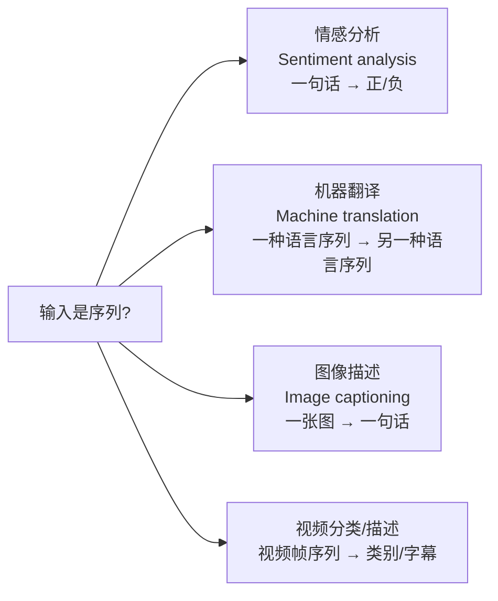
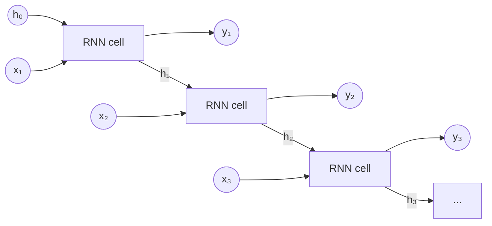
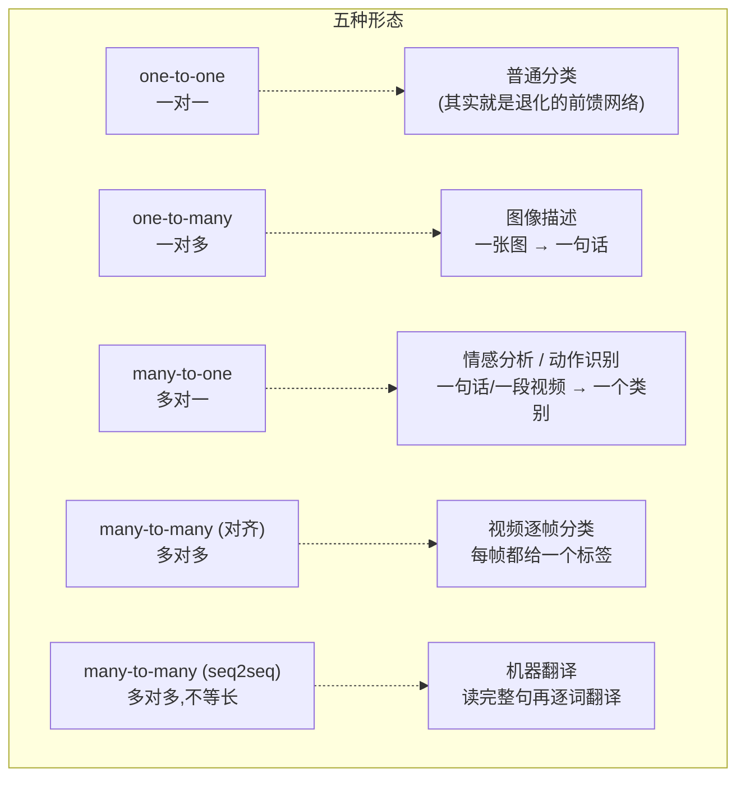
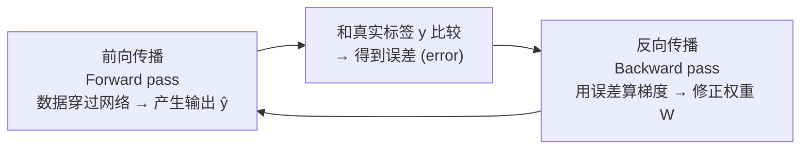
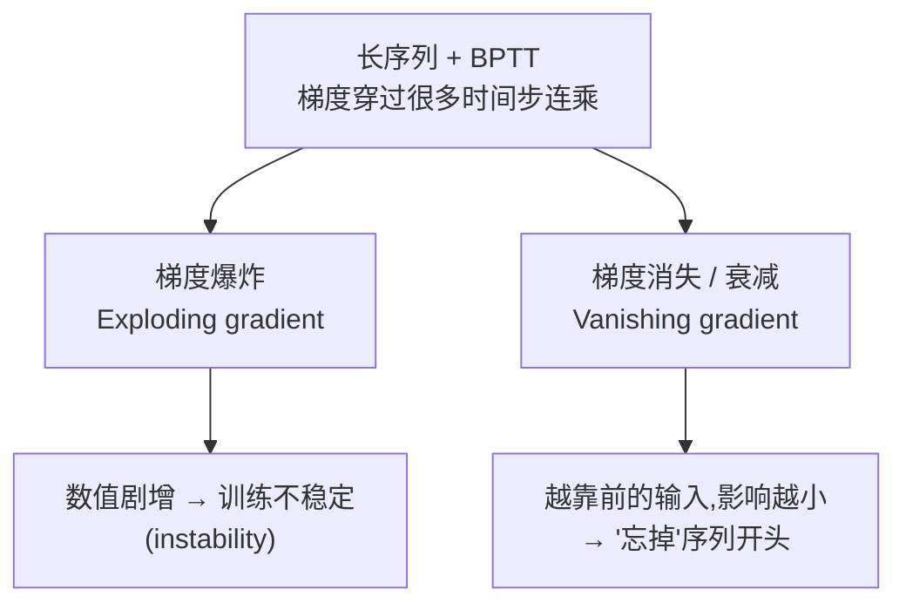
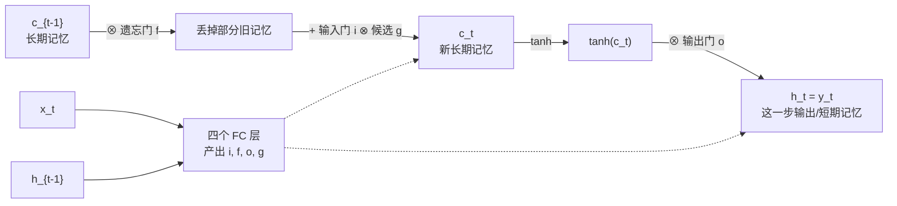
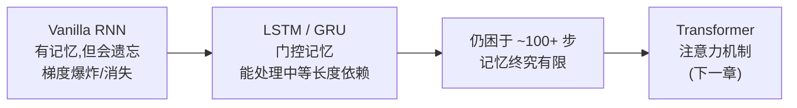

# 第七章 · 循环神经网络 (Recurrent Neural Networks, RNN)

> **学习目标 (Learning objectives)** — 读完本章你应该能够:
> - 解释什么是**序列 / 时间序列数据 (sequence / time-series data)**,并说出它与图像这类 2D 数据的本质区别
> - 用自己的话讲清 RNN 的核心思想:**隐藏状态 (hidden state)** 如何充当"记忆",以及为什么"同一个盒子反复使用"
> - 写出 vanilla RNN 的递推公式 $h_t = \tanh(W_{hh}h_{t-1}+W_{xh}x_t)$,并说明每个符号的含义
> - 区分 RNN 的五种输入输出形态 (one-to-one / one-to-many / many-to-one / many-to-many / seq2seq),并把每种对应到一个真实任务
> - 解释 **BPTT (时间反向传播)** 是什么,以及为什么长序列会带来**梯度爆炸 (exploding gradient)** 和**梯度消失 (vanishing gradient)**
> - 描述 **LSTM** 与 **GRU** 如何用"门 (gate)"机制解决遗忘问题,以及两者的区别
> - 说出 RNN/LSTM/GRU 的能力边界,以及它为什么最终把接力棒交给了 Transformer

到目前为止,我们处理的数据都是"一次性"的:一张图片、一个特征向量,输进网络、得到一个输出,彼此之间没有先后关系。但现实里有一大类数据天生带着**时间**或**顺序**:股价一天天变、句子一个词接一个词、视频一帧接一帧。这类数据如果还硬塞进普通的前馈网络(MLP/CNN),就丢掉了它最值钱的信息——**顺序**。本章要回答的核心问题是:**当数据是一条"序列"时,我们该设计一个什么样的网络去处理它?** 答案就是循环神经网络 (RNN),以及它的两个改良版 LSTM 和 GRU。

---

## 1. 从一条序列说起:什么是时间序列数据

讲这一切之前,先得弄清我们面对的是什么数据。**时间序列数据 (time-series data)**,也叫**序列数据 (sequence data)**,指的是**按固定间隔反复测量同一个量**而得到的一串数据。老师在课上给的直观例子是:你在校园某个固定地点架一个温度计,每隔 10 分钟记一次温度,连记三年——你就得到了一条温度的时间序列。

这样的数据无处不在:

- 股票每天的收盘价 (daily price of a stock)
- 每小时的用电量 (hourly electricity consumption)
- 商店每周的销售额 (weekly sales of a store)
- 地震活动 (seismic activity)
- 河流中鱼群数量的演化 (fish population)
- 人类的活动模式 (human activity patterns)

### 1.1 它和图像那种 2D 数据差在哪?

老师专门停下来问了这个问题,因为这是理解整章的钥匙。一张**图片是一个"快照 (snapshot)"**:它在二维平面上变化(这里一块亮、那里一块暗),但它**没有"时间"这个维度**——它是"一下子"全给你的。而温度序列不同:今天测一次、下周同一天再测一次,**我们把"时间"加进去了**。一旦带上时间,数据点之间就有了"谁在前、谁在后"的关系,而这正是要去利用的结构。

### 1.2 为什么序列可以被"预测":缓慢演化

老师给了一个非常朴素但深刻的直觉:**自然界的演化通常是缓慢的 (slow evolution)**。除非发生"灾难性事件"(catastrophe),否则事物不会突变。昨天 21°C,今天大概率还是 21°C 上下,而不会突然跳到 -5°C。正因为变化缓慢,**未来才是可预测的**——如果一切都在剧烈乱跳,预测就无从谈起。

把这个直觉写成数学,就是最简单的**自回归 (autoregressive)** 想法:当前时刻的值,约等于上一时刻的值加一点点扰动(噪声):

$$x_t = x_{t-1} + \text{noise}$$

> **🔑 例 (老师的温度例子)** — 昨天 21°C,你猜今天 $21 + 0.5 = 21.5$°C;实测 21.3°C。误差很小,这个"上下浮动一点点"的模型就抓住了序列的精髓。

更一般地,当前值可能依赖**好几步之前**的历史:

$$x_t = \alpha_1 x_{t-1} + \alpha_2 x_{t-2} + \alpha_3 x_{t-3} + \cdots + \alpha_n x_{t-n}$$

老师写下这个式子后立刻抛出一个关键问题:**"我到底要往回看多远?(How far back do I go?)"** ——这正是后面"记忆有多长"这个核心难题的伏笔。要记住越久远的历史,就需要越长的"记忆",而记忆一长,麻烦就来了(见 §6)。

> 📎 **拓展(超出 slides)** — 上面这个 $x_t=\sum_i \alpha_i x_{t-i}$ 是信号处理里的 **AR(自回归)模型**。slides 没有写它,但老师在课上用它来引出"记忆长度"这个贯穿全章的难题,所以值得记一笔。它告诉你:序列预测本质上是"用过去预测现在"。

### 1.3 序列数据的几个特征

把上面的直觉整理成正式特征(slides 第 4 页):

| 特征 | 含义 |
|------|------|
| **每个数据点 (data point)** | 是一串向量 $x^{(t)}$,$1 \le t \le \tau$。即一条序列本身就是一个样本 |
| **长度 $\tau$ (tau)** | 序列是**有限**的;$\tau$ 是终点。不同序列的 $\tau$ 可以不一样 |
| **批数据 (batch data)** | 许多条**长度不同**的序列放在一起训练 |
| **标签 (label)** | 可以是一个标量、一个向量,**甚至是另一条序列** |
| **周期性 (cyclic)** | 序列常带周期规律(老师的例子:商店 6 月年中大促、夏天租自行车的人多) |

最后一栏的"标签可以是序列"很重要,它直接决定了 RNN 能干多少种任务。

### 1.4 序列任务动物园

正因为输入和输出都可以是"序列",RNN 能覆盖一大批看似不相干的任务:



- **机器翻译 (machine translation)**:把一种语言的词序列翻成另一种语言的词序列。老师强调:之所以当作"序列"处理,是因为语言有**语法和顺序**——比如英文里看到字母 `Q`,几乎可以肯定下一个是 `U`,而几乎不会是 `A` 或 `T`。这种"前面决定后面"的依赖,正是序列模型要抓的东西。
- **图像描述 (image captioning)**:把图片的不同部分看成一种"序列",再生成一句描述文字。这是"图 → 词序列"的转换(你用 ChatGPT 让它描述一张图,背后就是这类能力)。

**小结**:序列数据 = 普通数据 + 时间/顺序维度;因为自然演化缓慢,序列可预测;输入输出都可以是序列,所以任务形态非常丰富。下一步的问题是:用什么网络结构才能"边读边记"地处理它?

---

## 2. RNN 的核心思想:一个带记忆的循环

### 2.1 从人脑借来的直觉

slides 开篇就点明了灵感来源:**生物智能是"增量式"处理信息的**——它一边读,一边在脑子里维护一个"目前为止理解到了什么"的内部模型,新信息一来就更新它。RNN 就是这个原理的一个**极度简化版**。

老师用"读书"做了个绝妙的类比:你读一页书,**并不是一个字一个字孤立地读**的,你的大脑会把刚读过的大约四五个词暂存在**短期记忆 (short-term memory)** 里,这样你才能理解整句话的意思,并预判下一个词。如果没有这点记忆,每个词都是孤立的,整句话就成了乱码。

**这个"暂存的短期记忆",在 RNN 里就叫隐藏状态 (hidden state) $h$。**

### 2.2 核心机制:循环与状态更新

普通前馈网络是一条直线:输入 → 隐层 → 输出,信息只往前走。**RNN 的不同之处在于它有一个"内部循环 (internal loop)"**:每读入一个新元素,它就把"当前输入"和"上一步留下的状态"揉在一起,产生新的状态和输出。

用文字说就是两步(slides 第 18–19 页):

1. **更新状态**:新状态 = 某个函数 $f_W$ 作用于(旧状态,当前输入)
2. **产生输出**:输出 = 另一个函数作用于(新状态)

写成公式:

$$\boxed{\,h_t = f_W(h_{t-1},\, x_t)\,} \qquad y_t = f_{W_o}(h_t)$$

- $x_t$:第 $t$ 步的输入(比如第 $t$ 个词)
- $h_{t-1}$:上一步的隐藏状态,也就是"截至上一步的记忆"
- $h_t$:更新后的新状态
- $y_t$:第 $t$ 步的输出
- $f_W$:带参数 $W$ 的状态更新函数;$f_{W_o}$:带参数 $W_o$ 的输出函数

老师反复强调一句话来锚定这个图景:**"那个黄盒子(RNN cell)本身是不变的,变的是状态 $h$。"** 你看到的"展开图"里有好几个盒子,但它们**是同一个盒子在不同时刻的快照**——参数完全一样,只是喂进去的状态和输入在变。

### 2.3 把循环"展开 (unroll)"

那个内部循环画成图不直观,所以我们把它**沿时间展开 (unrolled)**:一步画一个 cell,状态像接力棒一样从左传到右。



读图要点:状态 $h$ 横向流动(这就是"记忆"在时间上的传递),每一步既吐出一个 $y_t$,又把更新后的 $h_t$ 传给下一步。

### 2.4 最关键的一点:参数共享 (parameter sharing)

这是整章最容易被忽略、却最重要的考点:**展开图里每一个 cell 用的是同一套参数 $W$。**(slides 第 21、26 页用大字强调:"the same function and the same set of parameters are used at every time step.")

为什么这点至关重要?

- **它让网络能处理任意长度的序列**——不管来 3 个词还是 300 个词,都是同一个 $W$ 反复用,参数量不随序列变长而膨胀。
- **训练时,这一套共享的 $W$ 要从所有时间步的误差里一起学**,这正是后面 BPTT(§5)的由来。

### 2.5 具体化:Vanilla / Elman RNN

到此 $f_W$ 还是个抽象函数。最简单的实现——**vanilla RNN**(也叫 **Elman RNN**,得名于 Jeffrey Elman 教授)——把状态取成一个隐藏向量 $h$,更新规则是:

$$h_t = \tanh\!\big(W_{hh}\,h_{t-1} + W_{xh}\,x_t\big)$$
$$y_t = W_{hy}\,h_t$$

逐符号读一遍(这是"把公式读出声"的关键):

- $W_{xh}$:把**输入** $x_t$ 投影到隐藏空间的权重矩阵
- $W_{hh}$:把**上一时刻状态** $h_{t-1}$ 投影到隐藏空间的权重矩阵——"记忆怎么往下传"全靠它
- $W_{hy}$:把当前状态映射成输出的权重矩阵
- $\tanh$:**双曲正切**激活函数,把结果压到 $(-1, 1)$,给网络加非线性

整句话的意思是:**"把上一刻的记忆和这一刻的输入各自加权、相加、再用 $\tanh$ 压一下,就得到新的记忆;再从新记忆里读出这一步的输出。"**

> 📎 **拓展(超出 slides)** — 为什么这里偏偏用 $\tanh$ 而不是 CNN 里常见的 ReLU?老师在 §6 给了答案:$\tanh$ 是**饱和型 (saturating)** 函数,输出被夹在 $(-1,1)$,能在一定程度上抑制状态在时间上反复相乘时数值爆炸。这也是"为什么 RNN 默认用 $\tanh$"的原因。

### 2.6 一句话就能写出来:Keras/TensorFlow 实现

老师特意要"祛魅":别被公式和图吓到,**真写起来通常就一行**。

```python
# 单个 RNN 单元
model = keras.models.Sequential([
    keras.layers.SimpleRNN(1, input_shape=[None, 1])
])

# 多层堆叠的 RNN
model = keras.models.Sequential([
    keras.layers.SimpleRNN(20, return_sequences=True, input_shape=[None, 1]),
    keras.layers.SimpleRNN(20, return_sequences=True),
    keras.layers.SimpleRNN(1)
])
```

注意 `return_sequences=True`:它让这一层在**每个时间步都输出** $h_t$(供下一层继续按时间处理),而不是只输出最后一步——堆叠 RNN 时,除了最后一层,前面各层都要打开它。`input_shape=[None, 1]` 里的 `None` 表示"序列长度不固定",正好呼应 §2.4 的参数共享。

**小结**:RNN = 一个反复使用的 cell + 一个横向流动的隐藏状态 $h$。$h$ 是"记忆",每步用同一套参数 $W$ 把(旧记忆, 新输入)更新成(新记忆),再读出输出。理解了这个,后面全是它的变形。

---

## 3. RNN 的五种输入输出形态

RNN 真正的威力在于:输入和输出的"长度"可以自由搭配。slides(借自斯坦福李飞飞团队的经典图)把它归纳成五种形态。把每一种对应到一个真实任务,就记得牢:



| 形态 | 输入 | 输出 | 典型任务 |
|------|------|------|----------|
| **one-to-one** | 单个 | 单个 | 普通分类(无序列性,退化情形) |
| **one-to-many** | 单个 | 序列 | 图像描述 (image captioning) |
| **many-to-one** | 序列 | 单个 | 情感分析、视频动作识别 (action prediction) |
| **many-to-many(对齐)** | 序列 | 等长序列 | 视频逐帧分类、逐帧打标签 |
| **many-to-many(seq2seq)** | 序列 | 不等长序列 | 机器翻译 |

### 3.1 几个形态的实现要点

- **one-to-many**(slides 第 32–35 页):只有一个输入,却要吐出一串输出。做法是把**上一步的输出 $y_{t-1}$ 当作下一步的输入**喂回去,这样网络就能自己"接着往下写"。
- **seq2seq = many-to-one + one-to-many**(slides 第 36–37 页):这是机器翻译的经典结构,分两段——
  - **编码器 (encoder)**:用 many-to-one 把整个输入句子"压缩"进一个状态向量(读完全句,形成对整句的理解);
  - **解码器 (decoder)**:用 one-to-many 从这个向量出发,逐词生成译文。
  - 老师的直觉:**翻译要先读完整句、理解了,再开口翻**,而不是看一个词翻一个词——这正是 encoder-decoder 结构的动机。

```mermaid
graph LR
  subgraph Encoder 编码器 · many-to-one
  x1([我]) --> e1[RNN]
  e1 --> e2[RNN]
  x2([爱]) --> e2
  e2 --> e3[RNN]
  x3([你]) --> e3
  end
  e3 -->|上下文向量 context| d1[RNN]
  subgraph Decoder 解码器 · one-to-many
  d1 --> y1([I])
  d1 --> d2[RNN]
  d2 --> y2([love])
  d2 --> d3[RNN]
  d3 --> y3([you])
  end
```

**小结**:同一个 RNN 机制,靠"输入/输出哪头是序列"的不同组合,就能覆盖分类、生成、翻译等截然不同的任务。seq2seq 的"编码-解码"是其中最重要的一种,后面 Transformer 也沿用了这个框架。

---

## 4. 如何训练 RNN:时间反向传播 (BPTT)

会"前向跑"还不够,得能**学**。RNN 的训练用的是**时间反向传播 (Backpropagation Through Time, BPTT)**。

别被名字唬住——老师明确说了**他不打算推导它**,要的是你脑子里有这个"概念图景"。所谓反向传播,无论哪种网络,都只有**两个部分**:



1. **前向传播 (forward pass)**:数据穿过网络,生成一个输出;
2. 把输出和**真实的目标**对比,得到**误差 (error)**;
3. **反向传播 (backward pass)**:用这个误差,反着算出"每个权重该往哪改"(梯度),并更新权重;
4. 再跑下一遍,如此循环。

**BPTT 的特别之处**仅仅在于:RNN 是沿时间展开的,所以反向传播要**穿过所有时间步**往回走——一个长度为 $\tau$ 的序列,误差要一路传回到第 1 步。它本质上还是那个"前向+反向"的老套路,只不过"在时间上"展开了。**也正因为要穿过这么多步,长序列才会出大问题——这就引出了下一节。**

---

## 5. RNN 的两大顽疾:梯度爆炸与梯度消失

这是 RNN 这一章的**重中之重**,也是 LSTM/GRU 乃至 Transformer 存在的理由。问题的根源很简单:**序列一长,BPTT 要穿过的时间步就很多;梯度一路相乘传回去,要么越乘越大,要么越乘越小。**



### 5.1 梯度爆炸 (exploding gradient)

梯度在反向传播中数值**不断增大**,导致训练**不稳定 (instability)**——权重剧烈震荡,模型学不出来。

### 5.2 梯度消失 / 遗忘 (vanishing gradient / forgetting)

反过来,梯度**越乘越小**,小到趋近于零。后果是:**序列开头的那些输入,对当前输出的贡献被压缩得几乎为零**——网络"忘掉"了最早看到的信息。老师把它和"记忆"挂钩:你要记的东西越久远、网络越深,梯度就越小越小,**小到一定程度就等于在遗忘**。

slides 还补了一句机制层面的原因:**数据每穿过一个时间步,都要经历一次变换,每次都会丢一点信息;走了很多步之后,状态里几乎不剩任何最初输入的痕迹了。**

> **🔑 为什么"遗忘"是致命的——老师的"bank"例子** — 读一个长句子,某个词的意思可能取决于很远之前的词。比如 "bank" 到底指**银行**还是**河岸**?你得把句子前半段的语境一直记在脑子里,读到后面才能确定。这种"现在的理解依赖很久以前的信息",就叫**长程依赖 (long-term dependency)**。普通 RNN 因为会遗忘开头,处理不了这种依赖——这正是 LSTM 要解决的问题。

### 5.3 缓解手段一览

| 问题 | 手段 | 原理 |
|------|------|------|
| 通用 | **输入缩放 (input scaling)** 到 ~$[0,1]$ | 数值太大会让激活函数**饱和、削顶 (clip)**,梯度传不动;神经网络在小数值上工作得更好 |
| 爆炸 | **更小的学习率 (smaller learning rate)** | 每步更新幅度小,降低数值失控的风险 |
| 爆炸 | **饱和型激活函数 (saturating activation)**,如 $\tanh$ | 输出被夹在 $(-1,1)$,这正是 **RNN 默认用 $\tanh$** 的原因 |
| 爆炸 | **层归一化 (Layer Normalization)** | 每过一层就把数值归一化回一个标准范围,并学习一个 scale 和 offset 参数 |
| 遗忘 | **LSTM / GRU**(下两节) | 用"门"机制显式地控制记忆的存、删、读 |

> 📎 **拓展(超出 slides)** — 处理爆炸还有一个工业界最常用的招叫**梯度裁剪 (gradient clipping)**:梯度一旦超过阈值就按比例缩回去。slides 没写它,但它和"smaller learning rate"是配套的常识,值得知道。

**小结**:长序列 + BPTT → 梯度连乘 → 要么爆炸(不稳定)、要么消失(遗忘开头)。缩放输入、$\tanh$、层归一化能缓解爆炸;而"遗忘长程依赖"这个更棘手的病,要靠 LSTM/GRU 的门控机制来治。

---

## 6. LSTM:给网络装上一条可控的"记忆传送带"

### 6.1 它要解决什么

**LSTM (Long Short-Term Memory,长短期记忆)** 单元由 Hochreiter 和 Schmidhuber 在 **1997 年**提出,后来被不断改进。名字本身就是它的纲领:它维护一种"**长的短期记忆**"——比普通 RNN 的短期记忆能撑得更久。它的好处是:

- 用起来和普通 RNN cell 几乎一样(可以直接替换);
- 表现更好、**训练收敛更快**;
- **能够捕捉数据里的长程依赖 (long-term dependencies)**——也就是治好了 §5.2 那个"忘掉开头"的病。

### 6.2 核心思想:学会"存什么、扔什么、读什么"

LSTM 的灵魂(slides 第 40 页)一句话:**网络自己学习——该往长期记忆里存什么、该扔掉什么、该从里面读出什么。** 老师的比喻:**信息在流动,有些重要、有些不重要;当某条信息变得不重要时,就把它丢掉,同时消化吸收新信息。** 这种"有选择地记和忘",就是用**门 (gate)** 实现的。

### 6.3 结构:两条状态 + 三道门 + 一个候选

理解 LSTM,抓住"**两条状态线**"最关键:

- **长期状态 (long-term state) $c_t$**:这是一条贯穿始终的"记忆传送带",从左到右一路传下去。它受两道门调节——先经过**遗忘门**丢掉一些旧记忆,再由**输入门**添进一些新记忆。
- **短期状态 (short-term state) $h_t$**:也就是这一步的输出 $y_t$。它由长期状态 $c_t$ 经过 $\tanh$、再被**输出门**过滤后得到。

每一步,当前输入 $x_t$ 和上一步的短期状态 $h_{t-1}$ 会一起喂给**四个全连接层 (FC layers)**:

| 组件 | 符号 | 激活函数 | 作用 |
|------|------|----------|------|
| **主层 (main layer)** | $g_t$ | $\tanh$ | 分析当前输入和旧状态,产出"候选新记忆" |
| **遗忘门 (forget gate)** | $f_t$ | $\sigma$ (logistic) | 控制**长期状态的哪些部分该被抹掉** |
| **输入门 (input gate)** | $i_t$ | $\sigma$ (logistic) | 控制 $g_t$ 的哪些部分该**加进**长期状态 |
| **输出门 (output gate)** | $o_t$ | $\sigma$ (logistic) | 控制长期状态的哪些部分该被**读出**为这一步的输出 |

为什么三道门都用 **logistic (sigmoid) $\sigma$**?因为 $\sigma$ 的输出在 $[0,1]$ 之间,正好当"阀门开度":**输出 0 = 关闭这道门(对应信息全砍掉),输出 1 = 完全打开(信息全通过)**。门的输出和记忆做**逐元素相乘 (element-wise multiplication, $\otimes$)**,就实现了"按比例放行"。



### 6.4 计算公式

> ⚠️ **考试说明(老师原话)** — 老师明确说:**不会要求你默写 LSTM/GRU 的公式**(考试是闭卷、在考场里一个人写,他不会问这种死记的题)。但你**必须能描述它是怎么工作的**——四道运算、三道门各管什么。下面的公式放在你那张 A4 cheat sheet 上即可,理解结构比背符号重要。

$$
\begin{aligned}
i_t &= \sigma(W_{xi}^{T} x_t + W_{hi}^{T} h_{t-1} + b_i) &&\text{输入门}\\
f_t &= \sigma(W_{xf}^{T} x_t + W_{hf}^{T} h_{t-1} + b_f) &&\text{遗忘门}\\
o_t &= \sigma(W_{xo}^{T} x_t + W_{ho}^{T} h_{t-1} + b_o) &&\text{输出门}\\
g_t &= \tanh(W_{xg}^{T} x_t + W_{hg}^{T} h_{t-1} + b_g) &&\text{候选记忆(主层)}\\
c_t &= f_t \otimes c_{t-1} + i_t \otimes g_t &&\text{更新长期记忆}\\
y_t = h_t &= o_t \otimes \tanh(c_t) &&\text{输出/短期记忆}
\end{aligned}
$$

注意四个门/层的结构**完全一样**(都是"输入加权 + 旧状态加权 + 偏置"),区别只在各自的权重 $W$ 和激活函数。真正发生"记忆管理"的是最后两行:$c_t = f_t \otimes c_{t-1} + i_t \otimes g_t$ 一眼就能读出——"**先用遗忘门 $f$ 决定旧记忆 $c_{t-1}$ 留多少,再用输入门 $i$ 决定候选 $g$ 加多少**"。

### 6.5 Keras 实现

```python
model = keras.models.Sequential([
    keras.layers.LSTM(20, return_sequences=True, input_shape=[None, 1]),
    keras.layers.LSTM(20, return_sequences=True),
    keras.layers.TimeDistributed(keras.layers.Dense(10))
])
```

照例,把 `SimpleRNN` 换成 `LSTM` 就行——又是"几行代码"的事。

**小结**:LSTM 用一条受门控的长期记忆线 $c_t$,加上遗忘门/输入门/输出门(都用 $\sigma$ 当阀门)和一个 $\tanh$ 候选层,让网络**学会有选择地记忆和遗忘**,从而抓住长程依赖。

---

## 7. GRU:更轻量的门控单元

**GRU (Gated Recurrent Unit,门控循环单元)** 是另一种循环单元,思路和 LSTM 一脉相承,目标也是解决同一个遗忘问题,但**更简单**。

它和 LSTM 的关系,老师讲得很清楚:

1. GRU 也用门,但只有**两道门:重置门 (reset gate) $r$** 和 **更新门 (update gate) $z$**——分别类似 LSTM 里的遗忘门/输入门。
2. 最大的区别:GRU **不再区分长期状态 $c$ 和短期状态 $h$**,而是直接用一条 $h$,通过"**带自适应时间常数的泄漏积分 (leaky integration)**"把记忆内容**完全暴露**出来。
3. 因此 GRU **计算单元更少**(老师当场数:LSTM 有 4 个、GRU 只有 3 个),更**简单、好算、好实现**,但**效果相近**。

计算公式(同样:理解即可,不必默写):

$$
\begin{aligned}
z_t &= \sigma(W_{xz}^{T} x_t + W_{hz}^{T} h_{t-1} + b_z) &&\text{更新门}\\
r_t &= \sigma(W_{xr}^{T} x_t + W_{hr}^{T} h_{t-1} + b_r) &&\text{重置门}\\
g_t &= \tanh(W_{xg}^{T} x_t + W_{hg}^{T} (r_t \otimes h_{t-1}) + b_g) &&\text{候选状态}\\
h_t &= z_t \otimes h_{t-1} + (1 - z_t) \otimes g_t &&\text{更新状态}
\end{aligned}
$$

最后一行最值得读:$h_t = z_t \otimes h_{t-1} + (1-z_t)\otimes g_t$ 是一个**加权平均**——更新门 $z$ 像一个旋钮,**$z$ 越接近 1 就越保留旧记忆 $h_{t-1}$,越接近 0 就越采纳新候选 $g_t$**。一道门同时管了"记旧"和"纳新",这正是 GRU 比 LSTM 省一道门的精妙之处。

### LSTM vs GRU 速查

| 维度 | LSTM | GRU |
|------|------|-----|
| 提出时间 | 1997 (Hochreiter & Schmidhuber) | 较晚,受 LSTM 启发 |
| 门的数量 | 3 道(遗忘/输入/输出)+ 1 主层 = **4 个单元** | 2 道(重置/更新)+ 1 候选 = **3 个单元** |
| 状态 | **两条**:长期 $c$ + 短期 $h$ | **一条**:$h$(记忆完全暴露) |
| 复杂度 | 较高 | **更简单、更省算力** |
| 效果 | 强 | **相近** |
| 共同目标 | 解决长程依赖 / 遗忘问题 | 同左 |

**小结**:GRU 是 LSTM 的"精简版"——用更少的门、单一状态,换取相近的效果和更低的开销。两者解决的是同一个病。

---

## 8. RNN 的能力边界,以及通向 Transformer

最后要诚实地说出 RNN 家族的天花板(slides 第 46 页 endnote):

- 即便有了 LSTM 和 GRU,它们的记忆**终究还是偏"短"**——当序列长到 **100 个时间步以上**,依然难以学到那么长的依赖关系。
- 一个工程上的补救:**先用一维卷积 (1-D CNN) 做预处理**,把长序列"压短"一点,再喂给 GRU/LSTM。

```python
model = keras.models.Sequential([
    keras.layers.Conv1D(filters=20, kernel_size=4, strides=2,
                        padding="valid", input_shape=[None, 1]),
    keras.layers.GRU(20, return_sequences=True),
    keras.layers.GRU(20, return_sequences=True),
    keras.layers.TimeDistributed(keras.layers.Dense(10))
])
```

但这终究是"打补丁"。老师反复点题:正是 RNN 在**长序列上的根本困难**(梯度问题 + 记忆有限),催生了 **Transformer**——它用注意力机制一次性看到整条序列,绕开了"沿时间一步步传递、越传越淡"的瓶颈。**所以这一章不是"过时知识":理解了 RNN 为什么不够用,你才真正理解 Transformer 为什么要那样设计。**(老师说后面会专门用一整套 slides 讲 Transformer。)



---

## 本章小结 (Key takeaways)

- **序列/时间序列数据**带有时间或顺序维度,这是它与图像等"快照"数据的本质区别;因为自然演化缓慢,序列才可被预测,且输入输出都可以是序列。
- **RNN 的核心**是一个反复使用的 cell 加一条横向流动的**隐藏状态 $h$(记忆)**:$h_t = f_W(h_{t-1}, x_t)$,$y_t = f_{W_o}(h_t)$;"黄盒子不变,变的是状态"。
- **参数共享**——每个时间步用同一套权重 $W$——让 RNN 能处理任意长度序列,也是 BPTT 训练的基础。
- Vanilla(Elman)RNN 的具体形式是 $h_t = \tanh(W_{hh}h_{t-1} + W_{xh}x_t)$,$y_t = W_{hy}h_t$;默认用 $\tanh$ 是因为它**饱和**、能抑制数值爆炸。
- RNN 有**五种输入输出形态**;其中 **seq2seq = many-to-one 编码器 + one-to-many 解码器**,是机器翻译的经典结构。
- 训练用 **BPTT**(前向 + 沿时间反向);长序列会导致**梯度爆炸(不稳定)**和**梯度消失(遗忘开头、丢失长程依赖)**。
- 缓解爆炸:输入缩放、$\tanh$、更小学习率、层归一化;缓解遗忘:**LSTM / GRU**。
- **LSTM** 用长期记忆线 $c_t$ + 遗忘/输入/输出三道 $\sigma$ 门 + $\tanh$ 候选层,学会"存什么、扔什么、读什么";**GRU** 用重置/更新两道门、单一状态 $h$,是更轻量的等效方案。
- LSTM/GRU 在 **100+ 时间步**仍吃力;可用 **1-D CNN 预处理**缓解,但根本出路是 **Transformer**——RNN 的局限正是 Transformer 的动机。

---

## 📌 考点提示(老师在课上明示的)

老师在讲课中直接给了几条"考试风向标",务必记牢:

1. **不会让你默写 LSTM/GRU 的公式**——考试闭卷,他不考这种死记题。但**你要能用文字描述它们怎么工作**(门控机制、三/两道门各管什么、记忆怎么存取)。公式可以抄在你那张 **A4 cheat sheet** 上。
2. **重点能描述**:RNN 是什么、结构如何、用来做什么、它的主要问题(梯度爆炸/消失、长程依赖处理不了),以及 LSTM/GRU 如何解决这些问题。
3. 理解 **RNN 的局限 → 为什么需要 Transformer** 这条逻辑线(承上启下,后面会接着讲)。

> **备考建议**:本指南配套的 **flashcards/自测题(Review)** 和 **A4 cheat sheet(Cram)** 可以直接用来检验上面这几条是否真的记住了。
