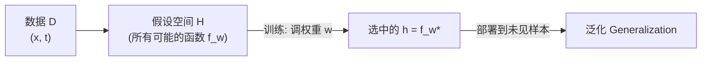
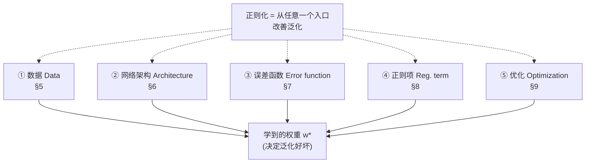
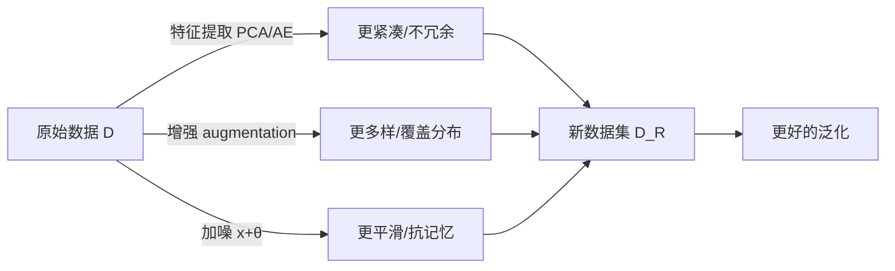
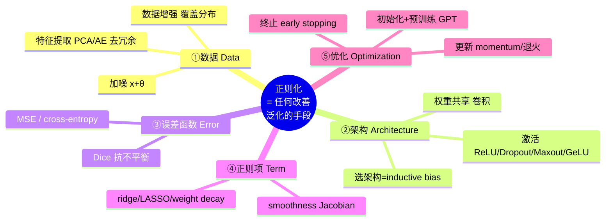

# Week 8 · 正则化 (Regularization)

> **学习目标 (Learning objectives)** — 读完本章你应该能够:
> - 用"假设空间搜索"的语言解释机器学习在学什么,并说清 neural network 作为 universal approximator 的角色;
> - 准确定义 **generalization**(泛化)与 **overfitting**(过拟合),并解释二者与正则化的关系(这是老师点名的考点);
> - 写出并**解读**损失函数的 expected risk / empirical risk 形式,指出其中的 fidelity term 与 regularization term;
> - 复述 Kukačka et al. (2017) 对正则化的"伞形"定义,并说出决定权重 $w^*$ 的**五个要素**;
> - 对五个要素中的每一个,各举出至少一种具体的正则化手段,并解释它**为什么**能改善泛化;
> - 解读 weight decay、smoothness(Jacobian/Frobenius)、Dice、SGD、early stopping 等关键公式的含义。

机器学习里有一个让人不安的事实:一个足够大的 neural network 几乎可以**背下**任何训练数据——你给它一堆图片和标签,它能把每张图和每个标签的对应关系硬记下来,在训练集上做到接近零错误。可一旦换上一张它没见过的图,它可能就彻底失灵。这就引出了本章的核心问题:**我们要的从来不是"在训练集上答对",而是"在没见过的数据上也答对"。** 如何逼着模型去真正"学会"、而不是"背答案"——这件事的统称,就是 **regularization(正则化)**。

本章的组织非常清爽。我们先把"机器学习在学什么"讲清楚(§1),由此自然地引出"泛化"这个目标和它的反面"过拟合"(§2);然后把正则化**形式化**成损失函数里的一项(§3);接着给出全章的地图——决定模型最终权重的**五个要素**(§4);最后逐一走过这五个要素,看正则化如何从每一个"入口"渗透进来(§5–§9)。整章其实是一条线:*学什么 → 为何要泛化 → 怎么形式化 → 五个入口 → 逐个击破*。

---

## §1 从"任务"到"概念":机器学习到底在学什么

要理解正则化,先得把"学习"这件事看清楚。Slides 用四个**任务 (task)** 的例子开场。所谓任务,讲的是"机器学习系统应该**如何处理一个样本**";而**样本 (example)** 本身,是从某个对象或事件上**定量测量**出来的一组**特征 (features)**,数学上写成一个向量 $x \in \mathbb{R}^n$(比如一张图片拉直成 $n$ 个像素值,就是一个 $n$ 维特征向量)。

四个任务的区别,本质上是它们要学的那个函数 $f$ 的**输入输出类型**不同:

| 任务 (Task) | 要学的函数 | 含义 | 例子 |
|---|---|---|---|
| **Classification**(分类) | $f:\mathbb{R}^n \to \{1,\dots,k\}$ | 判断输入属于 $k$ 个类别中的哪一个;$y=f(x)$ 把特征 $x$ 指派到类别 $y$ | 图像识别(这是猫还是狗) |
| **Regression**(回归) | $f:\mathbb{R}^n \to \mathbb{R}$ | 预测一个**数值**,而非类别 | 预测房价、温度 |
| **Transcription**(转写) | $f:\mathbb{R}^n \to A^{k(m)}$ | 把相对**非结构化**的数据转成**离散的文本**;$A$ 是某种语言的字母表,$k(m)$ 表示长度可变 | 语音识别 |
| **Machine translation**(机器翻译) | $f:A_x^{k(n)} \to A_y^{k(m)}$ | 把源语言的符号序列转成目标语言的符号序列 | 中译英 |

> **🔑 怎么读这些函数签名** — 不要被符号吓到。$f:\mathbb{R}^n \to \{1,\dots,k\}$ 读作"一个把 $n$ 维实数向量映射到 $1$ 到 $k$ 这几个整数标签之一的函数"。Classification 的输出是**类别**(categorical),所以箭头右边是一个有限集合 $\{1,\dots,k\}$;Regression 的输出是**连续数值**,所以右边是 $\mathbb{R}$——这一对比正是 slides 反复强调的两者本质差别。分类器也可以不直接吐一个类别,而是输出一个**类别上的概率分布**(比如"70% 是猫,30% 是狗")。

这四个例子真正想说的是更抽象的一点(Slide 5):这些任务都可以看成在**学习一个"概念"(concept)**。问题在于,我们并**不知道**那个能实现映射的函数长什么样、有没有一个简洁的解析式。怎么办?

这里是全章的关键思想转折。**想象有一个装满了各种函数的"大筐",我们要做的就是从里面挑一个最合适的。** 这个大筐就叫 **hypothesis space(假设空间)**,记作 $\mathcal{H}$;学习的目标,就是找到一个 $h \in \mathcal{H}$,使得它在把"学到的知识泛化到没见过的样本"时**误差最小**。

那 neural network 在这里扮演什么角色?它是一个 **universal approximator(通用逼近器)**——理论上能逼近各种各样的函数,所以可以拿它当作"要学的那个函数"的一个**模板 (template)**。更具体地说,neural network 是一个**参数化的函数 (parameterised function)** $f_w$:

$$f_w : x \mapsto y, \qquad w \in W$$

其中 $w$ 就是网络的**参数(权重 weights、偏置 biases 等)**。这些参数可以从数据里**学**出来——这个过程我们就叫**训练网络 (training)**。于是整个机器学习被收拢成一句话:**从假设空间里,通过调参,找到一组能让模型"泛化"该概念的权重 $w$。** 记住这个"搜索 + 调参"的画面,下一节我们就会看到,正则化干的事情正是**缩小这个搜索范围**。



---

## §2 过拟合与泛化:为什么非要正则化不可

上一节我们说,目标是让模型在**没见过的数据**上也表现好。这个能力有个正式名字:**generalization(泛化)**。老师在课上把它列为"机器学习里**非常重要**"的概念,值得我们把定义抠清楚。

**泛化的定义(老师的口径)**:训练好一个模型并部署它,使得对于任何**它没在训练中见过、但来自与训练数据相同分布**的数据,它也能给出合理的结果。这里有一个**绝不能省**的前提——"**来自同一个分布 (same distribution)**"。老师反复强调这一点。

> **🔑 例(同分布:房间里的身高)** — 想象这间教室里所有人的身高构成一个**分布**。来了一个新同学,只要他的身高落在这个分布的合理范围内,我们对"教室里的人"建立的模型对他依然适用。但如果走进来一个身高三米的人,你会脱口而出:"他是从火星来的吧?"——因为他**根本不属于这个分布**。模型对这种"分布外 (out-of-distribution)"的样本失灵,不算它没泛化好;泛化只承诺"同分布的未见样本"。

> **🔑 例(打篮球的超级巨星)** — 老师用了一个很生动的类比。假设你要做一个游戏,模仿某位会扣篮的篮球巨星。你研究他的比赛录像,找出"他在什么条件下会得分"——这些条件就成了**特征 (features)**;由此你为他建立一个**概率分布**。之后,只要某个特定条件出现,你的游戏就让虚拟球员扣篮。**只要情况落在那个分布能复现的范围内**,他就会像真人一样打球——这时你就可以说,你已经"建模了这个人",你的模型**泛化**了。只有在分布之外,他才会"失手、不扣篮"。

泛化的反面是 **overfitting(过拟合)**。老师给了一个很硬核的直觉:**如果网络"过大"(over-parameterized)而数据又不够,它就会单纯地把数据背下来 (memorize)。** 它在训练集上看起来完美,但什么概念都没学到——因为它只是建了一张查找表。反过来,如果网络规模**合适**、数据量也**合适**,它才会被逼着去学到真正可复用的规律。这正是本章开头那个"让人不安的事实"的来源。

> 📎 **拓展(超出 slides)— 数据的"多样性"比"数量"更关键** — 老师在优化那一节抛出一个绝佳的类比,值得提前放在这里理解过拟合:"假设你要教我英文字母。今天你给我看 A,明天看 B——我的大脑会想,哦,学到了 A 和 B。可你接下来又给我 A、又给我 B——这就**不是训练**了。"数据必须**有足够的多样性,覆盖住要学的那个分布**;光是"样本很多"没用,关键是"覆盖得全"。这解释了为什么数据增强(§5)能正则化:它人为地扩大覆盖面。

现在到了本章最被点名的考点。老师在课上**两次**给出明确的考试提示:

> ⭐ **考点(老师原话改写)** — "Regularization 和 generalization 之间有某种联系。这个联系是什么?你至少能给我写 3、4 行吧……这正是我喜欢在考试里问的那类问题。我现在就是在给你**考试提示**。"

它俩的联系,用老师自己的答案说:**generalization 是目标,regularization 是手段——通过正则化,你能得到一个泛化能力更好的模型。** 把这句话记牢,并能展开三四行(例如:正则化通过约束模型/数据/优化等,抑制对训练集噪声的记忆,从而缩小训练表现与未见数据表现之间的差距,即提升泛化)。

| | Underfitting(欠拟合) | 恰好 (good fit) | Overfitting(过拟合) |
|---|---|---|---|
| 训练集表现 | 差 | 好 | **极好(甚至完美)** |
| 未见数据表现 | 差 | **好** | **差** |
| 直觉 | 模型太弱/太受限,没学到 | 学到了可复用的规律 | 把训练数据(含噪声)背了下来 |
| 正则化的作用 | (可能正则太强,需放松) | —— | **正则化主要对治这一侧** |

---

## §3 把正则化形式化:损失、风险与那个"惩罚项"

我们已经知道目标是泛化,也知道训练就是"找权重"。这一节把这两件事拧成一个可计算的**优化问题**,正则化就会作为其中清清楚楚的一项浮现出来。

训练一个网络,就是在所有可能的 $w \in W$ 当中,找到那个(通常记作 $w^*$)能让一个**损失函数 (loss function)** $L:W \to \mathbb{R}$ 最小的权重:

$$w^* = \arg\min_w L(w). \tag{5}$$

> **🔑 怎么读 $\arg\min$** — $\arg\min_w L(w)$ 的意思是"让 $L(w)$ 取到最小值的那个**自变量 $w$**"。注意它返回的不是最小的损失值,而是**取到该最小值的权重**。老师特意点过:objective function、loss function、cost function 这几个名字说的是**同一样东西**,别被术语绕晕。

这个损失一般写成一个**期望风险 (expected risk)** 的形式:

$$L = \mathbb{E}_{(x,t)\sim P}\big[\, \mathcal{E}(f_w(x),\,t) + R(\cdots) \,\big] \tag{6}$$

这条式子是本章的"主方程",务必能逐项读出来:

- $\mathbb{E}_{(x,t)\sim P}[\cdot]$:对从真实数据分布 $P$ 中抽到的样本对 $(x,t)$ 求**期望(平均)**;$t$ 是 target(目标/真值)。
- $\mathcal{E}(f_w(x), t)$:**error function(误差函数)**,也叫 **fidelity term(保真项 / 数据项)**。它衡量网络的预测 $f_w(x)$ 与真值 $t$ 差多少——我们希望它**越小越好**。
- $R(\cdots)$:**regularization term(正则项)**。注意它是**对模型本身的一个惩罚 (penalty)**,典型地只惩罚权重(不含 target $t$),目的是**约束我们从中挑选函数(网络)参数的那个集合**。

可现实里我们拿不到真实分布 $P$,只有一个有限的数据集 $D$。于是用 **empirical risk(经验风险)** $\hat L$ 去**近似**式 (6)——把"对分布求期望"换成"在手头数据上求平均":

$$w^* = \arg\min_w \frac{1}{|D|}\sum_{(x_i,t_i)\in D}\big(\mathcal{E}(f_w(x),t)+R(\cdots)\big) \tag{7}$$

这就是实际训练时真正在最小化的东西。老师把它的结构口语化成一句很好记的话:"**让这个误差项尽可能小,subject to(在……的约束下)正则项也成立**;而这个 'subject to' 是通过乘一个 $\lambda$ 塞进优化里的。"——换句话说,$\lambda$ 越大,正则的约束就越被当回事。

那么,正则化到底**在直觉上**干了什么?老师给了全课最精彩的类比:

> **🔑 例(找一个人:蓝衬衫的故事)** — "我在找一个人,你能帮我找到吗?"——这是个没法回答的问题,因为答案可能是房间里**任何一个人**(搜索范围 = 整个假设空间,毫无约束)。"但如果我说:我找的人**穿着蓝色衬衫**——啊,可能的人选范围一下就缩小了。**这就是正则化在做的事:它把你的搜索空间缩小到一个更可控、更有意义的范围,让你更快找到答案。**" 再加一个条件("蓝衬衫**而且**卷发"),范围进一步收窄到某个区域。关键的细节:正则化**并不直接把答案告诉你**("它不会说出那个人的名字")——**搜索仍然要靠 optimization 来做;正则化只是缩小你要搜的地方。**

这个类比把 §1 的"在假设空间里搜索"和正则化漂亮地接上了:**optimization 是搜索过程,regularization 是给搜索画的范围圈。** 由此也能理解 slides 给出的那条总纲定义:

> ⭐ **定义(Kukačka et al. 2017,伞形定义)** — "**任何旨在让模型泛化得更好的辅助技术,都是一种正则化 (Any supplementary technique aimed at making a model generalize better is a form of regularization)。**"

这个定义之所以重要,是因为它**故意很宽**。它告诉我们:正则化不是某一个具体公式,而是一**类目的**。只要某种做法的目的是改善泛化,它就算正则化——哪怕只是换了个网络结构。这就把我们引向下一节那张关键的"地图"。

---

## §4 决定权重的五个要素:全章的地图

既然"任何能改善泛化的手段"都算正则化,那它能从哪些"入口"进入?Slide 7 给出一个极其好用的框架:列出**所有决定最终学到的权重 $w^*$ 的要素**——因为只要你能影响这些要素,你就能影响泛化,也就是在做正则化。

老师特别澄清:这里的"权重 (weights)"是**广义**的,泛指网络从数据里学到的**一切**(多层网络每一层学的东西都算),不只是某一层的连接系数。

**决定 $w^*$ 的五个要素:**

| # | 要素 | 符号 | 一句话 |
|---|---|---|---|
| 1 | 训练集 (the training set) | $D$ | 你喂进去的数据 |
| 2 | 选定的模型族 / 假设空间 | $f$ ($\mathcal{H}$) | 你选的网络架构 |
| 3 | 选定的误差函数 | $\mathcal{E}$ | 你用什么衡量"错" |
| 4 | 正则项 | $R$ | 你给模型加的惩罚 |
| 5 | 优化技术 | —— | 你怎么搜索最优 $w$ |

> 老师原话的味道:"用很差的数据,模型就学不好……你选的假设族也很重要……**所有这些都影响你最终选到的权重,都关乎泛化。**"

这张表就是本章后半段的**目录**。接下来 §5–§9 会逐一走过这五个入口,看每一个具体能玩出哪些正则化花样。下面这张图请记在脑子里——它是 Week 8 的骨架:



---

## §5 要素一:通过**数据**正则化 (Regularization via Data)

第一个入口是数据本身。核心思路(Slide 8):把给定的数据集 $D$ **变换**成一个新的、更"适合学习"的数据集 $D_R$,或者**生成**更多数据。具体有三条路。

### 5.1 特征提取与预处理:把数据"洗干净、抽精华"

第一类做法是对数据做 **feature extraction(特征提取)**、**preprocessing(预处理)**、**feature space transformation(特征空间变换)** 或 **distribution remodelling(分布重塑)**。常见工具包括 **PCA、KPCA(kernel PCA)、Fourier transform、wavelet transform、autoencoder、word model** 等——它们把原始数据映射到一个**学起来更容易**的空间。

为什么这能算正则化?老师用一个人脸识别的故事讲透了:

> **🔑 例(5 张照片与冗余特征)** — 假设你给每个人拍 5 张照片(= 一个 5 维特征向量)来训练人脸模型,结果准确率只有约 50%——"那我跟抛硬币有什么区别?"问题出在哪?**很可能这 5 个特征是冗余的 (redundant)**:其中 4 个其实能从另外 1、2 个推出来,所以你名义上有 5 个特征,**实际只有 2 个**独立信息。可 2 个又可能**不足以**训练出好模型。正则化在数据这一侧要做的,就是**保证特征彼此不冗余 (non-redundant)、线性无关 (linearly independent)**——这一维讲的故事和那一维不一样,合起来才是一个**丰富 (rich) 的表示**。如果它们其实只讲了同一个故事,你就等于只有一个特征,而"一个特征能描述太多人了",当然**没法泛化**。

这正是 PCA 这类方法的价值:它去掉相关/冗余的成分,留下彼此独立、信息密集的特征。**让表示更紧凑、更不冗余 → 泛化更好**,这就是"通过数据正则化"的第一层意思。

### 5.2 数据增强:人为制造"同分布"的多样性

第二类做法是 **data generation / data augmentation(数据增强,augmented dataset)**:人工**生成更多样本**,覆盖同一对象的各种形态。

> **🔑 例(给人脸"加戏")** — "我给 Philip 拍一张正脸,然后让他:转个身、再转、抬头、低头、把灯调暗、再暗一点、摘掉眼镜、再戴上……这就是 data generation——生成足够多的样本,覆盖各种形态。"

> **🔑 例(机场刷脸:分布外的真实代价)** — 为什么机场的自助刷脸闸机有时认不出你?"很可能是你呈现给它的样子**落在了训练分布之外**——比如你刚下了 27 小时的飞机,脸都熬'垮'了,变成了'丧尸',这个样子不在它的训练分布里。" 解决之道:**人工生成**这些极端形态(疲惫、不同光照、不同角度)的样本加进训练集,扩大覆盖。"这又是一种正则化。"

把 §2 那个"字母表"类比接上来就完全通了:augmentation 之所以正则化,是因为它**主动扩大数据对真实分布的覆盖**,逼模型见过更多变体,从而不去死记某一张特定的脸,而是学到"这个人**在各种情况下**的样子"。

### 5.3 怎么变、在哪儿变、何时变:三个维度

Slides 9–10 把"通过数据正则化"拆成几个可调的维度,值得分清楚。

**(a) 用随机参数做变换——注入噪声。** 一种常见形式是给输入加噪声:

$$\tau_\theta(x) = x + \theta, \qquad \theta \sim \mathcal{N}(0,\Sigma) \tag{8}$$

读作:把样本 $x$ 加上一个从均值为 $0$、协方差为 $\Sigma$ 的**高斯分布 (Gaussian / normal distribution)** 中抽出的随机扰动 $\theta$。直觉:让模型见到"原样本的一圈邻居",它就不敢对某个精确点死记硬背,而要学得平滑一些。其中的扰动参数 $\theta$ 可以有三种来源:

- **deterministically(确定地)**——由某个固定方程给出;
- **randomly(随机地)**——按某个分布抽样(如式 8);
- **adaptively(自适应地)**——通过(有约束/无约束/随机)**优化**得到,带着特定目标去生成。

**(b) 变换是否改变表示。** 数据变换可以是:

| 类型 | 含义 |
|---|---|
| **Representation-preserving**(保表示) | 特征空间与分布都基本不变(如轻微加噪、平移) |
| **Representation-modifying**(改表示) | 可能换成不同的分布与特征空间;把原始因子(特征)映射到一个**更易学习**的空间 |

**(c) 在哪个空间、什么时候变。** 变换可以发生在不同的数据空间:

- **input space(输入空间)**——直接对数据 $x$ 做变换;
- **hidden-feature space(隐藏特征空间)**——例如修改某些层的输出;
- **target / label(目标/标签)**——训练时连标签也可以改(如 label smoothing 之类)。

而且它**既可以发生在训练时,也可以发生在测试时**(对训练样本或测试样本都行)。



---

## §6 要素二:通过**网络架构**正则化 (Regularization via Network Architecture)

第二个入口是网络结构本身。这是老师课上**最感兴趣、讲得最多**的一个要素(他原话:"我想讲到的、我觉得很有意思的,就是这个 architecture")。

### 6.1 选架构本身就是一种正则化:inductive bias

核心论断(Slide 11):**仅仅是"选定一个网络架构"这件事,就已经是一种正则化**——因为架构**规定了**你能用来逼近的函数**类型**。Goodfellow et al. (2016, p.200) 的话:"使用深层架构,确实表达了一种关于'模型所学函数空间'的有用先验 (a useful prior)。"

老师把这层意思讲得很透:

> ⭐ **关键直觉(架构 = inductive bias)** — "你一旦选定了某个具体架构,就已经在做一种正则化了:因为在所有可能的架构里,你**偏偏挑了这一个**。这是一种 **induction bias(归纳偏置)**——你通过选定架构,**限制了能被建模的函数类**。换个架构,它做的事就不一样。任何架构都还在 universal approximator 的范畴内,但**选择本身**就是一种正则化。"

为什么?回忆 §1:网络是个**函数**,它按照**层数和神经元数**把输入映射到输出——这就已经约束了"映射的类型"。再回忆 §3 的搜索画面:架构强加的**权重结构**,会和你选的优化方法一起,**决定搜索空间的形状**(优化时我们是在一张"权重的函数"——误差曲面 (error surface)——上行走)。所以选架构 = 选你要在哪片"地形"上找答案。

更妙的是,有些**不变性 (invariances)** 可以被"焊死 (baked in / hardwired)"进架构——典型如 **convolution(卷积)**。Kukačka et al. (2017) 的 Table 3 列出了一串网络架构层面的方法,以及它们各自编码的假设。

### 6.2 权重共享 (Weight sharing)

**Weight sharing** 指**在网络的多个部位重复使用同一批可训练参数**。它带来两个好处(Slide 12):

1. **降低模型复杂度**——参数变少了,假设空间收窄,自然更不容易过拟合;
2. **内嵌关于数据底层过程的先验知识**——以卷积为例,共享卷积核编码了两条强先验:**shift-equivariance(平移等变性,**物体平移,响应也跟着平移**)** 和 **locality(局部性,**特征是从局部邻域抽取的**)**。

换句话说,卷积之所以适合图像,正是因为它把"图像的统计性质对平移大致不变""有意义的特征是局部的"这两条人类先验**硬编码**进了结构里——这本身就是强力的正则化。

### 6.3 激活函数 (Activation functions)

**Activation function** 的选择很重要,因为它直接决定一个神经元输出的形态。Slide 12 点了几个:

| 激活/机制 | 作用与直觉 |
|---|---|
| **ReLU** | 用来缓解 **vanishing gradient(梯度消失)** 问题——这是老师提到 ReLU 时的关键点(深层网络里梯度反传时越乘越小、趋近于零,导致前面的层学不动;ReLU 在正区间梯度恒为 1,缓解了这一点)。 |
| **Dropout** | 一种随机正则化:它能在测试时**近似模型集成 (ensemble) 预测的几何平均 (geometric mean)**(等价于训练了指数级多个共享权重的子网络再平均)。 |
| **Maxout** | 同样能在测试时近似模型集成预测的几何平均。 |
| **GeLU** | "桥接/结合":把 **dropout 这类随机正则化**与**非线性(激活函数)**结合在一起。 |

> **🔑 例(Dropout 与 Assignment 1 的坑)** — 老师特意提醒:"Assignment 1 里我们让你们做 dropout,但那个网络**太小**了,dropout **看不出效果**。要在**大网络**上你才会看到 dropout 的威力;我们只是想让你**体验**一下'如果随便丢掉一些会怎样'。" 实践建议:PyTorch / TensorFlow 里有一长串激活函数可选,写个小脚本、换着试,直接观察对结果的影响。
>
> ⚠️ 老师口头把 dropout 描述成"某些权重被'冻住'、值不变"——这是个**不太精确的口语化说法**。Dropout 的标准定义是**随机地把一部分神经元的激活值置零 (stochastically zeroing out activations)**,不是冻结权重。考试请以"随机置零激活"为准(这也正是 Slide 18 把 dropout 归到"gradient and weight filters"的原因)。

---

## §7 要素三:通过**误差函数**正则化 (Regularization via Error Function)

第三个入口是你**用什么来衡量"错"**。误差函数 $\mathcal{E}$ 刻画了网络逼近的**质量**;换一个误差函数,梯度的方向和模型最终落点都会变,因此它也是正则化的入口。

最常见的两个:**回归**任务一般用 **mean-squared error(MSE,均方误差)**,**分类**任务一般用 **cross-entropy(交叉熵)**。老师提醒:文献里有关于"什么任务该配什么误差"的建议,不要乱配。

slides 重点举的"非常规"误差函数是 **Dice coefficient(Dice 系数)**,它常用于 **segmentation(图像分割)** 任务,并且能**对抗数据不平衡 (data imbalance)**。

> **🔑 例(分割任务:怎么算"对得好不好")** — 老师先把任务讲清楚:"分割,就是给你一幅场景图,要你把**相连、且语义相同**的区域圈出来——这里是一个人、那里是一棵树,把人从背景里**勾画 (delineate)** 出来。那你怎么衡量自己圈得对不对、圈得多好?**就用 Dice score。**"

Dice 系数(作为误差/评价指标)定义为:

$$\mathrm{DSC} = \frac{2\,|X \cap Y|}{|X| + |Y|} \tag{9}$$

按 Slide 的口径,$|X|$ 是**正确分割**的像素数、$|Y|$ 是**错误分割**的像素数;更通用的读法是:$X$、$Y$ 分别为**预测区域**与**真值区域**,$|X\cap Y|$ 是二者**重叠**部分。直觉:**两倍重叠 / (两者面积之和)**——完全重合时 $\mathrm{DSC}=1$,毫无重叠时为 $0$。它本质上和"$Y$(真值)减去预测、看差多少"是同一种"衡量对错"的思路,只不过更适合分割。把它当**损失**用时,通常优化 $1-\mathrm{DSC}$。

> 📎 **拓展(超出 slides)— 为什么 Dice 能对抗 data imbalance** — 分割里常见的情形是"前景只占一小块,背景占一大片"(比如医学影像里的肿瘤)。这时如果用逐像素的 accuracy 或普通交叉熵,模型只要"全预测成背景"就能拿到很高的分数——它根本懒得去找前景。而 Dice 只看**重叠占两者面积之和的比例**,与背景那一大片无关,所以前景再小也逼着模型去对齐它。这就是它"combats data imbalance"的机理。

slides 给了 TensorFlow 里的实现(理解即可,不必背):

```python
def DiceLoss(targets, inputs, smooth=1e-6):
    # flatten label and prediction tensors
    inputs  = K.flatten(inputs)
    targets = K.flatten(targets)
    intersection = K.sum(K.dot(targets, inputs))
    dice = (2*intersection + smooth) / (K.sum(targets) + K.sum(inputs) + smooth)
    return 1 - dice
```

读这段代码:把预测和标签拉平 → 算交集(对应分子 $|X\cap Y|$) → 套式 (9) → 返回 $1-\mathrm{dice}$ 作为要最小化的损失;`smooth` 是防止分母为零的小常数。

---

## §8 要素四:通过**正则项**正则化 (Regularization via the Regularization Term)

这是最"名正言顺"的入口——**直接往损失里加一项 $R$**(就是式 6 里那个 $R(\cdots)$)。它通常**不含 target**,只是对模型(典型是权重)的**惩罚**。

### 8.1 Weight decay、Ridge 与 LASSO

回忆我们在回归里见过的两个经典正则项:**ridge regression** 用的 $\|w\|^2$(L2 范数平方),**LASSO** 用的 $\|w\|_1$(L1 范数)。神经网络里最常用的是 **weight decay(权重衰减)**:

$$R(w) = \frac{1}{2}\lambda\,\|w\|_2^2 \tag{10}$$

逐项读:$\|w\|_2^2$ 是权重向量长度的平方(所有权重平方之和),$\lambda$ 是一个**控制旋钮**——它决定"正则项相对于 fidelity(保真)项有多重要"。老师把 $\lambda$ 的作用讲得很形象:"$\lambda$ 设成 0,正则就**关掉**了;$\lambda$ 调大,正则就**更当回事**。"

为什么"惩罚权重的长度"能帮泛化?把 §3 的蓝衬衫类比再调出来:无约束时权重"可以是任何值";加上 $\frac12\lambda\|w\|^2$ 这一项,就是在说"在能把训练数据拟合好的前提下,**请尽量用小的权重**"——这等价于偏好**更简单、更平滑**的函数,而简单函数更不容易去迎合训练集里的噪声。$\lambda$ 就是这场"拟合 vs 简单"拉锯的调节器:太小 → 偏向死磕训练数据(易过拟合);太大 → 权重被压得太狠(易欠拟合)。

> 📎 **拓展(超出 slides)— Ridge 与 LASSO 的实务差别** — 两者都压权重,但 L1($\|w\|_1$)倾向于把一部分权重**精确压到 0**,从而起到**特征选择 (feature selection)** 的作用;L2($\|w\|^2$)则是把权重**整体压小**但一般不归零。老师课上还顺带提到:**把 L2(ridge)和 L1(LASSO)两项加在一起,就得到所谓的 elastic-net(弹性网络)正则化**——兼得两者之长。

### 8.2 Smoothness 约束:Jacobian 与 Frobenius 范数

另一类正则项约束的不是"权重多大",而是"**映射多平滑**"。**Smoothness(平滑性)约束**的思想是:**如果两个输入 $x_1$、$x_2$ 彼此接近,它们对应的输出 $f_w(x_1)$、$f_w(x_2)$ 也应当接近。** 形式化为:

$$R(f_w, x) = \big\|\,J_{f_w}(x)\,\big\|_F^2 \tag{11}$$

其中 $J_{f_w}(x)$ 是网络输入–输出映射 $f_w$ 在固定权重 $w$ 下的 **Jacobian(雅可比矩阵,即所有输出对所有输入的一阶偏导构成的矩阵)**,$\|\cdot\|_F$ 是 **Frobenius 范数**。这一项**惩罚导数过大的映射**——导数大意味着"输入稍动、输出剧变",正是不平滑;把它压小,输出就不会对输入的微小变化大起大落。

Frobenius 范数对一个矩阵 $M \in \mathbb{R}^{n\times m}$ 的定义是:

$$\|M\|_F = \sqrt{\sum_{j=1}^{m}\sum_{k=1}^{n} |m_{jk}|^2} \tag{12}$$

读作:**把矩阵所有元素的绝对值平方求和,再开根号**——就是把矩阵"拉平成一个长向量"后求它的 L2 长度。

> **连接** — 这个正则项我们其实**见过**。Slide 15 明确指出:在 "Artificial Neural Networks and Deep Learning: An introduction (III)" 的 Slide 10,**contractive autoencoder(收缩自编码器)** 用的正是这一项:$\Omega(h) = \left\|\frac{\partial f(x)}{\partial x}\right\|_F^2$。收缩自编码器正是靠惩罚编码对输入的敏感度(Jacobian),逼出对扰动鲁棒的表示。所以"平滑性约束"不是新东西,而是同一把武器在不同场合的复用。

| 正则项 | 形式 | 惩罚什么 | 效果 |
|---|---|---|---|
| Ridge (L2) / weight decay | $\frac12\lambda\|w\|_2^2$ | 权重的长度 | 权重整体变小、更平滑 |
| LASSO (L1) | $\|w\|_1$ | 权重的绝对值和 | 稀疏化、特征选择 |
| Elastic net | L1 + L2 | 两者结合 | 兼得稀疏与平滑 |
| Smoothness | $\|J_{f_w}(x)\|_F^2$ | 映射的导数(Jacobian) | 输入近 → 输出近,抗扰动 |

---

## §9 要素五:通过**优化**正则化 (Regularization via Optimization)

最后一个入口是**优化过程本身**。在深度学习里最常用的优化算法是 **stochastic gradient descent(SGD,随机梯度下降)**,其基本权重更新为:

$$w_{t+1} = w_t - \eta_t \,\nabla_w L(w_t, d_t) \tag{13}$$

逐项读:新权重 = 旧权重 $w_t$ 减去**学习率 (learning rate)** $\eta_t$ 乘以**损失对权重的梯度** $\nabla_w L$,其中梯度是在训练集的一个 **mini-batch** $d_t$ 上算的。老师的口语版:"新权重 = 上一步的权重 − 某个函数的梯度。"它的各种扩展——**Adam、RMSProp、AdaGrad**——我们在 "ANN & DL: An Introduction (I)" Slides 48–53 见过。

关键的组织思想(Slide 16):**任何优化方法都包含三个环节——(i) initialization 初始化、(ii) update 更新、(iii) termination 终止。优化层面的正则化,就从这三个"透镜"分别切入。**


### 9.1 初始化 (Initialization) 与预训练 (Pre-training)

**从哪儿出发,会影响你最终走到哪。**(Slide 17)

- **权重初始选择**:从某个分布里采样,并设法让**各层激活的方差保持在 1 附近**,以避免激活和梯度的**消失或爆炸 (vanishing or exploding)**。
- **预训练 (pre-training)**:先在**同一领域、不同任务**的数据上把网络"预热",再迁移过来。

> **🔑 例(GPT:预训练 + 微调)** — Slide 17 的招牌例子:OpenAI 的 **GPT(Generative Pre-trained Transformer)** 系列,先在**海量网页/书籍语料**上做预训练,得到的模型再在具体 NLP 任务(文本分类、问答、文本生成)上**微调 (fine-tune)**,就能展现出很强的语言理解能力。老师用作业的语境把这背后的直觉讲活了:"网络**前几层**学到的是**通用 (generic)** 的特征,后面的层才越来越**专用**。所以做领域适配时,我**冻住**前面那一大堆(几十亿)通用参数,只**放开训练后面一小部分**——也许几百万个参数,一台现代笔记本一晚上就能训完。" 这正是"用预训练做正则化"的精髓:把通用先验**继承**下来,不再从零乱撞。

初始化可以**带或不带**预训练:

| | 具体手段 |
|---|---|
| **不带预训练** | (i) 随机权重初始化 (ii) 正交权重矩阵 (orthogonal) (iii) 数据相关的初始化 (data-dependent) |
| **带预训练** | (i) 贪婪逐层预训练 (greedy layer-wise) (ii) 课程学习 (curriculum learning) (iii) spatial contrasting (iv) subtask splitting |

### 9.2 更新 (Update):更新规则与梯度/权重滤波

更新方法分两类(Slide 18):

**(a) 更新规则 (update rules):**
- **Momentum(动量)**——见 ANN & DL Intro I, slides 48–53;
- **学习率调度 (learning rate schedules)**;
- **在线批选择 (online batch selection)**;
- **SGD 的替代品**——L-BFGS、Hessian-free 方法等。

**(b) 梯度与权重滤波 (gradient and weight filters):**
- **Dropout**——随机地把激活置零(它在这里被归为对梯度/权重的"滤波");
- **Annealed Langevin noise**——往**梯度**里加噪声;
- **Anneal SGD**——用**退火 (annealing) 调度**调整学习率(按指数衰减 / 线性衰减 / 阶梯衰减逐步**降低**学习率),从而更充分地探索参数空间、获得更好的收敛。

> 📎 **拓展(超出 slides)— 为什么"逐步降学习率"是正则化** — 直觉上,训练早期用大学习率"大步快跑"以广泛探索、跳出差的区域;后期用小学习率"小步微调"以稳稳落进一个好极小点。这种先粗后细的节奏,既防止一开始就陷进坏解,又防止后期在好解附近来回震荡——本质上是在引导优化轨迹走向泛化更好的解。

### 9.3 终止 (Termination):见好就收

**在恰当的时刻停止优化,可以改善泛化**(Slide 19)——因为它**缩小了"期望风险的最优解"与"经验风险的最优解"之间的差距**(回忆 §3:我们其实在用经验风险 $\hat L$ 凑合代替真正想要的期望风险 $L$;训练太久会过度贴合前者)。

老师把这背后的直觉讲得很好:

> ⭐ **关键直觉(early stopping)** — "训练是一个**随机过程**,误差不见得**一路下降**。它可能到了某个点其实**已经学会了**,再往下练**反而有害**。所以你时不时**存一个快照 (snapshot)**,把当前值留住,然后**停**。具体做法:盯着**最近 2、3 个**验证指标,一看'不再改善了',就停。" 这就是 **early stopping(早停)**。

终止策略分两类:

| | 手段 |
|---|---|
| **用验证集 (validation set)** | (i) early stopping(早停) (ii) 验证集的选择 |
| **不用验证集** | (i) 固定迭代次数 (ii) optimized approximation algorithm |

> 📎 **拓展 — 验证集是什么** — 把数据分成 training / validation / test 三份:用训练集学权重,用**验证集**调超参数(学几轮、$\lambda$ 多大、学习率多少)并决定何时早停,最后用**完全没碰过的**测试集估计真实泛化。早停正是靠"验证集上的表现不再提升"来判断该收手了。

> **🔑 例(更聪明的优化:局部 vs 全局)** — 老师还点了一个有意思的现象:"有报告显示,即便你**没有**拿到**全局最优 (global optimum)**,系统照样能表现很好——因为它很可能落进了某个**不错的局部极小 (local minimum)**,而那个局部解已经代表了一个很好的结果;真正的全局最优,它**也许根本到不了**。" 这提醒我们:优化的目标不是数学上的完美最小,而是泛化得好的解。

slides 给了 TensorFlow 的早停回调(理解即可):

```python
callback = tf.keras.callbacks.EarlyStopping(monitor='loss', patience=3)
# 当 loss 连续 3 个 epoch 没有改善时,停止训练。
model = tf.keras.models.Sequential([tf.keras.layers.Dense(10)])
model.compile(tf.keras.optimizers.SGD(), loss='mse')
history = model.fit(np.arange(100).reshape(5, 20), np.zeros(5),
                    epochs=10, batch_size=1, callbacks=[callback], verbose=0)
len(history.history['loss'])   # 实际只跑了 4 个 epoch
```

`patience=3` 就是"再忍 3 轮没进步就停"——把上面的"盯最近 2、3 个值"直接落成了代码。

---

## §10 全章串讲:一张图回看五个入口

到这里,Week 8 的整条线就闭合了。我们从"机器学习在假设空间里搜一个函数"出发(§1),认定真正要的是**泛化**而非记忆(§2),把训练写成"最小化 fidelity + penalty"的优化问题(§3),然后用"决定权重的五个要素"作地图(§4),逐个入口看正则化怎么进来(§5–§9)。请用下面这张总图把它们收进一个画面——**同一个目标(泛化),五个入口**:



---

## 本章小结 (Key takeaways)

- **正则化 = 任何旨在让模型泛化得更好的辅助技术(Kukačka et al. 2017 的伞形定义)。** 它不是某一个公式,而是一类**目的**。
- **泛化 (generalization)** 指模型对"未见过、但来自**同一分布**"的数据也能给出合理结果;它的反面是**过拟合 (overfitting)**——过大的网络 + 不够的数据 = 死记硬背,训练集完美而未见数据失灵。"同分布"这个前提**不能省**。
- **正则化与泛化的关系(老师点名考点):** 泛化是**目标**,正则化是**手段**——通过约束模型/数据/优化来抑制记忆训练噪声,从而缩小"训练表现与未见数据表现"的差距。能写三四行展开。
- 训练 = $w^*=\arg\min_w L(w)$;损失写成 **expected risk**(式 6),实操用 **empirical risk**(式 7)近似,它由 **fidelity term $\mathcal{E}$** 与 **regularization term $R$** 两部分组成。
- **直觉:正则化 = 缩小搜索空间**("找穿蓝衬衫的人");而**搜索本身仍由 optimization 完成**——两者分工明确。
- **决定权重 $w^*$ 的五个要素 = 五个正则化入口:① 数据 ② 架构 ③ 误差函数 ④ 正则项 ⑤ 优化。** 这是全章骨架。
- **① 数据:** 特征提取(PCA 去**冗余/线性相关**特征 → 表示更丰富)、数据增强(扩大对分布的**覆盖**,如人脸多姿态、机场刷脸的 OOD)、加噪 $\tau_\theta(x)=x+\theta$;可在 input/hidden/target 空间、训练或测试时进行。
- **② 架构:** 选定架构本身就是 **inductive bias**;**权重共享**(卷积 → 平移等变性 + 局部性,降复杂度)、**激活函数**(ReLU 治梯度消失;Dropout/Maxout 在测试时近似集成的几何平均;GeLU 结合随机正则与非线性)。
- **③ 误差函数:** 回归用 **MSE**、分类用 **cross-entropy**;**Dice** $=\frac{2|X\cap Y|}{|X|+|Y|}$ 用于分割并**对抗数据不平衡**。
- **④ 正则项:** **weight decay** $R(w)=\frac12\lambda\|w\|_2^2$($\lambda$ 调节"拟合 vs 简单",ridge=L2、LASSO=L1、二者合为 elastic net);**smoothness** $R=\|J_{f_w}(x)\|_F^2$(输入近→输出近,即 contractive autoencoder 用的那一项)。
- **⑤ 优化:** 三透镜 **初始化 / 更新 / 终止**——初始化保持激活方差≈1、预训练(GPT 冻通用层只训专用头);更新含 momentum、学习率退火、dropout;终止靠 **early stopping**(借验证集"见好就收",`patience`)。

---

## ⭐ 考试提示 (Exam tips)

> 综合老师在两段录音里的明确信号 + 课程既往规律:
>
> 1. **解读公式,而非推导公式。** 老师原话:"考试时我**不会**让你写出方程——我会**把方程给你,让你解释这里发生了什么**。" 所以请把功夫下在**会读** $\arg\min$、式 (6) 期望风险、式 (10) weight decay、式 (13) SGD、Dice、Frobenius 这些式子上,能用一两句话说清每个符号和整体含义。(与本课一贯风格一致:3 小时手写、1 张 A4 cheat sheet、不考公式推导。)
> 2. **Regularization ↔ Generalization 的联系**几乎是送分必备题——准备好写 3–4 行(目标 vs 手段、抑制记忆、缩小训练/未见差距)。
> 3. **没有标准答案模板。** 老师强调他**读你写的内容**:"把你的理解讲成一个故事,讲丰富点。" 与其背术语,不如把直觉(蓝衬衫、篮球扣篮、字母表、机场刷脸)讲清楚。
> 4. **与作业挂钩的考点:** 老师明说"有些考题基于作业"——尤其 regression 里的 **ridge**、**dropout** 的行为、以及 Assignment 2 的 RAG。"如果你没真正做过,这种题你答不上来。"

---

## 参考文献 (References)

- Goodfellow, I., Bengio, Y. & Courville, A. (2016). *Deep Learning*. MIT Press.
- Kukačka, J., Golkov, V. & Cremers, D. (2017). *Regularization for deep learning: A taxonomy*. Technical Report, arXiv:1710.10686 [cs.LG]. <https://arxiv.org/abs/1710.10686v1>

> **关于来源的说明** — 本指南以 `Week8_regularisation.pdf`(20 页)为知识范围基准,叙述、直觉与例子融合自两段课堂录音(`CSCI933_Week7&Week8` 与 `CSCI933_Week8`)。其中蓝衬衫、篮球扣篮、人脸冗余特征、机场刷脸、字母表、GPT 冻层、早停快照、局部 vs 全局最优等**类比与例子来自老师口述**;凡 slides 未覆盖、由本指南补入的内容(如 Dice 抗不平衡机理、L1/L2 实务差别、elastic net、退火即正则、验证集说明)均已用 `📎 拓展` 标出。
