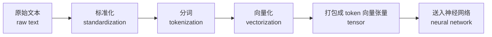
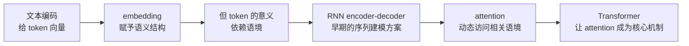
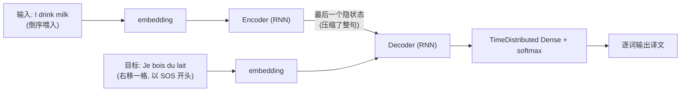
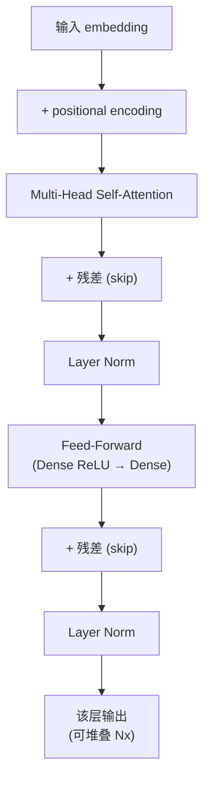
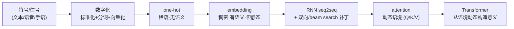

# Week 9 · 文本处理与 Transformer (Text Processing / NLP → Transformer)

> **学习目标 (Learning objectives)** — 读完本章你应该能够:
> - 解释什么是 **natural language**(自然语言),以及为什么 NLP 的第一步永远是"**把信号变成数字**";
> - 说清把原始文本变成模型输入的完整流水线:**standardization → tokenization → vectorization**,并区分 word / subword / character / n-gram 几种 token;
> - 对比 **one-hot encoding** 与 **word embedding** 的本质差别,解释 embedding 为什么是"有语义的几何空间",并能写出 `king + woman − man ≈ queen` 背后的直觉;
> - 指出 **static embedding(静态词向量)的根本缺陷**——同一个词在不同语境里被迫共用一个向量(站点 station 的例子);
> - 描述 **RNN encoder–decoder** 怎么做 neural machine translation,并说出它的三个短板(长程依赖、单向因果、固定长度)及对应补救(bidirectional RNN、beam search、padding);
> - **准确写出并解读** self-attention 的核心公式 $\text{Attention}(Q,K,V)=\text{softmax}\!\big(\tfrac{QK^\top}{\sqrt{d_k}}\big)V$,讲清 Query / Key / Value 三者的角色,以及 $\sqrt{d_k}$ 作为"temperature(温度)"的作用;
> - 复述 **Transformer** 的关键组件(self-attention、positional encoding、multi-head、residual + layer norm、feed-forward),并解释为什么说"**attention is all you need**"。

机器翻译、ChatGPT、Claude、文本摘要、情感分析——这些今天习以为常的能力,背后是同一个根本难题:**计算机只会算数字,而语言是符号。** 一句话怎么变成机器能"理解"、能拿来做运算的东西?这就是本章 (Week 9) 的全部主题。老师在录音里反复点的那句话可以当作整章的锚:"**Anything you have in some form or other that is a signal, you have to get down to numbers.**"——任何信号,最终都得落成数字,计算机才能 crunch(处理)它。

本章是一条非常清晰的进化线,跟着 slides 的四段式 outline(Language Modelling → Neural Machine Translation → Attention → Transformer)走:我们先弄清"语言建模在干什么、为什么"(§1),再把文本一步步变成数字——先用笨办法 one-hot(§2–§3),再升级到有语义的 embedding(§4);接着发现 embedding 是"静态的",撞上语境的墙(§5);为解决序列建模,先看早期的 RNN encoder–decoder 翻译模型(§6)及其短板与补丁(§7);短板逼出了 **attention**(§8);最后 **Transformer** 把 attention 推上主角位置,统一了整个领域(§9)。整章其实就是一句话:**符号 → 数字 → 稠密语义 → 动态语境 → Transformer。**

> 📎 **拓展(超出 slides)— 本章在课程里的位置** — 本周是承上启下的一周。前几周(Week 5–8)讲的是 neural network、RNN、regularization 这些"通用工具";本周把它们用到**文本/序列**这个具体战场上,顺势引出 Transformer。老师在课末"剧透"了下周(Week 10)的 representation learning(PCA / autoencoder / VAE / GAN / GNN),那部分**不属于本周考核范围**,我在 §11 只做一个过渡桥接。本周 slides 标注 "Based on Chollet (2021, Chp. 11.4)",配套教材还有 Géron (2023)。

---

## §1 自然语言与语言建模:我们到底在处理什么

### 1.1 什么是"自然语言"

直觉上,natural language(自然语言)就是人类的语言。但老师特意把这个概念**撑大**了。Slides (S3) 的定义是:

> **Natural language(自然语言)** = 自然产生的、用来**表示和传递意义 (representing and communicating meaning)** 的系统。在 NLP 里通常指人类语言(以**语音 speech、文本 text、手语 sign** 的形式出现),但更宽泛的计算视角下,它可以包括**任何结构化的生物通信信号**——比如动物的叫声或歌声——只要我们把这些信号**建模成承载信息的序列 (sequences carrying information)**。

注意这里的三个关键词:**speech / text / sign**(语音、文本、手语),以及"**建模成序列**"。手语也有语法、有结构,本质上和口语一样可以被处理。

> **🔑 例(濒危鸟类的"方言")** — 老师讲了一个真实项目:澳洲有一种濒危鸟叫 ground parrot(地鹦鹉),极难直接观测计数。生物学家在野外(新南威尔士州 Barrington Tops 山区)放录音设备,收集大量鸟鸣,交给老师团队去**识别鸟叫、数出有多少不同个体**,以此推断种群是在增长还是走向灭绝。有趣的是,他们发现**同一种鸟在不同地区的叫法略有不同**——就像有了"口音"甚至"方言"。这说明动物也有自己的一套通信系统。狗叫也一样——"They don't bark for nothing",不同的叫声有不同含义。老师的用意是:**别太傲慢地以为只有人类会"说话"**;任何能发声、能传信息的东西,都可以纳入"语言"来建模。

### 1.2 为什么要给语言"建模"(language modelling)

把语言**建模 (model)**,目的就是把它变成一种**可以做计算 (computation)** 的形式 (S4)。但不是为建模而建模——我们希望模型能**捕捉到语言里的结构**:时态 (tenses)、含义 (meaning)、上下文 (context)、词与词之间的关系 (relationships)。

老师有一句话点破了这件事的本质:当你把"人类处理文本的方式"都捕捉进一个模型里,**这个模型就"学会了像人一样处理语言"**——这正是 GPT、Claude 这类大语言模型在做的事。它们把人类的文本/对话方式封装 (encapsulate) 进了一个模型,于是你可以拿这个模型去做各种各样的事。

这些"各种各样的事",在 NLP 里有个统称:**downstream tasks(下游任务)**。一旦你有了一个好的语言模型,下面这些任务都能在它之上完成 (S4–S5):

| 下游任务 (Downstream task) | 在做什么 | 例子 |
|---|---|---|
| **Semantic understanding**(语义理解) | 理解词、句、篇章的含义——要懂句子,先得给每个词建模 | 阅读理解、问答 |
| **Language generation**(语言生成) | 利用词间关系生成**连贯有意义**的句子 | 机器翻译、文本摘要 (summarization)、人机对话 |
| **Information retrieval**(信息检索) | 比较用户 query 与文档的**含义**,即使用词不同也能检索到相关内容 | 语义搜索 |
| **Text classification / Sentiment analysis**(文本分类/情感分析) | 把词的表示当作**特征 (features)**,训练分类/情感模型 | 垃圾邮件识别、评论好恶判断 |
| **Language understanding**(语言理解) | 识别文本的各个层面:命名实体 (named entities)、词性 (part-of-speech tags)、句法结构 (syntactic structures)、情感 | NER、句法分析 |

> **🔑 一句话抓住主线** — 语言建模的产出是一个"懂语言"的表示;下游任务都是**站在这个表示之上**完成的。所以本章后面所有的努力(one-hot → embedding → attention → Transformer),本质上都是在回答一个问题:**怎样得到一个尽可能好的语言表示?**

> **🗝️ 本节关键回顾** — ① 自然语言 = 表示和传递意义的系统,含语音/文本/手语,广义上还含动物叫声等序列信号;② 建模的根本动机:把信号变成数字,让计算机能算;③ 好的语言模型要捕捉意义/语境/关系,并支撑语义理解、生成、检索、分类、语言理解等下游任务。

---

## §2 从文本到数字:标准化、分词、向量化

有了"为什么"(§1),现在讲"怎么做"。把一段原始文本变成神经网络能吃的张量,要走一条固定的流水线 (S6):

这三步——**standardise → tokenise → vectorise**——是本章前半部分的骨架。老师强调:这些技术早在三四十年前就被研究透了,如今有现成工具自动完成,变成了"trivial task";但**理解每一步在做什么仍然是考点级别的基础**,而且你的 assignment 就要亲手做这些。

### 2.1 标准化 (Text standardization)

**Standardization(标准化)** 是一种 **feature engineering(特征工程)**,目的是**去掉编码上的无关差异 (remove encoding differences)**,让"同一个意思的不同写法"被归一 (S7)。常见操作:

- **转小写 (convert to lower case)**:让 "The" 和 "the" 被当作同一个 token;
- **去标点 (remove punctuations)**:逗号、句号等过于普遍的符号通常移除;
- **保留空格**:避免词被粘连在一起。

好处很直接:标准化后,模型**用更少的训练数据就能学好,且泛化更好**(因为它不必为 "The/the/THE" 分别学一遍)。

> 📎 **拓展(超出 slides)— 别盲目转小写** — 老师特别提醒:转小写**不是无脑全转**。如果你的任务需要识别人名,而**人名首字母大写本身就是信息**,那就不该把它抹掉。同理,有时你反而**想保留**某些标点(比如它能切分句子边界)。所以 slides 上那句 "where appropriate(在合适的时候)"是关键——标准化要**看任务**,不是一套模板套到底。

### 2.2 分词 (Tokenization)

**Tokenization(分词/切分)** 是把文本切成一个个 **token(词元)** 的过程 (S6, S8)。"切到多细"有几种选择:

| 分词粒度 | 定义 | 例子 | 备注 |
|---|---|---|---|
| **Word tokenization**(按词) | token 是由若干字符组成的"词" | `["the", "cat", "sat"]` | 最常用 |
| **N-gram tokenization**(N 元) | token 是 **N 个连续的词** | "I am" 是 2-gram;"I am well" 是 3-gram | 能捕捉局部词组搭配 |
| **Character-level**(按字符) | 每个字符自成一个 token | `["c","a","t"]` | **很少用**,信息太碎 |
| **Subword**(子词) | 介于词与字符之间(如 BPE) | "playing" → `["play","ing"]` | 现代模型(BERT/GPT)主流 |

老师把这一步也叫 **chunking(分块)**:把整段文本切成可处理的小块。块可以基于 n-gram、基于词,甚至基于字符——但字符级"在很多场景下其实没什么用"。

> **🗝️ 本节关键回顾** — 文本→数字三步走:**标准化**(去无关差异,看任务决定转不转小写/去不去标点)→ **分词**(word / n-gram / character / subword)→ **向量化**(下面三节展开)。记住流水线的顺序,这是后面一切的地基。

---

## §3 One-hot Encoding:第一种、也是最笨的向量化

分完词,得把每个 token 变成数字向量。最朴素的办法是 **one-hot encoding(独热编码)** (S9)。它的逻辑非常机械:

1. 先建一个 **vocabulary(词表/字典)**,里面是所有可能出现的 token,共 $N$ 个;
2. 给每个 token 分配一个**唯一的整数下标 (unique integer index)** $i$;
3. 把下标 $i$ 变成一个**长度为 $N$ 的二进制向量**:**除了第 $i$ 位是 1,其余全是 0**。

"只有一个位置是 1"——这就是 "one-hot"(独热)名字的由来。

> **🔑 例(老师在白板上走的那一遍:"the cat sat on the mat")** — 这句话经过标准化(全小写)、分词后,每个词去字典里查下标。假设字典给出:`the→3, cat→26, sat→65, on→9, mat→133`(`the` 出现两次,两次都是 3)。于是:
> - "cat" 的整数表示是 26;
> - 若词表大小 $N$,则 "cat" 的 one-hot 向量是一个长度 $N$、**只有第 26 位为 1** 的向量:$[0,0,\dots,1,\dots,0]$。
>
> 老师在课上还举了个迷你版:假设字典里只有 8 个 token,那下标 3 可以表示成一个长度 8、第 3 位为 1 的二进制向量。**这串只含一个 1 的长向量,就是喂给神经网络的输入。**

**One-hot 的致命问题**(为下一节做铺垫):

- **极度稀疏、极度浪费**:词表动辄上万,每个词都是一个上万维、只有一个 1 的向量;
- **没有语义**:任意两个不同词的 one-hot 向量都互相**正交**,距离完全一样。也就是说,在 one-hot 空间里,"cat" 和 "dog" 的相似度,跟 "cat" 和 "democracy" 的相似度**完全相同**——这显然不符合语言的事实。

> 📎 **拓展(超出 slides)— 代码层面只是几行** — slides (S10–S12) 给了 TensorFlow(`Tokenizer` + `texts_to_matrix(mode='binary')`)和 PyTorch(`torchtext` 的 `build_vocab_from_iterator`)两套 one-hot 代码片段。老师的原话是"这东西实现起来非常简单"。**考试是手写、不考代码**,但你的 assignment 会用到,所以代码片段当作工具手册即可,理解概念才是重点。

> **🗝️ 本节关键回顾** — One-hot:建词表 → 给每个 token 一个下标 → 变成"只有一位为 1"的长向量。优点是简单;缺点是**稀疏 + 无语义**(所有词两两正交)。正是这个"无语义"的缺陷,逼出了下一节的 embedding。

---

## §4 Word Embeddings:稠密的、有语义的向量

**Word embedding(词嵌入)** 是对 one-hot 的根本性升级。一句话定义 (S13):

> **Word embedding** = 语言的**几何表示 (geometric representation)**,它把人类语言**映射到一个反映词语语义的几何空间**,使得**语义相近的词,向量也相近**。

老师把它和 **manifold learning(流形学习)** 联系起来:你学到的是一个**空间**,所有 token 都能被"画"在这个空间里,而这个空间的结构让**语义相似的东西聚集在相近的区域**。和 one-hot 的高维稀疏不同,embedding 是**低维稠密 (dense)** 的(比如 64 维、512 维),每一维都是实数。

### 4.1 几何里藏着语义:最著名的观察

embedding 最惊艳的地方,是**语义关系变成了几何关系** (S13)。经典例子:

- **king / queen** 靠得很近,**man / woman** 也靠得很近;
- 更神奇的是**向量运算**能反映类比关系:
$$\text{king} + \text{woman} - \text{man} \approx \text{queen}$$
- 同类还有:`cat → tiger` 的向量,和 `dog → wolf` 的向量方向相近(都像是"从宠物 pet 走向野生 wild"的位移);`cat → dog` 的向量,和 `tiger → wolf` 的向量也平行。

> **🔑 直觉(为什么向量能加减出语义)** — 老师坦白说:"我没有一个严格的科学解释为什么会这样。"但直觉是:如果"从男性到女性"这个语义差异,在空间里对应一个**固定方向的位移向量**,那么把这个位移加到 "king" 上,自然就落到了 "queen" 附近。语义结构被"几何化"了。**这不是偶然**——它是训练方式自然涌现出来的性质。

### 4.2 怎么得到 embedding(S14)

有三条路:

1. **和任务联合学习 (learn jointly)**:从**随机初始化**的词向量出发,像学网络权重一样,在做你的任务(如文档分类、情感预测)的同时把词向量也学出来;
2. 本质同上,强调"**随机起步,反向传播学出来**";
3. **用预训练 (pre-trained / pre-computed) 词向量**:别人已经在相关任务上学好的向量,直接拿来用。

常见的**预训练词向量/模型** (S14):

- **Word2vec**(Google)
- **GloVe**(Global Vectors,Stanford)
- **BERT**(Bidirectional Encoder Representations from Transformers,Google Research)
- **fastText**(Cornell/Caltech/Amazon)
- **GPT-2 / GPT-3**(Generative Pre-trained Transformer,OpenAI)

> 📎 **拓展(超出 slides)— Hugging Face** — 老师提到,你**不一定要从零学 embedding**;到 **Hugging Face** 上有大量现成的库和预训练 embedding,可以直接用或在其基础上微调。slides (S15–S16) 同样给了 TF 的 `tf.keras.layers.Embedding(1000, 64, ...)` 和 PyTorch 的 `nn.Embedding(1000, 64)` 代码——本质就是一个"**查表层**":输入整数下标矩阵 `(batch, length)`,输出 `(batch, length, embedding_dim)` 的稠密向量。

### 4.3 One-hot vs Embedding 对照

| 维度 | One-hot Encoding | Word Embedding |
|---|---|---|
| 向量 | 长度 = 词表大小 $N$,**稀疏**(一个 1) | 低维(如 64/512),**稠密**(全是实数) |
| 语义 | **无**——任意两词正交,距离相等 | **有**——语义近则向量近,可做类比运算 |
| 维度 | 极高($N$ 可达数万) | 低且可控 |
| 来源 | 直接由词表下标确定,不用学 | **学出来**(联合学习 / 预训练) |
| 类比 | 像身份证号,只标识身份 | 像地图坐标,位置本身有意义 |

> **🗝️ 本节关键回顾** — Embedding 把词映射到**低维稠密的几何空间**,语义相近→向量相近,甚至支持 `king+woman−man≈queen` 这类向量运算。获取方式:联合学习、或用 Word2vec/GloVe/BERT/GPT 等预训练向量。它解决了 one-hot 的"无语义"问题——但还没解决"**语境**"问题,这就是下一节。

---

## §5 静态 Embedding 的天花板:语境问题

§4 的 embedding 有个隐含假设:**一个词 = 一个固定向量**。这种叫 **static embedding(静态词向量)**。问题是——**语言里词的意思是随语境变的** (S17)。

> **🔑 例("station" 的三副面孔)** — 同一个词 "station":
> - **train station**(火车站)——一个地点;
> - **radio station**(广播电台)——一个频率/媒体;
> - **(International Space) Station**(空间站)——又是别的东西。
>
> 在静态 embedding 里,这三个 "station" 拿到的是**同一个向量、同一个数字**!因为查表时它就是那一个 token。可它们的真实含义天差地别。真正区分它们的,是**前面那个词**(train / radio / space)。

老师还借 Chollet 教材 (S32) 给了更多例子,说明"同词不同义"普遍存在:

- "mark the **date**"(标注日期)vs "go on a **date**"(约会)vs 市场上买的 "**date**"(椰枣);
- "I'll **see** you soon" vs "I'll **see** this project to its end" vs "I **see** what you mean";
- 代词 "he / it" 的指代**完全由句子决定**,甚至一句话里能变好几次。

结论 (S17):**static embedding is not enough(静态词向量不够用)**。我们需要的是 **context-aware representation(语境感知的表示)**——同一个词,在不同句子里给出不同的向量。

而解决它的机制,就是本章的主角:**attention(注意力)**。Slides 给出**关键思想 (Key idea, S17)**:

> **Attention** computes **relevance between elements** in a sequence (or between two sequences) by measuring **pairwise dependencies**.
> (注意力通过度量**两两之间的依赖关系**,计算序列内元素之间——或两个序列之间——的**相关性**。)

### 整章地图:Where we are going (S18)

slides 在这里给了一张"路线图",正好是本章的**脊柱**,务必记住:

> **🗝️ 本节关键回顾** — 静态 embedding 给每个词一个**固定**向量,无法区分 "train station / radio station" 里 "station" 的不同含义。我们要的是**语境感知**的表示。Attention 通过计算元素间的**两两相关性**来实现它。下面三节(RNN → attention → Transformer)就是沿着 S18 这张地图走。

---

## §6 Neural Machine Translation:用 RNN 做序列到序列

要讲清 attention 为什么必要,老师选了一个具体任务做载体:**neural machine translation (NMT,神经机器翻译)**。在 Transformer 出现之前,序列任务都用 **RNN(recurrent neural network,循环神经网络)** 做。

**NMT 的任务定义 (S19)**:给定一种语言的文本,生成它在另一种语言里的翻译(例:英译法)。

### 6.1 Encoder–Decoder 结构(S20–S21)

经典做法是一个 **encoder–decoder(编码器–解码器)** 对,两边都是 RNN。贯穿全章的例子:

- **输入 (English)**:"I drink milk"
- **目标 (French)**:"Je bois du lait"

几个**容易考、容易忽略**的细节:

- **输入被倒序喂入 (input is reversed)**:图里 "I drink milk" 是反着进 encoder 的。这是为了让翻译的开头能更好地对齐(早期 RNN 的一个工程技巧,与"因果"处理有关)。
- **目标也要喂进 decoder,但右移一格 (shifted by one time step)**,并以 `<SOS>`(start-of-sequence,句首标记)开头。这叫 **teacher forcing** 的雏形。
- 这是 **supervised learning(监督学习)**:训练时**输入(英文)和正确答案(法文 ground truth)同时在场**,用来算损失、训练网络。

**算法流程 (S21)**:

1. 每个词先用它在词表里的 **ID** 表示;
2. **Embedding 层**把 ID 变成词向量(同时喂给 encoder 和 decoder);
3. Encoder 处理完后,把**最后的隐状态**连同"正确译文(延迟一格)"一起交给 decoder;
4. 每个时间步,decoder 对**输出词表(法文)里的每个词**输出一个 **score(分数)**;
5. **Softmax** 把分数变成概率,**概率最高的词**就是这一步的输出。

> 📎 **拓展(超出 slides)— 顶上那层 "TimeDistributed + softmax" 是什么** — 老师解释:decoder 顶部先过一个稠密变换(通常是 **TimeDistributed dense layer**,即对序列里**每个时间步独立**施加同一个 dense 层),再接 **softmax** 生成分数;分数最大的就是要挑的词。"TimeDistributed" 这个词后面讲 attention 和 Transformer 还会反复出现,记住它 = "对序列每个位置独立地做同一种变换"。

### 6.2 推理阶段(Inference, S22)

训练时 decoder 能看到"正确译文(右移)";但**推理(实际翻译)时没有正确答案**。这时 decoder 的配置变了:**每一步的输入,是上一步自己的输出**(figure 6)。从 `<SOS>` 开始,吐一个词,再把这个词喂回去预测下一个,如此自回归 (autoregressive) 地生成,直到 `<eos>`。

### 6.3 面对现实:变长句子(S23)

理想模型假设句子**等长**,现实里不成立。处理办法:

- **Padding(填充)**:设定一个固定长度(如 256 个 token),不够的用 `<pad>` 补齐,超了就截断/分块;
- **Bucketing(分桶)**:把长度相近的句子分组(如 1–6 词一组、7–12 词一组),组内再 pad,减少浪费;
- **`<eos>`(end-of-sequence,句末标记)不计入损失**:它只是个结束信号,不该参与 loss 计算;
- **Mask(掩码)**:用掩码"屏蔽"掉 pad 位置,不让它们参与计算。

> **🔑 例(padding 后的样子)** — "I drink milk" 在倒序 + padding 后可能变成 `<pad> <pad> <pad> milk drink I`。注意 pad 在前、真实词在后,且 pad 不参与损失。

> **🗝️ 本节关键回顾** — RNN encoder–decoder 做翻译:输入(倒序)→ embedding → encoder 压成最后隐状态 → decoder(配右移的目标 + encoder 状态)逐词输出 score → softmax 选词。训练是监督学习,推理时用上一步输出当下一步输入。现实里靠 padding/bucketing/mask 处理变长,`<eos>` 不计损失。

---

## §7 RNN 的三个短板与补救

老师强调:RNN 方案**确实能用**(商用系统都跑过),问题是"**how well(好到什么程度)**"。它有三个结构性短板,每个都有对应补丁——而这些补丁(尤其是 attention 的前身)正是通往 Transformer 的台阶。

### 短板一:看不到"未来" → Bidirectional RNN(S24–S25)

普通 RNN 把输入当作 **causal signal(因果信号)**:在位置 $t$,它**只能看到现在和过去,看不到未来**。

> **🔑 直觉(我们活在"因果"里)** — 老师的类比很到位:人类的生活就是因果的——我今天看到时间在走,但我**不知道明天 (t+1) 会发生什么**,只能猜。所谓 "causal system",就是"只能看到此刻及之前,看不到之后"。

但对语言理解来说,**能看到后文往往很关键**。经典例子(queen 的消歧):

> **🔑 例(三种 "queen")** — 读到 "the queen ..." 时,你还不知道是哪种 queen。要往后看:
> - "Queen of the **United Kingdom**" → 一位**君主**(人);
> - "the queen of **hearts**" → 扑克牌(纸牌游戏);
> - "the queen **bee**" → 蜂王(昆虫)。
>
> **只有看到后面的词,才能确定 "queen" 的含义。** 单向 RNN 做不到。

**补救:Bidirectional RNN(双向 RNN)** —— 一条 RNN 从左往右处理,另一条从右往左处理,在每个时间步**把两个方向的输出拼接 (concatenate)** 起来 (S24–S25, figure 7)。这样既看了前文也看了后文,绕开了因果限制。老师的说法:"你顺着读一遍,再倒着读一遍,就能轻松把信息凑齐。"

### 短板二:输出词表太大 → Sampled Softmax(S24)

decoder 每步要对**整个输出词表**做 softmax 算概率。词表一大(几万词),计算量巨大。

**补救:Sampled Softmax(采样 softmax)** —— 不做全词表的完整计算,只考虑**正确词的 logit** 加上**随机采样的若干错误词**,基于这"两部分"算一个**近似损失**。老师说这种近似"没有被发现造成多少性能损失",是常用的省算技巧。

### 短板三:错了无法回头 → Beam Search(S26)

RNN 每步贪心地选概率最高的词,一旦早期选错,后面无法纠正。

**补救:Beam Search(束搜索)** —— **核心思想:给模型"改正早期错误"的机会** (S26):

- 同时保留 **$k$ 个最有希望的候选句子**;
- 每个 decoder 步,把这 $k$ 个句子各扩展一个词,再从所有扩展中**只保留概率最高的 $k$ 个**;
- 参数 **$k$ 叫 beam width(束宽)**;
- **代价高**:要维持 $k$ 份模型副本,每步都按词表规模算条件概率。

> **🔑 直觉(像听人说话时的"缓冲")** — 老师:你听我说话,不是一个词一个词孤立地听(那样永远听不懂),而是**在脑子里留一段缓冲/记忆**,边听边回看,直到某刻"哦,我懂你意思了!"——那一刻你把前面的词全拼起来,意义才浮现。beam search 就是给模型这样一个"回看并修正"的缓冲。

**承上启下**:bidirectional RNN、sampled softmax、beam search 都是"打补丁"。slides (S26) 最后点题——**attention 解决的是另一个瓶颈**:它让 decoder 能**直接回看输入序列里相关的部分**,而不是只依赖 encoder 压缩出来的那**一个**状态向量。这正是下一节。

> **🗝️ 本节关键回顾** — RNN 三短板与补丁:① 单向因果看不到未来 → **bidirectional RNN**(双向处理 + 拼接,queen 消歧);② 大词表 softmax 太贵 → **sampled softmax**(采样近似);③ 早期错误无法纠正 → **beam search**(保留 $k$ 个候选,$k$=beam width,贵)。但真正的瓶颈——"只靠一个压缩状态"——要靠 attention 解决。

---

## §8 Attention:动态的语境感知(本章核心)

这是全章最重要、最该抠透的一节。

### 8.1 什么是 attention,为什么重要

**定义 (S27)**:**Attention** 是一种机制,它通过度量**两两依赖 (pairwise dependencies)**,**动态地**计算输入内部(或输入与输出之间)各元素的**相关性 (relevance)**,从而让模型在构造表示时,**聚焦于最有信息量的部分**。它学习的是 **token 与 token 之间的关系**,挖掘出支撑"语境感知、富表达力"表示的模式与关联。

**为什么重要 (S28)**——四条,建议背:

1. **捕捉长程依赖 (long-range dependencies)**:句首的词能直接影响句尾的词;
2. **对特征/token 做动态加权 (dynamic weighting)**:权重随语境变;
3. **提升语境敏感度与可解释性 (context sensitivity & interpretability)**:能看出模型"在看哪儿";
4. **取代 recurrence / convolution**:现代架构(Transformer)里,attention 直接替掉了循环和卷积。

老师补一句分量很重的话:**如今所有主流语言模型都基于 Transformer**,因为它在效果上"by a mass(大幅)"碾压 RNN。甚至"你现在写论文还说用 RNN 做这类工作,人家可能直接不读了"。而且 attention 不止用于文本——**visual transformer(视觉 Transformer)** 把同样的机制用到图像上。

### 8.2 Query / Key / Value:把 attention 看成"可微的字典查询"

理解 attention 最好的心智模型是 **differentiable lookup(可微的查表)** (S29):

> 一个 **query(查询)** 去和一堆 **key(键)** 匹配,然后用匹配分数,把对应的 **value(值)** 加权组合起来。

这就像 Python 字典 `d[key] → value`,只不过:普通字典是"精确命中一个 key",而 attention 是**对所有 key 都算一个匹配度,然后把所有 value 按匹配度加权求和**(软查询)。三者的角色(S32 的精辟总结):

- **Query(查询)**:我**在找什么**(what we are looking for);
- **Key(键)**:每个条目**能被用什么来匹配**(what each item can be matched against);
- **Value(值)**:匹配上之后**返回的信息**(the information returned)。

**记号与形状 (S29)**:

| 符号 | 含义 | 形状 |
|---|---|---|
| $n$ | key/value 序列长度 | — |
| $m$ | query 序列长度 | — |
| $d_k$ | query 与 key 的维度 | — |
| $d_v$ | value 的维度 | — |
| $Q$ | 堆叠的 query 向量 | $m \times d_k$ |
| $K$ | 堆叠的 key 向量 | $n \times d_k$ |
| $V$ | 堆叠的 value 向量 | $n \times d_v$ |

softmax 的定义照常:$\text{softmax}(z)_j = \dfrac{e^{z_j}}{\sum_\ell e^{z_\ell}}$。

### 8.3 Self-attention 的计算(必考公式)

**Self-attention(自注意力)** = 一句话**关注它自己**:Q、K、V 都来自同一个输入序列。

**第一步:线性投影 (S30)**。给定输入序列矩阵 $X = [x_1, x_2, \dots, x_n]^\top \in \mathbb{R}^{n\times d}$,我们**学习**三个投影权重矩阵 $W^Q, W^K \in \mathbb{R}^{d_{model}\times d_k}$,$W^V \in \mathbb{R}^{d_{model}\times d_v}$,把输入投影成 Q、K、V:

$$Q = XW^Q, \qquad K = XW^K, \qquad V = XW^V$$

其中 $Q \in \mathbb{R}^{n\times d_k}$,$K \in \mathbb{R}^{n\times d_k}$,$V \in \mathbb{R}^{n\times d_v}$。**要学的就是这三个 $W$**(老师反复强调:query 的权重、key 的权重、value 的权重,都是网络学出来的)。

**第二步:注意力计算 (S31)**。核心公式——**整章最该记牢的一行**:

$$\boxed{\;\text{Attention}(Q,K,V) = \text{softmax}\!\left(\frac{QK^\top}{\sqrt{d_k}}\right)V\;}$$

怎么读这行公式:

- $QK^\top$:每个 query 和每个 key 做**点积**,得到一个 $n\times n$ 的**相关性矩阵**(谁和谁有多相关);
- $/\sqrt{d_k}$:**缩放 (scaling)**,见下面的 temperature 直觉;
- $\text{softmax}(\cdot)$:把每行相关性归一成**权重**(和为 1);
- $\times V$:用这些权重对所有 value **加权求和**。

**结果**:每个 token 的输出,是**所有 token 的 value 的加权和**,权重由 query–key 相似度决定。于是每个词的新向量都"揉进了"与它相关的其它词的信息——**语境感知**就这样实现了。

> 📎 **拓展(超出 slides)— $\sqrt{d_k}$ 是 "temperature(温度)",这是老师重点讲的直觉** — 老师专门讲了一个故事:他的博士生想改这个 softmax,他反问"它到底在干嘛?"。关键在于:那个分母 $\sqrt{d_k}$ 本质上是一个 **temperature(温度)/归一化因子**,作用是**调节注意力分布的"尖锐程度"**:
> - 分母**太大** → 指数项被压平 → softmax 输出**趋于均匀**,模型"对什么都给差不多的权重",**等于没在 attend**(老师博士生遇到的正是这个问题:所有概率几乎一样,无法聚焦,效果很差);
> - 分母**合适/偏小** → 分布**变尖锐 (sharper)** → 模型能**明确聚焦**到某个关键 token。
>
> 所以"该把这个温度设成多少、用语言的什么性质来决定它"本身就是一个**研究问题**。记住一句话:**$\sqrt{d_k}$ 控制 attention 是"果断聚焦"还是"一视同仁"。**

### 8.4 工作实例:"The train left the station on time"(S32)

这是 Chollet 教材里的招牌例子,把 self-attention 讲得最直观。问题:句子里的 "**station**" 到底是哪种 station?算法用 self-attention 来定夺:

1. 以 "station" 作为 **query**,和句子里**每个词**(作为 key)算相关性分数;
2. 经 softmax 得到一组权重;
3. 用这组权重对**每个词的 value 向量加权求和**,得到 "station" 的**新的、语境感知的向量**。

下面是 "station" 这一行的注意力权重(取自 slide 的分数网格,数值示意):

| station 关注 → | the | **train** | left | the | **station** | on | time |
|---|---|---|---|---|---|---|---|
| 权重 | 0.2 | **0.8** | 0.6 | 0.3 | **1.0** | 0.2 | 0.2 |

最高的两个是 **train(0.8)** 和 **station 自己(1.0)**。把权重最大的内容词聚合起来 → **"train station"(火车站)**。于是 "station" 的新向量被**拉向了"火车站"的语义**——语境帮它消了歧。老师总结:"这就是 attention 如何在语境中赋予一个词语义。"

### 8.5 把 attention 装进 RNN 翻译模型(S33–S36)

attention 最早不是和 Transformer 一起出现的,而是先被**加进 RNN encoder–decoder 之间**(S33)。这样 decoder 在每一步都能"回看"全部 encoder 输出,挑相关的看。

**算法 (S34)**:

1. decoder 计算**所有 encoder 输出的加权和**,决定这一步该聚焦哪些词;
2. $\alpha(t,i)$ = 第 $t$ 个 decoder 时间步对第 $i$ 个 encoder 输出的**权重**;
3. 例:若 $\alpha(3,2) > \alpha(3,0) > \alpha(3,1)$,则 decoder 在第 3 步主要聚焦 "milk" 这个词;
4. 除此之外,decoder 行为同普通 NMT;
5. 右边那个**生成权重的模块,就是 attention 层 / alignment model(对齐模型)**。

**Alignment model(对齐模型)怎么算分 (S35–S36)**:把 decoder 上一步的隐状态 $h_{(t)}$ 与每个 encoder 输出 $y_{(i)}$ 比对,得到能量分数 $e_{(t,i)}$,再 softmax 成权重 $\alpha_{(t,i)}$,最后加权得语境向量 $\tilde h_{(t)} = \sum_i \alpha_{(t,i)}\, y_{(i)}$。算 $e_{(t,i)}$ 有三种经典方式:

| 名称 | 打分公式 $e_{(t,i)}$ | 别名 |
|---|---|---|
| **Dot**(点积) | $h_{(t)}^\top y_{(i)}$ | 最简单 |
| **General**(一般) | $h_{(t)}^\top W\, y_{(i)}$ | 中间加一个学习矩阵 $W$ |
| **Concat**(拼接) | $v^\top \tanh\!\big(W[h_{(t)}; y_{(i)}]\big)$ | 用小神经网络打分 |

两大流派:用 softmax + 小神经网络打分的叫 **additive attention(加性注意力)**(即上表的 concat,Bahdanau);用**简单点积/内积**的叫 **multiplicative attention(乘性注意力)**,也叫 **Luong attention**(以论文一作命名)。

> **🗝️ 本节关键回顾** — Attention = 动态算两两相关性、聚焦关键信息。心智模型:**可微字典查询**,Query=找什么 / Key=拿什么匹配 / Value=返回什么。核心公式 $\text{Attention}(Q,K,V)=\text{softmax}(\tfrac{QK^\top}{\sqrt{d_k}})V$,$\sqrt{d_k}$ 是控制聚焦尖锐度的"温度"。self-attention 让每个词揉进相关词的信息(station→train station)。对齐模型有 dot/general/concat 三种打分,分加性(Bahdanau)与乘性(Luong)。

---

## §9 Transformer:让 attention 成为主角

RNN + attention 已经不错了,但 RNN 本身还是瓶颈(难并行、长程依赖弱)。2017 年的 Transformer 干脆**把 RNN 和卷积全扔了,只留 attention**——这就是那篇名作的标题 **"Attention Is All You Need"**。老师:"Transformer 让 attention 成为核心建模工具,这是它如此重要的原因。"

### 9.1 整体结构(S37–S39)

Transformer 是一个 **encoder(左)– decoder(右)对**,而且**可堆叠 $N$ 层(Nx)**:

- **Encoder 输入**:词 ID(形状 `[batch, max_input_len]`)→ 过 embedding → 512 维表示;encoder 输出形状 `[batch, max_input_len, 512]`;
- **Decoder**:训练时输入**右移一格的目标句**;第二个输入是 **encoder 的输出**;每步对每个可能的下一个词输出概率(`[batch, max_output_len, vocab_len]`);推理时同样自回归(从 `<SOS>` 开始,喂回自己上一步的输出);
- **结构件**:基本 encoder–decoder 对有 2 个 embedding 层、5 条 **skip connection(残差/跳连)**(堆叠时是 $5\times N$);跳连后接 **layer normalization(层归一化)** 和 **feed-forward(前馈)** 模块(两个 dense 层:第一个 ReLU,第二个无激活);decoder 输出层是 dense + softmax;**所有层都是 time-distributed**(每个词独立处理);
- **词与词的关系**由 **multi-head attention** 编码,**位置信息**由 **positional encoding** 编码。

把一个 encoder block 的要件画出来(简化):

**Transformer 的四大关键组件**(老师点名的 take-home,务必记住):**self-attention、positional encoding、residual connection + layer normalization、feed-forward、multi-head attention**。

### 9.2 Positional Encoding:把"顺序"补回来(S40, S51)

self-attention 有个"天生缺陷":它**两两比较 token,但本身不知道谁在前谁在后**——它对顺序是"盲"的。可顺序至关重要:

> **🔑 例(顺序改变意义)** — "**dog bites man**(狗咬人)" 和 "**man bites dog**(人咬狗)" 用词完全相同,意思天差地别。token embedding 只编码"是哪个词",不编码"在第几位"。

**Positional encoding(位置编码)** 就是把位置信息**加 (add)** 进词向量 (S40, S51):

$$z_i = x_i + p_i$$

其中 $x_i$ 是第 $i$ 位的词向量,$p_i$ 是该位的位置编码,$z_i$ 是"位置感知"的输入。$p_i$ 可以**学**出来,也可以用**确定性公式**算。最流行的是 **sin/cos** 方案:

$$PE_{(p,2i)} = \sin\!\left(\frac{p}{10000^{2i/d_{model}}}\right), \qquad PE_{(p,2i+1)} = \cos\!\left(\frac{p}{10000^{2i/d_{model}}}\right)$$

其中 $p$ 是 token 位置,$i$ 是维度下标,$d_{model}$ 是 embedding 维度。(偶数维用 sin,奇数维用 cos。)

### 9.3 Multi-Head Attention(S41–S43)

**Scaled Dot-Product Attention(缩放点积注意力)** 就是 §8.3 那个公式 $\text{softmax}(\tfrac{QK^\top}{\sqrt{d_k}})V$ (S42)。**Multi-head attention(多头注意力)** 则是**并排放多个**这样的注意力模块:

- 先对 V、K、Q 各做一次线性变换(time-distributed dense,无激活);
- 把它们**切分 (split)**,分发给多个 **head(头)**,每个头是一个独立的 scaled dot-product attention;
- 每个头把词表示投影到**不同的子空间 (subspace)**,各自关注词的**不同方面**。

> **🔑 例("They played chess",S41)** — 假设 encoder 学到了这句话的属性:`They→代词(也是主语)`、`played→动词`、`chess→名词`。decoder 解码完主语 "They" 后,"决定"接下来要解一个**动词**:它就用一个 **query** 去 encoding(这张"键–值字典")里**查找 key="verb" 对应的 value**。多头的意义在于:一个头可以专门盯**名词**、另一个盯**动词**、另一个盯**指代关系**……同时从多个角度理解句子。匹配靠 **scaled dot-product**(快),所以多头既丰富又高效。

### 9.4 章末总结(S44–S45)

slides 用两页做了**核心信息**收束,直接背:

> **Core message** — 现代 NLP 模型把**离散的语言符号**,变成**语境化的数值表示**,以支撑理解、生成、检索和序列到序列推理。具体:
> 1. **文本处理**(标准化/分词/索引/向量化)把原始语言变成模型可读的输入;
> 2. **Embedding** 用稠密的几何表示替代稀疏符号表示,捕捉语义关系;
> 3. **静态 embedding 有局限**——词义依赖语境;
> 4. **Attention** 计算 token/序列间的相关性,通过对 value 的加权组合得到**语境感知表示**;
> 5. **Transformer** 让 attention 成为核心,组合 self-attention、positional encoding、residual、layer norm、feed-forward、multi-head attention。

> ⭐ **Take-home(老师明确说"这是我要你记住的",S45)** — **A Transformer does not merely store word meanings; it dynamically constructs meaning from context.**(Transformer 不只是"存"词义,而是**从语境动态地构造意义**。)这句话能说清,本章的灵魂就抓住了。

> **🗝️ 本节关键回顾** — Transformer = encoder–decoder、可堆叠、扔掉 RNN/卷积、只靠 attention。关键件:**self-attention + positional encoding(sin/cos,补顺序)+ multi-head(多子空间)+ scaled dot-product + residual & layer norm + feed-forward**。一句话:它从语境**动态构造**意义。

---

## §10 补充知识(Appendix,锦上添花)

slide 46 起是 **supplementary / backup** 材料。老师说"读一读,挺好的",但属于扩展。下面浓缩成几张表备查。

**Attention 变体 (S47)**:

| 变体 | 核心思想 |
|---|---|
| **Additive attention** | 用一个小神经评分函数比较 decoder 状态与 encoder 输出(Bahdanau) |
| **Scaled dot-product** | query–key 相似度 / $\sqrt{d_k}$,再 softmax |
| **Self-attention** | Q、K、V 来自**同一**序列 |
| **Cross-attention** | Q 来自一个序列,K、V 来自**另一个**序列 |
| **Local attention** | 只在邻域/窗口内做注意力,省算 |
| **Multi-head attention** | 在多个学到的子空间里并行做注意力 |

**Self-attention vs Cross-attention (S48)**:

| | Self-attention | Cross-attention |
|---|---|---|
| 投影 | $Q=XW^Q,\;K=XW^K,\;V=XW^V$ | $Q=YW^Q,\;K=XW^K,\;V=XW^V$ |
| Q 来源 | 同一序列 | decoder 表示 $Y$ |
| K、V 来源 | 同一序列 | encoder 输出 $X$ |
| 问的问题 | "本序列里 token 之间该如何关联?" | "输入的哪些部分与当前输出步相关?" |
| 用在 | encoder block、decoder 的 masked self-attention | 生成"以输入为条件"的输出时 |

**Transformer 家族 (S49)**——这张很实用:

| 家族 | 结构 | 典型用途 | 代表 |
|---|---|---|---|
| **Encoder-only** | 只用 encoder block 产生输入的语境表示 | 分类、标注、检索 embedding、表示学习 | **BERT** |
| **Decoder-only** | masked self-attention,每个位置只看之前的位置 | **自回归文本生成**、对话语言建模 | **GPT** |
| **Encoder–decoder** | encoder 处理输入,decoder 用 self- + cross-attention 生成输出 | 翻译、摘要、看图说话、条件生成 | 原始 Transformer |

> **🔑 一句话记住** — 原始 Transformer 是 encoder–decoder;但现代系统**按任务三选一**:要"理解"用 encoder-only(BERT),要"生成"用 decoder-only(GPT),要"转换"(翻译/摘要)用 encoder–decoder。

**Attention Masks(掩码,S50)**:有时要在 softmax **之前**屏蔽某些 token 间的交互:

- **Padding mask**:不让模型注意人工填充的 `<pad>`;
- **Causal mask**:不让 decoder 生成时偷看**未来** token(保证自回归的因果性);
- **Cross-attention mask**:限制每个输出 token 能看到哪些源 token。

实现:$\text{Attention}(Q,K,V) = \text{softmax}\!\big(\tfrac{QK^\top + M}{\sqrt{d_k}}\big)V$,其中掩码矩阵 $M$ 在要屏蔽的位置填一个**很大的负数**,softmax 后那里的权重≈0。

**RAG(Retrieval-Augmented Generation,检索增强生成,S52–S53)**:把语言模型和外部检索系统结合,让答案能**落到检索到的证据上**。流程:文档 → 分块 (chunking) → embedding → 向量索引;query 也 embedding,检索到相关上下文,再约束模型生成答案。老师点题:**"把文本表示成向量"这同一个思想,贯穿了 embedding、attention、语义检索和现代 LLM 应用。**

---

## §11 承上启下:下一站是 Representation Learning(Week 10 预告)

老师在课末顺势预告了下一大块——**representation learning(表示学习)**,理由很硬核:**"如果你的特征不好,无论网络搭得多漂亮都没用"**(garbage in, garbage out)。本周讲的 embedding 其实就是表示学习的一种;下周会系统地讲:

- **PCA(主成分分析)**:从协方差矩阵做特征分解,取最大特征值对应的特征向量做投影,实现"用更少维度装最多信息"的降维;
- **Autoencoder(自编码器)**:漏斗状网络,中间有 bottleneck,逼模型学出输入的压缩表示(可证明与 PCA / kernel PCA 相关);
- **VAE(变分自编码器)**:学一个**分布**,能用来**生成**数据;
- **GAN(生成对抗网络)**:生成以假乱真的数据;
- **GNN(图神经网络)**:不仅表示每个节点,还表示**节点之间的关系**(老师举了反恐网络、社交关系、配餐等例子)。

> 📎 **拓展(超出 slides)— 这些不在 Week 9 考核范围** — 以上是 Week 10/11 的内容,本周只需知道"embedding 属于表示学习的一员、下周会深入"。真要预习,等下周的 slides 出来再说。

---

## 全章速览(Big Picture)

| 概念 | 一句话抓住它 | 关键公式/记号 |
|---|---|---|
| Standardization | 去无关差异,看任务决定小写/标点 | — |
| Tokenization | 切成 token:word/n-gram/char/subword | — |
| One-hot | 一个 1 的长向量;稀疏、无语义 | $i \to e_i \in \{0,1\}^N$ |
| Word embedding | 稠密几何空间,语义近则向量近 | `king+woman−man≈queen` |
| Static embedding 缺陷 | 一词一向量,无法区分 station 三义 | — |
| RNN encoder–decoder | 压成一个状态再解码;倒序输入、目标右移 | softmax 选词 |
| Bidirectional RNN | 双向读+拼接,绕开因果(queen 消歧) | — |
| Beam search | 留 $k$ 个候选纠错;$k$=beam width;贵 | — |
| **Attention** | 动态算两两相关,聚焦关键(可微查表) | $\text{softmax}(\tfrac{QK^\top}{\sqrt{d_k}})V$ |
| Q / K / V | 找什么 / 拿什么匹配 / 返回什么 | $Q=XW^Q,K=XW^K,V=XW^V$ |
| $\sqrt{d_k}$ | temperature,控制聚焦尖锐度 | — |
| Alignment | 打分 dot/general/concat;加性 vs 乘性 | $e=h^\top y$ / $h^\top Wy$ / $v^\top\tanh(\cdot)$ |
| Positional encoding | 把顺序补回来(dog bites man) | $z_i=x_i+p_i$;sin/cos |
| Multi-head | 多子空间并行,各盯一个方面 | 多个 scaled dot-product |
| Transformer | 扔掉 RNN/卷积,attention 为核 | self-attn+PE+MHA+残差+LN+FFN |
| Families | 理解用 encoder(BERT)/生成用 decoder(GPT)/转换用两者 | — |

> ⭐ **考试视角的提醒** — 本课程考试是**3 小时手写、可带 1 张 A4 cheat sheet**。本章公式(attention、positional encoding、对齐三式)**要能写出并解读含义**,但一般**不要求推导**。最该烂熟于心的:① attention 核心公式及 Q/K/V 含义;② static embedding 为什么不够(station);③ Transformer 的关键组件;④ "从语境动态构造意义"这句 take-home。把这些写进你的 A4 小抄正好。

---

*本笔记基于 `Week9_text_processing.pdf`(54 页,Chollet 2021 Chp.11.4 + Géron 2023)与 `CSCI933_Week9-transcript.txt`(讲师 = SPEAKER 1)融合而成;录音中 SPEAKER 0 多为背景噪声/ASR 误识,已剔除。标 📎 处为超出 slides 的补充,标 ⭐ 处为考点提示。*
