# Week 2 · Big Data & Analytics Lifecycle(大数据分析生命周期)

> **CSCI446/946 Big Data Analytics** — University of Wollongong, Spring 2026
> 本讲义融合 `w2-BDLifecycle-SP-2026.pdf`(69 页 slides)与 Week 2 课堂录音转录。

---

> **学习目标 (Learning objectives)** — 读完本章你应该能够:
>
> - **判断**一份数据在给定场景下算不算 big data,并说清"没有固定阈值"的原因;
> - **复述并解释** big data 的 6 个 V,以及四种数据结构 (structured / semi-structured / quasi-structured / unstructured) 的区别与例子;
> - **区分** Business Intelligence 与 Data Science 在时间维度与分析取向上的定位;
> - **按顺序说出** Data Analytics Lifecycle 的六个阶段,并解释每个阶段的输入、活动、产出,以及进入下一阶段前必须回答的"关卡问题";
> - **辨析** ETL、ELT、ETLT 三者在处理顺序、转换位置、适用场景、性能与灵活性上的差异;
> - **列出**分析团队中的七种角色,说明各自关心什么、需要什么交付物;
> - **把生命周期套用到一个真实项目上**(如医院再入院率预测),指出每个阶段该做什么、容易漏掉什么。

---

## 开篇:一堂"不技术"却最重要的课

讲师在开场时说了一句很值得引用的话:**"Today's lecture is not technical at all… but I think today's lecture is the most important lecture for this subject."**(今天这一讲一点都不技术,但我认为它是这门课最重要的一讲。)

这话初听有点矛盾。整堂课没有一个公式、没有一行代码,讲的全是"流程、步骤、策略"。那它凭什么最重要?

因为它回答的是一个比"怎么算"更靠前的问题:**面对一个真实的数据分析项目,你从哪儿开始,按什么顺序做,每一步该问自己什么问题,什么时候可以往下走,什么时候必须回头。** 算法你可以查文档、调库、问 AI;但如果项目一开始就框错了问题、拿错了数据、对错了期望,后面用多强的模型都救不回来。讲师的原话是:如果你一上来就冲进去收集数据、跑模型,**"sooner or later you will regret"**(迟早会后悔)。

所以本章的结构是:先用前三节把 Week 1 的地基复习扎实(什么是大数据、它长什么样、数据科学和商业智能有什么不同、为什么传统架构撑不住),然后花主体篇幅走完**六阶段生命周期**,最后用一个完整的医院案例把六个阶段串一遍。

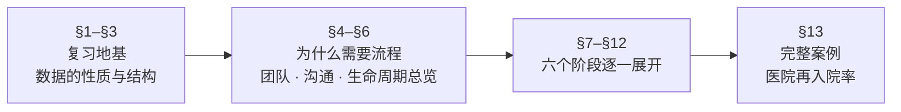

---

## §1 复习:什么样的数据才算"大"?

### 1.1 数据洪流从哪里来

我们先问一个最朴素的问题:为什么"大数据"是最近这十几年才成为话题的?数据一直都存在,银行几十年前就有交易记录了。

答案在于**数据产生的方式变了**。过去数据是"被录入"的——有人坐在终端前敲进系统。今天数据是**活动的副产品**:slides 上那句 **"Activity → Data"**(活动即数据)概括得很准。你打开一次 Gmail、点一次 LinkedIn 的赞、刷一次公交卡、被路口的监控拍到一次、家里的智能电表上报一次读数——每一个动作都自动沉淀成一条记录,不需要任何人专门去"录入"。

课堂上列举的主要来源与驱动 (sources and drivers) 包括:

- **Social media**(社交媒体):用户量巨大、内容更新极快;
- **Multi-media**(多媒体):图像、视频、音频;
- **Web**:点击流、搜索日志;
- **"Smart" devices**(智能设备):手机、传感器、national grid(国家电网)智能电表;
- **交易与监控**:shopping transactions、video surveillance。

这里有一个讲师特别强调的循环:**我们既是数据的生产者,也是分析结果的消费者。** 你加入一个社交网络,系统立刻推荐"你可能认识的人"——推荐的依据正是你和其他人贡献的数据。数据从用户流向平台,分析结果又流回用户,形成闭环。这个闭环解释了为什么数据规模会自我加速:服务越好用,用户越多,数据越多,分析越准,服务又更好用。

### 1.2 "大"没有阈值:它是上下文依赖的

现在到了本节最容易考、也最容易答错的一点。

学生常见的直觉是:大数据一定有个门槛,比如"超过 1 TB 就算大数据"。**这个直觉是错的。** 讲师的原话非常明确:**"there's no simple threshold… It is context-dependent."**(没有简单的阈值,它是上下文依赖的。)

slides 上的表述是 **"It's not just about size. It's about data properties and available technology."** —— 关键在两个词:**data properties**(数据的性质)与 **available technology**(你手上有什么技术)。

为什么必须这样定义?想一个具体的对比:

- 你手上有一个**GPU 集群**,处理几十 TB 的视频训练数据只是一晚上的事——对你来说这不构成"大数据问题";
- 同样这批数据,如果要跑在**边缘计算 (edge computing) 硬件**上,一个树莓派级别的设备,那连 1 GB 都可能是灾难。

**同一份数据,换一套软硬件架构,就在"大数据问题"和"普通问题"之间来回切换。** 这就是为什么不能给出绝对阈值。

除了技术条件,还有两个常见的"变大"触发器,slides 明确列出:

1. **Real-time processing is a commonly requirement.**(实时处理常常是硬性要求。)一旦要求实时,对软硬件的压力立刻上一个数量级——你不能再"晚上跑批处理",必须在毫秒到秒级出结果。所以讲师说:**如果要求实时处理,你通常就得当作大数据来对待。**
2. **Processing data from a variety of unfiltered sources is common.**(要处理来自多种未经过滤的来源的数据。)这直接对应下面要讲的 **Variety**。你处理的是 YouTube 视频,还是每小时一条的温度读数?后者哪怕存十年也就是个小 CSV。

> **🔑 例(判断题式思考)**
> 一家气象站每天记录一次气温,存了 30 年——约 11,000 条记录,几百 KB。**不是**大数据:体量小、结构单一、无实时要求、单一来源。
> 同一家气象站接入了全省 5,000 个传感器,每秒上报一次,并要求实时生成暴雨预警,同时融合卫星云图(图像)与社交媒体的灾情文本。**是**大数据:volume 上去了、velocity 是秒级、variety 横跨数值/图像/文本、且有实时约束。
> 注意:变的不是"气象数据"这个题材,而是**性质 + 技术要求**。

### 1.3 大数据为什么如此受关注

slides 第 5 页给了一组"为什么大数据这么火"的理由,它们其实是从不同角度回答"数据凭什么值钱":

| 特点 | 含义 | 带来什么 |
|---|---|---|
| **Fast** | 容易、快速地被收集 | 获取成本极低,规模自然膨胀 |
| **Large-scale** | 规模大 | **friendly to algos** —— 数据越多,机器学习算法表现越好 |
| **Different data** | 类型多样 | 支持过去做不到的**创新**(比如图文混合分析) |
| **Dynamic** | 持续变化 | 有挑战性,也意味着能捕捉趋势 |
| **Valuable** | 有商业价值 | 典型如精准营销 (marketing) |
| **Real data** | 是真实行为的记录 | **truth** —— 反映人真实做了什么,而非声称做了什么 |

最后一条值得多说一句:问卷调查里人们会说"我每周锻炼三次",但手机计步数据不会撒谎。**行为数据比自陈数据更接近真相**,这正是它对商业和科研的核心价值。

### 1.4 大数据的 6 个 V

这是 Week 1 的核心记忆点,也是最经典的考点。讲师提醒:**6V 其实是 "5 + 1"**。

前五个 V 描述的是**输入端**——数据本身的性质:

| V | 英文原义 | 含义 |
|---|---|---|
| **Volume** | Sheer amount of data | 数据的绝对体量 |
| **Velocity** | Speed by which data is generated | 数据产生(和需要被处理)的速度 |
| **Variety** | Different types of data and data sources | 数据类型与来源的多样性 |
| **Veracity** | Reliability & trustworthiness of data | 数据的可靠性与可信度 |
| **Variability** | Changing data or data models | 数据本身或数据模型会随时间变化 |

第六个 V 是**输出端**的性质:

| V | 含义 |
|---|---|
| **Value** | 数据能被提炼出的价值 |

讲师对这个划分的解释是:**"Value is a property at the output site. So we usually say it's 5 + 1."** 前五个 V 描述你手上拿到的是什么东西,第六个 V 描述你最终从中得到了什么。这个区分很重要——前五个 V 是**挑战**(体量大、速度快、类型杂、不可靠、会漂移),第六个 V 是**目的**。整门课要做的事,就是**用方法把前五个 V 的挑战,转化成第六个 V 的价值**。

> 📎 **拓展(超出 slides)** — 不同教材对 V 的数量有不同说法(3V、5V、6V、甚至 10V)。**本课考的是 slides 上这 6 个**。若考题问"5+1 是什么意思",答案就是:前 5 个描述数据本身(输入端),Value 描述分析产出(输出端)。

### 1.5 大数据的四种结构

Week 2 的 lab 会让你亲手操作这四类数据,所以这一节不只是概念,是动手前的地图。

slides 第 7 页用一个**倒三角**表示:越往上,数据结构越松散,而**增长速度 (Increasing Growth) 越快**。这个形状本身就在讲一件事:**世界上增长最快的那部分数据,恰恰是最难处理的那部分。**

| 结构类型 | 定义 | 例子 | Lab 中你会遇到 |
|---|---|---|---|
| **Structured**(结构化) | 有明确定义的 data model、格式、结构 | 数据库、CSV 表格 | CSV 文件:每行一条记录,每列有预定义列名 |
| **Semi-Structured**(半结构化) | 文本数据文件,**有明显可辨的模式**,可直接分析 | 电子表格、**XML** 文件 | XML 文件:能看到清晰的标签层级结构 |
| **Quasi-Structured**(准结构化) | 文本数据,**格式不规则 (erratic)**,需要花力气 + 工具才能格式化 | **Clickstream data**(点击流) | `.log` 文件:隐约看得出结构,但"是一团乱麻" |
| **Unstructured**(非结构化) | **没有内在结构**,通常以各种文件形式存储 | 文本文档、PDF、图像、视频、音频、歌曲 | 用程序加载一张图片、理解它在内存里怎么存、裁剪某个区域再显示 |

slides 上那句红字点明了本课的立场:**"Big Data Analytics may take all data structures."** —— 大数据分析**四种结构通吃**。这正是它和传统数据库分析最大的区别:传统 BI 基本只吃 structured data。

理解 semi- 和 quasi- 的分界是最容易混淆的地方,记住这个判别标准:

- **Semi-structured**:结构是**自带的、规范的**——XML 的标签、JSON 的键值对,解析器能直接读。你"看一眼就知道该怎么切"。
- **Quasi-structured**:结构是**残缺的、不一致的**——同一个日志文件里,不同行的字段数可能都不一样,得靠正则表达式和清洗工具硬掰成表格。你"看一眼知道有结构,但不知道怎么切"。

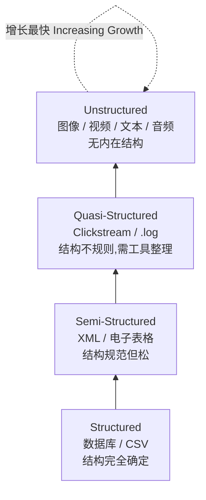

> **本节小结** — "大"不是尺寸问题,是**性质 + 技术**问题;6 个 V 里 5 个描述输入、1 个(Value)描述输出;数据从 structured 到 unstructured 越来越难处理,而增长最快的恰是最难的那端。

---

## §2 Business Intelligence 与 Data Science 的分界

我们已经知道数据长什么样了。下一个问题是:**拿到数据以后,"分析"到底有几种做法?**

slides 第 8 页用一张二维图给出了答案,这张图值得完整理解,因为它定义了这门课的立场。两条坐标轴是:

- **横轴:Time(时间)** —— 从 **Past**(过去)到 **Future**(未来);
- **纵轴:Analytical Approach(分析取向)** —— 从 **Explanatory**(解释性)到 **Exploratory**(探索性)。

在这张图上:

| | **Business Intelligence** | **Data Science**(Predictive Analytics & Data Mining) |
|---|---|---|
| **位置** | 左下:过去 + 解释性 | 右上:未来 + 探索性 |
| **典型技术** | 标准与 ad hoc 报表、dashboards、alerts、on-demand 查询 | 优化 (optimization)、predictive modeling、forecasting、统计分析 |
| **数据类型** | **Structured data**,传统来源,规模可控 | **Structured/unstructured** 都要,来源众多,数据集非常大 |
| **典型问题** | 上个季度发生了什么?卖了多少件?问题出在哪、什么情况下出的? | 如果……会怎样?对我们业务而言最优方案是什么?接下来会发生什么?趋势若持续会如何?**为什么**会这样? |

用一句话概括这个分界:**BI 回答"发生了什么、为什么发生";Data Science 回答"会发生什么、我们该做什么"。**

> 📎 **拓展(讲师课堂补充,超出 slides)** — 讲师指出,**AI 正在把 BI 往右上角推**。传统上你查 dashboard 只能看到"上季度销量下降 8%";但今天你可以直接问 AI 工具"照这个趋势,下季度会怎样?我该采取什么措施?有什么风险?"——**不用换工具,在同一个对话框里就完成了从解释到预测的跨越。** 这条边界正在变模糊,但**考试请以 slides 的经典划分为准**。

这个分界也解释了为什么本课后面的整个生命周期长这样。既然 Data Science 本质上是**探索性 (exploratory)** 的——你事先不知道答案,甚至不确定答案是否存在——那就意味着:

- 你不可能一次性做对,必须**允许回头**(这直接导致生命周期是**迭代**的);
- 你必须**先提出假设再用数据检验**(这直接导致 Phase 1 要 develop initial hypotheses);
- 你必须**事先约定什么算成功、什么算失败**(否则探索永无止境)。

请记住这条因果链,后面每个设计选择都能追溯回"因为它是探索性的"。

---

## §3 分析实践的现状:传统架构为什么撑不住

### 3.1 传统数据架构给数据科学家带来的四个麻烦

假设你是一家传统企业的数据科学家,公司有一套用了十年的 data warehouse (DW)。你会遇到什么?slides 第 10 页列了四条,每一条都很具体:

1. **"Predictive analytics and data mining activities are last in the line for data (i.e., low priority)."**
   数据到达的优先级排序里,**预测分析排在最后**。财务报表、运营 dashboard、合规审计——都排在你前面。等轮到你,数据可能已经不新鲜了。

2. **"Limited to perform in-memory analytics, restricting the size of the datasets they can use."**
   你只能做**内存内分析**,数据集大小被你机器的内存卡死。想跑全量?内存不够。

3. **"Projects remain isolated and ad hoc, rather than centrally managed. Exist as nonstandard initiatives."**
   项目是**孤立的、临时的**,不是集中管理的,属于"非标准动作"。这意味着每次都得重新申请权限、重新搭环境,上个项目的成果无法复用。讲师描述得很生动:你得去找 IT 管理员谈数据访问,如果对方不肯给完整权限,你就得**"argue back and forth"**(来回扯皮)。

4. **"Analytics takes place in a DW production system."**
   分析直接跑在**生产系统**上。这一条最危险——讲师的评价是 **"this is not right, it's not reliable, it's not safe"**。你的一个失控的查询可能拖垮全公司在用的系统。

### 3.2 解法:Analytic Sandbox

针对以上四条,slides 给出了一个解法:**analytic sandbox**(分析沙箱)。

**Analytic sandbox** 的正式定义(slides 第 31 页脚注):**一个安全、灵活、隔离的环境,数据科学家、分析师和研究人员可以在其中探索、实验、分析大规模数据集,而不影响主生产系统。**

拆开看它怎么正面解决上面四个问题:

- **隔离 (isolated)** → 你在沙箱里怎么折腾都不会波及生产系统,解决了问题 4;
- **灵活 (flexible)** → 你可以按需装工具、试方法,解决了问题 3 的"非标准"困境;
- **可以把各类数据都装进去** → 一次性谈妥数据访问,不用每次扯皮,缓解问题 1 和 3;
- **规模可以开得很大** → 不再受单机内存限制,解决问题 2。

讲师的表述最直白:**"you can try your best to get all the data from the data administrator, put them in, then you can do whatever you need to do, and you don't need to worry about the outputs adversely impacting the production system."**

沙箱在 Phase 2 会重新出现并展开(见 §8.1),这里先记住它是**对传统架构缺陷的直接回应**。

### 3.3 新生态:数据成为一种经济

slides 第 11 页描述了正在形成的 **Emerging Big Data Ecosystem**:

- **Data → intrinsic value → a new economy**:数据本身具有内在价值,由此催生了一种新的经济形态。这里有那句被引用到烂但确实成立的话:**"Data is the new oil."**(数据是新的石油。)
- **New professions**:出现了过去不存在的职业——**data vendors**(数据供应商)、**data cleaners**(数据清洗服务商)……
- **New opportunities for software developers**:主要在于 **repackaging and simplifying open source tools**(把开源工具重新封装、简化)。
- 一句总结:**"Data is the king!"**

"数据是新石油"这个类比之所以贴切,在于石油**未经提炼时几乎没用**。原油不能直接加进汽车。数据也一样:raw data 本身不产生价值,必须经过一整套提炼流程——**而这套提炼流程,正是本章主体要讲的生命周期。**

### 3.4 数据科学家究竟做什么

slides 第 12 页给了三条,注意它的排列顺序是有讲究的:

1. **Reframe business challenges to analytical challenges.**(把业务挑战重新框定为分析挑战。)
2. **Design, implement, and deploy data mining techniques on Big Data.**(在大数据上设计、实现、部署数据挖掘技术。)—— slides 特别加了一句注:**"This is mainly what people think about them."**(这主要是外行以为他们做的事。)
3. **Develop insights that lead to actionable recommendations to derive new business value.**(产出洞察,转化为可执行的建议,创造新的业务价值。)

这个"人们以为"的注脚是本节的关键。**大众以为数据科学家的工作是第 2 条(建模),但真正决定项目成败的是第 1 条和第 3 条。** 第 1 条在前——你得先把"我们的客户为什么流失"翻译成"这是一个二分类问题,标签是 90 天内是否流失,特征是……";第 3 条在后——你得把"AUC 0.87"翻译成"建议对这 3,000 名高风险客户发放定向优惠券"。

讲师在这里做了一个承诺,也正是本章接下来的内容:**"in today's lecture, you will understand step by step how data scientists will reframe the business challenges, will design, will implement and will develop insights and will act."**

### 3.5 复习部分小结

slides 第 13 页的总结,五句话:

- Big Data 来自**无数来源** (myriad of sources);
- Big Data **服务于业务需求,解决复杂问题**;
- 公司与组织正在**向数据科学转型**;
- 这要求**新的架构、新的工作方式、新的技能组合、新的角色**;
- 存在一个**不断扩大的人才缺口** (a growing talent gap)。

最后一条对你是好消息:缺口意味着机会。讲师提到他在 SEEK 上查到的数据——data scientist 与 data engineer 的典型年薪约 **$125,000**(澳元),且岗位数量可观。

---

## §4 为什么必须有一套流程

前面三节铺完了地基。现在进入本讲的正题,而正题从一个**反面教材**开始。

### 4.1 新人最常犯的错误

slides 第 15 页给出了 data science 项目的两条基本事实和一个警告:

- **"Data Science is exploratory in nature."**(数据科学本质上是探索性的。)
- **Common mistake**:
  - **Rushing into data collection and analysis.**(急着冲进数据收集和分析。)
  - **Not spend enough time planning, scoping, understanding, or framing.**(在规划、界定范围、理解、框定问题上花的时间不够。)

讲师对这个错误的心理描写非常传神,值得完整理解,因为它描述的多半就是你自己:

> 一个刚入行的人心想:"我要尽快做出东西来。我懂得不少,我能很快搞定,我想向老板证明我的能力。"于是他跳过所有前期工作,直接开始跑模型。

问题出在哪?讲师的判断是:**"Sooner or later, if you do it that way, sooner or later you will regret. And sooner or later you will come back to say, oh, had I known…"**

具体会怎么后悔?后面 §5.3 的 MRI 案例会给出一个完整的、可怕的答案:你花了几个月做出一个准确率很高的模型,交付时客户说——"这不是我们要的"。

### 4.2 "用流程来治理流程"

那正确做法是什么?slides 用了一句略带绕口的话:

> **"It is critical to have a process to govern the process."**(关键在于有一套流程来治理这个过程。)

讲师解释了这句话的三层用意:

1. **确保你走在正确的轨道上**(ensure you're on the correct and good track)——不会做着做着偏离目标;
2. **一旦遇到问题,你知道怎么处理**(once you encounter problem, you know how to deal with it)——流程给了你一张出问题时的地图;
3. **它给你判断"何时可以往下走"的标准**——这一点在 §6.2 的"关卡问题"里会具体化。

还有一层更重要的意义,讲师在课堂上反复强调:这套生命周期的价值**远超出这门课**。

> **"Someday when you learn about AI projects, more advanced machine learning, or even other IT projects, you can always take advantage of this life cycle."**

所以他的要求不是"读一遍",而是 **"chew today's lecture, to really digest it, to make it part of you"**(咀嚼、消化、让它成为你的一部分)。

---

## §5 团队、角色与沟通

在讲六个阶段之前,还有一件事要交代:**这套流程是给一个团队用的,不是给一个人用的。** 而团队的第一个问题,是人和人说不到一块儿去。

### 5.1 分析团队的七种角色

slides 第 17 页列出了一个 data science team 通常包含的角色。理解每个角色,关键是理解**他们各自关心什么**——因为到了 Phase 6,你要给每个人不同的交付物(见 §12.3)。

| 角色 | 他们做什么 / 关心什么 | 为什么你需要他 |
|---|---|---|
| **Business User**(业务用户) | 最了解实际问题,有一线经验;**会被你的产出直接影响** | 他们知道问题真正长什么样,也是最终受众 |
| **Project Sponsor**(项目发起人) | 提供**资源**:钱、时间、人手、软硬件、工具 | 没有他,项目无法启动。他也是"内部保护者与推动者" |
| **Project Manager**(项目经理) | 盯**进度**:项目是否在轨、里程碑是否按时达成 | 保证项目不失控、不超期 |
| **Business Intelligence Analyst**(BI 分析师) | 做 **dashboard 和报表**,告诉你"到目前为止发生了什么" | 提供业务现状的量化背景 |
| **Database Administrator (DBA)**(数据库管理员) | 决定**你能访问哪些数据、访问多少、以什么方式访问** | 讲师说这是"重要角色,因为他们控制着数据的流向" |
| **Data Engineer**(数据工程师) | 加载、转换、清洗数据,承担前期的重活 | 把原始数据变成可用的形态 |
| **Data Scientist**(数据科学家) | 需要**了解整个项目**:背景、数据从哪来怎么来的、模型规划、开发模型、分析结果、与干系人沟通、提出可执行建议 | 串起全流程的核心角色 |

slides 特别标注:**"The last two roles are in high demand!"**(最后两个角色需求旺盛!)—— 即 Data Engineer 和 Data Scientist。

### 5.2 沟通:项目失败最常见的原因

slides 第 18 页把话说得很重:

> **"Communication between these key players is essential to the success of a data analytical problem."**

问题在哪?**"Key players can have a different background, use different terminologies and expressions, have different interests and goals."**(关键参与者可能背景不同、术语和表达方式不同、利益和目标不同。)

讲师在这里插入了一段完全来自课堂、slides 上没有的内容,而且直接关系到你这学期的两个 group project:

> 📎 **拓展(课堂补充,超出 slides)** — 讲师说:**"Every year, we have one or two group projects [that] finally broke up… I think the key issue is they did not spend time in communicating."** 每年都有小组因为沟通不足而散伙。他建议在 lab 里就主动和同学交流、组队。
>
> 更有意思的是他对**多样性 (diversity)** 的论证。团队成员背景不同,表面上是沟通障碍,实际上是**优势**,理由有两条:
>
> 1. **避免过早收敛。** 如果所有人想法一样,团队会立刻"converge to a single approach"——大家一起走同一条路,而那条路未必是最好的。有不同意见,才会有讨论、有争论,**最优方案才会在讨论中浮现**。
> 2. **保证洞察的覆盖面。** 讲师举了两个很具体的例子:如果团队里没人考虑老年用户,你的系统可能用了小到看不清的字号;如果你在做英译法的翻译软件,而**团队里没有一个人懂法语**,那显然不行。
>
> 他的结论:**"Diversity is not a problem. As long as we have effective communication, we can make it an advantage."**(多样性不是问题,只要沟通有效,它就是优势。)

那沟通的起点是什么?slides 给出了答案,也是本章第一次出现"理解"这个词:

> **"Domain understanding is a first step towards successful communication."**(领域理解是成功沟通的第一步。)

讲师提醒:**"understanding" 这个词会在本讲中出现好几次**——留意它每次出现的位置,那就是这门课的重点所在。

### 5.3 一个让人后背发凉的例子:MRI 与放疗毒性

现在来看 slides 第 19–20 页的案例。它是整堂课最重要的动机性例子,请仔细读。

**场景**:一组**肿瘤科医生 (oncologists)** 和**放射治疗师 (radiotherapists)** 想知道:**能否从 MRI 扫描图像预测某个既定放疗方案对健康组织的毒性 (toxicity)?** 换句话说,他们想提前知道放疗的副作用会有多大。他们带着这个问题找到了一个数据科学家团队——假设你就是其中一员。

听上去很清晰的一个任务,对吧?"给我 MRI 图像和标注,我训练一个模型预测毒性。"

**然后 slides 用五条,把这个"清晰任务"下面埋的雷一颗颗挖了出来:**

1. **你是计算机/IT 背景,可能根本看不懂医学术语。**
   你知道 MRI 是磁共振成像,但你知道它的成像流程吗?知道 T1 加权和 T2 加权的区别吗?知道扫描参数怎么影响图像吗?知道从图像能读出患者的什么状况吗?

2. **你可能不知道要拿到这种高度敏感的患者数据需要做什么。**
   医疗数据永远是敏感数据。讲师强调:**必须只使用去标识化 (anonymized) 的数据**,移除任何能识别患者身份的信息。而且数据往往锁在本地医疗区的**受控网络**里——你可能必须在医院的网络内工作,数据一个字节都不能出网。这会给你的工作方式带来巨大约束。

3. **你可能不理解数据质量和数据来源的差异。**
   数据可能跨越好几年收集,也可能来自**不同的影像中心 (imaging centers)**——不同的机器、不同的参数、不同的操作习惯。这天然会造成**变异 (variation)**,而变异会直接损害模型的泛化能力。

4. **数据可能没有标注。**
   标注得靠肿瘤科医生和放疗师来做。而讲师点破了现实:**"Usually, doctors are extremely busy. So they may not have enough time to label a sufficient number of data for you."** 你可能拿到一大堆**未标注数据**。而且——你自己**没有专业能力**从一张 MRI 图上判断什么构成"放疗引起的毒性效应"。

5. **最致命的一条:你做出的东西不是他们要的。**
   你可能做出一个模型,**预测毒性会不会发生**(yes/no)。但客户真正想知道的是:**毒性会发生在"哪里"(where),以及模型"为什么"(why)做出这个预测。**

请把第 5 条读三遍。你的模型可能准确率很高、技术上无可挑剔,但它回答的是**错误的问题**。讲师的评论是:**"if we don't communicate well from the beginning, then you may find that after you complete the project, what you deliver is not what they expect. That causes significant problem."**

几个月的工作,可能因为第一周没问清楚而作废。

**那怎么办?** slides 给出了结论:

> **"To succeed, the data scientists have to obtain a good domain understanding. This can require substantial background studies. This first step is called the discovery phase. The discovery phase [is] a key step in the data analytics."**

于是,顺理成章地,我们进入生命周期的第一阶段。

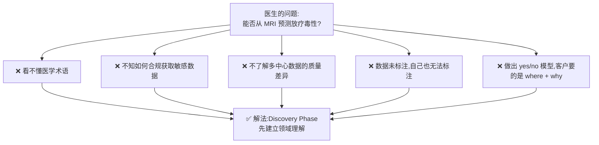

---

## §6 生命周期总览

### 6.1 六个阶段

**Data Analytics Lifecycle** 的正式定义(slides 第 16 页):

> **"Data Analytics Lifecycle defines the roadmap of how data is generated, collected, processed, used, and analyzed to achieve business goals."**
> **"It offers a systematic way to manage data for converting it into information that can be used to fulfill organizational and project goals."**

讲师提醒**注意定义里的那串动词**——generated(产生)、collected(收集)、processed(处理)、used(使用)、analyzed(分析)——它们已经大致勾勒出了关键步骤。

定义的后半句点明了整件事的**目的**:**把 data 转化为 information**。输入端是 raw data,输出端是"information"——讲师把它具体化为:**可执行的建议、我们原本不知道的东西、能带来利润、带来优势、让我们在市场上更有竞争力的东西。**

六个阶段依次是:

| # | 阶段 | 一句话概括 | 主要产出 |
|---|---|---|---|
| **1** | **Discovery**(发现) | 理解领域、框定问题、提出初始假设、摸清数据源 | 分析计划草案、初始假设 |
| **2** | **Data Preparation**(数据准备) | 建沙箱、ETLT、熟悉数据、清洗调理、可视化探查 | 可用于建模的高质量数据 |
| **3** | **Model Planning**(模型规划) | 选候选方法、选变量、确定模型形态与假设 | 方法、技术、工作流、变量、关系、模型 |
| **4** | **Model Building**(模型构建) | 划分训练/验证/测试集,训练并测试模型 | 训练与测试数据集、软件与硬件、已训练模型 |
| **5** | **Communicate Results**(沟通结果) | 对照成败标准,向干系人陈述发现与建议 | 关键发现 (identify key findings) |
| **6** | **Operationalize**(实施运营) | 试点部署、监控、准备重训、全面交付 | 交付物、试点项目 (delivery, pilot project) |

### 6.2 最关键的两个性质:环形 + 可回退

讲师称 slides 第 21 页那张图是 **"the most important slide of this most important lecture"**。它值得特别注意的不是六个圈,而是**圈之间的箭头**。

**性质一:它是一个环 (cycle),不是一条直线。** Phase 6 结束后回到 Phase 1——模型上线不是终点,监控发现性能下降,你就要带着新问题重新开始。

**性质二:每个阶段都能回退到上一个阶段。** 讲师的原话:**"This is not a simple circle. For each stage, it can come back to the previous stage."** 你进入下一阶段干了一阵子,可能才意识到"不行,我还得回去收集更多数据 / 更好地理解这个项目 / 改我的模型方案 / 重新训练"。**这非常常见,不是失败的标志。**

**性质三(最实用的):每个阶段末尾都有一个"关卡问题"。** 这是整张图里最容易被忽略、但最有用的设计。它回答了那个折磨所有人的问题:**我怎么知道这一步做完了?**

| 从哪个阶段出来 | 你必须能回答"是"的问题 |
|---|---|
| **1 → 2** | **Do I have enough information to draft an analytic plan and share for peer review?**(我掌握的信息是否足以起草一份分析计划,并拿去同行评审?) |
| **2 → 3** | **Do I have enough good quality data to start building the model?**(我是否有足够的高质量数据来开始建模?) |
| **3 → 4** | **Do I have a good idea about the type of model to try? Can I refine the analytic plan?**(我是否对该尝试哪类模型有清晰的想法?能否细化分析计划?) |
| **4 → 5** | **Is the model robust enough? Have we failed for sure?**(模型是否足够稳健?或者我们是否已经确定失败了?) |

讲师对这个设计的评价是:**"At each step, you need to ask a clear question to yourself. By asking this question, [it] will give you a criteria [for] whether you need to still work on this step or you can actually enter the next step. I think this is good — otherwise, we don't know when [we] can move to the next step."**

注意 4→5 那个问题里的 **"Have we failed for sure?"** ——它明确承认**"确认失败"也是一种可以往下走的结论**。这一点在 Phase 5 会展开(见 §11.1)。

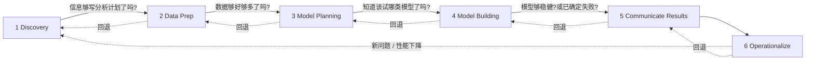

---

## §7 Phase 1 · Discovery(发现)

这是六个阶段中"最不像技术活"、却最决定成败的一个。它的全部任务可以概括为一句话:**在动手碰数据之前,先搞清楚你到底在解决什么问题、为谁解决、用什么资源、成功长什么样。**

Discovery 包含六项工作,我们逐一来看。

### 7.1 Learning the Business Domain(学习业务领域)

slides 第 23 页:

- **Understand the domain**(理解领域)
- **Determine how much domain knowledge needed to develop models**(判断建模需要多少领域知识)
- **Domain knowledge + technical expertise**(领域知识 + 技术专长)

第二条常被忽略,但很实际:**你需要多少领域知识?** 讲师给了一个很好的标尺:

> **"You don't need to become an oncologist or a radiotherapist yourself, but you definitely need to know the background information."**

你不需要成为肿瘤科医生,但你必须懂足够的背景知识,才能跟他们对话、才能判断数据合不合理、才能知道模型输出对他们意味着什么。

第三条 **domain knowledge + technical expertise** 是整个 Discovery 阶段的思想内核,讲师对它的展开非常值得记住:

> 你的**技术专长是相对稳定的**——你会 Python、会 scikit-learn、懂分类和聚类,这套本事换个项目还是那套本事。**但每接一个新项目,领域知识这部分就要重来一遍。** 接了医学影像项目就得学医学影像;接了商业项目就得学商业;接了水务项目——比如从海水数据预测地下管道何时需要维护——你就得学水资源、学整个供水系统。
>
> 讲师的结论:**"So this part is actually a challenge for data scientists."** 真正难的不是技术,是每次都要从零建立的领域理解。

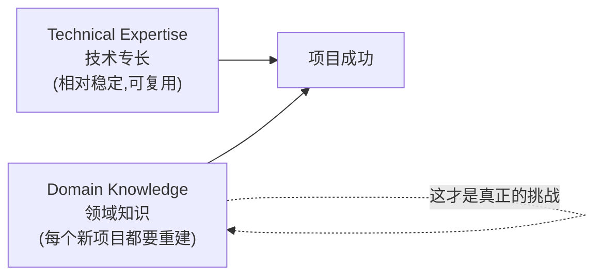

### 7.2 Resources(资源)

slides 第 23 页下半:

- **How much resources available to a project?**(项目有多少可用资源?)
- **Technology, tools, systems, data and people**(技术、工具、系统、数据、人)
- **Short-term and longer-term goals**(短期与长期目标)

讲师指出了一个因果关系:**领域知识学得越深,你越能判断这个项目有多难,从而越能判断需要什么资源。** 反过来,客户会告诉你他们的约束——"我们的预算是这么多"、"我们只能给你到某年为止的数据"、"我们有这些限制"。

关于最后一条**目标与里程碑**:短期是 3 个月?6 个月?长期是 12 个月?这些必须在开始前定下来。讲师评论说这条其实**对任何 IT/CS 项目都通用**,不是数据项目特有的。

### 7.3 Framing the Problem(框定问题)

slides 第 24 页给出定义:**"The process of stating the analytical problems."**(陈述分析问题的过程。)

具体要产出三样东西:

- **Identify objectives, risks, criteria of success**(明确目标、风险、成功标准)
- **Criteria of failure (when to stop?)**(失败标准——什么时候该停?)

**先说 framing 本身。** 讲师的解释是:这一步要判断这**到底是什么类型的问题**。是预测问题吗?那可能要用 classification、regression、neural network。还是其实是个聚类问题?或者是个特征选择问题?**框定问题的类型,直接决定了后面 Phase 3 能选哪些方法。** 这就是 §3.4 说的"reframe business challenges to analytical challenges"的具体落地。

**再说风险 (risks)。** 讲师举的风险例子非常具体,而且都是数据项目特有的:

- 我有足够的数据吗?
- 数据会被充分标注吗?
- 标注要花多久?

**最后说成功标准与失败标准**,这是本节最重要、也最容易被跳过的部分。

**Criteria of success** —— 讲师给了一个绝佳的问法:**"How high accuracy do you expect? 80%? 90%? 99%?"** 然后是关键的一句:**"The requirement on the accuracy will significantly change the difficulty of the project."** 要求 80% 和要求 99%,可能是两个完全不同量级的项目,需要的数据量、模型复杂度、时间成本天差地别。**这个数字必须在开始前和客户敲定。**

**Criteria of failure** —— 为什么需要一个"失败标准"?讲师的论证很有分量:

> 有些项目本质上是**调研性质的**。客户问的是:"从这些数据里,我们能不能可靠地预测出 X?"—— 那么 **"不能"本身就是一个合法的答案**。
>
> 如果统计检验已经表明基于现有数据无法可靠预测,你应该**停止项目并如实报告**,而不是继续硬试各种模型,试图从不存在的信号里榨出结果。

用讲师的话说:**"once you identify [that] it's not possible to reliably predict, you need to stop the project — rather than still trying to find a model to achieve reliable prediction, even if some statistical test has indicated that you cannot."**

**没有 criteria of failure,你就不知道什么时候该收手。**

### 7.4 Identifying Key Stakeholders(识别关键干系人)

slides 第 24 页:

- **Anyone who will benefit from or be impacted by**(任何将从中受益或受到影响的人)
- **Collect key information from them**(从他们那里收集关键信息)
- **Set clear expectations with them**(与他们设定清晰的预期)

注意定义里的 **"or be impacted by"** —— 干系人不只是受益者,还包括**受影响者**。讲师从**伦理 (ethics)** 角度强调了这一点:

> **"When we develop a new tool, a new software, a new IT system, we need to know who will be benefited and who will be impacted. By doing so, we can maximize the benefit [and] minimize the adverse impact."**

而 **set clear expectations** 直接呼应了 §5.3 的 MRI 教训:如果一开始就跟客户确认清楚"你要的是 yes/no,还是 where 和 why",那个项目就不会翻车。

### 7.5 Interviewing the Analytical Sponsor(访谈分析发起人)

先定义。slides 第 25 页脚注:

> **Analytical sponsor** 是一位**高管领导 (executive leader)**,他为分析项目背书、争取经费、推动组织内部的认同。他扮演大数据项目的**内部保护者与推动者 (internal protector and promoter)**,负责把技术目标与更宏观的业务战略对齐。

为什么要访谈他?slides 给了理由:

- **Use its knowledge and expertise**(利用他的知识与专长)—— 他之所以愿意出钱,通常是因为他**了解这个问题、并且迫切希望它被解决**;
- **Have a more objective understanding of problem**(获得对问题更客观的理解);
- **Focus on clearly defining the project requirements**(聚焦于清晰定义项目需求);
- **Take time to conduct a thorough interview**(花时间做一次彻底的访谈)。

**访谈技巧 (tips)**,slides 列了五条:

| 技巧 | 为什么 |
|---|---|
| **Good preparation**(充分准备) | 高管时间宝贵,你只有一次机会 |
| **Open-ended questions**(开放式问题) | 你的目的是**挖出他的知识**,封闭式问题只能验证你已有的猜测 |
| **Give time to think**(给对方思考时间) | 沉默不是尴尬,是在产出信息 |
| **Repeat back what was heard**(复述你听到的) | 确认双方在同一频道——直接对治"术语不同"的问题 |
| **Be mindful of body language, document carefully**(留意肢体语言,仔细记录) | 记录是后面所有阶段的依据 |

**常见访谈问题 (common questions)**,slides 第 26 页:

- **What business problem?**(要解决什么业务问题?)
- **What desired outcome?**(期望的产出是什么?)
- **What data source?**(有哪些数据源?)
- **What industry issue?**(行业层面有什么问题?)
- **What timelines?**(时间线如何?)
- **Who has final decision-making authority?**(谁有最终决策权?)

最后一个问题常被新人忽略,但极其实际:**如果你不知道谁拍板,你可能对着一个没有决策权的人反复确认需求,而真正拍板的人从没参与过。**

### 7.6 Developing Initial Hypotheses (IH)(建立初始假设)

slides 称之为 **"a key facet of the discovery phase"**。要点:

- **Form ideas that can be tested with data**(形成可以用数据检验的想法)
- **Form the basis of later phases and serve as the foundation for the findings**(成为后续阶段的基础,也是最终发现的根基)
- **By comparison, can have richer observations**(通过比较多个假设,可以获得更丰富的观察)
- **Gather and assess the hypotheses from stakeholders and domain experts**(从干系人和领域专家那里收集并评估假设)
- **Useful to obtain and explore some initial data**(拿到一些初始数据来探索是有帮助的)

**为什么假设要在 Phase 1 就提出来?** 回到 §2 结尾那条因果链:因为数据科学是**探索性的**。探索性工作如果没有假设作锚点,就会变成漫无目的地在数据里翻找,然后陷入"数据挖掘的原罪"——试了一百种切法,总有一种看起来显著,但那只是噪声。

**先立假设,再用数据检验**,是把探索约束成科学方法的关键。讲师提到,后续几周会讲**统计假设检验 (statistical hypothesis testing)**,那正是"用数据接受或拒绝假设"的形式化工具。

请记住这条线索——**假设会在 Phase 3(回头参考假设)和 Phase 5(对照假设判定成败)反复出现**,它是贯穿整个生命周期的一根主线。

> **🔑 例(MRI 项目的初始假设)**
> - **H1**:放疗前后的 MRI 图像在特定区域存在可量化的强度变化,且该变化与毒性等级相关。
> - **H2**:来自不同影像中心的数据存在系统性差异,若不做归一化会掩盖 H1 中的信号。
> - **H3**:仅凭 MRI 不足以预测毒性,需要联合血液检查等病理数据。
>
> 注意:H3 是一个**可能导致"失败"结论**的假设——而这恰恰是它有价值的原因。它对应 §7.3 的 criteria of failure。

### 7.7 Identifying Potential Data Sources(识别潜在数据源)

Discovery 的最后一项。注意:**这一步是"识别"数据源,不是"收集"数据**——收集是 Phase 2 的事。

slides 第 28 页要考虑的因素:

- **Consider the volume, type, and time span of data**(考虑数据的体量、类型、时间跨度)
- **Need to access raw data**(需要能访问到原始数据)
- **Will influence the choice of tools and techniques**(会影响工具与技术的选择)
- **Help to determine the amount of data needed**(帮助确定需要多少数据)

**为什么"能访问 raw data"这么重要?** 讲师用 MRI 举例:MRI 扫描存放在由当地医疗区控制的受控仓库里。你可能必须在他们的网络内工作,**数据一个字节都不能出网**。这会给你的工作方式带来实质性的困难——你不能把数据下载到自己的笔记本上,不能用你熟悉的云端 GPU。**这些约束必须在 Phase 1 就发现,而不是在 Phase 2 才撞上。**

**Should perform five main activities**(应执行的五项主要活动):

1. **Identify data sources**(识别数据源)
2. **Capture aggregate data sources**(获取聚合数据源)
3. **Review the raw data**(审查原始数据)
4. **Evaluate data structures and tools**(评估数据结构与所需工具)
5. **Scope the sort of data infrastructure needed**(界定所需的数据基础设施规模)

讲师在这一节末尾给了一句分量很重的总结,也是整个数据领域的第一定律:

> **"If you don't have high quality data — garbage in, garbage out."**(垃圾进,垃圾出。)

> 📎 **拓展(超出 slides)** — "Garbage in, garbage out"(常缩写为 **GIGO**)是计算领域的经典格言。在数据分析语境下它的意思是:**再精妙的模型也无法从劣质数据中提炼出可靠的结论。** 这解释了为什么 Phase 2(数据准备)会是整个生命周期中最耗时的一步。

### §7 小结:Discovery 的产出

走完 Discovery,你手上应该有:

- 对业务领域的**足够理解**(足以和领域专家对话);
- 一份**框定好的分析问题**(类型明确、目标明确、成功与失败标准量化);
- 一张**干系人地图**(谁受益、谁受影响、谁拍板);
- 一组**可检验的初始假设**;
- 一份**潜在数据源清单**(含访问方式与约束);
- 以及最重要的:能对关卡问题回答"是"——**我的信息足以起草一份分析计划并交付同行评审。**

---

## §8 Phase 2 · Data Preparation(数据准备)

Discovery 结束时你知道了数据在哪。Phase 2 要做的是**把它真正拿到手,并且变成能用的形态**。

slides 第 30 页概括了这一阶段:

- **Explore, pre-process, and condition data prior to modelling and analysis**(在建模与分析之前探索、预处理、调理数据)
- **Prepare an analytics sandbox**(准备分析沙箱)
- **Perform ETLT**(执行 ETLT)
- **Understanding the data in detail is critical**(详细理解数据至关重要)
- **Get the data into a format to facilitate analysis**(把数据整理成便于分析的格式)
- **Perform data visualisation**(进行数据可视化)
- **The most labour-intensive step in the lifecycle**(生命周期中最耗人力的一步)

最后一条请标记下来——**Phase 2 是六个阶段里你花时间最多的一个**,而且讲师补充说:**你经常还得回到这一步**(数据不够好、数据太旧、需要更多数据、需要重新去和 IT 或医生沟通)。

先把 **"conditioning" 这个术语**定义清楚(slides 第 30 页脚注):

> **"Conditioning data" means cleaning, transforming, and formatting raw data so it is ready for modeling and analysis. It fixes errors and standardizes information so computers can process large amounts of data smoothly.**
> (调理数据 = 清洗 + 转换 + 格式化原始数据,使其可用于建模分析。它修正错误、标准化信息,使计算机能顺畅处理大规模数据。)

那么 **"get the data into a format to facilitate analysis"** 具体是指什么格式?讲师给出了最常见的答案:**data matrix(数据矩阵)**。

> 如果你想调用一个机器学习算法——分类或聚类——你通常需要把数据整理成一个矩阵:**每一行是一个样本 (a data point),每一列是一个特征 (a feature)**,每个样本本身就是一个数值向量。这个矩阵就是你喂给 scikit-learn 之类函数库的标准输入。

这个"行=样本、列=特征"的约定看似琐碎,但它解释了 Phase 2 大量工作的动机:**图像、文本、日志本身都不长这样。** 把一张 MRI 图、一段护理记录变成矩阵里的一行数值向量,正是 data preparation 要跨越的鸿沟——也正是 §9.3 中 **embedding(嵌入向量)** 之所以重要的原因。

### 8.1 Preparing the Analytical Sandbox(准备分析沙箱)

我们在 §3.2 已经知道沙箱是什么、为什么需要它。这里讲**怎么建**。slides 第 31 页:

- **Obtain an analytical sandbox (or workspace)**(获取一个分析沙箱/工作区)
- **Collect all kinds of data there, which is important for a Big Data analytics project**(把各种数据都收集进去)
- **Need to collaborate with IT group, who usually has different views on data access**(需要与 IT 团队协作,他们对数据访问通常有不同看法)
- **Expect the sandbox to be large**(预期沙箱会很大)
  - **Raw data, aggregated data, less commonly used data**(原始数据、聚合数据、不常用数据)
  - **At least 5-10 times the size of original dataset**(至少是原始数据集的 5–10 倍)

**"Collect all kinds of data" 是什么意思?** 讲师用 MRI 项目给了一个非常有启发性的展开:

> 医生问你能不能用 MRI 做预测。但你应该反问:**关于这个患者,还有别的数据吗?** 可能有护士写的**自由文本电子健康记录**,可能有**病理数据**(如血液筛查)。把这些和 MRI 结合起来,你也许能做出**更好的预测**。
>
> 注意这些数据**格式各异**——有的是 structured(血检数值),有的是 unstructured(护理记录文本、影像)。**重点就是:把各种类型的数据都收进来。**

这正是 §1.5 说的"大数据分析四种结构通吃"的实践落地。

**为什么沙箱要开到原始数据的 5–10 倍?** 讲师专门反驳了一种常见的省钱心态:

> "别想着'我就存个数据,再写点 Python 代码,不占地方'——不是这样的。"

因为沙箱里最终会同时存在:**原始数据 + 聚合数据 + 各种转换后的中间数据 + 你尝试过的各版本特征集**。而且——这一点和下一节的 ELT 直接相关——**你必须保留原始数据**,否则每次想换一种转换方式都得从头重来。

**关于与 IT 协作**:讲师描述了那个熟悉的场景——你想要更多权限、更灵活的访问、更新的数据,IT 说"不行,我们有规定"。他的建议不是对抗,而是**协作 (collaborate)**:理解对方的约束,在规则内争取最大空间。

### 8.2 ETL vs ELT vs ETLT —— 本讲最重要的技术辨析

这是 Phase 2 里最具体、也最容易出考题的一块。三个词字母一样,顺序不同,含义差很多。

#### 8.2.1 先理解基本区别

先用一句话抓住直觉:

- **ETL** = Extract → **Transform** → Load:**先转换,再入库**。转换发生在**中间服务器**上。
- **ELT** = Extract → Load → **Transform**:**先入库,再转换**。转换发生在**目标系统内部**。

讲师解释了 ETL 这个"传统做法"为什么会成为传统:

> 过去我们**没有大容量存储**,存储是受限的;而且**数据库自身的转换能力也有限**。所以我们必须在中间放一台专门的服务器或设备来完成转换,只把转换好的、格式确定的数据存进去——这样最省地方。

而 ELT 是**现代做法**:直接抽取、直接装载,然后**在数据仓库/数据湖内部**利用它强大的算力做转换。

#### 8.2.2 五个维度的完整对比

slides 第 33–34 页用同样的五个维度分别描述了 ETL 和 ELT。**这个表格建议直接背下来**:

| 维度 | **ETL** (Extract, Transform, Load) | **ELT** (Extract, Load, Transform) |
|---|---|---|
| **Process Order**(处理顺序) | 先从源系统抽取,**再转换**成目标格式/结构,**最后装载**进数据仓库或数据存储库 | 先从源系统抽取,**先装载**进目标存储库,**最后在目标系统内部转换** |
| **Transformation Location**(转换位置) | 在**中间服务器 (intermediate server)** 上完成,然后才装载进目标系统 | 在**目标数据存储库内部**完成,利用数据仓库/数据湖的处理能力 |
| **Use Case**(适用场景) | 适合"数据必须先清洗转换才能装载"的环境,常见于**传统数据仓库** | 适合**大数据环境**,目标系统有强大算力、能处理大体量数据;充分利用现代数据仓库与数据湖的能力 |
| **Performance**(性能) | 大数据集下**可能较慢**,因为转换发生在装载之前,需要额外的资源和处理时间 | 大数据集下**更高效**,数据先装载,转换用目标系统的计算资源完成;**减少数据搬运**,提升处理速度 |
| **Flexibility**(灵活性) | 流程往往**僵化、预先定义好**,对变更或临时查询 (ad-hoc queries) 不友好 | **更灵活**,能更高效地处理复杂转换和临时查询;非常适合**迭代式、探索式**分析 |

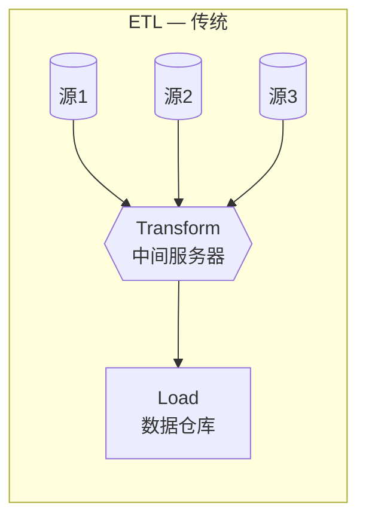

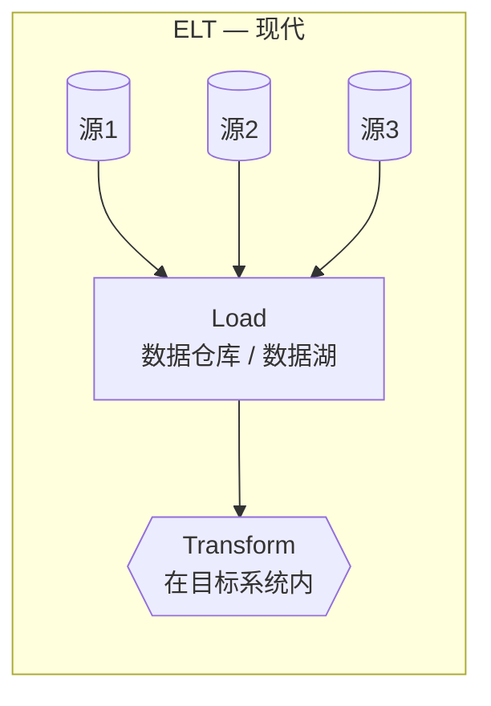

#### 8.2.3 ETL 灵活性差的真正原因(讲师的关键补充)

slides 只说 ETL "rigid and predefined",讲师给出了背后的机制,**这是理解两者差异的核心**:

> 在 ETL 里,你**预先定义**了要转换成什么类型、怎么转换。但**一旦数据从原始类型被转换成目标类型,你手上就只有转换后的那份了。** 原始的一些信息**丢失了,恢复不了**。
>
> 所以当你说"不行,我想要另一种形态的数据"——**没有了。数据已经被转换过了。你必须回到源头,重新对 raw data 做一次转换,才能得到新的副本。**

而 ELT 的优势正在这里:**因为你先把 raw data 装载进去了,原始数据一直在。** 基于原始数据,你可以做**任意多种不同的转换**,想换角度随时换。讲师的表述:**"You will not be restricted by the transform step."**

**这就是为什么 ELT 更适合迭代式、探索式的分析**——而我们在 §2 已经知道,**数据科学本质上就是探索性的**。这条线索又一次串上了。

也正因如此,§8.1 才要求沙箱容量是原始数据的 5–10 倍:**你必须有地方存 raw data。**

#### 8.2.4 ETLT:大数据环境下的折中方案

**ETLT (Extract, Transform, Load, and Transform)** 是 slides 第 35 页的重点,定义为 **"an extension of the traditional ETL process, designed to handle the complexities and scale of big data environments."**

它的四个步骤:

| 步骤 | 内容 |
|---|---|
| **Extract (E)** | 从各种来源抽取数据:数据库、文件、API 等。数据可以来自 structured、semi-structured 或 unstructured 源。 |
| **Transform (T₁)** | **第一次转换**:初步的数据清洗、过滤和预备性转换,让数据更易管理。可能包括**数据类型转换、去重、处理缺失值**。 |
| **Load (L)** | 把预处理后的数据装载进存储系统:data warehouse、data lake,或 **HDFS (Hadoop Distributed File System)**。确保数据可供后续分析使用。 |
| **Transform (T₂)** | **第二次转换**:更复杂、计算量更大的转换,通常**在存储系统内部**完成。可能包括数据聚合、丰富化 (enrichment)、与其他数据源整合,以及应用高级分析或机器学习模型。 |

**为什么要把 T 拆成两半?** slides 给了理由:

> **"The ETLT process is particularly useful in big data environments where data volumes are massive, and initial transformations can help reduce the load on the storage system, improve performance, and enhance the efficiency of subsequent processing and analysis steps."**

讲师的解释更直白,而且给出了**关键的设计原则**:

> 第一个 T 只做**初步清洗、过滤和预备性转换**——去重、处理缺失值、类型转换。这些操作**"will not hurt the intrinsic information within the data"**(不会伤害数据的内在信息)。
>
> 然后装载,再在存储系统内做**计算密集型的**转换。
>
> 这么做**能省下空间**——尤其当你有大量重复记录或大量缺失值的时候。

所以 ETLT 的设计逻辑是:**用一次"无损的轻量转换"换取存储和传输成本的下降,同时把"有损的、探索性的重量转换"推迟到数据落地之后——这样既省了资源,又保住了 ELT 的灵活性。** 它是 ETL 的省空间和 ELT 的灵活性之间的折中。

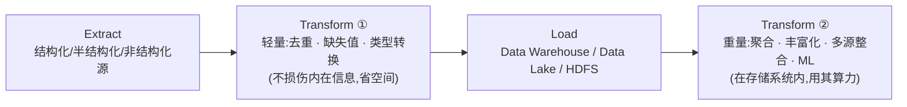

> **考试提示** — ETL / ELT / ETLT 三者的辨析是本讲最"硬"的知识点。记忆抓手:
> **ETL** = 转换在**中间服务器**,传统数仓,省空间但**丢原始数据**、不灵活;
> **ELT** = 转换在**目标系统内**,大数据环境,**保留原始数据**、灵活、适合探索;
> **ETLT** = **拆成轻量 T₁ + 重量 T₂**,轻的在装载前(省空间),重的在装载后(保灵活),专为大数据环境设计。

### 8.3 Learning About the Data(熟悉你的数据)

slides 第 36 页:**"A critical aspect of a data science project is to become familiar with the data itself."**

这一步要达成三个目标 (accomplishes several goals):

1. **Clarifies the data the team has access to**(厘清团队能访问到哪些数据)
2. **Highlights gaps on data access**(凸显数据访问上的缺口)
3. **Identifies datasets outside the organisation**(识别组织外部的数据集)

讲师逐条解释了为什么每一条都重要:

- **第 1 条**:团队里**每个人**都需要知道现在有什么数据、能访问什么数据、数据有什么性质。
- **第 2 条**:比如"我们目前只能访问三个月前的数据",或者"要拿到更近期的数据需要走流程、需要时间"。
- **第 3 条**最关键:**"if you don't identify this, when you develop your model, you will find out — I don't have this data, I need this data. Then you start contacting the third party… actually this will waste your time."** 等你建模到一半才发现缺数据,再去联系第三方,时间就白白浪费了。

#### 数据可用性矩阵

slides 第 37 页给了一张实用的表,把数据按**获取难度**分成四类。讲师用 Amazon 的场景解释了每一格:

| Dataset(数据集) | 分类 | 为什么在这一格 |
|---|---|---|
| **Products shipped**(已发货产品) | **Data Available and Accessible** (可用且可访问) | 自家运营数据,直接就能给你 |
| **Product Financials**(产品财务数据) | **Data Available, but not Accessible** (可用但不可访问) | 数据存在,但涉及**商业机密**,需要走审批,可能拿不到 |
| **Product Call Center Data**(客服中心数据) | **Data Available, but not Accessible** | 存在,但包含**客户个人信息、员工培训记录**等机密内容,需要**去标识化**处理 |
| **Live Product Feedback Surveys**(实时产品反馈问卷) | **Data to Collect** (需要采集) | 数据还不存在,**要花时间去收集**——得等用户填问卷 |
| **Product Sentiment from Social Media**(社交媒体产品情感) | **Data to Obtain from Third Party Sources** (需从第三方获取) | 不但要时间,**还需要第三方**来做情感分析 |

讲师的总结点出了这张表的用处:

> **"Although they are all data, they're from different resources and they need different time scales to obtain. So understanding that will help you to better schedule, better plan your project."**

**这张表本质上是一个项目排期工具。** 第三格和第四格的数据必须**尽早启动**,否则它们会变成关键路径上的瓶颈。

### 8.4 Data Conditioning(数据调理)

slides 第 38 页定义:

> **Data Conditioning** = **"the process of cleaning data, normalising datasets, and performing transformations on data."**
> 它是**"a critical step involving many complex steps to join, merge, and transform datasets."**

**谁来做?** slides:**"Usually performed by IT, the data owners, a DBA, or a data engineer (but data scientist shall involve)."**

括号里那句是重点。**为什么数据科学家必须参与?** 讲师说:因为你需要知道**什么被 join 了、什么被 merge 了、什么数据被丢弃了**。如果你不知道数据被怎么改过,你后面对模型结果的所有解释都可能是错的。

#### 关于丢弃数据的严肃警告

slides 说:**"It is important to be thoughtful about choosing and discarding data."** 讲师把这句轻描淡写的话展开成了本节最有价值的一段:

> **不要**随口说"这是个 outlier,删掉吧"、"这条记录有缺失值,删掉吧"。**不是这样的。**
>
> - **有时候 outlier 恰恰就是你要找的信息。** 想想欺诈检测——异常交易正是目标;想想设备故障预测——异常读数正是信号。
> - **如果你因为某一个特征缺失就把整条样本丢掉,你可能最终丢掉了 50% 的数据。**
>
> 他的原则:**"We try to utilize every piece of information we collect."**(我们要尽量利用收集到的每一条信息。)

这是新手最容易犯的错误之一:把"清洗数据"理解成"删掉不干净的数据"。**正确的理解是:理解每一处不干净背后的原因,然后做出有依据的处理决策。**

#### Data Conditioning 该问的问题

slides 第 39 页列了一组自检问题:

- **What are the data sources and target fields?**(数据源和目标字段是什么?)
- **How clean is the data?**(数据有多干净?)
- **How consistent/complete are the contents and files?**(内容和文件的一致性/完整性如何?)
- **Assess the consistency of data types**(评估数据类型的一致性)
- **Review the content of data columns or other inputs**(审查数据列或其他输入的内容)
- **Look for any evidence of systematic error**(寻找系统性误差的证据)
- **Any signs of noise, outliers, incorrect, missing values?**(有噪声、离群点、错误值、缺失值的迹象吗?)
- **Be careful how you deal with data affected by noise, outliers, incorrect or missing values.**(处理这些数据时务必谨慎。)

> 📎 **拓展(超出 slides)** — **systematic error(系统性误差)** 值得单独说一句,因为它比随机噪声危险得多。随机噪声会在大样本下相互抵消;而系统性误差是**朝同一个方向偏**的,样本再多也不会消失。例如某个影像中心的机器一直偏亮 5%,那么该中心所有数据都带着同一个偏移——模型可能学会的是"识别哪家医院",而不是"识别毒性"。这也是 §5.3 中"多中心数据变异"之所以危险的原因。
>
> 讲师提到 **INFO401 / INFO911** 会更深入地讲 outlier、missing value 和 feature selection。

### 8.5 Survey and Visualise(概览与可视化)

Phase 2 的最后一步:**在建模之前,先用眼睛看一遍数据。**

slides 第 40 页:

- **Leverage data visualisation tools to gain an overview of the data**(利用可视化工具获得数据全貌)
- **Seeing high-level patterns helps understanding**(看到高层次的模式有助于理解)
- 一条经典准则:**"Overview first, zoom and filter, then details on demand"**(先总览,再缩放与过滤,最后按需查看细节)

**为什么可视化如此重要?** 讲师给了一个直击人性的理由:

> **"As human beings, we are not good at interpreting numerical data, but we are good at interpreting a figure, an image, or graphics."**
>
> 一旦你把数据画出来,你会**立刻**说:"啊,这里有三个簇,我看得很清楚";或者"哦,订单数量和总成本好像是正相关的"。

而且——这是最实用的一点——**可视化直接指导你的模型选择**:

> 通过可视化,你不但能看出"正相关",还能看出这个关系**是线性的还是非线性的**。而这**立刻告诉你**:你需要的是**线性分类器还是非线性分类器**。

这就把 Phase 2 和 Phase 3 直接连了起来:**你在 Phase 2 用眼睛看到的东西,决定了你在 Phase 3 会选什么模型。**

讲师提到**可视化会在下周(Week 3)专门讲**。

#### 可视化时的检查清单

slides 第 41 页给出了一组具体准则:

| 检查项 | 要问什么 |
|---|---|
| **Granularity**(粒度) | 数据的粒度是什么?单位是什么?时间尺度是什么? |
| **Coverage**(覆盖度) | **Does the data represent the population of interest?**(数据是否代表了你关心的总体?) |
| **Time-related variables**(时间相关变量) | 测量单位是什么?秒、小时、月、年? |
| **Consistency of calculation**(计算一致性) | 审查数据以确保计算方式始终一致 |
| **Distribution**(分布) | 数据分布是否保持一致? |
| **Normalisation**(归一化) | 数据归一化了吗?尺度一致吗?**该不该归一化,还是保持原样?** |
| **Special data types**(特殊数据类型) | 地理空间数据、人名、单位该怎么处理? |

其中 **coverage / representativeness(代表性)** 是讲师特别强调的一条,因为它直接决定模型能不能用:

> **机器学习算法要求数据具有代表性。** 如果你的数据不具代表性,只覆盖了整个分布/总体中的一小块区域,那么**你的算法一定不准确,预测一定不准确。**

**normalisation(归一化)** 讲师也给了理由:**单位会影响权重。** 如果一个特征以"米"为单位(数值 0–2),另一个以"毫米"为单位(数值 0–2000),那么在很多算法里后者会因为数值大而主导距离计算——但这纯粹是单位选择的产物,没有任何实际意义。

### §8 小结:Phase 2 的产出与关卡

Phase 2 结束时你应该有:**一个装满各类数据的沙箱、一份经过 ETLT 处理和 conditioning 的干净数据集、对数据来源与质量的清楚认识、以及一批探索性可视化图表。**

关卡问题:**Do I have enough good quality data to start building the model?**

记住讲师的两句提醒:这是**最耗人力的一步**,而且你**很可能还要回来**。

---

## §9 Phase 3 · Model Planning(模型规划)

数据准备好了。现在的问题是:**用什么方法去分析它?**

注意 Phase 3 的定位:它是**规划**,不是**构建**。你在这一阶段决定"打算试哪些模型、用哪些变量、基于什么假设",但还不真正把模型训练出来。

### 9.1 识别候选模型

slides 第 43 页:

- **Identifies candidate models to apply to data**(识别可应用于数据的候选模型)
  - **For clustering, classifying, or finding relationships**(用于聚类、分类,或发现关系)
- **Refers to the hypotheses developed in Phase 1**(参考 Phase 1 中建立的假设)

**注意那三个词:clustering / classifying / finding relationships。** 讲师把这一步拆成了**两级决策**:

> **第一级:这是什么类型的问题?** 是聚类问题、分类问题,还是关联分析 (associative analysis) 问题?这要基于**数据 + 领域知识**来判断。
>
> **第二级:确定了类型之后,用哪个具体算法?** 假设已经确定是分类问题,那么用哪种分类器?取决于:
> - **准确率要求**(呼应 §7.3 的 criteria of success)
> - **计算负载 (computation load)**
> - **是否对 outlier 稳健**
> - **是否对不平衡数据 (imbalanced data) 稳健**
>
> 讲师说:**"you have many algorithms to choose from."**

**而 "refers to the hypotheses developed in Phase 1" 这一条,是 §7.6 埋下的伏笔的第一次回收。** 讲师的展开:你现在要回头看 Phase 1 的假设,判断**你是否有足够的数据来得到可靠的估计**。

其余要考虑的活动:

- **Assess the structure of datasets**(评估数据集的结构)
- **Ensure the analytical techniques capable**(确保分析技术能胜任)
- **Determine the need of a single or multiple models**(判断需要单个模型还是多个模型)
- **Conduct critical literature review of similar projects**(对类似项目做批判性文献综述)—— slides 特别标注 **(Could be done even earlier)**

关于**文献综述**,讲师解释了为什么它"可以更早做":你在 Phase 1 建立领域理解的时候就可以开始查文献,看看**有没有人做过类似的项目**。如果找到了,那非常有价值——你能知道**他们踩过什么坑、最多能做到什么程度**。后者尤其重要:它给了你一个现实的性能预期,避免你对着一个别人只能做到 70% 的问题承诺 95%。

### 9.2 Data Exploration and Variable Selection(数据探索与变量选择)

slides 第 44 页列出的目标:

- **To understand the relationships of the variables**(理解变量之间的关系)
- **To help selection of the variables and methods**(帮助选择变量和方法)
- **To understand the problem domain**(理解问题领域)
- **Use tools to perform data visualisation**(使用工具进行可视化)
- **Explore the stakeholders and subject matter experts for their instincts and knowledge**(挖掘干系人和领域专家的直觉与知识)
- **Capture the most essential predictors and variables, rather than every possible ones**(抓住最本质的预测变量,而不是所有可能的变量)

讲师在这里指出了一个有意思的现象:列表中的第 3、5 条(理解问题领域、挖掘专家知识)**你本应在 Phase 1 就完成了**。它们在这里再次出现,是因为**现在你带着对数据的实际认识回头再用一次**——这正是生命周期"可回退、可迭代"性质的体现。

**为什么要做变量选择?** 讲师给了两条理由:

1. **有些变量高度相关 (highly correlated)**,保留其中一个就够了;
2. **有些变量是噪声**,对预测没有贡献,留着反而添乱。

然后是最重要的一条理由,涉及一个必须理解的概念:

> **"You don't need all the variables, especially when you don't have a large amount of data. In this case, you need to do feature selection. Otherwise, you don't have enough data to estimate the parameters for these variables and you will easily end up with overfitting."**

> 📎 **拓展(讲师给出的定义,超出 slides)** — **Overfitting(过拟合)**:讲师的定义是 **"you learn into the noise of the data rather than the real nature of the data."**(你学到的是数据里的噪声,而不是数据的真实本质。)
>
> 为什么变量太多会导致过拟合?直觉是这样的:**每个变量都对应一个要估计的参数,而估计参数需要数据。** 如果你有 1000 个变量但只有 100 个样本,模型有足够的自由度去"记住"这 100 个样本的每一个细节——包括它们各自的随机噪声。结果是训练集上完美,新数据上崩溃。反过来,变量少了,模型被迫只能抓住那些**在多个样本上重复出现的**模式——那才是真信号。
>
> 这也解释了为什么 **"capture the most essential predictors, rather than every possible ones"** 不是偷懒,而是必要的。

### 9.3 Model Selection(模型选择)

slides 第 45 页先给了 **model** 的定义,这个定义值得记住:

> **"A model refers to an abstraction from reality. It emulates the behaviour of data with a set of rules and conditions."**
> (模型是对现实的一种抽象。它用一组规则和条件来模拟数据的行为。)

要做的事:

- **Choose an analytical technique, or a short list of candidate techniques, based on the end goal of the project**(基于项目的最终目标,选择一种分析技术,或一个候选技术的短名单)
- **Machine learning and data mining**:**Classification, association rules, and clustering**

讲师提到,**classification、association rules、clustering 这三类方法**会在后面三周专门讲——本课有三周讲工具与方法。

**"Model selection" 具体在选什么?** 讲师给了两个层次:

> 一是**选哪类模型**——比如决定用神经网络;
> 二是**选模型的具体形态**——如果用神经网络,**用几层?每层几个神经元?**
>
> 归根结底,它是在问:**你要用一个简单模型(比如线性模型),还是一个更复杂的模型?**

而这个决定的依据是什么?**Phase 1 和 Phase 2 的成果**:

> **"This all relates to what you have identified from phase one and phase two, because through phase one and phase two, you have had an idea [of] whether this is a complex prediction problem, or you believe that these two classes can be easily separated by a straight line or by a hyperplane."**

这又一次印证了生命周期的连贯性:**如果你在 Phase 2 的散点图上看到两类数据被一条直线清晰分开,你在 Phase 3 就没必要上深度网络。**

#### 大数据环境下的额外考量

slides 第 46 页:

- **When dealing with Big Data, the team needs to consider techniques best suited for structured data, unstructured data, or a hybrid approach**(处理大数据时,要考虑最适合结构化/非结构化/混合数据的技术)

> 📎 **拓展(讲师课堂补充,超出 slides)** — 讲师指出,**基础大模型 (foundation models) 已经显著改变了处理非结构化数据的难度**:
>
> **"Nowadays, we have AI models. Everything can be embedded. Even if you have an image or video or song or text, you can call the pre-trained model to embed the document or image into an embedding vector. Then you can process them, you can measure their similarity, you can match them."**
>
> 换句话说:过去处理非结构化数据需要为每种模态设计专门的特征工程;现在你可以用预训练模型把图像、文本、音频统统映射成**embedding vector**(嵌入向量)——一旦变成向量,后续的相似度计算、匹配、分类就都是标准操作了。**"This makes our job easier."**

#### 模型假设:必须写下来

slides:**"Take care to identify and document the modelling assumptions."**

讲师用一个具体例子说明了为什么:

> 假设你决定"每个类别的数据服从**高斯分布 (Gaussian distribution)**",因为某个分类器对高斯分布的数据处理得很好。
>
> **你必须把这个假设写下来。** 因为"你的数据是否真的服从高斯分布、服从到什么程度"是一个**需要检验的问题**——你要通过**可视化**和**假设检验 (hypothesis testing)** 去验证。
>
> 目的是:**"make the data and the model consistent."**(让数据和模型相互匹配。)

这是很多项目翻车的隐蔽原因:模型的数学推导依赖某个分布假设,而实际数据违反了它,结果模型输出的置信度、p 值全是假的。**写下假设 → 检验假设**,是防止这类错误的唯一办法。

#### 工具与基线

slides 第 46–47 页:

- **Typically, create the initial models using a statistical software package**(通常用统计软件包创建初始模型)
  - **Baseline results can be indicative of the difficulty of the problem.**(基线结果能反映问题的难度。)
- **Common Tools**:**Python/R and their packages** —— 开源编程语言与统计计算/绘图环境,具备完整的建模能力、适合构建**可解释模型 (interpretive models)**、能与数据库接口、能对一些大数据问题执行统计检验与分析。

**Baseline(基线)这个概念值得注意**:先用最简单的方法快速跑一个结果,这个结果告诉你问题有多难。如果一个逻辑回归就能到 85%,那说明问题不难;如果调了半天还在 55%(接近瞎猜),那说明要么信号很弱,要么数据有问题——**这时候你应该回到 Phase 2,而不是去堆更复杂的模型。**

讲师说明了本课的定位:**"we are not asking you to write the algorithm from scratch; rather, we ask you to learn to call the function, to select the function correctly, to understand the output."** —— 本课考察的是**正确选用函数并理解输出**,而不是从零实现算法。

---

## §10 Phase 4 · Model Building(模型构建)

### 10.1 一个反直觉的事实:这一步最快

slides 第 49 页:

- **Develop datasets for training, testing, and production purposes**(为训练、测试、生产目的开发数据集)
- **Train the analytical model and test it**(训练并测试分析模型)
- **Model planning and model building can overlap quite a bit. One can iterate back and forth for a while**(模型规划与模型构建会大量重叠,可以来回迭代一阵子)
- **Although modelling techniques can be highly complex, the actual duration of this phase can be short**(尽管建模技术可能非常复杂,这一阶段的实际时长可以很短)

最后一条是本节的关键,也是讲师专门解释的一点。他甚至用 slides 的篇幅本身作为证据:

> **"You can see that I did not spend much on this model building part — just a couple of pages. Why? Because model building actually needs you to spend the least time. This is the most technically intensive part, because you call functions, do optimization, parameter estimation, [and it] gives you a model — but actually in terms of time, you just call the software package [and] you get a model. So in terms of time, it is the least."**

请把这个认知内化:**技术强度最高的一步,时间成本最低。** 这与新手的直觉完全相反——新手以为数据科学项目的主体是建模,实际上建模可能只占全部时间的 10%,而 Phase 2 数据准备可能占 50–70%。

**"Model planning and model building can overlap quite a bit"** 也很实际:你规划一个模型 → 建出来 → 效果不够好 → 回去改规划 → 再建。讲师说 **"they overlap quite a bit"**。

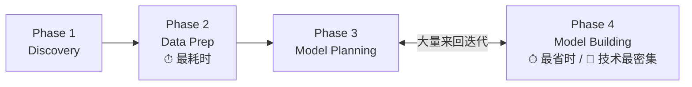

### 10.2 建模过程中的纪律

slides 第 50 页列了一组要求,核心是**记录**:

- **Run models from software packages on file extracts and small datasets**(先在文件抽取样本和小数据集上跑模型)
- **It is vital to record the results and logic of the model during the phase**(记录模型的结果和逻辑至关重要)
- **Record any operating assumptions made in the modelling process**(记录建模过程中做出的任何操作性假设)
- **Creating robust models requires thoughtful consideration to meet the objectives**(构建稳健模型需要深思熟虑)
- **Understand the role of training data, validation data, and testing data, and use those sets correspondingly**(理解训练集、验证集、测试集各自的角色,并对应使用)

关于**记录假设**,讲师给了一个警告:**"sometimes assumptions could be violated implicitly, unconsciously."**(假设有时会被隐式地、无意识地违反。)你在建模时随手做了一个决定——比如把某个变量做了对数变换、或者把缺失值填成了均值——三周后你自己都忘了,但模型的行为已经被它影响了。**写下来是唯一的防线。**

他也承认:构建稳健的模型 **"will test your analytical capability, your expertise, and sometimes your patience."**(会考验你的分析能力、专业素养,有时还有你的耐心。)

#### 三个数据集的角色

slides 只说"理解它们的角色",讲师在课堂上给了一个非常具体、也非常有画面感的说明,这段值得完整理解:

> **Training data(训练集)**:用来训练模型、学习参数。
> **Validation data(验证集)**:用于**超参数调优 (hyperparameter tuning)**、选出最好的模型。
> **Test data(测试集)**:最终评估。
>
> 而测试集的使用方式,讲师描述了工业界的真实做法:
>
> **"The test data will be issued by your business client and you are not allowed to access [it]. It will be locked somewhere. Unless you say 'OK, I have my model, my model is ready for testing,' then someone will unlock the [cabinet], get the test data and show it to you. [You] run your model on it without doing anything. Then tell me your predicted result. I will take your predicted result to the customer [and] they will compare them to ensure a fair evaluation of your model."**
>
> 测试数据**由客户保管、锁起来**,直到你宣布模型就绪才解锁;你在上面**跑一次、不做任何调整**,交出预测结果。**这是为了保证评估的公正性。**

**为什么必须这么严格?** 因为只要你能反复在测试集上看结果并据此调模型,你就在**间接地把测试集的信息泄漏进模型**——测试集就不再是"未见过的数据",评估结果也就不再反映真实的泛化能力。锁起来是唯一可靠的隔离。

讲师说三个数据集的角色**会在后续几周详细展开**。

### 10.3 建模阶段必须问的七个问题

slides 第 51 页给出了一份检查清单。这是 Phase 4 → Phase 5 关卡问题("模型够稳健吗?")的展开版:

| # | 问题 | 讲师的补充 |
|---|---|---|
| 1 | **Model appear valid and accurate on validation data?**(模型在**验证集**上有效且准确吗?)——**Tweak training parameters as needed.** | 这是个好迹象,但还不够 |
| 2 | **Model appear valid and accurate on test data?**(在**测试集**上有效且准确吗?) | **这才是决定性的**——测试集才是你真正必须表现好的地方 |
| 3 | **Output/behaviour make sense to domain expert?**(输出和行为对**领域专家**说得通吗?) | **不要只看准确率这个数字**,要理解结果**对领域专家意味着什么** |
| 4 | **Model parameters make sense?**(模型参数说得通吗?) | 变量前面的系数显示"这个变量很重要、那个不重要"——这**是否与领域专家的知识一致?能否被解释?** |
| 5 | **Model is sufficiently accurate to meet the goal?**(模型是否足够准确以达成目标?) | 讲师说这通常是数据科学家问的**第一个**问题;对应 §7.3 定的 criteria of success |
| 6 | **Model supports run-time requirements?**(模型是否满足运行时要求?) | 预测要多久出结果?需要多少内存?**需要 GPU 吗?** |
| 7 | **Is a different form of the model required?**(是否需要另一种形态的模型?) | 若以上任一项不达标,可能得换模型形态 |

**第 6 条(run-time requirements)是最容易被学生忽略、却在实际部署时致命的一条。** 讲师给了一个极其具体的场景:

> 现在我们常用**预训练大模型**,通常需要 GPU。但如果——**如果你拿不到 GPU 呢?或者这个模型最终要嵌入一个没有 GPU 的医疗系统里呢?**

一个准确率 99% 但需要 A100 才能在 2 秒内出结果的模型,对一个跑在医院老旧服务器上的 EHR 系统来说,**等于不存在**。这类约束必须在 Phase 4 就发现,而不是等到 Phase 6 部署时。

**第 3、4 条合起来讲的是一件事:可解释性 (interpretability)。** 一个准确但无法解释的模型,在医疗、金融等高风险领域往往无法被接受。回想 §5.3 的 MRI 案例——客户要的正是 **"why"**。

### 10.4 常用工具

slides 第 52 页列出的 **Common Tools for the Model Building Phase**:

**Matlab、Octave、Mathematica、SAS、SPSS、R、WEKA、Python (pytorch, scikit-learn)、Apache Spark、Amazon SageMaker**

讲师说这些现在不需要都掌握,课程会重点使用 **Python + scikit-learn**,以及 **R**。

> 📎 **拓展(课堂补充)** — 关于 lab 环境,讲师推荐 **Google Colab**:免费、无需本地安装、**同时支持 Python 和 R**。切换到 R 的方法:打开 Colab → 菜单栏 **Runtime** → **Change runtime type** → 选择 **R** → 即可运行 R 代码。当然你也可以在自己电脑上装 Python 或 R,由你决定。

---

## §11 Phase 5 · Communicate Results(沟通结果)

模型建好了。现在你要面对人。

### 11.1 对照标准判定成败

slides 第 54 页:

- **Compare the outcomes of the modelling to the criteria established for success and failure**(把建模结果与既定的成功、失败标准做对比)
- **Articulate the findings and outcomes to team members and stakeholders**(向团队成员和干系人清晰陈述发现与结果)
- **Take into account caveats, assumptions, and any limitations of the results**(把警示、假设和结果的局限性都考虑进去)
- **Failure: a failure of the data to accept or reject a given hypothesis adequately**(失败 = 数据未能充分地接受或拒绝某个给定假设)

**第一条是 §7.3 埋下的伏笔的回收。** 你在 Phase 1 定的 criteria of success 和 criteria of failure,到这里终于派上用场——**没有它们,你现在就无法判定项目是成功还是失败,只能靠感觉和话术。**

**第三条极其重要。** 讲师的展开:

> **不要只是说"我们达到了 90% 准确率"。** 要说清楚:**在什么条件下?对哪一类患者?在哪个影像中心?**
>
> **"Don't simply report positive things. Talk about the caveats. Talk about assumptions. Talk about limitations."**
>
> 为什么?因为干系人和用户**需要理解你成果的适用范围 (scope)**。而且这样做还有个额外好处:**"This actually will also pave the way to future projects."**(这也为未来的项目铺路。)

**第四条重新定义了"失败"**,值得仔细读。注意 slides 的措辞:失败**不是**"模型不准",而是 **"a failure of the data to accept or reject a given hypothesis adequately"** —— **是数据未能充分地接受或拒绝某个假设**。

讲师明确说:**"Failure is not necessarily a bad thing."**

> 结论可能是:"基于这批数据,很遗憾,我无法可靠地告诉你能否得出这个结论。"**这是一个失败——是数据的失败,不是你的失败。它并不必然意味着你的项目失败了。**

这也解释了为什么 Phase 4 → Phase 5 的关卡问题是 **"Is the model robust enough? Have we failed for sure?"** —— **"确定失败"和"确定成功"一样,都是可以交付的、有价值的结论。** 一个诚实的"这条路走不通,原因是……"能帮组织省下后续几百万的投入。

### 11.2 两个极端,和它们之间的平衡

slides 第 55 页描述了沟通结果时最容易滑向的两个极端:

> **1. Only done a superficial analysis, not robust enough to accept or reject a hypothesis**
> (只做了浅层分析,不够稳健,无法接受或拒绝假设)
>
> **2. Perform very robust analysis to search for ways to show results, even when results may not be there**
> (做了非常"扎实"的分析,拼命找办法把结果show出来,哪怕结果根本不存在)

讲师对这两个极端的解读:

- **极端一**:你**没有投入足够时间**深入研究数据、模型或结果。这是**懒惰**的失败。
- **极端二**:即使已经证明"在要求的水平上不可能可靠预测",你**还是拼命去试**。讲师的评语一针见血:**"You're after something that does not exist."**(你在追求一个不存在的东西。)这是**不诚实**的失败——它有个学术名字叫 p-hacking:试足够多的分析方法,总能凑出一个"显著"的结果。

slides 给的解法:**"Need to strike a balance between these two extremes, be pragmatic."**(在两个极端之间取得平衡,要务实。)

**另一条实用建议**:**"Record all findings and select the three most significant ones to share with stakeholders."**(记录所有发现,但只挑最重要的三个分享给干系人。)

讲师解释:这是为了**给出焦点**,而不是把所有东西一股脑倒给干系人。你的完整发现要归档,但汇报时必须做取舍——**十个发现全说,等于一个都没说。**

### 11.3 从发现到行动

slides 第 56 页把 Phase 5 从"汇报"推向"推动":

- **Make recommendations for future work or improvements**(为后续工作或改进提出建议)
- **This is the phase to underscore the business benefits of the work**(这是强调工作业务价值的阶段)
- **Begin making the case to implement the logic into a live production environment**(开始论证将这套逻辑投入生产环境)
- **The deliverable of this phase will be the most visible portion to stakeholders and sponsors**(本阶段的交付物是干系人和发起人**最能看见**的部分)

**为什么"建议"比"发现"更重要?** 讲师说:

> 你描述了你的发现、你的洞察,但**最终干系人想知道的是:"你的建议是什么?基于你的发现,我们该做什么?"**
>
> **"So make a recommendation. Action is important."**

**为什么这一阶段"最可见"?** 讲师的描述带着一点幽默但很真实:

> 干系人**什么都不知道**——他们只知道"这帮人忙了好几个月"。现在你终于把成果摆到他们面前,**他们才第一次真正看到这个项目的价值。**

这解释了为什么 Phase 5 的沟通质量对项目的最终评价影响巨大:**你几个月的工作,在大多数人眼里就等于这一次汇报。**

---

## §12 Phase 6 · Operationalize(实施运营)

最后一个阶段:**把模型真正放到现实世界里去。**

### 12.1 先试点,再铺开

slides 第 58 页:

- **In the final phase, communicate the benefits of the project more broadly**(更广泛地传达项目收益)
- **Set up a pilot project to deploy the work in a controlled way, before broadening the work to a full enterprise or ecosystem of users**(建立**试点项目**,以受控方式部署,然后再推广到全企业或整个用户生态)
  - **Risk can be managed more effectively**(风险能被更有效地管理)
- **Learn the performance and constraints of the model**(了解模型的性能与约束)
- **Make adjustments before a full deployment**(在全面部署前做出调整)

**为什么必须先试点?** 讲师给出了本节最重要的洞察:

> **"This step actually — this step usually [makes] us go back to the previous steps. Because you'll find that although it works in your analytical sandbox, once you put it into the real environment, even in a controlled way, you find a lot of factors, interference that you have not considered."**
>
> **在沙箱里能跑通,不代表在真实环境里能跑通。** 一旦上线,你会发现一大堆你从未考虑过的因素和干扰。

这个现象有个名字,讲师专门点出来了:

> 📎 **拓展(讲师给出的术语,超出 slides)** — **Distribution shift(分布漂移)**,讲师也称之为 **"the gap"**。指的是**模型训练时所见的数据分布,与它上线后实际遇到的数据分布不一致**。讲师说这会 **"significantly affect machine learning algorithms."**
>
> 为什么会漂移?因为现实在变:用户行为变了、传感器换型号了、业务规则调整了、季节变了、疫情来了。模型学到的是**过去那个分布**下的规律,而它面对的是**现在这个分布**。
>
> 这就是为什么 §12.2 的"持续监控 + 准备重训"不是可选项,而是必需品。

### 12.2 新成员、持续监控、准备重训

slides 第 59 页:

- **This phase can bring in a new set of team members (e.g., engineers responsible for the production environment)**(这一阶段会引入新的团队成员,例如负责生产环境的工程师)
- **Create a mechanism for performing ongoing monitoring of model accuracy**(建立持续监控模型准确率的机制)
- **Prepare to retrain the model**(准备重新训练模型)

讲师对第二、三条的补充很直接:

> **"The model accuracy will be [dropping], usually decrease significantly. You need to quickly identify the issues and be prepared to retrain the model. This is quite common."**
>
> 模型准确率**会**下降,而且往往**显著下降**。你需要快速定位问题,并做好重训准备。**这非常常见。**

请注意这里的措辞是 **"will"**,不是 "may"。**模型性能随时间衰减是常态,不是异常。** 一个没有监控机制的上线模型,等于一个没人看仪表盘的飞机。

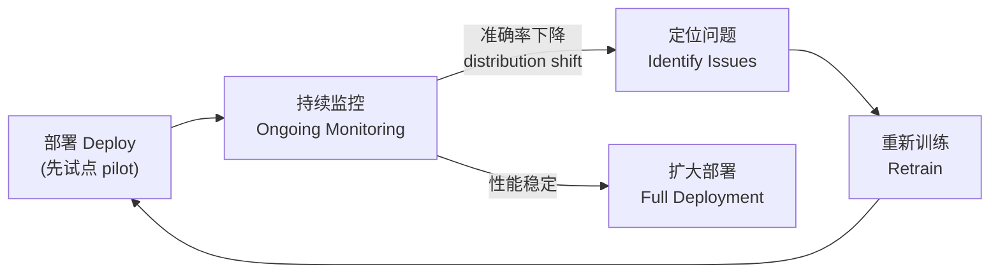

### 12.3 谁需要什么:交付物与受众

这是 Phase 6 最实用的一块,直接呼应 §5.1 的角色表。

slides 第 60 页那张图叫 **"Key Outputs from a Successful Analytic Project"**,把四类产出——**Code(代码)、Technical Specs(技术规格)、Presentation for Analysts(给分析师的演示)、Presentation for Project Sponsors(给项目发起人的演示)**——分配给七种角色。

slides 第 61 页则说明了**每个角色关心什么**:

| 角色 | 他们关心什么 | 他们需要的交付物 |
|---|---|---|
| **Business Users**(业务用户) | **Benefits and implications**(收益与影响) | Presentation |
| **Project Sponsor**(项目发起人) | **Business impact, risk, ROI**(业务影响、风险、投资回报率) | Presentation for Project Sponsors |
| **Project Manager**(项目经理) | **Completion on time, within budget, goals are met?**(是否按时完成、是否在预算内、目标是否达成) | Presentation |
| **BI Analyst**(BI 分析师) | **Reports and dashboards impacted?**(哪些报表和 dashboard 会受影响) | Presentation for Analysts |
| **Data Engineer & DBA**(数据工程师与数据库管理员) | **Code and documents**(代码与文档) | Technical Specs + Code |
| **Data Scientist**(数据科学家) | **Code, model, and explanation**(代码、模型与解释) | Technical Specs + Code + Presentation |

slides 第 62 页总结了**四种主要交付物类型**:

1. **Presentation for project sponsors**(给项目发起人的演示)
2. **Presentation for analysts**(给分析师的演示)
3. **Code for technical people**(给技术人员的代码)
4. **Technical specifications of implementing the code**(实现代码的技术规格说明)

以及一条**通用规则 (a general rule)**,请记住它:

> **"The more executive the audience, the more succinct the presentation needs to be."**
> (受众层级越高,演示就必须越简洁。)

讲师的补充:**"Think about who you are speaking with. Adapt your presentations. Don't simply use a single PowerPoint [deck] to present your project to everybody."** —— **不要用同一套 PPT 讲给所有人听。**

这在实践中意味着:给 sponsor 的 5 页 deck 里不该出现混淆矩阵;给 data engineer 的技术文档里不该花篇幅论证 ROI。**同一个项目,四套材料。**

---

## §13 完整案例:医院降低再入院率

slides 第 63–68 页用一个完整案例把六个阶段串了一遍。**讲师明确要求课后自己再走一遍这个例子**,并且在讲解时**主动补充了一个 slides 上漏掉的关键步骤**——注意 slides 第 64 页那句提问 **"Any steps are missed here?"**,答案就在下面。

**场景**:一家医院想**降低患者再入院率 (patient readmission rates)**。

### Phase 1 · Discovery

- **Identify Problem**(识别问题):**高再入院率导致成本上升、患者满意度下降。**
- **Stakeholder Engagement**(干系人参与):与**医生、护士、管理人员**讨论,理解造成再入院的因素有哪些。
- **Data Sources**(数据源):识别相关数据源——**患者病历 (patient records)、治疗史 (treatment histories)、人口统计数据 (demographic data)**。

对照 §7:这里体现了 framing the problem(把"再入院率高"框定成一个可预测的问题)、identifying key stakeholders(医生/护士/管理者)、identifying potential data sources(三类数据)。

### Phase 2 · Data Preparation

- **Data Collection**(数据收集):从 **EHR (electronic health records) 系统**中抽取患者病历、治疗史、人口统计数据。
- **Data Cleaning**(数据清洗):**处理缺失值、修正病历中的错误、标准化格式**(例如日期格式)。
- **Data Integration**(数据整合):把不同来源的数据合并成统一数据集,**确保各变量之间的一致性**。

> **⚠️ 讲师补充的遗漏步骤(对应 slides 上的 "Any steps are missed here?")**
>
> **"Patient data should always be anonymized. You should always need to have ethical approval to access patient [data]."**
>
> **漏掉的是:数据去标识化 (anonymization) 与伦理审批 (ethical approval)。**
>
> 这不是一个可选的合规动作,而是 §5.3 的 MRI 案例中就已经点明的硬约束——**医疗数据永远是敏感数据**。任何涉及患者数据的项目,在你碰到数据之前就必须完成伦理审批,在数据进入沙箱之前就必须完成去标识化。**这也是一道很可能出现在考题里的"你能看出这里少了什么吗"。**

### Phase 3 · Model Planning

- **Feature Selection**(特征选择):识别可能影响再入院的关键特征——**年龄 (age)、性别 (gender)、诊断 (diagnosis)、治疗类型 (treatment type)、住院时长 (length of stay)**。
- **Algorithm Selection**(算法选择):为预测任务选择合适的算法——**logistic regression(逻辑回归)、decision trees(决策树)、random forests(随机森林)**。
- **Evaluation Criteria**(评估标准):定义模型评估指标——**accuracy(准确率)、precision(精确率)、recall(召回率)、F1-score**。

> **讲师补充**:除了 slides 列的四个指标,还应考虑 **AUC、ROC curve、confusion matrix(混淆矩阵)**。此外还要考虑 **memory usage(内存占用)与 computational time(计算时间)** —— 这正是 §10.3 第 6 条 **run-time requirements** 在本案例中的落地。

注意这里的问题类型是**二分类**(患者在 N 天内是否会再入院),所选的三个算法都是分类器,并且都属于**可解释性较好**的一类——这对医疗场景很重要(呼应 §10.3 第 3、4 条)。

### Phase 4 · Model Building

- **Data Splitting**(数据划分):把数据分成训练集和测试集(例如 **80% 训练,20% 测试**)。
- **Training**(训练):在训练数据上训练所选算法,学习其中的模式与关系。
- **Validation**(验证):使用**交叉验证 (cross-validation)** 技术验证模型,并调优**超参数 (hyperparameters)** 以获得最佳性能。
- **Test the model on the testing dataset.**(在测试集上测试模型。)

> **讲师补充(重要)**:划分应该是 **training / validation / test 三份**,并且——**"you lock the test data somewhere. You should not touch it until your model is ready for evaluation."** 把测试数据锁起来,在模型准备好接受评估之前**绝不触碰**。
>
> **验证集用于超参数调优和选择最佳模型;测试集只用一次,用于最终评估。** 这正是 §10.2 讲的那套纪律。

### Phase 5 · Communicate Results

- **Visualization**(可视化):制作**混淆矩阵 (confusion matrices)、ROC 曲线、特征重要性图 (feature importance charts)** 来解释模型性能。
- **Reporting**(报告):撰写完整报告,详述**分析过程、模型结果、可执行的洞察**。
- **Stakeholder Presentation**(干系人演示):向医疗服务提供者展示发现,**强调模型如何预测高风险患者,并推荐预防性措施**。

> **讲师补充**:报告要**全面**——**"talk about limitation, talk about the context, talk about the assumption. This is important."**(讲局限、讲背景条件、讲假设。)以及:做演示时**要考虑你的受众是谁**(呼应 §12.3 的通用规则)。

注意这三项可视化的选择很讲究:**confusion matrix** 说明模型在四种情形下的表现(尤其是漏掉的高风险患者——假阴性,在医疗场景中代价最高);**ROC curve** 展示不同阈值下的权衡;**feature importance** 回答临床医生最关心的"**为什么**"——又一次呼应 §5.3 那个"客户要的是 where 和 why"的教训。

### Phase 6 · Operationalize

- **Integration**(集成):把预测模型集成进医院的 **EHR 系统**,为患者提供**实时的再入院风险评分 (real-time readmission risk scores)**。
- **Monitoring**(监控):**持续监控模型性能**,并**定期用新数据重新训练**以维持准确率。
- **Actionable Use**(可执行的使用):设计工作流,让模型识别出的**高风险患者获得针对性干预**——**随访电话 (follow-up calls)、个性化护理方案 (personalized care plans)、更密切的监护 (closer monitoring)**。

> **讲师补充**:集成进 EHR 系统 **"very complicated"**(非常复杂)——要小心。关于重训,他给了明确的原因:**"new data may correspond to a new distribution, but your model is trained on the old distribution. Your model will not work well. This will always be a problem."** ——这正是 §12.1 讲的 **distribution shift**。

**注意最后一项 "Actionable Use" 才是整个项目的意义所在。** 一个风险评分本身不降低任何再入院率;**只有当它触发了实际的干预动作(随访、护理方案、监护),再入院率才会真的下降。** 这呼应了 §3.4 说的第 3 条——数据科学家的工作终点是 **actionable recommendations**,不是模型指标。

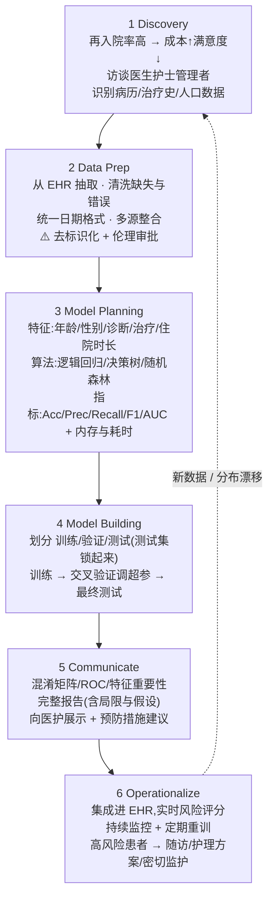

---

## §14 本章小结 (Key takeaways)

- **数据"大不大"没有绝对阈值**——它取决于**数据性质 (data properties)** 与**你可用的技术 (available technology)**;同一份数据换一套软硬件架构,就可能在"大数据问题"和"普通问题"之间切换。实时处理要求和多来源未过滤数据是两个常见的"变大"触发器。

- **大数据的 6 个 V 是 "5+1"**:Volume、Velocity、Variety、Veracity、Variability 描述**输入端**的数据性质(即挑战),而 **Value** 描述**输出端**的分析产出(即目的)。整个分析流程做的事,就是把前五个 V 的挑战转化为第六个 V 的价值。

- **数据按结构分四类**,从紧到松是 Structured(数据库/CSV)→ Semi-Structured(XML/电子表格,结构规范)→ Quasi-Structured(clickstream/`.log`,结构不规则需工具整理)→ Unstructured(图像/视频/文本/音频,无内在结构);**越松散的类型增长越快,而大数据分析四种通吃。**

- **Business Intelligence 定位于"过去 + 解释性"**(发生了什么、为什么),**Data Science 定位于"未来 + 探索性"**(会发生什么、该怎么做)。正因为数据科学是探索性的,生命周期才必须是**可回退、可迭代**的,必须**先立假设**,也必须**事先约定成功与失败的标准**。

- **传统数据架构对数据科学家有四个硬伤**:分析优先级最低、受限于内存内分析、项目孤立且临时、分析跑在生产系统上(不可靠不安全)。**Analytic sandbox**——一个安全、灵活、隔离、不影响生产系统的环境——是对这四条的直接回应。

- **Data Analytics Lifecycle 有六个阶段**:**Discovery → Data Preparation → Model Planning → Model Building → Communicate Results → Operationalize**。它是一个**环**(Phase 6 回到 Phase 1),每个阶段都**可以回退到上一阶段**,并且每个阶段末尾都有一个**关卡问题**告诉你"能不能往下走"(信息够写分析计划了吗?数据够好够多了吗?知道试哪类模型了吗?模型够稳健、或已确定失败了吗?)。

- **Phase 1 Discovery 是最不技术却最决定成败的一步**:学习业务领域(**你不必成为专家,但必须懂足够的背景**;领域知识每换一个项目就要重建,这才是数据科学家真正的挑战)、盘点资源、**框定问题**(明确目标、风险、**criteria of success 与 criteria of failure**——准确率要求 80% 还是 99% 会彻底改变项目难度;没有失败标准你就不知道何时该收手)、识别干系人(包括**受影响者**,这是伦理要求)、访谈 analytical sponsor(用开放式问题、复述确认、问清**谁有最终决策权**)、**建立可用数据检验的初始假设**、识别潜在数据源(五项活动;**garbage in, garbage out**)。

- **MRI 放疗毒性案例是本讲的核心警示**:数据科学家可能看不懂医学术语、不知如何合规获取敏感数据、不了解多中心数据的质量差异、拿到的是未标注数据、而且——**最致命的**——做出一个预测"会不会"发生的模型,而客户真正要的是"**在哪里 (where)**"和"**为什么 (why)**"。**几个月的工作可能因为第一周没沟通清楚而作废。**

- **Phase 2 Data Preparation 是最耗人力的一步**,而且你**经常还要回来**。它包括:准备**至少 5–10 倍于原始数据大小**的沙箱(要装 raw / aggregated / 转换后数据,并与 IT 协作)、执行 **ETLT**、熟悉数据(用**数据可用性矩阵**判断哪些数据要尽早启动获取)、**data conditioning**(清洗+归一化+转换;**绝不要随手删 outlier 或含缺失值的记录**——outlier 可能正是你要找的信息,按缺失值删记录可能丢掉一半数据)、以及**可视化概览**("overview first, zoom and filter, then details on demand";人类不擅长读数字但擅长读图;从图上看出的线性/非线性关系**直接决定 Phase 3 选什么模型**;**代表性 (representativeness)** 不足会直接毁掉模型)。

- **ETL / ELT / ETLT 是本讲最硬的技术辨析**:**ETL** 在**中间服务器**上先转换再装载,适合传统数仓,省空间但**原始信息丢失不可恢复**、流程僵化;**ELT** 先装载再**在目标系统内部**转换,适合大数据环境,**保留原始数据**因而**灵活、适合迭代探索**;**ETLT** 把转换**拆成两半**——装载前做**轻量无损**的 T₁(去重、缺失值、类型转换,省空间),装载后做**计算密集**的 T₂(聚合、丰富化、多源整合、ML),兼顾省资源与保灵活,**专为大数据环境设计**。

- **Phase 3 Model Planning 是两级决策**:先定**问题类型**(分类/聚类/关联分析),再依据准确率要求、计算负载、对 outlier 与不平衡数据的稳健性选**具体算法**。要**回头参考 Phase 1 的假设**、做**文献综述**(可以更早开始,能知道别人踩过什么坑、最多能做到多好)、做**变量选择**(相关变量冗余、噪声变量有害;**变量太多而数据太少会导致 overfitting——学到的是噪声而非数据的真实本质**)、并且**必须写下模型假设**(如"每类服从高斯分布")然后用可视化和假设检验去验证它。**模型 = 对现实的抽象,用一组规则和条件模拟数据的行为。**

- **Phase 4 Model Building 技术强度最高,但耗时最短**——因为你主要在调用软件包;它与 Phase 3 大量重叠、来回迭代。纪律在于**记录结果、逻辑和所有操作性假设**(假设会被隐式地、无意识地违反)。**训练集训练、验证集调超参、测试集最终评估**;实践中**测试集由客户锁起来**,模型就绪才解锁、跑一次、不做任何调整,以保证评估公正。七个检查问题里最容易被学生忽略的是 **run-time requirements**(要多久出结果?多少内存?**需要 GPU 吗?如果部署环境没有 GPU 呢?**)和**可解释性**(参数是否符合领域专家的知识?)。

- **Phase 5 Communicate Results 要对照 Phase 1 定下的成败标准**,并且**必须讲清楚 caveats、assumptions 和 limitations**(不要只报"90% 准确率",要说在什么条件下、对哪类对象)。**"失败"的定义是"数据未能充分接受或拒绝某个假设"——它不必然意味着项目失败**,一个诚实的"这条路走不通"是有价值的交付。要避免两个极端:**分析太浅**(懒惰)和**在结果不存在时硬凑结果**(不诚实)。**记录所有发现,但只挑最重要的三个**去汇报;最后必须给出**建议与行动**。这一阶段的交付物是干系人**最能看见**的部分。

- **Phase 6 Operationalize 先做试点 (pilot) 再全面铺开**,因为**沙箱里能跑通不代表真实环境能跑通**——真实环境有大量你没考虑过的干扰,这就是 **distribution shift(分布漂移)**。因此必须建立**持续监控机制**并**准备重训**:模型准确率**会**下降,而且往往显著下降,这是常态不是异常。四类交付物(给 sponsor 的演示、给分析师的演示、代码、技术规格)要**按受众分发**,通用规则是:**受众层级越高,演示越要简洁**——不要用同一套 PPT 讲给所有人。

- **完整案例(医院再入院率)中 slides 故意留了一个坑**:Data Preparation 一节漏掉了**患者数据的去标识化 (anonymization) 与伦理审批 (ethical approval)**。任何涉及患者数据的项目,伦理审批必须在你碰到数据之前完成,去标识化必须在数据进沙箱之前完成。

- **最后,也是讲师最想让你记住的一点**:这套生命周期**不只对本课有用**。将来你做 AI 项目、更高级的机器学习项目、甚至任何 IT 项目,都能套用它。所以不要只是"扫一遍",要 **"chew it, digest it, make it part of you."**

---

## 📌 考试与实操提醒

讲师在课上明确说过的几件事:

1. **"Anything we discussed in the lecture could appear in the final exam."** —— 课堂上讨论过的任何内容都可能进期末考。这包括他口头补充、slides 上没有的内容(本讲义中标为 📎 拓展的部分)。
2. 他还提到会把**留给学生思考的问题**(如"在 AI 时代,大数据面临的重大挑战是什么")**转化成期末考题**。
3. 本讲**概念性极强、技术性极弱**,因此考法多半是:**说出六个阶段及顺序、说明某阶段做什么、辨析 ETL/ELT/ETLT、辨析四种数据结构、辨析 BI 与 Data Science、给一个场景问你该在哪个阶段做什么/漏了什么**。
4. **Week 2 有第一次 lab,有考勤**。lab 内容:用 Python 或 R 加载并裁剪图像(unstructured)、打开 `.log` 点击流文件(quasi-structured)、打开 XML 文件(semi-structured)、加载 CSV 并做简单计算(structured)。推荐用 **Google Colab**(免费,Runtime → Change runtime type 可切换 Python / R)。
5. **本学期有两个 group project**,请在 lab 中主动认识同学、组队。讲师提醒:**每年都有小组因为沟通不足而散伙**——这正是 §5.2 讲的内容,它不只是考点。
