# Week 3 · Data Visualization and Hypothesis Test(数据可视化与假设检验)

> **CSCI446/946 Big Data Analytics** — University of Wollongong, Spring 2026
> 本讲义融合 `w3-Visualization-Hypothesis-Test-SP-2026.pdf`(57 页 slides)与 Week 3 课堂录音转录。

---

> **学习目标 (Learning objectives)** — 读完本章你应该能够:
>
> - **说出** five-number summary 的五个数字各是什么,并解释为什么"只看描述性统计"会把你带进沟里(用 Anscombe's quartet 举证);
> - **用可视化诊断脏数据 (dirty data)**:看懂直方图里的 0 值堆积、负值、末端截断分别在暗示什么数据质量问题;
> - **为一个给定变量选对图**:histogram / density + rug / dotchart / barplot / boxplot / hexbinplot / scatterplot matrix,并说明各自适合什么场景;
> - **解释什么时候必须做 log transformation**,以及不做会看不见什么;
> - **正确写出**任意场景下的 null hypothesis ($H_0$) 与 alternative hypothesis ($H_A$),并判断该用单侧还是双侧检验;
> - **解释**为什么"新均值更大"不等于"更好"——用 mean、variance、overlap 三者的关系说清楚;
> - **写出并读懂** Student's t-test 的统计量,列出它的三条核心假设,说明自由度为什么是 $n_1+n_2-2$;
> - **用 $\alpha$、$T^*$、$p$-value 三种等价方式做出拒绝/不拒绝的判断**,并解释 95% 置信区间的含义;
> - **在 Student's t-test、Welch's t-test、Wilcoxon rank-sum test、ANOVA、Tukey's HSD 之间做出选择**,说出每一步是哪条假设被放松了;
> - **辨析** Type I error / Type II error / power,并说明各自的补救手段;
> - **解释** ANOVA 的 F 统计量在衡量什么,以及为什么它优于反复做成对 t 检验。

---

## 开篇:这一讲在讲什么,以及它为什么被排在第三周

Week 2 我们走完了 **Data Analytics Lifecycle**(大数据分析生命周期)的六个阶段。那是一张地图:告诉你从 Discovery 到 Operationalize 该按什么顺序走。但地图上有两个格子里写着"这里需要一件工具",而我们当时还没有那件工具。

第一个格子在 **Phase 2 Data Preparation**:你要"熟悉数据"、"发现异常值"、"做可视化概览"。可具体怎么看?用什么图?看出什么才算异常?

第二个格子出现了不止一次:生命周期里反复提到 **hypothesis**(假设)——Phase 1 要 *develop initial hypotheses*,Phase 2 之后要 *test the initial hypotheses*,Phase 5 要判断结果是否"充分接受或拒绝了某个假设"。可"检验一个假设"到底是个什么操作?凭什么说"这个差异是真的,不是碰巧"?

本讲就是把这两件工具补上。讲师在开场时把这个逻辑说得很直白:上周讲的是**怎么执行**一个大数据分析项目,而 visualization 和 hypothesis testing 是这个流程里两个反复出现、却还没被展开的动作。所以今天补课。

这两半看起来风格迥异——前半是画图,几乎没有公式;后半是统计推断,公式一个接一个。但它们其实在回答**同一个问题的两个层次**:


先用眼睛看(Part I),再用统计量判(Part II)。前者防止你被数字骗,后者防止你被眼睛骗。讲师在课末特别提醒:**"第二半技术强度比较高,请一定回去复习,里面有多个重要概念,你需要准确地理解它们。"** 这句话值得当作复习优先级来读。

> 📎 **本讲的图与代码来源** — slides 首页注明,除特别说明外,所有图表与代码均出自教材 *Data Science and Big Data Analytics: Discovering, Analyzing, Visualizing and Presenting Data*(EMC Education Services)。课上示例代码大部分是 **R**,少部分是 **Python**。讲师说明:本课的目标**不是让你从零实现算法**,而是**正确、高效地使用工具**;他反复建议直接把代码贴进 **Google Colab** 跑一遍(Colab 可以切换 Python / R runtime)。

---

# Part I · 看见数据:Descriptive Statistics 与 Exploratory Data Analysis

## §1 起点:描述性统计,以及它诚实的局限

### 1.1 拿到一份数据,第一件事做什么

假设有人扔给你一个 CSV,十万行,几十列。你不可能一行一行读。所以第一个动作永远是**把数据压缩成几个能一眼看完的数字**——这就是**描述性统计 (descriptive statistics)**:用少量统计量概括整份数据的位置、离散程度和形状。

最经典的一组叫 **five-number summary(五数概括)**。讲师在课上逐项点过名,建议连同 mean 与 standard deviation 一起记:

| 统计量 | 含义 | 直觉 |
|---|---|---|
| **Min** | 最小值 | 数据的下界 |
| **Q1**(first quartile,第一四分位数) | 25% 分位点 | 有 25% 的数据比它小 |
| **Q2 / Median**(中位数) | 50% 分位点 | 把数据一分为二的那个值 |
| **Q3**(third quartile,第三四分位数) | 75% 分位点 | 有 75% 的数据比它小 |
| **Max** | 最大值 | 数据的上界 |
| *(附)* **Mean** | 算术平均 | 数据的"重心" |
| *(附)* **Std**(standard deviation) | 标准差 | 数据围绕重心散得多开 |

这里有一个学生常混淆的点,讲师专门澄清过:**median(中位数)和 mean(均值)都在描述"中间在哪儿",但算法完全不同**。Mean 是把所有值加起来除以个数,因此**一个极端值就能把它拽走**;median 只关心"排序后正中间那个",所以**对极端值不敏感**。后面 §4.3 讲收入数据时,你会看到这个区别的实际后果:少数亿万富翁能把 mean income 拉得很高,而 median income 几乎不动。

在 Python 里,这一切是一行代码:

```python
import pandas as pd

df = pd.DataFrame(data)     # data 有 age、income(数值)和 city(类别)三列
df.describe()
# 输出:count, mean, std, min, 25%, 50%, 75%, max
```

课上给的示例数据里有 `age`、`income` 两个数值列和一个 `city` 类别列。注意输出里**只有数值列**——讲师解释得很清楚:**`city` 是 categorical(类别型)变量,谈不上 mean、max 或 standard deviation**,所以 `describe()` 默认把它跳过。这不是 bug,是变量类型决定的。

R 里对应的是 `summary()`:

```r
summary(data)   # 同样给出 Min, 1st Qu., Median, Mean, 3rd Qu., Max
```

本课两种语言都会出现,讲师希望你对两边都有基本概念。

### 1.2 这一节真正的重点:**"But do not simply depend on them!"**

slides S4 上这句带感叹号的话,是整个 Part I 的转折点。

描述性统计的本质是**压缩**。压缩必然丢信息。问题是——丢的是哪些信息?答案很要命:**恰好是数据分析最关心的那些**。

具体来说,五数概括**说不出**两件事:

1. **分布的形状 (distribution)**。数据是单峰还是双峰?是对称还是右偏?中间有没有断层?五个数字全看不出来。
2. **变量之间的关系 (relationship)**。给你 $X$ 的五数概括和 $Y$ 的五数概括,你完全不知道 $X$ 和 $Y$ 是线性相关、非线性相关,还是毫无关系。

讲师用一个最小示例演示了第二点。他生成 50 个点:

```r
x <- rnorm(50)                       # 50 个标准正态随机数
y <- x + rnorm(50, mean=0, sd=0.5)   # y 大体等于 x,再叠加一点噪声
data <- as.data.frame(cbind(x, y))
summary(data)                        # 只能看到 x 和 y 各自的五数概括

library(ggplot2)
ggplot(data, aes(x=x, y=y)) +
  geom_point(size=2) +
  ggtitle("Scatterplot of X and Y") +
  theme(axis.text  = element_text(size=12),
        axis.title = element_text(size=14),
        plot.title = element_text(size=20, face="bold"))
```

代码本身很简单:先造 `x`,再让 `y = x + 噪声`(**如果不加噪声,画出来就是一条完美直线,看不出真实数据的样子**),把两列合成 data frame,然后 `ggplot` 画散点。`ggplot()` 的第一个参数是数据、`aes()` 指定哪列画在 x 轴哪列画在 y 轴——**这两处是实质内容**;后面 `theme(...)` 里那一堆全是字号、标题之类的装饰。

关键在于结果:**只看 `summary(data)`,你不知道 X 和 Y 有关系;一画散点图,"Y 随 X 递增、大致线性"立刻扑面而来**,而且哪个点离群、离得多远,也一眼可见。

这就引出了**探索性数据分析 (Exploratory Data Analysis, EDA)** 的定位。EDA 是在正式建模之前,用统计量和图形反复"审视"数据的过程,而**可视化是 EDA 最主要的手段**。slides 给了它三条职能:

- **发现模式与异常 (detect patterns and anomalies)**;
- **提供简洁而整体的视图 (a succinct, holistic view)**;
- 它是**初期数据探索阶段的重要一环 (an important facet at the initial data exploration)**。

讲师对"holistic view"补了一句很到位的解读:**很多时候我们并不关心某个具体数值,我们要的是整体趋势和浮现出来的模式,因为那才决定"我该怎么建模、怎么刻画这份数据"**。图不是为了好看,是为了给下游的建模决策提供依据。

> **❓ 课堂留给你的问题(S6)** — *In which phases of the data analytics lifecycle is "visualization" mentioned?*
> 回去翻 Week 2 的 slides。提示:它**不止出现在一个阶段**。Phase 2 Data Preparation 里明确有"data visualization / overview first, zoom and filter, then details on demand";Phase 5 Communicate Results 里,面向不同受众选择恰当的图表同样是核心动作(这正是 §6 要讲的);而 Phase 1 Discovery 和 Phase 6 Operationalize 的监控环节也都用得上。讲师本人的立场是:**可视化在生命周期的每一个阶段都有用**。

---

## §2 Anscombe's Quartet:同样的统计量,四个完全不同的世界

上一节说"描述性统计会漏掉东西",还比较抽象。这一节是那记重拳。

slides S8–S10 给出四组数据,记作 Dataset 1–4,每组都是一堆 $(x, y)$ 点对。把它们各自丢进 `summary()` / 描述性统计,你会得到**几乎完全相同**的结果:

- $x$ 的均值相同,$y$ 的均值相同;
- $x$ 的方差相同,$y$ 的方差相同;
- $x$ 与 $y$ 的**相关系数 (correlation)** 相同;
- 甚至你对四组分别做**线性回归 (linear regression)**,拟合出来的直线也几乎一模一样。

于是一个很自然的推论冒出来了,讲师把它明确说了出来:*"既然它们共享这么多相同的统计结果,那我是不是可以一视同仁地对待这四组数据,用同一个模型去处理?"*

**答案是:不行。** 因为一旦画出来——slides S10 的标题就叫 *"However, the reality is a different story…"* ——四张图长得毫无相似之处:

| Dataset | 图形长什么样 | 意味着什么 |
|---|---|---|
| **1** | 一团围绕直线散开的点,行为良好 | 线性模型是合适的 |
| **2** | 一条明显的**弯曲弧线** | 存在**非线性成分**,线性模型系统性地错了 |
| **3** | 点几乎**完美共线**,但有**一个离群点**把回归线拽歪了 | 需要处理 **outlier**,而不是接受这条被污染的拟合线 |
| **4** | 所有点挤在同一个 $x$ 上,另有**一个孤立点**独自决定了斜率 | 数据设计本身有问题,回归结果毫无意义 |

讲师的总结一针见血:**五数概括是 high-level statistics(高层统计量),它们不代表数据的每一个细节。如果你只依赖它们,你会被误导 (you could be cheated / misguided)。**

> 📎 **拓展(超出 slides)** — 这组数据有名字:**Anscombe's quartet**(安斯库姆四重奏),由统计学家 Francis Anscombe 于 1973 年构造,专门用来说明"先画图,再统计"的必要性。转录里被语音识别成了 "SCObit data set",指的就是它。现代还有个更极端的续作叫 **Datasaurus Dozen**——十几组统计量完全一致的数据,其中一组画出来是一只恐龙。名字不必背,**教训要背**。

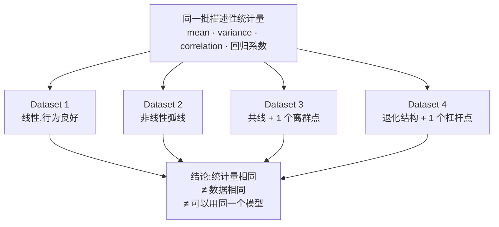

这条教训直接对应 Week 2 的 **Phase 3 Model Planning**:你从图上看出的是线性还是非线性关系,**直接决定你下一步选什么模型**。Anscombe 四重奏说明,这个判断只能靠图,不能靠统计量。

---

## §3 用可视化抓脏数据 (Dirty Data)

### 3.1 什么是脏数据,为什么它是 Phase 2 的头等大事

**脏数据 (dirty data)** 指的是那些**与常识、领域知识或数据本身的语义不相容**的记录——错值、缺失被填成了某个占位符、单位错乱、被人为截断的值,等等。讲师把它和 **anomaly / outlier** 放在一起讲:它们的共同点是"不符合我们对这份数据的启发式认知"。

slides 给了三步走的处理流程:

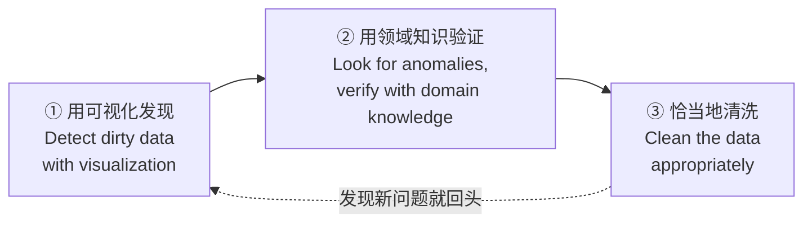

注意中间那一步**不能跳过**。图只能告诉你"这儿不对劲",**它不能告诉你为什么不对劲,也不能告诉你该怎么处理**。这就是为什么 Week 2 的 **Phase 1 Discovery** 要先建立领域知识、要和干系人对话——讲师在这里明确把两讲串了起来:*"这就是为什么在第一步,我们要求数据科学家去获取背景信息。"*

### 3.2 例一:账户持有人的年龄分布

```r
hist(age, breaks=100,
     main="Age Distribution of Account Holders",
     xlab="Age", ylab="Frequency", col="gray")
```

**直方图 (histogram)** 是可视化单变量分布最基本的工具:把取值范围切成若干个**箱 (bin)**,数一数每个箱里落了多少个样本,画成柱子。这里 `breaks=100` 表示大致切成 100 个箱。

图的主体部分很正常:**20 到 60 岁之间是绝大多数**,小于 20 和大于 80 的数量急剧下降——这符合"银行账户持有人"的常识。

但有两处不对劲,讲师逐一点破:

1. **$age = 0$ 处有一根接近 400 的巨大尖峰。** 400 个账户持有人年龄为 0?显然不可能。**最可能的解释是:这些账户在录入时年龄字段为空,而操作员或系统用 0 填充了未知值。** 也就是说,这 400 个 0 实际上是**伪装成数值的缺失值 (missing value)**。
2. **还有一小撮负值。** 年龄不可能为负。**最可能的解释是:$-1$、$-2$ 之类被用作错误码或特殊状态标记。**

这两个发现的杀伤力在于:如果你不处理就直接算 `mean(age)`,那 400 个 0 和一堆负数会把平均年龄显著拉低——**你的所有下游分析都建立在一个错的中心值上**。而如果你只看 `describe()` 的输出,你看到的只是一个"看起来还算合理"的 mean,**你根本不会知道这件事发生了**。

讲师还提到图上另有一处约 110 岁的小凸起值得核查——不一定是错的(确实有超高龄客户),但**"值得双重确认"**。这正是"用领域知识验证"那一步的实际含义。

### 3.3 例二:抵押贷款的账龄分布

```r
hist(mortgage, breaks=10, xlab="Mortgage Age", col="gray",
     main="Portfolio Distribution, Years Since Origination")
```

这张图画的是投资组合里每笔抵押贷款"已经存在了多少年"。1 到 8 年的分布还算平缓,但**第 9–10 年出现了一个异常高的堆积**。

讲师给的解释:**这份数据很可能根本不追踪超过 10 年的账龄——所有 10 年以上的贷款都被一律记成 10。** 于是"10 年"这个箱里装的其实是"10 年及以上"的全部贷款,自然高得离谱。

> 📎 **拓展(超出 slides)** — 这种现象在统计上叫 **censoring(删失)** 或 **top-coding(顶端编码)**:超出记录上限的值被统一压到上限值。它和上一例的"0 值伪装缺失"是同一类问题的两面——**数据里的某个具体数值其实不表示它字面的意思**。识别它们的唯一实用方法就是画图然后问"这个尖峰凭什么这么高?"

如果不处理会怎样?讲师说得很直接:**"it will affect your data analytics, give you misleading result."** 比如你想估计"贷款平均存续多久",这份被截断的数据会给你一个系统性偏低的答案。

**本节的方法论要点**:直方图上任何**孤立的尖峰**、**不该存在的取值区间**(负数、0)、**边界处的堆积**,都是数据质量的警报。看图的时候不要只看主体形状,**要专门去看边界和异常尖峰**。

---

## §4 单变量可视化工具箱

讲师说:"我们已经见过直方图了,但其实还有更多。"这一节把单变量的常用图一次过完。

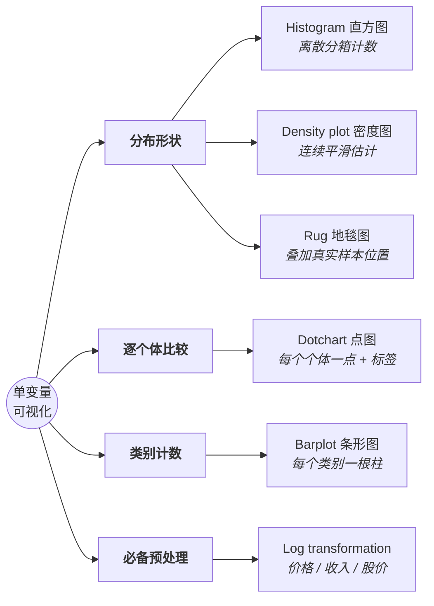

### 4.1 Dotchart 与 Barplot:两种最朴素的图,用途完全不同

```r
## Dotchart 与 Barplot ##
dotchart(mtcars$mpg, labels=row.names(mtcars), cex=.7,
         main="Miles Per Gallon (MPG) of Car Models", xlab="MPG")

barplot(table(mtcars$cyl),
        main="Distribution of Car Cylinder Counts",
        xlab="Number of Cylinders")
```

`mtcars` 是 R 自带的经典数据集,每一行是一款车型(Volvo、Ferrari、Ford、Fiat、Mazda……),列里有 `mpg`(每加仑英里数,油耗指标)、`cyl`(气缸数)等。

**Dotchart(点图)** 把**每一个个体**画成一个点,纵轴是个体名称,横轴是数值,还有虚线牵引视线。讲师强调它的价值:**"你能非常清楚地看出关系"**——比如丰田的车 MPG 普遍偏高,而 Lincoln Continental 和 Cadillac Fleetwood 的 MPG 最低。**当你需要"逐个体比较并且要知道每个点是谁"时,dotchart 比直方图强得多**——直方图会把个体身份完全抹掉。

**Barplot(条形图)** 画的是**类别的计数**。`table(mtcars$cyl)` 先把车按气缸数分成 4、6、8 三类并计数,`barplot` 再把三个计数画成三根柱子。

这两者和直方图的区别值得单独记住,因为容易考:

| 图 | 横轴是什么 | 每根柱/点代表什么 | 适用变量类型 |
|---|---|---|---|
| **Histogram** | 数值区间(bin) | 落在该区间的样本**数量** | 连续数值型 |
| **Barplot** | 离散类别 | 该类别的样本**数量** | 类别型 (categorical) |
| **Dotchart** | 数值 | **单个个体**的取值 | 数值型 + 有个体标签 |

一句话:**直方图的柱子之间是连续的(所以通常紧挨着),条形图的柱子之间没有顺序关系(所以通常分开画)。**

### 4.2 Density plot 与 Rug:比直方图更细腻的分布视图

**密度图 (density plot)** 可以理解成"直方图的平滑连续版":它不分箱,而是估计出一条平滑曲线来描述"数据在每个取值附近有多密"。好处是不受分箱数量的任意影响,曲线的峰、谷、肩看得更清楚。

```r
plot(density(log10(income), adjust=0.5),
     main="Distribution of Income (log10 scale)")
rug(log10(income))     # 在 x 轴上加"地毯"
```

**Rug(地毯图)** 是讲师特别介绍的一个小技巧:在坐标轴上用一排**细小的竖线**标出**每一个真实样本的位置**。它的价值在于:密度曲线是"估计出来的",而 rug 是"真实数据在哪儿"。两者叠加,你就能看出**曲线的某一段是由很多样本支撑的,还是只有稀稀拉拉几个点**——讲师原话:某些区域"数据分散",某些区域"点显著重叠"。

而且它**几乎不占地方**:"rug 是一种紧凑的方式,能在不占用大量绘图面积的前提下展示额外信息。"

### 4.3 关键技巧:什么时候必须做 log transformation

这是本节最实用、也最容易在实操中吃亏的一点。讲师说得很重:**当你可视化 income、price、stock price 这类变量时,必须留意。**

**问题是什么?** 以收入为例。绝大多数人的收入集中在中低区间;但有一小撮百万富翁、亿万富翁,他们的收入比普通人高**好几个数量级**。于是数据的**取值范围被极少数样本拉得极长**。

直接画直方图会发生什么?**横轴必须覆盖到最大值,于是 99% 的数据被压缩进最左边一条窄缝里,内部结构完全看不见**——你只看得到一根贴着 0 的高柱和一条长长的空尾巴。

**解法:取对数再画。**

```r
hist(income, breaks=500, xlab="Income", main="Histogram of Income")     # 挤成一团
plot(density(log10(income), adjust=0.5),
     main="Distribution of Income (log10 scale)")                       # 结构浮现
rug(log10(income))
```

为什么有效?因为 $\log_{10}$ 把**乘法关系变成加法关系**:收入从 1 万到 10 万(10 倍)和从 10 万到 100 万(10 倍),在原始坐标上一个跨度是 9 万、另一个是 90 万,差 10 倍;取对数后**两段都是 1 个单位**。于是长尾被压回来,中低区间被拉开,**每一个数量级都获得同样的显示空间**。

> **🔑 记忆规则** — 变量若满足以下任一条,先考虑 log transformation:
> - 取值跨越**多个数量级**(收入、价格、市值、人口、网站访问量);
> - 分布**严重右偏**(长尾拖在右边);
> - 你关心的是**倍数变化**而不是绝对差值。

### 4.4 Unimodal 还是 Multimodal:对数变换能救回来的信息

slides S16 用钻石价格演示了同一件事的另一个后果。

```r
# 原始价格的分组密度图
ggplot(niceDiamonds, aes(x=price, fill=cut)) + geom_density(alpha=.3, color=NA)

# log10 价格的分组密度图
ggplot(niceDiamonds, aes(x=log10(price), fill=cut)) + geom_density(alpha=.3, color=NA)
```

这里按 `cut`(切工等级)把钻石分组,每组画一条半透明的密度曲线(`alpha=.3` 让曲线互相叠加时都能看见)。

直接用 `price` 画:所有曲线都挤在左端,**看上去每组都只有一个峰**。换成 `log10(price)` 再画:讲师描述得很具体——**"我们能看到一个峰、两个峰……1、2、3 个峰"**,原本被压扁的多峰结构全部浮现出来。

这引出一对术语:

- **Unimodal(单峰)**:分布只有一个峰。通常暗示数据来自**一个同质的群体**。
- **Multimodal(多峰)**:分布有两个或更多峰。通常暗示数据里**混合了若干个子群体**——比如不同切工等级、不同市场、不同时期的钻石各自有各自的价格中心。

**为什么这个判断重要?** 因为它直接影响 Phase 3 的建模决策:如果你的数据是多峰的,却用一个单峰模型(比如单个高斯分布)去拟合,模型会把峰之间的谷底当成"平均水平",得到一个**没有任何真实样本落在附近**的中心。多峰意味着你可能需要**分组建模**或**混合模型 (mixture model)**。

而这一切的前提是:**你得先看得见那几个峰**。看不见的原因往往仅仅是——没取对数。

---

## §5 多变量可视化:看变量之间的关系

单变量图告诉你"每个变量长什么样",但数据分析真正关心的通常是**变量之间的关系**。这一节的所有图都在回答同一类问题:$X$ 和 $Y$ 是怎么联动的?

### 5.1 散点图 + 拟合线:线性还是非线性?

```r
x <- runif(75, 0, 10)                              # 0~10 之间 75 个均匀分布随机数
x <- sort(x)
y <- 200 + x^3 - 10 * x^2 + x + rnorm(75, 0, 20)   # 三次多项式关系 + 噪声

lr   <- lm(y ~ x)        # 线性回归 linear regression
poly <- loess(y ~ x)     # LOESS 局部多项式回归
fit  <- predict(poly)    # 得到非线性拟合值

plot(x, y)
# 画线性回归的拟合直线:截距 + 斜率 * x
points(x, lr$coefficients[1] + lr$coefficients[2] * x, type="l", col=2)
# 画 LOESS 的拟合曲线
points(x, fit, type="l", col=4)
```

代码逻辑值得逐句读一遍,因为它把"同一份数据、两种建模视角"摆在了一张图上:

- `runif(75, 0, 10)` 造 75 个 0–10 的 $x$;
- $y$ 被**故意**定义成 $x$ 的三次多项式再加噪声——**所以真实关系是非线性的**;
- `lm(y ~ x)` 是 **linear model(线性回归)**,它只能拟合一条直线 $y = a + bx$;`lr$coefficients[1]` 是截距 $a$,`[2]` 是斜率 $b$;
- `loess(y ~ x)` 是 **LOESS(locally estimated scatterplot smoothing,局部多项式回归)**。讲师称它为"local polynomial approximation":它**不假设全局的函数形式**,而是在每个位置只用附近的点拟合一小段多项式,再把这些局部拟合串成一条光滑曲线。

结果:**红色直线**(线性回归)在中段系统性地偏离数据;**蓝色曲线**(LOESS)贴合了数据真实的弯曲走势。

这张图的教学意义:**同一份数据,画原始点、画线性拟合、画非线性拟合,是三种不同的"探索视角"**。散点图告诉你有关系,拟合线告诉你这个关系**是什么形状**——而形状决定了你在 Phase 3 该选线性模型还是非线性模型。

> 📎 **拓展(超出 slides)** — 为什么不直接用 LOESS 建模就好了?因为 LOESS 是**探索工具而非预测模型**:它没有全局参数、无法外推到数据范围之外、也不给你可解释的系数。它的正确用法是**在 EDA 阶段帮你看清关系的形状**,然后你据此选择一个合适的参数化模型。

### 5.2 用颜色和分组增加维度

一张二维图最多画两个变量——除非你用**颜色、形状、分组**当作额外的维度。

```r
cars <- mtcars[order(mtcars$mpg),]   # 按 mpg 排序
cars$cyl <- factor(cars$cyl)         # 分组变量必须是 factor(因子/类别型)
cars$color[cars$cyl==4] <- "red"
cars$color[cars$cyl==6] <- "blue"
cars$color[cars$cyl==8] <- "darkgreen"

dotchart(cars$mpg, labels=row.names(cars), cex=.7, groups=cars$cyl,
         main="Miles Per Gallon (MPG) of Car Models\nGrouped by Cylinder",
         xlab="Miles Per Gallon", color=cars$color, gcolor="black")
```

slides 上给这张图的注解是:**"Use color as an additional dimension for visualization."**

发生了什么:原本 dotchart 只画一个变量(mpg),现在**按气缸数分成三个区块**,每个区块内部再按 mpg 排序,并且**用颜色重复编码组别**。于是这张图同时呈现了两个变量:`mpg`(位置)和 `cyl`(分组 + 颜色)。你不仅能比较个体,还能一眼看出"4 缸车整体 MPG 更高"这个**组间规律**。

有一个 R 的技术点要记:**分组变量必须先转成 `factor`**(`cars$cyl <- factor(cars$cyl)`)。因为 `cyl` 原本是数字 4/6/8,R 会把它当连续数值处理;转成 factor 才等于告诉 R"这是三个类别,不是三个数"。

### 5.3 分组条形图:两个类别变量的联合分布

```r
counts <- table(mtcars$gear, mtcars$cyl)   # 列联表:行=挡位数,列=气缸数
barplot(counts, main="Distribution of Car Cylinder Counts and Gears",
        xlab="Number of Cylinders", ylab="Counts",
        col=c("#0000FFFF", "#0080FFFF", "#00FFFFFF"),
        legend = rownames(counts), beside=TRUE,
        args.legend = list(x="top", title="Number of Gears"))
```

`table(mtcars$gear, mtcars$cyl)` 生成一张**列联表 (contingency table)**:行是挡位数(3/4/5),列是气缸数(4/6/8),每个格子是同时满足这两个条件的车型数量。

`beside=TRUE` 是关键参数:它让同一个气缸数下的三个挡位柱子**并排 (side-by-side)** 画,而不是堆叠 (stacked)。并排更适合**组内比较**,堆叠更适合看**组的总量**。

slides 上写了一行算式 **11 (1+8+2) + 7 (2+4+1) + 14 (12+0+2) = 32** —— 这是在验算:4 缸车共 11 辆(3 挡 1 辆、4 挡 8 辆、5 挡 2 辆),6 缸 7 辆,8 缸 14 辆,加起来 32,正好等于 `mtcars` 的总行数。**这个小验算本身是个好习惯:分组计数之和必须等于总样本数,否则你的分组逻辑漏了数据。**

### 5.4 箱线图 (Box-and-Whisker Plot):把五数概括画出来

这是讲师称为"非常强大而且很漂亮"的一种可视化,也是**唯一一个把 §1 的五数概括直接画成图形**的工具。**期末很可能考它的构造。**

```r
DF <- read.csv("c:/data/zipIncome.csv", header=TRUE, sep=",")

# 先剔除极端值
DF <- subset(DF, DF$MeanHouseholdIncome > 7000 & DF$MeanHouseholdIncome < 200000)
summary(DF)

library(ggplot2)
ggplot(data=DF, aes(x=as.factor(Zip1), y=log10(MeanHouseholdIncome))) +
  geom_point(aes(color=factor(Zip1)), alpha=0.2, position="jitter") +
  geom_boxplot(outlier.size=0, alpha=0.1) +
  guides(colour=FALSE) +
  ggtitle("Mean Household Income by Zip Code")

# 极简版本
boxplot(log10(MeanHouseholdIncome) ~ Zip1, data=DF)
title("Mean Household Income by Zip Code")
```

*(这个 `zipIncome.csv` 就放在本课的 slides 目录里,讲师鼓励你自己跑一遍。)*

代码里有三个值得注意的动作:

1. **又是 log10**——因为纵轴是家庭收入,正是 §4.3 说的典型长尾变量;
2. **`subset(...)` 先剔除了收入低于 7000 或高于 200000 的记录**,这是人为设定的合理区间;
3. **`position="jitter"`**——**抖动**。讲师专门解释了这个参数:每个点的横坐标被加上一个小随机扰动,把原本会完全重合的点摊开。他建议你把它改成 `identity`(不抖动)对比一下:**宽度会立刻收缩成一条极窄的线,什么都看不清**。

**箱线图本身怎么读**(这是重点):

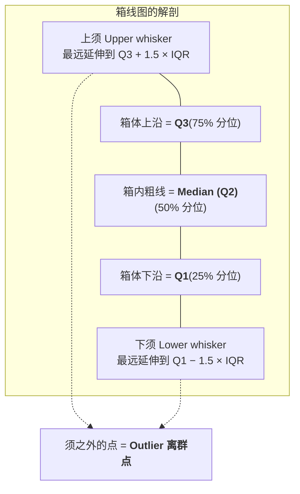

- **箱体 (box)** 的上下沿分别是 **Q3** 和 **Q1**,所以**箱的高度就是 Q3 − Q1**,这个量叫 **IQR (interquartile range,四分位距)**,它衡量数据中间 50% 的分散程度;
- 箱中间那条**粗线是中位数 (median, Q2)**;
- 上下伸出的两条线叫 **whisker(须)**。讲师给出的规则是:**须的长度典型地取 1.5 倍的 IQR**(即箱高的 1.5 倍)。所以**箱越矮,须也越短**——两者是联动的;
- **落在须之外的点被视为 outlier(离群点)**。

讲师顺带解释了为什么这张图上看不到离群点:**因为代码在第一步就用 `subset` 把极端收入剔除了**,而且 `outlier.size=0` 还额外抑制了 boxplot 自己画离群点。他建议:**如果你想看到离群点,就把那行剔除代码去掉再跑一次。**

> 📎 **拓展(超出 slides)** — 精确一点:标准箱线图的须并不是"画到 Q3 + 1.5·IQR 就停",而是**延伸到"仍在 Q3 + 1.5·IQR 以内的最远的那个真实数据点"**;超出这个界限的点才单独画成离群点。所以须的末端总是落在某个真实观测上。1.5 这个系数是 John Tukey 的经验选择——对正态数据而言,大约只有 0.7% 的点会被标成离群点,既不过于宽松也不过于严苛。**注意:被标为 outlier ≠ 是错误数据。**Week 2 反复强调过:**不要随手删除 outlier,它可能正是你要找的信息。**

箱线图最大的价值是**并排比较多个组**:上面这张图为每个邮编区 (`Zip1`) 画一个箱子,于是不同地区的收入水平、离散程度、偏斜方向可以一次性比完。

### 5.5 Hexbin Plot:当数据太多,散点图会"糊掉"

```r
plot(log10(MeanHouseholdIncome) ~ MeanEducation, data=DF)
abline(lm(log10(MeanHouseholdIncome) ~ MeanEducation, data=DF), col='red')

install.packages("hexbin")
library(hexbin)
hexbinplot(log10(MeanHouseholdIncome) ~ MeanEducation, data=DF,
           trans = sqrt, inv = function(x) x^2, type=c("g", "r"))
```

**问题是什么?** 当样本量非常大且高度集中时,普通散点图会发生**过度绘图 (overplotting)**:点叠点叠点,整片区域**变成一坨纯黑**。讲师说得很直接:*"你在这个区域看不到任何信息。"* 因为黑色区域里,一个点和一万个点看起来一模一样。

**Hexbin plot 怎么解决?** 它把平面切成许多**六边形 (hexagon) 的小格子**,数一数每个格子里落了多少点,然后**用颜色深浅编码这个计数**。于是:

- 深色 = 该区域数据极密(讲师读图时说,最深的对应 7000 以上);
- 浅色/绿色 = 该区域只有零星几个点(大约 1 个)。

**密度信息被恢复了**,你能清楚看出"这一块高度集中,往外逐渐稀疏"。

参数解释:

| 参数 | 作用 |
|---|---|
| `trans = sqrt` | 对计数做**平方根变换**再映射到颜色。理由和 log 变换同源:计数从 1 到 7000 跨度太大,直接线性映射的话,除了最密的核心之外全是同一种浅色。开方**压缩了动态范围**,让中等密度也能被区分出来 |
| `inv = function(x) x^2` | `trans` 的**逆函数**,用于把图例上的颜色刻度**换算回真实计数**——否则图例上标的就是开方后的数,读不懂 |
| `type = c("g", "r")` | `"g"` 加**网格 (grid)**,`"r"` 加**回归线 (regression line)** |

**什么时候该用它?** 讲师给了明确的触发条件:**当你有大量数据,并且它们高度集中在某个小区域时,就该用 hexbin plot。**

那条红色/回归直线在两张图上都有,它拟合的是 `MeanEducation`(平均受教育程度)与 `log10(MeanHouseholdIncome)` 的线性关系——**教育水平与收入的正相关**,这是这份数据想讲的故事,而 hexbin 让你在看清趋势的同时也看清了密度。

### 5.6 Scatterplot Matrix:四个以上变量怎么办

```r
colors <- c("red", "green", "blue")
pairs(iris[1:4], main = "Fisher's Iris Dataset",
      pch = 21, bg = colors[unclass(iris$Species)])
par(xpd = TRUE)
legend(0.2, 0.02, horiz = TRUE, as.vector(unique(iris$Species)),
       fill = colors, bty = "n")
```

**Fisher's Iris dataset(鸢尾花数据集)** 是统计学与机器学习里最著名的数据集之一,R 自带(直接 `iris` 就能用)。它包含三种鸢尾花——**setosa、versicolor、virginica**——每种 50 个样本,每朵花用 **4 个特征**描述:**sepal length(萼片长)、sepal width(萼片宽)、petal length(花瓣长)、petal width(花瓣宽)**。

现在的问题是:**4 个特征,两两之间的关系怎么一次看完?**

**散点图矩阵 (scatterplot matrix)** 的做法是画一个 $4 \times 4$ 的网格:

- **对角线**放特征名称(一个特征和它自己的关系没有意义);
- **非对角线的每个格子**是一对特征的散点图;
- **点的颜色编码类别**(三种鸢尾花对应红/绿/蓝)。

于是一张图同时给了你:每一对特征的**相关性**、数据的**分布形状**,以及**三个类别在各个特征平面上是否可分**。最后这一点尤其有价值——你会立刻看出 setosa 在 petal 相关的图上和另外两类**完全分开**,而 versicolor 与 virginica 有重叠。**这直接告诉你分类问题的难度在哪里。**

讲师给出了适用边界:**"当你的特征数量较少时,这是理解特征间关系的好方法。"** 反过来说,特征一多($4\times4=16$ 个格子还能看,$20\times20=400$ 个就没法看了),散点图矩阵就失效了——那时需要降维方法。

### 5.7 多变量可视化方法速查

| 方法 | 处理的变量 | 最适合的场景 | 关键点 |
|---|---|---|---|
| **Scatterplot + lm/LOESS** | 2 个数值 | 判断关系是线性还是非线性 | LOESS 不假设全局函数形式 |
| **Grouped dotchart + color** | 1 数值 + 1 类别 | 逐个体比较,同时看组间差异 | 分组变量必须是 `factor` |
| **Grouped barplot** | 2 个类别 | 两个类别变量的联合计数 | `beside=TRUE` 并排,便于组内比较 |
| **Box-and-whisker plot** | 1 数值 + 1 类别 | 多组之间比较分布与离散度 | 箱=Q1/Q2/Q3,须≈1.5×IQR,外为 outlier |
| **Hexbin plot** | 2 个数值,**大样本** | 散点图糊成一团时 | 用颜色编码密度;`trans` 压缩动态范围 |
| **Scatterplot matrix** | 3–6 个数值 | 一次看完所有两两关系 | 特征多了就不适用 |

---

## §6 Data Exploration vs. Presentation:图是给谁看的?

slides S23 抛出一个问题:**"Presenting the same data to different audience — did we discuss this issue in the data analytics lifecycle?"**

答案是:讨论过,在 **Week 2 的 Phase 5 Communicate Results**。当时的结论是"**受众层级越高,演示越要简洁**,不要用同一套材料讲给所有人"。这一节把那条原则具体落到图上。

讲师给的例子是同一份"账户价值分布"数据的两种画法,然后问你:**哪张给你的队友看,哪张给业务方看?**

他给的答案是:

- **给技术队友**看信息密度高的那张——他们理解直方图、密度曲线、分位数,能从技术细节里读出东西;
- **给业务用户 / CEO** 看简化的那张——他们**没有深厚的技术背景**,你需要的是"一眼看懂",而不是"信息完整"。

这背后是一个容易被技术人员忽略的判断:**"信息更多"和"沟通更有效"不是一回事,有时甚至相反。** 一张塞满了统计细节的图,对不懂统计的受众来说传达的信息量可能是**零**——因为他们不会读,索性不读。

| | **Exploration(探索)** | **Presentation(呈现)** |
|---|---|---|
| **受众** | 你自己、数据团队 | 干系人、业务方、管理层 |
| **目的** | 发现:找模式、找异常、找关系 | 说服:传达一个已确定的结论 |
| **信息密度** | 越高越好,宁可杂乱 | 越低越好,只留必要 |
| **图的数量** | 很多,快速迭代、随手画 | 很少,精心打磨 |
| **可以接受** | 默认配色、无标题、代码直出 | 必须有清晰标题、标注、单位、结论 |

讲师的收尾:**"visualization is also useful to deliver a better presentation."** 可视化不只是分析工具,也是沟通工具——而这两种用法要求你画**不同的图**。

---

## Part I 小结:讲师自己划的重点

讲师在中场休息前对前半部分做了总结,以下四条是他亲口点名的:

1. **不能简单依赖 five-number summary** —— Anscombe 四重奏就是活证据,统计量相同的四份数据可以完全不同;
2. **可视化工具箱要熟**:bar chart、dot chart、histogram、density、rug、scatterplot、boxplot、hexbin、scatterplot matrix;
3. **可视化 price / income 这类变量时,要考虑用 logarithm**,否则看不到细节结构;
4. **数据量大且高度集中时,要考虑 hexbin plot**,它能给你局部密度信息;
5. 以及,**可视化能帮你做出更好的汇报**。

---

# Part II · 判断差异:Statistical Methods for Evaluation

## §7 问题的提出:"新的均值更大"到底能不能说明问题?

### 7.1 两个场景

slides S24 用两个场景开场,它们看起来毫不相干,但骨架完全一样:

> **场景 1** — 一家公司收集了客户满意度数据,想知道**改动产品设计**是否提升了客户满意度。公司怎样才能确认这次改动确实产生了预期效果?
>
> **场景 2** — 一位数据科学家部署了一个机器学习模型并得到一组结果,想知道**改动模型架构**是否会改善结果。数据科学家怎样才能确定修改后的模型确实带来了提升?

抽象一下,两者都是:**我做了一个改动,改动前后各得到一批数据,我想知道这个改动到底有没有效果。**

这是数据分析中最常见的问句之一。你在 Week 2 学的每一个阶段都会撞上它:Phase 3 选特征时问"加这个变量有用吗",Phase 4 调模型时问"这个架构更好吗",Phase 6 部署后问"新系统真的提升了业务指标吗"。

### 7.2 朴素解法,以及它为什么不够

最直觉的做法(slides S25):**算改动前的均值,算改动后的均值,比一比。**

```
改动前满意度均值 = 6.8
改动后满意度均值 = 7.1
→ 7.1 > 6.8,所以改动有效。
```

于是 slides 抛出了本讲后半部分的核心问题:

> **Would it be correct to state that if the new mean is larger than the old mean value then the new product or model is better than the old?**
> (如果新均值大于旧均值,就断言新产品/新模型更好——这样说对吗?)

**答案是:不对。** 讲师给的理由只有一句话,但这句话是整个 Part II 的种子:

> **"Mean is not enough. We also need to consider the variation, or the standard deviation of the data."**
> (只看均值不够,我们还必须考虑数据的**变异**,也就是标准差。)

### 7.3 为什么方差决定一切:两幅图的对比

slides S27 给出了一个精心构造的反例。设想两个总体,一个均值为 $-3$,另一个均值为 $+3$。**均值差固定是 6。** 现在问:这个差异显著吗?

讲师的回答是:**取决于方差。** slides 并排画了两种情况:

- **左图:方差很小。** 两个分布各自紧紧地聚在自己的均值附近,中间几乎不重叠。这时你会很有信心地说:**这两个总体确实不一样。**
- **右图:方差很大。** 两个分布都摊得很开,大片区域互相重叠。讲师说他"会有点犹豫"去宣称它们不同——因为**你从左边总体里随便抽一个样本,它落在右边总体的典型范围内是完全正常的事**。

slides S31 把这个直觉提炼成三句可以直接背的话:

> - **两个总体的重叠 (overlap) 越大**,当且仅当**均值越接近**(横轴方向)**且方差越大**;
> - **重叠越大,两个总体之间差异的显著性 (significance) 越低**;
> - 因此,**如果重叠很大,我们就接受 null hypothesis;否则就拒绝它。这可以用 Student's t-test 来检验。**

讲师把结论说成了一个比值,这句话请务必记住,因为**本讲后面每一个检验统计量都是它的具体形式**:

> **我们不能只看均值差,我们要看均值差 *相对于* 变异有多大——要看它们的比值。**

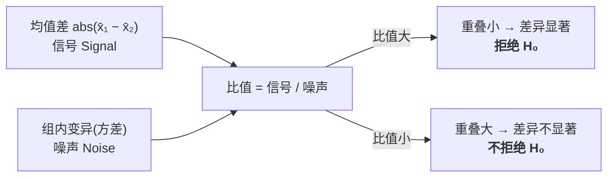

**这张图是 Part II 的总纲。** t 统计量、Welch 统计量、F 统计量,全都是"信号 / 噪声"这一个模板的不同填法。

### 7.4 统计学为什么贯穿整个生命周期

在展开技术细节前,slides S26 先回答了"为什么这门课要讲统计":**因为统计方法可能出现在 Data Analytics Lifecycle 的每一处。**

| 生命周期位置 | 统计在做什么 | 典型问句 |
|---|---|---|
| **初期数据探索与数据准备**(Phase 1–2) | 描述性统计、分布检查、异常检测 | 数据长什么样?标准差多大? |
| **模型规划与构建**(Phase 3–4) | 选择最佳输入变量、评估可预测性 | 哪些变量真的有用? |
| **最终模型的评估**(Phase 4–5) | 准确率是否显著优于随机猜测或另一个模型 | 它真的比 baseline 好吗? |
| **模型部署后的评估**(Phase 6) | 预测是否可靠?是否产生了预期效果? | 上线之后真的有影响吗? |

讲师补了一句:**上面每一格里的"是否更好"、"是否有用"、"是否有影响",本质上都是同一个统计问题——假设检验。** 所以他用假设检验作为这一整套统计方法的代表来讲。

---

## §8 两个必须先说清的词:Population 与 Sample

这两个词在后面每一页都会出现,而讲师专门停下来解释了它们,说明他知道学生容易混。

- **Population(总体)**:**我们真正关心的那个群体**。讲师强调它常常是一个**抽象概念**。例子:"我想知道**所有 UOW 学生**的身高分布"——这里"所有 UOW 学生"就是总体。
- **Sample(样本)**:**我们实际观测到的那部分数据**,通常是从总体中**随机抽取**的。例子:你不可能量遍每个学生,所以你随机找了 100 或 200 个人量——这 200 人就是样本。

讲师的总结句:**"Population is an abstract concept. Usually we work on samples, and the sample is the observed data we randomly sampled from the population."**

这个区分为什么至关重要?因为**假设检验的全部意义,就是从有限的样本出发,对无法完整观测的总体下结论,并且诚实地量化"我可能搞错"的概率。** 你算出的样本均值 $\bar{x}$ 几乎肯定不等于总体真值 $\mu$;你要回答的不是"两个样本均值一样吗"(几乎必然不一样),而是"**两个总体均值一样吗**"。

| | Population(总体) | Sample(样本) |
|---|---|---|
| 是什么 | 我们关心的全体 | 实际拿到手的观测 |
| 能否完整观测 | 通常不能 | 能 |
| 均值记号 | $\mu$(参数,未知定值) | $\bar{x}$(统计量,随抽样波动) |
| 方差记号 | $\sigma^2$ | $s^2$ |
| 在检验中的角色 | **假设是关于它的** | **证据是来自它的** |

> **❓ 课堂留给你的问题(S29)** — *为什么假设检验会出现在 BDA 生命周期的 **Phase 2 Data Preparation**?*
> slides 给的提示是:*"Hypothesis testing is used to assess the plausibility of a hypothesis by using sample data. Such data may come from a larger population, or from a data-generating process."*
> 思路:Phase 1 Discovery 结束时你已经**形成了初始假设 (initial hypotheses)**;而 Phase 2 是你**第一次真正接触到数据**的阶段。所以 Phase 2 天然是"用样本数据初步检验这些假设是否站得住"的时机——如果初始假设在数据面前立刻崩了,你应该**回到 Phase 1 重新框定问题**,而不是带着一个错的假设一路做到 Phase 4。讲师说,生命周期里**至少有两处**提到 hypothesis,他要你自己去 Week 2 的 slides 里找出来。

---

## §9 假设检验的逻辑

### 9.1 定义与两个假设

slides S28 给出的定义:

> **Definition (Hypothesis):** a supposition or proposed explanation made on the basis of limited evidence as a starting point for further investigation.
> (假设:基于有限证据提出的一个猜想或解释,作为进一步研究的**起点**。)

注意"**starting point**"这个词。假设不是结论,它是**待检验的出发点**。所以 slides 强调:**"A hypothesis is formed before validation. It can define expectations."** —— **假设必须在你看数据之前形成。**

> 📎 **拓展(超出 slides)** — 为什么"先形成假设"这件事被反复强调?因为如果你先翻数据、看见一个有趣的差异、再回过头把它写成"假设"然后检验它,你**必然**会得到显著的结果——你是从噪声里挑出最像信号的那一块再去问"这是信号吗"。这种做法有个名字叫 **HARKing** (Hypothesizing After the Results are Known),它是科研可重复性危机的主要成因之一。**流程顺序本身就是方法论的一部分。**

**假设检验 (hypothesis testing)** 的做法用一句话讲:**form an assertion and test it with data**(提出一个论断,然后用数据检验它)。它总是成对出现两个假设:

- **Null hypothesis(零假设 / 原假设),记作 $H_0$** —— **常规假设是"没有差异"**(common assumption: there is no difference)。
- **Alternative hypothesis(备择假设),记作 $H_A$ 或 $H_1$** —— $H_0$ 的对立面。

### 9.2 为什么零假设总是"没有差异"?法庭类比

这是学生最常问的一点,讲师给了两层回答。

**第一层(逻辑上的):** 科学要求证据。**如果你想主张一个改变确实发生了,举证责任在你。** 所以最简单、最保守的做法是:先假定"什么都没发生",然后**让数据来挑战它、推翻它**。

**第二层(讲师给的类比,非常好用):**

> 想象一间法庭。有人被指控犯罪。我们会一上来就假定被告有罪吗?**不会。我们从"被告无罪"开始。检方必须提供证据来推翻这个假定。**

这个类比可以一路对应下去,建议整张表背下来——它把假设检验里最反直觉的几个点全解释了:

| 法庭 | 假设检验 |
|---|---|
| 无罪推定 | $H_0$:没有差异 |
| 指控 | $H_A$:存在差异 |
| 检方的证据 | 样本数据 |
| "排除合理怀疑"的门槛 | 显著性水平 $\alpha$ |
| **判决"有罪"** | **拒绝 $H_0$** |
| **判决"无罪"(即"证据不足")** | **不拒绝 $H_0$** |
| 冤枉了一个无辜的人 | **Type I error(一类错误)** |
| 放走了一个真凶 | **Type II error(二类错误)** |

**这个类比顺带解释了一个关键细节:法庭判"无罪"并不等于证明了被告清白,只表示"检方没能拿出足够的证据"。** 同理——

### 9.3 两种结局(而且只有两种)

slides S30 说得很明确,假设检验的产出只有两种:

- **拒绝 $H_0$,转而支持 $H_A$** (reject the null hypothesis in favour of the alternative);
- **不拒绝 $H_0$** (not reject the null hypothesis)。

> 📎 **拓展(超出 slides)——一个措辞上的坑,值得知道**
> 你会在 slides S36 上看到 **"$H_0$ is accepted"** 这样的表述,讲师口头也说过"accept the null hypothesis"。**考试请按 slides 的说法作答**,但你应该知道统计学上更严谨的说法是 **"fail to reject $H_0$"(未能拒绝 $H_0$)**。
> 区别在哪?"接受"暗示"我们证明了没有差异";但实际情况可能只是**样本太小、噪声太大,以至于就算真有差异我们也看不出来**。就像法庭的"无罪"判决不等于"证明清白"。**"没有找到证据"和"证明了不存在"是两回事。**

### 9.4 写出 $H_0$ 和 $H_A$:这是必考的基本功

讲师说了一句很实在的话:**"对每个人来说,如果我给你一个问题,你需要能够清楚地陈述出零假设和备择假设。只要你理解了这一点,这其实相当直接。"**

slides 与转录里给出的例子汇总如下:

| 场景 | $H_0$(没有差异) | $H_A$(有差异) |
|---|---|---|
| **药物 A vs 药物 B 对患者的疗效**(S28) | 药物 A 与药物 B 在疗效上**没有差异** | 药物 A 与药物 B 在疗效上**有差异** |
| **新模型 X 的预测准确度**(转录) | 模型 X 的预测**不优于**现有模型 / 两者**没有差异** | 模型 X 的预测**优于**现有模型 |
| **回归中某个变量是否有用**(转录) | 该变量**不影响**结果 | 该变量**影响**结果 |
| **产品改版是否提升满意度**(S24) | 改版前后满意度**没有差异** | 改版前后满意度**有差异** |

**写 $H_0$ 的机械做法**:找出题目里那个"是否有效果/是否更好/是否有关"的主张,**把它的否定写成 $H_0$**,把主张本身写成 $H_A$。

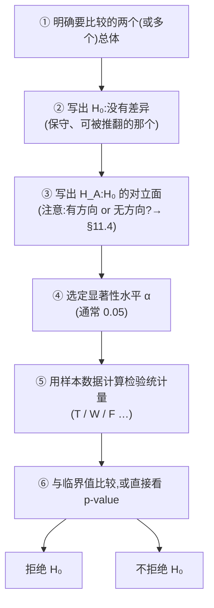

---

## §10 Student's t-test:把"信号 / 噪声"写成公式

### 10.1 一段值得知道的历史

讲师讲了个小故事,考试大概不会考,但它能帮你记住这个名字。

**Student's t-test 提出于 1908 年**,距今一百多年。提出者叫 **William Sealy Gosset**,他是**爱尔兰都柏林 Guinness 酿酒厂的一名雇员**——他需要用**小样本**来判断不同批次啤酒原料的质量差异,现有的大样本方法不够用,于是他自己推导了一套。

那为什么叫 "Student"?因为**Guinness 有严格的商业机密政策,禁止员工以真名发表**,所以 Gosset 用了笔名 **"Student"**。于是这个检验就永远叫 Student's t-test 了。

*(转录里语音识别把年份错成了 "2008",正确年份是 **1908**。)*

### 10.2 统计量长什么样

回到 §7.3 的总纲:**信号 / 噪声**。t 统计量就是它最直接的实现:

$$
T \;=\; \frac{\bar{X}_1 - \bar{X}_2}{\sqrt{S_p^2\left(\dfrac{1}{n_1} + \dfrac{1}{n_2}\right)}}
$$

其中 **pooled variance(合并方差)** 为:

$$
S_p^2 \;=\; \frac{(n_1 - 1)S_1^2 + (n_2 - 1)S_2^2}{n_1 + n_2 - 2}
$$

**逐个符号读一遍**(讲师强调过要能读懂公式在说什么):

| 符号 | 含义 |
|---|---|
| $\bar{X}_1,\ \bar{X}_2$ | 两个样本各自的**样本均值** |
| $S_1^2,\ S_2^2$ | 两个样本各自的**样本方差** |
| $n_1,\ n_2$ | 两个样本各自的**样本量** |
| $S_p^2$ | **合并方差**——把两组的方差按各自自由度加权平均,得到对"共同方差"的一个估计 |
| **分子** | **信号**:两个样本均值的差 |
| **分母** | **噪声**:这个差异本身的标准误差(standard error) |

**这个公式在说什么话?** 用讲师的原话复述:*"T 统计量被构造成一个比值——样本均值之差,除以方差信息。这正是我们讨论的:不能只看均值,要看均值差**相对于**方差的大小。这个比值能更准确地告诉我们两个总体的重叠程度。"*

**为什么可以把两组方差"合并"?** 因为 Student's t-test **假设两个总体的方差相等(但未知)**。既然它们相等,那么用两组数据一起去估计这个共同的方差,显然比只用其中一组更准。这就是 pooled variance 的来历——**它是"等方差假设"的直接产物**。记住这一点,你就能自然推出 §12 的 Welch's t-test 为什么必须换掉这一项。

**操作流程**很直白:

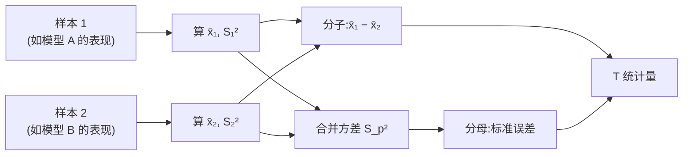

### 10.3 三条核心假设(讲师特别点名,必考)

讲师在讲完公式后停下来,明确列出 **"three core assumptions"**:

| # | 假设 | 含义 | 违反时怎么办 |
|---|---|---|---|
| **1** | **Normality(正态性)** | 每个总体都必须服从**正态分布** | 改用 **Wilcoxon rank-sum test**(§13) |
| **2** | **Equal variance(等方差)** | 两个总体的方差**相等但未知** | 改用 **Welch's t-test**(§12) |
| **3** | **Independence(独立性)** | 数据是 **i.i.d.**(独立同分布);组内与组间的观测必须彼此完全独立 | 需要配对检验或混合模型等其他方法 |

讲师对第一条补了一句:**确实存在更高级的方法来检验一份数据是否服从正态分布,但本课没有时间展开**,所以我们假定你已经知道它是正态的。

> 📎 **拓展(超出 slides)** — 常用的正态性检验有 **Shapiro–Wilk test** 和 **Kolmogorov–Smirnov test**,图形化的做法是画 **Q-Q plot**(把样本分位数对理论正态分位数作图,若近似正态则点应大致落在一条直线上)。**Q-Q plot 其实就是 Part I 那套"先画图"哲学在这里的延续。**

而 **$H_0$ 在这个框架下的精确表述是:两个总体的均值相同**($\mu_1 = \mu_2$)。

### 10.4 T 服从什么分布,以及自由度为什么是 $n_1 + n_2 - 2$

这是整个 Part II 逻辑上最关键的一环,讲师讲得很细,值得慢读。

**问题:** 我算出了一个 $T$ 值,比如 $-1.78$。这算大还是小?我凭什么判断?

**答案:** 因为可以从数学上证明,**在 $H_0$ 成立的前提下**,$T$ 这个随机变量服从一个已知的分布——**t-distribution(t 分布)**,其**自由度 (degrees of freedom) 为 $n_1 + n_2 - 2$**。

一旦知道了分布,"这个值算不算罕见"就变成了一个可以精确计算的概率问题。讲师把这条推理链讲得非常清楚:

> **如果你做了一个假设,却得到了一个荒谬的、极其罕见的结果,那这本身就是信息——它提示你先前做的那个假设可能是错的。于是你就可以带着一定的信心去拒绝零假设。**

这是**反证法的概率版本**。注意它的方向:我们**不能证明** $H_0$ 为真,我们只能说"如果 $H_0$ 为真,我观测到的这件事罕见到什么程度"。

**t 分布长什么样?** 讲师描述:**它看起来像正态分布**——钟形、对称、中心在 0——**但在某些情况下更尖(尾部更厚)**。自由度越小,尾部越厚(小样本时极端值更容易出现);自由度越大,它越接近标准正态分布。

**自由度为什么是 $n_1 + n_2 - 2$?** 讲师给了解释:总共有 $n_1 + n_2$ 个数据点,但**我们为了算这个统计量,已经先从数据里估计了两个均值($\bar{X}_1$ 和 $\bar{X}_2$),每估计一个就"用掉"一个自由度**,所以要减 2。

> **🔑 例(课上给的具体数字)** — 两组各 15 个样本,$n_1 + n_2 = 30$,所以 $df = 30 - 2 = 28$。这个 28 会在 §11.2 里用来查临界值。

### 10.5 决策规则:$|T|$ 越大越可疑

slides S33 给出规则:

> **The further $T$ is from zero, the more significant the difference between the populations. If $|T|$ is large then one would reject the null hypothesis.**

**为什么是 0?** 因为 $H_0$ 说"两个总体均值相同",那么样本均值之差应该在 0 附近波动,$T$ 也就应该在 0 附近。**0 是 $H_0$ 下最典型、最容易观测到的值。**

反过来,$T$ 离 0 越远,说明"要么这两个总体真的不同,要么我运气极差抽到了一个罕见样本"。当远到某个程度,我们宁可相信前者。

注意**要取绝对值**:$T$ 可以是正的(样本 1 均值更大)也可以是负的(样本 2 均值更大)。讲师说得直白:*"我取绝对值,因为它可能偏高也可能偏低,我不在乎方向,我只关心有没有差异。"*(——这句话的前提是我们在做**双侧检验**,见 §11.4。)

---

## §11 做判断:显著性水平 $\alpha$、临界值 $T^*$、$p$-value

### 11.1 显著性水平 $\alpha$ 与一类错误

讲师用一个非常人性化的提问引出这个概念:

> *"如果我拒绝了零假设,我有多大可能是错的?我想保守一点——这可是药物,会影响几百万人,我不想做出错误的宣称。我想把犯错的机会降到最低。"*

这个"犯错的机会"就是 **significance level(显著性水平),记作 $\alpha$**。slides 的正式定义:

> **the probability of rejecting the null hypothesis, when the null hypothesis is actually TRUE.**
> (在零假设**实际为真**时却拒绝它的概率。)

slides 紧跟一句:**(This incurs "Type I Error")** —— 这就是**一类错误**。

用药物例子把它讲活:**真相是药物 A 和药物 B 没有差异,但你错误地宣称它们有差异。** 你"发现"了一个不存在的效果。

**$\alpha = 0.05$ 到底是什么意思?**(这正是 slides 提出的问题)—— 它意味着:**你愿意接受"最多有 5% 的概率,我这次拒绝 $H_0$ 是一次冤案"。**

讲师给出的常用取值:

| $\alpha$ | 场合 |
|---|---|
| **0.05** | 最常见的默认值,statistics 里非常通用 |
| **0.01** | 想更保守、更安全时(如高风险的医学决策) |
| 0.1 | 较宽松的探索性场合 |

### 11.2 从 $\alpha$ 找到临界值 $T^*$,然后比较

slides S34 给出完整的操作规则:

> - Find $T^*$ such that $P(|T| \ge T^*) = \alpha$
> - **Reject $H_0$ if $|T| \ge T^*$**

**这在几何上是什么意思?** 讲师用 t 分布的图讲解:$\alpha$ 是分布**两端阴影区域的面积之和**。如果你把 $\alpha$ 设得更小,就必须把 $-T^*$ 和 $+T^*$ 这两条竖线**往两边推得更远**,才能让两块阴影的总面积缩小。

所以 **$\alpha$ 和 $T^*$ 是一一对应的**:给定 $\alpha$(以及自由度),就能用 t 分布的分位数函数唯一地算出 $T^*$。

**完整逻辑链**,讲师原话是"这就是整个逻辑":

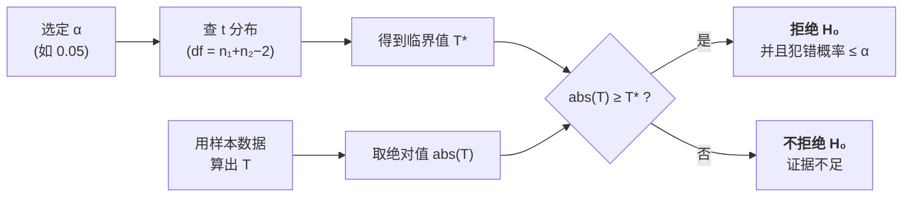

### 11.3 完整的 R 实例(逐步走一遍)

课上跑了一个完整的例子,slides S35–S37 展示了它。

```r
x <- rnorm(15, mean=100, sd=10)    # 总体 1:中心在 100
y <- rnorm(15, mean=105, sd=10)    # 总体 2:中心在 105,标准差相同
t.test(x, y, var.equal=TRUE)       # 注意:必须显式声明等方差
```

讲师专门强调:**`var.equal=TRUE` 是必须的,因为等方差是 Student's t-test 的核心假设。** 如果不写这个参数,R 默认执行的是 Welch's t-test(见 §12)。

输出的关键数字:

| 输出项 | 值 | 含义 |
|---|---|---|
| $t$ | **−1.7828** | 检验统计量 |
| $df$ | **28** | 自由度 $= 15 + 15 - 2$ |
| $p$-value | **0.08547** | 见 §11.5 |
| 95% CI | 一个包含 0 的区间 | 见 §11.6 |

**第一步:找 $T^*$。** 讲师带着算了一遍:

- $\alpha = 0.05$;
- 这是**双侧检验**,所以 $\alpha$ 要**平分到两个尾巴**,每边 $\alpha/2 = 0.025$;
- 自由度 $df = 28$;
- 查 t 分布(R 里是 `qt(0.975, 28)`),得到 $T^* = 2.048407$。

**第二步:比较。**

$$
|T| = |-1.7828| = 1.7828 \quad\text{vs}\quad T^* = 2.048407
$$

$$
1.7828 \;\ge\; 2.048407\ ? \quad \textbf{No.}
$$

**第三步:下结论。** slides S36 的原话:

> **Insufficient evidence to reject. $H_0$ is accepted.**
> (证据不足以拒绝。接受 $H_0$。)

**注意这个结果的教育意义**:两个总体的真实均值明明是 100 和 105,**确实不同**——但样本量只有 15、标准差有 10,噪声盖过了信号,检验没能检出这个差异。**这正是 Type II error(§14)的现场演示。** 它也再次印证了 §7.3:均值差 5 到底显不显著,取决于它相对于方差有多大。

### 11.4 双侧检验 vs 单侧检验

slides S36 问:**"What does the 'two-sided test' mean?"** 并给出答案:

> The "two-sided" means that we are testing for differences in **both directions** — whether the true mean difference is **less than 0 or greater than 0**.

区别在于 **$H_A$ 有没有方向性 (directional)**。slides 用两个例子做对照:

> **单侧 (One-sided) 例子(S38)** — 一家制药公司开发了新药,**声称它比现行标准药更能降低血压**。他们做实验比较两种药平均降压幅度。
> - $H_0$:新药**不比**标准药更能降压,即 $\mu_{new} \le \mu_{standard}$
> - $H_1$:新药**比**标准药更能降压,即 $\mu_{new} > \mu_{standard}$
> - **这是单侧检验,因为备择假设是有方向的 (directional)**,只关心"新药是否更好"。

> **双侧 (Two-sided) 例子(S39)** — 一家公司想知道新包装设计是否**导致平均销量出现差异**。他们**不确定**新设计会让销量上升还是下降,只是觉得可能有影响。
> - $H_0$:新旧包装的平均销量**没有差异**,即 $\mu_{new} = \mu_{standard}$
> - $H_1$:新旧包装的平均销量**存在差异**,即 $\mu_{new} \ne \mu_{standard}$
> - **这是双侧检验,因为备择假设是无方向的 (non-directional)**,考虑两个方向上的差异可能。

对照记忆:

| | **双侧检验 (two-sided)** | **单侧检验 (one-sided)** |
|---|---|---|
| $H_0$ 的形式 | $\mu_1 = \mu_2$ | $\mu_1 \le \mu_2$(或 $\ge$) |
| $H_A$ 的形式 | $\mu_1 \ne \mu_2$ | $\mu_1 > \mu_2$(或 $<$) |
| 方向性 | **non-directional** | **directional** |
| $\alpha$ 怎么分配 | 两个尾巴各 $\alpha/2$ | 全部 $\alpha$ 放在**一个**尾巴 |
| 关键词 | "是否有差异"、"是否不同" | "是否**更好**"、"是否**更高/更低**" |
| 何时用 | 你不知道方向,或两个方向都要防 | 你只关心一个特定方向 |

**判断诀窍:读题目里的动词。** 出现 "different / a difference / 是否不同" → 双侧;出现 "more than / better / lowers … more / 是否更优" → 单侧。

### 11.5 $p$-value:更方便的等价判据

slides S37 引出这个概念。定义:

> **$p$-value offers the probability of observing $|T| \ge t$ given the null hypothesis is TRUE.**
> ($p$ 值是"在零假设为真的前提下,观测到统计量绝对值大于等于当前值"的概率。)

对**双侧检验**,slides 说明:显著性水平 $\alpha$ 对应的是 $P(T \le -t)$ 与 $P(T \ge t)$ **两个尾巴之和**,所以**每个尾巴各占 $\alpha/2$**。

**决策规则简单到不需要查表:**

$$
p \;<\; \alpha \;\Longrightarrow\; \textbf{拒绝 } H_0 \qquad\qquad p \;\ge\; \alpha \;\Longrightarrow\; \textbf{不拒绝 } H_0
$$

回到上面的例子:$p = 0.08547$,$\alpha = 0.05$。讲师的解读非常直观,建议照这个说法记:

> **如果你拒绝零假设,你犯错的概率可能高达 0.08(8%);但你事先说过,你最多只能容忍 0.05(5%)。0.08 高于你的容忍上限,所以你说"不行,我不能接受这个,我不拒绝"。**

于是**两条路殊途同归**:

| 路线 | 做法 | 本例结果 |
|---|---|---|
| **临界值法** | 比较 $\lvert T\rvert = 1.7828$ 与 $T^* = 2.048407$ | $1.78 < 2.05$ → 不拒绝 |
| **$p$ 值法** | 比较 $p = 0.08547$ 与 $\alpha = 0.05$ | $0.085 > 0.05$ → 不拒绝 |

讲师明确说了:**这两种方式等价,你用哪一种都行**——而 $p$ 值法更省事,因为软件直接把 $p$ 打给你,不需要自己查分布表。

> 📎 **拓展(超出 slides)——$p$ 值最常被误解的一点**
> $p$ 值**不是**"$H_0$ 为真的概率",也**不是**"结果由偶然造成的概率"。它是一个**条件概率**:**假定 $H_0$ 为真**,观测到当前这么极端(或更极端)结果的概率。方向不能反过来读。
> 另外,$p$ 值**不衡量效应有多大**。样本量足够大时,一个微不足道的差异也能得到极小的 $p$ 值。所以实践中除了报 $p$ 值,还应报**效应量 (effect size)** 和**置信区间**。

### 11.6 95% 置信区间怎么读

slides S35 给了定义:

> In a two-sample t-test, the **95% confidence interval (CI)** is a range of values that we believe, with 95% confidence, contains the **true difference between the two population means**(即 mean of $x$ 与 mean of $y$ 之差)。

**它和检验结论的关系是一条捷径,值得记住:**

> **双侧检验中,若 95% CI 包含 0,则等价于在 $\alpha = 0.05$ 下不拒绝 $H_0$;若不包含 0,则等价于拒绝 $H_0$。**

为什么?因为"CI 包含 0"意味着"真实差值为 0"是一个与数据相容的可能性——也就是说,你没有证据排除"两个总体均值相同"。上例中 $p = 0.085 > 0.05$,所以它的 95% CI **必然跨过 0**。

置信区间比 $p$ 值多给了一样东西:**它告诉你差异可能有多大**。$p$ 值只说"显不显著",CI 说"差异大概在什么范围"——后者往往是业务方真正关心的。

---

## §12 放松第一条假设:Welch's t-test

### 12.1 什么时候需要它

slides S40 提了个问题:**"Why is `var.equal = TRUE`?"** 答案:**Student's t-test 要求两个总体方差相等!**

那如果这个假设不合适呢?讲师给的场景是:**"基于我的领域知识/前期探索,我不能假定它们方差相等——它们的方差明显不同。"** 这种情况下**不能用 Student's t-test**,要换成 **Welch's t-test**。

slides S41 的三句概括:

- **当"等方差"假设不成立时使用**;
- **它用每个总体各自的样本方差,而不是合并样本方差 (pooled sample variance)**;
- **仍然假设两个总体是正态的**(在 $H_0$ 下均值相同)。

### 12.2 公式上究竟改了什么

$$
T_{\text{Welch}} \;=\; \frac{\bar{X}_1 - \bar{X}_2}{\sqrt{\dfrac{S_1^2}{n_1} + \dfrac{S_2^2}{n_2}}}
$$

**把它和 Student 版对照着看**——分子完全一样,**只有分母变了**:

| | Student's t-test | Welch's t-test |
|---|---|---|
| 分子 | $\bar{X}_1 - \bar{X}_2$ | $\bar{X}_1 - \bar{X}_2$(**相同**) |
| 分母的方差项 | $S_p^2\left(\frac{1}{n_1}+\frac{1}{n_2}\right)$,**合并**成一个 | $\frac{S_1^2}{n_1} + \frac{S_2^2}{n_2}$,**两组各用各的** |
| 等方差假设 | **需要** | **不需要** |
| 正态性假设 | 需要 | **仍然需要** |
| 独立性假设 | 需要 | **仍然需要** |
| 自由度 | $n_1 + n_2 - 2$ | 由 **Welch–Satterthwaite 公式**近似,通常不是整数 |

讲师把这个对比讲得很清楚:*"在 Student's t-test 里我们用合并方差,因为我们假设它们方差相同,所以把它们放在一起算。但在这里,你清楚地看到分母里是**两项**而不是一项。"*

**核心洞察:** 合并方差本身就是等方差假设的产物。**放弃这个假设,合并的理由就消失了**,于是每组只能用自己的方差。这不是随意的公式改动,而是假设改变的必然结果。

### 12.3 R 里怎么做

**只改一个字**:

```r
t.test(x, y, var.equal = FALSE)    # Welch's t-test
```

讲师说:**"唯一的改动就是把 `var.equal` 从 TRUE 改成 FALSE,你就切换到了 Welch's test。"** 输出格式和 Student 版一样——给你 $t$ 值、自由度、$p$ 值——判断规则也完全一样。

> 📎 **拓展(超出 slides)** — 这也是为什么 R 的 `t.test()` **默认就是 `var.equal = FALSE`**(即默认跑 Welch)。现代统计实践的共识是:Welch's t-test 在方差相等时几乎不损失效能,在方差不等时则明显更可靠,所以**默认用 Welch 是更安全的选择**。这正是讲师强调"用 Student's t-test 时必须显式写 `var.equal=TRUE`"的原因——不写就不是 Student 了。

---

## §13 放松第二条假设:Wilcoxon Rank-Sum Test

### 13.1 Parametric vs Nonparametric

Welch 帮我们摆脱了等方差假设,但**正态性假设还在**。slides S43 接着问:**"What if the two populations are not normal?"**

这引出一对重要的分类:

| | **Parametric test(参数检验)** | **Nonparametric test(非参数检验)** |
|---|---|---|
| 代表 | **Student's t-test**、Welch's t-test、ANOVA | **Wilcoxon rank-sum test** |
| 定义(slides 原文) | **Makes assumptions about the population distributions from which the samples are drawn**(对样本所来自的总体分布做出假设) | **Shall be used if the populations cannot be assumed (or transformed) to be normal**(当总体无法被假定或变换为正态时使用) |
| 用什么信息 | 数值本身 | **秩 (ranks)** |
| 效能 | 假设成立时更高 | 稍低,但更稳健 |

讲师的解释很直白:**"Student's t-test 是参数检验,因为它假设分布具有参数化的形式——正态分布。如果我们不能假定这一点,就用非参数检验。"**

注意 slides 措辞里那个括号:**"cannot be assumed (**or transformed**) to be normal"** —— 这提醒你还有一条中间路线:**先做变换(比如 §4.3 的 log transformation)把数据变得接近正态,再用参数检验**。只有当变换也救不回来时,才转向非参数方法。

### 13.2 它在检验什么,以及"用秩代替数值"的妙处

slides S44:

> - **A nonparametric test to check whether two populations are identically distributed**(检验两个总体是否**同分布**);
> - **It uses "ranks" instead of numerical outcomes to avoid specific assumption about the distribution**(用**秩**代替数值,以避免对分布做特定假设)。

**注意 $H_0$ 变了。** t 检验的 $H_0$ 是"两个总体**均值**相同";Wilcoxon 的 $H_0$ 是"两个总体**同分布**"。这是个更强、也更笼统的命题——它不只关心中心位置。

**为什么用秩就能摆脱分布假设?** 因为秩只保留了"谁比谁大"的**顺序信息**,丢掉了"大多少"的**数值信息**。而顺序信息的分布行为,在 $H_0$(两组来自同一个分布)下是可以**纯组合地**算出来的——你不需要知道那个分布长什么样,只需要知道"如果两组本来就没区别,那么把它们混在一起排序后,标签的排列方式应该是随机的"。**这就是非参数方法的核心思想。**

讲师给的直觉解释同样好用:

> **想象两个总体彼此分离得很开。那么其中一组会压倒性地排在另一组前面,于是这一组的秩和会远小于另一组的秩和。但如果两组高度重叠,那么两组的秩和会非常接近。**

所以**秩和本身就是"分离程度"的度量**——又一次是"信号"的某种编码。

### 13.3 三步流程

slides S44 的 "How to conduct the test":

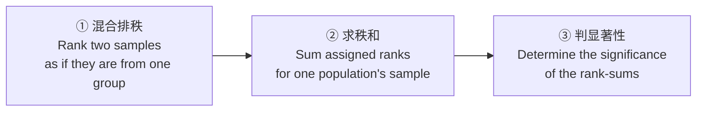

$p$-value 的含义(S45)也随之改写:**"the probability of the rank-sums of this magnitude being observed assuming that the population distributions are identical."**(在两总体同分布的假定下,观测到如此量级秩和的概率。)—— 结构和 t 检验的 $p$ 值完全一致,只是把"统计量"换成了"秩和"。

### 13.4 手算例(S46,建议自己动手复算一遍)

> **🔑 Worked example**
>
> **数据:**
> - Group A: `[85, 80, 78, 90, 95]`
> - Group B: `[88, 82, 85, 87, 92]`
>
> **Step 1 — 合并并排秩。**
> 合并后:`[85, 80, 78, 90, 95, 88, 82, 85, 87, 92]`(共 $n = 10$ 个)
>
> 从小到大排序并赋秩:
>
> | 值 | 78 | 80 | 82 | 85 | 85 | 87 | 88 | 90 | 92 | 95 |
> |---|---|---|---|---|---|---|---|---|---|---|
> | 名次 | 1 | 2 | 3 | 4 | 5 | 6 | 7 | 8 | 9 | 10 |
> | **秩** | 1 | 2 | 3 | **4.5** | **4.5** | 6 | 7 | 8 | 9 | 10 |
>
> **注意两个 85 的处理**:它们并列,占据第 4、5 名,所以**各取平均秩 $(4+5)/2 = 4.5$**。这是处理 **ties(并列)** 的标准做法。
>
> 按原顺序写回:`[4.5, 2, 1, 8, 10, 7, 3, 4.5, 6, 9]`
>
> **Step 2 — 分别求秩和。**
> - Group A 的秩:`[4.5, 2, 1, 8, 10]` → $W_1 = 4.5 + 2 + 1 + 8 + 10 = \mathbf{25.5}$
> - Group B 的秩:`[7, 3, 4.5, 6, 9]` → $W_2 = 7 + 3 + 4.5 + 6 + 9 = \mathbf{29.5}$
>
> **自检:** $W_1 + W_2 = 25.5 + 29.5 = 55$,而 $1+2+\cdots+10 = \frac{10 \times 11}{2} = 55$ ✅。**秩和相加必须等于 $\frac{n(n+1)}{2}$——这是一个免费的验算,考试时务必用。**
>
> **Step 3 — 选择检验统计量。**
> slides:*"$W$ can be either 25.5 or 29.5 depending on the test design, but usually, **the smaller sum is used** if conducting a one-sided test."*
>
> **Step 4 — 判断显著性。**
> 把 $W$ 与 **Wilcoxon rank-sum 分布**的临界值比较,或直接用统计软件给出的 $p$-value。

> 📎 **拓展(超出 slides)——slides 上的一处笔误**
> S46 把 Group B 的秩和写成 **"$W_2 = 6+3+4.5+5+9 = 29.5$"**。这几个加数其实算出来是 27.5,与写出的 29.5 对不上。**正确的加数应该是 $7+3+4.5+6+9 = 29.5$**(结果 29.5 是对的,是中间的加数抄错了)。核对方法就是上面的自检:两个秩和必须加起来等于 55。

> 📎 **拓展(超出 slides)——直觉核对**
> 本例中 $W_1 = 25.5$、$W_2 = 29.5$,两者非常接近(如果两组完全无差异,期望各为 $55/2 = 27.5$)。所以**从数值上就能预判:这两组不会显著不同**。回想 §13.2 的直觉——秩和接近 ⟺ 两组高度重叠 ⟺ 差异不显著。

R 里的调用同样是一行:

```r
wilcox.test(x, y)
```

讲师说明输出里给的**不是 $t$ 统计量而是 $W$**,同样附带 $p$-value,判断规则不变($p < \alpha$ 则拒绝)。

### 13.5 三个检验的假设放松阶梯

到这里,三个两样本检验的关系可以串成一条线了。**这张图很可能是本讲最值得记住的一张:**

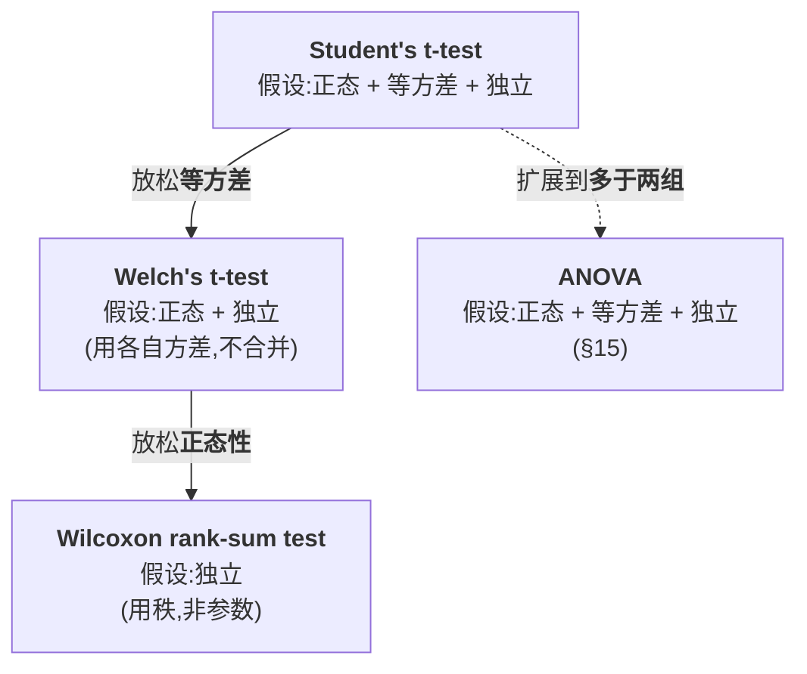

**每往下走一步,你放弃一条假设,换取一分稳健性,代价是损失一点统计效能。** 独立性是唯一一条谁都没放松的——它是最难绕过的假设。

---

## §14 Type I / Type II 错误与统计功效

我们在 §11.1 已经见过一类错误(它就是 $\alpha$ 的定义)。slides S47 把两类错误放在一起讲完。

| | **Type I error(一类错误)** | **Type II error(二类错误)** |
|---|---|---|
| **slides 定义** | the **rejection** of the null hypothesis when the null hypothesis is **TRUE** | the **acceptance** of the null hypothesis when the null hypothesis is **FALSE** |
| **通俗说法** | **False positive(假阳性)** | **False negative(假阴性)** |
| **中文** | $H_0$ 为真却拒绝了它 | $H_0$ 为假却没拒绝它 |
| **概率记号** | $\alpha$ | $\beta$ |
| **犯错的性格** | 太激进——发现了不存在的效果 | 太保守——错过了真实存在的效果 |
| **怎么修**(slides) | **选择恰当的显著性水平** | **增大样本量 (increase sample size)** |
| **法庭类比** | 冤枉无辜的人 | 放走真凶 |

**用药物例子把两者说活:**
- **一类错误**:药物其实无效,但你宣布它有效 → 无效药上市。
- **二类错误**:药物其实有效,但你宣布证据不足 → 有效药被埋没。

**为什么二类错误靠增大样本量来修?** 讲师给了理由:**更多样本能给出对总体更好的估计。** 从公式上也看得出来——回看 §10.2 的 t 统计量分母 $\sqrt{S_p^2(1/n_1 + 1/n_2)}$:$n$ 越大,分母越小,$|T|$ 越大,**同样的真实差异就越容易被检出**。这也解释了 §11.3 那个例子:100 vs 105 的真实差异之所以没被检出,很大程度上是因为每组只有 15 个样本。

### 统计功效 (Statistical Power)

slides 给了两条:

- **Power $= 1 - \beta$**,即 **"the probability of correctly rejecting the null hypothesis"**(在 $H_0$ 确实为假时,正确拒绝它的概率);
- 它的实际用途:**determine necessary sample size**(确定所需的样本量)。

**第二条是它在工程上最有价值的地方。** 在做实验之前,你可以反过来问:*"如果真实效应是这么大,我需要多少样本,才能有 80% 的把握把它检出来?"* 这个计算叫 **power analysis(功效分析)**,它把"样本量"从一个拍脑袋的决定变成一个可推导的量。

四者的关系可以画成一张 $2\times2$ 表(这是理解它们最快的方式):

| | **$H_0$ 实际为真** | **$H_0$ 实际为假** |
|---|---|---|
| **拒绝 $H_0$** | ❌ **Type I error**,概率 $\alpha$ | ✅ 正确,概率 $1-\beta$ = **Power** |
| **不拒绝 $H_0$** | ✅ 正确,概率 $1-\alpha$ | ❌ **Type II error**,概率 $\beta$ |

**一个必须理解的权衡:** $\alpha$ 和 $\beta$ 此消彼长。你把 $\alpha$ 调得更小(更不容易冤枉好人),临界值 $T^*$ 就被推得更远,于是**真实效应也更难被检出**,$\beta$ 上升、power 下降。**在样本量固定的前提下,你不能同时减少两类错误。** 唯一能同时改善两者的手段——就是 slides 说的那条:**增大样本量。**

---

## §15 ANOVA:超过两组怎么办

### 15.1 为什么不能反复做 t 检验(讲师留了作业题)

slides S48 提出问题:**"What if there are more than two populations?"** 比如你有 3 种药、5 种药、10 种药要比。

最自然的想法是:**做两两配对的 t 检验**——A vs B、A vs C、B vs C……但 slides 明确警告:**"Multiple t-test may not perform well now."**

**为什么?** 讲师给了理由,这是本节最重要的一句话:

> **回想一下,每做一次检验,你就有 $\alpha$ 的概率犯一次错误。你做的 t 检验越多,"至少有一次犯错"的概率就越高。**

> 📎 **拓展(超出 slides)——把这个道理量化**
> 这叫**多重比较问题 (multiple comparisons problem)**,犯错概率叫 **family-wise error rate(族错误率)**。
> 假设各次检验独立、每次 $\alpha = 0.05$,则**至少犯一次一类错误**的概率是:
> $$P(\text{至少一次错}) = 1 - (1-\alpha)^m$$
> 其中 $m$ 是检验次数。$k$ 组要做 $m = \binom{k}{2}$ 次两两比较:
>
> | 组数 $k$ | 两两比较次数 $m$ | 至少犯一次一类错误的概率 |
> |---|---|---|
> | 2 | 1 | 5% |
> | 3 | 3 | 14.3% |
> | 5 | 10 | **40.1%** |
> | 10 | 45 | **90.1%** |
>
> 10 组的时候,你几乎**必然**会"发现"至少一个根本不存在的差异。这就是为什么必须换方法。

> **❓ 讲师留的作业题(课末明确说下周会检查)** — *For a given problem including multiple groups, **what is the advantage of the ANOVA test over simply doing direct multiple pairwise t-tests?***
> 参考答案的骨架:**ANOVA 用一次检验回答"是否存在任何差异",把整体的一类错误率控制在 $\alpha$ 之内**,而 $m$ 次成对 t 检验的族错误率会随组数急剧膨胀(见上表);此外 ANOVA **用全部数据估计组内方差**(自由度更大,方差估计更稳),因此**功效也更高**。

### 15.2 ANOVA 是什么

slides S48:

- **A generalization of the hypothesis testing**(假设检验的一种推广);
- **ANOVA tests if *any* of the population means differ from the other population means**(检验是否**存在任何一个**总体均值与其他不同);
- **Each population is assumed to be normal and have the same variance**(每个总体假设为正态且同方差)。

**假设的写法**(讲师口述):

- $H_0$:**所有组的均值都相同**,$\mu_1 = \mu_2 = \cdots = \mu_k$
- $H_A$:**至少有一对不同**(注意不是"全都不同")

$H_A$ 的措辞是个常见失分点:**ANOVA 拒绝 $H_0$ 只意味着"至少有一对组不同",它不告诉你是哪一对,更不意味着所有组两两都不同。** 这个局限直接引出 §16 的 Tukey's HSD。

**ANOVA 的名字**是 **Analysis of Variance(方差分析)**。有点反直觉:我们明明在比较**均值**,为什么叫"方差分析"?因为——回到 §7.3 的总纲——**判断均值是否不同的方式,是比较两种方差**。

### 15.3 F 统计量:又一个"信号 / 噪声"

slides S49:**Compute F-test statistic**,由两部分构成:

- **Between-groups mean sum of squares(组间均方)**
- **Within-groups mean sum of squares(组内均方)**

$$
F \;=\; \frac{\text{MSB}}{\text{MSW}} \;=\; \frac{\dfrac{1}{k-1}\displaystyle\sum_{i=1}^{k} n_i (\bar{x}_i - \bar{x})^2}{\dfrac{1}{N-k}\displaystyle\sum_{i=1}^{k}\sum_{j=1}^{n_i} (x_{ij} - \bar{x}_i)^2}
$$

**符号说明**($k$ = 组数,$N$ = 总样本量,$n_i$ = 第 $i$ 组样本量):

| 部分 | 公式在算什么 | 讲师的说法 |
|---|---|---|
| **分子 MSB** | 每个**组均值 $\bar{x}_i$** 离**总均值 $\bar{x}$** 有多远 | "**各个组均值的散布程度**" |
| **分母 MSW** | 每个**样本 $x_{ij}$** 离**它自己组的均值 $\bar{x}_i$** 有多远 | "**每个组内部的方差**" |

再一次:**分子是信号(组与组之间的差异),分母是噪声(组内部本来就有的波动)。** 讲师明确点了这层类比:*"同样是一个比值——均值之间的差异,除以方差。基本概念是一样的,F 统计量的构造和 t 统计量是类似的。"*

**讲师用三组数据的图解释了这个比值:**

- **情况一:三个组彼此分离得很开。** 组均值之间散布很大(MSB 大),而每组内部的散布不变(MSW 不变)→ **$F$ 大** → 你有信心说它们不同。
- **情况二:三个组高度重叠。** 组均值挤在一起(MSB 小),组内散布依旧(MSW 不变)→ **$F$ 小** → 没有证据说它们不同。

slides S51 把结论写成三句:

- **Measures how different the means are relative to the variability within each group**(衡量组均值的差异**相对于**组内变异有多大);
- **The larger the F-test statistic, the greater the likelihood that the difference of means are due to something other than chance alone**($F$ 越大,均值差异**不是**单纯偶然造成的可能性越大);
- **The F-test statistic follows an F-distribution**($F$ 统计量服从 **F 分布**)。

最后一句和 t 检验完全同构:**知道了分布,就能定临界值、算 $p$ 值。** 讲师原话:*"和 t 检验一样。我们同样利用分布信息来找阈值,然后比较。"*

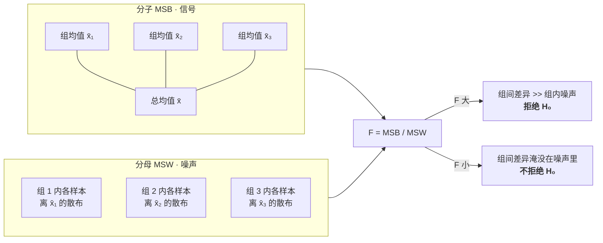

### 15.4 R 里的例子

课上的例子有三组:**offer1(优惠方案 1)、offer2(优惠方案 2)、no promotion(无促销)**,比较它们的销售表现。

```r
model <- aov(sales ~ group, data = df)
summary(model)
```

输出会给你 **$F$ 值**以及 **`Pr(>F)`**(即 $p$-value)。讲师读图时说:这个 $p$ **远小于 0.05**,所以**拒绝 $H_0$**——**这三组里至少有一对的均值存在显著差异。**

但紧接着的问题是:**是哪一对?** ANOVA 不回答。

### 15.5 ANOVA 的假设与局限(S53,整页都是考点)

**Assumptions(假设):**

| 假设 | slides 原文 | 说明 |
|---|---|---|
| **Normality** | Data should be approximately normally distributed | 与 t 检验相同 |
| **Homogeneity of Variances** | Variances within each group should be equal (**tested using Levene's test**) | 与 t 检验的等方差假设相同;**Levene's test 是检验它的标准工具**,这个名字 slides 明确点了 |
| **Independence** | Observations should be independent of each other | 与 t 检验相同 |

**注意:这正是 Student's t-test 的三条核心假设**(§10.3)。讲师明确说了:*"这三条假设和 Student's t-test 是一样的。"* ANOVA 就是它在多组情形下的推广。

**Limitations(局限):**

| 局限 | 为什么 |
|---|---|
| **Sensitivity to Outliers**(对离群点敏感) | 讲师解释:一个离群点会**同时显著改变某组的方差和均值**,从而扭曲 $F$ 值。**这正好呼应 Part I ——离群点的识别与处理很重要**,而识别它们要靠可视化 |
| **Assumes Equal Variances**(假定等方差) | 组数一多,"所有组方差都相等"越来越难成立;违反会影响结果的有效性 |
| **Identifies Differences but Not Specifics**(只说有差异,不说是哪一组) | 需要进一步的 **post-hoc(事后)检验** |

slides 末尾还有一行注脚:**当 ANOVA 的正态性和/或等方差假设不满足时,存在非参数的替代方法。**(对应 §13 的思路在多组情形下的延伸。)

---

## §16 Tukey's HSD:找出到底是哪几对不同

### 16.1 它解决什么问题

ANOVA 告诉你"至少有一对不同",Tukey's **HSD (Honest Significant Difference,诚实显著差异)** 告诉你**具体是哪几对**。它属于 **post-hoc test(事后检验)**——**必须在 ANOVA 拒绝了 $H_0$ 之后才做。**

slides S55 给出完整流程:

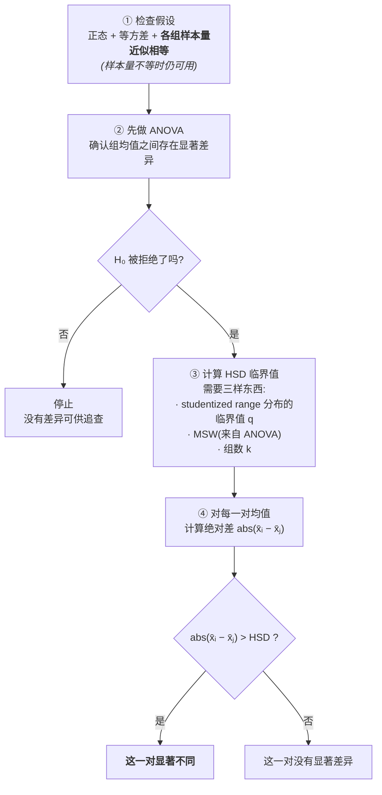

**HSD 临界值的构成**(slides 明确列出的三个输入):

$$
\text{HSD} \;=\; q_{\alpha,\, k,\, N-k} \sqrt{\frac{\text{MSW}}{n}}
$$

- $q$:来自 **studentized range distribution(学生化极差分布)** 的临界值;
- **MSW**:**组内均方,直接取自 ANOVA 的输出**——注意这一点,**Tukey 复用了 ANOVA 已经算好的噪声估计**;
- $k$:组数;$n$:每组样本量。

**决策规则**(slides 原文三条):

> - For each pair of means, calculate the **absolute difference**.
> - Compare the absolute difference to the **HSD value**.
> - **If the absolute difference is greater than the HSD, the pair of means is considered significantly different.**

**假设**(S55):**normality + equal variance + 各组样本量近似相等**(slides 补了一句:*though it can still be used if they are not*——样本量不等时仍可使用)。

### 16.2 课堂例子:读懂输出

R 里同样只要一行,而且**直接喂 ANOVA 的结果**:

```r
TukeyHSD(model)     # model 就是上一节 aov() 的输出
```

讲师带着读了输出的三行(三组两两比较共 $\binom{3}{2} = 3$ 对):

| 比较的一对 | 均值差 (diff) | $p$ adj | 结论 |
|---|---|---|---|
| **offer1 vs no promotion** | 超过 40 | 非常小 | $p < 0.05$ → **显著不同** |
| **offer2 vs no promotion** | 超过 40 | 非常小 | $p < 0.05$ → **显著不同** |
| **offer1 vs offer2** | 约 7 | **0.06** | $p > 0.05$ → **没有显著差异** |

讲师的解读:**两种优惠方案都明显优于"不做促销",但两种优惠方案彼此之间没有显著差异。** 从均值差本身也看得出来:前两对差了 40 多,最后一对只差 7,**"明显小得多"**。

**这个结论的业务含义很实在**:既然 offer1 和 offer2 效果没有统计上的区别,那就选**成本更低**的那个。这正是 ANOVA + post-hoc 组合拳的价值——**ANOVA 说"促销有用",Tukey 说"但两种促销一样好"。**

**注意 $p = 0.06$ 这个数字。** 它离 0.05 很近,但规则就是规则:$0.06 > 0.05$,**不拒绝**。这也提醒你 §11.5 的拓展:$p$ 值是个连续量,而 0.05 是个人为设定的门槛,**不要把 0.049 和 0.051 当成两个世界**——报告时最好同时给出均值差和置信区间。

---

## §17 决策地图:面对一个问题,该用哪个检验?

把 Part II 的所有方法收进一张图。**这张图是复习时最该先看的东西。**

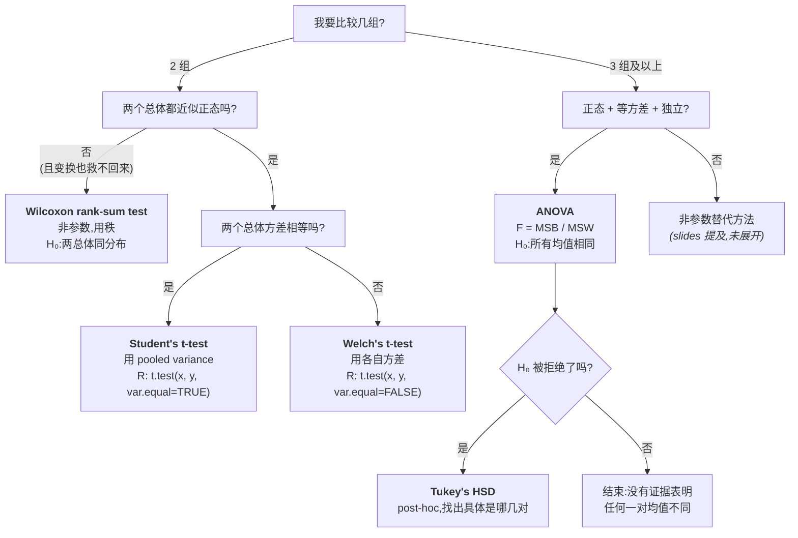

配套的对照表:

| 检验 | 组数 | 正态性 | 等方差 | 统计量 | $H_0$ | R 调用 |
|---|---|---|---|---|---|---|
| **Student's t-test** | 2 | 需要 | **需要** | $T$ | $\mu_1 = \mu_2$ | `t.test(x,y,var.equal=TRUE)` |
| **Welch's t-test** | 2 | 需要 | **不需要** | $T$ | $\mu_1 = \mu_2$ | `t.test(x,y,var.equal=FALSE)` |
| **Wilcoxon rank-sum** | 2 | **不需要** | 不需要 | $W$(秩和) | 两总体**同分布** | `wilcox.test(x,y)` |
| **ANOVA** | ≥3 | 需要 | 需要 | $F$ | $\mu_1=\cdots=\mu_k$ | `aov(y ~ group)` |
| **Tukey's HSD** | ≥3(事后) | 需要 | 需要 | 各对 $\lvert\bar{x}_i - \bar{x}_j\rvert$ vs HSD | 该对均值相同 | `TukeyHSD(model)` |

---

## 本章小结 (Key takeaways)

**Part I · 可视化**

1. **描述性统计是压缩,压缩必然丢信息。** Five-number summary(Min、Q1、Median、Q3、Max)加上 mean 与 std 能给你数据的位置和离散程度,但**说不出分布的形状,也说不出变量之间的关系**——而这两样恰恰是建模最需要的。
2. **Anscombe's quartet 是本讲第一记警钟:** 四组数据的均值、方差、相关系数、回归直线几乎完全相同,画出来却是四个完全不同的世界(线性、非线性、离群点、退化结构)。**统计量相同不等于数据相同,更不等于可以用同一个模型。**
3. **可视化是发现脏数据的主要手段。** 直方图上的 0 值尖峰通常是**伪装成数值的缺失值**,负值通常是**错误码**,末端的堆积通常是**数据被截断/封顶**。发现之后必须**用领域知识验证**,再决定怎么清洗——这三步缺一不可。
4. **可视化 income、price、stock price 这类跨多个数量级的变量时,必须考虑 log transformation。** 不取对数,99% 的数据会被压进一条窄缝,你会看不到多峰结构、看不到内部形状。**Unimodal 还是 multimodal 的判断直接影响你该不该分组建模。**
5. **选图取决于你要回答什么问题:** 单变量分布用 histogram / density + rug;逐个体比较用 dotchart;类别计数用 barplot;多组分布比较用 box-and-whisker(箱=Q1/Q2/Q3,须≈1.5×IQR,须外为 outlier);**大数据量且高度集中时用 hexbin plot**(用颜色编码密度,解决过度绘图);3–6 个变量的两两关系用 scatterplot matrix。
6. **探索用的图和汇报用的图不是同一张图。** 探索求信息密度,汇报求一眼看懂;**受众技术背景越弱,图就要越简洁**——这直接对应 Week 2 的 Phase 5 Communicate Results。

**Part II · 假设检验**

7. **"新均值更大"绝不等于"更好"。** 这是 Part II 的出发点:两个总体的重叠程度取决于**均值差**和**方差**两者。**均值越近、方差越大,重叠越大,差异越不显著。** 因此所有检验统计量都是同一个模板:**信号(均值差) / 噪声(变异)**。
8. **假设检验的逻辑是"无罪推定"。** $H_0$ 永远是保守的"没有差异",举证责任在数据。结论只有两种:**拒绝 $H_0$** 或 **不拒绝 $H_0$**;**"没有找到证据"不等于"证明了不存在"**(slides 写作 "$H_0$ is accepted",但更严谨的说法是 "fail to reject")。**假设必须在看数据之前形成。**
9. **Student's t-test** 的统计量是 $T = \dfrac{\bar{X}_1 - \bar{X}_2}{\sqrt{S_p^2(1/n_1 + 1/n_2)}}$,在 $H_0$ 下服从自由度为 $n_1 + n_2 - 2$ 的 **t 分布**(减 2 是因为估计了两个均值)。它有**三条核心假设:normality、equal variance、independence**。$|T|$ 离 0 越远,越应当拒绝 $H_0$。
10. **$\alpha$、$T^*$、$p$-value 是同一件事的三种说法。** $\alpha$ 是你能容忍的**一类错误概率**(通常 0.05);由 $\alpha$ 和自由度可唯一确定临界值 $T^*$;规则是 **$|T| \ge T^*$ 则拒绝**,等价于 **$p < \alpha$ 则拒绝**。双侧检验中 $\alpha$ 平分到两个尾巴,每边 $\alpha/2$。**95% CI 包含 0 ⟺ 在 0.05 水平上不拒绝 $H_0$。**
11. **单侧还是双侧,取决于 $H_A$ 有没有方向。** "是否**不同**" → 双侧($H_0: \mu_1 = \mu_2$);"是否**更好/更低**" → 单侧($H_0: \mu_1 \le \mu_2$)。
12. **三个两样本检验构成一条"假设放松阶梯":** Student's t-test(正态+等方差+独立)→ 放松等方差 → **Welch's t-test**(改用各自的样本方差,不再 pool)→ 放松正态性 → **Wilcoxon rank-sum test**(非参数,用**秩**代替数值,$H_0$ 变成"两总体同分布")。**每放松一条假设,换来稳健性,损失一点效能。**
13. **两类错误此消彼长。** Type I(假阳性,概率 $\alpha$)= $H_0$ 真却拒绝,靠**选择恰当的 $\alpha$** 控制;Type II(假阴性,概率 $\beta$)= $H_0$ 假却不拒绝,靠**增大样本量**改善。**Power $= 1 - \beta$**,是正确拒绝假 $H_0$ 的概率,主要用途是**反推所需样本量**。样本量固定时,你不能同时压低两类错误。
14. **多于两组时不要反复做成对 t 检验**——做的检验越多,"至少犯一次一类错误"的概率越高(5 组做 10 次比较时已达 40%)。改用 **ANOVA**:$F = \text{MSB}/\text{MSW}$,即**组间均值散布 / 组内变异**,$F$ 越大越可能不是偶然;$H_0$ 是"所有均值相同",$H_A$ 是"**至少有一对**不同"。假设与 t 检验相同(正态、等方差用 **Levene's test** 检验、独立)。
15. **ANOVA 的三大局限**:对 outlier 敏感(离群点同时扭曲均值和方差)、依赖等方差假设、**只说存在差异不说是哪一对**。最后一条要靠 **post-hoc 检验**补上:**Tukey's HSD** 在 ANOVA 拒绝 $H_0$ 之后运行,用 studentized range 临界值 $q$、ANOVA 的 MSW 和组数算出 HSD,**逐对比较 $|\bar{x}_i - \bar{x}_j|$ 是否超过 HSD**。

---

## 📌 考试与实操提醒

1. **讲师亲口划的重点:** *"第二半技术强度比较高。我请每一位同学一定回去复习第二部分,理解它是怎么运作的,因为我们引入了多个重要概念,你需要准确、正确地理解它们。"* —— **Part II 的优先级高于 Part I。**

2. **课上留了三道待答的问题**,按讲师一贯的做法(见 Week 2),**它们很可能变成考题**:
   - **(S6)** 数据分析生命周期的**哪些阶段**提到了 visualization?
   - **(S29)** 为什么假设检验会出现在 **Phase 2 Data Preparation**?
   - **(课末,讲师明说下周检查)** 对于包含多个组的问题,**ANOVA 相对于直接做多次成对 t 检验的优势是什么?**(答案骨架见 §15.1)

3. **最可能的计算/推导题型:**
   - 给一个场景,**写出 $H_0$ 和 $H_A$**,并说明是**单侧还是双侧**(§9.4、§11.4);
   - 给出 $t$、$df$、$T^*$ 或 $p$,**做出并说明拒绝/不拒绝的判断**(§11.3);
   - 给两组数据,**手算 Wilcoxon 的秩(含并列取平均秩)和秩和**(§13.4);
   - 给一个假设被违反的情境,**说明该换哪个检验、为什么**(§17 决策地图);
   - **辨析 Type I / Type II error 与 power**(§14)。

4. **最容易失分的细节,逐条核对:**
   - 自由度是 $n_1 + n_2 - \mathbf{2}$,**不是** $n_1 + n_2 - 1$;
   - 双侧检验查临界值时用 $\alpha/2 = 0.025$,**不是** $\alpha = 0.05$;
   - ANOVA 的 $H_A$ 是"**至少有一对**不同",**不是**"所有组都不同";
   - Welch's t-test 放松的是**等方差**,**仍然要求正态和独立**;
   - Wilcoxon 的 $H_0$ 是"两总体**同分布**",不是"均值相同";
   - Wilcoxon 并列值取**平均秩**;算完用 $\sum W = \frac{n(n+1)}{2}$ 验算;
   - Tukey's HSD **必须在 ANOVA 拒绝 $H_0$ 之后**才做。

5. **实操建议:** 讲师多次说本课**不要求你从零实现算法**,而是要**正确、高效地使用工具**。他反复建议把 slides 上的 R 代码**复制到 Google Colab 里跑一遍**(Colab 的 Runtime → Change runtime type 可以切到 R)。`zipIncome.csv` 随 slides 一起提供,`mtcars` 和 `iris` 是 R 自带的。**跑一遍比读十遍管用**,尤其是 boxplot 的 jitter 参数和 hexbin 的 trans 参数,改一改立刻能看出区别。

6. **课务信息(讲师课末提到):** 本学期**有 quiz**,会**提前发布**,需要**在线完成**;**quiz 覆盖 quiz 之前的所有周次内容**。**Assignment 1 即将发布。**
