# Week 4 · Clustering(聚类)

> **CSCI446/946 Big Data Analytics** — University of Wollongong, Spring 2026
> 本讲义融合 `w4_Clustering_SP_2026.pdf`(61 页 slides)与 Week 4 课堂录音转录。
> Slides 中的图表与代码,除特别注明外均出自教材 *Data Science and Big Data Analytics: Discovering, Analyzing, Visualizing and Presenting Data*(EMC Education Services)。

---

> **学习目标 (Learning objectives)** — 读完本章你应该能够:
>
> - **区分** supervised 与 unsupervised techniques,说清楚这条界线是由**数据有没有 label** 和**任务目标是不是预测**共同划出来的;
> - **完成"对象 → 点"的抽象**:给定任意一个应用场景(学生、病人、像素、文档),准确回答"被聚类的 object 是什么"和"n 个 measurable attributes 是什么";
> - **默写并解释** Euclidean distance 与 centroid 的公式,说明每个符号的含义;
> - **复述 K-means 的四个步骤**,并在一个小数据集上手工跑完至少两轮迭代;
> - **写出 K-means 的目标函数 $J$**,解释 $r_{ij}$ 是什么、为什么这是一个 combinatorial partition problem、以及为什么 K-means 只能给出 local optimum;
> - **用 WSS 与 elbow method 选择 $k$**,并解释为什么 WSS 一定随 $k$ 单调下降、为什么 elbow 只是 heuristic;
> - **读懂 R `kmeans()` 的完整输出**:`size`、`centers`、`withinss`、`tot.withinss`、`betweenss`、`totss`,并说明 `totss = betweenss + tot.withinss` 与 `betweenss/totss` 的含义;
> - **列出聚类前必须做的数据决策**:选哪些属性、用什么单位、要不要 rescale,并用 Euclidean distance 的公式论证为什么不 rescale 会出问题;
> - **解释**为什么要避免过多属性(noise + curse of dimensionality)和高度相关属性(隐式加权),以及用什么手段发现它们;
> - **描述 hierarchical agglomerative clustering 的流程**,并区分 single / complete / average / centroid 四种 linkage 的定义与它们各自产生的簇形状;
> - **判定 DBSCAN 中的 core / border / noise point**,解释 Eps-connected 的传递性,并说明 DBSCAN 在什么数据上会失效、为什么;
> - **解释 SOM 的 competitive step 与 cooperative step**,说明"更新邻居"这一步为什么带来 topology preservation,以及 SOM 相对 PCA / t-SNE 的优势;
> - **在 K-means、hierarchical、DBSCAN、SOM 之间做出有理由的选择**。

---

## 开篇:第四周,我们终于开始讲"算法"

回顾一下你手里已经有的东西。

**Week 2** 给了你一张地图:**Data Analytics Lifecycle**(大数据分析生命周期)——Discovery → Data Preparation → Model Planning → Model Building → Communicate Results → Operationalize。它告诉你一个数据分析项目该按什么顺序走。

**Week 3** 给了你两件贯穿全程的工具:**visualization**(用眼睛看数据)和 **hypothesis testing**(用统计量判断"看到的差异是不是真的")。讲师在本周开场时特意重申了一句:*"visualization 应该被用在 big data lifecycle 的每一步"*——它不是某一个阶段的专属动作。

但一直到上周结束,地图上的 **Phase 3 (Model Planning)** 和 **Phase 4 (Model Building)** 这两格里,始终写着"这里要选一个模型、建一个模型",而你还不知道有哪些模型可选。

本周开始补这一课。讲师原话:*"今天的 lecture,我们会讲第一个技术组件(the first technical component),它是关于 clustering 的。"* 下周讲 **classification**。这两周是本课程从"流程"转向"方法"的转折点。

那么,为什么第一个技术方法是 clustering 而不是别的?因为它对数据的要求最低——**它不需要标签**。现实中你拿到的绝大多数原始数据都是没有标注的:一堆交易记录、一堆病历、一堆图片、一堆日志。在你能训练任何预测模型之前,你首先得回答一个更朴素的问题:**这堆数据里到底有没有结构?有几团?每一团长什么样?** 这正是 clustering 要回答的。

本周的内容地图如下——三个聚类算法,外加一个既能聚类又能做高维可视化的方法:

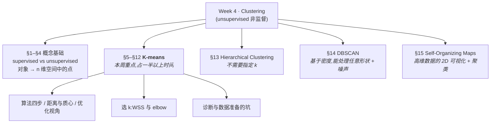

讲师明确说明了详略安排:**"我们会把大部分时间花在 K-means 上,因为它是最常用的那一个。"** 这句话应当直接转化为你的复习优先级——K-means 的每一个细节都是考点,后三个方法则以"理解概念、知道何时使用"为主。

---

# Part I · 聚类是什么

## §1 一条按"有没有标签"划的分界线:supervised vs unsupervised

### 1.1 分界线画在哪里

在讲任何具体算法之前,讲师先花时间立了一对概念,因为它要覆盖本周和下周两讲的全部内容:**supervised techniques**(监督式技术)与 **unsupervised techniques**(非监督式技术)。

判定一个任务属于哪一类,要同时看两件事:

1. **你的数据有没有 label(标签 / annotation,标注)?**
2. **你的目标是不是"预测"?**

讲师用图像数据把这件事讲得很具体。假设你有一批图片。如果你手上**只有** RGB 像素值——纯粹的图像数据,没有任何"这是猫 / 这是狗 / 这是飞机"这样的附加信息——那么你就没有 label。这种情况下你能做的是 unsupervised task。反过来,如果每张图片都配了一个 label,而你的任务是"给我一张**没见过的**新图片,预测它是猫还是狗",那这是典型的 supervised learning——具体说就是 **classification**(分类)或 **regression**(回归)。

注意 supervised 那一侧的关键词是 **predict**(预测)和 **unseen data**(未见过的数据)。监督学习的本质是从"数据 → 标签"的已知配对中学出一个映射,然后把这个映射用到新数据上。

| | **Supervised** | **Unsupervised** |
|---|---|---|
| 数据 | Labelled data(有标签) | Unlabelled data(无标签) |
| 目标 | **预测**新数据的标签 | 发现数据内部的**隐藏结构** (hidden structure) |
| 典型任务 | Classification、Regression | **Clustering**、Density estimation、Dimensionality reduction |
| 本课安排 | Week 5 | **Week 4(本周)** |

### 1.2 unsupervised 到底在求什么

既然不预测,那 unsupervised 的目的是什么?讲师给的答案是:**理解数据 (understand the data)**。而"理解"在这里有一个非常具体的含义——**揭示数据底层的、隐藏的结构 (reveal the underlying, hidden structure)**:它们是否形成了若干个簇?一共有几个簇?

为什么这件事有价值?讲师给了一个很实在的理由:

> 即使你有海量数据,只要你能弄清楚它形成了几个簇,你就能**立刻**用一种更简单的方式概括(summarize)这份数据;反过来,如果数据只是在整个空间里随机散布,那就意味着它没有隐藏结构,你将很难概括它、刻画它 (characterize)。

换句话说,聚类是一种**压缩**:把 620 个学生压缩成"3 类学生",把 20000 个像素压缩成"10 种颜色"。这个思路会在 §4.3 的图像压缩例子和 §15 的 SOM 里反复出现。

Slides 里 unsupervised 家族除 clustering 外还列了两位成员,讲师说本课不展开,但你应当知道它们的存在:

- **Density estimation(密度估计)**——给定一份数据,估计它背后的概率密度函数 (probability density function);
- **Dimensionality reduction(降维)**——比如 **PCA (principal component analysis,主成分分析)**,把高维数据压到低维。降维在本讲末尾会以 SOM 的形式回来。

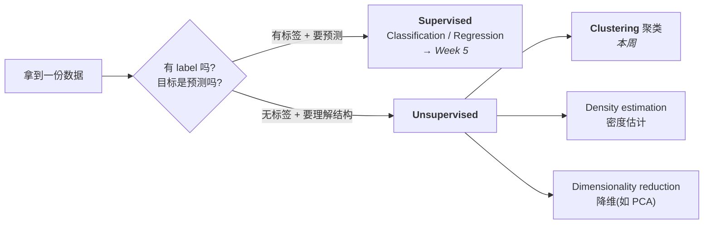

**结论(考点):Clustering 处理的是 unlabelled data,目的是发现 hidden structure,不做任何预测,因此它是一种 unsupervised technique。** 这三句话是一条完整的推理链,请连起来记,而不是只背最后一句。

### 1.3 一句直觉

Slides 第 4 页只放了一张图,讲师用一句谚语概括了聚类的全部直觉:**"Birds of a feather flock together"**(物以类聚)——同类的鸟聚在一起,它们是朋友,它们成群。这就是聚类的想法。

接下来的任务,是把这句谚语翻译成数学。

---

## §2 最关键的思维转换:任何对象都是 n 维空间里的一个点

讲师在这一页上花了远超其信息量的时间,并且明说了原因:**"这是一个重要的概念,我希望每个人都建立起来……它会在后面的 slides 里被反复使用,所以我要花点时间强调它。"** 如果本讲你只带走一件东西,应该是这一节。

### 2.1 从 object 到 vector

K-means 的输入是这样描述的:

> **Given a collection of $m$ objects each with $n$ measurable attributes.**
> 数学上,$\mathbf{x}_1, \mathbf{x}_2, \cdots, \mathbf{x}_m \in \mathbb{R}^n$。
> 每个 object 是 **"$n$ 维空间"中的一个点 (a point in an "$n$-dimensional space")**。

拆开看这两个数字,它们的角色完全不同,考试里最容易混:

- $m$ = **object(对象)的个数**,也就是你有多少条数据、多少个待聚类的东西;
- $n$ = **measurable attributes(可测属性)的个数**,也就是每个对象用多少个数字来刻画,即空间的维度。

讲师用教室里的学生做例子。一个 object 可以是"一个病人的记录、一张图像、一份文本文档、一个句子"——它就是**一条数据**。而每条数据由若干 **attributes** 来表示。对 K-means 来说,这些属性通常必须是**数值型的 (numerical)**(为什么必须是数值型?§12.3 讲 K-modes 时会给出答案)。

于是:这个房间里有一批学生,每个学生是一个 object。我们用**身高**和**体重**这两个数值属性来刻画每个学生。那么数学上,每个学生就变成了**一对数字**;这对数字构成一个**二维向量**;而一个二维向量,就是二维平面上的**一个点**。

> **🔑 例(把抽象落地)**
> 学生 A:身高 1.75 m,体重 70 kg → $\mathbf{x}_A = (1.75,\ 70)$
> 学生 B:身高 1.60 m,体重 52 kg → $\mathbf{x}_B = (1.60,\ 52)$
> 学生 C:身高 1.78 m,体重 72 kg → $\mathbf{x}_C = (1.78,\ 72)$
>
> 把这三个点画在"横轴 = 身高、纵轴 = 体重"的平面上,你一眼就能看出 A 和 C 挨得近、B 离得远。**"挨得近"这个视觉判断,就是聚类算法唯一依赖的信息。**

如果这个班有 30 个学生,那么 $m = 30$、$n = 2$,你的数据就是平面上的 30 个点。讲师说:一旦你这样画出来,你可以**立刻**认出"哦,这 11 个学生大致形成了 3 群"——这让你迅速理解数据里发生了什么。

### 2.2 为什么这个抽象如此重要:算法是"瞎"的

这个抽象真正的威力在于它的**遗忘性**。讲师说得很直接:

> **"我们忘掉这份数据是学生,还是苹果、文章、摩托车、图像。只要它们被若干属性所刻画,这些属性就构成一个向量,而一个向量就是多维空间里的一个点。所以我们要处理的,不过是多维空间里的一堆点。"**

这句话有一个非常实际的推论,讲师也点明了:当你调用一个聚类函数时,你**只需要**想"我要提供一组 $n$ 维的点,以 data matrix(数据矩阵)的形式交给它";拿到输出之后,你再结合你的领域知识去解释"哦,这张图像和那张图像是相似的"。**在思考算法本身的时候,你纯粹地把数据当成高维空间里的点。**

用一张图表示这个"三段式"的工作流:

```mermaid
graph LR
  R["<b>现实世界的对象</b><br/>学生 / 病人 / 像素 / 文档<br/><i>有意义、有语义</i>"]
  -->|"特征抽取<br/>选定 n 个可测属性"|
  V["<b>数据矩阵</b><br/>m 行 × n 列<br/>每行是一个 n 维向量<br/><i>算法只看得见这个</i>"]
  -->|"聚类算法<br/>K-means / DBSCAN / …"|
  O["<b>聚类标签</b><br/>每个对象属于第几簇<br/><i>纯粹的数字</i>"]
  -->|"结合领域知识解释"|
  M["<b>业务含义</b><br/>'这是高分学生群'<br/>'这是高价值客户群'"]
```

注意两端(现实对象、业务含义)是**你的**工作,中间那一段(数据矩阵 → 标签)才是算法的工作。算法本身对"学生"或"像素"一无所知——**它只看见坐标**。这解释了本课反复强调的一件事:**算法的好坏,很大程度上由你在第一箭头处的选择决定**(选哪些属性、用什么单位),这正是 §11 的全部内容。

### 2.3 数据矩阵长什么样

把 §2.1 的学生例子写成矩阵形式:

$$
\mathbf{X} =
\begin{bmatrix}
1.75 & 70 \\
1.60 & 52 \\
1.78 & 72
\end{bmatrix}
\quad
\begin{array}{l}
\leftarrow \mathbf{x}_1 \\
\leftarrow \mathbf{x}_2 \\
\leftarrow \mathbf{x}_3
\end{array}
$$

**行 = object($m$ 行),列 = attribute($n$ 列)**。R 和 Python 的聚类函数几乎都要求这个方向,弄反了会得到完全无意义的结果(你会把"身高"和"体重"当成两个待聚类的对象)。

---

## §3 一切取决于"相似",而"相似"是你定义的

### 3.1 proximity 是聚类的核心

Slides 第 6 页给出 K-means 的目标:

> **For a chosen value of $k$, identify $k$ clusters of objects based on the objects' proximity to the centre of the $k$ groups.**
> (对于选定的 $k$,依据各对象与 $k$ 个组中心的**接近程度 (proximity)**,识别出 $k$ 个簇。)

判定两个点该不该在同一簇的**唯一**依据是:它们离得近不近。讲师的表述是:两点若彼此接近,它们大概率属于同一组;若相距很远,通常来自不同组。

因此 **proximity(接近度)**,或者等价地说 **similarity(相似度)** / **distance(距离)**,是聚类中最重要的概念。为什么是"最"重要?讲师给出了理由,这段话值得逐字理解:

> **"一旦我们改变了对'两个对象/两个点之间相似度或距离'的定义,我们就会得到完全不同的聚类结果。所以,聚类取决于你所定义的相似性。"**

也就是说,聚类结果由两件事共同决定,而这两件事**都是你的选择**:

1. **你选了哪些 attributes**(决定了点被放在哪个空间里);
2. **你如何计算这些属性之间的距离/相似度**(决定了空间里"远近"的度量方式)。

**你决定了这两件,你就决定了聚类结果。** 算法本身没有"客观真理"可言——这是本讲最重要的一条批判性认识,也是 §11 那一整节数据准备工作之所以存在的根本原因。

当然,实践中我们有一些约定俗成的默认选择,最常见的就是 **Euclidean distance(欧氏距离)**,详见 §6。

### 3.2 一个提前的警告

既然距离决定一切,那么任何**扭曲距离**的因素都会扭曲结果。本讲后面会集中出现三个这样的因素,现在先埋下伏笔:

| 扭曲因素 | 后果 | 出现在 |
|---|---|---|
| 属性单位不同(米 vs 千克) | 数值范围大的属性**支配**距离 | §11.3 |
| 使用了高度相关的属性 | 相当于给某个信息**重复加权** | §11.4 |
| 属性太多(维度太高) | curse of dimensionality,所有点看起来一样远 | §11.2 |

---

## §4 用例:聚类拿来干什么

### 4.1 两大用途

Slides 列出 K-means 的两个 use cases:

1. **理解数据的第一步 (a primary step to understand the data)**——就是 §1.2 说的"揭示隐藏结构"。你只是想知道数据里有几群。
2. **作为 classification 的前导步骤 (used as a lead-in to classification)**——一旦簇被识别出来,就可以给每个簇打上标签,从而做分类。

第 2 点讲师展开讲了,因为它在实务中非常有用。设想你有一份很大的数据集,**没有任何数据被标注过**。人工逐条标注的成本高得吓人。这时:

- 先跑 K-means,识别出底层的簇;
- 如果运气好,数据被清晰地分成了 3 个簇,那说明存在 3 种底层结构,很可能对应 3 个不同的类别;
- 于是**标注过程变得极其简单**:你只需要标注每个簇里最典型的那条数据,同簇内的其他数据就共享同一个标签。

讲师的评价是:**"这实际上让标注的效率变得非常高。"** 这就是 unsupervised 方法为 supervised 方法铺路的经典模式,也解释了为什么本课把 clustering 放在 classification 的**前一周**。

### 4.2 应用场景

Slides 列了三个,讲师各自补了一句:

- **Customer grouping(客户分群)**——依据购物行为、购物频率、交易记录,把客户分成不同的群体;
- **Medical(病人分群)**——依据病历把病人聚类,识别出哪些人需要**立即处置**、哪些人需要**预防性治疗**;
- **Image processing(图像处理)**——见下一节。

Slides 在这里插入了两个必答问题,它们正是 §2 那个抽象的检验题:

> **Question 1: What are the objects to be clustered?**(被聚类的对象是什么?)
> **Question 2: What are the $n$ measurable attributes?**($n$ 个可测属性是什么?)

**遇到任何聚类应用场景,先回答这两个问题。** 讲师原话:*"如果你能正确回答这两个问题,就说明你理解了聚类。"* 这是极强的考点信号。

### 4.3 一个值得细看的例子:用 K-means 做图像分割与压缩

讲师说这个应用"有点特别",因为它和你的直觉不一样。

**直觉版(比较显然的用法)**:我有很多张图像 → 从每张图像抽取特征 → 把猫聚成一堆、摩托车聚成一堆、飞机聚成一堆。这里 **object = 一张图像**。讲师说这是对的,但他要展示另一种。

**反直觉版(slides 上演示的用法)**:对**一张**图像做 K-means,用来**分割 (segment)** 和**压缩 (compress)** 它。

现在回答那两个问题:

| | 答案 | 说明 |
|---|---|---|
| **Object** | **像素 (pixel)** | 不是图像!一张 200×100 的图有 $200 \times 100 = 20{,}000$ 个像素,即 $m = 20{,}000$ |
| **Attributes** | **RGB 值** | 每个像素由 (R, G, B) 三个数刻画,即 $n = 3$,每个像素是三维颜色空间中的一个点 |

课堂上学生第一反应答的是"RGB 值",讲师纠正说:那是第二个问题的答案;第一个问题的答案是**像素**。这个混淆非常典型,请注意区分。

**流程**:


Slides 展示了 $k = 2, 3, 10$ 三种结果:

- $k=2$:图像被分成两块,一块偏棕黄、一块偏蓝——这就是 **image segmentation(图像分割)**;
- $k=3$:出现三种主色调;
- $k=10$:讲师说,到这一步"你已经大致能看清这张图的一些细节了"。

**这引出了压缩的洞见**:要看懂一张图的基本内容,你并不需要原图那成千上万种颜色;**10 种颜色就已经能把图像表示得相当好**。于是如果你要通过互联网传输这张图,你只需要传:

1. **10 种颜色的取值**(一张很小的颜色表 / palette),外加
2. **每个像素的簇索引 (index)**(每个像素只需 4 bit 即可表示 0–9,而不是原来的 24 bit RGB)。

讲师的总结:*"这能省下大量带宽……视觉上它不如原图赏心悦目,但就我们想传递的信息而言,信息已经传到了。"* 这就是 **vector quantization(向量量化)** 的基本思想——用 $k$ 个"代表色"近似整个颜色空间。$J$(§7 的残差)在这里就是压缩带来的失真。

> 📎 **拓展(超出 slides)** — 这个例子还给了你一个理解 $k$ 的绝佳直觉:**$k$ 控制着"压缩率 vs 保真度"的权衡**。$k$ 越小,概括得越狠、信息损失越大;$k$ 越大,越忠实于原数据,但概括的价值越低。极端情况下 $k = m$(每个点自成一簇)时完全无损,但你什么也没学到。这个权衡会在 §8 选 $k$ 时以数学形式再次出现。

---

# Part II · K-means Clustering

这是本讲的主体。讲师说 K-means 是"最常用的那一个",并把大半节课给了它。

## §5 算法:四个步骤,和一段值得在脑中重放的动画

### 5.1 先看动画:算法在做什么

讲师用了一段动画来讲 K-means,并说"如果你理解了这段动画,你就理解了 K-means"。我们把它复原成文字。

**起点**:你有一堆二维点,全是同一种颜色——因为你**还不知道**谁属于哪一簇。你的目标是把它们分成两簇(设 $k=2$),分别染成红色和蓝色。

**核心困难是一个"先有鸡还是先有蛋"的问题**,讲师明确指出了这一点:

> 如果你**知道**每个簇的均值(中心),那么给定任意一个点,你只要算它离哪个均值更近,就能把它分进去——很简单。
> 但簇的均值是由簇内的点算出来的。**要知道均值,你得先知道谁属于哪个簇;要知道谁属于哪个簇,你得先知道均值。**

**破局办法:随便猜一个开头。** 讲师说:*"这是一个鸡生蛋蛋生鸡的问题,我们必须从某个地方开始。"* 所以我们**随机**指定两个点作为初始均值。它们几乎肯定是错的——但没关系。

然后进入循环。讲师用了一个很好的比喻:**"就像你骑自行车,左脚、右脚、左脚、右脚,不断交替。"**

- **左脚(Assignment,指派)**:对每一个点,计算它到红叉的距离和到蓝叉的距离,哪个近就归给哪一簇。做完所有点,你得到了第一版的划分。
  - 一个几何观察:因为判定依据是"离哪个中心近",所以两簇之间的边界正好是**连接两个中心的线段的垂直平分线**——空间被一条直线切成了两半。讲师在动画里指出了这条线。
- **右脚(Update,更新)**:既然现在每个点都有归属了,你就可以**重新计算**每一簇的均值——把所有红点的坐标求平均,得到新的红叉位置;蓝点同理。讲师说:初始均值是随机给的,可能错得离谱,但**这一步之后你会得到一个合理得多的均值**。

然后回到左脚:用新的中心重新指派。这一轮会有一些点**改变阵营**——讲师提醒"仔细看,有 3 个点从蓝变红了"。中心随之再次移动。

**如此往复,直到没有点再改变归属为止。** 这时算法**收敛 (converged)**,输出最终的划分。

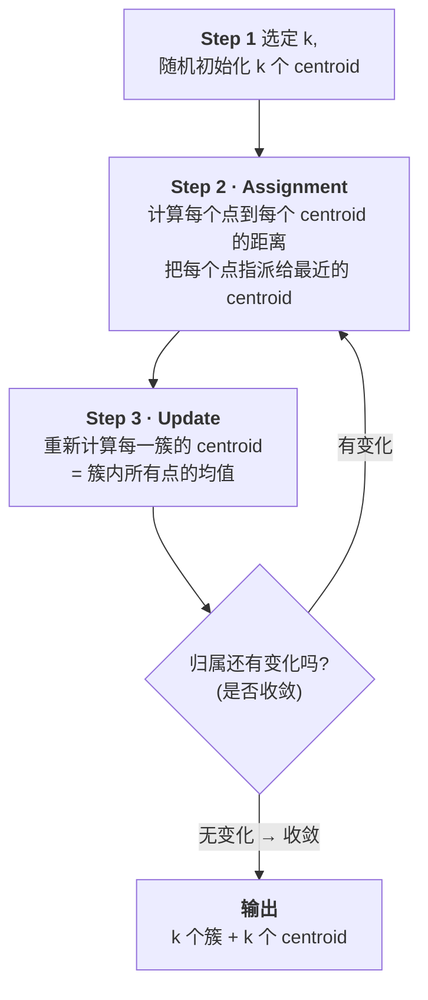

### 5.2 四个步骤的正式表述

Slides 上的原文(这是需要能默写的版本):

> 1. **Choose the value of $k$ and the $k$ initial guesses for the centroids.**
>    (选定 $k$,并给出 $k$ 个质心的初始猜测。)
> 2. **Compute the distance from each data point to each centroid. Assign each point to the closest centroid.**
>    (计算每个数据点到每个质心的距离,把每个点指派给最近的质心。)
> 3. **Update the centroid of each cluster.**
>    (更新每一簇的质心。)
> 4. **Repeat Steps 2 and 3 until convergence.**
>    (重复第 2、3 步直至收敛。)

注意术语:**centroid(质心)**、**mean(均值)**、**cluster centre(簇中心)** 在 K-means 语境下指同一个东西,slides 和讲师会混用。

讲师对 K-means 的整体评价:**"概念上非常简单,但它非常强大、应用极广。"**

### 5.3 手工跑一遍(重要:考试可能要求你算)

> **🔑 例(手工两轮迭代)**
>
> 一维数据(为了算得动),6 个点:$\{1,\ 2,\ 4,\ 8,\ 9,\ 12\}$,取 $k = 2$。
> 初始质心随机猜为 $c_1 = 2$、$c_2 = 4$(故意猜得很差)。
>
> **第 1 轮 · Assignment**:每个点到两个质心的距离(一维距离就是绝对值之差)
>
> | 点 | 到 $c_1=2$ | 到 $c_2=4$ | 归属 |
> |---|---|---|---|
> | 1 | 1 | 3 | C1 |
> | 2 | 0 | 2 | C1 |
> | 4 | 2 | 0 | C2 |
> | 8 | 6 | 4 | C2 |
> | 9 | 7 | 5 | C2 |
> | 12 | 10 | 8 | C2 |
>
> 得到 $C_1 = \{1, 2\}$,$C_2 = \{4, 8, 9, 12\}$。
>
> **第 1 轮 · Update**:$c_1 = \dfrac{1+2}{2} = 1.5$,$c_2 = \dfrac{4+8+9+12}{4} = 8.25$。
> 质心从 (2, 4) 移到了 (1.5, 8.25)——注意 $c_2$ 移动了非常远,这正是讲师说的"第一步之后你会得到一个合理得多的均值"。
>
> **第 2 轮 · Assignment**:
>
> | 点 | 到 $c_1=1.5$ | 到 $c_2=8.25$ | 归属 |
> |---|---|---|---|
> | 1 | 0.5 | 7.25 | C1 |
> | 2 | 0.5 | 6.25 | C1 |
> | 4 | 2.5 | 4.25 | **C1**(从 C2 改判!) |
> | 8 | 6.5 | 0.25 | C2 |
> | 9 | 7.5 | 0.75 | C2 |
> | 12 | 10.5 | 3.75 | C2 |
>
> 点 4 换了阵营。$C_1 = \{1,2,4\}$,$C_2 = \{8,9,12\}$。
>
> **第 2 轮 · Update**:$c_1 = \dfrac{1+2+4}{3} \approx 2.33$,$c_2 = \dfrac{8+9+12}{3} \approx 9.67$。
>
> **第 3 轮 · Assignment**:再算一遍会发现归属不变($1,2,4$ 仍离 2.33 更近,$8,9,12$ 仍离 9.67 更近)。**收敛。**
>
> 最终结果:$\{1,2,4\}$ 与 $\{8,9,12\}$,质心 $2.33$ 与 $9.67$。三轮迭代,和讲师动画里的过程完全一致——**指派、更新、指派、更新,直到无变化**。

---

## §6 两个必须会写的公式:Euclidean distance 与 centroid

上一节里"计算距离"和"计算均值"都是口头描述的,现在把它们写成公式。讲师说 *"我希望每个人都知道欧氏距离是什么,万一你不知道——其实概念很简单。"*

### 6.1 Euclidean distance(欧氏距离)

$$
d(\mathbf{x}, \mathbf{y}) = \|\mathbf{x} - \mathbf{y}\|_2 = \sqrt{\sum_{i=1}^{n} (x_i - y_i)^2}
$$

**逐个符号读**:

- $\mathbf{x}, \mathbf{y}$ 是两个 $n$ 维向量(即空间中的两个点);
- $x_i, y_i$ 是它们的**第 $i$ 个分量**(第 $i$ 个属性的取值);
- $(x_i - y_i)$ 是两点在第 $i$ 个维度上的**差**;
- 平方、对所有 $n$ 个维度求和、再开方。
- $\|\cdot\|_2$ 读作 "L2 范数",是这个式子的简写记法。

**用一句话说**:把两点在每个维度上的差取平方、加起来、再开方。$n=2$ 时这就是中学的勾股定理。

讲师补了一个实用观察,值得记住:

> **"如果你不想开平方根也没关系,因为开不开平方根都不会改变大小顺序——近的还是近的。"**

也就是说 $d(\mathbf{x},\mathbf{y}) < d(\mathbf{x},\mathbf{z}) \iff d^2(\mathbf{x},\mathbf{y}) < d^2(\mathbf{x},\mathbf{z})$。K-means 只关心"谁更近",所以实现中常常直接用**平方欧氏距离**,省掉开方、加快计算。这也解释了为什么 §7 的目标函数 $J$ 里用的是 $\|\cdot\|_2^2$(带平方)。

> **🔑 例** — $\mathbf{x} = (1.75, 70)$,$\mathbf{y} = (1.60, 52)$:
> $d = \sqrt{(1.75-1.60)^2 + (70-52)^2} = \sqrt{0.0225 + 324} = \sqrt{324.0225} \approx 18.0006$
>
> 请**盯住这个数字**:身高差贡献了 $0.0225$,体重差贡献了 $324$。距离几乎完全由体重决定,身高的贡献小到可以忽略。这不是巧合,而是一个严重的问题——**§11.3 会专门处理它**。

### 6.2 Centroid(质心)

$$
\bar{\mathbf{x}} = \frac{\sum_{i=1}^{m} \mathbf{x}_i}{m}
$$

**读法**:把簇内所有点的向量**逐维相加**,再除以点的个数 $m$,得到的仍是一个 $n$ 维向量。讲师的表述:*"你只需要对簇内所有点求均值——把向量加起来,除以点的总数,对每个维度都这么做,你会得到另一个向量,它就是均值。"*

注意 $\bar{\mathbf{x}}$ 通常**不是**数据集里真实存在的某个点,它是一个虚拟的"平均对象"。(这一点在 §12.2 讲 Manhattan distance + median 时会有对照。)

> **🔑 例** — 三个二维点 $(1,2)$、$(3,4)$、$(5,0)$ 的质心:
> $\bar{\mathbf{x}} = \left(\dfrac{1+3+5}{3},\ \dfrac{2+4+0}{3}\right) = (3,\ 2)$。
> 注意 $(3,2)$ 并不在原始数据中。

### 6.3 两个公式如何对应到算法的两步

| 算法步骤 | 用到的公式 | 在做什么 |
|---|---|---|
| **Step 2 · Assignment** | Euclidean distance $d(\mathbf{x}, \bar{\mathbf{x}}_j)$ | 比较每个点到 $k$ 个质心的距离,取最小 |
| **Step 3 · Update** | Centroid $\bar{\mathbf{x}} = \frac{1}{m}\sum \mathbf{x}_i$ | 对每一簇重算均值 |

这两个公式加起来就是整个 K-means。剩下的只是循环。

---

## §7 优化视角:K-means 究竟在最小化什么

Slides 第 13 页从另一个角度重新审视 K-means:**它本质上是一个优化问题 (an optimization problem)**,更精确地说,是一个 **combinatorial partition problem(组合划分问题)**。这一节的 $J$ 是后面 §8 选 $k$ 的基础,务必吃透。

### 7.1 为什么这是"组合"问题:先感受一下搜索空间有多大

讲师带着算了一笔账。假设你有 $n$ 个点,要分成 $k$ 个簇。

本质上这是一个**指派问题 (assignment problem)**:对**每一个**点,你都要在 $k$ 个标签中选一个。所以:

- 第 1 个点有 $k$ 种选法,
- 第 2 个点有 $k$ 种选法,
- ……
- 第 $n$ 个点有 $k$ 种选法。

总共有多少种可能的配置?$\underbrace{k \times k \times \cdots \times k}_{n \text{ 个}} = k^n$ 种。

讲师的评语:**"这是一个巨大的数字。"** 有多巨大?取 $n = 620$(就是 §9 那个学生数据集)、$k = 3$:$3^{620}$——这个数远超可观测宇宙的原子总数。**穷举是绝无可能的。** 这正是"组合优化难"的含义,也预告了 §12.1 的结论:K-means 只能给出局部最优。

### 7.2 目标函数 $J$

要把"哪种划分最好"变成数学,先引入一个**指示变量 (indicator variable)** $r_{ij}$:

$$
r_{ij} \in \{0, 1\},\qquad
r_{ij} =
\begin{cases}
1, & \text{第 } i \text{ 个数据点被指派给第 } j \text{ 个簇} \\
0, & \text{否则}
\end{cases}
$$

讲师原话:*"如果 $r_{ij}$ 是 0,意味着你没有把第 $i$ 个数据指派给第 $j$ 个簇;如果 $r_{ij}$ 是 1,意味着你指派了。"*(每个点只能属于一个簇,所以对固定的 $i$,$\sum_j r_{ij} = 1$。)

于是目标函数:

$$
J = \sum_{i=1}^{n} \sum_{j=1}^{k} r_{ij} \left\| \mathbf{x}_i - \bar{\mathbf{x}}_j \right\|_2^2 ; \qquad r_{ij} \in \{0,1\}
$$

**用一句话读出来**:对每一个点 $i$、每一个簇 $j$,如果点 $i$ 属于簇 $j$($r_{ij}=1$),就把它到该簇质心的**平方距离**计入总和;否则不计($r_{ij}=0$ 把这一项乘没了)。所以 $J$ 就是**每个点到它自己所属簇质心的平方距离之总和**。

$r_{ij}$ 在这里扮演的是一个**开关**的角色:它让我们能用一个统一的双重求和式子,表达"只累加点与其所属质心之间的距离"这件事。

而优化问题就是:

$$
\{r_{ij}^{*}\} = \arg\min_{r_{ij} \in \{0,1\}} J
$$

**找到那组使 $J$ 最小的指派方案。**

讲师对这个式子的直觉解释很到位:

> 你希望每个簇是**紧凑的 (compact)**,点都聚在一起。所以你要最小化每个点到它所属簇中心的距离。你的 $r_{ij}$ 指派显然会影响这个值:如果你把一个点指派给一个**很远**的中心,这个误差项就会很大——对这种配对你当然想把 $r_{ij}$ 设成 0;如果一个点离某个中心**很近**,你就想把对应的 $r_{ij}$ 设成 1。

### 7.3 $J$ 的名字:residual error / residual variance

Slides 用红字特别标注(这是全页唯一的红字,是强烈的考点信号):

> **"$J$" denotes the residual error or residual variance for a given assignment.**
> ($J$ 表示给定指派方案下的**残差误差 / 残差方差**。)

讲师紧接着叮嘱:**"请记住 $J$,当我们试图决定最佳的 $k$ 值时会用到它。"** 这就是下一节的内容——**$J$ 就是 WSS**。

**"residual(残差)"这个词值得咀嚼**:质心是对簇内所有点的**概括**,而 $J$ 衡量的是这个概括**没能捕捉到**的那部分变异。$J$ 小 = 概括得好 = 簇紧凑;$J$ 大 = 点散在中心周围 = 概括得差。

### 7.4 K-means 与这个优化问题的关系

这是一个容易被略过、但很重要的逻辑关系。讲师说得很清楚:

> **"K-means 实际上是一种用来求解这个优化问题、寻找最优指派的方法。"**

也就是说:


**问题 ≠ 算法。** $J$ 定义了"什么叫好的聚类",K-means 只是一种**试图**把 $J$ 降下去的迭代策略。它的每一步都保证 $J$ 不增(指派步把每个点移到更近的中心,更新步把中心移到使簇内平方距离最小的位置),所以它一定会收敛——但**收敛到的可能只是局部最优**。§12.1 会正面处理这个后果。

---

## §8 选择 $k$:WSS 与 elbow method

讲师说:**"这实际上是头号问题 (the number one question)。在你调用 K-means 函数之前,你必须指定 $k$。"**

### 8.1 第一条路:领域知识

Slides 列的第一个办法是 **"a reasonable guess, some predefined requirement"**(一个合理的猜测,或某种预设的要求)。讲师把这条路直接挂回了 Week 2 的生命周期:

> **"记住,big data lifecycle 的第一步是 Discovery,对吧?和你的 stakeholder 交谈,更好地理解你的数据、获得一些领域知识 (domain knowledge)。这样你可能大致明白,那里可能有 3 类、或者 5 个簇。"**

这不是敷衍的答案——**业务上"应该有几群"往往比任何数学指标都更靠谱**。市场部说"我们的会员体系就分三档",那 $k=3$ 就有了坚实依据。

Slides 还留了一个小问号:**"$k-1$, $k$, or $k+1$?"** ——即便你有了一个猜测,也应该在它附近试几个值做对比。

### 8.2 第二条路:只从数据里找线索——WSS

但如果你没有领域知识呢?讲师问:*"我们能不能只从数据本身得到一些线索?"* 能,用 **WSS (Within Sum of Squares,簇内平方和)**。

Slides 的定义:

> **Sum of the squares of the distances between each data point and the closest centroid.**
> (每个数据点与其最近质心之间距离的平方之和。)

而它的公式,slides 直接重复了第 13 页那个式子:

$$
\text{WSS} = J = \sum_{i=1}^{n} \sum_{j=1}^{k} r_{ij} \left\| \mathbf{x}_i - \bar{\mathbf{x}}_j \right\|_2^2
$$

讲师说得干脆:**"什么是 within sum of squares?它就是 $J$,就是那个 $J$。它描述的是每个簇内部的残差方差。"**

**所以 WSS 和 $J$ 是同一个东西的两个名字**——这是本节最需要记牢的一条对应关系:

| 名字 | 出现场合 |
|---|---|
| $J$ | 优化视角(§7),称 residual error / residual variance |
| WSS (Within Sum of Squares) | 选 $k$ 的语境(§8) |
| `tot.withinss` | R 的 `kmeans()` 输出(§9) |

讲师对 WSS 大小的直觉解释:*"如果一个簇形成得很好、非常紧凑,那么残差误差(残差方差)就会小;如果它散布在周围,残差误差就会大。"*

**并且他强调了一句必须记住的限定:"请注意,这只是一个 heuristic(启发式方法),它没有理论保证 (not theoretically guaranteed)。"** Slides 上也用蓝字标了 "A heuristic"。这是标准的考点——**elbow method 不是定理,只是经验法则**。

### 8.3 为什么 WSS 一定随 $k$ 单调下降(slides 没讲,但必须懂)

> 📎 **拓展(超出 slides)** — 这是理解 elbow method 的关键,也是最容易被忽略的一环。
>
> 为什么我们要找"拐点",而不是直接选"WSS 最小的那个 $k$"?因为 **WSS 随 $k$ 增大一定单调下降**,所以"WSS 最小"这个准则会退化成"$k$ 越大越好",最终给出 $k = n$(每个点自成一簇,WSS = 0)——这个答案毫无用处。
>
> 为什么一定单调下降?直觉论证:假设最优的 $k$ 簇方案给出 WSS$_k$。现在允许你用 $k+1$ 簇——你完全可以保留原来的 $k$ 个簇,再把其中任意一簇拆成两半。拆开后这两半各自的质心会比原来那个共同质心更贴近各自的点,所以这一簇贡献的平方和**减少**了,其余簇不变。因此 WSS$_{k+1} \le$ WSS$_k$。
>
> 这就是为什么我们必须看**下降的速率**而不是下降的绝对值——elbow 找的是"收益开始变得不划算"的那个转折点。这也正是 §10.2 那条诊断原则的数学基础。

### 8.4 Elbow(肘部)/ knee(膝部)点

标准做法,讲师描述得很清楚:

1. 用**不同的 $k$** 各跑一次 K-means(比如 $k = 1, 2, \ldots, 15$);
2. 记录每个 $k$ 对应的**最优结果的 $J$**(即 WSS);
3. 把 WSS 对 $k$ 作图;
4. 找 **elbow point(肘点)**。

**Elbow point 的定义**(讲师原话):**"肘点是这样一个点:在它之前,误差急剧下降;在它之后,误差下降得慢得多。看起来存在一个转折点。"** 也叫 **knee point(膝点)**。

$k=1$ 通常不必考虑——讲师说 *"1 意味着所有人都属于同一类"*,没有信息量。

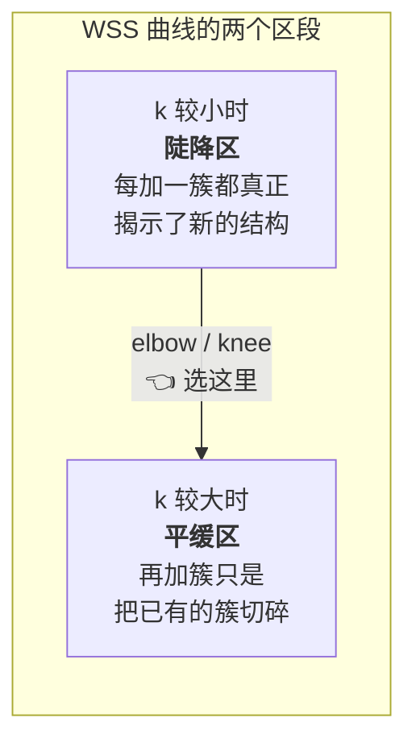

**读法**:肘点左边,增加簇数带来的 WSS 下降很值;肘点右边,增加簇数几乎不再改善——那就说明你已经把真实存在的结构挖完了,再分下去只是在切割噪声。

最后讲师提醒:**这两条路可以合起来走**——"你当然可以把这个结果和你的领域知识结合起来,或许能得到一个更好的 $k$ 的估计。"

---

## §9 R 实战:给 620 名高中生分组

Slides 第 16–21 页是一个完整的端到端例子。讲师说:*"我用 R 语言展示,但你很容易把它转成 Python。"*

### 9.1 任务与数据

> **Task: Group 620 high school seniors based on their grades in "English", "Math", and "Science".**
> (依据英语、数学、科学三科成绩,把 620 名高三学生分组。)

回答那两个必答问题:**object = 学生**($m = 620$);**attributes = 三科分数**($n = 3$)。所以我们要在三维空间里对 620 个点做聚类。

```r
kmdata_orig = as.matrix(grade_input[, c("Student","English","Math","Science")])
kmdata <- kmdata_orig[, 2:4]
kmdata[1:10, ]
```

输出(前 10 行):

```
      English Math Science
 [1,]      99   96      97
 [2,]      99   96      97
 [3,]      98   97      97
 [4,]      95  100      95
 [5,]      95   96      96
 ...
```

**注意第二行 `kmdata <- kmdata_orig[, 2:4]` 这个细节**:它把 `Student`(学号)那一列**丢掉了**,只留下第 2–4 列的三科分数。这不是随手写的——学号是**标识符 (identifier)**,不是可测属性。如果把它留在数据里,K-means 会把"学号 001 和学号 002 很接近"当成一种相似性来用,结果完全无意义。这正是 §11.1 "该选哪些属性"的第一课,而且是最常见的实战错误之一。

### 9.2 第一步:算 WSS,画肘图

```r
wss <- numeric(15)
for (k in 1:15) wss[k] <- sum(kmeans(kmdata, centers=k, nstart=25)$withinss)

plot(1:15, wss, type="b", xlab="Number of Clusters", ylab="Within Sum of Squares")
```

**逐行读**:

- `wss <- numeric(15)`:开一个长度 15 的数组存结果;
- `for (k in 1:15)`:$k$ 从 1 试到 15;
- `kmeans(kmdata, centers=k, nstart=25)`:调用 K-means,`centers=k` 就是簇数;
- `$withinss`:取出**每一簇各自的**簇内平方和(一个长度为 $k$ 的向量);
- `sum(...)`:把它们加起来,得到**总的** WSS——也就是 $J$。

讲师强调:**"你不需要自己计算这个值。当你调用 R 函数或 Python 函数时,它会自动给你 WSS。"** 你要做的是**读懂它**。

**关于 `nstart=25`**——slides 用红字注解:*"The `nstart` argument sets the number of random initial configurations for the algorithm. It runs the entire k-means process multiple times and selects the best result."*(`nstart` 设定随机初始配置的数量;它把整个 K-means 流程跑很多遍,然后挑最好的结果。)这个参数的**理由**在 §12.1,现在先知道它存在。

**结果**:得到的 WSS 曲线在 $k=1$ 时约 270000,$k=2$ 时骤降到约 160000,$k=3$ 约 90000,之后趋于平缓。讲师看图后的判断:**"你发现这个,你可以把值设为 3。"**

### 9.3 第二步:正式聚类

```r
km = kmeans(kmdata, 3, nstart=25)
km
```

输出(这是必须能逐行读懂的部分):

```
K-means clustering with 3 clusters of sizes 158, 218, 244

Cluster means:
   English      Math   Science
1 97.21519  93.37342  94.86076
2 73.22018  64.62844  65.84862
3 85.84426  79.68033  81.50820

Clustering vector:
  [1] 1 1 1 1 1 1 1 1 1 1 1 1 1 1 ...
```

**逐块解读**:

| 输出块 | 含义 |
|---|---|
| `3 clusters of sizes 158, 218, 244` | 三个簇分别有多少个学生。**注意检查有没有极小的簇**(见 §10) |
| `Cluster means` | 三个质心的坐标,每行是一个 $\bar{\mathbf{x}}_j \in \mathbb{R}^3$ |
| `Clustering vector` | 长度 620 的整数向量,第 $i$ 个元素 = 第 $i$ 个学生所属的簇编号。**这就是 $r_{ij}$ 的实际形态** |

Slides 用红字注解 clustering vector:*"an integer vector indicating the final cluster assignment for each individual observation (row) in your dataset."*

**读出业务含义**——看 Cluster means 那三行:

- 簇 1:英语 97.2、数学 93.4、科学 94.9 → **高分学生**;
- 簇 3:85.8 / 79.7 / 81.5 → **中等学生**;
- 簇 2:73.2 / 64.6 / 65.8 → **低分学生**。

讲师的评论:*"从三个簇你大致理解了:一个簇是低分学生,一个簇是高分的优秀学生,还有一个簇介于两者之间。"* 注意这里三科分数是**齐头并进**的(高分学生三科都高),这暗示三科成绩本身高度相关——一个与 §11.4 呼应的观察。

### 9.4 第三步:读懂剩下的诊断量

```
Within cluster sum of squares by cluster:
[1]  6692.589 34806.339 22984.131
 (between_SS / total_SS =  76.5 %)

Available components:
[1] "cluster"  "centers"  "totss"     "withinss"  "tot.withinss"
[6] "betweenss" "size"    "iter"      "ifault"
```

**第一行**是 `withinss`——**每一簇各自的**残差平方和。讲师说了一个很值得亲手验证的事实:

> *"有趣的是,如果你把它们加起来,你就得到 total within cluster(总簇内平方和);而且信不信由你,如果你把这三个加起来,你会精确地复现出你之前在 `wss[3]` 里记录的那个值。"*

Slides 右下角就演示了这个验证:

```r
c( wss[3] , sum(km$withinss) )
[1] 64483.06 64483.06
```

确实一致($6692.589 + 34806.339 + 22984.131 = 64483.06$)。**这条恒等式帮你把 §8 的 WSS 曲线和 §9 的单次聚类输出对应起来:曲线上 $k=3$ 那个点,就是这次聚类的 `tot.withinss`。**

**第二行 `between_SS / total_SS = 76.5%`** 是最需要理解的指标。Slides 顶部用红字给了完整定义:

> *"In R's kmeans function, `total_ss` measures the **total variance of the dataset**, while `between_ss` measures the **variance between different clusters**. They are calculated using squared Euclidean distances. By definition: **`totss = betweenss + tot.withinss`**"*

把这条恒等式拆开理解——这是本节的核心:

$$
\underbrace{\text{totss}}_{\text{数据的总变异}} = \underbrace{\text{betweenss}}_{\text{簇\textbf{之间}的变异(被聚类"解释"了的)}} + \underbrace{\text{tot.withinss}}_{\text{簇\textbf{内部}的变异(残差,}=J)}
$$

**总变异是固定的**(它只取决于数据本身,和你怎么聚类无关)。聚类做的事情,是把这块固定的"变异蛋糕"切成两份:一份是簇与簇之间的差异,一份是簇内部的残留差异。**你希望前者尽量大、后者尽量小。**

于是 `betweenss/totss` 这个比值就是一个天然的质量指标:

- 它的取值范围是 **0 到 1**(即 0% 到 100%);
- 讲师:**"这个值越高,说明数据被分得越好。"**
- 76.5% 的含义:数据总变异中有 76.5% 被"学生属于哪个成绩档"所解释,剩下 23.5% 是同档学生之间的个体差异。

> 📎 **拓展(超出 slides)** — 如果你上周学过 ANOVA,应该会觉得这个分解眼熟:它和 ANOVA 的 $SS_{total} = SS_{between} + SS_{within}$ 是**同一个分解**,`betweenss/totss` 相当于 $R^2$。区别在于 ANOVA 的分组是事先给定的,而 K-means 是**自己找出**分组来最大化这个比值。这也解释了为什么这个比值**不能**用来选 $k$:和 WSS 一样,它随 $k$ 增大单调上升。

**`Available components`** 列出了 `km` 对象里能取用的所有字段:

| 组件 | 含义 |
|---|---|
| `cluster` | 每个观测的簇归属(即 clustering vector) |
| `centers` | 各簇质心 |
| `totss` | 总平方和 |
| `withinss` | 各簇的簇内平方和(向量) |
| `tot.withinss` | 簇内平方和总计 = **WSS = $J$** |
| `betweenss` | 簇间平方和 |
| `size` | 各簇样本数 |
| `iter` | 迭代次数 |
| `ifault` | 诊断/错误标记 |

讲师在这里说了一段能代表本课程整体理念的话:

> **"你不需要自己去计算它们,结果会直接给你。但你需要理解每一个变量的含义——这很重要。否则即使你拿到了数值,你也不知道这个值意味着什么、这个值好不好。这就是本课程想强调的东西。"**

### 9.5 第四步:可视化

数据是三维的,可以直接做交互式 3D 散点图,但 slides 采用的是更实用的办法:**画多个二维投影**(English–Math、Science–English 等),每张图上用不同颜色标出三个簇,并用醒目的色块标出各簇质心的位置。

讲师说,从图上能直接看出三个簇沿一条对角线依次排开(低分、中等、高分),这与 Cluster means 给出的数值结论互相印证。

**这一步不是可有可无的装饰。** 回忆 Week 3 的核心教训——描述性统计会骗人(Anscombe's quartet)。同样地,`betweenss/totss = 76.5%` 这个数字本身也可能掩盖诡异的簇形状。讲师在本讲多处反复强调 *"take advantage of visualization tools for diagnostics"*(善用可视化工具做诊断),这正是 Week 3 与 Week 4 的接口。

---

## §10 诊断:这个聚类结果到底好不好

跑完聚类不等于完事。Slides 第 22–23 页给出一套必问的问题。

### 10.1 三个必问的问题

> **The following questions shall be asked:**
> 1. **Are the clusters well separated from each other?**(各簇之间是否分离良好?)
> 2. **Do any of the clusters have only a few points? (Or even empty?)**(有没有哪个簇只包含很少的点,甚至是空的?)
> 3. **Do any of the centroids appear to be too close to each other?**(有没有哪些质心彼此过于接近?)

讲师逐条给出了"发现问题后该怎么想":

**问题 1 · 分离度**——这是首先要关心的,因为聚类的目的就是分开不同类型的数据。**怎么查**:看可视化,或者看 `betweenss/totss` 的比值(§9.4)。

**问题 2 · 极小簇或空簇**——如果某个簇只有很少几个点,通常意味着两种情况之一:

- 它其实是 **outlier(离群点)**;
- 你**不必要地**把本该是一个簇的东西拆开了。

讲师还给了一个非常实际的踩坑提醒:

> **"要小心。如果你直接调用某个 K-means 函数而没有正确设置 flag,有时你会发现:虽然你设定了 $k = 10$,最终却只得到 9 个簇,因为其中一个变成了空簇。"**

(空簇的成因:某个初始质心太偏,所有点都离别的质心更近,于是没有任何点被指派给它。)

**问题 3 · 质心过近**——如果两个簇的中心挨得很近,说明它们本来就不该分开。讲师:*"那你就要检查你设的 $k$ 值是不是过大了 (excessively large),或许你需要考虑减小 $k$。"*

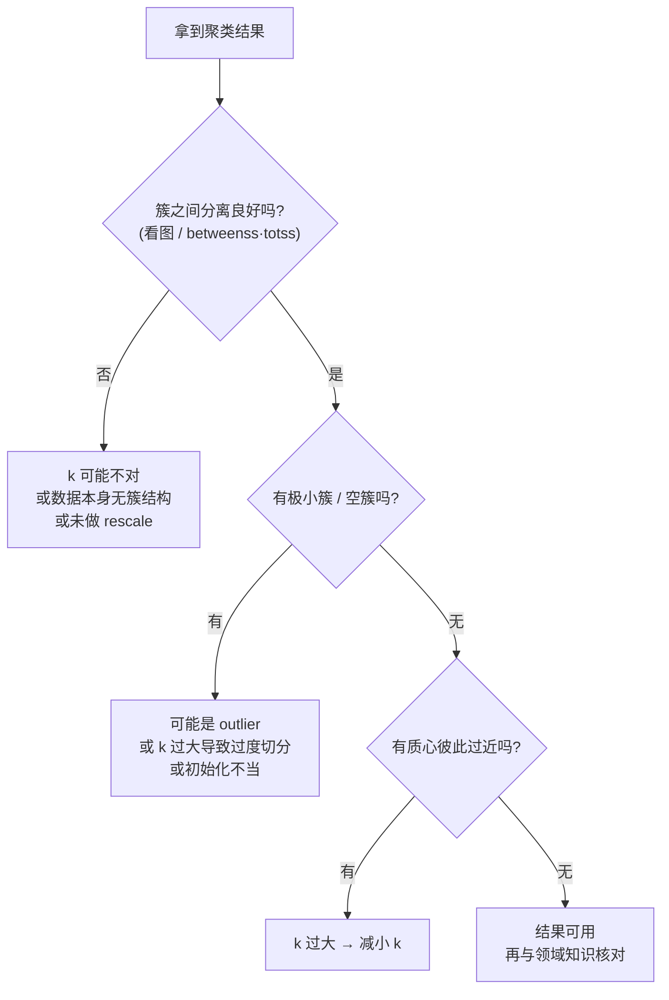

### 10.2 一条贯穿始终的原则

Slides 第 23 页只有一句话,但它是本讲最该背下来的原则之一:

> **"If using more clusters does not better distinguish the groups, it is almost certainly better to go with fewer clusters."**
> (如果用更多的簇并不能更好地区分这些组,那么几乎可以肯定,用更少的簇会更好。)

Slides 在这句话下面写着 *"(Please review the WSS plot…)"* ——因为这条原则和 elbow method 是**同一件事的两种说法**。讲师带大家回看 WSS 曲线时说:

> *"在 4 之后,如果你继续增加,增加 $k$ 值带来的收益会越来越少。这种情况下就是说,你最好停在 4。再往 6 或 8 走,不是个好主意……那意味着(增加 $k$)不能有效地让 $J$ 下降。"*

**把 §8.3、§8.4 和这条原则连起来**:WSS 必然随 $k$ 单调下降 → 所以不能选"WSS 最小" → 要看下降速率 → 速率变缓意味着新增的簇没有揭示真实结构 → **奥卡姆剃刀:选更简单(更少簇)的解释**。

(注意:讲师这里的"停在 4"用的是 slides 第 15 页那张示意图,而 §9 的学生数据肘点在 3。这是两个不同的例子,别记混。)

---

## §11 聚类之前:那些决定成败的数据决策

这一节回答 §3 埋下的伏笔:既然相似性由你定义,那你到底该怎么定义?Slides 第 24–28 页把这些决策集中列出。讲师给这一节配了一个非常重要的框架性问题:

> **"你可以想一想,在 big data lifecycle 的哪一步需要考虑这些问题?"**

答案是 **Phase 1 Discovery** 和 **Phase 2 Data Preparation**——**都在建模之前**。这是本节的元教训:**聚类的成败,大半在你调用 `kmeans()` 之前就已经决定了。**

Slides 把这些决策概括为三问:

> - **What object attributes shall be included in clustering analysis?**(该把哪些属性纳入聚类分析?)
> - **What unit of measure shall be used for each attribute?**(每个属性该用什么计量单位?)
> - **Do the attributes need to be rescaled?**(属性需要重新缩放吗?)

### 11.1 该选哪些属性

**第一层考虑:与目标相关吗?** 讲师说这要"回溯到非常早期的阶段——你打算如何表示你的数据?你可能收集了很多属性,但你打算用哪一组来表示它们?" 判断标准是**项目的目标**:不相关的属性,忘掉它们、丢掉它们;重要的属性,确保纳入。(§9.1 丢掉学号列就是这一条的最简单应用。)

**第二层考虑:新对象上能拿到吗?** Slides:*"Whether it will be known for a new object?"* 讲师的解释很实际:得到聚类结构之后,你可能想把一个**新**数据归入某一簇;但如果这个新数据缺少某个属性,**你就算不了距离**。所以在选属性时就要想清楚:这个属性在未来的新数据上是否可得。

**第三层考虑:数量要少。** Slides:*"Best to reduce the number of attributes to the extent of possible."*

### 11.2 为什么要"避免使用太多变量"

Slides 只写了 "Avoid using too many variables (Why?)",把答案留给了课堂。讲师给了**三个**理由,请分开记:

**理由 1 · 噪声累积**——*"如果你使用大量属性,这些属性可能带来噪声。你用的属性越多,你带进距离计算里的噪声就越多。"* 每个属性都有测量误差,而距离公式是把**所有**维度的差异加起来的,所以噪声也在累加。

**理由 2 · Curse of dimensionality(维数灾难)**——这是最重要的理由,讲师专门点了名:

> **"你用的属性越多,空间的维度就越高。而在高维空间里,点是散布开的,不同点之间的距离会变得彼此相似 (become similar)。这意味着你将无法在高维空间中识别出清晰的聚类结构。"**

把这句话想透:聚类的全部依据是"有的点近、有的点远"。而在高维空间中,**所有点对之间的距离趋于相同**——最近的点和最远的点差不多远。当"远近"失去区分度,聚类就失去了立足点。

**理由 3 · 计算效率**——*"如果你用很多变量,计算距离要花时间,你会降低计算效率。"*

> 📎 **拓展(超出 slides)** — 维数灾难的一个直观解释:在 $n$ 维单位立方体里随机撒点,当 $n$ 增大时,点几乎全部集中在立方体的"角落和表皮"附近,中心几乎是空的。于是任意两点的距离都被这些高维的"角"拉扯得趋于一个共同值。这个现象是 §14.4 中 DBSCAN 在高维数据上失效的**同一个**根本原因,也是 §15 的 SOM 之所以有用的原因之一。

### 11.3 单位与缩放:为什么必须做

Slides 给出的理由是:**"One attribute could have a disproportionate effect"**(某个属性可能产生不成比例的影响),并附上一个提示:**"Height vs. Weight — Can you connect this to Euclidean distance?"**

**这个提示就是考题的形态,我们把它答完整。** 讲师带着算了一遍:

- 学生的**身高**范围大约 1.5 m 到 2.0 m → 跨度 **0.5**;
- 学生的**体重**范围大约 50 kg 到 100 kg → 跨度 **50**。

现在回到 Euclidean distance:

$$
d = \sqrt{(\Delta \text{height})^2 + (\Delta \text{weight})^2}
$$

身高之差最大贡献 $0.5^2 = 0.25$,体重之差最大贡献 $50^2 = 2500$——相差**四个数量级**。讲师的结论:

> **"两个学生之间的相似性将被他们体重的差异所支配 (dominated)。因为体重变化显著,而身高只有很小的变化。这意味着身高实际上完全没有起到作用。而这不是我们想要的——既然我们纳入了身高,就说明它是一个重要的属性。"**

**这就是那个矛盾的核心**:你之所以把某个属性放进来,是因为你认为它重要;但如果不做处理,数值范围小的属性会被彻底淹没,等于**你以为你用了它,其实没有**。(回看 §6.1 那个 18.0006 的计算——身高贡献 0.0225,体重贡献 324,一模一样的问题。)

**解决办法一:换单位。** 讲师举例:把身高从米换成厘米,范围变成 150–200,跨度也是 50——现在两者可比了。Slides 第 27 页用真实数据展示了这一点:同一份 age–height 数据,height 用 cm 和用 m,**聚类结果不一样**。所以 slides 的标题就是 **"Units of measure could affect clustering result"**。

**解决办法二:rescaling(重新缩放)。** 换单位不总是够用——讲师说:*"即使你换了单位,你也只有有限的几个选项:米、厘米、毫米。所以你仍然无法让所有属性落在同一个范围内。"* 这时就要做缩放。

Slides 第 28 页给的方法:**"Divide each attribute by its standard deviation."**(把每个属性除以它自己的标准差。)

Slides 第 24 页给的是更完整的 **Z-score** 版本:

> *"To calculate a Z-score, you subtract the mean from your data point and divide the result by the standard deviation."*

$$
z = \frac{x - \mu}{\sigma}
$$

其中 $\mu$ 是该属性的均值,$\sigma$ 是该属性的标准差。讲师解释效果:*"这会让你的数据以均值为中心,大致落在 $-1,1$、$-2,2$ 这样的范围里。它们变得可比了。"*

**为什么除以 $\sigma$ 有效**:标准差衡量的是这个属性**自身的**变异幅度。除以它之后,每个属性的变异幅度都变成 1——于是没有哪个属性能靠"数值大"来支配距离,**每个属性在距离里的话语权是均等的**。

| 方法 | 公式 | 效果 |
|---|---|---|
| 换单位 | $x' = c \cdot x$ | 粗调,选项有限(m/cm/mm) |
| 除以标准差 | $x' = x / \sigma$ | 各属性变异幅度统一为 1 |
| Z-score(标准化) | $z = (x - \mu)/\sigma$ | 均值归 0、标准差归 1 |

**缩放会改变结果——而且往往改得更合理。** Slides 第 28 页对比了 age–height 数据缩放前后的聚类。讲师读图:

> *"总的来说,我认为缩放之后这个聚类在概念上更合理。为什么?因为这一部分对应青少年,他们身高较低、年龄也小,处于生长发育期;而这一部分对应成年人,因为过了某个年龄之后身高就不再变化了。"*

缩放后的两个簇分别对应"发育期"和"成年期",这是有明确现实含义的划分。但讲师立刻补了一句谨慎的话:**"不过这还是取决于具体的数据和应用。"** ——**不要把"必须做 Z-score"当成教条**,要看结果是否符合领域常识。

### 11.4 避免高度相关的属性:一个隐蔽的加权错误

Slides:**"Avoid using several similar variables (Why?)"** 讲师给的解释很精彩,值得完整理解,因为它揭示了一个很容易忽视的机制。

**先定义"相似"**:讲师说,similar 在这里意味着**高度相关 (highly correlated)**。

**为什么有害?用一个极端例子来看。** 讲师说:设想你把一个特征**复制粘贴成好几列**,然后把它们全都放进距离计算。回到欧氏距离:假设你有 $n$ 个属性,你对每个属性都计算差的平方并求和。如果其中有 3 列其实是同一个东西,那么这个信息就被**加了 3 遍**:

$$
d^2 = \underbrace{(\Delta a)^2 + (\Delta a)^2 + (\Delta a)^2}_{\text{同一个属性算了三遍}} + (\Delta b)^2 + \cdots = 3(\Delta a)^2 + (\Delta b)^2 + \cdots
$$

讲师的结论:

> **"这意味着你实际上给了这个特征更多的权重,让这个特征支配了距离,因为你把它复制粘贴了很多次。这是错的。也就是说,如果你使用了多个相似的属性,你就不必要地抬高了它的权重,给了它更多的话语权来决定距离——这可能不是你想要的。"**

**注意这个错误比 §11.3 的单位问题更隐蔽**:单位问题你至少能从"米 vs 千克"看出来;而相关属性问题在数据表里看不出任何异常——七列属性,每列都长得很正常,但其中两列携带的是同一份信息。

**怎么发现?** 讲师说:*"这很容易——可视化。"* 具体就是 Week 3 学过的 **scatterplot matrix(散点图矩阵)**。

Slides 第 26 页给了一个 7 属性的散点图矩阵,配文 **"What is your observation?"** 课堂上的分析过程:

- **Attribute 3 与 Attribute 7**:散点几乎落在一条 $y = x$ 的直线上——**近乎完美相关**。讲师:*"绝对必须去掉其中一个。"*
- **Attribute 1 与 Attribute 3**:也高度相关,但不如 3–7 那么极端;
- **Attribute 2 与 Attribute 3**:同样需要考虑;
- 其余各对看起来没问题。

**处理办法**(Slides 第 25 页):

> - **Identify any highly correlated attributes**(识别高度相关的属性);
> - **Feature selection, PCA, etc.**(特征选择、主成分分析等)。

讲师补充说,除了看图,还可以**计算每一对特征之间的 correlation coefficient(相关系数)**来定量识别;找到之后,要么**删掉其中一个**,要么**把它们合并成单个特征**。而 **PCA** 正是"把高度相关的属性合并、以减少属性总数"的标准工具。

讲师最后拔高了一层,这句话请记住:

> **"这两点(少用变量、避免相似变量)不仅对聚类重要,它们对分类、以及任何数据挖掘、机器学习、大数据分析算法都同样重要。"**

### 11.5 本节小结:调用 `kmeans()` 之前的检查表

| # | 决策 | 为什么 | 手段 |
|---|---|---|---|
| 1 | 选哪些属性 | 与目标无关的属性只会添乱 | 领域知识 + 项目目标 |
| 2 | 新对象上可得吗 | 否则无法把新数据归簇 | 数据可得性审查 |
| 3 | 属性数量要少 | 噪声累积 / 维数灾难 / 计算成本 | 特征选择、PCA |
| 4 | 剔除高相关属性 | 等于给同一信息重复加权 | Scatterplot matrix、相关系数、PCA |
| 5 | 统一单位 | 范围大的属性支配 Euclidean distance | 换单位 |
| 6 | Rescale / Z-score | 让各属性在距离中话语权均等 | $x/\sigma$ 或 $(x-\mu)/\sigma$ |

---

## §12 其他必须知道的注意事项

### 12.1 K-means 对初始位置敏感 —— 以及 `nstart` 到底在干什么

Slides 第 29 页:**"K-means clustering is sensitive to the starting positions of the initial centroids."**

**为什么?** 讲师把这个问题接回了 §7 的优化视角,这是本讲最漂亮的一处前后呼应:

> *"记得我们说过,K-means 本质上是在求解那个优化问题。不幸的是,当用 K-means 来求解时,**你得不到 global optimum(全局最优)**。K-means 只能给你 **local optimum(局部最优)**,因为可能存在很多个局部最优解。而你最终落到哪一个,取决于你对质心的初始化。"*

**这就是 §7.1 那个 $k^n$ 的代价**:搜索空间大到无法穷举,所以我们用了一个贪心的迭代算法;贪心算法只保证每一步都在下降,不保证降到全局最低点。就像下山时永远朝着最陡的方向走——你一定会到达某个谷底,但不一定是最深的那个。

**怎么办?** 办法出乎意料地朴素,讲师说 *"很简单"*:

1. 对同一个 $k$,把 K-means **跑很多次**;
2. **每次都随机初始化**质心;
3. 得到多个结果后,**计算每个结果的 $J$(即 WSS)**;
4. **选 WSS 最低的那一个**。

**这就是 `nstart` 的全部含义。** 讲师回到 §9 的代码:*"现在我可以告诉你 25 是什么意思了。你看那个 25——这是默认值。当你调用函数时它就在那里。它的意思是:当你设定 $k=3$ 时,它会自动把 K-means 跑 25 遍,为这 25 个结果各算一个 $J$,选出 WSS 最低的那个最优结果输出给你。"*

评价:*"这对你来说很方便,你不需要自己写一个 for 循环来做这件事。"*

**跨语言对照(考点)**:

| 语言 | 函数 | 参数 |
|---|---|---|
| R | `kmeans()` | `nstart = 25` |
| Python | scikit-learn `KMeans()` | `n_init = 25` |

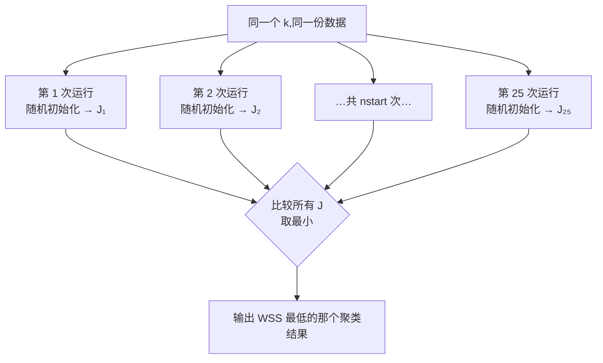

### 12.2 其他距离度量

Slides:**"Other distances — Manhattan distance & the median of cluster."**

讲师说这不是默认选项,但也是可用的距离。**注意这一行里的配对关系**:Manhattan distance 与 **median(中位数)** 是搭配出现的,而 Euclidean distance 与 **mean(均值)** 搭配。

> 📎 **拓展(超出 slides)** — 为什么这样配对?因为"最优中心"的定义取决于你用什么距离:最小化**平方欧氏距离**之和的点是**均值**;最小化**曼哈顿距离**之和的点是**中位数**。所以换了距离就要换中心的算法,由此得到的变体通常叫 **k-medians**。
> Manhattan distance(曼哈顿距离,也叫 $L_1$ 距离)的定义是 $d(\mathbf{x},\mathbf{y}) = \sum_{i=1}^{n} |x_i - y_i|$——不平方、不开方,直接求各维度差的绝对值之和。因为不平方,它对 **outlier 更不敏感**(中位数比均值稳健,是同一个道理)。

### 12.3 K-modes:处理类别型数据

Slides 第 30 页给出 K-means 的一个根本限制:

> **"K-means clustering is easily applied to numeric data where the concept of distance can naturally be applied."**
> (K-means 易于应用在数值型数据上,因为距离的概念在那里可以自然地应用。)

讲师点明了这个限制的来源:到目前为止我们讨论的身高、体重、年龄、分数**全都是数值型的**。但如果你要处理 **categorical data(类别型数据)**——比如属性取值是 "Tuesday/Wednesday"、"September/February"、"A/B/C"——**你没法用 K-means**。为什么?因为你无法对 "Tuesday" 和 "September" 做减法,Euclidean distance 的 $(x_i - y_i)$ 直接失去意义。

**解决方案:K-modes。**

> **"K-modes handles categorical data — Use the number of differences in the respective components of the attributes."**
> (K-modes 处理类别型数据——使用两个对象在各对应分量上**不同的个数**作为距离。)

Slides 直接给了一道题:

> **"What is the distance between (a,b,e,d) and (d,d,d,d)?"**

**逐位比较**:

| 位置 | 1 | 2 | 3 | 4 |
|---|---|---|---|---|
| 对象 1 | a | b | e | d |
| 对象 2 | d | d | d | d |
| 相同? | ✗ | ✗ | ✗ | ✓ |

三个位置不同,一个位置相同。**距离 = 3。**

讲师提到这种距离"对应于编辑距离 (edit distance)"——即把一个数据变成另一个数据需要多少步。

> 📎 **拓展(超出 slides)** — 这个"逐位数不同"的距离,标准名称是 **Hamming distance(汉明距离)**。名字本身不是本课考点,但知道它有助于你在其他资料里认出这个概念。另外从名字也能看出方法的对称性:K-**means** 用**均值**做中心,K-**modes** 用 **mode(众数)** 做中心——因为类别型数据没有"平均值",但有"出现最多的那个取值"。

**实现**:R 中是 `kmode()` 函数。讲师说因为时间关系不展开。

### 12.4 K-means 部分总结(Slides 第 31 页)

Slides 用一页做了收束,**这一页几乎就是一份考纲**:

> **To use k-means properly:**
> - **Properly select and scale the attribute values**(恰当地选择并缩放属性值)→ §11
> - **Ensure that the distance between objects is meaningful**(确保对象间的距离是有意义的)→ §3、§12.3
> - **Choose the number of clusters, $k$**(选择簇数 $k$)→ §8
> - **If k-means is not appropriate, consider others**(若 K-means 不合适,考虑其他方法)→ §13–§15
> - **Take advantage of visualization tools for diagnostics**(善用可视化工具做诊断)→ §9.5、§10

讲师逐条复述时补充的要点:如果是类别型数据用 K-modes;如果是数值型数据用 Euclidean 或 Manhattan distance;用 WSS 的肘点选 $k$;**始终检查聚类结果——它们是否分离良好,是否与你的领域知识、你的直觉理解相一致**;别盲目相信输出;用可视化检查特征相关性,移除高度相关的属性。

**"别简单地相信输出 (Don't simply believe the output)"** 这句话是本讲的精神。

### 12.5 Slides 留下的思考题(建议自己先答一遍)

> **"At which steps of the big data analytic lifecycle should you consider these issues?"**
> (在大数据分析生命周期的哪些步骤,你应当考虑这些问题?)

讲师把它留给了学生,并说 *"我认为你可以把这些问题映射回大数据生命周期,这有助于你更好地理解两部分内容,把它们联系起来。"* 这是一道很典型的综合题。参考答案:

| 本讲的议题 | 对应 Lifecycle 阶段 | 理由 |
|---|---|---|
| $k$ 的合理猜测、业务上"应该有几群" | **Phase 1 · Discovery** | 需要与 stakeholder 交谈获得 domain knowledge |
| 选哪些属性、属性在新数据上是否可得 | **Phase 1 · Discovery** → **Phase 2 · Data Preparation** | 关乎数据表示方式与数据可得性 |
| 单位统一、rescaling / Z-score | **Phase 2 · Data Preparation** | 典型的数据变换(conditioning)工作 |
| 用 scatterplot matrix 查相关性、PCA / 特征选择 | **Phase 2 · Data Preparation** | 探索性分析 + 降维 |
| 选择 K-means / DBSCAN / hierarchical | **Phase 3 · Model Planning** | 选方法就是 model planning |
| 跑 `kmeans()`、调 `nstart`、用 WSS 定 $k$ | **Phase 4 · Model Building** | 实际建模与调参 |
| 诊断(分离度、空簇、质心过近)、可视化 | **Phase 4 · Model Building** → **Phase 5 · Communicate Results** | 先自查,再向 stakeholder 解释每一簇的业务含义 |

**注意 Week 2 强调过 lifecycle 是可以回退的**:如果 Phase 4 的诊断发现簇分离得很差,你要退回 Phase 2 重新处理数据(比如做 rescaling),甚至退回 Phase 1 重新审视目标。

---

# Part III · 当 K-means 不合适时:另外两族算法

§12.4 的收束里有一条 **"If k-means is not appropriate, consider others"**。接下来的两节就是那个 "others"。理解它们的关键,不是记住流程,而是记住**它们各自解除了 K-means 的哪一条限制**:

| 方法 | 解除的限制 |
|---|---|
| **Hierarchical clustering** | 不需要事先指定 $k$ |
| **DBSCAN** | 不假设簇是球形;能识别噪声;不需要事先指定 $k$ |

## §13 Hierarchical Clustering(层次聚类)

### 13.1 动机:能不能别逼我先说出 $k$

回顾 K-means 的第一步:*"Choose the value of $k$……"* 我们为此发明了 WSS 和肘点法,但那毕竟只是一个 heuristic。有没有办法**根本不需要**预先指定 $k$?

有。讲师开门见山:**"层次聚类的优点是,你不需要指定 $k$。"**

它的思路是:**不输出一个划分,而是输出一整棵"合并的历史"**——从"每个点自成一簇"一路合并到"所有点同属一簇"。这棵树把**所有可能的 $k$ 值对应的划分同时呈现出来**了,你事后再决定要在哪一层切开。

### 13.2 两个方向

Slides 列出两种:

- **Hierarchical agglomerative clustering(层次凝聚聚类)**——**自底向上**:每个对象各自是一个簇,不断合并最相似的两个,直到只剩一个。
- **Hierarchical divisive clustering(层次分裂聚类)**——**自顶向下**:一开始所有数据在一个簇里,然后不断分裂:1 → 2 → 3 → 4 → 5……

讲师指出实践中的选择:**"凝聚式的计算效率更高,所以我们通常用凝聚式。"**

### 13.3 凝聚式的三个步骤

Slides 的正式表述:

> 1. **Each object is initially treated as a cluster.**(每个对象初始时被视为一个簇。)
> 2. **The two most similar clusters are then combined in each step.**(每一步把最相似的两个簇合并。)
> 3. **This process is repeated until one cluster (containing all objects) exists.**(重复此过程,直到只存在一个包含全部对象的簇。)

### 13.4 跟着 slides 的例子走一遍

Slides 第 32 页画了一棵 6 个对象的树。讲师完整地讲了一遍,我们把它复原成表格——**这是理解 dendrogram(树状图)的最好方式**:

| 步骤 | 当前的"簇"清单 | 计算什么 | 合并谁 | 新簇编号 |
|---|---|---|---|---|
| 0 | 1, 2, 3, 4, 5, 6 | 全部两两之间的 pairwise distance | — | — |
| 1 | 1, 2, 3, 4, 5, 6 | 发现 **2 与 3** 最相似 | 2 + 3 | **7** |
| 2 | 1, **7**, 4, 5, 6(5 个) | 重算这 5 个之间的 pairwise distance | 发现 **4 与 5** 距离最短 → 4 + 5 | **8** |
| 3 | 1, 7, **8**, 6(4 个) | 再重算 | 发现 **8 与 6** 最近 → 8 + 6 | **9** |
| 4 | 1, 7, **9**(3 个) | 再重算 | 1 + 7 | **10** |
| 5 | **10**, **9**(2 个) | — | 10 + 9 | **11**(根节点,含全部 6 个对象) |

讲师总结:*"最后你把所有东西合并成一个大簇。你看,这是一个层次结构 (hierarchy),你不需要指定 $k$ 的数量。"*

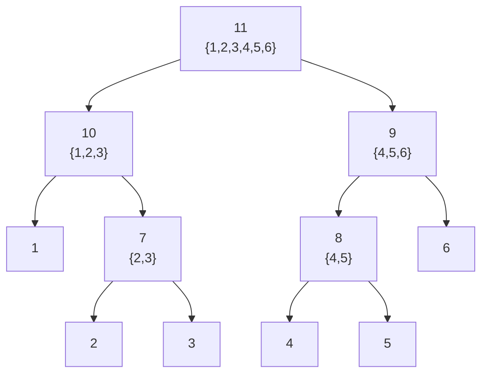

**注意每一步都要"重算"**:合并之后,新簇与其余各簇的距离必须重新计算。这就引出了下一个、也是本节最重要的问题。

> 📎 **拓展(超出 slides)** — 这棵树画出来就叫 **dendrogram(树状图)**,纵轴通常是合并时的距离。**怎么从树得到具体的 $k$ 个簇?在某个高度上横着切一刀 (cut the dendrogram)**,被切断的分支数就是簇数——切得低得到很多小簇,切得高得到少数大簇。所以"不需要指定 $k$"更准确的说法是:**$k$ 的决定被推迟到了聚类之后**,而不是消失了。挑切割高度时通常找"树枝特别长的一段"(说明那一次合并跨越了很大的距离,不该合并)。

### 13.5 核心问题:两个"簇"之间的距离怎么算?—— Linkage methods

讲师把问题提得很准:

> *"那么问题是:我怎么决定哪两个点、或者哪两个簇是最相似的?因为这决定了哪两个点、哪两个簇、或者哪一个点和哪一个簇应该被合并。"*

**点与点的距离我们会算(Euclidean distance),但"一簇 3 个点"和"一簇 4 个点"之间的距离是什么?** 这不是一个有唯一答案的问题——有多种合理定义,每一种叫一个 **linkage method(连接方法)**,而**不同的选择会得到形状完全不同的簇**。

(讲师提醒了一个术语约定:*"即使是单个点,我们在概念上也把它称为一个 cluster。"* 所以"点与点""点与簇""簇与簇"其实是同一个问题。)

**函数接口**(考试可能考参数名):

| 语言 | 函数 | 写法 |
|---|---|---|
| R | `hclust` | `hclust(d, method = "complete", members = NULL)` |
| Python | `linkage` | `linkage(y, method='single', metric='euclidean')` |

注意 `hclust` 的 `h` 就是 hierarchy。两个库都支持 **single / complete / average / centroid / ward** 等多种 method。

下面逐个讲 slides 覆盖的四种。设两个簇为 $u$ 和 $v$(图上画的是 $u$ 有 3 个点、$v$ 有 4 个点)。

#### (1) Single linkage(单连接)

$$
d(u, v) = \min\big(dist(u[i],\ v[j])\big)
$$

**对 $u$ 中所有点 $i$ 与 $v$ 中所有点 $j$,取最短的那条距离。** 也叫 **Nearest Point Algorithm(最近点算法)**。

讲师的讲法:*"我们计算 $u$ 和 $v$ 中每一对点之间的距离,然后取最短的那个。"* 在 slides 的图上,所有配对被画成一束蓝线,其中最短的那条被标成红色。

**它会产生什么形状的簇?** 讲师给了一个很形象的说法:

> **"如果你用这种距离来评估两个簇,你通常会得到像蛇一样的簇,因为它们很容易被连接起来——蛇形的、长链状的簇 (snake, long chain cluster)。"**

**为什么?** 因为只要有**一对**点靠得近,两个簇就会被判为"近"——哪怕它们整体上离得很远。于是簇可以像链条一样一节一节地延伸出去。讲师把 single 称为**乐观的 (optimistic)**——它只看最好的那个证据。

(这个"链式效应 (chaining)"不总是坏事:如果你的簇本来就是细长弯曲的形状,single linkage 反而是对的。)

#### (2) Complete linkage(全连接)

$$
d(u, v) = \max\big(dist(u[i],\ v[j])\big)
$$

**取最长的那条距离。** 也叫 **Farthest Point Algorithm(最远点算法)**,或 Voor Hees Algorithm。

讲师:*"相反的那个叫 complete……我们不用最短,我们用最长。"* 他把 complete 称为**悲观的 (pessimistic)**——它按最坏的证据来判断。

**效果**:产生**球形 (spherical)** 的簇。Slides 用红字给出了使用建议:

> **"Use 'complete' if you want tight, distinct boundaries and expect clear spherical shapes."**
> (如果你想要紧致、界限分明的簇,并且预期簇是清晰的球形,就用 complete。)

**为什么是球形?** 因为要判定两簇为"近",必须**每一对**点都不远——这就强制了簇在各个方向上都紧凑,不允许出现长链。

讲师给了明确的实践建议,记住这句:**"在这四种方法中,我们通常从 complete 开始。因为它通常能给你所需要的结果。"**

#### (3) Average linkage(平均连接,UPGMA)

$$
d(u, v) = \sum_{ij} \frac{d(u[i],\ v[j])}{|u| \cdot |v|}
$$

其中 $|u|$、$|v|$ 是两个簇的 **cardinality(基数,即点数)**。

**读法**:把所有 pairwise distance 加起来,除以配对的总数 $|u| \times |v|$——就是**所有点对距离的平均值**。讲师:*"这很简单,你计算 pairwise distance,然后把这些 pairwise distance 求和,除以 pairwise distance 的总个数。"*

正式名称:**UPGMA — Unweighted Pair Group Method with Arithmetic Mean**(非加权组平均法)。

**定位**:它是 single(最乐观)和 complete(最悲观)之间的**折中**,不被单个极端配对左右。

#### (4) Centroid linkage(质心连接,UPGMC)

$$
dist(s, t) = \|c_s - c_t\|_2
$$

其中 $c_s$、$c_t$ 分别是簇 $s$ 与簇 $t$ 的**质心**。

讲师:*"质心法更简单。你计算 $u$ 簇的质心(均值),计算 $v$ 簇的质心,然后直接算这两者之间的距离。"*

Slides 补了一个细节:当两个簇 $s$ 和 $t$ 被合并成新簇 $u$ 时,**新质心是在 $s$ 和 $t$ 的全部原始对象上重新计算的**;之后 $u$ 与森林中剩余簇 $v$ 的距离,就是两个质心间的 Euclidean distance。

正式名称:**UPGMC — Unweighted Pair Group Method using Centroids**(非加权组质心法)。

**注意这里与 K-means 的呼应**:centroid linkage 用的正是 §6.2 的质心公式。**这四种方法里只有它需要"计算一个新的、虚拟的点"**,其余三种都只用原始点之间的距离。

#### 四种 linkage 对照表(高频考点)

| Method | 定义 | 别名 | 性格 | 产生的簇形状 |
|---|---|---|---|---|
| **single** | $\min dist(u[i], v[j])$ | Nearest Point | 乐观 | 蛇形 / 长链 (chaining) |
| **complete** | $\max dist(u[i], v[j])$ | Farthest Point / Voor Hees | 悲观 | **球形、边界紧致清晰** |
| **average** | 所有点对距离的平均 | UPGMA | 折中 | 介于两者之间 |
| **centroid** | 两簇质心之间的距离 | UPGMC | 折中 | 介于两者之间 |

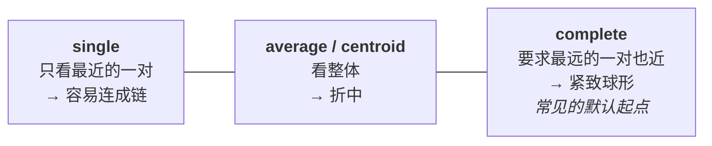

---

## §14 Density-Based Clustering 与 DBSCAN

### 14.1 换一个思路定义"簇"

K-means 定义簇的方式是"离某个中心近";层次聚类是"被逐步合并到一起"。**密度法则给出第三种定义。** Slides 的表述:

> **"Density-based clustering locates regions of high density that are separated from one another by regions of low density. In other words, clusters are dense regions in the data space, separated by regions of lower object density."**
> (基于密度的聚类,定位那些被低密度区域彼此隔开的高密度区域。换言之,簇就是数据空间中的稠密区域,由较低密度的区域分隔开来。)

讲师给了一个非常好的类比,建议记住:

> **"就像你有一片山脉。山峰对应高密度区域,山峰之间的山谷对应低密度区域。这让你可以轻易地把它们分开。"**

在这个图景里,"簇"不再是"围着中心的一团",而是"一片连绵的高地"——**这就允许簇拥有任意的形状**。

### 14.2 密度法的三大特点

Slides 列出 **major features of density-based clustering**:

> - **Discover clusters of arbitrary shape**(能发现任意形状的簇)
> - **Handle and identify noise**(能处理并识别噪声)
> - **Need density parameters as termination condition**(需要密度参数作为终止条件)

讲师对前两条作了对比性的展开,**这段是判断"什么时候该用 DBSCAN 而不是 K-means"的核心依据**:

**关于任意形状**:*"当我们使用 K-means 时,我们通常相信簇会是球形的 (spherical),或者接近球形、接近椭球 (ellipsoid)。但如果你认为簇可能像**蛇**或**香蕉**那样是某种不规则形状,那么直接用 K-means 就不会有好结果。"*

**为什么 K-means 做不到?** 回看 §5.1 里的那条几何观察:K-means 用"离哪个质心近"来划分空间,产生的边界是直线(高维中是超平面),因此每个簇必然是一块凸的、大致球形的区域。**一个 C 形或 U 形的簇,它的两端离自己质心的距离可能比离另一个簇质心还远**——K-means 一定会把它切碎。

**关于噪声**:*"如果你认为你的数据里可能有很多噪声和离群点,那么——K-means 对离群点和噪声是相当敏感的。"*(为什么敏感?因为质心是**均值**,而均值极易被极端值拖拽。一个远处的离群点会把整个质心拉偏。)

**关于维度**(第三个使用条件,讲师额外强调):*"当你的数据维度不高时,也适合用密度法;但如果你的数据是高维的,基于密度的聚类方法就不会有好效果,因为在高维空间里,即使你有大量数据,它们也不会聚在一起……在高维空间中数据是散布的,散布就形不成高密度区域。"*(又是 §11.2 的维数灾难。)

**总结讲师给的适用条件清单**:**任意形状 + 有噪声 + 低维** → 考虑密度法。

### 14.3 DBSCAN 的机制

**全称**:**DBSCAN — Density-Based Spatial Clustering of Applications with Noise**(带噪声的基于密度的空间聚类应用)。讲师提示:*"你看:density、noise、clustering,全在名字里。"* 他还提到把 DBSCAN 的原始论文上传到了 Moodle。

#### (a) 两个参数

DBSCAN 需要你定义两个参数——这就是 §14.2 里那句 "need density parameters":

| 参数 | 符号 | 含义 |
|---|---|---|
| 半径 | $Eps$(epsilon) | 邻域的半径 |
| 密度阈值 | $MinPts$ | 判定为"高密度"所需的最少点数 |

#### (b) 密度的定义

Slides:

> **"Density is estimated for a particular point in the data set by counting the number of points within a specified radius, $Eps$, of that point. This includes the point itself."**
> (某个点的密度,是通过统计以该点为中心、半径 $Eps$ 内的点数来估计的。**这包括该点自身。**)

**注意 "This includes the point itself" 这个细节——考试很容易在这里设陷阱。**

Slides 的例子:点 A 的 $Eps$ 半径内有 7 个点(含 A 自身),所以 **A 的密度 = 7**。

#### (c) 三类点

给定 $MinPts$ 和 $Eps$,数据集中的每个点被归为三类之一。Slides 的例子统一设 **$MinPts = 6$**:

| 类型 | 定义 | Slides 的例子 |
|---|---|---|
| **Core point(核心点)** | 密度 $\ge MinPts$ 的点;位于密度簇的**内部 (interior)** | **A**:密度 = 7 > 6 → core point |
| **Border point(边界点)** | 本身不是 core point,但**落在某个 core point 的邻域内** | **B**:密度 = 4 < 6,不是 core;但 B 落在 core point A 的邻域内 → border point |
| **Noise point(噪声点)** | 既不是 core point 也不是 border point | **C**:密度 = 3 < 6,不是 core;且 C 不落在任何 core point 的邻域内 → noise point |

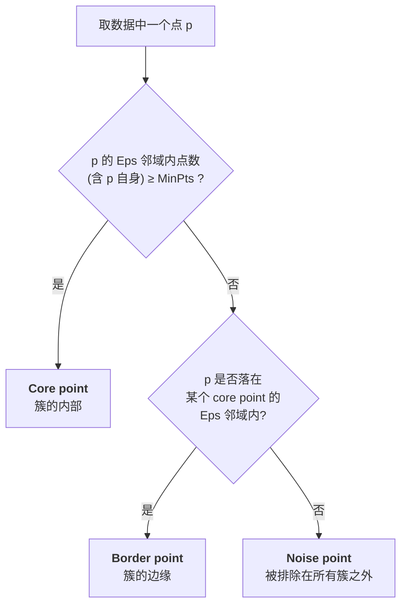

**这三类点的判定是标准考题**,判定顺序必须是:**先判 core,再判 border,剩下的才是 noise**。

#### (d) Eps-connected(Eps 连通)与传递性

在给出算法之前必须先理解这个概念。Slides 用蓝字定义:

> **"Eps-Connected: If Core Point A can see Core Point B within its Eps radius, they are directly connected. If Core Point B can see Core Point C, then Point A and Point C are also connected (by transition)."**
> (若核心点 A 在其 $Eps$ 半径内能"看见"核心点 B,则二者**直接连通**;若核心点 B 又能看见核心点 C,则 A 与 C 也是连通的——通过**传递**。)

讲师给了一个好记的比喻:**"如果你和我相连,我和我的朋友相连,那么你也和我的朋友相连。"**

**这个传递性就是 DBSCAN 能生成任意形状簇的机制**:一条弯曲的高密度带,只要相邻的核心点彼此在 $Eps$ 内,就会一路传递连通,形成一个 C 形、U 形或蛇形的簇。K-means 的"离质心近"没有传递性,所以做不到这一点。

#### (e) 三个步骤

> **Step 1: Label each point as either core, border, or noise point.**
> (把每个点标记为 core / border / noise。)
> **Step 2: Mark each group of $Eps$ connected core points as a separate cluster.**
> (把每一组 $Eps$ 连通的 core points 标记为一个独立的簇。)
> **Step 3: Assign each border point to one of the clusters of its associate core points.**
> (把每个 border point 指派到与其关联的 core point 所属的簇。)

**注意 noise point 从头到尾没有被指派给任何簇**——它们被**排除**了。讲师:*"你能看到,噪声不会被并入任何簇,它们被排除掉了。"*

**这一点是 DBSCAN 相对 K-means 的重要优势**:K-means 强制把**每一个**点都分给某一簇(包括离群点),而 DBSCAN 允许一个点"哪儿都不属于"。因此 **DBSCAN 顺带完成了 outlier detection(离群点检测)**——讲师明确提到:*"这也让你能识别出数据中潜在的噪声和离群数据。"*


#### (f) Slides 的演示例子

Slides 第 43 页用 **$Eps = 10$、$MinPts = 4$** 演示,数据是一幅由散点构成的图案:

1. **Original Points**:一团看不出结构的蓝点;
2. **Mark core, border and noise points**:绿色 = core(集中在图案内部)、蓝色 = border(沿着图案边缘)、红色 = noise(散落在外围);
3. **Mark connected core points**:不同连通分量被染成不同颜色,识别出若干个形状极不规则的簇。

讲师的解读很值得记:*"你能看到蓝色的这些点通常在簇的内部,它们被边界很好地保护着;有核心,靠近核心的地方是边界,边界之外是噪声。"* 以及:

> **"你能看到有 U 形的、T 形的这类形状——这种结果你用 K-means 是得不到的,因为 K-means 倾向于形成球形的簇。如果你把这样的数据交给 K-means,我猜你会得到很多支离破碎、毫无意义的簇。"**

### 14.4 DBSCAN 的性质与失效场景

Slides 第 44 页总结:

> **DBSCAN:**
> - **Resistant to noise and outliers**(抗噪声与离群点)
> - **Can handle clusters of different shapes and sizes**(能处理不同形状与大小的簇)
> - **Computational complexity is similar to K-means**(计算复杂度与 K-means 相近)

**注意第三条**:DBSCAN 的这些优点**不是**用巨大的计算代价换来的。

> **When DBSCAN does not work well:**
> - **Varying densities**(密度不均) → **Can be overcome by using sampling**(可通过采样缓解)
> - **Sparse and high-dimensional data**(稀疏与高维数据) → **Can be overcome by using topology preserving dimension reduction techniques**(可通过保拓扑的降维技术缓解)

**失效原因(slides 用红字给出,是考点)**:

> **"DBSCAN fails on datasets with varying densities because it relies on a single, global density threshold defined by a fixed radius ($Eps$) and a minimum number of points ($MinPts$)."**
> (DBSCAN 在密度不均的数据集上失效,因为它依赖一个由固定半径 $Eps$ 和最小点数 $MinPts$ 定义的**单一全局密度阈值**。)

讲师把这个两难讲得很透彻——**这是标准的简答题**:

> 如果你的数据里有的簇密度高、有的簇密度低,你就很难定出一个统一的阈值:
> - **阈值设高**:低密度的那个簇里没有点能达到 $MinPts$,它整个被当成噪声,**根本分不出来**;
> - **阈值设低**:高密度区域会有过多点相连,原本该分开的簇会**粘连在一起**;而按讲师的另一种说法,阈值设置不当也会让高密度簇变得**支离破碎 (fragmented)**。
>
> 无论怎么设,总有一边是错的。

**补救办法**:对高密度区域做**采样 (sampling)**,把各处的密度拉平。

**关于第二个失效场景(稀疏与高维)**——讲师说:*"如果你的数据稀疏、数据量不够,或者你面对的是高维数据,那么很难得到一个稠密的、点密集的区域。"* 这依然是 §11.2 的维数灾难。

**而这里给出的补救办法,正好把我们带到本讲的最后一部分**:

> **"我们可以降维。这就把我们带到今天讲座的最后一部分:我们可以使用**保拓扑的降维技术 (topology preserving dimension reduction techniques)**。它是什么?它叫 **self-organizing maps**。"**

### 14.5 K-means vs DBSCAN 对照表

| 维度 | **K-means** | **DBSCAN** |
|---|---|---|
| 簇的定义 | 离某个 centroid 最近的一组点 | 由低密度区隔开的高密度区域 |
| 需要预先指定 | $k$(簇数) | $Eps$ 与 $MinPts$(密度参数) |
| 簇的形状 | 球形 / 椭球形(凸) | **任意形状**(U 形、蛇形、香蕉形) |
| 对噪声/离群点 | **敏感**(质心被拉偏),且强制归入某簇 | **抗噪**,显式标记为 noise 并排除 |
| 附带能力 | — | **outlier detection** |
| 密度不均的数据 | 相对不受影响 | **失效**(单一全局阈值) |
| 高维数据 | 也受维数灾难影响,但相对可用 | **失效**(形不成稠密区) |
| 计算复杂度 | — | 与 K-means 相近 |

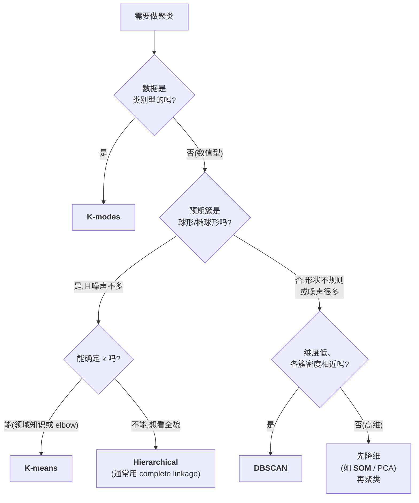

---

# Part IV · Self-Organizing Maps(自组织映射)

> **课堂说明**:讲师在本讲末尾用约 10 分钟介绍 SOM 的基本概念,并说明 **"我会在下周 lecture 开头再讲一次 self-organizing maps"**,因为届时你已经做过 lab 实践、理解会更好。他强烈建议:**"我鼓励每个人用代码去获得更好的理解——请动手玩一玩。"** 因此本部分的定位是:先把概念框架建牢,细节留待下周与 lab 补充。

## §15 SOM:把高维数据摊到一张纸上

### 15.1 动机:我们看不见四维

SOM 的出发点是一个很朴素的困境,讲师说得很生活化:

> 假设我们有高维数据——**高维的意思是超过 3 个属性**,因为作为人类,我们只能看见 2D 或 3D。你看不见 4 维、5 维、10 维空间。但如果我们的数据就住在那样的空间里,**我们该怎么可视化它们?怎么把这些数据搬到一张纸上,让我们能看见它们?**

而且不是随便搬——要**"不带太多扭曲 (without too much distortion)"** 地搬。这里的"不扭曲"有一个精确含义:

> **"如果两个点在高维空间里是挨在一起的,我希望它们在低维空间里仍然挨在一起。这就叫 topology preserving(拓扑保持)。"**

Slides 的正式表述:

> - **Project high dimensional data onto a $n$-dimensional display space (the feature map). Commonly $n=2$.**
>   (把高维数据投影到 $n$ 维的**显示空间**——即 **feature map(特征映射)**;通常 $n=2$。)
> - **Topology preserving mappings & clustering.**
> - **Data that is "similar" within the input space remain "close" to each other in the display space.**
>   (在输入空间中"相似"的数据,在显示空间中仍彼此"接近"。)

**SOM 的双重身份**(这是理解它在本讲位置的关键):它既是**降维/可视化**工具,又是**聚类**方法——slides 的措辞 "topology preserving mappings **& clustering**" 就把两者并列了。这也是它为什么被安排在本讲最后:§14.4 说 DBSCAN 在高维数据上失效、需要"保拓扑的降维",SOM 正是那个答案。

Slides 还给了两条身份说明:

> - **Self organizing maps are a type of Neural Network (NN).**(SOM 是一种神经网络。)
> - **Unsupervised algorithm.**(非监督算法。)

讲师对"神经网络"这个词的态度很务实:*"忘掉它吧,我们还没接触过神经网络——忘掉它,但要记住它是一个 unsupervised 算法。今天讲的所有内容都是 unsupervised 的。"* 所以**不要**被 NN 这个标签吓住,SOM 的机制你在 §5 里已经见过八成了。

### 15.2 结构:一张网格,每个格点挂着一个向量

Slides 第 46 页描述 SOM 的结构:

> - **Self-organizing maps have two layers: an input layer and an output layer called the feature map.**
>   (SOM 有两层:输入层,和一个称为 feature map 的输出层。)
> - **The feature map consists of neurons, organized on a regular grid.**
>   (feature map 由**神经元 (neurons)** 组成,排列在一个**规则网格**上。)
> - **Unlike other ANN types, the neurons in a SOM don't have an activation function.**
>   (与其他人工神经网络不同,SOM 的神经元**没有激活函数**。)
> - **Each neuron in a SOM is assigned a weight vector with the same dimensionality as the input space.**
>   (SOM 中每个神经元都被赋予一个**权重向量**,其维度与输入空间相同。)

讲师把这几条串成了一个具体的画面:

1. 先决定一个二维空间——**就是一张纸**;
2. 在纸上画一个**网格 (grid)**:10×10、8×8,或者最多 20×20;
3. **网格的每个交叉点上放一个 neuron(神经元)**;
4. 为每个 neuron 关联一个 **prototype(原型)向量**。

**最重要的一句类比,请务必记住**——讲师说:

> **"这个向量的角色,就像 K-means 里的 mean 一样。在 K-means 里,每个簇有一个均值需要你去估计;在 SOM 里,每个 neuron 有一个 prototype。prototype 代表所有关联到该 neuron 的数据的均值。"**

于是 SOM 要做的事情和 K-means 完全同构:

| K-means | SOM |
|---|---|
| $k$ 个 cluster | $n \times m$ 个 neuron |
| 每个 cluster 有一个 **centroid / mean** | 每个 neuron 有一个 **weight vector / prototype** |
| 决定每个点属于哪个 cluster | 决定每个点关联到哪个 neuron |
| 用簇内点的均值更新 centroid | 用关联数据更新 weight vector |

**关键的额外结构**:讲师特别提醒了一个容易混淆的点:

> *"虽然每个 neuron 是二维纸面上的一个点(一个位置),但**每个 neuron 关联着一个权重向量,这个权重向量的维度和高维空间的维度相同**。"*

**所以每个 neuron 同时活在两个空间里**——这是 SOM 的全部精妙之处所在:

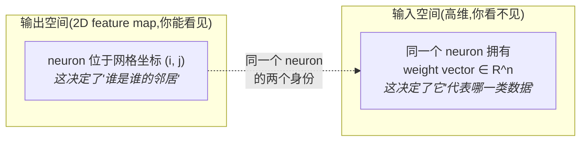

- **网格位置**是**低维**的,决定了 neuron 之间的**邻接关系**;
- **权重向量**是**高维**的,决定了 neuron 在原始数据空间中代表什么。

拓扑保持,就是要让这两者**一致**起来:网格上相邻的 neuron,其权重向量在高维空间中也应该彼此接近。下一节的算法就是为了做到这一点。

### 15.3 训练:两个步骤

Slides 第 47 页:**"The weights in a SOM are trained in a two-step algorithm."**

#### Step 1 · Competitive step(竞争步)

> **"Every neuron is examined to calculate which one's weights is most similar to the input vector. The winning neuron is known as the Best Matching Unit (BMU)."**
> (检查每一个神经元,计算哪一个的权重与输入向量最相似。获胜的神经元称为 **Best Matching Unit(最佳匹配单元,BMU)**。)

讲师明确指出这一步就是 K-means 的 assignment 步:

> *"这和我在 K-means 里给你看的那一步是相似的。对于一个给定的点,我计算它到蓝叉和红叉的距离——那时我们只有两个 neuron。而现在你有很多 neuron:如果你有 10 行 10 列,你就有 100 个 neuron。你需要把这个点与(同样被随机初始化的)权重向量比较,判定哪一个更相似。这个最接近的 neuron 就叫 winning neuron,也叫 **best matching unit**——对给定数据的最佳匹配。"*

**所以"竞争"的含义是:所有 neuron 竞争"谁最像这条数据",赢家通吃。**

#### Step 2 · Cooperative step(合作步)

> **"The weights of the BMU and the weights of the neighboring neurons is updated."**
> (BMU 的权重,**以及其邻居神经元的权重**,都会被更新。)

讲师解释:找到 BMU 之后,你要更新它的权重,**把它朝这条数据挪近一点**——因为你要用这条数据来更新它的均值。

**但关键在于"邻居也一起更新"**,而这正是"合作"二字的由来。讲师把这一步的意义讲得很重:

> **"邻居的意思是:在二维空间上,如果你更新了这一个,邻近的 neuron 也会以类似的方式被更新。为什么?**这是拓扑保持的关键**。因为只有这样,你才能确保相邻的 neuron 彼此相似、它们代表高维空间中相似的数据。拓扑保持就是这样实现的。"**

**把这个机制想透**(这是 SOM 最核心的考点):

- 竞争步只用了**高维**信息(谁的权重最像数据);
- 合作步引入了**低维网格**信息(谁在纸面上离 BMU 近);
- 一起更新 ⇒ 网格上相邻的 neuron 权重被反复地朝相似的方向拉动 ⇒ **它们的权重向量在高维空间中逐渐变得接近**;
- 于是"网格上相邻"⟺"高维空间中相似",**拓扑保持达成**。

**如果去掉合作步会怎样?** 那么每个 neuron 独立更新,SOM 就退化成了一个有 $n \times m$ 个簇的 K-means——你仍然得到聚类,但**网格坐标将毫无意义**,把它画出来看不出任何结构。合作步是 SOM 区别于 K-means 的**唯一但决定性**的差异。

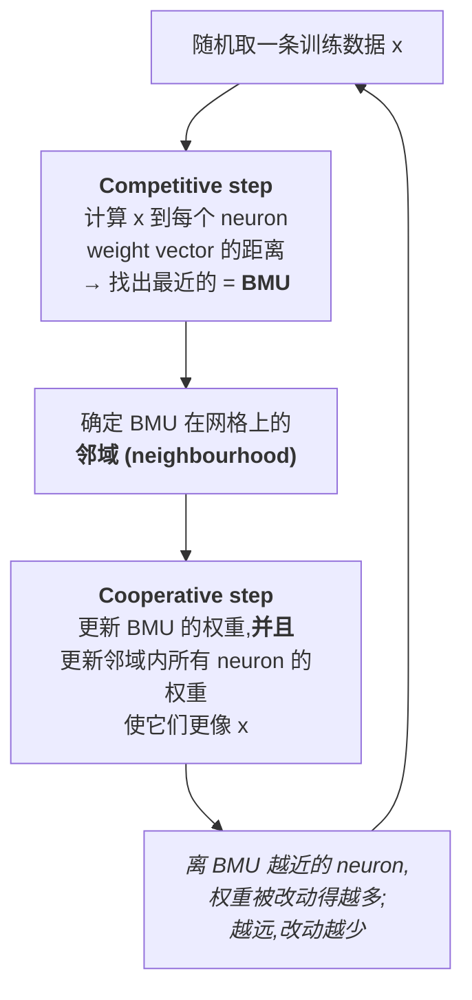

### 15.4 完整训练算法

Slides 第 48 页给出五步(这是需要能复述的版本):

> 1. **Each neuron's weights is initialized with random values.**
>    (每个神经元的权重用随机值初始化。)
> 2. **A sample is chosen at random from the set of training data.**
>    (从训练数据中随机选一个样本。)
> 3. **Find the BMU.**
>    (找出最佳匹配单元。)
> 4. **Identify the neighbourhood of the BMU. The size of the neighborhood decreases over time.**
>    (确定 BMU 的邻域。**邻域的大小随时间递减。**)
> 5. **Update the weights of the BMU and all of its neighbors so that they become more similar to the sample vector. The closer a node is to the BMU, the more its weights get altered and the farther away the neighbor is from the BMU, the less it is updated.**
>    (更新 BMU 及其所有邻居的权重,使它们更接近该样本向量。**节点离 BMU 越近,权重被改动得越多;越远,被更新得越少。**)
>
> **Steps 2 through to 5 are repeated $N$ times. Normally $N$ is a multiple of the number of training samples.**
> (第 2–5 步重复 $N$ 次,$N$ 通常是训练样本数的整数倍。)

**两条"随时间/距离衰减"的规律必须记住,它们是 SOM 的特色**:

| 衰减 | 出现在 | 作用 |
|---|---|---|
| **邻域大小随时间递减** | Step 4 | 训练初期大范围地把整张网格"铺开"(粗调全局拓扑),后期只微调局部(精调细节) |
| **更新幅度随与 BMU 的距离递减** | Step 5 | 讲师说"它会以这种方式衰减 (attenuate)";保证 BMU 学得最多,远处邻居几乎不动,从而形成平滑的映射 |

讲师描述终止条件时把它类比回 K-means:*"你就一直这么做,做很多很多轮迭代,直到它不再变化——权重向量不再变化,就像 K-means 那样。"*

### 15.5 Python 实现:代码走读

Slides 第 49–53 页给了一份完整的 Python 流程(数据是乳腺癌 SEER 数据集)。

**Step 1 · 准备数据**

```python
import pandas as pd
import numpy as np
from sklearn.utils import shuffle

df = pd.read_csv("A1_BC_SEER_data.csv")
df = shuffle(df)
df = df[:int(df.shape[0]*0.2)]      # 只用 20% 子集做演示

target = df['Survival months']       # 取出目标列
# 二值化 target:生存 < 60 个月 → 0,>= 60 个月 → 1
target = np.where(df['Survival months'] < 60, 0, target)
target = np.where(df['Survival months'] >= 60, 1, target)
```

**注意这里 target 的用途**:SOM 训练本身是 **unsupervised** 的,**完全不使用** target。target 只是事后拿来给可视化结果**上色**,用于检查"SOM 自己找出的结构,是否恰好与生存期长短对应"。这是使用 SOM 的标准套路,别误以为它是监督学习。

**Step 2 · 预处理**

```python
from sklearn.model_selection import train_test_split
myseed = 7                                    # 随机种子,保证可复现

dropList = ['Patient ID', 'Survival months']  # 移除无关特征与目标列
for item in dropList:
    df.drop(item, axis=1, inplace=True)

# Scale the data?
# from sklearn import preprocessing
# scaling = preprocessing.MinMaxScaler()
# data = scaling.fit_transform(data)

X, X_tst, Y, Y_tst = train_test_split(df, target, test_size=.333, random_state=myseed)
X_trn, X_val, Y_trn, Y_val = train_test_split(X, Y, test_size=.5, random_state=myseed)
X_trn = X_trn.to_numpy(); X_tst = X_tst.to_numpy(); X_val = X_val.to_numpy()
```

两处值得注意:

- **`dropList` 里丢掉了 `Patient ID`** ——又一次的"标识符不是属性"(对照 §9.1 丢掉学号列)。
- **`# Scale the data?` 这行注释带着问号,并且缩放代码被注释掉了。** 这不是偷懒,而是一个留给你的问题:**读完 §11.3 你应该能立刻回答**——SOM 的竞争步靠距离找 BMU,所以它和 K-means 一样对属性量纲敏感,通常**应该**做缩放。

**Step 3 · 训练 SOM**

```python
from myminisom import MiniSom        # 见 Moodle 上的 myminisom

som_shape = (100, 100)               # SOM 网格大小
som = MiniSom(som_shape[0], som_shape[1], X_trn.shape[1],
              sigma=som_shape[0]/2, learning_rate=.9,
              neighborhood_function='gaussian', random_seed=myseed)

epochs = 40
som.pca_weights_init(X_trn)                        # 初始化权重
som.train_random(X_trn, epochs * len(X_trn), verbose=True)

BMU_trn = np.array([som.winner(x) for x in X_trn]) # 求每个样本的 BMU
BMU_class0 = BMU_trn[Y_trn==0]
BMU_class1 = BMU_trn[Y_trn==1]
```

**把参数对回 §15.4 的算法**——这是把代码和理论挂钩的关键:

| 参数 | 对应的概念 |
|---|---|
| `som_shape=(100,100)` | 网格是 100×100,即 **10000 个 neuron** |
| `X_trn.shape[1]` | 权重向量的维度 = **输入空间的维度**(Slides 第 58 页显示是 16 维) |
| `sigma=som_shape[0]/2` | **初始邻域半径**(Step 4 的"邻域大小",训练中会递减) |
| `learning_rate=.9` | 权重更新的步长(Step 5 的"更新幅度") |
| `neighborhood_function='gaussian'` | 邻域权重按**高斯**衰减 → 实现"越近改动越多"(Step 5) |
| `epochs*len(X_trn)` | 总迭代次数 $N$ = **训练样本数的整数倍**(正是 slides 那句 "$N$ is a multiple of the number of training samples") |
| `som.winner(x)` | **求 BMU**(Step 3) |

**⚠️ 讲师的实操警告(会影响你的 lab)**:

> *"SOM 有一个相当长的训练过程。做实验时请当心,你可能在一个 lab session 内做不完。最好只用少量数据……请手动只取前 1000 行,并把那个 `df[:int(df.shape[0]*0.2)]` 那行注释掉。"* 他还说 **100×100 的网格不必要**,**20×20 就能得到结果**。

**Step 4 · 画密度图**

```python
import matplotlib.pyplot as plt
from copy import copy

densitymap = np.zeros(som_shape)
for row in range(0, BMU_trn.shape[0]):
    x, y = BMU_trn[row]
    densitymap[y, x] += 1               # 每个样本给它的 BMU 计数 +1

densitymap[densitymap==0] = np.nan      # 没有数据的格子标为 nan
my_cmap = copy(plt.cm.jet)
my_cmap.set_bad(color=(1,1,1))          # nan 画成白色
plt.imshow(densitymap, cmap=my_cmap, interpolation="none",
           origin="lower", aspect=0.75)
plt.colorbar(); plt.title('Mapping density'); plt.show()
```

**这张图怎么读**(讲师现场解说了 slides 第 54–56 页的结果):

- 每个格子的颜色 = **有多少条数据把这个 neuron 当作自己的 BMU**;
- **红色 / 橙色区域 = 数据高度集中**;
- **白色区域 = 没有任何数据**映射到那里。

讲师:*"这让你理解在高维空间里发生了什么。"* ——**这就是 SOM 的可视化价值**:一个 16 维的数据集,现在变成了一张你能一眼看懂的二维热力图。

Slides 还展示了**按类别分别画密度图**(只取 `BMU_class1`)。讲师指出:某一类的数据在图上某些区域几乎为空——**这说明 SOM 无监督找到的空间结构,确实与类别标签有对应关系**。

**辅助输出**(Slides 第 58 页):

```python
qerr = som.quantization_error(X_trn)    # 量化误差
qerr
# 7.454546962215053

som.get_weights()[1,1]                  # 查看 (1,1) 处 neuron 的权重向量
# array([1.459e+00, 2.944e+00, ..., 4.746e+01])   ← 16 个数,即 16 维输入空间
```

> 📎 **拓展(超出 slides)** — **quantization error(量化误差)** 是每个样本到其 BMU 权重向量的平均距离,**在概念上就是 SOM 版的 WSS**:它衡量"用 prototype 代替原数据"损失了多少。数值越小,拟合越好。可以用它像 elbow method 那样对比不同网格尺寸。

### 15.6 SOM 的簇在哪里:两阶段聚类

Slides 第 57 页提出一个重要的细节:

> - **Each neuron clusters samples that are mapped to it. → $n \times m$ clusters (size of the SOM).**
>   (每个神经元把映射到它的样本聚成一簇 → 一共有 $n \times m$ 个簇,即 SOM 的尺寸。)
> - **A group of neurons form larger cluster. → Cluster analysis needed to detect these.**
>   (一组神经元会形成更大的簇 → 需要做聚类分析才能检测出这些。)

**这是使用 SOM 时的一个常见困惑,必须讲清**:100×100 的 SOM 有 10000 个 neuron,也就是 10000 个"微簇"——这显然不是你想要的最终答案。**真正的簇是由网格上一片相邻的 neuron 共同构成的**(就是密度图上那一片连成一体的红色区域)。

要把这些"大簇"识别出来,你需要**在 SOM 的输出上再跑一次聚类**——这就是 slides 第 59 页提到的 **two-stage clustering(两阶段聚类)**:

```mermaid
graph LR
  D["原始高维数据<br/>m 条,n 维<br/><i>数据量大、维度高</i>"]
  -->|"<b>Stage 1</b> · SOM"|
  P["n×m 个 prototype<br/>(每个 neuron 一个权重向量)<br/><i>数量少得多,且带 2D 拓扑</i>"]
  -->|"<b>Stage 2</b> · 在 prototype 上<br/>跑 K-means / hierarchical"|
  C["最终的少数几个大簇"]
```

**为什么这样做有价值?** 因为第一阶段把成千上万条原始数据**压缩**成了少量 prototype,第二阶段的聚类只需在这些 prototype 上进行——快得多。Slides 第 59 页把这一点列为 SOM 的优势之一:**"Can reduce the amount of information that needs to be evaluated (for example, Two-stage clustering)"**。

### 15.7 为什么在 BDA 中用 SOM:与 PCA、t-SNE 的对比

Slides 第 59 页先给了一个定位:

> - **SOMs are an excellent choice for data visualization.**(SOM 是数据可视化的极佳选择。)
> - 可视化技术来自 **exploratory data analytics** 和 **dimension reduction techniques**,例如 **PCA、t-SNE、SOM**……

然后逐条列出 **Why use Self-Organizing Maps (SOMs) in BDA?** ——**注意每一条后面括号里的对比对象,这是最好的记忆抓手**:

| SOM 的优势 | 对比 | 含义 |
|---|---|---|
| **Topology preservation** | **unlike PCA** | 保持邻域关系:高维中相近的数据,在 2D 图上仍相近。PCA 只保证最大化方差的线性投影,不保证局部邻域结构 |
| **Able to deal with new data & missing values** | **unlike t-SNE** | 训练好的 SOM 可以直接给**新数据**找 BMU;t-SNE 每来新数据基本要重算整个嵌入 |
| **Can reduce the amount of information that needs to be evaluated** | (two-stage clustering) | 见 §15.6:先压成 prototype,再聚类 |
| **Produces prototypes that represent the full set of attributes with their original meaning** | **unlike PCA** | 每个 prototype 是一个和输入同维的向量,**每一维仍然是原来那个属性**(比如"肿瘤大小"就是肿瘤大小)。PCA 的主成分是原属性的线性组合,**失去了直接的现实含义** |

**最后一条尤其值得体会**:在医疗、金融这类需要向人解释结论的场景里,"这个群体的典型患者是:年龄 56、肿瘤大小 2.4cm、淋巴结 3 个……"是可以直接说给医生听的;而"这个群体在第一主成分上得分 +2.3"则无法解释。**可解释性 (interpretability)** 是 SOM 在 BDA 中的一大卖点。

### 15.8 什么时候**不**该用 SOM

Slides 第 60 页:

> **When not to use SOMs in BDA:**
> - **When the data is very sparse.**(数据非常稀疏时。)
> - **When cardinality (limited resolution) of the map is a problem.**(当映射的基数/有限分辨率成为问题时。)
> - **When multi-core compute infrastructure is unavailable.**(当没有多核计算基础设施时。)

三条的理由:

1. **稀疏数据**——和 DBSCAN 失效同理:没有足够的数据来形成有意义的 prototype;
2. **分辨率有限**——网格是固定的 $n \times m$,**你最多只能有这么多个"位置"**。如果数据的真实结构比网格能表达的更精细,就被强行压平了(讲师说网格"最多通常 20×20");
3. **算力不足**——呼应讲师那句"训练过程相当长",SOM 训练开销大。

---

# Part V · 收束

## §16 四种方法的总对照

| | **K-means** | **Hierarchical (agglomerative)** | **DBSCAN** | **SOM** |
|---|---|---|---|---|
| **簇的定义** | 离质心最近 | 逐步合并最相似者 | 高密度连通区域 | 映射到同一/相邻 neuron |
| **需预先指定** | $k$ | linkage method(**不需要 $k$**) | $Eps$、$MinPts$ | 网格尺寸 $n \times m$ |
| **簇形状** | 球形 / 椭球形 | 取决于 linkage(single→链状,complete→球形) | **任意形状** | 由网格上的邻域区域决定 |
| **噪声处理** | 敏感,强制归簇 | 敏感 | **显式识别并排除** | — |
| **额外能力** | — | 给出整棵合并层次 | **outlier detection** | **高维可视化 + 降维** |
| **主要弱点** | 需定 $k$;只到局部最优;怕离群点与非球形簇 | 计算量大;合并不可撤销 | 密度不均、高维时失效 | 训练慢;分辨率受网格限制;数据稀疏时不行 |
| **典型工具** | R `kmeans()` / sklearn `KMeans()` | R `hclust()` / scipy `linkage()` | — | `MiniSom` |

## §17 三个必须能回答的"为什么"

这三条是本讲最容易被问到、也最能区分"背过"和"懂了"的问题。

**Q1:为什么 WSS 不能直接用来选 $k$?**
因为 WSS 随 $k$ 单调下降,取最小值会得到 $k = n$(每点一簇,WSS = 0),毫无意义。所以要看**下降速率的转折点**(elbow),并且它只是 **heuristic**,没有理论保证。(§8.3、§8.4、§10.2)

**Q2:为什么 K-means 要跑很多次(`nstart` / `n_init`)?**
因为 K-means 求解的是一个搜索空间达 $k^n$ 的组合优化问题,它是一个启发式算法,**只能收敛到局部最优**,而落到哪个局部最优取决于随机初始化。多跑几次、取 $J$(WSS)最小的那次,是对抗局部最优的实用手段。(§7.1、§12.1)

**Q3:为什么必须 rescale?**
因为 Euclidean distance 把各维度的差平方后相加,**数值范围大的属性会支配整个距离**(身高跨度 0.5 vs 体重跨度 50 → 平方后 0.25 vs 2500)。结果是你以为纳入了某个属性,实际上它毫无作用。用 $x/\sigma$ 或 Z-score $(x-\mu)/\sigma$ 让各属性的话语权均等。(§6.1、§11.3)

## 本章小结 (Key takeaways)

1. **Clustering 是一种 unsupervised technique**:它处理 unlabelled data,目标是揭示 hidden structure 而非预测,因此与下周的 classification(supervised)构成对照。
2. **一切聚类的前提是那个抽象**:$m$ 个 object、每个有 $n$ 个 measurable attributes,于是每个 object 成为 $\mathbb{R}^n$ 中的一个点;算法只看得见坐标,看不见"这是学生还是像素"。遇到任何应用场景,先回答"object 是什么、$n$ 个属性是什么"。
3. **聚类结果由你定义的 similarity 决定**:你选的属性和你用的距离度量一旦改变,结果就完全不同——这就是为什么数据准备(选属性、统一单位、rescale、去相关)比调参更重要。
4. **K-means 的四步是:选 $k$ 并初始化质心 → 把每点指派给最近质心 → 重算各簇质心 → 重复直至收敛。** 两个公式撑起全部:Euclidean distance $\sqrt{\sum_i (x_i-y_i)^2}$ 与 centroid $\bar{\mathbf{x}} = \frac{1}{m}\sum_i \mathbf{x}_i$。
5. **K-means 在最小化 $J = \sum_i \sum_j r_{ij}\|\mathbf{x}_i - \bar{\mathbf{x}}_j\|_2^2$**($r_{ij} \in \{0,1\}$),即 residual error / residual variance;这是一个搜索空间为 $k^n$ 的组合划分问题,K-means 只是它的一个启发式求解器,**只保证局部最优**,因此需要 `nstart` / `n_init` 多次重启。
6. **$J$ 就是 WSS 就是 `tot.withinss`**;把 WSS 对 $k$ 作图找 **elbow / knee point**。WSS 随 $k$ 单调下降,所以看的是**下降速率**,而且这只是 heuristic。原则:**"若更多的簇并不能更好地区分各组,几乎可以肯定该用更少的簇。"**
7. **R `kmeans()` 输出必须读懂**:`size`、`centers`、`withinss`(各簇)、`tot.withinss`(= WSS = $J$)、`betweenss`、`totss`,且 **`totss = betweenss + tot.withinss`**;`betweenss/totss` 介于 0 与 1,**越高说明簇分离得越好**。
8. **诊断三问**:簇是否分离良好?有无极小簇或空簇?有无质心过于接近?——并且始终结合可视化与领域知识,**不要盲信输出**。
9. **少用属性、别用高度相关的属性**:属性太多带来噪声累积、**curse of dimensionality**(高维中所有距离趋于相同)和计算开销;高度相关的属性等于给同一份信息**重复加权**。用 scatterplot matrix / 相关系数发现它们,用 feature selection / PCA 处理。这两条对分类和一切数据挖掘算法同样适用。
10. **数值型用 K-means(Euclidean 或 Manhattan);类别型用 K-modes**,后者的距离是"对应分量上不同的个数"——如 (a,b,e,d) 与 (d,d,d,d) 的距离为 **3**。
11. **Hierarchical agglomerative clustering 不需要预先指定 $k$**:每点自成一簇 → 每步合并最相似的两簇 → 直到合成一簇。核心选择是 **linkage**:**single**($\min$,最近点,产生蛇形长链)、**complete**($\max$,最远点,产生紧致球形,**通常从它开始**)、**average**(UPGMA,点对距离均值)、**centroid**(UPGMC,两簇质心间距离)。
12. **DBSCAN 用密度定义簇**:给定 $Eps$ 与 $MinPts$,把点分为 **core**(密度 $\ge MinPts$,**密度计数含自身**)、**border**(非 core 但落在某 core 的邻域内)、**noise**(两者皆非);然后把 **Eps-connected**(具有**传递性**)的 core points 成组为簇,再并入 border points,**noise 被排除**。它抗噪、能处理任意形状、复杂度与 K-means 相近;但在**密度不均**(因为依赖单一全局阈值)和**稀疏/高维**数据上失效。
13. **SOM 是保拓扑的降维 + 聚类**:二维网格上的每个 neuron 同时拥有**网格位置**(低维,定义邻居)和**权重向量/prototype**(与输入同维,相当于 K-means 的 mean)。训练分 **competitive step**(找 **BMU**)与 **cooperative step**(更新 BMU **及其邻居**);邻域大小随时间递减,更新幅度随与 BMU 的距离递减。**"更新邻居"正是拓扑保持的来源**——去掉它,SOM 就退化成 K-means。
14. **SOM 在 BDA 中的价值**:topology preservation(unlike PCA)、能处理新数据与缺失值(unlike t-SNE)、可做 two-stage clustering 压缩信息量、prototype 保留属性的**原始含义**因而可解释(unlike PCA)。不适用于:数据稀疏、网格分辨率不足、缺乏多核算力。
15. **本讲的所有决策都能挂回 Data Analytics Lifecycle**:选属性与猜 $k$ 在 Discovery;单位、缩放、去相关在 Data Preparation;选算法在 Model Planning;跑模型与定 $k$ 在 Model Building;诊断与解释在 Model Building / Communicate Results。

---

## 附录 A · 易错点清单

| 易错点 | 正确理解 |
|---|---|
| 把 $m$ 和 $n$ 弄反 | $m$ = **对象个数**,$n$ = **属性个数**(= 空间维度) |
| 图像聚类中说"object 是 RGB" | object 是**像素**,RGB 是**属性**($n=3$) |
| 认为 WSS 越小越好 | WSS 随 $k$ 单调下降;要找 **elbow**,不是最小值 |
| 把 elbow method 当定理 | 它是 **heuristic**,没有理论保证 |
| 认为 K-means 求得全局最优 | 只有**局部最优**;靠 `nstart` / `n_init` 多次重启缓解 |
| 混淆 `withinss` 与 `tot.withinss` | 前者是**每簇一个值的向量**,后者是它们的**和**(= WSS) |
| 记成 `totss = betweenss - tot.withinss` | 是 **加号**:`totss = betweenss + tot.withinss` |
| DBSCAN 密度计数忘了算自己 | **包含该点自身** |
| 先判 noise 再判 border | 顺序是 **core → border → noise** |
| 认为 border point 是 noise | border 不是 core,但落在某 core 邻域内,**属于某个簇** |
| 认为 single linkage 产生球形簇 | single → **蛇形长链**;**complete** → 球形 |
| 认为 SOM 是监督学习(因为是"神经网络") | SOM 是 **unsupervised**,且其 neuron **没有激活函数** |
| 认为 SOM 的簇数 = 你要的簇数 | SOM 给出 $n\times m$ 个微簇;真正的大簇需 **two-stage clustering** 再聚一次 |
| 认为 hierarchical clustering 完全不用定簇数 | $k$ 的决定被**推迟**到切树状图那一步,并没有消失 |

## 附录 B · 术语表

| English | 中文 | 一句话 |
|---|---|---|
| Supervised / Unsupervised | 监督式 / 非监督式 | 有无 label + 是否预测 |
| Label / Annotation | 标签 / 标注 | 监督学习要预测的东西 |
| Object | 对象 | 一条待聚类的数据,共 $m$ 个 |
| (Measurable) attribute | (可测)属性 | 刻画对象的数值,共 $n$ 个 |
| Proximity / Similarity | 接近度 / 相似度 | 聚类的唯一依据 |
| Euclidean distance | 欧氏距离 | $\sqrt{\sum_i (x_i-y_i)^2}$ |
| Manhattan distance | 曼哈顿距离 | $\sum_i \lvert x_i-y_i \rvert$,配 median 使用 |
| Centroid / Mean | 质心 / 均值 | 簇内所有点的平均向量 |
| Convergence | 收敛 | 归属不再变化 |
| Residual error / variance | 残差误差 / 残差方差 | 即 $J$,即 WSS |
| WSS (Within Sum of Squares) | 簇内平方和 | R 中的 `tot.withinss` |
| Elbow / Knee point | 肘点 / 膝点 | WSS 曲线由陡转缓的转折 |
| Heuristic | 启发式 | 经验有效,无理论保证 |
| Local / Global optimum | 局部 / 全局最优 | K-means 只能到局部 |
| `nstart` / `n_init` | 重启次数 | R / Python 中多次随机初始化的参数 |
| Rescaling | 重新缩放 | 如除以标准差 |
| Z-score | 标准分数 | $(x-\mu)/\sigma$ |
| Curse of dimensionality | 维数灾难 | 高维中距离趋同 |
| PCA | 主成分分析 | 线性降维,失去属性原意 |
| K-modes | — | 类别型数据的聚类,距离 = 不同分量个数 |
| Hierarchical agglomerative | 层次凝聚 | 自底向上合并 |
| Hierarchical divisive | 层次分裂 | 自顶向下分裂 |
| Dendrogram | 树状图 | 合并历史的树 |
| Linkage (single/complete/average/centroid) | 连接方法 | 定义簇间距离的四种方式 |
| UPGMA / UPGMC | — | average / centroid linkage 的正式名 |
| Density-based clustering | 基于密度的聚类 | 簇 = 高密度连通区 |
| DBSCAN | — | Density-Based Spatial Clustering of Applications with Noise |
| $Eps$ / $MinPts$ | 半径 / 最小点数 | DBSCAN 的两个参数 |
| Core / Border / Noise point | 核心 / 边界 / 噪声点 | DBSCAN 的三类点 |
| Eps-connected | Eps 连通 | 具有传递性,产生任意形状簇 |
| SOM (Self-Organizing Map) | 自组织映射 | 保拓扑的降维 + 聚类 |
| Feature map | 特征映射 | SOM 的输出层网格 |
| Neuron | 神经元 | 网格上的一个格点 |
| Weight vector / Prototype | 权重向量 / 原型 | 与输入同维,相当于 centroid |
| BMU (Best Matching Unit) | 最佳匹配单元 | 权重与输入最相似的 neuron |
| Competitive / Cooperative step | 竞争步 / 合作步 | 找 BMU / 更新 BMU 及邻居 |
| Topology preservation | 拓扑保持 | 高维相近 ⟹ 低维相近 |
| Quantization error | 量化误差 | SOM 版的 WSS |
| Two-stage clustering | 两阶段聚类 | 先 SOM 压成 prototype,再聚类 |
| t-SNE | — | 另一种降维法,难处理新数据 |

---

> **下一讲预告** — 讲师说明:下周(Week 5)讲 **classification**(分类),那是本讲开头 §1 里 supervised 的那一半;并且他会**在下周开头再讲一遍 SOM**,因为届时你已经在 lab 里跑过代码。另外,§4.1 提到的"用聚类给数据打标签、再做分类"这条路径,正好把这两周接起来。
