# Week 5 · Classification(分类)

> **CSCI446/946 Big Data Analytics** — University of Wollongong, Spring 2026
> 本讲义融合 `Week5_Lecture_Classification_SP-2026.pdf`(55 页 slides)与 Week 5 课堂录音转录。
> Slides 中的图表、表格与代码,除特别注明外均出自教材 *Data Science and Big Data Analytics: Discovering, Analyzing, Visualizing and Presenting Data*(EMC Education Services)。

---

> **学习目标 (Learning objectives)** — 读完本章你应该能够:
>
> - **说清 classification 与上周 clustering 的分界**:为什么前者是 **supervised**、后者是 **unsupervised**,这条线是由"有没有 label"和"目标是不是预测"共同划出来的;
> - **描述 classification 的完整实验流程**:training / validation / test 三分,并解释为什么 test set 在建模期间必须"锁进柜子",以及 **cross-validation** 是怎么在不碰 test set 的前提下调超参的;
> - **默写 KNN 的三个必需组件与三步分类流程**,写出 **Euclidean distance** 公式,解释为什么 KNN 被称为 **lazy classifier**;
> - **论证 k 的取值权衡**:k 太小为什么对 noise 敏感、k 太大为什么会混入其他类,并说明如何用 cross-validation 选 k;
> - **读懂并画出一棵 decision tree**:识别 root / internal / leaf node,计算某个节点的 **depth**,并对一条新观测手工走完一次 traversal;
> - **默写 entropy 与 conditional entropy 的公式**,解释每个符号,并说明为什么公平硬币的熵是 1.0、常数的熵是 0;
> - **手工计算 information gain**:给定一张属性-类别的概率表,完整算出 $H_S$、$H_{S|A}$ 与 $\text{InfoGain}_A$(能复现 slides 上 contact 属性 0.0201 那道题);
> - **复述决策树的通用算法与三类停止条件**,解释为什么它是 **greedy** 的、这为什么会导致 overfitting;
> - **精确定义 overfitting**,画出训练误差与验证误差的双曲线图,并区分 **pre-pruning(early stopping)** 与 **post-pruning**;
> - **写出 Bayes' theorem 的四个部件**(posterior / likelihood / prior / evidence),并用它解出 slides 上 John 升舱与 Mary 化验两道题;
> - **准确陈述 naïve Bayes 的两个简化**——**conditional independence assumption**(注意不是普通 independence)与忽略分母 $P(A)$——并解释各自省下了什么;
> - **手工跑完一次 naïve Bayes 预测**:查表、连乘、比大小、归一化成概率;
> - **解释 zero-probability 问题并应用 Laplace(add-one)smoothing**;
> - **在 decision tree 与 naïve Bayes 之间按场景做出有理由的选择**(能复现 slides 的 Concerns 对照表);
> - **构造 confusion matrix 并计算 Accuracy / Precision / Recall(TPR)/ FPR / FNR**,并说明为什么在类别不平衡时 accuracy 会骗人。

---

## 开篇:同样的一堆点,这次它们带着标签

上周我们花了整整一讲讨论 **clustering**(聚类)。那时候的处境是这样的:你有一堆数据点,你不知道它们该分成几类,更不知道每一类叫什么名字。K-means、hierarchical clustering、DBSCAN、SOM 做的事情,本质上都是**在没有任何外部答案的情况下,从数据自身的几何结构里猜出分组**。讲师上周开场时说得很直白:clustering 是 unsupervised,"我们只有 X,没有 Y"。

这周,有人把答案发给我们了。

想象同样是那 2000 个银行客户,只不过这一次,每一行的最后多了一列:`subscribed = yes / no`——这个客户到底有没有买定期存款。这一列改变了一切。我们不再需要猜"数据里有几团",因为团数已经给定了(两团:买了的和没买的);我们要回答的是一个更锋利的问题:**给我一个从未见过的新客户,他会不会买?**

这就是 **classification(分类)**。讲师的原话是:

> *"Classification 可能是最有趣的 data mining / machine learning 任务,在任何一本关于 pattern recognition 或 data mining 的书里,它通常都会占据主要的章节。"*

本周的地图如下——一个概念框架 + 三个分类器 + 一套评估工具:

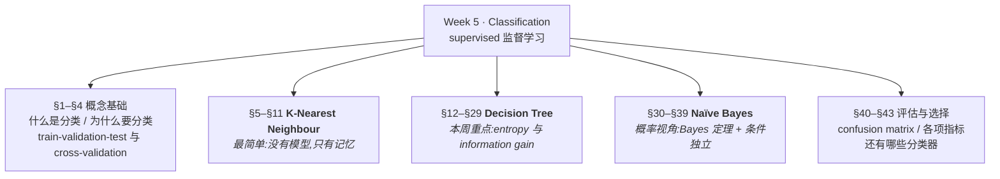

三个分类器的顺序不是随意的,它是一条**从"完全不建模"到"建一棵可读的规则树"再到"建一个概率模型"**的递进线。讲师说得很清楚:*"我会介绍三个分类器,从最简单的 K-nearest neighbour,到 decision tree,再到 naïve Bayes。"* 而在深度上,**decision tree 的 entropy / information gain 计算是本周最需要动笔的部分**,naïve Bayes 的**条件独立假设**则是讲师明确点名的必考点——他的原话是:*"每一次考试都有一道题跟这个假设有关。"*

---

# Part I · 分类是什么

## §1 从"猜分组"到"给标签":supervised 的分水岭

先把定义摆出来,再解释它为什么长这样。Slides 用三句话概括了整个 classification:

> **Classification is a fundamental learning method that appears in applications related to data mining.**
> **The primary task performed by classifiers is to assign class labels to new observations.**
> **Classification methods are supervised: start with a training set of labelled observations, predict the outcome for new observations.**

拆开看。

第一句说的是**地位**。讲师补充道:*"你看 data mining、data analytics、statistics、machine learning、deep learning——classification 是一个你绕不开的概念。"* 它之所以绕不开,是因为绝大多数现实任务最终都能被改写成"给这个东西贴个标签"的形式:这封邮件是不是垃圾邮件?这笔交易是不是欺诈?这张 CT 片上有没有肿瘤?这个客户会不会流失?

第二句说的是**任务**。注意里面有个容易滑过去的词:**new** observations。分类器的价值不在于它能把训练数据分对——那叫背书;它的价值在于面对**从未见过的**观测时还能分对。这个词在后面讲 overfitting 时会以一种很痛的方式再次出现。

第三句说的是**方法论的类别**,也是与上周最关键的区别。**Supervised(监督)** 的含义是:训练阶段,每一条数据不只有属性 $X$,还有一个正确答案 $Y$。讲师是这样对比的:

> *"上周我们讲 clustering,只有数据,没有标签。但在 classification 里,我们从一个 labelled observations 的 training set 出发。Labelled 意味着我们不只有 X——X 是数据——我们还有 Y。"*

用一张表把这条界线钉死:

| | **Clustering(Week 4)** | **Classification(Week 5)** |
|---|---|---|
| 学习范式 | **Unsupervised**(非监督) | **Supervised**(监督) |
| 训练数据 | 只有 $X$ | $(X, Y)$ 成对出现 |
| 类别数 | 未知,或需自己定 $k$ | 已知,由标签集合给定 |
| 类别含义 | 事后由人解释 | 事先由标签定义(cat / dog / yes / no) |
| 输出 | 每个点的簇编号 | 新观测的**类别标签**(有时附概率) |
| 评价方式 | WSS、silhouette 等内部指标 | 与真实标签比对:accuracy、precision、recall |
| 典型问题 | "这批客户能分成几群?" | "**这个**客户会不会买?" |

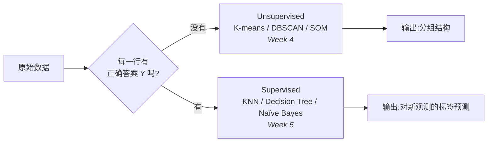

## §2 为什么值得做:预测与自动化

Slides 只说 classification 很"fundamental",但没说为什么。讲师在课上专门补了一段动机,这段值得记下来,因为它解释了整个学科的驱动力。

**第一个理由是预测本身就是权力。** 讲师连举了四个例子:

> *"如果你能预测山火什么时候会发生,如果你能预测明天的股价,如果你能预测我们会面临什么风险,如果你能预测下个月的利润——那意味着你拥有巨大的优势,让你能更好地准备自己,并从这个预测中获益。"*

这里的逻辑链条是:**未来的不确定性是成本,任何能降低这个不确定性的东西都有经济价值。** 分类器把"不确定"变成"有根据的猜测",这就是它的全部商业意义。

**第二个理由是自动化。** 预测是给人看的,自动化是让机器直接动手:

> *"给定一张图像,我们可以用计算机自动识别:哦这是猫,这是狗,这是自行车,这是飞机——然后采取相应的动作。就像自动驾驶汽车,摄像头扫描环境,它能检测出那里有没有行人、有没有骑车的人、附近有没有车。它们同样是在给检测到的物体指派标签。"*

自动驾驶这个例子特别好,因为它暴露了分类任务的一个隐藏属性:**分类的输出常常是某个行动的输入**。识别出"前方是行人"本身没有价值,价值在于紧接着的刹车。这也预告了后面的一件事——当分类错误的**代价不对称**时(把行人误判成路面 vs. 把路面误判成行人),单看 accuracy 就完全不够了,我们需要 §40 的 confusion matrix。

## §3 supervised 的代价:标签是要花钱买的

有得必有失。监督学习拿到了 $Y$,但 $Y$ 不是天上掉下来的。讲师在这里给了一段非常实在的提醒:

> *"我们怎么得到标签?通常我们得请一个人类观察者、人类标注者来手工标注每一条数据。假设你有 1000 张图像,我可能得找个人来逐张看,然后写下这张图里的物体,它才变成 labelled。所以标注通常是费人力的、昂贵的、耗时的。这一直是分类方法的一个问题。"*

把它的后果讲透:

1. **数据量受限。** 你能拿到的**无标注**数据可能有几百万条,但能负担得起标注的也许只有几千条。这意味着在分类问题里,"大数据"往往并不真的大——**受限的从来不是数据,而是标签**。
2. **过拟合的温床。** 训练样本少,模型就更容易把噪声当成规律记下来。这是 §23 讲 overfitting 时列出的第一个成因("the lack of training data"),它的根源就在这里。
3. **标签本身可能有偏。** 标注者是人,人会累、会有偏好、会误判。有偏的训练数据是 slides 列出的第二个过拟合成因。

> 📎 **拓展(超出 slides)** — 正是标注成本这个瓶颈,催生了整片介于 supervised 与 unsupervised 之间的方法家族:**semi-supervised learning**(少量标注 + 大量未标注)、**active learning**(让模型主动挑"最值得标注"的样本问人)、**self-supervised learning**(从数据自身构造伪标签,现代大模型的预训练范式)。本课不展开,但知道这条脉络能帮你理解为什么工业界如此重视"少标签"技术。

## §4 实验怎么做:training / validation / test 与 cross-validation

> 🎙️ **讲师补充(slides 上没有,但课堂专门板书讲解)** — 这一节的内容不在 55 页 slides 的任何一页上,但讲师在讲 KNN 选 $k$ 时停下来画了图,并明确说:*"我介绍这个流程时虽然是针对 KNN 的,但其实这个流程适用于每一个分类器——不管是 decision tree、naïve Bayes、multilayer perceptron 还是 deep learning,它们全都遵循这条路。"* 这是本周最具通用性的一段方法论,请当作正式内容对待。

### 4.1 第一刀:训练集与测试集

拿到全部数据后,**第一件事就是把它切成两块**:

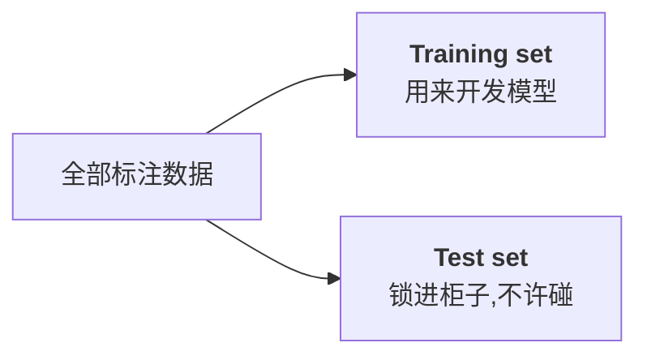

讲师用了一个非常形象的比喻:

> *"Training set 是用来让你开发模型、训练分类器的。但 test set,你不应该碰它,因为它是期末考试卷。你应该把 test set 锁在柜子里的某个地方。除非你说'我准备好测试我的模型了',你才能打开柜子、拿出测试数据、然后应用你的算法。所以在你还在开发模型的时候,永远不要碰你的测试数据。否则这是一种作弊。"*

为什么这算作弊?因为 test set 存在的**唯一目的**是给出一个对"模型在真实世界中表现如何"的**无偏估计**。你只要用它做过任何一个决定——哪怕只是"我看看用 $k=3$ 还是 $k=5$ 在测试集上更好"——这个估计就被污染了:你选出来的不再是"最好的模型",而是"最迎合这份特定测试数据的模型"。柜子一旦打开,考卷就泄题了。

### 4.2 第二刀:从训练集里再切出验证集

但问题来了。KNN 需要你指定 $k$,决策树需要你指定 max depth,naïve Bayes 需要你指定 smoothing 的 $\varepsilon$。这些**超参数(hyperparameter)** 不能靠训练算法自己学出来,必须靠"试不同的值,看哪个好"。可是"看哪个好"要在哪份数据上看?训练集不行(模型在自己见过的数据上永远显得很好),测试集又不许碰。

答案是:**从训练集里再切一块出来,让它扮演测试集的角色**。这一块叫 **validation set(验证集)**。

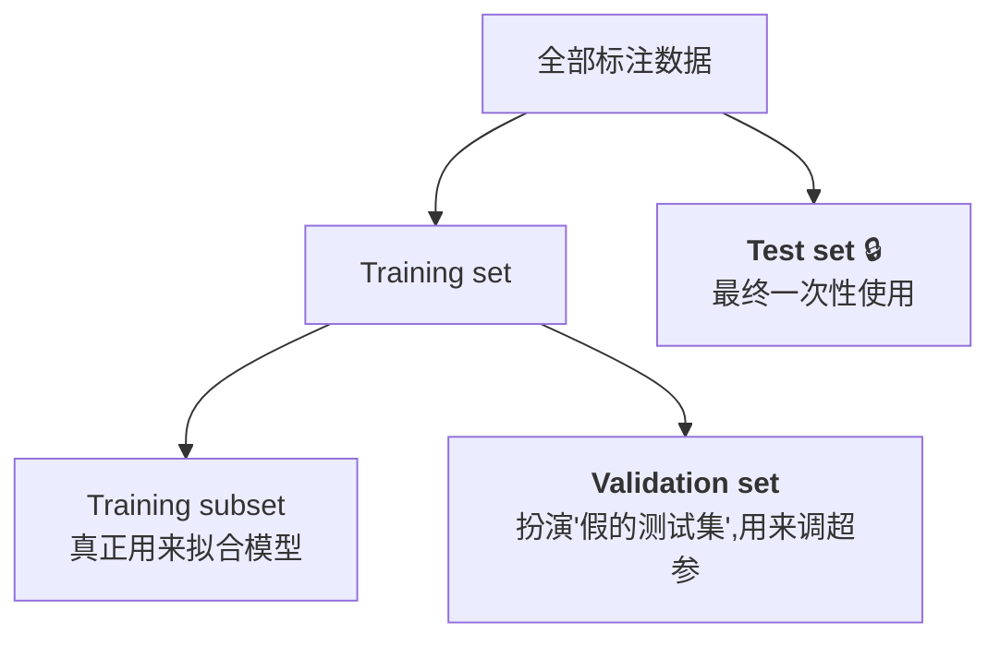

讲师的说法:

> *"你没法访问 test data,你不被允许访问 test data。所以你必须从你的训练数据里造一个出来——你划出一小部分,假装它就是你将来会遇到的测试数据。"*

### 4.3 完整流程

把两刀合起来,就是每一个分类实验的标准动作:

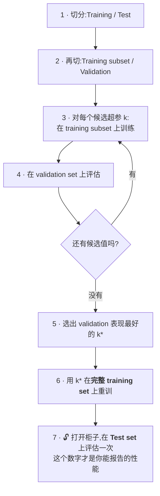

> **🔑 例(用 KNN 选 $k$ 走一遍)**
> 假设有 10000 条标注数据。
> **步骤 1** — 8000 条做 training,2000 条做 test,test 立刻封存。
> **步骤 2** — 8000 条里再分:6400 条 training subset,1600 条 validation。
> **步骤 3–4** — 候选 $k \in \{1,3,5,7,9,11,15,21\}$。对每个 $k$:用 6400 条当"记忆库",对 1600 条验证样本逐个做 KNN 预测,记下准确率。
> **步骤 5** — 结果比如是 $k=1$ 得 82%、$k=5$ 得 88%、$k=9$ 得 **89%**、$k=21$ 得 85%。选 $k^{*}=9$。
> **步骤 6** — 用 $k^{*}=9$ 配上全部 8000 条训练数据。
> **步骤 7** — 在 2000 条 test 上跑一次,得到 87.6%。**这个 87.6% 才是能写进报告的数字**,而不是验证集上那个更好看的 89%。

最后一步的差距(89% → 87.6%)不是失误,而是必然:因为 $k^{*}=9$ 正是**在验证集上挑出来的**,它对验证集就带有一点点"迎合"。这也解释了为什么必须有第三份完全干净的数据。

> 📎 **拓展(超出 slides)** — 讲师称上述流程为 "cross-validation",严格来说这是 **hold-out validation**(单次留出验证)。标准的 **$K$-fold cross-validation** 更进一步:把训练集均分成 $K$ 份(常取 $K=5$ 或 $10$),轮流让其中一份当验证集、其余 $K-1$ 份当训练集,跑 $K$ 轮后把 $K$ 个验证分数**取平均**作为该超参的成绩。它的好处是超参的评分不再依赖"恰好切出来的那一份验证集",在数据量小时尤其稳健;代价是计算量乘以 $K$。考试若问 "cross-validation",按讲师的讲法答"从训练集中划出验证集来选超参、测试集全程不参与"即可拿分。

---

# Part II · K-Nearest Neighbour:没有模型的分类器

## §5 "懒惰"的分类器

我们要看的第一个分类器,是三个里最简单的一个,也是概念上最反直觉的一个——因为它**根本不训练**。

讲师是这样引入的:

> *"这个分类器叫 K-nearest neighbour classifier。它被称为 lazy classifier(懒惰分类器)。为什么它懒?因为它没有模型。你会突然意识到:我们讲 model planning、model building、讲大数据生命周期的时候都有模型这一环,但对 nearest neighbour classifier 来说,根本没有模型。你甚至不需要训练。没有训练过程,没有模型,它只有很好的记忆力。"*

"只有记忆力"这句话是理解 KNN 的钥匙。对比一下:

| | **一般分类器(eager learner)** | **KNN(lazy learner)** |
|---|---|---|
| 训练阶段 | 花大量时间从数据里**拟合出参数/结构** | **什么都不做**,只是把训练数据存起来 |
| 存储的东西 | 一组权重、一棵树、一张概率表 | **全部原始训练数据** |
| 预测阶段 | 很快(代入模型即可) | **很慢**(要与所有训练点比距离) |
| 有"模型"吗 | 有 | **没有**,训练数据本身就是模型 |

它把所有的计算成本从训练期**推迟**到了预测期——这正是 "lazy" 一词的技术含义:**推迟到不得不做的时候才做**。

这也解释了为什么它在 Week 2 的 Data Analytics Lifecycle 里显得格格不入:Phase 3(Model Planning)和 Phase 4(Model Building)在 KNN 上几乎是空的。这不是 KNN 有缺陷,而是提醒你:生命周期是一张地图,不是一条铁轨。

## §6 KNN 需要的三样东西

Slides 把 KNN 的全部前提压缩成一句 "Requires three things":

> - **The set of stored records** — 存起来的训练数据
> - **Distance Metric to compute distance between records** — 用来算距离的度量
> - **The value of k, the number of nearest neighbors to retrieve** — 要取几个邻居

逐个说明。

**(1) 存储的记录集。** 就是带标签的训练集本身。讲师在描述图示时说:*"假设我们有数据,横杠(–)表示 class 0,加号(+)表示 class 1。假设我们有两个类,一个正类一个负类,或者及格与不及格,无所谓。"* 关键在于:这些点**必须带标签**,否则没有东西可投票。

**(2) 距离度量。** 这是上周的老朋友。讲师提醒:*"我们已经见过距离好几次了,从 clustering 那里。假设我们用 Euclidean distance。距离让我们能够衡量两条数据之间的相似度。"* 注意这里一个重要的观念转换:**距离小 = 相似**。KNN 的全部逻辑都建立在这个等价上。

**(3) $k$ 的值。** *"$k$ 是我们想要检视的最近邻的个数。所以我们需要指定一个 $k$。$k$ 可以是 1,可以是 3,也可以是 5。"* 注意 $k$ 是**你给的**,不是学出来的——它是超参数,所以要用 §4 的 validation 流程来定。

三样齐了,分类就可以开始,而且**不需要任何额外的准备**:

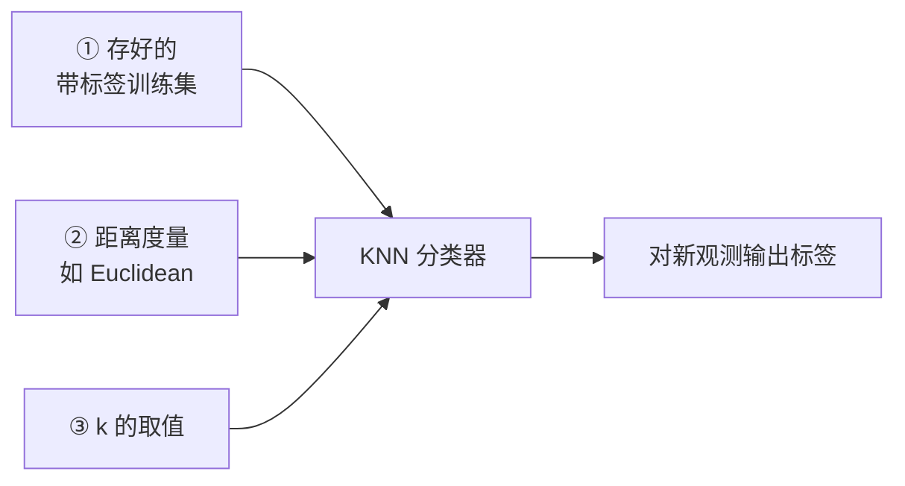

## §7 距离:Euclidean distance

Slides 给出的度量是 **Euclidean distance(欧氏距离)**:

$$d(p,q) \;=\; \sqrt{\sum_{i} \left(p_i - q_i\right)^{2}}$$

把它读出声:**两个点 $p$ 与 $q$ 的距离,等于"逐个维度作差、平方、全部加起来、再开根号"**。其中 $p_i$ 是点 $p$ 在第 $i$ 个属性上的取值,$q_i$ 同理,求和跑遍所有属性维度。

在二维时它就是勾股定理:$d = \sqrt{(p_1-q_1)^2 + (p_2-q_2)^2}$,也就是你在纸上用尺子量出的那条直线长度。公式的价值在于它**原封不动地推广到任意维度**——300 个属性的客户画像之间的"直线距离",算法完全一样,只是求和跑 300 项。

> **🔑 例(手算一次)**
> 训练点 $A = (2,\,3)$ 标签为 +,训练点 $B = (6,\,6)$ 标签为 −,新观测 $x = (3,\,4)$。
> $d(x,A) = \sqrt{(3-2)^2+(4-3)^2} = \sqrt{1+1} = \sqrt{2} \approx 1.41$
> $d(x,B) = \sqrt{(3-6)^2+(4-6)^2} = \sqrt{9+4} = \sqrt{13} \approx 3.61$
> 若 $k=1$,最近的是 $A$,故预测 $x$ 为 **+**。

> 📎 **拓展(超出 slides)** — 上周 clustering 那一讲反复强调过的 **rescaling(尺度归一化)** 在这里同样致命,而且原因一模一样:欧氏距离对量纲敏感。如果一个属性是"年收入"(量级 $10^4$)、另一个是"子女数"(量级 $10^0$),那么平方求和时收入会完全淹没子女数,等于**默默地把权重全给了收入**。KNN 前请务必先做标准化(如 z-score 或 min–max)。Slides 没有重提这一点,但它是 KNN 在实践中最常见的翻车原因。

## §8 什么是"k 个最近邻"

Slides 用一句话定义:

> **K-nearest neighbors of a record $x$ are data points that have the $k$ smallest distance to $x$.**

也就是:把所有训练点到 $x$ 的距离**升序排列**,取前 $k$ 个。几何上,这相当于以 $x$ 为圆心画一个刚好圈住 $k$ 个点的圆。Slides 用三张并排的图展示了 $k$ 从 1 到 3 时这个圆的膨胀:

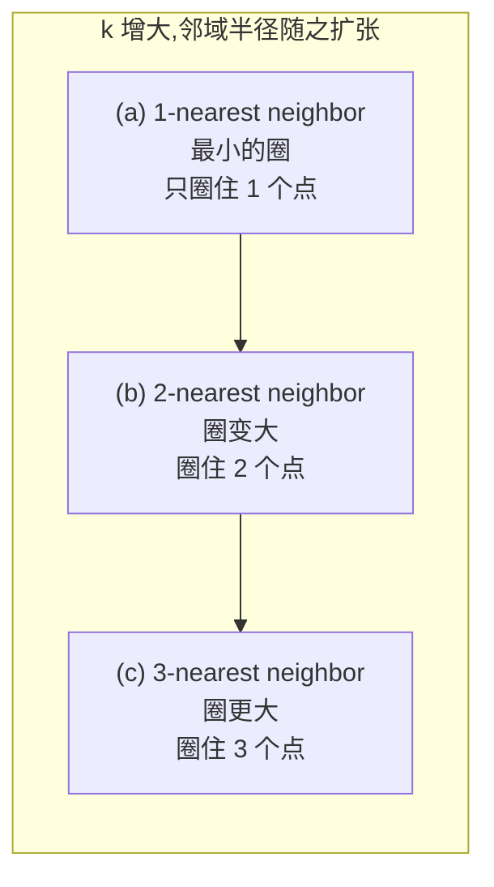

关键的观察是:**$k$ 并不改变数据,它改变的是"你愿意看多远"**。这个"看多远"的选择,直接决定了分类结果——slides 的三张图里,同一个待判点 $x$ 在 $k=1$ 时被最近的那个 – 决定,在 $k=3$ 时因为圈进了两个 + 而可能翻盘。讲师对着这三张图说:

> *"你可以看到,如果我们改变 $k$ 的值——$k=1$ 时,我们会把横杠(–)指派给这个未知数据。如果是 2,就会变成平局。现在如果你设 $k=3$,它会变成加号(+)。"*

**$k=2$ 会平局**这个细节值得单独记一笔:偶数个邻居在二分类问题里可能投出 1:1,此时只能任选其一或引入 §9 的加权规则。这就是为什么实践中 **$k$ 通常取奇数**。

## §9 怎么投票:多数决与距离加权

找到 $k$ 个邻居之后,怎么定标签?Slides 给了两种:

> - **take the majority vote of class labels among the k-nearest neighbors** — 多数决
> - **Weigh the vote according to distance; weight factor, $w = 1/d^2$** — 按距离加权

**多数决(majority vote)** 是默认做法,简单粗暴:$k$ 个邻居里哪个标签占多数,新观测就归哪一类。讲师给了一个非常好记的类比:

> *"基本想法是:我想看看你的朋友都是谁,然后我就把他们的标签指派给你。因为你跟你的朋友待在一起——你每天跟他们待着、跟他们玩、跟他们生活——那你就可以继承这个标签。这就是 KNN 的思想。"*

**距离加权投票** 修正了多数决的一个明显缺陷:它把"贴着你的那个邻居"和"在圈边缘勉强够到的那个邻居"当成了同等重要。加权版本给每个邻居一个权重

$$w = \frac{1}{d^{2}}$$

其中 $d$ 是该邻居到待判点的距离。距离越近,$1/d^2$ 越大,这一票越重。然后按类别把权重加总,总权重高的类胜出。讲师对此的评价是:

> *"有时候你会说,既然最近的那个邻居应该更有发言权,那你就可以加权。但这不是那么本质。"*

换句话说:**知道有这回事、会写公式即可**,多数决仍是主线。

> **🔑 例(多数决 vs 加权,同一组邻居给出不同答案)**
> 设 $k=3$,三个邻居为:
>
> | 邻居 | 标签 | 距离 $d$ | 权重 $w=1/d^2$ |
> |---|---|---|---|
> | N1 | + | 1.0 | 1.00 |
> | N2 | − | 3.0 | 0.111 |
> | N3 | − | 4.0 | 0.0625 |
>
> **多数决**:− 有 2 票,+ 有 1 票 → 判为 **−**。
> **距离加权**:+ 的总权重 $=1.00$;− 的总权重 $=0.111+0.0625=0.174$ → 判为 **+**。
>
> 两种规则给出相反结论。原因是那个 + 邻居**紧贴着**待判点,而两个 − 邻居都在很远处——加权规则认为"近"比"多"更可信。

## §10 怎么选 k:三条约束的拉锯

$k$ 是 KNN 唯一的超参数,而 slides 用三句话把选它的全部权衡讲完了:

> - **If $k$ is too small, sensitive to noise points** — $k$ 太小,对噪声点敏感
> - **If $k$ is too large, neighborhood may include points from other classes** — $k$ 太大,邻域可能混入其他类的点
> - **Computational cost often increases when $k$ increases** — $k$ 增大,计算成本通常上升

把三句话都展开成机制。

**$k$ 太小为什么危险?** 极端情况 $k=1$:新观测的标签**完全由离它最近的那一个点决定**。如果那个点恰好是一个标注错误的样本、或者一个罕见的离群点,你的预测就直接被它带偏。整个决策没有任何冗余——**一个坏点 = 一个错误预测**。$k$ 大一些相当于"多问几个人",少数噪声会被多数正常样本淹没,这就是**平滑效应**。

**$k$ 太大为什么也危险?** 因为邻域是个不断膨胀的圆,圆开得太大就会**越过类别的边界**,把本属于另一类的点也算进来投票。Slides 上那张图正是画这个的:一个待判点周围紧密围着 4 个 +,但因为圆开得太大,圈进了十几个来自外围的 −,结果多数决判成 −——**局部的真实结构被远处的无关点投票淹没了**。极端情况 $k = N$(全部训练样本),那么无论你问哪个点,答案永远是训练集里样本最多的那一类——分类器彻底退化,不再"看"输入。

**计算成本为什么随 $k$ 上升?** 注意主要成本其实是**算 $N$ 个距离**,这与 $k$ 无关;$k$ 带来的额外成本在于**维护并检索前 $k$ 小**(排序或堆操作)以及后续的投票统计。所以这条约束在实践中不如前两条重要,但 slides 列了它,考试就可能问。

三条约束合起来,画出的是一条经典的 U 型曲线:

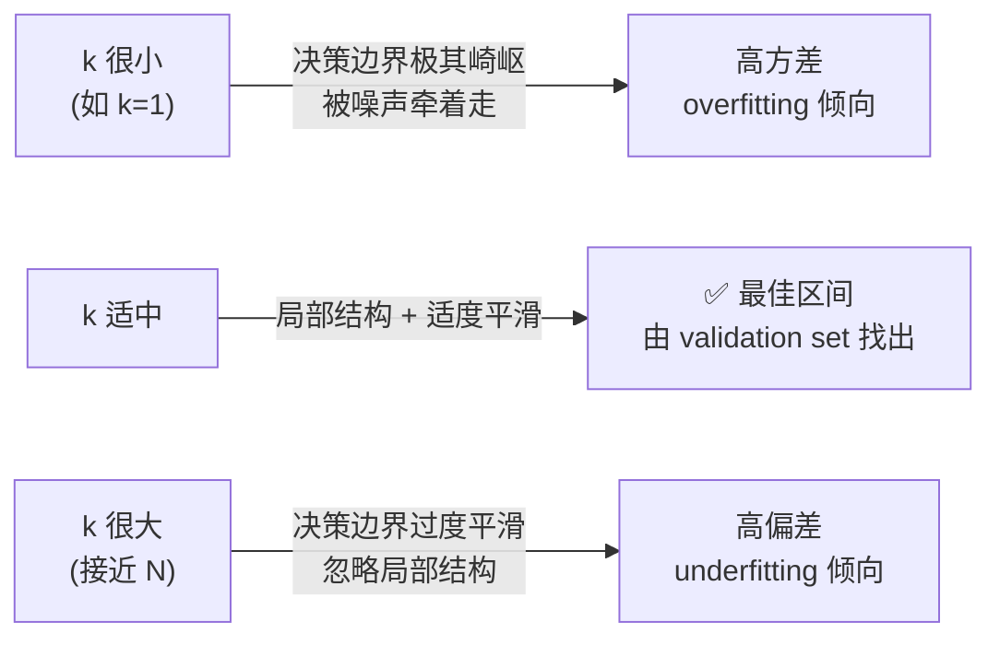

**那到底怎么定?** 用 §4 的流程。讲师明确说:*"我们用一个叫 cross-validation 的东西。"* 即:候选一串 $k$ 值,各自在 validation set 上评分,选分最高的那个,最后才动 test set。

## §11 KNN 小结:一个被低估的 baseline

讲师对 KNN 的整体评价值得原样记下:

> *"实际上 KNN 的表现并不差。它不是线性分类器,不是简单的一条直线,它是非线性分类器。它的表现可以被当作一个很好的基准(baseline)。当然你可以进一步改进它,但通常它会给你一个相当不错的起点。"*

"**非线性分类器**"这个论断值得解释一下,因为它不显然。KNN 从头到尾没有拟合任何一条线或一个平面,那它的决策边界从哪来?答案是:**边界是被数据自己"挤"出来的**。平面上任意一点,都由它周围 $k$ 个邻居的投票决定归属;当你把整个平面每一点都判一遍,类别切换的地方连起来,就形成了一条**弯弯曲曲、随数据分布任意起伏的边界**。这种边界不受任何函数形式的约束,因此天然是非线性的——这正是 KNN 明明如此简单却能给出不错性能的原因。

**本节要点**

| 项目 | KNN 的答案 |
|---|---|
| 需要哪三样 | 存储的训练集 · 距离度量 · $k$ |
| 训练过程 | **无**(lazy learner,只存数据) |
| 分类三步 | 算距离 → 取 $k$ 个最近邻 → 多数投票 |
| 距离公式 | $d(p,q)=\sqrt{\sum_i (p_i-q_i)^2}$ |
| 加权投票 | $w = 1/d^{2}$ |
| $k$ 太小 | 对 noise 敏感 |
| $k$ 太大 | 邻域混入其他类;$k=N$ 时退化为"永远预测多数类" |
| 怎么定 $k$ | validation set / cross-validation,奇数优先 |
| 边界形状 | **非线性**,由数据分布决定 |
| 定位 | 优秀的 **baseline**,值得先跑一遍再谈复杂模型 |

---
# Part III · Decision Tree:把分类变成一串好问题

## §12 从"猜名人"游戏说起

KNN 的问题是它什么也没告诉你。它能给出预测,但如果老板问"**为什么**你判断这个客户会买?",KNN 只能说"因为跟他最像的三个人都买了"。这在很多场景下是不可接受的——银行拒贷要给理由,医院诊断要有依据。

**Decision tree(决策树)** 直接针对这一点:它给出的不是一个黑箱预测,而是**一串你能读出来的问题**。

讲师用一个游戏引入了它,这个类比几乎把整个算法的精神都讲完了:

> *"我不确定你有没有跟朋友玩过这个游戏——诀窍是问对的问题。比如你写下一个名人的名字,把它藏进信封放在那儿,然后你让朋友问你问题,看他要问多少个问题才能猜出我刚写的名字。你会说:哦,澳大利亚人还是非澳大利亚人?是或不是。男的还是女的?是或不是。诸如此类。*
>
> *你其实会发现,什么样的问题是最好的问题。你会问那种你认为能**快速降低不确定性**、能让你快速锁定那个人的问题。没有人会问'这个人修不修 CSCI 946 这门课'——你至少不会从那个问题开始。你会从男的女的、澳不澳大利亚开始,因为它们能快速地把不确定性削下去。*
>
> ***如果你会玩这个游戏,那你就懂了 decision tree 的精神。***"

请把这段话在脑子里放住,因为后面 §16–§19 那一大堆 $\log_2$ 公式,做的事情**只有一件**:把"哪个问题能最快降低不确定性"这句大白话,翻译成一个能让计算机自动计算的数字。

## §13 树的解剖:节点、分支、深度、叶子

先把结构说清楚。Slides 分三页给出定义:

> **A decision tree uses a tree structure to specify sequences of decisions and consequences. Given input variable $X=\{x_1,x_2,\ldots,x_n\}$, the goal is to predict an output variable $Y$.**
> **Each node tests a particular input variable. Each branch represents the decision made. Classifying a new observation is to traverse this decision tree.**
> **The depth of a node is the minimum number of steps required to reach the node from root. Leaf nodes are at the end of the last branches on the tree, representing class labels.**

讲师首先澄清了一个字面上的误会:*"decision tree 不是一棵真的树,它是一个树结构。这个树结构对应着一组问题,基于这组问题,你的数据会被引导到某个叶子节点,而叶子节点会告诉你标签。"*

术语一次说清:

| 术语 | 定义 | 作用 |
|---|---|---|
| **Root node**(根节点) | 树最顶端的节点 | 提出**第一个**问题——也是最重要的那个 |
| **Internal node**(内部节点) | 既非根、也非叶的节点 | 提出后续问题,每个节点**测试一个输入变量** |
| **Branch**(分支) | 从节点引出的边 | 代表**对该问题的一个回答**(做出的决策) |
| **Leaf node**(叶节点) | 最末端、不再分裂的节点 | 携带一个**class label**,即最终预测 |
| **Depth**(深度) | 从 root 到该节点的**最小步数** | 衡量树有多"深",是控制过拟合的关键旋钮 |

讲师用 slides 上那棵小树逐节点走了一遍,把抽象定义落到了地上:

> *"你可以看到这是一棵简单的树,由三个问题组成。第一个问题是男还是女。于是基于 X 的值——这个样本在 gender 这个属性上的取值——数据会被引导到这边或那边。如果是女性,走这条路。下一个问题是:她的收入是不是大于 45K?答案会回来,因为我们知道这个值。如果小于,那 yes 就是最终标签。假设这是一个贷款申请,yes 就是批准。"*

用一张图把这棵示例树画出来:

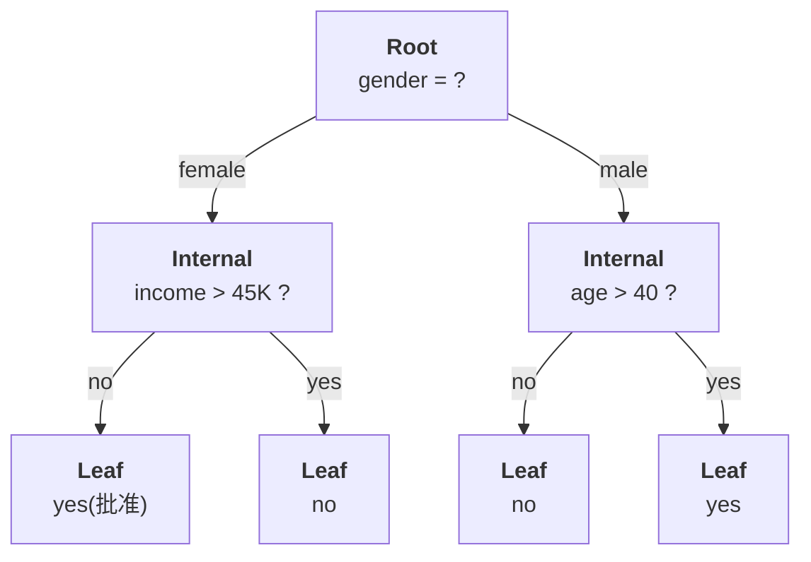

**深度怎么数?** root 的深度是 0;`income > 45K?` 与 `age > 40?` 的深度是 1;四个叶子的深度都是 2。定义里"**最小**步数"这个词是为了严谨——在一般的图里从根到某点可能有多条路径,但在树里路径唯一,所以"最小"其实就是"那一条"。

**分类一条新观测怎么做?** 讲师说得很清楚:*"你手上有这条数据的所有属性值,你就按每个节点上的问题往下走,你的数据会自动遍历这棵树,最后落到某一个叶子节点里。然后你查看这个叶子节点的类别名,把这个类别名指派给它。"*

注意这个过程有多便宜:**一次分类只需要回答 depth 个问题**。一棵深度为 5 的树,最多问 5 个问题就出答案——不管训练集有 2000 条还是 2000 万条。这与 KNN 每次都要算 $N$ 个距离形成鲜明对比,也是 §26 里"computationally inexpensive"的来源。

## §14 用例:决策树天然适合哪些问题

Slides 列了四个应用场景:

> - **Classify animals**: questions (like cold-blooded or warm-blooded, mammal or not mammal) are answered to arrive at a certain classification
> - **Checklist of symptoms during a doctor's evaluation of a patient**
> - **Retailers use decision tree to predict response rates to marketing and promotions**
> - **Financial institutions use it for loan application**

讲师特别点出第二个是最好的例子:

> *"我觉得第二个是个好例子——医生问诊时的症状清单。咳嗽?没有。发烧?有。肌肉酸痛?有。流鼻涕?……你把这些是或否都回答完,医生很快就知道:哦,你得的是这个。"*

这四个场景有一个共同的结构性特征,值得点破:**它们本来就是以"一连串问题"的形式存在的**。医生的问诊清单、生物学的检索表、银行的信贷审批规则——人类专家在这些领域里,原本用的就是树形逻辑。决策树之所以在这些地方好用,不是因为它数学上更优,而是因为**它学出来的模型形状与领域专家脑子里的模型形状是同构的**。这直接带来了 §26 会讲的最大优势:可解释性。

## §15 贯穿全章的例子:银行定期存款

从这里开始,slides 引入一个案例并一路用到 naïve Bayes,请务必记住它的设定。

> **An example: A bank markets its term deposit product. So the bank needs to predict which clients would subscribe to a term deposit.**
> - **The bank collects a dataset of 2000 previous clients with known "subscribe or not".**
> - **Input variables to describe each client are: job, marital status, education level, credit default, housing loan, personal loan, contact type, previous campaign contact.**

讲师把商业动机补全了:

> *"银行在推销它的定期存款产品——1 年、3 年、5 年,可能有更高的利率。所以银行需要预测哪些客户会订购这个定期存款。也许他们可以做精准广告。……一旦有新客户来,我们收集他的属性,就能用我们的模型预测他会不会订购。如果他们订购的可能性很高,我们就把这个信息通过邮件或电子邮件发给他们,以确保有高的响应率。"*

训练数据长这样(slides 展示了前 15 行):

| | job | marital | education | default | housing | loan | contact | poutcome | **subscribed** |
|---|---|---|---|---|---|---|---|---|---|
| 1 | management | single | tertiary | no | yes | no | cellular | unknown | **no** |
| 2 | entrepreneur | married | tertiary | no | yes | yes | cellular | unknown | **no** |
| 3 | services | divorced | secondary | no | no | no | cellular | unknown | **yes** |
| 4 | management | married | tertiary | no | yes | no | cellular | unknown | **no** |
| … | … | … | … | … | … | … | … | … | … |

讲师强调了一个读表的通用习惯:

> *"最后一列,通常要么是最后一列、要么是第一列,代表 class label。这里是最后一列,叫 subscribed:yes、no、no、yes、yes。所以你可以看到,前面所有的列都是属性,最后一列我们称为 target 或 class label。它就是我们要为新客户预测的东西。"*

**八个属性全部是 categorical(类别型)**,没有一个是数值——这一点很重要,它是后面 §26 说"decision tree 能同时处理数值和类别输入"的具体印证,也是 §37 里 naïve Bayes 用 MultinomialNB 而不是 GaussianNB 的原因。

### 训练出来的树

Slides 展示了在这 2000 条数据上跑出来的树:

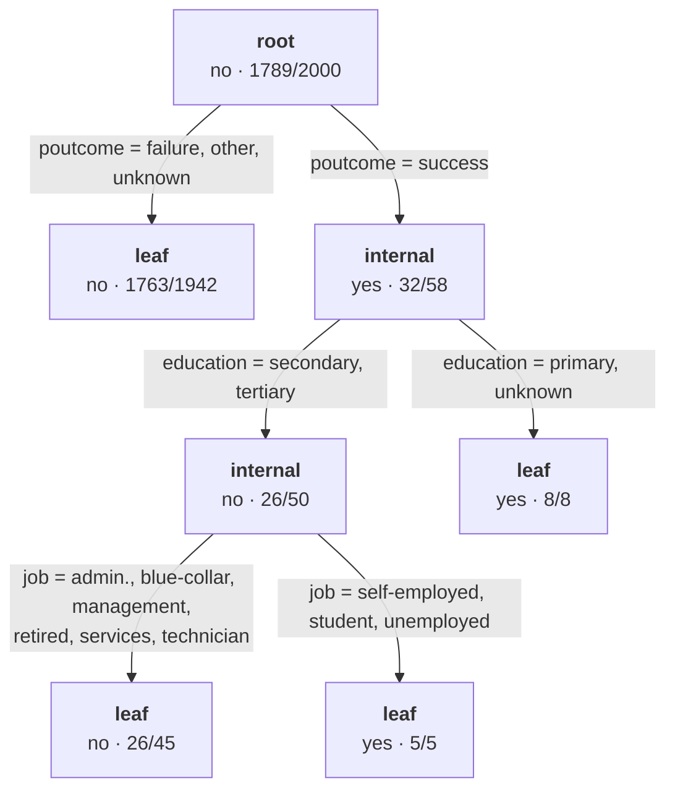

**每个节点上的两个数字怎么读?** 讲师专门解释了,这是考试常见的读图题:

> *"每个节点上都有一个类别标签,yes 或 no。这个标签的意思是:落在这个节点里的数据,**多数**属于这个类。所以任何落进这个节点的数据都会被宣判为多数标签。因为总共有 2000 个客户,其中 1789 个没有订购,所以这个根节点被标为 no,因为多数是 no。"*

于是记法是:**节点标签 = 该节点内的多数类;`a/b` 中的 $b$ 是落入该节点的样本数,$a$ 是其中属于被标注类别的数量**。

再走两个节点验证一下这套读法:

- **左叶子 `no · 1763/1942`**:1942 个样本落进来,其中 1763 个是 no。纯度 $1763/1942 = 90.8\%$。讲师说:*"我们在这里就停了,不再分裂。为什么?因为纯度已经相当高了。"*
- **右子树 `yes · 32/58`**:58 个样本,32 个是 yes。纯度只有 55%,几乎是抛硬币——所以必须继续分裂。
- **`yes · 8/8`**:8 个样本全是 yes,**纯度 100%**。讲师:*"再分下去没有意义,即使你分了,你得到的还是同一个类别标签。"*

讲师还教了一个非常实用的自查技巧:

> *"你可以很容易地检查你的分裂对不对,因为 58 个里如果有 8 个去了右边,那左边就必须有 50 个。否则就出错了——样本数不会增加也不会减少。"*

**父节点的样本数 = 所有子节点样本数之和**,这是一条恒等式,手算时用它查错百试百灵。同理 $1942 + 58 = 2000$ ✓,$45 + 5 = 50$ ✓。

数一数这棵树的构造:**1 个 root node,2 个 internal node,4 个 leaf node**。最深的叶子(`no · 26/45` 和 `yes · 5/5`)深度为 3。

> ⚠️ **一处口径差异,考试时按公式走** — Slide 16 的题面写的是 "there are 2000 customers in total. Among them, **1789 subscribed** term deposit",而讲师在课上和这棵树上说的是 **1789 个没有订购**(root 被标为 `no`,与"多数是 no"一致)。从树的结构看,**讲师的口径是对的**,slide 的措辞应是笔误。好消息是:**熵对两个类别是对称的**,$H(0.8945, 0.1055) = H(0.1055, 0.8945)$,所以无论按哪种口径,$H_{\text{subscribed}}$ 都等于 **0.4862**,答案不受影响。

## §16 全章最重要的一个问题

讲完树的结构,讲师在 slides 上留了一个提问框,并把它抛给了课堂:

> **From your point of view, what is the most important issue in building a decision tree?**

有学生答:"顺序——怎么选第一个问题、第二个问题。"讲师确认了:

> *"是的,我的问题其实是:哪个属性应该被先用?为什么我们先用 poutcome?这就是最重要的问题——**我们需要确定该问哪个问题、该用哪个属性**。这把我们带到了 decision tree 的通用算法。"*

**为什么"先问哪个"是最重要的问题?** 想想 §12 的猜名人游戏就明白了。如果第一个问题问的是"这个人修不修 CSCI 946",那么绝大多数情况下答案是"否",而这个"否"几乎没有缩小任何搜索范围——你浪费了一次提问。如果第一个问题问"男还是女",搜索空间立刻减半。**同样的问题数量,不同的提问顺序,效率可以差出几个数量级。**

对决策树来说,后果还要更严重一层:树是**递归**构造的,第一刀切错了,后面所有的子树都建立在一个糟糕的划分之上,而且——正如 §21 会讲的——**决策树是贪心的,它不会回头修正**。

Slides 把目标形式化如下:

> **The objective of a decision tree algorithm: Construct a tree $T$ from a training set $S$.**
> **The algorithm picks the most informative attribute to branch the tree and does this recursively for each of the sub-trees.**
> **The most informative attribute is identified by: Information gain, calculated based on Entropy.**

于是路线图变成了:


我们从最底层的 entropy 开始,一层层建上去。

## §17 Entropy:把"不确定性"变成一个数

### 直觉先行

讲师在写公式之前先讲了直觉,我们照做:

> *"我们怎么评估信息?在统计学、在信息论里,我们用一个叫 **entropy(熵)** 的东西。熵对应着一个变量的随机性。如果一个变量有很高的随机性,它就有很高的熵。如果一个变量是常数,那它的熵是零。"*

所以熵是一把尺子,量的是**"我对这个随机变量的取值有多不确定"**:

- 完全不知道会是什么 → **熵高**
- 已经确定是什么 → **熵 = 0**

讲师用抛硬币把这把尺子的两端都走了一遍:

> *"假设你有一枚硬币,是公平硬币。你抛它,正面反面的机会各是 0.5,一半一半。……但如果你玩的是一枚不公平的硬币,正面 0.8,反面 0.2,熵就会下降,因为一个结果变得更确定了。然后在极端情况下,如果你的硬币不管什么原因,你一抛它总是正面朝上,那它就变成了常数,P(正面) 变成 1.0,P(反面) 变成 0,熵也就变成零。"*

### 公式

Slides 给出的定义是:

> Given a class $X$ and its label $x \in X$, let $P(x)$ be the probability of $x$. $H_X$, the entropy of $X$, is defined as:

$$H_X \;=\; -\sum_{\forall x \in X} P(x)\log_2 P(x)$$

**把每个符号读出来**:$X$ 是一个随机变量(在我们的场景里就是 class label,比如 `subscribed`);$x$ 遍历它所有可能的取值(`yes`、`no`);$P(x)$ 是取到该值的概率。对每个取值算 $P(x)\log_2 P(x)$,全部加起来,**最后取负号**。

**为什么要有那个负号?** 因为概率 $P(x) \in [0,1]$,所以 $\log_2 P(x) \le 0$,整个求和是非正的。加负号只是为了让熵是个**非负数**,读起来舒服。

**为什么底数是 2?** 这样熵的单位是 **bit(比特)**,而"$H=1$ bit"有一个非常具体的含义:**平均需要 1 个是/否问题才能确定答案**。公平硬币的熵正好是 1 bit——你确实需要问一次"是正面吗?"才能知道结果。回到猜名人游戏:熵就是**"平均还要问多少个是非题"**,这正是这个量与 §12 那个游戏的精确接口。

### 手算两端

> **🔑 例 1(公平硬币,熵最大)**
> $P(\text{head}) = P(\text{tail}) = 0.5$。
> $H = -[0.5\log_2 0.5 + 0.5\log_2 0.5] = -[0.5\times(-1) + 0.5\times(-1)] = 1.0$
> 讲师原话:*"你可以很快验证,如果每个都是 0.5,你会发现这个值正好是 1.0。"*

> **🔑 例 2(不公平硬币,熵下降)**
> $P(\text{head}) = 0.8$,$P(\text{tail}) = 0.2$。
> $\log_2 0.8 = -0.3219$,$\log_2 0.2 = -2.3219$
> $H = -[0.8\times(-0.3219) + 0.2\times(-2.3219)] = 0.2575 + 0.4644 = \mathbf{0.7219}$
> 比 1.0 小了——**结果变得更可预测,不确定性下降**。

> **🔑 例 3(常数,熵为零)**
> $P(\text{head}) = 1.0$,$P(\text{tail}) = 0$。
> $H = -[1.0 \times \log_2 1.0 + 0 \times \log_2 0] = -[1.0\times 0 + 0] = \mathbf{0}$
> (约定 $0\log_2 0 = 0$,取极限即得。)
> **完全确定 = 零不确定性 = 零熵。**

Slides 上那条倒扣的钟形曲线画的正是这件事:横轴 $P(X=1)$ 从 0 到 1,纵轴 $H_X$;**两端为 0,中点 $P=0.5$ 处取到最大值 1.0**,左右对称。

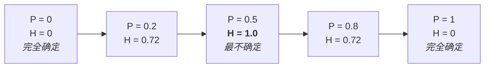

**这条曲线与"纯度"的关系**是理解后面所有内容的关键:**熵低 = 纯度高**。一个 8/8 全是 yes 的叶子,熵 = 0,纯度 100%;一个 32/58 的节点,熵接近 1,纯度极差。决策树做的全部事情,就是**想办法让子节点的熵尽可能低**。

### Slides 留的那道题

> **Question: In the previous bank marketing dataset, there are 2000 customers in total. Among them, 1789 [did not subscribe]. What is the entropy of the output variable "subscribed" ($H_{\text{subscribed}}$)?**

讲师说:*"你可以很容易地算出 $H_{\text{subscribed}}$,你只要看 2000 个里面多少百分比是 yes、多少是 no 就行了,这很直接。"* 我们把它算完,因为这个数字在 §19 会被用到:

$$P(\text{no}) = \frac{1789}{2000} = 0.8945, \qquad P(\text{yes}) = \frac{211}{2000} = 0.1055$$

$$\log_2 0.8945 = -0.1608, \qquad \log_2 0.1055 = -3.2447$$

$$H_{\text{subscribed}} = -[0.8945\times(-0.1608) + 0.1055\times(-3.2447)] = 0.1438 + 0.3423 = \mathbf{0.4862}$$

这个 **0.4862** 就是 slide 20 上出现的那个"base entropy"。它远低于 1.0,反映了一个事实:**这个数据集本身就很不平衡**(89% 都是 no),所以"不确定性"本来就不高。这个观察会在 §41 讲 class imbalance 时回来找我们。

## §18 Conditional Entropy:问完一个问题之后,还剩多少不确定性

### 直觉

熵回答的是"我现在有多不确定"。但我们真正想知道的是:**如果我问了某个问题、知道了某个属性的值,我还剩多少不确定?** 这就是 **conditional entropy(条件熵)**。

讲师又搬出了猜名人的例子,这次用得更精确:

> *"在你问我任何问题之前,关于这个人的不确定性非常高。然后你问了第一个问题:男的还是女的?我的回答是男的。然后你会觉得,搜索范围突然就缩窄了。你对这个人变得更确定了——你不会再去猜某个很有名的女科学家、女运动员或女教授,你知道答案是否定的。这意味着 Y 的剩余熵变小了。"*

**"剩余熵(remaining entropy)"** 这个词是理解条件熵的钥匙。

### 公式

Slides 给出定义:

> Given an attribute $X$, its value $x$, its outcome $Y$, and its value $y$, conditional entropy $H_{Y|X}$ is the remaining entropy of $Y$ given $X$:

$$H_{Y|X} \;=\; \sum_{x} P(x)\, H(Y \mid X = x)$$

$$\phantom{H_{Y|X}} \;=\; -\sum_{\forall x \in X} P(x) \sum_{\forall y \in Y} P(y\mid x)\log_2 P(y \mid x)$$

在我们的场景里:$X$ 是**属性**(比如 `contact`),$Y$ 是**类别标签**(`subscribed`)。

**第一行怎么读?** 对属性 $X$ 的每一个可能取值 $x$,先算"在 $X=x$ 这个条件下 $Y$ 的熵",然后**按 $P(x)$ 加权平均**。讲师说得很准:*"你可以看到,它就是一个加权平均。"*

**为什么必须加权平均?** 讲师解释了这个"必须":

> *"当然你并不确切知道这个问题的答案,所以我们必须对每一种情况都加以考虑。我们考虑所有训练数据——它们可能给出任何一个答案,所以它是一个加权平均。"*

换句话说:在**决定要不要问**这个问题的时候,你还不知道答案会是什么。你只知道**各个答案出现的概率**。所以"问完之后的剩余不确定性"只能是各种可能答案下剩余熵的**期望值**。这是理解整个 information gain 的关键——它衡量的是**期望收益**,不是某一次的实际收益。

**第二行是怎么来的?** 只是把第一行里的 $H(Y|X=x)$ 按熵的定义展开:$H(Y|X=x) = -\sum_y P(y|x)\log_2 P(y|x)$。讲师点明了这个对应关系:*"这一项可以进一步写成这样,因为这就是熵的定义,唯一的区别是概率变成了条件概率。"*

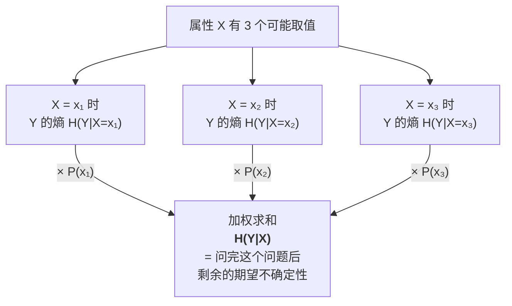

## §19 完整走一遍:contact 属性的条件熵

Slides 用 `contact` 属性做了一次完整演算,这是**本周最有可能出现在考卷上的计算题**。我们把每一步都走清楚。

### 设定

> **Assume the attribute $X$ is "contact"** — its value $x$ takes one value in {`cellular`, `telephone`, `unknown`}
> **The outcome $Y$ is "subscribed"** — its value $y$ takes one value in {`no`, `yes`}

从 2000 条训练数据里数出来的概率表:

| | **Cellular** | **Telephone** | **Unknown** |
|---|---|---|---|
| $P(\text{contact})$ | 0.6435 | 0.0680 | 0.2885 |
| $P(\text{subscribed}=\text{yes} \mid \text{contact})$ | 0.1399 | 0.0809 | 0.0347 |
| $P(\text{subscribed}=\text{no} \mid \text{contact})$ | 0.8601 | 0.9192 | 0.9653 |

**读表须知(讲师专门强调的两条自查)**:

1. **第一行加起来必须是 1**:$0.6435 + 0.0680 + 0.2885 = 1.0000$ ✓。因为每个客户的 contact 必然是这三种之一。讲师:*"你可以看到,如果你把这三个值加起来,你得到 1.0。"*
2. **每一列的后两行加起来必须是 1**:$0.1399 + 0.8601 = 1$ ✓,$0.0809+0.9192 \approx 1$ ✓,$0.0347+0.9653=1$ ✓。因为在给定 contact 的条件下,subscribed 要么 yes 要么 no。讲师:*"要么是 yes 要么是 no,两个值加起来是 1。"*

这两条恒等式在考试时**能立刻发现抄错的数字**,养成习惯。

### 代入

$$
\begin{aligned}
H_{\text{subscribed}|\text{contact}} = -\Big[\;& 0.6435\cdot\big(0.1399\log_2 0.1399 + 0.8601\log_2 0.8601\big) \\
+\;& 0.0680\cdot\big(0.0809\log_2 0.0809 + 0.9192\log_2 0.9192\big) \\
+\;& 0.2885\cdot\big(0.0347\log_2 0.0347 + 0.9653\log_2 0.9653\big)\;\Big] \\
=\;& \mathbf{0.4661}
\end{aligned}
$$

讲师对这个式子的结构做了个很有用的导览——**知道哪一项对应表里哪个格子,这道题就变成抄写**:

> *"这里有两层求和。第一层求和是 $P(x)$,$x$ 就是 cellular、telephone、unknown。所以你看到有 P(cellular)、P(telephone)、P(unknown),它们对应表里第一行。它们后面跟着的是条件熵里的 $P(y|x)\log P(y|x)$。第一个 0.1399 就是 $P(\text{subscribed}=\text{yes} \mid \text{contact}=\text{cellular})$……第二行对应这两个值,第三行对应这一个。……只要你知道哪一项对应哪个,把这个条件熵写出来就是件很容易的事。"*

### 逐项验算

考试时不一定给计算器,但理解每一项在算什么很重要。三个括号分别是三个"子熵":

| $x$ | $P(x)$ | $P(\text{yes}\mid x)$ | $P(\text{no}\mid x)$ | $H(Y \mid X=x)$ | 加权后 |
|---|---|---|---|---|---|
| cellular | 0.6435 | 0.1399 | 0.8601 | **0.5840** | 0.3758 |
| telephone | 0.0680 | 0.0809 | 0.9192 | **0.4052** | 0.0276 |
| unknown | 0.2885 | 0.0347 | 0.9653 | **0.2174** | 0.0627 |
| | | | | **合计** | **0.4661** ✓ |

这张表读出了 slides 上那个公式**没有直接说出来的洞察**:三个子群的纯度差别很大。`unknown` 组的熵只有 0.2174(96.5% 都是 no,非常纯),而 `cellular` 组的熵有 0.5840(相对最混杂)。**所以"知道 contact 是 unknown"这个信息很有价值,而"知道 contact 是 cellular"帮助有限**——加权平均把这两种情况按它们各自出现的频率折中了。

## §20 Information Gain:不确定性下降了多少

万事俱备。Slides 的定义:

> The information gain of an attribute $A$ is defined as the difference between the base entropy and the conditional entropy of the attribute:

$$\text{InfoGain}_A \;=\; H_S - H_{S|A}$$

$$\text{InfoGain}_{\text{contact}} = H_{\text{subscribed}} - H_{\text{subscribed}|\text{contact}} = 0.4862 - 0.4661 = \mathbf{0.0201}$$

> **It compares:**
> - **The degree of purity of the parent node before a split**
> - **The degree of purity of the child node after a split**

**把它读成一句话**:*"问这个问题之前,我对答案有 0.4862 bit 的不确定;问完之后,还剩 0.4661 bit。所以这个问题帮我消除了 0.0201 bit 的不确定性。"* 讲师的表述:

> *"Information gain 就是:在我们问任何问题之前,这是 $H_{\text{subscribed}}$;现在我们问了跟这个属性有关的问题之后,关于它的剩余熵是多少?……原本在问问题之前是 0.4862,现在我们算出问完 contact 之后是 0.4661,信息增益就是 0.0201。"*

这个数看起来很小,但**绝对值不重要,排序才重要**——我们要的只是"哪个属性的 gain 最大"。

### 排序,然后选第一刀

Slides 把八个属性的 information gain 全部算了出来:

> **The algorithm splits on the attribute with the largest information gain at each round.**

| Attribute | Information Gain |
|---|---|
| **`poutcome`** | **0.0289** ← 最大 |
| `contact` | 0.0201 |
| `housing` | 0.0133 |
| `job` | 0.0101 |
| `education` | 0.0034 |
| `marital` | 0.0018 |
| `loan` | 0.0010 |
| `default` | 0.0005 |

**这张表解释了 §15 那棵树的第一刀。** 讲师:

> *"我们可以很容易地对每个属性重复这个过程。我们刚才做的是 contact,你也可以做 poutcome、housing、job、education、marital、loan。然后你把 information gain 降序排列,你会发现 poutcome 是最大的。所以这就是为什么根节点上是 poutcome——因为它有最大的信息增益。"*

顺便注意排序传达的信息:`poutcome`(上一次营销活动的结果)的 gain 是 `default`(是否有信用违约)的 **58 倍**。这是一个有商业含义的发现——**"这个客户上次营销活动的反应"远比"他的信用记录"更能预测他这次会不会买**。决策树在做特征重要性排序,而它是可读的。

## §21 递归与停止:一棵树是怎么长完的

选出第一刀之后呢?讲师预判了这个问题:

> *"你可能会问:好,我知道第一步了,那第二步呢?其实它只告诉了我们第一步。第二步本质上是——**你把这个节点当作你的根节点**。现在你只有 58 条训练数据。你做同样的事情:在这 58 条上算 $H_{\text{subscribed}}$,然后在这 58 条数据上试每一个属性,来算你的分支。**每一棵子树本身就是一棵树**,所以你就一直这么做下去。"*

**"每一棵子树本身就是一棵树"** 是整个算法的递归本质。用伪代码写出来就是:

```
BuildTree(S):                          # S = 落在当前节点的样本集合
    if 满足任一停止条件:
        return 叶节点(标签 = S 中的多数类)
    for 每个还没用过的属性 A:
        计算 InfoGain_A = H_S − H_{S|A}    # 全部基于 S,不是全体数据!
    A* = argmax InfoGain_A
    创建内部节点,测试属性 A*
    for A* 的每个取值 v:
        S_v = S 中 A* = v 的子集
        把 BuildTree(S_v) 挂为该节点的子树   # ← 递归
    return 该节点
```

请特别注意注释里那句 **"全部基于 S,不是全体数据"**:在第二层计算熵时,base entropy 是**那 58 条数据的**熵,不是 2000 条的 0.4862。这是手算题最常见的错误来源。

### 三类停止条件

Slides 明确列出:

> **The algorithm constructs sub-trees recursively until one of the following criteria is met:**
> - **All the leaf nodes in the tree satisfy the minimum purity threshold (i.e., are pure enough)**
> - **There is no sufficient information gain by splitting on more attribute (i.e., not worth anymore)**
> - **Any other stopping criterion is satisfied (such as the maximum depth of the tree)**

| 停止条件 | 含义 | 讲师的说法 |
|---|---|---|
| **最低纯度阈值** | 节点已经足够纯,再分没意义 | *"比如那个 8 的节点,全部都是 yes,再分它有什么意义?就算只有 7/8,也没必要再分。"* |
| **信息增益不足** | 最好的属性也只能带来 0.000x 的增益 | *"就算你分了,你发现最大的信息增益也只有 0.000 几,你就说:算了,不值得了。"* |
| **其他准则** | 最常见的是 **max depth**,以及**叶节点最小样本数** | *"有时候 max depth 设成 10,否则你的树长得太深。或者你说,只有 5 个样本落进这个叶子,我还要再分吗?只有 3 个?不。"* |

第三类的两个旋钮在实践中最常用,请记住它们的名字:**`max_depth`** 和 **`min_samples_leaf` / `minsplit`**(后者正是 §27 R 代码里的那个参数)。它们是**控制过拟合的直接手段**——这条线索会在 §24 收拢。

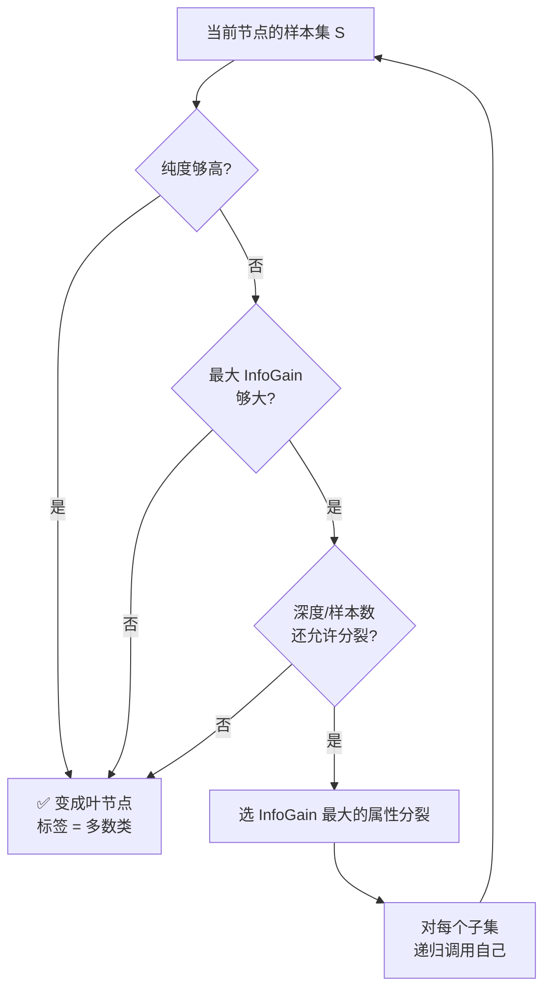

## §22 三个经典算法:ID3、C4.5、CART

Slides 只给了一行:

> **Popular decision tree algorithms: ID3, C4.5 and CART**

它们的区别值得知道,因为工具库里的默认行为由它决定:

| 算法 | 提出者/年代 | 分裂准则 | 特点 |
|---|---|---|---|
| **ID3** | Quinlan, 1986 | **Information Gain**(本章讲的) | 只处理类别型属性;不剪枝 |
| **C4.5** | Quinlan, 1993 | **Gain Ratio**(信息增益比) | ID3 的升级:支持连续属性、缺失值、post-pruning |
| **CART** | Breiman et al., 1984 | **Gini impurity**(分类)/ 平方误差(回归) | 只生成**二叉树**;既能分类又能回归 |

> 📎 **拓展(超出 slides)** — 三点补充,能解释你在工具里看到的现象:
>
> **1. 为什么 C4.5 要改用 Gain Ratio?** 因为纯信息增益**偏袒取值多的属性**。极端例子:把"客户 ID"当属性,它有 2000 个不同取值,每个取值下只有一个样本,所以每个子节点都 100% 纯,条件熵 = 0,信息增益达到最大值!但这棵树毫无泛化能力。Gain Ratio 用属性自身的熵去除以信息增益,惩罚这种"取值太多"的属性:$\text{GainRatio}_A = \text{InfoGain}_A / H_A$。
>
> **2. Gini impurity 是什么?** CART 用的准则,定义为 $\text{Gini} = 1 - \sum_i p_i^2$。它衡量的东西和熵几乎一样(纯节点为 0,均匀分布时最大),但**不需要算对数**,计算更快,所以是 scikit-learn 的默认值。这就是为什么 §27 的 Python 代码要显式写 `criterion="entropy"` ——**不写的话默认是 gini,跟本章讲的算法就不一致了**。
>
> **3. 名字的由来**:CART = **C**lassification **A**nd **R**egression **T**rees。

## §23 决策树是贪心的,而贪心会带来麻烦

### 什么叫贪心

Slides 开门见山:

> **Decision tree uses greedy algorithms.**
> - **It always chooses the option that seems the best available at that moment**
> - **However, the option may not be the best overall and this could cause overfitting**
> - **An ensemble technique can address this issue by combining multiple decision trees that use random splitting (Random Forest)**

讲师把"贪心"的两个后果说得很清楚:

> *"决策树通过比较所有属性的信息增益来分裂一个节点。它只用这个节点上的信息,永远选这个节点上当下最好的那个。它不考虑全局最优,它是局部最优。所以它是贪心的。而且一旦它分裂了,它就分裂了——**你没法把它合并回去**。"*

两句话对应两个性质:

1. **只看当下(局部最优)。** 算法在选第一刀时,只问"哪个属性此刻的信息增益最大",完全不考虑"选了它之后,后面还能不能分得好"。有可能存在这样一种情形:属性 A 当下增益略低于 B,但选了 A 之后能形成一个极好的两层结构,总体上远优于选 B。**贪心算法永远发现不了这种机会**,因为它从不做前瞻。
2. **不可回溯。** 一旦分裂,决策就固化了,后续步骤不会回头修正早期的错误选择。

**为什么不干脆搜索全局最优?** 因为找出全局最优决策树是 **NP-hard** 问题——属性的排列组合随属性数呈指数爆炸。贪心是一个**用最优性换可计算性**的工程折中,而且实践中效果相当好。但它确实留下了一个漏洞,那就是 overfitting。

### 补救:Random Forest

Slides 给的解药是 ensemble。讲师用了一个学生们熟悉的场景来讲:

> *"我知道有些学生参加 Kaggle 竞赛,他们喜欢比赛。你会发现,Kaggle 竞赛的获胜者里,大多数——如果不是全部——**他们不用 decision tree,他们用 random forest**。为什么?因为他们用很多棵树。他们用很多棵决策树,所以叫 forest,random forest。他们把多棵决策树放在一起,通过随机分裂属性/取值,可以避免过拟合,可以取得更好的表现。通常 random forest 肯定比单棵决策树好,因为决策树只是一棵树,而 random forest 通常是 400 棵或 500 棵树放在一起,然后你做多数投票。"*

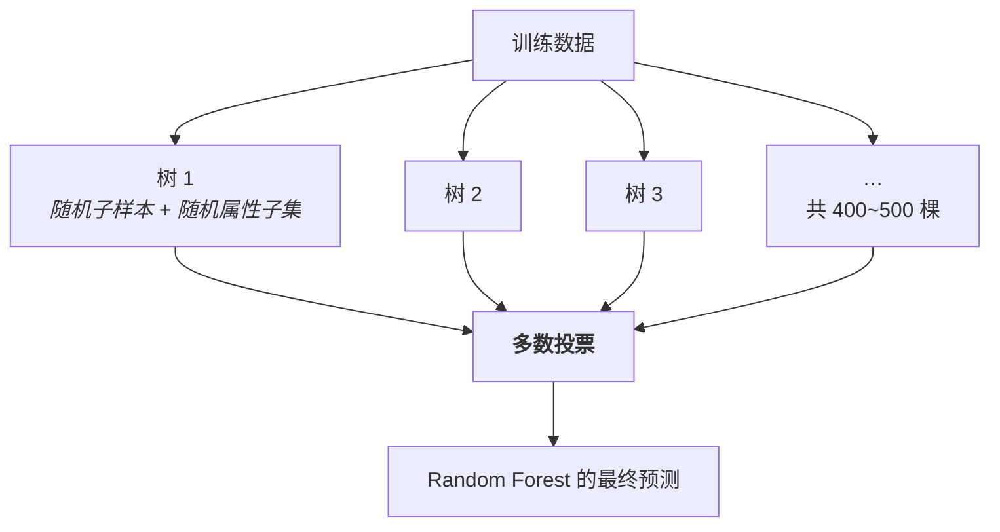

**为什么多棵树就能抗过拟合?** 关键在"random":每棵树看到的是**随机抽取的样本子集 + 随机抽取的属性子集**,所以每棵树都会犯**不同的**错误。当你把几百棵树的预测平均起来,这些互不相关的错误会相互抵消,而它们**共同学到的真实规律**会被保留下来。这是 §38 会再提到的 **ensemble method(集成方法)** 的核心思想。

## §24 Overfitting:讲师口中"分类的头号概念"

这一节是本周的思想核心。讲师停下来专门强调:

> *"什么是 overfitting?我提过好几次了。我想说 **overfitting 是分类里第一重要的概念**。任何人,如果你想说你懂分类,我会问你的第一个问题就是:你知道什么是 overfitting 吗?**如果你不知道 overfitting,我会说,不,你不懂分类。**"*

### 定义:两条曲线的故事

讲师用训练过程中的两条误差曲线定义了它:

> *"Overfitting 的意思是,你训练你的模型——任何模型——你不断训练,你会发现在训练数据上的表现,或者说训练数据上的误差,会逐渐下降、趋近于零,然后你会感到高兴,越来越高兴,因为训练误差一直在降。*
>
> *但是,到某个点,如果你一直检查你的模型在**验证集**上的分类表现……你会发现,一开始它也在下降、下降,但到了某一点,**它开始上升了**。这就是我们说'你必须在这里停下'的那个点。在这个点之后,我会说,那就是 overfitting。"*

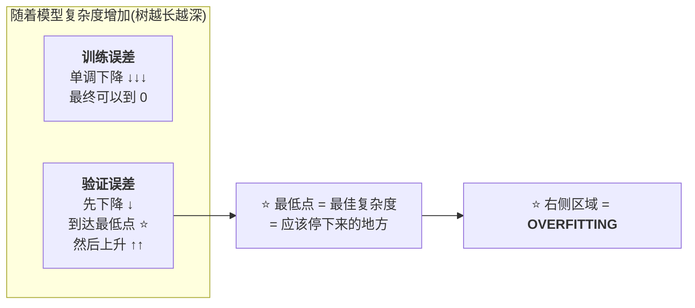

**这幅图为什么必须记住?** 因为它说明了一件反直觉的事:**训练误差越低,模型不一定越好**。训练误差是一个会持续骗你的指标——它可以一路降到 0,而此时模型可能已经废了。**只有验证误差告诉你真相。**

### 机制:模型在学噪声

讲师给出了 overfitting 的本质定义:

> *"Overfitting 意味着你的模型没有在学习真正的底层规律、真正的底层模式,**它在学数据的噪声**,它在学它不该学的东西。"*

任何数据集都由两部分构成:**信号(真实的、可泛化的规律)** 和 **噪声(这一份样本特有的随机波动)**。一个容量足够大的模型有能力把两者**都**记下来。记住信号让它在新数据上表现好;记住噪声只在训练集上有用,在新数据上纯属干扰——因为新数据的噪声是**另一组**随机波动。

### 那个 1+2 的比喻

讲师给了一个绝妙的类比,请一定记住:

> *"对一个模型来说,overfitting 意味着——你知道 1+2 等于几吗?哦我知道 1+2=3,因为在我的训练数据里有这么一个等式,我把它背下来了。然后另一个问题:你知道 2+1 等于几吗?**我不知道,因为我没见过这个。** 这就意味着你的模型并没有真正学会底层的加法规则,它只是记住了。这就是 overfitting。"*

这个比喻的精髓在于它区分了**记忆**与**理解**:

| | **记忆(overfitting)** | **理解(泛化)** |
|---|---|---|
| 学到的东西 | "1+2=3" 这一条具体记录 | 加法运算的**规则** |
| 训练集表现 | 完美 | 很好 |
| 新数据(2+1) | **失败** | 成功 |
| 决策树上的对应 | 树长得极深,几乎每个叶子只装 1 个训练样本 | 树深度适中,每个叶子代表一条有意义的规则 |

### 在决策树上具体是什么样子

Slides 列出三个成因:

> **Overfitting in decision tree:**
> - **The lack of training data**
> - **The biased training data**
> - **Too many layers or nodes**

| 成因 | 为什么导致过拟合 |
|---|---|
| **训练数据不足** | 样本太少,随机波动看起来就像规律。回想 §3:**标注昂贵**,所以这是分类问题的常态而非例外。 |
| **训练数据有偏** | 样本不能代表真实分布,模型学到的"规律"在真实世界里根本不成立。 |
| **层数或节点过多** | 树越深,每个叶子里的样本越少;当叶子只剩 1–2 个样本时,这棵树本质上就是在**逐条背诵训练集**。 |

讲师把第三条和数据量联系了起来:*"如果你的训练数据不够,就别把树长得太深。而且如果你有太多层、太多节点,祈祷吧。"*

Slides 在评估那一页也给了同样的信号:

> **Having too many layers and obtaining nodes with few members might be signs of overfitting.**

**"层数多 + 叶子样本少"是一条可以直接目视检查的诊断规则**,考试时若问"如何判断一棵决策树过拟合了",这句话就是标准答案之一。

## §25 剪枝:两种时机

既然知道了病因,治法就清楚了。Slides:

> **Avoid overfitting:**
> - **Stop growing the tree early before all training data are perfectly classified**
> - **Grow the full tree and then post-prune the tree**

讲师给了这两种做法的标准名称:

> *"怎么避免过拟合?两件事。一是 early stopping,别把树长得太多,你就长、长、然后停。这叫做 stop growing the tree early,早停,我们也叫它 **pre-pruning**。或者你可以把树长满,长到你觉得已经完全长成了,然后你需要开始 **post-pruning**。你逐渐地合并,你觉得这个叶子节点里的样本数太少了,把它放回去,把它放回去,这样你就能把它修剪掉,来降低过拟合的机会。"*

| | **Pre-pruning(预剪枝 / early stopping)** | **Post-pruning(后剪枝)** |
|---|---|---|
| 时机 | **生长过程中**就停 | 先**长满**,再往回剪 |
| 做法 | 用 §21 的停止条件:max depth、min samples、min gain | 自底向上,把"叶子样本太少 / 剪掉后验证误差不升"的子树合并回父节点 |
| 优点 | 快,省计算 | 效果通常更好——能看到"完整的树"再决定 |
| 缺点 | 可能**过早停止**:某个分裂当下增益低,但它之后能带来好分裂,却永远没机会 | 计算成本高(先长满再剪) |
| 对应参数 | `max_depth`、`min_samples_leaf` | R `rpart` 的 `cp`(complexity parameter)、`prune()` |

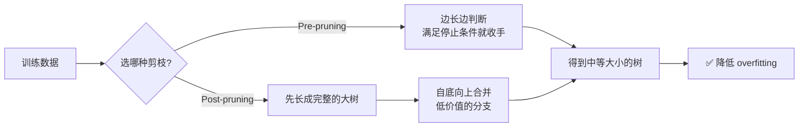

讲师对 post-pruning 的动作有个形象的描述——**"undo branching"**:*"修剪的意思是你撤销这次分支,你把子节点合并回父节点,来降低深度。"*

## §26 评估一棵决策树:三种方法

Slides 给了三条:

> **Ways to evaluate a decision tree:**
> - **Evaluate whether the splits of the tree make sense and whether the decision rules are sound (say, with domain experts)**
> - **Having too many layers and obtaining nodes with few members might be signs of overfitting**
> - **Use standard diagnostics tools for classifiers**

第二条已在 §24 讲过,第三条指向 §40 的 confusion matrix。**第一条最独特,也最能体现决策树的价值**,讲师专门展开了:

> *"从大数据分析的角度看,决策树的好处是它清楚地告诉你每一步用了哪个问题来分支。这意味着你知道每一个阶段问的是哪个问题——这个人有没有结婚、这个人有没有拿到学士学位、这个人挣多少钱。你知道这些问题。所以你可以评估树的分裂用的问题或属性是否合理,因为你可以很容易地把这些问题和**领域知识**关联起来。这是个好处。*
>
> *我们说决策树**不是黑箱**,不像神经网络、深度神经网络那样,你不知道里面发生了什么,你只知道一层一层、一个权重一个权重。而决策树是**白箱**,你确切地知道用了什么特征、问了什么问题。所以对**知识发现**来说,它很有帮助。"*

**这为什么是一种真正的"评估"?** 因为它引入了一个统计指标碰不到的检验维度。假设一棵预测贷款违约的树,把 root 分裂在"申请人的姓氏首字母"上——即使它在验证集上准确率不错,任何一个信贷专家看一眼都会说这毫无道理,多半是数据泄漏或巧合。**统计指标只能告诉你"对不对",领域专家能告诉你"讲不讲得通"**,而后者才是模型能否被部署、被信任的关键。

| 黑箱 vs 白箱 | **White box(决策树)** | **Black box(深度神经网络)** |
|---|---|---|
| 能看到什么 | 每个节点用了哪个属性、阈值是多少 | 只有一层层的权重矩阵 |
| 能否与专家核对 | **能** | 很难 |
| 知识发现价值 | 高——树本身就是可读的规则集 | 低 |
| 通常的准确率上限 | 中等 | 高 |

## §27 决策树的性质:优点、缺点,以及那个"Why?"

Slides 列出:

> - **Computationally inexpensive, easy to classify**
> - **Classification rules can be understood**
> - **Handle both numerical and categorical input**
> - **Handle variables that have a nonlinear effect on the outcome, better than linear models**
> - **Not a good choice if there are many irrelevant input variables (Why?) — Feature selection will be needed**

前四条讲师快速带过并确认:

> *"决策树的性质是什么?Computationally inexpensive,非常快,容易分类。Classification rules can be understood,这就是我说的白箱。同时处理数值和类别输入——数值没问题,你可以找一个阈值;类别的话,你自动可以用它的取值来分支。而且它们能处理非线性分类。"*

补充说明两点:

- **"计算便宜"体现在分类阶段**:如 §13 所述,一次预测只需要 depth 次比较。相比之下 KNN 每次预测都要扫全部训练数据。
- **"能处理非线性效应"**:线性模型假设每个变量对结果的影响是单调、成比例的;而决策树可以学出"收入在 30K–50K 之间时风险最高,两边都低"这种非单调关系——因为它只是在切区间,不假设任何函数形式。

### 那个 (Why?)

Slides 在最后一条后面留了个 "(Why?)",讲师给出了答案,这是一道很典型的理解题:

> *"如果你注意到有很多无关的输入变量,你就得小心了。很多无关的输入变量有可能让某个特征**看起来**非常强大,因为决策树会挑那个能给出最高信息增益的特征。如果你只有一个随机特征、两个随机特征,那没关系。但你想想,如果你有 100 个或 1000 个随机的、无关的特征,可能其中某一个特征恰好给了你最好的信息增益——只是**拟合了训练数据**而已,尤其当你的训练数据量不大的时候。这样的话,**从一开始你就可能选错了分裂点**,然后逐渐地这会把你带向过拟合。"*

把这个论证整理成一条清晰的因果链:

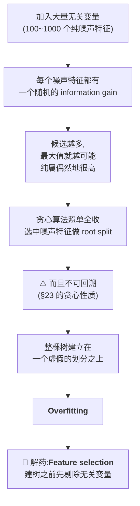

**这条链把本章前面的几块拼在了一起**:贪心(§23)让错误无法撤销,训练数据少(§3)让噪声更容易伪装成信号,两者叠加,无关变量的危害就被放大。讲师的结论直截了当:*"所以传达的信息是 feature selection——在你做决策树之前,你需要确保移除无关的特征。"*

### 性质总表

| 性质 | 说明 |
|---|---|
| ✅ 计算便宜 | 分类只需 depth 次比较 |
| ✅ 规则可读 | **白箱**,可与领域专家核对,利于知识发现 |
| ✅ 输入类型灵活 | 数值(找阈值)与类别(按取值分支)都能处理 |
| ✅ 能捕捉非线性 | 优于线性模型 |
| ❌ 怕无关变量 | 噪声特征可能偶然拿到最高 gain,污染 root split → 必须先做 **feature selection** |
| ❌ 贪心 | 局部最优、不可回溯 → 用 **Random Forest** 缓解 |
| ❌ 易过拟合 | 需要 **pre-pruning / post-pruning** |

## §28 决策树在 R 里怎么跑

Slides 用一个"要不要去打高尔夫"的小例子演示了完整流程:

> **`rpart` library is for modelling decision tree; `rpart.plot` enables the plotting of a tree.**
> **An example: Predict whether to play golf. Input variables: weather outlook, temperature, humidity, and wind.**

### 数据与建模

```r
play_decision <- read.table("DTdata.csv", header=TRUE, sep=",")
play_decision
#    Play  Outlook Temperature Humidity  Wind
# 1   yes    rainy        cool   normal FALSE
# 2    no    rainy        cool   normal  TRUE
# 3   yes overcast         hot     high FALSE
# 4    no    sunny        mild     high FALSE
# 5   yes    rainy        cool   normal FALSE
# 6   yes    sunny        cool   normal FALSE
# 7   yes    rainy        cool   normal FALSE
# 8   yes    sunny         hot   normal FALSE
# 9   yes overcast        mild     high  TRUE
# 10   no    sunny        mild     high  TRUE

fit <- rpart(Play ~ Outlook + Temperature + Humidity + Wind,
             method="class",
             data=play_decision,
             control=rpart.control(minsplit=1),
             parms=list(split='information'))
```

**逐个参数说明**——考试可能考"要让 R 用本章讲的算法,该怎么设":

| 参数 | 作用 |
|---|---|
| `Play ~ Outlook + Temperature + Humidity + Wind` | R 的公式语法:`~` 左边是要预测的 $Y$,右边是属性 $X$ |
| `method="class"` | 做**分类**树(对应 `"anova"` 是回归树) |
| `control=rpart.control(minsplit=1)` | **停止条件**:一个节点至少要有 1 个样本才尝试分裂——等于**几乎不做 pre-pruning**(这里只有 10 条数据,所以放开) |
| `parms=list(split='information')` | **分裂准则用 information gain**,即本章讲的熵方法。**不写的话 `rpart` 默认用 Gini** |

### 读 `summary(fit)` 的输出

`summary(fit)` 会打印一大段,其中值得认识的几块:

```
n= 10

          CP nsplit rel error   xerror      xstd
1 0.3333333      0  1.000000 1.000000 0.4830459
2 0.0100000      3  0.000000 1.666667 0.5270463

Variable importance
       Wind    Outlook Temperature
         51         29          20

Node number 1: 10 observations,    complexity param=0.3333333
  predicted class=yes  expected loss=0.3  P(node) =1
    class counts:     3     7
   probabilities: 0.300 0.700
  left son=2 (3 obs) right son=3 (7 obs)
  ...
```

| 输出项 | 含义 |
|---|---|
| `CP` | complexity parameter,**post-pruning 的旋钮**:越小的 CP 允许越复杂的树 |
| `nsplit` | 分裂次数 |
| `rel error` | 训练集上的相对误差——注意它降到了 **0.000000**(完美拟合训练数据) |
| `xerror` | **交叉验证误差**——注意它从 1.0 **升到了 1.667** |
| `Variable importance` | 各属性的重要性排序,这里 `Wind` 最重要(51) |
| `class counts: 3 7` | 根节点里 3 个 no、7 个 yes |
| `probabilities: 0.300 0.700` | 对应的类别比例——这就是决策树给出概率的方式 |

> ⚠️ **`rel error` 降到 0 而 `xerror` 反而升高,这就是 §24 那两条曲线的真实数据版本。** 这棵树在 10 条训练数据上做到了 100% 正确,但交叉验证误差比"什么都不分"还差。**这是一个教科书级的 overfitting 现场**,原因正是 `minsplit=1` 关掉了预剪枝、而训练样本只有 10 条(§24 的成因一)。

### 画树

```r
rpart.plot(fit, type=4, extra=1)
```

得到的树是:

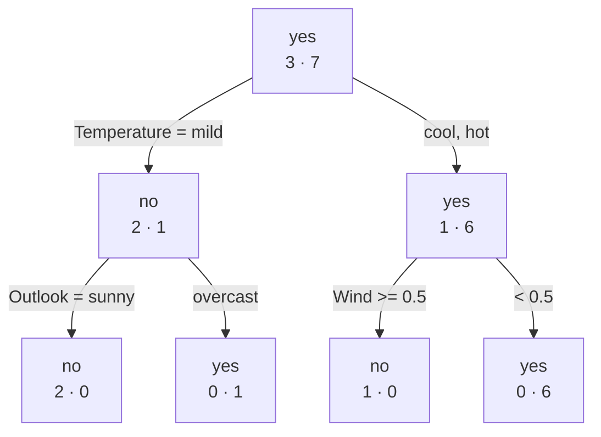

讲师在这里提醒了一句:*"但请注意它们的定义,这里的值、这里的名字,跟我前面展示的例子里的惯例不一样。"* 具体来说:`extra=1` 显示的是**各类别的原始计数**(`3 · 7` 表示 3 个 no、7 个 yes),而 §15 银行例子里的 `1789/2000` 是"多数类计数 / 总数"。**两种标注方式不同,读图时先看清楚**。

### 预测新观测

```r
newdata <- data.frame(Outlook="rainy", Temperature="mild",
                      Humidity="high", Wind=FALSE)

# 通用形式
predict(object, newdata = list(),
        type = c("vector", "prob", "class", "matrix"))

predict(fit, newdata=newdata, type="prob")     # 输出概率
#   no yes
# 1  1   0

predict(fit, newdata=newdata, type="class")    # 输出类别
# 1
# no
# Levels: no yes
```

**`type` 参数是重点**:`"class"` 给你标签,`"prob"` 给你**每个类别的概率**。后者正是 §38 那张对照表里"决策树也能输出类别概率"的实现——概率来自**叶节点内的类别比例**。讲师:*"对决策树,你也能得到概率,只要看叶节点里面有多少个 yes、多少个 no 就行了。"*

## §29 决策树在 Python 里怎么跑

Slides 用 scikit-learn 和 iris 数据集给了完整脚本:

```python
# Example: Decision Tree Classifier in Python
from sklearn.datasets import load_iris
from sklearn.model_selection import train_test_split
from sklearn.tree import DecisionTreeClassifier, plot_tree
import matplotlib.pyplot as plt

# 1. Load dataset
iris = load_iris()
X, y = iris.data, iris.target

# 2. Split into train and test sets
X_train, X_test, y_train, y_test = train_test_split(
    X, y, test_size=0.3, random_state=42
)

# 3. Create Decision Tree model
clf = DecisionTreeClassifier(criterion="entropy", max_depth=3, random_state=42)

# 4. Train the model
clf.fit(X_train, y_train)

# 5. Evaluate on test data
accuracy = clf.score(X_test, y_test)
print("Test set accuracy:", accuracy)

# 6. Visualize the tree
plt.figure(figsize=(12,8))
plot_tree(clf, filled=True, feature_names=iris.feature_names,
          class_names=iris.target_names)
plt.show()

# 7. Make a prediction for a new sample
sample = [[5.0, 3.6, 1.3, 0.25]]   # sepal length, sepal width, petal length, petal width
pred = clf.predict(sample)
print("Predicted class:", iris.target_names[pred][0])
```

讲师点出了两个关键参数:*"Python 里我们用 scikit-learn,关键函数叫 `DecisionTreeClassifier`。而 `criterion="entropy"` 意思是我们要用 entropy 来计算 information gain。"*

**把这段代码和本章的理论对应起来**——这是理解代码的正确方式:

| 代码 | 对应本章的哪一节 |
|---|---|
| `train_test_split(..., test_size=0.3)` | §4 的第一刀:70% 训练 / 30% 测试 |
| `criterion="entropy"` | §17–§20:用熵算 information gain(**不写则默认 `gini`**,见 §22 拓展) |
| `max_depth=3` | §21 的停止条件 + §25 的 **pre-pruning** |
| `random_state=42` | 固定随机种子,保证结果可复现 |
| `clf.fit(X_train, y_train)` | 建树:递归选属性、分裂 |
| `clf.score(X_test, y_test)` | 在锁起来的测试集上评估(§4 的最后一步) |
| `plot_tree(clf, filled=True, ...)` | 可视化——白箱性质的体现(§26) |
| `clf.predict(sample)` | §13 的 traversal:一条新样本从 root 走到 leaf |

注意 iris 的四个属性(花萼长宽、花瓣长宽)**全部是连续数值**,与银行例子的全类别属性正好互补——这印证了 §27 "handle both numerical and categorical input"。对连续属性,树学的是**阈值**(如 `petal length <= 2.45`)而不是取值集合。

---
# Part IV · Naïve Bayes:用概率说话的分类器

## §30 第三种视角

回顾一下我们走过的路。KNN 说:"看看跟你最像的人是什么标签。"决策树说:"我来问你一串问题。"两者都给出一个**硬的**答案——就是这个类,没有中间地带。

但很多时候我们真正想要的是**一个程度**。银行不只想知道"这个客户会不会买",它想知道"这个客户有 78% 的可能会买"——因为它要按可能性排序,把有限的营销预算投给最前面的 500 个人。这就是第三个分类器要解决的问题。

Slides 的定义:

> - **A probabilistic classification method based on Bayes' theorem**
> - **A naïve Bayes classifier assumes that the presence or absence of a particular feature of a class is unrelated to the presence or absence of other features (conditional independence assumption)**
> - **Output includes a class label and its corresponding probability score**

讲师在引入时立刻把这一节的**考点**点了出来,请特别注意:

> *"naïve Bayes 分类器对应着一个非常重要的假设。其实**每一次考试**,都有一道题跟这个假设有关。所以这就是为什么我说它很重要。……这个分类器假设:某个类的某个特征的出现或不出现,与其他特征的出现或不出现无关。它叫 **conditional independence assumption**。**请记住这个名字**,因为在接下来的 slides 里我会解释为什么它叫 conditional。我把它标红了。它叫条件独立假设。**有些学生回答的时候说:哦,naïve Bayes 采用独立性假设——不,这是错的,是条件独立假设。**"*

把这个警告放在最前面:**答"independence assumption" 会失分,必须答 "conditional independence assumption"**。§33 会讲清楚为什么这个词不能丢。

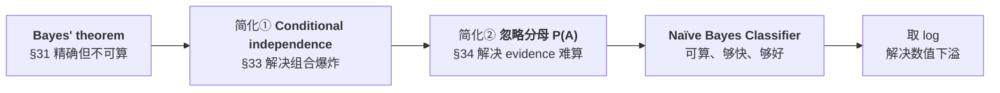

## §31 Bayes' Theorem

### 符号约定

Slides 先固定记号:

> **$C$ is the class label, $C \in \{c_1, c_2, \ldots, c_n\}$**
> **$A$ is the observed attributes, $A = \{a_1, a_2, \ldots, a_m\}$**

也就是:$n$ 个可能的类别,$m$ 个观测到的属性值。在银行例子里,$n=2$($c_1=\text{yes}$,$c_2=\text{no}$),$m=8$(job, marital, education, default, housing, loan, contact, poutcome)。

### 定理

$$P(C \mid A) \;=\; \frac{P(A \mid C)\cdot P(C)}{P(A)}$$

Slides 还给出了它的语义版本:

$$\text{Posteriori probability} = \frac{\text{likelihood} \cdot \text{priori probability}}{\text{evidence}}$$

以及分母的展开(**全概率公式,law of total probability**):

$$P(A) = P(A \mid C=c_1)P(C=c_1) + P(A\mid C=c_2)P(C=c_2) + \cdots + P(A \mid C=c_n)P(C=c_n)$$

### 四个部件,逐个讲透

讲师逐项做了解释,我们把它整理成表并补充理解:

| 部件 | 符号 | 含义 | 在银行例子里 |
|---|---|---|---|
| **Posterior**(后验概率) | $P(C\mid A)$ | **这就是我们想要的**:看到了属性 $A$ 之后,这个样本属于类 $C$ 的概率 | "这个客户的 8 个属性都看到了,他买的概率是多少?" |
| **Likelihood**(似然) | $P(A\mid C)$ | 反过来问:**如果**这个样本属于类 $C$,那观测到属性 $A$ 的概率是多少 | "在所有买了的客户里,有多少人是 management + married + …?" |
| **Prior**(先验概率) | $P(C)$ | **在看任何属性之前**,一个样本属于类 $C$ 的概率 | "随便抓一个客户,他买的概率是 11%" |
| **Evidence**(证据) | $P(A)$ | 观测到属性组合 $A$ 的总概率,**与类别无关** | 归一化常数 |

讲师的原话:

> *"观测到属性 A 时类标签是 C 的概率——这就是我们想预测的。……这是 posterior probability,是我们想预测的,因为我们能观测到 A,但我们想知道这个样本属于每个类标签的概率。我们怎么算它?我们可以算这三个。这就是为什么它叫 likelihood:如果我们知道类 C,我们可以检查在这个类里观测到这个属性的可能性。而这是 C 的 prior probability,意思是在我们观测到任何东西之前,C 的先验概率。然后我们有 evidence A,A 可以用全概率法则写出来。……**这意味着为了计算 P(C|A),我们需要知道这三个。而是的,这三个全都可以从我们的训练数据里得到**,只要做一些简单的计数或计算。"*

**最后这句是全章的关键。** 贝叶斯定理的价值不是数学上的漂亮,而是它做了一次**方向翻转**:

```mermaid
graph LR
  A["❓ 我们<b>想知道</b>的:<br/>P(C|A)<br/>'给定属性,类别是什么'<br/><i>无法直接从数据数出来</i>"] -->|"Bayes' theorem<br/>翻转方向"| B["✅ 我们<b>能算</b>的:<br/>P(A|C) · P(C) / P(A)<br/><i>全都能从训练集计数得到</i>"]
```

为什么 $P(C|A)$ 数不出来而 $P(A|C)$ 数得出来?因为 $A$ 是 8 个属性的**特定组合**——训练集里可能一个符合这个精确组合的客户都没有,所以你没法数"这些人里有几个买了"。而 $P(A|C)$ 只需要在"买了的客户"这个子集里统计各属性的分布,数据充足得多。(不过,§33 会揭示 $P(A|C)$ 其实也没那么好数,这正是要引入"naïve"假设的原因。)

> 📎 **拓展(超出 slides)** — 贝叶斯定理的推导只有一行,值得知道它并不神秘。由条件概率的定义:
> $$P(C\mid A) = \frac{P(A \cap C)}{P(A)}, \qquad P(A \mid C) = \frac{P(A\cap C)}{P(C)}$$
> 从第二式得 $P(A\cap C) = P(A\mid C)P(C)$,代入第一式即得贝叶斯定理。讲师也说了:*"你可以看到它很简单,它只是条件概率的一次改写。"* 至于 **Thomas Bayes(1701–1761)** 本人,slides 放了他的画像——这个定理是在他去世后由朋友整理发表的。

## §32 两道必须会算的例题

Slides 给了两个例子,讲师的态度非常明确:

> *"为了帮助你理解贝叶斯定理,我给你两个例子。特别是第二个例子,我给了你答案。所以请确保你能自己做这两个例子的计算。**它们可能会出现在期末考试里**,以类似的形式。我想检验你是不是真的理解了贝叶斯定理。"*

我们把两道题都完整解出来。

### 例 1:John 的升舱

> **John flies frequently and likes to upgrade his seat to first class. He has determined that if he checks in for his flight at least two hours early, the probability that he will get an upgrade is 0.75; otherwise, the probability that he will get an upgrade is 0.35. With his busy schedule, he checks in at least two hours before his flight only 40% of the time. Suppose John did not receive an upgrade on his most recent attempt. What is the probability that he did not arrive two hours early?**

**第一步:把文字翻译成符号。** 这是这类题最容易出错的地方,慢一点。

- 设 $E$ = "提前两小时 check in"(early),$\bar{E}$ = "没有提前"
- 设 $U$ = "拿到升舱"(upgrade),$\bar{U}$ = "没拿到"

已知:
$$P(U\mid E) = 0.75 \qquad P(U \mid \bar E) = 0.35 \qquad P(E) = 0.40$$

**要求的是 $P(\bar E \mid \bar U)$** ——注意问的是"没提前"给定"没升舱",**两个都是否定**,读题时圈出来。

**第二步:补出需要的取反概率。**
$$P(\bar E) = 1 - 0.40 = 0.60$$
$$P(\bar U \mid E) = 1 - 0.75 = 0.25 \qquad P(\bar U\mid \bar E) = 1-0.35 = 0.65$$

**第三步:用全概率公式算 evidence $P(\bar U)$。**
$$P(\bar U) = P(\bar U\mid E)P(E) + P(\bar U \mid \bar E)P(\bar E) = 0.25\times 0.40 + 0.65\times 0.60 = 0.10 + 0.39 = 0.49$$

**第四步:代入贝叶斯定理。**
$$P(\bar E\mid \bar U) = \frac{P(\bar U\mid \bar E)\,P(\bar E)}{P(\bar U)} = \frac{0.65 \times 0.60}{0.49} = \frac{0.39}{0.49} \approx \mathbf{0.796}$$

**解读**:John 没拿到升舱时,有约 **79.6%** 的可能他那次没有提前两小时到。注意这个数比先验 $P(\bar E)=60\%$ 高——"没升舱"这条证据**提升了**"他没早到"的可能性,方向符合直觉。

### 例 2:Mary 的化验(经典的"假阳性悖论")

> **Assume that a patient named Mary took a lab test for a certain disease and the result came back positive. The test returns a positive result in 95% of the cases in which the disease is actually present, and it returns a positive result in 6% of the cases in which the disease is not present. Furthermore, 1% of the entire population has this disease. What is the probability that Mary actually has the disease, given that the test is positive?**

Slides 甚至把要用的两条式子直接印出来了:

> $P(C = \text{Has disease} \mid A=\text{Positive}) = P(A = \text{Positive} \mid C = \text{Has disease})\, P(C = \text{Has disease})\, /\, P(A = \text{Positive})$
> $P(A = \text{Positive}) = P(A = \text{Positive} \mid C = \text{Has disease})P(C = \text{Has disease}) + P(A = \text{Positive} \mid C = \text{No disease})P(C = \text{No disease})$

**第一步:翻译。**
- $D$ = 有病,$\bar D$ = 没病;$+$ = 化验阳性

$$P(+\mid D) = 0.95 \quad (\text{敏感度}) \qquad P(+\mid \bar D) = 0.06 \quad (\text{假阳性率}) \qquad P(D) = 0.01 \quad (\text{患病率})$$

**第二步:全概率公式算 $P(+)$。**
$$P(+) = P(+\mid D)P(D) + P(+\mid\bar D)P(\bar D) = 0.95\times 0.01 + 0.06\times 0.99 = 0.0095 + 0.0594 = 0.0689$$

**第三步:贝叶斯定理。**
$$P(D\mid +) = \frac{0.95\times 0.01}{0.0689} = \frac{0.0095}{0.0689} \approx \mathbf{0.138}$$

**结论:化验阳性,Mary 真正患病的概率只有约 13.8%。**

**为什么这个结果如此反直觉?** 这道题几乎所有人第一次都会猜"95% 左右"。真相在于两个数字的规模对比:

| | 人数(设总人口 10000) | 化验阳性人数 |
|---|---|---|
| **真的有病**($1\%$) | 100 | $100\times 0.95 = 95$ |
| **没有病**($99\%$) | 9900 | $9900\times 0.06 = \mathbf{594}$ |
| **阳性总数** | | $95+594 = 689$ |

在 689 个阳性里,只有 95 个是真病人 → $95/689 = 13.8\%$。

**关键洞察:因为健康人的基数太大(9900),即使只有 6% 的假阳性率,也能产出 594 个假阳性——远超真阳性的 95 个。** 这就是 **prior(先验)** 的力量:当一个类别本身极其罕见时,证据必须**极其**有力才能把后验推高。忽略先验、只看似然,就是统计学上著名的 **base rate fallacy(基础比率谬误)**。

> 📎 **拓展(超出 slides)** — 这个例子与 §41 的 class imbalance 是同一件事的两面。医学检验里的术语可以直接对应到 §41 的指标:$P(+\mid D)=0.95$ 就是 **sensitivity(敏感度)= TPR = Recall**;$1-P(+\mid\bar D) = 0.94$ 就是 **specificity(特异度)= TNR**;而我们算出的 $P(D\mid +) = 13.8\%$ 正是 **Precision(精确率)**。同一组数字,在贝叶斯语言里叫后验,在分类评估语言里叫精确率——**它们是同一个量**。

## §33 更实用的形式,与第一个简化

### 展开成属性向量

Slides 把定理写成对具体类别 $c_i$ 和具体属性值 $a_1,\dots,a_m$ 的形式:

$$P(c_i\mid A) \;=\; \frac{P(a_1, a_2, \ldots, a_m \mid c_i)\cdot P(c_i)}{P(a_1,a_2,\ldots,a_m)}, \qquad i = 1,2,\ldots,n$$

讲师说明这一步什么也没变:*"我只是把贝叶斯定理写成一个更实用的形式。……我其实什么都没改,我只是写成了具体的 C、写上了具体的值。"*

但写成这个形式之后,**困难暴露了**:分子里那个 $P(a_1,a_2,\ldots,a_m\mid c_i)$ 是一个 $m$ 维的**联合概率(joint probability)**。要从数据里估计它,你得数"同时满足这 8 个属性取这些特定值、且类别为 $c_i$ 的客户有多少个"。而这样的客户很可能**一个都没有**。

### 简化一:Conditional Independence Assumption

Slides:

> **First, Conditional independence assumption**
> - **Each attribute is conditionally independent of every other attribute given a class label $c_i$**
> - **This simplifies the computation of $P(A\mid c_i)$**

这个假设允许我们把联合概率拆成连乘:

$$P(a_1, a_2, \ldots, a_m \mid c_i) \;=\; \prod_{j=1}^{m} P(a_j \mid c_i)$$

### 为什么"conditional"这个词不能丢

这是讲师反复强调的考点,他的解释非常到位:

> *"每个属性 $A_1, A_2 \ldots A_m$,每一个都与其他的条件独立——**给定类标签 C**。意思是,我们不能简单地说 A1、A2……Am 彼此独立,不,那是不对的。而是**对一个给定的类,在一个类内部,C 是已知的,它们才是独立的**。这就是为什么我把 conditional 标红。别忘了 'given class'。"*

**用一个例子把这个区别讲透**(这是理解这一节的关键):

考虑两个属性:`housing loan`(有房贷)和 `job`(职业)。

- **它们是普通独立的吗?** **不是。** 在全体人口里,management 类职业的人有房贷的比例明显高于 unemployed——知道了职业,你对"有没有房贷"的判断就会改变。所以 $P(\text{housing}\mid\text{job}) \ne P(\text{housing})$。
- **朴素贝叶斯假设的是什么?** 它假设:**在"会订购定期存款"这个群体内部**,职业和房贷不再相关;**在"不会订购"这个群体内部**,同样不相关。也就是 $P(\text{housing}\mid \text{job}, C=c) = P(\text{housing}\mid C=c)$。

换句话说,这个假设认为:**属性之间的所有相关性,都是由"类别"这个共同原因造成的;一旦把类别固定住,剩下的就都是独立的随机波动了。**

```mermaid
graph TD
  C["<b>类别 C</b><br/>(subscribed = yes/no)"] --> A1["属性 a₁<br/>job"]
  C --> A2["属性 a₂<br/>marital"]
  C --> A3["属性 a₃<br/>housing"]
  C --> AM["…<br/>属性 a₈"]
  N1["❌ 假设中<br/>属性之间<b>没有</b>直接连线<br/>—— 这就是'给定 C 后条件独立'"]
```

这张图说明了为什么叫"**naïve(朴素/天真)**":现实中属性之间几乎总有直接联系,把它们全部砍掉是一个**明知不真、但很有用**的简化。

### 这个假设省下了什么:组合爆炸

讲师用一段算术说明了这个假设的价值,这是理解"为什么值得做这个近似"的关键:

> *"如果你有 $m$ 个变量,你想估计它们的概率,你需要考虑所有可能的组合配置,那是一个组合问题。比如,如果每个变量能取 3 个值,比如 high、medium、low,如果你有 $m$ 个属性,所有配置的可能性是多少?3 乘 3 乘 3……乘 $m$ 次,那就是 $3^m$,这是一个非常大的数。但一旦你采取条件独立假设,你真正需要估计的就只是每一个单独的属性。"*

把它做成一张表:

| | **不假设条件独立** | **假设条件独立** |
|---|---|---|
| 需要估计的量 | 完整联合分布 $P(a_1,\ldots,a_m\mid c)$ | $m$ 个边缘分布 $P(a_j\mid c)$ |
| 参数个数($m$ 个属性,每个 3 个取值) | $3^{m}$ | $3\times m$ |
| $m=8$ 时 | $3^8 = \mathbf{6561}$ | $3\times 8 = \mathbf{24}$ |
| $m=20$ 时 | $3^{20} \approx \mathbf{3.5\times 10^9}$ | $\mathbf{60}$ |
| 需要多少训练数据 | 天文数字(每种组合都要有足够样本) | 很少 |

$m=20$ 时的对比 —— **35 亿 vs 60** —— 就是全部答案。前者永远不可能估计,后者数一下就有了。**朴素贝叶斯用一个不精确的假设,换来了从"不可能"到"很轻松"的跨越**,这也是 §37 说它"handle high-dimensional data efficiently"的根本原因。

## §34 第二个简化,与 log 变换

### 简化二:扔掉分母

Slides:

> **Second, ignore the denominator $P(A)$**
> - **Removing the denominator has no impact on the relative probability scores**

$$P(c_i \mid A) \;\propto\; P(c_i)\cdot\prod_{j=1}^{m} P(a_j\mid c_i), \qquad i = 1,2,\ldots,n$$

讲师解释了为什么可以扔:

> *"你注意到,这个分母跟类标签没有任何关系,它是个常数。所以我们采取的假设是:我们忽略分母。因为它不会影响我们选出正确的类标签。我们只是选那个后验概率最高的类标签。所以我们去掉分母,对**相对**概率分数没有影响。虽然去掉之后我们确实算不出精确的概率分数了,但我们可以做**重新标定(rescaling)** 来得到相对概率分数。"*

**核心论证**:分母 $P(A)$ 对**所有类别都是同一个数**。比较 $P(\text{yes}\mid A)$ 与 $P(\text{no}\mid A)$ 谁大时,两边除以同一个正数不改变大小关系。既然分类只需要知道**谁最大**(argmax),分母就是多余的计算。

注意符号从 $=$ 变成了 $\propto$(**正比于**),讲师也点了这一点:*"我用的不是等号,是正比号。"* 这意味着算出来的数**不是真正的概率**——这个代价在 §37 会以"not reliable for probability estimation"的形式记在缺点栏里。

### log 变换:防止数值下溢

Slides 给出了对数形式:

$$\log P(c_i\mid A) \;\propto\; \log P(c_i) + \sum_{j=1}^{m}\log P(a_j\mid c_i), \qquad i=1,2,\ldots,n$$

讲师解释了这不是为了数学优雅,而是为了**工程上能跑**:

> *"在实践中我们不直接用这个公式。为什么?因为概率是 0 到 1 之间的值。那么这意味着 $m$ 个数相乘。你想想,如果 $m$ 是 20,你有 20 个 0 到 1 之间的小概率值,你把它们乘起来,很快你的计算机就会给你一个错误——**underflow(下溢)**,意思是这个值太小,小到没法被计算机表示了。所以在实践中我们取对数。取对数之后这就变成了求和,我们就能避免下溢问题。"*

**为什么 log 能解决问题?** 因为对数把**连乘变成了连加**($\log(xy) = \log x + \log y$)。20 个 0.1 相乘是 $10^{-20}$(接近双精度浮点的边缘);而 20 个 $\log 0.1 = -1$ 相加是 $-20$,一个完全普通的数。而且 $\log$ 是**严格单调递增**的,所以 $\log$ 后谁大谁还是大——argmax 的结果完全不变。

| | 直接连乘 | 取 log 后连加 |
|---|---|---|
| 公式 | $P(c_i)\prod_j P(a_j\mid c_i)$ | $\log P(c_i) + \sum_j \log P(a_j\mid c_i)$ |
| $m=20$,各项约 0.1 时 | $\approx 10^{-21}$ ⚠️ 下溢风险 | $\approx -21$ ✅ 安全 |
| argmax 结果 | 相同 | 相同 |
| 实践中用哪个 | ❌ | ✅ |

## §35 建一个 Naïve Bayes:需要数哪些东西

回到银行例子。Slides:

> **Building a Naïve Bayes classifier requires to calculate some statistics from training dataset:**
> - **$P(A\mid c_i)$ for each class $i = 1,2,\ldots,n$**
> - **$P(a_j\mid c_i)$ for each attribute $j=1,2,\ldots,m$ in each class**

**训练一个朴素贝叶斯分类器,就是数数、填表**——没有优化,没有迭代,没有梯度。讲师:*"你有训练数据,你数一数训练数据,你得到这些值,然后你就能这么做。"*

要填的表有两张。

### 表一:先验 $P(c_i)$

Slides 给出:

$$P(\text{subscribed}=\text{yes}) \approx 0.11 \qquad\text{and}\qquad P(\text{subscribed}=\text{no}) \approx 0.89$$

这与 §17 的计算一致($211/2000 = 0.1055 \approx 0.11$,$1789/2000 = 0.8945\approx 0.89$)。

> ⚠️ **Slide 43 的标题写的是 "$P(A\mid c_i)$ for each class",但下面列出的其实是 $P(c_i)$**(先验),这是 slide 上的一处笔误。按内容理解:这一步要数的是**每个类别的先验概率**。

### 表二:条件概率 $P(a_j\mid c_i)$

对**每一个属性的每一个取值**、在**每一个类别下**,都要数一个条件概率。Slides 以 `marital` 属性为例:

| | **subscribed = yes** | **subscribed = no** |
|---|---|---|
| $P(\text{single}\mid \cdot)$ | 0.35 | 0.28 |
| $P(\text{married}\mid\cdot)$ | 0.53 | 0.61 |
| $P(\text{divorced}\mid\cdot)$ | 0.12 | 0.11 |

讲师描述了这个"数"的动作:

> *"假设我们感兴趣的是 subscribed = yes,我们感兴趣的属性叫 marital status,它有三个值:single、married、divorced。然后我们就数:在类标签是 yes 的那些数据里,有多少个 marital 的取值是 single?有多少个是 married?有多少个是 divorced?然后我们对 subscribed = no 做同样的事。我们这里只展示了一小部分——**我们需要一张大表**,但这里我只给你看这一个。"*

**这张表有多大?** 八个属性,每个属性有若干取值,乘以 2 个类别。以 `job` 有 12 个取值、`education` 4 个、`marital` 3 个等等估算,整张表有上百个格子。但注意 §33 的对比:这上百个格子,远远小于联合分布需要的 $10^9$ 量级。

**同一列相加应为 1**:$0.35+0.53+0.12 = 1.00$ ✓,$0.28+0.61+0.11=1.00$ ✓ —— 又一条自查恒等式。

```mermaid
flowchart LR
  D["训练集<br/>2000 条带标签数据"] --> C1["数类别:<br/>yes 211 条 / no 1789 条"] --> P1["<b>先验表</b><br/>P(yes)=0.11<br/>P(no)=0.89"]
  D --> C2["在每个类内部,<br/>数每个属性每个取值的频率"] --> P2["<b>条件概率表</b><br/>P(aⱼ | cᵢ)<br/>上百个格子"]
  P1 --> M["Naïve Bayes 模型<br/>= 这两张表"]
  P2 --> M
```

**"模型"就是这两张表**——没有别的东西了。这是朴素贝叶斯与决策树的一个有趣对比:决策树的模型是一个**结构**(树),朴素贝叶斯的模型是一堆**数字**(概率表)。

## §36 用它预测一个新客户:完整走一遍

Slides 给出了一个完整的测试例子。新客户的 8 个属性值,以及从表二里查出来的对应概率:

| $j$ | $a_j$ | $P(a_j \mid \text{subscribed}=\text{yes})$ | $P(a_j\mid\text{subscribed}=\text{no})$ |
|---|---|---|---|
| 1 | job = management | 0.22 | 0.21 |
| 2 | marital = married | 0.53 | 0.61 |
| 3 | education = secondary | 0.46 | 0.51 |
| 4 | default = no | 0.99 | 0.98 |
| 5 | housing = yes | 0.35 | 0.57 |
| 6 | loan = no | 0.90 | 0.85 |
| 7 | contact = cellular | 0.85 | 0.62 |
| 8 | poutcome = success | **0.15** | **0.01** |

讲师描述了这个查表的动作:*"基于每个属性的取值,你就从这张表里抄下来。比如 marital 是 married,那对 subscribed=yes 来说 married 是 0.53,对 subscribed=no 来说 married 是 0.61。然后你就一直这么做。"*

### 计算

$$P(\text{yes}\mid A) \propto 0.11\cdot\big(0.22\cdot 0.53\cdot 0.46\cdot 0.99\cdot 0.35\cdot 0.90\cdot 0.85\cdot 0.15\big) \approx \mathbf{0.00023}$$

$$P(\text{no}\mid A) \propto 0.89\cdot\big(0.21\cdot 0.61\cdot 0.51\cdot 0.98\cdot 0.57\cdot 0.85\cdot 0.62\cdot 0.01\big) \approx \mathbf{0.00017}$$

因为 $0.00023 > 0.00017$,**预测:这个客户会订购(yes)**。

讲师注明:*"这里我没有用 log,因为我只是想给你一个直接的例子。实践中我们会用 log。"*

### 这个结果为什么"翻盘"了?值得看清

注意这是一个**先验极其不利**的情况:$P(\text{no}) = 0.89$ 是 $P(\text{yes})=0.11$ 的 8 倍。光看先验,任何客户都该判 no。而且逐项看,前 7 个属性里有 5 个都更偏向 no(marital、education、housing、loan 那几项 no 的概率更高)。

**是第 8 项 `poutcome = success` 完成了翻盘**:$0.15$ vs $0.01$,**15 倍的似然比**。这一项单枪匹马地抵消了 8 倍的先验劣势和其他属性的不利。

这与 §20 的发现完全吻合:`poutcome` 正是 information gain 最大的属性(0.0289)。**两个完全不同的分类器,从两条完全不同的数学路径,识别出了同一个最有信息量的属性。** 这不是巧合——它说明这个数据集里真实的信号就在 `poutcome` 上。

### 从"相对分数"回到真正的概率

讲师补充了一步 slides 上没写的操作:

> *"你会说,我还是想得到一个概率,那没问题,你把它归一化就行了。因为你可以算出这两个的和,然后用这个值除以和。你把两个概率加起来,你会得到 1。"*

$$P(\text{yes}\mid A) = \frac{0.00023}{0.00023+0.00017} = \frac{0.00023}{0.00040} \approx \mathbf{0.58}$$

$$P(\text{no}\mid A) = \frac{0.00017}{0.00040} \approx 0.42$$

**这个 58% 就是 §30 开头说的"程度"**——银行可以按这个分数给所有客户排序,把营销预算投给分数最高的那一批。这正是朴素贝叶斯相对 KNN 和决策树的独特产出。

> ⚠️ 但请把 §37 的警告一起记住:这个 58% 是**归一化后的相对分数**,不是校准过的真实概率。用它**排序**很好,用它下"恰好 58% 的人会买"这种结论则不可靠。

## §37 零概率问题与 Laplace Smoothing

### 问题

Slides:

> **An issue on rare event**
> - **What if one of the attribute values does NOT appear in a class $c_i$ in a training dataset?**
> - **$P(a_j\mid c_i)$ for this attribute value will equal zero!**
> - **$P(c_i\mid A)$ will simply become zero!**

讲师把这个失效模式讲得很清楚:

> *"一个有意思的问题来了:如果某个属性值在训练集的类 C 里根本没出现过怎么办?比如 marital = married,由于某种原因它在训练数据里没出现——也许你的训练数据不够大。那么这种情况下,从训练数据估出来的 $P(a_j\mid c_i)$ 就是 0,因为你没观测到,你就写 0。然后你会发现,其中一项是 0,**这整个值就永远是 0**,因为它是连乘,连乘。"*

**这是一个结构性的脆弱点,不是小瑕疵。** 因为公式是连乘,**任何一项为 0 都会把整个乘积归零**,不管其他 7 个属性的证据有多强。一个客户可能在 7 个属性上都强烈指向 yes,但只要第 8 个属性的取值在训练集的 yes 组里碰巧没出现过,分类器就会给出 $P(\text{yes}\mid A) = 0$ ——**绝对的、不可动摇的零**。而这个 0 的真实来源仅仅是"我们的样本不够多",不是"这件事不可能"。

```mermaid
flowchart LR
  A["训练集里<br/>某个 (属性值, 类别) 组合<br/>恰好一次都没出现"] --> B["P(aⱼ|cᵢ) 被估计为 <b>0</b>"]
  B --> C["连乘中出现 0"]
  C --> D["❌ P(cᵢ|A) = 0<br/>无论其他证据多强"]
  D --> E["💊 <b>Smoothing</b>"]
```

### 解法:Smoothing

Slides:

> **Smoothing technique — It assigns a small nonzero probability to rare events not included in a training dataset**

**Laplace smoothing(拉普拉斯平滑),又叫 add-one smoothing:**

> **It pretends to see every outcome once more than it actually appears**

$$P^{*}(x) \;=\; \frac{\text{count}(x)+1}{\sum_{x}\left[\text{count}(x)+1\right]}$$

讲师用了一个很好的说法:

> *"我就假装,在我的训练数据里,至少对每个属性、每个取值,我都至少观测到过一次。这就是我们的**基底**。基底就是:假装你已经观测到至少一次,然后在这之上,你继续计数。"*

Slides 给的例子:

$$P'(\text{single}\mid\text{subscribed}=\text{yes}) = \frac{20+1}{(20+1)+(70+1)+(10+1)}$$

讲师逐项解释:*"所以你看到,对 single 且 subscribed=yes,不是 20,是 20+1。这个 1 是基底,你假装你至少观测到了一次,20 是你在训练集里真正数到的。而且你不只对 single 这么做,你对 married、对 divorced 也要这么做。"*

**注意分母也变了**:不是简单地把原分母加 1,而是**每一个取值都加 1**,所以分母增加了"取值的个数"。这保证了平滑之后**各取值的概率仍然加起来等于 1**。

> **🔑 例(平滑前后对比)**
> 设在 subscribed=yes 的 100 个客户里,marital 的计数是:single 20、married 70、divorced 10。
>
> | | 原始 $P$ | 平滑后 $P'$ |
> |---|---|---|
> | single | $20/100 = 0.200$ | $21/103 = 0.204$ |
> | married | $70/100 = 0.700$ | $71/103 = 0.689$ |
> | divorced | $10/100=0.100$ | $11/103 = 0.107$ |
> | **合计** | 1.000 | 1.000 ✓ |
>
> 现在假设 divorced 的计数是 **0**:
>
> | | 原始 $P$ | 平滑后 $P'$ |
> |---|---|---|
> | divorced | $0/90 = \mathbf{0}$ ❌ | $1/93 = \mathbf{0.011}$ ✅ |
>
> 平滑把一个致命的 0 换成了一个很小但非零的数。**分类器不再被单个未见取值一票否决。**
>
> 观察平滑的整体效果:它**把概率质量从高频取值挪一点给低频取值**(married 从 0.700 降到 0.689,divorced 从 0.100 升到 0.107)。样本量越大,这个挪动越微不足道——**平滑只在数据稀疏时起作用,数据充足时它自动"退场"**。

### 广义形式:$\varepsilon$ 不必是 1

Slides 还给了一个可调版本:

$$P^{**}(x) = \frac{\text{count}(x)+\varepsilon}{\sum_x\left[\text{count}(x)+\varepsilon\right]}, \qquad \varepsilon\in[0,1]$$

讲师把它与前面的内容连了起来:

> *"你可能会问为什么是 1,也许 1 太大或太小,其实你可以加一个更小的值。这就变得像 KNN 里的 $k$ 值一样了。你甚至可以用 **cross-validation** 来调它,所以它是一个**超参数**。"*

**这句话把 §4 的方法论闭环了**:$\varepsilon$ 和 KNN 的 $k$、决策树的 `max_depth` 一样,都是超参数,都用 validation set 来定。§38 的 R 代码里 `laplace=.01` 就是一个被设成 0.01 的 $\varepsilon$。

## §38 朴素贝叶斯的优缺点

Slides:

> **Advantages**
> - **Simple to implement, commonly used for text classification**
> - **Handle high-dimensional data efficiently**
> - **Robust to overfitting with smoothing technique**
>
> **Disadvantages**
> - **Sensitive to correlated variables (Why?)**
> - **Not reliable for probability estimation**

讲师逐条给了理由,我们把每条的**机制**都补全:

| | 项目 | 为什么 |
|---|---|---|
| ✅ | **实现简单** | "训练"只是计数填表,没有优化过程(§35) |
| ✅ | **常用于文本分类** | 文本天然是高维稀疏的词频向量,正好命中它的强项(§39 的 spam 例子) |
| ✅ | **高维数据高效** | 讲师:*"为什么?因为它采取了条件独立假设。即使你有很多特征,我假设它们条件独立,所以本质上我只是把很多单变量的概率分布乘起来。"* 参数量从 $3^m$ 降到 $3m$(§33) |
| ✅ | **配合平滑抗过拟合** | 平滑把极端的 0/1 估计拉回中间,相当于一种正则化(§37) |
| ❌ | **对相关变量敏感** | 讲师:*"为什么?因为我们采取了假设,这个假设是条件独立。如果你确实有相关的变量,就很难假设它们是独立的。这种情况下,也许你需要合并或移除这些相关变量。"* **机制**:两个高度相关的属性携带的其实是**同一份证据**,但连乘会把它**重复计入两次**,等于给这份证据加了双倍权重,后验被系统性地推向极端 |
| ❌ | **概率估计不可靠** | 讲师:*"因为我们不考虑分母 P(A),我们得到的概率不是真实概率,它是一个缩放后的相对概率。"* 加上上一条的"重复计证据",输出的概率往往过度自信(接近 0 或 1) |

**"对相关变量敏感"值得再展开一层**,因为这是最常考的"Why?"。设想银行数据里同时有 `月收入` 和 `年收入` 两个属性——它们本质是同一个信息。朴素贝叶斯会把这个信息乘两次,效果等同于给"收入"这一个证据赋予了平方级的影响力,而其他属性被相对压制。**解决办法**正是讲师说的:合并或删除高度相关的变量(或做 PCA 等去相关处理)。

## §39 朴素贝叶斯的代码

### R

Slides:

> **Two methods: Build the classifier from the scratch; Call `naiveBayes` function from `e1071` package**

讲师:*"一个是你甚至可以从零写代码,就是数一数、得到那张表,然后就能跑。或者在 R 里你可以用 `e1071` 这个包,里面有个函数叫 `naiveBayes`。"*

```r
model <- naiveBayes(Enrolls ~ Age + Income + JobSatisfaction + Desire,
                    traindata)
# display model
model

# predict with testdata
results <- predict(model, testdata)
# display results
results
# [1] Yes
# Levels:  No Yes

# use the NB classifier with Laplace smoothing
model1 = naiveBayes(Enrolls ~., traindata, laplace=.01)
```

三点注意:

- 公式语法 `Enrolls ~ Age + Income + ...` 与 `rpart` 一致
- `Enrolls ~.` 里的 **`.` 表示"用所有其他列作为属性"**,是常用简写
- **`laplace=.01`** 就是 §37 的 $\varepsilon = 0.01$。讲师:*"你可以清楚地看到 Laplace smoothing,这里就是个很小的值 0.01。"* 注意默认值是 `laplace=0`,即**不平滑**——所以生产代码里通常要显式设置它

### Python

Slides 用一个垃圾邮件分类的迷你例子:

```python
from sklearn.feature_extraction.text import CountVectorizer
from sklearn.naive_bayes import MultinomialNB

docs = ["free money now", "win lottery now", "sports game tonight", "team won match"]
labels = ["spam", "spam", "ham", "ham"]

# Convert text to bag-of-words counts
vectorizer = CountVectorizer()
X = vectorizer.fit_transform(docs)

# Train Multinomial Naive Bayes
model = MultinomialNB()
model.fit(X, labels)

# Predict a new message
test = vectorizer.transform(["free lottery win"])
print("Prediction:", model.predict(test)[0])
```

Slides 底部有一行关键注解:

> **Use `MultinomialNB` when features are counts (text classification, word frequencies).**

讲师把这个练习交给了学生:*"假设我们有一个文档训练集,它有四个句子:free money now、win lottery now、sports game tonight、team won match,标签是 spam、spam、ham、ham。我请你开发一个朴素贝叶斯分类器,来判断一个新句子是不是垃圾邮件。基本上你用 bag-of-words 模型加朴素贝叶斯,然后你就能测试 'free lottery win' 是不是 spam。"*

**`CountVectorizer` 在做什么?** 它把每个句子转成一个**词频向量(bag-of-words)**。词表是所有出现过的词 {free, game, lottery, match, money, now, sports, team, tonight, win, won},每个文档变成一个长度为 11 的计数向量。这样一来,"属性 $a_j$" 就是"第 $j$ 个词出现了几次",而条件独立假设变成了"**给定这封邮件是不是 spam,各个词的出现相互独立**"——这就是著名的 bag-of-words 假设,它显然是错的(词与词当然有语法关联),但垃圾邮件过滤上出奇地有效。

**新句子 "free lottery win" 会被判成什么?** `free` 和 `lottery`、`win` 三个词都只在 spam 里出现过,所以三项似然都强烈偏向 spam → **预测 spam**。(这里也能看到 §37 的作用:`ham` 类里这三个词的计数都是 0,若没有平滑,$P(\text{ham}\mid A)$ 会是硬零。`MultinomialNB` 默认 `alpha=1.0`,**即自带 Laplace 平滑**,所以它能给出一个有意义的相对分数。)

### 两个变体:什么时候用哪个

讲师在总结时提到:

> *"朴素贝叶斯通常有两个版本,你会在 lab 里见到。一个是 **multinomial naïve Bayes**,另一个叫 **Gaussian naïve Bayes**。Gaussian naïve Bayes 处理数值型数据,multinomial naïve Bayes 处理类别型数据。"*

| 变体 | 适用的属性类型 | $P(a_j\mid c_i)$ 怎么估计 | 典型场景 |
|---|---|---|---|
| **`MultinomialNB`** | **计数 / 类别型** | 直接数频率(+ 平滑) | 文本分类、词频、银行例子 |
| **`GaussianNB`** | **连续数值型** | 假设每个类内该属性服从正态分布,估计其均值 $\mu$ 与方差 $\sigma^2$ | 身高体重、传感器读数、iris 数据集 |

---

# Part V · 选哪一个,以及怎么判断它好不好

## §40 决策树 vs 朴素贝叶斯:按场景选择

Slides 用一张"关注点 → 推荐方法"的对照表收束了整章。这张表**极可能以选择题形式出现在考卷上**:

| **Concerns** | **Recommended Method(s)** |
|---|---|
| Output of the classification should include **class probabilities** in addition to the class labels | Logistic regression, **decision tree** |
| Analysts want to gain an **insight into how the variables affect** the model | Logistic regression, **decision tree** |
| The problem is **high dimensional** | **Naïve Bayes** |
| Some of the input variables might be **correlated** | Logistic regression, **decision tree** |
| Some of the input variables might be **irrelevant** | **Decision tree, naïve Bayes** |
| The data contains **categorical variables with a large number of levels** | **Decision tree, naïve Bayes** |
| The data contains **mixed variable types** | Logistic regression, **decision tree** |
| There is **nonlinear data or discontinuities** in the input variables that would affect the output | **Decision tree** |

讲师逐行做了讲解,并补充了几处 slides 上没写明的理由:

> *"如果分类的输出除了类别标签之外还应该包含类别概率——decision tree 你可以用,你也可以用 naïve Bayes,但你知道那个概率不是真实概率。对 decision tree,你也能得到概率,只要看叶节点里有多少 yes、多少 no。*
>
> *如果你想洞察变量如何影响模型,你应该用 decision tree,因为它是白箱。*
>
> *高维用 naïve Bayes,因为它假设条件独立。*
>
> *如果输入变量相关,别用 naïve Bayes,因为它的假设。*
>
> *如果有很多不相关的变量,你需要做 feature selection,因为这会影响 decision tree。*
>
> *混合变量类型,你可以用 decision tree,因为 naïve Bayes 通常……你会看到两个版本:multinomial 处理类别型,Gaussian 处理数值型。*
>
> *如果是非线性数据或者输入变量上有不连续,那你可以用 decision tree。"*

**把这张表压缩成两条决策规则**,考试时更好用:

```mermaid
flowchart TD
  Q1{"属性维度很高?<br/>(如文本、上千个特征)"} -->|"是"| NB["✅ <b>Naïve Bayes</b>"]
  Q1 -->|"否"| Q2{"需要解释性 / 混合类型 /<br/>非线性 / 变量相关?"}
  Q2 -->|"是"| DT["✅ <b>Decision Tree</b>"]
  Q2 -->|"否"| BOTH["两者皆可<br/>用 validation set 比一比"]
  NB -.->|"⚠️ 前提"| W1["属性之间不能高度相关"]
  DT -.->|"⚠️ 前提"| W2["先做 feature selection<br/>并剪枝"]
```

- **选 Naïve Bayes 的唯一强理由是"高维"**;它的唯一强反理由是"变量相关"。
- **Decision tree 是那张表里出现次数最多的方法**(8 行里占 6 行),因为它在可解释性、混合类型、非线性上都占优。

## §41 Confusion Matrix:分类结果的四个格子

> 🕐 **讲师在课上说:"我还剩几页,我想把它留到下周,就是关于 confusion matrix 的。"** 所以这部分是 **Week 6 的开场内容**,但它印在 Week 5 的 slides 上,属于本讲义的覆盖范围,而且理解它是完成 assignment 分类任务的前提。以下按 slides 内容讲透。

### 结构

Slides 给出标准的 2×2 混淆矩阵:

| | | **Predicted Class** | |
|---|---|---|---|
| | | **Positive** | **Negative** |
| **Actual Class** | **Positive** | **True Positives (TP)** | **False Negatives (FN)** |
| | **Negative** | **False Positives (FP)** | **True Negatives (TN)** |

**四个术语怎么记?** 用两个词拆开读:

- **第二个词** = **模型预测了什么**(Positive / Negative)
- **第一个词** = **预测对了没有**(True = 对了 / False = 错了)

于是:
- **TP** — 预测为正,且**是对的** → 真的是正类 ✅
- **FP** — 预测为正,但**错了** → 其实是负类 ❌(**误报 / 虚警**)
- **FN** — 预测为负,但**错了** → 其实是正类 ❌(**漏报**)
- **TN** — 预测为负,且**是对的** → 真的是负类 ✅

对角线是正确的,反对角线是两种**性质完全不同**的错误。

### 银行例子的实际矩阵

Slides 给了在 100 个测试客户上的结果:

| | | **Predicted** | | **Total** |
|---|---|---|---|---|
| | | **Subscribe** | **Not Subscribed** | |
| **Actual** | **Subscribed** | **3** (TP) | **8** (FN) | **11** |
| | **Not Subscribed** | **2** (FP) | **87** (TN) | **89** |
| | **Total** | **5** | **95** | **100** |

读一遍这张表:100 个测试客户里,真正订购的有 11 人;模型预测会订购的有 5 人;其中猜对了 3 人(TP),另外 2 人是误报(FP);而真正订购的 11 人里有 8 人被模型漏掉了(FN)。

## §42 评估指标:六个公式与它们各自回答的问题

Slides 给出六个公式:

$$\text{Accuracy} = \frac{TP+TN}{TP+TN+FP+FN}\times 100\%$$

$$FPR = \frac{FP}{FP+TN} \qquad TPR = \frac{TP}{TP+FN} \qquad FNR = \frac{FN}{TP+FN}$$

$$\text{Precision} = \frac{TP}{TP+FP} \qquad \text{TPR (or Recall)} = \frac{TP}{TP+FN}$$

**每个指标其实是在回答一个不同的问题**,这是记住它们的最好方式:

| 指标 | 公式 | 它回答的问题 | 分母是什么 | 银行例子 |
|---|---|---|---|---|
| **Accuracy**(准确率) | $\frac{TP+TN}{\text{全部}}$ | 总体上我判对了多少比例? | 全部样本 | $\frac{3+87}{100} = \mathbf{90\%}$ |
| **TPR / Recall**(召回率) | $\frac{TP}{TP+FN}$ | **真正的正类里**,我找出了多少? | 实际为正的样本 | $\frac{3}{3+8} = \frac{3}{11} = \mathbf{27.3\%}$ |
| **Precision**(精确率) | $\frac{TP}{TP+FP}$ | 我**说是正类的那些**里,有多少是对的? | 预测为正的样本 | $\frac{3}{3+2} = \frac{3}{5} = \mathbf{60\%}$ |
| **FPR**(假正率) | $\frac{FP}{FP+TN}$ | **真正的负类里**,有多少被我误报了? | 实际为负的样本 | $\frac{2}{2+87} = \mathbf{2.2\%}$ |
| **FNR**(假负率) | $\frac{FN}{TP+FN}$ | **真正的正类里**,有多少被我漏掉了? | 实际为正的样本 | $\frac{8}{11} = \mathbf{72.7\%}$ |

**两条一定要记住的关系**:

1. $\textbf{TPR} = \textbf{Recall}$ —— slides 上出现了两次,它们是**同一个东西的两个名字**。第三行写 $TPR$,第五行写 "TPR (or Recall)",不是两个指标。
2. $\textbf{TPR} + \textbf{FNR} = 1$ —— 它们分母相同、分子互补($TP+FN$ 就是全部实际正类)。银行例子:$27.3\% + 72.7\% = 100\%$ ✓

**Precision 与 Recall 的区别是最常考的**,记住它们**分母不同**就不会混:
- Recall 的分母是**实际**为正的(横着看第一行)→ "该找的找到了多少"
- Precision 的分母是**预测**为正的(竖着看第一列)→ "找出来的对了多少"

```mermaid
graph TD
  CM["混淆矩阵"] --> R["<b>Recall = TP/(TP+FN)</b><br/>横向看:实际正类这一行<br/>👉 '漏了没有?'"]
  CM --> P["<b>Precision = TP/(TP+FP)</b><br/>纵向看:预测正类这一列<br/>👉 '误报多不多?'"]
  R --> RU["高召回场景:癌症筛查<br/>宁可误报,不能漏诊"]
  P --> PU["高精确场景:垃圾邮件<br/>宁可漏一封垃圾<br/>也不能把正常邮件丢掉"]
```

### 90% 的准确率是个陷阱

> 📎 **拓展(超出 slides,但由 slides 的数字直接导出)** — 这个银行例子是 **class imbalance(类别不平衡)** 的完美教材,值得单独想清楚。
>
> 模型的 **accuracy 是 90%**,听起来相当不错。但看看 recall:**27.3%** —— 真正会订购的 11 个客户,模型只找出了 3 个,漏掉了 8 个。对银行来说,漏掉的这 8 个才是钱。
>
> 更扎心的是:如果做一个**什么都不学、永远预测"不会订购"**的傻瓜模型,它的 accuracy 是 $89/100 = \mathbf{89\%}$ —— 只比真模型低 1 个百分点!这就是 **accuracy paradox(准确率悖论)**:**当负类占 89% 时,accuracy 这个指标几乎完全由负类主导,正类做得好不好它根本反映不出来。**
>
> 这也是为什么 §17 算出的 $H_{\text{subscribed}} = 0.4862$ 只有 0.4862 而不是接近 1 —— 数据集本来就不平衡,这两个观察是同一件事。
>
> **结论:类别不平衡时,永远不要只报 accuracy,必须同时报 precision 和 recall。**
>
> 两个相关的补充指标:
> - **Specificity(特异度)= TNR = $\frac{TN}{FP+TN}$ = $1 - FPR$**,即"真正的负类里判对了多少"。银行例子:$87/89 = 97.8\%$。
> - **F1 score = $\dfrac{2\cdot \text{Precision}\cdot\text{Recall}}{\text{Precision}+\text{Recall}}$**,precision 与 recall 的调和平均,用一个数平衡两者。银行例子:$\frac{2\times 0.60\times 0.273}{0.60+0.273} = \mathbf{0.375}$ —— 这个数字远比 90% 诚实地反映了模型的真实水平。

## §43 还有哪些分类器

Slides 最后一页开了三扇门:

> **Additional Classification Models**
> - **Random Forest** — Combination of decision trees, ensemble method
> - **Support Vector Machines** — Max-margin linear classifier, kernel trick
> - **Neural Networks** — Multi-layer Perceptron; Deep learning networks

| 方法 | 核心思想 | 与本周内容的关系 |
|---|---|---|
| **Random Forest** | 训练几百棵用**随机样本 + 随机属性子集**建的决策树,让它们**多数投票** | 直接解决 §23 的贪心/过拟合问题;讲师说 Kaggle 获胜者常用它 |
| **Support Vector Machines (SVM)** | 找一个**间隔最大(max-margin)** 的分隔超平面;用 **kernel trick** 把数据隐式映到高维,从而处理线性不可分的情况 | 与 KNN 一样能给非线性边界,但方式完全不同:SVM 只关心**边界附近的少数支持向量**,KNN 关心**局部所有邻居** |
| **Neural Networks** | 多层感知机(MLP)、深度网络,通过层层非线性变换自动学习特征表示 | §26 的**黑箱**代表——准确率上限最高,可解释性最差 |

讲师在讲 §26 时已经把这条对比线索埋好了:*"我们说 decision tree 不是黑箱,不像神经网络……decision tree 是白箱。"* **准确率与可解释性之间的取舍**,是这三扇门背后共同的主题,也是你在 assignment 里选模型时要做的判断。

---
# 本章小结 (Key takeaways)

这一章的骨架,用十条能独立成立的句子概括:

1. **Classification 是 supervised learning**:训练数据既有属性 $X$ 也有标签 $Y$,任务是给**从未见过的**新观测指派类别标签——这正是它与上周 unsupervised 的 clustering 的分水岭。

2. **任何分类实验都必须做三分:training / validation / test**。test set 在建模全程锁死,validation set 从 training 里划出来专门用于挑超参数;先在 validation 上选出最优超参,再用它在完整训练集上重训,最后才在 test 上评估一次——这个数字才是可以报告的性能。

3. **KNN 是 lazy classifier**:它没有模型也不训练,只需要三样东西——存好的训练集、距离度量(通常是 Euclidean distance $d(p,q)=\sqrt{\sum_i(p_i-q_i)^2}$)、以及 $k$;分类时算距离、取 $k$ 个最近邻、多数投票(也可按 $w=1/d^2$ 加权)。

4. **$k$ 的选择是一场权衡**:$k$ 太小对噪声点极其敏感,$k$ 太大会让邻域越过类别边界混入其他类的点,且计算成本随 $k$ 上升;实践中用 cross-validation 选 $k$,并优先取奇数以避免平局。

5. **决策树把分类变成一串问题**:每个节点测试一个属性、每条分支代表一个回答、每个叶子携带一个类别标签;分类一条新观测就是从 root 沿着答案遍历到某个 leaf,代价只有 depth 次比较。

6. **建树最重要的问题是"先问哪个属性"**,答案由 **information gain** 给出:$\text{InfoGain}_A = H_S - H_{S|A}$,其中 $H_X = -\sum_x P(x)\log_2 P(x)$ 是 entropy(不确定性的度量),$H_{Y|X} = \sum_x P(x)H(Y|X=x)$ 是 conditional entropy(问完这个问题后剩余的期望不确定性);算法**每一轮**都贪心地选 gain 最大的属性分裂,递归下去,直到满足纯度阈值、增益不足或深度/样本数限制。

7. **Overfitting 是分类的头号概念**:训练误差会一路降到零,但验证误差先降后升,拐点之后模型学的就不再是规律而是噪声(讲师的比喻:背下了 "1+2=3" 却答不出 "2+1=?");决策树的三个成因是训练数据不足、训练数据有偏、层数节点过多,两种解药是 pre-pruning(early stopping)与 post-pruning。

8. **决策树是白箱、贪心、怕无关变量**:它的规则可读、能与领域专家核对,能同时处理数值与类别属性、能捕捉非线性;但它只求局部最优且不可回溯,而大量无关变量中总有一个会**偶然**拿到最高信息增益并污染 root split——所以建树前必须做 feature selection,过拟合则可用 Random Forest 缓解。

9. **Naïve Bayes 建立在 Bayes' theorem $P(C|A) = \frac{P(A|C)P(C)}{P(A)}$ 之上,靠两个简化变得可算**:一是 **conditional independence assumption**(给定类标签后各属性相互独立——**注意"conditional"这个词不能丢**),把 $3^m$ 个参数降到 $3m$ 个;二是忽略与类别无关的分母 $P(A)$,得到 $P(c_i|A)\propto P(c_i)\prod_j P(a_j|c_i)$,实践中再取 log 变连乘为连加以避免下溢。

10. **零概率问题必须用 smoothing 解决**:只要有一个 $P(a_j|c_i)=0$,整个连乘就归零;Laplace(add-one)smoothing $P^*(x)=\frac{\text{count}(x)+1}{\sum_x[\text{count}(x)+1]}$ 假装每个取值都至少见过一次,把致命的 0 换成一个很小的非零值($\varepsilon$ 也可调,是个超参数)。

11. **选模型看场景**:高维用 naïve Bayes(条件独立假设让它在高维下依然高效),需要可解释性、混合变量类型、非线性关系或存在相关变量时用 decision tree;两者都能容忍无关变量和多取值的类别变量。

12. **评估分类器要用 confusion matrix,而不是只看 accuracy**:$\text{Accuracy}=\frac{TP+TN}{\text{全部}}$、$\text{Recall}=TPR=\frac{TP}{TP+FN}$(该找的找到多少)、$\text{Precision}=\frac{TP}{TP+FP}$(找出来的对了多少)、$FPR=\frac{FP}{FP+TN}$、$FNR=\frac{FN}{TP+FN}=1-TPR$;在类别不平衡时 accuracy 会严重误导——银行例子里 90% 的 accuracy 背后是只有 27.3% 的 recall。

---

# 三个分类器一览表

复习时先看这一张,再回去查细节。

| | **KNN** | **Decision Tree** | **Naïve Bayes** |
|---|---|---|---|
| **核心思想** | 跟你最像的 $k$ 个人是什么标签,你就是什么标签 | 问一串能最快降低不确定性的问题 | 用 Bayes 定理算每个类的后验概率,取最大 |
| **有模型吗** | ❌ 无(lazy learner) | ✅ 一棵树 | ✅ 两张概率表 |
| **训练代价** | 零 | 中(递归算 information gain) | 极低(只是计数) |
| **预测代价** | **高**(要与全部训练点比距离) | **极低**(depth 次比较) | 低(查表 + 连乘) |
| **超参数** | $k$、距离度量 | `max_depth`、`min_samples`、分裂准则 | 平滑参数 $\varepsilon$ |
| **关键公式** | $d(p,q)=\sqrt{\sum_i(p_i-q_i)^2}$ | $\text{InfoGain}_A = H_S - H_{S\mid A}$ | $P(c_i\mid A)\propto P(c_i)\prod_j P(a_j\mid c_i)$ |
| **关键假设** | 相似的点标签相同 | 无(但贪心) | **conditional independence** |
| **输出概率?** | 可近似(邻居比例) | ✅ 叶节点内类别比例 | ✅ 但只是相对分数,不可靠 |
| **可解释性** | 低 | **✅ 最高(白箱)** | 中(能看到每个属性贡献了多少) |
| **高维表现** | 差(维度灾难) | 中 | **✅ 好** |
| **主要弱点** | 慢、怕未归一化的属性 | 贪心、怕无关变量、易过拟合 | 怕相关变量、概率不校准 |
| **典型改进** | 加权投票、KD-tree 加速 | **Random Forest** | Laplace smoothing |
| **R** | — | `rpart` + `rpart.plot` | `e1071::naiveBayes` |
| **Python** | `KNeighborsClassifier` | `DecisionTreeClassifier(criterion="entropy")` | `MultinomialNB` / `GaussianNB` |

---

# 全章概念地图

```mermaid
mindmap
  root(("Week 5<br/>Classification"))
    ("概念基础")
      ("supervised vs unsupervised")
      ("标注成本")
      ("train / validation / test")
      ("cross-validation 选超参")
    ("KNN")
      ("lazy learner:无模型")
      ("三要素:数据 / 距离 / k")
      ("Euclidean distance")
      ("majority vote · w=1/d²")
      ("k 的权衡:噪声 vs 越界")
    ("Decision Tree")
      ("结构:root/internal/leaf/depth")
      ("Entropy H = −ΣP log₂P")
      ("Conditional Entropy")
      ("Information Gain = H_S − H_S|A")
      ("停止条件:纯度/增益/深度")
      ("ID3 · C4.5 · CART")
      ("贪心 → 局部最优")
      ("Overfitting")
        ("成因:数据少/有偏/树太深")
        ("pre-pruning 早停")
        ("post-pruning 后剪枝")
      ("白箱 · 怕无关变量")
      ("Random Forest")
    ("Naïve Bayes")
      ("Bayes 定理")
        ("posterior / likelihood")
        ("prior / evidence")
      ("简化① conditional independence")
      ("简化② 忽略 P(A)")
      ("log 防下溢")
      ("零概率 → Laplace smoothing")
      ("怕相关变量")
    ("评估与选择")
      ("Concerns 对照表")
      ("Confusion Matrix")
        ("TP · FP · FN · TN")
      ("Accuracy / Precision / Recall")
      ("FPR / FNR")
      ("class imbalance 陷阱")
    ("更多模型")
      ("Random Forest")
      ("SVM:max-margin + kernel")
      ("Neural Networks / MLP")
```

---

# 考点提示

按讲师在课上的明确表态整理,**这些是他亲口说过会考或强调过的**:

| 优先级 | 考点 | 讲师原话/依据 |
|---|---|---|
| 🔴 **必考** | **Conditional independence assumption** —— 必须带 "conditional" 三个字 | *"每一次考试都有一道题跟这个假设有关……有些学生回答'独立性假设'——不,这是错的。"* |
| 🔴 **必考** | **Overfitting 的定义与机制** | *"Overfitting 是分类里第一重要的概念。如果你不知道 overfitting,我会说你不懂分类。"* |
| 🔴 **必考** | **Bayes 定理的两道例题**(John 升舱、Mary 化验) | *"请确保你能自己做这两个例子的计算。它们可能会出现在期末考试里。"* |
| 🟠 **重点** | **手算 information gain**:给概率表,算 $H_S$、$H_{S\|A}$、$\text{InfoGain}$ | Slides 用整整 5 页(S16–S21)做这一个演算 |
| 🟠 **重点** | **熵的三个特例**:公平硬币 $=1$、偏硬币 $<1$、常数 $=0$ | 讲师逐个演算过并留了作业题 |
| 🟠 **重点** | **建树最重要的问题是什么** | 讲师在 S14 停下来点名提问 |
| 🟠 **重点** | **KNN 选 $k$ 的三条权衡** | Slides S7 完整列出 |
| 🟠 **重点** | **train / validation / test 的作用与顺序** | *"这个流程适用于每一个分类器。"* |
| 🟡 **了解** | **决策树"怕无关变量"的 Why** | Slides 上直接标了 "(Why?)" |
| 🟡 **了解** | **朴素贝叶斯"怕相关变量"的 Why** | Slides 上直接标了 "(Why?)" |
| 🟡 **了解** | **读懂决策树图**:`a/b` 的含义、数 root/internal/leaf | 讲师逐节点讲解过,并教了 $\sum$ 子节点 $=$ 父节点的查错法 |
| 🟡 **了解** | **Concerns → Recommended Method 对照表** | S51,适合出选择题 |
| 🟡 **了解** | **Confusion matrix 与各指标计算** | S52–S53(讲师留到 Week 6,但 slides 已给) |

---

# 自测题

做完再对答案。**先自己算,不要直接看。**

### A. 概念题

1. 用一句话说清 classification 与 clustering 的根本区别。
2. 为什么 KNN 被称为 "lazy classifier"?它把计算成本推迟到了哪个阶段?
3. 一个节点的 depth 是怎么定义的?为什么定义里要写"**最小**步数"?
4. 决策树为什么是 greedy 的?贪心带来的两个后果分别是什么?
5. 精确陈述 naïve Bayes 的条件独立假设。为什么不能说成"各属性相互独立"?
6. 为什么朴素贝叶斯可以直接扔掉分母 $P(A)$?扔掉之后失去了什么?
7. 实践中为什么要对朴素贝叶斯的公式取对数?
8. 列出决策树过拟合的三个成因和两种剪枝方式。
9. Precision 和 Recall 的分母分别是什么?各自回答什么问题?

### B. 计算题

10. 一枚硬币 $P(\text{head}) = 0.25$。求它的熵 $H$。
11. 某数据集有 100 个样本,其中 60 个属于类 A、40 个属于类 B。求该数据集关于类别的熵。
12. 训练点:$A=(1,1)$ 标签 +,$B=(2,2)$ 标签 +,$C=(5,5)$ 标签 −,$D=(6,5)$ 标签 −,$E=(1,5)$ 标签 −。新观测 $x=(2,3)$。用 $k=3$ 的 KNN(欧氏距离、多数投票)预测 $x$ 的标签。
13. 已知 $H_S = 0.85$,属性 $A$ 有两个取值,$P(a_1)=0.4$、$P(a_2)=0.6$,且 $H(Y|A=a_1)=0.5$、$H(Y|A=a_2)=0.9$。求 $\text{InfoGain}_A$。
14. 某测试集混淆矩阵为 $TP=40$、$FP=10$、$FN=20$、$TN=430$。求 Accuracy、Precision、Recall、FPR、FNR。这个模型好吗?
15. 在类 $c$ 里,属性 `colour` 的计数是:red 5、blue 0、green 15。分别写出不做平滑和做 Laplace 平滑后的 $P(\text{blue}\mid c)$。

---

<details>
<summary><b>参考答案(先自己做完再展开)</b></summary>

**A. 概念题**

1. Classification 的训练数据**有标签**($X$ 和 $Y$),目标是给新观测**预测标签**;clustering 的数据**只有 $X$**,目标是发现数据自身的分组结构。前者是 supervised,后者是 unsupervised。

2. 因为它**没有模型也没有训练过程**,只是把训练数据原样存起来。它把全部计算成本从训练阶段**推迟到了预测阶段**——每预测一条新样本,都要重新计算它到所有训练点的距离。

3. Depth = 从 root 到达该节点所需的**最小步数**。写"最小"是为了在一般图上也严谨;在树中根到任一节点的路径唯一,所以"最小步数"就是那条唯一路径的长度。

4. 因为它在每个节点上**只选当下 information gain 最大的属性**,不做任何前瞻。两个后果:(a) 只能得到**局部最优**,可能错过"当下略差但后续更好"的属性;(b) **不可回溯**,一旦分裂就无法撤销,早期的错误会污染整棵子树。

5. 正确表述:**给定类标签 $c_i$ 的条件下**,每个属性与其他所有属性相互独立,即 $P(a_1,\ldots,a_m\mid c_i)=\prod_j P(a_j\mid c_i)$。不能说成"各属性相互独立",因为在**全体数据上**属性之间通常是相关的(如职业与房贷);这个假设只要求在**每个类别内部**独立——相关性被认为全部来自"类别"这个共同原因。

6. 因为 $P(A)$ **对所有类别都是同一个数**,分类只需要比较各类后验的**大小**(argmax),同除一个正数不改变排序。代价是:算出来的不再是真正的概率,只是**相对分数**(需要归一化才能当概率用,且不可靠)。

7. 因为公式是 $m$ 个 $[0,1]$ 之间的概率**连乘**,$m$ 稍大结果就会小到计算机无法表示,发生 **underflow(下溢)**。取对数后连乘变连加,数值范围安全;而 $\log$ 单调递增,argmax 结果不变。

8. 三个成因:**训练数据不足**、**训练数据有偏**、**层数或节点过多**。两种剪枝:**pre-pruning(early stopping)**——生长过程中用 max depth / min samples / min gain 提前停;**post-pruning**——先长满再自底向上合并低价值分支。

9. **Recall = $\frac{TP}{TP+FN}$,分母是"实际为正的样本"**,回答"该找的正类我找出了多少"。**Precision = $\frac{TP}{TP+FP}$,分母是"预测为正的样本"**,回答"我说是正类的那些里有多少是对的"。

**B. 计算题**

10. $P(\text{head})=0.25$,$P(\text{tail})=0.75$。
 $\log_2 0.25 = -2$,$\log_2 0.75 = -0.4150$
 $H = -[0.25\times(-2) + 0.75\times(-0.4150)] = 0.5 + 0.3113 = \mathbf{0.8113}$

11. $P(A)=0.6$,$P(B)=0.4$。
 $\log_2 0.6 = -0.7370$,$\log_2 0.4 = -1.3219$
 $H = -[0.6\times(-0.7370)+0.4\times(-1.3219)] = 0.4422+0.5288 = \mathbf{0.9710}$
 (接近 1,说明这个数据集相当"混杂"。)

12. 算 $x=(2,3)$ 到各点的欧氏距离:
 $d(x,A)=\sqrt{1+4}=\sqrt5\approx 2.236$ (+)
 $d(x,B)=\sqrt{0+1}=1.000$ (+)
 $d(x,C)=\sqrt{9+4}=\sqrt{13}\approx 3.606$ (−)
 $d(x,D)=\sqrt{16+4}=\sqrt{20}\approx 4.472$ (−)
 $d(x,E)=\sqrt{1+4}=\sqrt5\approx 2.236$ (−)
 最近的三个:$B\,(1.000,+)$、$A\,(2.236,+)$、$E\,(2.236,−)$
 多数投票:+ 两票,− 一票 → **预测为 +**

13. $H_{S|A} = 0.4\times 0.5 + 0.6\times 0.9 = 0.20+0.54 = 0.74$
 $\text{InfoGain}_A = 0.85 - 0.74 = \mathbf{0.11}$

14. 总数 $=40+10+20+430=500$
 $\text{Accuracy} = \frac{40+430}{500} = \mathbf{94\%}$
 $\text{Precision} = \frac{40}{40+10} = \mathbf{80\%}$
 $\text{Recall (TPR)} = \frac{40}{40+20} = \mathbf{66.7\%}$
 $FPR = \frac{10}{10+430} = \mathbf{2.3\%}$
 $FNR = \frac{20}{40+20} = \mathbf{33.3\%}$(验证:$66.7\%+33.3\%=100\%$ ✓)
 **评价**:数据严重不平衡(正类只占 $60/500=12\%$),94% 的 accuracy 有水分——一个永远预测负类的傻瓜模型也能拿到 88%。真实情况是 precision 尚可(80%)但 recall 偏低(66.7%),**三分之一的正类被漏掉了**。是否可接受取决于漏报的代价:若是癌症筛查则完全不可接受,若是广告推荐则或许够用。

15. 不做平滑:$P(\text{blue}\mid c) = \dfrac{0}{5+0+15} = \dfrac{0}{20} = \mathbf{0}$ ❌ 会让整个连乘归零。
 Laplace 平滑:$P^*(\text{blue}\mid c) = \dfrac{0+1}{(5+1)+(0+1)+(15+1)} = \dfrac{1}{23} \approx \mathbf{0.0435}$ ✅
 (顺带验证其余两项:$P^*(\text{red})=6/23\approx 0.261$,$P^*(\text{green})=16/23\approx 0.696$,三者之和 $=1$ ✓)

</details>

---

# 与前后各周的连接

```mermaid
graph LR
  W2["<b>Week 2</b><br/>Data Analytics Lifecycle<br/>Phase 3 Model Planning<br/>Phase 4 Model Building"] --> W4
  W3["<b>Week 3</b><br/>Visualization<br/>Hypothesis Testing"] --> W4
  W4["<b>Week 4</b><br/>Clustering<br/><i>unsupervised</i><br/>K-means · Hierarchical<br/>DBSCAN · SOM"] --> W5["<b>Week 5</b><br/><b>Classification</b><br/><i>supervised</i><br/>KNN · Decision Tree<br/>Naïve Bayes"]
  W5 --> W6["<b>Week 6</b><br/>Diagnostics of Classifiers<br/>confusion matrix 展开<br/>+ 更多模型"]
  W5 -.->|"assignment 1<br/>分类任务"| AS["Assignment"]
  W5 -.->|"本周 lab<br/>KNN + Decision Tree"| LAB["Lab"]
```

几条明确的接续关系:

- **承接 Week 2**:分类器正是 Lifecycle 里 Phase 3(Model Planning)与 Phase 4(Model Building)要选、要建的东西。而 §4 的 train/validation/test 流程,是这两个 phase 在实操层面的展开。
- **承接 Week 4**:同样是把对象表示成 $n$ 维空间中的点、同样用 Euclidean distance——KNN 与 K-means 在几何直觉上几乎是同一套语言,区别只在有没有标签。
- **复用 Week 3**:验证误差曲线、混淆矩阵、各项指标,都需要 Week 3 的 visualization 手段来呈现;而"这两个分类器的准确率差异是不是显著"这类问题,要用 Week 3 的 hypothesis testing 来回答。
- **指向 Week 6**:讲师明确把 confusion matrix 那两页留到了下周,并预告会继续讲更多模型。
- **指向本周 lab 与 assignment**:讲师说 *"这周的 lab 你们也会练 KNN 和 decision tree"*,以及 *"你们可以着手做 assignment 1 的分类任务了"*。

---

> **本讲义覆盖 slides 全部 55 页 + Week 5 课堂录音全文。**
> 标注为 📎 **拓展** 的内容超出 slides 范围,为补足理解所加;标注为 🎙️ **讲师补充** 的内容不在 slides 上但讲师课堂明确讲授,属于考试范围;标注为 ⚠️ 的是 slides 上的笔误或需要特别注意的坑。
