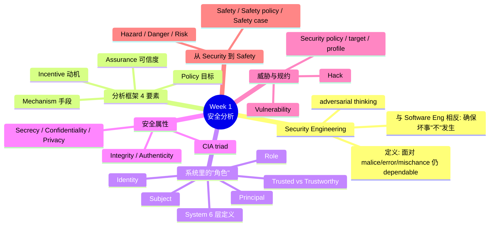
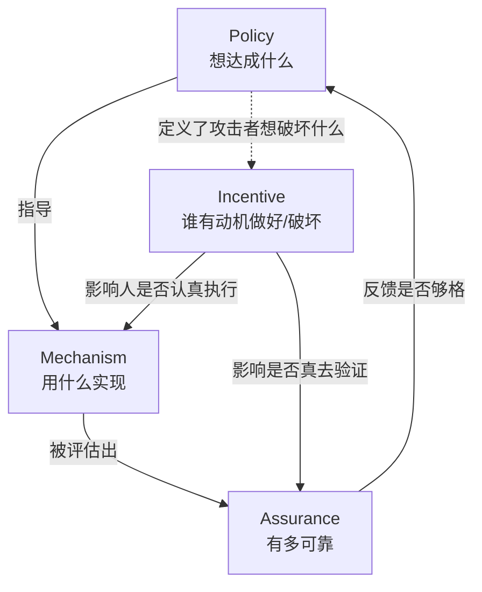
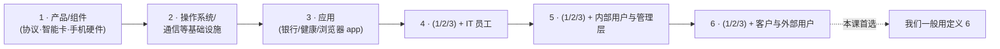
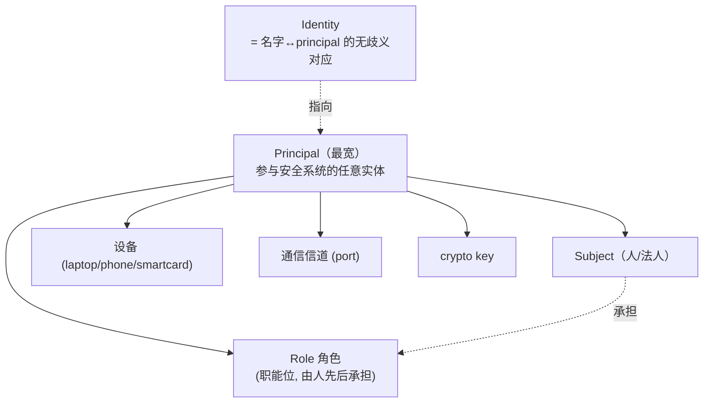
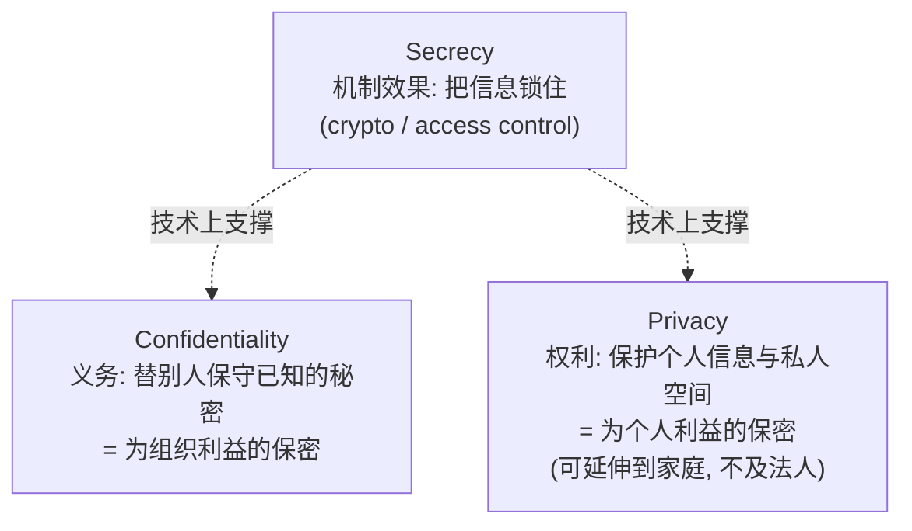
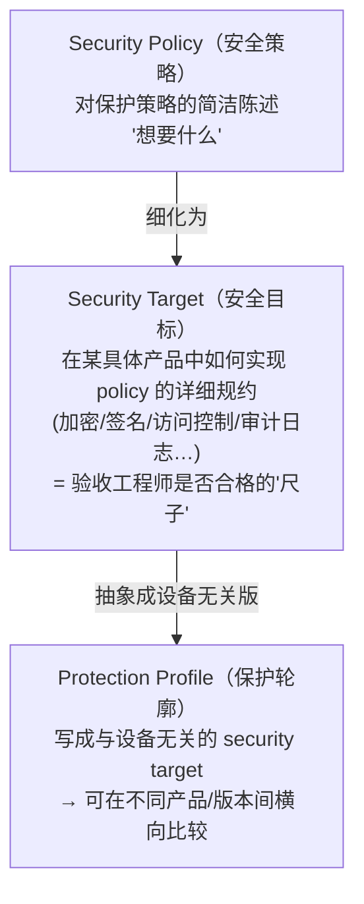
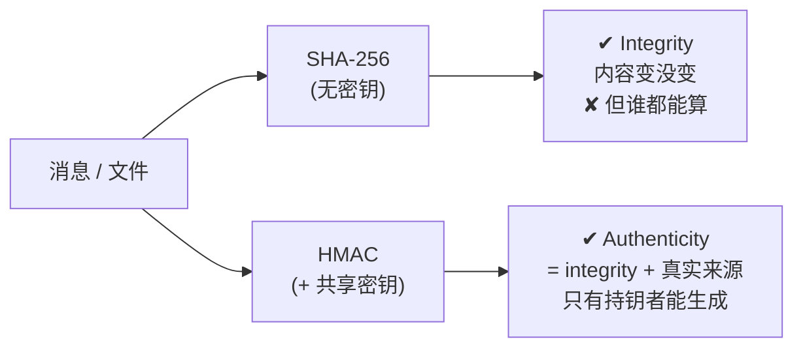
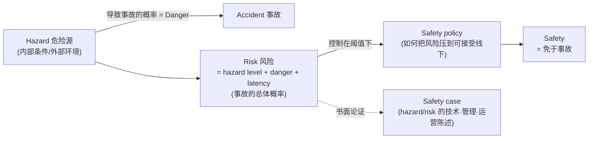

# Week 1 · 安全分析框架与安全概念 (Overview of Security Analysis — Framework and Security Concepts)

> **学习目标 (Learning objectives)** — 读完本章你应该能够：
> - 用自己的话说清 **Security Engineering** 的定义，并解释它和普通 **Software Engineering** 的根本区别；
> - 复述 **Security Analysis Framework** 的四个组成部分（**Policy / Mechanism / Assurance / Incentive**），并能把一个真实事件拆进这四格；
> - 准确区分一组容易混淆的术语对：**Subject vs Principal vs Role vs Identity**、**Trusted vs Trustworthy**、**Secrecy vs Confidentiality vs Privacy**、**Integrity vs Authenticity**；
> - 解释 **Vulnerability / Security policy / Security target / Protection profile** 各自指什么、彼此什么关系；
> - 沿着 **Hazard → Danger → Risk → Safety** 这条链条解释安全（safety）相关概念；
> - 把上面这些概念落到 workshop 的实战上：用 **SHA-256** 做完整性校验、用 **HMAC** 做真实性认证，并能说清为什么前者不等于后者。

CSIT470/970 这门课叫 **Security Essentials**，第一周不教任何具体的攻击或加密算法，而是先把"思考安全问题的框架"和"这门学科的语言"立起来。这一步看似务虚，其实是整门课的地基：后面每一周讲的具体技术（访问控制、密码学、协议……）都会被放回这个框架里来评价。所以本章要回答的大问题是两个——

1. **怎样系统地"分析"一个系统的安全？**（→ Security Analysis Framework）
2. **当我们谈论"安全"时，那些反复出现、又容易混淆的词，到底各自精确地指什么？**（→ Security Concepts / 一整套定义）

教材是 Ross Anderson 的 *Security Engineering: A Guide to Building Dependable Distributed Systems* (3rd ed.)，课程里简称 **SE**；本章几乎所有定义都出自它。考核方面记住三个数字就够了：**Quizzes 30%、Assignment 20%、Final 50%**——而 quiz 会在 workshop 当堂做，是强制出席的，所以本章这些定义就是最早一批会被考到的内容。

下面这张图是本章的"概念地图"，先扫一眼建立全局感，读完回头再看会清晰很多：



---

## 1. 安全工程是一门"防坏事"的工程

我们先得回答一个最基础的问题：**security**（安全）到底是什么？麻烦在于它是个极其宽泛的词——"国家安全""财务安全""工作安全"都叫 security，它的字面意思无非是*处于一种被保护、免于伤害/威胁/失败/丢失的状态*。在 IT 语境里，我们说的 security 其实是一堆更具体领域的统称：**computer security、cybersecurity、IT security、network security、hardware security**，外加 **usability**（可用性）和 **cryptography**（密码学）。换句话说，"安全"不是单一技术，而是这些领域交织出来的一种系统性质。

正因为它这么综合，构建安全系统的活动有个专门的名字。Anderson 给 **Security Engineering（安全工程）** 下的定义值得逐字记住：

> **Security Engineering** 是 *building systems to remain dependable in the face of malice, error, or mischance*——构建系统，使其在面对**恶意（malice）、错误（error）或意外（mischance）**时仍然**可靠（dependable）**。

这个定义里有两层关键信息。第一，它要对抗的不只是黑客的恶意，还包括无心的人为错误和纯粹的运气不好——三类来源都要扛。第二，要做到这件事，需要的知识面宽得惊人：**cryptography（密码学）、hardware tamper-resistance（硬件防篡改）、economics（经济学）、applied psychology（应用心理学）、law（法律）、business process analysis（业务流程分析）、software engineering（软件工程）**。一个好的安全工程师不是单纯的程序员，更像一个跨学科的"风险评估师"。

### 1.1 为什么安全工程比普通软件工程更难

这是本章第一个真正深刻的对比，也是高频考点。表面上 software engineering 和 security engineering 都是"造系统"，但它们的目标方向正好相反：

| | Software Engineering | Security Engineering |
|---|---|---|
| 核心目标 | Ensuring certain things **happen**（确保某些事*会*发生） | Ensuring certain things **do NOT happen**（确保某些事*不*发生） |
| 验收方式 | 给定输入，能产生正确输出，就算成功 | 要保证*在任何对手的任何招数下*，坏事都不发生 |
| 难点 | 把需求实现出来 | 需求本身因系统而异，且要穷尽"所有可能出错的方式" |

为什么"确保不发生"难得多？因为正面需求是有限可枚举的（登录、转账、生成报表……），而"坏事"的空间几乎是无限的——对手可以从任何你没想到的角度进攻。一个登录功能"能登进去"很容易验证，但"绝不会被任何人绕过"几乎无法穷举证明。再加上 **security requirements differ greatly from one system to another**（安全需求因系统而异），一套银行的安全方案搬到医院可能完全不适用（这一点 workshop 会用 Bank vs Hospital 的例子狠狠强调）。

> 📎 **拓展（超出 slides）** — 这正是安全领域那句名言"defender's dilemma"的来源：防守方必须堵住*所有*漏洞，攻击方只需找到*一个*。这种不对称性，是 security engineering 比一般工程更难的根本原因。

所以 Anderson 说，安全工程师必须具备两项特质：一是 **adversarial thinking（对抗性思维）**——像下棋的人一样，时刻站在对手角度想"他下一步会怎么攻我"；二是要**熟知历史上奏效过的大量攻击**，从它们的"开局"到"中盘发展"再到"结局"。知道过去什么招数成功过、造成了什么后果、又是怎么被堵住的，是判断当下风险的基础。这也解释了为什么这门课会花很多时间讲案例史——**knowing the history of modern information security enables us to understand its complexity and navigate it better**。

> **🔑 例（Worked example）** — 同样是写一个"转账金额校验"功能：
> - *软件工程视角*：输入金额，能正确算出余额、扣款成功，功能就完成了。
> - *安全工程视角*：还要追问——如果对手故意输入负数会怎样？输入恰好等于阈值的边界值呢？能不能用并发请求让同一笔钱被花两次？这些"对手会怎么破坏它"的问题，才是安全工程的主战场。（W2 workshop 的 Part C 就是把这个例子真正写成了代码，本章 §7 会回到它。）

---

## 2. 安全分析框架：Policy / Mechanism / Assurance / Incentive

现在我们有了"安全工程"这个目标，但目标太大，需要一个可操作的**分析工具**把它拆开。Anderson 指出，把保护做对，依赖于几类不同的过程：我们既要**搞清楚什么需要被保护、怎么保护**，又要**确保那些看守和维护系统的人有足够的动机把活干好**。能把上面所有这些一起纳入考量的，就是 **Security Analysis Framework（安全分析框架）**。

它由**四个组成部分**构成。请把这四个词当作一个固定搭配背下来——它是本章被考概率最高的知识点（slide 45 的 quiz 直接考它）：

| 组件 | 一句话定义 | 它回答的问题 | 直觉口诀 |
|---|---|---|---|
| **Policy（策略）** | What the dependable system is supposed to achieve | 这个可靠系统*应该达成什么*？ | "想要什么" |
| **Mechanism（机制）** | The ciphers, access controls, tamper-resistance and other machinery used to implement the policy | 用*什么机器/手段*去实现 policy？ | "拿什么实现" |
| **Assurance（保障/可信度）** | The amount of reliance placed on each mechanism, and how well they work together | 每个机制*能被多大程度地信赖*、彼此配合得怎样？ | "有多可靠" |
| **Incentive（激励/动机）** | The motive guardians have to do their job properly, *and* the motive attackers have to defeat your policy | 守护者*有没有动力*做好？攻击者*有多大动力*来破？ | "谁有动机" |

四者不是孤立的清单，而是**相互作用（interactive）**的整体。一个常见的、致命的误区是只盯着 Mechanism（"我们上了加密、上了 MFA"）而忽略 Incentive——如果维护系统的人因为图省事而共用账号，再强的机制也会被人为掏空。所以要把它们画成一个互相牵制的环：



记忆它的一个好方法是把四个词翻译成四个追问，对任何系统都能套：**"想要什么（Policy）→ 拿什么实现（Mechanism）→ 这些实现有多可信（Assurance）→ 背后的人有没有动机把它做好或破坏掉（Incentive）"**。

> ⚠️ **易错点：Framework ≠ CIA。** 很多同学会把"安全的四要素"误答成 **Confidentiality, Integrity, Availability, Non-repudiation**——这是 slide 45 quiz 的*错误*选项 A。本章框架特指 **Policy / Mechanism / Assurance / Incentive (PMAI)**。CIA（保密/完整/可用）是描述"安全*属性*"的另一套语言（见 §6），它和 PMAI 是**互补**关系，不是同一个东西：PMAI 是"怎么分析一个系统"，CIA 是"系统要保住哪些性质"。

### 2.1 用框架看真实失败：9/11 与 Security Theatre

框架的价值在于能把一桩复杂事故**结构化地解剖**。Anderson 用 9/11 事件做了示范——把这次安全彻底失败的事件，逐格拆进四个组件：

| 组件 | 9/11 当时的状况 | 评价 |
|---|---|---|
| **Policy** | 机场安检允许刀刃长达三英寸的刀具通过 | **Failure**——策略本身就漏了 |
| **Mechanism** | 复合材料刀具、不含氮的炸药能绕过检测 | **Weak**——手段有盲区 |
| **Assurance** | 真实武器过安检时，被发现没收的不到一半 | **Poor**——机制实际可信度极低 |
| **Incentive** | 决策者偏爱*看得见*的管控，而非*真正有效*的管控 | **"Security Theatre"** |

最后这一格引出了本章一个很重要的概念。**Security Theatre（安全剧场）** 是 Bruce Schneier 提出的术语，指那些*设计来制造"安全感"而非真正提供安全*的措施（measures designed to produce a *feeling* of security rather than the *reality*）。机场里那些醒目却抓不住真武器的检查，就是典型——它安抚了公众情绪，却没降低实际风险。决策者之所以偏爱它，是因为可见的管控更容易交差，这是一个 **Incentive** 层面的病根。

这给安全工程师提出了三条职业要求：**(1)** 能把风险和威胁**放进真实语境**来看；**(2)** 对"可能出什么错"做**现实的评估**；**(3)** 给客户**好的建议**。而要做到这些，必须对历史有广泛理解：知道各种系统**过去出过什么岔子、哪些攻击奏效过、后果是什么、又是怎么被止住的**。

> **🔑 例（来自 W2 workshop — 真实案例 Medibank 数据泄露）** — workshop 把澳洲 Medibank 泄露事件映射回这个框架，是练习框架用法的绝佳范例：
>
> | 组件 | 在 Medibank 案中的内容 |
> |---|---|
> | **Policy** | 保护客户数据、限制未授权访问、并能快速遏制泄露 |
> | **Mechanism** | 第三方访问控制、MFA、防火墙规则、least privilege（最小权限）、日志、网络分段（segmentation） |
> | **Assurance** | 复查供应商访问权限、配置检查、监控质量、事件响应准备度 |
> | **Incentive** | 便利/成本/时间压力 → 共享账号的"图省事"做法；以及攻击者勒索的牟利动机 |
>
> 推荐的整改动作正好对应每一格：privileged 账号不共享、上 MFA、收紧供应商 assurance、加强监控与分段。**这就是框架的实战用法——遇到任何事故，先把它拆成 PMAI 四格，问题和对策就自然浮现了。**

---

## 3. 系统里到底有"谁"：System、Subject、Principal、Role、Identity

要分析安全，先得能精确地说出系统里**有哪些参与者、各自是什么身份**。日常语言里"用户""账号""身份"混着用，但安全工程要求把它们一个个拧清楚。这一节的术语两两相邻、极易混淆，是 quiz 的重灾区（slide 31、32、46 全在考它们）。

### 3.1 "System"本身就有六种含义

先从最容易被忽略的歧义说起：连 **System（系统）** 这个词都不是单一所指。Anderson 列了**六种**逐层扩大的定义：



为什么要在意这个？因为**问题往往出在"对 system 的理解错位"上**：厂商和评估方倾向只看定义 1、2（硬件和基础设施），而企业真正关心的是 5、6（连人一起的整体）。于是出现这样的失败：一块"认证过的"安全硬件，却因为**应用层出错（定义 3）**或**人为因素被忽视（定义 6）**而整体崩盘——硬件再安全也没用。所以本课**一般采用定义 6**，把客户和外部用户也算进系统边界内。记住这个取向：安全的边界永远要画到"人"，而不是停在机器。

### 3.2 Subject、Principal、Role、Identity 四连环

接下来四个词，建议放在一起对照记，它们的范围层层不同：

- **Subject（主体）**：处于*任何角色*中的一个**人**——可以是操作员（operator）、principal、甚至受害者（victim）。注意这里的"人"既指自然人，也指**法人（legal person）**，比如一家公司或一个政府。
- **Principal（当事方/主理人）**：这是最宽的一个概念——*参与安全系统的任意实体*。它可以是一个 subject、一个 person、一个 role，**也可以是一台设备**（笔记本、手机、智能卡、读卡器）、一条**通信信道**（如某个端口号），甚至一把**密码密钥（crypto key）**。principal 还能是一个**群组**（如"Alice 或 Bob"）或一个**合取**（如"Alice 且 Bob"）。
- **Role（角色）**：*由不同的人先后承担的一组职能*。关键在"先后承担"——它是个职位/功能位，而非具体某人，例如"现任冰岛医学会主席"，谁坐上这个位子谁就是它。
- **Identity（身份）**：*两个 principal 的名字之间的对应关系，表明它们指向同一个人或设备*——目的是**无歧义地**用一个名字锁定一个 principal。例如"Alice 作为 Bob 的经理""Bob 作为 Charlie 的经理"，描述的是名字与 principal 的对应。日常中 identity 常被滥用成简单的"名字（name）"，但严格来说它是一种*对应关系*，不是名字本身。

这四个的范围关系，画成图最清楚：



> ⚠️ **三个最常考的辨析（slide 31/32/46）：**
> - **Principal** 的正确理解是"*任何*参与实体——用户账号、设备、或一把密钥都算"（不是"正在点提交的那个人"，那只是其中一种；也不是 role，也不是屏幕上的显示名）。
> - **Identity** 是"名字与 principal 之间的对应，使一个名字无歧义地指向正确的人/设备/账号"（不是 ID 卡上印的标签，也不是某个职位的权限集合）。
> - 在网银系统里，"用于签名交易的**密码密钥**"是 principal 的好例子——因为 principal 明确包含 crypto key。

### 3.3 Trusted vs Trustworthy：可信赖 ≠ 值得信赖

这是英语里一对极易混为一谈、但在安全语境里含义几乎相反的词，务必记牢：

| 术语 | 精确定义 | 通俗理解 |
|---|---|---|
| **Trusted（被信任的）** | 一个组件，*它一旦失效就能破坏安全策略* | "我们把安全压在它身上"——出事它就要命 |
| **Trustworthy（值得信任的）** | 一个组件，*它不会失效* | "它真的靠得住" |

关键洞察是：**被信任，不代表值得信任。** Anderson 的例子很传神——一个情报机构的雇员正打算把内部情报卖给外国：组织把机密**托付（trusted）**给了他，他却**不可靠（not trustworthy）**。系统设计里最危险的，恰恰就是那些 "trusted but not trustworthy" 的部件：你已经把安全赌在它身上了，它却随时会塌。安全工程的一大任务，就是尽量缩小"被信任"的部分（attack surface），并让真正被信任的部分尽可能 trustworthy。

> **🔑 例** — slide 47 quiz 的正确答案直接考这条：*Trusted means its failure can break policy; trustworthy means it is unlikely to fail.*

---

## 4. 安全属性：Secrecy、Confidentiality、Privacy

把"谁"理清之后，我们要谈系统该保住哪些**性质**。第一组是关于"信息不外泄"的三个近义词——它们在中文里都容易翻成"保密"，但精确含义层层递进。

- **Secrecy（机密性/保密）**：这是个**机制层面**的概念——指那些*用来限制能接触信息的 principal 数量*的机制所产生的效果，比如密码学或计算机访问控制。换句话说，secrecy 描述的是"技术上把信息锁住了"。
- **Confidentiality（保密义务）**：这是个**义务层面**的概念——*当你知道了别人（个人或组织）的秘密，有责任去保护它*。在密码学里 confidentiality 常和 secrecy 互换使用，但严格说，secrecy 偏"技术效果"，confidentiality 偏"应尽的责任"。
- **Privacy（隐私）**：*保护你个人信息的能力和/或权利，并延伸到防止他人侵入你私人空间的能力和/或权利*（具体定义因国而异）。注意一个边界：privacy 可以延伸到**家庭**，但**不延伸到法人**（如公司）——公司没有"隐私权"。

最值得记住的是 **Privacy vs Confidentiality** 这条精炼对比：

> **Privacy 是为了"个人"利益的保密；Confidentiality 是为了"组织"利益的保密。**
> （Privacy is secrecy for the benefit of the *individual*; confidentiality is secrecy for the benefit of the *organisation*.）



> **🔑 例（slide 36）** — 医院场景一次说清三者关系：病人对自己的信息**享有 privacy（隐私权）**；为了维护这项权利，医生、护士及其他员工对病人**负有 confidentiality（保密义务/duty of confidence）**。而医院**对其商业往来不享有 privacy**（法人无隐私），不过经手这些商业秘密的员工仍可能负有保密义务——除非他们援引"吹哨人（whistleblowing）"权利去揭发不当行为。这个例子精准示范了：privacy 属于"个人"，confidentiality 是别人替你承担的"义务"，两者一体两面。

---

## 5. 安全属性：Integrity 与 Authenticity

第二组核心属性关于"信息没被动过手脚"以及"对面真的是本人"。这一对是本章和 workshop 都重点演示的内容，也是 slide 48 quiz 的考点。

- **Integrity（完整性）**：一种性质，*保证给定的信息没有被篡改*。它只回答一个问题——"内容变没变？"
- **Authenticity（真实性）**：authenticity = **integrity + genuineness（完整性 + 真实来源）**。它不仅保证内容没被改，还保证*你正在与一个真正的 principal 通信，而不是冒牌货*。要提供 authenticity，实体通常需要某种**自身特有的信息**，比如一把**密钥（secret key）**。

两者的关系可以记成一个包含式：**有 authenticity 一定有 integrity，但有 integrity 未必有 authenticity。**

| | Integrity | Authenticity |
|---|---|---|
| 回答的问题 | 内容**变没变**？ | 内容没变 **且** 对面**是不是真人**？ |
| 是否需要密钥 | 不需要（任何人都能算校验和） | 需要某种自身特有的信息（如 secret key） |
| 典型手段 | 校验和 / 哈希（如 SHA-256） | 数字签名 / HMAC（基于密钥） |
| 关系 | authenticity 的一部分 | = integrity + genuineness |

> **🔑 例（slide 38 — 电子支票 e-check）** — 有人给你发来一张电子支票：
> - 你的机器可以**验证它的校验和（checksum）**。如果校验和有效，说明这张支票在传输中**没被改过**——这就是 **integrity**。
> - 但你**仍然不确定它是不是真的**（会不会是伪造的？）。要确认这一点，你需要检验它的**数字签名（digital signature）**，而签名涉及发送方的**密钥**——这才是 **authenticity**。
>
> 一句话：**integrity 说"没被改"，authenticity 还要再说"确实是 TA 发的"。**

> ⚠️ **slide 48 quiz** —"文件原封未动地到了，但你不确定是谁发的"：你**拥有 integrity，缺的是 authenticity**。这正是上面 e-check 例子的抽象版。

W2 workshop 把这对概念真正写成了代码（见 §7），核心结论先记住：**哈希（SHA-256）只给你 integrity，因为人人都能重算哈希；要得到 authenticity，必须用基于密钥的方法，如 HMAC 或数字签名。**

### 5.1 把属性收进 CIA：完整的安全属性视角

> 📎 **拓展（来自 W2 workshop，slides 未直接列出三件套）** — 上面这些属性，业界常打包成著名的 **CIA triad**：
> - **Confidentiality（保密）**——信息不被未授权者读取（对应 §4 的 secrecy/confidentiality）；
> - **Integrity（完整）**——信息不被未授权篡改（§5）；
> - **Availability（可用）**——需要时系统/数据可用（本章 slides 没单独定义，但 workshop 用它来排优先级）。
>
> 再次提醒：**CIA 是"要保住哪些属性"，PMAI 框架是"怎么分析系统"**，别混。workshop 用一个绝佳对比说明 CIA 的优先级**因系统而异**：

| | Banking System（银行） | Hospital System（医院） |
|---|---|---|
| **Assets（资产）** | 客户资金、交易账本、凭证/MFA、支付能力、声誉 | 病人安全、病历、医疗设备、临床流程、员工身份 |
| **Threats（威胁）** | 欺诈、账户接管、钓鱼、交易篡改、服务中断 | 勒索软件/停摆、隐私泄露、记录篡改、内部人滥用、设备失效 |
| **CIA 优先级** | **Integrity 第一**，其次 Availability，Confidentiality 也很关键 | **Availability 往往最高**（救命系统不能宕），Integrity 与 Confidentiality 也高 |
| **示例 policy** | 超 $1,000,000 的转账需两人审批；贷记必须等于借记 | 仅授权临床人员可访问病历，且所有访问都记日志 |

这张表把 §1.1 那句 "security requirements differ greatly from one system to another" 落到了实处：同样三个属性，银行最怕账目被改（Integrity），医院最怕系统宕掉救不了人（Availability）。**没有放之四海皆准的安全方案，一切从资产和威胁出发。**

---

## 6. 威胁、漏洞与安全规约：Hack、Vulnerability、Policy、Target、Profile

理解了要保护什么属性，接下来要谈"什么会出问题"以及"我们如何把保护要求写成规约"。

### 6.1 Hack 与 Vulnerability

- **Hack（黑客行为，Schneier 定义）**：*一个系统规则所**允许**、但却是设计者**未曾预料且不希望**发生的活动或代码*。注意它的微妙之处——hack 不一定违规，它恰恰是钻了"规则允许、但设计者没想到"的空子。例子：研究税法找漏洞做避税策略；研究软件代码找漏洞做成 exploit；找出加密算法里的数学弱点。
- **Vulnerability（脆弱性/漏洞）**：*系统或其环境的一种性质，它与某个内部或外部**威胁（threat）**结合时，会导致**security failure**——即对系统安全策略的破坏*。注意 vulnerability 是"性质/弱点"，要配合 threat 才会真正酿成事故。

> ⚠️ **slide 49 quiz** —Vulnerability 是"可被利用的弱点（weakness that can be exploited）"，Security policy 是"对期望保护的陈述（statement of desired protection）"。别把两者搞反。

### 6.2 三层安全规约：Policy → Target → Profile

当我们要把"想要的保护"写下来，存在**三个细化层级**，从抽象到具体：



- **Security policy（安全策略）**：*对一个系统保护策略的简洁陈述*。Anderson 的经典例子：*"每笔交易中，贷记之和等于借记之和，且所有超过 $1,000,000 的交易必须由两名经理授权。"* 它说的是"应当达成什么"，简短而明确。
- **Security target（安全目标）**：*更详细的规约，规定在某个**具体产品**中将通过何种手段来实现安全策略*——加密与数字签名机制、访问控制、审计日志等等——它会被用作**衡量工程师是否把活干好的标尺（yardstick）**。
- **Protection profile（保护轮廓）**：*类似 security target，但写得足够**设备无关（device-independent）**，从而允许在不同产品、以及同一产品的不同版本之间做**横向比较评估**。

一个记忆线索：policy 是"我要什么"，target 是"这台具体产品怎么实现并据此验收"，profile 是"把 target 写成通用版好让不同产品 PK"。注意 security **policy** 这个词在框架（§2 的 Policy）里也出现过——它们是一致的：framework 里的 Policy 组件，落到文档上就是这里的 security policy。

> **🔑 例（W2 workshop Part C — policy 如何映射成 mechanism）** — 上面那条"超 $1,000,000 需两人审批"的 policy，落成代码 mechanism 只是一行：
> ```python
> THRESHOLD = 1_000_000
> def needs_two_approvals(amount: int) -> bool:
>     return amount > THRESHOLD       # policy: 严格大于
> # needs_two_approvals(1_000_000) -> False（恰好一百万不需要两审）
> # needs_two_approvals(1_000_001) -> True
> ```
> 这一行 `>` 就是把抽象 policy 变成可执行 mechanism 的桥梁。下一节会看到，如何用 assurance（边界测试）来证明这行代码真的符合 policy。

---

## 7. 把概念落到代码：W2 Workshop 实战

> 本节整合 W2 workshop（对应 Week 1 内容）的 Part C，是本章概念的"上机版"。它把 **Policy → Mechanism → Assurance** 这条链、以及 **Integrity vs Authenticity** 的区别，全部变成了能跑的 Python。

### 7.1 Policy → Mechanism → Assurance 一条龙

workshop 给了一个"银行交易策略检查器"：策略是"借贷必须平衡，且大额交易需足够审批"。给定一批交易，它会检查：

- **借贷平衡**：Debits = 500,000 + 1,200,000 = 1,700,000；Credits = 500,000 + 1,200,000 = 1,700,000 → **平衡规则通过**。
- **大额授权**：交易 T004 金额 1,200,000 > 1,000,000 却只有 **1** 个审批 → **FAIL**（高额授权失败）。

这演示了 **Mechanism**（代码逻辑）如何强制执行 **Policy**（业务规则）。而 **Assurance（保障）** 的精确含义是——**有证据表明机制确实匹配策略**。怎么拿证据？用**边界测试（boundary tests）**：

```python
def test_threshold_rule():
    assert needs_two_approvals(999_999)   is False
    assert needs_two_approvals(1_000_000) is False   # 边界！
    assert needs_two_approvals(1_000_001) is True
```

为什么测 999,999 / 1,000,000 / 1,000,001 这三个点？因为它们专门抓 **off-by-one（差一）错误**。workshop 给的 **boundary-value bug** 就是经典一例：

| | 正确规则 | 有 bug 的规则 |
|---|---|---|
| 逻辑 | `amount > 1,000,000` 才需两审 | `amount >= 1,000,000` 就需两审 |
| 暴露 bug 的测试 | —— | 输入**恰好 1,000,000、审批=1**：正确实现应放行，buggy 实现会误判 |

这就是 §1.1 说的"安全工程要确保坏事不发生"的微观体现：一个 `>` 写成 `>=`，策略就被悄悄改变了，而只有边界测试（assurance）能抓住它。

### 7.2 Integrity（SHA-256）vs Authenticity（HMAC）

这是 §5 那对概念的代码落地，也是 workshop 反复强调的结论。

**Integrity — 用 SHA-256 检测数据是否被改：**
```python
import hashlib
m1 = b"amount=500000"
m2 = b"amount=500001"        # 仅改 1 位数字
print(hashlib.sha256(m1).hexdigest())
print(hashlib.sha256(m2).hexdigest())   # 哈希值完全不同
```
哪怕只改一个数字，哈希也会**面目全非**（雪崩效应）——所以哈希能检测"内容变没变"。**但它无法证明是谁创建/改了数据**，因为*任何人都能重算 SHA-256*。

**Authenticity — 用 HMAC 加上"真实来源"保证：**
```python
import hmac, hashlib
key = b"shared-secret"
msg = b"amount=500000"
tag = hmac.new(key, msg, hashlib.sha256).hexdigest()
# 接收方用同一把密钥验证
ok = hmac.compare_digest(tag, hmac.new(key, msg, hashlib.sha256).hexdigest())
```
**HMAC 用一把密钥（secret key）来认证消息**。关键对比：**人人都能算 SHA-256，但只有持有密钥的人才能算出有效的 HMAC**——这把"任何人可验"变成了"只有真发送方可生成"，于是得到 authenticity = integrity + genuineness。



> **一句话收尾**：完整性问"变了吗"，用哈希就够；真实性问"真是 TA 吗"，必须引入只有当事方才有的**密钥**。这正是 workshop 反复敲黑板的那条结论：*hashing alone gives integrity checking, not authenticity.*

---

## 8. 从 Security 到 Safety：Hazard、Danger、Risk、Safety

本章最后把视野从"对抗恶意"扩展到"避免事故"。安全工程不仅防黑客（security），也防系统失效酿成的人身/财产事故（safety）。这一串术语构成一条因果链，建议沿链记忆。

- **Critical system / component（关键系统/组件）**：*其失效在存在某个 **hazard（危险源）** 时，可能导致一次 **accident（事故）** 的系统或组件*。hazard 指一组内部条件或外部环境。
- **Danger（危险度）**：*一个 hazard 最终导致 accident 的**概率***。
- **Risk（风险）**：*发生事故的**总体概率** = hazard level（危险源水平）结合 danger（危险度）与 latency（潜伏：危险暴露的程度与持续时间）*。
- **Safety（安全/无事故）**：*免于事故（freedom from accidents）*。
- **Safety policy（安全策略）**：*关于如何把风险维持在**可接受阈值以下**的简洁陈述*。
- **Safety case（安全论证）**：*一份书面材料，陈述可能引发重大事故的 hazard 与 risk 的技术、管理与运营信息*。

把这条链画出来，"危险源—危险度—风险—安全"的递进就一目了然：



注意 safety 这套词和前面 security 那套词是**平行**的：security policy 之于安全策略，正如 safety policy 之于风险阈值；它们体现了 Anderson 在 slide 44 引用《爱丽丝梦游仙境》想说的那一点——**这些术语带有顺序或并行的多层含义**，同一个词在不同语境下细微不同，必须结合上下文精确理解，不能想当然。

---

## 本章小结 (Key takeaways)

把下面这几条记牢，本章的"骨架"就立住了——考前只读这一节也能回忆起整章脉络：

1. **Security Engineering** 是构建系统使其在面对 **malice / error / mischance** 时仍 dependable；它与 software engineering 的根本区别在于后者"确保坏事*不*发生"，因而需要 **adversarial thinking** 和对攻击史的了解。
2. **Security Analysis Framework** = **Policy（要什么）/ Mechanism（拿什么实现）/ Assurance（多可信）/ Incentive（谁有动机）** 四个*相互作用*的组件；遇到任何事故都可拆进这四格分析（9/11、Medibank 即范例）。**别和 CIA 混淆**——PMAI 是"怎么分析"，CIA 是"保住哪些属性"。
3. **Security Theatre**（Schneier）= 制造"安全感"而非真实安全的措施，根子在 **Incentive**：决策者偏爱可见的管控。
4. **System** 有 6 层定义，本课取**定义 6**（含外部用户）；安全边界必须画到"人"。
5. 角色术语：**Principal**（参与系统的*任意*实体，含设备/密钥）最宽，**Subject**（人/法人）、**Role**（职能位）、**Identity**（名字↔principal 的无歧义对应）各有所指。
6. **Trusted ≠ Trustworthy**：trusted = 失效会破坏策略（你把安全赌在它身上）；trustworthy = 不会失效（真靠得住）。"trusted but not trustworthy" 最危险。
7. **Privacy 是为个人利益的保密，Confidentiality 是为组织利益的保密**；secrecy 偏机制效果。病人有 privacy，医护负 confidentiality。
8. **Authenticity = Integrity + genuineness**：integrity（哈希/SHA-256 即可，人人能算）只说"没被改"；authenticity（需密钥，HMAC/数字签名）还说"确实是 TA 发的"。
9. **三层规约**：Security **policy**（要什么）→ Security **target**（具体产品怎么实现并据此验收）→ Protection **profile**（设备无关版，供横向比较）。**Vulnerability** 是可被利用的弱点，需与 **threat** 结合才酿成 security failure。
10. **Safety 链**：Hazard →(Danger 概率)→ Accident；**Risk** = hazard level + danger + latency；**Safety** = 免于事故，由 **safety policy** 把风险压到阈值下，**safety case** 是其书面论证。

---

## 课堂 Quiz 自测（slides 原题 + 解析）

> 这 7 道题直接来自讲义（slide 31/32/45/46/47/48/49），是 workshop 当堂 quiz 的同源题，务必先自己作答再看解析。

**Q1（S31）** 在大学 LMS（如 Moodle）里，哪个最匹配 **principal**？
A. 当前正在用系统的人（点"提交"的学生） B. 像"Student""Tutor"这样的权限集 C. *任何参与安全系统的实体，如用户账号、设备或密钥* D. 屏幕显示名"Alice Nguyen" E. 确保"s1234567"指向正确账号的映射
→ **答案 C**。principal 是"任意参与实体"，明确包含设备与密钥；A 只是其中一种，B 是 role，D 是 name，E 是 identity。

**Q2（S32）** 哪句最符合 **identity** 的含义？
→ **答案 D**：*名字与 principal 之间的对应，使一个名字无歧义地指向正确的人/设备/账号*。（A 是 subject，B 是 name/label，C 是 role，E 是设备。）

**Q3（S45）** Security Analysis Framework 的四个组件是？
→ **答案 B：Policy, Mechanism, Assurance, Incentive。**（A 的 CIA+Non-repudiation 是干扰项！）

**Q4（S46）** 网银系统里，哪个是 **principal** 的最佳例子？
A. 登录转账的客户 B. "Customer"角色 C. *用于签名交易的密码密钥* D. 跑在手机上的银行 app E. 以上全部
→ **答案 C**。principal 定义里明确包含 crypto key；这题专门考"密钥也是 principal"。（注：A 和 D 也都是参与实体，但本题考点是"密钥算不算 principal"，故选最能体现定义外延的 C。）

**Q5（S47）** 关于 trusted / trustworthy，哪句对？
→ **答案 C**：*Trusted = 其失效会破坏策略；Trustworthy = 不太可能失效。*

**Q6（S48）** 文件原封未动地到达，但你无法确认是谁发的——你有哪个属性、缺哪个？
→ **答案 B：有 integrity，缺 authenticity。**

**Q7（S49）** 哪组配对正确？
→ **答案 B：Vulnerability = 可被利用的弱点；Security policy = 对期望保护的陈述。**

---

> *说明：本讲义基于 Week 1 lecture slides（`WG CSIT970 W1 AUT 2026.pdf`，slide 17–49 为教学内容）与 W2 workshop（`W2-Solutions.pdf`，对应 Week 1 内容）综合编写。Week 1 无录音转录稿，故口述层面的额外例子缺失；workshop 的 Bank/Hospital、Medibank 及 Python 案例已用于补足直觉与实战。凡标 `📎 拓展` 处为超出 slides 的补充内容（CIA triad、defender's dilemma 等），考试以 slides 定义为准。*
