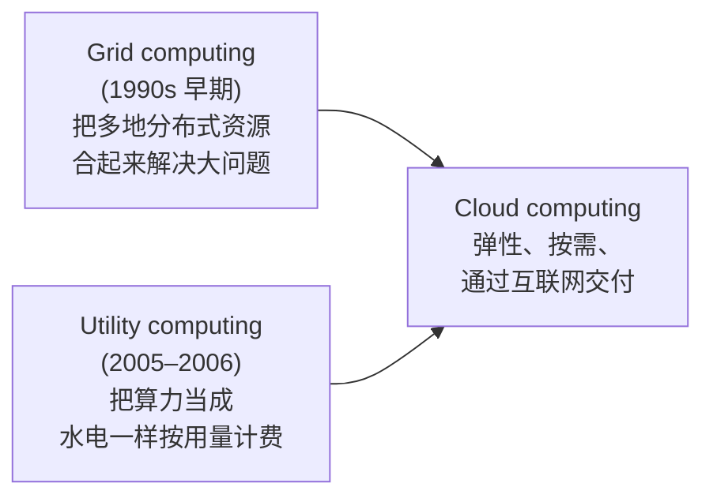
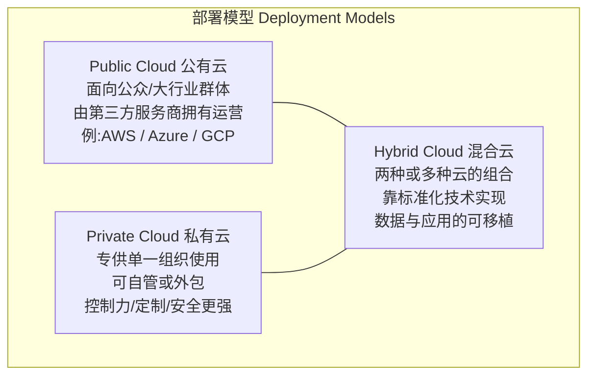
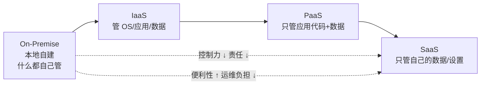
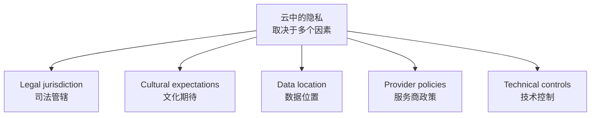
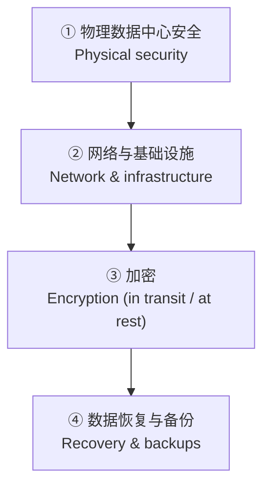
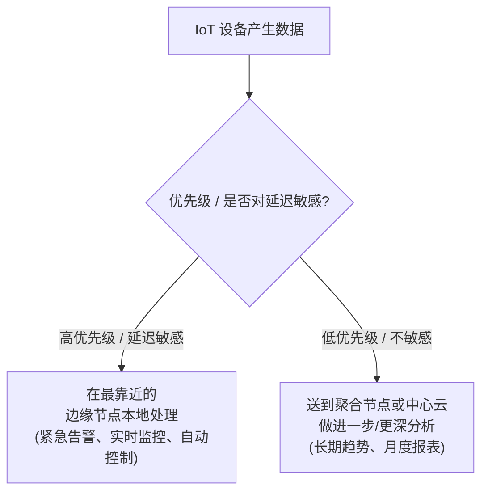

# Week 10 · 云计算与边缘计算的安全 (Cloud Computing and Edge Computing)

> **关于周次的说明** — 这份讲义文件名是 **W10**,幻灯片标题也写的是 **"Week 10 – Cloud Computing and Edge Computing"**(讲师 Dr. Steven Duong),所以本章就是 Week 10,不用担心被标成 Week 8。配套的 **workshop(W10-Solutions)** 同样标着 "Week 10 – Lab/Workshop",内容与本章**完全对应**(云计算概念、交付模型、边缘计算、智慧城市/校园案例),非常值得一起过。讲师在课上特别强调:本章内容"may be beneficial for your assignment",而且 **Quiz 3(下周 Week 11 的 lab 进行)的范围 = Week 7–10 的 lecture slides + workshops**,所以本章和 workshop 都是直接的考点。

> **学习目标 (Learning objectives)** — 读完本章你应该能够:
> - 用一句话**定义**云计算 (cloud computing),并说清它和早期的 **Grid computing / Utility computing** 的关系;
> - **复述**云计算的五大特征,准确**解释 elasticity(弹性)** 和 **resource multiplexing(资源复用)**;
> - **区分**三种部署模型 **Public / Private / Hybrid**,并能判断一个真实场景该用哪种;
> - **画出**从 on-premise → IaaS → PaaS → SaaS 的"控制权光谱",说明每种交付模型下**谁管什么**,并能把 Gmail、EC2、App Engine 等例子归类;
> - **解释**云为什么会引入新的安全/隐私风险,以及"责任归属为什么会变模糊";
> - **区分** data integrity(完整性)与 data confidentiality(机密性),并说出各自的保护手段;
> - **列举**云服务商在物理、网络、加密、备份/容灾四个层面的安全措施(DMZ、man trap、TLS、failover site 等);
> - **用"光速/延迟"的物理论证解释**为什么需要边缘计算 (edge computing),并说出 workshop 给的"push/pull/data producer"三大动因;
> - **识别**边缘计算特有的安全风险,并对应给出防御措施;能用 edge vs cloud 框架判断一项任务该在哪里处理。

云计算几乎是每个人都"用过但说不清"的东西。本章分四步走:先把**云计算到底是什么、有哪些类型和交付模型**讲清楚(Part 1–2),再聚焦本课的核心——**云带来的安全与隐私问题以及对应的防护**(Part 3),最后转到**边缘计算**:它为什么出现、怎么工作、又带来了哪些新的安全风险(Part 4)。一条主线贯穿始终:**把计算和数据交给别人(云)或推到网络边缘(edge),都是用"控制权"换"便利/性能",而安全问题恰恰就藏在这笔交易里。**

---

## Part 1 · 云计算基础

### 1.1 什么是云计算:从"自己买"到"按需租"

讲师开场就给了一个最朴素的定义:**云计算 (cloud computing) 就是让用户通过互联网访问计算资源,而不必自己拥有或维护这些硬件。**

> **云计算 (Cloud Computing)** — *the on-demand delivery of IT resources over the Internet with pay-as-you-go pricing.*(通过互联网**按需 (on-demand)** 交付 IT 资源,并采用**用多少付多少 (pay-as-you-go)** 的计费方式。)

与其去**购买、拥有、维护**自己的数据中心和服务器,用户可以从云服务商那里**按需**取用这些资源:

- 算力 (computing power)
- 存储 (storage)
- 数据库 (databases)
- 应用 (applications)
- 网络资源 (networking resources)

讲师用一个很实际的例子点出价值:一家公司想做一个实验,可能需要一台 200 万美元的强力机器——但如果只用一两次,自己买就极不划算(还得再雇一个团队来维护它)。改成**从云上租**,项目做完就停,成本可能低得多。**这里的关键词就是 pay-as-you-go:你根据实际需要(要多少存储、多少算力)来调整,用多少付多少。**

### 1.2 云的"前身":Grid computing 与 Utility computing

现代云计算不是凭空出现的,它继承了两种早期模型的思想。理解这两者,能帮你看清"云"到底新在哪里。

| 模型 | 核心思想 | 例子 |
|------|----------|------|
| **Grid computing(网格计算)** | 把**多个地点的分布式计算资源**联合起来,共同完成一个目标;主要用于科研、大规模**非交互式**工作负载 | Worldwide LHC Computing Grid(支撑大型强子对撞机的数据处理) |
| **Utility computing(效用计算)** | 把计算资源**像水电一样作为服务**提供,按**实际用量**而非固定费率收费 | AWS EC2 / Azure Virtual Machines |
| **Cloud computing(云计算)** | 通过互联网提供**弹性、按需**的 IT 服务 | AWS、Microsoft Azure、Google Cloud |

讲师的概括很到位:**Grid 贡献了"把分散资源合起来"的思路,Utility 贡献了"按量付费"的思路,两者合流就成了今天的云。**

### 1.3 云计算的五大特征

讲师把云的本质特征归纳为以下几点(幻灯片 S5):

- **共享资源池 (shared pool of resources)** — 很多用户共用同一批物理基础设施,但各自的**数据和应用在逻辑上是隔离的**。讲师反复强调:你不拥有物理设施,和别人共享,但你的数据和应用必须彼此分开。
- **通过互联网提供 (over the Internet)** — 服务都经由网络访问。
- **可按需伸缩 (scaled up or down based on demand)**。
- **用量被度量 (measured)、按用量计费 (charged according to usage)**。
- **成本效益 (cost-effective)** — 来自资源共享和**多路复用 (multiplexing)**。

其中最重要、也最常考的一个概念是 **elasticity(弹性)**:

> **弹性 / 弹性计算 (Elasticity / Elastic computing)** — *the ability to dynamically acquire or release computing resources according to workload.*(根据工作负载**动态地获取或释放**计算资源的能力。)

讲师举的直觉例子:一个网站在**流量高峰**时自动用更多服务器,流量回落时再释放掉——这种"随需涨落"就是弹性。

> 🔑 **例(QUIZ S10)** — *下列哪一项最准确地描述云计算中的 "elasticity"?* 答案是 **C. 根据需求动态伸缩计算资源的能力 (the capability to dynamically scale computing resources based on demand)**。注意区分干扰项:"跨地点存储数据"是数据分布、"加密保护存储"是安全、"固定月费"恰恰与按需相反。

另一个容易和弹性混淆、但 workshop 单独列出的概念是 **resource multiplexing(资源复用)**:

> 📎 **拓展(workshop A1 补充)** — **Resource multiplexing** 指**同一批物理资源服务于许多不同用户/工作负载**。因为不同用户在不同时间需要资源(有人早上用、有人晚上用),**峰值不同步**,服务商就能整体上提高利用率。这正是云"省钱"的底层原因——也是 S7 "higher resource utilisation" 的机制。

### 1.4 数据存储与管理:位置无关性与责任分工

云里的数据存在**云数据中心 (cloud data centres)** 里,讲师强调了几个关键点(S6):

- **位置无关性 (location independence)** — 对用户来说,数据"好像就在手边",但实际上它**不绑定在某台特定机器/服务器上**,可能分布在全球。服务商往往会把数据存在**离用户近**的地方以降低延迟。
- **复制 (replication)** — 把数据复制到多处,可以提升**可靠性和可用性**(一台宕机,别处还有)。
- **但数据位置会影响 privacy、jurisdiction(司法管辖)、compliance(合规)** —— 这是后面隐私部分的伏笔。

至于**管理 (management)**,基础设施的维护和安全由**服务商**负责(他们有专门的安全团队、技术团队,靠**专业化 (specialisation)** 和**集中化 (centralisation)** 把事情做得更高效、更新更快);但**用户仍需自己管理数据、账号和访问设置**。换句话说:**服务商管"地基和保安",你管"自己屋里的东西和钥匙"。**

### 1.5 上云的好处 (Advantages)

为什么这么多公司都往云上搬?讲师把优势分两组讲(S7–S8):

| 优势 | 含义 |
|------|------|
| **更高的资源利用率** | CPU、存储、带宽被多用户共享,各家峰值不同步 → **multiplexing** 提升整体利用率 |
| **支持数据密集型应用** | 可跨多台服务器/区域**聚合资源**,支撑大数据分析、机器学习、科学计算 |
| **便于协作的数据共享** | 全球团队共享同一数据集做分析与决策,**无需来回传文件** |
| **省去前期投资** | 不必自建私有基础设施,也省去维护和运营成本 |
| **成本降低** | 资源集中 + **pay-as-you-go**,用多少付多少 |
| **弹性** | 能从容应对**峰值/均值比很大**的工作负载 |
| **用户便利** | **虚拟化 (virtualization)** 让用户在熟悉的环境(如 Linux/Windows)里操作,开箱即用,无需自己装系统、配环境 |

> 🔑 **例(QUIZ S12)** — *下列哪项 NOT 是讲义中提到的云计算直接好处?* 答案是 **C. 改善软件开发生命周期的自动化**。云确实"能"支持这件事,但它**不在讲义列出的直接收益**里——这类"看似合理但课上没讲"的选项是出题人常用的陷阱。

### 1.6 三种部署模型:Public / Private / Hybrid

云按"谁能用、谁拥有"分成三种**部署模型 (deployment models)**:

- **公有云 (Public Cloud)** — 基础设施面向**公众或大型行业群体**开放,由**出售云服务的第三方组织**拥有。特点:成本低、可扩展性强、按用量付费。例子:用 AWS 托管网站。
- **私有云 (Private Cloud)** — 基础设施**专为某一个组织运营**(可由内部团队管理,也可外包给第三方)。好处是**控制力强、易定制、安全性更好**,常见于银行、政府机构、大型企业。
- **混合云 (Hybrid Cloud)** — 由两个或更多云(public/private/community)组合而成,各自独立但通过**标准化技术**绑定,实现**数据和应用的可移植性 (portability)**。目的是兼顾两者的优点。

> 🔑 **例(讲师课堂例子)** — **医院**就是混合云的好例子:**病历 (medical records)** 这种敏感数据放在**私有云**里;而**预约挂号**这类对外服务可以放到**公有云**上。这样既保住了敏感数据的安全和控制,又享受了公有云的灵活与低成本。

> 🔑 **例(QUIZ S11)** — *基础设施与公众共享、且由第三方服务商拥有的部署模型是?* 答案是 **C. Public Cloud(公有云)**。

> 📎 **拓展(课堂讨论:trust 问题)** — 有同学问到云服务商和使用方之间的**信任 (trust)** 问题。讲师回应:用云一定要有**清晰的协议 (agreement)** 和**信任基础**,所以大家倾向选**有名气的大厂**(Google、Amazon、Microsoft);隐私和安全"永远是用云时要讨论的问题"。这正好引出 Part 3。

---

## Part 2 · 三种交付模型 (Cloud Delivery Models)

部署模型回答"云给谁用",**交付模型 (delivery models)** 回答"云交付的是哪一层"。一共三种:**IaaS、PaaS、SaaS**。它们的根本区别在于:**你控制多少、服务商负责多少。**

### 2.1 控制权的光谱:谁管什么

理解这三者最好的方式,是把它们放在一条**控制权光谱**上。从完全自管的本地部署 (on-premise) 出发,越往右,你交出的控制越多、得到的"省心"也越多。

讲师的总结一针见血:**从左到右,控制权越来越多地交给云服务商,但你换来的是"易用"和"少运维"。** 选哪个,取决于组织的实际需要。下面这张"分工表"是本章最该记牢的内容之一:

| 层 | 用户控制 | 服务商负责 | 典型例子 |
|----|----------|------------|----------|
| **On-premise** | 网络、存储、服务器、虚拟化、OS、运行时、应用、数据(全部) | — | 自建机房 |
| **IaaS** | OS、存储、部署的应用、数据,**可能含有限的网络配置(如主机防火墙)** | 物理硬件、虚拟化平台、核心网络、数据中心安全与维护 | **Amazon EC2** |
| **PaaS** | 部署的应用代码,**可能含应用托管环境的配置** | 网络、服务器、OS、存储、运行时(底层全包) | **Google App Engine、Windows Azure App Services** |
| **SaaS** | 仅自己的(个人/组织)数据,以及**有限的应用设置** | 基础设施、应用部署、更新、安全、备份(全包) | **Gmail、Google Docs** |

### 2.2 三种交付模型逐个看

**IaaS — Infrastructure as a Service(基础设施即服务)**
服务商提供**虚拟化的计算基础设施**:虚拟机 (VM)、CPU、存储、内存、网络、IP 地址、负载均衡、带宽等。用户**不管理底层基础设施**,但**控制操作系统、存储、部署的应用,以及可能的有限网络组件(如主机防火墙)**。讲师比喻:**把基础设施"租"给你,你像搭积木一样用虚拟服务器、存储、网络,但物理硬件由服务商管。** 适合开发者、IT 管理员、需要灵活性又不想前期砸钱的初创公司。

**PaaS — Platform as a Service(平台即服务)**
服务商提供一整套**编程语言、开发框架、中间件、工具和库**。用户**只需专注写代码**,不必操心服务器、数据库、网络。用户**控制部署的应用(及可能的托管环境配置)**,但**不管理底层基础设施**。讲师的说法:**"你不用担心服务器、数据库、网络——你只管 coding。"**

**SaaS — Software as a Service(软件即服务)**
服务商把**软件连同数据一起部署好**,用户**通过浏览器直接用**,无需安装、无需更新、不用管服务器。用户**不管理底层基础设施或应用本身**,只控制自己的数据和有限设置。服务范围包括工作流管理、通讯、数字签名、CRM、桌面软件、财务管理、地理空间、搜索等。讲师说:**这就是大多数人一听"云"就想到的东西——打开浏览器登录 Gmail、Google Docs 就能用。**

> 🔑 **例(三道 QUIZ 串讲)** —
> - **S17**:最贴切的 SaaS 例子是? → **D. Gmail**(浏览器直接用,无需安装;注意"本地装的 Microsoft Word"不是 SaaS,Amazon EC2 是 IaaS,Google App Engine 是 PaaS,Docker Engine 不是)。
> - **S18**:用户控制应用代码、但不控制底层 OS/服务器硬件的是? → **C. PaaS**。
> - **S19**:IaaS 的标志性特征是? → **C. 用户控制 OS 和存储,但不控制物理基础设施**。

### 2.3 用场景判断该选哪个(workshop A2)

> 📎 **拓展(workshop A2,直接的考试演练)** — workshop 给了一组"场景 → 模型"的判断题,这正是考试最可能的出题形式。判断诀窍:**问自己"用户管到哪一层?"**

| 场景 | 模型 | 理由 |
|------|------|------|
| 公司租虚拟机并**自己装 OS 和软件** | **IaaS** | 用户控制 OS 和应用,但不控制物理设施 |
| 开发者**部署 Web 应用、不管 OS** | **PaaS** | 服务商管 OS/平台,用户管应用代码 |
| 学生**用浏览器访问 Gmail** | **SaaS** | 服务商管整个应用,用户只是使用 |
| 公司**用 Microsoft 365** 收发邮件、共享文档 | **SaaS** | 微软管应用、平台、基础设施 |
| 研究组**租云服务器跑实验** | **IaaS** | 租的是虚拟基础设施,自己控制软件环境 |

---

## Part 3 · 云的安全与隐私

讲到这里,前面都是铺垫——**本课真正关心的是安全和隐私。** 一旦你把数据交给第三方、让它替你做计算、还让多个服务跨网络互联,新的脆弱性就出现了。

### 3.1 云的脆弱性 (Vulnerabilities) 与"责任模糊"

云带来一个根本性的**安全转移 (security shift)**(S21):

- **控制权部分转移给第三方服务**;
- **数据可能存在多个站点**;
- **多个服务跨网络互联互通**。

由此可能产生的风险包括:**未授权访问、数据损坏 (data corruption)、基础设施故障、服务不可用、恶意攻击、电力/硬件故障**。

更棘手的是**责任归属问题**(S22):云系统常常**横跨多个组织、穿越多条安全边界**。讲师举例:一个应用可能同时用了某云商的数据库服务、某个认证服务、还有外部 API——一旦出事,**责任未必立刻清楚**。于是要回答一连串问题:

- **谁控制数据?**(Who controls the data?)
- **谁管理访问?**(Who manages access?)
- **谁负责安全配置?**(Who is responsible for security configuration?)
- **出现 breach 时谁来响应?**(Who responds when a breach occurs?)
- **服务协议保证了什么?**(What does the service agreement guarantee?)

这就是为什么云安全**离不开清晰的协议、监控和事件响应计划**——呼应了 1.6 里那个 trust 的讨论。

> 📎 **拓展(workshop A3)** — workshop 把这个问题说得更直白:**责任之所以模糊,是因为可能牵涉多方**——客户、云服务商、应用开发者、子承包商;**很难确定是谁造成了问题、又该谁来响应。**

### 3.2 隐私与云 (Privacy and Clouds)

云服务商在全球的数据中心里存了**海量敏感的个人和组织数据**(健康记录、财务信息、知识产权、通讯日志)。讲师指出:**云能否被接受,很大程度上取决于隐私问题是否被妥善处理**,而这又取决于三方——**云服务商、使用云的组织、以及数据中心所在的国家**。

隐私问题会受哪些因素影响(S23)?

具体的隐私问题(S24)包括:数据在云里被**存储和处理**时用户如何**控制**它;如何防止**盗用、滥用、未授权转售**;如何确保**复制发生在合适的位置**;如何避免**丢失、泄露、未授权修改或伪造 (fabrication)**。讲师特别强调一个常被忽略的点:

> **隐私不只是"原始数据泄露"** — *Privacy is not only about direct data leakage. Access patterns and usage behaviour may also reveal sensitive information.*(即使原始数据没漏,**访问模式和使用行为本身**也可能暴露敏感信息。)

还有一层是**子承包商 (subcontractors)** 带来的复杂性(S25):组织和一个云商签约,但云商可能再把存储、计算、内容分发**分包给多个子承包商**。于是要追问:**谁负责满足个人信息的法律要求?有没有子承包商参与处理数据?能不能识别并审查他们?能否核实他们的安全实践?万一数据泄露/滥用怎么办?** 讲师的结论:这一切**必须清晰、透明**。

> 🔑 **例(三道隐私 QUIZ)** —
> - **S26**:维护云数据隐私的一大挑战是? → **C. 难以确定数据的法律责任归属**。
> - **S27**:子承包商在缺乏透明度的情况下处理数据,会带来什么隐私风险? → **C. 未授权的数据访问或处理**。
> - **S28**:文化差异如何影响隐私期待? → **D. 有些文化把集体 (community) 置于个人隐私之上**。讲师补充:不同国家对隐私的看法差异很大,有的国家高度保护个人隐私,有的更愿意为了管理而共享个人信息。

### 3.3 完整性 vs 机密性:两个必须分清的概念

云安全里有两个最基础、最容易考"区别"的概念:

| | **Data Integrity(完整性)** | **Data Confidentiality(机密性)** |
|---|---|---|
| **目标** | 数据**未被未授权地更改/删除/损坏/伪造** | 数据**不被泄露给未授权者** |
| **威胁** | 数据被篡改或丢失 | 数据被窃看,尤其是**内部威胁 (insider threat)** |
| **手段** | RAID 类冗余策略、**数字签名 (digital signature)** | **访问控制 (access control) + 加密 (encryption)** |
| **地位** | 是 SaaS/PaaS/IaaS 一切云服务的**基础** | 用户存私密数据的前提 |

关于**完整性**(S29),讲师强调:数据在整个生命周期里要保持**准确、一致**,不能被未授权用户改动或删除。他用一个扎心的例子:"你可不希望某天打开 Dropbox/OneDrive,发现存的作业全没了。" 云不仅存数据,还**处理数据**(分析、机器学习、业务流),所以**存储和处理两端都要保完整性**。

关于**机密性**(S30),核心难点是**你并不完全信任云服务商**——外部攻击者也许被挡住了,但服务商内部的员工仍可能访问你的数据,这种**内部威胁很难根除**。基本手段是加密,但**简单加密有两个软肋**:

1. **密钥管理 (key management) 问题** — 密钥存哪、如何轮换 (rotate) 和吊销 (revoke)?
2. **功能受限** — 传统加密**无法支持查询 (query)、并行修改 (parallel modification)、细粒度授权 (fine-grained authorization)**。

> 📎 **拓展(高级加密,讲师强调"不止一种")** — 这正是 **homomorphic encryption(同态加密)** 的用武之地:它能**在密文上直接做计算**,结果仍是密文,解密后才看到计算结果。但讲师特意提醒:**不要以为同态加密是唯一的高级加密**!例如还有 **attribute-based encryption(基于属性的加密,ABE)**——密文只有**同时拥有密钥和特定属性**的人才能解密(比如"既是员工、又是经理"才能解)。这呼应了 Week 9 学过的隐私技术,属于密码学的进阶方向。

### 3.4 云安全的纵深防御

讲师从四个层面讲了云服务商应采取的安全措施。可以把它们想成一套**纵深防御 (defence in depth)**:

**① 物理数据中心安全 (S31)**

- **人员授权 (Personnel Authorization)** — 访问权基于**当前的业务需要**授予,业务需要一结束**立即吊销**;访问名单**至少每季度 (quarterly) 复核一次**。讲师例子:大学员工离职后,其邮箱立刻被系统吊销、无法再认证使用。
- **访问监控 (Access Monitoring)** — **生物识别 (biometric)** 控制门禁、**man trap(陷阱式双门间)**、运动传感器、警报、视频摄像头。
- **访问日志 (Access Logging)** — 所有访问(无论成功与否)都记录,并**定期复查**以发现可疑活动。
- **安保人员 (Security personnel)** — **全年无休、7×24** 值守。
- **高可用 (High Availability)** — 冗余电源和网络连接。

> 🔑 **例(QUIZ S37)** — *云安全里的 "man trap" 是什么?* 答案是 **C. 一种物理访问控制系统**。讲师描述:像两道门构成的小空间,**一次只允许一个人进入**,常配合生物识别验证。

**② 网络与基础设施 (S32)** — 首要是保证**高可用**;然后:

- **保护 (Protection)**:分层防火墙、通过安全 **VPN** 的远程访问。
- **网络分区 (Network zoning)**:用户在访问受保护区之前,所有已认证的访问**必须先经过 DMZ(Demilitarized Zone,非军事区/隔离区)**。
- **检测 (Detection)**:部署主机型/网络型 **入侵检测/防御系统 (IDS/IPS)**、实时杀毒与恶意软件检测、对所有入站邮件做反垃圾邮件、用审计日志记录与分析安全事件。

**③ 加密 (S33)** — 分两种状态:

| 状态 | 措施 |
|------|------|
| **传输中 (Data in transit)** | 加密进出数据中心的流量;Web 流量**强制 TLS**;尽量用**当前受支持的 TLS 版本**;**禁用弱密码和过时协议**;SMTP 邮件流量在支持时用 TLS 加密 |
| **静态 (Data at rest)** | 加密文件、文件夹、数据库、磁盘和备份;**至少 128 位 AES**;**安全地管理密钥** |
| **进阶选项** | **同态加密**——在某些场景下支持对加密数据进行计算 |

讲师再次提醒:加密**严重依赖安全的密钥管理**——**密钥一旦泄露,数据照样完蛋。**

**④ 数据恢复与备份 (S34)**

- 需要**故障转移(冗余)站点 (failover / redundant sites)**,以应对自然或人为灾难。
- **灾备 (disaster recovery) 要定期演练**,至少**每年两次**。
- **服务不降级**:灾备站点应是主站点的**完整副本 (full duplicate)**,故障切换时服务质量不打折。
- **完整系统备份**提供额外保障:备份用 **AES 128 位**加密,**异地 (off-site) 保存 30 天**。

> 🔑 **例(QUIZ 串讲)** —
> - **S35**:failover(冗余)站点的主要目的? → **C. 在灾难期间提供持续服务**。
> - **S36**:同态加密为何在云中重要? → **B. 它允许在不解密的情况下处理加密数据**。
> - **S38**:为什么要定期演练灾备流程? → **C. 确保 failover 系统在真实灾难中能正确运作**。

> 📎 **拓展(课堂问答:为什么备份要异地存 30 天?)** — 有同学问:既然系统一直在备份,为什么还要"异地保存 30 天"?讲师解释:这份**完整备份**是一道**保险**,异地、加密、保留 30 天,专门用来抵御**勒索软件 (ransomware)、数据损坏等针对主系统的攻击**——主系统被打穿时,你还有一份干净的、攻击者够不着的副本。(具体时长各家不同,这只是推荐值。)

> 📎 **拓展(workshop A3:为什么加密"有用但不够"?)** — workshop 直接问了这个高频考点。答案:加密保护数据,但**解决不了所有问题**,你还需要 **secure key management(安全密钥管理)、access control(访问控制)、authentication(认证)、logging & monitoring(日志与监控)、correct cloud configuration(正确的云配置)、backup & recovery(备份与恢复)、legal & organisational policies(法律与组织政策)**。一句话:**安全是"技术 + 配置 + 流程 + 制度"的组合,不是单一工具。**

---

## Part 4 · 边缘计算 (Edge Computing)

云有这么多好处,为什么还需要边缘计算?**因为云有一个绕不过去的物理短板:数据中心离用户太远。**

### 4.1 为什么需要边缘计算:一个用光速做的论证

讲师用一个非常漂亮的物理论证说明云的延迟瓶颈(S39):

> **5G 的目标是把服务延迟压到 1 毫秒 (ms) 以内。**
> 光速约 $3 \times 10^{8}$ m/s,在 1 ms 内光只能走 **300 km**。
> 如果算上**往返 (round trip)** 再加上一些**处理时间**,集中式数据中心就必须建在**离每个用户约 100 km 以内**——这显然**不可行**。

讲师的本地化吐槽:你不可能为了让 Goulburn 的人也能 1ms 访问,就在 Wollongong、Sydney、Goulburn 到处建数据中心。**所以,传统的集中式云模型在不久的将来会成为瓶颈。**

解决思路很自然:**与其把所有计算都放在云中心,不如把计算和存储服务下放到网络边缘的设备(节点)上**(S40)。

> 📎 **拓展(workshop B1:边缘计算的三大动因)** — workshop 引用论文给出了更系统的三个原因,值得当作"为什么需要边缘"的标准答案背下来:
> 1. **Push from cloud services(来自云的推力)** — 把所有数据都送到中心云会造成瓶颈,**大数据传输推高带宽成本和响应时间**。
> 2. **Pull from IoT(来自 IoT 的拉力)** — IoT 设备产生**海量数据**,把传感器、摄像头、车辆的原始数据全传到云**极其低效**。
> 3. **从"数据消费者"变为"数据生产者+消费者"** — 手机、摄像头、车辆、可穿戴设备现在**自己也产生大量数据**,所以一部分处理**应该在数据源附近完成**。

### 4.2 什么是边缘计算

> **边缘计算 (Edge computing)** — 在**离数据产生地更近**的地方处理数据,而不是把一切都送到中心云。
> **网络的"边缘 (edge)"** — 指**位于数据源与云数据中心之间**的计算和网络资源。

**边缘节点 (edge node)** 可以是**任何具备存储、计算和网络连接能力的网络设备**(S41):路由器、交换机、视频监控摄像头、边缘服务器等。它们部署在任何有网络连接的地方(家庭、工厂、车辆、街道基础设施),从 IoT 设备采集数据。

> 📎 **拓展(workshop B2:边缘节点的例子)** — 智能手机、智能摄像头、IoT 网关、路由器/交换机、本地服务器、智能家居网关、工业控制器。

边缘计算的关键策略是**按优先级分流数据**(S42):

> 🔑 **例(QUIZ 串讲)** —
> - **S48**:边缘计算要解决的传统云的关键缺点是? → **B. 数据中心通常离用户很远,造成延迟**。
> - **S49**:对边缘节点最准确的描述? → **B. 任何具备存储、计算和连接能力的网络设备**(不是"只有手机"、也不是"云端虚拟机")。
> - **S50**:什么类型的数据通常**先**在边缘节点处理? → **C. 高优先级、延迟敏感的数据**。

### 4.3 边缘计算的优势

- **改善数据管理 (improved data management)** — 边缘采集的数据很有价值,蕴含**用户行为洞察**;但其中也有大量**噪声 (noise)**,所以需要强大的分析工具在边缘就地处理非结构化数据、提炼有意义的趋势。
- **更好的安全?(better security?)** — 讲师在幻灯片上特意打了个问号。**前提是 IoT 边缘设备本身被妥善保护**:这种情况下,边缘网络的**分布式特性**让它**更难被一举攻破**——因为不再是**单点故障 (single point of failure)**,攻击必须更大范围铺开才能造成破坏,所以分布式带来更强的**韧性 (resilience)**。

> 📎 **拓展(workshop B2:边缘为何降延迟/省带宽)** — **降延迟**:数据走的距离更短,本地或就近处理 → 响应更快。**省带宽**:原始数据可在本地**过滤/汇总/处理**后再上云 → 传输量更小。**经典例子:智能摄像头在本地检测到移动,只把"一条告警"传到云,而不是上传整段视频。**

### 4.4 边缘计算的安全风险

边缘把"好处"和"新麻烦"一起带来了。讲师把风险分成五类(S44–S46):

| 风险类别 | 说明 |
|----------|------|
| **存储/备份/保护风险** | 边缘的数据**缺乏数据中心那种物理安全保护**——讲师原话:"在家里,别人很容易就把你的摄像头砸了。" |
| **口令/认证风险** | 边缘设备**很少有安全意识强的本地 IT 团队**支持 → 口令纪律松懈:用**默认口令**、弱口令、把口令贴在便利贴上 |
| **边界防御风险 (Perimeter defense)** | 边缘**扩大了 IT 边界**,使整体边界防御更复杂。边缘系统常需用**存在本地的凭据**去和数据中心的伙伴应用认证——**一旦边缘被攻破,这些通往数据中心的凭据就会暴露,攻击范围大幅扩大** |
| **云与接入风险 (Cloud and adoption)** | 边缘设备往往是**简单的控制器**,算力有限,**很难安全地接入云资源**;因此**评估云—边连接、访问控制和整体安全措施尤其重要** |
| **边缘与 IoT 安全风险** | ① 使用专用 **M2M(机器对机器)协议**,通常**缺乏加密**等成熟安全特性;② **Wi-Fi 等无线接口**易被攻击/劫持(因为 Wi-Fi 热点所在区域容易接触到);③ 依赖专用 IoT/工业控制器,**用户很难给它们升级安全软件** |

> 🔑 **例(QUIZ S51)** — *边缘计算特有的一个重要安全风险是? → **B. 边缘位置的物理安全脆弱性**。*

### 4.5 边缘计算的最佳安全实践

讲师给了 6 条最佳实践(S47)。一个串起它们的思想是最后一条:**把边缘当成"公有云"一样对待——默认不信任。**

1. **用访问控制和监控**增强边缘的**物理安全**(门禁卡、生物识别、监控摄像头)。
2. **从中央 IT 统一控制**边缘的配置与运行,保持一致性。
3. **建立审计流程**,管控边缘上数据和应用托管的变更(保证可问责、可追溯)。
4. 在设备/用户与边缘设施之间**施加尽可能高的网络安全**(防火墙、VPN、加密、入侵检测)。
5. **把边缘视为 IT 的"公有云"部分**——一个独立、不同、需要用**自己的一套工具和实践**来保护的东西(言下之意:**zero trust,默认不信任**)。
6. **监控并记录边缘的一切活动**,尤其是运行和配置相关的活动。

> 🔑 **例(QUIZ S52)** — *哪条最佳实践能改善边缘安全? → **B. 用访问控制和监控来加强物理安全**。* 讲师的生活化结论:**家里有摄像头或 Wi-Fi,请务必改掉默认设置/默认口令。**

### 4.6 把它用起来:边缘 vs 云的决策(workshop B3/C1)

> 📎 **拓展(workshop B3/C1,极可能的考试形式)** — workshop 用**智慧城市 (smart city)** 和**智慧校园 (smart campus)** 两个案例,训练你做"该在边缘还是云"的判断。**判断诀窍:需要快速响应 / 涉及敏感原始数据 → 边缘;不紧急、做长期分析 → 云;两者兼有 → both(边缘采集 + 云汇总)。**

**智慧校园决策表(workshop C1):**

| 任务 | 边缘 / 云 / 两者 | 理由 |
|------|------------------|------|
| 摄像头的**实时安全告警** | **Edge** | 需要立即响应 |
| **每日**楼栋温度汇总 | **Both** | 边缘本地采集,汇总上云 |
| **长期**能耗趋势 | **Cloud** | 适合长期分析 |
| 检测大楼入口**人群拥挤** | **Edge** | 需快速本地响应,且涉及敏感视频 |
| **月度**校园使用报告 | **Cloud** | 不时间敏感,适合中心分析 |
| 含可识别人物的**视频片段**(严格管控) | **Edge / both** | 敏感数据,原始视频应受限、不可广泛共享 |

**命名挑战 (Naming Challenge,workshop B4)** — 这是 slides 没有、但 workshop 专门讲的一个概念:

> 📎 **拓展(workshop B4)** — **命名 (naming)** 指在边缘系统里**识别设备、数据源、服务和资源**。它**很难**,因为边缘系统含大量**异构 (heterogeneous)** 设备,这些设备可能**移动、资源受限、不可靠、频繁增删**。传统的 **DNS / 基于 IP 的命名往往不够灵活**,有些 IoT 设备也太"羸弱",承受不起复杂的命名/寻址机制。一个**人类友好的命名**例子:`building3.level2.room210.camera1`。

**风险 → 防御的配对(workshop C2)** — 这张表把 4.4 的风险落到具体对策上:

| 风险 | 可能的防御 |
|------|------------|
| 边缘网关用**默认口令** | 改默认口令、强制强认证 |
| 摄像头/网关被**物理篡改** | 上锁的机箱、访问控制、监控、防篡改检测 |
| **不安全的 Wi-Fi** 接入点 | 强加密、安全配置、网络分段 |
| 边缘网关上**被盗的凭据** | 最小权限、短时效凭据、安全的凭据存储 |
| **未授权访问**原始摄像头录像 | 仅限授权人员、日志与审计 |
| **未打补丁**的边缘设备 | 补丁管理、定期安全更新 |
| 上云传输中的**数据泄露** | TLS/VPN、加密敏感数据 |
| **缺乏监控** | 中央日志、告警、定期复查安全事件 |

**隐私与数据保留(workshop C3)** — 智慧校园会采集视频、位置/移动轨迹、Wi-Fi 设备标识、进出记录、占用/移动等行为信息。原则上:**原始摄像头录像只能由有明确业务需要的授权人员(校园安保/授权调查人)访问;数据不应永久保存,只为正当目的保留有限期限。** 一份**数据保留政策 (data retention policy)** 应写清:**收集什么、为什么收集、谁能访问、保留多久、存在哪、何时如何删除、访问如何被记录与审计。** 降低隐私风险的做法:**只收集必要数据、尽量在本地处理敏感数据、限制对原始数据的访问、传输与静态都加密、设保留期限、审计访问、告知用户。**

---

## Part 5 · 考试相关 (Exam & Quiz)

### Quiz 3 与考试通知(录音 + S53)

| 事项 | 内容 |
|------|------|
| **Quiz 3** | 在 **Week 11 的 lab** 进行;**范围 = Week 7–10 的 lecture slides + workshops**(讲师明确点名:把这几周的讲义和 workshop 都过一遍) |
| **形式** | 与平时一样,在 lab 完成;若因故不能参加,**须提前申请 academic consideration (AC)** |
| **期末考试** | **3 小时在线考试**,可在家/任意地点进行,但**全程 proctored(监考软件监控)**——需安装监考程序,会观察你的行为(离开座位等可能被标记);**需要安静私密的房间、稳定网络、摄像头** |
| **考试题型** | **两部分:简答题 (short questions) + quiz(多选题,与平时 QUIZ 类似)** |
| **更多说明** | 讲师会在 **Week 13** 给出如何准备在线监考考试、避免被误判 misconduct 的详细指引 |
| **Assignment** | 本章内容"对作业很有帮助";建议**先做完 lab,再趁这周复习 Week 7–10 的 workshop 和重点 slides**,然后抓紧剩余时间完成作业 |

### 全部 QUIZ 速答(把本章 16 道选择题一次性过一遍)

| # | 题目要点 | 答案 |
|---|----------|------|
| S10 | elasticity 的定义 | **C** 动态按需伸缩资源 |
| S11 | 与公众共享、第三方拥有的部署模型 | **C** Public Cloud |
| S12 | **不是**云的直接好处 | **C** 改善软件开发生命周期自动化 |
| S17 | SaaS 的最佳例子 | **D** Gmail |
| S18 | 控制应用代码、不控制 OS/硬件 | **C** PaaS |
| S19 | IaaS 的标志特征 | **C** 控制 OS 和存储、不控制物理设施 |
| S26 | 云数据隐私的一大挑战 | **C** 难以确定法律责任 |
| S27 | 子承包商缺透明度的隐私风险 | **C** 未授权的数据访问/处理 |
| S28 | 文化差异如何影响隐私期待 | **D** 有些文化重集体甚于个人隐私 |
| S35 | failover 站点的主要目的 | **C** 灾难期间持续服务 |
| S36 | 同态加密为何重要 | **B** 不解密即可处理加密数据 |
| S37 | man trap 是什么 | **C** 物理访问控制系统 |
| S38 | 为何定期演练灾备 | **C** 确保 failover 在真实灾难中可用 |
| S48 | 边缘要解决的云缺点 | **B** 数据中心远、延迟高 |
| S49 | 边缘节点的描述 | **B** 任何有存储/计算/连接能力的网络设备 |
| S50 | 边缘先处理哪类数据 | **C** 高优先级、延迟敏感 |
| S51 | 边缘特有的安全风险 | **B** 边缘位置的物理安全脆弱性 |
| S52 | 改善边缘安全的最佳实践 | **B** 访问控制 + 监控做物理安全 |

---

## 本章小结 (Key takeaways)

- **云计算 = 通过互联网按需交付 IT 资源 + pay-as-you-go**;它继承了 **Grid computing(合并分布式资源)** 和 **Utility computing(按量计费)** 的思想。
- **五大特征**:共享资源池、走互联网、按需伸缩、计量、按用量计费;最常考的是 **elasticity(动态获取/释放资源)**,别和 **resource multiplexing(同一物理资源服务多用户,因峰值不同步而提升利用率)** 混淆。
- **三种部署模型**:**Public(第三方拥有、面向公众)、Private(单一组织专用、控制力强)、Hybrid(两者组合,如医院:病历私有 + 挂号公有)**。
- **三种交付模型是一条控制权光谱**:**On-prem → IaaS(管 OS/应用/数据,如 EC2)→ PaaS(只管应用代码,如 App Engine)→ SaaS(只管自己数据,如 Gmail/Docs)**;越往右,控制越少、越省心。判断题诀窍:**"用户管到哪一层?"**
- **云的核心安全难题是"控制权外移 + 责任模糊"**:数据跨多站点、服务跨组织 → 出事时"谁控制/谁管访问/谁负责配置/谁响应/协议保证了什么"都要写清。
- **分清完整性与机密性**:**Integrity** = 不被未授权篡改(手段:RAID 冗余、数字签名);**Confidentiality** = 不被未授权窃看(手段:访问控制 + 加密;难点是**内部威胁**和**密钥管理**)。
- **简单加密不够**:无法支持查询/并行修改/细粒度授权 → 需要 **同态加密(密文上计算)** 等高级加密(还有 **ABE 基于属性的加密**);而且**安全 = 加密 + 密钥管理 + 访问控制 + 认证 + 日志监控 + 正确配置 + 备份恢复 + 法律制度**。
- **云的纵深防御四层**:物理(季度复核权限、生物识别、**man trap**、24/7 安保)→ 网络(分层防火墙、VPN、**DMZ**、IDS/IPS)→ 加密(传输中强制 **TLS**、静态 **AES≥128**)→ 备份容灾(**failover 站点**为完整副本、每年≥2 次演练、备份异地存 30 天)。
- **边缘计算的动因**:云数据中心**离用户太远**——光速论证(1ms→光走 300km,往返+处理需数据中心在 ~100km 内,不可行);workshop 三动因:**push from cloud / pull from IoT / 终端从数据消费者变生产者**。
- **边缘节点 = 任何有存储+计算+连接能力的网络设备**;**高优先级/延迟敏感数据就地处理,低优先级数据上送聚合/云**。
- **边缘的安全风险**:物理保护弱、口令纪律差(默认/弱口令)、**扩大 IT 边界且本地存的凭据一旦泄露会牵连数据中心**、简单控制器难安全接入云、M2M/Wi-Fi 缺加密难升级。
- **边缘最佳实践的总纲:把边缘当公有云对待(zero trust)** + 物理访问控制、中央统一配置、审计、强网络安全、全程监控记录。
- **一句话贯穿全章**:**云把控制交给第三方、边缘把计算推向网络末梢——两者都用"控制权"换取"便利或低延迟",而本章学的所有安全措施,本质都是在为这笔交易"上保险"。**
