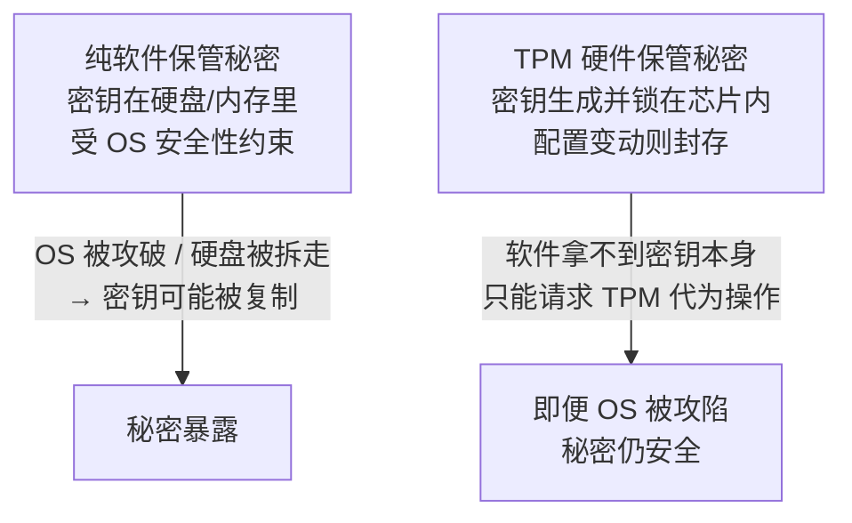
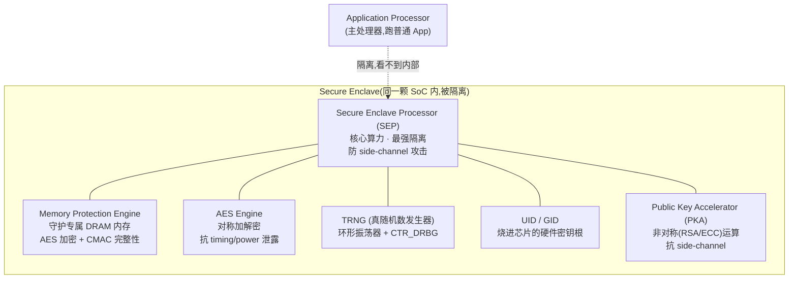
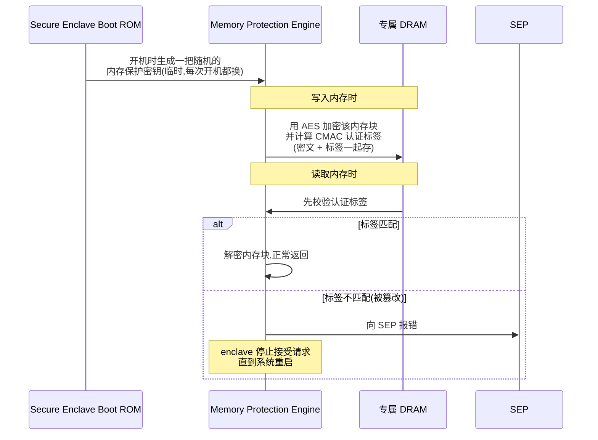
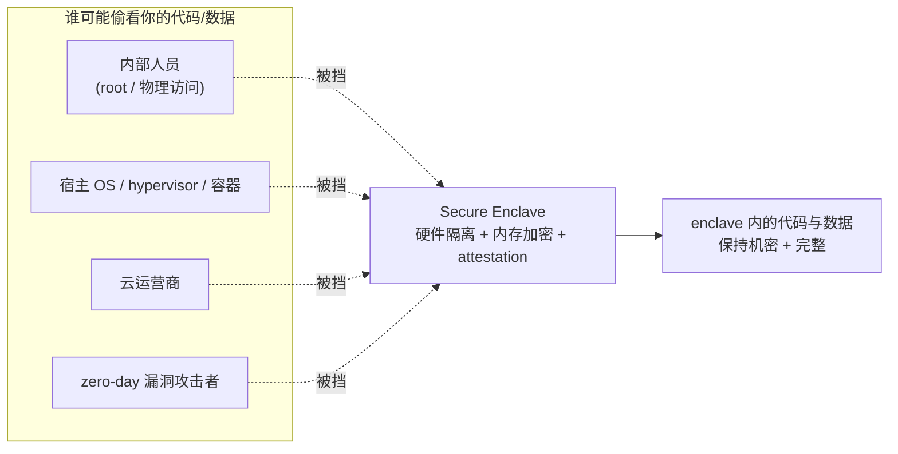
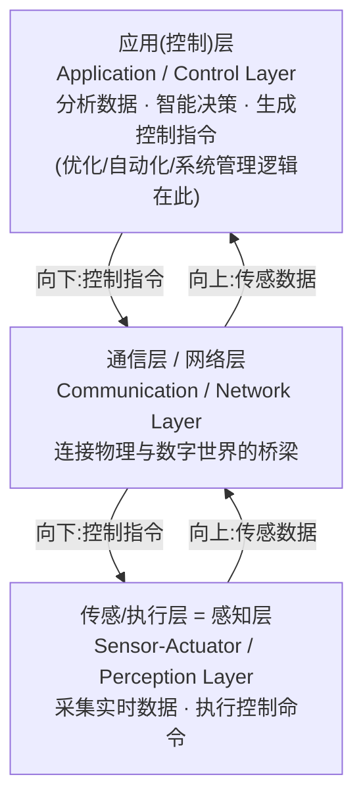
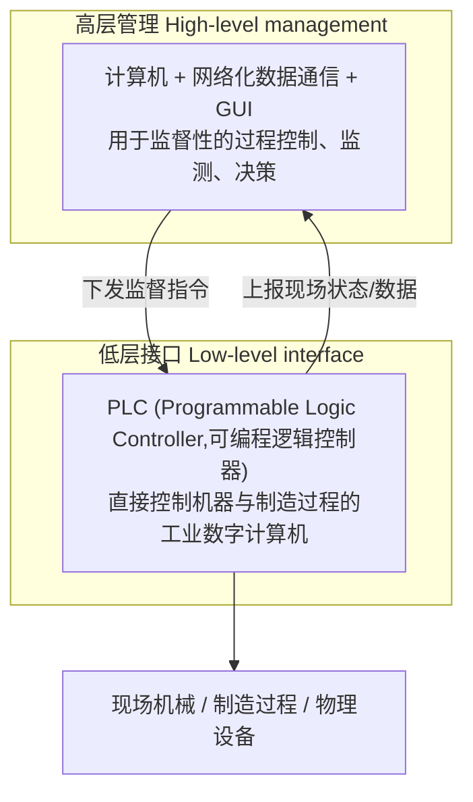
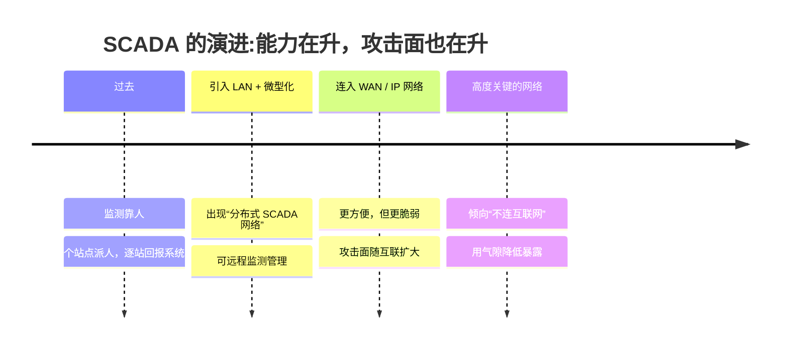
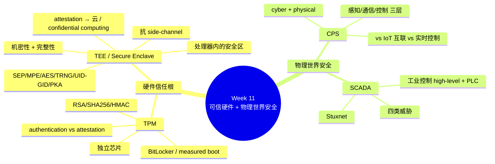

# Week 11 · 可信硬件与物理世界的安全 (TPM, Secure Enclave, CPS, SCADA Security)

> **关于周次的说明** — 这份讲义文件名是 **W11**,幻灯片标题写的是 **"Week 11 – TPM, Secure Enclave, CPS, SCADA Security"**(讲师 Dr. Steven Duong),所以本章就是 Week 11。配套的 **workshop(W11-Solutions)** 也标着 "Week 11 – Lab/Workshop",而且**内容与本章完全对应**——Part A 讲云中的 enclave(对应本章 TEE/Secure Enclave),Part B 是"丢失的笔记本与 TPM"场景(对应本章 TPM)。所以这周的 workshop 不像往常那样滞后一周,它就是本章内容的练习,非常值得一起过,我会把它的题目当作 worked example 融进正文。
>
> 还有两个**重要的考务提醒**(讲师在课上反复说):
> - **Quiz 3 在本周(Week 11)的 lab 进行**,范围是 **Week 7–10 的 lecture slides + workshops**(注意:**不含本章 Week 11**)。如果不能参加,要**提前申请 AC(academic consideration)**。这是本学期最后一次 quiz。
> - **Week 12 没有 lecture(讲师去日本开会,但会上传录像)、也没有 workshop;assignment 截止日为 5 月 29 日(周五)23:30**。迟交按 subject outline 每天扣 5%,迟交 4 天得 0 分。

> **学习目标 (Learning objectives)** — 读完本章你应该能够:
> - 解释为什么要把信任的根扎在**硬件**里,并说清 **TPM (Trusted Platform Module)** 是什么、解决了软件安全解决不了的什么问题;
> - 准确**区分 authentication(认证)与 attestation(证明/鉴证)**——这是本章最常考的一对概念;
> - 列举 TPM 的特征(OS-agnostic、TPM 2.0 用 RSA/SHA256/HMAC)和典型用例(BitLocker 全盘加密、数字签名、安全邮件、VPN/无线/凭据管理);
> - 解释什么是 **TEE (Trusted Execution Environment)**,它如何同时保护 **confidentiality(机密性)与 integrity(完整性)**,并能举出 **Intel SGX** 和 **Apple Secure Enclave** 两个实现;
> - **画出 Secure Enclave 的组件图**,说清 SEP、Memory Protection Engine(写入→AES 加密 + CMAC 标签;读出→验标签→解密或报错重启)、AES Engine、TRNG、UID/GID、PKA 各自的职责;
> - 解释 **side-channel attack(旁路攻击)** 为什么能绕过"数学上已证明安全"的密码算法,以及 Secure Enclave 用什么手段抵御它;
> - 解释 **attestation** 如何把信任扩展到远程/云端,以及 enclave 为什么能抵御 **insider attack(内部威胁)、zero-day、cloud operator 偷窥**;说清 workshop 强调的 **confidential computing(机密计算)= 保护"使用中(in use)"的数据**;
> - **定义 CPS (Cyber-Physical System)**,画出它的三层架构(perception / network / control),并能**逐条区分 CPS 与 IoT**;
> - **定义 SCADA**,说清它的两层结构(high-level management + PLC)、四类威胁(hackers / malware / terrorists / insiders),并能讲清 **Stuxnet** 为什么是里程碑式的攻击。

前面好几周,我们的注意力一直在**数据**和**软件**上:怎么加密数据、怎么防住网络攻击、怎么做隐私保护、怎么把服务搬上云。但这些防御有一个共同的、隐蔽的前提——**它们都假设"运行这些防御的那台机器本身是可信的"**。可如果攻击者已经攻破了操作系统、植入了 rootkit,那么你在软件里精心保管的密钥、你以为安全的加密,全都暴露在攻击者眼皮底下了。换句话说:**当软件本身可能被攻破时,把秘密交给软件保管,就像把保险箱钥匙锁在保险箱里。**

本章就是来补这块地基的,它分两条线、四个部分:

1. **把信任的根扎进硬件**——**TPM**(Part 1)是主板上一颗独立的安全芯片,**TEE / Secure Enclave**(Part 2)则是主处理器里一块被隔离出来的安全区域。两者的共同思想是:**做一个连操作系统都进不去的"硬件保险箱",把密钥和敏感运算关在里面**,这样即使整个 OS 被攻陷,秘密依然安全。
2. **把安全延伸到物理世界**——**CPS**(Part 3,赛博物理系统)和 **SCADA**(Part 4,工业控制系统)把计算机和**真实世界的机器**连在了一起。它们一旦被攻破,后果不再是"数据泄露",而是**断电、停水、核设施损坏**这样的物理灾难。

一条主线贯穿始终:**安全的根基必须比攻击者能触及的层次更低**——要么低到硬件(TPM/Enclave),要么把防御一路覆盖到物理设备(CPS/SCADA)。

---

## Part 1 · TPM:主板上的硬件信任根

### 1.1 为什么需要硬件:软件保管秘密的根本困境

先想清楚 TPM 要解决什么问题。假设你用一套**纯软件**的方案来保管磁盘加密密钥:密钥以某种形式存在硬盘或内存里,由操作系统负责取用。这套方案的命门在于——**它的安全性不可能高于操作系统本身的安全性**。一旦恶意软件拿到了管理员/root 权限,或者攻击者把硬盘拆下来插到另一台机器上读取,密钥就可能被复制走。讲师把这点说得很直白:软件层的安全措施"can be vulnerable to malware or remote attacks"。

解决思路是**把秘密挪到一个软件碰不到的地方去——硬件**。这就引出了本章的第一个主角:

> **TPM (Trusted Platform Module,可信平台模块)** — *一颗能安全存储用于认证平台(一台 PC 或笔记本)的"工件 (artifacts)"的计算机芯片(微控制器)*。这些工件可以包括**密码 (passwords)、证书 (certificates)、加密密钥 (encryption keys)**。

把这个定义拆开看几个要点:

- 它是一颗**专用芯片 (a dedicated chip / microcontroller)**,**通常嵌在电脑或笔记本的主板 (motherboard) 上**——它是物理独立的硬件,不是一段程序。
- 它存的是**敏感工件 (sensitive artifacts)**:密码、数字证书、密钥——这些都是认证和加密的命根子。
- 它的目标:**让系统和数据免遭未授权访问**,即使操作系统被攻破,芯片里的东西依然安全。

> 📎 **拓展(超出 slides,帮助理解)** — 为什么硬件就"碰不到"?TPM 是一颗独立的微控制器,有自己的处理逻辑和存储,密钥可以**生成于芯片内部、永不以明文离开芯片**。CPU 上的软件只能向 TPM"请求一个操作"(比如"用这把密钥解密这段数据"),却拿不到密钥本身。这就把"持有密钥"和"使用密钥"分开了——这正是硬件信任根的精髓,后面 Secure Enclave 的 UID 也是同一思想。

### 1.2 本章最重要的一对概念:Authentication vs Attestation

TPM 的定义里藏着两个**必须分清**的术语,讲师特别强调"attestation 比 authentication 更进一步",而 quiz 也专门考了 attestation。务必吃透这对区别。

> **Authentication(认证)** — *确保平台能够证明"它就是它所声称的那个东西"*(ensuring that the platform can prove that it is what it claims to be)。
>
> **Attestation(证明 / 鉴证)** — *确保一个平台是可信的、没有被攻破过*(ensuring that a platform is trustworthy and has not been breached)。

用一个类比把两者分开:**authentication 像查身份证**——证明"你是张三本人";**attestation 像体检报告**——证明"张三这个人现在是健康的、没被动过手脚"。讲师的原话是:authentication 验证设备**是合法的**(比如设备要连公司内网,先证明自己是台合法设备);attestation 则**再进一步**,证明这台设备**运行的软件没被篡改、配置没被改动过**。

两者都是"safer computing"的必要步骤,但回答的是不同的问题:

| 概念 | 回答的问题 | 关注点 | 类比 |
|------|-----------|--------|------|
| **Authentication** | "你是谁?" | **身份**——平台是不是它声称的那个 | 查身份证 |
| **Attestation** | "你现在可信吗?" | **状态/完整性**——平台有没有被篡改 | 出具体检报告 |

> 🔑 **例(QUIZ S8)** — *在 TPM 语境下,"attestation"指的是什么?* 答案是 **B. 验证平台的配置没有被改动 (Verifying that a platform's configuration has not been altered)**。注意区分干扰项:A"加密用户数据"是机密性、C"管理用户密码凭据"是凭据管理、D"加快启动速度"和 E"压缩文件"则与安全无关。记住口诀:**attestation 关心的是"完整性/有没有被改",不是"加密"也不是"管密码"。**

### 1.3 TPM 的动机与特征

**动机 (Motivation)。** TPM 依赖的是**硬件级密码学 (hardware-based cryptography)** 的天然属性:**存在硬件里的信息,比存在软件里更能抵御外部软件攻击**(包括 rootkit 这类高级威胁)。建立在 TPM 之上的应用,让"在没有授权的情况下访问设备上的信息"变得困难得多;而且——这点很关键——**如果平台配置因为未授权活动而发生了变化,这些应用可以拒绝访问、把数据和秘密"封存 (sealed off)"起来**。这就把"访问秘密的权利"和"平台配置的完整性"绑在了一起,正是 attestation 思想的落地。

**特征 (Characteristics)。** 讲师归纳了几条:

- **OS-agnostic(与操作系统无关)** — TPM 规范不绑定任何特定操作系统,Windows、macOS、Linux 都能用。各操作系统都有对应的**软件栈/库 (software stacks)**,让开发者把 TPM 集成进系统。
- **当前版本是 TPM 2.0**,它用到的密码算法是这三样(很可能是考点,记住这个组合):
  - **RSA** — 非对称算法,既能加密也能做签名(回忆 Week 3 密码学);
  - **SHA256** — 哈希函数,用于计算摘要;
  - **HMAC** — 基于哈希的消息认证码,保证消息的**完整性 + 认证**。
- **标准化历程**:TPM 的标准化由 **Trusted Computing Group** 推动,**始于 2009 年、2015 年完成**。如今已是现代计算设备(尤其企业环境)的标配。

### 1.4 TPM 的用例:从全盘加密到数字签名

抽象的"保护密钥"落到实处,讲师给了一串用例。把它们分成几组记:

**(1) 保护密码学过程中要用到的秘密——以数字签名为例。** 给文档或邮件做**数字签名 (digital signing)** 时,你需要用到**私钥 (private key)**。如果私钥存在普通内存里,恶意软件就有机会把它偷走或滥用。把私钥放进 TPM,签名运算在芯片内完成,私钥从不离开硬件——攻击者**想提取或滥用它就难得多**。

**(2) 保护关键任务应用 (mission-critical applications)。** 比如**安全邮件 (secure email)** 和**安全文档管理 (secure document management)**:借助 TPM,你能更确信"用来签署安全邮件的工件没有被软件攻击影响过"。

**(3) 开机时的可信度检查(measured boot,度量启动)。** 这是 TPM 最有特色的能力之一,直接体现 attestation:**系统启动时,TPM 会"度量"当前平台/系统的配置**。

> **🔑 例(讲师课堂原话场景)** — 如果在开机时发现一台 PC 因为**配置出现意外改动**而**不可信**,那么就可以**封锁对高安全应用的访问,直到问题解决为止**。换句话说:配置没变 → 允许启动;配置被改 → 阻止启动 / 拒绝释放密钥。这正是 §1.3 说的"把访问权和配置完整性绑定"。

**(4) 更广的应用领域。** 讲师列举(S6):**e-commerce(电商,保护客户支付信息)、citizen-to-government(公民对政府,如报税/投票门户)、online banking(网银,保护用户认证与交易完整性)、confidential government communications(政府机密通信)**。此外,硬件级安全还能增强一批我们熟悉的方案:**VPN、无线网络 (wireless networks)、文件加密(如微软的 BitLocker)、以及密码/PIN/凭据管理 (password/PIN/credentials' management)**。

> 🔑 **例(QUIZ S9 / S7)** — *TPM 在增强系统安全方面的一个常见应用是?* 答案是 **C. 为 BitLocker 这类全盘加密方案安全地存储加密密钥**(干扰项"跑虚拟机""管显示设置""加快下载""监控温度"都与 TPM 无关)。另一题 *TPM 的首要目的是?* 答案是 **C. 为存储认证工件提供基于硬件的安全 (hardware-based security for storing authentication artifacts)**——不是"云存储""加快网速""跑杀软""加密网络流量"。**抓住"硬件 + 存认证工件/密钥"这两个关键词,TPM 的题基本都能秒选。**

> 🔑 **本节考点提醒** — 讲师明说 TPM 这部分"**may appear in essay**",不只在 quiz 里。所以不仅要会选,还要能**用几句话讲清** TPM 是什么、authentication 与 attestation 的区别、以及它怎么和 BitLocker 配合。

### 1.5 Workshop 实战:丢失的笔记本与 TPM

W11 workshop 的 Part B 给了一个完整场景,把上面这些点串成了一道应用题——非常典型的 essay 题型,值得逐问过一遍。

> **🔑 Worked example(Workshop B,场景)** — 某教职员**丢失了一台校园笔记本**,里面有机密研究数据和保存的 VPN 凭据。该笔记本用了 **TPM 支持的全盘加密 (full disk encryption)**。
>
> **B.1 TPM 能起什么作用?** —— 安全地存储/保护**加密密钥**;支撑**全盘加密**;**检查启动环境是否可信**;**只有当平台处于预期状态时才释放秘密**;让攻击者难以从设备里提取密钥。
>
> **B.2 TPM 可能保护哪些秘密/工件?** —— 磁盘加密密钥、认证密钥、证书、密码或由密码派生的秘密、**VPN 凭据**、签名密钥、用于 attestation 的平台度量值 (platform measurements)。
>
> **B.3 为什么 TPM 比"把密钥直接存在磁盘上"更强?** —— 因为密钥直接存盘有诸多风险:攻击者可以**把硬盘拆下来插到别的设备上读取**、复制密钥文件、用恶意软件搜刮秘密、绕过操作系统。而 TPM 更强在于:**密钥由硬件保护、秘密可绑定到平台状态、软件攻击者无法简单地从盘上把密钥拷走、全盘加密密钥只在"可信启动检查"通过后才释放。**
>
> **B.4 如果笔记本的启动配置被改动了,应该发生什么?** —— TPM 支持的系统应**检测到这个意外改动,并拒绝自动释放被保护的秘密**。可能的结果:要求输入**恢复密钥 (recovery key)**、阻止访问加密数据、把设备标记为不可信、需要管理员介入调查。(这正是 §1.4 measured boot 的实战体现。)
>
> **B.5 TPM 能防住所有数据泄露吗?** —— **不能。** TPM 有用,但不是万能。仍然存在的风险包括:**用户选了弱密码**、攻击者在笔记本**已解锁状态下**偷走它、数据被同步到了不安全的云账号、在丢失之前恶意软件**早已外泄**了数据、钓鱼骗走了 VPN 凭据、访问控制配置错误导致可被远程访问。

B.5 这一问尤其重要,它点破了一个贯穿全章的道理:**硬件信任根只保护"它负责的那一段"**——密钥在硬件里很安全,但如果秘密在进入硬件保护之前、或离开之后泄露了,TPM 也无能为力。这个"只保护边界内、边界外照样脆弱"的思想,在 Part 2 的 enclave 局限性里会再次出现。

### 本节小结(TPM)

- **TPM 是主板上一颗独立的安全芯片**,用硬件保管密码、证书、密钥等敏感工件,即使 OS 被攻破也难以被提取。
- **Authentication = "你是谁"(身份);Attestation = "你现在可信吗"(配置/完整性没被改)。** 这是本章最高频考点。
- **TPM 2.0 用 RSA + SHA256 + HMAC;标准化 2009 起、2015 完成。**
- 典型用例:**BitLocker 全盘加密、数字签名、安全邮件、measured boot、VPN/无线/凭据管理**;领域覆盖电商、政务、网银。
- TPM 把"访问秘密的权利"绑定到"平台配置完整性":**配置一变就封存秘密**;但它只保护边界内的密钥,**弱密码、已解锁被盗、提前外泄等仍防不住**。

---

## Part 2 · TEE 与 Secure Enclave:处理器里的安全飞地

### 2.1 从独立芯片到处理器内的"安全区":TEE 的概念

TPM 是主板上一颗**独立芯片**,这很安全,但也意味着它和主处理器之间要通信、能力相对受限。有没有可能**直接在主处理器内部划出一块被隔离的安全区**,让敏感运算就地、高速地在保护下进行?这就是 **TEE** 的思路。

> **TEE (Trusted Execution Environment,可信执行环境)** — *主处理器中的一块安全区域,帮助加载到其中的代码和数据,在**机密性 (confidentiality) 与完整性 (integrity)** 两方面得到保护*。

讲师用了个很形象的比喻:把 TEE 想成处理器里一个**"小金库 (a small vault / walled place)"**,所有敏感操作都关进这个小金库里完成,与系统其余部分隔开,因此能抵御恶意软件、甚至操作系统本身、乃至某些硬件攻击。它的两层保护:

- **机密性 (confidentiality)** — TEE **外部**的未授权实体(包括恶意软件、未授权用户)**读不到** TEE 内的数据。比如密钥放进 TEE,即使主 OS 被攻陷,它仍然保密。
- **完整性 (integrity / code integrity)** — TEE 内的代码**不能被未授权实体替换或修改**;可以验证里面的软件确实是它应该是的样子,没被注入恶意代码。

**实现 TEE 的产品 (S10):**

| 产品 | 厂商 | 是什么 |
|------|------|--------|
| **SGX (Software Guard Extensions)** | Intel | 内建在某些 Intel CPU 里的一组安全相关指令,让开发者开辟一块叫 **enclave** 的受保护内存区,即使系统其余部分被攻破,敏感数据也能在里面安全处理 |
| **Secure Enclave Processor (SEP)** | Apple | Apple 设备(iPhone、Mac)里的专用安全处理器,处理指纹/Face ID 等生物特征、密钥管理、安全启动验证(下面详讲) |

注意术语:**"enclave(飞地)"是 TEE 思想的具体落地**——一块"虽在主处理器之内、却独立于其余部分"的安全领地。下面以 Apple 的 Secure Enclave 为例深入。

### 2.2 Secure Enclave 总览

> **Secure Enclave** — *集成进 Apple 片上系统 (SoC) 的一个专用安全子系统*。

先解释 **SoC (System on Chip,片上系统)**:一块把多个部件**集成到单颗芯片**上的集成电路(IC)。在 Apple 的 SoC 里,**应用处理器 (Application Processor)、Secure Enclave、以及其他协处理器**都是这颗 SoC 上的组件。也就是说,Secure Enclave 和你平时跑 App 的主处理器**住在同一颗芯片上,却是彼此隔离的两个世界**。

Secure Enclave 提供:

- **CPU 硬件级的隔离 (hardware-level isolation) 与内存加密 (memory encryption)** — 它把应用代码和数据从"任何拥有特权的人"那里隔离开,并对自己的内存加密。**关键含义:连主操作系统都看不到 enclave 里面是什么。**
- **配合额外软件,还能加密存储 (storage) 和网络 (network) 数据**——把保护从"芯片内"延伸到落盘和传输。

### 2.3 Secure Enclave 的组件:一张图看懂

这是本章信息量最大、最值得画图的部分。Secure Enclave 不是单块铁板,而是由若干专用硬件块组成,各司其职:

逐个组件讲清楚。

**(a) Secure Enclave Processor (SEP) —— enclave 的核心算力。** 它是 Secure Enclave 的主处理器,专门提供**最强的隔离 (the strongest isolation)**。隔离的目的之一是**防止 side-channel attacks(旁路攻击)**——这类攻击依赖"恶意软件与被攻击的目标软件**共用同一个执行核心 (execution core)**"。SEP 自带一整套安全设施:**内存保护引擎 (memory-protected engine)、带防重放 (anti-replay) 能力的加密内存、安全启动 (secure boot)、专用随机数发生器、以及 AES 引擎**。它日常负责的就是 Touch ID / Face ID、Apple Pay、设备密钥管理这类最敏感的活儿。

> 📎 **拓展(超出 slides,但讲师在课上重点解释)—— 什么是 side-channel attack,为什么它能绕过"已证明安全"的算法?**
> 我们在 Week 3 学过,像 RSA、AES 这些密码算法在**数学上是可证明安全的**。但讲师强调:**"数学上安全"不等于"用起来就安全"**。算法在真实硬件上运行时,会**泄露与秘密相关的物理信息**——比如运算**耗时多久 (timing)**、**功耗多大 (power)**、缓存行为如何。攻击者不去硬碰数学,而是**测量这些"旁路"信号反推出密钥**。这就是 side-channel attack。所以 SEP/AES Engine/PKA 都被特别设计成"运算时不因数据不同而泄露 timing/power 差异"。**记住这条因果链:算法证明安全 → 实现可能泄露 timing/power → side-channel 攻击 → 所以要用专门设计的硬件来抗泄露。**

**(b) Memory Protection Engine —— 守护 enclave 的专属内存。** SEP 在设备 DRAM 里有一块**专属内存区**,Memory Protection Engine 用多层保护把它和应用处理器隔开。它的工作流程是本章的一个细节考点,务必记住这套"写入—读出"协议:

把这套协议用一句话记住:**开机生成临时密钥 → 写入时"AES 加密 + CMAC 标签" → 读出时先验标签:匹配才解密,不匹配就报错并冻结到重启。** 加密保的是**机密性**,CMAC 标签保的是**完整性/防篡改**;"不匹配就冻结到重启"则提供了防篡改的强响应。

> 🔑 **例(QUIZ S24)** — *下列哪一项 NOT 属于 Secure Enclave 的内存保护过程?* 答案是 **C. 硬件防火墙集成 (Hardware firewall integration)**。其余四项——加密内存存储、CMAC 认证、为内存写入做 AES 加密、开机生成临时内存保护密钥——**都是上面这套协议的真实步骤**。讲师特别点明:enclave 的保护**靠的是密码学隔离和硬件级访问控制,不靠防火墙**。

**(c) AES Engine —— 对称加密的硬件块。** 用 AES 做对称加解密,**设计上抗 timing 与 power 分析泄露**。它支持两种密钥:**硬件密钥 (hardware keys)**——从 Secure Enclave 的 **UID 或 GID** 派生,**OS 和应用都拿不到**;以及**软件密钥 (software keys)**——由 enclave 为应用层加密生成和管理。

**(d) TRNG (True Random Number Generator,真随机数发生器)。** 用来生成安全的随机数据——随机密钥、密钥种子、其它熵都靠它。讲师强调:**随机数在密码学里至关重要**(可预测的"随机"会让整套加密垮掉)。它基于**多个环形振荡器 (ring oscillators)**,再用 **CTR_DRBG**(一种基于分组密码计数器模式的算法)做后处理。

**(e) UID 与 GID —— 硬件密钥的根。** 这是理解"为什么 enclave 的秘密连 Apple 都拿不到"的关键。

| 密钥 | 含义 | 谁能知道 | 关键性质 |
|------|------|----------|----------|
| **UID (Unique ID,设备唯一 ID)** | 随机生成、**每台设备独有**的秘密密钥 | **谁都不知道**——连 Apple、制造商、供应商都看不到 | 制造时由 enclave 的 TRNG 生成并**烧进芯片熔丝 (fused)**,整个过程在 enclave 内完成,OS 读不到,**永不离开设备** |
| **GID (Group ID,设备组 ID)** | **同一芯片家族所有设备共用**的密钥 | Apple 知道,但软件仍读不到 | 用于兼容设备间的安全通信/共享加密标准,仍由硬件保护 |

这两把**硬件密钥**构成设备级密码学安全的基础:它们保证**加密数据被"锁死"在这台设备上**,即使芯片被从工厂拿走、或被物理拆解提取,也解不开。

> 🔑 **例(QUIZ S25)** — *哪一把密钥是每台设备唯一、且永不离开 Secure Enclave 的?* 答案是 **D. Secure Enclave Unique ID (UID)**。GID 是"组共享"所以不是唯一;其余选项是干扰。**口诀:UID = Unique = 每台唯一 + 永不外泄。**

**(f) Public Key Accelerator (PKA) —— 非对称运算的硬件块。** 专门高效、安全地做**公钥(非对称)密码运算**,支持 **RSA 与 ECC (Elliptic Curve Cryptography,椭圆曲线密码学)** 的签名和加密。和 AES Engine 一样,它**被设计成抗 timing 与 side-channel 泄露**,既能用软件密钥也能用从 UID/GID 派生的硬件密钥。用途:数字签名、安全密钥交换、加密通信。

> 🔑 **例(QUIZ S27)** — *哪个硬件特性帮助 Secure Enclave 在密码运算时抵御 timing 与 side-channel 攻击?* 课堂上讨论过这题的"坑":**AES Engine 和 PKA 都被设计成抗泄露**,看起来像两个正确答案。讲师的辨别方法很实用——**看题目说的是哪种运算**:对称密钥运算 → 选 **AES Engine (D)**;公钥/非对称运算 → 选 **PKA (C)**。本题标准答案按 slide 取 **C. PKA**(对应"公钥运算抗 side-channel")。**这个"按运算类型对号入座"的方法要记住。**

### 2.4 部署、Attestation 与对企业/云的影响

**部署 (S19)。** Secure Enclave 类技术早已不是 Apple 专属:**Apple SoCs(A8–A14、S3–S6、M1–M4,讲师补充现在已到 M5/A15+);AMD 的 SEV (Secure Encrypted Virtualization,内建于 Epyc 芯片);AWS 的 Nitro Enclaves;以及 Microsoft Azure、VMware、Google** 等也都提供了 enclave 能力。**记住这个趋势:enclave 正从手机/PC 扩展到云平台**——这是下面 workshop "云中 enclave"的现实基础。

**Attestation(再次登场,这次面向远程)。** Part 1 的 attestation 是"本机证明自己没被改";到了 enclave,它升级成**面向远程方的证明**:

> **Attestation(Secure Enclave 语境)** — *一个让 enclave 能向**远程方 (remote party)** 证明"自己运行所在的硬件是货真价实的 (genuine)"、并**证明 enclave 内存完整性 (integrity)** 的过程*。

它的意义:Secure Enclave 不只在本地保护数据,还能在数据/操作**跨网络通信**时建立信任。由此带来两个强保护:

- **抵御内部威胁 (insider attacks)** — 即使内部人员拥有 **root 权限或物理访问**,也**进不去 enclave 内存**;连 guest OS、hypervisor、host OS 上的特权用户都被挡在外面。
- **抵御 zero-day(零日漏洞)** — 因为 enclave 内的应用**在任何权限层级上都与宿主 OS 隔离**,即使 OS、hypervisor 或容器软件被攻陷,enclave 里的东西依然安全。

**对企业与云安全的影响 (S21–S22)。** 把上面两点放到现实场景:

- 企业 IT:enclave 能**挡住内部人员的恶意行为,同时不妨碍他们做本职工作**——"insiders are blocked from taking malicious actions but still able to do their jobs"。
- 云安全:在自建云/数据中心里,恶意内部人员有可能**拷贝敏感数据、偷走硬盘**;而且通常**云端软件在使用数据时,数据是不受保护的**(它得先解密才能算)。但有了 Secure Enclave,**连云运营商都无法窥视云租户正在执行的代码**——"even cloud operators cannot peer into the code being executed by a cloud consumer"。

> 🔑 **例(QUIZ S23 / S26)** — 两道直接考定义的题:
> - *Secure Enclave Processor (SEP) 的首要功能是?* 答案 **C. 把敏感数据与操作从主处理器隔离开 (isolate sensitive data and operations from the main processor)**——不是管 App 权限、不是图形渲染、不是控制蓝牙/Wi-Fi、也不是管电池。
> - *attestation 在 Secure Enclave 语境下的目的是?* 答案 **C. 向远程方证明 enclave 是货真价实、未被修改的 (prove to a remote party that the enclave is genuine and unmodified)**。注意别被"加密数据再同步 iCloud""只让 Apple 认证的 App 运行""授权固件更新""检测应用处理器里的恶意软件"带偏——**attestation 的关键词永远是"向远程方证明真实性与完整性"**。

### 2.5 Workshop 实战:云中的 Enclave 与"机密计算"

W11 workshop 的 Part A 把 enclave 放进云的语境,提出了一个非常重要、且很可能进 essay 的概念——**confidential computing**。逐问过一遍:

> **🔑 Worked example(Workshop A,云中 enclave)**
>
> **A.1 TEE/enclave 在高层次上怎么描述?** —— 一个**受保护的执行环境**,其中代码和数据**与系统其余部分隔离**。
>
> **A.2 为什么"云计算的主导地位"是 TEE 兴起的关键驱动力?** —— 因为**云是一个多方环境 (multi-party environment)**:租户的代码和数据,跑在**由云提供商掌控、且与其他租户共享**的基础设施上。TEE 之所以吸引人,是因为它能把租户的数据与计算,从这几方手里隔离开:**①云提供商;②其他租户;③特权软件(OS / hypervisor);④与系统交互的外部方。**
>
> **A.3 这里的 confidential computing(机密计算)是什么意思?** —— **保护"正在被处理 (in use)"的数据**,而不只是存储和传输时的数据。
>
> **A.4 enclave 怎样让云租户受益?** —— **机密性**:数据和代码可对云提供商隐藏、其他租户看不到、连特权软件都被挡住;**完整性**:可确保跑的是预期代码、数据/计算未被篡改、用 **remote attestation** 给出"enclave 货真价实且配置正确"的证据;**敏感工作负载**:金融记录、健康数据、身份数据、机密商业分析、在敏感数据集上做机器学习、密钥管理。
>
> **A.5 用 enclave 跑云端分析/机器学习如何帮助处理敏感数据?** —— 云端 ML 通常要处理大量敏感数据,而**正常情况下数据在处理时得先解密,这就制造了风险**。用 enclave 则:敏感数据在隔离环境内处理、提供商不见明文、租户在发送密钥/数据前可先做 **remote attestation**、enclave 同时保护数据和模型代码、完整性保证可证明"确实执行了预期分析"。**例子**:医院想用云资源在患者数据上跑 ML,enclave 能在分析进行时保护患者数据。
>
> **A.6 为什么 TEE/enclave 并不能自动解决所有云安全/合规问题?(至少两条)** —— ①TEE **只保护 enclave 内部**,外面的代码和数据照样脆弱;②**enclave 里的代码若本身有 bug,enclave 只是把"坏的计算"保护了起来**;③**side-channel 攻击仍可能存在**(timing、cache、power 等);④**可信计算基 (Trusted Computing Base) 过大会降低保证**——塞太多软件进 enclave 就更难验证可信;⑤**TEE 不免除法律/组织义务**(访问控制、策略、审计、治理、合规仍要做);⑥**实现与配置很关键**,配错了照样不安全。

这里有个**贯穿全章的"三态数据"框架**,务必记牢——它把 confidential computing 的价值讲清楚了:

| 数据状态 | 传统保护手段 | 谁来保护 |
|----------|-------------|----------|
| **At rest(静止/存储)** | 加密存储(如全盘加密、TPM 保管密钥) | 传统加密 |
| **In transit(传输中)** | TLS / VPN(回忆 Week 4) | 传统加密 |
| **In use(使用中)** | **以前几乎没有保护**——数据必须解密才能计算 | **TEE / enclave →这就是 confidential computing 补上的一环** |

A.6 再次呼应了 Part 1 B.5 的那条道理:**硬件保护只覆盖"边界之内",而且本身有局限**(代码 bug、side-channel、TCB 过大、配置错误)。这是 enclave 这一节最值得带进考场的批判性结论——**enclave 强大,但不是银弹**。

### 本节小结(TEE / Secure Enclave)

- **TEE 是主处理器内一块被隔离的安全区**("处理器里的小金库"),同时保护**机密性**(外部读不到)与**完整性**(内部代码不被篡改);实现有 **Intel SGX、Apple SEP**。
- **Secure Enclave 是 Apple SoC 上的专用安全子系统**,连主 OS 都看不到它内部;由 **SEP、Memory Protection Engine、AES Engine、TRNG、UID/GID、PKA** 组成。
- **内存保护协议**:开机生成临时密钥 → 写入"AES 加密 + CMAC 标签" → 读出先验标签,匹配才解密、不匹配就报错冻结到重启(它**不靠硬件防火墙**)。
- **UID = 每台唯一、永不离开芯片、连 Apple 都不知道;GID = 芯片家族共享**。AES Engine 与 PKA 都被设计成**抗 side-channel(timing/power)**——对称运算找 AES Engine,公钥运算找 PKA。
- **Attestation 把信任扩展到远程/云**:enclave 能向远程方证明硬件为真、内存完整;由此挡住 **insider、特权软件、zero-day、云运营商**。
- **Confidential computing = 保护"使用中(in use)"的数据**,是云中 enclave 的核心价值;但 enclave **只保护边界内、对 side-channel/代码 bug/配置错误无能为力,也不免除合规义务**。

---

## Part 3 · CPS:当计算遇上物理世界

### 3.1 从"保护数据"到"保护物理过程"

到这里,叙事发生一次重要转向。前两部分仍在保护**信息**(密钥、代码、数据);从 Part 3 起,安全的对象变成了**真实世界的物理过程**——发电、行车、医疗设备。把这两个世界缝合在一起的系统,就叫 CPS。

> **CPS (Cyber-Physical System,赛博物理系统)** — *一种通过现代计算与通信技术,把**赛博 (cyber) 组件**(软件、网络、处理器)和**物理 (physical) 组件**(传感器、机械系统)高效整合在一起的系统*。

CPS 的核心在于**强调 cyber 与 physical 之间的交互**,目标是:**借助 cyber 组件,让对物理组件的监测 (monitoring) 与控制 (control) 变得安全 (secure)、高效 (efficient)、智能 (intelligent)**。讲师给的例子很直观:**自动驾驶汽车、智能电网 (smart grid)、工业控制系统、医疗设备**——它们都在"实时地、根据物理世界的反馈做决策并施加控制"。

### 3.2 CPS 的三层架构

CPS 通常由**三层**构成,这是一个清晰的考点结构,配一张图记最牢:

逐层说清职责:

- **传感/执行层(perception layer,感知层)** — 用**传感器 (sensors)** 采集物理环境的**实时数据**,并通过**执行器 (actuators)** 执行控制命令。它是 CPS 的"手和眼"。
- **通信层(network layer,网络层)** — 充当物理世界与数字世界之间的**桥梁**:把传感数据**向上**送到应用层,把控制命令**向下**送到感知层。
- **应用层(control layer,控制层)** — 分析上来的数据、做**智能决策**、生成相应的控制动作。优化、自动化、系统管理的逻辑都在这一层。

记忆要点:**数据自下而上、指令自上而下**,中间靠通信层来回搬运。

### 3.3 CPS vs IoT:像,但不一样

CPS 听起来很像 **IoT (Internet of Things,物联网)**——都是传感器、网络、智能服务。讲师专门花篇幅辨析,因为这是高频考点。先看它们**共同**的地方,再看**根本差异**。

**相同点 (S30):** 两者都想实现**赛博世界与物理世界的交互**;都能**通过传感设备、无需人工输入**地测量物理组件的状态;状态信息都能**经有线/无线网络**传输共享;分析之后都能提供**安全、高效、智能**的服务;应用领域也高度重叠(**smart grid、smart transportation、smart city** 等)。

**根本差异 (S31–S32):** 关键在于**各自的"主心骨"不同**——IoT 的核心词是**互联 (interconnection)**,CPS 的核心词是**实时控制 (real-time control)**。

| 维度 | **IoT(物联网)** | **CPS(赛博物理系统)** |
|------|------------------|------------------------|
| **本质** | 一种**网络基础设施**,把海量设备连起来监测和控制 | 一个**自包含的系统**:机器人、无人机、自动驾驶车 |
| **核心概念** | **互联 (interconnection)**——跨异构网络做数据采集、资源共享、分析、管理 | **任务执行 + 实时响应**——传感器与执行器间的快速决策 |
| **架构** | **水平架构 (horizontal)**——要整合各 CPS 应用的通信层来实现互联 | **垂直架构 (vertical)**——聚焦优化系统**内部**交互,而非全局互联 |
| **互联是否必需** | 是核心目标 | **重要,但不是强制 (not mandatory)**——许多 CPS 可独立运行 |
| **侧重** | 连接性与规模 (connectivity & scale) | 精确性与控制 (precision & control) |
| **关系** | —— | **CPS 是 IoT 与工业互联网 (Industrial Internet) 的基础** |

一句话抓住区别:**IoT 是"把很多设备连成网"(强调连接与规模);CPS 是"一个能实时控制物理过程的系统"(强调速度与精度),它常常作为 IoT 的底层基础。**

> 🔑 **例(QUIZ S33)** — *下列哪项最能描述 CPS 的主要目标?* 答案是 **B. 用计算系统对物理过程进行实时控制 (execute real-time control of physical processes using computational systems)**。干扰项 A"把上百万设备连上网"恰恰是**IoT**的描述,C"把传感数据存上云"、D"提供娱乐内容"都偏。**看到"real-time control of physical processes"=CPS,看到"connect millions of devices"=IoT。**
>
> 🔑 **例(QUIZ S34,True/False)** — *"CPS 系统总是需要与其他设备互联才能正常工作。"* 答案是 **False**。讲师解释:有了互联**能增强** CPS 的能力,但**许多 CPS 被设计成可独立运行**。这正对应上表"互联重要但不强制"。

### 本节小结(CPS)

- **CPS 把 cyber(软件/网络/处理器)和 physical(传感器/机械)整合**,目标是安全、高效、智能地**监测和控制物理过程**;例子有自动驾驶、智能电网、工控、医疗设备。
- **三层架构:感知层(传感器/执行器)→ 通信层(网络桥梁)→ 控制层(分析决策)**;数据自下而上,指令自上而下。
- **CPS vs IoT**:IoT 核心是**互联**(水平架构、连接规模),CPS 核心是**实时控制**(垂直架构、精确控制),**CPS 对互联"重要但非必需",且是 IoT/工业互联网的基础**。

---

## Part 4 · SCADA:守护关键基础设施

### 4.1 SCADA 是什么:工业世界的指挥中枢

CPS 给了我们"计算 + 物理"的通用框架。把它落到**工厂、电厂、水处理厂**这类**关键基础设施 (critical infrastructure)** 上,业界用得最广的具体架构就是 SCADA。

> **SCADA (Supervisory Control and Data Acquisition,监控与数据采集)** — *一种用于**控制工厂、电厂等场所的工业过程与自动化**的控制系统架构*。

SCADA 在两个层面上运作,理解这两层就理解了 SCADA 的骨架:

- **高层管理 (High-level management)** — 由**计算机、网络化数据通信、图形界面 (GUI)** 组成,负责监督性的过程控制、监测和决策。这是操作员看的"大屏"。
- **低层接口 (Low-level interface)** — 由**外围设备 (peripheral devices)**,尤其是 **PLC (Programmable Logic Controller,可编程逻辑控制器)** 组成。**PLC 是用于控制制造过程的工业数字计算机**,直接连着现场的机器。

合起来,SCADA 让人能**实时监测和控制关键基础设施**,以最少的人工干预保证工业安全、高效地运转。也正因为它管的是命脉,所以是**极高价值的攻击目标**。

### 4.2 SCADA 面临的威胁:四类攻击者

SCADA 网络一旦被攻破,可以**迅速瘫痪关键基础设施的任意一环,后果是毁灭性的**。讲师把威胁来源归为四类——这是一个清晰的列举型考点:

| 威胁 | 动机 / 特点 | 危害方式 |
|------|------------|----------|
| **Hackers(黑客)** | 有恶意意图的个人或团体,常**图谋不正当利益** | 拿到关键 SCADA 组件的访问权后,可制造从**服务中断**到**网络战 (cyber warfare)** 不等的混乱 |
| **Malware(恶意软件)** | 病毒、间谍软件、勒索软件 | 即使不直接针对 SCADA 协议本身,也能危害**支撑 SCADA 的基础设施**,包括用于监控管理 SCADA 的**移动 SCADA 应用** |
| **Terrorists(恐怖分子)** | 与图利的黑客不同,**只求制造最大的混乱与破坏** | 攻击电网/水系统等可造成大范围、严重后果 |
| **Employees(内部人员)** | **内部威胁可能和外部威胁一样有破坏力**:从无心的人为失误,到心怀不满的员工/承包商的蓄意行为 | **人为失误仍是主要漏洞之一**;SCADA 安全必须把这类风险纳入考量 |

记忆口诀:**黑客图利、恶意软件搭车、恐怖分子求乱、内部人员(失误或蓄意)**——四类各有不同动机,但都能威胁基础设施。

### 4.3 SCADA 安全的演进与 Stuxnet

> **SCADA Security** — *保护 SCADA 网络、使其免遭网络威胁、系统故障与未授权访问的实践*。

理解 SCADA 安全,最好顺着它**为什么会越来越危险**的历史看(这条演进线本身是个考点):

- **过去**:监测 SCADA 的唯一办法是**在每个站点派人**,人工把各系统的状态报回来。
- **LAN + 系统微型化之后**:出现了**分布式 SCADA 网络 (distributed SCADA network)**,可以远程监测和管理。
- **接入基于 IP 的 WAN 之后**:SCADA 网络变得**更脆弱**——联网带来便利,也把攻击面打开了。所以**一些高度关键的 SCADA 网络索性不连互联网**(用"气隙 (air gap)"思路把暴露降到最低)。

但"不连互联网"并不等于绝对安全,这就引出 SCADA 安全史上最著名的案例:

> **🔑 案例(S39)——Stuxnet(震网)。** 一次针对 SCADA 网络的高规格攻击。它**专门设计来感染用于 SCADA 过程控制的西门子 (Siemens) PLC**,并对伊朗的核设施造成了**真实的物理损害**。Stuxnet 的里程碑意义在于:它证明了**网络攻击可以跨过数字世界,直接破坏物理设备**——哪怕目标系统并不直接连着互联网。这正是本章"安全必须延伸到物理世界"主线的最有力注脚。

> 📎 **拓展(讲师课堂的直觉例子)** — 为什么 SCADA 安全值得如此重视?讲师让大家想象:如果一座城市或整个国家**断电几天**会怎样?最先出问题的可能是**交通**——红绿灯全灭,马路立刻瘫痪;而这只是一个小例子,其它联网的关键基础设施一旦被攻击,会引发连锁的严重问题。**把"数据泄露"和"全城停电/停水"放在一起对比,就能体会 CPS/SCADA 安全和前面几周"信息安全"的根本区别——这里的代价是物理世界的。**

> 🔑 **例(QUIZ S40)** — *SCADA 系统在工业环境中的首要功能是?* 答案是 **B. 对工业过程进行实时监测与控制 (real-time monitoring and control of industrial processes)**:从传感器和设备采集数据 → 送到中央控制器 → 常常还支持对物理系统的远程控制。干扰项"加密用户数据""延长电池""管理办公文档""消费级数据分析"都不是 SCADA 的本职。

### 本节小结(SCADA)

- **SCADA = 监控与数据采集**,是控制工厂/电厂等工业过程的架构,分**高层管理(计算机+GUI)和低层接口(PLC)** 两层;**PLC 是直接控制机器的工业数字计算机**。
- **四类威胁:hackers(图利)、malware(搭车危害支撑设施)、terrorists(求最大破坏)、employees(失误或蓄意的内部威胁)**。
- SCADA 从"派人逐站监测"演进到"分布式 + 接入 WAN/IP",**联网带来便利也带来脆弱**;最关键的网络倾向于**不连互联网**。
- **Stuxnet** 感染西门子 PLC、损坏伊朗核设施,证明**网络攻击能造成物理破坏**——这是 SCADA/CPS 安全必须被认真对待的根本原因。

---

## 全章总结:四块拼图如何连成一条线

把本章四部分放回开头那条主线——**信任的根要么扎到硬件,要么覆盖到物理世界**:

**一句话串起来:** 软件可能被攻破,所以我们把秘密下沉到**硬件信任根**——独立的 **TPM** 芯片和处理器内的 **Secure Enclave**,用隔离、加密和 **attestation** 守住密钥与敏感运算,并把这种信任经 **confidential computing** 扩展到云;而当计算开始驱动物理世界(**CPS**)、尤其是关键基础设施(**SCADA**)时,安全的失败代价从"数据泄露"升级为"物理灾难",**Stuxnet** 就是血的教训。两条线的共同信念是:**真正的安全,其根基必须比攻击者所能触及的层次更低、覆盖面比纯信息更广。**

## 本章必记清单 (Key takeaways)

1. **TPM 是主板上的独立安全芯片**,用硬件保管密码/证书/密钥,即使 OS 被攻破也难被提取;TPM 2.0 用 **RSA + SHA256 + HMAC**,标准化 2009–2015。
2. **Authentication = "你是谁"(身份);Attestation = "你现在可信吗"(配置/完整性没被改)**——本章最高频考点,务必背准。
3. TPM 典型用例:**BitLocker 全盘加密、数字签名、安全邮件、measured boot、VPN/无线/凭据管理**;它把"访问秘密"绑定到"配置完整",但**只护边界内**(弱密码、已解锁被盗等防不住)。
4. **TEE 是主处理器内被隔离的安全区**,同时保护**机密性 + 完整性**;实现有 **Intel SGX、Apple Secure Enclave (SEP)**。
5. **Secure Enclave 组件**:SEP(最强隔离/抗 side-channel)、Memory Protection Engine(写=AES 加密+CMAC 标签,读=验标签否则报错冻结到重启,**不靠防火墙**)、AES Engine、TRNG(环形振荡器+CTR_DRBG)、**UID(每台唯一/永不外泄)与 GID(芯片家族共享)**、PKA(公钥运算)。
6. **Side-channel attack**:算法数学上安全 ≠ 实现安全,攻击者靠测 **timing/power** 反推密钥;AES Engine 与 PKA 都被设计成抗泄露(对称→AES Engine,公钥→PKA)。
7. **Attestation 把信任扩展到远程/云**,挡住 insider、特权软件、zero-day、云运营商;**Confidential computing = 保护"使用中(in use)"的数据**,但 enclave 对 side-channel/代码 bug/配置错误无能为力,也不免除合规义务。
8. **CPS** 整合 cyber 与 physical,**三层架构(感知/通信/控制)**;**CPS 重实时控制(垂直)、IoT 重互联(水平)**,CPS 对互联"重要但非必需",是 IoT 的基础。
9. **SCADA** 控制工业过程,分 **high-level management 与 PLC** 两层;**四类威胁:hackers/malware/terrorists/employees**。
10. **Stuxnet 感染西门子 PLC、破坏伊朗核设施**,证明网络攻击可致物理破坏——这是 CPS/SCADA 安全的根本动因。

---

> **考务备忘(再强调一遍)** — **Quiz 3 本周 lab 进行,范围 Week 7–10(不含本章 Week 11)**,不能参加请提前申请 AC。**Week 12 无 lecture/无 workshop,assignment 5 月 29 日(周五)23:30 截止**,迟交每天扣 5%、迟 4 天 0 分。本章(Week 11)虽不在 Quiz 3 范围,但 TPM 与 enclave 讲师明说"may appear in essay",仍要会用文字讲清。
