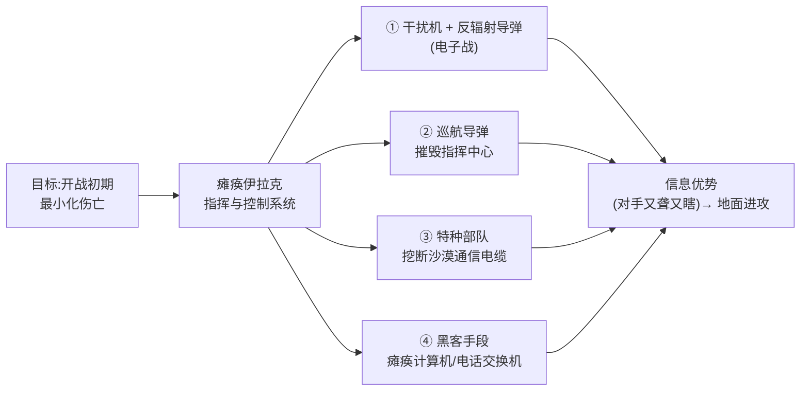
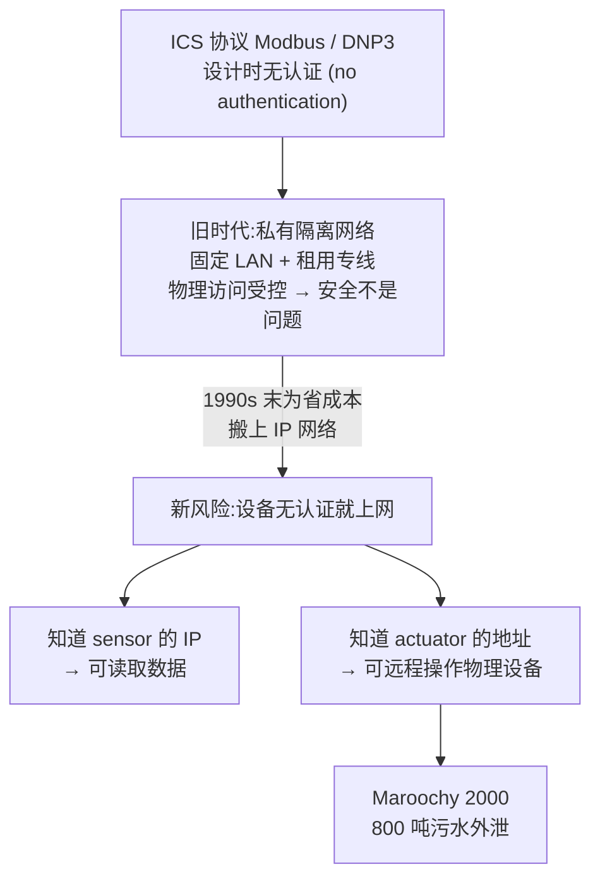
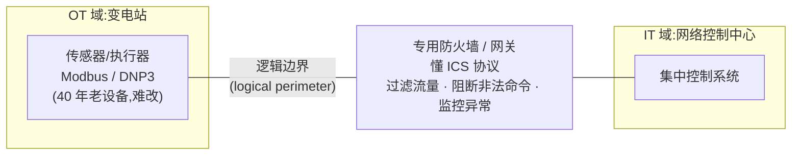
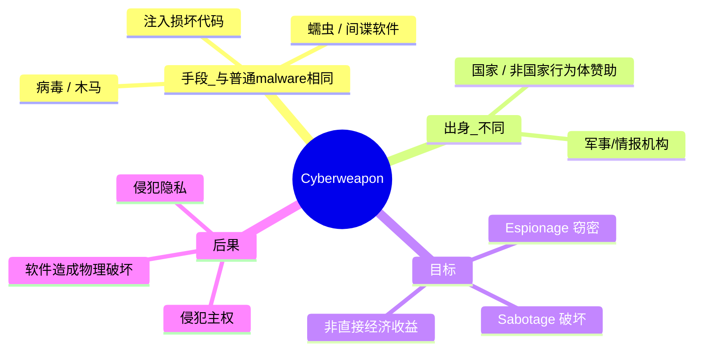
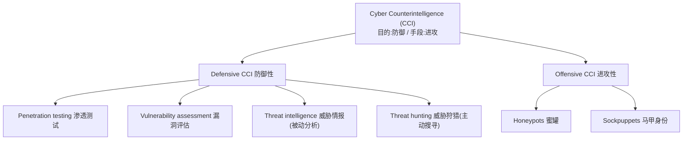
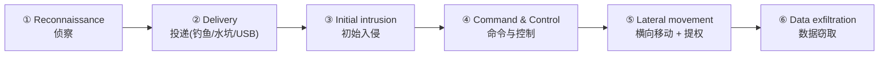
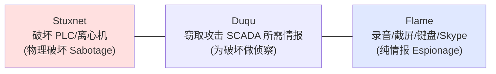

# Week 12 · 信息战、网络武器、网络反间谍与 APT (Information Warfare, Cyberweapon, Cyber Counterintelligence, APT)

> **关于周次与材料的说明** — 这份讲义文件名是 **W12**,幻灯片标题写的是 **"Week 12 – Information Warfare, Cyberweapon, Cyber Counterintelligence, APT"**(讲师 Dr. Steven Duong),所以本章就是 Week 12,也是**本课程最后一章正课内容**。讲师在录音结尾说:**下周(Week 13)是最后一周,主要做全课程总结和考试说明,不再讲新内容。**
>
> **关于 workshop**:本课程的 workshop(W2–W11 solutions)通常滞后讲义一周,但目前**没有 W12 的 workshop 文件**(最新一份是 W11-Solutions,且它直接对应 Week 11 的 TPM/Enclave/CPS/SCADA 内容)。所以本章**没有配套的 workshop 练习**可以融入,正文里的 worked example 全部来自 slides 和讲师课堂讲述的真实案例。
>
> **本章和上一章的关系**:Week 11 我们刚讲完 **CPS / SCADA / Stuxnet**——计算机如何与物理世界相连、工业控制系统为什么脆弱。本章相当于把那条线**拔高到国家与战争的层面**:同样是 Modbus/DNP3、同样是 Stuxnet,但这次我们问的是——当攻击者是**国家**而不是黑客时,会发生什么?所以读本章时,Week 11 的 SCADA 知识是直接复用的。

> **学习目标 (Learning objectives)** — 读完本章你应该能够:
> - 用 **Dorothy Denning** 和 **Edward Waltz** 两种定义解释什么是 **information warfare(信息战)**,并说清两者一宽一窄的区别;
> - 用 **Gulf War 1(海湾战争)** 说明信息战如何把电子战、巡航导弹、特种部队和黑客手段结合在一起;
> - 解释为什么**电力等关键基础设施 (critical infrastructure)** 是信息战的首要打击目标,并举出 Auckland、IRA、Maroochy、Stuxnet、乌克兰停电等案例;
> - 说清工业控制协议 **Modbus / DNP3** 为什么天生不安全,以及把它们从私有网搬上 IP 网带来了什么风险;
> - 解释 **CIP standard** 和 **black-start** 是什么、为什么"给 SCADA 加密/认证"在现实中如此困难,以及为什么**专用防火墙/网关 (specialist firewalls and gateways)** 成了折中方案;
> - 解释 **Shodan** 是什么、它和 Google 有何不同,以及它为什么让基础设施风险"从假设变成现实";
> - **定义 cyberweapon(网络武器)**,区分它与普通 malware(高 vs 低 selectivity),说清它的两大目标(espionage / sabotage)和四大独特危险;
> - **定义 cyber counterintelligence(CCI,网络反间谍)**,理解它"目的防御、手段进攻"的双重性,并能逐一说明 defensive(pen testing、vulnerability assessment、threat intelligence、threat hunting)与 offensive(honeypots、sockpuppets)各自的作用;
> - 用 **NIST 的定义**说清什么是 **APT(高级持续性威胁)**,讲清它的四大特征,**背出 APT 攻击的 6 个阶段**,并能用 **Stuxnet / Duqu / Flame** 三个例子说明 APT 的目标光谱。

---

前面十一周,我们的安全视角基本停留在**个人与组织**的层面:怎么加密一个文件、怎么防住一次钓鱼、怎么给一台服务器打补丁、怎么保护用户隐私。攻击者在我们的想象里通常是**罪犯**——他们要的是钱:偷信用卡号、勒索比特币、卖数据库。

本章要做一件事:**把镜头拉到最高一层,看安全在"国家与战争"尺度上是什么样子。** 在这个尺度上,攻击者不再是为了钱,而是为了**战略优势**——瘫痪一个国家的电网、破坏它的核设施、窃取它的国防机密、在它的关键系统里潜伏数年。这时候我们谈的不再是"网络犯罪",而是 **information warfare(信息战)**。

本章沿着一条清晰的逻辑展开,分四个部分:

1. **信息战 (Information Warfare)** — 先定义什么是信息战,再看它在现实中长什么样:从海湾战争的电子战,到对电网、水厂、核设施的攻击。这部分会**直接复用 Week 11 的 SCADA 知识**,但站在国家冲突的高度重新审视它(Part 1)。
2. **网络武器 (Cyberweapon)** — 当 malware 被国家拿来当武器,它就和普通病毒有了本质区别。这部分讲清楚这个区别,以及网络武器为什么特别危险(Part 2)。
3. **网络反间谍 (Cyber Counterintelligence, CCI)** — 防御方如何反过来主动出击:不只是筑墙,还要设陷阱、放假身份、潜入敌方。这是一套"以攻为守"的方法论(Part 3)。
4. **高级持续性威胁 (APT)** — 把前三部分的能力组织起来、长期运作的那个"终极对手"长什么样。APT 是国家级攻击者的集大成者,本章以它收尾(Part 4)。

一条主线贯穿全章:**当对手是国家,攻防的逻辑就变了**——目标从"赚钱"变成"战略",攻击从"快进快出"变成"长期潜伏",而防御也必须从"被动筑墙"升级到"主动反制"。

---

## Part 1 · 信息战:当信息本身成为战场

### 1.1 什么是 information warfare:两个经典定义

要谈信息战,先得知道这个词到底指什么——而它的边界,取决于你问谁。讲师给了两个权威定义,一宽一窄,正好框出这个概念的范围。

第一个来自 **Dorothy Denning**(一位著名的计算机安全专家)。她把 **information warfare(信息战)** 定义为:

> **Information warfare (Denning)** — *针对或利用"信息媒介 (information media)"以取得对敌优势的各种行动* (operations that target or exploit information media to win some advantage over an adversary)。

这个定义**故意定得极宽**。它不只包括黑客攻击,还把**电子战 (electronic warfare)、传统情报搜集(从信号情报 SIGINT、卫星图像 satellite imagery,一直到人力间谍 spies)、乃至宣传 (propaganda)** 全都囊括进去。换句话说:**任何"控制或操纵信息"以压制对手的行为,都算信息战。** 讲师举的直观例子是——如果你掌控了一家媒体、向民众广播假新闻去误导他们,这在 Denning 的"伞状定义"下也是信息战。

第二个定义来自 **Edward Waltz**,他从**军事视角**把范围收窄了:

> **Information warfare (Waltz)** — *一种能力:在保证己方信息"不间断地"采集、处理、分发的同时,削弱或剥夺敌方做同样事情的能力* (the capability to collect, process and disseminate an uninterrupted flow of information while exploiting or denying an adversary's ability to do the same)。

Waltz 的定义更**战略、更有作战味**,核心是军事行动中"信息的流动 (flow of information)",并且**同时强调两面:保护己方 + 否定敌方 (protection and denial)**。讲师的直观画面是:**战场上有两支军队**,一支能安全通信、协调进攻、实时获取情报;另一支不能——因为它的系统被破坏或欺骗了。这种"信息上的不对称",就是 Waltz 所说的优势。

> 📎 **拓展(帮助理解)** — 为什么需要记两个定义?因为它们划出了同一个概念的"上下界":**Denning 是上界**(信息战 = 一切关于信息的对抗,无所不包),**Waltz 是下界**(信息战 = 军事作战中对信息流的争夺,聚焦实战)。考试若问"information warfare 是什么",你给出任一定义并能说清它的侧重点即可;若问两者区别,关键词就是 **broad(Denning,含宣传/间谍/电子战)vs military doctrine(Waltz,聚焦信息流的保护与否定)**。

这个词大约从 **1995 年**开始流行——正是数字通信成为军事和民用生活核心的年代。今天它涵盖了从攻击基础设施到社交媒体操纵的一整个谱系。

| | **Dorothy Denning 的定义** | **Edward Waltz 的定义** |
|---|---|---|
| 视角 | 宽泛、概念性 | 军事、作战性 |
| 范围 | 黑客 + 电子战 + 情报搜集 + 宣传 | 军事行动中的"信息流" |
| 关键词 | 利用信息媒介取得优势 | 保护己方 + 否定敌方 |
| 直观例子 | 广播假新闻误导民众 | 一方能安全通信、另一方不能 |

### 1.2 信息战长什么样:海湾战争 (Gulf War 1)

定义讲完了,但信息战在现实中究竟怎么打?讲师用 **1990 年代初的第一次海湾战争 (Gulf War 1)** 作为最早、最清晰的范例。

故事的出发点是一个目标:**NSA 协助盟军时,希望让开战初期的进攻"尽量少伤亡"**。怎么做到?答案不是靠更多火力,而是靠**先瘫痪伊拉克的指挥与控制 (command and control) 系统**,让对方在真正的地面进攻发起前就"又聋又瞎"。为此他们动用了一整套手段,可以分成四类:

1. **传统电子战 (e-war techniques)** — **干扰机 (jammers)** 阻塞或干扰敌方雷达和通信信号;**反辐射导弹 (anti-radiation missiles)** 顺着敌方雷达发出的电磁辐射"循迹"过去,直接摧毁雷达站。
2. **巡航导弹 (cruise missile) 打击指挥中心** — 直接物理摧毁伊拉克的指挥中心,瘫痪其协调反应的能力。
3. **特种部队 (special forces) 的物理破袭** — 这点尤其有意思:特种部队被提前派进伊拉克,任务**不只是侦察 (reconnaissance)**,而是去**沙漠里挖出埋藏的通信电缆**,从物理上切断伊拉克在军队间传递命令的能力。
4. **黑客手段 (hacking tricks)** — 用入侵技术瘫痪伊拉克的计算机和电话交换机,进一步削弱其通信与协调。

把这四类放在一起看,海湾战争的意义就出来了:**它是最早"同时在物理域和信息域中打响"的战争之一。** 它证明了一件事——在现代战争里,**信息优势 (information dominance) 而不仅仅是火力 (firepower),可以起决定性作用**;电子战和网络行动能够与传统军事战术整合,产生最大化的打击效果。

### 1.3 为什么打基础设施:电力是现代社会的命脉

信息战最具破坏性的一种形式,是打击一个国家的**关键基础设施 (critical infrastructure)**,而这份清单上排在最顶端的,是**电力的生产与分配 (electricity generation and distribution)**。

为什么是电?讲师的论证很直白:在现代这个技术驱动的社会里,**电力是一切的脊梁 (backbone)**。一旦电力中断,**绝不只是"关了灯"**——整个经济会停摆:通信、银行、交通、医疗、安防系统,全部停止运转。正因如此,打击电力基础设施常被用作**全面战争的前奏 (prelude to full-scale war)**,或者用来"**不开一枪 (without firing a single shot)**"就制造大规模的经济与社会混乱。

讲师给了两个真实例子,说明哪怕在和平时期,城市对基础设施失效有多脆弱:

> **🔑 例 1(Auckland 停电,1996)** — 新西兰奥克兰的中央商务区 (CBD) 经历了一次长达**五周**的灾难性停电。约 **60,000 名员工被迫在家办公**,**6,000 名公寓住户被迫搬离**。这还只是一次"事故",就已经让一座城市的核心瘫痪了数周。
>
> **🔑 例 2(IRA 险些得手,near miss)** — 爱尔兰共和军 (IRA) 曾**险些摧毁为伦敦供电的大型变电站里的变压器 (transformers)**。如果成功,数百万人和**约占英国 GDP 三分之一**的商业活动都会受影响,伦敦可能陷入黑暗**长达数月**。

这些**不是孤立的意外**。事实上,**攻击电力的传输与分配系统,一直是美军在多次冲突中的标准战术 (a standard US tactic in wars)**。原因很清楚:瘫痪电网能**削弱敌方士气、拖慢其军事反应、并迫使对方把资源从战场调去应对民用危机**。

这一节真正要传达的观念是:**信息战不只关乎数字数据,它关乎"赛博—物理的融合 (cyber-physical convergence)"**——真实世界的系统越来越多地由数字手段控制,这就让它们在现代冲突中成了"合法猎物"。这正是 Week 11 学的 **CPS** 思想在国家冲突层面的体现。

### 1.4 工业控制系统为什么天生不安全:Modbus 与 DNP3

既然基础设施是靶子,我们就得理解它的软肋在哪。讲师把焦点对准了**工业控制系统 (industrial control systems, ICS)**——尤其是电网和石化厂里用的两种主流协议:**Modbus** 和 **DNP3**。(这两个名字在 Week 11 的 SCADA 部分出现过,这里讲清它们的安全缺陷。)

问题的根子在于:**这些协议在设计时根本没考虑安全。** 最致命的一点是——它们**不支持认证 (no authentication)**。这意味着接收方**没有任何可靠手段去验证"收到的数据或命令到底是不是来自可信来源"**。

为什么当初会这样设计?因为这些系统**最初部署在私有、隔离的网络上 (private, isolated networks)**:工厂内部是固定的局域网 (fixed LANs),工厂与中央控制中心之间用**租用专线 (leased lines)** 连接。**物理访问被严格控制,所以"安全"在当时不是主要顾虑**——你根本进不来,自然也就不用认证。

转折发生在 **1990 年代末**:许多公司为了**降低成本**,开始把这些系统**搬到基于 IP 的网络上 (IP networks)**。这一搬,风险就来了。一旦设备**没有认证就上了网**,它们就变得不堪一击:

- 如果有人知道某个**传感器 (sensor) 的 IP 地址**,他就能**读取它的数据**;
- 更糟的是,如果有人知道某个**执行器 (actuator,负责执行物理动作的部件) 的地址**,他就能**远程操作它**——也就是说,直接在物理世界里"动手"。

这不是理论。讲师给了一个标志性的真实事故:

> **🔑 例(Maroochy 污水事件,澳大利亚,2000)** — 一名对水务公司 IT 承包商心怀不满的**前雇员 (disgruntled former employee)**,入侵了污水控制系统。他成功制造了 **800 吨污水外泄**,污染了河流、酒店场地、甚至公园。原因正是:**他知道地址,而系统里没有任何检查机制能阻止他操作执行器 (actuators)。**

Maroochy 事件揭示了一个更宏观的问题:**当运营技术 (Operational Technology, OT) 系统与 IT 网络融合,攻击面 (attack surface) 就急剧扩大。** 那些**从设计之初就没打算暴露在互联网上**的系统,如今对任何掌握足够知识、又心怀恶意的人来说,都是脆弱的。所以,今天保护关键基础设施,远不只是"装杀软和防火墙"那么简单——它意味着**重新思考系统架构,并补上那些一开始就不存在的安全机制**。

### 1.5 国家级攻击:Stuxnet 与乌克兰停电

把上面的脆弱性交到**国家**手里,后果就升级成了战略级事件。讲师给了两个里程碑式的案例。

**第一个是 Stuxnet(震网)。** 据广泛报道,在 **2008–2010 年间**,美国的**爱达荷国家实验室 (Idaho National Labs)** 与 **NSA**、以色列情报机构合作,开发了一种极其精密的恶意软件,**专门针对伊朗铀浓缩 (uranium enrichment) 项目里使用的离心机 (centrifuges)**。它的"创新"在于:**它不只是窃密,它真的去破坏——物理性地损坏离心机,同时让操作员以为一切运转正常。** 这通常被认为是**第一款真正的网络武器 (the first true cyberweapon)**,标志着网络战的转折点。(我们在 Week 11 见过 Stuxnet 攻击 PLC,这里它的身份是"国家级网络武器"。)

**第二个是乌克兰停电。** 乌克兰是俄罗斯网络行动的常见目标。在乌克兰对**克里米亚 (Crimea)**(俄罗斯于 2014 年吞并的地区)的电力设施发动攻击后,俄罗斯以一次协同网络攻击作为回应,结果是 **30 座乌克兰变电站被迫下线,造成影响 230,000 人、持续数小时的大停电**。这显示了网络行动如何在**不发生传统军事交火**的情况下,被用来**报复或升级地缘政治紧张**。

事情还没完。**同一套恶意软件基础设施——著名的 NotPetya 蠕虫——后来扩散到了预定目标之外**,对在乌克兰设有办事处的跨国公司造成了巨大的附带损害 (collateral damage):一些全球性企业因系统瘫痪而损失数亿美元。这说明:**一次定向攻击可以"溢出"成全球性灾难**,波及供应链、运营与世界经济。

这两个案例共同揭示了**军事、政治、数字领域之间界限的模糊化**——对基础设施的网络攻击不再是假设,而是现代冲突中**实实在在被使用的战略工具**。

### 1.6 谁在攻击控制系统:不是罪犯,是国家

知道了攻击多可怕,我们自然要问:**到底是谁在干?** 这一点的答案有点反直觉,但逻辑很顺。

讲师引用了 **Ross Anderson 研究组**的监测结果。他们的方法是**长期观察地下犯罪论坛 (underground crime forums)** 上的活动。结论是:**自从控制系统安全开始受到重视以来,并没有发现网络罪犯对"入侵控制系统"有持续而有能力的兴趣 (no sustained competent interest)。**

这告诉我们:**针对控制系统的网络活动,绝大多数很可能是"国家行为体 (state actors)"或其"代理人 (proxies)"所为。** 所谓 proxy,是指那些**未必正式隶属于政府、却替政府行事**的团体,通常得到政府的间接支持或默许。

为什么会这样?讲师的解释抓住了**动机**这个要害:**瘫痪一个电网、破坏一个水厂,并不"赚钱"**——它不像偷信用卡号那样能直接变现。但它能**瘫痪一个地区、传递一个政治信号、或服务于军事目标**——而这些,**和民族国家的利益高度吻合,却和网络罪犯的利益几乎无关**。所以,看动机就能反推出攻击者的身份。

> 📎 **拓展(把这条逻辑记牢)** — 这是一条很常考、也很值得理解的推理链:**犯罪分子追求利润 → 攻击控制系统不赚钱 → 所以做这件事的主要是国家或其代理人。** 它和 Part 2、Part 4 会反复出现的主题一致:**网络武器和 APT 的赞助者都是国家,因为只有国家才有动机和资源去做"不赚钱但有战略价值"的事。**

### 1.7 怎么保护:CIP 标准、black-start 与加密的现实困境

既然威胁这么大,政府和监管机构自然要出手。讲师介绍了一个早期且重要的尝试:**关键基础设施保护标准 (Critical Infrastructure Protection, CIP standard)**。

> **CIP standard** — *一套旨在通过"监管 (regulation)"来改善控制系统安全的标准*,由**美国能源部 (DoE)、国土安全部 (DHS) 和北美电力可靠性公司 (NERC)** 于 **2006 年**联合制定,目标是在电力的生产与分配领域建立监管框架——而这正是任何信息战场景里的首要目标。

CIP 里一个特别值得注意的要求,涉及一个叫 **black-start(黑启动)** 的概念:

> **Black-start capability(黑启动能力)** — *一座电厂"即使在电网已经瘫痪的情况下,也能独立地启动并开始发电"的能力*。它对"在一次彻底崩溃之后恢复供电"至关重要——你得有几座电厂能"自己点着火",才能带动整个电网重启。

CIP 要求:**任何具备 black-start 能力的发电机组,都必须满足基本的信息安全合规。** 哪些电厂有这个能力?讲师讲了一组对照:**水电站可以黑启动;核电站不行;燃煤电厂一般只有在配备了辅助柴油发电机 (auxiliary diesel generator) 的情况下才能黑启动。**

但这个标准**并不太成功**。行业的反应很讽刺:**一些燃煤电厂干脆拆掉了它们的柴油发电机**——因为信息安全的成本无法被计入它们受监管的成本基数 (regulated cost base),与其花钱合规,不如取消那个让自己"被监管"的能力。这是一个生动的教训:**监管如果与经济激励冲突,可能会适得其反。**

接下来是更技术性的问题:**能不能直接给 Modbus / DNP3 加上加密和认证?** 听起来理所当然,但讲师列出了四个现实困境,解释了为什么这件事极难:

| 困境 | 为什么难 |
|---|---|
| **① 厂商极少 (few vendors)** | 电力变电站的厂商屈指可数,**互操作性 (interoperability) 至关重要但难以实现**——一家升级了加密、别家没升级,兼容性就崩了,这在关键领域不可接受。 |
| **② 设备寿命极长** | 变电站的**设计寿命通常长达 40 年**,还附带维护合同,所以技术更新极其缓慢,**以"几十年"而非"几年"计**。 |
| **③ 物理攻击让加密变得"没意义"** | 能接触到变电站的人,**根本不用黑你的控制系统**——他可以直接合上/断开开关,甚至**朝变压器开一枪造成内部短路**就能搞垮它。在这种情况下,给变电站局域网流量加密甚至只是认证,**优先级很低、几乎多余**。 |
| **④ 4ms 延迟要求** | 很多控制系统要求**极低延迟——动作要在 4 毫秒内完成**。引入加密会增加计算延迟,可能**拖慢系统、损害可靠性**。 |

既然"逐个设备加密"行不通,**实际且被广泛采用的折中方案**是什么?**保护"逻辑边界 (logical perimeter)"**——也就是**变电站与网络控制中心之间的通信**,而不是去改造每一台老设备。讲师的类比很形象:**这就像给整片院子修一道围栏 (securing the fence/property),而不是去给院子里每一件电器单独上锁。**

落实这个思路的工具,就是**专用防火墙与网关 (specialist firewalls and gateways)**:

- 它们**专为工业控制系统设计**,**懂 Modbus / DNP3 这些专有协议**;
- 它们能在**不引入不可接受延迟**的前提下执行安全策略;
- 它们充当 **OT(变电站一侧)与 IT(中央控制中心一侧)之间的安全桥梁 (secure bridge)**;
- 具体做法是:**过滤流量、阻断未授权命令、监控异常 (anomalies)**。

### 1.8 把脆弱设备暴露出来:Shodan 与智能电表

最后,讲师指出了一类新兴风险:**智能电表 (smart meters) 的漏洞**,以及一个让这些漏洞"无所遁形"的工具。

许多欧洲国家(包括英国)安装了智能电表来现代化能源监测、提高效率。但这些设备**常常没有把安全考虑进去**:早期的英国智能电表**缺乏加密认证 (no cryptographic authentication)**,甚至带有一个**可远程下达指令的"断电开关 (remotely commandable off-switch)"**。这意味着:**拿到访问权的攻击者,有可能远程切断对企业乃至关键设施的供电**——这是严重的国家基础设施风险。

那么研究者(和攻击者)是怎么找到这些脆弱设备的?靠一个叫 **Shodan** 的工具:

> **Shodan** — *一个"面向物联网 (IoT) 的搜索引擎"*。它和 Google 的根本区别在于:**Google 索引的是网页,Shodan 扫描的是"连入互联网的设备"**——智能电表、工业控制系统、甚至摄像头。它会揭示这些设备的 **IP 地址、开放端口 (open ports)、软件版本,以及它们是否存在漏洞**。Shodan 于 **2009 年**推出。

Shodan 把"基础设施有多脆弱"从抽象变成了触目惊心的数字:

- **2011 年**,研究者 **Éireann Leverett** 用 Shodan 定位到了**数千个**不安全的控制系统;
- **2016 年**,**Ariana Mirian** 及同事做了一次全球扫描,发现了约 **60,000 个脆弱设备**,从电力变电站到政府大楼里的 HVAC(暖通空调)系统都有。

结论是:**威胁不是假设,而是真实且当下的 (real and current)。** Shodan 让定位不安全系统变得轻而易举,而设备如果没有经过适当的**安全加固 (hardening)**,就会一直暴露、可被利用。这正是为什么**"安全设计 (security by design)"和"持续打补丁 (ongoing patching)"在关键基础设施领域如此重要**。

> **🔑 Part 1 小结脉络** — 信息战的逻辑链:**信息本身是战场(定义)→ 现实中怎么打(海湾战争)→ 打什么(电力等基础设施)→ 为什么打得动(Modbus/DNP3 无认证 + 上了 IP 网)→ 国家在打(Stuxnet/乌克兰,因为只有国家有动机)→ 怎么防(CIP/black-start/专用防火墙)→ 脆弱性有多普遍(Shodan 扫出 6 万台)。**

---

## Part 2 · 网络武器:当 malware 成为国家的兵器

### 2.1 什么是 cyberweapon

Part 1 反复出现了 Stuxnet、NotPetya 这些名字。它们和你电脑上可能中过的那种病毒,显然不是一回事。Part 2 就来精确地定义这种"国家级恶意软件"——**网络武器 (cyberweapon)**。

> **Cyberweapon(网络武器)** — *一种作为网络攻击一部分、为"军事、准军事 (paramilitary) 或情报目的"而使用的恶意软件代理 (malware agent)*。它包括能**把损坏代码注入既有软件 (injecting corrupted code into existing software)**、从而让计算机系统和/或网络执行"违背其操作者意图"的动作的**病毒 (viruses)、木马 (trojans)、间谍软件 (spyware) 和蠕虫 (worms)**。

定义里有两个要点。第一,它的**手段**和普通恶意软件没什么神秘的不同——还是病毒、木马、蠕虫、间谍软件那一套,目的还是"让系统做它本不该做的事"(关停关键基础设施、窃取机密数据、操纵通信通道)。第二,也是关键区别——它的**出身**不同:

> **Threat actors(威胁来源)** — 网络武器**通常由"国家或非国家行为体 (a state or non-state actor)"赞助或使用**。这些行为体可能隶属于某国的军事网络司令部、情报机构,或是替政府行事、与政府目标一致的政治动机黑客团体。

### 2.2 网络武器的两大目标与后果

网络武器通常服务于两大使命,理解它们就理解了网络武器"为什么存在":

1. **间谍 / 窃密 (Espionage)** — 针对特定目标进行监视、情报搜集和数据窃取。目标可能是政府机构、军事设施,或持有敏感信息的私营企业。
2. **破坏 / 蓄意破坏 (Sabotage)** — 对关键系统的扰乱或破坏:损坏电网这类基础设施、瘫痪军事系统、破坏工业流程。讲师有一句精辟的概括——**"网络武器执行的,是一个本来需要士兵或间谍才能完成的动作 (an action that would normally require a soldier or spy)。"** 它模仿传统战争战术,却在数字空间里悄无声息地进行。

这里有一个**定义性的区别**,务必记牢:**网络武器的目标不是直接的经济收益。** 它几乎一定会给目标方造成直接或间接的财务损失,但**为赞助者赚钱并不是它的首要目的**——这正是它**区别于"犯罪型恶意软件 (criminal malware)"**的地方。它要的是**战略优势**:军事的、政治的、经济的——通过削弱对手来获得。

使用网络武器还带来一系列严肃的**法律与伦理后果 (consequences)**:

- **侵犯隐私 (violating privacy)** — 通过未授权的监视和数据搜集;
- **侵犯主权 (infringing sovereignty)** — 在未经同意的情况下,跨越国界渗透和操纵他国系统;
- **造成物理或功能性损害** — 尽管它本质上是软件,却可能让工业机器过热、爆炸,**模糊了"虚拟"与"物理"战争的界限**。

### 2.3 网络武器 vs 普通 malware:选择性是分水岭

如果手段都是病毒木马,那网络武器和普通恶意软件到底有什么本质区别?讲师给出的核心判据是一个词:**选择性 (selectivity)**。

- **网络武器:高选择性 (high selectivity)** —— 在"使用对象"和/或"作用过程"上高度精准。它**只打预先选定的目标**。
- **普通恶意软件:低选择性、广撒网 (lower selectivity, wider distribution)** —— 讲师举了两个对照:新手黑客用恶意软件**组建僵尸网络 (botnet)** 时,被攻陷机器的**所有者是谁、在哪、平时干什么,几乎都无所谓**;同样,**诈骗者 (fraudsters) 用恶意软件窃取个人或财务信息时,也不挑特定目标**——谁中招算谁。

| | **网络武器 (Cyberweapon)** | **普通恶意软件 (Malware)** |
|---|---|---|
| 选择性 | **高**:只打预定目标 | **低**:广撒网,见者就中 |
| 典型操作者 | 国家 / 非国家行为体 | 新手黑客、诈骗者 |
| 目标动机 | 战略优势(军事/政治) | 直接经济收益 |
| 典型例子 | Stuxnet、NotPetya | 僵尸网络、窃取财务信息的木马 |
| 对受害者身份 | 极度在意(精确锁定) | 不在意(谁都行) |

> 📎 **一句话记忆** — 区分二者最快的问法是:**"它挑不挑目标?"** 挑(高选择性、为战略)→ 网络武器;不挑(广撒网、为赚钱)→ 普通恶意软件。

### 2.4 网络武器为什么特别危险:四个独特之处

最后,讲师总结了网络武器**独有的四种危险**,这是本部分最常考的清单:

1. **难以追踪、难以防御 (difficult to trace or defend against)** —— 因为它**没有物理组件**,你抓不到一个"实体",防御也无从下手。
2. **匿名性带来长期潜伏 (anonymity)** —— 攻击者可以**长时间隐藏在系统中不被发现**,等待最佳时机才发动。许多此类攻击利用 **"零日漏洞 (zero days)"**——防御方在被攻击之前根本不知道这个漏洞存在。
3. **成本不对称,有利于攻击者 (cost imbalance / asymmetry)** —— **制造网络武器,往往比建立防御它所需的体系便宜得多**。这种不对称天然地**偏向攻击方**。
4. **可被缴获并反向使用 (reused against the original creator)** —— 一方的网络武器可能被对手**缴获,然后反过来用在它的原创造者身上**。最清楚的例子是 **WannaCry 和 NotPetya** 两次大爆发——**两者都用了 EternalBlue**,而 EternalBlue 据信是 **NSA 开发的**。这种"武器反噬"放大了网络武器的危险性和不可预测性。

> **🔑 例(EternalBlue 的反噬)** — NSA 开发的漏洞利用工具 EternalBlue 泄露后,被用来构造了 WannaCry(2017,席卷全球的勒索蠕虫)和 NotPetya。**国家造的"兵器"流入野外,最终砸到了所有人头上**——这完美诠释了第 3 条(成本不对称)和第 4 条(反向使用)叠加起来有多可怕。

---

## Part 3 · 网络反间谍 (CCI):以攻为守

### 3.1 什么是 CCI:目的是防御,手段却是进攻

到目前为止,我们一直站在攻击方的视角看信息战和网络武器。Part 3 换到**防御方**,但你会发现一件有意思的事:**最有效的防御,常常带着进攻的姿态。** 这就是**网络反间谍 (Cyber Counterintelligence, CCI)**。

> **Cyber Counterintelligence (CCI)** — *一个组织为"阻止恶意行为体(无论是竞争对手的情报活动、民族国家,还是犯罪组织)搜集关于自己的敏感信息"而采取的各种努力*。这里的敏感信息包括**知识产权 (intellectual property)、商业机密 (trade secrets)、运营计划 (operational plans)、机密情报数据**——这些对国家或组织安全至关重要。

CCI 最耐人寻味的特征,是它的**双重性 (dual nature)**:

> **CCI 的核心特征** — *虽然 CCI 的根本目的是"防御性"的(保护资产和信息),但它所采用的方法本质上往往是"进攻性"的 (the methods are essentially offensive)。要让 CCI 真正有效,它必须"攻防兼备 (both offensive and defensive)"。*

和传统防御(只专注于筑墙、挡攻击)不同,CCI 可以**主动地试探、欺骗、扰乱攻击者**——部署蜜罐 (honeypots)、做威胁狩猎 (threat hunting)、给攻击者喂假情报、甚至操纵对方的基础设施。它的终极目标不只是"挡住攻击",而是**通过理解对手的战术、预判其行动、主动反制,来在网络战场上占据上风**。

为了把这套方法论讲清楚,讲师把 CCI 分成两大类:**Defensive CCI(防御性)** 和 **Offensive CCI(进攻性)**。下面分别看。

### 3.2 Defensive CCI:从渗透测试到威胁狩猎

防御性 CCI 是一条**从"了解自己"走向"主动搜捕"**的递进链条,共四步。

**① 渗透测试 (Penetration testing)。** 这通常是整个防御过程的起点。组织会**聘请专门的"红队 (red team)"**——一群用真实攻击战术、来模拟攻击你自己网络和系统的安全专家。通过**模仿对手如何突破防线**,渗透测试能**揭示可能的攻击路径 (attack vectors)、发现网络与系统的弱点、并画出组织的"攻击面 (attack surface)"**。这种深入的洞察,让组织能为真正的攻击做出更有效的应对准备。

**② 漏洞评估 (Vulnerability assessment)。** 一旦渗透测试识别出潜在弱点,下一步就是用**自动化扫描工具 (vulnerability scanning tools)** 对网络和系统基础设施做一次彻底的漏洞评估。关键在于:**漏洞不只是被"列出来",更要被"定义、分类、并最重要地——按严重性和潜在影响排定优先级 (defining, classifying and most importantly prioritizing)"**。排序让组织能把有限的资源**用在刀刃上**,优先修补最要命的问题。

**③ 威胁情报 (Threat intelligence)。** 这一步是**搜集并分析**关于"过去、当前、未来"网络威胁的指标 (indicators) 数据。它帮助组织**更好地理解威胁态势 (threat landscape)**,从而更明智地排定防御优先级、在攻击被发现时更快响应。讲师特别点出:威胁情报本质上是一种**偏被动的"分析"动作 (a more passive action)**——你在研究情报、研究攻击者是谁。

**④ 威胁狩猎 (Threat hunting)。** 这是从"分析"转向"行动"的关键一跃,是一种**主动的防御 (active defensive CCI)**。和被动监控不同,威胁狩猎是**主动地在网络里搜寻"那些已经躲过了传统端点安全工具 (endpoint security) 的隐蔽或高级威胁"**。威胁猎手寻找入侵的**细微迹象 (subtle signs of compromise)**,在这些隐蔽威胁造成重大损害之前就把它们**隔离 (isolating)** 出来。

把③和④放一起看,逻辑就清晰了:**威胁情报(被动分析)+ 威胁狩猎(主动搜捕)让组织能"领先攻击者一步",把防御从"被动反应 (reactive)"转为"主动出击 (proactive)"。**

| 步骤 | 性质 | 它回答的问题 | 关键产出 |
|---|---|---|---|
| ① Penetration testing | 主动模拟 | "如果有人攻我,能从哪进?" | 攻击路径、攻击面地图 |
| ② Vulnerability assessment | 系统扫描 | "我有哪些漏洞,哪个最危险?" | **排好优先级**的漏洞清单 |
| ③ Threat intelligence | **被动分析** | "外面有什么威胁,是谁?" | 威胁态势认知 |
| ④ Threat hunting | **主动搜捕** | "有没有人已经潜进来了?" | 隔离掉的隐蔽威胁 |

### 3.3 Offensive CCI:蜜罐与马甲身份

防御性 CCI 是"加固自己",进攻性 CCI 则是**"反过来盯上攻击者"**。讲师给了两件最有代表性的工具。

**① 蜜罐 (Honeypots)。**

> **Honeypot(蜜罐)** — *一种被刻意设置在网络中、"故意做得脆弱"的系统或服务,用来"引诱 (lure)"攻击者*。可以把它想成一个**看起来真实、又疏于防护的诱饵系统 (decoy system)**,因而对攻击者极具吸引力;同时它是**被严密监控的"隔离陷阱 (isolated trap)"**。

蜜罐的价值在于:**当攻击者一头扎进这个陷阱,你就能观察他的活动、监控其行为、捕获他使用的工具和技术,并搜集到平时极难获得的情报。** 这能揭示攻击者的**技能水平、来源地、偏好的战术或恶意软件**。在某些情况下,蜜罐甚至能**协助"溯源归因 (attribution)"**——弄清楚是谁在背后发动攻击。虽然归因复杂且很少有定论,但蜜罐能为这块拼图**添上有价值的碎片**。一句话:蜜罐把"被入侵的企图"变成了"学习的机会",是一件强大的进攻性 CCI 工具。

**② 马甲身份 (Sockpuppets)。**

> **Sockpuppet(马甲身份 / 提线木偶账号)** — *一种"虚构却看起来完全合法"的线上人格 (online persona)*。它**不是一次性的小号**——而是被精心培育的:有可信的数字历史、逼真的社交媒体活动、以及随时间积累出真实感的线上互动。

马甲身份服务于一个非常具体的战略目的:**被部署到线上空间去观察、接触、并渗透敌对社群或行动 (infiltrate adversarial communities)**。比如,一个马甲身份可能加入某个黑客论坛,与成员建立信任 (build rapport),然后慢慢开始搜集关于"计划中的攻击、恶意软件开发、威胁行为体能力"的情报。

讲师点出了马甲身份**为什么特别有效**——它工作在两种情报的交汇处:

> **OSINT + HUMINT** — 马甲身份是 **OSINT(开源情报,open source intelligence,搜集公开可得的信息)** 与 **HUMINT(人力情报,human intelligence,通过直接的人际互动获得)** 的结合。这种组合让组织不仅能**被动地观察**威胁,还能**主动地从内部操纵或扰乱**它们。

在高水平的行动中,精心经营的马甲身份甚至能**取得对手的信任,进而把对方的内部人员发展成"双面间谍 (double-agents)"**,把关键情报反馈给防御方。这是进攻性 CCI 的一个极致范例——让组织超越单纯防御,**从敌对环境内部直接获取高价值情报**。

### 3.4 CCI 的代价:成本与合法性

CCI 虽然有效,却也有显著的两大缺点——这通常成对出现,值得记牢。

**① 成本 (Cost)。** 实施一套有效的 CCI 策略,尤其是**攻防兼备**的那种,可能**极其昂贵**:它往往需要专门人员、高级工具、持续监控、以及红队演练这类模拟攻击。这些资源,**只有那些拥有高价值数字资产的大型组织才负担得起**;对小公司或机构而言,财务负担可能高到让 CCI**根本无法实施**。

**② 合法性 (Legality)。** 许多 CCI 技术——尤其是蜜罐、马甲身份、致命监控这类进攻性手段——**处于法律的灰色地带,甚至在某些司法管辖区是被明令禁止的**。涉及**欺骗、从对手处搜集数据、渗透线上社群**的活动,必须极其谨慎地处理。**法律边界因国而异,一旦越界,组织可能面临诉讼或监管处罚。** 因此,讲师强调:**理解并规划整个行动的全过程至关重要,每一种可能的情形都需要事先考虑到。**

> 📎 **一句话记忆** — CCI 的两个软肋是 **Cost(贵,小机构玩不起)和 Legality(进攻性手段游走在法律边缘)**。考点常以"CCI 的 disadvantages 是什么"出现,记住这两个词即可。

---

## Part 4 · APT:国家级攻击者的集大成者

### 4.1 什么是 APT:NIST 的定义

前三部分我们见识了信息战的目标(基础设施)、武器(cyberweapon)、和攻防方法(CCI)。现在把这一切**组织起来、长期运作**的那个"终极对手"登场了——**高级持续性威胁 (Advanced Persistent Threat, APT)**。这是本课程压轴的概念。

讲师采用了**美国国家标准与技术研究院 (NIST)** 的定义:

> **APT (NIST 定义)** — *一个"拥有精密专业能力 (sophisticated levels of expertise) 和可观资源 (significant resources)"的对手,这些能力和资源使它能够通过"多种攻击向量 (multiple attack vectors,如网络 cyber、物理 physical、欺骗 deception)"的组合,创造机会去达成自己的目标。这些目标通常包括:在目标组织的 IT 基础设施中"建立并扩展立足点 (establishing and extending footholds)",以便"窃取信息 (exfiltrating information)、破坏或阻碍某项使命/项目/组织的关键环节,或为将来执行这些目标而预先占位"。*

把这个定义拆开,APT 有三个内核:**精密的专业能力 + 可观的资源 + 多向量、长期、有明确目标。** 它和"普通网络攻击"最大的不同在于——**普通攻击往往是机会主义的、短命的 (opportunistic or short-lived),而 APT 是战略性的、持久的 (strategic and persistent)**。APT 的目标**不是闯进系统造成即时破坏**,而是**先在目标基础设施里"扎下根 (establish a foothold)"**;一旦进去,它就**隐藏起来,常常潜伏数月甚至数年**,一边窃取数据、监控通信,一边为将来的破坏做准备。

### 4.2 APT 的四大特征

讲师用四个特征把 APT 的"画像"勾勒完整。这四点是本部分的核心考点。

**特征 ①:目标特定、目的明确 (Specific targets and clear objectives)。** APT 的目标通常是**持有大量数字资产的政府或组织**。讲师列出了 APT 最常瞄准的**十大行业 (top ten industry verticals)**:**教育、金融、高科技、政府、咨询、能源、化工、电信、医疗、航空航天 (education, finance, high-tech, government, consulting, energy, chemical, telecom, healthcare, aerospace)**——这些都是信息既敏感又高价值的领域。与广撒网的传统攻击截然不同,**APT 是"外科手术式"的 (surgical in nature):它只聚焦于预先选定的目标,主动限制自己的攻击范围**,以求更隐蔽、更有效。它要的数字资产,是那些能带来**竞争优势或战略利益**的东西:国家安全数据、知识产权、商业机密。

**特征 ②:高度组织化、资源雄厚 (Highly organised and well-resourced)。** APT **不是孤狼黑客**,而是**协同作战的高技能职业团队**,带着"军事级的精准"。这些人往往**隶属于国家的网络部队**,或被政府和私营公司**雇为承包商 (contractors)**。让他们区别于普通罪犯的,是**资源的深度**:财务上,后盾雄厚到可以**支撑数月乃至数年的行动而无需急于变现**;技术上,他们握有**定制工具包、精密的恶意软件平台、甚至零日漏洞**。一旦是**国家赞助 (state-sponsored)** 的,实力还会再上一个台阶——他们可能得到国家情报机构的基础设施支持、能让他们免于被起诉的外交保护、以及精炼其打击目标的内部情报。

**特征 ③:长期作战、反复尝试 (A long-term campaign with repeated attempts)。** 与追求"速胜或速财"的一次性攻击不同,**APT 是被组织成"持续战役 (ongoing campaign)"的**。一旦攻入系统(或哪怕初次失败),他们**不会放弃**,而是**法律性地学习、适应、再试一次 (learn, adapt and try again)**。APT 在网络中**潜伏数月甚至数年而不被发现**并不罕见,它们一边维持低调,一边在网络里缓慢扩张。这种**持久性 (persistence)**,正是 APT 与传统威胁的核心分野——传统攻击者如果攻不破初始目标,**会立刻转向更软的柿子**;APT 则盯住不放。

**特征 ④:隐蔽且善于规避 (Stealthy and evasive techniques)。** 这是 APT 最危险的方面之一。和那些"高音量、快进快出"的传统攻击者不同,APT **无缝融入正常的企业网络流量 (blend into normal network traffic)**,只与系统做"刚好够推进目标"的最小交互,因此能**长期"潜在雷达之下 (below the radar)"**。具体手段包括:**用零日漏洞 (zero-day exploits) 绕过基于特征的检测 (signature-based detection)**、用**加密 (encryption) 来混淆网络流量**、以及使用**无文件恶意软件 (fileless malware) 或多态技术 (polymorphic techniques)**(恶意软件不断改变自身的代码结构以躲避检测)。这与传统攻击的**"砸开就抢 (smash and grab)"**战术形成鲜明对比——后者会立刻惊动防御方。

| 特征 | 一句话 | 与传统攻击的对比 |
|---|---|---|
| ① 目标特定 | 只打预选的高价值目标(十大行业) | 传统攻击广撒网 |
| ② 资源雄厚 | 国家赞助、高技能团队、零日漏洞 | 传统攻击者多为个人/小团伙 |
| ③ 长期持久 | 潜伏数月数年,失败就改进再试 | 传统攻击攻不破就换软柿子 |
| ④ 隐蔽规避 | 融入正常流量,零日+加密+多态 | 传统攻击"砸开就抢",会惊动防御 |

### 4.3 APT 攻击的六个阶段(必背)

讲师明确给出:**一次典型的 APT 攻击有以下六个阶段。** 这是一个高频考点,务必能按顺序背出来,并理解每一步在干什么。

1. **侦察 (Reconnaissance)** — 搜集关于目标基础设施、员工、技术、潜在漏洞的情报。
2. **投递 (Delivery)** — 传递攻击载荷,手段如:**带恶意附件的邮件、水坑网站 (watering hole)、感染的 USB** 等。
3. **初始入侵 (Initial intrusion)** — 利用漏洞或人为失误,获得对系统的初始访问权。
4. **命令与控制 (Command and control, C2)** — 建立一条**隐蔽的通信通道**,以便远程控制被攻陷的系统。
5. **横向移动 (Lateral movement)** — 在网络内部扩展访问范围,寻找更高价值的目标,并**提升权限 (escalate privilege)**。
6. **数据窃取 (Data exfiltration)** — 窃取敏感数据,并将其传输到攻击者控制的外部服务器。

> 📎 **记忆法** — 六阶段可以理解成一次"潜入大楼盗窃"的完整剧本:**先踩点(侦察)→ 想办法混进门(投递)→ 真的进了门(初始入侵)→ 偷偷架好对讲机和接应(C2)→ 在楼里到处摸,找到金库并搞到钥匙(横向移动+提权)→ 把东西运出去(数据窃取)。** 顺序一旦理解了就很难忘:Recon → Delivery → Intrusion → C2 → Lateral → Exfiltration。

### 4.4 APT 的真实案例:Stuxnet、Duqu、Flame

最后,讲师用三个著名的真实案例,展示了 APT 目标的"光谱"——从纯粹的物理破坏,到纯粹的情报搜集。它们也为整门课画上了一个呼应开头的句号(Stuxnet 在 Week 11 和本章 Part 1 都出现过)。

> **🔑 例 ① Stuxnet(震网)——物理破坏的极致**
> 一种**蠕虫 (worm)**,常被归类为 **APT 恶意软件**。它专门攻击**核离心机的可编程逻辑控制器 (programmable logic controllers, PLC)**,据信**摧毁了伊朗近 20% 的核离心机**,显著迟滞了其核计划。它代表了 APT 谱系里"**纯破坏 (sabotage)**"的一端。

> **🔑 例 ② Duqu——为下一次攻击搜集情报**
> 许多专家怀疑它**与 Stuxnet 同源**(可能由同一团队开发)。但 Duqu 的首要使命**不是破坏,而是情报搜集**——它被设计用来**窃取那些"日后可用于攻击 SCADA 系统"的信息**。换句话说,Duqu 是为破坏做"前期侦察"的工具,正好对应 §4.3 的第①阶段。

> **🔑 例 ③ Flame(火焰)——全功能间谍平台**
> 主要用于在**中东**进行侦察与情报搜集。Flame 相比典型恶意软件**体量巨大,约 20 MB**,内部打包了多种功能模块,可以**录制音频、截取屏幕、记录键盘活动、甚至捕获 Skype 通话**。它能**通过 USB 闪存盘传播**,这让它格外危险且难以察觉。Flame 被认为是有史以来最复杂、最先进的恶意软件之一。它代表了 APT 谱系里"**纯情报搜集 (espionage)**"的一端。

把三者放在一条谱线上,APT 的目标范围就一目了然了:

| 案例 | 类型 | 主要目标 | 标志性事实 |
|---|---|---|---|
| **Stuxnet** | 蠕虫 / APT | **破坏**核离心机 PLC | 毁掉伊朗约 20% 离心机;第一款真正的网络武器 |
| **Duqu** | 与 Stuxnet 同源 | **搜集**攻击 SCADA 的情报 | "破坏前的侦察兵" |
| **Flame** | 间谍平台 | 中东**情报搜集** | 约 20MB,录音/截屏/键盘/Skype,USB 传播 |

---

## 本章小结 (Key takeaways)

- **信息战 (Information warfare)** 有两个经典定义:**Denning 的极宽定义**(任何利用信息媒介取得对敌优势的行动,含宣传、间谍、电子战)和 **Waltz 的军事定义**(保证己方信息流不间断、同时否定敌方)。这个词约在 1995 年开始流行。
- **海湾战争 (Gulf War 1)** 是信息战的最早范例:用干扰机、反辐射导弹、巡航导弹、特种部队挖断电缆、以及黑客手段,先瘫痪伊拉克的指挥控制系统,以最小伤亡发起进攻——这是第一场"同时在物理域和信息域打响"的战争。
- **关键基础设施(尤其电力)是信息战的首要目标**,因为断电会让整个现代经济停摆,可以"不开一枪"制造混乱(Auckland、IRA、Maroochy 是经典案例)。
- 工业控制协议 **Modbus 和 DNP3 天生无认证**;它们本为私有隔离网络设计,1990 年代末为省成本搬上 IP 网后,**任何知道传感器/执行器地址的人都能读取或操作物理设备**——这是 Maroochy 污水事件和大量基础设施风险的根源。
- 攻击控制系统的**主力是国家或其代理人,而非罪犯**:因为瘫痪电网"不赚钱",却符合国家的战略利益。**Stuxnet(破坏伊朗核离心机)和乌克兰停电(30 座变电站、NotPetya 外溢)** 是国家级网络攻击的里程碑。
- 给老旧 SCADA 直接加密/认证在现实中极难(**厂商少、设备寿命 40 年、物理攻击让加密失去意义、4ms 延迟要求**),所以折中方案是用**专用防火墙/网关保护"逻辑边界"**;而 **Shodan** 这类 IoT 搜索引擎已扫出数万台脆弱设备,证明威胁真实而当下。
- **网络武器 (Cyberweapon)** 是国家用于军事/情报目的的恶意软件,与普通 malware 的分水岭是**选择性**:网络武器**高选择性、只打预定目标、为战略而非赚钱**;它的四大独特危险是**难追踪、可长期匿名潜伏(零日)、成本不对称偏向攻击方、可被缴获反向使用(WannaCry/NotPetya 都用了 NSA 的 EternalBlue)**。
- **网络反间谍 (CCI)** 的精髓是"**目的防御、手段进攻**":防御性手段是**渗透测试 → 漏洞评估 → 威胁情报(被动)→ 威胁狩猎(主动)**;进攻性手段是**蜜罐(诱捕并研究攻击者)和马甲身份(OSINT+HUMINT,渗透敌方、发展双面间谍)**。它的两大软肋是**成本和合法性**。
- **APT(高级持续性威胁)** 是国家级攻击者的集大成者(NIST 定义:精密能力 + 可观资源 + 多向量)。四大特征:**目标特定(十大行业)、资源雄厚(国家赞助)、长期持久(潜伏数月数年、失败再试)、隐蔽规避(零日+加密+多态,而非砸开就抢)**。
- **APT 的六阶段(必背)**:**侦察 → 投递 → 初始入侵 → 命令与控制 → 横向移动 → 数据窃取**(Reconnaissance → Delivery → Initial intrusion → C2 → Lateral movement → Data exfiltration)。
- 三个 APT 案例勾出目标光谱:**Stuxnet(物理破坏)→ Duqu(为攻击 SCADA 搜集情报)→ Flame(纯情报搜集:录音/截屏/键盘/Skype,20MB,USB 传播)**。

> **🎯 备考提示** — 本章是全课程最后一章,概念多但都偏"识记 + 理解",特别适合出**名词解释**和**列举题**。优先记牢这几组高频考点:① 两个信息战定义的区别;② cyberweapon vs malware 的选择性区别 + 四大危险;③ CCI 的防御四步 + 进攻两件工具 + 两大缺点;④ **APT 四特征 + 六阶段**(最可能考)+ 三个例子的"破坏 vs 情报"定位。下周(Week 13)讲师会做全课程复习和考试说明,建议结合本章一起过。
