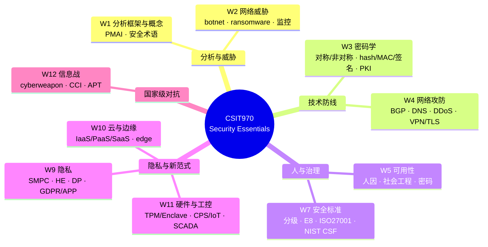
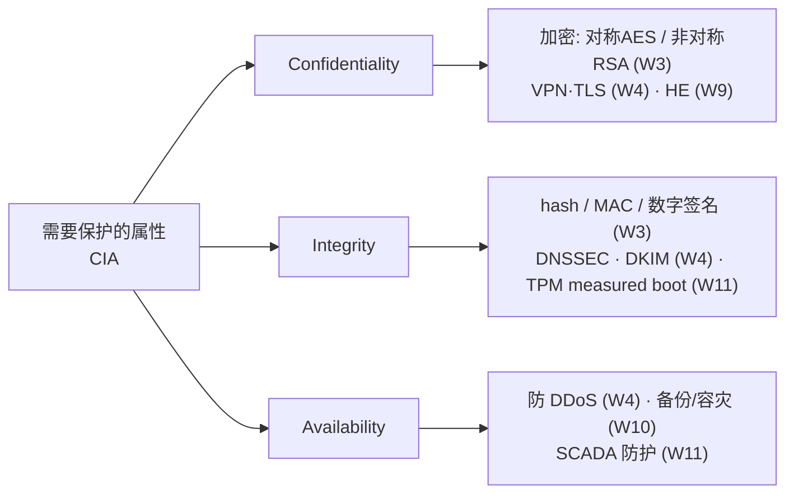

# CSIT970 Security Essentials · Week 13 期末总复习指南 (Revision & Exam-Prep Guide)

> 本周是**复习课 (Revision)**,没有新知识点。Dr. Steven Duong 在课上逐周(Week 1–12)回顾了整门课的脉络,并为**每一周给出了一组示例考题 (Sample Questions)**。这份指南把那些示例考题逐题配上**考试可直接用的模型答案 (model answers)**,再补上跨周的辨析速查与答题策略。
>
> 它是你考前的"一站式过卷"材料。想对某一周深挖,请回到对应的逐周详版指南(`week1-…` 至 `week12-…`)。

---

## 0. 先把考试信息搞清楚(来自 Week 13 课堂)

> 📎 **拓展(来自讲师口述,非 slides)** — 以下是讲师在复习课上讲的考试安排与得分规则,直接决定你怎么复习、怎么答题。**务必以 Moodle 上的官方信息为准,自行二次核对时间。**

### 考试形式

| 项目 | 内容 |
|---|---|
| **平台 / 时间** | Moodle 在线考试,**6 月 16 日 9:00–12:00**(请自行核对),时长 **3 小时** |
| **性质** | **闭卷 (closed book)**,**Proctorio 在线监考** |
| **题量** | 共 **26 题** = **11 道 MCQ(选择)** + **15 道 SAQ(简答)** |
| **总分** | **50 分**(970 计 50 分;470 学生换算为 40 分) |
| **及格线** | **必须拿到 ≥ 40%(即 ≥ 20 分)**,否则即使总分过 50 也算 **technical fail(技术性挂科)** |

### 分数怎么分布

- **MCQ:11 题 = 11 分**(每题 1 分)。**每人随机抽题**,你和同学拿到的题不一样;**单选,只有一个正确答案,没有填空**;风格类似平时的 quiz。
- **SAQ:15 题 = 39 分**。**多数 2 分**,部分 3 分,少数 **4–5 分**;高分题往往是**场景题 (scenario)**——给一段情境,下设 A/B/C 小问,每小问标明分值。

### 讲师给的答题建议(原话要点)

- **理解,不要死记** ("understand, not memorize"),但概念名词该记还得记。
- **答案要踩中 keywords** ——本指南每题后的「考点关键词」就是给你对照用的。
- **长度无下限也无上限**,"信息够了就行";**可以用 bullet points,也可以写段落**。
- **不要把题干抄进答案**,直接作答;考试中**禁止 copy-paste**(监考会捕捉)。
- 题目**可以前后跳转**修改。
- **别忘了 workshop**:考试覆盖所有 lecture **和 workshop notes**,讲师特别强调"**focus on the questions in the workshop notes**"。
- 出现技术问题(断网等)**不要联系 coordinator**,按指引重连、重新登录、从断点继续。

### 复习覆盖范围一览(对应逐周详版指南)

| 周 | 主题 | 详版指南 |
|---|---|---|
| W1 | Security Analysis Framework & Concepts | `week1-security-analysis-framework-study-guide` |
| W2 | Cyber Threats | `week2-cyber-threats-study-guide` |
| W3 | Cryptographic Issues | `week3-cryptography-study-guide` |
| W4 | Network Attack & Defence | `week4-network-attack-defence-study-guide` |
| W5 | Usability | `week5-usability-study-guide` |
| W7 | Cybersecurity Standards | `week7-cybersecurity-standards-study-guide` |
| W9 | Privacy Issues | `week9-privacy-issues-study-guide` |
| W10 | Cloud & Edge Computing | `week10-cloud-edge-computing-study-guide` |
| W11 | TPM / Enclave / CPS / SCADA | `week11-tpm-enclave-cps-scada-study-guide` |
| W12 | Info Warfare / Cyberweapon / CCI / APT | `week12-infowar-cyberweapon-cci-apt-study-guide` |

> 注:**Week 6 与 Week 8 没有课**(Week 8 因 Anzac Day 停课);故无 W6/W8 内容。

---

## 1. 整门课的脉络:一张概念地图

这门课从"**怎么分析安全**"出发,先认识**威胁**,再分**技术、人、治理**三条防线,最后进入**隐私、新计算范式与国家级对抗**等前沿议题。复习时把每一周挂回这张地图,比孤立背诵更牢。



**贯穿全课的一把尺子——CIA triad**(`Confidentiality` 机密性 / `Integrity` 完整性 / `Availability` 可用性):遇到任何攻击或防护,先问"它影响的是 C、I 还是 A?"这是简答题最稳的得分切入点(见最后的「跨周辨析速查」)。

---

## Week 1 · Overview of Security Analysis — Framework and Security Concepts

### 本周核心内容
- **Security Engineering** = building systems to remain dependable in the face of **malice / error / mischance**;与 software engineering 的根本区别在于后者"确保坏事*不*发生",需要 **adversarial thinking**。
- **Security Analysis Framework** 四要素(PMAI):**Policy**(想要什么)/ **Mechanism**(拿什么实现)/ **Assurance**(有多可靠)/ **Incentive**(谁有动机)——四者相互作用;切勿与 **CIA triad** 混淆。
- 角色术语层层不同:**Principal**(参与系统的*任意*实体,含设备与密钥,最宽)、**Subject**(人/法人)、**Role**(职能位,由人先后承担)、**Identity**(名字↔principal 的无歧义对应)。
- **Trusted ≠ Trustworthy**:trusted = 其失效会破坏 policy;trustworthy = 不会失效。"trusted but not trustworthy" 最危险。
- 信息不外泄三词:**Secrecy**(机制效果)、**Confidentiality**(为组织利益的保密义务)、**Privacy**(为个人利益的权利,可延伸到家庭但不及法人)。
- **Authenticity = Integrity + genuineness**:integrity 只说"没被改"(哈希即可,人人能算);authenticity 还说"确实是 TA 发的"(需密钥,如 HMAC/数字签名)。
- 三层规约:**Security policy**(要什么)→ **Security target**(具体产品怎么实现并据此验收)→ **Protection profile**(设备无关版,供横向比较)。

### 示例考题与模型答案

**Q1. Explain the difference between "privacy" and "confidentiality" in the context of cyber security (not cryptography).**

二者都是"保密",但服务的利益主体不同:**privacy** 是为了**个人(individual)**利益的保密——即个人保护自身信息、防止他人侵入私人空间的能力和/或权利(可延伸到家庭,但不延伸到法人);**confidentiality** 则是为了**组织(organisation)**利益的保密——即当你知晓了别人(个人或组织)的秘密时,所负有的保护它的**义务(duty)**。一个经典区分:`privacy is secrecy for the benefit of the individual; confidentiality is secrecy for the benefit of the organisation`。例如医院场景:病人对自己的信息**享有 privacy**,而医护人员对该信息**负有 confidentiality**(替病人承担的保密义务)。

**考点关键词:** `privacy` · `confidentiality` · `individual vs organisation` · `duty of confidence` · `not extend to legal person`

**Q2. How does a "trustworthy system" differ from a "trusted system"? Can a system be trusted but not trustworthy? Explain with justification.**

**Trusted** 指一个组件**一旦失效就会破坏安全策略**(security policy)——即我们已经把安全压在它身上;**trustworthy** 指一个组件**不会(不太可能)失效**——即它真的靠得住。两者并不等价:一个系统**完全可能 trusted but not trustworthy**,而这正是最危险的情形。典型例子是一名情报机构雇员,组织把机密**托付(trusted)**给他,他却打算把情报卖给外国——他被信任却**不可靠(not trustworthy)**。因此安全工程的目标之一,就是缩小"被信任"的部分,并让真正被信任的部分尽可能 trustworthy。

**考点关键词:** `trusted = failure breaks policy` · `trustworthy = unlikely to fail` · `trusted but not trustworthy (最危险)` · `justification by example`

**Q3. What is the difference between a "principal" and a "role" in the context of system security? Provide an example to illustrate your answer.**

**Principal** 是*参与安全系统的任意实体*,范围最宽——可以是一个人、一台设备(笔记本、手机、智能卡)、一条通信信道(端口),甚至一把**密码密钥(crypto key)**,也可以是群组或合取(如"Alice 且 Bob")。**Role** 则是*一组由不同的人先后承担的职能*——它是一个职位/功能位,而非具体某人,谁坐上这个位子谁就充当它。举例:在网银系统里,"用于签名交易的**密码密钥**"是一个 principal;而"现任冰岛医学会主席"或 LMS 中的 "Tutor" 则是一个 role(随任职者更替而由不同人承担)。

**考点关键词:** `principal = any entity (含 device / crypto key)` · `role = function held by different people in turn` · `crypto key 是 principal` · `Tutor / 主席 是 role`

### 速记要点
- **PMAI** ≠ **CIA**:PMAI 是"怎么分析系统",CIA 是"保住哪些属性"——高频陷阱。
- **Principal 最宽**(含设备、密钥);Subject 是人/法人;Role 是职能位;Identity 是"名字↔principal 的无歧义对应"。
- **Trusted = 失效会破坏 policy;Trustworthy = 不会失效**;"trusted but not trustworthy" 必考。
- **Privacy = 个人利益的保密;Confidentiality = 组织利益的保密;Secrecy = 机制效果**。
- **Authenticity = Integrity + genuineness**;哈希(SHA-256)只给 integrity(人人能算),authenticity 必须用密钥(HMAC/签名)。

---

## Week 2 · Cyber Threats

### 本周核心内容
- **Cybercrime** = 使用计算机或网络实施犯罪;趋势是"更可规模化、更专业、更具破坏性",目标涵盖个人/企业/教育/政府。
- **Criminal infrastructure**(犯罪基础设施)是一条分工产业链,像"地下服务经济":botnet herders、malware writers、spam/phishing operators、info-stealer/initial access brokers、cashout operators。
- **Botnet** = 被 **C2 (command-and-control)** 远程操控的一大片被攻陷设备(含 PC、路由器、摄像头、IoT);代表 Storm / Conficker(**DGA**) / Mirai(IoT 默认口令)。
- **Staged delivery** 三件套:**Dropper**(自带并释放下一阶段)、**Downloader**(从网上下载下一阶段)、**Payload**(真正动手干活的部分)。
- **Ransomware** = 用于敲诈的恶意软件(加密/扰乱/威胁泄露);演化出 **double extortion**、**RaaS**;付款用伪匿名加密货币。
- **Hacktivism** = 政治/意识形态驱动的在线活动;手法含 DoS、website defacement、hack-and-leak、doxxing。
- **Mass surveillance**:Snowden 揭露的 PRISM / Tempora / Muscular / Bullrun(Dual_EC_DRBG) / XKeyScore;现代转向 **mercenary spyware**。
- 关键认识:加密货币是 **pseudonymous(伪匿名)而非 anonymous(匿名)**,区块链可溯源,KYC/AML 收紧套现。

### 示例考题与模型答案

**Q1. Explain what the dropper mechanisms of the virus and Trojan are.**

Dropper 是 **staged (malware) delivery**(分阶段投递)里的**第一阶段(first-stage)**恶意软件,其唯一任务是在受害者系统上**安装或释放(install/release)另一段 payload**。其机制特点是"**自带并释放**":dropper **本身就携带**着下一阶段的恶意代码,运行后把它落到磁盘上并执行——它**本身不是最终的恶意组件**,而是"先遣队"。Trojan(木马)常被用作 dropper 的伪装外壳:它**伪装成合法/无害软件骗用户运行**,运行后便由内部的 dropper 把真正的 payload 释放出来。需与 **downloader** 区分:downloader **自身不携带**载荷,而是初次攻陷后**联网从 internet 下载**下一阶段。一句话:**dropper 自带、downloader 去取、payload 动手**。

**考点关键词:** `dropper = install/release next-stage payload` · `自带并释放 (carries internally)` · `staged delivery` · `Trojan 伪装外壳` · `vs downloader (从网上下载)`

**Q2. What is a botnet, and how is it typically used in cybercrime?**

**Botnet** 是一个由被攻陷的计算机和联网设备(含家用路由器、摄像头、IoT)组成的网络,攻击者通过 **C2 (command-and-control)** 基础设施**远程协同操控**它,而设备主人通常毫不知情。生命周期为三步:**infection**(经钓鱼、恶意下载、默认口令、暴露服务、未打补丁漏洞感染)→ **command and control**(设备回连 C2 等待指令)→ **uses**(干活)。在网络犯罪中典型用途包括:发动 **DDoS** 攻击、分发 spam 与 phishing、窃取凭证或投递恶意软件、**匿名代理犯罪流量**(借肉鸡 IP 隐藏真实身份)、以及 cryptomining 等资源滥用。其威力在于把海量设备协同起来**放大攻击规模**,且因分布式、持久、隐藏而**难以根除**(如 Conficker 用 DGA 使 C2 难封、Mirai 利用无人管的 IoT 默认口令)。

**考点关键词:** `network of compromised devices` · `C2 / command-and-control` · `infection → C2 → uses` · `DDoS / spam / proxy / cryptomining` · `难根除 (distributed, persistent, hidden)`

**Q3. Compare and contrast ransomware and hacktivism in terms of their objectives, methods, and typical targets.**

| 维度 | **Ransomware(勒索软件)** | **Hacktivism(黑客行动主义)** |
|---|---|---|
| **Objectives 动机** | **财务驱动(financially motivated)**——敲诈牟利 | **政治/意识形态驱动**——表达诉求、施压、抗议 |
| **Methods 手法** | 加密数据、扰乱系统、威胁泄露(**double extortion**);常用 **RaaS** 模式;索要加密货币赎金 | **DoS** 攻击、**website defacement**、**hack-and-leak**、**doxxing and harassment**;借社交媒体放大 |
| **Typical targets 目标** | 高价值实体,尤其**公共部门与医疗机构**(服务中断后果严重) | **政府与面向公众的组织**、高知名度或卷入争议议题的公司 |
| **核心差异** | 目的是**金钱**;成败看能否收到赎金 | 目的是**影响力/声誉打击**;哪怕技术不高深,经舆论放大损害也可能极大 |

**考点关键词:** `ransomware = financially motivated / extort` · `hacktivism = politically/ideologically motivated` · `double extortion / RaaS` · `DoS / defacement / hack-and-leak / doxxing` · `healthcare vs government targets`

**Q4. What role does mass surveillance technology play in cybersecurity, and why is it considered both a protective tool and a potential threat to privacy?**

Mass surveillance technology 是国家级行为体的工具集,既能对网络做**被动监控(passive surveillance)**(如监听骨干流量),也能对系统发起**主动攻击(active attacks)**。作为**保护工具(protective tool)**:它可用于国家安全、情报收集、识别与追踪犯罪与恐怖活动——配合 XKeyScore 这类搜索分析系统,大规模收集的数据才能在反犯罪/反恐中真正发挥威力。作为**隐私威胁(threat to privacy)**:Snowden 泄密揭示的 PRISM、Tempora、Muscular 等项目表明监控可发生在**网络骨干**而非仅终端,且 **Muscular** 证明用户可见的加密(HTTPS)并不保证每条内部链路都受保护;**Bullrun/Edgehill**(如 Dual_EC_DRBG)更主动**破坏密码学标准与供应链**,削弱所有人的防护;现代 **mercenary spyware** 还能高度针对性地监控记者、活动人士等个人。因此它本质是一柄双刃剑:同一套能力既能保护公众,也能在缺乏监督时**无差别侵蚀公民隐私**。

**考点关键词:** `passive surveillance vs active attacks` · `PRISM / Tempora / Muscular / Bullrun / XKeyScore` · `protective: 情报/反恐/犯罪追踪` · `threat: backbone collection / 削弱密码学 / mercenary spyware` · `dual-use / 缺乏监督`

### 速记要点
- **Dropper 自带并释放、Downloader 从网上下载、Payload 动手**——本周最常考辨析。
- **Botnet = 被 C2 控制的被攻陷设备网**;三著名:Conficker(**DGA**)、Mirai(IoT 默认口令)、Storm(早期)。
- **Ransomware = 财务驱动**;**Hacktivism = 政治/意识形态驱动**——两者对比的最核心分界。
- **RaaS**:operators 提供工具与基础设施,affiliates(无需技术)实施攻击;**double extortion** = 加密 + 威胁泄露。
- 加密货币 **pseudonymous ≠ anonymous**,区块链可溯源(KYC/AML);**Muscular** 教训:用户可见加密 ≠ 每条内部链路受保护。

---

## Week 3 · Cryptographic Issues

### 本周核心内容
- **Cryptography ≠ encryption + decryption**:它是一族 primitives,1976 年 Diffie–Hellman 是分水岭(之前只有对称加密)。
- **Taxonomy**:`Keyless`(hash)/ `Key-based`,后者再分 `Symmetric`(SKE、MAC)与 `Asymmetric`(key exchange、PKE、digital signature)。判据:用前是否要先共享同一把秘密密钥。
- **Key = n-bit string**:猜中概率 $1/2^n$,暴力破解时间 $T=2^n/C$;`128-bit` very safe、`256-bit` 物理不可破。
- **Symmetric encryption**:同一把 $k$ 加解密;`stream cipher`(逐位 XOR keystream)vs `block cipher`(分块,代表 `AES`)。
- **三件套**:`hash`(无密钥,只给 integrity)→ `MAC`(对称,integrity + authentication)→ `digital signature`(非对称,额外给 non-repudiation)。
- **Asymmetric / RSA**:接收方公钥加密、私钥解密;RSA 安全性建立在 `factorization`(大数分解)难题,故 $p,q$ 取 1024/2048 位;`Shor's algorithm` 是量子威胁。
- **PKI / CA**:公钥需认证身份绑定,否则有 `MITM`;CA 用私钥签 `digital certificate`。
- **Side-channel attack**:绕过数学证明,从实现的物理泄漏(timing/power/EM/sound)偷密钥。

### 示例考题与模型答案

**Q1. What is the main difference between symmetric and asymmetric encryption? Provide one example of each.**

核心区别在于密钥结构:`symmetric encryption`(对称加密)中收发双方使用**同一把** secret key 进行加密和解密,因此使用前双方必须**先共享这把密钥**;而 `asymmetric encryption`(非对称加密,又称 public key encryption)使用**一对密钥**——公开的 `public key` 用于加密、保密的 `private key` 用于解密,公钥可以公开发布,因此**无需事先共享任何秘密**,从而解决了陌生人之间的首次密钥分发难题。代价是对称加密**快**而非对称加密**慢得多**。Example:symmetric 的例子是 `AES`(或一般的 block cipher);asymmetric 的例子是 `RSA`。

**考点关键词:** `same shared secret key` · `public key / private key pair` · `key distribution` · `AES` · `RSA`

**Q2. What is a side-channel attack? Give one example of how it can be used to compromise a cryptographic system.**

`Side-channel attack`(侧信道攻击)是一类**不去攻击算法本身**(算法可能数学上完美无缺),而是利用密码算法**运行时从具体实现中泄漏的物理信息**来恢复密钥的攻击;可被利用的侧信道包括 `timing`(计算耗时)、`power consumption`(功耗)、`electromagnetic leaks`(电磁泄漏)和 `sound`(声学)。它属于 `passive attack`,因为攻击者只是旁观/测量而不干预通信。一个典型例子是对 **RSA 解密**的 `power analysis`(功耗分析):RSA 解密用 `square-and-multiply` 做指数运算,私钥比特为 1 时会多做一次乘法、从而**多耗一点电**,攻击者观察功耗曲线(宽峰=1、窄峰=0)即可**逐位读出私钥** $d$——算法没被破,密钥却从实现里漏了出来。

**考点关键词:** `information from implementation` · `timing / power / EM / sound` · `passive attack` · `RSA square-and-multiply` · `power analysis`

### 速记要点
- **Hash vs MAC vs Signature**:三者都给 integrity;`MAC` 和 `signature` 额外给 authentication;**只有 `digital signature` 给 `non-repudiation`**(因为只有签名者持私钥;MAC 双方共享密钥都能造 tag)。
- **Digital signature 原理**:发送方用**自己的 private key 签**、任何人用其 **public key 验**;注意与 PKE 的用钥方向**相反**(PKE 用接收方公钥加密)。
- **PKI/CA 作用**:把"身份↔公钥"用 CA 的签名绑定成 `certificate`,防 `man-in-the-middle`;信任被归约到"信任一个 CA 的公钥"。
- **RSA 安全来源**:`prime factorization` 难题;量子威胁 = `Shor's algorithm`,应对是 `post-quantum cryptography`。
- **MD5 / SHA-1 已 broken**(不再 collision-resistant),现用 `SHA-2`/`SHA-3`。
- **密钥强度取决于真实 entropy,不是输出长度**:10 位种子哈希成"128 位"密钥,真实安全性仍只有 $2^{10}$。

---

## Week 4 · Network Attack and Defence

### 本周核心内容
- **基础协议为"连通"而生、不为"安全"而生**:`IP` 只送达且明文、可被 spoof;`ARP` 无认证可被欺骗;`DHCP` 自动分配 IP;`NAT` 让多设备共享一个公网 IP。
- **路由层**:Internet = `AS`(自治系统)互联;`BGP` 在 AS 间交换路由、建立在信任之上;攻击是 `BGP hijacking`,防御是 `RPKI` + `ROA`(数字签名)。
- **名字解析层**:`DNS` 把域名解析为 IP;攻击是 `DNS hijacking / pharming / cache poisoning`;防御是 `DNSSEC`(签名保完整性/真实性)与 `DoH`(加密保隐私)。
- **可用性攻击**:`DDoS` 用 `botnet`(2016 后大量 IoT 设备,如 `Mirai`)海量流量压垮目标,纯打 `Availability`。
- **邮件**:`SMTP` 默认不加密、易伪造发件人;反垃圾靠 `DKIM`(签名 + DNS 公钥)+ 机器学习过滤。
- **三大防御**:`packet filtering/firewall`(按包头过滤,不加密)、`VPN/IPSec`(IP 层,认证+完整性+可选机密性,用 `IKE`/`Diffie–Hellman` 建密钥)、`TLS`(传输层,机密性+完整性+服务器认证)。

### 示例考题与模型答案

**Q1. What is the disadvantage of using DNS-over-HTTPS (DoH)?**

`DoH` 把 DNS 查询**加密后走 HTTPS** 发送,提升了用户**隐私**(ISP、网络运营商看不到用户查了哪些域名);但其主要缺点是**削弱了网络防御方的可见性 (visibility)**,使企业/网络的**监控与过滤变难**。具体而言,安全团队更难检测试图联系可疑/C2 域名的 `malware`、更难监测 `DNS hijacking`、也更难在受管环境里封锁不当或违规域名;同时它把 DNS 的控制权推向应用层提供商。一句话:**DoH 提升 confidentiality(隐私),代价是降低了网络层的安全可见性与可控性。**

**考点关键词:** `encrypts DNS queries` · `privacy ↑` · `reduced network visibility` · `harder monitoring / filtering` · `malware / C2 detection`

**Q2. How can attackers exploit the Border Gateway Protocol (BGP) to launch a network attack?**

`BGP` 是 AS 之间交换路由信息的协议,但它在历史上**建立在 AS 运营者之间的相互信任之上,缺乏对路由通告真伪的强校验**。攻击者据此发动 `BGP hijacking`:**谎称自己拥有或能到达某段 IP 前缀 (IP prefix)**,而实际并不拥有它;一旦这条虚假路由通告被邻居接受,就会像谣言一样**扩散到全网**,把本应流向真正目的地的流量引到攻击者控制的路径上。后果包括:把用户重定向到假网站做 `phishing`、通过流量黑洞 (`blackholing`) 造成**拒绝服务**、或把流量绕经攻击者以进行**窃听/监控**。防御是 `RPKI` + `ROA`,用数字签名验证"谁被授权通告该前缀"。

**考点关键词:** `built on trust / no strong validation` · `false route advertisement` · `bogus IP prefix` · `traffic redirection` · `RPKI / ROA`

**Q3. What problem does DNSSEC aim to solve in the Domain Name System, and how does it achieve this?**

`DNSSEC` 要解决的根本问题是:**普通 DNS 无法让 resolver 分辨收到的应答是真是假**,因此 DNS 记录可被篡改或伪造(导致 `DNS hijacking`、`cache poisoning`、`pharming`,把用户导向恶意 IP)。它的解决办法是给 DNS 记录**附加数字签名 (digital signatures)**:resolver 用相应公钥验证签名,从而确认该记录**确实来自权威服务器、且传输中未被篡改**。因此 DNSSEC 提供的是 DNS 响应的 **integrity(完整性)+ authenticity(真实性)**——注意它**不提供机密性**(不加密查询),也**不能防 DDoS**(其更大的响应反而可被滥用做 amplification 攻击)。

**考点关键词:** `tampered / forged DNS records` · `digital signatures` · `integrity + authenticity` · `not confidentiality` · `cache poisoning`

**Q4. What is the role of NAT (Network Address Translation) in network security, and why is it not considered a true security mechanism?**

`NAT` 的主要功能是**地址转换**:让一个私有网络里的**多台**设备**共享一个**对外公网 IP(靠端口号区分),其设计目的是应对 IPv4 地址耗尽,而非安全。它带来的安全相关"副作用"是:外部看不到内网具体是哪台设备,攻击者较难直接定位内网某台主机。但它**不是真正的安全机制 (not a security control by itself)**,因为它**不提供 confidentiality、integrity 或 authentication**——既不加密也不认证流量,所谓隐藏只是地址转换的不可靠副产品。它真正的安全影响其实是**负面的**:让事后追责 (`attribution`) 变难,因为日志里往往只剩那个共享的公网 IP,看不出是内网哪台机器。

**考点关键词:** `address translation / share one public IP` · `not a security control by itself` · `no encryption / authentication` · `attribution harder`

**Q5. How does a VPN using IPsec ensure confidentiality and integrity of data over the internet?**

`VPN` 在不可信的互联网之上、于 **IP 层**建立一条受保护的隧道,靠 `IPsec` 协议套件实现。它通过 `IKE`(Internet Key Exchange,常用 `Diffie–Hellman`)在双方之间**协商并建立共享密钥**,并由 `Security Association (SA)`(密钥+算法+参数的配置)规定如何保护流量。**Confidentiality(机密性)**:用协商出的密钥对 IP 数据包**加密**,使路径上的窃听者读不到内容;**Integrity + authenticity(完整性与真实性)**:IPsec 对数据包附加认证,使任何篡改都能被检测、并确认数据确实来自合法对端。IPsec 有两种强度:"仅认证"只保完整性/真实性,"认证 + 加密"再加上机密性。

**考点关键词:** `IP-layer tunnel` · `IKE / Diffie–Hellman key exchange` · `Security Association` · `encryption → confidentiality` · `authentication → integrity`

### 速记要点
- **DNS 劫持 vs BGP 劫持**:`DNS hijacking` 改"地址簿"(域名→IP 的映射,打 `Integrity`);`BGP hijacking` 改"路线图"(流量走的路径,主打 `Availability`)。
- **CIA 速判**:`DDoS`→A;`BGP 黑洞`→A;`DNS hijacking`→I(可波及 C);网络窃听→C。
- **TLS = handshake + record**:`Handshake` 认证双方、协商算法、用 `Diffie–Hellman` 建共享密钥;`Record` 用该密钥做**带认证的对称加密**保护数据。体现"非对称定身份 + 对称传数据"。
- **DNSSEC ≠ 万能**:引入 `zone enumeration`(NSEC3 缓解)和 `amplification`(响应更大可被滥用做反射型 DDoS)两个新问题。
- **DKIM**:发信方给邮件附数字签名,收信方用**发信域名 DNS 里公布的公钥**验证 → 认证域名 + 防篡改。
- **包过滤局限**:可被 `packet fragmentation` 绕过;不加密、不提供机密性。

---

## Week 5 · Usability & Security

### 本周核心内容
- 安全首先是**人的问题 (human factor)**,其次才是技术问题;攻击者绕过技术,直接利用人的心理弱点。
- Cognitive psychology 三类 **human error**:`slips/lapses`(技能层,如 post-completion error)、`mistakes`(规则层,信息过载下走捷径)、`misconceptions`(认知层,根本没理解,如 Why Johnny Can't Encrypt)。
- Social psychology:**Asch / Milgram / Zimbardo** 证明人极易服从权威与群体;`bystander effect`(责任分散)。
- Social engineering:攻击人而非技术,有可复用剧本(Cialdini 六原则、Stajano & Wilson 七大诈骗原则);`phishing` 是旗舰攻击,已演化为 `spear-phishing`。
- OPSEC = 训练员工 + 讲清原因 + 建立 culture of compliance,不只是堆规则。
- Password system 存 **hash 不存明文**(加 `salt` 加固);`password recovery` 是认证体系最弱入口(security questions、email recovery、SIM swap)。
- 好记 vs. 安全的最优解是 **mnemonic passphrase**(Yan 2004 验证);用 `password entropy` 量化强度;避开强制定期改密(NIST 已改建议)。
- **CAPTCHA** 反向利用人类强项,本质是一个困难 AI 问题,但会被攻破且有公平性缺陷。

### 示例考题与模型答案

**Q1. Explain what generating passwords using mnemonic phrases means.**

Mnemonic phrase(助记短语)方法指:用户先想出一句自己记得住、但别人难以猜到的句子,再从每个词中**抽取首字母**(并掺入数字、大小写等变化),拼成密码。例如 "CSIT970 is a fantastic subject, but I hate the lecturer" → `C9IAFSBIHTL`。这样生成的密码**对攻击者看起来像随机串**(难猜、熵高),但用户靠原句就能复现(好记)。Yan 等人 2004 年的实验证明,基于 mnemonic phrase 的密码与纯随机密码安全性相当、重置率无显著差异,因此被视为兼顾 usability 与 security 的 "best of both worlds"。

**考点关键词:** `mnemonic phrase` · `passphrase` · `password entropy` · `Yan 2004` · `memorable yet hard to guess`

**Q2. What is the bystander effect, and how can it influence security behaviour in an organization during a cyber incident?**

Bystander effect(旁观者效应)指:当**很多人**都注意到一个问题时,每个人都假设"别人会去处理",结果**没有一个人**采取行动;关键变量是 responsibility(责任感)的分散(经典案例为 Kitty Genovese,单独旁观者 85% 会施救,但以为还有 4 人在场时降至 31%)。在组织遭遇网络事件时,员工收到可疑邮件会想"公司这么多人,肯定早有人报给 IT 了",于是人人如此想、最终无人上报,白白延长了攻击窗口。对策是明确每个员工对上报负有责任,并提供便捷的钓鱼/可疑活动上报渠道。

**考点关键词:** `bystander effect` · `diffusion of responsibility` · `Kitty Genovese` · `no one reports` · `reporting channels`

**Q3. What is social engineering, and why is it often more successful than technical attacks?**

Social engineering(社会工程)指通过**心理操纵 (psychological manipulation)**,诱使人泄露机密信息或执行不安全操作——它**攻击的是使用技术的人,而非技术本身**。它之所以常比技术攻击更成功,原因在于:① 人类对抗欺骗的天然防御几乎都为 face-to-face 场景进化而来,面对邮件/短信时这些线索全失效;② 它绕开了加密、防火墙等技术防线,直接利用 Cialdini 六原则(authority、scarcity、social proof 等)和认知/社会心理弱点;③ Internet 和 SNS 让攻击者能低成本获取目标信息、批量触达。换句话说,即使技术机制完美无缺,只要人被操纵,安全依然失效。

**考点关键词:** `psychological manipulation` · `attack the human, not the technology` · `Cialdini principles` · `phishing` · `bypasses technical controls`

**Q4. Explain how poor operational security (Opsec) practices in personal life can lead to organizational data breaches.**

OPSEC(Operational Security)关注让员工有能力**抵御外部人员套取机密的劝诱**;个人生活中的薄弱 OPSEC 会成为组织的入口。例如:员工在社交媒体上公开晒出宠物名、生日、喜好,攻击者据此猜中 security questions 的答案或定制 `spear-phishing`;在工作账号与个人账号上**复用同一密码**,个人账号一旦泄露便殃及公司账号;用安全设置很差的个人设备(BYOD)收发工作邮件,把组织数据暴露给恶意软件。由此可见 OPSEC 不只是几条规则,而要靠**训练、讲清原因、建立合规文化**,且即使受信任的员工也是社会工程目标。

**考点关键词:** `OPSEC` · `password reuse` · `social media exposure` · `spear-phishing` · `BYOD` · `culture of compliance`

**Q5. What are common weaknesses in password recovery mechanisms, and how can they be exploited by attackers?**

Recovery 往往是整条认证链上**最弱的一环**,因为攻击者无需攻破主登录,只要利用更弱的重置流程即可拿到账户。三种主流机制各有软肋:

1. **Security questions(安全问题)**——答案常是公开或近乎公开的(Google 2015:"最喜欢的食物"一次猜中率 19.7%,16% 答案可公开获取),攻击者翻社交媒体即可猜出。
2. **Email recovery(邮箱找回)**——邮箱是单点故障 (single point of failure),一旦邮箱被攻破,所有依赖它重置的账户全部沦陷。
3. **SMS recovery(短信找回)**——可被 **SIM swap** 攻击截获:攻击者冒充受害者诱使运营商补办 SIM,使所有验证码改发到攻击者手中。

此外 help-desk 客服流程也可能被社会工程骗过。

**考点关键词:** `password recovery` · `security questions` · `email recovery (single point of failure)` · `SIM swap` · `help-desk social engineering` · `weakest link`

**Q6. Explain the security risk of the password manager.**

Password manager(密码管理器)能自动生成强密码、检测复用、备份恢复并追踪泄露,但它引入了**单点故障风险**:所有密码都受一个 **master password(主密码)** 保护——一旦主密码被攻破或被钓走,攻击者可能**一次性拿到全部密码**;若用户忘记主密码,也可能丢失所有凭据。尽管如此,从可用性安全角度看其收益通常大于风险,因此**禁用/屏蔽密码管理器(如禁止粘贴密码)反而会把用户推向更弱的密码**,应予避免。

**考点关键词:** `password manager` · `master password` · `single point of failure` · `generates strong passwords` · `don't block password managers`

### 速记要点
- 三类 human error:`slips/lapses`(技能)· `mistakes`(规则)· `misconceptions`(认知)。
- Cialdini 六原则:`Reciprocity` · `Commitment/consistency` · `Social proof` · `Liking` · `Authority` · `Scarcity`。
- 钓鱼家族:`phishing`(邮件)· `smishing`(短信)· `vishing`(电话)· `spear-phishing`(定向)· `pretexting`(借口铺垫)。
- 找回三弱点 + 攻击:security questions(易猜)· email(单点故障)· SMS(`SIM swap`)。
- 系统存 **hash 不存明文** + `salt`;`hashing ≠ encryption`(不可还原)。
- CAPTCHA = Completely Automated Public Turing test = 困难 AI 问题;局限:被 AI 攻破 + 公平性(视障/听障)。

---

## Week 7 · Cybersecurity Standards & Frameworks

### 本周核心内容
- 四个概念枢纽:`policy`(内部规则,要什么)→ `control`(降风险的安全措施,怎么做)→ `standard`(正式参考,如 ISO 27001)→ `framework`(宏观模型,如 NIST CSF);实践中四者协同。
- 好的 information security policy:清晰、贴合本组织威胁与业务、能指导控制设计、传达安全期望。
- Access control + `need-to-know principle`:权限随角色/职责走,只给完成工作必需的最小访问权,在账户被攻破时限制损失。
- Authentication:唯一账户保证 `accountability`,记录成败登录以发现攻击信号、支撑取证。
- Data classification:`Public / Internal / Confidential / Restricted`,分级决定该上多强的控制。
- **Essential Eight**(ASD 的有优先级基线)+ `maturity level 0–3`;对 enterprise mobility 与 OT(ICS/SCADA/PLC)需另作补充。
- **Risk management** 五步循环;**ISO/IEC 27001**(ISMS 标准,以 CIA + 风险为核心,持续改进);**NIST CSF** 五大功能。

### 示例考题与模型答案

**Q1. What is the purpose of classifying data within an organization, and what are common classification levels?**

Data classification(数据分级)的目的是:并非所有信息都需要同等强度的保护,否则成本高得离谱;因此按**敏感度 (sensitivity)** 给数据分级,从而**决定每类数据需要多强的控制 (classification decides what control is needed)**,把加密等高成本手段精准投放到最该保护的数据上。常见的四级模型(从低到高)为:

| 级别 | 含义 | 控制含义 |
|---|---|---|
| **Public**(公开) | 可对外公开分享(如市场宣传资料) | 不需要加密 |
| **Internal**(内部) | 仅供组织内部正常使用 | 一般内部管控 |
| **Confidential**(机密) | 敏感,仅限特定用户访问 | 访问受限 |
| **Restricted**(受限/绝密) | 高度敏感,需最强保护(如病历、薪资) | 必须加密 |

**考点关键词:** `data classification` · `sensitivity` · `Public/Internal/Confidential/Restricted` · `classification decides the control` · `encrypt restricted data`

**Q2. List the five core functions of the NIST Cybersecurity Framework (CSF).**

NIST CSF 的五大核心功能,按顺序为:

1. **Identify**(识别)——认清需要保护的流程与资产:"你有什么、什么最重要"。
2. **Protect**(保护)——部署恰当的 safeguards 保护企业资产。
3. **Detect**(检测)——部署机制以发现网络安全事件的发生。
4. **Respond**(响应)——遏制 (contain) 并处理事件影响。
5. **Recover**(恢复)——还原因事件受损的能力与服务,回到正常运营。

其深意在于:**安全不止于预防**——detect、respond、recover 同等重要,即假设攻击迟早会突破,你还得能发现、控制并从中恢复。

**考点关键词:** `Identify` · `Protect` · `Detect` · `Respond` · `Recover` · `not just prevention`

**Q3. What are the essential steps of the risk management process?**

Risk management(风险管理)是系统化地识别、度量、处置各种损失暴露,以降低事件概率与影响、并为安全决策排序。其标准流程为五步:

1. **Identify**(识别风险)——找出可能出错的地方。
2. **Analyze**(分析风险)——理解其性质与成因。
3. **Evaluate**(评估风险,即 risk assessment)——衡量其可能性与影响、排定优先级。
4. **Treat**(处置风险)——采取缓解/转移/接受等措施。
5. **Monitor & Review**(监控与复查)——持续观察控制是否有效。

关键点是:这是一个**永不停止的循环 (cycle)**,而非一次性任务——监控复查后又回头识别下一周期的新风险,因为威胁和技术在不断变化。

**考点关键词:** `Identify → Analyze → Evaluate → Treat → Monitor & Review` · `risk assessment` · `continuous cycle` · `not one-off`

### 速记要点
- 四个词:`policy`(要什么)· `control`(怎么做)· `standard`=ISO 27001 · `framework`=NIST CSF。
- **Essential Eight**(三组记法):阻止恶意代码运行(`application control` · `Office macros` · `user app hardening`)+ 削弱攻击者(`restrict admin privileges` · `MFA`)+ 减少暴露并可恢复(`patch applications` · `patch OS` · `regular backups`);`maturity level 0–3`。
- **ISO/IEC 27001** = 建立 **ISMS** 的标准;目标 = **CIA triad**;以风险为中心 + `continuous improvement`;14 domains、114 controls。
- **NIST CSF** 五功能:`Identify → Protect → Detect → Respond → Recover`。
- `need-to-know`:只给必需的最小访问权,可在账户被攻破时限制损失。
- MFA 三因素:`something you know` · `something you have` · `something you are`。

---

## Week 9 · Privacy Issues

### 本周核心内容
- **隐私 (Privacy) = 控制权**:对"披露什么 / 给谁 / 在什么条件下"的控制能力,三要素是 `When`(时间敏感性)、`How`(手动 vs 自动)、`Extent`(模糊 vs 精确);不是"藏起一切"。
- **在线隐私三大威胁**:`Hacking`(未授权入侵窃取)、`Tracking`(行为追踪 → profiling 画像)、`Trading`(数据交易卖给第三方);后两者多为"自愿提供、后续被滥用",必须靠法规约束。
- **四种隐私保护技术**:`SMPC`(多方算函数不暴露输入)、`Federated Learning`(数据留本地、只传 model updates)、`Homomorphic Encryption`(密文上计算、输入与结果都加密)、`Differential Privacy`(给发布结果加噪声、由 `ε` 量化)。
- **SMPC 核心机制**:加性 `secret sharing`——拆随机份额 → 各持一份 → 公开各自手里份额之和 → 求总和 / 人数;无需 `Trusted Third Party (TTP)`。
- **DP 核心不等式** $\Pr[M(D)\in S]\le e^{\varepsilon}\Pr[M(D')\in S]$:`D` 与 `D'` 只差一条记录;`ε` 越小 → 噪声越多 → 隐私越强但精度越低。
- **为何 ML 需要隐私技术**:ML 本质是 multi-stakeholder computation(data owner / model owner / service provider / end user 互不信任),原始数据含敏感信息,直接共享带来隐私 / 法律 / 安全三重风险。
- **GDPR**(EU,2018-05-25):区分 `Controller` / `Processor`;7 大原则 + 8 项权利(含 `SAR`);罚款 €10M/2% 或 €20M/4%。
- **Australian Privacy Act 1988**:13 条 `APPs`,principle-based + technology neutral;`Ethical AI` 核心难题是不透明 + bias,澳洲有 8 条 AI Ethics Principles。

### 示例考题与模型答案

**Q1. Do calculations as in the Assignment and Example in Class for MPC.**

下面是一个完整、可复现的 `Secure Multi-Party Computation (SMPC)` worked example——三位同事 Alice、Bob、Cate 想算出**平均工资**,但谁都不愿透露自己的工资,且**没有可信第三方 (Trusted Third Party)**。工具是 **加性 (additive) (3,3)-secret sharing**:每个秘密拆成 3 份随机份额,三份之和等于真实值,任意单份泄露不了原值。

设真实工资为:Alice = \$70K,Bob = \$60K,Cate = \$80K(真实平均应为 (70+60+80)/3 = \$70K,用来校验)。

**第一步:每人把自己的工资随机拆成 3 份**(拆法任意,只要三份相加 = 真实工资;给自己留一份,另两份发给另外两人)

```
Alice $70K → ( 35,  10,  25)   自己留 35, 给 Bob 10, 给 Cate 25
Bob   $60K → ( 50, -20,  30)   给 Alice 50, 自己留 -20, 给 Cate 30
Cate  $80K → ( 15,  95, -30)   给 Alice 15, 给 Bob 95, 自己留 -30
```

校验拆分正确:35+10+25 = 70;50−20+30 = 60;15+95−30 = 80。注意份额可以是负数或大于工资——这正是为什么单看一份(如 Bob 收到的 95)推不出任何人的真实工资。

**第二步:每人把"自己手里持有的所有份额"加起来,只公开这个和**(单位 \$K)

| 真实工资(行) | Alice 持有 | Bob 持有 | Cate 持有 |
|---|---|---|---|
| 70 (Alice) | 35 | 10 | 25 |
| 60 (Bob) | 50 | −20 | 30 |
| 80 (Cate) | 15 | 95 | −30 |
| **公开的和(列)** | **100** | **85** | **25** |

- Alice 公开:35 + 50 + 15 = **\$100K**
- Bob 公开:10 + (−20) + 95 = **\$85K**
- Cate 公开:25 + 30 + (−30) = **\$25K**

**第三步:把三个公开的和相加,再除以人数 3**

$$\text{平均工资} = \frac{100 + 85 + 25}{3} = \frac{210}{3} = \$70\text{K}$$

结果与真实平均 \$70K 完全一致。

**为什么没人能看到他人原始值:** 三个公开和之和按列重组,正好把每个人的 3 份份额都收齐,因此**三个公开和之和恰好等于三人工资之和**。整个过程**只暴露了"总和 / 平均"这一个聚合量**;Alice 只见过别人发给她的份额(50、15),Bob、Cate 同理,谁都无法反推出他人真实工资。

**诚实补充(常考易错点):** SMPC 不是"零泄露"。若 Alice 自己工资 = \$80K 而算出平均 = \$70K,她能推断"另两人平均比我低",但**推不出具体是谁、具体多少**。这呼应了"隐私是控制的程度,而非绝对零泄露"。

> 备考变体——平均年龄:若题目改成"3 人算平均年龄"(如 25/30/35),做法完全一致:各自把年龄随机拆 3 份 → 互换 → 各公开手中份额之和 → 三和相加 ÷ 3 = (25+30+35)/3 = 30。只是把 $K 换成"岁"。

**考点关键词:** `additive secret sharing` · `(3,3)-secret sharing` · `no Trusted Third Party` · `secure aggregation` · `privacy ≠ zero leakage`

**Q2. Explain how Homomorphic Encryption (HE) keeps user data privacy on clouds or machine learning.**

`Homomorphic Encryption (HE,同态加密)` 是一种允许**在密文 (ciphertext) 上直接做计算**的加密技术:对密文做运算得到的是"加密的结果",解密后等于直接在明文上做同样运算的结果。最重要的性质(以加法为例)是 $E(M_1 + M_2) = E(M_1) + E(M_2)$。它在云/ML 中保护隐私的流程是(外包计算类比):**① 用自己的密钥把数据加密 → ② 把密文发给云 → ③ 云在密文上直接跑算法(全程不解密)→ ④ 返回加密的结果 → ⑤ 你用自己的密钥解密得到答案。** 全程云只见到密文。HE 的强大之处在于它**同时保护输入数据和计算结果的机密性**(不像 SMPC 最终结果是明文);代价是**效率**——HE 目前仍较慢,是隐私保护 ML 的研究热点。

**考点关键词:** `compute on ciphertext` · `E(M1+M2)=E(M1)+E(M2)` · `outsourced computation` · `input AND result encrypted` · `post-quantum`

**Q3. What is Differential Privacy, and how does it help protect individual data in machine learning applications?**

`Differential Privacy (DP,差分隐私)` 关注**发布出去的结果**:其目标是让观察者**无法从输出反推出任何个体的"在场或缺席"**。它解决的问题是 differential attack——即使隐藏姓名,"一个人加入/退出数据集"造成的可见变化也会泄露信息(例:统计"上月生病人数",加入 Casey 前 100、加入后精确返回 101,攻击者立刻断定 Casey 生病)。做法是**加噪声 (perturbation)**:按精心选择的分布(常用 Laplace 噪声,scale = 1/ε)返回"真实答案 + 噪声"。形式化定义:对只相差一条记录的 `D` 与 `D'`,机制 `M` 满足 $\Pr[M(D)\in S] \le e^{\varepsilon}\cdot \Pr[M(D')\in S]$。`ε` 越小 → 加噪越多 → 隐私越强但精度越低(privacy–accuracy trade-off)。在 ML 中,训练/发布时加噪使单条记录对模型的影响被"淹没",既保护个体又仍允许有意义的分析。

**考点关键词:** `differential attack` · `randomized mechanism` · `e^ε bound` · `privacy loss parameter ε` · `noise scale = 1/ε` · `privacy–accuracy trade-off`

**Q4. Explain the concept of Secure Multi-Party Computation (SMPC) and how it enables privacy-preserving collaboration between parties.**

`Secure Multi-Party Computation (SMPC / MPC)` 解决的问题是:**多方各持私有输入 $x_1,\dots,x_n$,想共同计算 $z = f(x_1,\dots,x_n)$,使得每一方除了最终输出 $z$ 之外得不到任何额外信息。** 关键约束是函数 `f` 公开、只有输入保密。难点在于:直接报输入虽能算对,但各方会学到远超 `z` 的信息;而现实中往往**没有可信第三方 (TTP)** 可代收输入。实现靠 secret sharing——每方把秘密拆成随机份额分发,各方对手中份额做本地运算后只公开聚合量,最终重建 $z$,**任何单方都拿不到他人原始输入**(详见 Q1)。典型应用:多家医院联合算病例统计而不互相暴露病历;`Federated Learning` 用 secure aggregation 汇总各方 model updates 联合训练。

**考点关键词:** `z = f(x1,...,xn)` · `learn only the output` · `public function f` · `no TTP` · `secret sharing` · `secure aggregation`

**Q5. Why is machine learning important for cybersecurity, and what is the difference between supervised and unsupervised learning in this context?**

现代网络威胁数量巨大、变化快,人工规则难以覆盖;ML 能从海量数据中**自动学习模式**用于威胁检测——如 malware 分类、intrusion/anomaly detection、phishing/spam 过滤、流量异常识别,并能更快适应**新型/未知攻击**、大规模实时处理。

- **Supervised learning(监督学习):** 用**带标签数据**(每条样本标注 malicious/benign)训练,学习"特征→已知标签"的映射,用于**分类/预测已知类型威胁**(如垃圾邮件分类器)。准确但需大量标注,对全新攻击较弱。
- **Unsupervised learning(无监督学习):** 用**无标签数据**自行发现结构/聚类/异常,常用于 **anomaly detection**(先学正常基线,再标出显著偏离)。**无需标签、能发现未知/零日攻击**,但 false positive 通常更高。

一句话:supervised 擅长"识别已知威胁类型",unsupervised 擅长"发现偏离正常的未知异常"。

**考点关键词:** `labeled vs unlabeled data` · `classification` · `anomaly detection` · `zero-day / unknown attacks` · `multi-stakeholder computation`

**Q6. How does location tracking raise privacy concerns, and what are common methods used to mitigate these risks?**

网站和 App 持续收集物理位置属于在线隐私威胁中的 `Tracking`。位置数据高度敏感,因为它能把零散活动**拼成完整画像 (profiling)**——揭示家庭住址、工作地点、作息、就医/宗教/社交场所;一旦被滥用可导致 surveillance、stalking、定向广告,甚至 location trading(被卖给第三方长期留存、超出原始目的使用)。缓解方法:**data minimisation / purpose limitation**(只在必要时、按所需精度收集)、**降低精度/模糊化**(城市级代替精确 GPS)、**anonymisation / pseudonymisation** 及对位置查询用 `Differential Privacy` 加噪、**细粒度权限与 consent**(如"仅使用 App 时""仅本次")、**加密传输存储 + 及时删除 (storage limitation)**。

**考点关键词:** `profiling` · `location trading` · `data minimisation` · `anonymisation / pseudonymisation` · `consent & permissions` · `coarse-grained location`

**Q7. Explain what "data minimisation" means as a key principle of GDPR.**

`Data minimisation(数据最小化)` 是 GDPR Article 5 的七大原则之一,要求组织**只收集为实现既定目的所必需的最少个人数据**——数据应 adequate(充分)、relevant(相关)且 limited to what is necessary(限于必要)。例:网店为让你订阅营销邮件只需邮箱,就**不应**索要政治观点、健康状况等无关信息。重要性在于:收集越少,一旦 breach 暴露的敏感信息越少,既降风险也减合规负担;并直接体现"隐私 = 控制"——把不必要的采集挡在源头。注意:即便已用 MPC/DP 等技术,data minimisation 仍适用,技术不能替代"该不该收集"的治理判断。

**考点关键词:** `adequate, relevant, limited to necessary` · `Article 5` · `collect only what is needed` · `reduces breach exposure`

**Q8. Explain the purpose of the Australian Privacy Principles (APPs) and name three key principles.**

`Australian Privacy Principles (APPs)` 是 `Privacy Act 1988` 的基石,共 **13 条**,构成澳洲保护个人信息处理的核心框架。其目的是规范联邦公共部门和私营部门对个人信息的**收集、使用、存储、披露**全生命周期。两个关键特征:**principle-based**(给组织灵活性,可按业务裁剪)和 **technology neutral**(适应技术变化无需频繁修法)。任选三条:
- **APP 1 — Open and transparent management:** 以公开透明方式管理个人信息,维护清晰最新的隐私政策。
- **APP 6 — Use or disclosure:** 规定何种情形才可使用/披露所持个人信息(一般限于收集目的)。
- **APP 11 — Security of personal information:** 采取合理步骤保护信息免遭滥用、丢失、未授权访问,某些情形须销毁或去标识化。

**考点关键词:** `Privacy Act 1988` · `13 APPs` · `principle-based` · `technology neutral` · `collection/use/storage/disclosure`

**Q9. Describe the concept of "purpose limitation" in GDPR and why it is important.**

`Purpose limitation(目的限制)` 是 GDPR Article 5 七原则之一,要求在收集数据时就**事先明确、具体、合法地说明收集目的**,此后**不得用于与原目的不相容的新用途**(除非另有合法依据如新 consent)。例:收集邮箱本为发送订单确认,却拿去投放无关政治/定向广告,即违反。重要性:① 给 data subject 以**可预期性与信任**;② **限制 scope creep(用途蔓延)**;③ 落实 fairness 与 transparency,是技术手段无法替代的治理约束。

**考点关键词:** `specified, explicit, legitimate purpose` · `no incompatible further use` · `Article 5` · `scope creep` · `data subject trust`

**Q10. Explain the significance of accountability under GDPR and how organizations can demonstrate compliance.**

`Accountability(问责制)` 是 GDPR Article 5 的统领性原则:组织**不仅要遵守其他原则,还必须能够证明 (demonstrate) 自己遵守了**。证明合规的做法:**记录处理活动 (documentation)**(为什么收、收了什么、存多久、采取哪些安全措施;>250 名员工的公司须保留书面记录)、**任命 `DPO`(Data Protection Officer)**(对大规模系统性监控或处理大量敏感数据者必需)、**员工培训 + 定期评估**、以及落实 privacy by design、consent 记录与泄露通报。重要性:不合规可招致重罚(€10M/2% 或 €20M/4%,取较高者),accountability 把"纸面合规"变成"可被审计验证的合规"。

**考点关键词:** `able to demonstrate compliance` · `records of processing` · `>250 employees → documentation` · `DPO` · `staff training & review` · `fines €10M/2% or €20M/4%`

### 速记要点
- **GDPR 七原则(Article 5)**:`Lawfulness/fairness/transparency` · `Purpose limitation` · `Data minimisation` · `Accuracy` · `Storage limitation` · `Integrity & confidentiality` · `Accountability`。
- **GDPR 角色与权利**:`Controller`(定 purpose & means)vs `Processor`(只按指令);8 项权利里高频考 `Subject Access Request (SAR)`(一个月内回复)。罚款 **€10M/2%** 或 **€20M/4%**。
- **Australian Privacy Act 1988 = 13 条 APPs**,principle-based + technology neutral。
- **澳洲 AI Ethics = 8 条原则**;AI 伦理核心难题 = 不透明 + bias。
- **DP 公式**:$\Pr[M(D)\in S]\le e^{\varepsilon}\Pr[M(D')\in S]$,`ε↓ → 噪声↑ → 隐私↑、精度↓`。
- **MPC 计算口诀**:拆随机份额(和=真值)→ 各持一份 → 公开手中份额之和 → 三和相加 ÷ 人数 = 平均(校验 70/60/80 → 100/85/25 → 210/3 = 70K)。MPC ≠ 零泄露。

**三种隐私技术对比(最易混,必背)**

| 技术 | 核心原理 | 保护什么 | 适用场景 |
|---|---|---|---|
| **SMPC** | 各方拆 secret share,只学最终输出 | 计算时各方的**私有输入** | 多方联合算统计/训练(FL),结果是**明文** |
| **HE** | 在 ciphertext 上计算,全程不解密 | **输入 + 结果**都加密 | 把计算**外包给云**,连结果都要保密 |
| **DP** | 给发布结果加噪声(scale=1/ε) | 发布结果中的**个体隐私** | 发布**统计/报表**,藏住个体 |

> 一句话区分:**SMPC** 算答案不交输入(结果公开)· **HE** 外包算密文(连结果都密)· **DP** 发统计加噪声(藏住个人)。

---

## Week 10 · Cloud Computing and Edge Computing

### 本周核心内容
- **Cloud computing** = *the on-demand delivery of IT resources over the Internet with pay-as-you-go pricing*;继承自 `Grid computing` 与 `Utility computing`。
- 五大特征:`shared pool of resources`、`over the Internet`、`scaled up/down on demand`、`measured & charged by usage`、`cost-effective`;最常考 `elasticity`,勿与 `resource multiplexing` 混淆。
- 三种部署模型:`Public` / `Private` / `Hybrid`(医院为典型混合云)。
- 三种交付模型构成"控制权光谱":`IaaS`(EC2)→ `PaaS`(App Engine)→ `SaaS`(Gmail),越往右控制越少、越省心。
- 云安全核心难题:`control shift`(控制权外移)+ 责任模糊;分清 `data integrity` 与 `data confidentiality`。
- 纵深防御四层:物理 → 网络(`DMZ`、`IDS/IPS`、VPN)→ 加密(`TLS`、`AES≥128`)→ 备份容灾(`failover site`)。
- **Edge computing** 动因:云数据中心离用户太远(光速论证)+ `push from cloud` / `pull from IoT` / 终端变数据生产者。
- 边缘风险:物理保护弱、默认/弱口令、本地凭据泄露牵连数据中心;最佳实践总纲是"把边缘当公有云对待"(`zero trust`)。

### 示例考题与模型答案

**Q1. What are the key characteristics that define cloud computing?**

云计算的核心特征是:计算资源被汇集成一个 `shared pool of resources`,由众多用户共享同一批物理基础设施,但各自数据和应用在逻辑上彼此隔离;所有服务都 `over the Internet`(经互联网)交付,并可根据需求 `scaled up or down on demand`(按需弹性伸缩)。其用量被 `measured`(度量)并据此 `charged according to usage`(按用量计费),因此整体上 `cost-effective`。其中最标志性的概念是 `elasticity`(弹性):*the ability to dynamically acquire or release computing resources according to workload*,即随流量高峰自动扩容、回落时释放。

**考点关键词:** `shared pool of resources` · `on-demand` · `elasticity` · `pay-as-you-go` · `measured/metered usage`

**Q2. Compare and contrast the three main types of cloud deployment models: public, private, and hybrid clouds.**

| 维度 | **Public Cloud** | **Private Cloud** | **Hybrid Cloud** |
|---|---|---|---|
| 谁能用 | 公众 / 大型行业群体 | 单一组织专用 | 组合使用 |
| 拥有方 | 第三方服务商 | 该组织(可自管或外包) | 公私混合 |
| 优点 | 成本低、扩展性强、`pay-as-you-go` | 控制力强、易定制、更安全 | 兼顾两者、数据/应用可移植 |
| 典型场景 | 用 AWS 托管网站 | 银行、政府 | 医院(病历私有 + 挂号公有) |

`Hybrid cloud` 把两种或多种云通过 `standardized technology` 组合,实现数据与应用的 `portability`(可移植性),兼顾低成本与强控制。

**考点关键词:** `public cloud` · `private cloud` · `hybrid cloud` · `portability` · `third-party provider`

**Q3. Describe the different cloud service delivery models (IaaS, PaaS, SaaS) and give an example of each.**

三种交付模型的本质区别在于"用户控制多少、服务商负责多少",构成一条控制权光谱。判断诀窍是问:**"用户管到哪一层?"**

| 模型 | 用户控制 | 服务商负责 | 例子 |
|---|---|---|---|
| **IaaS** | OS、存储、部署的应用 | 物理硬件、虚拟化、核心网络 | **Amazon EC2** |
| **PaaS** | 应用代码 | OS、服务器、运行时、底层全包 | **Google App Engine** |
| **SaaS** | 仅自己的数据 + 有限设置 | 整个应用、基础设施、更新、备份 | **Gmail / Google Docs** |

**考点关键词:** `IaaS` · `PaaS` · `SaaS` · `control spectrum` · `EC2 / App Engine / Gmail`

**Q4. Explain the motivation behind edge computing and how it complements cloud computing.**

边缘计算的根本动因是:集中式云数据中心**离用户太远,造成延迟瓶颈**。讲师用光速论证——5G 要把延迟压到 1ms 内,而光在 1ms 内只能走 300km,算上往返与处理,数据中心得建在每个用户约 100km 内,显然不可行。因此把计算和存储下放到 `edge node`(任何具备存储/计算/连接能力的网络设备)就近处理。它对云的**补充关系**在于按优先级分流:`latency-sensitive` 数据(实时告警、自动控制)在边缘本地处理,`low-priority` 数据(长期趋势、月度报表)上送中心云做深度分析——边缘负责"快",云负责"深"。

**考点关键词:** `latency` · `edge node` · `latency-sensitive data` · `pull from IoT` · `complements cloud`

**Q5. Identify common security risks in edge computing and suggest best practices to mitigate them.**

边缘计算特有的安全风险:边缘设备缺乏数据中心那样的 `physical security`(易被物理篡改);因缺本地 IT 团队而用 `default/weak passwords`;边缘 `expands the IT perimeter`,本地存的凭据一旦被攻破会牵连数据中心、扩大攻击范围;IoT/M2M 协议常 `lack encryption` 且难打补丁。对应最佳实践:用门禁/生物识别/监控加强 `physical security`、改默认口令并强制强认证、从中央 IT 统一配置、对边缘与设备间施加强网络安全(`firewall/VPN/encryption`)、全程 `monitoring & logging`,核心思想是**把边缘当成"公有云"对待、默认不信任(`zero trust`)**。

**考点关键词:** `physical security` · `default/weak passwords` · `expanded IT perimeter` · `zero trust` · `monitoring & logging`

### 速记要点
- `elasticity` = 动态获取/释放资源;`resource multiplexing` = 同一物理资源服务多用户。
- 部署模型记拥有方:Public=第三方、Private=单一组织、Hybrid=组合(医院例子)。
- 交付模型记"用户管到哪层":IaaS 管 OS、PaaS 管代码、SaaS 只管数据。
- 边缘动因一句话:数据中心离用户太远(光速:1ms→300km),延迟敏感数据就近处理。
- 边缘最佳实践总纲:把边缘当公有云对待 = `zero trust`。

---

## Week 11 · TPM, Secure Enclave, CPS, SCADA Security

### 本周核心内容
- **TPM** = 主板上一颗独立安全芯片,用硬件保管 `passwords / certificates / encryption keys` 等认证工件,即使 OS 被攻破也难提取。
- 本章最高频考点:`Authentication`(你是谁/身份)vs `Attestation`(你现在可信吗/配置完整性)。
- TPM 2.0 用 `RSA + SHA256 + HMAC`;典型用例 `BitLocker` 全盘加密、`measured boot`。
- **TEE** = 主处理器内被隔离的安全区,同时保护 `confidentiality` 与 `integrity`;实现有 `Intel SGX`、`Apple Secure Enclave`。
- Secure Enclave 组件:`SEP`、`Memory Protection Engine`、`AES Engine`、`TRNG`、`UID/GID`、`PKA`;`UID` 每台唯一、永不外泄。
- `Side-channel attack`:算法数学安全 ≠ 实现安全;`Confidential computing` = 保护"使用中(in use)"的数据。
- **CPS** 整合 cyber 与 physical,三层架构(感知/通信/控制);CPS 重 `real-time control`,IoT 重 `interconnection`。
- **SCADA** 控制工业过程,分 high-level management 与 `PLC` 两层;四类威胁 hackers/malware/terrorists/employees;`Stuxnet` 是里程碑。

### 示例考题与模型答案

**Q1. Why is SCADA security critical for protecting infrastructure, and what are common threats faced by SCADA systems?**

`SCADA`(Supervisory Control and Data Acquisition)是控制工厂、电厂、水处理厂等 `critical infrastructure` 工业过程的架构,分高层管理(计算机+GUI)和直接控制机器的 `PLC`(Programmable Logic Controller)两层。它关键在于:一旦被攻破就能迅速瘫痪基础设施,后果不再是数据泄露而是**断电、停水、设施损坏等物理灾难**。常见威胁分四类:`hackers`(图谋不正当利益)、`malware`(危害支撑 SCADA 的基础设施)、`terrorists`(只求最大破坏)、`employees / insiders`(无心失误或蓄意破坏)。最著名案例是 `Stuxnet`——感染西门子 PLC、对伊朗核设施造成真实物理损害,证明网络攻击可直接破坏物理设备,哪怕目标并不直接连互联网。

**考点关键词:** `SCADA` · `PLC` · `critical infrastructure` · `hackers/malware/terrorists/insiders` · `Stuxnet`

**Q2. What is the purpose of Secure Enclave technology, and in what way does it protect sensitive data?**

`Secure Enclave` 是集成进 Apple SoC 的专用安全子系统,是 `TEE`(Trusted Execution Environment)的具体实现——在主处理器内划出一块被隔离的"安全飞地",**连主操作系统都看不到它内部**。目的是同时保护数据的 `confidentiality`(外部读不到)和 `integrity`(内部代码不被篡改)。手段包括:`hardware-level isolation` 与 `memory encryption`(`Memory Protection Engine` 写内存时 AES 加密 + 认证标签、读时先验标签);硬件密钥 `UID`(每台唯一、烧进芯片、永不离开、连 Apple 都不知道)把加密数据锁死在本机;并通过 `attestation` 向远程方证明硬件为真、内存完整,从而挡住 insider、特权软件、`zero-day` 乃至云运营商。核心价值即 `confidential computing`——保护"使用中(in use)"的数据。

**考点关键词:** `Secure Enclave` · `TEE` · `confidentiality & integrity` · `UID` · `attestation` · `confidential computing`

**Q3. Explain the main differences between Cyber-Physical Systems (CPS) and the Internet of Things (IoT).**

| 维度 | **IoT** | **CPS** |
|---|---|---|
| 核心概念 | `interconnection`(互联) | `real-time control`(实时控制) |
| 本质 | 网络基础设施(连接海量设备) | 自包含系统(机器人/无人机/自动驾驶) |
| 架构 | 水平架构(horizontal) | 垂直架构(vertical) |
| 互联是否必需 | 是核心目标 | 重要但非强制(可独立运行) |
| 侧重 | 连接性与规模 | 精确性与控制 |

两者都实现赛博与物理世界交互、都靠传感设备自动采集数据,但 IoT 的主心骨是 `interconnection`、CPS 的主心骨是 `real-time control`;CPS 常作为 IoT 与工业互联网的底层基础。

**考点关键词:** `interconnection` · `real-time control` · `horizontal vs vertical` · `self-contained system` · `not mandatory`

**Q4. What is a Trusted Platform Module (TPM), and how does it enhance hardware security?**

`TPM`(Trusted Platform Module)是通常嵌在主板上的专用安全芯片,用来安全存储用于认证平台的工件——`passwords`、`certificates`、`encryption keys`。它增强安全的关键在于 `hardware-based cryptography`:密钥可生成于芯片内部、永不以明文离开芯片,软件只能"请求 TPM 代为操作"而拿不到密钥本身,故即使 OS 被攻破或硬盘被拆下,秘密依然安全。TPM 还把"访问秘密的权利"绑定到"平台配置的完整性"——通过 `measured boot`,若开机检测到配置被未授权改动就拒绝释放密钥(`sealed off`),这正是 `attestation`(有别于只验身份的 `authentication`)。TPM 2.0 使用 `RSA + SHA256 + HMAC`,典型用例是为 `BitLocker` 全盘加密安全存储密钥。

**考点关键词:** `TPM` · `hardware-based cryptography` · `authentication vs attestation` · `measured boot` · `BitLocker`

### 速记要点
- `Authentication` = "你是谁"(身份);`Attestation` = "你现在可信吗"(配置/完整性没被改)——最高频考点。
- TPM:看到"硬件 + 存认证工件/密钥"基本就是它;TPM 2.0 = `RSA+SHA256+HMAC`。
- `UID` = Unique = 每台唯一 + 永不外泄;对称运算找 `AES Engine`,公钥运算找 `PKA`。
- 三态数据:at rest(传统加密)、in transit(TLS/VPN)、`in use`(enclave / confidential computing 补上的一环)。
- CPS=实时控制(vertical),IoT=互联(horizontal)。
- `Stuxnet` 感染西门子 PLC、损坏伊朗核设施 = 网络攻击造成物理破坏的铁证。

---

## Week 12 · Information Warfare, Cyberweapon, Cyber Counterintelligence, APT

### 本周核心内容
- **Information warfare** 两个定义:`Denning`(极宽:利用信息媒介取得对敌优势,含宣传/间谍/电子战)vs `Waltz`(军事:保证己方信息流不间断、同时否定敌方)。
- `Gulf War 1` 是最早范例:干扰机+反辐射导弹、巡航导弹、特种部队挖电缆、黑客手段瘫痪伊拉克指挥控制。
- `critical infrastructure`(尤其电力)是首要打击目标;`Modbus / DNP3` 天生无认证、上 IP 网后致命(Maroochy 污水事件)。
- 攻击控制系统的主力是 `state actors / proxies`(瘫痪电网"不赚钱"但符合国家战略);`Stuxnet`、乌克兰停电、`NotPetya` 外溢是里程碑。
- **Cyberweapon** = 国家用于军事/情报的恶意软件,与 malware 的分水岭是 `selectivity`(高 vs 低)。
- 网络武器四大危险:难追踪、可匿名长期潜伏(`zero-day`)、`cost asymmetry`、可被缴获反向使用(`EternalBlue`)。
- **CCI** "目的防御、手段进攻":防御=渗透测试→漏洞评估→威胁情报→威胁狩猎;进攻=`honeypots` + `sockpuppets`;软肋=成本+合法性。
- **APT** = 精密能力+可观资源+多向量;四特征 + 六阶段(必背);`Stuxnet/Duqu/Flame` 勾出破坏↔情报光谱。

### 示例考题与模型答案

**Q1. What is information warfare, and how can attacks on critical infrastructure fit into this concept?**

`Information warfare`(信息战)有两个经典定义:`Dorothy Denning` 给出极宽的定义——*operations that target or exploit information media to win some advantage over an adversary*,囊括黑客、电子战、情报搜集乃至宣传;`Edward Waltz` 从军事视角收窄——在保证己方信息不间断采集/处理/分发的同时,削弱或剥夺敌方做同样事情的能力,核心是 `protection and denial`。对 `critical infrastructure`(尤其 `electricity generation and distribution`)的攻击完美契合:电力是现代社会的 `backbone`,断电会让通信、银行、交通、医疗全部停摆,因此打击电网可以"不开一枪"就制造大规模混乱,常被用作 `prelude to full-scale war`。这正是 Week 11 学的 `CPS`(`cyber-physical convergence`)思想在国家冲突层面的体现(如 Auckland 停电、Maroochy 污水、Stuxnet)。

**考点关键词:** `Denning vs Waltz` · `protection and denial` · `critical infrastructure` · `cyber-physical convergence` · `prelude to full-scale war`

**Q2. Define a cyberweapon and explain how it differs from traditional malware.**

`Cyberweapon`(网络武器)是一种作为网络攻击一部分、为军事/准军事/情报目的而使用的恶意软件代理,手段上仍是病毒、木马、蠕虫、间谍软件,通常由 `state or non-state actor` 赞助。它与普通 malware 的本质分水岭是 `selectivity`(选择性):

| 维度 | **Cyberweapon** | **Malware** |
|---|---|---|
| 选择性 | **高**:只打预定目标 | **低**:广撒网,见者就中 |
| 操作者 | 国家 / 非国家行为体 | 新手黑客、诈骗者 |
| 动机 | 战略优势(军事/政治) | 直接经济收益 |
| 典型例子 | `Stuxnet`、`NotPetya` | 僵尸网络、窃财木马 |
| 对受害者身份 | 极度在意(精确锁定) | 不在意(谁都行) |

其四大独特危险:难追踪/难防御(无物理组件)、可匿名长期潜伏(常用 `zero-day`)、`cost asymmetry`(造比防便宜)、可被缴获反向使用(`WannaCry/NotPetya` 都用了 NSA 的 `EternalBlue`)。

**考点关键词:** `cyberweapon` · `selectivity` · `state/non-state actor` · `espionage vs sabotage` · `EternalBlue`

**Q3. Explain what an Advanced Persistent Threat (APT) is and describe common motivations behind APT attacks.**

`APT`(Advanced Persistent Threat)按 NIST 定义是一个拥有 `sophisticated levels of expertise` 与 `significant resources` 的对手,能通过 `multiple attack vectors`(cyber/physical/deception)在目标基础设施中建立并扩展 `foothold`,以窃取信息、破坏关键使命或为将来预先占位。四大特征:**目标特定**(只打高价值行业)、**资源雄厚**(`state-sponsored`、握有零日漏洞)、**长期持久**(潜伏数月数年、失败就适应再试)、**隐蔽规避**(融入正常流量,用 `zero-day + encryption + polymorphic`)。攻击分六阶段:`Reconnaissance → Delivery → Initial intrusion → Command & Control → Lateral movement → Data exfiltration`。**常见动机**并非直接经济收益,而是国家级**战略目标**——`espionage`(窃取国家安全数据/知识产权/商业机密)与 `sabotage`(破坏关键基础设施),因为只有国家才有动机和资源去做"不赚钱但有战略价值"的事(光谱:`Stuxnet` 纯破坏 ↔ `Duqu` 为破坏侦察 ↔ `Flame` 纯情报)。

**考点关键词:** `APT (NIST)` · `foothold` · `state-sponsored` · `persistence` · `six stages` · `espionage/sabotage`

### 速记要点
- 信息战两定义:`Denning` 宽(含宣传/间谍/电子战)、`Waltz` 窄(军事信息流:protection + denial)。
- 攻击控制系统的逻辑链:罪犯求利润 → 攻控制系统不赚钱 → 主力是国家或其代理人。
- cyberweapon vs malware 最快问法:"它挑不挑目标?"挑=网络武器(高 `selectivity`)、不挑=普通 malware。
- CCI = "目的防御、手段进攻";防御四步(渗透测试/漏洞评估/威胁情报/威胁狩猎)+ 进攻两件(`honeypots`/`sockpuppets`),软肋=成本+合法性。
- APT 六阶段必背:Recon → Delivery → Intrusion → C2 → Lateral → Exfiltration。
- 三例定位:`Stuxnet`=物理破坏、`Duqu`=破坏前侦察、`Flame`=纯情报。

---

## 2. 跨周辨析速查(高频易混点)

考试常通过"区分两个相近概念 + 举例"来测理解。下面这些是跨周必背的对比。

### 2.1 "保密"家族:别再搞混

| 词 | 一句话 | 出处 |
|---|---|---|
| `Secrecy` | 机制的**效果**(藏住了) | W1 |
| `Confidentiality` | 为**组织**利益的保密**义务** | W1 |
| `Privacy` | 为**个人**利益的保密**权利**(控制权) | W1 / W9 |
| `Integrity` | 没被篡改(人人可验,如 hash) | W1 / W3 |
| `Authenticity` | = Integrity + 确实来自声称者(需密钥) | W1 / W3 |
| `Non-repudiation` | 事后抵赖不掉(只有数字签名给) | W3 |

### 2.2 三种 hijacking / 三种"信任协议"被滥用

| 攻击 | 改了什么 | 主打 CIA | 防御 |
|---|---|---|---|
| `BGP hijacking` | 路由"路线图" | A(也可 C) | `RPKI` / `ROA` |
| `DNS hijacking` | 域名"地址簿" | I(可波及 C) | `DNSSEC` |
| `ARP spoofing` | 局域网 MAC 映射 | I / C | 静态 ARP、检测 |

### 2.3 一眼区分(各周招牌对比)

- **Trusted vs Trustworthy**(W1):被信任 vs 真靠得住。
- **Symmetric vs Asymmetric**(W3):同一把密钥(快)vs 公私钥对(解决分发)。
- **Hash vs MAC vs Signature**(W3):integrity / +authentication / +non-repudiation。
- **Ransomware vs Hacktivism**(W2):求财 vs 求政治影响。
- **SMPC vs HE vs DP**(W9):不交输入 / 算密文 / 加噪声(见 W9 对比表)。
- **IaaS vs PaaS vs SaaS**(W10):管 OS / 管代码 / 只管数据。
- **CPS vs IoT**(W11):实时控制(vertical)vs 互联(horizontal)。
- **Cyberweapon vs Malware**(W12):高选择性、国家、战略 vs 低选择性、罪犯、求财。
- **Authentication vs Attestation**(W11):你是谁 vs 你现在可信吗。
- **Cloud vs Edge**(W10):深度集中 vs 低延迟就近。

### 2.4 把"贯穿全课"的密码学和 CIA 串起来



---

## 3. 答题策略与考前 checklist

### SAQ(简答)答题模板

讲师明说"信息够了就行、可用 bullet points",所以**别堆废话,直接踩分点**:

1. **先一句定义**(用上对应的英文 keyword)。
2. **再展开机制 / 原因**(为什么、怎么做)。
3. **给一个例子或对比**(题目要求 "provide an example / compare" 时必给)。
4. **分值高(4–5 分)= 场景题**:看清 A/B/C 小问各自分值,按问作答、不要漏小问。

> 例:回答 "What is a side-channel attack? Give one example" →
> ① 定义(不打算法、打实现的物理泄漏)→ ② 列侧信道(timing/power/EM)→ ③ 举例(RSA 功耗分析逐位读私钥)。三步即满分。

### MCQ 小贴士
- 单选、只有一个正确答案、每人随机;**先排除明显错误项**再选。
- 风格像平时 quiz,概念辨析题居多——本指南各「速记要点」就是 MCQ 高发区。

### 考前 24 小时该做什么
1. **过一遍这份指南的所有「考点关键词」**——能默写出关键词,SAQ 就稳了。
2. **背牢列举类**:NIST CSF 五功能、risk management 五步、GDPR 七原则、APT 六阶段、Essential Eight、数据分级四级、SMPC 计算口诀。
3. **回到 workshop 解答**重做计算/分析题(讲师强调"focus on workshop questions"),尤其 **W9 的 MPC/DP 计算**。
4. **跨周对比表(第 2 节)**默背一遍——区分概念是最稳的送分题。

### 监考环境 checklist(Proctorio)
- [ ] 装好 Google Chrome / Edge + Proctorio 扩展,**提前做 practice test**。
- [ ] **只开一块屏幕**;不戴耳机;不开其他标签页(闭卷)。
- [ ] 准备好学生 ID;确认网络稳定、环境安静。
- [ ] 考中**不要 copy-paste**;断网别慌,重连后从断点继续,**不要联系 coordinator**。

---

> **祝考试顺利!** 记住及格硬线:**期末 ≥ 40%(20/50 分)**,否则技术性挂科。把每道 sample question 都能用 keywords 答出来,你就准备好了。
