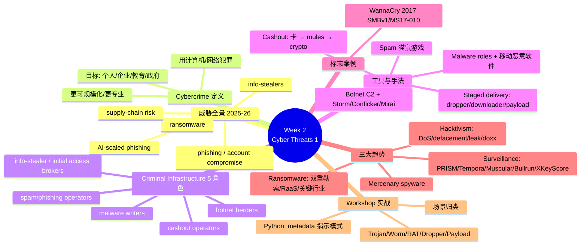
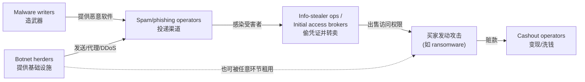
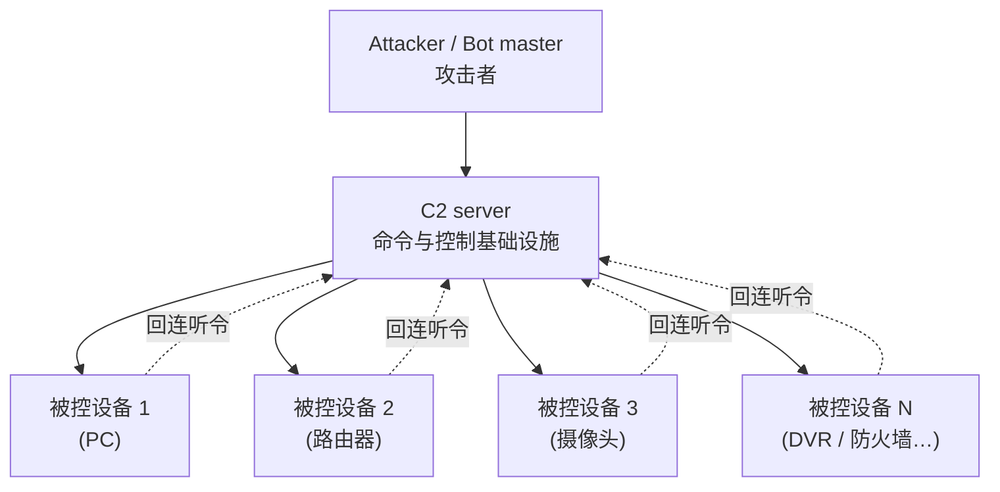
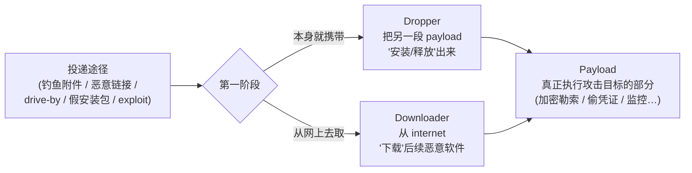
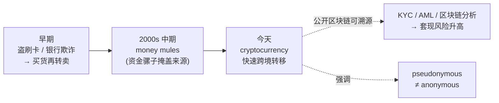
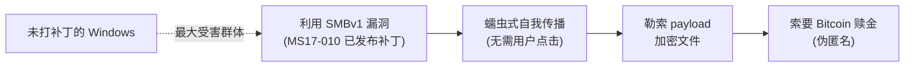
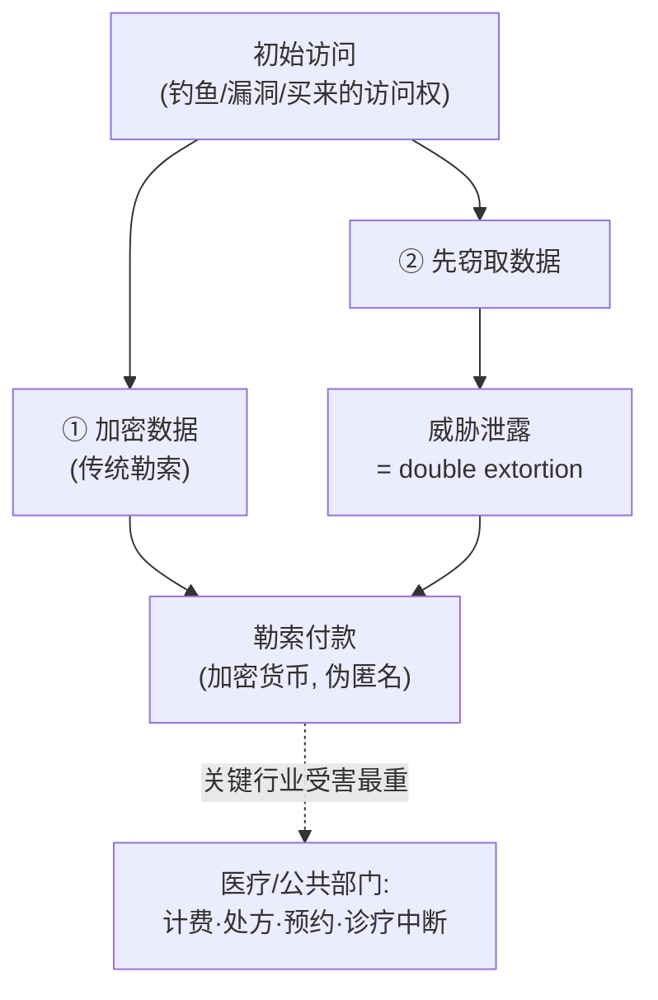
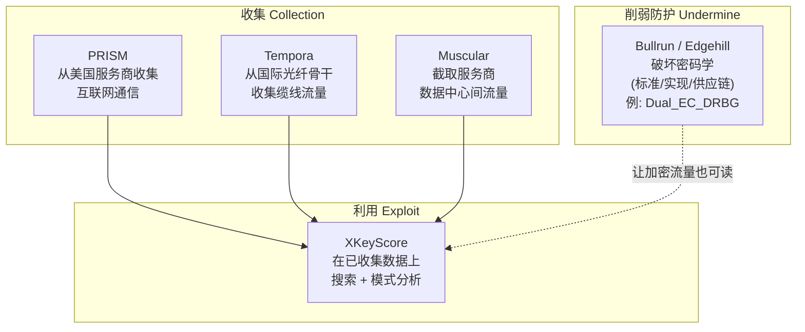

# Week 2 · 网络威胁（一）：网络犯罪生态、僵尸网络、恶意软件、勒索软件、黑客行动主义与大规模监控 (Cyber Threats 1)

> **学习目标 (Learning objectives)** — 读完本章你应该能够：
> - 说清 **cybercrime**（网络犯罪）的定义与典型目标，并复述 2025–26 年的五大威胁趋势；
> - 复述网络犯罪的 **criminal infrastructure**（犯罪基础设施）里五种分工角色，并理解它为什么像一个"地下服务经济（underground service economy）"；
> - 解释 **botnet**（僵尸网络）的概念、**C2 (command-and-control)** 模型、感染途径与常见用途；区分 **Storm / Conficker / Mirai** 三个著名僵尸网络各自的技术特征（尤其 **DGA**、**MS08-067**、IoT 默认口令），并说清僵尸网络为何难以根除；
> - **精确区分 dropper / downloader / payload**——这是本周被反复考的核心辨析；并能描述什么叫 **staged (malware) delivery**（分阶段投递）；
> - 解释 **spam senders**（垃圾邮件发送者）与 **cashout operators**（套现操作者）的演化，理解为什么加密货币是 **pseudonymous（伪匿名）而非 anonymous（匿名）**，以及 **KYC/AML** 与区块链溯源如何收紧套现；
> - 复盘 **WannaCry**（2017 年 5 月，SMBv1/MS17-010，蠕虫+勒索）这一标志性案例；
> - 讲清三大威胁趋势——**ransomware**（勒索软件，含 double extortion / RaaS / 关键行业 / 澳洲 2025 年强制上报）、**hacktivism**（黑客行动主义）、**mass surveillance**（大规模监控）；
> - 逐一说出五个 Snowden 时代监控项目 **PRISM / Tempora / Muscular / Bullrun（Edgehill, Dual_EC_DRBG）/ XKeyScore** 各自的用途，并理解现代 **mercenary spyware**（雇佣间谍软件）的转向；
> - 把概念落到 workshop 实战：辨析 Trojan/Worm/RAT/Dropper/Payload、给真实场景归类、并用 Python 从消息 **metadata（元数据）** 里挖出通信模式，理解"内容加密了，元数据照样泄密"如何回扣到监控这一章。

上一周我们搭好了"**怎么分析一个系统的安全**"这套框架（Policy / Mechanism / Assurance / Incentive）和一整套术语。但框架是用来对抗"对手"的——这一周，我们第一次把镜头转向**对手本身**：他们是谁、靠什么赚钱、用什么工具、按什么分工运转。换句话说，第一周回答"我们要防什么样的坏事"，这一周开始回答"坏事具体长什么样、由谁、怎么做出来"。

本章有一条清晰的主线，建议你顺着它读：先看**今天的威胁全景**（趋势）→ 给"网络犯罪"下定义 → 拆开它背后的**犯罪基础设施（谁在分工干活）**→ 沿着这条分工链逐个深入（**僵尸网络 → 恶意软件开发者 → 移动恶意软件 → 分阶段投递与 payload → 垃圾邮件 → 套现**）→ 用 **WannaCry** 把前面所有零件串成一个真实事件 → 再升到**三大宏观趋势（勒索软件 / 黑客行动主义 / 大规模监控）**→ 最后用 workshop 把这些概念落到能跑的代码上。一句贯穿全章的话，正是讲师反复强调的：**今天的网络犯罪很少是"一个人单干"，它是一条分工明确、可外包、可规模化的产业链。** 理解了"产业链"这三个字，本章大半就通了。

先用一张概念地图建立全局感，读完回头再看会清楚很多：



---

## 1. 先看清战场：2025–26 年的网络威胁全景

在认识具体技术之前，先建立一个"今天的对手大概在干什么"的全局感。讲师开篇就给了一个判断，值得记住：**核心威胁这几年并没有彻底改变，但它们变得更快、更可规模化、也更专业（faster, more scalable, more professional）。** 也就是说，攻击者用的还是那些"老点子"，但执行的速度和规模今非昔比。slide 2 列出了五条主线趋势：

- **Phishing and account compromise（钓鱼与账户被攻陷）仍是大量事件的源头。** 偷来的凭证、伪造的登录页、社会工程，这些方法之所以经久不衰，正因为它们**便宜、有效、易于规模化**。一封钓鱼邮件的边际成本几乎为零，群发一百万封和发一封没多大区别。
- **Ransomware（勒索软件）仍是破坏性最强的网络犯罪威胁之一。** 即便很多公司加强了备份与恢复，勒索软件造成的运营中断、声誉损害和财务损失依然巨大——后面 §9 会专门展开。
- **Info-stealer malware（信息窃取型恶意软件）已成为通往更大型数据泄露的重要"入口"。** 这类恶意软件专门偷密码、浏览器 cookie、会话令牌（session tokens）等敏感信息；偷到后，攻击者可以自己用，也可以**转卖**给别人——这就把它和后面的"初始访问经纪人（initial access broker）"串了起来。
- **Third-party and supply-chain risk（第三方与供应链风险）在上升。** 讲师点得很透：哪怕你自己的内部安全很强，你仍可能**因为供应商而被攻陷**——软件供应商、托管服务商、云平台，任何一个被攻破，都可能成为攻进你的跳板。
- **AI 正在帮助攻击者把钓鱼与社会工程"放大"。** 注意讲师的措辞：AI **不取代**传统攻击手法，而是帮攻击者把它**规模化、做得更逼真**（比如批量生成语法地道、针对性强的钓鱼文案）。

这五条之间不是孤立的，而是会**互相串联**成一条攻击路径：AI 批量生成钓鱼 → 钓鱼骗取账户或植入 info-stealer → info-stealer 偷到凭证转卖给经纪人 → 买家拿凭证发起勒索软件攻击。把这条链记在心里，本章后面每个零件就都有了归属。

> 📎 **拓展（超出 slides）** — 为什么"更可规模化"是质变而不只是量变？因为安全工程的核心是**不对称性**（第一周提过的 defender's dilemma）：防守方要堵住所有漏洞，攻击者只要找到一个。当攻击可以自动化、可以批量复制、可以外包给专人，攻击者一侧的成本被压到极低，于是哪怕成功率只有万分之一，乘以海量目标后绝对收益依然可观。这就是"规模化"对防守方最致命的地方。

---

## 2. Cybercrime：什么是网络犯罪

有了战场全景，现在给核心概念下定义。**Cybercrime（网络犯罪）** 指的是 *使用计算机或网络来实施犯罪（the use of computers or networks to commit crimes）*。它的形式很广，slide 3 举的例子包括 **fraud（欺诈）、online abuse（网络滥用/骚扰）、identity theft（身份盗用）、threats or intimidation（威胁或恐吓）**。

讲师补了一句很重要的视角：在网络犯罪里，技术既是**作案工具（the tool used to commit the crime）**，也常常是**作案目标（the target of the crime）**，甚至两者兼具——例如攻击者用一台被控的服务器（工具）去攻击另一家公司的数据库（目标）。

它的**典型目标（common targets）**覆盖面很宽，绝不只是大公司：**individuals（个人）、businesses（企业）、educational institutions（教育机构）、governments（政府）** 都在其列。这一点呼应 §1：因为攻击可规模化，普通个人也是有价值的目标。

slide 3 最后一句是本章的"主题句"，请重点记忆：**cybercrime is becoming more scalable, more professional, and more damaging（网络犯罪正变得更可规模化、更专业、更具破坏性）。** 攻击者能自动化攻击、复用偷来的数据、同时瞄准大量受害者。正是这种"专业化 + 规模化"，催生了下一节的主角——犯罪基础设施。

---

## 3. Criminal Infrastructure：网络犯罪是一条分工产业链

这一节是本章的"骨架"。讲师反复强调一个观点：**网络犯罪通常不是一个人从头干到尾，而是依赖一套更广的犯罪基础设施（broader criminal infrastructure），不同的人或团伙专攻不同环节。** 他用了一个非常贴切的比喻——这运转得**像一个地下服务经济（underground service economy）**：每个角色都是产业链上的一个"工种"，可以专精、可以互相交易服务。

slide 4 给出了五个核心角色。把它们当作一条流水线来记，远比死背五个名词有用：

| 角色 | 它干什么 | 在产业链中的位置 |
|---|---|---|
| **Botnet herders（僵尸网络牧人/控制者）** | 控制大量被攻陷的设备 | 提供"算力与带宽"基础设施（发垃圾邮件、投递恶意软件、发动 DDoS、代理流量……）|
| **Malware writers（恶意软件作者）** | 开发并维护恶意代码 | 提供"武器"——攻击中用的各类恶意软件 |
| **Spam and phishing operators（垃圾邮件/钓鱼操作者）** | 大规模分发骗局、恶意链接、染毒附件 | 提供"投递渠道"，把武器送到海量受害者面前 |
| **Info-stealer operators / Initial access brokers（信息窃取者/初始访问经纪人）** | 窃取凭证、cookie、令牌等并**转卖** | 提供"钥匙"——把"进入受害者系统的权限"商品化 |
| **Cashout operators（套现操作者）** | 把偷来的数据/资金**变成真金白银** | 产业链末端的"变现"环节 |

这五个角色不是平行清单，而是**前后咬合**的：恶意软件作者造出武器 → 垃圾邮件/钓鱼操作者负责投递 → 僵尸网络提供发送基础设施 → 信息窃取者偷到凭证 → 初始访问经纪人把权限卖出去 → 买家发动攻击 → 套现操作者最后把赃款洗白。本章接下来的 §4–§8 正是沿着这条链，一个角色一个角色地深入。



> ⚠️ **易错点** — "criminal infrastructure"不是指某种"基础设施类的恶意软件"，而是指**这套人/团伙的分工组织**。考试若问"网络犯罪为何能规模化"，答案的核心就是这种**专业化分工 + 可外包**的服务经济结构。

---

## 4. Botnet：僵尸网络

### 4.1 概念：被远程操控的一大片设备

我们从产业链上游的"基础设施提供者"开始。**Botnet（僵尸网络）** 是 *一个由被攻陷的计算机和联网设备组成的网络（a network of compromised computers and internet-connected devices）*；攻击者通过 **command-and-control (C2，命令与控制)** 基础设施**远程操控**这张网，而设备主人通常**毫不知情**。

讲师特别提醒：早年人们把 botnet 理解成"一堆被感染的电脑"，但**这个画面如今太窄了**。现代僵尸网络还包括**家用路由器、摄像头、防火墙**等各种联网设备——这一点会在 §4.3 的 Mirai 案例里变成关键。

核心思想就一句：**大量被攻陷的设备，被协同起来、置于攻击者的统一控制之下，用来放大攻击的规模。** 一台被控设备没什么威力，但几十万台一起行动，就是另一回事了。

下面这张图是最常见的**中心化（centralised）C2 模型**：所有被感染的"肉鸡"都回连到攻击者控制的中央服务器听令。



### 4.2 它是怎么运转的：感染 → C2 → 干活

slide 6 把僵尸网络的生命周期讲成三步：

1. **Infection（感染）**——设备被攻陷的途径很多：**phishing（钓鱼）、malicious downloads（恶意下载）、default credentials（默认口令）、exposed services（暴露在外的服务）、unpatched vulnerabilities（未打补丁的漏洞）**。
2. **Command and control（命令与控制）**——一旦被攻陷，设备就**回连**到攻击者控制的基础设施，**等待并接收指令**。这一步是僵尸网络的命门：切断 C2，肉鸡就群龙无首（§4.4 的缓解措施第一条正是打这里）。
3. **Common uses（常见用途）**——攻击者拿这张网来做：
   - **DDoS (Distributed Denial of Service，分布式拒绝服务) 攻击**——海量肉鸡同时向目标发流量，把它打瘫；
   - **Spam and phishing distribution（垃圾邮件/钓鱼分发）**；
   - **Credential theft or malware delivery（窃取凭证或投递恶意软件）**；
   - **Proxying criminal traffic anonymously（匿名代理犯罪流量）**——借肉鸡的 IP 隐藏攻击者真实身份；
   - **Cryptomining or other resource abuse（挖矿等资源滥用）**——偷用受害者的算力和电费挖加密货币。

> 📎 **拓展（超出 slides）** — DDoS 与普通 DoS 的区别就在那个"D（Distributed）"：单机拒绝服务容易被一条防火墙规则按 IP 封掉，但分布式攻击来自**成千上万个分散在全球的真实 IP**，防守方很难简单地"封 IP"了事。这也解释了为什么僵尸网络对攻击者如此值钱——它天然把攻击流量"分散化"了。

### 4.3 三个必须记住的著名僵尸网络：Storm / Conficker / Mirai

slide 7–9 各讲一个，它们恰好代表了僵尸网络演化的三个阶段，是本章的高频考点（S13 直接考 Conficker 的 DGA）。先看对比表，再逐个展开：

| 僵尸网络 | 时期/类型 | 传播方式 | 标志性技术特征 | 它教会我们什么 |
|---|---|---|---|---|
| **Storm** | 2000 年代中期，早期大规模 | 恶意邮件附件 + 社会工程（Trojan horse 木马）| 转向**更有韧性的控制** | "恶作剧（mischief）"向**财务驱动（financially motivated）**犯罪的转折 |
| **Conficker** | 蠕虫（worm）| Windows **MS08-067** 漏洞 + 其他途径 | **DGA（域名生成算法）** | **协同的行业/防守方响应**为何如此重要 |
| **Mirai** | IoT 僵尸网络家族 | 扫描脆弱设备，利用**默认/弱口令** | 攻陷海量 **IoT 设备**（IP 摄像头、DVR、家用路由器）| 不安全的 IoT 设备能被用于**超大规模 DDoS** |

**Storm botnet** 是早期的大规模僵尸网络，主要靠**恶意邮件附件和社会工程**传播。讲师在这里讲了一个生动的类比来解释附件里藏的东西——**Trojan horse（特洛伊木马）**：就像电影《特洛伊》里那匹木马，外表是"无害的礼物"，里面却藏满了士兵，夜里打开就放出来作乱。一个 Trojan 就是这样一种**伪装成合法或无害软件来骗用户运行**的恶意程序，一旦安装就把整个系统的访问权交给攻击者。Storm 的历史意义不在它的规模，而在它**展示了僵尸网络控制如何变得更有韧性**，并标志着网络犯罪从早期的"恶作剧"转向**以牟利为目的**。

**Conficker botnet** 是一只**蠕虫（worm）**——蠕虫的特点是能在网络中**自我传播**，无需人点击。它利用了 Windows 的 **MS08-067** 漏洞等途径扩散。它最重要的技术特征是 **DGA (Domain Generation Algorithm，域名生成算法)**：感染的机器会**自动、每天生成大量候选域名**去尝试连接，希望其中某个正好是 bot master 注册的 C2 域名。讲师给了具体数字帮助理解：Conficker 早期版本每天生成约 250 个域名挨个尝试，后来的版本**升级到每天 50000 个**。

为什么 DGA 让僵尸网络更难打掉？因为 C2 不再是一个**固定**的服务器地址——**防守方不可能把每天上万个动态域名全部提前封禁**，攻击者只要悄悄注册其中一个就能重新接管。Conficker 的核心教训因此是：**僵尸网络可以被设计得极有韧性，所以协同防守（coordinated defence）才如此重要**——单家公司封几个域名没用，必须行业、注册商、各国 CERT 联手。

**Mirai botnet** 是一个**专攻 IoT 设备的僵尸网络家族**（讲师补了个小知识点："Mirai"是日语"未来"的意思）。它瞄准消费级 IoT 设备——**IP 摄像头、DVR（数字录像机）、家用路由器**——做法极其朴素：**扫描脆弱设备，专挑还在用默认或弱口令的下手**。Mirai 一战成名，是因为它证明了**大量本就不安全的 IoT 设备能被聚合起来发动超大规模 DDoS**。讲师强调：尽管原始 Mirai 战役已经"过时"，但它**至今仍是理解现代 IoT 僵尸网络的重要参照点**，因为不安全的 IoT 设备一直在被滥用。

> **🔑 例（来自讲师的现实类比）** — 为什么 Mirai 那么好用？讲师举了你我身边的例子：你从 Optus、Telstra 这样的运营商那里拿到一个调制解调器/路由器，多数人**从不改默认密码**——他估计"至少 50%–70% 的人"就这么直接用着出厂口令。攻击者要做的不过是拿一份"厂商默认口令表"去全网扫描、逐个尝试登录。**这就是 Mirai 的全部秘密：不是什么高深漏洞，而是无数台从未改过默认口令的设备。** 这也直接引出了 §4.4 缓解措施里那条"改默认口令"。

### 4.4 怎么缓解、又为什么这么难

**缓解措施（slide 10）**——把它们对照感染途径来记，会发现每一条都在堵一个口子：

- **尽可能破坏 C2 基础设施**（断了指挥链，肉鸡就失去价值——这是最优先的一招）；
- **清理受感染设备并重置被泄露的凭证**（讲师提醒：光清木马不够，如果偷走的密码/令牌还有效，攻击者照样能回来）；
- **及时给软件和固件打补丁**（很多僵尸网络正是靠已知漏洞传播）；
- **替换 end-of-life（已停止支持）的设备**（拿不到安全更新的设备无法被妥善加固）；
- **关闭远程管理和无用服务**（缩小攻击面）；
- **修改默认口令**（直接掐断 Mirai 那类攻击）。

> ✅ **记忆抓手** — slide 14 的 quiz 把"最佳缓解组合"答案设计成正好覆盖三招：**改默认口令 + 打软件/固件补丁 + 关闭无用的远程管理**。

**为什么僵尸网络如此难根除（slide 11）**——讲师把原因归结为一句话：**问题是分布式的、持久的、而且常常是隐藏的（distributed, persistent, often hidden）**。具体五条：

1. 很多受感染设备**无人看管或疏于管理**（家里的摄像头、路由器装好后就再没人碰过）；
2. 部分设备**已经 end-of-life**，根本拿不到更新，无法妥善加固；
3. 用户**根本没察觉**自己被感染，也**不知道怎么清理**——设备照常工作，感染可以长期潜伏；
4. 消费级 IoT 和家用网络设备**分散在无数业主和国家手里**，让协同的检测、通知、清理远比治理一家有人管的机构难得多；
5. 有些设备**出厂就被预先植入（pre-compromised），或在初次配置时就被攻陷**——问题甚至早于用户拿到设备。

把 §4.3 与 §4.4 连起来看：Conficker 的 DGA 让"打掉 C2"变难（对应难点：持久、有韧性），Mirai 的 IoT 目标让"清理设备"变难（对应难点：分散、无人管、用户无感）。这正是为什么僵尸网络是产业链里最稳固的一环。

---

## 5. Malware developers / operators：造武器的人

沿产业链往下，是**造武器**的角色。slide 15 强调：恶意软件开发**通常是专业化分工**，而不是一个人包打天下；不同人按各自专长承担不同技术任务：

- 把**漏洞（vulnerability）变成可用的 exploit（利用程序）**——即把"软件弱点"开发成一套**可靠地用来获取访问权或执行代码**的手段；
- 构建 **loaders / droppers / downloaders**（投递与安装下一阶段恶意软件的部件，详见 §6）；
- 开发 **backdoors（后门）、RATs（Remote Access Trojan，远程访问木马）、infostealers（信息窃取器）、ransomware payloads（勒索载荷）**；
- 设计**有韧性的 C2 机制**；
- 为**窃取、监控、破坏或牟利**设计 payload。

slide 15 最后一条点出执法的根本困境：**attribution（溯源归因）和抓捕往往很难跨越司法管辖区**。讲师解释道：攻击者可以从那些**执法合作有限、引渡困难**的国家运作，使得即便查清了某个恶意软件行动，也难以追到真人。这一点会在 §7 的套现环节再次出现——**匿名性与跨境，是网络犯罪难以打击的两条主线**。

> 📎 **拓展（超出 slides）** — RAT 与 Trojan 是什么关系？RAT 是 Trojan 的一个**子类**：所有 RAT 都靠"伪装"骗用户运行（所以是 Trojan），但它的特定目的是给攻击者**持续的远程控制权**——相当于在受害者机器上开了一个隐秘的"远程桌面"。workshop 的 Part A 专门考了这组术语，§11 会回到它们。

### 5.1 Mobile malware：移动恶意软件这个趋势

slide 16 单独把移动平台拎出来讲，因为今天"手机即一切"。讲师说得直白：现在我们用手机办银行、收发消息、收邮件、几乎做所有事，所以手机里的数据极其值钱。要点如下：

- **不受支持或未打补丁的移动设备**会显著抬高风险——手机一旦停止收安全更新，已知漏洞就一直敞着；
- **恶意的、重打包的（repackaged）、或 sideloaded（旁加载，即绕过官方应用商店安装）的 app 是主要感染路径**。常见套路是：攻击者拿一个**看起来合法的 app，篡改后通过非官方渠道分发**，或者直接发布"看着无害"的有害应用；
- 规模有多大？**Google 在 2025 年阻止了超过 175 万个违规 app 上架 Google Play，并封禁了约 8 万个恶意开发者账号**（slide 16 引官方博客）——讲师顺势点评，光是被拦下的就这么多，可见问题之大；
- 移动恶意软件能**窃取数据、监视用户、实施欺诈、安装更多恶意软件**——实务上能偷你的短信、通讯录、照片、凭证、银行信息；其中 **finance fraud（金融欺诈）** 是当下极常见的真实危害；
- **targeted mobile spyware（针对性移动间谍软件）是重要的现代威胁**——这把移动恶意软件从"大规模诈骗"延伸到了"针对特定个人的监控"，直接为 §10 的 mercenary spyware 埋下伏笔。

---

## 6. Staged delivery：dropper、downloader 与 payload（本章最常考的辨析）

现在到了**全章最容易混、也被考得最狠**的一组概念。slide 17–22 用了整整六张（其中四张是 quiz）来打磨它，workshop 也专门考。请务必把这三个词一次性拧清楚。

### 6.1 为什么要"分阶段"投递

先建立动机。攻击者为什么不把"完整的恶意载荷"一口气塞进受害者机器，非要拆成几步？因为**分阶段（staged）能更好地躲过检测、也更灵活**：第一阶段的小程序往往很小、很"干净"，容易混过杀毒软件和邮件过滤；等它在受害者机器上**站稳脚跟**后，再去取或释放真正干脏活的部分。这种"先派一个先遣队进门、再分批运武器"的思路，就叫 **staged (malware) delivery（分阶段恶意软件投递）**。

### 6.2 三个角色的精确定义

把这三个词放在一条时间线上理解，最不容易乱：



- **Dropper（投放器）**：*一种恶意软件，它的任务是在受害者系统上**安装或释放（install or release）另一段 malware payload**。* 关键词是"**自带**并**释放**"——dropper **本身就携带**着下一阶段的恶意代码，把它落到磁盘上并运行。它通常**不是最终的恶意组件**，它的目的就是"把下一阶段送上设备"。
- **Downloader（下载器）**：*一种恶意软件，它**从 internet 上检索/获取（retrieves）额外的恶意软件**。* 关键词是"**去网上取**"——它**自己不携带**完整载荷，而是在初次攻陷后**联网把下一阶段拉下来**。
- **Payload（载荷）**：*恶意软件中**真正执行攻击者目标的那部分**。* 一旦恶意软件成功到达受害者系统，payload 就是"动手干活"的组件。

**Dropper 与 downloader 的唯一本质区别**（这正是 S21 的考点）：**dropper 自带并释放下一阶段；downloader 从网上下载下一阶段。** 两者的共同点是——它们都只是"运输/安装工具"，**本身都不是 payload**。

下面这张对比表把三者一次性钉死，建议直接背：

| | **Dropper** | **Downloader** | **Payload** |
|---|---|---|---|
| 一句话定义 | **安装/释放**另一段恶意载荷 | 从 internet **下载**后续恶意软件 | 真正**执行攻击目标**的部分 |
| 载荷从哪来 | **自带**（捆在自己体内）| **联网下载** | —— |
| 是不是最终目的 | 否（中转/安装工具）| 否（中转/获取工具）| **是**（攻击的实质效果在此）|
| 典型例子 | 假安装包运行后释放出勒索软件 | 钓鱼附件运行后联网拉取木马 | 加密文件勒索、偷密码与会话令牌、监控、挖矿 |

**常见投递途径（slide 17）**——dropper/downloader 借这些路径抵达受害者：钓鱼附件或恶意文件、恶意链接或 **drive-by download（路过式下载，只要访问被攻陷网站就触发）**、**trojanised software / fake installers（木马化软件/假安装包）**、以及针对脆弱系统的 **exploits（常常无需用户任何交互）**。

**Payload 的常见目标（slide 18）**——把 §4.2 botnet 的用途和这里对照，你会发现高度重合，因为 payload 正是"实现那些目标"的代码：

- 窃取**凭证或会话令牌（session tokens）**；
- **exfiltrate（外泄）** 敏感数据；
- 为勒索软件**加密数据**；
- **监视受害者或记录其活动**（如键盘记录）；
- **安装持久化或更多恶意软件**（让攻击者长期赖着不走）；
- **滥用系统资源**（如挖矿）。

> ⚠️ **三个最常考的辨析（S19/S20/S21/S22）：**
> - **Dropper 的主要作用** = "**安装/释放另一段 payload**"（不是加密勒索，那是 payload 的事）。
> - **最佳的 payload 例子** = "**偷密码和会话令牌的恶意程序**"（注意：假安装包、钓鱼附件、恶意链接、downloader 都只是"投递/获取"环节，**不是 payload**）。
> - **Staged delivery 的最佳例子** = "**钓鱼附件运行一个 dropper，dropper 再装上 ransomware**"——一个**多步骤**的链条才叫"分阶段"。
>
> 记忆口诀：**dropper 自带、downloader 去取、payload 动手。** 前两个是"快递员"，最后一个才是"杀手"。

---

## 7. Spam senders 与 Cashout operators：投递渠道与变现末端

产业链的两端——把武器送出去的"渠道"和把赃物变成钱的"出口"——分别由这两个角色承担。

### 7.1 Spam senders：一场永不停止的猫鼠游戏

**Spam senders（垃圾邮件发送者）** 的演化（slide 23）分三幕：

- **早期阶段**：垃圾邮件规模相对小、以邮件为主；**2000 年代初的钓鱼诱饵（phishing lures）让 spam 变得更有利可图**——因为攻击者不再只是"发广告"，而是开始借此**窃取凭证、分发恶意软件、骗取钱财**。
- **防守方的回应**：Gmail、Yahoo、Outlook.com 等大型邮件商**大规模部署过滤**；现代防御还依赖 **sender authentication（发件人认证）、reputation（信誉）、machine learning（机器学习）**。讲师补充，Gmail、Microsoft 已开始**要求（尤其是大批量）发件人做认证**，以压制 spoofing、phishing 和 spam。
- **猫鼠游戏（cat-and-mouse game）**：spam 和 phishing **极其善变**——攻击者不停更换**措辞、链接、域名、投递方式**来绕过过滤，防守方则不断改进认证与检测。

讲师点出本节的关键认识：**今天的 spam 早已不只是"烦人的邮件"，它是 phishing、欺诈与恶意软件的投递渠道。** 这正回扣 §3——spam/phishing operators 是产业链里负责"投递"的工种。

### 7.2 Cashout operators：从盗刷卡到加密货币

产业链的最末端是**把赃物变现**。**Cashout operators（套现操作者）** 的手法随时间演化（slide 24）：

1. **早期**：用偷来的**卡片信息或银行欺诈**直接买货、间接转移资金（买了货再转卖换现金）；
2. **2000 年代中期**：越来越多地使用 **money mules（资金骡子）**——招募的人头负责**接收赃款再转走**，以**掩盖资金来源**；
3. **今天**：大量犯罪（尤其勒索软件与在线敲诈）使用**加密货币（cryptocurrency）**来转移和存放犯罪所得。

这里有一个**全章反复出现、必须记牢的关键点**：**加密货币是 pseudonymous（伪匿名），而不是 anonymous（完全匿名）。** 讲师解释得很到位：加密货币确实能让犯罪分子**快速跨境转账**，但所有交易都**记录在公开的区块链（public blockchain）上**，调查者**往往能追踪**它们——尤其当罪犯与**受监管的交易所（regulated exchanges）**打交道时。正因如此，政府和监管机构如今重拳投向 **KYC (Know Your Customer，了解你的客户)** 与 **AML (Anti-Money Laundering，反洗钱)** 规则、交易所合规、以及**区块链分析（blockchain tracing）**。这些手段让套现这一环对罪犯而言**风险越来越高**。讲师还举了本地例子：澳洲的 **AUSTRAC**（金融情报机构）也在勒索软件相关调查中识别资金骡子、诈骗受害者与嫌疑人。



> ⚠️ **易错点** — 别把"伪匿名"说成"匿名"。比特币地址不直接绑你姓名（所以"伪"），但每一笔转账永久公开可查，一旦某个地址在受监管交易所被关联到真实身份，往上往下的资金流就可能被串起来。这是本章和 §9 勒索软件都会复用的结论。

---

## 8. 把零件拼成一个真实事件：WannaCry（2017 年 5 月）

讲到这里，我们已经认识了僵尸网络、蠕虫、恶意软件分工、payload、加密货币变现这些零件。**WannaCry** 是一个把它们串成完整故事的绝佳案例，也是从"产业链"过渡到"三大趋势"的桥梁。slide 25 的要点：

- **2017 年 5 月的全球性勒索软件爆发**；
- 主要打击 **Windows 系统，尤其是未打补丁的**；
- **把文件加密（ransomware）与蠕虫式自我传播（worm-like self-spread）结合**——这是它危险的核心：它不像普通勒索软件要靠用户点开附件，而是能像蠕虫一样**在网络中自动横向扩散**；
- 利用了 **SMBv1 漏洞**（由微软补丁 **MS17-010** 修复）；
- **索要比特币（Bitcoin）赎金**。

为什么 WannaCry 是教科书级案例？因为它一身集齐了本章的多条线索：它是**蠕虫**（像 Conficker 那样自我传播，§4.3）+ **勒索软件 payload**（§6 的 payload 目标之一"加密数据"）+ **加密货币变现**（§7 的 pseudonymous 比特币）。它也血淋淋地印证了 §4.4 那条缓解措施——"**及时打补丁**"：MS17-010 在爆发前两个月就已发布，**真正受害的几乎都是没及时打补丁的系统**。



---

## 9. 三大宏观威胁趋势之一：Ransomware（勒索软件）

slide 26 把本章后半段升到宏观，列出三大趋势：**ransomware、hacktivism、surveillance & targeted spyware**。先看破坏力最大的勒索软件。

### 9.1 它是什么、怎么收钱

**Ransomware（勒索软件）** 是 *用来敲诈受害者的恶意软件（malware used to extort victims）*（slide 27）。它的手段有三层：**加密数据、扰乱系统、或威胁泄露偷来的数据**；受害者被施压去付钱，以换取**解密、恢复、或不公开数据**。付款通常要求用**加密货币**——再次强调，**pseudonymous, not fully anonymous（伪匿名而非完全匿名）**，且**越来越可追踪**（呼应 §7）。

### 9.2 它是怎么"运营"的：从 scareware 到 RaaS

slide 28 区分了两种运营档次：

- **低端的**campaign 更接近 **scareware（恐吓软件）**或粗制滥造的敲诈（吓唬你但未必真有本事）；
- **现代的许多团伙采用 RaaS (Ransomware-as-a-Service，勒索软件即服务)** 模型。

**RaaS 是本章一个核心考点（S41）**，务必理解透：在 RaaS 模式里，**核心操作者（core operators）负责开发并提供恶意软件与基础设施，而 affiliates（附属攻击者）则去实施具体攻击**。讲师把它说得很白：如果你想攻击某人，**你自己根本不需要任何技术能力**——你可以"租"一家提供勒索软件服务的团伙，付钱让他们替你动手；affiliates 不需要技术，**依赖的是 operators 的技术**。这正是 §3"地下服务经济"思想的极致体现：连"发动攻击"本身都被**商品化、外包**了。

> 📎 **拓展（超出 slides）** — RaaS 的经济学为什么这么稳？因为它把风险与收益**分摊**了：operators 不必亲自踩雷去入侵每个受害者（降低被抓风险），只靠"卖工具/抽成"赚钱；affiliates 不必懂技术也能入场（降低门槛、扩大攻击面）。双方通常按**赎金分成**（affiliate 拿大头、operator 抽成）。这种分工让勒索软件像 SaaS 创业一样可规模化——这就是为什么它能成为"最具破坏性威胁"。考试以 slide 定义为准：**operators 提供工具与基础设施，affiliates 实施攻击。**

### 9.3 关键行业、双重勒索与澳洲强制上报

slide 29 强调勒索软件**对关键行业**尤其凶险：

- **公共部门与医疗机构**是高价值目标；攻击造成的不只是数据丢失，更是**服务中断**——讲师举例，医疗领域的勒索软件会瘫痪**billing（计费）、prescriptions（处方）、appointments（预约）、patient operations（诊疗流程）**，直接危及患者；
- **double extortion（双重勒索）** 是当下的重要演化：攻击者**既加密系统、又威胁泄露偷走的数据**。讲师点破其逻辑——即便你有备份能自己恢复（化解了"加密"那一招），攻击者还捏着"不付钱就公开你的数据"这第二张牌。**所以现代勒索软件已经不只是关于加密，而是关于数据敲诈与运营瘫痪。**
- 政策层面，**在澳洲，针对特定实体（covered entities）的强制勒索软件付款上报（mandatory ransomware payment reporting）已于 2025 年 5 月生效**。



**勒索软件相关术语速查表**（考前扫一眼）：

| 术语 | 含义 |
|---|---|
| **Ransomware** | 用于敲诈的恶意软件：加密/扰乱/威胁泄露 |
| **Double extortion** | 既加密、又威胁公开偷走的数据（即使有备份也施压）|
| **RaaS** | operators 提供工具与基础设施，affiliates 实施攻击 |
| **Scareware** | 低端的"吓唬式"敲诈，未必有真实破坏力 |
| **关键目标** | 公共部门、医疗机构（服务中断后果严重）|
| **澳洲合规** | 2025 年 5 月起，覆盖实体须强制上报勒索付款 |

---

## 10. 三大趋势之二与之三：Hacktivism 与 Mass Surveillance

### 10.1 Hacktivism：政治/意识形态驱动的网络行动

**Hacktivism（黑客行动主义）** 是 *出于政治或意识形态动机的在线活动（politically or ideologically motivated online activity）*（slide 30）。它常借**在线媒体与社交平台**来**快速动员人群、传播信息、协调行动**。它与一般的"行动主义（activism）"有重叠，但在网络安全语境里，我们关注它**更具破坏性、更有害**的形式。

**常见手法（slide 30）**：

- **denial-of-service attacks（拒绝服务攻击）**——打瘫目标的网站、门户或在线服务；
- **website defacement（网站篡改/涂改）**——把目标主页改成抗议标语；
- **hack-and-leak operations（黑入并泄露行动）**——攻进去偷数据再公开；
- **doxxing and harassment（人肉曝光与骚扰）**——公开个人隐私信息以施压、骚扰。

**后果（slide 31–32）**——讲师强调，黑客行动主义的破坏既是**技术性的，也是社会性的**：

- **DoS** 即使是暂时的，也会中断网站、门户、在线服务，影响正常运营与公众访问；
- **brand damage（品牌/声誉损害）**——doxxing 与公开曝光会损害组织声誉，并给高管与员工带来**个人困扰**；
- **public pressure（公众压力）**——社交媒体能把一个**技术上很小的事件迅速放大成声誉危机**。讲师反复点出这一点：**哪怕技术攻击并不高深，整体损害也可能极其严重**，因为放大效应来自舆论场而非代码。

**典型目标（slide 32）**：**政府与面向公众的组织**是常见目标（高度可见、象征意义强）；**高知名度公司或卷入争议议题的公司**也会被盯上。社交媒体在其中扮演放大器，使攻击/泄露的影响迅速扩散、让恢复变得困难。

### 10.2 Mass Surveillance：从大规模监控到针对性间谍软件

第三大趋势把视角从"罪犯"转到"国家级行为体"。slide 33 给出总览：

- 政府拥有一整套工具，既能做**对网络的被动监控（passive surveillance）**（如监听网络流量、通信基础设施），也能对计算机系统发起**主动攻击（active attacks）**（如直接攻陷设备或服务）；
- **Snowden disclosures（斯诺登泄密）** 揭露了与 **Five Eyes（五眼联盟）** 国家相关的重大监控活动；
- 此外还存在一个**庞大的商业监控产业**，售卖**合法截听（wiretapping）、无线电拦截（radio intercept）、设备利用（device exploitation）**等设备；
- 在隐私越来越重要的今天，理解**历史上的大规模监控**与**现代针对性监控**都很有用。

> 📎 **拓展（超出 slides）** — Edward Snowden 是 2013 年泄露美国 NSA 大量机密监控文件的前情报承包商雇员，泄密后流亡（讲师课堂上提到"很多说法称他目前在俄罗斯"）。"Five Eyes（五眼联盟）"指美、英、加、澳、新五国的情报共享同盟。下面五个项目正是斯诺登泄密揭露的核心内容。

**五个 Snowden 时代监控项目**（slide 34–38）是本节的考点密集区（S43、S45 直接考）。逐个理解它们各自的**用途**，再看汇总表：

- **PRISM（slide 34）**——2013 年披露的项目，用于**从美国服务商处收集特定的互联网通信（internet communications）**，为情报机构提供一条**在美国法律授权下**获取数据的结构化途径。**关键点**：要把 PRISM 与另一桩独立披露的"Verizon 电话元数据"事件**分开**；它虽被许多人理解为"针对性监控"，却也引发了"大规模收集（collection at scale）"的担忧。
- **Tempora（slide 35）**——一个**从国际光纤电缆（fibre-optic cables）收集情报**的项目。做法是：大量缆线流量被收集后用**过滤器（filters）**削减，再用**selectors（选择子）**挑选——选择子不只是电话号码，还包括 **IP 地址等搜索词**。**关键点**：**监控可以发生在网络骨干（backbone）上，而不只在终端设备上**。讲师点出核心思想：情报机构若能接入主干缆线，就**无需逐个攻陷用户设备**。
- **Muscular（slide 36）**——用于**收集大型服务商（如 Google、Yahoo）数据中心之间流动的数据**。当时的弱点在于：用户侧（front end）看起来流量是加密的，但**内部/数据中心之间的链路**才是软肋。**现代更新**：如今服务商已普遍加密内部流量，CDN-到-源站的加密也广泛支持。**关键点（也是 S43 的考点）**：**用户可见的加密（user-visible encryption）并不自动保证每一条内部链路上的机密性。** 讲师把这点讲得很实在：你在浏览器里看到 HTTPS 的"S（secure）"，**不代表传输路径上的每一段都同样受保护**。
- **Bullrun 与 Edgehill（slide 37）**——目的是**在多个层面破坏密码学（tampering with cryptography）**：通过供应商、标准和实现下手。做法包括**影响标准的制定、利用实现弱点、通过受信任的供应商渗透**。**Bullrun 是 NSA 的代号，Edgehill 是 GCHQ（英国）的代号。** 最著名的例子是 **Dual_EC_DRBG 争议**（一个被怀疑植入后门的随机数生成器标准）。**关键点**：**强密码学不仅依赖数学，还依赖可信的标准与供应链。**
- **XKeyScore（slide 38）**——NSA 的**搜索与分析系统（search and analysis system）**。分析员可在**已收集的数据**（邮件、聊天、浏览历史、selectors）上检索，还支持**目标发现（target discovery）与模式分析（pattern analysis）**；被"派单"的条目可被提取并转发给请求者。**关键点**：**一旦数据被大规模收集，搜索系统会让这些数据在实战中有用得多。** 讲师的总结很精辟：你手里有一大堆数据，**在你能搜索、能分析它之前，它可能毫无用处**——大规模收集 × 强搜索分析能力，才真正释放威力。

把这五个项目画成一张"监控分工图"，会发现它们恰好覆盖了数据生命周期的不同环节：



**五大监控项目速查表**（务必能从"项目名 ↔ 用途"双向对应，这是 S45 的考法）：

| 项目 | 归属 | 一句话用途 | 关键教训 |
|---|---|---|---|
| **PRISM** | NSA（美）| 从**美国服务商**收集特定互联网通信（有法律授权框架）| 与电话元数据披露分开；引发大规模收集担忧 |
| **Tempora** | GCHQ（英）| 从**国际光纤骨干缆线**收集流量，用 selectors 挑选 | 监控可发生在**网络骨干**，不止终端 |
| **Muscular** | NSA + GCHQ | 截取**服务商数据中心之间**的内部流量 | **用户可见的加密 ≠ 每条内部链路都受保护** |
| **Bullrun / Edgehill** | NSA / GCHQ | 通过标准、实现、供应链**破坏密码学**（Dual_EC_DRBG）| 强密码学还依赖**可信标准与供应链** |
| **XKeyScore** | NSA（美）| 在已收集数据上**搜索与分析**、目标发现 | 大规模收集 + 强搜索 = 威力倍增 |

> 📎 **拓展（超出 slides）** — Bullrun 这条线呼应了密码学里一个重要观念：**一个算法"理论上被证明安全"不是故事的结局**。落到实现与运行环境里，仍可能因实现缺陷而泄露信息——讲师专门提到 **side-channel attacks（侧信道攻击）**：攻击者不从算法本身、而从**实现/运行的"边信道"**（如功耗、时延、电磁辐射）获取信息，从而击破一个"可证明安全"的密码系统。所以才需要"安全实现（secure implementation）"。考试以 slide 为准，但理解这层能帮你答好 Bullrun 的"关键点"。

### 10.3 现代转向：Mercenary spyware（雇佣间谍软件）

slide 39 把监控拉回当下：**现代监控不只是骨干收集，还包括对特定手机和账户的高度针对性攻击。** **Mercenary spyware（雇佣间谍软件）** 瞄准**特定的手机和账户**，典型目标是**记者、活动人士、政治人物、外交官**。这类攻击**高度定向、成本高昂、极难检测**（slide 引了 Apple 关于针对性间谍软件的支持文档；讲师提到相关厂商曾在 2021 年向 150 多国的用户发出威胁通知）。

slide 39 的**核心结论（main lesson）**也是整个监控部分的收束句：**今天的监控同时以两种方式运作——通过基础设施的"广撒网"收集（broad collection），以及通过攻陷设备的"高度针对性"收集（highly targeted collection）。** 一头是 §10.2 的 PRISM/Tempora（广），一头是 mercenary spyware（精）。

这也和 §5.1 的"targeted mobile spyware"接上了——移动恶意软件在这里从"大规模诈骗工具"升级成了"国家级/雇佣级的针对性监控武器"。

---

## 11. 把概念落到实战：W3 Workshop

> 本节整合 W3 workshop（对应本周 Cyber Threats 内容）。它分三部分：Part A 锤炼五个核心恶意软件术语，Part B 让你给真实场景归类，Part C 用 Python 把"元数据照样泄密"这个抽象结论变成能跑的代码——并直接回扣本章 §10 的监控主题。

### 11.1 Part A：五个核心恶意软件术语，谁与"分阶段投递"最相关

workshop 给了五个术语，请先用一句话各自钉牢：

| 术语 | 定义 | 归类提示 |
|---|---|---|
| **Trojan（木马）** | 伪装成合法/无害软件、骗用户运行的恶意软件 | 靠"伪装+诱骗" |
| **Worm（蠕虫）** | 能**自动**从一个系统传播到另一个（常跨网络）的恶意软件 | 靠"自我传播"（如 Conficker、WannaCry 的扩散）|
| **RAT（Remote Access Trojan）** | 给攻击者**远程控制**被感染系统的恶意软件 | Trojan 的子类，目的=远程控制 |
| **Dropper** | **第一阶段**恶意软件，任务是**安装/释放另一段 payload** | 分阶段投递的"先遣队" |
| **Payload** | 执行攻击者**真实目标**（如窃取或加密）的部分 | 真正"动手"的组件 |

**workshop 的问题：五个里哪个与 staged malware delivery 最相关，为什么？** 答案是 **Dropper**——因为它正是**第一阶段**：它的工作就是**释放/安装下一阶段的 payload**，从而把攻击拆成多个阶段。这把 §6 的辨析落到了一道明确的判断题上。

### 11.2 Part B：把真实场景归类

workshop 给了四个场景，要求归到本章学过的类别。这是检验你是否真"会用"概念的好练习：

| 场景 | 归类 | 理由 |
|---|---|---|
| 钓鱼附件 → 第一阶段程序 → 下载勒索软件 | **Staged delivery / dropper 或 downloader / ransomware** | 第一阶段安装或拉取下一阶段，再加密文件（§6 + §9）|
| 出于政治动机向某政府网站发起流量洪水 | **Hacktivism / denial-of-service** | 目标是出于政治动机扰乱面向公众的服务（§10.1）|
| 某手机 app 偷偷收集消息、通讯录、位置 | **Mobile spyware / 移动恶意软件 / 针对性间谍软件** | app 隐蔽地收集设备上的敏感数据（§5.1 + §10.3）|
| 从员工笔记本上窃取用户名与浏览器会话令牌 | **Credential theft / infostealer 类 payload** | 攻击目标是偷凭证/会话令牌供日后访问（§1 info-stealer + §6 payload）|

注意第四个场景如何把整章串起来：偷到的**会话令牌**正是 §1"info-stealer 是通往大型泄露的入口"、§3"初始访问经纪人"、§6"payload 目标"三处的交汇点。

### 11.3 Part C：用 Python 证明"内容加密了，元数据照样泄密"

这是 workshop 的高潮，也是本章 §10 监控主题的**代码版**。给定一个 `messages.csv`（只含 `sender, receiver, time` 三列，**没有任何消息正文**），要求回答：谁发的消息最多？哪个"发件人→收件人"对出现最频繁？以及——**为什么仅凭元数据就能揭示敏感模式？**

先看数据与期望输出：

```
messages.csv                     期望输出
sender,receiver,time             Messages sent by each sender:
Alice,Bob,09:01                  Alice 4
Alice,Charlie,09:03              Bob 2
Bob,Alice,09:10                  Charlie 1
Alice,Bob,10:15
Charlie,Alice,10:30              Most common sender-receiver pair:
Bob,Charlie,11:00                ('Alice', 'Bob') 3
Alice,Bob,11:12
```

下面是一份遵循**不可变（immutable）风格、带输入校验与错误处理**的实现。注意它**从不就地修改**已读入的数据，统计全部交给 `collections.Counter` 一次性算出：

```python
import csv
from collections import Counter
from pathlib import Path


def load_messages(path: str) -> tuple[tuple[str, str, str], ...]:
    """读取 messages.csv，返回不可变的 (sender, receiver, time) 元组序列。"""
    file_path = Path(path)
    if not file_path.is_file():
        raise FileNotFoundError(f"找不到消息文件: {path}")
    try:
        with file_path.open(newline="", encoding="utf-8") as f:
            reader = csv.DictReader(f)
            required = {"sender", "receiver", "time"}
            if reader.fieldnames is None or not required.issubset(reader.fieldnames):
                raise ValueError(f"CSV 必须包含列: {sorted(required)}")
            # 用元组推导构造不可变结果，绝不就地 append/mutate
            return tuple(
                (row["sender"].strip(), row["receiver"].strip(), row["time"].strip())
                for row in reader
            )
    except csv.Error as error:
        raise ValueError(f"解析 CSV 失败: {error}") from error


def messages_per_sender(rows: tuple[tuple[str, str, str], ...]) -> Counter:
    """统计每个发件人发了多少条消息。"""
    return Counter(sender for sender, _receiver, _time in rows)


def most_common_pair(rows: tuple[tuple[str, str, str], ...]) -> tuple[tuple[str, str], int]:
    """找出出现最频繁的 (sender, receiver) 对。"""
    pairs = Counter((sender, receiver) for sender, receiver, _time in rows)
    if not pairs:
        raise ValueError("没有任何消息可供分析")
    return pairs.most_common(1)[0]


def main() -> None:
    rows = load_messages("messages.csv")

    print("Messages sent by each sender:")
    for sender, count in messages_per_sender(rows).most_common():
        print(sender, count)

    pair, count = most_common_pair(rows)
    print("\nMost common sender-receiver pair:")
    print(pair, count)


if __name__ == "__main__":
    main()
```

跑出来正是期望输出：**Alice 发了 4 条**（最活跃），最频繁的对是 **('Alice', 'Bob') 出现 3 次**。

**第三问才是重点——为什么仅凭元数据就能揭示敏感模式？** workshop 的"Key idea"一语道破：**消息的内容可以被隐藏（加密），但元数据仍然暴露了"谁和谁联系、多频繁、在什么时间"。** 我们这个小程序，在**完全读不到任何消息正文**的情况下，已经能推断出：

- **最活跃的发件人**（Alice）；
- **最强的发件人–收件人关系**（Alice→Bob）；
- **重复出现的通信模式**与**网络中可能的核心人物（central actors）**。

**这正是为什么它对监控如此重要**：即便不读内容，元数据照样支撑**analysis（分析）、profiling（画像）、target discovery（目标发现）、以及关系/作息的映射（mapping of relationships or routines）**。

把这段话与 §10 对照，你会恍然大悟——**XKeyScore 做的"模式分析与目标发现"、Tempora 用 selectors 从骨干流量里挑目标，本质上就是这段 Python 在做的事的工业级放大版。** 讲师也点到：这类模式识别天然适合用机器学习去做（在海量数据上找异常、找关系）。所以这道题不是孤立的编程练习，而是用十几行代码让你**亲手体会**为什么"加密了内容还不够、元数据本身就是情报"。这就是 Part C 把本章监控主题落地的方式。

> 📎 **拓展（超出 slides）** — 这也解释了为什么端到端加密的即时通讯工具仍会强调"我们尽量少留元数据"：把正文加密只解决了"内容机密性"，而**通信图谱（谁联系谁、何时、多频繁）本身就是高价值情报**。第一周的 confidentiality（机密性）保护的是内容，元数据隐私则是另一层、且常被忽视的战场。

---

## 12. 课程事务（非教学点，了解即可）

slide 46–47 是课程安排，简单记住即可，不作为知识考点：

- **Lab attendance is compulsory（实验课强制出席）**；无法出席须**提前申请 Academic Consideration (AC)**；每周在指定提交链接上交作业（讲师补充：lab 作业**不计分**、属于形式要求，但必须实际完成；且必须**本人在 lab 现场**做、被 tutor 点名核验，否则不计）。
- **Quiz**（讲义写"Week 3"，即在 lab 中、现场、**closed book（闭卷）**完成）；**内容覆盖 Week 1 + Week 2 的 lecture，以及 Week 2–3 的 lab**——也就是说，本章这些定义与辨析，正是即将被考的内容。

---

## 本章小结 (Key takeaways)

把下面这几条记牢，本章的骨架就立住了——考前只读这一节也能回忆起整章脉络：

1. **2025–26 五大趋势**：phishing/account compromise、ransomware、info-stealers、third-party/supply-chain risk、AI-scaled phishing；核心威胁没变，但**更快、更可规模化、更专业**。
2. **Cybercrime** = 用计算机/网络实施犯罪（欺诈、滥用、身份盗用、威胁）；目标含个人/企业/教育/政府；它**正变得更可规模化、更专业、更具破坏性**。
3. **Criminal infrastructure** 是一条分工产业链（像地下服务经济）：**botnet herders / malware writers / spam-phishing operators / info-stealer-initial access brokers / cashout operators**，前后咬合、可外包。
4. **Botnet** = 被远程经 **C2** 操控的一大片被攻陷设备（含 PC、路由器、摄像头、DVR）；用途有 DDoS、发垃圾邮件、偷凭证、代理流量、挖矿。三大案例：**Storm**（邮件附件+社工，恶作剧→牟利）、**Conficker**（蠕虫，MS08-067，**DGA** 让 C2 难封）、**Mirai**（IoT，**默认/弱口令**，超大 DDoS）。僵尸网络难根除，因为**分布式、持久、隐藏**。
5. **Staged delivery 三件套**（最常考）：**Dropper 自带并释放**下一阶段；**Downloader 从网上下载**下一阶段；**Payload 真正执行攻击目标**（加密勒索/偷凭证与会话令牌/监控/挖矿）。口诀：**dropper 自带、downloader 去取、payload 动手。**
6. **Spam senders** 是一场猫鼠游戏（攻击者改措辞/链接/域名，防守靠认证+信誉+ML）；**Cashout** 从盗刷卡 → money mules → 加密货币。加密货币是 **pseudonymous（伪匿名）而非 anonymous**，可被 **KYC/AML + 区块链溯源**追踪。
7. **WannaCry（2017.5）** = **蠕虫式自我传播 + 勒索加密 payload + Bitcoin 赎金**，利用 **SMBv1 漏洞（MS17-010）**，主要打击**未打补丁**的 Windows——一身集齐本章多条线索的标志案例。
8. **Ransomware**：可加密/扰乱/威胁泄露；**double extortion**（既加密又威胁泄露）；**RaaS** = operators 提供工具与基础设施、affiliates 实施攻击（攻击本身被商品化）；**医疗/公共部门**受害最重；澳洲 **2025.5 起强制上报**勒索付款。
9. **Hacktivism** = 政治/意识形态驱动的在线行动：**DoS、网站篡改、hack-and-leak、doxxing/骚扰**；后果兼具技术与社会层面，**社交媒体会把小事件放大成声誉危机**；常打政府与高知名度组织。
10. **Mass surveillance**：Snowden 揭露的 **Five Eyes** 项目——**PRISM**（从美国服务商收集通信）、**Tempora**（光纤骨干收集）、**Muscular**（数据中心间内部流量；**用户可见加密 ≠ 每条内部链路都安全**）、**Bullrun/Edgehill**（破坏密码学，**Dual_EC_DRBG**；强密码学还靠可信标准与供应链）、**XKeyScore**（在已收集数据上搜索+模式分析）。现代转向 **mercenary spyware**：高度定向打记者/活动人士/政客/外交官——**监控如今既"广撒网"又"高度针对"**。
11. **Workshop 落地**：辨析 **Trojan/Worm/RAT/Dropper/Payload**（与分阶段投递最相关的是 **Dropper**）；并用 Python 证明 **"内容加密了、元数据照样泄密"**——仅凭 sender/receiver/time 就能找出最活跃者、最强关系、核心人物，这正是 §10 监控（XKeyScore/Tempora 的模式分析）的微观版。

---

## 课堂 Quiz 自测（slides 原题 + 解析）

> 本周讲义嵌入了大量 quiz（slide 12/13/14/19/20/21/22/40/41/42/43/44/45），共 **13 题**，是 lab 当堂闭卷 quiz 的同源题。务必先自己作答再看解析。

**Q1（S12）** 以下哪项最能描述 **botnet**？
A. 组织用来管理软件更新的安全网络　B. *一群被攻陷、由攻击者远程操控的设备*　C. 自动拦截恶意流量的防火墙规则集　D. 用于检测蠕虫的杀毒软件　E. 用于从勒索软件中恢复的备份系统
→ **答案 B**。botnet 的本质就是"被攻陷设备 + 攻击者远程控制"（§4.1）。其余都是防御性/无关的东西。

**Q2（S13）** 为什么 Conficker 的 **DGA（域名生成算法）**让僵尸网络更难打掉？
A. 它能加密受害者计算机上的所有文件　B. 它让恶意软件只通过 USB 传播　C. *它让受感染机器为 C2 生成大量可能的域名*　D. 它阻止防守方给 Windows 打补丁　E. 它永久禁用杀毒软件
→ **答案 C**。DGA 每天生成成百上千个候选 C2 域名，防守方无法把动态域名全部提前封禁，攻击者只要注册其中一个即可重连（§4.3）。

**Q3（S14）** 减少僵尸网络感染的**最佳措施组合**是？
A. 忽略固件更新、只装杀毒　B. *修改默认口令、给软件和固件打补丁、关闭无用的远程管理*　C. 所有设备用同一个密码便于管理　D. 每年重启一次设备且不改任何设置　E. 只在攻击已经发生时才断网
→ **答案 B**。正好覆盖三条最有效的缓解措施（§4.4）。

**Q4（S19）** **dropper** 在一次恶意软件攻击中的主要作用是？
A. 加密文件并索要赎金　B. *安装或释放另一段恶意载荷*　C. 永久阻断杀毒软件　D. 自动创建安全补丁　E. 立即清除攻击的所有痕迹
→ **答案 B**。dropper 是第一阶段的"安装/释放"工具，加密勒索是 payload 的事（§6.2）。

**Q5（S20）** 以下哪项是 **malware payload** 的最佳例子？
A. 把恶意软件投递到电脑上的假安装包　B. 用于发起感染的钓鱼邮件附件　C. *窃取密码和会话令牌的恶意程序*　D. 把用户重定向到有害网站的链接　E. 从网上获取恶意软件的下载器
→ **答案 C**。payload 是"真正执行攻击目标"的部分；A/B/D/E 都只是投递或获取环节，不是 payload（§6.2）。

**Q6（S21）** 哪句话最能解释 **dropper** 与 **downloader** 的区别？
A. dropper 偷数据，downloader 加密文件　B. *dropper 安装另一段载荷，downloader 从 internet 获取额外恶意软件*　C. dropper 只用于勒索软件，downloader 只用于间谍软件　D. dropper 自我跨网传播，downloader 清除恶意软件　E. dropper 只在手机上工作，downloader 只在桌面工作
→ **答案 B**。唯一本质区别：**自带释放（dropper）vs 联网下载（downloader）**（§6.2）。

**Q7（S22）** 以下哪项是 **staged malware delivery** 的最佳例子？
A. 用户从可信来源安装合法 app 并定期更新　B. 设备收到修复已知漏洞的安全补丁　C. *钓鱼附件运行一个 dropper，dropper 随后在受害者电脑上安装勒索软件*　D. 防火墙拦截来自未知 IP 的可疑流量　E. 用户在收到数据泄露通知后修改密码
→ **答案 C**。分阶段=多步骤：第一阶段（dropper）再装上最终 payload（ransomware）（§6.1）。

**Q8（S40）** 哪句话最能描述**现代 ransomware**？
A. 它只锁屏、从不影响文件　B. 它只通过 USB 传播　C. *它可能加密数据、扰乱系统、并威胁泄露偷走的数据*　D. 它只攻击个人笔记本、不攻击组织　E. 它保证付款后一定恢复
→ **答案 C**。现代勒索软件已超越"只加密"，发展出 double extortion（§9.1、§9.3）。

**Q9（S41）** **Ransomware-as-a-Service (RaaS)** 的最佳描述是？
A. 政府提供的免费杀毒服务　B. *核心 operators 提供勒索工具、affiliates 实施攻击的模式*　C. 自动恢复被加密数据的备份服务　D. 给事件响应团队用的合法云存储　E. 只支持比特币的支付平台
→ **答案 B**。operators 提供工具与基础设施，affiliates（无需技术）实施攻击（§9.2）。

**Q10（S42）** 以下哪项是 **hacktivism** 的最佳例子？
A. 公司在安全审计后给服务器打补丁　B. *一个有政治动机的团体对政府网站发起 DDoS 攻击*　C. 学生忘记密码被锁在门外　D. 银行为员工启用多因素认证　E. 软件公司发布新移动 app
→ **答案 B**。hacktivism = 政治/意识形态驱动 + 网络手法（如 DoS）造成扰乱（§10.1）。

**Q11（S43）** **MUSCULAR** 案例的主要教训是？
A. HTTPS 总能保证跨所有基础设施的完整端到端隐私　B. 加密只对密码重要、对邮件不重要　C. *用户可见的加密并不总意味着每条内部网络链路都受保护*　D. 网站一旦用云托管就无法被监控　E. 只有手机会被监控项目攻击
→ **答案 C**。Muscular 截取的正是"用户侧看似加密、但数据中心间内部链路未保护"的流量（§10.2）。

**Q12（S44）** 哪句话最能描述 **mercenary spyware**？
A. 装在免费 app 里的无害广告软件　B. 主要用于发垃圾邮件的低成本恶意软件　C. *针对记者、活动人士、政客等特定个人的高度定向间谍软件*　D. 只影响公司办公室里的台式机　E. 仅用于家长监控的合法工具
→ **答案 C**。雇佣间谍软件高度定向、昂贵、难检测，专打高价值个人（§10.3）。

**Q13（S45）** 哪一组配对最准确？
A. PRISM — 勒索软件付款平台　B. *XKeyScore — 对已收集数据的搜索与分析系统*　C. Tempora — 保护光纤电缆的杀毒工具　D. MUSCULAR — 公开漏洞赏金计划　E. Bullrun — 钓鱼检测软件
→ **答案 B**。XKeyScore 正是 NSA 的搜索与分析系统；其余配对全错（PRISM 是通信收集、Tempora 是骨干收集、Muscular 是数据中心间收集、Bullrun 是破坏密码学）（§10.2）。

---

> *说明：本讲义基于 Week 2 lecture slides（`WG CSIT970 W2 AUT 2026.pdf`，"Cyber Threats 1" deck，slide 2–45 为教学内容，46–47 为课程事务）+ `CSIT970_Week3-transcript.txt`（本章的实际课堂录音——讲义文件名比录音超前一周，即"Week 2 deck"在学生的 **Week 3 录音**中讲授）+ `W3-Solutions.pdf` workshop 综合编写。转录稿为低质量 ASR（自动语音识别），文中所有术语与专有名词（如 Storm/Conficker/Mirai、MS08-067、MS17-010/SMBv1、WannaCry、RaaS、PRISM/Tempora/Muscular/Bullrun/Edgehill/XKeyScore、Dual_EC_DRBG、Snowden/Five Eyes、KYC/AML）均已对照 slides 校正，绝不以 ASR 原文当作"讲师原话"引用；转录稿仅用于补足讲师的现实类比、强调与例子（如 Trojan horse 的《特洛伊》比喻、Optus/Telstra 默认口令、DGA 每天 250→50000 域名、Mirai=日语"未来"、side-channel attacks 等）。凡标 `📎 拓展` 处为超出 slides 的补充内容，考试以 slides 定义为准。*
