# Week 3 · 密码学的核心问题 (Cryptographic Issues)

> **学习目标 (Learning objectives)** — 读完本章你应该能够：
> - 解释为什么 **cryptography**(*密码学*)≠ **encryption + decryption**(*加密 + 解密*)，并复述密码学从 1976 年前后的发展时间线；
> - 画出并背出密码学的 **taxonomy**(*分类法*)：**keyless**(*无密钥*)与 **key-based**(*基于密钥*)，后者再分 **symmetric**(*对称*)与 **asymmetric**(*非对称*)，并把六种原语(hash / SKE / MAC / key exchange / PKE / digital signature)各归其位；
> - 把 **key**(*密钥*)理解为 **n-bit string**(*n 位比特串*)，用公式 $T = 2^n / C$ 估算 **brute-force**(*暴力破解*)时间，并说清为什么 **≥128-bit** 安全、**256-bit** 在物理上不可破；会算一个口令的 **entropy**(*熵*)；
> - 区分 **symmetric key encryption**(*对称密钥加密*)的 **stream cipher**(*流密码*)与 **block cipher**(*分组密码*)，并理解 **confidentiality**(*机密性*)对一个"好密码"的真正要求；
> - 讲清 **public key encryption**(*公钥加密*)的思想、**textbook RSA** 的构造($N=pq$、$ed\equiv1$、$C=M^e \bmod N$)、它的安全性为何建立在 **factorization**(*大数分解*)难题上，以及 **Shor's algorithm**(*Shor 算法*)与 **post-quantum cryptography**(*后量子密码学*)带来的威胁；
> - 精确区分 **integrity**(*完整性*)与 **authentication**(*认证*)，并辨析三件套 **hash function / MAC / digital signature**——尤其是 **non-repudiation**(*不可否认性*)只有签名才提供；
> - 解释 **public key authentication**(*公钥认证*)为何必需，**Certification Authority (CA)**(*认证机构*)如何用一个签名把"身份↔公钥"绑定成 **digital certificate**(*数字证书*)，以及不验证会导致 **man-in-the-middle attack**(*中间人攻击*)；
> - 区分 **passive / active**(*被动 / 主动*)攻击与 **side-channel attack**(*侧信道攻击*)，理解 **algorithm substitution attack (ASA)**(*算法替换攻击*)和不安全 **key generation**(*密钥生成*)是怎样绕过"数学上证明安全"的密码学的。

上一周(Week 1)我们立起了思考安全的框架——**Policy / Mechanism / Assurance / Incentive**——以及一整套安全词汇。其中反复出现却没有展开的一个 **Mechanism**,就是 **cryptography**(*密码学*)。Anderson 把它列为安全工程师必备的知识面之一,而这一章就是要把它补上。讲师在开场就给了密码学一个恰如其分的定位:它"**It is an inevitable line of defence**"(一道不可回避的防线),"**does not solve all the problems but many**"(它解决不了所有问题,但能解决很多),是"**essential knowledge IT personnel should gain**"(IT 从业者应当掌握的基础知识)。[S2]

但讲师马上敲了一个最重要的"先入为主"的钉子:**你以为密码学就是加密解密,那是把它想小了。** 大多数人一听 crypto 想到的要么是 cryptocurrency(加密货币),要么是"把明文变成乱码再变回来"。这都只是冰山一角。所以本章的第一个、也是贯穿全章的大问题是——

1. **密码学到底包含哪些"原语",它们各自解决什么安全目标?**(→ 时间线与 taxonomy)
2. **每种原语在数学和直觉上是怎么工作的,为什么它"安全"?**(→ 逐个展开:密钥长度、对称/非对称加密、RSA、hash、MAC、签名、PKI)
3. **既然数学上证明了安全,现实中又是怎么被绕过的?**(→ 安全的"环境假设"、侧信道、ASA、坏 RNG)

讲师也坦白:"**It is impossible to know cryptography in every detail, but it's important to understand it (concept-application) correctly.**"——细节学不完,但"概念—应用"层面的正确理解必须有。这正是本章的标尺:不背算法实现,但要能把每个原语放对位置、说清它保什么、为什么保得住。[S2]

先看一张全章的"概念地图",建立全局感,读完回头再看会清晰很多:

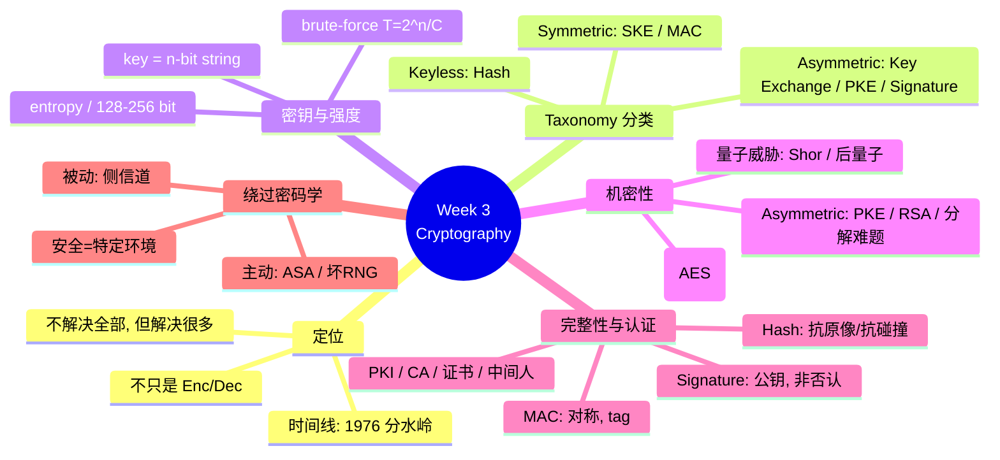

---

## 1. 密码学不是加密解密:时间线与一条分水岭

我们先纠正那个最常见的误解。**Cryptography ≠ Encryption + Decryption**——这是讲义 [S3] 单独立出来的一行,值得当作本章的口号背下来。加密解密只是密码学众多目标里的*一个*(机密性);密码学还要管"信息有没有被改"(完整性)、"对面到底是不是本人"(认证)、"事后能不能赖账"(不可否认)、"两个素未谋面的人怎么凭空协商出一把共享密钥"(密钥交换)……这些都不是"把明文变乱码"能直接覆盖的。

要理解今天密码学为什么长成这样,得看一条**时间线**,它有一个清晰的分水岭——**1976 年**。[S3]

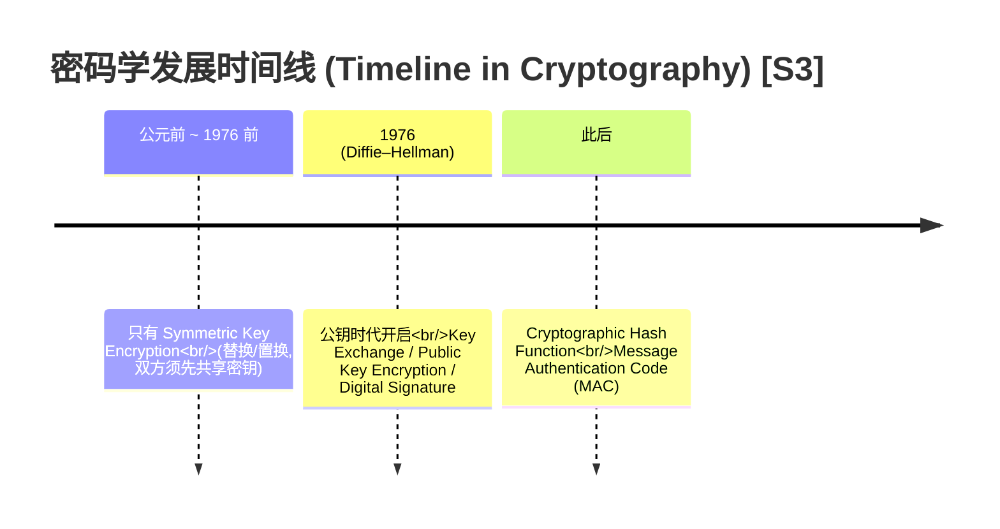

讲师用一个非常生活化的例子解释了 1976 年*之前*的密码学是什么样:"**you and your friend want to exchange some message that nobody else knows. So you convert words into numbers by some rules, and your friend converts it back.**"——你和朋友想传别人看不懂的消息,于是约定一套规则(比如把字母替换成另一个字母,或把文字转成数字),朋友再按同一套规则还原。这里的关键是:**两个人必须在通信之前就先约定好这套"规则"(也就是密钥)。** 这就是 **symmetric key encryption**(*对称密钥加密*)的本质,它统治了 1976 年之前的整个密码学史。

> 📎 **拓展(超出 slides)** — 历史上著名的例子:Caesar cipher(凯撒密码,把每个字母移位)、二战的 Enigma 机。它们的共同软肋正是"双方必须先共享一个秘密"——一旦这个秘密在传递途中被截获,整套系统就破了。slides 没展开这些古典密码,但理解"对称 = 先共享秘密"这个内核就够了。

1976 年发生了什么?**Diffie 和 Hellman** 提出了一个革命性的想法:能不能让两个**从未共享过任何秘密**的人也安全通信?这个想法直接催生了三样此前不可能存在的东西——**key exchange**(*密钥交换*)、**public key encryption**(*公钥加密*)、**digital signature**(*数字签名*)。再加上后来发展成熟的 **cryptographic hash function**(*密码学哈希函数*)和 **message authentication code (MAC)**(*消息认证码*),现代密码学的"原语家族"就齐了。[S3]

> **🔑 直觉锚点** — 记住分水岭:**1976 年以前,密码学≈对称加密,前提是双方先共享密钥;1976 年以后,公钥密码学让"陌生人之间也能安全通信"成为可能。** 后面所有内容都挂在这条主线上。

---

## 2. 密码学的分类法 (Taxonomy):全章的骨架

上一节列了一堆原语(hash、SKE、MAC、key exchange、PKE、signature),现在要把它们**结构化**,否则就是一盘散沙。讲义 [S4] 给了一棵分类树,这棵树是本章的**脊柱**——后面每一节其实都是在讲树上的某一个叶子。请务必把它画出来记住。

第一刀,按"用不用密钥"切:

- **Keyless cryptography**(*无密钥密码学*):不需要任何密钥就能用。唯一的代表是 **cryptographic hash function**(哈希函数)。讲师特别点了一句:"**for the hash function, you don't need a key**"——这正是 hash 和 MAC 最本质的区别,后面 §7 会用到。
- **Key-based cryptography**(*基于密钥的密码学*):需要密钥。它再按密钥的"对称性"切第二刀。

第二刀(在 key-based 内部),就是 §1 那条 1976 分水岭的结构化版本:

- **Symmetric**(*对称*):双方用**同一把**密钥。包含两个原语——**symmetric key encryption (SKE)** 和 **MAC**。
- **Asymmetric**(*非对称*):用**一对**密钥(公钥 + 私钥)。包含三个原语——**key exchange**、**public key encryption (PKE)**、**digital signature**。

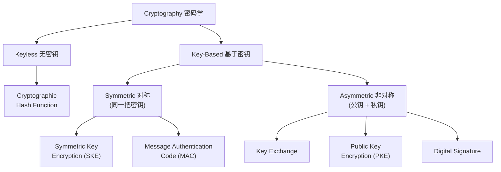

那么,怎么判断一套密码方案是对称还是非对称?讲义 [S5] 给了一个干净利落的判据,用 Alice 和 Bob(密码学里永远的两位主角)来说:

> 假设 Alice 和 Bob 之间使用某套密码学。
> - 如果它要求 Alice 和 Bob **先共享同一把秘密密钥**(*share the same secret key first*),它就是 **symmetric cryptography**;
> - 否则,它就是 **asymmetric cryptography**。

这个判据非常好用:遇到任何方案,只问一句"用之前双方要不要先有一把共同的秘密?"——要,对称;不要,非对称。

| | Symmetric(对称) | Asymmetric(非对称) |
|---|---|---|
| 密钥结构 | 一把共享密钥 $k$ | 一对密钥:公钥 $pk$ + 私钥 $sk$ |
| 用之前要先共享秘密吗? | **要** | **不要**(公钥可以公开) |
| 原语 | SKE、MAC | Key Exchange、PKE、Digital Signature |
| 速度 | **快**(efficient) | **慢得多**(much slower)[S27] |
| 解决的痛点 | 已有共享密钥时高效保密 | 陌生人之间从零建立安全通信 |

> ⚠️ **易错点** — "对称/非对称"指的是**密钥**对称,不是算法对称。对称 = 加密和解密用同一把密钥;非对称 = 加密用一把(公钥)、解密用另一把(私钥)。后面 §6 会看到,正因为公钥能公开,非对称才解决了"陌生人通信"这个对称做不到的问题。

> **🔑 记忆法** — 把这棵树背成一句话:"**无密钥只有哈希;对称管加密和 MAC;非对称管密钥交换、公钥加密、数字签名。**" 全章往后读,每讲一个原语都回到这棵树确认它的位置——这就是"connection",让一章读起来是一条线而不是一堆卡片。

讲义 [S27] 在结尾还给了一条统领全局的话,这里先剧透,§9 再回收:**每种密码学只聚焦一个特定的安全服务(each cryptography focuses on one specific security service)**,真实系统常常要把好几个**组合**起来用。最经典的组合就是:**先用 key exchange 协商出一把共享密钥,再用又快又好的 symmetric encryption 去加密真正的数据**——这一句把整棵树的两边缝合在了一起。

---

## 3. 密钥就是一串比特:多长才安全?

在展开任何具体算法之前,必须先理解所有 key-based 密码学共同的命根子——**key**(密钥)。讲义 [S6] 给了一个朴素但关键的定义:

> 在密码学里,一把 **key 通常表示为一个 n-bit string**(*n 位比特串*),也就是一串 0 和 1,比如 `0110100…`。**一旦密钥被对手知道,他就能立刻攻破整个方案。**

讲师把这句话说得很直白:整个密码系统的安全,最终都压在"对手猜不到这串比特"上。那对手猜中的概率有多大?这就引出本节的核心。

### 3.1 猜中一把随机密钥的概率

讲师从最小的例子搭起直觉。先看 **1 位**密钥:只有 `0` 和 `1` 两种可能,对手随便猜,**至少 50% 命中**。再看 **2 位**:可能是 `00, 01, 10, 11` 共 4 种,猜中概率 $1/4 = 25\%$。规律已经出来了——每多一位,可能性翻一倍。

推广到 **n 位**:每个位置有 2 种选择,共 $n$ 个位置,所以一共有 $2^n$ 种可能的密钥。如果密钥是**随机均匀**选取的,对手一次猜中的概率就是 [S6]:

$$P(\text{猜中}) = \frac{1}{2^n}$$

这个式子说的是:**$n$ 越大,这个概率越小,小到对手"第一次猜"几乎必败。** 这就是为什么"密钥要足够长"。但"足够长"到底是多长?光看概率还不够直观,得换算成"暴力破解要花多少时间"。

### 3.2 暴力破解时间:$T = 2^n / C$

**Brute-force attack**(*暴力破解*)就是把 $2^n$ 种可能的密钥**逐个试一遍**:试第一把,不对就试下一把……直到命中。讲义 [S7] 把它的耗时公式化:

$$T = \frac{2^n}{C}$$

逐符号读出来:
- $n$ = 密钥长度(单位:比特),决定了总共有 $2^n$ 把候选密钥;
- $C$ = CPU 速度,即每秒能执行多少个**时钟周期 (clock cycles per second)**,通常以 GHz 计(1 GHz $=10^9$ cc/s);
- 关键**假设**:试一把密钥恰好花一个时钟周期。于是"总试验次数 ÷ 每秒能试的次数 = 总秒数"。

讲义给了两个对照鲜明的例子,务必都过一遍:[S7]

> **🔑 例(Worked example,来自 [S7])** — 破解一把 **60-bit** 密钥:
>
> *用普通家用机*:Intel i5,3 GHz,即 $C = 3\times10^9$ cc/s。
> $$T = \frac{2^{60}}{3\times10^9}\ \text{s} \approx 384{,}307{,}168\ \text{s} \approx 160{,}752\ \text{小时} \approx 4{,}448\ \text{天} \approx \boxed{12\ \text{年}}$$
> 12 年——看起来似乎"够久"。但换台机器结果就翻车:
>
> *用超级计算机*:$C = 2\times10^{16}$ cc/s。
> $$T = \frac{2^{60}}{2\times10^{16}}\ \text{s} \approx \boxed{58\ \text{秒}!}$$
>
> **同一把 60 位密钥,家用机要 12 年,超算只要 58 秒。** 这说明 60 位*远远不够*——你不能假设对手只有家用机。

那要多长才真正安全?讲义 [S8] 把同一台超算对准更长的密钥:

> **128-bit** 密钥,超算 $C = 2\times10^{16}$ cc/s:
> $$T = \frac{2^{128}}{2\times10^{16}}\ \text{s} \approx 2^{49}\ \text{秒} \approx 10^{15}\ \text{年}!$$
> $10^{15}$ 年——远超宇宙年龄($\sim1.4\times10^{10}$ 年)。**所以 $n=128$ 已经非常安全(very safe)。**

而对 **256-bit**,讲义给了一句更强的话:[S8]

> 由于来自**基本物理学(fundamental physics)的限制**,我们没有理由期待任何数字计算机(或任意组合)能用暴力破解攻破一个 256-bit 的随机串。

讲师补了一句直觉:128 位就已经"takes a lot of time",256 位"even more secure"。可以把 256 位理解为"留足安全裕量"的工业标准。

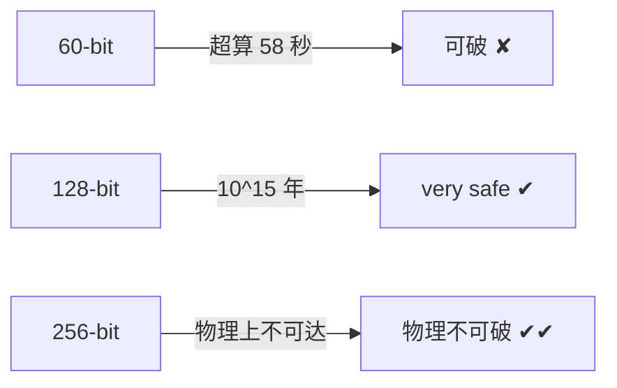

> ⚠️ **易错点** — "更快的计算机"会**线性**地缩短暴力破解时间(分母 $C$ 变大),但密钥每加 1 位,候选数 $2^n$ 就**翻倍**(分子指数增长)。指数永远赢过线性——这就是为什么"加密钥长度"是对抗算力增长最有效的手段,也是为什么 60→128 这区区 68 位的差距,能把"58 秒"变成"$10^{15}$ 年"。

### 3.3 口令的熵 (Entropy):把这套逻辑用到密码上

讲师在课上花了不少时间把上面的"密钥长度"迁移到一个你天天打交道的东西上——**password**(口令)。他指出:**你的登录口令本质上也是一把密钥**,所以同样可以问"它有多少比特的强度?够不够 128 位?"。衡量这个强度的量叫 **entropy**(*熵*)——粗略说,就是"对手要暴力穷举,得试多少种可能"取以 2 为底的对数。

> **🔑 例(Worked example — 来自讲师口述的 workshop 实验)** — 一个"推荐"的 8 位口令的熵有多大?
>
> 推荐做法是混合四类字符:
> - 小写字母:26 种
> - 大写字母:26 种(累计 52)
> - 数字 0–9:10 种(累计 62)
> - 特殊字符:约 8 种(累计约 **70 种**)
>
> 于是**每个位置有 70 种选择**,8 位口令共有 $70^8$ 种可能。换算成比特(取 $\log_2$):
> $$\text{entropy} = \log_2(70^8) = 8\times\log_2 70 \approx 8 \times 6.13 \approx \boxed{49\ \text{bits}}$$
>
> 把它和 §3.2 的标准一比:**约 49 位,远小于 128 位**——也就是说,一个"看起来很复杂"的 8 位随机口令,其暴力破解强度其实和那把 58 秒就被超算攻破的 60 位密钥同一量级。这正是讲师让大家"在 workshop 里自己算一遍 entropy、再亲手 brute-force 一个口令"的用意:**直观感受到口令比你想象的弱得多。**

> 📎 **拓展(超出 slides)** — 上面的 49 位是"理想情况":前提是 8 个字符**每一位都独立、均匀随机**。真实口令通常远弱于此——人会用单词、生日、键盘序列,真实熵可能只有十几位。NIST 现行口令指南因此更强调**长度**(用 passphrase 拼长句)而非"强制混合字符类型"。slides/transcript 只给了"$70^8$ 换算成比特再和 128 比"的算法,考试按这个口径即可;此处补充是帮你理解为什么现实更糟。

把 §3 收一下:**密钥(以及口令)就是一串比特,安全性由"对手暴力穷举要花多久"决定,公式 $T=2^n/C$ 告诉我们指数级的密钥长度永远碾压线性增长的算力;128 位安全、256 位物理不可破。** 这条结论会在后面反复用到——RSA 为什么要 1024/2048 位、坏 RNG 为什么把 128 位密钥偷偷削成 10 位(§10),都是它的应用。

---

## 4. 对称密钥加密:流密码与分组密码

有了"密钥"的概念,我们回到分类树最左边的 key-based 分支,先讲最古老、最快的一类——**symmetric key encryption (SKE)**。它的核心就是 §2 那个判据:**Alice 和 Bob 用同一把密钥 $k$**。讲义 [S9] 给出形式化:

$$C = \text{Enc}(k, M) \qquad M = \text{Dec}(k, C)$$

读出来:**Enc** 拿密钥 $k$ 和明文 $M$(*plaintext / message*),产出密文 $C$(*ciphertext*);**Dec** 拿同一把 $k$ 和密文 $C$,还原出明文 $M$。加密解密同一把钥匙,这就是"对称"。

SKE 在工程上分两大类,区别在于"一次处理多少数据":

**Stream cipher(流密码)** — "**each bit of plaintext is XOR-ed with a key stream**"(明文的每一位与一段**密钥流**做异或)。讲师描述了它的工作方式:把明文转成比特,与一段等长的密钥流逐位做 **XOR**(异或)运算得到密文;解密时再用同一段密钥流对密文做一次 XOR,就还原出明文。它"**fast and often used as an encryption scheme on the fly**"——快,常用于边产生边加密的实时场景(如流媒体、无线通信)。

> 📎 **拓展(超出 slides)** — 流密码能这么干,靠的是 XOR 的一个漂亮性质:$(M \oplus K)\oplus K = M$。同一个密钥流异或两次会抵消,所以"加密"和"解密"用的是完全相同的操作。slides 只说了"XOR with keystream",这里补一句它为什么能还原。注意:密钥流绝不能重复使用,否则两段密文异或就会泄露明文——这是流密码最经典的坑。

**Block cipher(分组密码)** — 明文被切成**预定大小的块**(block,如 64 位、128 位),每一块用一个叫 **block cipher** 的对称算法加密。代表就是 **AES**(*Advanced Encryption Standard*)。讲师说 AES "**is still secure now, depends on bit security, and is still being used now**"——它至今安全且被广泛使用,安全性取决于密钥位数(常用 128 或 256 位,正好对应 §3 的结论)。

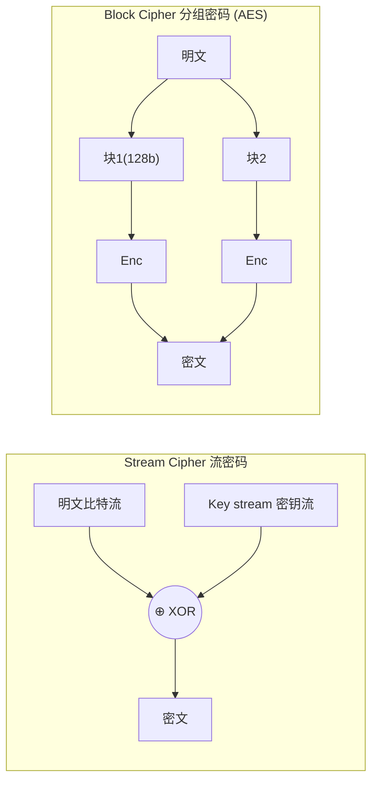

| | Stream cipher(流密码) | Block cipher(分组密码) |
|---|---|---|
| 处理粒度 | 逐比特(与密钥流 XOR) | 固定大小的块(64/128 位) |
| 典型场景 | 实时、on-the-fly | 文件、数据存储 |
| 代表 | RC4 等 | **AES** |

---

## 5. 机密性 (Confidentiality):一个"好密码"到底要藏住什么?

加密的目的是什么?讲师一句话点题:"**we need to keep the confidentiality of the information**"——保住信息的 **confidentiality**(*机密性,也叫 secrecy*)。但"机密"具体意味着什么,值得仔细推敲,因为这正是分辨"好密码"和"看起来加密了的烂密码"的标准。[S10]

讲义 [S10] 给出机密性的形式化设定,这是从理论密码学家视角的定义:

- 我们假设 Alice 发给 Bob 的**明文,对手是不知道的**;
- 但对手**确实能拿到密文**(比如在网络上截获);
- 要求:**对手不能从密文里获得任何关于明文的有用信息**(*should not get any useful information about the plaintext from the ciphertext*)。

注意这个定义的强度:不是"对手还原不出完整明文就行",而是"对手连**一点点**有用信息都拿不到"。讲义用一张著名的图说明这点(教科书里常用的"加密企鹅"对比),[S11–S12] 把它讲成了一个直觉测验:

> **🔑 例(来自 [S11–S12])** — 给你一张明文图和它的"密文"图:
> - **坏加密**:密文虽然变了颜色/像素值,但你**一眼还能看出原图的轮廓**(那只企鹅的形状还在)。讲师问:"if you're the adversary and you get the ciphertext, can you easily guess the plaintext? Easy, right?"——能猜出来,所以**这不是好加密**。它泄露了明文的*结构*。
> - **好加密**:密文看上去就是**完全的随机噪声**,看不出原图的任何信息。这才是我们想要的。
>
> 讲师的总结很关键:"**Looks easy, but many encryption algorithms fail to achieve this!**"——做到"密文像随机噪声、不泄露明文任何结构"看似简单,但历史上大量加密方案恰恰栽在这里。

为什么这是"好密码"的标准?因为如果密文还残留明文的任何模式(图案、重复、统计规律),对手就能用这些模式去推断明文,机密性就破了。**一个真正好的密码,密文必须看上去和随机数据无法区分。** 这也呼应了 §3 的核心直觉——好的加密让对手除了"暴力猜密钥"之外,没有任何捷径。

> ⚠️ **易错点** — "密文看起来乱"不等于"安全"。坏加密(如简单替换/上面那只企鹅)的密文也"看起来乱",但残留了结构。标准是更强的:**不泄露关于明文的任何有用信息**。这就是为什么很多自创的、看似复杂的加密都是不安全的。

到这里,对称加密的故事讲完了:它快、它能保机密,但它有一个绕不开的前提——**Alice 和 Bob 必须事先共享密钥**。讲师抛出了那个直击痛点的问题:"**what if I want to talk to some people from India and we don't know each other at the beginning? How can I share the secret with them?**"——我想跟一个素未谋面的印度人通信,我们之间从没有过任何共享秘密,这把对称密钥要怎么*第一次*安全地交到对方手上?这个"先有鸡还是先有蛋"的死结,正是 1976 年公钥密码学要解开的。

---

## 6. 公钥加密 (Public Key Encryption) 与 RSA

### 6.1 思想:用对方的公钥加密

**Public key encryption (PKE)** 要解决的,正是 §5 末尾那个死结:"**achieve confidentiality between two users who do not share a secret in advance**"——让两个**事先不共享任何秘密**的人之间实现机密通信。[S13] 这个概念由 **Diffie 和 Hellman 于 1976 年**提出,而第一个具体可用的方案 **RSA**(取自三位发明人 **Rivest、Shamir、Adleman** 的首字母)随后问世。

PKE 怎么破解"先有鸡还是先有蛋"?靠的是**一对**密钥,而不是一把。讲义 [S14] 给出记号和流程:

- **$pk$ = public key(公钥)**:可以**公开发布**给所有人;
- **$sk$ = secret key(私钥)**:**只有持有者自己保管**,绝不外泄。
- 每个用户生成一对 **key pair $(pk, sk)$**。

加密解密的方向是**交叉**的——这是 PKE 最反直觉、也最关键的地方:

$$C = \text{Enc}(pk, M) \qquad\quad M = \text{Dec}(sk, C)$$

讲师把流程讲得很清楚:"**If you want to send me a message, you take my public key, do the encryption, and send the ciphertext to me. Then I, having my secret key, decrypt it and read the message.**" 翻译过来:

> 你想发消息给我 → 你用**我的公钥** $pk$ 加密 → 把密文发给我 → 我用**我的私钥** $sk$ 解密。

注意:加密用的是**接收方的公钥**,解密用的是**接收方的私钥**。因为公钥本来就是公开的,你不需要事先和我共享任何秘密就能给我发密文——死结解开了。

那它凭什么安全?讲义 [S14] 列了两条**基本安全属性**:

1. **从 $pk$ 推不出 $sk$**:对手知道公钥(公钥本来就公开),也无法算出对应的私钥;
2. **没有 $sk$ 就从 $C$ 拿不到 $M$**:没有私钥的人,看着密文也还原不出明文。

这两条怎么保证?靠 **computationally hard problems**(*计算上的难题*)——存在一些数学问题,正向算很容易、反向算极难。而要让这种"难"成立,讲义强调:"**sk and pk must be large!**"——公私钥都必须足够大(这又是 §3 那条"长度=安全"逻辑的体现)。

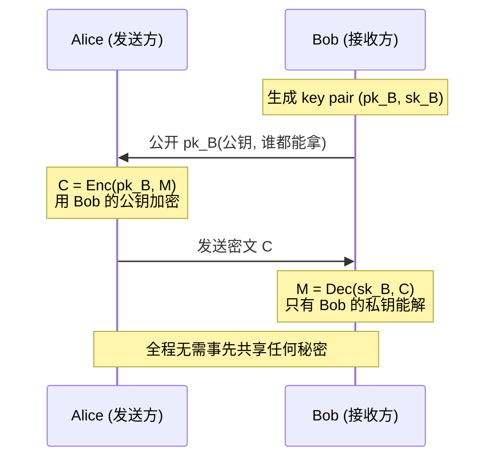

### 6.2 Textbook RSA:数学长什么样

讲义 [S15] 给了 **textbook RSA**(教科书版 RSA,即去掉工程加固后的最基本形式)。讲师反复提醒"this is not secure but is the textbook idea"——这是用来讲清*原理*的最简形式,真实部署还要加 padding 等。别被数学吓到,核心就三个等式。

**密钥生成:**
- 选两个**大素数**(*large primes*)$p$ 和 $q$,令 $N = pq$;
- **公钥** $pk = (N, e)$,其中 $e$ 是一个指数;
- **私钥** $sk = d$,其中 $d$ 满足:
$$e \cdot d \equiv 1 \pmod{(p-1)(q-1)}$$

讲师说:"**E and D have some relation; don't care exactly what it is if you don't like math, but just know they have a relation.**"——你只需记住 $e$ 和 $d$ 通过 $(p-1)(q-1)$ 这个模数绑在一起。

**加密:** 把明文 $M$(当成一个数)做模幂运算:
$$C = \text{Enc}(pk, M) = M^e \bmod N$$
注意加密只用到了**公开的** $N$ 和 $e$——任何人都能加密。

**安全性的来源:为什么从 $(N,e)$ 推不出 $d$?** 这是 RSA 的灵魂。讲义 [S15] 给出推理链:
- 要算出私钥 $d$,你得先知道 $(p-1)(q-1)$;
- 而要知道 $(p-1)(q-1)$,你得先知道 $p$ 和 $q$;
- 可你手上只有 $N = pq$。从 $N$ 反推出 $p$ 和 $q$,就是把一个大数**分解**成两个素数因子——这叫 **prime factorisation problem**(*大数分解问题*),是公认的**难题**。

讲师把这条逻辑说得很透:"**The problem of finding the secret key reduces to the problem of factorization.**"——破解 RSA 私钥 = 解大数分解问题。而:"**if p and q are large, there are no efficient algorithms that can factorize it in a short time.**" 所以 $p, q$ 必须取得非常大,讲师给了现实数字:"**normally p and q are around 1,024-bit or 2,048-bit.**"

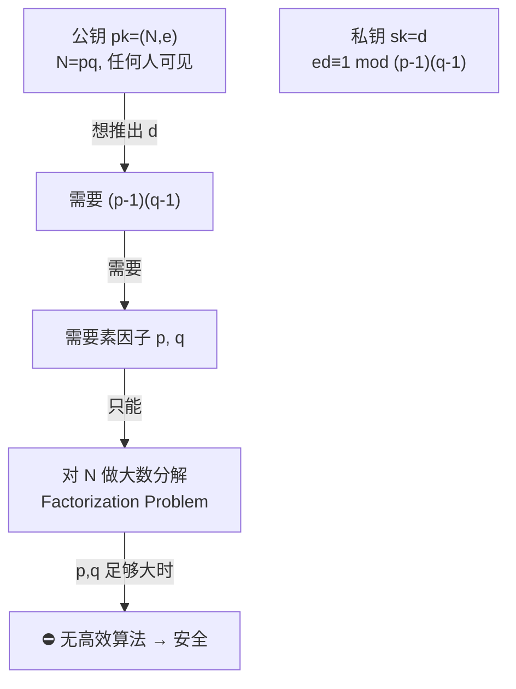

> **🔑 例(RSA 安全性的直觉)** — 给你 $N = 15$,你一眼看出 $15 = 3\times5$——因为 15 太小。但给你一个 2048 位的 $N$(约 600 位十进制数),即便动用全世界的经典计算机,把它分解成 $p\times q$ 也要远超宇宙年龄的时间。**RSA 的安全,就建立在"乘起来容易、分回去极难"这个不对称性上。** 这正是 §6.1 说的"正向易、反向难"的 computationally hard problem 的具体化身。

### 6.3 量子威胁:Shor 算法与后量子密码学

RSA 的安全完全押在"大数分解很难"上。但讲师提出一个不安的问题:这个"难",在**量子计算机**面前还成立吗?

答案是不成立。讲义虽未把这部分做成正式幻灯,但讲师在课上讲得很完整,是高频考点:

> **🔑 关键史实(来自讲师口述)** — **1994 年,Peter Shor** 提出了一个**多项式时间的量子算法(polynomial-time quantum algorithm)**,能**高效地分解大整数**——也就是说,**Shor's algorithm 能高效解决大数分解问题**,从而直接攻破 RSA。

那 RSA 现在为什么还安全?因为运行 Shor 算法需要**足够大的量子计算机**,而它还不存在。讲师解释:"**you need a quantum computer to run it, but you don't have one yet... they have very small ones, just ~100 qubits; you need a million qubits to break RSA.**"——现有量子机只有约 100 量子比特(qubits),而攻破 RSA 大约需要**百万级 qubit**。所以"**your message sent to your friend is still secure at the moment**"——目前仍安全。但 IBM 等大公司每年都在推进,业界预测 **2030–2035** 左右可能出现实用量子计算机(讲师自嘲"十年前就听说'再过 15 年',现在还在说 15 年")。

正因为这个威胁迟早会来,密码学界提前布局了 **post-quantum cryptography**(*后量子密码学*)——设计**能抵抗量子计算机的**密码系统。讲师介绍:**NIST**(美国国家标准与技术研究院)早在 **2016 年**就发起了后量子密码标准化的征集,**2022 年**已经出了一批标准,目前仍在验证和推广;许多政府和机构正在把现有的经典密码(如 RSA)**迁移**到后量子方案。

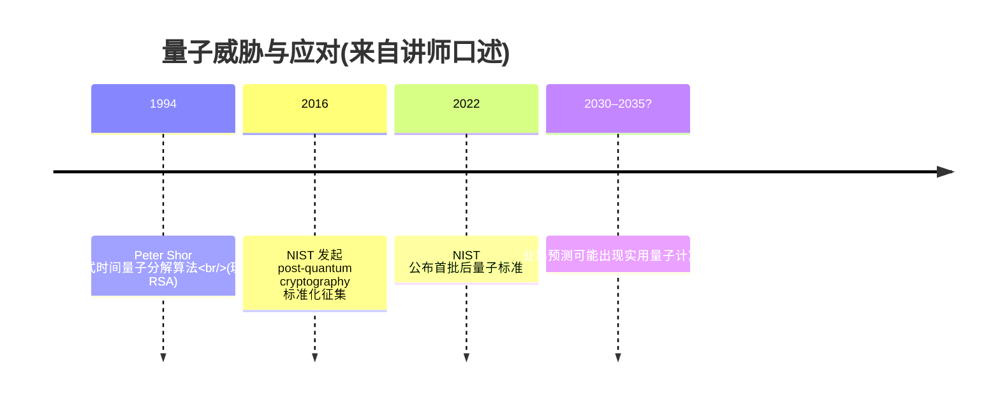

> ⚠️ **易错点** — Shor 算法**早在 1994 年就有了**,威胁的是"算法层面";真正卡住对手的是"还没有足够大的量子硬件"。所以不要说"量子计算机还破不了 RSA 因为没人发明算法"——算法有了,缺的是机器,而机器迟早会有,这正是现在就要发展后量子密码学的原因。

把 §6 收一下:**公钥加密用一对密钥(公钥加密、私钥解密)解决了对称加密"陌生人无法第一次共享密钥"的死结;RSA 是第一个方案,安全性建立在大数分解难题上,因此 $p,q$ 要取 1024/2048 位;但 Shor 算法让量子计算机原则上能高效分解,于是有了后量子密码学。** 到此我们已讲完了密码学的"机密性"半壁江山(对称 + 非对称加密)。接下来转向另一半:信息有没有被改、对面是不是本人。

---

## 7. 完整性与认证:Hash、MAC、数字签名三件套

机密性管的是"别人看不到内容"。但还有两个独立的安全目标:内容**有没有被篡改**,以及消息**到底是谁发的**。讲义 [S16] 把这两个目标定义得很精确,注意它们的攻击者模型和机密性**不同**——这里**假设消息对手是知道的**,对手的目标不是偷看,而是改:

- **Integrity(完整性)**:假设消息对手已知,对手想在**传输途中篡改(alter/modify)**消息。要求:**接收方能检测出"有东西被改过了"**。它只回答一个问题——"内容变没变?"
- **Authentication(认证)**:在完整性之上更进一步——对手不仅想改消息,还想**冒充**某个特定的人(比如 Alice),声称"这消息是 Alice 发的"。认证要能识破这种冒充,确认**消息确实出自它声称的那个人**。

这正是 Week 1 学过的 **Integrity vs Authenticity** 的密码学落地:认证 = 完整性 + "确实是 TA"。下面三个原语,正是为这两个目标服务的,且强度层层递进。

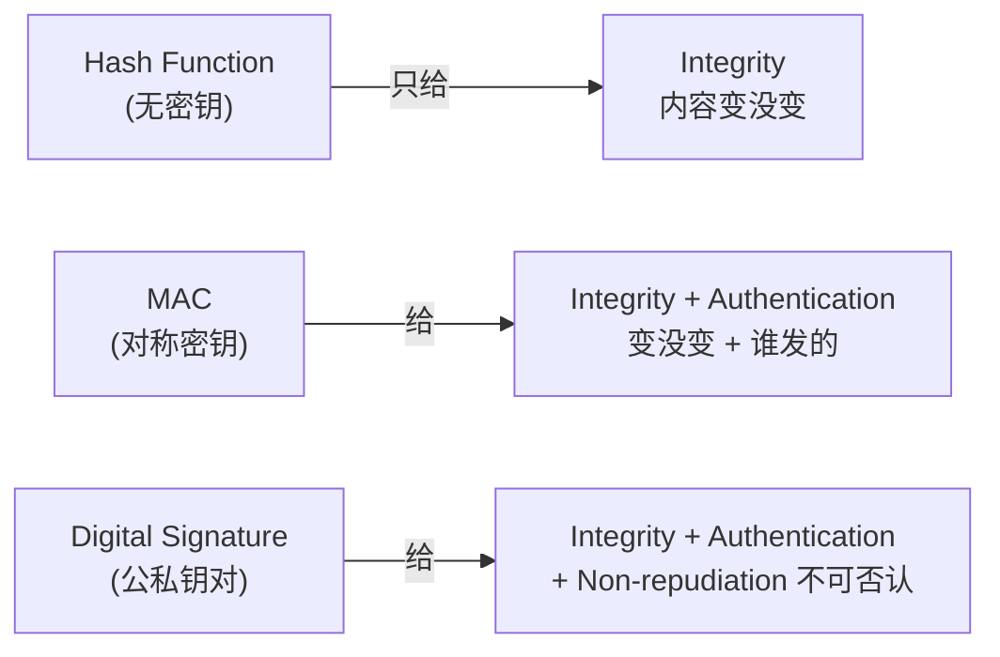

### 7.1 Cryptographic Hash Function:无密钥的完整性

**Cryptographic hash function**(*密码学哈希函数*)$H$ 是分类树上唯一的 **keyless** 原语。讲义 [S17] 定义:它**接受任意长度的输入,输出固定长度的值**(arbitrary length → fixed length)。它用来保证数据的**完整性**。

但不是任何"把长变短"的函数都能用于密码学。讲义 [S17] 要求 $H$ 满足两条性质:

- **Preimage resistant(抗原像 / 单向性)**:它必须是**单向的(one way)**。给定一个哈希值 $v$(满足 $H(d)=v$),要反推出原始输入 $d$ 是**不可行的(infeasible)**。讲师解释:对手即便拿到了哈希值 $v$,也算不出里面藏的是什么消息。
- **Collision resistant(抗碰撞)**:要找到**两个不同的**输入 $d$ 和 $d'$ 使得 $H(d) = H(d')$(即"碰撞")是**不可行的**。

满足这两条的,才叫 cryptographic hash function。[S17]

哈希怎么用?讲义 [S18] 指出它"**often used as a component of other cryptographic algorithms**"——很少单独用,更多是当别的算法的零件。两个典型用途:
- **为签名压缩消息**:要给一份很大的文档做数字签名,先用 hash 把它压成一个固定长度的小摘要,再对摘要签名——更高效。(§7.3 会用到)
- **生成确定性随机值**:给定一个输入,hash 能产出一个看似随机但可复现的值,可用于 PRNG(伪随机数生成)。(§10 的坏 RNG 例子正是滥用了这一点)

常见的哈希函数有 **MD5、SHA-1、SHA-2、SHA-3**。但讲义 [S18] 给了一条必须记住的安全警告:

> ⚠️ **MD5 和 SHA-1 已被攻破,不再推荐用于安全实现(They are broken!)。** 讲师明确:它们**不再具有抗碰撞性(not collision-resistant)**——有人能构造出碰撞。现在应使用 **SHA-2(如 SHA-256)或 SHA-3**(这正是 Week 1 workshop 里用的)。

> **🔑 直觉(承接 Week 1)** — 哈希能检测篡改,是因为哪怕改一个比特,输出也会**面目全非**(雪崩效应)。但它有个根本局限:**任何人都能计算 $H$**(它无密钥)。所以哈希能告诉你"内容变了",却**无法告诉你是谁改的/谁发的**——对手改完消息,自己重算一遍哈希附上去就行。要堵住这个口子,必须引入"只有当事方才有的秘密"——这就是 MAC 和签名要做的。

### 7.2 Message Authentication Code (MAC):带密钥的认证

**MAC**(*消息认证码*)正是给哈希"加上密钥"以获得认证能力。讲义 [S19] 定义:MAC 是 **symmetric cryptography**(对称的),它产出的那一小段信息叫 **tag**(*标签*),用于**认证一条消息**。形式化:

$$t = \text{MAC}(k, M) \qquad \{0,1\} = \text{Verify}(k, t, M)$$

读出来:用密钥 $k$ 对消息 $M$ 算出一个 tag $t$;接收方用**同一把** $k$、连同 $(t, M)$ 跑 **Verify**,输出 1(有效)或 0(无效)。关键性质,讲义 [S19] 连说两句:

- **不知道密钥的人,算不出有效的 tag**(cannot compute a valid tag);
- **不知道密钥的人,也无法验证 tag**(cannot verify a tag)。

这正是 MAC 比 hash 强的地方:hash 谁都能算,MAC 只有持钥者能算和验。于是 MAC 在完整性之外**额外提供了认证**——能算出有效 tag 的,必然是持有共享密钥的那一方。

讲义 [S19] 还说了 MAC 和 hash 的联系:**可以用哈希构造 MAC**——用一个抗碰撞的哈希函数 $H$,计算 $t = H(k, M)$(把密钥和消息一起喂进哈希)。这正是 Week 1 workshop 里 **HMAC** 的思想雏形。

但 MAC 既然是对称的,就继承了对称加密的老问题:讲义 [S20] 提醒,**Alice 和 Bob 必须先共享密钥 $k$**。而且由此带来一个 MAC 的**根本局限**(下一节签名要解决的):因为双方都有同一把密钥,**Alice 和 Bob 都能生成有效 tag**——所以 MAC 无法向第三方证明"这条消息究竟是他俩中的*哪一个*发的"。

### 7.3 Digital Signature:公钥认证 + 不可否认

**Digital signature**(*数字签名*)是分类树上非对称那一支的原语,它用**一对**密钥,而且把公私钥的角色和 PKE **反过来用**。讲义 [S21] 定义:签名者(signer)有一对密钥 $(pk, sk)$:

- **签名用私钥**(signing key $sk$ is private/secret);
- **验证用公钥**(verification key $pk$ is public)。

形式化:
$$s = \text{Sign}(sk, M) \qquad \{\text{Valid}(1)\ \text{or}\ \text{Invalid}(0)\} = \text{Verify}(pk, M, s)$$

读出来:Alice 用**自己的私钥** $sk$ 对消息 $M$ 生成签名 $s$;任何人用 Alice 的**公钥** $pk$、连同 $(M, s)$ 跑 Verify,就能判定这个签名对这条消息是否有效。因为只有 Alice 持有 $sk$,**只有 Alice 能生成有效签名**,而**所有人都能验证**(公钥公开)。

> ⚠️ **易错点:PKE 和签名用钥方向相反。** 在 §6 的 PKE 里,用**接收方公钥**加密、**接收方私钥**解密(为了保密)。在签名里,用**发送方私钥**签、**发送方公钥**验(为了认证)。一个"用别人的公钥",一个"用自己的私钥",别记反。

数字签名的回报是三项安全属性,讲义 [S22] 列得很清楚——这是本章最高频的考点:

1. **Message integrity(完整性)**:消息在传输中未被篡改;
2. **Message authentication(认证)**:消息确实由 Alice 发出;
3. **Non-repudiation(不可否认性)**:**Alice 事后不能抵赖说"这不是我发的"**。

第三项是签名独有、MAC 没有的。讲师把原因讲透了:因为签名**只能由持有私钥的 Alice 一个人生成**,所以一旦验证通过,就铁证如山地指向 Alice,她赖不掉。而 MAC 不行——讲义 [S20] 对比得很精炼:"**A signature can only be generated by Alice (signer), but a tag can be generated by both Alice and Bob.**" 既然 Bob 也能造 tag,Alice 完全可以辩称"这 tag 是 Bob 自己造的栽赃我",所以 MAC **给不了不可否认性**。

> **🔑 例(来自讲师口述 — 电子签名)** — 讲师举了 Optus(澳洲电信)的例子:你签一份合同,对方发来一个链接/邮件,你打开表单在线签字——"**these are your digital signatures.**" 现实中你每天都在用数字签名。它之所以有法律效力,正是因为 **non-repudiation**:你签了就不能抵赖。这也呼应 [S18] 说的——大文档常先 hash 成摘要再签名,以提高效率。

### 7.4 三件套对比:一表说清

这是本章必背的对比表。三个原语对应分类树的不同位置,提供的安全属性层层加码:

| | Hash function | MAC | Digital Signature |
|---|---|---|---|
| 分类树位置 | **Keyless**(无密钥) | **Symmetric**(对称) | **Asymmetric**(非对称) |
| 用什么密钥 | 无 | 一把**共享**密钥 $k$ | 一对密钥:私钥签、公钥验 |
| 谁能"生成" | **任何人** | 持有 $k$ 的双方(Alice 和 Bob) | **只有签名者 Alice** |
| 谁能"验证" | 任何人 | 持有 $k$ 的双方 | **任何人**(公钥公开) |
| Integrity 完整性 | ✔ | ✔ | ✔ |
| Authentication 认证 | ✘(谁都能算) | ✔ | ✔ |
| **Non-repudiation 不可否认** | ✘ | **✘**(双方都能造 tag) | **✔**(只有 Alice 能签) |
| 速度 | 快 | 快(对称) | 慢(非对称) |

> ⚠️ **最常考的辨析:MAC vs Signature。** 两者都给完整性 + 认证,唯一的分水岭是 **non-repudiation**。根本原因在密钥结构:MAC 是**对称**的(双方共享一把钥,都能造 tag),所以无法对第三方证明是哪一方发的;签名是**非对称**的(只有签名者有私钥),所以铁证指向签名者,无法抵赖。考试若问"哪个提供不可否认",答**digital signature**。

---

## 8. 公钥基础设施 (PKI):公钥凭什么可信?

§7.3 的数字签名(以及 §6 的公钥加密)有一个被悄悄假设、却致命的前提:**你拿到的那把"Alice 的公钥",真的是 Alice 的吗?** 公钥长什么样?讲义 [S23] 直接甩出一串十六进制:`30 82 01 0a 02 82 01 01 00 dd 9e e4 f6 …`——它就是一长串没有任何"姓名标签"的字节。问题来了:**这串字节凭什么和"Alice 这个人"绑在一起?**

### 8.1 不验证公钥 = 中间人攻击

讲义 [S24] 把这个问题点破:在公钥密码学里,**公钥必须被认证(public keys need to be authenticated)**。换句话说,**"用户身份 (identity)"与"他创建的公钥 (public key)"之间的对应关系,必须被验证。** 讲师警告:"**you cannot just tell people, here is my public key**"——你不能随口说"这是我的公钥"就让人信。

如果不验证会怎样?讲义 [S24] 给出后果:密文、签名等一切公钥密码学对象都可能是**假的(bogus)**——这就是 **man-in-the-middle (MITM) attack**(*中间人攻击*)。讲师描述了攻击画面:"**the man stays in the middle between you and the other party**"——攻击者站在你和对方之间,把**自己的**公钥冒充成对方的公钥发给你。于是你以为在用 Alice 的公钥加密,其实用的是攻击者的公钥;攻击者解密、偷看、再用 Alice 的真公钥重新加密转发——你和 Alice 都浑然不觉。

> ⚠️ **易错点** — MITM 不是"破解了加密算法",而是"骗过了你对公钥归属的信任"。RSA 数学再硬,只要你信错了公钥,整套保密就形同虚设。这正是为什么"绑定身份↔公钥"是公钥密码学不可或缺的一环。

### 8.2 CA 用一个签名解决信任

**广为接受的解决方案**是引入一个可信第三方——**Certification Authority (CA)**(*认证机构*)。讲义 [S24–S25] 给出机制:Bob 向 CA **证明**他的身份 $ID_{Bob}$ 和公钥 $pk_{Bob}$ 是合法的;作为这次验证的**凭证(token)**,CA 会给 Bob 一样东西。这样东西就是一个**数字签名**:

$$s_{Bob} = \text{Sign}(sk_{CA},\ ID_{Bob}\ \|\ pk_{Bob})$$

读出来:CA **用自己的私钥** $sk_{CA}$,对"$ID_{Bob}$ 拼接 $pk_{Bob}$"这整条信息签名(把"身份‖公钥"当作消息喂给签名算法)。[S25]

妙在哪?讲义 [S25] 接着说:Alice(或任何人)只要持有 **CA 的验证公钥 $pk_{CA}$**,就能跑 Verify 检查 $s_{Bob}$ 是否有效。**若有效,她就可以信任 Bob 的公钥**。注意这里把信任问题**收敛**了:你不再需要逐个验证成千上万个公钥,只需要信任**一个** CA 的公钥;CA 用它的签名,替你担保所有它认证过的"身份↔公钥"绑定。这正是 §7.3 数字签名(尤其是不可否认性)的一个杀手级应用。

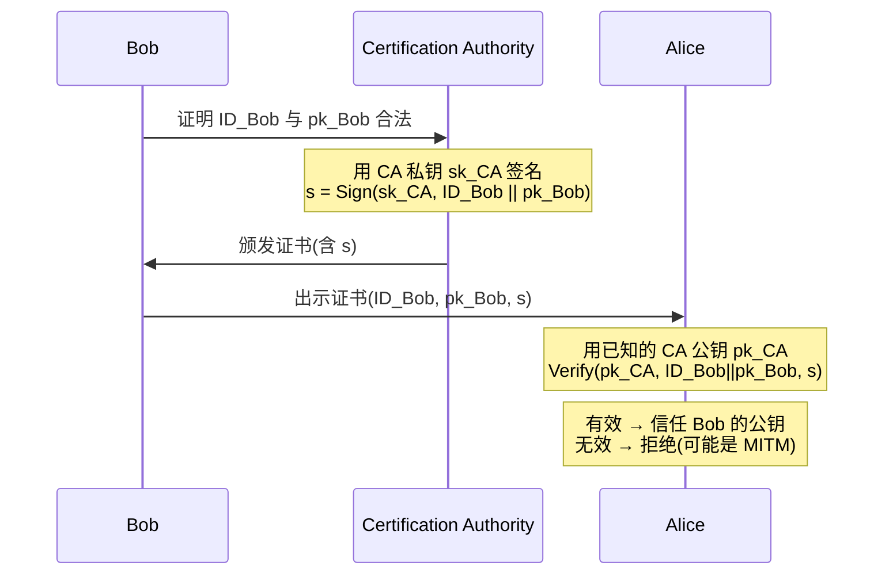

### 8.3 数字证书 (Digital Certificate) 里装了什么

CA 颁发的那个"token",打包成一个文件,就是 **digital certificate**(*数字证书*)。讲义 [S26] 列出它的内容:

- **用户的 ID** 和**他创建的公钥**;
- **CA 对上面两者的签名**(就是 $s_{Bob}$);
- 以及一批附加信息:**签名类型(Type of Signature)、签名序列号(Signature serial number)、CA 的信息(CA's information)、有效期(Validity,如证书过期日期 expiry date)**。

讲师举了贴近生活的例子:你访问网站、或在大学内部收发邮件时,这套认证常常"on the fly"(在你看不见的后台)自动完成——你的邮箱地址某种程度上就是你的 ID,系统会在邮件到达前替你验证证书。证书一旦**过期(超出 validity)就不能再用**,相关服务也随之失效。

> **🔑 把 §7、§8 串起来** — 数字签名(§7.3)本身解决"消息是不是 Alice 发的";但它依赖"我手上 Alice 的公钥是真的"。PKI/CA(§8)正是用**另一层**数字签名(CA 对 Bob 公钥的签名)来担保这一点。于是信任被层层归约到"信任 CA 的公钥"这一个根上——这就是现代 HTTPS、电子签名等一切公钥应用的信任基石。

---

## 9. 组合使用:一套密码学只干一件事

读到这里,六个原语已经齐了。讲义 [S27] 的 Summary 给出一条统领性的工程原则,把整章缝合起来:

> **每种密码学只聚焦一个特定的安全服务(Each cryptography focuses on one specific security service)。** 现实中要获得一项完整的安全保护,往往需要**组合多种**密码学。

最经典、也是必考的组合,正好把分类树的对称和非对称两边接起来——它直接回应了 §5 末尾那个"陌生人怎么第一次共享密钥"的死结:

> **🔑 例(来自 [S27] + 讲师口述)** — Alice 和 Bob 素不相识,想用又快又好的 **symmetric encryption** 通信,但对称加密要求先有共享密钥,而他们没有。解法:
> 1. **先跑 key exchange**(非对称):在不见面、不预先共享秘密的情况下,安全地协商出一把 **shared secret key**(共享密钥);
> 2. **再用这把密钥跑 symmetric encryption/decryption**(对称):因为对称加密**很快**,适合加密大量真实数据。
>
> 讲师点明了为什么这么搭:"**asymmetric cryptography is much slower than symmetric**"——非对称慢,所以**只用它来交换那把短短的密钥**;一旦密钥到手,后续的大流量数据全交给又快又安全的对称加密。这就是现实世界(如 TLS/HTTPS)的真实做法:**用非对称解决"建立信任和密钥",用对称解决"高速传数据"。**

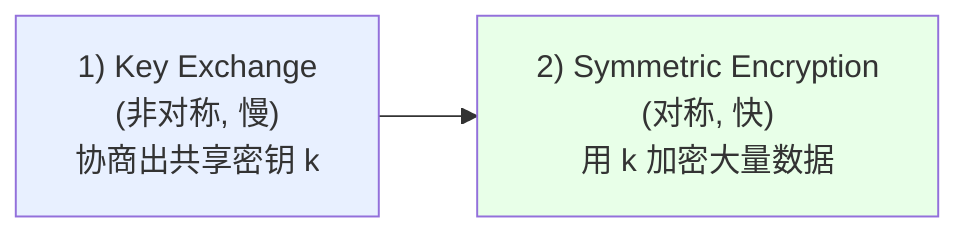

这条原则也解释了为什么本章要逐个讲六种原语:它们不是互相替代的竞品,而是各司其职的工具,真实系统按需把它们拼起来用。

---

## 10. 绕过密码学:安全的"环境假设"与现实攻击

前面所有"安全"都建立在数学证明上。但讲义 [S28] 抛出一个清醒的问题:**这种"安全"到底是在什么前提下成立的?**

> 密码学提供的安全,意思是:**在一个良定义的、特定的环境(well-defined and specific environment)里,没有任何对手能攻破该方案。** 而这个环境里,通常**假设对手不知道密钥**。
>
> 在现实世界里,**不可能有"普适环境(universal environment)"下的安全**。比如:**一旦密钥被对手知道,所有密码方案都不安全。**

这是本章最重要的认识论转折:**密码学的"安全"是有条件的安全。** 数学证明的是"在这些假设下安全";一旦现实打破了假设(最典型的就是"对手拿到了密钥"),再漂亮的证明也救不了你。于是对手的策略往往不是去硬刚数学,而是去**绕过**这些假设。讲义 [S29] 把绕过手段分成两大类:

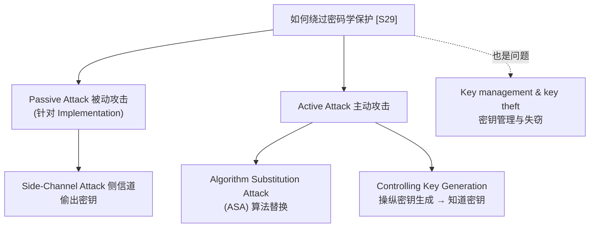

讲师先界定了被动 vs 主动的本质区别:
- **Passive attack(被动攻击)**:"**you don't do anything, you just observe**"——你不干预通信,只是**旁观/窃听**。例:截获并监听双方的通信。侧信道就属于被动。
- **Active attack(主动攻击)**:你**主动介入/干预**通信。例:中间人攻击(§8.1)——跳进双方中间,拦截、修改、转发消息。

### 10.1 Side-Channel Attack:从"实现"里偷密钥

**Side-channel attack**(*侧信道攻击*)是被动攻击的代表。讲义 [S30] 定义:它是任何**基于"从计算机系统的实现中获得的信息"**而发起的攻击。注意关键词——它不攻击算法本身(算法可能数学上完美),而攻击**算法运行时泄露的物理信息**。讲师点破了这个反差:"**while cryptography assumes that algorithms can be safely implemented**"——密码学证明安全时,假设了"实现是安全的、不泄露信息";侧信道恰恰打破这个假设。

能从哪些"侧信道"偷出密钥?讲义 [S30] 列了四种:
- **Timing information(时序)**:计算耗时(不同密钥位导致不同的计算时间);
- **Power consumption(功耗)**:运算时的耗电高低;
- **Electromagnetic leaks(电磁泄漏)**;
- **Sound(声音 / 声学)**。

讲义 [S31–S32] 用 **RSA 解密**给了一个具体到能"读出密钥比特"的例子,这也把 §6 的 RSA 接了回来:

> **🔑 例(RSA 功耗分析 — 来自 [S31–S32] + 讲师口述)** — RSA 解密是一次**指数运算(exponentiation)**:$\text{Dec}(C,d) = C^d \bmod N$,其中私钥 $d$ 是一串 **n-bit string**。直接算 $C^d$(连乘 $d$ 次)太慢,实现上用 **square-and-multiply**(*平方-乘*,即"left-to-right binary method")来加速:
> - 算法**逐位扫描** $d$ 的二进制;
> - 遇到 **bit = 0**:只做一次**平方(square)**;
> - 遇到 **bit = 1**:做一次平方**再加一次乘法(multiply)**。
>
> 问题在于:**"多做一次乘法"会多耗一点电。** 攻击者用功耗探针观察解密时的功率曲线——讲义 [S32] 的图里,**较窄的峰**是"无乘法"的步骤(对应 bit 0),**较宽的峰**是"有乘法"的步骤(对应 bit 1)。于是攻击者一位一位地"读"出整个私钥 $d$!**算法数学上没破,密钥却从功耗波形里漏了出来。**
>
> 讲师补充:著名密码学家 **Adi Shamir**(RSA 里的"S")等人甚至演示过**acoustic attack(声学攻击)**——通过 CPU 运算发出的高频声音来推断密钥。(讲师推荐去 YouTube 看演示。)

> ⚠️ **易错点** — 侧信道攻击的前提是**攻击者了解算法的实现细节**(比如知道用了 square-and-multiply)。讲师强调:密码学算法通常是**公开的**(Kerckhoffs 原则:"everyone knows how the algorithm works, they just don't know the key"),所以一旦实现有泄漏,公开的算法反而帮了攻击者——他知道每个功耗峰对应什么操作。

### 10.2 Algorithm Substitution Attack (ASA):被"掉包"的算法

**ASA**(*算法替换攻击*)是主动攻击的代表。讲义 [S34] 定义:ASA 让一个对手(常被称为 **"big brother"** 老大哥)**把合法密码方案/协议的某些部分,替换成一个被篡改过的版本**。它的目的是:"**let computation results subliminally leak the crucial information about a secret key or a confidential message to the adversary**"——让计算结果**潜隐地(subliminally)泄露**密钥或机密消息给对手。讲义明确指出,这"**与我们学过的 mass surveillance(大规模监控)相关**"——"big brother"正是监控者把后门塞进密码实现里。

### 10.3 Controlling Key Generation:把 128 位密钥偷偷削成 10 位

ASA 的一个具体且极具教学价值的形式,是**操纵密钥生成(controlling key generation)**。讲义 [S35] 提醒:任何密钥(对称的 $k$、或非对称的 $sk$)的生成,**第一步都是生成一个随机的 n-bit string $S$**,再把它当作密钥。但讲义 [S35] 点出软肋:"**it is hard to know whether the string $S$ is indeed randomly chosen**"——你很难判断这串"随机数"是不是真随机,因为你**看不到随机算法是否被做了手脚**(unless you can check the code)。

讲义 [S36] 还提醒了一个反直觉的点:**`0000…0` 或 `1111…1` 这种"特殊"串,也完全可能由一个好的随机数生成器产出**——所以"看起来不随机"不代表生成器坏了,反之"看起来随机"也不代表它真随机。判断 RNG 好坏只能看代码/原理,不能看输出长相。

然后讲义 [S37–S38] 给了一个堪称"教科书级反面教材"的不安全密钥生成函数,讲师说 workshop 会拿它做实验:

> **🔑 例(不安全的 KeyGen — 来自 [S37–S38] + 讲师口述)** — 设 `RandStr(n)` 输出一个真随机的 n 位串。某人想生成密钥,写了这样的函数:
>
> ```python
> def KeyGen(n):
>     A = RandStr(10)      # 只取 10 位随机!
>     B = H(A)             # H 是输出 n 位的哈希
>     return H(A)          # 把哈希值当作密钥
> ```
>
> 表面上,返回的密钥 $H(A)$ 可能有 128 位、看起来很长很随机。**问题出在哪?**
>
> 关键在于:**真正的随机性(熵)只来自 `RandStr(10)`,只有 10 位。** 哈希是**确定性**函数($H$ 无密钥、谁都能算,见 §7.1),它**不会凭空增加熵**——同样的 $A$ 永远哈希出同样的密钥。所以对手不需要猜那 128 位的输出,只需要猜那 10 位的种子 $A$:
> $$\text{候选数} = 2^{10} = 1024$$
> 只需生成 1024 个可能的 $A$,逐个哈希、逐个试——这就是 §3 的 **brute-force**,而 1024 次试验**瞬间**就跑完了。讲师一针见血:"**even though the output is 128-bit, inside it's only 10-bit, then you can guess.**"
>
> **修正**:让随机种子本身就有足够熵——讲师说,要安全就得 `RandStr(128)`,"**at least 128-bit is still secure.**" 这恰好把 §3 的"128 位才安全"和此处接了起来。

> ⚠️ **易错点** — 密钥的强度**不取决于它"有多长/看起来多随机",而取决于它背后真正的熵(entropy)有多少**。把 10 位种子哈希成 128 位,输出再长也只有 10 位的安全性。这就是 ASA / 操纵密钥生成的精髓:对手(或后门)不必攻破算法,只要**悄悄削减熵的来源**,就能让"看似 128 位"的密钥变得可暴力破解——而你从输出根本看不出来。

把 §10 收一下:**密码学的安全是"特定环境 + 对手不知密钥"这一假设下的安全;现实攻击不去硬刚数学,而是绕过假设——被动地从实现的物理泄漏(timing/power/EM/sound)里偷密钥(side-channel),或主动地把算法掉包(ASA)、操纵密钥生成削减熵。** 这也回扣了 Week 1 的核心:安全不止是 Mechanism(这里是密码算法),还要看它的实现、密钥管理这些 Assurance 和 Incentive 层面的东西。

---

## 本章小结 (Key takeaways)

把下面这几条记牢,本章的"骨架"就立住了——考前只读这一节也能回忆起整章脉络:

1. **Cryptography ≠ Encryption + Decryption**。它是一族原语,分水岭在 **1976 年(Diffie–Hellman)**:之前只有对称加密(须先共享密钥),之后才有公钥加密、密钥交换、数字签名。[S2-S3]
2. **Taxonomy(必背)**:**Keyless** = hash;**Key-based** 分 **Symmetric**(SKE、MAC)与 **Asymmetric**(key exchange、PKE、digital signature)。判据:用之前要不要先共享秘密——要则对称,不要则非对称。对称快、非对称慢。[S4-S5, S27]
3. **密钥 = n-bit string**,猜中概率 $1/2^n$,暴力破解时间 $T = 2^n / C$。**60 位**超算 58 秒可破;**128 位** $\approx10^{15}$ 年(very safe);**256 位**物理上不可破。口令也是密钥,熵 $\log_2(70^8)\approx49$ 位远小于 128。指数永远碾压线性算力增长。[S6-S8]
4. **对称加密**:$C=\text{Enc}(k,M)$,同一把 $k$ 解密;**stream cipher** 逐位 XOR 密钥流(on-the-fly),**block cipher** 按块加密(代表 **AES**)。[S9]
5. **机密性(confidentiality/secrecy)** 的标准很强:对手有密文却**拿不到关于明文的任何有用信息**;好密文应像随机噪声(企鹅图反例:坏加密残留结构)。[S10-S12]
6. **公钥加密(PKE)** 用一对密钥解决"陌生人无法第一次共享密钥"的死结:用**接收方公钥**加密、**接收方私钥**解密。**RSA**:$pk=(N,e)$、$N=pq$、$sk=d$ 满足 $ed\equiv1\pmod{(p-1)(q-1)}$、$C=M^e\bmod N$;安全性来自**大数分解(factorization)难题**,故 $p,q$ 取 1024/2048 位。[S13-S15]
7. **量子威胁**:**Shor 算法(1994)** 能多项式时间分解大数 → 原则上破 RSA;目前缺足够大的量子硬件(需百万 qubit)。应对是 **post-quantum cryptography**(NIST 2016 征集、2022 出标准)。
8. **完整性 vs 认证**:integrity 只问"内容变没变",authentication 还问"是不是 TA 发的"。三件套层层加码:**hash**(无密钥,只给完整性,谁都能算)→ **MAC**(对称密钥,给完整性+认证,但双方都能造 tag)→ **digital signature**(非对称,签名用私钥/验证用公钥,额外给 **non-repudiation 不可否认**)。**MD5、SHA-1 已被攻破**(不抗碰撞)。[S16-S22]
9. **MAC vs Signature** 的唯一分水岭是 **non-repudiation**:MAC 对称(双方都能造 tag,无法证明谁发的),签名非对称(只有签名者有私钥,赖不掉)。
10. **PKI**:公钥(一串字节)必须把**身份↔公钥**绑定并验证,否则有 **man-in-the-middle attack**。**CA** 用自己的私钥签 $s=\text{Sign}(sk_{CA}, ID\|pk)$,任何人用 $pk_{CA}$ 验证即可信任该公钥;打包成 **digital certificate**(含 ID、公钥、CA 签名、序列号、有效期等)。[S23-S26]
11. **组合使用**:每种密码学只干一件事;最经典组合 = 先 **key exchange** 协商共享密钥,再用又快的 **symmetric encryption** 传数据(非对称慢,只用来换密钥)。[S27]
12. **密码学的安全是"特定环境 + 对手不知密钥"下的有条件安全**。现实绕过手段:**passive** 的 **side-channel attack**(timing/power/EM/sound;RSA square-and-multiply 的功耗分析能逐位读出私钥,Shamir 的声学攻击)、**active** 的 **ASA**(算法掉包,关联 mass surveillance)与**操纵密钥生成**(把 10 位种子哈希成"128 位"密钥,真实熵只有 10 位 → 2^10 次暴力即破)。[S28-S38]

---

## 自测 Quiz(作者自编练习,非 slides 原题)

> 本章 slides 没有像 Week 1 那样嵌入 quiz 原题,故以下 8 题由本讲义**作者自编**,覆盖最高频考点。请先自己作答再看解析。考试以 slides 的定义为准。(讲师提到本周 quiz 为闭卷、8 题、35 分钟、含 Week 1+2 内容、单选+填空——故下面也按"概念辨析"风格出题。)

**Q1(密钥长度)** 一把 60 位密钥用普通家用机(3 GHz)暴力破解约需 12 年,看起来够安全。这个判断错在哪?用什么长度才真正安全?
→ **答案**:错在"只假设对手用家用机"。换成超算($C=2\times10^{16}$ cc/s),同一把 60 位密钥 **58 秒**就被破。因为 $T=2^n/C$ 里 $C$ 可以很大,而 $n$ 必须足够大才能让 $2^n$ 压倒任何 $C$。**128 位**($\approx10^{15}$ 年)才 very safe,**256 位**物理上不可破。[S7-S8]

**Q2(对称 vs 非对称)** 判断一套密码方案是对称还是非对称,最干脆的一个问题是什么?各举一个原语。
→ **答案**:问"**双方在使用前是否必须先共享同一把秘密密钥?**"——必须则**对称**(如 symmetric key encryption、MAC),不必须则**非对称**(如 public key encryption、digital signature、key exchange)。对称快,非对称慢。[S5, S27]

**Q3(RSA 与分解)** RSA 的公钥是 $(N,e)$ 且 $N=pq$。为什么对手知道 $N$ 和 $e$ 却算不出私钥 $d$?如果 $p,q$ 取得很小会怎样?
→ **答案**:要算 $d$ 必须先知道 $(p-1)(q-1)$,而这需要 $N$ 的素因子 $p,q$;从 $N$ 反推 $p,q$ 就是 **prime factorisation problem(大数分解)**,在 $p,q$ 足够大(1024/2048 位)时无高效算法。若 $p,q$ 太小,$N$ 一下就被分解,RSA 立刻被破。[S15]

**Q4(哈希性质)** Cryptographic hash function 必须满足哪两条性质?为什么"哈希能检测篡改,却不能告诉你是谁发的"?
→ **答案**:**preimage resistant(抗原像/单向)** 和 **collision resistant(抗碰撞)**。哈希**无密钥、人人可算**,所以对手改完消息后自己重算哈希附上即可——它只保证 integrity,不保证 authentication。MD5/SHA-1 已不抗碰撞(broken)。[S17-S18]

**Q5(MAC vs Signature)** MAC 和数字签名都提供完整性 + 认证。哪个还提供 non-repudiation?为什么另一个不行?
→ **答案**:**数字签名**提供 non-repudiation。因为签名只能由持私钥的签名者一人生成(非对称),验证通过即铁证指向 TA,赖不掉。**MAC 不行**:它是对称的,Alice 和 Bob 共享同一把密钥、**双方都能造 tag**,无法向第三方证明究竟是谁发的。[S19-S22]

**Q6(PKI / MITM)** 为什么仅有"Alice 的公钥"还不够安全?CA 是怎么用一个签名解决这个问题的?
→ **答案**:因为公钥只是一串字节,若不验证"身份↔公钥"的绑定,攻击者可用自己的公钥冒充 Alice 的 → **man-in-the-middle attack**。CA 用自己的私钥签 $s=\text{Sign}(sk_{CA}, ID_{Bob}\|pk_{Bob})$;任何持有 $pk_{CA}$ 的人验证此签名,有效即可信任 Bob 的公钥。信任被归约到"信任一个 CA 公钥"。[S24-S25]

**Q7(侧信道)** RSA 解密用 square-and-multiply 做指数运算。攻击者如何仅靠"功耗"就读出私钥 $d$?这属于被动还是主动攻击?
→ **答案**:square-and-multiply 逐位扫描 $d$:bit=0 只平方,bit=1 平方**再乘**。"多一次乘法"多耗电,功耗曲线上窄峰=0、宽峰=1,于是逐位读出 $d$。这是 **side-channel attack**,属于 **passive(被动)** 攻击——攻击的是实现的物理泄漏,不是算法本身。[S30-S32]

**Q8(坏 RNG / 熵)** 一个 KeyGen 先取 `RandStr(10)` 得到 $A$,再返回 128 位的 $H(A)$ 当密钥。输出明明是 128 位,为什么不安全?
→ **答案**:因为真正的熵只来自那 10 位种子,哈希是确定性的、**不增加熵**。对手只需暴力穷举 $2^{10}=1024$ 个可能的 $A$、逐个哈希即可恢复密钥——瞬间完成。**密钥强度取决于真实熵,而非输出长度**;要安全应让种子本身就有 ≥128 位熵(`RandStr(128)`)。这是 ASA/操纵密钥生成的典型。[S35-S38]

---

> *说明:本讲义基于 **`WG CSIT970 W3 AUT 2025.pdf`**("Cryptographic Issues" 课件,slide 1–38)与 **`CSIT970_Week2-transcript.txt`**(实际为学生的 **Week 2** 课堂录音——课件文件名比录音排期超前一周,故本指南按官方课件周次命名为 "W3")综合编写。转录稿为低质量 ASR(自动语音识别),诸多技术术语被听写错(如 "photography→cryptography"、"ISA→RSA"、"Lithen Helmand→Diffie–Hellman"、"Peter Shaw→Peter Shor"、"NICS→NIST"、"Samir→Adi Shamir"、"swear and multiplication→square-and-multiply" 等),已逐一对照 slides 校正,只保留语义清晰、与 slides 一致的口述内容,绝不照搬乱码段落。本周**没有专门的密码学 workshop 文件**,讲师提到的 workshop 实验(计算口令 entropy、暴力破解口令、不安全的 `KeyGen`/`RandStr` 例子)均按"来自讲师课堂口述的 worked example"呈现,未杜撰独立 workshop 章节。凡标 `📎 拓展` 处为超出 slides 的补充(古典密码、XOR 还原性质、口令真实熵低于理想值等),帮助建立直觉,**考试以 slides 的定义为准**。*
