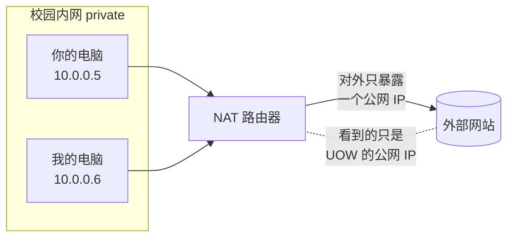
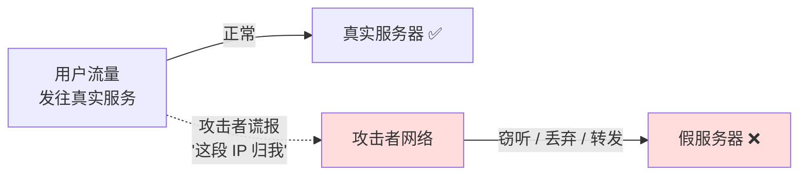
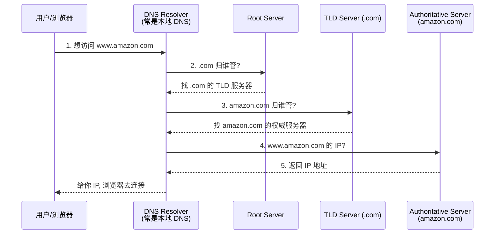
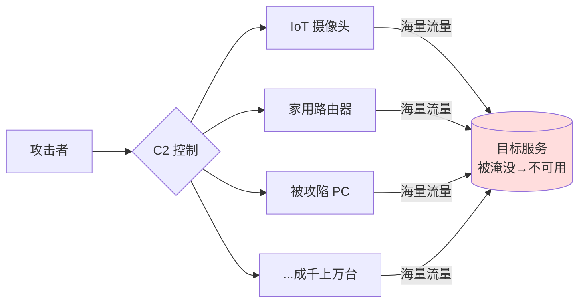
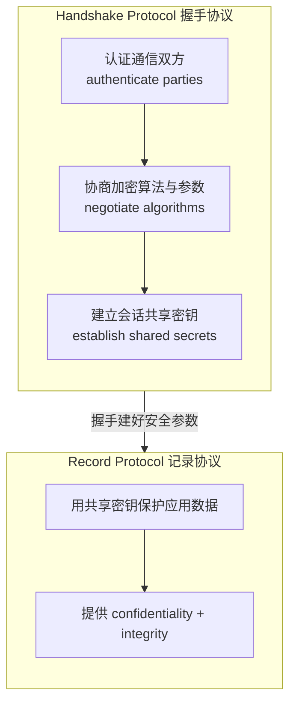
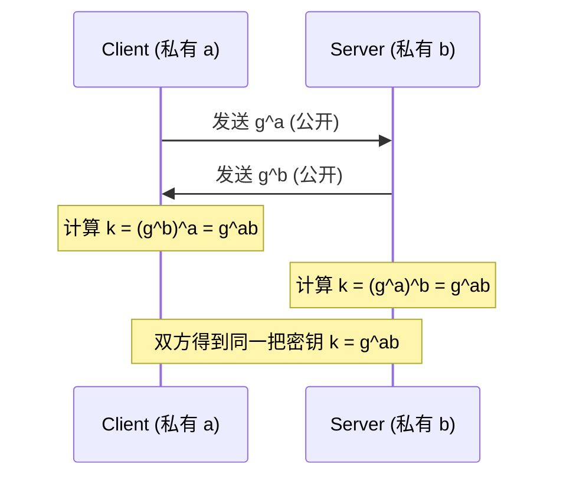
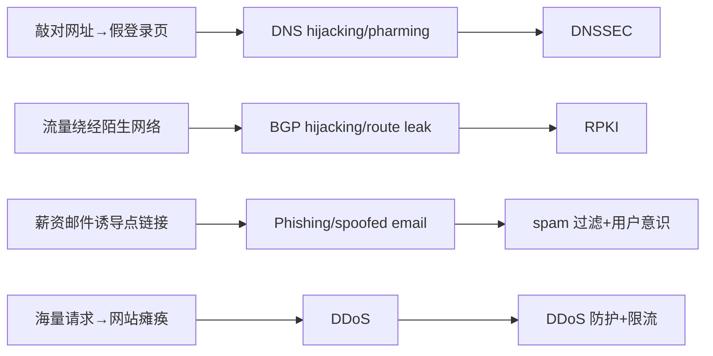

# Week 4 · 网络攻击与防御 (Network Attack and Defence)

> **学习目标 (Learning objectives)** — 读完本章你应该能够：
> - 说清几个基础网络协议 **IP / ARP / DHCP / NAT** 各自干什么，并理解一个贯穿全章的事实：**这些协议负责"连通"，但本身不负责"安全"**——既不保密、不保完整、也不做认证；
> - 解释互联网的宏观结构是 **Autonomous System (AS)**(*自治系统*)互联的"网络的网络"，**Border Gateway Protocol (BGP)**(*边界网关协议*)如何在 AS 之间交换路由，以及 **BGP hijacking**(*BGP 劫持*)为什么可能、会造成什么后果、**RPKI** 如何缓解；
> - 复述 **DNS**(*域名系统*)把域名解析成 IP 的完整流程，辨析 **DNS hijacking / pharming**(*DNS 劫持 / 域名欺骗*)的多种形式，并解释 **DNSSEC** 与 **DoH**(*DNS-over-HTTPS*)各自解决什么、又带来什么新问题；
> - 解释 **DDoS**(*分布式拒绝服务*)攻击的原理、为什么 IoT 设备 + botnet 让它如此有效，以及攻击者的多种动机；
> - 说清 **email / SMTP** 的两大老问题（无默认加密、垃圾邮件），并区分 **DKIM** 与机器学习过滤两种反垃圾手段；
> - 描述四类关键防御——**packet filtering / firewall**(*包过滤 / 防火墙*)、**VPN (IPsec)**、**TLS**——各自工作在哪一层、保护 **CIA**(*机密性 / 完整性 / 可用性*)三性中的哪几性，并能讲清 TLS 的 **handshake + record** 两段式结构与 **Diffie–Hellman** 密钥交换；
> - 用 **CIA 三性**这把统一标尺，比较本章每种攻击"打掉的是哪一性"，并套用 workshop 的「攻击 / 受损性质 / 即时响应 / 长期防御」框架分析真实事件。

上一周我们把**密码学 (cryptography)** 这套"原语工具箱"补齐了：对称/公钥加密、hash、MAC、数字签名、PKI。但密码学是悬在半空的——它保护的是"数据"，而数据要在一张由无数协议拼起来的网络上**真正传输**。这一周我们就落到地面，看看这张网是怎么搭起来的、攻击者在每一层能做什么、我们又拿什么去防。你会发现，上周学的每一个密码学原语，这一周都会以"防御工具"的身份重新登场：RPKI 和 DNSSEC 用的是**数字签名**，DKIM 用的是**签名 + DNS 公钥**，TLS 用的是**密钥交换 + 对称加密**。所以这一章既是网络安全的入门，也是密码学的一次大型应用实战。

讲师把全章的脉络写在了第一张幻灯片上 [S2]：

> **protocols → attacks → defences → secure communication**
> （协议 → 攻击 → 防御 → 安全通信）

这就是我们的行进路线。而衡量"攻击有多严重、防御有多到位"的尺子，是 [S2] 学习目标里点名的 **CIA 三性**——**Confidentiality**(*机密性*，别人读不到)、**Integrity**(*完整性*，别人改不了/能被发现)、**Availability**(*可用性*，服务还在、用得上)。每讲一种攻击，你都应该下意识地问一句："它破坏的是 C、I 还是 A？" 全章读完，这个问题会变成你的本能。

先看一张全章概念地图，建立全局感，读完回头再看会清晰很多：

```mermaid
mindmap
  root((Week 4<br/>网络攻防))
    协议基础
      IP: 只送达, 不加密/不认证
      ARP: 无认证 → 欺骗
      DHCP: 自动分配 IP
      NAT: 多设备共享一个公网 IP
    路由层
      Internet = AS 互联
      BGP: AS 间交换路由
      攻击: BGP hijacking
      防御: RPKI / ROA
    名字解析层
      DNS: 域名 → IP
      攻击: DNS hijacking / pharming
      防御: DNSSEC(签名) / DoH(加密)
    可用性攻击
      DDoS: 流量淹没
      botnet / IoT / Mirai
    邮件
      SMTP: 默认不加密+垃圾邮件
      防御: DKIM(签名) / ML 过滤
    防御机制
      Firewall / Packet filtering
      VPN / IPsec / IKE
      TLS: handshake + record / DH
    统一标尺
      CIA 三性
      事件响应框架
```

---

## 1. 网络协议基础：能"送到"，但不"保平安" [S3–S6]

要谈网络攻击，得先认识这张网上跑的几个最基础的协议。讲师反复强调的一个主题贯穿这一节：**这些协议被设计出来的年代，目标是"让数据通"，而不是"让数据安全"。** 安全是后来才往上打的补丁。记住这一点，后面所有攻击你都能"猜"个八九不离十——攻击者干的事，几乎都是钻这个"先天不设防"的空子。

### 1.1 IP：互联网的"邮政系统"

**Internet Protocol (IP)**(*互联网协议*)是把数据从一台机器搬到另一台机器的基础协议。它是 **stateless**(*无状态的*)——每个数据包独立寄送，协议本身不记得"上一个包"是谁。讲师打了个很贴切的比方：IP 把数据切成一个个 **packet**(*数据包*)，像一封封信，每封信自己带着地址独立投递。

每台联网设备（讲师称之为 **host**，主机）至少有一个 **IP address**(*IP 地址*)，在全网唯一标识它。地址有两个版本：

- **IPv4**：用 **32-bit**(*32 位*)地址，通常写成四段 0–255 的十进制数，如 `172.16.8.93`。32 位意味着最多 $2^{32}\approx 40$ 亿个地址。听起来很多，但全球人口已经 70–80 亿，加上每人多台设备，**IPv4 地址正在耗尽**。
- **IPv6**：用 **128-bit**(*128 位*)地址，地址空间天文数字级别，足够用。采用率正在快速上升——讲义引用 Google 的统计，2026 年 2 月约 **46.82%** 的流量已经走 IPv6 [S3]。

但本节最关键的一句话是：**IP 只提供"送达 (delivery)"，不提供 confidentiality、integrity 或 authentication。** 讲师在录音里把这句话掰开讲透了，值得逐条记下，因为后面好几种攻击的根源都在这里：

- **不保密**：IP 包基本是**明文 (plain text)** 传输，任何在传输路径上的人都能读到数据载荷 (payload) → 容易被**窃听 (eavesdropping)**。
- **不保完整**：包可以被篡改 (tampered)、被改写。
- **不认证**：IP 不核实发送方身份，所以**源地址可以被伪造**，这就是 **IP spoofing**(*IP 欺骗*)——攻击者借此冒充别人。

> 📎 **拓展（超出 slides）** — 这里其实暗含一个"分层 (layering)"的思想：网络协议像盖楼，IP 是地基的"投递层"，它只管把包送到地址。"保密/完整/认证"这些安全属性，是在更上层（如 TLS）或并行（如 IPsec）另外加的。理解了"IP 天生不安全、安全靠上层补"，你就能解释为什么本章后半段全是各种"加固层"。

### 1.2 ARP：把 IP 地址翻译成"硬件地址"

数据包最终要送到一块具体的网卡上。每块网卡有一个固定的物理地址，叫 **MAC address**(*MAC 地址，即 ethernet address*)。**Address Resolution Protocol (ARP)**(*地址解析协议*)的工作就是在**局域网 (LAN)** 内，把 IPv4 地址映射到对应的 MAC 地址——好比"知道某人的门牌号(IP)，问一句'这门牌对应哪台具体的设备(MAC)'"。

机制很朴素：主机在局域网里**广播**一个 ARP 请求"谁是 IP X？"，拥有该 IP 的设备**回应**自己的 MAC，请求方就把这个对应关系记下来。问题在于——**ARP 没有任何内置认证**。任何在同一局域网里的设备都能伪造应答。于是攻击者可以做 **ARP spoofing / ARP cache poisoning**(*ARP 欺骗 / ARP 缓存投毒*)：谎称"IP X 对应的是我的 MAC"，从而把本该发给别人的流量骗到自己这里（典型的局域网中间人攻击前奏）。

注意又是同一个模式：**协议假设大家都诚实，没人验证身份 → 攻击者撒个谎就能得手。**

### 1.3 DHCP 与 NAT：自动分地址、共享一个公网门面

- **Dynamic Host Configuration Protocol (DHCP)**(*动态主机配置协议*)：设备一接入网络，DHCP 就**自动**给它分配一个 IP 地址以及其他网络设置（如默认网关、DNS 服务器），并确保每台设备拿到的地址在本网内**有效且唯一**。简单说：你的手机连上 WiFi 就能上网，背后是 DHCP 在自动派发地址。

- **Network Address Translation (NAT)**(*网络地址转换*)：让一个私有网络里的**多台**设备**共享一个**对外的公网 IP 地址，靠不同的端口号来区分谁是谁。家庭网络、企业网络、移动网络、很多 ISP 都在用。

讲师用 UOW 的例子把 NAT 讲活了 [S6]：你和我在校园网里各有各的内网 IP，但当我们访问校外网站时，请求会先经过 NAT，转换成"University of Wollongong 的那个公网 IP"再出去。校外服务器看到的只是"有个来自 UOW 的请求"，**根本不知道是你还是我发的**。



NAT 带来一点"副作用式"的隐私好处：外部看不到内网具体是哪台设备，攻击者也较难直接定位内网某台机器。但讲师特别强调——**NAT 本身不是一种安全控制 (not a security control by itself)**。它的主要作用是"改地址"，安全只是顺带的、不可靠的副产品。它真正的安全相关影响是：**让事后追责 (attribution) 变难**——出了事，日志里往往只有那个共享的公网 IP，看不出到底是内网哪台机器干的。

> **🔑 小结这一节** — IP/ARP/DHCP/NAT 四个协议，一个共同点：**为连通而生，安全靠后补**。IP 不加密不认证、ARP 无认证可被欺骗、NAT 不是安全机制。把这条主线记牢，下面每一种攻击都是它的注脚。

---

## 2. 路由层安全：BGP 与 BGP 劫持 [S7–S11]

我们刚说"IP 把包送到地址"，但全球这么多网络，包到底**沿哪条路**走？这就引出互联网的宏观结构和它的"导航系统"BGP——以及当导航系统被人误导或欺骗时会发生什么。

### 2.1 互联网是"网络的网络"：Autonomous System

讲师纠正了一个常见的天真想法：互联网**不是**一张单一的大网，而是 **a network of networks**(*网络的网络*)。它的基本单元叫 **Autonomous System (AS)**(*自治系统*)——可以是一个 ISP、一家电信公司、或一个大型组织。每个 AS：

- 控制一段 IP 地址（比如某个 500–600 个地址的地址块）；
- **自己管理自己的路由策略 (routing policies)**。

这件事之所以对安全重要，是因为：**跨越整个互联网的通信，依赖众多 AS 之间的相互合作，而不是某个中央权威说了算。** 没有中央权威，就意味着"信任"是分布式的、靠协议约定的——而这正是后面 BGP 劫持的温床。

### 2.2 BGP：AS 之间的"导航协议"

**Border Gateway Protocol (BGP)**(*边界网关协议*)是 AS 之间交换路由信息的主力协议。它做三件事：

1. 告诉各 AS：**哪些路由可用**，能到达哪些 IP 地址块；
2. 帮路由器维护 **routing table**(*路由表*)；
3. 为转发流量**选择合适的路径**。

讲师的比方很好记：BGP 就像导航——"你发一个包，它一路告诉你下一步往哪走，左转右转，直到送到目标 IP" [S8]。

但 BGP 有个不同于普通技术协议的关键特点：**它的路由决策不只看技术效率，还要考虑商业关系。** 不同 AS 属于不同组织（甚至是互相竞争的公司），它们之间常有"我帮你转发流量、你付钱"这类**商业协议 (commercial arrangements)**。所以现实中的路由选择是技术 + 商业双重因素的产物。

最关键的一点（也是漏洞的根源）：教学视频里点明了——**BGP 要工作，AS 运营者必须互相信任 (trust each other)**，它们配置 **pairing agreements**(*对等协议*)来建立直连、允许 BGP 流量通过。BGP 在历史上就是**建立在"大家都诚实"的信任之上**设计的，缺乏对路由通告真伪的强校验。

### 2.3 BGP hijacking：谎报"这段地址归我管"

既然 BGP 靠信任、缺校验，攻击就顺理成章了。**BGP hijacking**(*BGP 劫持*)指：某个网络**谎称自己拥有或能到达某段 IP 前缀 (IP prefix)**，而它其实并不拥有或控制这段地址。一旦这个虚假的路由通告被邻居接受，就可能像谣言一样**扩散**到全网，导致本该流向真正目的地的流量被引到错误的路径上。

后果可以很严重 [S9]：

- **钓鱼**：把用户重定向到假网站，做 phishing 或社会工程；
- **拒绝服务**：通过"流量黑洞 (blackholing)"或错误引导，让目标服务不可达；
- **窃听/监控**：把流量绕经攻击者控制的路径，从而拦截或监视通信。



> **🔑 例 — 真实事件 [S10] + 录音视频** — 这些事件常出现在考题里，记住"年份 + 谁 + 干了啥"：
> - **2004 TTNet（土耳其）**：意外通告了**错误的** BGP 路由，造成大规模互联网中断——说明**配置失误**也能闯大祸。
> - **2008 Pakistan / YouTube**：巴基斯坦某 ISP 想在本地**封锁** YouTube，结果错误路由**泄漏到全球**，让很多国家都打不开 YouTube。
> - **2018 Amazon Route 53**：攻击者劫持路由、重定向 Amazon DNS 服务的流量，**盗取加密货币**。
> - **2019 Verizon route leak**：宾州一个小网络意外成了 Verizon 网络的"首选路径"，造成大范围中断。
> - （视频补充）**2010**：约 18 分钟内大量美国军事数据流量经过中国，至今不确定是失误还是蓄意。
>
> 一句话总结：**BGP 事故既可能是恶意攻击，也可能是配置错误，两者都能造成全球性影响。**

### 2.4 防御：RPKI 与 Route Origin Authorization

怎么防 BGP 劫持？核心思路是：**给"谁有权通告哪段地址"这件事加上可验证的凭证。** 这就是 **Resource Public Key Infrastructure (RPKI)**(*资源公钥基础设施*)。

- 它用**数字签名 (digital signatures)** + **Route Origin Authorizations (ROAs)**(*路由起源授权*)，来声明并验证"哪个网络运营者**被授权**通告某段特定 IP 前缀"。
- 当一个 AS 收到路由通告，可以核对它是否有合法的 ROA → 拦截掉那些"没有授权却谎报"的通告。

注意又是上周密码学的应用：**RPKI = 数字签名用于"授权认证"**。但讲师诚实地指出它**不是完整解决方案**：RPKI 的部署和验证在全网仍未普及，覆盖不全的地方依然有风险。

> **CIA 视角** — BGP 劫持主要打击 **Availability**(*可用性*，流量被丢弃/黑洞 → 服务不可达)，也可能危及 **Confidentiality / Integrity**(*若流量被绕去窃听或篡改*)。RPKI 通过**认证路由来源**来恢复对路由"完整性/真实性"的信任。

---

## 3. 名字解析层：DNS 及其攻防 [S16–S21]

BGP 决定包"走哪条路"，但你在浏览器里敲的是 `uow.edu.au`，不是一串数字。把"人能记住的名字"翻译成"机器能用的 IP"——这是 **DNS** 的活儿，也是攻击者最爱下手的一层。

### 3.1 DNS 是互联网的"电话簿"

**Domain Name System (DNS)**(*域名系统*)把人类可读的域名（如 `uow.edu.au`）解析成数字 IP 地址。教学视频的比方一针见血：**DNS 像电话簿**——你记得住人名（域名），记不住电话号码（IP），DNS 帮你查。

一次典型解析分好几步（这是个**层级 (hierarchical)** 系统）[S16]：



为了加速，DNS 服务器会**缓存 (cache)** 解析结果，下次同样的查询就能直接答、更快——记住"缓存"这个词，它待会儿会变成一个攻击面（cache poisoning）。

### 3.2 DNS 的脆弱性与劫持

DNS 既关键又分布广，自然是靶子 [S17]：

- 整个体系是层级化的（root → TLD → ISP/本地 resolver），又大量依赖缓存；
- 它会成为 **DDoS** 的攻击目标——著名例子是 **2016 年 Mirai botnet 攻击 Dyn**（一家 DNS 服务商），导致多个主流在线服务瘫痪；
- 现代 DNS 更分布、更有韧性，但仍是重要目标。

**DNS hijacking**(*DNS 劫持*)：操纵 DNS 查询或响应，把用户**送到错误的目的地** [S18]。它可以发生在解析链路的不同环节。视频很好地归纳了几种形式：

| 劫持类型 | 攻击者怎么做 | 影响范围 |
|---|---|---|
| **Local DNS hijacking** | 用木马 (trojan) 改掉**用户电脑**上的 DNS 服务器设置 | 单台机器 |
| **Router DNS hijacking** | 利用路由器固件漏洞，改**路由器**的 DNS 设置 | 该路由器下**所有**用户 |
| **Man-in-the-middle** | 拦截设备与 DNS 服务器之间的通信，**篡改应答** | 被拦截的会话 |
| **Hijacking DNS server** | 攻破安全薄弱的 DNS 服务器，直接改其中的 IP 记录 | 用该服务器的所有人 |

还有一个相关概念 **Pharming**(*域名欺骗*)：通过**操纵 DNS 响应**把用户重定向到假冒/恶意网站。其变种 **drive-by pharming**：诱骗用户访问一个恶意页面，该页面悄悄**改掉家用路由器的 DNS 设置**，于是用户之后访问正规网站时都被引向钓鱼站。

> 📎 **拓展（超出 slides）** — 视频还区分了 **DNS spoofing / cache poisoning**(*DNS 欺骗 / 缓存投毒*)：攻击者**不改用户端设置**，而是污染 DNS **缓存**——往缓存里塞一条假的"域名→IP"。因为缓存是为了加速而"先信先用"，被投毒后，所有读这条缓存的用户都被导向恶意站。这正好印证 §3.1 埋的伏笔：**缓存是性能优化，也是攻击面。**

### 3.3 防御一：DNSSEC——给 DNS 记录盖"数字签名"

劫持的本质是"用户无法分辨 DNS 应答是真是假"。解决思路自然是：**给 DNS 记录加上可验证的真实性证明**。这就是 **DNSSEC (DNS Security Extensions)**(*DNS 安全扩展*)：

- 给 DNS 记录**附加数字签名 (digital signatures)**；
- resolver 验证签名 → 确认记录**确实来自权威服务器**、且**传输中未被篡改**；
- 因此它提升 DNS 响应的 **integrity（完整性）+ authenticity（真实性）**。

又一次，密码学原语（数字签名）来当防御工具。但讲师强调它**部署不均、未普及**，覆盖不到的地方仍不受保护。学生问"为什么不普遍部署"，讲师的回答是：它只解决完整性/真实性，是否值得部署取决于具体场景，所以推广不彻底。

DNSSEC 还引入了两个**新问题** [S20]，这点考试爱考"DNSSEC 不是万能的"：

1. **Zone enumeration（区域枚举，又称"walking the zone"）**：DNSSEC 的某些机制反而让攻击者更容易**枚举出子域名**等信息。缓解技术叫 **NSEC3**，让枚举变难（细节不要求）。
2. **Amplification（放大）**：DNSSEC 的响应通常**比普通 DNS 响应更大** → 攻击者可滥用它做**反射/放大型 DDoS**（用小请求换大响应，把流量"放大"砸向受害者）。

### 3.4 防御二（隐私向）：DNS-over-HTTPS (DoH)

DNSSEC 保的是"真不真"，但普通 DNS 查询仍是**明文**——你的 ISP、网络运营商能看到你查了哪些域名。**DNS-over-HTTPS (DoH)** 把 DNS 查询**加密后走 HTTPS** 发给 DoH resolver，解决的是**隐私**：网络运营商和 ISP 看不到（或看得很少）你的 DNS 活动。

但这是一把双刃剑——讲师把这个"权衡 (trade-off)"讲得很清楚，是本节考点：DoH 让企业/网络的**监控与过滤更难**了。受影响的具体场景 [S21]：

- 检测试图联系可疑/C2（命令与控制）域名的**恶意软件**；
- 监测 **DNS 劫持**；
- 在受管环境里**封锁不当或违规域名**。

于是出现持续争论：**支持者**看重隐私提升；**批评者**认为它削弱了网络可见性、并把 DNS 的控制权推向应用层提供商。一句话：**DoH 提升隐私，却降低了网络防御者的可见性。**

> 📎 **拓展（超出 slides，讲师补充的"以后会学"）** — 讲师借 DoH 的"加密但仍想分析"延伸到课程后面的 **privacy-preserving machine learning**(*隐私保护机器学习*)：你想用云端算力训练，又不想暴露数据，就需要"在加密数据上做计算"或"多方联合训练而互不泄露各自数据"的技术。这条线索现在不展开，但能帮你理解"加密 vs 可用性/可分析性"这对矛盾在全课程反复出现。

> **CIA 视角** — DNS 劫持主要破坏 **Integrity**(*把"域名→IP"的映射改假*，进而可能盗取凭据危及 Confidentiality)。DNSSEC 用签名恢复 **Integrity/Authenticity**；DoH 用加密提升 **Confidentiality（隐私）**，代价是防御方可见性下降。

---

## 4. 可用性攻击的代表：DDoS [S26–S27]

前面 BGP 劫持、DNS 劫持主要在"骗"（破坏 I、C）。这一节的攻击走另一条路——**不偷不改，纯粹把你"淹死"**，直接打 **Availability**。

### 4.1 DDoS 是什么、为什么有效

**Distributed Denial-of-Service (DDoS)**(*分布式拒绝服务*)：用海量流量或请求**压垮目标**，让合法用户用不了服务。讲师说它"**概念简单，但极其有效**"——不需要多高深的技巧，把目标的带宽/连接/处理能力耗尽即可。

关键在于"Distributed（分布式）"和它的弹药库——**botnet**(*僵尸网络*)：一大批被攻陷的设备，听攻击者指挥同时发流量。地下市场甚至**出租/出售**这些被控设备。

为什么 2016 年后 DDoS 变本加厉？因为攻击者盯上了 **IoT 设备**（CCTV 摄像头、家用路由器等）：

- 常用**弱默认口令**、补丁打得差 → 容易被攻陷；
- 资源有限 → 加密往往很弱，安全性差；
- 数量巨大 → 组成超大规模 botnet。

**Mirai botnet** 就是那个标志性例子：它大规模利用不安全的 IoT 设备发动 DDoS（也正是 §3.2 里打垮 Dyn 的那次）。



### 4.2 动机：不只是技术，更是钱与政治

讲师强调 DDoS"**不只是技术攻击，背后有多种动机**" [S27]：

- **扰乱服务**：搞瘫游戏、通信平台、或银行/政务等在线服务；
- **DDoS-for-hire**：地下市场里"花钱雇人打"——"我不爽你，付点钱让人用流量淹你"；
- **勒索/敲诈 (extortion/blackmail)**：以持续攻击相威胁，索要赎金；
- **政治压制/审查**：打压异见群体或批评性网站；
- **黑客行动主义 (hacktivism)/抗议**：借攻击吸引对某议题的关注。

> **CIA 视角** — DDoS 是纯粹的 **Availability** 攻击：不读你的数据、不改你的数据，就是让你"用不了"。

---

## 5. 邮件安全：SMTP 的老毛病与反垃圾 [S28–S29]

把场景从"网页/路由"切到"邮件"。邮件用的核心协议 **SMTP** 设计得很早，两个老问题至今困扰我们：**隐私（不加密）** 和 **垃圾邮件（spam）**。

### 5.1 隐私问题：SMTP 默认既不加密也不认证

传统 SMTP 邮件**默认既不做端到端加密，也不做端到端认证** [S28]。后果：任何能监听网络或访问邮件服务器的人，都可能读到邮件内容。

有工具能补救——**PGP / GPG** 可以加密邮件——但**始终没普及**，原因讲师讲得很实在：

- 对普通用户来说**配置和使用都太麻烦**；
- 加密邮件"**单方面用没意义**"：如果你的收件人不也用，加密就发挥不了作用；
- 结果它主要停留在**专业小圈子**里。

一句话：**邮件历来"好用但默认不私密"。**

### 5.2 反垃圾邮件：DKIM（认证）+ 机器学习（过滤）

垃圾邮件的一大特征是**伪造发件人信息 (forged sender)**。所以邮件系统需要办法核实"这封信真的来自它声称的域名吗"。讲义给了两条互补的路 [S29]：

| 手段 | 原理 | 解决什么 | 用到的密码学 |
|---|---|---|---|
| **DKIM** (DomainKeys Identified Mail) | 发信方给邮件**附加数字签名**；收信服务器用**发信域名 DNS 记录里公布的公钥**验证 | 确认邮件**确与所声称的域名关联**、且**传输中未被篡改** | 数字签名 + DNS 公钥分发 |
| **机器学习过滤** | 综合"认证结果、邮件内容、发送模式、用户举报"等信号判断是否为垃圾 | 在认证之外，**统计性地识别**可疑邮件 | — |

讲师用一个你天天在做的动作把 ML 过滤讲活了：你把一封邮件拖进"垃圾箱"，其实就是在**给过滤器喂训练数据**——它学会"这类来自某处的邮件是垃圾"，下次自动帮你拦。难点在于：**用户偏好和攻击者行为都会变**，所以垃圾检测是个持续对抗、没有终点的问题。

要点是：**邮件安全要"认证 (DKIM) + 过滤 (ML)"双管齐下**，单靠一种都不够。

> **⚠️ 高频考点（slides 用两道题强调）** — DKIM 和 DNSSEC 都能"认证"，但**都不能彻底消灭钓鱼**。
> - 一道题给了组合场景：邮件看似来自银行（**email spoofing**）+ 用户敲对域名却到了假页面（**DNS hijacking**）→ 答案是"两种攻击叠加"。
> - 另一道题：某域名同时上了 DNSSEC 和 DKIM，是否就"再也不会被冒名钓鱼"？**错。** DNSSEC 保护 DNS 记录的真实性、DKIM 帮助认证域名邮件，但攻击者仍可用**相似域名、被盗账号、诱导性内容**等手段钓鱼。**它们提升安全，但不消除钓鱼。**

> **CIA 视角** — 邮件窃听破坏 **Confidentiality**；伪造发件人破坏 **Integrity/Authenticity**。DKIM 主攻真实性，加密（PGP/GPG/TLS 传输）主攻机密性。

---

到这里，我们已经走完了"protocols → attacks"。讲义后半段转向 **defences**：在网络边界**过滤**（防火墙）、在 IP 层**建加密隧道**（VPN/IPsec）、在传输层**给网页通信加密认证**（TLS）。

## 6. 边界防御：防火墙与包过滤 [S32–S33]

IP 把数据切成包送达，那么"在入口处检查每个包、拦下可疑的"就是最直接的防御。这就是 **firewall + packet filtering**。

### 6.1 防火墙与基本包过滤

**Firewall**(*防火墙*)是位于私有网络与互联网之间的设备或软件系统，过滤可能有害的流量——讲师的比方就是"内外之间的一堵墙 (a wall)"，进出流量都要过它这一关。

最简单的形式是 **basic packet filtering**(*基本包过滤*)：只检查**包头信息 (packet header)**，如 IP 地址和端口号 [S32]：

- 这种过滤常**内置在路由器和操作系统**里；
- 能**拉黑**已知恶意 IP（维护一个黑名单库，命中就拦）；
- 也常用来"**默认全拦、只放行特定端口**"：比如先只开放 Web、邮件等常用服务端口，需要时再开其他端口。

核心思想：**包过滤提供一种基本的"准入/准出"控制——决定哪些网络流量被允许进出。**

### 6.2 怎么绕过基本包过滤

基本包过滤简单，但漏洞也明显 [S33]：

- **Packet fragmentation（包分片）规避**：正常情况下，过大的包会被切成小片，到目的地再重组。攻击者利用这点——**第一个分片看起来无害、通过了检查，但后续分片把包"补全"成违反安全策略的样子**。检查只看了开头，就被骗过去了。
- **黑名单对"善变的 IP"无力**：包过滤依赖黑名单。若攻击者频繁更换、使用**短命 (short-lived) IP 地址**，基于地址的封锁很快失效。

一句话：**基本包过滤有用，但有技巧的攻击者仍能绕过**（分片、换 IP）。这也是为什么现实中需要更"懂上下文"的高级防火墙——不过本章只要求你说清基本包过滤的原理与这两个局限。

> **CIA 视角** — 包过滤主要服务于 **Availability/Integrity**（拦掉恶意流量、保护内网），但它**不加密**，不提供机密性。

---

## 7. IP 层加密隧道：VPN 与 IPsec [S34–S35]

包过滤是在边界"挑包"，但它管不了"数据在公网上裸奔被窃听"。如果想在不可信的互联网上开一条**受保护的通道**，就用 **VPN**。

### 7.1 VPN 与 IPsec 协议套件

**Virtual Private Network (VPN)**(*虚拟专用网*)在不可信网络（如互联网）之上，建立一条受保护的通信通道。它能在 **IP 层**提供 **authentication（认证）、integrity（完整性）**，并在需要时提供 **confidentiality（机密性，加密）**——靠的是 **IPsec** 协议套件。

IPsec 的几个关键概念：

- **Security Association (SA)**(*安全关联*)：一组"密钥 + 算法 + 参数"，用来保护某一条特定的流量流。可以理解为"这条流量该怎么加密/认证"的一份配置合同。
- IPsec 可以有两种保护强度：
  - **仅认证 (Authentication only)** → 保护 **integrity + authenticity**；
  - **认证 + 加密 (Authentication + encryption)** → 再加上 **confidentiality**。
- **Internet Key Exchange (IKE)**(*互联网密钥交换*)：用来协商参数、建立密钥，**常用 Diffie–Hellman 密钥交换**（又见上周密码学！）。

### 7.2 VPN 产品形态

| 类型 | 用途 | 例子 |
|---|---|---|
| **Site-to-site VPN** | 在各站点放 VPN 网关，把**分支机构网络**安全地连起来 | 公司总部 ↔ 分公司 |
| **Remote-access VPN** | 个人用户（如在家办公的员工）从笔记本安全连入**组织内网** | 在家连 UOW 校园网 |
| **Consumer VPN** | 面向个人出售，用于隐私或绕过地域限制 | 翻墙看视频、公共 WiFi 保护 |

讲师用了很接地气的例子：在家办公必须连 VPN 才能访问校内资源；在机场连**公共 WiFi** 前最好开 VPN，否则个人信息可能被窃；以及在境外用 VPN 访问被地域限制的服务。要点：**VPN 既被组织用（安全接入），也被个人用（隐私/绕限制）。**

> **CIA 视角** — VPN/IPsec 可以一次覆盖 **C + I + Authentication**（认证+完整性，可选机密性），工作在 **IP 层**，保护"两个网络/主机之间的整条流量"。

---

## 8. 安全网页通信：TLS [S36–S39]

VPN 保护"整条 IP 流量"，但你访问一个网站时，更常见、更轻量的保护是在**传输层**直接给这次连接加密认证——这就是你地址栏里那个 **HTTPS** 背后的 **TLS**。它是本章密码学应用的"集大成者"。

### 8.1 为什么需要 TLS

如今网络通信几乎离不开加密 [S36]：

- 安全网页通信普遍用 **HTTPS**（`http` 后面那个 **S** 就是 secure）；
- HTTPS 用的标准协议是 **TLS (Transport Layer Security)**(*传输层安全*)；
- TLS 提供 **confidentiality**：加密传输中的数据，他人难以读取；
- TLS 还提供 **authentication**：客户端（浏览器）通过**数字证书 (digital certificate)** 验证服务器身份（呼应上周的 PKI/证书）。

### 8.2 两段式结构：Handshake + Record

TLS 的总目标是**在 client 与 server 之间建立一条安全通道** [S37]。它由两个协议配合完成——记住这个分工，是本节核心考点：



- **Handshake Protocol（握手协议）**：通信开始前先"握手"——**认证双方身份、协商算法与参数、建立本次会话的共享密钥**。
- **Record Protocol（记录协议）**：握手建好密钥后，用它来**保护实际传输的应用数据**，提供**机密性 + 完整性**。

一句话记忆：**握手负责"把安全装置架好"，记录协议负责"用它来保护数据"。**

### 8.3 握手怎么"凭空"商量出一把共享密钥：Diffie–Hellman

握手要建立"共享密钥"，但 client 和 server 之前素未谋面、信道还不安全，怎么协商出一把只有它俩知道的密钥？答案是 **Diffie–Hellman (DH) key exchange**(*DH 密钥交换*)——能让双方在**不安全信道**上达成一个共享秘密 [S38]。

基本思路（讲师说"不懂数学就记直觉"）：

1. 双方各自有一个**私有值 (private value)**：client 有 $a$，server 有 $b$；
2. 双方交换**公开值 (public values)**：client 发 $g^a$，server 发 $g^b$；
3. 各自把"**收到的值**"和"**自己的私有值**"组合：
   - client 算 $(g^b)^a = g^{ab}$
   - server 算 $(g^a)^b = g^{ab}$
4. 两边得到**同一个**共享密钥 $k = g^{ab}$。



妙处在于：窃听者即使看到 $g^a$ 和 $g^b$，也**算不出 $g^{ab}$**（这背后是离散对数难题）。讲师提醒：课件里是 DH 的**基础版**，真正部署的是经过加固的安全版本（如带认证、防中间人），细节留给网络安全课。

### 8.4 Record Protocol：对称加密 + 认证

握手把共享密钥 $k$ 建好后，Record Protocol 就用 **带认证的对称密钥加密 (symmetric-key encryption with authentication)** 来保护后续每一条消息 [S39]：双方用 $k$ 对消息加密 $E(k, m_1), E(k, m_2), \dots, E(k, m_n)$ 互发，对方用 $k$ 解密。

为什么这样就安全？讲师讲得很直白：**对手能截获到加密后的数据，但没有密钥 $k$，就解不开、也无法伪造**。于是后续消息同时获得：

- **confidentiality（机密性）**：别人读不懂；
- **integrity/authentication（完整性/认证）**：篡改能被发现。

注意 TLS 是"**非对称定身份 + 对称传数据**"的经典组合：握手阶段用（公钥/DH）建立信任与密钥，数据阶段用**对称加密**（快）批量保护——这正是上周"组合使用密码学"思想的活例子。

> **CIA 视角** — TLS 在**传输层**为单次 client↔server 连接提供 **Confidentiality + Integrity + 服务器 Authentication**。它和 VPN 都能加密，但层级与粒度不同：VPN 在 IP 层保护"整条网络流量"，TLS 在传输层保护"这一个连接/会话"。

---

## 9. 把它串起来：CIA 标尺 + 事件响应框架（结合 Workshop）

到这里所有零件都讲完了。这一节做两件让知识"立起来"的事：一是用 **CIA 三性**横向对比全章；二是套用 **Week 5 workshop** 的事件分析框架，把"识别攻击 → 对症防御"练成肌肉记忆。这正是 [S2] 学习目标里那条"**compare availability, integrity, and confidentiality risks**"的落地。

### 9.1 一张总表：攻击打哪一性、用什么防

| 攻击 | 发生在哪一层 | 主要破坏的 CIA | 关键防御 | 防御用到的密码学 |
|---|---|---|---|---|
| **IP spoofing / 窃听** | IP 层 | C、I、认证 | IPsec/VPN、TLS | 加密 + 认证 |
| **ARP spoofing** | 局域网 | I、C | 局域网防护（静态 ARP、检测） | — |
| **BGP hijacking** | 路由层 | **A**（+C/I） | **RPKI / ROA** | 数字签名 |
| **DNS hijacking / pharming** | 名字解析层 | **I**（+C） | **DNSSEC**、安全路由器、DNS 监控 | 数字签名 |
| **DDoS** | 任意层（淹没） | **A** | 限流、上游清洗、DDoS 防护、设备打补丁 | — |
| **Phishing / email spoofing** | 应用层 | C、I/认证 | **DKIM**、spam 过滤、用户意识 | 数字签名 |
| **包分片规避** | 边界 | A/I | 高级防火墙（非仅基本包过滤） | — |

> **🔑 高频辨析：DNS hijacking vs BGP hijacking（workshop Part D 原题）** — 两者都能"把用户导向错误的地方"，但层级不同：
> - **DNS hijacking** 改的是**名字解析**——同一个域名 `www.bank.com` 被解析到**错误的 IP**。问题出在"名字→IP 的映射"。
> - **BGP hijacking** 改的是**网络间的路由**——通过谎报路由/IP 前缀，让流量在到达正确目的地前被**重定向、拦截或丢弃**。问题出在"流量走的路径"。
> - 记忆口诀：**DNS 劫持改"地址簿"，BGP 劫持改"路线图"**。

### 9.2 事件响应四步框架（Workshop Part B）

Workshop 给了一个分析真实安全事件的好用模板，每个事件都问四个问题：**① 是什么攻击 → ② 主要受损哪一性 → ③ 即时响应 → ④ 长期防御**。把它套在四类典型事件上：

| 事件线索 | ① 攻击 | ② 受损性质 | ③ 即时响应 | ④ 长期防御 |
|---|---|---|---|---|
| 敲对网址却到假登录页；家用路由器 DNS 设置异常 | DNS hijacking / pharming | Integrity（+C 若凭据被盗） | 改回路由器 DNS、提醒用户 | 加固路由器、DNS 监控、DNSSEC |
| 公司网站在多国不可达；其 IP 前缀被别的网络通告 | BGP hijacking / route leak | Availability（+C 若被拦截） | 联系上游运营商 | RPKI / ROA / 路由验证 |
| 收到海量来自不同 IP（多为 IoT）的请求，服务不可用 | DDoS（botnet） | Availability | 限流、上游缓解、流量清洗 | DDoS 防护服务、设备打补丁与口令卫生 |
| 收到自称"薪资部"的邮件，要求点链接确认信息 | Phishing / spoofed email | Confidentiality + Integrity | 提醒用户、封锁发件人/链接、查邮件头 | spam 过滤、DKIM、安全意识培训 |

### 9.3 Workshop 里的综合案例（Part A）

Workshop 用一个"周一早晨大学 IT 团队收到的多起报告"把上面全部串了起来，是绝佳的期末式综合题——学会把**症状**对应到**攻击**：



> 📎 **拓展（Workshop Part C 的 hashing mini-lab，属上周密码学复习）** — 这次 workshop 还顺带复习了 hash：① 消息只改一点，hash 输出会**面目全非**（雪崩效应）；② 因此 hash 适合**完整性校验**（数据一变、摘要就变）；③ 但 hash **不是加密**——它**不可逆**，设计上就不是用来还原原文的。这是上周内容，放在这里帮你巩固。

---

## 本章小结 (Key takeaways)

- **基础网络协议为"连通"而生，不为"安全"而生**：IP 只送达、明文、可被 spoof；ARP 无认证可被欺骗；DHCP 自动分配 IP；NAT 让多设备共享一个公网 IP、**本身不是安全控制**，只是让追责变难。后面所有攻击几乎都在钻这个"先天不设防"的空子。
- **互联网是 AS 互联的"网络的网络"，BGP 在 AS 间路由，但建立在信任之上**：攻击者谎报 IP 前缀即可发动 **BGP hijacking**，造成重定向/窃听/拒绝服务；防御是 **RPKI + ROA**（数字签名验证路由来源），但部署未普及。
- **DNS 把域名解析成 IP，是攻击重灾区**：**DNS hijacking/pharming**（含 local/router/MITM/服务器劫持、cache poisoning）把用户导向假站；**DNSSEC** 用数字签名保**完整性/真实性**（但有 zone enumeration、放大等新问题）；**DoH** 加密查询保**隐私**，代价是企业可见性下降。
- **DDoS 是纯粹的可用性攻击**：用 botnet（2016 后大量 IoT 设备，如 Mirai）海量流量压垮目标；动机涵盖捣乱、雇佣攻击、勒索、政治压制、行动主义。
- **邮件（SMTP）默认不加密、易被伪造**：PGP/GPG 能加密但难普及；反垃圾靠 **DKIM**（数字签名 + DNS 公钥认证域名）+ **机器学习过滤**双管齐下；但 **DNSSEC/DKIM 都不能彻底消灭钓鱼**。
- **三大防御各守一摊、覆盖不同 CIA**：**packet filtering/firewall** 按包头过滤（可被分片/换 IP 绕过，不加密）；**VPN/IPsec** 在 IP 层提供认证+完整性+（可选）机密性，用 IKE/DH 建密钥；**TLS** 在传输层为网页连接提供机密性+完整性+服务器认证。
- **TLS = 握手 + 记录两段式**：**Handshake** 认证双方、协商算法、用 **Diffie–Hellman** 建共享密钥；**Record** 用该密钥做**带认证的对称加密**保护数据。体现"非对称定身份 + 对称传数据"的经典组合。
- **CIA 是贯穿全章的统一标尺**：每种攻击都应能立刻答出"它破坏的是 C、I 还是 A"；**DNS 劫持改'地址簿'(I)、BGP 劫持改'路线图'(A)、DDoS 纯打可用性(A)**。会用 workshop 的「攻击/受损性质/即时响应/长期防御」框架分析真实事件。

---

## 自测 Quiz（含 slides 原题 + workshop 题 + 作者补充）

> 先盖住答案自己答，再对照。带 ★ 的是 slides/workshop 原题，最可能贴近考试风格。

**Q1 ★（DHCP）** DHCP 在网络中的主要作用是？
A. 加密设备间流量 B. 自动给设备分配 IP 地址及其他网络设置 C. 拦截恶意流量 D. 把私有 IP 转成公网 IP E. 在 AS 间通告路由
<details><summary>答案</summary><b>B</b>。DHCP 自动分配 IP + 默认网关、DNS 等设置，确保地址有效且唯一。</details>

**Q2 ★（NAT）** 关于 NAT，下列哪句最准确？
A. NAT 主要用于加密互联网流量 B. NAT 让多台内网设备共享一个对外公网 IP C. NAT 保证攻击者无法进入网络 D. NAT 取代了防火墙 E. NAT 用于 AS 间交换路由
<details><summary>答案</summary><b>B</b>。NAT 是地址转换、不是安全控制；它顺带让追责变难，但不"保证"挡住攻击者。</details>

**Q3 ★（BGP）** 为什么 BGP 劫持会发生？
A. DHCP 可能分配重复 IP B. BGP 用的加密容易被破 C. **BGP 历史上设计为基于互联网络间的信任** D. NAT 对互联网隐藏了所有路由信息 E. DNS 总返回假 IP
<details><summary>答案</summary><b>C</b>。BGP 缺乏对路由通告真伪的强校验，谎报的前缀可能扩散全网。</details>

**Q4 ★（RPKI）** RPKI 在 BGP 安全中的作用是？
A. 给内网设备动态分配 IP B. 把私有地址转公网 C. **验证哪些运营者被授权通告特定 IP 前缀** D. 对本地网络隐藏 DNS 查询 E. 解决互联网上所有路由问题
<details><summary>答案</summary><b>C</b>。RPKI 用数字签名 + ROA 做路由起源验证；不是万能、部署未普及。</details>

**Q5 ★（DNS）** DNS 的主要作用是？
A. 加密浏览器与服务器间流量 B. **把人类可读域名映射到 IP 地址** C. 给设备自动分配私有 IP D. 私有 IP 转公网 IP E. 在 AS 间路由数据包
<details><summary>答案</summary><b>B</b>。</details>

**Q6 ★（DNSSEC）** 关于 DNSSEC，下列哪句最准确？
A. 对 ISP 隐藏 DNS 查询 B. 安全地给客户端分配 IP C. **给 DNS 记录加数字签名，使 resolver 能验证真实性与完整性** D. 防止一切针对 DNS 的 DDoS E. 取代权威 DNS 服务器
<details><summary>答案</summary><b>C</b>。注意它保的是完整性/真实性，不保密、也不防 DDoS（反而响应更大可能被放大滥用）。</details>

**Q7 ★（DoH）** DNS-over-HTTPS 的一个关键权衡是？
A. **提升隐私，但让企业 DNS 监控与过滤更难** B. 让 DNS 记录更短但更不准 C. 防钓鱼但增垃圾邮件 D. 不再需要 DNS resolver E. 完全取代 DNSSEC
<details><summary>答案</summary><b>A</b>。隐私 ↑、防御可见性 ↓。</details>

**Q8 ★（组合攻击）** 用户收到一封"看似来自银行"的邮件并点击链接，浏览器打开一个假登录页——尽管链接里的域名看起来正确；事后发现该银行网站的 DNS 响应被恶意篡改，且邮件本身也是伪造的。最佳解释是？
A. DHCP 分错 IP + NAT 改了发件人 B. DKIM 阻止了欺骗但 DoH 重定向了用户 C. **DNS 劫持把用户导向恶意 IP，同时邮件欺骗让消息显得合法** D. RPKI 改了 DNS 记录、SMTP 加密了消息 E. DNSSEC 导致假页加载、NAT 认证了发件人
<details><summary>答案</summary><b>C</b>。两种攻击叠加：email spoofing + DNS hijacking。</details>

**Q9 ★（DNSSEC+DKIM 的局限）** 某组织为域名部署了 DNSSEC，又为外发邮件配置了 DKIM。有学生说"这样冒充该域名的钓鱼邮件就再也不会得逞了"。最佳回应？
A. 对，DNSSEC+DKIM 完全防住钓鱼 B. 对，因为 DNSSEC 加密 DNS 查询、DKIM 加密邮件内容 C. **不对，DNSSEC 保护 DNS 记录真实性、DKIM 帮助认证域名邮件，但两者都不能保证用户不被钓鱼欺骗** D. 不对，DKIM 只用于 AS 间路由 E. 不对，DNSSEC 只在 NAT 关闭时有效
<details><summary>答案</summary><b>C</b>。攻击者还能用相似域名、被盗账号、诱导内容等。</details>

**Q10 ★（DNS hijacking 场景）** 员工反映：在浏览器里敲对了银行网址，有时却被带到假登录页；公司确认用户敲的 URL 正确，也没有证据表明银行服务器被攻陷。最可能的解释？
A. DHCP 在公司内网分配了重复 IP B. **DNS 劫持把用户导向了错误 IP** C. NAT 错误加密了流量 D. TLS 自动改了网站证书 E. DKIM 未能认证网站
<details><summary>答案</summary><b>B</b>。</details>

**Q11 ★（BGP hijacking 场景）** 攻击者想让某大型在线服务不可用，但不直接攻击其服务器，而是发布**虚假路由通告**，使发往该服务的流量在抵达前被重定向或丢弃。最匹配的攻击是？
A. DNSSEC exploitation B. 包分片攻击 C. **BGP hijacking** D. SMTP 欺骗 E. IPsec 隧道
<details><summary>答案</summary><b>C</b>。</details>

**Q12 ★（Workshop：两种劫持之别）** 用一句话区分 DNS 劫持与 BGP 劫持。
<details><summary>答案</summary>DNS 劫持作用于**名字解析**（改"域名→IP"的映射）；BGP 劫持作用于**网络间路由**（改流量走的路径，谎报路由/前缀使其被重定向/拦截/丢弃）。两者都能误导用户，但发生在互联网基础设施的不同层。</details>

**Q13 ★（Workshop：TLS 为何重要）** 为什么 TLS 对安全网页通信重要？
<details><summary>答案</summary>TLS 为网页流量提供**机密性 + 认证**：保护传输中的数据，并帮助用户（浏览器）验证所连服务器的身份。</details>

**Q14 ★（Workshop：包过滤局限）** 说出基本包过滤的一个局限。
<details><summary>答案</summary>可被**包分片**绕过（首片无害通过、后续片完成恶意包）；当攻击者使用**不断变化的 IP** 时，基于地址的封锁也会失效。</details>

**Q15（CIA 综合，作者补充）** 把下列攻击按"主要破坏的 CIA 性质"归类：BGP 黑洞、DNS 劫持、DDoS、网络窃听。
<details><summary>答案</summary>BGP 黑洞 → **A**（可用性）；DNS 劫持 → **I**（完整性，映射被改，可能波及 C）；DDoS → **A**；网络窃听 → **C**（机密性）。</details>

**Q16（TLS 结构，作者补充）** TLS 的 handshake 和 record 协议各负责什么？handshake 用什么算法建立共享密钥？
<details><summary>答案</summary>Handshake：认证双方、协商算法参数、**用 Diffie–Hellman 建立共享密钥**；Record：用该密钥做**带认证的对称加密**保护应用数据（机密性 + 完整性）。</details>

**Q17（VPN/IPsec，作者补充）** IPsec 的两种保护强度分别提供哪些安全属性？IKE 常用什么做密钥交换？
<details><summary>答案</summary>"仅认证"→ 完整性 + 真实性；"认证 + 加密"→ 再加机密性。IKE 常用 **Diffie–Hellman** 交换密钥。</details>

**Q18（DDoS 动机，作者补充）** 列举至少三种 DDoS 攻击的动机。
<details><summary>答案</summary>扰乱服务、DDoS-for-hire（雇佣攻击）、勒索/敲诈、政治压制/审查、黑客行动主义/抗议（任选 3）。</details>

---

> **复习建议** — 这一章的"形状"是：**每一层（路由/名字/传输）都有一对'攻击 ↔ 防御'，而防御几乎都在复用上周的密码学原语（签名→RPKI/DNSSEC/DKIM，密钥交换+对称加密→TLS/IPsec）。** 背诵时不要孤立记名词，按"协议先天缺什么安全属性 → 攻击钻这个空子 → 防御补哪一性"这条因果链来记，并对每个攻击随手标上 C/I/A。把 §9 的两张表和"DNS 改地址簿 / BGP 改路线图"的口诀记牢，综合题基本稳了。
