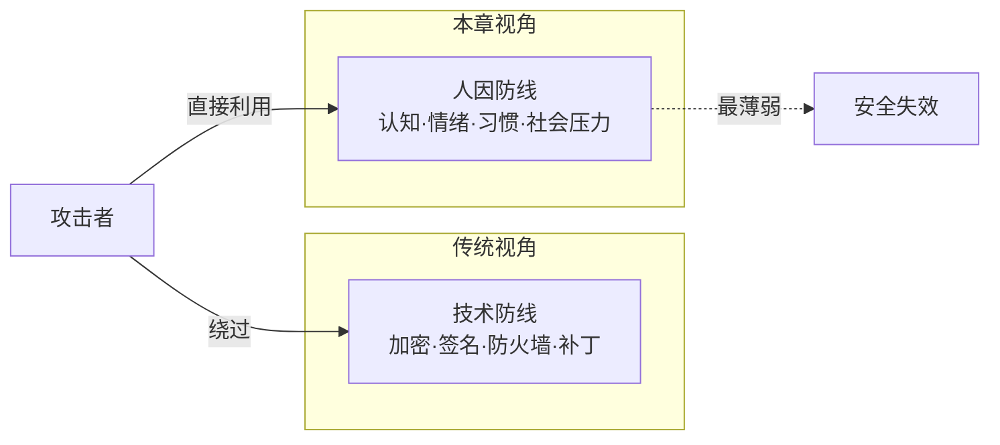
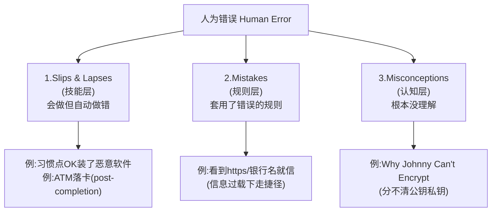
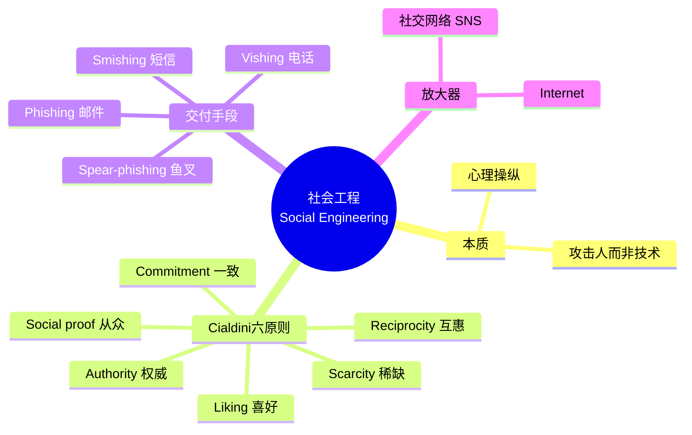
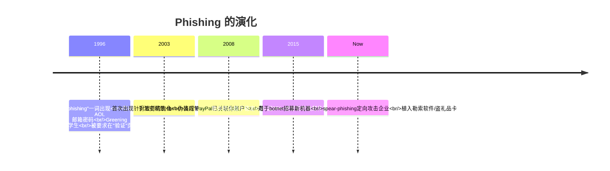
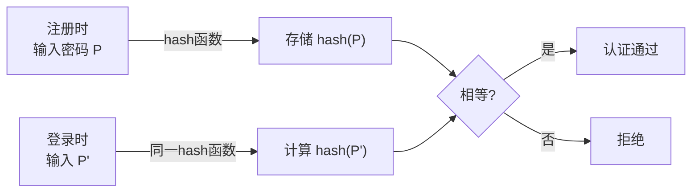
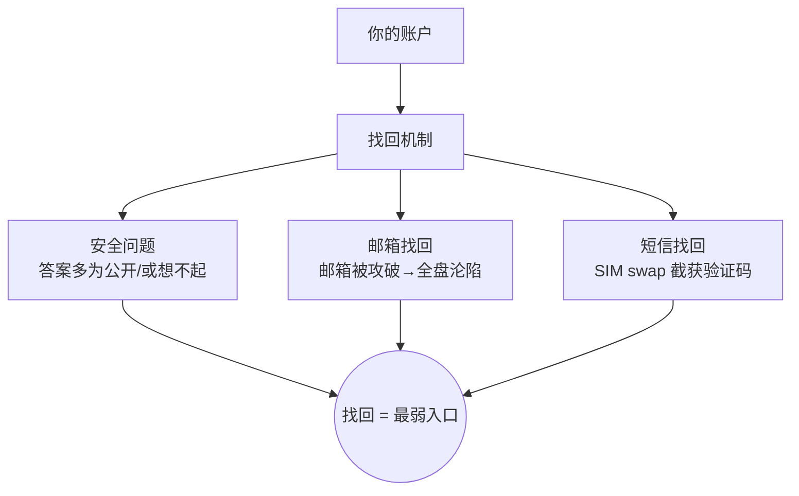
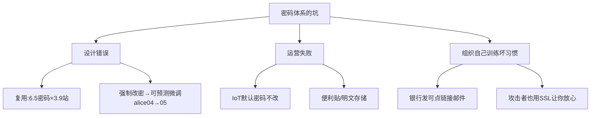
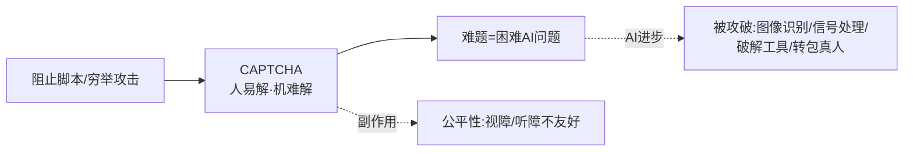
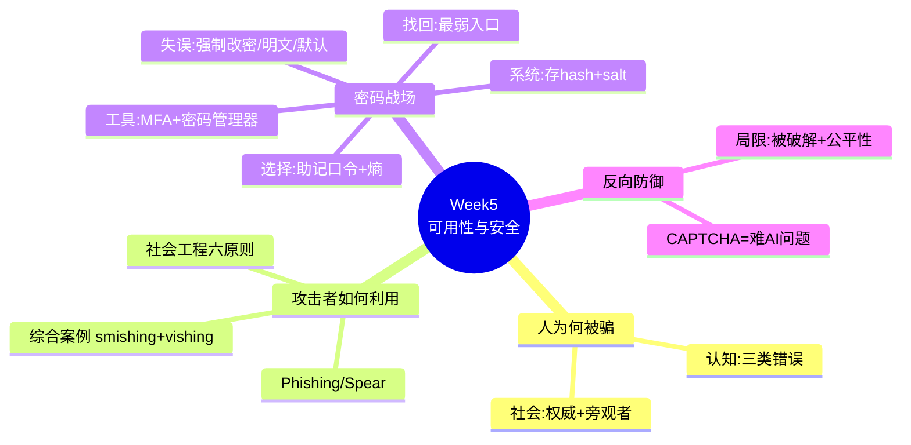

# Week 5 · 可用性与安全 (Usability & Security)

> **学习目标 (Learning objectives)** — 读完本章你应该能够:
> - 解释为什么"人"是安全系统中最薄弱的一环,以及 **psychology**(心理学)为何对攻防双方都至关重要;
> - 区分认知心理学中的三类 **human error**(slips/lapses、mistakes、misconceptions),并各举一个安全场景的例子;
> - 用 **Asch / Milgram / Zimbardo** 实验和 **bystander effect**(旁观者效应)说明社会心理如何被攻击者利用;
> - 复述 Cialdini 的六大说服原则,并能把一封钓鱼邮件拆解成这些原则;
> - 解释 **phishing / smishing / vishing / spear-phishing / pretexting** 的区别,识别一次社会工程攻击的红旗信号;
> - 说清 **OPSEC** 为什么是"训练+文化",而不只是"写几条规则";
> - 画出现代 password 系统的各个组件,解释系统为什么存 **hash** 而不是明文;
> - 论证 **password recovery**(密码找回)为什么常常是认证体系里最脆弱的入口(security questions、email recovery、SIM swap);
> - 在"好记"和"安全"这对矛盾里,说明为什么 **mnemonic passphrase**(助记口令)是最佳折中,并用 **password entropy**(熵)解释长度与字符集的作用;
> - 解释 **CAPTCHA** 的原理(= 一个难的 AI 问题)、它的局限和公平性问题。

如果让你用一句话概括整门安全课到目前为止的"反转",那就是:**前几周我们学的全是技术——加密、签名、防火墙、网络攻防;而这一周告诉你,即使这些技术都完美无缺,攻击者依然可以直接绕过它们,因为系统的最终用户是人。** 加密再强,也挡不住用户把密码主动念给冒充 IT 的骗子;防火墙再严,也拦不住员工点开一封"看起来像工资单"的邮件。本章研究的就是这条"人因 (human factor)"战线——为什么人会犯错、攻击者如何系统性地利用这些错误,以及我们能在系统设计和组织管理上做些什么。这也是讲师在录音里反复强调的主旨:*"security is not only a technical problem, it's also a human problem."*

本章的脉络是这样展开的:先理解**人为什么会被骗**(认知心理学 + 社会心理学),再看攻击者**如何把这些弱点武器化**(社会工程 + 钓鱼),接着用一个综合案例把前面的知识串起来,然后转向**密码**这个人因问题最集中的战场(系统、找回、选择、设计失误、解决方案),最后看一个"反过来利用人类强项"的防御机制——**CAPTCHA**。

> 📎 **本章资料来源说明** — 正文主体来自 Week 5 讲义(标注为 `[S+页码]`)与课堂录音(讲师的解释与例子)。凡是讲义没有、而来自 **Week 6 workshop**(其 Part A/B 正好练习本周内容)或属于背景补充的知识点,都会用 `📎 拓展` 明确标出,方便你区分"考点(在 slides 上)"与"加深理解(超出 slides)"。

---

## 1. 为什么安全是一个"人"的问题 `[S2-S4]`

我们先建立全章的动机。想象两种盗窃:在物理世界里造一家**假银行分行**去骗储户存钱,你得租门面、印招牌、雇柜员、还要躲过警察和工商——成本高、风险大、几乎没人这么干。但在网络世界里,造一个**假银行网站 (bogus banking website)** 只需要复制几张网页、注册一个相似域名,几小时就能上线,而且能同时骗成千上万人 `[S3]`。这个对比道出了核心矛盾:**在赛博空间里,利用心理弱点发动攻击,比在现实世界里容易太多了。**

为什么会这样?因为人类对付欺骗 (deception) 的天然防御机制,几乎全是为**面对面 (face-to-face) 场景**进化和训练出来的 `[S3]`。我们能从一个人的眼神、语气、肢体动作里嗅出不对劲;但在一封邮件、一条短信面前,这些线索全部消失了。攻击者于是获得了不对称的优势。

那么"心理学"到底能给安全带来什么?讲师特意强调:**psychology**(心理学)是一门比计算机科学古老得多的学科 `[S4]`。我们至今并不真正understand"意识 (consciousness)"的本质——我们只知道"心智是大脑在做的事 (the mind is what the brain does)";但关于大脑和心智**如何运作 (functioning)**,人类已经积累了大量知识:人如何做决策、如何在压力下反应、情绪如何影响行为。这些知识对攻击者和防御者**都**有用 `[S4]`:

- **攻击者**用它来设计 **social engineering attack**(社会工程攻击)——操纵人去泄露信息或执行危险操作;
- **防御者**用它来设计更不容易诱发人犯错的系统。



> **🔑 例(讲师的现身说法)** — 讲师在课上承认,自己上个月在 ATM 取完钱后把卡落在了机器里。这不是因为他不懂安全,而是一个典型的人因错误(见 §2 的 post-completion error)。连安全课的老师都会犯,正说明这条战线有多真实。

> **🔑 hacktivism 的例子** `[S3]` — "黑客行动主义"利用的是**愤怒人群 (angry mobs)** 的情绪操纵:当情绪被点燃、群体效应叠加时,攻击者无需任何技术漏洞,就能动员大量人参与攻击或传播。

**本节要点**:安全失效往往不是因为技术机制弱,而是因为攻击者懂得人怎么想、怎么做。要正确理解 cybersecurity,就必须同时理解人的行为以及攻击者如何利用它。

---

## 2. 认知心理学:人为什么会"自动"犯错 `[S5-S8]`

要利用人的弱点,先得知道弱点长什么样。**Cognitive psychology**(认知心理学)是一门用实证方法研究"我们如何思考、记忆、做决策、注意、处理信息"的学科 `[S5]`。它之所以对安全重要,是因为用户每天都在**不停地做安全相关的小决策**:这封邮件要不要点?这个链接安不安全?这个密码能不能复用?——而这些决策大多是在"自动驾驶"模式下、几秒内完成的。

> 📎 **拓展(相关学科)** `[S5]` — 与认知心理学紧密相关的是 **HCI (Human-Computer Interaction,人机交互)**。HCI 研究者基于认知心理学,建模和测量人的感知、运动控制、记忆、问题求解等表现;更关键的是,他们研究用户的 **mental model**(心智模型)——用户脑子里以为系统是怎么运作的——以及它与开发者的心智模型有何**差异**。安全漏洞常常就诞生在这条鸿沟里:开发者以为用户会读警告,用户却早已训练成无脑点"确定"。UOW 有专门的 HCI 课程。

讲义把人的错误分成**三类**,这是本节的骨架,务必记牢。它们的层次是不同的:前两类发生在"技能/规则"层面(你知道该怎么做,但做错了),第三类发生在"认知/理解"层面(你根本没真正理解)。

### 2.1 第一类:技能层面的"失误与遗漏" (Slips and lapses) `[S6]`

**Slips and lapses** 指的是:人**本来掌握**正确的操作技能,但在熟练、routine(惯例化)的情境下,技能"自动跑偏"了,或者调用了错误的技能。关键在于——**这类错误不是因为无知,而恰恰是因为太熟练、太自动**。

- **被训练出来的危险习惯** `[S6]`:用户被无数弹窗训练成"看到框就点 OK",好让自己赶紧把活干完。于是当一个"安装软件"的危险弹窗出现时,他们的手指已经先于大脑点了下去。**设计启示**:危险操作(如安装软件、授予权限)的操作序列,必须设计得和日常惯例操作**明显不同**,逼用户跳出自动模式。
- **Post-completion error**(完成后遗漏)`[S6]`:一旦达成了**主要目标**,人就很容易忘掉收尾动作。经典例子:**先吐钱、后退卡**的 ATM,会比"先退卡、后吐钱"的 ATM 让更多人把卡落下——因为拿到钱(主目标)后,人就分心走了。

### 2.2 第二类:规则层面的"错误" (Mistakes) `[S7]`

**Mistakes** 指的是:在 **information overload**(信息过载)等情况下,人会退而求其次,**套用自己最熟悉、最笼统的规则,而不是最适合当前情况的规则**。换句话说,人是"认知吝啬鬼",忙起来就不逐字分析,直接走捷径。

钓鱼攻击者把这一点利用到了极致 `[S7]`:

- 用 **https** 让你放心——"有 S 就是 secure 嘛";
- 把假域名拼成 `www.citibank.secureauthentication.com`——对大多数人来说,**"在 URL 里找到熟悉的名字 (Citibank)"是一条比"逐段解析域名结构"更强、更省力的规则**。可真正决定你访问哪台服务器的,是最右边的 `secureauthentication.com`,而不是最左边的 `citibank`。

> **🔑 例(规则被劫持)** — 你看到 `https://` + 域名里有 "citibank",两条"强规则"同时亮绿灯,于是你点了。攻击者没有破解任何技术,只是**触发了你既有的快捷判断规则**。

### 2.3 第三类:认知层面的"误解" (Misconceptions) `[S8]`

**Misconceptions** 是最深的一层:人**根本没理解**问题,或者只懂一半,却假装懂了、绕过建议、硬着头皮把活干完。

- **"Why Johnny Can't Encrypt"** `[S8]`:Alma Whitten 和 Doug Tygar 的经典研究发现,加密软件 **PGP** 对大多数大学生来说**太难用了**——但问题不在界面,而在**底层概念**:用户分不清 **public key vs. private key**(公钥与私钥)、加密与签名的区别。概念没建立,再好的界面也救不了。
- **不只是普通用户**:程序员同样用不好安全机制 `[S8]`。**access control**(访问控制)机制和 **security API** 都很难正确使用;更糟的是,程序员互相**抄代码**、从在线代码分享网站抄,于是误解和错误被**广泛传播**。他们常常知道这样不好,但"没时间做得更好"。

> **🔑 这一层的教训** — 浅层错误(slips/mistakes)可以靠更好的界面和提示来缓解;但 misconception 这种深层误解,**会一犯再犯**——哪怕你纠正了一次,只要底层概念没建立,错误就会换个形式回来。



| | 第一类 Slips/Lapses | 第二类 Mistakes | 第三类 Misconceptions |
|---|---|---|---|
| **出错层面** | 技能 (skill) | 规则 (rule) | 认知/理解 (cognitive) |
| **根因** | 自动化、分心 | 信息过载,套用最强规则 | 不理解或只懂一半 |
| **安全例子** | 习惯点 OK、ATM 落卡 | 凭 https/银行名就信任 | PGP 不会用、API 误用 |
| **缓解方向** | 让危险操作"不像惯例" | 减少负载、突出正确线索 | 教育、把概念讲透 |

**本节要点**:人的错误有三个层次,越往下越难纠正。攻击者会针对每一层设计诱饵;安全设计者必须把这三类错误都考虑进去,而不是简单地骂用户"不小心"。

---

## 3. 社会心理学:群体如何让人交出判断力 `[S9-S12]`

认知心理学讲的是"一个人脑子里"的错误;但人从不孤立地做决定。**Social psychology**(社会心理学)研究的是:个体的思想、情感和行为,如何被他人**实际的、想象的或暗示的存在 (actual, imagined or implied presence of others)** 所影响 `[S9]`。这句话的"想象的/暗示的"很关键——哪怕屋里没别人,只要你**以为**别人在看、别人会管,你的行为就会变。攻击者要的正是这种"群体效应"。

社会心理学里和安全最相关的几个主题 `[S9]`:从群体归属(性别、部落、团队、职业、宗教)中获得的**身份认同 (identity)**;对**权威的滥用 (abuse of authority)**;以及**旁观者效应 (bystander effect)**。

### 3.1 权威及其滥用 `[S10]`

三个心理学史上著名的实验,共同说明一件事:**人对权威和群体的服从,远超他们自己的想象。**

| 实验 | 年份 | 结论 |
|---|---|---|
| **Solomon Asch** 从众实验 | 1951 | 人会**否认自己亲眼所见**,只为与群体保持一致 |
| **Stanley Milgram** 服从实验 | 1961 | 超过 **60%** 的受试者,只要被权威要求,就会去做不道德的事 |
| **Philip Zimbardo** 斯坦福监狱实验 | 1971 | 24 名学生随机分成 12 狱警 + 12 囚犯;扮演狱警的学生**迅速变成施虐的威权者** |

这些实验对安全的意义直接而冷酷:**只要攻击者能披上"权威"的外衣(冒充经理、IT、政府),受害者服从的概率就会飙升。** 讲师举例:你收到一封"经理"发来的邮件,通常根本不会多想,就照做了——这正是 Milgram 实验在办公室里的翻版。

### 3.2 旁观者效应 `[S11-S12]`

**Bystander effect**(旁观者效应):当**很多人**都注意到了一个问题,每个人都**假设别人会去处理**,结果**没有一个人**采取行动。

经典案例是 **Kitty Genovese** 1964 年在纽约皇后区街头被刺身亡的悲剧 `[S11]`:袭击持续了近 30 分钟,据报有 **38 名目击者**却无人施救或报警。后续研究给出了量化的、反直觉的结论:

- 一个**单独的**旁观者会在 **85%** 的情况下施以援手;
- 但若他**以为还有另外 4 个人**也看到了受害者,施救率骤降到 **31%** `[S11]`。
- 关键变量是**责任感**:实验反复表明,**感到自己对局面负有责任**的旁观者,才会去帮忙或介入。

> **🔑 例(网络安全里的旁观者效应)** `[S11]` — 你收到一封可疑邮件,心想:"这么明显的钓鱼,公司里这么多人,肯定早有人报告给 IT 了,我就不用报了。" ——于是**所有人都这么想,结果谁都没报**,攻击窗口被白白拖长。这就是责任分散在赛博空间的版本。

> ✅ **自测 `[S12]`** — 在网络安全语境下,哪一项最符合"旁观者效应"?
> A) 用户因为警告太频繁而忽略所有安全警告 B) **多人都注意到了问题,但每个人都以为别人会处理** ✔ C) 攻击者协同发起一场战役 D) 系统自动拦截可疑流量 E) 用户故意把密码分享给同事
> **答案 B。** 注意别和 A(警告疲劳)、C(协同攻击)混淆。

> 📎 **拓展(对应防御:Defaults & nudges)** — Week 6 workshop 指出一个反向利用社会心理的防御手段:大多数人会**保留最简单的默认设置 (defaults)**。所以把**更安全的隐私/安全选项设为默认 (safe defaults)**,往往比写一长串说明更能改善用户行为。这就是"**nudge**(助推)"的思想——不靠命令,靠设计引导。后面 §11、§13 讲密码时还会再用到。

**本节要点**:人不是孤立决策的。攻击者通过冒充权威、制造"别人会管"的假象,系统性地关闭你的独立判断。防御者则可以反过来用"默认即安全"来助推正确行为。

---

## 4. 社会工程:把心理弱点武器化 `[S13-S16]`

前两节解释了"人为什么会被骗";本节讲攻击者如何把这些弱点**系统化、流程化**地利用,这就是 **social engineering**(社会工程)。

**Social engineering** = 通过**心理操纵 (psychological manipulation)**,让人去执行某些操作、或泄露机密信息 `[S13]`。它的本质是:**不去攻击技术,而是攻击使用技术的人。** 这套手法历史悠久,军方、情报(间谍)机构、私家侦探都在用;在网络犯罪里,它表现为各种线上/线下骗局、phishing、以及 OPSEC 的攻防。让人**传播假信息**也可以是社会工程的目的之一。而 **Internet 和社交网络服务 (SNS)**,让社会工程攻击变得空前泛滥——因为攻击者能轻易获取你的公开信息、批量触达目标 `[S13]`。

> ✅ **自测 `[S14]`** — 社会工程的核心思想是什么?
> A) 利用软件 bug 获取管理员权限 B) **操纵人去给出信息或执行不安全操作** ✔ C) 加密被盗文件并勒索 D) 用海量流量搞垮服务器 E) 仅靠恶意软件绕过认证
> **答案 B。** 其余选项都是"攻击技术",只有 B 是"攻击人"。

### 4.1 Cialdini 的六大说服原则 `[S15-S16]`

社会工程不是玄学,它有可复用的"配方"。心理学家 **R. Cialdini** 总结了六条**影响他人**的原则——它们最初是**市场营销研究**为了"提高销量"而发现的,但被社会工程攻击者拿来用得炉火纯青 `[S16]`。下面每条都配上讲师在课堂上给的钓鱼场景例子,务必把"原则 ↔ 攻击话术"对应记住,这是本周的高频考点。

| # | 原则 | 心理机制 | 钓鱼/诈骗中的用法(讲师例子) |
|---|---|---|---|
| 1 | **Reciprocity**(互惠) | 别人帮了你,你就觉得欠人情、得回报 | 先发你一份"免费安全审计报告",再请你登录账号去"修复漏洞" |
| 2 | **Commitment & consistency**(承诺与一致) | 一旦答应了小事,就不愿表现得前后矛盾 | 先问"你很重视安全对吧?"——你说"是"——再顺势让你装"防护软件"(恶意软件) |
| 3 | **Social proof**(社会认同) | 看别人怎么做来判断什么是正常/可接受;**群体越小,压力越大** | "你们班 90% 的同学都已经更新了密码,请更新你的" |
| 4 | **Liking**(喜好) | 更愿意听从好看的、讨喜的、熟悉的人 | 冒充你喜欢/熟悉的人,在 Discord/Slack 里发"假期派对"链接诱你点击 |
| 5 | **Authority**(权威) | 对权威人物天然顺从 | 冒充 CEO 深夜发邮件:"紧急,马上把这笔款转到这个账户" |
| 6 | **Scarcity**(稀缺) | 害怕错过(FOMO),怕想要的东西突然没了 | "你的卡即将被锁定""限时,过期作废"——逼你立刻行动 |

> **🔑 把它当成拆弹清单** — 拿到任何一封可疑信息,逐条问:它在用互惠?用权威?用稀缺(时间压力)?往往一封高明的钓鱼邮件会**同时叠加好几条**(比如"CEO(权威)紧急(稀缺)要你转账")。叠加得越多,越可疑。

> 📎 **拓展(另一套模型:七大诈骗原则)** — Week 6 workshop 用的是另一套常见框架,通常归于 Stajano & Wilson,可与 Cialdini 互为补充,一起记更全面:
> 1. **Distraction**(分散注意) 2. **Social compliance**(社会顺从/服从权威) 3. **The herd principle**(从众) 4. **Dishonesty**(利用受害者自己的不诚实,使其不敢声张) 5. **Kindness**(善意——"帮我重置一下吧") 6. **Need and greed**(需求与贪婪) 7. **Time pressure**(时间压力)
> workshop 给的映射示例:"假银行/假 IT 来电"→ social compliance;"立即行动否则失去权限"→ time pressure;"请帮我重置这个"→ kindness。

> 📎 **拓展(更深的人类决策偏差)** — Week 6 workshop Part A 还引入了几个解释"人为什么会上当"的认知偏差,值得了解:
> - **Prospect theory / 损失厌恶 (loss aversion)**:人对**损失**的厌恶,远强于对等量**收益**的喜爱,且会误判概率。所以"你的账户将被锁定"(强调损失)比中性提醒更有说服力。
> - **Present bias / hyperbolic discounting**(现时偏好/双曲贴现):眼前的不便比未来的保护更"重"。所以用户拖延更新——因为重启的代价是现在的,安全收益却很遥远。
> - **Cognitive dissonance**(认知失调):人不愿承认自己被骗了,于是诈骗受害者可能**继续配合**骗子,而不是停下来报告。



**本节要点**:社会工程是有方法论的——Cialdini 六原则(和七大诈骗原则)是攻击者的"剧本",也是你识别攻击的检查清单。互联网和 SNS 让这套剧本可以低成本、大规模地上演。

---

## 5. Phishing:旗舰级社会工程攻击 `[S17-S19]`

在所有社会工程攻击里,**phishing**(钓鱼)是最流行、也最严重的一种 `[S17]`,所以单列一节。它的套路是:诱使受害者去登录一个**专门设计来窃取凭据 (credentials)** 的假网站,从而偷走用户名和密码。

**一点历史能帮你记住它的演化** `[S17-S18]`:



讲师强调了两条关键的"演化曲线":

1. **手法越来越像真的**。2003 年的银行钓鱼,客户不难看穿;到 2008 年,攻击者会伪装成"你的 PayPal 账户已关联"这类与真实支付服务挂钩的通知,可信度大增 `[S17]`。
2. **欺诈损失先猛涨、约 2015 年趋稳** `[S18]`。趋稳不是因为攻击停了,而是**反制手段成熟了**:**two-factor authentication (2FA)**、更好的垃圾邮件过滤、后端 **fraud engine**(反欺诈引擎)。

但钓鱼并没有消失,反而**变宽、变精准**了 `[S18]`:

- **botmaster** 用钓鱼**定向招募**新机器加入 **botnet**(僵尸网络);
- 犯罪团伙越来越多地使用 **spear-phishing**(鱼叉式钓鱼)——针对特定个人或公司**量身定制**的钓鱼,因而格外可信——来植入 **ransomware**(勒索软件)、盗取礼品券、发动其他骗局。

> **🔑 一句话抓住要点** — 钓鱼早已不是"一封索要密码的假邮件"那么简单,它常常是一场更庞大、更有组织的攻击的**入口环节**。

> ✅ **自测 `[S19]`** — 下面哪个是钓鱼的最佳例子?
> A) 攻击者自动猜测大量密码 B) **一封假邮件诱使受害者登录假银行网站** ✔ C) 蠕虫通过未打补丁的系统传播 D) 用户忘记密码并通过邮件重置 E) 防火墙拦截可疑入站流量
> **答案 B。** A 是暴力破解,C 是蠕虫,都不是钓鱼。

---

## 6. OPSEC:组织层面的防御 `[S20-S21]`

个人能识别钓鱼还不够,攻击者会把矛头对准**组织里的员工**。**OPSEC (Operational Security,运营安全)** 关注的是:让员工有能力**抵御外部人员的劝诱**,无论对方是通过电话还是网络,试图套取机密 `[S20]`。

这一节最重要的一句话是:**光有规则是不够的 (it is not enough for rules to exist)。** `[S20]` 真正起作用的是三件事:

1. **训练 (train)** 那些有访问权限的员工;
2. **解释规则背后的原因 (explain the reasons behind the rules)** ——人理解了"为什么",才更愿意遵守;
3. 把规则**在组织里社会性地植入 (embed them socially)**,形成一种 **culture of compliance**(合规文化)。

讲师补充了一个真实例子:在 UOW,**教职员每月都要完成一次安全意识培训**(通常是看视频+答题)。这正是"训练 + 文化"的落地——不是发一份文件了事,而是周期性、强制性地反复强化。**即使是受信任的员工,也可能成为社会工程的目标**,所以频繁的意识培训对所有人都必要 `[S20]`。

> ✅ **自测 `[S21]`** — 在组织内,对抗多数社会工程攻击的最佳防御是?
> A) 屏蔽公司外的所有网站 B) 把所有密码设成至少20字符 C) **培训员工、解释规则、建立合规文化** ✔ D) 买更多杀毒软件 E) 让员工每周改密码
> **答案 C。** 注意:技术手段(A/D)和僵硬的密码政策(B/E)都治标不治本——人因问题要用"人"的办法解决。

**本节要点**:OPSEC 是组织版的人因防御。它的精髓是"训练 + 讲清原因 + 合规文化",而不是堆规则或堆技术。

---

## 7. 综合案例:一次 Smishing + Vishing 攻击的全流程 `[S22-S28]`

讲师用一个课堂活动(Activity 1)把前面所有概念串了起来。这正是考试最爱的"给场景、做分析"题型,我们完整走一遍。Week 6 workshop 的 Part C 也是同一类型(冒充 Head of School + IT 的钓鱼+电话),分析框架完全一致。

> **📋 场景 `[S22]`** — 某大学教职员早上 8:10 收到一条短信:
> *"UOW IT Security: 检测到你的账户有来自海外的异常登录。为避免账户被停用,请立即在此验证身份:uow-security-check.com"*
> 几分钟后,又接到一个自称大学 IT 团队的**电话**:*"我们正在帮员工保护账户。请把刚发到你手机上的验证码读给我,以便确认你的身份。"* 此时这名员工正准备去上课,感到必须赶紧解决问题的压力。

我们按五个标准问题分析:

**① 哪些信号说明这是社会工程攻击? `[S23]`**
- **urgency(紧迫)**:"立即验证""避免账户停用";
- **fear(恐惧)**:海外异常登录、账户可能被盗;
- **冒充权威**:"UOW IT Security";
- **可疑链接**:`uow-security-check.com`(不是真正的官方域名);
- **意料之外的后续电话**;
- **索要验证码**——合法 IT 人员**通常绝不会**这么做;
- 整个序列都在**逼你不加核实地快速行动**。

**② 攻击者用了哪些技术? `[S24]`**

| 技术 | 在本案例中的体现 |
|---|---|
| **Phishing / smishing**(短信钓鱼) | 带恶意链接的假短信 |
| **Vishing**(语音钓鱼) | 冒充 IT 支持的电话 |
| **Authority impersonation** | 假装是大学 IT Security |
| **Urgency & fear** | 账户停用、海外登录警报 |
| **MFA / 验证码窃取** | 想骗到发给用户的验证码 |
| **Pretexting**(借口铺垫) | 编一个可信的故事让受害者配合 |

**③ 员工为什么会信? `[S25]`** —— 安全警报本来就常见,信息显得合理;员工很忙、马上要上课;**时间压力削弱了审慎思考**;人倾向信任"官方支持团队";攻击者**短信+电话双管齐下**,让骗局更逼真;受害者只想赶紧解决、避免麻烦。

**④ 员工正确的做法? `[S26]`** —— **不要点链接;不要泄露验证码;挂断电话;只通过官方渠道核实;用官网或已知电话联系真正的 IT/安全团队;上报这条可疑短信和电话;如果已经点了或泄露了,立刻改密码并通知 IT/安全。**

**⑤ 大学能做什么来减少这类攻击? `[S27]`** —— 定期员工意识培训;明确告知"IT 永远不会索要 MFA 验证码";鼓励仔细核对官方域名;提供便捷的钓鱼/诈骗上报方式;尽量采用 **phishing-resistant authentication**(抗钓鱼认证);改进登录与找回设计;定期推送常见骗局示例。

> 📎 **拓展(为什么 MFA 没能完全挡住?)** — Week 6 workshop Part C 追问了一个关键点:**MFA 拦下了攻击者的首次登录尝试,但攻击者通过说服受害者主动读出验证码,绕过了 MFA。** 这说明:MFA 把技术门槛抬高了,但**最后一道闸门仍然是人**——一旦人被社会工程攻破,再强的 MFA 也会失效。这也呼应了为什么要推"phishing-resistant"的认证方式(如 passkey/FIDO,验证码无法被口述转交)。workshop 也点出本案例里的 **bystander effect**:某个员工察觉异常,却以为别人会上报。

> **🔑 一页纸总结 `[S28]`**
> - **红旗**:urgency、fear、假权威、可疑链接、索要验证码
> - **技术**:phishing/smishing、vishing、impersonation、pretexting
> - **为何中招**:忙、有压力、看起来官方、想快速解决
> - **正确反应**:不点、不读码、官方核实、上报
> - **组织防御**:意识培训、便捷上报、官方域名核对、"绝不口述验证码"规则

---

## 8. 密码系统:有哪些组件,系统到底存了什么 `[S29]`

接下来全章重心转向**密码 (passwords)**——人因问题最集中、最日常的战场。讲师的过渡很自然:上面案例里"如果已经泄露就立刻改密码",而要理解"改密码"意味着什么,先得看清一个**现代密码系统**由哪些组件构成 `[S29]`:

| 组件 | 作用 |
|---|---|
| **Login page**(登录页) | 用于注册、认证、再认证 |
| **Recovery mechanism**(找回机制) | 找回遗忘或被盗的密码 |
| **Password checking mechanism**(校验机制) | 拿用户输入的密码,与系统中保存的**加密后的**密码比对 |
| **Synchronizing mechanism**(同步机制) | 在多平台间同步密码的协议 |
| **Intrusion-detecting mechanism**(入侵检测) | 一旦某个密码被攻破就发出告警 |
| **Single-sign-on (SSO,单点登录)** | 一个登录密码用于多个网站,例:UOW 邮箱账户 |

这里有一个**极其重要、几乎必考**的概念,讲义只用一行带过,但讲师在录音里讲透了——**系统并不保存你的密码本身**。

> **🔑 系统存的是 hash,不是密码(讲师详解)** `[S29]`
> 当你注册时,系统**不**把你的明文密码存下来。它对密码施加一个 **hash function**(哈希函数,你前几周学过),得到一串看似乱码的 **hash value**(哈希值),**只保存这个哈希值**。
> 之后你登录时:系统对你**当场输入**的密码同样计算 hash,再和库里存的哈希值**比对**。
> - 若两者**相同** → 凭哈希函数的性质,可判定你输入的就是正确密码;
> - 若密码不对 → 算出的哈希值几乎必然不同,比对失败。
> 妙处在于:**系统自始至终不知道你的密码是什么**,它只知道密码的哈希值。这样即使数据库泄露,攻击者拿到的也是哈希值而非明文(前提是哈希做得好——见 §13 的 salting 拓展)。



**本节要点**:密码系统不止"登录"一个组件,还有找回、同步、检测、SSO 等。最核心的安全设计是——**存哈希、不存明文,登录时比对哈希**。这也是为什么"重置密码"能起作用,以及为什么数据库泄露不等于密码立刻全裸。

---

## 9. 密码找回:认证体系里最脆弱的入口 `[S30-S32]`

讲师特意点出:**找回(recovery)往往是整条认证链上最弱的一环**,因为攻击者**不必攻破主登录**——只要能利用更弱的重置流程或客服流程,就能直接拿到账户(这一点 Week 6 workshop 的 Optional extension 也专门强调了)。我们看三种主流找回方式,以及它们各自的软肋。

**先看大背景** `[S30]`:自 2010 年起人们大量转向智能手机,绝大多数线上客户对管理员来说是**陌生人**;一家大公司每天要处理海量的密码找回请求。在这种规模下,找回流程很难既安全又顺畅。

### 9.1 Security questions(安全问题)的问题 `[S30]`

"你最喜欢的食物?""你第一只宠物的名字?""你母亲的婚前姓?"——这些问题的根本缺陷是:**答案往往是公开或近乎公开的**。攻击者翻翻你的社交媒体就能猜到(你晒过的美食、和宠物的合影)。Google 2015 年的研究给出了硬数据:

- 英文"最喜欢的食物?",攻击者一次猜中率达 **19.7%**;
- 整整 **16%** 的人的答案是公开可得的;
- 同时,**40%** 的英语母语美国用户**根本想不起来**自己当初的答案。

> **🔑 双重困境** — 安全问题陷入一个两难:**答案要么对攻击者太好猜(不安全),要么对用户自己太难记(不可用)。** 讲师自嘲也常想不起自己设的答案——这正是 §11 要讲的"安全 vs. 好记"矛盾的预演。

### 9.2 Email recovery(邮箱找回) `[S31]`

通过发邮件到你**最初注册的邮箱**来重置密码。软肋很致命:**如果你的邮箱账户被攻破,攻击者就能拿到所有依赖它的账户**——邮箱成了"主钥匙",一破全破。

### 9.3 SMS recovery(短信找回)与 SIM swap `[S31]`

把验证码通过短信发到你手机。它的安全性**取决于电信运营商把关有多严**——而这里有个著名攻击 **SIM swap**(SIM 卡掉包):

> **🔑 SIM swap 怎么打** — 攻击者**冒充受害者**联系其移动运营商,谎称手机/SIM 丢失,诱使运营商**给攻击者补办一张 SIM 卡**。一旦补卡成功,受害者的手机失去信号,而**所有短信验证码都发到了攻击者手里**。讲师指出,SIM swap 攻击近年(2020 前后)非常猖獗。



> ✅ **自测 `[S32]`** — 为什么密码找回会成为认证的弱点?
> A) 找回总比正常登录慢 B) **找回问题和短信找回常被攻击者滥用** ✔ C) 找回只在台式机上有效 D) 找回阻止用户选强密码 E) 找回让密码哈希更易破解
> **答案 B。**

**本节要点**:再强的登录,也可能被一条薄弱的找回路径绕过。安全问题答案太公开、邮箱是单点故障、短信会被 SIM swap 截获——设计找回流程时必须把它当成攻击面来防,而不是事后补丁。

---

## 10. 选密码的核心矛盾:好记 vs. 安全 `[S33-S37]`

现在进入密码问题的"主旋律":**一个密码越安全,通常就越难记;越好记,通常就越不安全。** 本节把这对矛盾讲清楚,并给出研究支持的最佳折中。

### 10.1 为什么"安全密码"这么难伺候 `[S33]`

所谓 **secure (strong) password**,本质是**随机(看起来随机)的密码**,这样攻击者猜中的概率才足够小。但随机带来一连串可用性代价 `[S33]`:

- 太长太复杂,**容易输错**,得反复重输;
- 忘了要找回,**找回有成本**(还可能触发 §9 的弱点);
- 各网站强制的**密码规则**(必须有大写、小写、特殊符号)**惹恼用户**;
- 最根本的:**记不住**——12~20 位对人脑来说太长了。

于是出现了那个著名的悖论 `[S33]`:**"选一个你记不住的密码,而且不许写下来 (Choose a password you can't remember, and don't write it down)。"** ——这几乎是不可能完成的任务,也正是一切糟糕密码习惯的源头。

### 10.2 人会怎么"偷懒"选密码 `[S34]`

当被迫在"好记"和"安全"间选择,人几乎总是倒向好记——于是选出**naïve choice**(幼稚选择):名字(中间名、配偶名)、名字加一位数字、字典单词 `[S34]`。这些恰恰是 **dictionary attack**(字典攻击)的靶子。**Daniel Klein 1990 年**对 25,000 个 Unix 密码的研究坐实了这一点:

- **7.4%** 是字典单词;
- **4%** 是常见名字;
- **2.7%** 是用户名与账户名的组合。

> 📎 **拓展(早期 Unix 的设计缺陷)** `[S34]` — 早期 Unix 把密码哈希存在 `/etc/passwd` 里,而**任何用户都能读这个文件**——也就是说,任何人都能离线地"验证"对别人密码的猜测。讲师补充了**在线 vs. 离线攻击**的关键区别:在线尝试通常会被限制(如"输错3次锁定"),但**一旦攻击者把哈希文件下载到本地,就能离线地、不受次数限制地疯狂尝试**。这就是为什么哈希文件本身必须严格保护(现代系统改用 `/etc/shadow` 并加 salt)。详见 System Security 课程。

### 10.3 实验:三组人,哪种密码策略最好 `[S35-S36]`

强制密码规则会惹恼用户,而且在企业/军队等强制环境下,**逼得太狠,用户反而把密码写下来** `[S35]`。那到底什么策略既安全又可行?**Yan 等人 2004 年**那篇经典论文《The Memorability and Security of Passwords》做了一个三组对照实验 `[S35]`:

| 组别 | 给的指导 |
|---|---|
| 🔴 **Red(红组)** | 常规建议:密码至少 6 位,含非字母字符 |
| 🟢 **Green(绿组)** | 想一句 **passphrase**(口令短语),从中取字母拼成一个词。例:"It's 1 pm and I am starving" → **"I1AIS"** |
| 🟡 **Yellow(黄组)** | 随机选 8 个字符;写下来;记住后(一两周)把纸条销毁 |

**结果与结论** `[S36]`:

- **passphrase(绿组)和随机密码(黄组)的有效性大致相当**;
- 三组在**密码重置率**上**没有显著差异**;
- **结论:基于 mnemonic phrase(助记短语)的密码兼得两全 (best of both worlds)——既好记,又像随机密码一样难猜。**
- 但还有个现实问题:**相当多用户根本不照指导做**——这是 **user compliance**(用户合规)问题,不是技术问题。

> **🔑 例(助记法怎么用)** `[S45]` — 取一句你记得住、但别人猜不到的话,抽取每个词的首字母再掺点变化:
> "**CSIT970 is a fantastic subject, but I hate the lecturer**" → **"C9IAFSBIHTL"**。
> 它看起来像随机串(对攻击者难),但你靠那句话就能复现(对你易)。

> ✅ **自测 `[S37]`** — 哪种密码选择在可用性与安全间最平衡?
> A) 短字典词加一个数字 B) 所有网站复用同一个强密码 C) **基于助记/口令短语的密码** ✔ D) 永久写在便利贴上的密码 E) 仅基于配偶名+生日的密码
> **答案 C。**

**本节要点**:好记与安全是一对真实的矛盾,而 Yan 等人的实验给出了出路——**mnemonic passphrase 是经过验证的最佳折中**。但再好的方法也敌不过"用户不照做",所以可用性(让正确做法变省事)和合规同样重要。

---

## 11. 密码的设计错误与运营失败 `[S38-S43]`

即便用户愿意配合,**系统和组织层面的设计/运营错误**仍会让密码体系千疮百孔。本节把这些"坑"系统地过一遍。

### 11.1 设计错误(Design errors)`[S38-S40]`

**① 为"好记"而生的设计错误** `[S38]`:为了让密码可记而引入的机制(典型如 security questions)本身就是严重设计错误的高发区。更深层的问题是:**需要密码的应用数量,早已超出人类记忆的能力**——于是**跨站复用 (password sharing across sites)** 不可避免。Florencio & Herley 2007 年的研究量化了这种困境:

- 平均每个用户有 **6.5 个密码**;
- 每个密码被复用在 **3.9 个不同网站**;
- 每天要敲 **8 次密码**。

现代浏览器会缓存密码,但很多人**对高价值账户仍复用同一密码**——比如网银和社交账号用同一个 `[S38]`。后果很直接:**一处泄露,处处沦陷。**

**② 强制定期改密码——一个"持续存在"的错误** `[S39]`:**NIST 2003** 年的指南曾建议定期(甚至每月)更换密码。但后来的可用性安全研究发现:**超过 40% 的新密码能从旧密码推出来**——因为用户只做微小、可预测的改动,比如 `alice04`(四月)、`alice05`(五月)。强制更换**并没有**真正帮用户避开弱密码。因此 **NIST 现在改为推荐:使用长口令短语,只在确认被攻破时才更换 (changed on compromise)**。讲师补充:UOW 现在是**每年**要求改一次密码。

> ✅ **自测 `[S40]`** — 为什么现代可用性安全研究常批评"强制定期改密码"?
> A) 让哈希无法存储 B) **促使用户只做微小、可预测的改动** ✔ C) 让密码管理器失效 D) 消除事件响应需求 E) 妨碍 2FA
> **答案 B。**

### 11.2 运营失败(Operational failures)`[S41]`

这些是"规则没错,但执行时翻车"的情况:

| 失败类型 | 说明 |
|---|---|
| **不改默认密码** | 有些设备甚至**不让**改默认密码;在 **IoT 设备**(家用摄像头、路由器)上极常见 |
| **密码大喇喇可见** | 写在**便利贴**上、贴在显示器旁 |
| **不必要地索要密码** | 本不需要密码的地方也设密码 |
| **为营销目的设密码** | 纯为留住用户而设的账号密码 |
| **弱密码管理系统** | 系统**不加密**存储密码(存明文),一旦被黑直接拿到明文 |

### 11.3 组织自己在"训练用户做危险动作" `[S42]`

讽刺的是,很多机构(尤其银行)**亲手把客户训练成易受攻击的样子** `[S42]`:

- 嘴上说"别点邮件里的链接访问我们网站",**却又**发带可点链接的邮件;
- 说"银行卡 PIN 只能在 ATM 输入",**却又**让你在其他设备上输 PIN;
- 有些银行验证时**同时索要卡号 + PIN**。

这些自相矛盾的做法,等于给社会工程攻击者**敞开了模仿的大门**——因为真假行为已经难以区分。

### 11.4 客户教育与钓鱼警告:一场军备竞赛 `[S43]`

防御措施一旦被研究透,攻击者就会反过来利用 `[S43]`:你被教育"看到 **SSL/TLS**(HTTPS)就是安全的",于是攻击者现在**也给假网站上 SSL**,让你看到锁标就放心。基于可用性安全的有效防御应当是:

- **具体而明确的警告**(specific and concrete warning),而非泛泛的"此站点可能有风险";
- 让**安全的默认选项变得显眼又有吸引力**(safe defaults prominent and attractive)——又见 nudge 思想;
- **预防性 (pre-emptive) 措施**:屏蔽坏 URL、部署防火墙、浏览器**阻止访问证书无效的网站**。



**本节要点**:密码不安全,常常**不是用户的错**,而是设计和运营的错——强制改密、明文存储、不改默认密码、组织自相矛盾的训练。修复要从系统和流程下手,而不是一味苛责用户。

---

## 12. 实用解决方案与密码熵 `[S44-S45]`

讲完了所有的"坑",这一节给出**虽不完美、但可行**的密码方案,并引入量化安全强度的工具——**password entropy**(密码熵)。

### 12.1 几种可行方案 `[S44-S45]`

**方案一:纯数字的长密码 + 合理排版** `[S44]`。如果只用数字,**怎么排版打印就很关键**。把 20 位数字按下面这样分组,实验证明能显著减少输入错误:
```
xxxx xxxx xxxx
xxxx xxxx
```
**方案二:3 个以上随机字典词 + 数字组成的 passphrase** `[S44]`。例:**`Meadow271Cloudy19streeT`**。它好记,但要小心**别选太明显的词**;并且因为仍取自字典,可能遭字典攻击,所以**越长越好**。
**方案三:助记取字母法**(就是 §10 那篇 IEEE 2004 论文的方法)`[S45]`:"CSIT970 is a fantastic subject, but I hate the lecturer" → **"C9IAFSBIHTL"**。

讲义还给了两个延伸资源 `[S45]`:Okta 的 password entropy 科普,以及 **UOW 官方的密码强度文档**。

### 12.2 Password entropy(密码熵):用数字衡量强度

> 📎 **拓展(熵到底是什么,讲师详解)** — **password entropy** 衡量你的密码"来自一个多大的空间"。若密码的熵是 **128 bit**,意味着它来自一个含 **2¹²⁸** 种可能的空间。**熵越大,攻击者猜中的概率越小、所需时间越长。** 熵由两个因素决定:**字符集大小**(只用数字 < 加大小写 < 再加符号)和**长度**。这就把前面定性的"越长越复杂越安全"变成了可计算的量。

讲师展示了 UOW 文档里的破解时间表,直观说明字符集如何影响安全。**所有行都假设密码长度为 12 位**:

| 12 位密码的字符集 | 攻击者破解所需时间(估计) |
|---|---|
| 仅数字 | **约 1 秒** |
| 大写 + 小写字母 | **约 6 年** |
| 大写 + 小写 + 数字 | **约 53 年** |
| 大写 + 小写 + 数字 + 符号 | **约 226 年** |

> **🔑 怎么读这张表** — 同样 12 位,仅靠**扩大字符集**就能把破解时间从"1 秒"拉到"两百多年"。这就是为什么各网站逼你加大写、数字、符号——它们在直接抬高熵。但别忘了 §10 的教训:复杂度不能以"记不住、只好写下来"为代价,所以最优解仍是**又长、又用助记法、字符集又丰富**的口令。

### 12.3 实用清单(讲师总结的 UOW 建议)`[S45]`

- **每个账户用唯一密码**(不要跨站复用);
- **越长越好,至少 12 位**(让攻击者至少得等 53 年);
- **避开可预测、易猜的密码**;
- **开启 multi-factor authentication (MFA)**;讲师举例:在 UOW,登录其他系统时除了账号密码,还要输一个发到手机的验证码,或用 Microsoft Authenticator 做第二因子;
- **定期更换**(但记住 §11 的教训:重点是"被攻破时换",而非机械地每月微调)。

> 📎 **拓展(Password manager,密码管理器)** — Week 6 workshop Part B 专门讨论了一个本周最实用的工具:
> - **缺点 (drawbacks)**:可能忘记**主密码 (master password)**;一旦主密码被攻破,可能**一次性暴露很多密码**。
> - **优点 (benefits)**:自动**生成强密码**、**检测复用**、支持**备份/恢复**、追踪**数据泄露暴露情况**。
> - 一个反直觉的点:**屏蔽/禁用密码管理器(比如禁止粘贴密码),反而会把用户推向更弱的密码。** 这再次呼应"让正确做法变省事"的可用性原则。它正好解决了 §11 "密码太多记不住→复用"的困境:让管理器替你记,你只需记住一个主密码。

> 📎 **拓展(Salting,加盐)** — Week 6 workshop Part D(Python)练习了 **salt** 的概念,它是对 §8"存哈希"的关键加固:
> - **不同的 salt** 保证:即使两个用户选了**相同的密码**,他们在库里存储的哈希值也**不同**;
> - 加盐能抵御**预计算攻击**(如 rainbow table 彩虹表),并让"密码复用"的模式在数据库里不那么明显;
> - 再次强调:**hashing 不是 encryption**——系统**无法**还原出原始密码,它只能"重算哈希再比对",这正是 §8 "系统不知道你的密码"的本质。

**本节要点**:没有完美密码,但有可行组合——**唯一、够长、用助记法、字符集丰富、配合 MFA 和密码管理器**。password entropy 把"强度"量化:字符集和长度共同决定攻击者要花 1 秒还是 226 年。

---

## 13. CAPTCHA:反过来利用人类的强项 `[S46-S48]`

前面整章都在讲"人是弱点",最后这一节反转一下:能不能设计一种机制,**利用人类的强项、而非弱点**?这就是 **CAPTCHA** 的发明初衷。

**CAPTCHA = Completely Automated Public Turing Test to Tell Computers and Humans Apart**(全自动的、用以区分计算机与人类的公开图灵测试)`[S46]`。它的思路是:出一些**人类很容易解、计算机却很难解**的谜题,从而**阻止攻击者用脚本发动各种穷举式攻击**(如批量注册、暴力撞库)。

它最深刻的设计洞见是 `[S46]`:

> **🔑 CAPTCHA 里的难题 = AI 里的难题**
> CAPTCHA 谜题之所以"对计算机难",是因为它本质上是一个**困难的人工智能问题 (hard AI problem)**。这意味着:**破解 CAPTCHA 就等价于解决那个 AI 问题**——攻击者要么人工一个个解,要么得拿出真正创新的算法。经典例子:**人类很擅长读扭曲变形的文字 (distorted text),程序却不擅长。**

但这把"双刃剑"的另一面是,CAPTCHA 的安全性建立在"AI 解不了"这个假设上——而 **AI 在飞速进步** `[S47]`:

- 许多**图像识别**类谜题已被 AI 技术攻破;
- **垃圾邮件发送者**会**引诱真人**替他们解谜题(把 CAPTCHA 转包给人);
- 受人类视觉系统启发的**信号处理技术**能解出一部分文字 CAPTCHA;
- 现成的 **CAPTCHA 破解工具**在网上随手可得(有些还免费)。

此外还有不可忽视的**公平性 (equity) 问题** `[S47]`:CAPTCHA **对视障者不友好**(看不清扭曲文字),纯音频版又**对听障者不友好**。一个把部分人群挡在门外的安全机制,代价是可用性和包容性。



> ✅ **自测 `[S48]`** — 关于 CAPTCHA,哪句话最准确?
> A) 永久阻止一切自动攻击 B) 有效仅因为人类永远强于机器 C) **能减缓自动化滥用,但 AI 进步和可用性问题限制了它** ✔ D) 主要用于加密网络流量 E) 取代了认证控制的需求
> **答案 C。** CAPTCHA 是"减速带"而非"铜墙铁壁"。

> 📎 **拓展(System Security 课程预告)** — 讲师提到,CAPTCHA 经历了**好几代演进**(文字→图像→行为式如 reCAPTCHA),细节在 System Security 课里展开。本课只需掌握"原理 = 难 AI 问题""会被 AI 攻破""有公平性问题"这三点。

**本节要点**:CAPTCHA 是少有的"利用人类强项"的安全设计,本质是一个困难 AI 问题;但随着 AI 进步它不断被攻破,且存在公平性缺陷——它能减缓滥用,不能根除。

---

## 14. 本章小结 (Key takeaways)

把整章浓缩成你考前必须能脱口而出的几条主线 `[S49-S50]`:

- **安全首先是人的问题,其次才是技术问题。** 很多安全失效的根因,是"可用的系统"和"人的行为"被忽视了——而不是密码学不够强或硬件有问题。`[S49]`(这正是讲师点明的本讲**主旨**)
- **人会"自动"犯三类错**:技能层的 **slips/lapses**(如习惯点 OK、ATM 落卡)、规则层的 **mistakes**(信息过载下凭 https/银行名就信任)、认知层的 **misconceptions**(根本没理解,如 PGP 公私钥之惑);越深越难纠正。
- **群体会关闭个人判断**:**Asch/Milgram/Zimbardo** 证明人极易服从权威与群体;**bystander effect**(责任分散)让"人人以为别人会管"导致无人上报。
- **社会工程是有剧本的**:**Cialdini 六原则**(互惠/一致/从众/喜好/权威/稀缺)+ 七大诈骗原则,是攻击者的配方,也是你的识别清单。**phishing** 是旗舰攻击,已演化为 spear-phishing,常作为更大攻击(botnet、勒索软件)的入口。
- **组织防御靠 OPSEC**:不是堆规则,而是**训练员工、讲清原因、建立合规文化**。综合案例的标准反应是:**不点链接、不读验证码、官方渠道核实、尽早上报**;且要记住 **MFA 也会被社会工程绕过**(被骗着读出验证码)。
- **密码系统存哈希不存明文**(登录时比对哈希),加 **salt** 进一步加固;**hashing ≠ encryption**(不可还原)。
- **找回是最弱的入口**:安全问题答案多公开、邮箱是单点故障、短信会被 **SIM swap** 截获——攻击者绕过主登录即可得手。
- **"好记 vs. 安全"的最优解是 mnemonic passphrase**(Yan 2004 验证:助记口令兼得两全);用 **password entropy** 量化强度——同样 12 位,字符集从"仅数字(1 秒)"到"四类齐全(226 年)";实践上要**唯一密码 + 够长 + MFA + 密码管理器**,并避开**强制定期改密**这类已被证明无效的设计。
- **CAPTCHA** 反向利用人类强项,本质是一个**困难 AI 问题**;但随 AI 进步不断被攻破,且有**公平性**缺陷,只能减缓、不能根除自动化滥用。

> ✅ **终极自测 `[S50]`** — 降低账户被攻破风险的最佳实用组合是?
> A) 所有站点复用一个超复杂密码 B) 每周更换的短密码 C) **唯一密码 + 良好的找回设计 + 员工意识培训 + MFA 等额外保护** ✔ D) 仅靠安全问题 E) 仅靠 CAPTCHA
> **答案 C。** 它把本章所有防线(唯一密码、找回设计、人员培训、MFA)叠在了一起——单靠任何一项都不够。



---

> **📌 关于 workshop 的说明** — 本周(W5)的 workshop 实际练习的是**上一周(W4 网络攻防)**的内容(DNS 欺骗、路由劫持、DDoS 案例)。真正配套本章 Usability 的是 **W6 workshop**:其 Part A(人类决策偏差)、Part B(诈骗原则与密码管理器)、Part C(钓鱼+电话综合案例)、Part D(密码哈希与 salt)都直接对应本指南内容,已作为 `📎 拓展` 融入相应章节。复习时建议把 W6 workshop 当作本章的习题册一起做。
