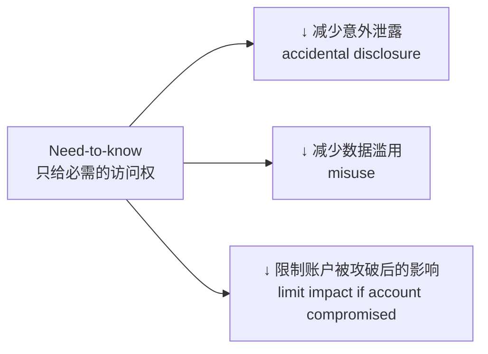
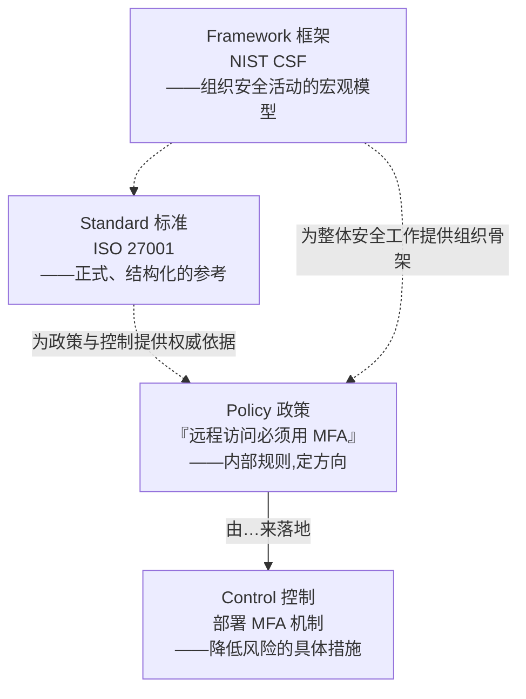
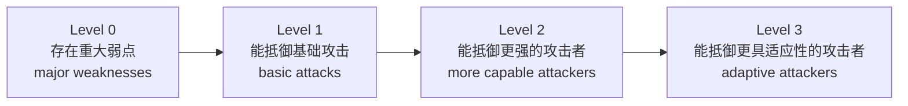
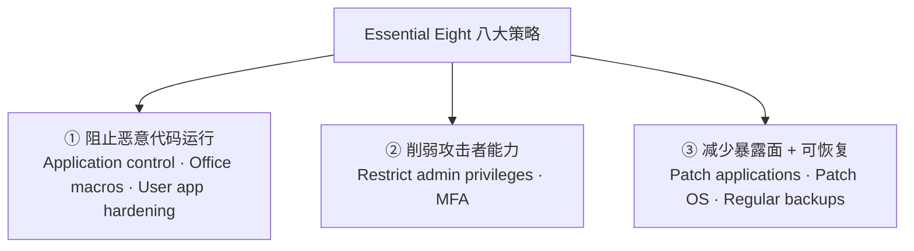
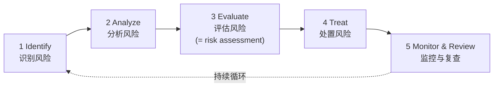
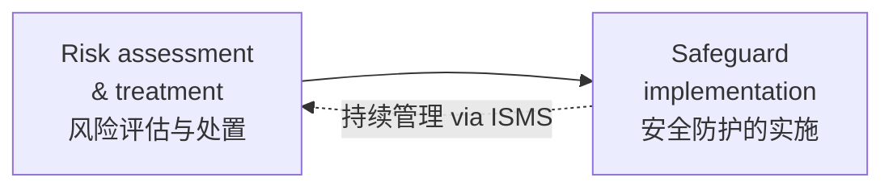
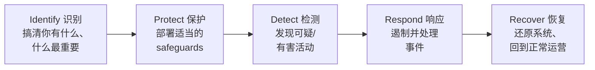
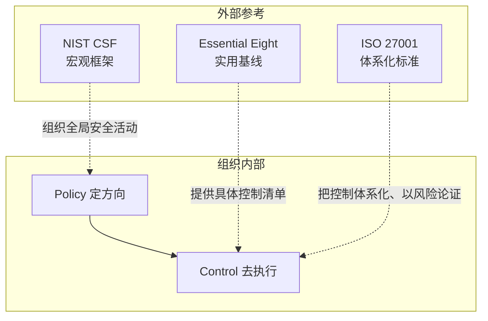
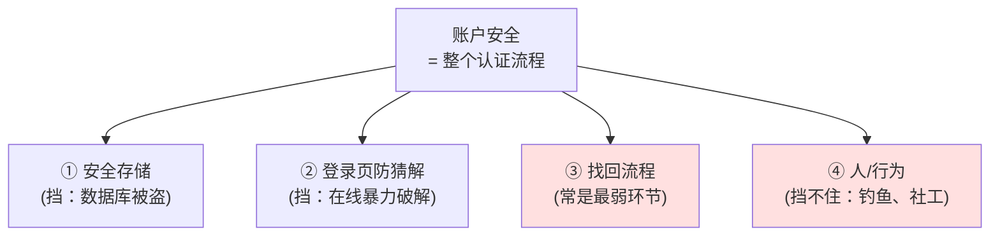

# Week 7 · 网络安全标准与框架 (Cybersecurity Standards & Frameworks)

> **学习目标 (Learning objectives)** — 读完本章你应该能够:
> - 用一句话各自定义并**清晰区分** **policy**(政策)、**control**(控制/安全措施)、**standard**(标准)、**framework**(框架),并说明四者在实践中如何协同;
> - 解释一份好的 **information security policy**(信息安全政策)应具备哪些特征,并能举出 access control、need-to-know、authentication、data classification、acceptable use/BYOD 等具体政策内容;
> - 说清 **Essential Eight**(澳大利亚 ASD 的八大缓解策略)的目的、适用范围与**局限**,逐条解释这 8 个策略各自防什么、怎么做,并理解 **maturity level**(成熟度等级 0–3)的含义;
> - 区分 **enterprise mobility**(企业移动办公)与 **operational technology / OT**(运营技术)两种环境,以及它们为什么需要"额外"的安全策略;
> - 复述 **risk management**(风险管理)的五个步骤,并理解它为什么是一个**循环**而非一次性任务;
> - 解释 **ISO/IEC 27001** 作为 **ISMS**(信息安全管理体系)标准的核心逻辑——以**风险**为中心、用 **CIA** 三性为目标、靠 **continuous improvement**(持续改进)演进——并说明组织为什么要采用它;
> - 复述 **NIST CSF** 的五大核心功能 (Identify / Protect / Detect / Respond / Recover),并理解它和 ISO 27001 的定位差异;
> - (Workshop 补充)解释为什么"安全地存储密码"还不足以保护账户,**login control / lockout**(登录控制/锁定)能挡住哪类攻击、挡不住哪类攻击,以及 **password recovery** 为何常是认证体系最薄弱的环节。

到第 7 周为止,这门课的前几周几乎全在讲**技术**:加密、数字签名、防火墙、网络攻防,以及第 5 周的人因与社会工程。这一周的视角突然**拉远**——我们不再盯着某一项技术,而是问一个组织层面的问题:*一家公司到底该如何系统性地组织它的全部安全工作?* 正如讲师开场所说,真实组织"不只是依赖防火墙、密码规则这些技术工具,它还需要 policy、control、framework、standard,而且这些东西必须协同运作"。本章就是要把这套**治理 (governance) 语言**讲清楚:先弄懂组织内部的"规矩"(政策与控制)长什么样,再认识三套业界公认的"参考答案"(Essential Eight、ISO 27001、NIST CSF),最后理解贯穿其中的主线——**风险管理**。

本章的脉络是:**①** 从一份信息安全政策出发,看组织内部都需要哪些"规矩"(§1–§5);**②** 把容易混淆的四个词 policy / control / standard / framework 一次性辨清(§6,这是全章的概念枢纽);**③** 逐一拆解三大外部参考——先是最"接地气"的 Essential Eight(§7),再用风险管理(§8)作桥,过渡到体系化的 ISO 27001(§9)和组织化的 NIST CSF(§10);**④** 把它们摆在一起对比,看清各自的定位(§11);**⑤** 最后补上本周 workshop 的认证实战(§12)。

> 📎 **本章资料来源说明** — 正文主体来自 Week 7 讲义(标注为 `[S+页码]`)与课堂录音(讲师的解释、例子与强调)。凡讲义没有、而来自 **Week 7 workshop**(其内容延续前几周的密码/认证 lab)或属于背景补充的知识点,都用 `📎 拓展` 明确标出,方便你区分"考点(在 slides/workshop 上)"与"加深理解(超出 slides)"。讲师明确说过:**本次 Quiz 2 闭卷、45 分钟、20 题,题目基于 lecture slides 和 workshop materials**——所以 §12 的 workshop 内容同样是考点。

---

## 1. 一切的起点:信息安全政策 (Information Security Policy) `[S3-S4]`

我们先从组织安全这座大厦的**地基**讲起。一个组织要保护自己的信息,第一步不是去买防火墙,而是先**写下规矩**:什么要保护、谁能用、用的人该怎么行事。这套写下来的规矩,就是 **information security policy**(信息安全政策)——讲师称它为"组织最基础的安全文档之一"。

具体地说,一份信息安全政策回答三个问题 `[S3]`:

- **什么信息是敏感的、需要保护的**(what should be protected);
- **谁可以访问或使用它**(who may access or use it);
- **对用户的行为有什么期望**(what behavior is expected from users)。

这里有一个**关键的认知**,很多人会搞错:**政策本身并不直接"执行"安全,它只提供方向 (direction)。** 讲师反复强调这一点。政策说"学生成绩只能由授权员工访问"——但真正把这条规矩**落地**的,是后面的**技术控制**和**管理控制**(下一节会讲 control 这个词)。打个比方:政策像公司的"宪法",写明价值取向和底线;控制才是把宪法变成现实的"执法机构"。

> **🔑 例(讲师的例子)** `[S3]` — 政策可能规定:"学生报告 (student reports) 只能由授权员工访问。" 这只是一句**声明**。要让它生效,得靠访问控制系统(一种 control)去**强制**:登录、校验身份、检查权限、放行或拒绝。政策定方向,控制来兑现。

那么什么样的政策才算**好政策**?讲义给了四条标准 `[S4]`,讲师还补充了"为什么":

| 好政策的特征 `[S4]` | 为什么重要(讲师解释) |
|---|---|
| **清晰、易懂** (clear and easy to understand) | 如果政策含糊,不同人会有**不同解读**,政策就失去了约束力,变得没用。 |
| **反映威胁和业务需求** (reflect threats and business needs) | 医院、银行、大学面对的威胁和数据都不同,**需要不同的规则**——没有放之四海皆准的政策。 |
| **指导安全控制的设计** (guide the design of security controls) | 政策要能告诉工程师"该上什么控制",否则就只是一纸空文。 |
| **帮助沟通安全期望** (communicate security expectations) | 让每个员工都知道"组织希望我怎么做",安全才能真正落到人头上。 |

**本节要点**:信息安全政策是组织安全的**方向盘**——它声明"保护什么、谁能访问、怎么行事",但不亲自执行;一份好政策必须清晰、贴合本组织的威胁与业务,并能指导后续控制的设计。

---

## 2. 谁能访问什么:访问控制与最小必需原则 `[S5-S6]`

政策里最核心的一块,是回答"**谁能访问什么 (who can access what)**"。这就是 **access control policy**(访问控制政策)`[S5]`。

它的基本逻辑是:**权限 (permission) 跟着角色 (role) 和职责 (responsibility) 走**,而不是人人平等。讲师用了一连串贴近你日常的例子来说明:

- 你作为 UOW 学生,能访问**你选修的**课程的 Moodle 站点,但不能访问**没选**的课程站点;
- 讲师作为课程**协调人 (coordinator)**,能看到本课程所有学生的姓名、邮箱、成绩——因为他**需要**这些信息来联系学生、登记分数;但他**看不到**全校其他学生的记录;
- 会计部门的人只能访问与本部门相关的文档;
- 一名护士可以照护病人,却**看不到只允许医生访问的病历**。

注意一个微妙之处 `[S5]`:**junior(初级)员工通常权限更受限,manager(管理者)权限更广——但"更广"不等于"无限"**。讲师特别点明:即便是经理,也仍然受政策约束,不能想看什么就看什么。**核心原则是:访问权应当与你的工作所需相匹配 (access should match the job you need)。**

这条逻辑推到极致,就是本节真正的主角——**need-to-know principle**(最小必需/按需知密原则)`[S6]`:

> **need-to-know principle** = 一个用户**只应**访问完成其工作**所必需**的信息,多一点都不行。

这是一个"简单但极其有力"(讲师原话)的安全思想。它的价值在于三重防护 `[S6]`:

第三条尤其重要,把它和前几周的攻击知识连起来想:**即使攻击者攻破了某个账户,这个账户能碰到的数据也被 need-to-know 死死圈住了**,损失因此被限制在一个小范围内。这就是为什么 need-to-know 不只是"管理规矩",更是一道**纵深防御 (defense in depth)** 的技术性防线。

> **🔑 例(讲师的 COVID 例子)** `[S6]` — 假设你要训练一个模型,根据症状预测病人是否得了 COVID。按 need-to-know,你应当**只能访问**"症状 → 是否阳性"这类建模真正需要的数据;而病人的**姓名、个人身份信息**与建模无关,你就**不应**有权访问。哪怕你是被信任的研究者,"被信任"也不等于"能看一切"。

**本节要点**:访问控制让权限随角色与职责分配,经理权限更广但仍受政策约束;而 need-to-know 把这一思想推到极致——**只给完成工作所必需的最小访问权**,从而同时减少泄露、滥用,并在账户被攻破时把损失关进一个小笼子里。

---

## 3. 先证明你是谁:认证要求 (Authentication Requirements) `[S7]`

access control 要决定"给不给你访问权",前提是**先得知道你是谁**。这就引出了 **authentication**(认证)——在授予访问之前**核验用户身份**的过程 `[S7]`。讲师把它拆成两步:先 authentication(你输入用户名 + 密码 / token / 智能卡 / 生物特征,证明你是你),通过之后系统才进入"该不该给你权限"的判断。

讲义对认证给出了三条具体要求 `[S7]`,每条背后都有清晰的安全动机:

1. **使用唯一的用户账户** (use unique user accounts)。为什么?因为唯一账户支撑 **accountability**(可追责性)。讲师解释:当系统记录到某个危险行为时,凭唯一账户就能把行为**直接追溯到具体的人**;如果大家共用账户,就无从追责。
2. **访问前必须认证** (require authentication before access)。先证明身份,再谈权限——顺序不能反。
3. **记录登录成功与失败** (log successful and failed login attempts)。为什么连**失败**也要记?因为大量失败登录往往是**暴力猜解或可疑活动**的信号;而且日志能在事后**调查事件 (investigate incident)** 时还原现场。

> 📎 **拓展(与 §12 workshop 的衔接)** — "记录失败登录 + 在可疑活动后告警"这条认证要求,正是本周 workshop Python 实验要你动手实现的部分:连续失败 3 次后锁定账户、并向 `security_log.txt` 追加一条告警。换句话说,§3 是理论,§12 是它的代码落地。

**本节要点**:认证先于授权——系统必须先核验"你是谁",再决定"你能干什么";唯一账户保证可追责,记录成败登录则既能发现攻击信号、又能支撑事后取证。

---

## 4. 不是所有数据都一样金贵:数据分级 (Data Classification) `[S8]`

到这里你可能会问:既然要保护信息,是不是所有信息都要用最高强度去保护?**不是。** 讲师点明:**并非所有信息都需要同等级别的保护**,否则成本会高得离谱。解决办法是按**敏感度 (sensitivity)** 给数据**分级**——这就是 **data classification**(数据分级)`[S8]`。

讲义给出一个最基础的四级模型(从低到高):

| 级别 `[S8]` | 含义 | 讲师举例 / 控制含义 |
|---|---|---|
| **Public**(公开) | 可以公开分享 | 市场宣传资料——人人可见,**不需要加密** |
| **Internal**(内部) | 仅供组织内部正常使用 | 一般内部文档 |
| **Confidential**(机密) | 敏感,仅限特定用户访问 | 访问受限 |
| **Restricted**(受限/绝密) | 高度敏感,需最强保护 | 病历、薪资数据——**必须加密** |

分级的意义在于:**分级决定了该上什么控制 (classification decides what control is needed)**。这正好把本章和前几周的加密知识连了起来——公开的宣传册不需要加密(谁都能看,加密毫无意义),但病历和薪资必须加密。数据分级,本质上是把有限的安全资源**精准投放**到最该保护的数据上。

**本节要点**:数据按敏感度分为 Public / Internal / Confidential / Restricted 四级;分级的目的不是贴标签,而是据此决定每类数据需要多强的控制——让加密等高成本手段用在刀刃上。

---

## 5. 技术挡不住的那一环:人、行为与 BYOD `[S9-S10]`

讲到这里,前几周(尤其第 5 周)的主题又回来了:**光有技术挡不住一切,很多安全事件恰恰源于人的行为或社会工程攻击**。讲师再次强调这条主线。所以一份完整的安全政策,必须覆盖"人"这一面。

**安全意识与行为 (Security Awareness and Behaviour)** `[S9]`——组织应当:

- 把安全政策**告知**全体员工(share security policies with staff);
- 提供**定期的意识培训**(regular awareness training);
- **鼓励上报**可疑活动(encourage reporting of suspicious activity);
- 推广日常的安全好习惯(promote safe daily practices)。

讲师举的日常例子很接地气:离开座位(比如去洗手间)要**锁屏**、对邮件附件要**警惕**、**不要分享密码**。这些都不是技术,而是要靠培训和文化养成的行为。

**可接受使用与 BYOD (Acceptable Use and BYOD)** `[S10]`——组织还需要明确:

- 什么样的上网和设备使用是**可接受**的(acceptable internet and device use);
- 对不安全网站/服务的**限制**;
- **个人设备**用于工作的规则,即 **BYOD(Bring Your Own Device,自带设备)**。

BYOD 是一把双刃剑(讲师强调):它**提升便利**,但也**增加风险**——因为组织对个人设备的**控制力更弱**。

> **🔑 例(讲师的 BYOD 例子)** `[S10]` — 一名员工用安全设置很差的**个人手机/笔记本**收发工作邮件,就可能把组织数据暴露出去。所以组织必须为 BYOD 设定明确规则,而不是放任。

**本节要点**:安全的最薄弱一环往往是人,所以政策必须包含意识培训、鼓励上报、日常好习惯,以及对上网行为和 BYOD 的明确规则——BYOD 带来便利的同时,也因组织失去控制力而放大了风险。

---

## 6. 全章的概念枢纽:Policy / Control / Standard / Framework 四个词 `[S11]`

现在到了**全章最容易考、也最容易混的一张幻灯片**。讲师专门提醒:"这一页很重要,因为我们有时会把这几个词搞混。" 这四个词层层递进,务必一次辨清。

| 术语 `[S11]` | 一句话定义 | 它是什么角色 | 例子(讲师) |
|---|---|---|---|
| **Policy**(政策) | 组织**内部的规则或期望** | 组织自己定的"规矩",说**要达到什么** | "员工远程访问必须用 MFA" |
| **Control**(控制) | 用来**降低风险的安全措施 (safeguard)** | 兑现政策的"手段",说**怎么做到** | MFA 这个机制本身 |
| **Standard**(标准) | 一份**结构化的参考**,给出更正式的结构 | 指导安全实践的"权威参照" | ISO 27001 |
| **Framework**(框架) | 一个**更宏观的模型**,用来组织安全活动 | 组织安全思考的"骨架" | NIST CSF |

理解这四者关系的最好方式,是看一个例子从上到下"贯穿"它们:

一个直觉记法:**policy 说"要什么",control 说"怎么做",standard 给"正式的参照",framework 给"组织的骨架"**。讲师强调:实践中,一个组织通常会把这四者**全部一起用**——政策定规矩,控制去执行,再用标准和框架来确保整套体系既正式又有条理。本章后半段的 Essential Eight、ISO 27001、NIST CSF,正是 standard / framework 这一层的三个具体代表。

**本节要点**:policy = 组织内部规则(要什么);control = 降低风险的具体安全措施(怎么做);standard = 正式、结构化的参考(如 ISO 27001);framework = 组织安全活动的宏观模型(如 NIST CSF)。四者递进、协同,实践中通常同时使用。

---

## 7. 接地气的基线:Essential Eight `[S12-S30]`

辨清了四个词,我们来看第一个具体的"参考答案"。讲师介绍三大参考时,把 **Essential Eight** 放在最前面,因为它最**具体、最容易上手**。

### 7.1 它是什么、为什么有用 `[S12-S14]`

**Essential Eight**(基本八项)是澳大利亚信号局 **ASD(Australian Signals Directorate)** 制定的一套**有优先级的缓解策略 (prioritized mitigation strategies)**,目的是帮助组织**降低常见的网络威胁** `[S12]`。

它的精髓在"**有优先级**"四个字。讲师把它和"风险管理思路"对照:与其想一口气把所有安全措施都做了(既不现实也没重点),Essential Eight 替你**挑出了最重要的几项控制**,这些控制能针对常见威胁提供最强的性价比防护。**它具体、可落地,这是它最大的价值。**

但它**不是万能答案**(讲师反复强调的局限)`[S13]`:

- Essential Eight **主要面向连接互联网的标准 IT 环境**(internet-connected IT environments);
- 它对许多组织有用,但**不是为每一种环境量身定制**的;
- **移动办公密集**或**运营技术 (OT)** 环境,可能需要**额外**的策略。

换句话说:Essential Eight 是一条很好的**基线 (baseline)**,但安全终究要**适配组织的具体场景**。

光有控制还不够,还得衡量"**做得到不到位**"。这就是 **maturity level**(成熟度等级)`[S14]`——它描述这些控制**实施得有多好**。讲师举例:只对一小部分用户启用 MFA,和对整个环境启用 MFA,显然不是一回事。共四级:

讲师点明:**adaptive attackers(有适应能力的攻击者)是最高级、最难缠的对手**,所以放在 Level 3。等级越高,代表防护越成熟、越能扛住越高级的攻击者。

### 7.2 两类"特殊环境":Enterprise Mobility 与 OT `[S15-S16]`

为什么 Essential Eight 在某些环境会"不够用"?讲义专门介绍了两类特殊环境,正是它的盲区。

**Enterprise mobility(企业移动办公)** `[S15]` — 指员工**不再固定在一个办公室、一台设备**上工作,而是跨地点、跨设备:在家办公、出差途中、**hot-desking**(轮用工位)、用笔记本/平板/智能手机,横跨各种网络。讲师提醒:这会**放大对额外控制的需求**——比如 MFA、设备管理、安全远程访问——因为员工可能在家用自家 Wi-Fi,甚至连别处的免费 Wi-Fi。

**Operational technology / OT(运营技术)** `[S16]` — 这和普通办公 IT **本质不同**:OT 是**直接监控或控制物理过程**的硬件与软件,常见于制造、交通等工业场景。典型例子:

- **ICS**(Industrial Control Systems,工业控制系统)
- **SCADA**(Supervisory Control and Data Acquisition,监控与数据采集系统)
- **DCS**(Distributed Control System,分布式控制系统)
- **RTU**(Remote Terminal Unit,远程终端单元)
- **PLC**(Programmable Logic Controller,可编程逻辑控制器)

记住:OT 直接关联**物理世界**(机器、流水线),一旦出事可能造成物理后果,所以它的安全需求和纯数据的 IT 系统不一样,Essential Eight 这套面向互联网 IT 的基线无法完全覆盖它。

### 7.3 八大策略逐条拆解 `[S17-S30]`

下面是核心中的核心——八个策略 `[S17]`。讲师建议**成组地理解**它们,而不是死记八条。按"它们各自起什么作用"可以分成三组:

我们按这三组逐一讲透。

#### 第①组:阻止恶意代码运行

**1) Application control(应用控制)** `[S18-S19]` — 只允许**经批准的软件**运行。为什么强?因为**绝大多数攻击都需要先"跑起来"自己的恶意程序和工具**;如果系统只放行白名单内的应用,攻击就难做了。讲师例子:你从钓鱼邮件里下载了一个未知的可执行文件,应用控制会**阻止它运行**,从而掐断后续攻击。它能 ① 拦截恶意软件和未授权软件、② 减少恶意代码执行、③ 抑制攻击扩散。

实现它有三种常见方法 `[S19]`,各有取舍:

| 方法 `[S19]` | 原理 | 取舍(讲师) |
|---|---|---|
| **Hash rules**(哈希规则) | 用密码学**哈希**信任**某个确切文件** | 精确,但软件一**更新**(文件变了)哈希就失效,维护麻烦 |
| **Publisher rules**(发布者规则) | 信任来自**已批准发布者/厂商**的软件 | 更**灵活** |
| **Path rules**(路径规则) | 信任来自**已批准位置**的软件 | 需要**很强的文件权限**配套 |

注意 hash 方法正好复用了前几周的**密码学哈希函数**:文件一旦被篡改(哪怕插入一点东西),哈希就会变,从而被检测出来。讲师结论:应用控制**需要细心管理**,没有哪种方法是免费的午餐。

**3) Configure Microsoft Office macro settings(配置 Office 宏设置)** `[S22-S23]` — 先搞清 **macro(宏)** 是什么:宏是嵌在 Office 文件里、用 **VBA(Visual Basic for Applications)** 语言编写的代码,本意是**自动化重复任务**(把一串命令录下来反复重放)。问题在于:这个"有用的功能"长期被攻击者**滥用**——一个文档里的恶意宏会在你**打开文件时**就执行有害动作。它是"功能好用但安全有风险"的经典案例。

所以组织应当**屏蔽或严格限制不安全的宏**,只在受控条件下允许 `[S22]`。一旦决定"不全放开",下一个问题就是**哪些宏可信**?管理宏信任的办法 `[S23]`:

- **来自可信发布者的数字签名 (digital signatures)**——可验证宏确实来自可信方;
- **组织控制的可信位置 (trusted locations)**——但必须谨慎管理,一旦给得太松,攻击者照样能滥用;
- 在**可用性与安全之间**仔细权衡。

**4) User application hardening(用户应用加固)** `[S24]` — "加固"= **削减软件里有风险或不必要的功能**,目的是**缩小攻击面 (attack surface)**。软件常带一些在某些场景有用、但在另一些场景很危险的功能;把它们关掉或限制掉,攻击者就更难得手。例子:限制脚本或活动内容(active content)、收紧浏览器设置、禁用不用的/有风险的功能(如危险的浏览器行为、有风险的插件)。讲师补充:浏览器有时会提示某插件"可能不安全",这正是加固思路在起作用。

#### 第②组:削弱攻击者能力

**5) Restrict administrative privileges(限制管理员权限)** `[S25]` — 这一条讲师说"很重要"。管理员账户**权限极广**,因此对攻击者**极有吸引力**——一旦拿到 admin,就能对系统为所欲为。好的做法:

- 仅在**确有需要**时才授予 admin 权限(granting admin rights only when needed);
- **分离** admin 账户与普通账户(separating admin and standard accounts);
- **减少**用 admin 账户收发邮件、上网(reducing admin use for email and web browsing)——因为一旦这个高权限账户被钓中,后果是灾难性的。

> **🔑 例(讲师的现身说法)** `[S25]` — Lab PC 里你装不了软件,因为你没有 admin 权限;连讲师自己要装软件也得**专门申请** admin 权限。这就是"按需授予、平时用普通账户"的活教材。

**7) Multi-factor authentication / MFA(多因素认证)** `[S28]` — 要求**两种或以上不同类别**的认证因素。即便攻击者偷到了你的密码,那也**不够**,因为还差一步。这让 MFA 成为**降低账户被攻破最实用的手段之一**,尤其对远程访问、邮箱、管理员账户。三类因素(经典分法)`[S28]`:

| 因素类别 | 含义 | 例子 |
|---|---|---|
| **Something you know**(你知道的) | 记忆中的秘密 | PIN、password、passphrase |
| **Something you have**(你拥有的) | 实体/数字凭证 | 安全密钥、智能卡、软件证书、OTP token、智能手机/App、SMS 或 email 验证码 |
| **Something you are**(你本身的) | 生物特征 (biometrics) | 指纹、面部几何特征 |

讲师现身说法:他每次登录系统,一开始都要用手机做两步验证。MFA 的本质是——多设一道关,把"只偷到密码"这条捷径堵死。

#### 第③组:减少暴露面 + 保证可恢复

**2) Patch applications(给应用打补丁)** `[S20-S21]` — 打补丁 = 应用厂商发布的、**修复已知漏洞**的更新。逻辑很直接:**一旦漏洞被公开,攻击者就能轻易利用它发起攻击**;你拖着不打,等于给攻击者留着一条现成的入侵通道。所以补丁要 ① 减少已知的攻击机会、② 按**暴露程度和威胁等级**排优先级、③ 对**面向互联网的系统**尤其重要。

打补丁的**时间框架 (timeframes)** 取决于风险 `[S21]`:

- **关键漏洞 / 已有可用利用 (working exploit)**:**非常快**地打(如 48 小时内甚至更快);
- **面向互联网的服务**:**高优先级**(因为攻击者更容易够到);
- **低风险应用**:可在**计划内的维护窗口**里打。

讲师的实用建议:别纠结理论上的优先级,**看到补丁就更新**通常就是好习惯。

**6) Patch operating systems(给操作系统打补丁)** `[S26-S27]` — 和打应用补丁同等重要,甚至更关键:**OS 漏洞可能让整台设备乃至整个网络暴露**。优先级同样看**暴露面、关键性、紧急度**。讲义给了一张相当细的推荐时间表 `[S27]`,核心规律是"**越暴露、越关键 → 越快打;一旦判定为 critical 或已有可用利用 → 48 小时内**":

| 系统类型 `[S27]` | 常规时限 | 若 critical / 有可用利用 |
|---|---|---|
| 面向互联网的**网络设备 / 服务器**的 OS | 2 周内 | **48 小时**内 |
| **非**面向互联网的网络设备 / 服务器的 OS | 1 个月内 | 高威胁环境下 **48 小时**内 |
| **工作站 (workstations)** 的 OS | 1 个月内 | 高威胁环境下 **48 小时**内 |
| **OS 驱动程序、ICT 设备固件** | 高威胁环境 1 个月内 | **48 小时**内 |

不用背死每一行,记住那条**主线**即可:基本是 2 周或 1 个月,但**只要是关键漏洞或已被利用,就压缩到 48 小时**。

**8) Regular backups(定期备份)** `[S29-S30]` — 为什么备份是 Essential Eight 的压轴?因为**预防永远不可能完美**(讲师原话),即便组织做得再好,事故仍可能发生。备份支撑**恢复 (recovery) 与业务连续性 (business continuity)**,让你能从勒索软件、系统故障中爬起来。但**备份只有在"真的能用"且"攻击者难以篡改"时才有价值**。正确备份的三要点 `[S30]`:

| 要点 `[S30]` | 做法 | 目的 |
|---|---|---|
| **Careful scoping**(谨慎界定范围) | 备份覆盖恢复所需的**全部**内容:重要数据、软件、配置设置 | 确保真出事时能完整恢复 |
| **Regular testing**(定期测试) | 定期测试备份**能否真正还原**系统、软件、重要数据 | 给组织"我确实能恢复"的信心 |
| **Restricting privilege**(限制权限) | 让**非特权账户只能访问自己的备份** | 降低攻击者篡改/销毁备份的风险 |

第三点把 §2 的 need-to-know 又用上了:连备份的访问也要遵循最小权限,否则攻击者攻破普通账户后顺手把备份也毁了,备份就形同虚设。

> **本节小结(Essential Eight 一句话记法)** — 八策略 = **"别让坏代码跑(应用控制/宏/加固)+ 削弱攻击者(限权/MFA)+ 减少暴露并能恢复(打应用补丁/打 OS 补丁/备份)"**;它是 ASD 给互联网 IT 环境的**有优先级基线**,用 maturity level 0–3 衡量落实程度,但对移动办公和 OT 环境需另作补充。

---

## 8. 把控制串成体系的主线:风险管理 (Risk Management) `[S31-S33]`

讲到这里,讲师做了一个明确的转场:"我们从**具体的控制**,转向一个更**根本的概念**——风险管理。" 为什么需要这个转场?因为 Essential Eight 给的是"做什么",但**为什么做、先做哪个、做到什么程度**,需要一套**以风险为中心**的思维来回答。这套思维,正是下面 ISO 27001 的灵魂,所以风险管理是连接"具体控制"和"体系化标准"的桥。

先回顾 **risk(风险)** 是什么 `[S31]`。讲义给了两层理解:

- 风险是**威胁发生(或威胁利用脆弱性)并造成影响的可能性**;影响可能是数据丢失、机密性/完整性/可用性受损,或成本、延误、法律后果等业务问题;
- 更正式地:风险意味着关于未来事件的**任何不确定性**,而这种不确定性**威胁到组织达成其使命的能力**。

而 **risk management(风险管理)** 则是"**系统化地识别、度量和处置各种损失暴露**"的方法 `[S31]`。

为什么要管理风险?`[S32]` 因为它帮组织:

- **降低事件发生的概率与影响**(reduce the chance and impact of incidents);
- **支撑业务连续与恢复**(support continuity and recovery);
- **为安全决策排优先级**(prioritize security decisions)。

讲义还把风险管理浓缩成三个**该问的问题** `[S32]`:**①** 什么可能出错 (what can go wrong)?**②** 事件前后我们能做什么 (what can we do before and after an incident)?**③** 怎样减小影响 (how do we reduce the impact)?

回答这些问题的标准流程,是**五个步骤**,而且讲师特别强调——它是一个**循环 (cycle)**,不是一次性任务 `[S33]`:

讲师点明:监控复查之后,又要回头去识别下一周期可能出现的新风险,如此**周而复始**。因为威胁在变、技术在变,风险管理必须是**持续进行**的。(讲师还提到,UOW 有专门的风险管理课程供深入学习。)

**本节要点**:风险 = 威胁发生并造成影响的不确定性;风险管理是系统化地识别、度量、处置这些风险,以降低事件概率与影响、并为安全决策排序;它遵循"识别→分析→评估→处置→监控复查"五步,且是一个**永不停止的循环**。这套以风险为中心的思维,正是下一节 ISO 27001 的内核。

---

## 9. 体系化的标准:ISO/IEC 27001 `[S34-S41]`

带着风险管理的思维,我们来看三大参考里最"正式"的一个——**ISO/IEC 27001**,最知名的信息安全标准之一 `[S34]`。

### 9.1 它管的是什么:ISMS `[S34]`

ISO 27001 是关于建立和运行 **ISMS(Information Security Management System,信息安全管理体系)** 的标准。它的核心思想一句话:**安全应当被"系统化地管理",而不是靠零散孤立的技术措施堆出来。** ISO 27001 提供一个框架,帮**任何规模、任何行业**的组织,以**系统化、低成本**的方式保护信息——通过一套 ISMS(政策 + 流程的组合)。

### 9.2 安全目标的标尺:CIA 三性 `[S35]`

ISO 27001 的基本目标,是保护信息的三个方面,也就是经典的 **CIA triad**(CIA 三性)`[S35]`:

| 维度 | 含义 | 一句话 |
|---|---|---|
| **Confidentiality**(机密性) | 对未授权者**保密** | 不该看的人看不到 |
| **Integrity**(完整性) | 保持信息**原本的用途和含义**、不被未授权篡改 | 不该改的没被改 |
| **Availability**(可用性) | 让**合法用户**在需要时能访问信息与资源 | 该用的时候用得上 |

CIA 之所以好用,是因为**几乎任何控制都能用"它支撑了 CIA 的哪一面"来解释**(讲师的串联)。例如:**备份**主要支撑 **availability**;**访问控制**主要支撑 **confidentiality 和 integrity**。这把本章前面所有零散的控制,统一到了一个目标坐标系里。

### 9.3 ISMS 的关键要素与持续改进 `[S36-S37]`

一套 ISMS 要求组织建立起一组规则,来完成以下事项 `[S36]`:

- **识别利益相关方 (stakeholders) 对组织在信息安全上的期望**;
- **识别**信息安全面临的**风险**;
- **定义控制及其他缓解方法**来满足期望、应对风险;
- 设定信息安全上**清晰的目标**;
- **实施**所有控制与风险处置方法。

这把安全从"纯 IT 问题"提升为**管理与治理 (governance) 的一部分**。

而 ISMS 最强的思想之一,是 **continuous improvement(持续改进)** `[S37]`——这正是 §8 风险管理循环的延续。安全不是静态的:威胁在变、技术在变,**去年够用的控制今年可能就不够**。所以好的 ISMS 要:监控控制是否在起作用、定期复查其有效性、随风险和需求的变化而改进。

### 9.4 为什么要采用 ISO 27001 `[S38]`

讲义给了四个理由 `[S38]`:

| 理由 `[S38]` | 含义 |
|---|---|
| **合规 (Comply with legal requirements)** | 实施 ISO 27001 能满足大量法律、法规、合同对信息安全的要求 |
| **竞争优势 (Competitive advantage)** | 拿到认证的组织比同行更有竞争力,也是值得对外宣传的资质 |
| **降低成本 (Lower costs)** | 预防安全事件发生,能为组织省下大笔钱 |
| **更好的组织 (Better organization)** | 帮助组织轻松建立信息安全的流程与规程,不必从零摸索 |

### 9.5 它如何运作 + 14 个域 + 控制类型 `[S39-S41]`

ISO 27001 的**运作逻辑**(讲师强调这是要点)`[S39]`:**识别风险 → 选择合适的安全防护 (safeguards) → 通过 ISMS 来管理它们**。核心信息是——**控制不能随便挑**,必须由组织的**具体情境和风险画像 (risk profile)** 来论证其必要性。

ISO 27001 把信息安全划分为 **14 个域 (domains)** `[S40]`,覆盖面很广。不必逐字背诵,但要对"范围之广"有概念:

> 信息安全政策、信息安全组织、人力资源安全、资产管理、访问控制、**密码学 (cryptography)**、物理与环境安全、运营安全、通信安全、系统获取/开发/维护、供应商关系、信息安全事件管理、业务连续性中的信息安全、合规。

注意这 14 个域里就包含了你前几周学的 **cryptography**、本章学的 **access control** 等——ISO 27001 本质上是把全课程的知识点**组织进一个统一体系**。

实施这些(讲义提到共 **114 个控制**)会落到五类控制上 `[S41]`:

| 控制类型 `[S41]` | 例子 |
|---|---|
| **Technical**(技术控制) | 备份、杀毒软件 |
| **Organisational**(组织控制) | 访问控制政策、BYOD 政策 |
| **Legal**(法律控制) | NDA(保密协议)、SLA(服务等级协议) |
| **Physical**(物理控制) | CCTV 摄像头、报警系统、门锁 |
| **Human resource**(人力资源控制) | 安全意识培训、ISO 27001 审计员培训 |

这张表很好地呼应了 §6:control 不只有技术一种,组织、法律、物理、人力都是降低风险的"安全措施"。

**本节要点**:ISO 27001 是建立 ISMS 的标准,主张"系统化管理安全";它以 **CIA 三性**为目标、以**风险**为中心(控制必须由组织情境和风险论证,而非随意挑选)、靠**持续改进**演进;组织采用它可获得合规、竞争力、降本和更好的组织流程,其内容覆盖 14 个域、114 个控制,横跨技术/组织/法律/物理/人力五类。

---

## 10. 组织安全活动的骨架:NIST CSF `[S42-S43]`

三大参考的最后一个是 **NIST CSF(NIST Cybersecurity Framework,美国国家标准与技术研究院网络安全框架)** `[S42]`。它是一套**指南与最佳实践**,帮组织**建立并改进自身的网络安全态势 (cybersecurity posture)**——给出一组建议和标准,让组织更善于**识别、检测**攻击,并指导如何**响应、预防、恢复**。讲师视它为"构建网络安全项目的必备标准"。

它和 ISO 27001 的**定位差异**值得记牢(讲师的对比)`[S42-S43]`:

- **ISO 27001** 以 **ISMS / 风险管理**为中心,是一套**正式的标准**;
- **NIST CSF** 更常被用作**组织安全活动的实用方式**——帮组织审视当前态势、并在安全工作的**全生命周期**上规划改进。

NIST CSF 的精华是**五大核心功能 (five core functions)**,给出一个"简单但强大"的结构 `[S43]`:

| 功能 `[S43]` | 含义 |
|---|---|
| **Identify**(识别) | 认清需要保护的流程与资产——"你有什么、什么最重要" |
| **Protect**(保护) | 实施恰当的 safeguards 来保护企业资产 |
| **Detect**(检测) | 部署机制以识别网络安全事件的发生 |
| **Respond**(响应) | 发展技术以**遏制 (contain)** 事件影响 |
| **Recover**(恢复) | 实施流程以**还原**因事件而受损的能力与服务 |

讲师点出一个深意:这五大功能提醒我们,**网络安全不只是"预防"**——detect、respond、recover 同样不可或缺。前几周我们大量讲"怎么挡住攻击",而 NIST CSF 告诉你:**假设攻击迟早会突破,你还得能发现它、控制它、并从中恢复。** 这和 §7.3 把"备份"列入 Essential Eight 是同一种成熟的安全观。

**本节要点**:NIST CSF 是组织网络安全活动的**框架**,核心是五大功能 **Identify → Protect → Detect → Respond → Recover**;相比以 ISMS 为中心的 ISO 27001,它更偏向"实用地组织安全活动、覆盖全生命周期",并强调安全不止于预防——检测、响应、恢复同等重要。

---

## 11. 把它们摆在一起:快速对比 `[S44]`

讲到这里,本章的五个核心概念可以一字排开,看清各自的"身位"`[S44]`:

| 概念 `[S44]` | 一句话定位 | 层级 |
|---|---|---|
| **Policy**(政策) | 组织的**内部规则** | 组织内部:定方向 |
| **Control**(控制) | 用来**降低风险的安全措施** | 组织内部:落地执行 |
| **Essential Eight** | 一组关键控制的**实用基线** | 外部参考:具体、可上手 |
| **ISO 27001** | 以**风险**为本的 **ISMS 标准** | 外部参考:正式、体系化 |
| **NIST CSF** | 组织安全活动的**框架** | 外部参考:宏观、全生命周期 |

讲师的总结掷地有声:**这些概念彼此不同,但在实践中是配合使用的。** 一个成熟的组织,通常会用 policy 定规矩、用 control 去执行、拿 Essential Eight 当快速落地的基线、用 ISO 27001 把整套安全管理体系化、再用 NIST CSF 给全局安全活动搭一个骨架。它们不是"五选一",而是"五合一"。

> 📎 **讲师提示(关于 workshop)** — 讲师说,在后续 workshop 里你会拿到**组织被攻击的场景**,练习判断"该用上面哪一个(policy / control / Essential Eight / ISO 27001 / NIST CSF)"。所以复习时,除了记住每个概念的定义,更要练**"在具体场景里挑对工具"**的能力。

---

## 12. Workshop 补充:认证不只是"存好密码" `[Week 7 Workshop]`

> 📎 **本节定位** — 本节内容来自 **Week 7 workshop**(密码/登录控制实验),它**延续前几周(尤其 Week 5/6)的密码 lab**,主题是**认证安全的实战**,与本周 lecture 的"标准与框架"主题不同。但讲师明确说 **Quiz 2 涵盖 workshop 材料**,所以这同样是考点。本节也正好把 §3"认证要求"里"记录失败登录、对可疑活动告警"落到代码层面。

### 12.1 Part A 核心结论:为什么"存好密码"还不够

workshop 的 Part A 用三个问题,点破一个关键认知:**账户安全取决于整个认证流程,而不只是密码怎么存。**

**Q1:为什么"安全地存储密码"本身不足以保护账户?**

- 安全的密码存储(加盐哈希)只在**密码数据库被偷**时保护你——它让攻击者拿到库也算不出原始密码;
- 但攻击者仍可能在**登录页**直接**猜密码**;
- 还可能**绕过**主登录,走 **password recovery(密码找回)、phishing(钓鱼)、social engineering(社会工程)**;
- 所以账户安全依赖**整个认证过程**,不是单一环节。

**Q2:attempt limits / lockout(尝试次数限制/锁定)有什么用?**

- **限制尝试次数**能**拖慢**反复猜密码的攻击;
- **锁定**削弱**在线暴力破解 (online brute-force)** 或反复猜测的效果;
- 它还给系统一个机会:在可疑活动后**发出告警 (raise an alert)**。

**Q3:为什么 password recovery 可能比主登录更脆弱?**

- 找回流程常用**更弱的校验**:邮箱重置、短信重置、薄弱的安全问题;
- **帮助台 (help-desk) 员工**可能被社会工程**骗过**;
- 所以**即便你的密码规则很强、甚至上了 MFA**,账户仍可能从**找回**这个口子被攻破。

这条结论和 Week 5 的主题完全咬合:认证体系往往**最弱的不是密码本身,而是找回入口**。

### 12.2 Part B:给密码验证程序加"登录控制"

Part B 的任务,是在**上周"加盐存储 + 验证密码"**的基础上,**加上基本的登录控制** `[Workshop S5]`:

> **任务**:修改密码验证程序,使得——用户**最多 3 次**尝试;每次失败打印 `Incorrect password`;若正确打印 `Access granted`;**3 次失败后**打印 `Account locked`;锁定后向 `security_log.txt` **追加 (append)** 一条消息。

讲义点出几个**实现要点**,每个都对应一个安全原理 `[Workshop S7]`:

| 要点 `[WS]` | 含义 | 背后的安全原理 |
|---|---|---|
| `salt` 从 **hex 转回 bytes** | 存储时盐是十六进制字符串,验证时要还原成字节 | 验证必须**复用同一个盐**(见下) |
| `stored_key` | 存下来的**加盐密码哈希** | 系统存的是哈希,不是明文(呼应 Week 5) |
| `hashlib.scrypt(...)` | 用输入的密码**重新计算**派生密钥 | scrypt 是**慢哈希/KDF**,抗暴力破解 |
| `hmac.compare_digest(...)` | **安全地比较**重算密钥与存储密钥 | 防**时序攻击 (timing attack)**——不因提前不匹配就提前返回 |
| `success` 标志 | 跟踪本轮是否输对了密码 | 控制循环与日志逻辑 |
| `"a"` 模式 | 文件**追加 (append) 模式** | 日志保留旧记录,不被覆盖 |

workshop 还配了四个思考题,把原理讲透 `[Workshop S8-S9]`:

1. **为什么验证时必须复用同一个 salt?** 因为存储的密钥就是用**那个特定的盐**生成的;换个盐,即使密码正确,重算出的密钥也会不同,导致验证失败。
2. **账户锁定主要防哪种攻击?** 主要防**在线密码猜测 (online password guessing)** 和反复登录尝试;它**不**直接阻止钓鱼或数据库被盗。
3. **为什么它挡不住钓鱼?** 钓鱼里受害者**亲手把密码交给**攻击者,攻击者随后以真实用户身份登录——问题不是"猜",而是 **credential theft(凭证被窃)**,锁定对此无能为力。
4. **为什么找回仍是弱点?** 找回可能用比正常登录更弱的校验;攻击者可利用邮箱重置、短信重置、安全问题或帮助台社工。

### 12.3 Workshop 一句话总结 `[Workshop S10]`

> **密码安全不只是"密码够不够强"**,它还取决于:安全存储、安全验证、尝试次数限制、告警、以及找回机制的设计。**一个系统哪怕用了强哈希,只要找回流程或用户行为是弱的,整体就仍然是弱的。**

**本节要点**:账户安全是**整个认证链**的事——存储、登录防猜解、找回、人的行为缺一不可;lockout 能挡在线暴力猜解,但挡不住钓鱼和找回攻击;验证时必须复用同一个盐,用 `hmac.compare_digest` 做安全比较,用追加模式记日志。这正是把 §3 的认证要求落进代码。

---

## 13. 本章小结 (Key takeaways)

把整章浓缩成必须记住的几条:

1. **四个核心词层层递进**:**policy**(组织内部规则,定"要什么")→ **control**(降低风险的安全措施,做"怎么做")→ **standard**(正式结构化参考,如 ISO 27001)→ **framework**(组织安全活动的宏观模型,如 NIST CSF);实践中**四者协同、同时使用**。`[S11/S44]`

2. **一份好的信息安全政策**清晰、贴合本组织的威胁与业务、能指导控制设计;其内容包括 **access control**(权限随角色/职责走)、**need-to-know**(只给必需的最小访问权,可在账户被攻破时限制损失)、**authentication**(唯一账户保证可追责、记录成败登录)、**data classification**(Public/Internal/Confidential/Restricted,决定该上多强的控制)、以及面向人的 **awareness 培训**与 **BYOD** 规则。`[S3-S10]`

3. **Essential Eight** 是 ASD 给互联网 IT 环境的**有优先级基线**,记法:**阻止恶意代码运行**(application control、Office macros、user app hardening)+ **削弱攻击者**(restrict admin privileges、MFA)+ **减少暴露并可恢复**(patch applications、patch OS、regular backups);用 **maturity level 0–3** 衡量落实程度;对 **enterprise mobility** 和 **OT**(ICS/SCADA/DCS/RTU/PLC)环境需另作补充。`[S12-S30]`

4. **Risk management** 是贯穿一切的主线:风险 = 威胁发生并造成影响的不确定性;管理它要走"**Identify → Analyze → Evaluate → Treat → Monitor & Review**"五步,并且是一个**永不停止的循环**。`[S31-S33]`

5. **ISO/IEC 27001** 是建立 **ISMS** 的标准,主张"系统化管理安全";以 **CIA 三性**(机密性/完整性/可用性)为目标、以**风险**为中心(控制须由组织情境与风险论证,而非随意挑)、靠**持续改进**演进;覆盖 **14 个域、114 个控制**,横跨技术/组织/法律/物理/人力五类;采用它带来合规、竞争力、降本与更好的组织流程。`[S34-S41]`

6. **NIST CSF** 是组织安全活动的**框架**,五大功能 **Identify → Protect → Detect → Respond → Recover**;相比以 ISMS 为中心的 ISO 27001,它更偏"实用地组织全生命周期安全活动",并提醒:**安全不止于预防,检测/响应/恢复同等重要**。`[S42-S43]`

7. **(Workshop 考点)** 账户安全是**整个认证流程**的事,不只是"存好密码":**lockout** 能挡**在线暴力猜解**,但挡不住**钓鱼**(凭证被亲手交出)和**找回攻击**(找回常是最弱入口);验证时必须**复用同一个盐**、用 **`hmac.compare_digest`** 安全比较、用**追加模式**记日志告警。`[Workshop]`

> **考试提醒**:讲师明确 Quiz 2 **闭卷、45 分钟、20 题(每题 0.5 分)**,题目来自 **lecture slides + workshop materials**。复习时既要会**背定义**(尤其 §6 四个词、§7.3 八策略、§9 ISO 27001、§10 NIST CSF 五功能),也要会**在场景里选对工具**(讲师说后续 workshop 会练这个)。slides 第 45–49 页的 5 道例题务必弄懂——答案分别是:政策= B;need-to-know= B;Essential Eight 目的= C;防恶意 Office 文件= C(配置宏设置);NIST CSF= B(五大功能)。
