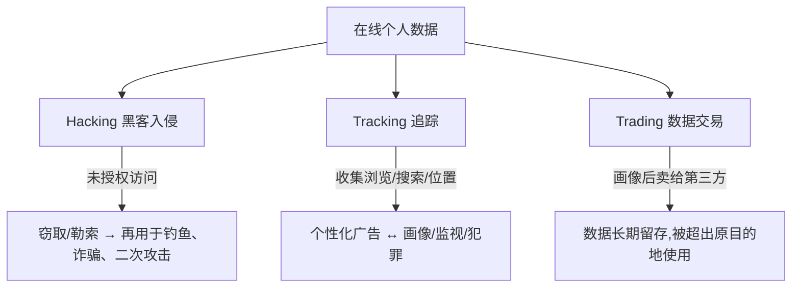
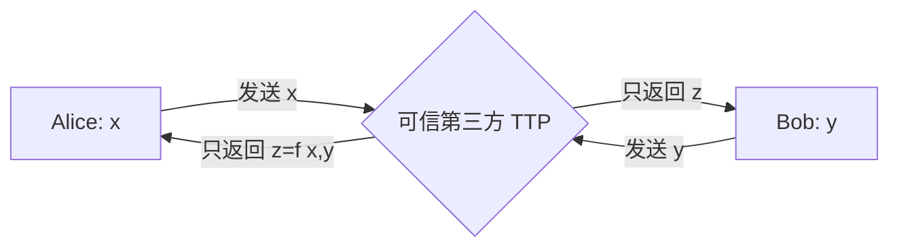
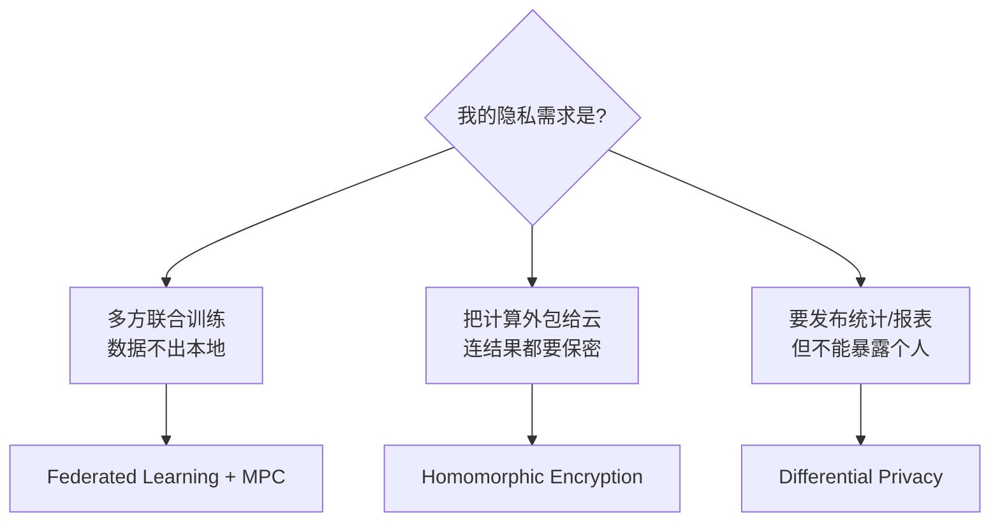
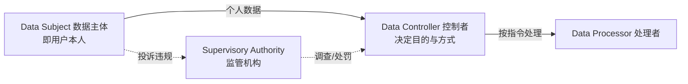
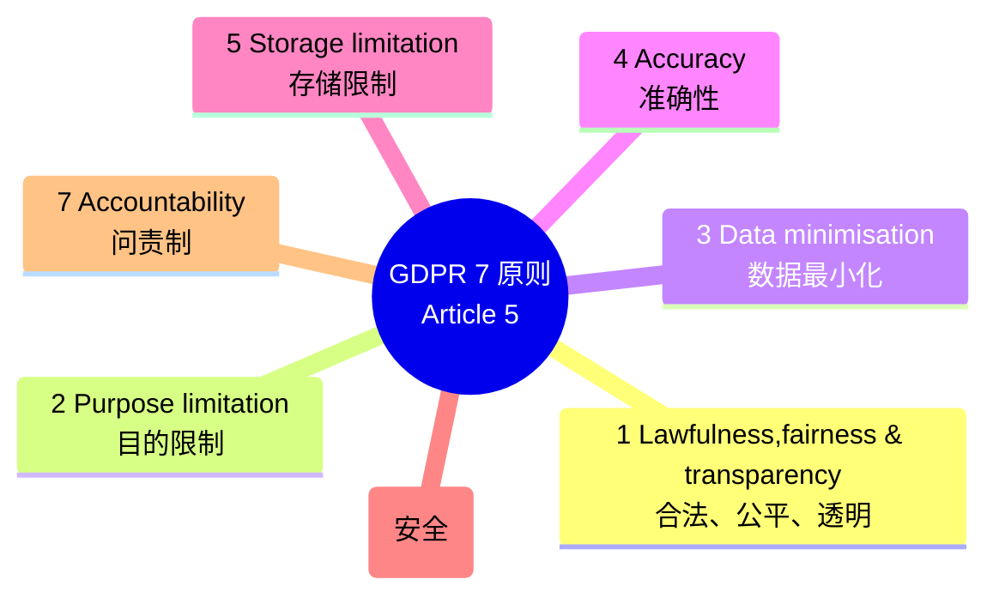

# Week 9 · 隐私问题与隐私保护技术 (Privacy Issues)

> **关于周次的说明** — 这份讲义的文件名是 **W9**,但幻灯片标题写的是 **"Week 8 – Privacy Issues"**。讲师在录音里解释了原因:之前有两周没有 lecture(为了赶进度),而原本计划分成两节、内容都偏短的 privacy 课被合并成了这一节较长的课。所以本章篇幅比平时大,但都是同一个主题。本周的 **workshop(W9-Solutions)** 正好配套本章——讲师特别强调"this week's workshop is very important",因为你会用 Python 亲手做 MPC 和 DP 的实验,而这些"will be useful for your assignment"。

> **学习目标 (Learning objectives)** — 读完本章你应该能够:
> - 用"控制"这个核心思想**解释**隐私的定义,并区分隐私的三个要素(When / How / Extent);
> - **说清**在线隐私的三大威胁(Hacking / Tracking / Trading)各自的机制;
> - **解释并手算**基于 secret sharing 的 Secure Multi-Party Computation(用平均工资的例子);
> - **区分** MPC、Federated Learning、Homomorphic Encryption、Differential Privacy 四种隐私保护技术的原理与适用场景;
> - **读懂** Differential Privacy 的形式化定义 $\Pr[M(D)\in S]\le e^{\varepsilon}\Pr[M(D')\in S]$,并说明 $\varepsilon$ 大小对隐私/精度的影响;
> - **复述** GDPR 的 7 大原则、8 项个人权利、罚款规则,以及 Australian Privacy Act 的 13 条 APPs;
> - **说明** AI 伦理为什么重要,并列举 Australia 的 8 条 AI Ethics Principles。

技术能保护数据,但"隐私"从来不只是技术问题。这一章会带你走完一条完整的链条:先搞清楚**隐私到底是什么、会被怎样侵犯**(Part 1),再看**密码学和机器学习给出了哪些技术解法**(Part 2),最后回到**法律、治理和伦理**——因为再强的技术也需要规则来约束"该不该收集、收集来干什么"(Part 3)。讲师反复提醒:这三部分"directly related to your assignment",值得认真过。

---

## Part 1 · 隐私是什么,又是怎么被侵犯的

### 1.1 隐私 = 对信息的"控制权",不是"把一切藏起来"

很多人对隐私有个误解,以为隐私就是"什么都不让别人知道"。讲师在课上特意纠正了这一点:**隐私 (privacy) 不是隐藏一切,而是一种控制力**。

> **隐私 (Privacy)** — *the ability to control what information about yourself is revealed, to whom, and under what conditions.*(对"关于你自己的哪些信息会被披露、披露给谁、在什么条件下披露"的控制能力。)

注意这个定义里藏着三个变量:**披露什么 (what)**、**披露给谁 (to whom)**、**在什么条件下 (under what conditions)**。你愿意把生日告诉朋友,但不愿意写在公开简历上——信息是同一个,变的是"给谁"和"条件"。这就是为什么隐私是"控制",而不是"全有或全无":你在不同场合,对同一条信息有不同的披露意愿。

讲师把这种控制力进一步拆成**隐私的三个要素 (three elements of privacy)**:

| 要素 | 含义 | 直觉例子(讲师原话) |
|------|------|----------|
| **When**(时间敏感性) | 当前/未来的信息往往比过去的更敏感 | 你愿意分享 5 年前的度假照片,却不愿暴露"我现在就在 Wollongong" |
| **How**(分享方式的控制) | 人们倾向**手动**分享,而非**自动**分享 | 你愿意自己挑一张照片发出去,但不希望 App 自动把你的所有照片同步上传 |
| **Extent**(精确程度) | 人们倾向给**模糊**信息,而非**精确**信息 | 别人问你在哪,你说"在 Australia",而不是"在某街某号某 suburb" |

> **🔑 例(幻灯片 QUIZ)** — *一个用户愿意分享 5 年前的度假照片,却不发当前位置更新。这体现了隐私的哪个要素?*
> 答案是 **When(时间敏感性)**。关键不在"位置"这个内容,而在"当前 vs. 过去"这个时间维度——过去的信息感觉更安全,当前/未来的更敏感。

把握住"隐私 = 控制"这个出发点很重要,因为后面 Part 2 的所有技术,本质上都是在**还给数据拥有者一部分控制权**:让你能参与一次计算、贡献你的数据,却不必把原始数据交出去。

### 1.2 在线隐私的三大威胁:Hacking、Tracking、Trading

理解了隐私是什么,下一个问题自然是:它在网络世界里**怎么被破坏**?讲师归纳为三个 "T"(其实第一个是 H,但可以一起记成"黑、追、卖")。

**Hacking(黑客入侵)** —— 攻击者通过未授权访问,进入存有个人/财务信息的设备或第三方系统。如果数据**未加密或保护不当**,就会被直接暴露。更糟的是,被盗数据还会**被复用**:拿去做钓鱼 (phishing)、诈骗 (fraud),或进一步攻陷账户。也就是说,一次入侵的危害往往不止于"这次",而是开启后续攻击的链条。

**Tracking(追踪)** —— 网站和 App 持续收集你的行为:浏览历史、你在哪个页面停留最久、你看了什么商品、你的物理位置。这些数据**本身常被用于个性化和广告**(看似无害甚至"贴心"),但同样的数据也能被滥用为**画像 (profiling)、监视 (surveillance) 或网络犯罪**。讲师点出追踪的真正可怕之处:它能把你零散的在线活动,**拼成一份关于你的完整画像**。

**Trading(数据交易)** —— 个人数据和兴趣会被收集、画像,然后**卖给第三方**。社交媒体的发帖、标签 (tags)、位置分享,往往泄露的比你以为的多。而且一旦上传,数据可能**长期留存**,被用于**超出最初目的**的用途。讲师举了个本地化的例子:你在某处注册了会员/积分账户,某天突然接到一堆不知从哪弄到你电话的推销电话——这背后很可能就是数据交易。

> 📎 **拓展(超出 slides)** — 这三类威胁恰好对应安全的两个层面:Hacking 是**外部攻击者违背你的意愿**拿走数据(机密性被攻破);而 Tracking 和 Trading 更微妙——数据常常是你"自愿"提供的,问题出在**后续如何被使用**。这也解释了为什么光靠技术防护不够,Part 3 的法规(限制"目的"和"留存")才是针对后两者的。

---

## Part 2 · 技术上的隐私保护方法

### 2.1 为什么机器学习特别需要隐私保护

为什么这一章把隐私技术几乎全部放在机器学习 (ML) 的语境下讲?因为现代 ML 天生是一件**多方协作**的事,而协作的各方**彼此并不完全信任**。

讲师的措辞很直接:"I don't trust you, you don't trust me." 一个典型的 ML 场景里会有好几类角色:

- **数据拥有者 (data owners)** —— 手里有训练数据;
- **模型拥有者 (model owners)** —— 拥有模型;
- **服务提供者 (service providers)** —— 提供算力/推理服务;
- **终端用户 (end users)** —— 拿数据来做推理。

训练数据可能在一方手里,推理数据在另一方,模型又属于第三方。这就是讲师说的:**ML is fundamentally a multi-stakeholder computation**(ML 本质上是多方利益相关者的联合计算)。

问题在于:**原始数据 (raw data) 里含有大量敏感个人信息**。如果直接共享原始数据,就会同时带来三种风险——**隐私风险、法律/政策风险、安全风险**。

> **🔑 例(ML 中的不信任,S20)**
> - 医院想用**第三方**的远程分析来处理病人数据(但不想把病历交出去);
> - 零售商想把购买到的数据变现;
> - 数据分析公司想把用户的社交媒体数据变现,**同时还要保护用户隐私**。

正是这种"既要合作、又不愿交出原始数据"的张力,催生了下面四种技术:**MPC、Federated Learning、Homomorphic Encryption (HE/FHE)、Differential Privacy (DP)**。它们是本章的技术核心。

### 2.2 Secure Multi-Party Computation(安全多方计算,MPC)

#### 问题是什么

先建立直觉。设想:**我有一个秘密 $x$,你有一个秘密 $y$,我们想一起算出 $z = f(x,y)$,但谁都不想把自己的输入交给对方。**

这就是 **Secure Multi-Party Computation(安全多方计算,简称 SMPC 或 MPC)** 要解决的问题。正式表述:

> Alice 有私有输入 $x$,Bob 有私有输入 $y$。两人想计算 $z=f(x,y)$,使得**每一方除了 $z$ 之外,得不到任何额外信息**。

几个要点:
- 两方可以推广到 **$n$ 方**,各自的私有输入是 $x_1, x_2, \ldots, x_n$;
- **函数 $f$ 本身是公开的**——所有人都知道在算什么,要保密的只是各自的输入。

> **🔑 例 1:军事卫星(H. Maji 的例子,S12)**
> A、B 两国各有一颗卫星在轨。国家 A 的 Party 1 知道自己卫星的位置和轨迹(这是它的输入),国家 B 的 Party 2 知道自己卫星的位置和轨迹(它的输入)。函数 $f$ 要算的是:**未来 20 分钟内两颗卫星会不会相撞?** 输出只有一个布尔值——会 (T) 或不会 (F)。
> 双方都想得到这个答案,**但绝不想暴露自己卫星的位置和轨迹**。

#### 难点:为什么不能直接把输入交出来

你可能会想:这有什么难的?各方把输入一报,谁都能算 $f$。讲师承认这在**正确性**上确实成立——*it is trivial to correctly evaluate $f$ if each party declares its input*。

但这**不安全**:一旦报了输入,各方学到的就**远超输出 $z$**。在卫星例子里,双方会顺便知道**对方卫星的精确位置和轨迹**!MPC 的全部难度,正来自这条**安全约束**:既要算对,又不能让任何人多学到东西。

#### 一个偷懒的解法:可信第三方 (TTP)——以及它为什么不够

最简单的办法是引入一个**可信第三方 (Trusted Third Party, TTP)**:Alice、Bob 把各自输入发给 TTP,TTP 算出 $z=f(x,y)$ 再发回两人。卫星例子里,可以让某个中立国来收两国的卫星数据,算完只告诉它们"撞 / 不撞"。

讲师一针见血:**如果真有这样一个可信第三方,安全计算就是小菜一碟。** 难就难在——**现实中往往没有可信的第三方**。"We trust them, but are you sure we should trust them?" 一旦假设不存在 TTP,MPC 就变成一个真正困难的问题。下面这个工资例子,就是在**没有 TTP** 的前提下解决问题的。

#### 例 2:三人算平均工资(无 TTP)——用 Secret Sharing

> **🔑 例 2(Boura et al.,S15)**
> Alice、Bob、Cate 三位同事想算出**三人的平均工资**,但**谁都不愿把自己的工资告诉别人**,而且**没有可信第三方**。(讲师补充:就算去问 HR,HR 也会说"这不关我的事"——所以只能他们自己算。)

解决它需要一个密码学工具:**secret sharing(秘密分享)**。

> 📎 **Secret Sharing 预备知识(S15)** — 它把一个秘密值 $s$ 拆成若干**份额 (shares)** $(s_1, s_2, \ldots, s_n)$,使得**单个或部分份额泄露不了关于 $s$ 的任何信息**。
> - **$(t, n)$-secret sharing**:拆成 $n$ 份,只有当**至少 $t$ 份**凑在一起时,才能重建原始秘密 $s$。
> - **加性 (additive)** 的方案:份额可以**直接相加**——这正是算"求和/平均"时要用到的性质。
>
> 直觉:如果 $s=100$,我只给你一份 $50$,你**无法**知道原始秘密是多少(它可能被拆成 $50+50$,也可能是 $50+30+20$……)。

现在用 **加性 $(3,3)$-secret sharing**(拆成 3 份、要 3 份才能还原)来解工资问题。每个人把自己的工资拆成 3 份:**自己留一份,另外两份分别发给另外两人**。

**第一步:各自拆分工资**(拆法随意,只要三份之和等于真实工资)

- Alice 工资 \$70K → $(\$35K,\ \$10K,\ \$25K)$,自己留 \$35K,给 Bob \$10K,给 Cate \$25K
- Bob 工资 \$60K → $(-\$20K,\ \$50K,\ \$30K)$,自己留 −\$20K,给 Alice \$50K,给 Cate \$30K
- Cate 工资 \$80K → $(-\$30K,\ \$15K,\ \$95K)$,自己留 −\$30K,给 Alice \$15K,给 Bob \$95K

**第二步:每人把"手里持有的所有份额"加起来,公开这个和**

下面这张表是理解整个协议的关键。**每一行**是一个人的工资被拆成的三份(分别落到 Alice/Bob/Cate 手里);**每一列**是某个人最终持有的三份,求和后公开:

| 真实工资(行) | Alice 持有 | Bob 持有 | Cate 持有 |
|------|------|------|------|
| \$70K (Alice) | \$35K | \$10K | \$25K |
| \$60K (Bob)   | \$50K | −\$20K | \$30K |
| \$80K (Cate)  | \$15K | \$95K | −\$30K |
| **公开的和** | **\$100K** | **\$85K** | **\$25K** |

**第三步:把三个公开的和加起来,再除以 3**

$$
\text{平均工资} = \frac{\$100K + \$85K + \$25K}{3} = \frac{\$210K}{3} = \$70K
$$

结果正确,因为 $(70+60+80)/3 = 70$。**而且整个过程中,Alice 只见过别人给她的份额(\$50K、\$15K),根本推不出 Bob、Cate 的真实工资**;Bob、Cate 同理。

#### 为什么它能work(形式化证明)

讲师给了一个简洁的代数解释,值得记住,因为它揭示了"加性份额"的精妙之处。设:

- Alice 的秘密 $S_A = S_1 + S_2 + S_3$
- Bob 的秘密 $S_B = S_1' + S_2' + S_3'$
- Cate 的秘密 $S_C = S_1'' + S_2'' + S_3''$

按协议,**三个公开的和**分别是(每人把"自己收到的第 1 / 2 / 3 类份额"加起来):

$$
\underbrace{S_1 + S_1' + S_1''}_{\text{Alice 公开 }=100K},\quad
\underbrace{S_2 + S_2' + S_2''}_{\text{Bob 公开 }=85K},\quad
\underbrace{S_3 + S_3' + S_3''}_{\text{Cate 公开 }=25K}
$$

把这三个和**全部相加**,再按份额重新分组:

$$
(S_1+S_2+S_3) + (S_1'+S_2'+S_3') + (S_1''+S_2''+S_3'') = S_A + S_B + S_C
$$

所以三个公开和之和 **恰好等于三人工资之和**,除以 3 就是平均值。关键是:**最终只暴露了"总和"这一个聚合量,任何中间份额都不泄露个人工资。**

#### 一个诚实的免责声明:MPC 不是"零泄露"

课上有学生提了个好问题:如果 Alice 算出平均是 \$70K,而她自己工资恰好也是 \$70K,她岂不是推出了"另外两人一高一低"?讲师确认:**是的,会泄露一点信息**——比如"有人比我高、有人比我低",但**推不出具体是谁、具体多少**。如果 Alice 工资是 \$80K 而平均是 \$70K,她就知道"那两人平均比我低"。

这正好呼应了 Part 1 的核心思想:**隐私是关于"控制"的程度,而不是绝对的"零泄露"。** 你要决定的是"我想保护到什么程度"。讲师也强调,这个工资例子"is not used in practice",只是用来**说明 MPC 的思想**的玩具示例(toy example)。

### 2.3 Federated Learning(联邦学习,FL)

在工资例子的基础上,把"求和"换成"训练模型",就得到了 **Federated Learning(联邦学习)**——一种建立在 MPC 之上的隐私保护 ML 技术。

> **Federated Learning** — 让多个独立实体(设备/机构)**共同训练一个 ML 模型**,方式是**汇集 (pool) 各自数据的"贡献",但不必把原始数据共享给彼此**。

直觉:数据**留在本地设备**上,每个参与方用自己的本地数据训练,**只把模型更新 (model updates) 传出去**,再由 MPC 的 **secure aggregation(安全聚合)** 把这些更新汇总。这样既能从多个数据源训练出准确的模型,又不暴露任何一方的原始数据。

> **🔑 QUIZ(S28)** — *在基于 MPC 的 Federated Learning 中,secure aggregation 的主要目的是?*
> 答案 **C:在不暴露各方单独输入的前提下,计算模型更新的和/平均。** ——这正是 MPC 思想在 FL 里的直接应用:服务器只看到聚合结果,看不到谁贡献了哪条更新。

### 2.4 Homomorphic Encryption(同态加密,HE/FHE)

MPC 让数据"留在本地",而 **Homomorphic Encryption(同态加密,HE)** 走的是另一条路:**把数据加密后交出去,让别人在密文上直接计算**。

> **Homomorphic Encryption** — 一种允许**在密文 (ciphertext) 上做计算**的加密技术。对密文做运算,得到的是**加密的结果**;把它解密后,等于直接在明文上做同样运算的结果。

它最重要的性质,用加法举例就是:

$$
E(M_1 + M_2) = E(M_1) + E(M_2)
$$

(对两条明文之和的加密,等于两条密文的"和"。)

> **🔑 例(讲师的云计算类比)** — 你的 PC 太弱,跑不动某个 ML 算法,于是想雇一个云服务来算。但你不想让云看到你的原始数据。怎么办?**把数据加密后发给云 → 云在密文上跑算法 → 返回加密的结果 → 你用自己的密钥解密,得到答案。** 全程云只见到密文,看不懂任何内容。

HE 的强大在于:它**既保护输入数据的机密性,又保护计算结果的机密性**。对比一下:在 MPC 里,最终结果(比如 \$70K 平均工资、卫星撞不撞)是**所有人都能看到的明文**;而在 HE 里,你拿到的结果也是**密文**(比如一串 "ABCD"),只有持密钥的人能解开。

代价是**效率**:讲师强调 *HE is somewhat inefficient to realize in practice*——因为它太强,目前仍然较慢,但已是隐私保护 ML 的研究热点,韩国、法国都有公司在商业化。

> 📎 **拓展(超出 slides)— 关于量子计算的提问** — 课上有学生问 HE 是否会被量子计算攻破。讲师区分了两类:**经典 HE**(基于 ElGamal、Paillier 等,依赖能被量子计算机破解的难题,且只能做很有限的运算);而 ML 里用的 HE 是**后量子 (post-quantum)、抗量子 (quantum-resistant)** 的方案——量子计算机对它目前没有有效攻击。

> **🔑 QUIZ(S29)** — *HE 要在加密数据上计算,需要具备什么性质?*
> 答案 **A:能在密文上执行算术运算(如加法/乘法)。** 注意 **C(计算时临时解密)是错的**——HE 的全部意义就在于"全程不解密"。

### 2.5 Differential Privacy(差分隐私,DP)

前面三种技术都关注"计算过程中"的数据保护;**Differential Privacy(差分隐私,DP)** 则关注**发布出去的结果**——它是隐私保护 ML 里最被看好的方向之一。

#### 它要解决什么问题

> **🔑 例:Casey 的"是否生病"调查(S25)** — 一个数据集记录每个人对"上个月你生病了吗?"的 Yes/No 回答,姓名已隐藏。现在 Casey **新加入**了这个群体,而他**从没说过自己生病**。如果调查**重新做一次**,攻击者只要**对比"说生病的人数"有没有变化**,就能猜出 Casey 的答案!
> 如果加入 Casey 前是 100 人说"生病",加入后系统返回 **101**,攻击者立刻断定 Casey 生病了——因为这个增量只能来自 Casey。

问题的本质:**即使隐藏了姓名,"一个人加入/退出数据集"对输出造成的可见变化,也会泄露这个人的信息。** 这种攻击叫**差分攻击**。

#### DP 的目标与做法

> **Differential Privacy 的目标** — 输出**无法被反推回任何个体的"在场或缺席"**;观察者看着输出,**判断不出某个特定个体的信息是否被用于这次计算**。

怎么做到?**加噪声**。

> **如何实现 DP(S24)** — 按照一个**精心选择的分布**生成随机噪声,对真实答案做**扰动 (perturbation)**,返回给用户的是"真实答案 + 噪声"。

回到 Casey 的例子:如果系统不返回精确的 101,而是返回 **102**(掺了噪声),攻击者就**无法确定**人数到底是因为 Casey 才增加的,还是噪声。注意噪声不能乱加——它**必须服从特定分布**,这样才能在保护隐私的同时,**仍然兼容有意义的数据分析**(DP 的一大优点就是"protective 却不至于让数据失去价值")。

#### 形式化定义:读懂那个不等式

DP 把上面的直觉写成了一个精确的条件。设 $D$ 是一个数据集,$D'$ 是**只相差一条记录**的数据集(比如 $D'$ 比 $D$ 多了 Casey 这一条)。一个**随机化机制 (randomized mechanism) $M$** 满足 DP,当且仅当对任意可能的输出集合 $S$:

$$
\Pr[M(D) \in S] \;\le\; e^{\varepsilon}\cdot \Pr[M(D') \in S]
$$

逐符号读这个式子:
- $M(D)$ 是机制作用在数据集 $D$ 上的(随机)输出;
- $\Pr[M(D)\in S]$ 是"输出落在 $S$ 里"的概率;
- $D$ 和 $D'$ **只差一条记录**(一个人在或不在);
- $\varepsilon$(epsilon)是**隐私损失参数 (privacy loss parameter)**,控制往原始数据里加多少噪声/随机性。

整句话在说:**"有 Casey"和"没 Casey"两个数据集,产生任意输出的概率几乎一样**——差距被限制在 $e^{\varepsilon}$ 这个倍数之内。两个分布越接近,攻击者越无法区分"Casey 在不在",隐私就越强。

> **🔑 怎么"感受"这个公式(S27)** — 把不等式两边同除以 $\Pr[M(D')\in S]$,得到:
> $$\frac{\Pr[M(D)\in S]}{\Pr[M(D')\in S]} \le e^{\varepsilon}$$
> 已知 $e\approx 2.71$。算一下不同 $\varepsilon$ 下的 $e^{\varepsilon}$:
>
> | $\varepsilon$ | $e^{\varepsilon}$ | 含义 |
> |------|------|------|
> | 0.1   | ≈ 1.105 | 两分布差约 10% |
> | 0.01  | ≈ 1.010 | 差约 1% |
> | 0.001 | ≈ 1.001 | 差约 0.1% |
> | 0.0001| ≈ 1.0001 | 几乎完全相同 |
>
> 当 $\varepsilon \to 0$,$e^{\varepsilon}\to 1$,于是 $\Pr[M(D)\in S]\approx \Pr[M(D')\in S]$——两个分布**几乎无法区分**,隐私保护最强。

**一句话记住 $\varepsilon$:** $\varepsilon$ 越小 → 加的噪声越多 → 隐私越强(但精度越低);$\varepsilon$ 越大 → 噪声越少 → 能学到的越多(隐私越弱)。

> **🔑 QUIZ(S30)** — *DP 里更小的 $\varepsilon$ 意味着什么?*
> 答案 **B:更强的隐私保证(加入更多噪声)。**

### 2.6 四种技术横向对比

这是本章最值得做成一张表的地方——讲师在课上专门口头对比了 FL / MPC 与 HE。考试很可能考"哪种技术适合哪种场景"。

| 维度 | Federated Learning + MPC | Homomorphic Encryption (HE) | Differential Privacy (DP) |
|------|------|------|------|
| **核心思想** | 数据留本地,只共享模型更新 | 在密文上计算,全程不解密 | 给发布的结果加噪声 |
| **数据位置** | 留在本地设备 | 加密后发到中心服务器 | 通常在持有方,发布时扰动 |
| **原始数据是否暴露** | 从不共享,只交换更新 | 全程以加密形式存在 | 不直接发布原始数据 |
| **隐私级别** | 高(假设半诚实方,由 MPC 增强) | 很高(一切皆密文) | 可量化(由 $\varepsilon$ 调) |
| **计算模式** | 分布式(各方在本地训练) | 集中式(全在服务器端算) | 在查询/发布环节加噪 |
| **成熟度** | 较为 production-ready | 仍偏研究阶段(较慢但进步快) | 较成熟,广泛使用 |
| **保护什么** | 训练时各方的私有输入 | 输入**和**结果都保密 | 发布结果中的个体隐私 |

> **本节小结** — MPC 让多方"算出答案却不交出输入";FL 把 MPC 用在"联合训练模型"上;HE 让你"把计算外包却连结果都加密";DP 让你"发布统计却藏住个体"。四者解决的是隐私的不同环节,常常**组合使用**。

---

## Part 3 · 治理、法规与伦理

技术能保护数据,但讲师反复强调一句话(workshop 里也单独考了):**privacy is not only a technical issue**。再强的 MPC、DP,也回答不了"这个数据该不该收集""收来干什么""能存多久""谁负责"这些问题。这些必须靠**法律、治理和伦理**来约束。Part 3 讲三套规则:欧盟的 **GDPR**、澳洲的 **Privacy Act 1988**,以及 **AI 伦理**。

### 3.1 GDPR(General Data Protection Regulation,通用数据保护条例)

#### 基础事实

> **GDPR 基础(S32)**
> - **生效日期**:2018 年 5 月 25 日;
> - **制定方**:欧盟 (EU);
> - **目的**:在所有成员国之间**统一 (harmonise)** 数据隐私法律,改变企业/组织处理"与之交互者"信息的方式;
> - **后果**:违规可能面临**巨额罚款**和**声誉损失**;
> - **地位**:被视为对"个人数据应如何被处理"的一种**进步 (progressive)** 的范式。

#### GDPR 管什么数据

GDPR 区分两个层次的数据:

- **个人数据 (Personal data)** —— **任何能识别出一个人的数据**:姓名、位置数据、在线用户名、IP 地址、cookie 标识符,**甚至假名化 (pseudonymised) 的数据**也算。
- **敏感个人数据 (Sensitive personal data)** —— 种族/民族出身、政治观点、宗教信仰、工会成员身份、基因和生物特征数据、健康信息,以及性生活或性取向相关的数据。这类受到**更严格**的保护。

#### 两类角色:Controllers vs Processors

GDPR 把所有处理个人数据的主体分成两类,这是高频考点:

| 角色 | 定义 | 关键 |
|------|------|------|
| **Controller(控制者)** | **主要决策者**,决定处理个人数据的**目的 (purposes)** 和**方式 (means)** | 义务**更严格** |
| **Processor(处理者)** | 代表控制者、**仅按控制者的指令**行事 | 义务相对较轻 |

> **🔑 例(讲师的 Spotify 例子)** — Spotify 收集用户的听歌历史,用 Google Cloud 来算推荐。这里 **Spotify 是 Controller**(它决定"为什么收集、怎么用"),**Google Cloud 是 Processor**(只按 Spotify 的指令处理数据)。

完整的数据流涉及四类实体,记住这张图有助于理解 GDPR 的运作:

> **🔑 QUIZ(S64)** — *下列哪项最准确地描述 GDPR controller?*
> 答案 **C:决定处理个人数据的目的和方式的实体。**(B"只按他方指令行事"描述的是 processor。)

#### GDPR 的 7 大关键原则(Article 5)

这是 GDPR 的核心,**必考**。讲师建议"理解而非死背"。

| # | 原则 | 含义(一句话抓住) |
|---|------|------|
| 1 | **Lawfulness, fairness & transparency** | 处理必须**合法**(有明确的 lawful basis)、**公平**(符合人们合理预期、不带不正当负面影响)、**透明**(从一开始就清楚告知由谁、如何处理数据) |
| 2 | **Purpose limitation**(目的限制) | 必须**事先明确**收集数据的目的;不能拿去做与原目的**不相容的新用途**(除非另有合法、公平、透明的依据) |
| 3 | **Data minimisation**(数据最小化) | 只收集**完成目的所必需的最少数据**,不能"以防万一"多收。例:网店让你订阅邮件,**不该**问你的政治观点 |
| 4 | **Accuracy**(准确性) | 数据必须**准确、及时更新**,不准确时要**擦除或更正**;要采取合理步骤保证准确、来源清晰 |
| 5 | **Storage limitation**(存储限制) | 能识别个体的数据,**保存时间不得超过目的所需**(科研/统计/公共利益等可适当延长,但仍须保护权利) |
| 6 | **Integrity & confidentiality**(完整性与机密性 / 安全) | 防止未授权/非法处理、意外丢失或损毁;需有适当的安全措施(如**加密**、推荐**假名化**)。GDPR 不规定具体怎么做,但要求合理的访问控制 |
| 7 | **Accountability**(问责制) | 要**记录**数据如何被处理、采取了哪些措施;包括**培训员工**、定期评估流程 |

> **🔑 关于 Accountability 的细节(S43–S44)** — 超过 **250 名员工**的公司,需要书面记录"为什么收集、收集了什么、保存多久、有哪些技术安全措施"。此外,**大规模、系统性地监控个人**或处理大量敏感数据的组织,必须任命一名 **DPO(Data Protection Officer,数据保护官)**——他要向高管汇报、监督合规、并作为员工和客户的联系人。讲师举例:大学需要 DPO,但一家外卖小店不需要。

> **🔑 QUIZ 串讲(S65–S67)** —
> - 收集邮箱本是为了发**订单确认**,后来想拿去做**无关的政治广告** → 违反 **Purpose limitation**(目的限制)。
> - "只收集当前服务所需的个人数据" → 最能体现 **Data minimisation**。
> - "加密敏感数据 + 适当的访问控制" → 最符合 **Integrity and confidentiality**(关键词:confidentiality ↔ encryption)。

#### 个人的 8 项权利

> **GDPR 赋予个人的 8 项权利(S45)**
> 1. 被告知权 (right to be informed)
> 2. 访问权 (right of access)
> 3. 更正权 (right to rectification)
> 4. 擦除权 (right to erasure,"被遗忘权")
> 5. 限制处理权 (right to restrict processing)
> 6. 数据可携权 (right to data portability)
> 7. 反对权 (right to object)
> 8. 关于自动化决策与画像的权利 (rights around automated decision making and profiling)

其中两项讲师重点讲了:

- **访问权(Right of access)** —— 个人可以发起 **Subject Access Request (SAR)**,要求得知某公司/组织掌握了关于自己的什么信息。回复 SAR 须包含:① 确认正在处理其个人数据;② 一份该个人数据的副本(除非有豁免);③ 相关补充信息(为何处理、如何使用、保存多久)。**时限:必须在一个月内回复。** 很多大科技公司都建了数据门户供用户下载自己的信息。
- **自动化处理 / 擦除 / 可携权** —— 个人**有权不被纯自动、且对其产生重大影响的决策所左右**,并有权获得对该决策的解释;在某些情况下有权要求**擦除**自己的数据;**可携权 (data portability)** 指数据应能从一个服务转移到另一个服务。讲师举的例子:Facebook 能把你的照片自动转到 Google Photos——这来自 **Data Transfer Project**(Apple、Google、Facebook、Twitter、Microsoft 共建)。

#### 违规与罚款

> **GDPR 罚款规则(S48)** — 监管者可对不合规企业处以重罚。会被罚的情形包括:① 未以正确方式处理个人数据;② 应设 DPO 却没有;③ 发生安全泄露。
> - **较轻违规**:最高 **€10 million 或全球营业额的 2%**(取**较高**者);
> - **最严重违规**:最高 **€20 million 或全球营业额的 4%**(取**较高**者)。

> **🔑 例:Google 被罚 €50M(S49)** — GDPR 之前,监管者很难开出巨额罚单(调查冗长复杂,出错还会被告上法庭)。GDPR 之后,迄今最大罚单之一是**法国数据保护监管机构 CNIL** 对 **Google 罚款 €50 million(约 A\$75m)**。两个原因:① Google 没有充分告知用户,它如何使用从 **20 个不同服务**获取的数据;② 未就处理用户数据获得**适当的同意 (consent)**。

### 3.2 Australian Privacy Act 1988(澳洲隐私法)

欧洲有 GDPR,**澳洲对应的是 Privacy Act 1988**——这对你(在澳洲读书)更切身。

> **Privacy Act 1988(S51)** — 澳洲保护个人信息处理的**主要立法**,涵盖**联邦公共部门和私营部门**对个人信息的**收集、使用、存储和披露**。曾在 **2014 和 2017 年**重大修订以加强隐私保护。

它的基石是 **13 条 Australian Privacy Principles (APPs,澳洲隐私原则)**。讲师强调两个特点:**principle-based(基于原则的)**——给组织灵活性,可按自身业务模式裁剪;**technology neutral(技术中立)**——能适应技术变化。违反任一 APP 即构成对个人隐私的侵犯,可招致监管处罚。

> **13 条 APPs(S54–S57,记住分组比死背更有效)**
>
> **A. 治理与透明(APP 1–2)**
> 1. **Open and transparent management**——以公开透明方式管理个人信息(须有清晰、最新的隐私政策)
> 2. **Anonymity and pseudonymity**——须给个人"不表明身份"或"用化名"的选项(有限例外)
>
> **B. 收集(APP 3–5)**
> 3. **Collection of solicited personal information**——何时可收集主动征集的个人信息(对"敏感"信息标准更高)
> 4. **Dealing with unsolicited personal information**——如何处理**非主动征集**得到的个人信息
> 5. **Notification of collection**——收集时须在何种情形下告知个人哪些事项
>
> **C. 使用与披露(APP 6–9)**
> 6. **Use or disclosure**——在何种情形下可使用或披露所持有的个人信息
> 7. **Direct marketing**——只有满足特定条件,才能将个人信息用于直销
> 8. **Cross-border disclosure**——向境外披露个人信息前必须采取的保护步骤
> 9. **Government related identifiers**——仅在有限情形下可采用/使用/披露政府相关标识符
>
> **D. 完整性与访问(APP 10–13)**
> 10. **Quality of personal information**——须采取合理步骤保证信息准确、最新、完整
> 11. **Security of personal information**——保护信息免遭滥用、干扰、丢失及未授权访问;某些情形须销毁或去标识化
> 12. **Access to personal information**——个人请求访问其信息时实体的义务(除特定例外须提供)
> 13. **Correction of personal information**——更正所持个人信息的义务

> 📎 **拓展 — GDPR vs Privacy Act 速记** — 两者都管"个人信息的收集、使用、存储、披露",但 GDPR 用 **7 原则 + 8 权利**框架、罚款以"营业额百分比"计;澳洲用 **13 条 APPs** 框架,基于原则、技术中立。考试若问"澳洲的隐私法",答 **Privacy Act 1988 + 13 APPs**。

### 3.3 Ethical AI(AI 伦理)

法规之外,还有伦理。随着 AI 渗透进影响隐私的应用(如人脸识别),"AI 伦理"的讨论越来越多。

#### 核心问题:不透明 + 偏见

讲师点出 AI 伦理里一个最知名的问题:**AI 算法如何做出推断 (deductions) 往往不透明**。算法是个黑盒,你很难知道它的训练数据里**是否含有偏见 (bias)**,以及这种偏见在得出结论时起了什么作用。

> **🔑 例:用面部判断"快乐程度"(S60)** — 假设要设计一个系统,根据面部特征判断一个人有多快乐。它需要在涵盖各种**种族、年龄、性别**组合的数据上训练。但即便能覆盖所有人群,**我们又凭什么毫无疑问地定义"快乐长什么样"?** 讲师的结论:**bias 是 AI 的主要问题之一**,因为 AI 的开发总是基于研究者的**主观选择**,这使得"造出一个完全中立的系统"几乎不可能。AI 伦理就是要正视这个问题。

而且 AI 伦理"不仅关乎技术的**应用**,也关乎 AI 的**结果和预测**"——一个会影响人的决策(如医疗诊断),它是否考虑了人类会考虑的伦理因素,常常并不清楚。

#### Australia 的 8 条 AI Ethics Principles

> **目的与收益(S61)** — 澳洲的 8 条 AI 伦理原则,旨在确保 AI **安全、可靠、可信**,为所有澳洲人带来更安全、更公平的结果,降低 AI 的负面风险。收益包括:建立公众信任、增强消费者忠诚、对 AI 结果产生正面影响。

| # | 原则 | 含义 |
|---|------|------|
| 1 | **Human, societal & environmental wellbeing** | AI 应造福个人、社会与环境 |
| 2 | **Human-centred values** | AI 应尊重人权、多样性、个人自主 |
| 3 | **Fairness** | AI 应包容、可及,不得造成不公平歧视 |
| 4 | **Privacy protection & security** | AI 应尊重并维护隐私权与数据保护,确保数据安全 |
| 5 | **Reliability & safety** | AI 应可靠地按其预期目的运行 |
| 6 | **Transparency & explainability** | 应有透明与负责任的披露,让人知道自己何时被 AI 显著影响、何时在与 AI 交互 |
| 7 | **Contestability** | 当 AI 显著影响某人时,应有及时的流程让人**质疑**其使用或结果 |
| 8 | **Accountability** | AI 生命周期各阶段的责任人应可识别、可问责,并保证人类监督 |

> **🔑 QUIZ(S68)** — *哪条澳洲 AI 伦理原则最直接关乎"当 AI 显著影响人时让系统可被理解"?*
> 答案 **B:Transparency and explainability(透明与可解释性)。**

> **🔑 QUIZ(Workshop Part C)** — *与隐私保护 AI 最相关的澳洲 AI 伦理原则是哪条?* —— **Privacy protection and security**,因为 AI 系统应尊重隐私权、保护数据、使用适当的安全保障。

---

## Part 4 · Workshop 实践(W9 Lab)——把概念变成代码

讲师说本周 workshop "very important",因为它把 Part 2 的两个核心技术(MPC 和 DP)落到了 Python 代码上,并直接服务于 assignment。下面是 W9-Solutions 的要点。

### 4.1 Part A · 三种技术的目标 + 医院场景

| 技术 | 主要目标 | 在"多家医院"场景中的用法 |
|------|------|------|
| **MPC** | 多方共同计算一个函数;各方输入保密;只学到最终输出 | 多家医院**联合计算一个统计量**(如病例总数/平均),无需互相暴露原始病历 |
| **HE/FHE** | 在加密数据上计算;计算中数据保持加密;解密后结果与明文计算一致 | 医院把数据**加密后发给外部服务器**,服务器在密文上计算,看不到原始病历(适合**外包计算**) |
| **DP** | 保护发布结果中的个体隐私;返回带噪声的答案;让人难判断某人是否在数据集中 | 发布**计数/平均/趋势**等结果时加噪,使输出不暴露单个病人(适合**报表/仪表盘/公开统计**) |

> **🔑 关键判断题(Q7)** — *哪种技术最直接关乎"保护已发布的答案"?* —— **DP**,因为它聚焦于**释放出去的输出**的隐私,目标是隐藏单条记录对最终答案的影响。

### 4.2 Part B1 · MPC 秘密分享代码(对应 2.2 工资例子)

代码逻辑(`share_secret(s)` 把秘密拆成三份加性份额):
- 每个人的工资被**单独**拆成三份;
- 每个人从每个人那里**各持有一份**;
- 每个人**公开自己手里份额的和**;
- 三个公开和相加 = 工资总和;除以 3 = 平均工资。

> **🔑 Reflection 答案**
> - **Q1 为什么单独一份份额泄露不了完整工资?** 因为一份只是"和"的一部分,缺了其它份额;单份**确定不了**原始秘密。
> - **Q2 为什么公开和又能还原平均?** 因为三个公开和**合起来包含了所有人的所有份额**,相加即重建总和,除以 3 得平均。
> - **Q3 相比直接共享工资的隐私好处?** 各方不暴露原始工资,只交换份额,**减少了私有数据的直接暴露**。
> - **Q4 这个玩具模拟相比真实 MPC 的局限?** 它只是 toy example,**没有建模恶意方、协议失败或更强的安全保证**;真实 MPC 协议复杂得多,需要更严谨的安全设计。

### 4.3 Part B2 · DP 噪声代码(对应 2.5 的 $\varepsilon$)

代码逻辑:
- 数据集是一堆 Yes/No 回答;`true_count` 是真实的 Yes 数(本例 **= 6**);
- `laplace_noise(scale)` 生成随机噪声,**噪声 scale 设为 $1/\varepsilon$**;
- 程序尝试多个 $\varepsilon$ 值;
- **关键点:系统不发布精确答案,而是发布加噪后的版本。**

> **🔑 预期观察 & Reflection**
> - 真实计数每次运行**不变**;加噪后的计数**每次都不同**(机制是随机化的)。
> - $\varepsilon$ **大** → 噪声小 → 加噪答案通常**更接近**真值;$\varepsilon$ **小** → 噪声大(scale $=1/\varepsilon$ 变大)→ 答案**波动更大**。
> - **更小的 $\varepsilon$ 的代价:隐私更强,但准确度更低**——这就是 DP 的 privacy–accuracy trade-off。
> - **为什么宁可返回带噪答案?** 为降低暴露某个体的风险、让人更难推断"某人是否在数据集里",同时仍提供有用的答案。

### 4.4 Part C · 治理反思(为什么技术还不够)

> **🔑 核心论点(Workshop 总结)** — **隐私既需要技术工具,也需要治理原则。** 因为隐私不只是技术问题:组织仍需规则来决定**能收集什么、为什么收集、保存多久、谁负责**。
> - **Purpose limitation 的例子**:即使用了强隐私技术,公司仍可能把数据**挪作无关新用途**——为医疗分析收集的数据,不应在没有适当依据时被重用于**定向广告**。
> - **Data minimisation 的例子**:即便系统用了 MPC 或 DP,也应**只收集必需数据**——健身 App 若只需步数,就不该收集精确位置历史。
> - **Accountability**:隐私技术**不能替代**文档、监督和治理——总得有人对数据的收集、处理、保护、共享负责。

---

## Part 5 · 考试相关

### 讲师给的 5 道练习题(S69)及作答要点

讲师强调"理解即可,不要求逐字背诵定义":

1. **解释 GDPR 的 "accountability" 原则** → 记录个人数据如何被处理、采取了哪些措施;含员工培训、定期评估;大公司须有文档、可能须设 DPO。
2. **解释 GDPR 的 "data minimisation" 原则** → 只收集完成目的所必需的最少个人数据,不能多收。
3. **GDPR 下,个人要查询某组织掌握自己什么信息,需要发起什么?** → **Subject Access Request (SAR)**,须一个月内回复。
4. **什么是 Privacy Act 1988?有多少条 APPs?列举 3 条并简述。** → 澳洲保护个人信息处理的主要立法;**13 条 APPs**;例如 APP 1(公开透明管理)、APP 11(信息安全)、APP 12(访问权)。
5. **澳洲有几条 AI 伦理原则?列举 2 条并简述。** → **8 条**;例如 "Fairness"(不得不公平歧视)、"Transparency and explainability"(可解释)。

### 重要通知(S70 / 录音)

| 事项 | 内容 |
|------|------|
| **Quiz 3** | 在 **Week 11** 的 lab 进行;范围 = **Week 7–10 的 lectures 和 workshops**(把这几周的讲义和 workshop 都过一遍) |
| **Assignment** | **截止 5 月 29 日(周五)23:30**;本周内容对作业很有帮助,问题 1 中有 4 个小题可由本周 lecture + lab 作答;可用 ChatGPT **但必须声明**,且须自己写解答 |
| **AC(Academic Consideration)** | 如不能按时交或参加 quiz,**务必提前**正式申请 AC(workshop 开始前申请才有效),并附合理理由;紧急情况可邮件联系讲师 |

---

## 本章小结 (Key takeaways)

- **隐私 = 对"披露什么/给谁/在什么条件下"的控制权**,而非"藏起一切";其三要素是 **When(时间)、How(方式)、Extent(精确度)**。
- 在线隐私的三大威胁是 **Hacking(入侵窃取)、Tracking(行为追踪 → 画像)、Trading(数据交易)**;后两者常是"自愿提供、后续被滥用",所以需要法规约束。
- **MPC** 让多方算出 $z=f(x_1,\dots,x_n)$ 却互不暴露输入;**有可信第三方时很容易,没有时才困难**;加性 **secret sharing** 是经典实现(平均工资例子:拆份额 → 各持一份 → 公开和 → 求平均)。
- MPC **不是零泄露**:聚合结果本身可能透露少量信息(谁高谁低),但藏住具体个体值——这呼应"隐私是控制的程度"。
- **四种技术分工**:**Federated Learning**(数据留本地、只传模型更新)、**Homomorphic Encryption**(密文上计算、输入与结果都加密,但慢)、**Differential Privacy**(给发布结果加噪声、由 $\varepsilon$ 量化)。
- **DP 核心不等式** $\Pr[M(D)\in S]\le e^{\varepsilon}\Pr[M(D')\in S]$:$D$ 与 $D'$ 只差一条记录;**$\varepsilon$ 越小,两分布越难区分,隐私越强但精度越低**(workshop 里 noise scale $=1/\varepsilon$)。
- **GDPR**(EU,2018-05-25):区分 **Controller / Processor**;**7 大原则**(合法公平透明、目的限制、数据最小化、准确、存储限制、完整与机密、问责)+ **8 项权利**(含 SAR,一个月内回复);罚款 **€10M/2%** 或 **€20M/4%**;Google 曾被 CNIL 罚 **€50M**。
- **澳洲 Privacy Act 1988** 以 **13 条 APPs** 为基石,**基于原则、技术中立**,覆盖个人信息的收集/使用/存储/披露。
- **AI 伦理**的核心难题是**不透明 + 偏见**(完全中立的系统几乎不可能);**澳洲 8 条 AI Ethics Principles** 中,"Transparency and explainability" 关乎可理解性,"Privacy protection and security" 关乎隐私保护。
- **一句话贯穿全章**:隐私**既需要技术工具(MPC/HE/DP),也需要治理与伦理(GDPR/APP/AI ethics)**——两者缺一不可。
