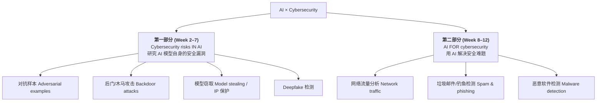
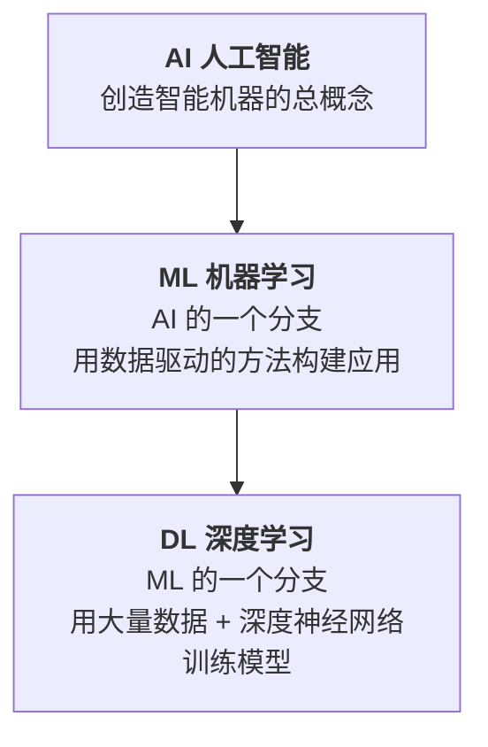
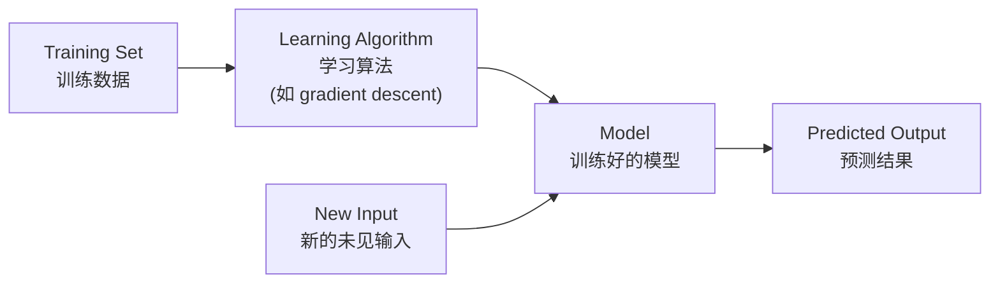
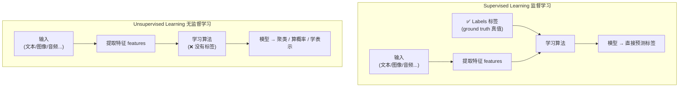
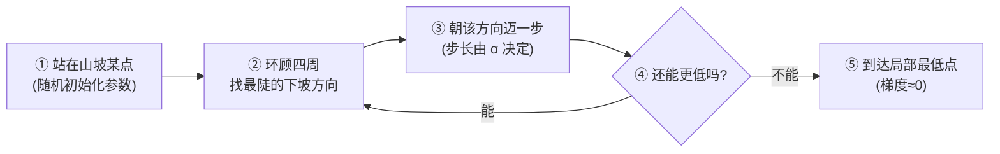
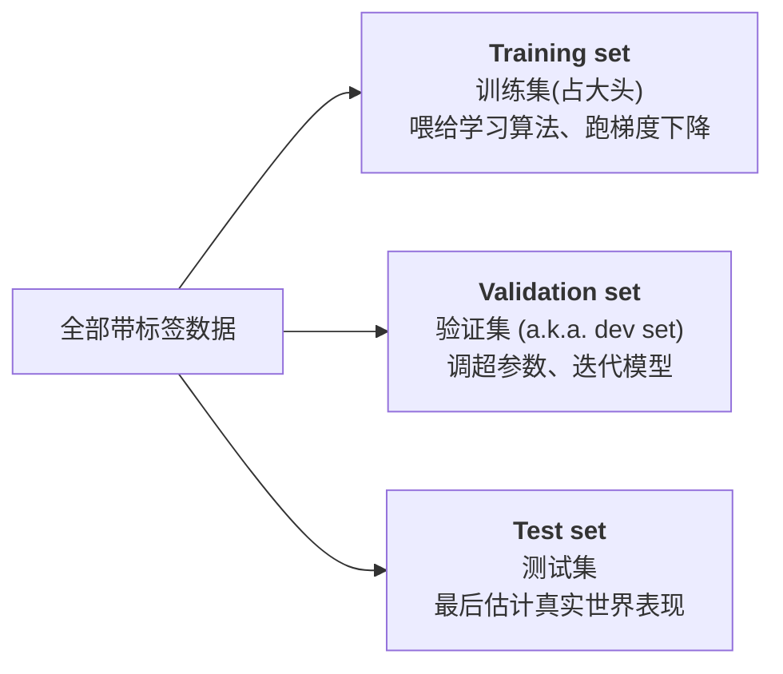
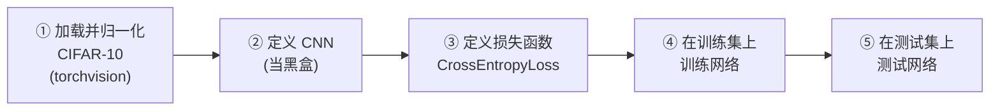

# Week 1 · 课程导论与 AI 基础 (Introduction and AI Basics)

> **CSIT375/975 — AI and Cybersecurity** · Dr Wei Zong · University of Wollongong

> **学习目标 (Learning objectives)** — 读完本章你应该能够:
> - **解释**这门课的两条主线——"AI 模型自身的安全风险"与"用 AI 解决安全问题"——并说出它们的区别;
> - **区分** AI / Machine Learning / Deep Learning 三者的包含关系;
> - **说清楚**机器学习"训练→预测"的完整流程,并区分 classification / regression / clustering、supervised / unsupervised;
> - **推导并解释** cost function 与 gradient descent 的核心思想:为什么沿梯度反方向走能让损失下降,learning rate 起什么作用;
> - **计算** accuracy / precision / recall / F1,读懂 confusion matrix,并说明为什么 accuracy 在不平衡数据上会骗人;
> - **复述** PyTorch 标准训练流程(zero_grad → forward → backward → step)并理解每一步在干什么。

这门课站在一个有点特别的十字路口:**人工智能 (AI)** 和**网络安全 (cybersecurity)** 的交叉地带。它不要求你成为会从零搭建神经网络的 AI 专家,但要求你能把 AI 模型当成一个"会犯错、能被攻击、也能帮你防守"的对象来研究。第一周的任务,就是把后面 12 周都要反复用到的 AI 基础——什么是模型、模型怎么学、怎么判断它学得好不好、怎么用代码把它跑起来——一次性打牢。本章内容看似零散,其实是一条完整的链:**先理解机器学习在做什么 → 再看它具体怎么"学"(梯度下降)→ 然后学会评判学习的结果(评估指标)→ 最后用 PyTorch 把这一切落到代码上。**

---

## 一、这门课到底在研究什么:两种"AI × 安全"

要理解整门课的定位,先看一张图。很多人以为"AI 和安全"就是"用 AI 来抓黑客",但这门课的视角要更广——它把这件事拆成**方向相反的两半**:



**第一部分**里,你扮演的是**安全研究者**:你怀疑 AI 模型本身有漏洞,然后想办法攻破它。讲师明确说过,这部分比第二部分**更难**,因为你要"钻进模型内部去找它的安全问题"。**第二部分**里,你的身份切换成**AI 实践者 (AI practitioner)**:模型本身没问题,你只是拿它当工具,去解决网络入侵、钓鱼邮件这类安全任务——数据集换成了安全领域的数据,但做的还是标准 AI 的事。

为了让你直观感受"第一部分"为什么存在,讲师举了两个后面会展开的例子,这里先建立印象:

> **🔑 例 (Worked example) — 一只被"改写"的熊猫**
> 一个在线图像分类器看到一张熊猫照片,说"这是 panda,置信度 57.7%"。你可能觉得 57.7% 不高,但要知道总共有 1000 个类别,**随机瞎猜每个类别只有 0.1%**,所以 57.7% 其实相当自信,而且答案是对的。现在,我们给这张图叠加一层**精心计算过、再乘以一个很小系数缩小**的噪声 (noise)。叠加后的新图,人眼看上去和原图**一模一样**,还是熊猫。可把它再喂给同一个模型,模型却信誓旦旦地说"这是 gibbon(长臂猿),置信度 99%"。这就是 **adversarial example(对抗样本)**——只靠人眼察觉不到的微小扰动,就能把分类器骗得团团转(Week 2 详述)。

> **🔑 例 — 会"看错路牌"的自动驾驶**
> 一张自动驾驶摄像头拍到的图,明明是 **stop sign(停车标志)**,模型却以 94% 的高置信度判成"限速标志"。罪魁祸首是路牌上被人贴的一小块奇怪的黄色方块——这正是 Week 4 要讲的 **backdoor / Trojan 攻击**留下的"触发器"。后果可能是致命的。

这两个例子说明:**最先进的 AI 模型也可能在攻击下犯下离谱且危险的错误。** 这就是第一部分的研究对象。而要研究这些攻击与防御,你必须先懂 AI 的基本运作——这正是本章其余部分的内容。

---

## 二、课程信息与考核(速查)

这一节是事务性的,但考核规则直接关系到你的成绩,值得记牢。整门课的学习哲学有一句话要划重点:

> 📎 **关键理念(黑盒哲学)** — 本课**几乎把所有 AI 模型当成 black box(黑盒)**。讲师反复强调:你**不需要**理解模型内部机制(卷积层、全连接层都不用管),只需要知道**"输入是什么、输出是什么"**,以及**训练的基本流程 (pipeline) 和如何评估模型**。所有模型(经典架构)都会提供给你,你不用自己设计。整门课围绕这个"高层理解"展开——这也解释了为什么后面看到 CNN 代码时,讲师说"把它当黑盒就行"。

| 项目 | 内容 |
|---|---|
| **讲师** | Dr Wei Zong · wzong@uow.edu.au · 答疑:周三/周五 15:00–17:00,room 3.208 |
| **结构** | 13 讲(12 个主题 + 1 复习)· 6 个 lab(纯指导式编程,不录像)· 录像上传 Moodle |
| **工具** | Python + **PyTorch**(不是 TensorFlow)· 平台 **Kaggle**(每周 30 小时免费 GPU,周六早晨 UTC 重置,需验证手机号)· 也可本地用 Anaconda + Jupyter/VSCode/PyCharm,但需自己配环境 |
| **先修** | 熟悉 Python(必需);AI 基础(加分但非必需);无需高级数学,但要懂 **gradient** 等基本概念,会用 Python 工具做计算(如 t-test) |
| **考核** | Lab test 1 (5%) · Lab test 2 (10%) · Assignment 1 (15%) · Assignment 2 (20%) · **Final exam (50%)** |
| **题型** | Lab test = 选择 + 判断(开卷、线上、限时,可在截止前任意时间地点做);Assignment = 编程 + 解释;**Final exam = 选择 + 简答,无编程、无计算** |
| **及格线** | 期末考至少 **40%(20/50)** **且** 总分至少 **50/100**,二者缺一不可 |
| **迟交** | 每天扣总分 5%;超过 7 天记 0 分;交错文件 = 迟交;迟 1 秒算迟 1 天 |
| **学术诚信** | 全部查重;**禁止**抄袭、买代写、用 AI 生成答案;Kaggle 上的解答要设为 private,公开了被人抄你俩都可能 0 分。可自由复用/修改 lab 代码 |

> 📎 **拓展(超出 slides)** — 关于"开卷却限时"的潜台词:lab test 1 限时 20 分钟、lab test 2 限时 35 分钟。讲师特别提醒,虽然开卷,但**时间不够你逐题去翻讲义**,所以仍要提前准备好。Lab test 1 覆盖 Lecture 1–3。

---

## 三、AI、ML、DL:三个同心圆

打好基础,先把三个最常被混用的词分清。它们不是并列关系,而是**层层包含**的同心圆:



- **AI (Artificial Intelligence,人工智能)** 是最宽泛的概念——*"创造智能机器"*这件事本身。它不限定用什么方法。
- **ML (Machine Learning,机器学习)** 是 AI 的一个**分支**:不再靠人手写死规则,而是用**数据驱动 (data-driven)** 的算法,让程序从数据里"学"出规律。
- **DL (Deep Learning,深度学习)** 是 ML 里的一种**具体技术**:用**大量数据**和**深度神经网络 (deep neural networks)** 来训练模型。本课第一部分研究的攻击对象,大多就是 DL 模型。

记住这个嵌套关系:**所有 DL 都是 ML,所有 ML 都是 AI,反之不成立。** 接下来我们聚焦中间那一层——机器学习。

---

## 四、机器学习到底在做什么

上一节说 ML 是"数据驱动",但这四个字太抽象。把它讲透:

**机器学习,就是把一个数学模型 (mathematical model) 拟合 (fit) 到一份给定的数据集(称为 training set,训练集)上,然后用这个拟合好的模型,去预测任何新的、没见过的输入的答案。** 这句话里有两个阶段——**先训练 (train),后预测 (predict)**——构成机器学习的骨架:



那"学"这个动作具体是怎么发生的?讲师用了一个最朴素的例子,值得完整体会:

> **🔑 例 — 用一条直线拟合数据**
> 假设你有一堆散点,想用一条直线去描述它们的趋势。最简单的直线是 $y = mx$,这里 $x$ 是输入(自变量),$m$ 是**参数 (parameter)**。一开始你随便给 $m$ 一个值,画出来的线离散点很远——**误差 (error) 很大**。于是你调整 $m$,线挪近一点,误差小一点;再调,再小……**"不断改变参数、直到误差最小"这个过程,就叫学习 (learning)。** 用来自动完成这种参数调整的算法之一,就是后面要重点讲的 **gradient descent(梯度下降)**。等参数调好了(误差最小了),你就得到了一个训练好的模型,可以拿它去预测新的 $x$ 对应的 $y$。

把这个直觉一般化,就是机器学习的核心思路(对应 slide 18):
1. 先选一个**通用模型 / 假设 (hypothesis)**(比如"我假设数据可以用一条直线拟合");
2. 不断**调整它的参数**,直到误差最小;
3. 这个过程叫**学习**;调参用的算法叫 **gradient descent**;
4. 学完后,模型就能**预测未见过的值**。

这里埋下了一个关键问题:**"误差最小"到底怎么量化?调参又凭什么知道往哪调?** 这正是第八、九节(cost function 与 gradient descent)要回答的。但在那之前,先把"机器学习能解决哪些任务"理清。

---

## 五、机器学习的三类任务:分类、回归、聚类

我们已经知道 ML 是"用历史数据造一个能预测未来的算法",但"预测"具体可以是什么?根据输出的形式,分成三大类。这套分类在安全场景里天天用到:

| 任务 | 干什么 | 输出 | 安全场景例子 |
|---|---|---|---|
| **Classification(分类)** | 判断新数据点属于**哪一类** | 离散的类别标签 | **binary(二分类)**:这个软件是合法还是恶意?<br/>**multiclass(多分类)**:这是 ransomware / keylogger / 远控木马(RAT)中的哪种? |
| **Regression(回归)** | 预测一个**实数值** | 连续的数值 | 预测某员工本月会收到多少封钓鱼邮件(一个数字) |
| **Clustering(聚类)** | 在没有标签时,找出**哪些数据彼此相似** | 把数据分成若干组 | 网站流量里,哪些是 botnet、哪些是正常用户? |

**分类 vs 回归**的区别在输出:分类输出"类别",回归输出"数值"。注意这是一个常考点。

**聚类**则是另一回事,它不靠预先给定的标签。讲师给了一个很形象的几何直觉:

> **🔑 例 — 把流量画进空间里**
> 想象把每条网络流量映射成二维平面上的一个点。正常用户的行为彼此相似,会聚成一团 (cluster)。某天来了一批新流量,它们被映射到**离正常团很远**的地方——你立刻就能怀疑:这些可能是恶意流量。这就是聚类思想:**不需要谁告诉你哪些是恶意,你靠"相似的聚在一起、异常的离得远"自己分组。**

为什么聚类不需要标签,而分类回归需要?这就引出下一个关键划分。

---

## 六、监督学习 vs 无监督学习:标签是分水岭

上一节的分类和回归,都假设训练数据**带着正确答案**;而聚类不需要。这背后是机器学习最重要的一条分界线——**有没有 label(标签)**。



- **Supervised learning(监督学习)**:训练时给定一批 **(feature, label) 配对**,模型的任务是学出一条规则,对**新的、没见过的输入**预测它的标签。比如:给你一堆已标好 *spam / ham* 的邮件,训练一个垃圾邮件分类器,然后判断新邮件是不是垃圾。**标签是监督学习的灵魂**——正因为训练时知道正确答案,模型才能被"纠错"。
- **Unsupervised learning(无监督学习)**:只给一堆**特征向量,没有标签**,目标是把它们**分组 (cluster)**、或算出某种概率/表示 (representation)。比如:网络里冒出一批未知 botnet,你没法事先给它们贴标签,只能靠无监督方法把它们彼此区分开。

> 📎 **拓展(超出 slides,源自课堂问答)** — *哪种计算量更大?* 讲师的回答是:在问题规模相近时,**无监督学习通常更贵**。因为没有标签的"指引",学习任务本质上更难。一个绝佳的现实佐证是当今的**大语言模型 (LLM)**:它们大多是**无监督地**在海量无标注的互联网文本/图像上训练的,光电费就要数百万美元。反过来,监督学习因为有标签当"向导",同等规模下计算量更小。

到这里,机器学习的"概念地图"已经齐全:它做什么(拟合+预测)、有哪些任务(分类/回归/聚类)、按标签分成哪两类(监督/无监督)。下面用一个**端到端的真实例子**把这些串起来。

---

## 七、一个完整的例子:用机器学习检测欺诈交易

光讲概念容易飘,讲师用一个**欺诈交易检测 (fraud detection)** 的小项目,把"从原始 CSV 到评估模型"的全流程走了一遍。这是一个 **supervised + binary classification** 的任务,务必跟着走完——它把前面所有概念落地了。

**任务设定**:训练一个模型,从交易数据中识别欺诈交易。
- **数据集**:在线购物交易,共 **39,221 条**,每条 **5 个属性 (features)**,外加一个**二元标签**:`1`(fraudulent,欺诈)或 `0`(normal,正常)。
- 数据存在 **CSV 文件**里,第一行是每列的名字(account age、本地时间、商品数、支付方式……)。

### 第 1 步:准备数据 (Prepare the data)

用 **pandas**(Python 最常用的数据处理库)一行代码读入 CSV:

```python
import pandas as pd
df = pd.read_csv("transactions.csv")
df.sample(3)   # 随机看 3 行
```

读进来后做两件清理:

1. **丢掉无意义的列**。第一列往往是**交易的序号 (numerical index)**,它只是数据维护用的编号,对预测毫无价值,要 `drop` 掉。
2. **处理类别型变量 (categorical variable)**。大多数列是数值(如 200、4.7),模型能直接吃;但有些列是**文字类别**,比如"支付方式 = store credit / PayPal / 信用卡"。模型没法直接处理文字,必须先转成数字。

### 关键技巧:One-hot encoding(独热编码)

怎么把"支付方式"这种文字类别变成数字?最容易想到的笨办法是:store credit = 0、PayPal = 1、信用卡 = 2。**但这是错的**,讲师专门强调了为什么:

> 如果直接用 1、2、3,你就**悄悄塞进了一个本不存在的数学假设**——"信用卡 (3) 比 PayPal (1) 大,而且是它的 3 倍"。可"支付方式"之间根本没有大小、倍数关系,这种假设是**毫无意义的 (meaningless)**,会误导训练。

正确做法是 **one-hot encoding**:为每个取值**单独开一列二元 (binary) 特征**,每行恰好有一个位置是 1、其余是 0。

| 原始 payment_method | → is_credit | is_PayPal | is_store_credit |
|---|---|---|---|
| 信用卡 | 1 | 0 | 0 |
| PayPal | 0 | 1 | 0 |
| store credit | 0 | 0 | 1 |

这样做的好处是**任意两个类别之间的"距离"都相等**。把 `100`、`010`、`001` 想象成三维空间里的三个点,你会发现它们两两之间的距离完全一样——**没有谁离谁更近**,也就不会引入"谁更大/更接近"的虚假假设。

> 📎 **拓展(课堂问答里的两个延伸点)**
> - **多于两个类别怎么办?** 有 $N$ 个不同取值,就开 $N$ 列二元特征,规则不变(4 个取值就 4 列,以此类推)。
> - **理论 N 列,实践 N−1 列。** 讲师补充:理论上 one-hot 是 $N$ 列,但**实践中通常只用 $N-1$ 列**。因为如果前 $N-1$ 列全是 0,就已经唯一确定了"必然是最后那个类别",最后一列是冗余的。lab 里你会亲手验证这一点。

### 第 2 步:切分数据 + 训练 (Apply a supervised algorithm)

把数据**随机**切成训练集和测试集,比例 **0.67 : 0.33**(即约 2/3 训练、1/3 测试)。特征切成 `X_train` / `X_test`,标签按**同样比例**切成 `y_train` / `y_test`:

```python
from sklearn.model_selection import train_test_split
X_train, X_test, y_train, y_test = train_test_split(
    df.drop("label", axis=1), df["label"], test_size=0.33)
```

然后套用一个**监督学习算法**——这里用 **logistic regression(逻辑回归)**。本课把它当**黑盒**:你只要知道"它能做二分类",不用管内部:

```python
from sklearn.linear_model import LogisticRegression
clf = LogisticRegression().fit(X_train, y_train)   # 一行代码完成训练
```

> 📎 **拓展(超出 slides)** — logistic regression 直觉:别被"regression"骗了,它其实是个**分类**模型。它先算一个加权和,再通过一个 S 形的 sigmoid 函数把结果压到 $[0,1]$,当作"属于正类的概率"。概率 > 0.5 就判为正类。本课不要求会推导,但知道"它输出的是概率"有助于理解下一步。

### 第 3、4 步:预测 + 评估 (Predict & Evaluate)

```python
y_pred = clf.predict(X_test)
```

> **务必牢记的原则** — **训练时绝不能碰测试集**。`clf` 在训练阶段从未见过 `y_test`,所以 `y_pred` 完全是"从训练集学到的泛化能力"的产物。如果你拿测试集去训练,模型很容易"背答案",轻松刷到 100% 准确率——但那是**作弊**,因为它已经偷看了答案。

最后用 **confusion matrix(混淆矩阵)** 评估(下一大节会展开它的定义)。这个例子的结果:**只有 1 个错分**——1 笔欺诈交易没被抓到;189 笔欺诈被正确标记;12,753 笔正常交易被正确识别。

**模型的实际使用**:对任何一笔新进来的交易,模型给出"它是欺诈的概率"。注意整个"学预测算法"的复杂过程,已经被 scikit-learn 抽象成了一个 API 调用 `LogisticRegression.fit()`——这正呼应了本课的黑盒哲学。

这个例子留下一个悬念:`fit()` 内部到底在优化什么?它凭什么"知道"哪组参数最好?答案就是下面两节。

---

## 八、怎么知道模型学好了:代价函数 (Cost Function)

回到第四节的悬念。我们说训练就是"调参数直到误差最小",但有两个问题没解决:**(1) 模型一开始的参数从哪来?(2) "误差最小"用什么来量?**

第一个问题简单:我们通常用**随机参数 (random parameters)** 初始化模型。第二个问题的答案,就是本节主角——**cost function(代价函数)**。

**Cost function** 又叫 **loss function(损失函数)** 或 **error function(误差函数)**,本课**三者不加区分,通用**。它的作用是:**把一对"输入和输出"映射成一个实数**,这个实数就是"代价"。核心规则只有一句:

> **代价越低,参数越好 (the lower the cost, the better the parameters)。**

于是训练的目标可以精确地表述为:**找到一组模型参数,使得它对训练集给出的预测,让 cost function 取到最小值。**

举个最常见的代价函数——**mean squared error(MSE,均方误差)**,它衡量"预测值离真实值有多远":

$$ J(\theta) = \frac{1}{N}\sum_{i=1}^{N}\bigl(\hat{y}_i - y_i\bigr)^2 $$

逐项读一遍:$y_i$ 是第 $i$ 个样本的真实值,$\hat{y}_i$ 是模型的预测值,二者相减就是这条样本的误差;平方是为了让正负误差都变成正贡献、并放大大误差;对所有 $N$ 条样本求平均,就得到整体代价 $J(\theta)$。$\theta$ 代表模型的全部参数——**调 $\theta$ 让 $J(\theta)$ 变小,就是训练。**

现在问题变得非常具体:**给定一个 $J(\theta)$,怎么找到让它最小的 $\theta$?** 这就是 gradient descent 登场的时刻。

---

## 九、梯度下降:沿着山坡往下走 (Gradient Descent)

**Gradient descent(梯度下降)** 是本章——也是整门课——最重要的算法。它通用到能训练图像分类、语音转文字等几乎所有 ML/DL 模型。要讲透它,必须先补一个数学概念:**gradient(梯度)**。

### 9.1 先搞懂 gradient(梯度)是什么

> 📎 **拓展(讲师假定的高中数学前置)** — 回忆一下**导数 (derivative)**:对单变量函数 $y = f(x)$,导数 $\frac{dy}{dx}$ 描述函数在某点的**变化率**(切线斜率)。梯度就是导数在多变量上的推广。

**Gradient** 这个词,专用于**有多个输入、单个输出(一个标量 scalar)** 的函数,比如 $J(\theta_0, \theta_1, \theta_2, \dots)$。它和导数表达的是同一件事——**变化率**——只是名字不同:

| | 单变量函数 $f(x)$ | 多变量函数 $J(\theta_0,\theta_1,\dots)$ |
|---|---|---|
| 变化率叫 | **derivative(导数)** | **gradient(梯度)** |
| 形态 | 一个数(标量) | 一个**向量 (vector)** |

梯度是个**向量**,记作:

$$ \nabla_{\theta} J(\theta) = \left( \frac{\partial J}{\partial \theta_0},\ \frac{\partial J}{\partial \theta_1},\ \frac{\partial J}{\partial \theta_2},\ \dots \right) $$

把符号读出来:那个倒三角 $\nabla$ 念作 **nabla**;$\nabla_\theta J$ 表示"$J$ 关于参数 $\theta$ 的梯度"。向量里的每个分量 $\frac{\partial J}{\partial \theta_i}$ 叫 **partial derivative(偏导数)**——它衡量"只动 $\theta_i$ 这一个参数时,$J$ 怎么变"。**梯度向量的元素个数 = 参数个数**:模型有 100 万个参数,梯度就是个 100 万维的向量。

梯度有两条关键性质,直接决定了梯度下降怎么工作:

1. **梯度指向函数增长最快的方向。** 把所有参数沿梯度方向移动,会让函数值产生**最大幅度的增加**(这有严格的数学证明)。
2. **在局部极小/极大点,梯度为零。** 就像抛物线 (parabola) 顶点处导数为 0 一样——在那种地方,没有任何一个"唯一的上升方向"。

### 9.2 梯度下降:朝相反方向走

现在把梯度和 cost function 接起来。我们的目标是**减小** $J(\theta)$,可梯度指向的是函数**增大**最快的方向。所以——

> **训练时要朝梯度的反方向走。** 沿梯度方向 = 函数增大最快(我们不要);**沿梯度反方向 = 函数减小最快(steepest descent,最陡下降)**,这正是我们想要的。

这给出梯度下降的**更新规则**,本课的核心公式:

$$ \theta_j \;:=\; \theta_j \;-\; \alpha\,\frac{\partial J(\theta)}{\partial \theta_j} $$

逐符号解释:对每个参数 $\theta_j$,用它当前的值,**减去**(注意这个**减号**就是"朝反方向"的来源)它的偏导数乘以一个系数 $\alpha$。这里的 $\alpha$ 是 **learning rate(学习率)**——它控制**每一步迈多大**。$\alpha$ 太小(如 0.001)就一小步一小步挪,慢;太大可能一步迈过头。对所有参数同时这样更新,整体效果就是"参数沿梯度反方向移动一步"。然后**重复直到收敛 (repeat until convergence)**。

> ⚠️ **考点伏笔** — 这里是**减号**(训练、最小化损失)。讲师预告:Week 2 生成对抗样本时,有时会把减号换成**加号**——因为那时目标反过来,是要**增大**损失去骗模型。

### 9.3 下山的直觉

把这一切想象成**下山 (coming down a mountain)**:



代价函数 $J$ 就是一片高低起伏的**地形 (landscape)**(可能是百万维的)。给定一组参数值,你就站在这片地形的某个点上。你环顾四周,找到**最陡的下坡方向**(也就是梯度的反方向),迈一步,到新位置,再环顾、再迈步……直到四周再没有下坡路,你就到了一个**局部最小值 (local minimum)**。

### 9.4 凸 vs 非凸:为什么两次训练结果不一样

这里有个微妙但重要的点:**你最后停在哪,取决于你从哪出发。**

- 如果代价函数是**凸函数 (convex function)**(MSE 就是一个例子),它的地形像一个光滑的大碗,**只有唯一的全局最小值 (global minimum)**。无论从哪初始化,梯度下降最终都会滑到同一个碗底。
- 但**深度学习的损失函数大多是非凸的 (non-convex)**,地形坑坑洼洼,有很多局部最小值和**平台 (plateau)**。运气好,你滑到一个很深的谷底;运气不好,初始化的位置让你卡在一个较高的平台上,出不来。

> **🔑 例 — 为什么同样的代码跑两次,模型不一样?**
> 这正解释了一个你在 lab/assignment 里一定会遇到的现象:**完全相同的代码,训练两次,得到两个略有不同的模型。** 因为每次随机初始化的起点不同,在非凸地形上就可能滑向不同的终点。深度学习的优化结果,带有一定的随机性。

> 📎 **拓展(超出 slides)** — 实际训练几乎不用最朴素的梯度下降,而用它的**变体 (variants)**:**Adam**(本课 lab/assignment 的默认选择)、**gradient descent with momentum** 等。它们用更聪明的方式调整步长和方向,但**核心思想都是"沿梯度反方向下降"**。本课只讲最基本的版本。

### 9.5 把它用起来:训练一个恶意软件分类器

> **🔑 例 — 梯度下降训练 malware 分类器**
> 流程是一个循环:喂给模型一个已知样本(比如一个 botnet 或 ransomware 样本)→ 模型给出预测 → 用 cost function 算出损失 → 跑一步 gradient descent 更新参数 → 换下一个样本,重复。反复多轮后,模型逐渐"学会" ransomware 和 botnet 在数据中的模式。训练完成后,给它一个**未知**的恶意软件,它就能做出正确预测。这就是"训练→预测"骨架的真实运转。

至此我们能训练模型了。但训练完,怎么判断它**到底好不好**?这就需要一整套评估指标。

---

## 十、怎么评价一个模型

我们会用四个指标:**accuracy、不同类型的错误、precision & recall、F-score**。为了讲清楚,先准备两个玩具数据集(注意:**我们不训练模型,只把模型当黑盒来评估它们的输出**):

- **医疗数据集**:1000 名病人,**10 个 'sick'(患病)+ 990 个 'healthy'(健康)**。目标:根据特征预测诊断。
- **邮件数据集**:100 封邮件,**40 'spam'(垃圾)+ 60 'ham'(正常)**。目标:预测标签。

### 10.1 Accuracy(准确率)——以及它如何骗人

**Accuracy** 是最简单的指标:**模型预测正确的比例。**

$$ \text{Accuracy} = \frac{\text{预测正确的样本数}}{\text{样本总数}} $$

比如在 1000 个测试样本上对了 900 次,accuracy = 900/1000 = 90%。

**但 accuracy 在不平衡数据 (imbalanced data) 上会严重误导。** 讲师抛了一个经典问题:

> **能不能造一个毫无用处、却有 99% 准确率的"冠状病毒预测器"?**
> 能。回忆医疗数据集:990 健康、10 患病。造一个**只会说"healthy"**的傻瓜分类器(甚至只需一行 `print("healthy")`)。1000 次里它错 10 次(漏掉所有病人)、对 990 次——**accuracy = 99%!** 可它毫无价值:一个病人都没查出来。

问题出在哪?**accuracy 被数量更多的那一类(这里是健康人)主导了**,所以它会偏袒这种"投机取巧"的 trivial classifier。更深一层的教训是:**错误不是生而平等的 (errors are not created equal)**——把一个癌症病人误判为健康,远比把健康人误判为患病代价高。要捕捉这种差异,就得把"错误"拆开来看。

### 10.2 四种结局:TP / TN / FP / FN

我们把**患病 = positive(正类)**。模型的每个预测,落进四个格子之一。记忆窍门:**"false/true"说的是模型对不对,紧跟其后的"positive/negative"说的是模型判成了什么。**

| 术语 | 含义 | 医疗例子 | 垃圾邮件例子(positive = spam) |
|---|---|---|---|
| **TP** True Positive | 正类样本,被正确判为正 | 病人 → 判为患病 ✅ | 垃圾邮件 → 判为 spam ✅ |
| **TN** True Negative | 负类样本,被正确判为负 | 健康人 → 判为健康 ✅ | 正常邮件 → 判为 ham ✅ |
| **FP** False Positive | 负类样本,被**错**判为正 | 健康人 → 误判为患病 ❌ | 正常邮件 → 误判为 spam ❌ |
| **FN** False Negative | 正类样本,被**错**判为负 | 病人 → 误判为健康 ❌ | 垃圾邮件 → 误判为 ham ❌ |

读法演示:**False Negative** = 模型说的是 "Negative(健康/ham)",但这个判断是 "False(错的)",所以真相是正类——一个病人被漏掉了。这个拆字法能让你在考场上不靠死记就还原每个术语。

### 10.3 Confusion Matrix(混淆矩阵)

把这四个数排进一张表,就是 **confusion matrix**——一种把模型表现可视化的标准布局:

- **行 (rows) = 真实标签 (label)**;**列 (columns) = 预测 (prediction)**;
- **对角线上的元素 = 分类正确**(TP、TN);**非对角线 = 分类错误**(FP、FN)。

```
                  预测 Predicted
                Positive   Negative
真实   Positive   TP         FN
Label  Negative   FP         TN
```

用这四个量,accuracy 可以写成(分子是所有正确预测=对角线,分母是全部预测):

$$ \text{Accuracy} = \frac{TP + TN}{TP + TN + FP + FN} $$

> **🔑 例 — 用混淆矩阵揭穿"傻瓜模型"**
> 还是那个"全判健康"的模型,在 1000 人(10 病 / 990 健康)上:
>
> ```
>              预测患病   预测健康
> 真实患病       TP=0      FN=10
> 真实健康       FP=0      TN=990
> ```
> accuracy = (0+990)/1000 = 99% 看着很美。但混淆矩阵一眼暴露问题:**FN=10,它制造了太多 false negative(漏诊)**——10 个病人全漏了。accuracy 藏起来的东西,混淆矩阵让它无所遁形。

### 10.4 Recall(召回率)与 Precision(精确率)

为了不被 accuracy 骗,需要两个更细的指标。讲师反复强调:**别死记公式,记住含义,公式自然就能写出来。**

**Recall(召回率)= 在所有真实为正的样本里,被正确揪出来的比例。**

$$ \text{Recall} = \frac{TP}{TP + FN} $$

为什么分母是 $TP+FN$?因为"所有真实为正的样本"就在混淆矩阵的**第一行**(被正确抓的 TP + 被漏掉的 FN)。recall 高,意味着**漏报少**——对"漏掉一个病人/一封钓鱼邮件代价极高"的场景至关重要。
- 对上面的傻瓜模型:recall = $0/(0+10) = 0$。accuracy 99% 但 recall 为 0,它的无用一目了然。

**Precision(精确率)= 在所有被判为正的样本里,判对的比例。**

$$ \text{Precision} = \frac{TP}{TP + FP} $$

分母是 $TP+FP$,因为"所有被判为正的样本"在混淆矩阵的**第一列**(判对的 TP + 误报的 FP)。precision 高,意味着**误报少**——你说是 spam 的,基本真的是 spam。

> **🔑 例 — precision/recall 完整算一遍(spam model 1)**
> 一个垃圾邮件模型(100 封:40 spam / 60 ham),混淆矩阵如下:
> ```
>            预测 spam   预测 ham
> 真实 spam     TP=30      FN=10
> 真实 ham      FP=5       TN=55
> ```
> - **Accuracy** = (30+55)/100 = **85%**
> - **Precision** = 30/(30+5) = 30/35 = **85.7%** ← "我判成 spam 的 35 封里,30 封真是 spam"
> - **Recall** = 30/(30+10) = 30/40 = **75%** ← "40 封真垃圾邮件里,我抓住了 30 封"
>
> 对照 slide:还有个 spam model 2,**accuracy 同样 85%,但 precision 只有 77.7%**。这说明**accuracy 相同的两个模型,precision/recall 可以差很多**——单看 accuracy 完全分不出高下。

### 10.5 F-score:把 precision 和 recall 合二为一

新问题来了:模型 A 的 recall 高但 precision 低,模型 B 反过来,**到底谁更好?** 两个指标各执一词,没法直接比。于是人们发明了 **F-score**,把二者揉成一个数。最常用的是 **F1 score**:

$$ F_1 = 2 \cdot \frac{\text{Precision} \cdot \text{Recall}}{\text{Precision} + \text{Recall}} $$

**F1 给 precision 和 recall 同等权重。** 想要一个 precision、recall 都均衡的好模型,就**最大化 F1**。F1 越高,模型越好。

> **🔑 例** — 接上面 model 1(P=85.7%, R=75%):$F_1 = 2 \times \frac{0.857 \times 0.75}{0.857 + 0.75} \approx 0.80$,即 **F1 ≈ 80%**。一个数就同时反映了误报和漏报的平衡。

> 📎 **拓展(超出 slides)** — F1 其实是 precision 和 recall 的**调和平均 (harmonic mean)**,而非普通平均。调和平均的特点是"偏向较小者":只要 precision 和 recall 有一个很低,F1 就会被拉得很低——这正是我们想要的"不许偏科"。更一般地有 $F_\beta = (1+\beta^2)\frac{P \cdot R}{\beta^2 P + R}$,$\beta=1$ 就退化成 $F_1$;$\beta>1$ 更看重 recall,$\beta<1$ 更看重 precision。

把本节的评估指标汇总成一张速查表(positive 为关注类):

| 指标 | 公式 | 一句话含义 | 什么时候特别重要 |
|---|---|---|---|
| Accuracy | $\frac{TP+TN}{\text{全部}}$ | 整体对的比例 | 数据**平衡**时;不平衡时会骗人 |
| Recall | $\frac{TP}{TP+FN}$ | 真阳里抓住多少 | 怕**漏报**(漏诊、漏掉攻击) |
| Precision | $\frac{TP}{TP+FP}$ | 报阳里对了多少 | 怕**误报**(误杀正常邮件) |
| F1 | $2\frac{PR}{P+R}$ | 二者的均衡 | 要同时兼顾误报和漏报 |

---

## 十一、怎么切分数据:Train / Validation / Test

上一节我们"评估"模型时反复强调"用没见过的数据"。但要做到这一点,必须在一开始就把数据**正确地切分**。在监督学习里,我们手上是一批**带标签**的数据(账号注册、用户登录、邮件等),目标是造一个能**基于过去预测未来**的模型——所以必须**留出一部分带标签数据,假装它是"未来"**,用来检验模型。标准做法是随机切成**三份**:



| 数据集 | 用途 | 关键纪律 |
|---|---|---|
| **Training set(训练集)** | 占大多数,输入给学习算法,跑 gradient descent 更新参数 | 模型的参数从这里学 |
| **Validation set(验证集 / development set)** | 评估并迭代模型,**调超参数**(如 learning rate) | 训练中可反复看;某些任务可省略 |
| **Test set(测试集)** | 拿到最优模型后,用它估计**真实世界、未见数据**上的表现 | **训练全程绝不碰**,只在最后用一次 |

为什么 test set 必须"全程不碰、只用一次"?因为一旦你在训练/调参中反复用它,你就会**针对测试集过拟合 (overfitting)**——模型变得擅长这一份特定测试题,而非真正泛化。

> 📎 **拓展(讲师补充)** — 这就是为什么 **Kaggle 等深度学习竞赛会把 test set 保密**:防止参赛者反复试探测试集、靠"刷题"作弊或过拟合。同时讲师也提到,如今训练数据越来越大,**有些任务可以不要 validation set**。

> ⚠️ **注意区分两套"二分 vs 三分"** — 第七节的欺诈例子里只切了 train/test 两份(没有 validation),那是因为没有需要调的超参数;一旦你要调 learning rate 之类的东西,就需要 validation set 来三分。

---

## 十二、代码框架:PyTorch 实战

理论讲完,落到代码。本课用 **PyTorch**。这一节把"训练一个图像分类器"的标准流程走一遍——它就是你 lab 和 assignment 里要反复用的模板,也是考试可能考的"标准训练 pipeline"。

### 12.1 Tensor:PyTorch 的数据基石

**Tensor(张量)** 是 PyTorch 里一种专门的数据结构,和数组、矩阵很像。直觉上:**把 tensor 当成矩阵的高维推广**——矩阵是二维表格,tensor 可以是 3D、4D、5D……。在 PyTorch 里,模型的**输入、输出、以及参数本身,全都用 tensor 表示**。

Tensor 和 Python 里另一个常用结构 **NumPy 的 ndarray** 非常像,API 几乎一致,而且能自由互转。但有一个关键区别:

| | NumPy `ndarray` | PyTorch `Tensor` |
|---|---|---|
| 运行硬件 | **只能用 CPU** | **能用 GPU**(或其他加速器) |
| 定位 | 通用科学计算库 | 深度学习,需要 GPU 加速大规模张量运算 |
| 互转 | `torch.from_numpy(arr)` → tensor | `tensor.numpy()` → ndarray(通常需先 `detach()`) |

GPU 这一点是 tensor 存在的理由:训练深度模型的海量张量运算,CPU 根本算不动。

### 12.2 CIFAR-10:贯穿全课的数据集

本课大量使用 **CIFAR-10** 这个基准数据集。`10` 指 **10 个类别**:airplane、automobile、bird、cat、deer、dog、frog、horse、ship、truck。每张图大小 **3×32×32**——即 **3 通道(彩色)、32×32 像素**的小图。下周第一个 lab 你就会在它上面训练你的第一个模型。

### 12.3 标准训练流程(五步)



**第 ① 步:加载与归一化。** 用 `torchvision`(PyTorch 的计算机视觉模块)。**归一化 (normalize)** 指把图像处理成**均值 0、标准差 1**:

```python
import torchvision.transforms as transforms
transform = transforms.Compose([
    transforms.ToTensor(),                                  # 先把图像转成 tensor
    transforms.Normalize((0.49, 0.48, 0.45), (0.25, 0.24, 0.26))  # 每个通道的均值、标准差
])
batch_size = 32   # 一次迭代(iteration)消耗一批(batch)数据

trainset = torchvision.datasets.CIFAR10(root='./data', train=True,  download=True, transform=transform)
trainloader = torch.utils.data.DataLoader(trainset, batch_size=batch_size, shuffle=True,  num_workers=2)
testset  = torchvision.datasets.CIFAR10(root='./data', train=False, download=True, transform=transform)
testloader  = torch.utils.data.DataLoader(testset,  batch_size=batch_size, shuffle=False, num_workers=2)
```

`DataLoader` 负责把数据集分批载入内存;`shuffle=True` 让**每个 epoch 都打乱顺序**(测试集 `shuffle=False`,无需打乱)。

**第 ② 步:定义 CNN(黑盒)。** 按黑盒哲学,看不懂卷积细节没关系,**只需知道:输入图像 → 输出 10 个类别的分数**:

```python
class Net(nn.Module):
    def __init__(self):
        super().__init__()
        self.conv1 = nn.Conv2d(3, 6, 5)
        self.pool  = nn.MaxPool2d(2, 2)
        self.conv2 = nn.Conv2d(6, 16, 5)
        self.fc1 = nn.Linear(16 * 5 * 5, 120)
        self.fc2 = nn.Linear(120, 84)
        self.fc3 = nn.Linear(84, 10)         # 最后输出 10 个类别
    def forward(self, x):
        x = self.pool(F.relu(self.conv1(x)))
        x = self.pool(F.relu(self.conv2(x)))
        x = torch.flatten(x, 1)              # 除 batch 维外全部展平
        x = F.relu(self.fc1(x))
        x = F.relu(self.fc2(x))
        x = self.fc3(x)
        return x

net = Net().to(torch.device('cuda:0'))   # 把模型放到 GPU 上;net(data) 会自动调用 forward
```

### 12.4 训练循环:本课最该背下来的代码模板

**第 ③④ 步:定义损失 + 训练。** 这段循环是**标准训练 pipeline**,务必理解每一步:

```python
criterion = nn.CrossEntropyLoss()              # 图像分类广泛使用的损失
optimizer = optim.Adam(net.parameters(), lr=0.001)   # Adam:梯度下降的常用变体

net.train()                                    # 切到训练模式
for epoch in range(2):                          # 把整个数据集过 2 遍(2 个 epoch)
    for data in trainloader:                    # 每个 epoch 由多个 iteration 组成
        inputs, labels = data
        optimizer.zero_grad()                   # ① 梯度清零(否则会错误累加)
        outputs = net(inputs)                   # ② forward:前向计算预测
        loss = criterion(outputs, labels)       #    用损失函数算 cost
        loss.backward()                         # ③ backward:算出对各参数的梯度
        optimizer.step()                        # ④ 按 Adam 公式更新参数
```

把这四步对应回第九节就豁然开朗了——**它就是梯度下降在代码里的样子**:

| 代码 | 在做什么 | 对应理论 |
|---|---|---|
| `optimizer.zero_grad()` | 梯度清零 | 防止上一轮梯度累加(PyTorch 默认累加) |
| `outputs = net(inputs)` | 前向传播 | 模型做预测 $\hat{y}$ |
| `loss = criterion(...)` | 算损失 | 计算 cost function $J(\theta)$ |
| `loss.backward()` | 反向传播 | 计算梯度 $\nabla_\theta J$ |
| `optimizer.step()` | 更新参数 | 执行 $\theta_j := \theta_j - \alpha\frac{\partial J}{\partial\theta_j}$ |

> **关键术语区分** — **Epoch**:把整个训练集完整过一遍。**Iteration**:处理一个 batch。一个 epoch 包含多个 iteration。上面的代码只训练了 2 个 epoch,所以准确率会偏低。

### 12.5 第 ⑤ 步:保存/加载模型 + 测试

```python
PATH = './cifar_net.pth'
torch.save(net.state_dict(), PATH)             # 保存训练好的权重(对 assignment 很有用)

net = Net().to(torch.device('cuda:0'))         # 新建一个模型
net.load_state_dict(torch.load(PATH, weights_only=True))   # 载入权重

net.eval()                                     # 切到评估模式
correct, total = 0, 0
with torch.no_grad():                          # 评估时不需要梯度,关掉可加速、省内存
    for data in testloader:
        images, labels = data
        outputs = net(images)                  # 这些输出叫 logits
        _, predicted = torch.max(outputs, 1)   # 取 logits 最大的那个类别作为预测
        total += labels.size(0)
        correct += (predicted == labels).sum().item()
print(f'Accuracy: {100 * correct // total} %')
```

几个必须记住的细节:
- **`net.train()` vs `net.eval()`**:训练和评估要切换模式(某些层在两种模式下行为不同)。
- **`torch.no_grad()`**:评估时不算梯度,**加速并省内存**。
- **logits**:模型最后一层的原始输出分数;**最大 logit 对应的类别就是预测结果**(`torch.max`)。
- **保存权重**对 assignment 极其有用——避免每次都从头训练。`torch.save()` 也能存任意 tensor(比如你生成的攻击样本)。

---

## 十三、课程代码库、Kaggle 与拿分实务

最后是工程实务。本课提供一个**代码库 (codebase)**,所有 lab 和 assignment 都基于它,**你必须学会用它**:

| 组件 | 作用 |
|---|---|
| `model_trainer.py`(**ModelTrainer**) | 提供覆盖全课所有任务的模型训练支持,**务必通读、学会使用** |
| 2 个经典模型 | 贯穿全课使用 |
| `poisoned.py` | 为 backdoor 攻击定义"投毒"数据集 |
| `subset.py` | 只用数据集的一部分,加速实验 |
| 对抗攻击模块 | 用于 Assignment 2 |
| 标准训练 pipeline | 即第 12 节那套流程的实现 |

**Kaggle 使用要点**:codebase 默认上传到 `/kaggle/input/datasets/{username}/uowaisecurity-codebase`(可改,但要改 ipynb 第一个 cell)。**预训练模型 (pretrained models)**:lab 里可选用(省算力,也可自己从头训);**assignment 里必须用提供的预训练模型**,以保证所有学生评分一致。

> ⚠️ **保分红线**
> - Assignment 编程部分按 **TDD(测试驱动开发)** 设计:跑一下就能立刻看到分数,但**这是你能拿到的上限**,marker 会人工复查"是否违反假设"再扣分。例:**用模型权重去算梯度,而 instruction 明确禁止**(这关系到 Week 2 的 white-box / black-box 攻击),会被扣分。
> - **改动 marking criteria / task 本身 → 该部分 0 分。** 通常你只需要改数据/模型的路径。
> - Kaggle 解答**设为 private**;公开 = 被抄 = 双方可能 0 分。

> **如何在这门课成功(讲师原话提炼)** — **Practice, practice, practice!** AI 是极其实践的学科。需要更多教程就看官方 PyTorch tutorials。Lab test 开卷但限时,提前准备;答案截止后才公布。Lab/assignment 有疑问问 tutor(tutor 给 assignment 打分);对分数不服可先与 tutor 申诉,仍不满可邮件讲师并抄送 tutor。

---

## 本章小结 (Key takeaways)

- **这门课有两条主线**:Week 2–7 研究 **AI 模型自身的安全风险**(对抗样本、后门、模型窃取等,你是安全研究者,较难);Week 8–12 用 **AI 解决安全问题**(垃圾邮件、恶意软件、流量检测,你是 AI 实践者)。贯穿全课的理念是**把模型当黑盒**——只关心输入输出、训练流程和评估,不抠内部机制。
- **AI ⊃ ML ⊃ DL**:三者层层包含。机器学习 = 把数学模型拟合到训练集,再对未见数据预测;任务分 **classification(出类别)/ regression(出数值)/ clustering(无标签分组)**;按有无标签分 **supervised / unsupervised**。
- **训练的本质是优化**:用 **cost function(= loss = error function)** 量化"模型有多差",目标是把它**最小化**;**代价越低,参数越好**。
- **Gradient descent 是核心算法**:gradient 是多变量函数的变化率(一个向量),指向函数**增长最快**的方向;所以训练时沿其**反方向**走最陡下降。更新规则 $\theta_j := \theta_j - \alpha\frac{\partial J}{\partial\theta_j}$ 中,$\alpha$ 是 **learning rate(步长)**,**减号**表示在减小损失。凸函数(如 MSE)有唯一全局最小值;深度学习多为非凸,**初始化不同 → 结果不同**。
- **评估别只看 accuracy**:它在**不平衡数据**上会被多数类主导而骗人(全判健康也能 99%)。要看 **confusion matrix** 和拆出来的 **TP/TN/FP/FN**:**Recall = TP/(TP+FN)**(防漏报)、**Precision = TP/(TP+FP)**(防误报)、**F1 = 2PR/(P+R)**(两者均衡,要最大化)。
- **数据要三切**:**Training**(学参数)/ **Validation**(调超参数)/ **Test**(只在最后估真实表现,全程不碰,防过拟合);竞赛常把 test set 保密。
- **PyTorch 标准训练循环**要背下来:`zero_grad → forward → loss → backward → step`,它就是梯度下降的代码化。**Tensor** 像能跑 GPU 的 NumPy;区分 **epoch(过完整数据集一遍)与 iteration(一个 batch)**、**train()/eval() 模式**、评估时用 **no_grad()**、用 **torch.max(logits)** 取预测类别。本课用 **CIFAR-10**(10 类、3×32×32),lab/assignment 基于提供的 **codebase**,跑在 **Kaggle** 上。
