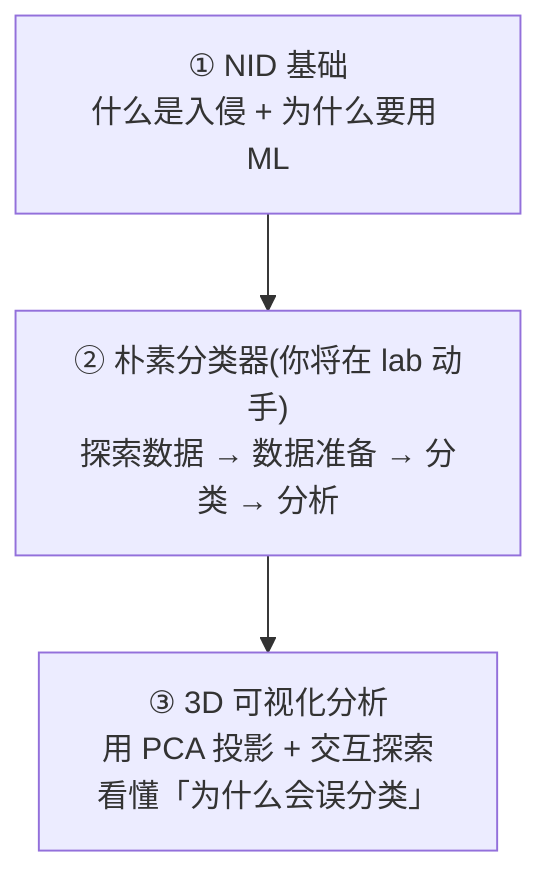
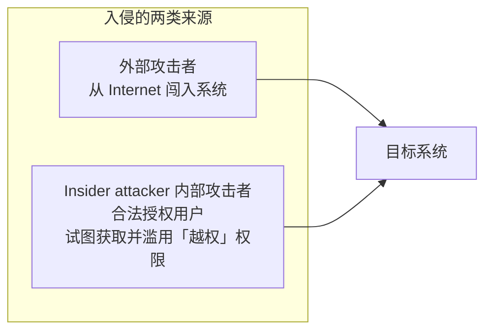
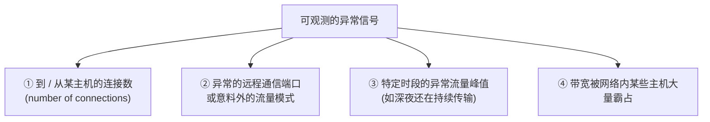
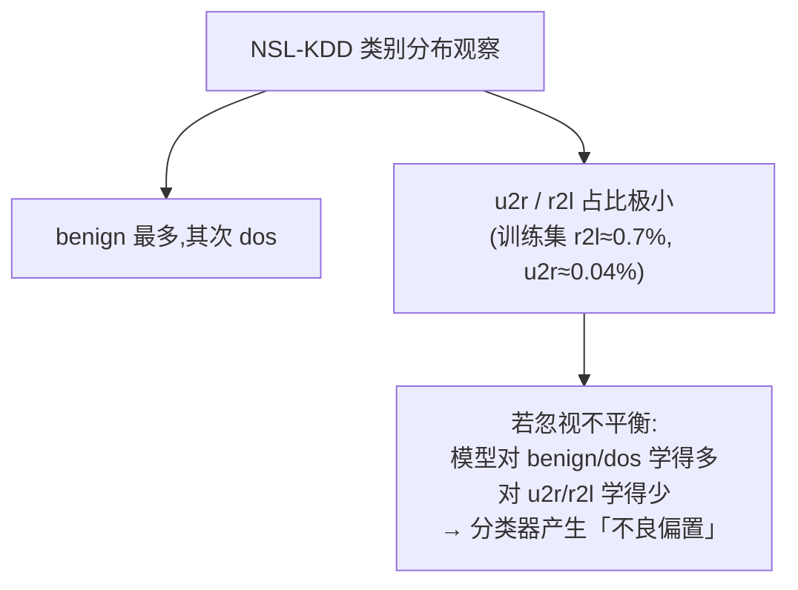
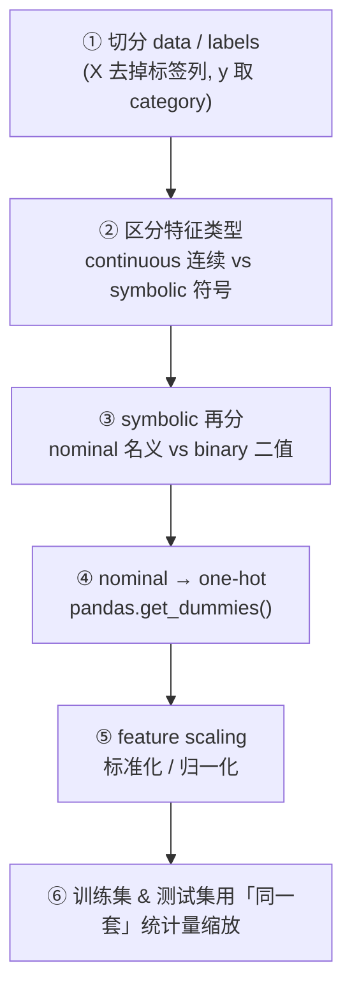
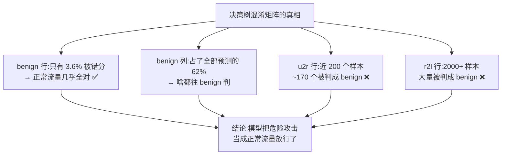
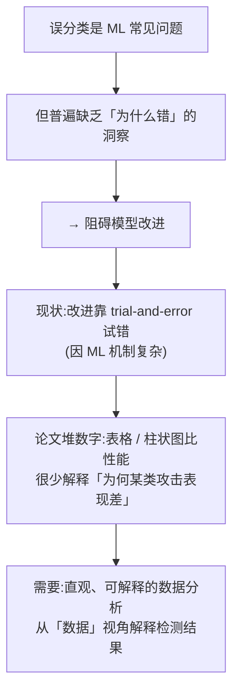
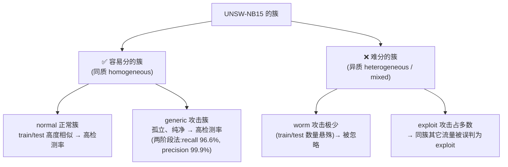
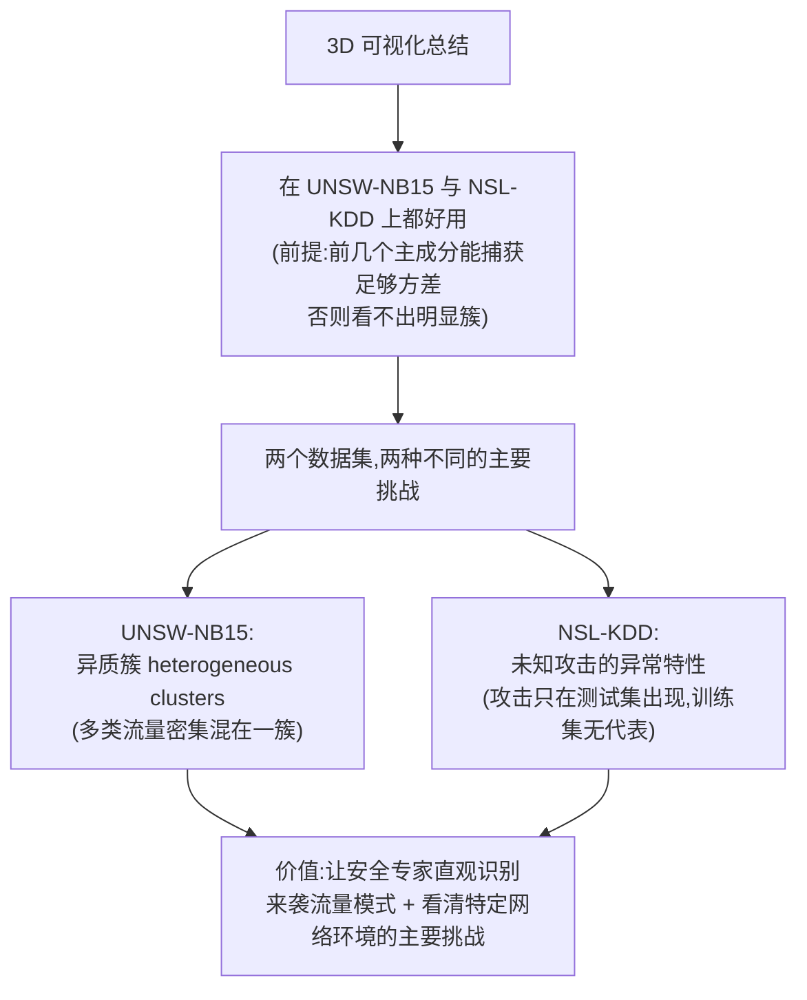

# Week 10 · 网络入侵检测 (Network Intrusion Detection)

> **CSIT375/975 — AI and Cybersecurity** · Dr Wei Zong · University of Wollongong

> **学习目标 (Learning objectives)** — 读完本章你应该能够:
> - **说清「网络入侵」是什么、从哪来**:定义 **network intrusion(网络入侵,试图绕过系统安全机制的非法行为)**,并区分两类来源——**外部攻击者(从 Internet 闯入)** 与 **insider attacker(内部攻击者,合法用户滥用越权权限)**;复述典型入侵场景(scanning → 攻陷有漏洞的机器);
> - **讲透「为什么要用 ML 做 NIDS」**:说清传统 **signature-based(基于签名)** 的 **NIDS** 工具(如 **SNORT**)的工作方式与三大局限(签名库须人工逐个更新、全球部署有 **latency 延迟**、检测不了 **emerging threats 新型威胁**);并解释 **ML / anomaly detection(异常检测)** 如何弥补——用「正常行为画像 + 检测显著偏离」的思路抓 **unforeseen attacks(未见过的攻击)**;
> - **背出异常检测的两大软肋**:**❶ 缺乏高质量异常数据**(导致「正常组」边界难以圈定)、**❷ 高 false alarm rate(误报率)**(合法但少见的新行为被误判为攻击);并能列出可用作特征的「异常信号」(连接数、异常端口、深夜流量峰值、带宽被某主机霸占等);
> - **走通「从零搭建 NIDS 朴素分类器」的完整流水线**:**探索数据(NSL-KDD)→ 数据准备(编码 + 缩放)→ 分类 → 分析结果**;并能讲出每一步的「坑」;
> - **吃透 NSL-KDD 数据集**:**41 个特征、38 种具体攻击、归并为 4 大类(dos / r2l / u2r / probe)+ benign = 5 类**;会用 `training_attack_types.txt` 做「具体攻击 → 大类」映射,并解释为什么要 **invert(反转)字典**;
> - **掌握数据准备的两大核心动作**:**❶ one-hot encoding**(用 `pandas.get_dummies()` 把 **nominal(名义型)** 符号特征如 `flag` 转成 dummy 变量);**❷ feature scaling**——分清 **standardization(标准化,→ 均值0方差1)** 与 **normalization(归一化,→ min-max 缩放到 [0,1])** 的公式与差别,并讲清「**必须用训练集的统计量去缩放测试集 (proper scaling)**」以及背后的原因;
> - **读懂 confusion matrix 并诊断 class imbalance**:看懂「行=真实类、列=预测类、对角线=正确」;能算出「62% 被判为 benign」「u2r/r2l 大量被误判为 benign」;并解释为何换 **KNN / SVM** 结果几乎一样——根因是 **class imbalance(类别不平衡)** 而非分类器选择;
> - **理解「3D 可视化分析」这条研究主线**:复述其动机(误分类常见但「为什么错」缺乏洞察)、方法(**PCA** 把高维流量投影到 3D + 交互式探索决策边界),并能对比 **UNSW-NB15** 与 **NSL-KDD** 两个数据集各自的「主要挑战」——前者是 **异质聚簇(heterogeneous clusters)**、后者是 **未知攻击(unknown attacks in test set)**。

---

上一周(Week 9)我们用「**把 PE 文件当图像看**」的技巧做完了 **malware detection(恶意软件检测)**。本周我们走到「**用 AI 解决安全问题**」这条主线的**第三站:network intrusion detection(网络入侵检测,NID)**。范式还是那个范式——**把一个安全问题,转化成一个机器学习能求解的「检测 / 分类」问题**;但本周的重点不在「某个炫技的新模型」,而在**真实工程师每天都要面对的两件苦差事**:① **怎么把一堆杂乱的原始流量数据,清洗、编码、缩放成一个能喂给模型的数据集**;② **当模型「看起来准、其实漏掉了所有危险攻击」时,如何诊断病根**。

讲师在开头做了清晰的三段式预告,这也正是本章的骨架:



为什么本章值得认真学?因为它把前几周一直在用、却很少被正面讲清的**「数据工程」与「结果诊断」**摆到了台面上。你会看到一个**反直觉但极重要的现象**:三种完全不同的分类器(decision tree、KNN、SVM)在同一份数据上**错得几乎一模一样**——这说明**问题出在数据(class imbalance),而不是模型**。看懂这一点,你才算真正理解「Garbage in, garbage out」这句机器学习铁律。

> 🧭 **一句话抓住全章** — **网络入侵检测的真正难点不在「选哪个分类器」,而在「数据」:数据极度不平衡(危险攻击 u2r/r2l 样本极少)+ 训练集与测试集分布可能不一致(未知攻击)。** 朴素方法做出的分类器会「**把几乎一切都判成正常流量**」,准确率虚高却放过了最危险的攻击。本章前半教你**搭这条流水线并看清它为什么会失败**,后半用 **3D 可视化** 让你**亲眼看到**误分类发生在数据空间的哪个角落。抓住「**坏数据 → 坏模型,且换模型没用**」这条主线,全章就立住了。

---

## 一、什么是网络入侵 (Slide 3)

**Network intrusion(网络入侵)** 的定义很直接:**试图绕过 (bypass) 计算机系统安全机制的非法行为 (illegal actions)。** 它的来源分两类,务必能区分:



- **外部攻击者**:从**互联网**访问、攻击系统的人。
- **Insider attacker(内部攻击者)**:本身是**合法授权用户**,但**试图获取并滥用 (misuse) 自己本不该有的 (non-authorized) 权限**。这类最难防,因为他「本来就有合法身份」。

slides 给了一个**典型入侵场景 (typical intrusion scenario)**:攻击者先用**扫描活动 (scanning activity)** 探测网络,找到一台**有漏洞的机器 (machine with vulnerability)**,将其**攻陷 (compromised machine)**,再以此为跳板深入。

> 💡 **直觉** — 「绕过安全机制」是核心词。无论从外部闯入还是内部越权,只要**做了授权范围之外的事**,就算入侵。后面所有检测方法,本质都是在回答一个问题:**这条流量,看起来像「正常授权行为」还是「越界行为」?**

---

## 二、为什么要用 ML:传统签名方法的局限 (Slides 4–5)

### 2.1 传统 NIDS = 基于签名 (signature-based)

传统的 **NIDS(Network Intrusion Detection System,网络入侵检测系统)** 工具——经典代表是 **SNORT**——靠的是**已知攻击的签名 (signatures of known attacks)**:

> **SNORT 的工作方式** — 对监控到的流量**套用规则 (apply rules)**,一旦检测到某类可疑活动就**发出告警 (issue alerts)**。它的判断完全依赖一个**签名知识库 (knowledge base of signatures)**。

这套方法的三大**局限 (limitations)**,正是 ML 要来解决的:

| 局限 | 含义 | 后果 |
|---|---|---|
| **签名库须人工逐个更新** | 每发现一种新攻击,都要**手动 (manually) 修订签名数据库** | 永远在「追着攻击者跑」 |
| **部署有 substantial latency(显著延迟)** | 新签名要**部署到全球所有服务器**需要时间 | 这段空窗期内,攻击者仍能利用漏洞 |
| **检测不了 emerging threats(新型威胁)** | 签名只能匹配**已知**攻击 | 对没见过的攻击**完全无能为力** |

> 📎 **拓展(超出 slides):讲师的真实案例** — 讲师提到「上周末有同学下载 CIFAR-10 时发现服务器关闭了,那是因为 Linux 系统在打**紧急安全补丁**」。这正是「全球部署延迟」的现实写照:当你想给全球服务器统一更新时,**延迟是实打实存在的**,而这段时间窗口就是攻击者的机会。

### 2.2 ML / 异常检测:抓「没见过的攻击」

**Machine Learning 与 AI 驱动的技术**能缓解上述局限——它**有潜力识别 unforeseen attacks(未曾预见的攻击)**。最经典的思路是 **anomaly detection(异常检测)**:

> **异常检测的核心思想** — 先建立代表「用户 / 主机 / 网络**正常行为 (normal behaviour)**」的 **profile(画像)**,再把**显著偏离这个画像 (significant deviations)** 的行为判定为攻击。


但这条路有**两个绕不开的软肋**,务必背熟(很容易出简答题):

> 🔑 **异常检测的两大软肋**
> - **❶ 缺乏足够的高质量异常数据 (lack of high-quality anomalous data)** —— 这是**主要挑战**。问题出在「正常组该圈多大」:圈太紧会把合法的新行为误杀;**圈太松,大到把攻击也包进去,攻击就能 bypass(绕过)检测**。没有高质量的异常样本,你根本无从知道边界该画在哪。
> - **❷ 高 false alarm rate(误报率)** —— 这是**主要局限**。一个**合法但与众不同**的正常行为,会因为「偏离了其它正常行为」而被误判成攻击。这种判断是**假的 (false)**,就是一次误报。**「之前没见过但合法」的系统行为,也会被当成异常。**

**主要实现手段 (major approaches)**:statistical methods(统计方法)、clustering(聚类)、neural networks(神经网络)、SVM(支持向量机)……工具很多,但**底层思想一致**:先刻画正常画像,再用它检测偏离。

---

## 三、异常行为的信号:能拿来当特征的东西 (Slide 6)

要检测异常流量,需要观察哪些「**元素 (elements)**」?这些元素后面会**直接变成数据集里的特征 (features)**:



> ⚠️ **关键提醒:异常 ≠ 一定是攻击** — slides 特别强调,网络流量中的**异常行为 (abnormal behavior)** 既**可能**是安全威胁(网络攻击、malware 感染)的信号,**也可能**只是**网络拥塞 (network congestion)** 或**设备故障 (faulty equipment)** 造成的。所以检测到异常只是**起点**,还需进一步分析判断——这也呼应了 §2.2 的「高误报率」软肋。

---

## 四、朴素分类器:从零搭一个 NIDS 分类器

> **本节定位** — 这是本章**最实操、也是 lab 要动手**的部分。**Goal(目标)**:用**基础 ML 工具从零 (from scratch) 搭一个网络攻击分类器**。讲师反复强调,这里的重点**不是某个算法有多强,而是「探索与实验 (exploration and experimentation)」的全过程**。

### 4.0 背景与现实挑战 (Slides 7–8)

在动手前,先认清搞安全 ML 的几个现实约束——这些是简答题的高频考点:

- **好数据极难获得**:在很多真实场景里,**带标签的相关数据很难拿到**,而**从原始数据里做特征工程 (engineering numerical features) 会吃掉大部分精力**。
- **「分类器只和它的训练数据一样好」**:`Classifiers are only as good as the data used to train them.` 在**监督学习**里,**可靠的标签尤其关键**——数据噪声大,分类器就废。
- **class imbalance(类别不平衡)是常态**:大多数组织**接触不到大量、多样的攻击流量**(且即便有也因隐私不愿公开);**罕见攻击可能一年才出现一次** → 数据集极度不平衡。
- **打标签靠专家、且耗时**:网络流量的标注,往往**必须由有调查与取证 (forensic) 技能的资深安全分析师**来做,**过程非常耗时**。
- **搭 ML 系统 = 充满探索与实验的过程**:接下来就走一遍「**理解数据集 → 准备数据 → 套几个算法**」的完整流程。


---

### 4.1 探索数据:认识 NSL-KDD (Slides 9–15)

#### 数据集本身

实验用的是 **NSL-KDD 数据集**——一个**基准 (benchmark) 数据集**,用来让研究者**公平比较不同的入侵检测方法**。

> 📎 **拓展(超出 slides):为什么用一个 20 年前的老数据集?** — 讲师坦言 NSL-KDD 来自约 20 年前,但它至今仍是**标准**:**小、轻量**,适合**快速验证算法**,且人人都用、便于横向比较。一旦你进入入侵检测领域,几乎一定会先拿它练手。

NSL-KDD 的结构:

| 项目 | 内容 |
|---|---|
| **特征 (features)** | **前 41 个值**,如 `duration`(连接时长)、`protocol_type`(协议类型)…… |
| **标签 (label)** | 每条记录最后带标签;训练集标注了 **38 种具体攻击**(如 `ipsweep`、`guess_passwd`) |
| **4 大攻击类别** | 38 种具体攻击归并为 4 大类(见下) |
| **最终任务** | 把每个样本分到 **5 类之一**:**benign / dos / r2l / u2r / probe** |

**4 大攻击类别**(必背):

| 类别 | 全称 | 含义 |
|---|---|---|
| **dos** | Denial of Service | 拒绝服务 |
| **r2l** | Remote to Local | 来自远程服务器的**未授权访问** |
| **u2r** | User to Root | **提权 (privilege escalation)** 尝试 |
| **probe** | Probing | **暴力探测 (brute-force probing)** 攻击 |

#### 标签映射:具体攻击 → 大类,以及为什么要「反转字典」

训练集里标的是**具体攻击**(如 `ipsweep`),但我们只想输出**大类**。这个「具体 → 大类」的映射写在随数据集附带的 **`training_attack_types.txt`** 文件里(例如 `ftp_write`、`guess_passwd` → `r2l`;`smurf`、`udpstorm` → `dos`)。

读进来后,字典天然长这样:**键 = 大类,值 = 一串具体攻击**。但**这个结构用起来极不方便**:

> 🔑 **为什么要 invert(反转)字典** — 给你一条记录(具体攻击是 `ipsweep`),你想知道它属于哪个大类。如果字典是「大类 → 攻击列表」,你得**遍历每个键值对**去找 `ipsweep` 藏在哪个列表里——**低效**。所以用**一行 Python** 把键和值对调,变成「**具体攻击 → 大类**」。反转后,`D['ipsweep']` 直接返回大类,一步到位。
>
> ```
> 反转前: {'dos': ['smurf','udpstorm',...], 'r2l': ['ftp_write',...], ...}
> 反转后: {'smurf':'dos', 'udpstorm':'dos', 'ftp_write':'r2l', ...}
> ```
>
> ⚠️ 小细节:`training_attack_types.txt` **不包含 `normal`(正常流量)**,需要**手动 append 进去**。

#### 类别分布:第一次看见「不平衡」这头怪兽

> **为什么一定要先看类别分布?** — 训练前**务必了解数据的 class distribution(类别分布)**。虽然真实世界的分布难以预测,但**对训练集心里要有数**。讲师举例:给一个**没有数据库服务器**的网络设计分类器,就**预期几乎看不到 SQL 攻击流量**——分布知识能指导后续设计。

具体做法:用 **Pandas**(二维表格数据结构)读入 CSV 训练数据,再**统计并绘制 `attack_type`(22 类具体)与 `attack_category`(5 大类)两种分布**(`value_counts()` 后画图)。

结果一看便知——**数据极度不平衡**:



> ⚠️ **不平衡为什么是大问题** — 若直接在这种数据上「天真地」训分类器,它**为了追求高 accuracy,会把权重压在多数类(正常流量)上,直接忽略少数类**。但**少数类恰恰是最危险的攻击**——讲师举例:`spyware`(间谍软件)、`rootkit`(拥有系统最高权限,见 Week 9)。你**绝不希望**模型放过它们,可它们在训练数据里又**少得可怜**。所以必须**先处理不平衡**——这是贯穿后半节的伏笔。

---

### 4.2 数据准备:编码 + 缩放 (Slides 16–23)

数据探索完,进入**最考验细致程度**的一步。流程如下:



#### ① 切分 data 与 labels

把训练 / 测试 DataFrame 各自拆成 **特征 X** 与 **标签 y**:
- `train_y` = 取出 `category` 列(我们要预测的目标);
- `train_X` = 用 `DataFrame.drop()` **丢掉标签列**,只留特征。
- 模型接收 `train_X` → 预测 `train_y`。测试集同理。

#### ② / ③ 区分特征类型

机器学习模型**只吃数值,不吃文本**。所以要把特征分成两摞:
- **continuous(连续型)**:如 `duration`、`src_bytes`——**保持原样**即可;
- **symbolic(符号型)**:如 `protocol_type`、`flag`——**必须转成数值**。

符号型再细分:
- **binary(二值型)**:只有 0/1,**直接当数值用**;
- **nominal(名义型)**:代表不同**类别**(无大小顺序),需要 one-hot 编码。

> 做法:**手动**列出连续特征名列表与符号特征名列表,存进一个有 `continuous` / `symbolic` 两个键的结构里。

#### ④ One-hot encoding:`pandas.get_dummies()`

用 `pandas.get_dummies()` 把 nominal 特征转成 **dummy(哑)变量**,即对 nominal 特征做 **one-hot encoding(独热编码,Week 1 学过)**。

> **以 `flag` 为例** — 假设 `flag` 的可能取值有 `S0, S1, S2, S3, SF, SH`。one-hot 会**为每个取值各造一个二值列**(`flag_S0`、`flag_S1`……),**每个样本里只有一个列 =1**。若某样本 `flag=S2`,则 `flag_S2=1`,其余全 0。
>
> | flag_S0 | flag_S1 | flag_S2 | flag_S3 | flag_SF | flag_SH |
> |---|---|---|---|---|---|
> | 0 | 0 | **1** | 0 | 0 | 0 |

> 📎 **拓展(超出 slides):get_dummies 的一个技术细节** — `flag` 本有 7 个取值,但 `get_dummies` **默认丢掉最后一个**,只留 6 列。原因:**若前 6 列全是 0,就隐含「必然是第 7 个」**——所以第 7 列冗余,不必存储。考试若问「为什么 dummy 列数比取值数少一个」,答案就在这。

#### ⑤ Feature scaling:标准化 vs 归一化(本节重点)

one-hot 之后,观察各特征的分布,会发现**一件危险的事**:**不同特征的取值范围差异巨大**。例如 `duration` 最大约 4 万,而 `src_bytes` 最大可达 **10 亿**。

> ⚠️ **为什么必须缩放** — 若不处理,**`src_bytes` 这种大数值特征会「淹没 (dominate)」其它特征**,模型被它牵着走。解决办法就是 **feature scaling**,有两种:

**方法 A:Standardization(标准化)**

把数据**重缩放到「均值 0、标准差 1」**。当特征分布差异很大时非常有用。公式:

$$X' = \frac{X - \mu}{\sigma}, \quad \text{其中}\ \mu = \text{mean}(X),\ \sigma = \text{stddev}(X)$$

即**减去均值、再除以标准差**。结果**不限定在某个固定区间**(理论上 $-\infty$ 到 $+\infty$,但据大数定律绝大多数值落在 $[-3, 3]$)。

> sklearn 工具:`sklearn.preprocessing.StandardScaler`。对 `duration` 做标准化后,`describe()` 一看:均值 ≈ 0(实际是 e-17,浮点误差,可视为 0),标准差 = 1。✅

**方法 B:Normalization(归一化)**

把数据**重缩放到一个小的指定区间**(默认 `[0,1]`),即 **min-max scaling**。公式:

$$X' = \frac{X - X_{min}}{X_{max} - X_{min}} \times (max - min) + min$$

其中 $X_{max}, X_{min}$ 是该**特征的最大 / 最小值**,$max, min$ 是**新区间的上下界**(默认 0 和 1)。

> **怎么理解这个公式(以 `[0,1]` 为例,此时 $max=1, min=0$)**:
> - 当 $X = X_{min}$ → 分子 = 0 → $X' = 0$;
> - 当 $X = X_{max}$ → 分子 = 分母 → $X' = 1$;
> - $X$ 在两者之间 → $X'$ 落在 (0, 1)。

> sklearn 工具:`sklearn.preprocessing.MinMaxScaler`,把特征从原区间缩放到 `[min, max]`。

| | **Standardization 标准化** | **Normalization 归一化** |
|---|---|---|
| **目标** | 均值 0、标准差 1 | 缩放到指定区间(默认 [0,1]) |
| **别名** | Z-score 标准化 | Min-Max scaling |
| **结果范围** | **不固定**(理论 ±∞,实际多在 [-3,3]) | **固定**在 [min, max] |
| **sklearn 类** | `StandardScaler` | `MinMaxScaler` |
| **适用** | 特征分布差异大时尤其有用 | 需要把值压进固定小区间时 |

#### ⑥ Proper scaling:训练集和测试集必须用「同一套」统计量

这是**全章最重要的工程纪律之一**,也是高频考点:

> 🔑 **核心规则** — 对训练集和测试集做**一致的变换**:**用「训练集」算出的 μ、σ(或 min、max),去缩放训练集 *和* 测试集**。做法:`scaler.fit(train_X)` 只在训练集上拟合,然后**同一个 scaler** 分别 `transform(train_X)` 和 `transform(test_X)`。

**为什么只能用训练集的统计量?**(讲师花了很大篇幅讲这点)

> 💡 **直觉:训练时「碰不到」测试集** — 测试集是用来**模拟未来流量**的,训练阶段**不该假设你能访问它**。现实里:你把模型部署到公司真实流量上时,**根本不知道未来流量的均值和标准差**——它和训练数据可能不同。
>
> **极端例子**:模型上线第一天只来了**一条**流量。一条样本**连均值都算不出来**(均值就是它自己,标准差为 0),你**根本无法**基于「测试数据」做任何变换。所以**只能依赖训练阶段的统计量**。
>
> ⚠️ **常见错误**:有人想「我也给测试集单独 fit 一个 scaler、用测试集自己的 μ/σ 来变换」。这在**学术练习里技术上能跑**(因为练习里把测试集提前给你了),但**违背现实**——真实部署时你拿不到未来数据。所以这是**错误做法**,务必用训练集统计量。

到此,数据「**准备就绪,可以拿去分类了**」。

---

### 4.3 分类与结果分析 (Slides 24–28)

#### 选分类器:一个迭代试错的过程

> **选对分类器很难** — 很多分类器都「**可能**」合适,但**最优的那个并不明显**。开发 ML 方案是个**迭代过程 (iterative process)**:即便经验丰富的从业者,也**很少能一上来就选对**。正确姿势是**先搭一个粗糙的初版,在迭代中获得洞察**。

#### 第一个尝试:Decision Tree + Confusion Matrix

训练数据有 **约 126,000 个带标签样本**,监督学习是个好起点,先试 **decision tree(决策树)**。用 **confusion matrix(混淆矩阵)** 看结果(Week 1 学过,这里复习):

> 🔑 **混淆矩阵怎么读**(测试集共 **22,544** 个样本,即矩阵所有元素之和)
> - **行 (row) = 真实类 (true class)**;**列 (column) = 预测类 (predicted class)**;
> - **对角线 = 正确分类的样本数**;
> - 例:`a₀₄ = 1` 表示「**真实为类 0(benign),却被预测成类 4(u2r)** 的样本有 1 个」;
> - 类索引:**0=benign, 1=dos, 2=probe, 3=r2l, 4=u2r**。

决策树跑出来,**错误率超过 20%(准确率约 76–77%)**——**不太好**。但真正的问题藏在矩阵里。

#### 分析结果:一个「假装很准」的分类器

测试集分布同样不平衡(43% 是 benign,u2r 仅 0.8%)。仔细读混淆矩阵:



- **只有 3.6% 的 benign 测试样本被错分**:`(59+291+3+1)/sum(row₁)` → 正常流量几乎全判对;
- 但 **62% 的测试样本被判成 benign**:`sum(col₁)/sum(matrix)`;
- **看 r2l 和 u2r 两行**:被判成 benign 的,**比判对的还多**——**攻击被当成正常流量放行了**。

> ⚠️ **致命问题** — 这个分类器**「整体准确率看着还行,却把最危险的 u2r / r2l 攻击几乎全放过了」**。讲师抛出关键问题:**「会不会我们训出的分类器,就是单纯更倾向于把样本往 benign 里塞?」**

#### 病根在数据,不在模型:KNN / SVM 也救不了

回头看训练集分布:**r2l ≈ 0.7%,u2r ≈ 0.04%**。如此极端的不平衡,**模型根本没有足够信息去学会识别 u2r / r2l**。

为确认「是不是换个分类器就好了」,再试 **KNN(K-Nearest Neighbors,K 近邻)** 和 **SVM(Support Vector Machine,支持向量机)**(都当**黑盒模型**用,不深究原理):

| 分类器 | 错误率 | 少数类表现 |
|---|---|---|
| **Decision Tree** | ~23%(三者中最低) | u2r/r2l 大量误判为 benign |
| **KNN** | ~24% | **几乎一样** |
| **SVM** | ~28% | **几乎一样** |

> 🧭 **本节的核心结论(全章金句)** — **三种分类器的混淆矩阵和错误率「特征惊人地相似」:少数类全被打成 benign。这说明继续换分类器是「不会有成效的 (not productive)」——问题不在模型,在数据的 class imbalance。** 出路只有一条:**先解决训练数据的不平衡问题**(如 oversampling 过采样 / undersampling 欠采样,回顾 Week 9),否则任何模型都会被多数类带偏。

> 💡 **这正是 lab 的起点** — 朴素方法到此「卡住」了。你将在 **lab(anomaly / intrusion detection)** 里接手这个卡点,亲手实验「如何缓解不平衡、让模型不再一边倒」。

---

## 五、3D 可视化分析 NIDS 数据 (Slides 29–44)

> **本节定位** — 来自讲师本人的研究论文(**Zong, Chow & Susilo, 2020,*Future Generation Computer Systems***)。它回答一个前半节没解决的问题:**当模型误分类时,我们能不能「亲眼看到」错在数据空间的哪里、为什么?** 这是一种**可解释、可视化**的分析手段,且**技术通用**——malware、图像分类等任何高维数据都能用。

### 5.1 动机:误分类常见,但「为什么错」缺乏洞察 (Slide 29)



核心论点:**ML 严重依赖训练 / 测试数据的特性**,所以**从「数据」的角度去解释检测结果**,能帮我们真正理解模型为何表现好或差——而不是像多数论文那样只甩出一堆「我比你高几个点」的数字。

### 5.2 方法:交互式 3D 可视化 + PCA (Slides 30–32)

**系统能力**:把 NIDS 数据做**可视化表示**,**刻画不同流量记录之间的几何关系**;用户可**实时 (real-time) 交互式导航**数据,**直观查看 ML 分类器的决策空间 (decision spaces)**,**观察误分类发生在哪些边界上**。

**核心技术:PCA(Principal Component Analysis,主成分分析)**

> **PCA 一句话** — 在 K 维空间里找**线 / 面 / 超平面 (hyperplane)**,以**最小二乘 (least squares)** 的意义最好地逼近数据;这条线 / 面会让**数据投影坐标的方差尽可能大**。作用:把**高维 NIDS 数据降到 2D 或 3D** 以便可视化。

> 💡 **为什么需要 PCA** — NSL-KDD 有 41 个特征,one-hot 后**膨胀到约 60 维**——**人眼无法看 60 维空间**。PCA 把它**投影到 3D**,就像玩 3D 游戏一样能在屏幕上呈现。**(细节无需深究,会用即可。)**

slides 列了一组演示视频(用 **SVM** 作分类器):`KDD/UNSW` 的 `Binary / Multi / No_Boundaries` 等 `.mp4`——展示数据点按类别着色、以及决策边界。

### 5.3 UNSW-NB15 数据集分析 (Slides 33–38)

> **UNSW-NB15 是什么** — 相比老旧的 NSL-KDD,这是一个**现代网络流量**数据集,攻击类型也更丰富(normal、dos、generic、analysis、backdoor、exploits、worms 等)。

**总体观察(Slide 33)**:从两个视角看训练集 (a) 与测试集 (b),**同类流量通常聚成簇 (clustered together)**;且**训练集与测试集特征相似** → 这是**好兆头**:在训练集上训的模型,**很可能**也能检测测试集里的攻击。

**经验分簇(Slide 34)**:人工把数据圈成簇——**黄圈 = 几乎只含正常流量;红圈 = 攻击**。其中 **generic 攻击聚得很好**,但**混合簇 (mixed clusters) 定义不清**(正常和多种攻击混在一起)。

把 UNSW-NB15 的簇按「好分 / 难分」归纳:



- **同质簇 = 好分(Slide 35)**:normal 与 generic 攻击的簇,**train/test 特性高度相似、记录近乎同质 (homogeneous)**,模型容易识别、检测率高。讲师举证:对 generic 攻击,某**两阶段方法**可达 **recall 96.6%、precision 99.9%**——**从视觉上就能看出它好分**(孤立成簇)。
- **异质 / 混合簇 = 难分(Slide 36)**:不同流量混在一起、无清晰视觉区分。两个具体麻烦:
  - **worm 攻击数量极少**:训练集才 ~24 个、测试集才 ~3 个(都淹没在 5000+ 的大簇里)→ 模型**直接忽略 worm**;
  - **exploit 攻击占比大**:同簇里 exploit 多到 ~3600 个 → 模型**被带偏,把同簇其它流量也误判成 exploit**。

**两个误分类特写(Slides 37–38)**:
- **正常流量被误判为攻击(Slide 37)**:图 (a) 右侧是 normal 决策空间(其内的正常流量都判对);但左侧簇**落在 normal 决策空间之外**,混着正常与异常。图 (b) 移走异常流量后,**高亮出大量被误判成「攻击」的正常流量**。
- **其它流量被误判为 exploit(Slide 38)**:在 exploit 占比高的簇里,图 (a) 是 exploit 决策空间特写,图 (b) 高亮出**被误判成 exploit 的流量**——验证了「**多数类绑架决策**」。

> 🔑 **可视化的真正价值(讲师强调)** — 看到「正常流量被判成攻击」后,ML 工程师可以**带着具体问题去找安全专家**:是这些正常流量「行为真的像攻击」(如用户短时间疯狂登录,像 probe),还是攻击「故意伪装成正常流量」来骗过分类器?**专家据此改进特征提取 (feature extraction)**,让正常与攻击重新可分。**可视化 = 人机协作改进系统的入口。**

### 5.4 NSL-KDD 数据集分析:核心是「未知攻击」 (Slides 39–43)

**总体观察(Slide 39)**:训练集 (a) 与测试集 (b) 总体分布相似(能看到对应的 DoS 簇、normal 簇),但——**关键差异**——**NSL-KDD 的 train/test 相似度明显低于 UNSW-NB15**。放大看,训练集里某区域几乎空着,测试集对应位置却**突然冒出一批 DoS 攻击**。

**同质簇仍好分(Slides 40–41)**:
- **DoS 簇(Slide 40)**:孤立、几乎全是同质 DoS 记录 → 模型预期表现好;
- **probe 簇(Slide 41)**:大体同质;但 (d) 里簇**附近有正常流量**——副作用是**模型可能把簇附近的正常 / 其它攻击也误判成 probe**。

**核心难点:previously unknown attacks(Slides 42–43)**:

> 🧭 **NSL-KDD 的命门(必考)** — 安全专家早已指出:NSL-KDD 给 ML 带来的**主要困难,来自测试集里「之前未知的攻击 (previously unknown attacks)」**。**即便训练集和测试集的攻击「类别相同」,这些流量的「特性 (characteristics) 却显著不同」。**
>
> **可视化证据(Slide 42, 图 e/f)**:同一个簇里,**训练集 (e) 几乎没有 R2L 攻击**(只有寥寥 4 个蓝点,被淹没);**测试集 (f) 却涌现大量 R2L 攻击**。模型在训练集上**根本没机会学到**这种行为,**怎么可能在测试集里「魔法般」认出它?** —— 这是**数据集本身的内在缺陷 (intrinsic flaw)**:train/test 之间缺乏可学习的关联。

**决策边界视角(Slide 43)**:可视化 SVM 的决策边界(在训练集上训练)。
- 图 (a) 训练集 normal 决策空间;图 (b) 测试集 normal 决策空间;
- **测试集里的 R2L 攻击落在了 normal 的决策边界内 → 被误判成正常流量**,原因正是「**训练时未知**」;
- 此外 (a)(b) 都有一些 **DoS** 攻击被误判——因为它们在**训练集里只占该区域极小一部分**,模型学不到。

> 💡 **核心教训** — **「ML 模型应当基于训练集来设计」**:如果训练数据**没能充分代表 (adequately represent)** 真实流量,检测精度必然受损。模型不会变魔术——**没在训练集里见过的,就别指望它在测试集里认出来。**

### 5.5 可视化结果总结 (Slide 44)



- **可视化在两个数据集上都奏效**——前提是**前几个 principal components 能捕获数据中相当大比例的方差**(这是 PCA 的理论要求;否则降维后方差不足,看不出明显簇)。
- **两个数据集,两种挑战**(必背对比):
  - **UNSW-NB15** 的主要挑战 = **异质聚簇**(多类流量高度混杂在同一簇);
  - **NSL-KDD** 的主要挑战 = **未知攻击的异常特性**(攻击只在测试集出现,训练集缺乏代表)。
- **意义**:3D 可视化让网络安全专家能**直观审视、识别来袭流量的模式**,并**看清某个具体网络环境下的主要挑战**。

---

## 六、本章小结 (Key Takeaways)

- **课程定位**:本周是「用 AI 解决安全问题」的**第三站**(承接 Week 8 deepfake、Week 9 malware);范式 = 把入侵检测转成 ML 检测 / 分类问题。三段式:**NID 基础 → 朴素分类器 → 3D 可视化分析**。
- **什么是入侵**:**绕过系统安全机制的非法行为**;两类来源 = **外部攻击者** + **insider attacker(内部越权)**;典型场景 scanning → 攻陷有漏洞的机器。
- **为什么用 ML**:传统 **signature-based NIDS(SNORT)** 三大局限——**签名库须人工更新、全球部署有延迟、检测不了新型威胁**;ML 用 **anomaly detection**(正常画像 + 检测偏离)抓**未见过的攻击**。两大软肋:**❶ 缺高质量异常数据(边界难圈)、❷ 高误报率**。注意**异常 ≠ 一定是攻击**(也可能是拥塞 / 设备故障)。
- **NSL-KDD**:**41 特征、38 具体攻击 → 4 大类(dos/r2l/u2r/probe)+ benign = 5 类**;用 `training_attack_types.txt` 映射,**反转字典**让「具体攻击 → 大类」一步可查;`normal` 需手动补。
- **数据极度不平衡**:训练集 **r2l≈0.7%、u2r≈0.04%**;忽视它 → 模型偏向多数类、**放过最危险的少数类攻击**(spyware、rootkit)。
- **数据准备流水线**:切分 X/y → 区分 **continuous vs symbolic**,symbolic 再分 **nominal vs binary** → **`get_dummies()` 做 one-hot**(每样本仅一列为 1;默认丢最后一列去冗余)→ **feature scaling**。
- **标准化 vs 归一化**:**Standardization** $X'=(X-\mu)/\sigma$ → 均值 0 方差 1、范围不固定(`StandardScaler`);**Normalization(min-max)** → 缩放到 [0,1]、范围固定(`MinMaxScaler`)。**Proper scaling 铁律:用「训练集」的统计量去缩放训练集和测试集**(因为部署时拿不到未来数据;极端时第一天只有一条样本连均值都算不出)。
- **分类与诊断(全章核心)**:选分类器是**迭代试错**;decision tree 准确率仅 ~76%,**混淆矩阵(行真列预测,对角线正确)** 揭示真相——**62% 都判成 benign,u2r/r2l 大量被当正常放行**。换 **KNN / SVM 结果几乎一样** → **病根是 class imbalance,不是模型**;**必须先治不平衡**(过采样 / 欠采样),这正是 lab 的起点。
- **3D 可视化(研究法)**:动机 = 误分类常见但缺「为什么」的洞察,需**从数据视角做可解释分析**;方法 = **PCA** 把 ~60 维投到 3D + 交互探索决策边界。
- **两数据集两挑战(必考对比)**:**UNSW-NB15 = 异质混合簇**(同质的 normal/generic 好分,混合簇里 worm 被忽略、exploit 绑架决策);**NSL-KDD = 未知攻击**(R2L 只在测试集涌现,训练集无代表 → 落入 normal 决策边界被误判)。教训:**模型应基于训练集设计,没见过的就别指望它认出来。**

> 📌 **一页纸记忆锚点** — **入侵 = 绕过安全机制(外部 + 内部越权)→ 传统签名法(SNORT)三宗罪:人工更新、部署延迟、抓不到新威胁 → 转向 ML 异常检测(正常画像+测偏离),两软肋:缺异常数据 + 高误报 → NSL-KDD:41 特征/38 攻击/4 大类+benign=5 类,反转字典做映射 → 数据准备:连续 vs 符号(名义 one-hot / 二值直用)+ 缩放(标准化均值0方差1 / 归一化[0,1],且必须用训练集统计量) → 朴素分类器准确率虚高(62% 判 benign,u2r/r2l 被放行),换 KNN/SVM 没用 → 根因 class imbalance,先治不平衡 → 3D 可视化(PCA 投 3D)诊断:UNSW-NB15 难在异质簇、NSL-KDD 难在未知攻击。**

---

## 七、与 Lab / Assignment / 相邻周的关联

| 关联点 | 说明 | 对应章节 |
|---|---|---|
| **本周 = lab 的直接素材** | 讲师明说朴素分类器「**你将在 lab 里动手实验**」;对应 `lab/lab_anomaly_intrusion_detection`。课堂卡在「换模型也救不了不平衡」,**lab 接手去治不平衡** | §四、§4.3 |
| **承接 Week 1(基础工具)** | **one-hot encoding、confusion matrix、decision tree** 都在第 1 周讲过,本周是「在真实数据工程里把它们串起来用」 | §4.2、§4.3 |
| **承接 Week 9(malware)的不平衡对策** | 治 class imbalance 的 **oversampling / undersampling / 改 cost function 加权** 直接复用 Week 9 的思路 | §4.1、§4.3 |
| **承接「用 AI 解决安全」后半段主线** | Week 8 deepfake → Week 9 malware → **Week 10 NID**,同一范式:安全问题 → ML 检测问题 | 引子、§六 |
| **3D 可视化 = 讲师本人研究** | 源自 Zong, Chow & Susilo (2020), *Future Generation Computer Systems*, 102, 292–306;技术**通用**,可迁移到 malware / 图像等任意高维数据分析 | §五 |
| **录音位置(说明)** | 本周录音**完整且自包含**在 `CSIT375975 Lecture 10-transcript.txt`(开头「welcome to lecture 10… network intrusion detection」,结尾预告下周 spam detection),**未散落到相邻周**;本指南已据其与 45 页 slides 完整整合 | 全章 |

> 🧭 **下一周预告** — 课程进入「用 AI 解决安全问题」的**第四站:Spam and Phishing Detection(垃圾邮件与钓鱼检测)**。讲师在课尾明确预告下周讲 spam detection——又一次把安全问题转化为 ML 可解的文本 / 流量分类任务。
