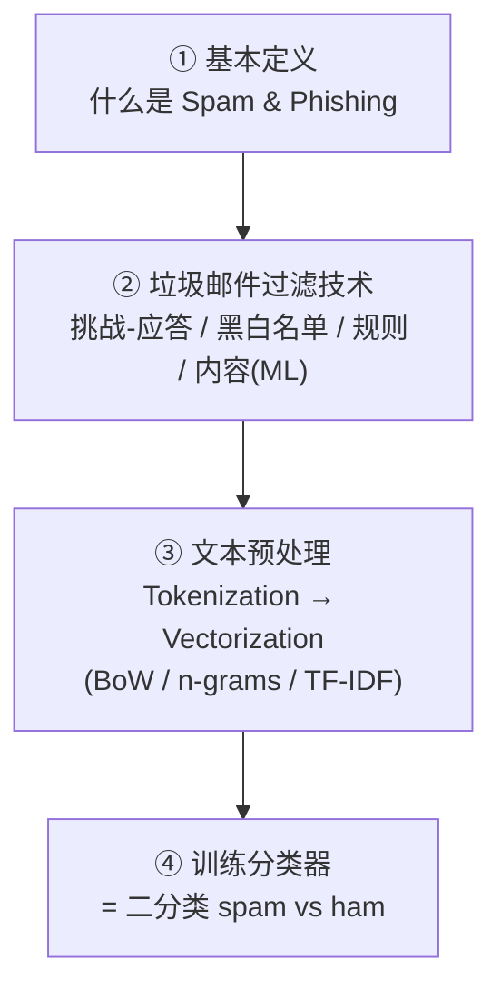
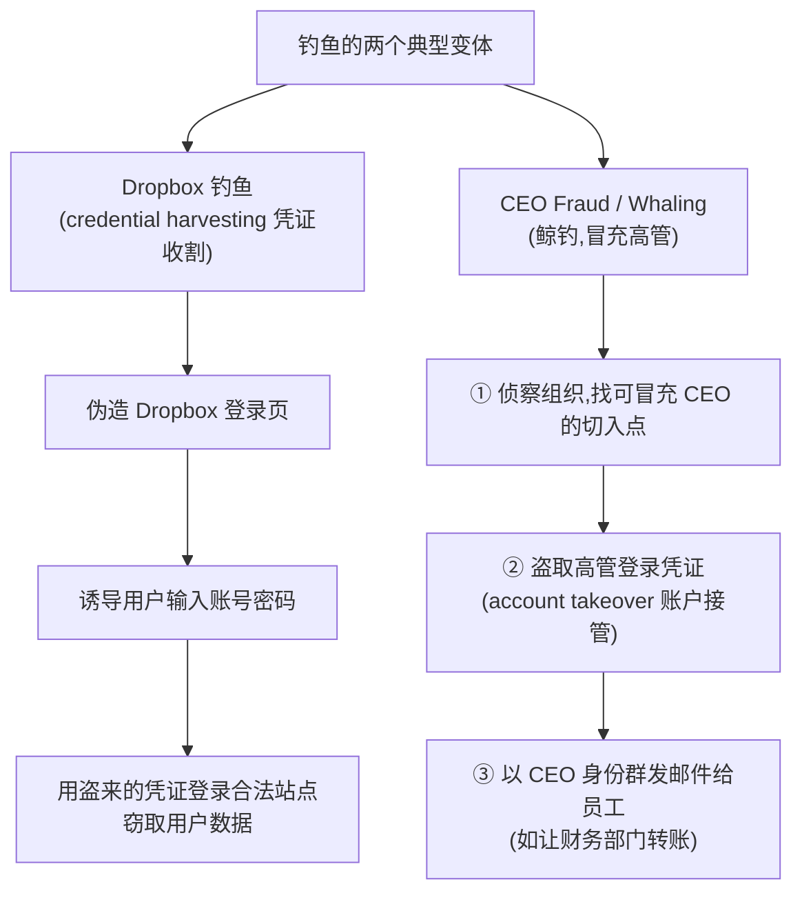
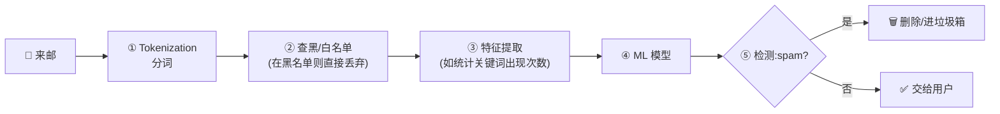
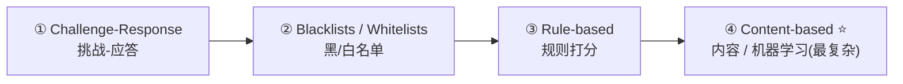
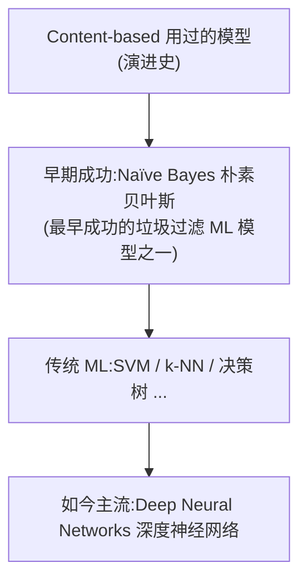
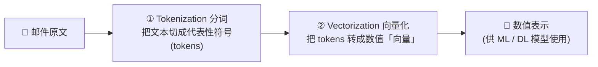
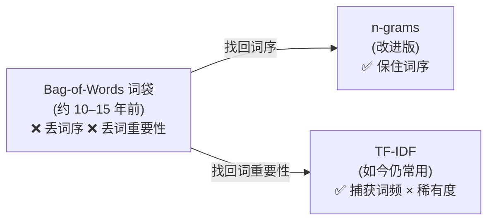
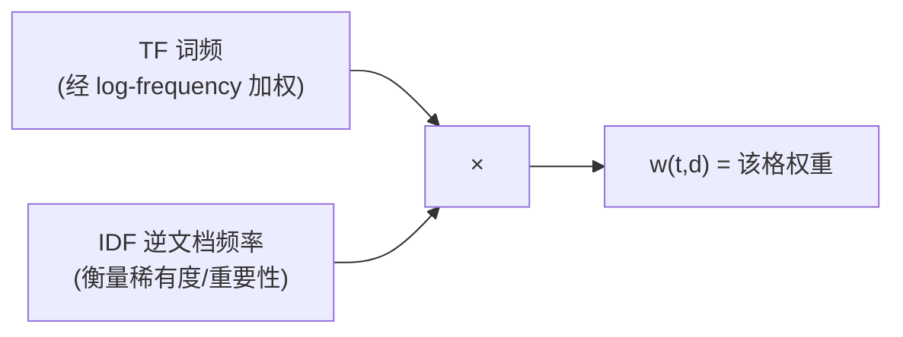
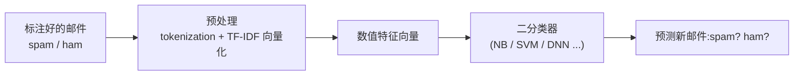

# Week 11 · 垃圾邮件与钓鱼检测 (Spam and Phishing Detection)

> **CSIT375/975 — AI and Cybersecurity** · Dr Wei Zong · University of Wollongong

> **学习目标 (Learning objectives)** — 读完本章你应该能够:
> - **分清「垃圾邮件」与「钓鱼」**:定义 **spam(垃圾邮件,unsolicited bulk email/message,未经请求的批量邮件)** 与 **phishing(钓鱼,把受害者诱骗到假网站、套取个人信息 / 凭证的攻击)**;说清二者关系——**钓鱼比垃圾邮件危害更大**,因为它直接窃取银行账号、密码、SSN 等隐私;并能拆解一个 **URL** 的三大组件(**protocol / domain name / file name**);
> - **背出垃圾邮件「为什么是个问题」的关键数据与论点**:成本被**转嫁给收件人 (cost forced onto recipient)**;一小笔投入即可每小时群发 10 万封;占全部邮件的 **45%**、每天约 **145 亿封**、年损失约 **205 亿美元**;响应率极低(1200 万封换 1 次点击)却仍能让 **80% 的垃圾邮件来自同样的 100 个垃圾发送者**牟利;
> - **认全两种典型钓鱼变体**:**Dropbox 钓鱼**(伪造登录页做 **credential harvesting 凭证收割**)与 **CEO fraud / whaling(鲸钓,冒充高管)**——侦察组织 → 盗取高管凭证 → 以高管身份给员工发指令(如让财务转账);
> - **讲清垃圾邮件过滤的目标与标准数据流**:目标是判定来邮是 **ham(合法/非垃圾)** 还是 **spam**;数据流 = **tokenization → 黑/白名单 → 特征提取 → ML 模型 → 检测**;并解释「为什么必须先把邮件转成数值表示」;
> - **对比四类过滤技术的原理与局限**:**❶ Challenge-Response(挑战-应答,如 CAPTCHA)、❷ Blacklists/Whitelists(黑/白名单)、❸ Rule-based(规则打分超阈值判垃圾)、❹ Content-based(内容/ML,最复杂)**;并说清 content-based 如何扫描 **body(「写了什么」)** 与 **header(「谁发的」:Message ID / Sender / DNS 的 SPF、DKIM、DMARC)**;
> - **走一遍文本预处理的两段式流水线**:**Tokenization(分词)→ Vectorization(向量化)**;复述 tokenization 的 5 个步骤(去标点/非字母 → 去 stop words → 纠错/缩写还原 → 转小写 → **stemming 词干还原**),并能区分「**spam 过滤里的 token**」与「**大语言模型里的 token**」的不同;
> - **吃透三种向量化方法**:**Bag-of-Words(词袋,丢序、丢重要性)→ n-grams(用 n 个连续词当 token,保住词序;bigram/unigram)→ TF-IDF(同时捕获「词频」与「词的稀有度/重要性」)**;并能解释 BoW 的两处信息丢失各由谁来补;
> - **手算 TF-IDF**:背出三段公式——**log-frequency weighting** $w_{t,d}=1+\log tf_{t,d}\ (tf>0)$、**inverse document frequency** $idf_t=\log\frac{N}{df_t}$、**合成** $w_{t,d}=(1+\log tf_{t,d})\times\log\frac{N}{df_t}$;并能复现 slides 的标准例子 $w_{\text{win, Email 3}}=1.477\times\log\frac{6}{2}=0.704$;
> - **把全章收束成一句话**:**Spam detection 本质是一个二分类 (binary classification) 问题**——给定大量标注 spam/ham 的邮件,把文本经预处理变成数值向量,再用「你喜欢的任意分类器」学会预测新邮件的标签。

---

上一周(Week 10)我们做完了 **network intrusion detection(网络入侵检测)**,看清了「数据不平衡 + 未知攻击」如何让一个分类器虚高却失效。本周我们走到「**用 AI 解决安全问题**」这条主线的**最后一站:spam and phishing detection(垃圾邮件与钓鱼检测)**。范式依旧——**把一个安全问题转化成机器学习能求解的分类问题**;但本周的主角是**文本**:邮件不是图像、不是流量记录,而是一堆自然语言文字。于是核心矛盾变成:**机器学习模型只吃数字,可邮件是文字——怎么把「文字」干净、可靠地变成「数字向量」?** 本章一大半篇幅(也是考试重点)都在回答这个问题,最终落到 **TF-IDF** 这个至今仍在用的经典方法。

讲师在开头做了三段式预告,这就是本章骨架:



> 🧭 **一句话抓住全章** — **垃圾邮件 / 钓鱼检测 = 文本二分类。** 难点不在分类器(用 Naïve Bayes、SVM、DNN 都行),而在「**把邮件文字转成数值向量**」这一步:先 **tokenization** 把句子切成干净的 token,再 **vectorization** 把 token 变成数字。向量化方法一路进化——**词袋 (BoW) 丢了词序和词的重要性 → n-grams 用连续词组找回词序 → TF-IDF 用「词频 × 稀有度」找回词的重要性**。抓住「**文字 → 数字 → 分类器**」这条主线,再把 **TF-IDF 三段公式**记牢,全章就立住了。

---

## 一、什么是垃圾邮件与钓鱼 (Slides 3–10)

### 1.1 Spam:定义与「为什么是个问题」 (Slides 3–5)

**Spam(垃圾邮件)** 的定义很简洁:**unsolicited bulk email or message(未经请求的批量邮件 / 消息)**——即**向成千上万(乃至数百万)收件人发送内容相同或几乎相同的邮件**。关键词是 **unsolicited(未经请求)** + **bulk(批量)**。

它为什么是个**真实的问题 (problem)**?slides 列了一串(注意末尾那句点睛):

- **成本极低、危害极广**:只需**一点点投入 (tiny investment)**,垃圾发送者就能**每小时群发超过 10 万封**邮件。
- **浪费时间、可能造成经济损失**:研究显示,普通人**把约 28% 的工作日(≈ 670 小时/年)**花在读写邮件上,而平均**只有 38% 的邮件是相关且重要的**。
- **浪费存储与带宽**:垃圾邮件照样要经互联网传输、要在服务器上留存记录。
- **可能携带恶意软件**:作为**可执行文件 (executable files)** 附件夹带 malware。
- **点睛之笔(最常考的一句)**:**Spam is a problem because the cost is forced onto the recipient.**(垃圾邮件之所以是问题,是因为**成本被强加给了收件人**——发送几乎免费,买单的却是你。)这正是「**要用 AI 做垃圾邮件过滤器**」的根本动机。

**几个数字 (Statistics, Slide 5)** —— 用来体会规模,适合做填空/选择:

| 指标 | 数值 |
|---|---|
| 垃圾邮件占全部邮件的比例 | **45%**(几乎一半) |
| 每天发送的垃圾邮件量 | **约 14.5 billion(145 亿)封** |
| 每年造成的损失 | **约 \$20.5 billion(205 亿美元)**(网络带宽 + 存储) |
| 垃圾发送者的响应率 | 平均**每发 1200 万封才换来 1 次点击** |
| 收益 | 即便响应率如此之低,垃圾发送者**每年仍能赚数百万美元** |
| 集中度 | **80% 的垃圾邮件来自同样的 100 个垃圾发送者** |

> 💡 **直觉** — 这组数字想让你记住两件事:① 垃圾邮件是个**规模巨大、有利可图**的灰色产业(所以不会消失);② 它高度**集中**(80% 来自 100 人),且**响应率极低却仍盈利**——因为发送成本被转嫁了。这就是为什么过滤必须**自动化、可扩展**,人工根本扛不住每天 145 亿封。

### 1.2 Phishing:钓鱼,比垃圾邮件更危险 (Slides 6–7)

**Phishing(钓鱼)** 是另一类攻击:**受害者被诱骗到一个假网站 (fake web),并被欺骗交出个人数据或凭证 (personal data or credentials)。**

它的核心载体是 **phishing URL(钓鱼链接)**:

- 钓鱼 URL **看起来像合法 URL**,却会把用户**重定向 (redirect)** 到钓鱼网页;
- 钓鱼网页**高度仿冒 (mimic the look and feel)** 目标网站的外观,让你以为自己在真网站上。

> 📎 **拓展(超出 slides):一个 URL 由什么组成?** — slides 借机复习了 **URL(Uniform Resource Locator,统一资源定位符)** 的定义:它是网络中某个网页的**地址**。以 `http://www.example.com/index.html` 为例,三大组件务必能拆:
> | 组件 | 例子 | 含义 |
> |---|---|---|
> | **Protocol type(协议类型)** | `http` | 用什么协议访问 |
> | **Domain name(域名)** | `www.example.com` | 资源在哪台主机 |
> | **File name(文件名)** | `index.html` | 具体哪个网页 |
>
> 钓鱼之所以难防,正是因为攻击者在**域名**上做手脚(相似域名、子域伪装),肉眼一扫很难分辨。

**为什么钓鱼比垃圾邮件更严重?**(必考对比)——因为**钓鱼邮件旨在窃取用户私密信息**,如**银行账号、密码、SSN(社会安全号)**;而普通垃圾邮件多半只是骚扰、广告。讲师用一个**仿冒 Amazon 的钓鱼邮件**举例,点出两个**实战识别技巧**:

> 🔍 **识别钓鱼的两个细节(讲师强调)**
> - **看发件人拼写**:示例里发件域名**少了一个字母 `a`**——不是 Amazon 官方发件方。
> - **悬停看真实链接**:文本里的链接看着合法,但**把鼠标悬停 (hover) 在链接上**,会显示**实际跳转地址**,它指向的是一个**与文本完全不同的网站**。
>
> ⚠️ 讲师特别提醒:**仅凭阅读文本极难发现钓鱼**——必须查发件域名、悬停验链接。

### 1.3 两种典型钓鱼变体 (Slides 8–10)



- **Dropbox 钓鱼 (Slide 8)**:攻击者**伪造 Dropbox 的登录页 (fake sign-in pages)**,作为**凭证收割 (credential harvesting)** 的一环;拿到账号密码后,再**用这些被盗凭证登录合法网站、窃取用户数据**。

> 📌 **录音小贴士** — 转写把 "**Dropbox**" 误听成了 "**jawbox**"。slide 8 标题白纸黑字写的是 **Dropbox Phishing**,以 slides 为准。

- **CEO Fraud / Whaling 鲸钓 (Slides 9–10)**:也叫 **whaling attack(鲸钓,「大鱼」指高管)**。
  - **目标 (target)**:组织里的**顶层高管 (top executives)**;
  - **手法**:因凭证被盗导致**账户接管 (account takeover)**——攻击者**先侦察组织、找漏洞以便冒充 CEO**,**盗取 CEO 账户**后,**以 CEO 名义给全体员工发邮件**(例如让**财务部门转一笔钱**到指定账户);
  - **后果**:多数情况下**钱很难追回**。

> 💡 **为什么叫「鲸钓」** — 普通 phishing 是广撒网钓小鱼(任意用户),whaling 则专钓「大鱼」(CEO/CFO)。一旦冒充成高管,后续指令的**可信度极高**(谁敢质疑 CEO 的转账邮件?),所以危害和金额都更大。

> 🔑 **本节小结(spam vs phishing 必背)** — **Spam = 未经请求的批量邮件**,主要危害是**骚扰 + 浪费资源 + 成本转嫁收件人**;**Phishing = 诱骗到假站套取隐私/凭证**,主要危害是**直接盗取财产与身份**,所以**更严重**。两种典型钓鱼:**Dropbox 钓鱼(收割凭证)**、**CEO fraud / whaling(冒充高管)**。

---

## 二、垃圾邮件过滤:目标与标准数据流 (Slides 11–13)

**Spam filter(垃圾邮件过滤器)的目标 (goal)**:判定一封来邮是**合法的 (legitimate = non-spam = ham 火腿)** 还是**未经请求的 (unsolicited = spam)**。判为 ham → 进收件箱给用户;判为 spam → 进垃圾箱、甚至直接删除。

> 📎 **拓展(超出 slides):为什么非垃圾邮件叫 "ham"?** — 这是垃圾邮件领域的行话:**spam** 本是一种午餐肉罐头品牌,被借来指「垃圾邮件」;于是人们顺手用同为肉类的 **ham(火腿)** 来指「正常邮件」。考试里看到 **ham 就等于 legitimate / non-spam**。

**一个典型的垃圾邮件过滤数据流 (Slide 12)**——它展示了一封邮件从进来到被判决,要经过哪些处理:



> 🔑 **关键铺垫(贯穿全章)** — 要把邮件喂给模型,**必须先把它转成某种「数值格式 (numerical format)」**。这句话是本章后半(预处理 / 向量化)的总动机:**模型只认数字,邮件却是文字。**

**为什么垃圾邮件过滤在 ML 安全里地位特殊?(Slide 13)** —— 三点,适合简答:

1. **基于 ML 的垃圾分类器,是机器学习在网络安全领域最早的应用之一**;
2. 因此,它们也**最早成为被攻击的对象**——攻击者的目标是**在不改变邮件本意 (without changing the nature of the message) 的前提下修改垃圾邮件,以绕过过滤器 (bypass spam filters)**;
3. **现代过滤器越来越依赖机器学习与神经网络**,Gmail、Outlook、Yahoo 等大厂广泛采用。

> ⚠️ **一句话点题** — 垃圾邮件过滤是「攻防共同进化」的经典战场:**它既是 ML 安全的开端,也是对抗攻击的开端。** 这呼应了课程前几周的 adversarial examples——攻击者改几个词就能让分类器失灵。

---

## 三、四类过滤技术 (Slides 14–20)

slides 给出四种技术,**复杂度递增**,最后一种(content-based)才是 ML 真正登场的地方:



### 3.1 Challenge-Response Filtering 挑战-应答 (Slide 15)

**原理**:发件人发来邮件时,系统**回送一个「挑战」(challenge)**(如 **CAPTCHA 验证码**)。
- **合法用户**能轻松解开挑战(人类一眼认出字符);
- **垃圾发送者**要群发海量邮件,**逐一解挑战变得困难**;
- 于是系统可据此**轻松区分合法邮件与垃圾邮件**。

**局限 (Limitation)**:
- 发件人有时**忘了 / 不回应挑战**,导致合法邮件也发不出去;
- **ML 技术的进步使「自动解挑战」成为可能**——攻击者可用深度学习自动破解 CAPTCHA。

### 3.2 Blacklists and Whitelists 黑/白名单 (Slide 16)

- **Blacklist(黑名单)**:由多个站点收集的**行为不端的服务器 / 已知垃圾发送者**清单;把邮件里的**发件人 id 与黑名单比对**,命中即丢弃。
- **Whitelist(白名单)**:与黑名单**互补**,存放**可信联系人**的地址。
- **定位**:用于**第一级过滤 (first level filtering)**(在内容检查之前),**不能作为唯一决策工具**。

**局限**:**易因错误配置 (wrong configurations) 出问题**——一旦把合法服务器误列入黑名单,**它很难再退出 (exit) 这个名单**。

### 3.3 Rule-based Filtering 规则打分 (Slide 17)

**原理**:用**静态规则 (static rules)** 在大量垃圾 / 非垃圾邮件中发现相似模式。
- 每条规则**赋一个分数 (score)**,分数按规则重要性**加权 (weighted)**;
- 把一封邮件命中的规则得分**累加**,**若总分 > 预设阈值 (threshold),判为 spam**。

**规则可以基于哪些信号?**——词与短语、**大量大写字母**、**感叹号**、异常主题行、特殊字符、网页链接、HTML 邮件、背景色等。

**局限**:
- **需要不断更新规则 (constant updating)**;
- 面对垃圾发送者**持续自适应的策略 (continually adapting strategies)**——规则一公开,攻击者就能针对性绕过。

### 3.4 Content-based Filtering 内容过滤(ML 登场,最复杂) (Slides 18–20)

**原理**:过滤器**扫描来邮内容**,寻找**触发关键词 (trigger keywords)**——如 spam 高频词 **free、buy、application、mortgage**;**body(正文)与 header(头部)一起扫描**。

关键在于:**关键词的出现频率与分布 (frequency of occurrence and distribution)** 被用作**特征 (features)** 来**训练 ML 模型**,之后用模型对新邮件分类。



> 📎 **拓展(承接前几周)** — 这里的 **SVM「接在深度模型后面」** 的用法,正是 Week 9(malware 图像分类)里讲过的套路:用神经网络抽特征 + SVM 做最后分类。Content-based 过滤把前几周的分类器(NB、SVM、KNN、决策树、DNN)全用上了。

**Body vs Header:扫正文看「写了什么」,扫头部看「谁发的」(Slide 19)**

- **扫描 body(正文)→ 探究 the "what"**:邮件里写了什么内容;
- **扫描 header(头部)→ 探究 the "who"**:谁发的、从哪发的。

**email header 里有哪些可用信息?**(适合做匹配题):

| Header 字段 | 作用 |
|---|---|
| **Message ID** | 发件方邮件服务生成的标识符;**不存在两个相同的 Message ID** → 可用来**检测伪造的邮件头 (forged headers)**(若发现两封 ID 相同,其一必为伪造) |
| **Sender address(发件地址)** | 用来**查黑名单 / 域名信誉 (domain reputation)** |
| **DNS records(DNS 记录)** | 检查发件方的**邮件认证策略**:**SPF、DKIM、DMARC** |

> 📎 **拓展(超出 slides):SPF / DKIM / DMARC 是什么?** — 讲师明说「本课不深入这些策略的细节」,但点到名字了,你至少要认识缩写:
> - **SPF (Sender Policy Framework)** — 声明「哪些服务器有权代表本域名发信」;
> - **DKIM (DomainKeys Identified Mail)** — 用**数字签名**证明邮件确实来自该域且未被篡改;
> - **DMARC (Domain-based Message Authentication, Reporting and Conformance)** — 基于 SPF/DKIM 的结果,规定「认证失败的邮件如何处置(拒收/隔离)」并出报告。
>
> Slide 20 展示了一个**真实 Gmail 邮件头**:开头是唯一的 **Message ID**,接着是**创建时间、发件人 / 收件人地址、主题**,以及来自 DNS 的 **SPF 等认证结果**。

> 🔑 **四技术对比(必背表)**
> | 技术 | 原理一句话 | 主要局限 |
> |---|---|---|
> | **Challenge-Response** | 回送 CAPTCHA,合法者易解、群发者难解 | 用户忘回应;ML 可自动破解 |
> | **Blacklists/Whitelists** | 比对发件人 id 与黑/白名单 | 错误配置后**难以退出名单**;只能做第一级 |
> | **Rule-based** | 命中规则累加打分,超阈值判 spam | 需**不断更新规则**;攻击者自适应绕过 |
> | **Content-based(ML)** | 用正文/头部的关键词频率当特征训模型 | (最强,本章主角)依赖好的特征与数据 |

---

## 四、一个玩具例子:打分式反垃圾算法 (Slides 21–22)

在进入正式的 ML 预处理之前,slides 先用一个**极简打分例子**热身,展示「反垃圾算法到底在干嘛」。

**任务**:基于可疑关键词(如 **buy、shop**)对一组邮件分类。给一张表,列出每封邮件里各关键词的**出现次数**,据此判 spam / ham。

**做法**:给每封邮件**算一个分数 (score)**,用一个考虑「可疑关键词出现次数」的**打分函数 (scoring function)**,并**带权重**。例如(讲师板书的简单形式):

$$\text{score} = 2 \times (\text{\#buy}) + 3 \times (\text{\#shop})$$

设**阈值 = 4**:**score > 4 判为 spam,否则判为 ham**。

> 💡 **这个例子的意义** — 它其实就是 §3.3 **rule-based** 的最小实例,也是后面 ML 方法的「前身」。它揭示了所有内容过滤的共同骨架:**把文字 → 数(关键词次数)→ 经一个函数 → 得分 / 标签**。区别只在于:玩具版的「打分函数」是人手写死的;而真正的 ML 版,这个「函数」是从数据里**学**出来的。这自然引出了下一个问题——**怎么把整封邮件系统地变成数字?**

---

## 五、文本预处理:Tokenization + Vectorization (Slides 23–25)

**总动机 (Slide 23)**:在处理文档(邮件)之前,**必须把文档转成数值表示**。预处理分**两段**:



- **Tokenization(分词)**:把文本里的词**分开**,将一封邮件转成**一串代表性符号 (tokens)**;
- **Vectorization(向量化)**:把 token 转成**数值格式——「向量 (vectors)」**。

### 5.1 Tokenization 的 5 个步骤 (Slide 24)

| 步骤 | 做什么 | 为什么 |
|---|---|---|
| **❶ 去标点 / 非字母字符** | 删掉逗号、句号,以及 `@ # { ]` 等 | 这些符号对垃圾过滤无意义 |
| **❷ 去 stop words(停用词)** | 删掉 `for、the、is、to、some` 等 | 这些词在 spam 和 ham 里都频繁出现,**对过滤无区分力** |
| **❸ 纠正拼写错误 / 还原缩写** | 修正拼写、展开缩写 | 统一表述 |
| **❹ 全部转小写 (lower-case)** | `Text` 与 `text` 视为同一词 | 让模型不区分大小写 |
| **❺ Stemming 词干还原** | 把词还原到**词根 (base form)** | 如 buy–bought、grill–grilled 共享词根,合并计数 |

**Tokenization 例子 (Slide 25)**:

```
原文:  Check out my you[tube] /#?song Channel?
  ↓ 分词 + 去标点/非字母
        Check out my you tube song Channel
  ↓ 转小写
        check out my you tube song channel
  ↓ 去停用词 (out / my / you 等)
        check tube song channel
  ↓ 向量化
        1.24   2.11   0.74   3.57
```

> 📎 **拓展(超出 slides,讲师重点澄清):此 token ≠ 大语言模型的 token** — 别把这里的 token 和 **ChatGPT 等 LLM 的 token** 搞混:
> - **垃圾过滤里的 token**:是**有意义的词**;标点、停用词都被**当作噪声删除**;
> - **LLM 的 token**:**可以包含标点,也可能是「半个词」(subword)**。
>
> 二者定义不同,因为目标不同:LLM 要建模语言生成,标点和子词都有信息;垃圾过滤只关心「哪些有区分力的词出现了」。

### 5.2 为什么要做这些?

> 💡 **直觉** — Tokenization 的每一步都在做同一件事:**砍掉噪声、合并等价**。去标点/停用词是砍噪声;转小写、stemming 是把「本质相同」的写法合并(`Text=text`、`buy=bought`),让真正有区分力的词凸显出来。预处理做得好,后面的向量才「干净」,分类器才学得动。

---

## 六、向量化三法:BoW → n-grams → TF-IDF (Slides 26–40)

向量化是把 token 变数字的核心。slides 给三种方法,**按历史演进**排列——每一种都在补上一种的短板:



### 6.1 Bag-of-Words 词袋 (Slides 27–28)

**模型**:把邮件里分好的词表示成一个**「袋 / 集合 (bag = set)」**。「**bag**」一词暗示:**词的顺序和文本结构都丢失了**(集合无序)。每个词是一个 token,带一个数值特征——**通常用「该词的出现频率 (frequency)」当特征**。

**例子 (Slide 27)**:

```
文本:  John likes to watch movies. Mary likes movies too.
词袋:  {"John":1, "likes":2, "to":1, "watch":1, "movies":2, "Mary":1, "too":1}
向量:  [1, 2, 1, 1, 2, 1, 1]
```

**BoW 丢了什么?(Slide 28)**——两处信息丢失,分别由后两法来补:

| 丢失的信息 | 例子 | 谁来补 |
|---|---|---|
| **词序 (ordering)** | `Alice is quicker than Bob` 与 `Bob is quicker than Alice` **向量完全相同** | **→ n-grams** |
| **词的重要性 (term importance)** | 不知道哪个词更关键(`than` 不重要,`quicker` 很重要) | **→ TF-IDF** |

> 💡 **历史定位** — BoW 是「文本→向量」的**起点**,在 NLP 课程里也是经典开篇。如今很少单独用,但它是理解后面一切的基础:**先有词袋,才谈得上「给词袋补词序、补重要性」。**

### 6.2 n-Grams (Slide 29)

**思路**:不再用单个词当 token,而是用 **n 个连续词 (n consecutive words)** 当 token——称为 **n-gram**。把几个相邻词**绑在一起**,能造出更**专门化 (specialized)** 的 token。

- 例:`play` 是中性词;但两词短语 `play lotto`(玩彩票)就**不那么中性**了——在 2-gram 里,`play lotto` 是**一个**整 token,而非 `play` + `lotto` 两个。
- **术语**:相邻**两词**组成的叫 **bigram(二元组)**;**单词**组成的叫 **unigram(一元组)**——**unigram 就等于 BoW**。
- **价值**:n-grams **保住了词序**,因此**可能比 BoW 捕获更多信息**(需 $n \ge 2$ 才有意义)。

> 🔑 **一句话** — **BoW = unigram;n-grams(n≥2)= 把连续词捆成 token 来找回词序。** 代价是词表急剧膨胀(组合爆炸),但换来了上下文信息。

### 6.3 TF-IDF 词频–逆文档频率 (Slides 30–40)

这是本章**数学最重、最常考**的部分。TF-IDF 的使命:**捕获每个词的「重要性」**——既看它在**本文档**里出现得多不多(TF),又看它在**整个文档集合**里稀不稀有(IDF)。

#### (a) 术语与「词-文档矩阵」 (Slides 30–31)

- 预处理后剩下 **$t$ 个不同的 token**,称为 **terms(词项)/ vocabulary(词汇表)**;
- 文档 $j$ 中的 token $i$ 被赋一个**实数权重 $w_{ij}$**;于是**每个文档表示成一个 $t$ 维向量** $d_j=(w_{1j}, w_{2j}, \dots, w_{tj})$;
- $n$ 个文档的集合用一个 **term-document matrix(词–文档矩阵)** 表示:**行 = 词项,列 = 文档**,每个格子 = 「该词在该文档中的权重」;
- **格子为 0**:表示该词在该文档**无意义,或干脆没出现**。

核心问题就一个:**这些 $w_{ij}$ 怎么算?** —— 答案就是 **TF-IDF**,它由两部分相乘:



#### (b) Term Frequency + Log-Frequency Weighting (Slides 32–35)

**第一步:数原始词频。** 先建 **term-document count matrix(计数矩阵)**,数每个词在每封邮件里出现几次。slides 的例子(6 封邮件):

| 词项 \ 文档 | Email 1 | Email 2 | Email 3 | Email 4 | Email 5 | Email 6 |
|---|---|---|---|---|---|---|
| lotto | 4 | 0 | 0 | 3 | 0 | 0 |
| mr | 1 | 0 | 0 | 1 | 0 | 0 |
| bear | 2 | 0 | 0 | 0 | 4 | 0 |
| gunter | 0 | 5 | 0 | 0 | 0 | 0 |
| doggy | 0 | 0 | 0 | 0 | 0 | 5 |
| win | 0 | 2 | 3 | 0 | 0 | 0 |

**问题**:直接用原始词频不妥——**相关性并不随原始词频线性增长**。某词出现 4 次,**并不代表它比出现 1 次的词重要 4 倍**。需要**压缩这种差距**。

**第二步:log-frequency weighting(对数词频加权)。** 用对数把差距压平:

$$
w_{t,d}=
\begin{cases}
1+\log tf_{t,d}, & \text{if } tf_{t,d}>0\\[4pt]
0, & \text{otherwise}
\end{cases}
$$

> 📎 **小提醒** — slides 用的是**常用对数 $\log_{10}$**。例:$tf=3 \Rightarrow 1+\log_{10}3 = 1+0.477 = 1.477$;$tf=4 \Rightarrow 1+\log_{10}4 = 1.602$;$tf=1 \Rightarrow 1+\log_{10}1 = 1$;$tf=0 \Rightarrow$ 直接取 0。

把上面的计数矩阵逐格代入,得 **log-frequency 矩阵**(`-` 表示原计数为 0、权重取 0):

| 词项 \ 文档 | E1 | E2 | E3 | E4 | E5 | E6 |
|---|---|---|---|---|---|---|
| lotto | 1.602 | – | – | 1.477 | – | – |
| mr | 1.000 | – | – | 1.000 | – | – |
| bear | 1.301 | – | – | – | 1.602 | – |
| gunter | – | 1.699 | – | – | – | – |
| doggy | – | – | – | – | – | 1.699 |
| win | – | 1.301 | 1.477 | – | – | – |

> 🔍 **跟着 slides 的例子走** — 看 `win` 这一行:在 **Email 3** 里 $tf=3>0$,所以 $w_{\text{win,E3}}=1+\log_{10}3=1.477$;在 **Email 5** 里 $tf=0$,所以 $w_{\text{win,E5}}=0$。这正是 slides 33–35 反复用的那个例子。

#### (c) Document Frequency + Inverse Document Frequency (Slides 36–38)

**动机:稀有词比高频词更有信息量。** 回想停用词 `a、the、to、of`——它们到处都是却没区分力。我们想给**稀有词更高的权重**。用 **document frequency** 来刻画:

- **Document frequency $df_t$**:**整个集合里包含词 $t$ 的文档数**。显然 $df_t \le N$($N$ = 总文档数);
- $df_t$ 是词 $t$ **信息量的「逆」度量**——**包含该词的文档越少,该词越有信息量**;
- 于是定义 **Inverse Document Frequency**:

$$idf_t=\log\frac{N}{df_t}$$

**两个极端帮你理解公式(必考)**:

| 情形 | 含义 | $idf_t$ |
|---|---|---|
| $df_t = 1$ | 该词只在 **1 个**文档里出现 → **极有区分力** | $\log N$(**最大值**) |
| $df_t = N$ | 该词在**每个**文档里都出现 → **毫无区分力**(像停用词) | $\log 1 = 0$(**最小值**) |

> 🔑 **关键性质(Slide 38)** — **每个词项 $t$ 在整个集合里只有一个 $idf$ 值**(它衡量的是「全局稀有度」,与具体文档无关)。这与 TF 不同——TF 是「每个 (词, 文档) 格子各算一个」。

#### (d) 合成 TF-IDF + 完整例子 (Slides 39–40)

把两部分**相乘**,得到经典的 **TF.IDF 权重**:

$$\boxed{\,w_{t,d}=\underbrace{\big(1+\log tf_{t,d}\big)}_{\text{TF(本文档内的频率)}}\;\times\;\underbrace{\log\dfrac{N}{df_t}}_{\text{IDF(全集合中的稀有度)}}\,}$$

**TF-IDF 同时随两者增大**:① 词 $t$ 在文档 $d$ 中的**出现次数**;② 词 $t$ 在**整个集合中的稀有度**。一句话:**「在本文档里常出现、但在别的文档里很少见」的词,获得高权重**——这正是「能代表这篇文档」的关键词。

> 🧮 **完整手算(slides 的标准例子:win 在 Email 3)** —— 务必会从头算到尾:
> 1. **数词频**:`win` 在 Email 3 出现 $tf=3$ 次;
> 2. **log-frequency**:$1+\log_{10}3 = 1.477$;
> 3. **数文档频率**:`win` 在整个集合里出现在 **Email 2 和 Email 3** 两封邮件 → $df_{\text{win}}=2$;总文档数 $N=6$;
> 4. **IDF**:$\log_{10}\dfrac{6}{2}=\log_{10}3 = 0.477$;
> 5. **合成**:$w_{\text{win, E3}} = 1.477 \times 0.477 = \mathbf{0.704}$。 ✅

> ⚠️ **讲师当堂纠的一个错(很有教学价值)** — 算 `win` 的 IDF 时,分母是 $df$,即**「包含 win 的文档数」= 2**(只有 E2、E3),**不是** win 出现的总次数。讲师一开始口误写成 3,随即纠正为 **2**。**记牢:IDF 的分母是「文档计数」,不是「词频计数」;词频计数只在 TF 那一步用。**

**再验证一个(lotto 在 Email 1)**:$tf=4 \Rightarrow 1+\log_{10}4=1.602$;$df_{\text{lotto}}=2$(E1、E4)$\Rightarrow idf=\log_{10}3=0.477$;$w=1.602\times0.477=\mathbf{0.764}$。✅(与 slide 40 一致)

把这套公式**逐格**应用到 log-frequency 矩阵,就得到 slide 40 的完整 **TF-IDF 矩阵**;每个文档对应的列,就是喂给分类器的**特征向量**。

> 📐 **三段公式速记卡**
> $$\text{TF: } 1+\log tf_{t,d} \quad\big|\quad \text{IDF: } \log\frac{N}{df_t} \quad\big|\quad \text{TF-IDF: 两者相乘}$$
> **TF 看「本篇内多不多」,IDF 看「全集里稀不稀有」,相乘 = 既高频又稀有 → 高分关键词。**

---

## 七、最终任务:Spam Detection = 二分类 (Slide 41)

绕了一大圈预处理,目的就是为了这一步。把所有邮件经 TF-IDF 转成特征向量后:

- **任务**:从一堆非垃圾邮件中**分离出垃圾邮件**;
- **数据**:给定**大量已标注 "spam" / "ham" 的样本邮件**(可从组织的服务器收集);
- **目标**:**学会预测新邮件的标签**;
- **本质**:**binary classification(二分类)**;
- **方法**:**用你喜欢的任意分类器**(Naïve Bayes、SVM、KNN、决策树、DNN……)来区分 spam 与 ham。



> 🧭 **全章闭环** — 至此完成了开头那张图:**文字 →(tokenization)干净 token →(TF-IDF)数值向量 →(分类器)spam/ham 标签。** 预处理是苦功夫,分类是水到渠成——这也是为什么本章把 80% 的篇幅给了「怎么把文字变数字」。

---

## 八、本章小结 (Key Takeaways)

- **课程定位**:本周是「用 AI 解决安全问题」的**第四站 / 收官站**(承接 Week 8 deepfake、Week 9 malware、Week 10 入侵检测);范式 = 把垃圾邮件 / 钓鱼检测转成 **文本二分类**。主线:**定义 → 过滤技术 → 文本预处理 → 训分类器**。
- **Spam vs Phishing(必背)**:**Spam = unsolicited bulk email**,危害是骚扰 + 浪费资源,**成本被强加给收件人**;**Phishing = 诱骗到假站套取隐私/凭证**,**更严重**(偷银行账号、密码、SSN)。两种典型钓鱼:**Dropbox 钓鱼(收割凭证)**、**CEO fraud / whaling(冒充高管让财务转账)**。识别钓鱼:**查发件域名拼写 + 悬停看真实链接**。
- **关键数字**:垃圾邮件占 **45%**、每天 **~145 亿**、年损 **~205 亿美元**、**80% 来自同 100 个发送者**、**1200 万封换 1 次点击**仍盈利。
- **过滤目标与数据流**:判 **ham(合法)** vs **spam**;数据流 = **tokenization → 黑/白名单 → 特征提取 → ML → 检测**;**前提:邮件必须先转成数值格式**。
- **四类过滤技术**:**①Challenge-Response**(CAPTCHA,易被 ML 自动破解)、**②黑/白名单**(第一级,错配后难退出)、**③Rule-based**(打分超阈值,需不断更新规则)、**④Content-based / ML**(最复杂、主角):扫 **body=「写了什么」**、扫 **header=「谁发的」**(Message ID 防伪造 / Sender 查黑名单 / DNS 的 SPF、DKIM、DMARC);用过 **Naïve Bayes(最早成功)→ SVM/KNN/决策树 → DNN(如今主流)**。
- **文本预处理两段式**:**Tokenization**(去标点/非字母 → 去停用词 → 纠错/缩写 → **转小写** → **stemming 词干还原**)→ **Vectorization**(转向量)。**注意 spam 的 token ≠ LLM 的 token**(后者含标点和子词)。
- **向量化三法(演进)**:**BoW 词袋**(用词频当特征,**丢词序 + 丢重要性**)→ **n-grams**(连续 n 词当 token,**保住词序**;unigram=BoW,bigram=相邻两词)→ **TF-IDF**(**补回词重要性**)。
- **TF-IDF 三段公式(必背 + 会手算)**:
  - **TF(log-freq)**:$w=1+\log tf$(若 $tf>0$,否则 0)——压缩高频词的过度影响;
  - **IDF**:$idf_t=\log\frac{N}{df_t}$,其中 $df_t$ = **含该词的文档数**;极端:$df=1\Rightarrow idf=\log N$(最大),$df=N\Rightarrow idf=0$;**每词全局只有一个 IDF**;
  - **合成**:$w_{t,d}=(1+\log tf_{t,d})\times\log\frac{N}{df_t}$;**高分 = 本篇高频 + 全集稀有**。
  - **标准例子**:$w_{\text{win, Email 3}}=1.477\times\log_{10}\frac{6}{2}=1.477\times0.477=\mathbf{0.704}$(注意 IDF 分母是**文档数 2**,不是词频)。
- **最终任务**:**Spam detection = 二分类**;标注 spam/ham → TF-IDF 向量 → **任意分类器**预测新邮件。

> 📌 **一页纸记忆锚点** — **Spam = 未请求批量邮件(成本转嫁收件人)、Phishing = 套凭证更危险(Dropbox 收割 / CEO 鲸钓)→ 过滤目标 ham vs spam,数据流:分词→黑白名单→特征→ML→检测 → 四技术:挑战应答 / 黑白名单 / 规则打分超阈值 / 内容(ML,扫 body=what + header=who:MsgID/Sender/SPF-DKIM-DMARC)→ 预处理两段:Tokenization(去标点去停用词转小写+stemming)+ Vectorization → 三法:词袋(丢序丢重要性)→ n-grams(找回词序)→ TF-IDF[ (1+log tf) × log(N/df),win/E3=1.477×log(6/2)=0.704 ] → 终点:二分类 spam/ham,任选分类器。**

---

## 九、与 Lab / Assignment / 相邻周的关联

| 关联点 | 说明 | 对应章节 |
|---|---|---|
| **本周 = lab 的直接素材** | 对应 `assignment2_CSIT975/lab/lab_spam_detection`(含 `sms_spam_perceptron.csv`、`sms_spam_svm.csv`):正是把短信文本经预处理后,用 **perceptron / SVM** 做 spam 二分类——课堂讲方法,lab 动手训分类器 | §五–§七 |
| **承接 Week 9(malware)的分类器套路** | content-based 里 **「SVM 接在深度模型后面」** 直接复用 Week 9 图像分类的思路;NB/KNN/决策树/DNN 也都是前几周的老朋友 | §3.4 |
| **承接 adversarial 主线** | Slide 13 点明:ML 垃圾分类器**最早被攻击**——攻击者「**改词不改意以绕过过滤器**」,正是 Week 2 adversarial examples 在文本域的体现 | §二 |
| **承接「用 AI 解决安全」后半段主线** | Week 8 deepfake → Week 9 malware → Week 10 入侵检测 → **Week 11 垃圾/钓鱼**,同一范式:安全问题 → ML 检测/分类问题 | 引子、§八 |
| **录音位置(说明)** | 本周内容**完整且自包含**在 `CSIT375975 Lecture 11-transcript.txt`(中段「today we'll talk about the spam and the phishing detection」起),与 43 页 slides 高度一致,**未散落到相邻周**(Lecture 10 结尾仅预告、Lecture 12 已转入「current trends」)。本指南据二者完整整合 | 全章 |
| **录音前段 = 作业 2 答疑(非本章内容)** | Lecture 11 录音**前约三分之一**在讲 **Assignment 2** 的四个任务(①BadNets 后门 + 额外模块保持 clean accuracy;②反向工程 trigger,**不得硬编码** trigger 的位置/大小/颜色;③data-free 攻击击败 DeepJudge 同时保精度;④训练 watermark 编/解码器),与 spam 无关,故未纳入正文——复习作业时可回看该段 | — |
| **录音中段的「课间小测」= 复习题** | 中途休息时讨论了一道 **deepfake 分类器降低阈值后 precision/recall 如何变化** 的题:**完美分类器下降低阈值 → recall 恒为 100%(无假阴性)、precision 可能下降(出现假阳性)**——这是 Week 8 的复习,不属本章 | — |

> 🧭 **下一周预告(课程收尾)** — 讲师在课尾说明:**Week 12 是最后一讲,内容是「Current trends in AI and Cybersecurity」**(较短,约一小时:大语言模型 / BERT、**LLM 幻觉检测**、可解释 AI 等前沿话题);**考试安排将在 Week 13 讲解**。至此,「用 AI 解决安全问题」的四个检测案例(deepfake → malware → 入侵 → 垃圾/钓鱼)全部讲完。
