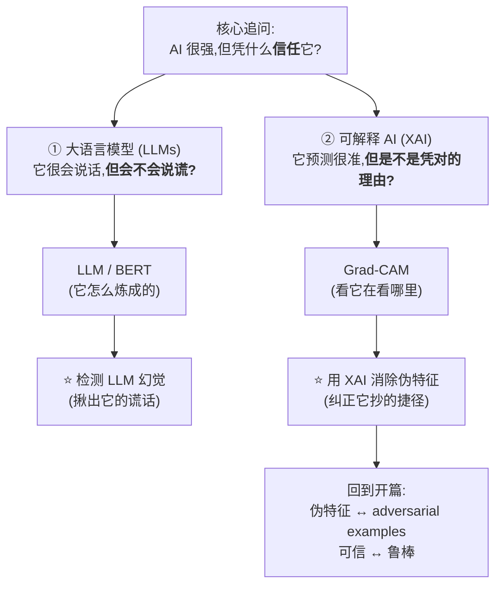
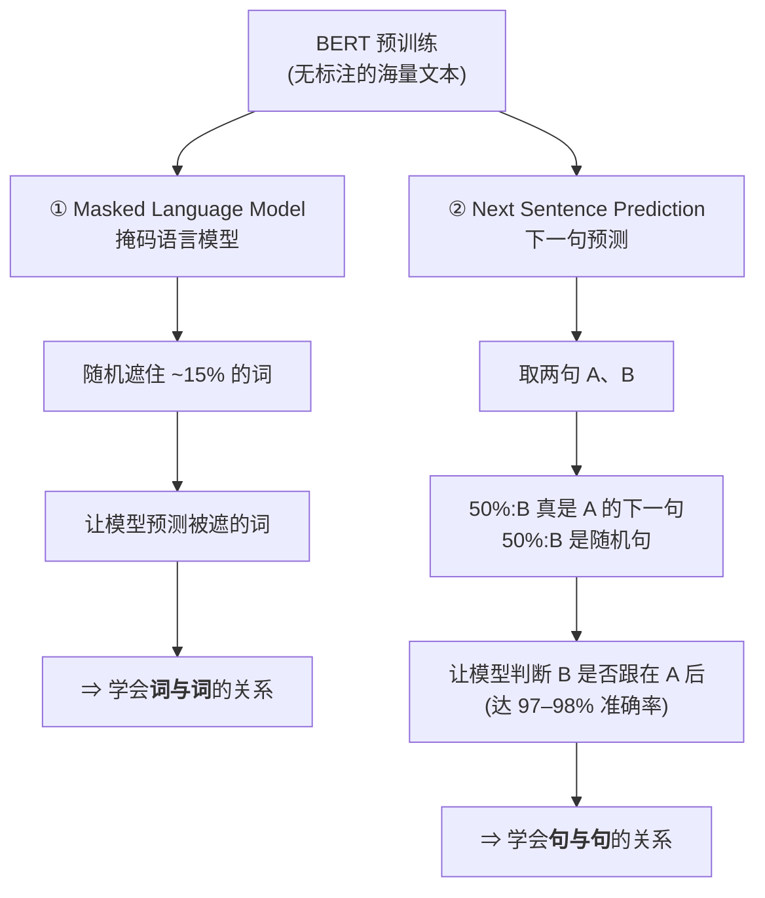
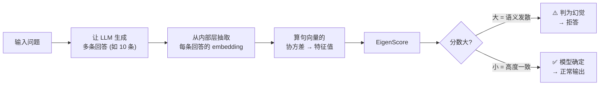
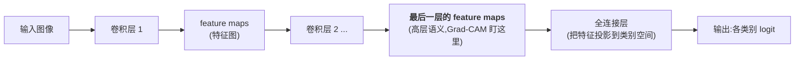
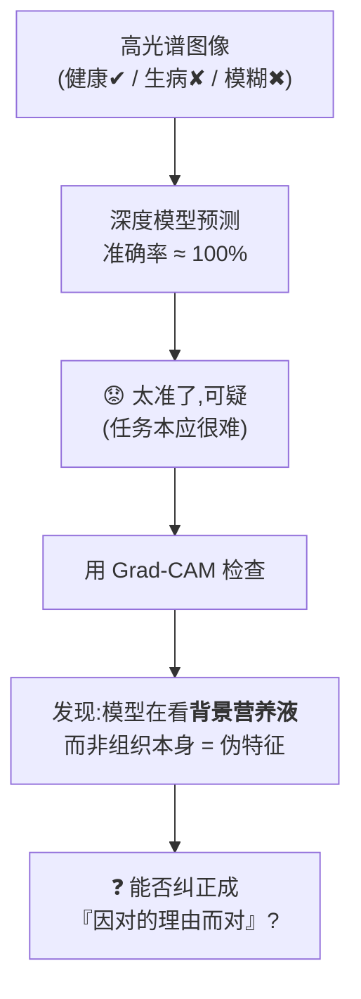
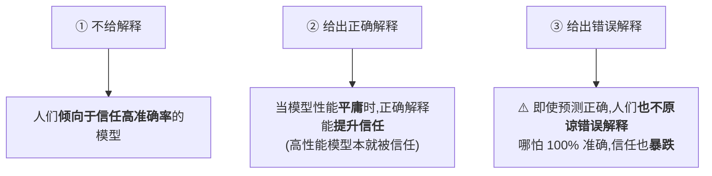

# Week 12 · AI 与网络安全的前沿趋势 (Current Trends in AI and Cybersecurity)

> **CSIT375/975 — AI and Cybersecurity** · Dr Wei Zong · University of Wollongong

> **学习目标 (Learning objectives)** — 读完本章你应该能够:
> - **说清什么是大语言模型 (LLM)**:定义 **LLM(Large Language Model,大语言模型)** 是一种深度学习算法;讲清它带来的**范式转变**——过去「**一个任务一个专用模型**(one model per task)」,如今「**一个模型干所有文本任务**」(summarize / translate / predict / generate);并知道训练它要用**超大规模数据集**(例 **ROOTS,1.6 TB**,由 Wikipedia、StackExchange 等子数据集构成);
> - **吃透 BERT 的来历与训练方式**:**BERT = Bidirectional Encoder Representations from Transformers**,底座是 **Transformers**(2017「Attention is all you need」提出,最初为**翻译**,后扩展到图像识别等;2018 由 Google 提出);说出它的 **4 类下游任务**(sentiment analysis / question answering / text prediction / text generation);**复述两个无监督预训练任务**——**Masked Language Model(掩码语言模型,随机遮 15% 词让模型预测)** 学**词与词**的关系、**Next Sentence Prediction(下一句预测,50% 真后继 / 50% 随机,达 97–98% 准确率)** 学**句与句**的关系;并解释**「先 pre-train,再用各下游任务的标注数据 fine-tune」**为何能用同一组初始权重得到多个高性能模型;
> - **讲清 LLM 幻觉 (hallucination) 与检测思路**:定义幻觉 = **输出语法通顺、连贯,但事实错误或无意义**;说出成因(训练数据局限、模型偏见)与高危领域(healthcare / law / engineering);**复述检测主线**——理想是消除幻觉但不可行,**退而求其次:检测到就拒答**;用**「让模型对同一问题多生成几次,看它确不确定」(measure uncertainty)** 来判断,且用 **LLM 内部状态 / embeddings(嵌入,文本的数值向量表示)** 来量化不确定性;
> - **理解 EigenScore 与 AUROC 两个度量**:**EigenScore**(由句向量协方差矩阵的特征值对数平均算出)——**小 = 句向量高度相关(确定)**、**大 = 语义发散(疑似幻觉)**;并能把它类比到 backdoor 防御 **STRIP 用 entropy** 的同款思路;**AUROC**(ROC 曲线下面积)= **无需指定阈值**的二分类评价指标,**1 = 完美、0.5 = 随机**;
> - **分清 explainability 与 interpretability**:定义 **XAI(Explainable AI,可解释 AI)**;**explainability(可解释性)= 让用户理解并信任输出**(像「能解释人类行为」),**interpretability(可诠释性)= 开发者钻进模型内部完全看懂计算过程**(像线性模型、决策树那样能 if-else 还原,像「诠释人脑机制」般更难);
> - **手推 Grad-CAM 的两步公式与 ReLU 直觉**:目标 = **类判别 (class-discriminative) 可视化**,**不改架构、不重训**地为任意 CNN 生成「模型在看哪里」的热图;第一步用**最后一层卷积层 (last conv layer) 的平均梯度**当每张 feature map 的**重要性权重** $\alpha_k^c=\frac{1}{Z}\sum_{i,j}\frac{\partial y^c}{\partial A^k_{ij}}$,第二步**加权求和再过 ReLU** $L^c=\mathrm{ReLU}\!\big(\sum_k \alpha_k^c A^k\big)$;并能用**「feature map 值 × 梯度同号才重要」**解释为何要 ReLU;
> - **背出 Grad-CAM 的能与不能**:能解释 image classification / image captioning、能揭示 **adversarial examples / backdoor(BadNets、Blended)** 的不合理关注区;**但对 invisible backdoor(SSBA,无固定触发模式)失效**;
> - **讲透「让 DNN 因正确理由而正确」**:用**植物表型 (plant phenotyping)** 例子说清 **spurious features(伪特征 / 捷径特征)** 与 **shortcut learning(捷径学习)**——「**对的预测,错的理由,不可信**」;复述用户纠正的**三种情形**(right-right 不管 / wrong-wrong 给标签 / **right-wrong 纠理由**);掌握两种纠正法——**counterexamples(反例:把伪特征区域随机化 / 替换后加回训练集)** 与 **RRR loss(Right for the Right Reasons,用二值掩码 A 惩罚无关区域的梯度)**;
> - **把全章收束成一句话**:**「能力」之外,前沿更关心「可信」**——LLM 强大但会**说谎(幻觉)**,DNN 准确但可能**抄捷径(伪特征)**;**XAI 是揭穿与纠正二者的统一工具**,而这又回到了课程开篇的 **adversarial examples**——**伪特征正是对抗样本能骗过模型的根因**,**adversarial robustness 与人类感知相通**,**消除捷径 = 同时提升可信与鲁棒**。

---

本周是整门课的**收官一讲**(讲师开场就说「today is also a short lecture, maybe finished in one hour」)。前面 11 周我们走了两条主线:**攻击与防御**(adversarial examples、backdoor、model stealing、deepfake…)和**用 AI 解决安全问题**(malware、入侵、垃圾邮件检测)。本周不再讲某一种具体攻防,而是抬头看**前沿趋势**——而贯穿这些前沿的,是一个比「准不准」更深的问题:**我们凭什么信任一个 AI 模型?**

这个问题有两个当下最热的切口,正好构成本章的两大半:

> 🧭 **一句话抓住全章** — 前沿研究的关键词从「**能力**」转向「**可信**」。两条线:**LLM 会一本正经地胡说(hallucination),我们用「多生成几次看它确不确定」来检测**;**DNN 会靠无关的「捷径」蒙对答案(spurious features),我们用「可解释 AI / Grad-CAM」看穿它、再用「反例」或「右理由损失 RRR」纠正它**。最后这两件事在课程开篇的 **adversarial examples** 处汇合——**模型能被对抗样本欺骗,根子就在它依赖伪特征;让它『因对的理由而对』,既更可信,也更鲁棒。**

---

## 一、大语言模型 LLM 是什么 (Slides 2–3)

我们先从这几年最出圈的 AI 谈起。**Large Language Model(大语言模型,简称 LLM)** 本质上仍是一种 **deep learning algorithm(深度学习算法)**——你已经熟悉的神经网络,只是规模极大、专门处理文本。现实里的成功例子你天天在用:**ChatGPT、BERT、Llama** 等等。它们能做的事可以用四个动词概括:**summarize(摘要)、translate(翻译)、predict(预测/补全)、generate(生成)**文本,以传达观点与概念。

这里有一个容易被忽略、但讲师特意强调的**范式转变 (paradigm shift)**,也是理解「为什么 LLM 是大事」的关键:

> 💡 **直觉:从「一任务一模型」到「一模型通吃」** — 把时钟拨回七八年前,如果你那时学 **NLP(Natural Language Processing,自然语言处理)**,会发现**每个任务都要单独造一个模型**:翻译用一套 encoder–decoder 架构、摘要用另一套技术、文本预测又是别的方法,彼此不通用。LLM 颠覆了这一点——**一个模型就能把这些任务全部一起做**。讲师说,站在七年前看,这「非常令人惊讶」。这就是 LLM 真正的分量所在:不是某个任务做得更好一点,而是**通用性**的质变。

这种通用能力是有代价的:**LLM 依赖超大规模数据集来训练**。slides 给的例子是 **ROOTS 数据集**,体量达到 **1.6 TB**——它本身是个「数据集的数据集」,由 **Wikipedia、StackExchange** 等多个开源**子数据集 (sub-datasets)** 拼成,用于语言建模。记住这个数字的意义不在于「1.6 TB」本身,而在于体会:**LLM 的能力是「大数据 + 大模型」喂出来的。**

---

## 二、BERT:一个具体的 LLM 怎么炼成 (Slides 4–5)

泛泛地说「LLM 很强」不够,本章挑了一个**具体、经典**的模型来讲透——**BERT**。讲它不是为了 BERT 本身,而是为了下一节的「幻觉检测」做铺垫:你得先知道这类模型**内部长什么样、怎么训练出来的**,才能理解「怎么用它的内部状态去抓它的谎话」。

### 2.1 BERT 与它的底座 Transformers (Slide 4)

**BERT** 是 **Bidirectional Encoder Representations from Transformers(基于 Transformers 的双向编码器表示)** 的缩写。名字里最关键的词是 **Transformers**——这是 BERT 的**底层架构 (underlying model)**。

> 📎 **拓展(超出 slides):Transformers 的来历** — 讲师补充:Transformers 出自约十年前那篇名字极其直白的论文 **「Attention is all you need」**。它**最初是为「语言翻译」任务设计**的,但作者当时就**预言**它能用于其他任务——后来果然应验:**仅仅一年后**人们就发明了 **Vision Transformer(视觉 Transformer)**,把它成功用到 **image recognition(图像识别)** 等领域。这正是为什么本章把它放进「前沿趋势」:一个为翻译而生的架构,如今几乎成了所有 AI 任务的通用底座。

BERT 由 **Google 的研究者于 2018 年**提出。它能胜任的语言任务很多,slides 给了四个代表:

| 任务 | 含义(讲师举的例子) |
|---|---|
| **Sentiment Analysis(情感分析)** | 判断一条影评是多正面还是多负面 |
| **Question Answering(问答)** | 让聊天机器人回答你的问题 |
| **Text Prediction(文本预测)** | 写邮件时帮你预测下一个词(如 Gmail 的补全) |
| **Text Generation(文本生成)** | 给几句话当主题,自动写出一整段文章 |

### 2.2 训练 BERT:两个无监督任务 (Slide 5)

这一节是 BERT 的核心,也是最考究「理解」的地方。BERT 的训练分两步走:**先 pre-train(预训练),再 fine-tune(微调)**。

**第一步:在「无标注数据」上做预训练。** 关键词是 **unsupervised(无监督)**——**不需要人工标签**。讲师点出这正是 BERT 的妙处:你可以**直接从互联网上下原始文本**就拿来训练,无需昂贵的人工标注。具体靠**两个无监督任务**:

- **① Masked Language Model(掩码语言模型,MLM)**:把输入里**随机 15% 的词「遮住」(mask)**,然后让模型去**预测那些被遮的词**。直觉很简单:要能填对空,模型必须理解上下文里**词与词之间的关系**。
- **② Next Sentence Prediction(下一句预测,NSP)**:对每个训练样本取两句话 A 和 B——**50% 的情况下 B 确实是紧跟 A 的下一句,另外 50% B 是从语料里随机抽的**。让模型**判断 B 是否真的跟在 A 后面**。训练好后,模型在这个任务上能达到约 **97–98% 的准确率**。它学到的是**句与句之间的关系**。

> 💡 **为什么要这两个任务?(一句话记忆)** — **MLM 教模型理解「词与词」,NSP 教模型理解「句与句」。** 一个管局部,一个管篇章,合起来 BERT 才既懂用词又懂行文。

**第二步:用「有标注数据」做微调 (fine-tune)。** 预训练完的 BERT 只是个「通才」,要拿它干具体活儿(如影评分类),就用该 **downstream task(下游任务)** 的**标注数据**去微调它:以预训练好的 BERT 作为**初始模型**,在你的标注数据上继续训练。

> 🔑 **关键理解:同一组初始权重,微调出多个专家** — slides 特意强调:**每个下游任务都得到一个「各自独立」的微调模型,尽管它们都是从同一组预训练参数初始化来的。** 这就是「pre-train 一次、fine-tune 多次」范式的精髓——**预训练的通用知识是共享的、可复用的**(昂贵但只做一次),**针对具体任务的专精则靠廉价的微调**分头完成。这也解释了为什么 LLM 能「一个底座、千般用途」。

> 🔑 **本节小结** — **BERT = Transformers(2017,本为翻译)做底座、Google 2018 提出的 LLM。** 训练 = **无监督预训练(MLM 学词、NSP 学句)→ 有标注微调(每个下游任务一个模型)**。记住这套「预训练–微调」骨架,下一节才能听懂「怎么从模型内部抓幻觉」。

---

## 三、检测 LLM 的幻觉 (Slides 6–9)

铺垫完 BERT,我们来到本章 **LLM 部分真正的主题——hallucination detection(幻觉检测)**。讲师交代得很直白:**之所以先介绍 LLM,就是为了讨论怎么检测 LLM 的幻觉。**

### 3.1 什么是幻觉,为什么危险 (Slide 6)

**LLM Hallucination(大语言模型幻觉)** 指模型产生的输出**连贯、语法正确,但事实上错误或根本没有意义 (factually incorrect or nonsensical)**——也就是**虚假或误导性的信息**。

> 🔍 **讲师的经典例子** — 拿一个**早期版本**的 ChatGPT 问:「`world weather` 这个词里有几个字母 M?」(注:`world weather` 里其实一个 M 都没有,但模型答「有一个 M」)。这句回答**语法完全正确、读起来通顺**,可**事实是错的、不合逻辑**——这就是一次典型的 hallucination。

**成因 (potential reasons)** 有两类:

- **训练数据的局限 (limitations in training data)**:如果训练语料里很少出现类似的问法/答案,模型遇到没见过的问题时只能**「猜」**,猜错了就成了幻觉;
- **模型自身的偏见 (biases in the model)**。

**为什么必须管?** 因为幻觉在**对准确性要求极高的领域**(**healthcare 医疗、law 法律、engineering 工程**)后果严重。讲师举例:若一个病人被 LLM **误诊为「健康」**,他可能因此**错过及时治疗**,酿成大祸。在这些领域,人们**无法容忍**幻觉。

### 3.2 检测主线:测「不确定性」 (Slide 7)

理想当然是让 LLM **彻底不产生幻觉**——但讲师明说**这在现阶段不可行**。于是退而求其次,采用一个工程上的**变通方案 (workaround)**:

> 🧭 **核心思路** — **检测目标 (goal):一旦检测到 LLM 在生成幻觉,就拒绝 (reject) 这个回答。** 抓不住「不犯错」,那就退一步做到「**犯错时我知道,于是不输出**」。

怎么检测?一个**已被证明有效**的方法是 **measure uncertainty(测量不确定性)**:

> 💡 **直觉:不确定 ≈ 在编** — 对**同一个问题让模型生成多个回答**。如果模型**对答案心里有底**,几次回答会高度一致;如果它**不确定**,几次回答就会**自相矛盾**——这往往就是在产生幻觉。讲师用上面的例子说:问「`world weather` 里有几个 M」,让它答 5 次,一次说 1 个、一次说 2 个、一次说 0 个——**答案飘忽,就说明它在胡说。**

> 📌 **课堂答疑:一个 prompt 还是多个 prompt?** — 有同学问:让模型多生成,是「**一个 prompt 让它连续生成多条**」还是「**用几个相似 prompt 各生成一条**」?讲师回答:**两种都行**,核心目的只是「**对同一问题/想法拿到多个回答**」。实践中甚至可以把问题**稍微换个说法**(同一个意思有很多种表达),效果可能更好。**关键永远是:多生成 + 算不确定性。**

**那「不确定性」具体怎么量化?** 用 **LLM 的 internal states(内部状态)**,也就是 **embeddings(嵌入)**:

> 📎 **拓展(承接前几周):embeddings 就是「特征」换了个名字** — 神经网络由很多层组成,**某些内部层的输出**可以被当作输入的**有意义的特征**。在 LLM 语境里,这种内部输出就叫 **embeddings(嵌入)——文本(词 / 短语 / 整篇文档)的数值表示,捕获其语义,通常存成向量 (vectors)**。讲师特意点回 **Week 4 clean-label backdoor**:那时我们把图像分类网络**最后一个隐藏层**的输出当作输入的「特征」;这里完全是同一个思想,**只不过 LLM 里不一定取最后一层(常取中间某层),且换了个名字叫 embedding**。一句话:**embedding = 特征 = 模型对输入「意思」的内部数值理解。**

于是检测流程是:让 LLM 对一个输入**生成多条(如 10 条)回答 → 从内部层抽出每条的 embedding → 用这些 embedding 之间的「散不散」来度量不确定性**。

### 3.3 用 EigenScore 量化不确定性 (Slide 8)

具体的量化指标叫 **EigenScore(特征值分数)**。它背后是一段线性代数:**等价于「句向量的协方差矩阵 (covariance matrix) 的特征值 (eigenvalues) 取对数后求平均」**。

> 📎 **小提醒** — slides 明说 **EigenScore 的数学细节不在本课考察范围**。你只需把握它的**含义与方向**,不必会推导。

EigenScore 的方向性是关键(必记):

| EigenScore | 含义 | 解读 |
|---|---|---|
| **小** | 多条回答的**句向量高度相关 (highly correlated)** | 模型很**确定** → 大概率没幻觉 |
| **大** | 多条回答**语义发散 (diverse semantics)** | 模型很**不确定** → 大概率在产生幻觉 |

> 💡 **类比 STRIP / entropy(承接 backdoor 周)** — 这个套路是不是很眼熟?讲师点出:它和 backdoor 防御 **STRIP** 几乎一个思路——**STRIP 算的是 entropy(熵)**(熵大 = 随机性大),**这里算的是 EigenScore**(分数大 = 语义发散)。**同一种「用『散不散 / 乱不乱』来判断异常」的哲学,只是换了把尺子。** 实践中你甚至可以直接调库,**一行代码**算出 EigenScore,再用一个**阈值 (threshold)** 判定模型是否不确定。

### 3.4 怎么评价检测器好不好:AUROC (Slide 9)

有了 EigenScore,怎么证明它**比别的方法更好**?这就需要一个公平的评价指标——**AUROC**。

**AUROC**(**Area Under the Receiver Operator Characteristic curve**,ROC 曲线下面积)是评价**二分类器**质量的常用指标。它最大的好处,讲师反复强调:

> 🔑 **为什么用 AUROC:它是「免阈值」的指标** — 单看 EigenScore,你会纠结**阈值定多少**——0.5?0.4?0.1?**不同阈值结果天差地别**。AUROC 的计算**把所有可能的阈值都考虑进去了**,所以是 **threshold-free(无需指定阈值)** 的——这让不同分类器之间能**公平比较**。记住两个锚点:**AUROC = 1 是完美,AUROC = 0.5 等于随机猜。**(具体计算不考。)

**实验结果**:在 **LLaMA-7B**(Meta 开源的 70 亿参数版)、**Natural Questions** 数据集上,**EigenScore 大幅、稳定地优于以往方法**(如 **LN-Entropy** 和 **Lexical Similarity**)。讲师指出:哪怕只让模型生成 10 条回答,**EigenScore 与旧方法的差距已经很大**。

> 🔑 **本节小结(LLM 半部分收束)** — **幻觉 = 通顺但错的输出;检测 = 抓到就拒答。** 怎么抓:**多生成几条回答 → 抽 embedding → 算 EigenScore(大=发散=疑似幻觉)→ 用 AUROC(免阈值)证明它好。** 一条主线:**「不确定」就是「在编」,而不确定性藏在模型的内部状态里。** 大公司正砸重金解决幻觉,因为没人愿意自家产品「一本正经地胡说」。

---

## 四、可解释 AI (XAI):explainability ≠ interpretability (Slide 10)

LLM 那半部分问的是「**它会不会说谎**」;XAI 这半部分问的是另一个信任问题:「**它预测对了,但是不是凭对的理由?**」

**XAI(Explainable Artificial Intelligence,可解释人工智能)** 是一**套流程与方法**,目标是**让人类用户能够理解并信任机器学习算法产生的结果与输出**。

> 💡 **动机:准确 ≠ 可信** — 你已经用过 VGG、ResNet 这类图像分类器。就算模型说「90% 这是猫」,**你凭什么信它?** 万一它做了错事呢?XAI 的做法是:**追问模型「你为什么这么判断?」**——让模型**高亮出它依据的区域**。如果它高亮了猫的耳朵、脸,你就放心:这预测有理有据;但如果它**高亮的是天空**(因为训练集里猫都在白天拍、狗都在夜里拍,模型学会了「天亮就是猫」这种偷懒规则),那么**哪怕预测对了,理由也是错的,模型不可信**。这正是 XAI 要揭穿的。

这里有一个**必考的概念区分**——**explainability(可解释性) vs interpretability(可诠释性)**:

| | **Explainability 可解释性(本章重点)** | **Interpretability 可诠释性** |
|---|---|---|
| **面向谁** | **end-user(终端用户)** | **developer(开发者)** |
| **目标** | 提供对 AI 决策的**洞察**,以**建立信任**——相信它的决定基于事实、无偏见 | **钻进模型内部决策过程**,完全看懂结果是怎么算出来的,**提升对模型机理的信心** |
| **能做到的程度** | 即使不能完全看懂内部,也能**解释其行为** | 只对**简单模型**可行(如**线性分类模型**学一条分界线、**决策树**可转成一串 if-else 完全还原) |
| **类比** | 像**解释人类行为**:渴了喝水、饿了吃饭、见红灯停车(怕罚款)——**行为可解释** | 像**诠释人脑机制**:至今**无法完全做到** |

> 🔑 **一句话记牢** — **interpretability 是「看穿内部怎么算」(对复杂深度网络极难,人脑也做不到);explainability 是「让人理解并信任输出」(像我们能解释行为却看不透大脑)。** 本章的 Grad-CAM 属于 **explainability**。

---

## 五、Grad-CAM:看模型「在看哪里」 (Slides 11–16)

XAI 是个大框架,本章挑了其中最经典的一种技术深入讲——**Grad-CAM**。讲师拆字:**Grad = gradient(梯度)**,后面看公式你就懂为什么叫这个名。

### 5.1 Grad-CAM 的目标与优点 (Slide 11)

Grad-CAM 是一种 **class-discriminative(类判别)的可视化技术**:它能为**任意基于 CNN(卷积神经网络)的模型**生成**视觉解释**——直观说,就是画一张热图告诉你「为了判成这个类,模型在图像的哪块区域上看」。

它的**优点**很实用:

- **不需要改架构、不需要重训 (no architectural changes or re-training)**:直接套在已训练好的模型上;
- **能揭示模型的失败 (insight into failures)**:后面会看到,即便模型预测错了,Grad-CAM 也能让你**看懂它为什么错**;甚至能说明「看似离谱的预测背后其实有(模型自以为的)合理依据」。

> 📎 **拓展(超出 slides)** — Grad-CAM **专为 CNN 设计**;后来出现了不依赖 CNN、可用于其他架构的新技术。但 Grad-CAM 是 XAI 里的**经典必读 (must-read)**,理解它是入门 XAI 的钥匙。

### 5.2 核心思路:盯住最后一层卷积 (Slide 12)

> 🧭 **关键思想** — Grad-CAM **利用「流入最后一层卷积层 (last convolutional layer) 的梯度信息」,来衡量每个神经元对某个目标决策的重要性。** 为什么偏偏是最后一层卷积层?因为**它通常学到的是高层语义 (high-level semantics)**——越靠后的卷积层,捕捉的概念越抽象、越接近「这是什么物体」。

先把 CNN 的内部结构理一遍(理解架构是**可选**的,但有助于看懂公式):

讲师解释了这条流水线:输入图像经过**一连串卷积层**,每个卷积层的输出叫 **feature maps(特征图)**;**最后一层卷积层**输出的那组 feature maps **代表输入的高层语义**。之后通常接 **fully connected layers(全连接层)**,把高维 feature maps **投影到标签空间**(比如 CIFAR-10 要把上千维特征压到 10 个类)。**Grad-CAM 要做的,就是给最后这组 feature maps 里的每一张,算出一个「重要性」。**

### 5.3 两步公式 (Slide 13)

Grad-CAM 分**两步**:先给每张 feature map 算重要性权重,再加权求和得到热图。

**第一步:算每张 feature map 的重要性权重 $\alpha_k^c$。**

$$\alpha_k^c=\frac{1}{Z}\sum_{i}\sum_{j}\frac{\partial y^c}{\partial A^k_{ij}}$$

逐个符号读:
- $y^c$ = 类别 $c$ 的 **logit**(Grad-CAM 可以**针对不同类别**分别解释,比如既能问「为什么是狗」也能问「为什么是猫」,所以要**指定类别 $c$**);
- $A^k$ = **第 $k$ 张 feature map**;$A^k_{ij}$ 是它在位置 $(i,j)$ 的元素;
- $Z$ = feature map 里元素的**总数**,用来求平均(一个常数)。

**这个式子在说什么?**——**对第 $k$ 张 feature map 里的每个元素,求「类别 $c$ 的 logit 对它的梯度」,再取平均。** 直觉:**梯度大,意味着这张 feature map 稍微一变,最终输出就大变 ⇒ 它对这个类别很重要。** 所以用**平均梯度**当重要性权重,天经地义。

**第二步:加权求和,再过 ReLU,得到可视化热图。**

$$L^c_{\text{Grad-CAM}}=\mathrm{ReLU}\!\left(\sum_{k}\alpha_k^c\,A^k\right)$$

把每张 feature map $A^k$ 乘上它的权重 $\alpha_k^c$ 再求和——非常直接。最后套一个 **ReLU**(回忆其定义 $\mathrm{ReLU}(x)=\max(x,0)$:$x\ge0$ 返回 $x$,$x<0$ 返回 0;我们在 Week 1 讲 C&W 攻击时见过)。

> 🧮 **为什么要 ReLU?——「值 × 梯度同号才算数」(讲师重点讲解)** — ReLU 的作用是**只保留对目标类有正面影响的特征**。用一个最简情形理解:假设某 feature map 只有一个元素,我们要解释「猫」这个类。
> - **值 = 5,梯度 = +2(同号,乘积 > 0)**:梯度为正说明「要让模型更确信是猫,就该把这个值**调大**」;而它本来就是正的、且我们想让它更大——**方向一致,这是支持「猫」的重要特征 ✅**。
> - **值 = −5,梯度 = −2(同号,乘积 > 0)**:梯度为负说明「要更确信是猫,就该把值**调小**」;它本来就是负的、想更小——**方向也一致,同样重要 ✅**。
> - **值 = 5,梯度 = −2(异号,乘积 < 0)**:想更确信是猫却要把这个正值调小——**它不是我们想要的,与「猫」相悖**。乘积为负,**被 ReLU 滤掉 ❌**。
>
> 一句话:**feature map 值与梯度「同号」相乘为正 → 该特征支持目标类,保留;「异号」相乘为负 → 该特征更像别的类别,用 ReLU 砍掉。** 讲师强调:**若不加 ReLU,热图会高亮到目标类以外的区域,定位性能反而变差。**

### 5.4 Grad-CAM 的实战表现:能与不能 (Slides 14–16)

slides 用四组例子展示 Grad-CAM 的威力与边界:

| 场景 | Grad-CAM 表现 |
|---|---|
| **Image classification(图像分类)** (S14) | 问「为什么是猫」就高亮猫、问「为什么是狗」就高亮狗——**类判别**能力直观可见,建立信任 |
| **Image captioning(图像描述)** (S14) | 给「a group of people flying kites on a beach」这句生成,Grad-CAM **高亮风筝和人**;给「a man sitting at a table with a pizza」则**高亮披萨周边**——说明生成的描述**可被解释、可被信任** |
| **Adversarial examples(对抗样本)** (S15) | 用 **CAM**(Grad-CAM 的特化版)看:(a) 干净图(mountain bike,模型正确看向自行车);(b)–(d) 针对不同类的对抗样本——模型被骗成「goldfish」等,Grad-CAM 显示它**高亮了不合理的区域**,从而**暴露「这预测不可信」** |
| **Backdoor attacks(后门攻击)** (S16) | 对 **BadNets、Blended Attack**,Grad-CAM **能成功定位触发器 (trigger) 区域**,看出模型在盯着 trigger 做出指定预测 |

> ⚠️ **Grad-CAM 的局限(必记)** — **对 Invisible Backdoor Attack(隐形后门,即 SSBA,slides 标注为 "Ours")失效。** 原因:这种攻击**没有固定、可见的触发模式**(trigger 是隐形的),所以 Grad-CAM **无法把它高亮出来**。结论:**Grad-CAM 能揪出 BadNets/Blended 这类「有明显图案」的后门,但对隐形 trigger 的 backdoor 检测能力有限。** 这呼应了 Week 5(remove backdoor)讲过的内容。

> 🔑 **本节小结** — **Grad-CAM = 用「最后一层卷积的平均梯度」给每张 feature map 打分(第一步),再加权求和过 ReLU 画热图(第二步)。** ReLU 的意义:**只留「值与梯度同号」的、支持目标类的特征。** 它能解释分类/描述、揭穿对抗样本和可见后门,**但对隐形后门(SSBA)无能为力。**

---

## 六、让 DNN「因对的理由而对」:消除伪特征 (Slides 17–23)

Grad-CAM 让我们**看见**模型在看哪里。这一节是本章的**高潮**——既然能看见,能不能进一步**纠正**它?当模型「**预测对了,但理由错了**」时,我们怎么让它改过来?

### 6.1 问题设定:植物表型里的「太好了反而可疑」 (Slide 17)

讲师用一个真实的科学场景(发表在 **Nature Machine Intelligence**)切入:

> 🔍 **故事:好得不像真的** — 一个**植物表型 (plant phenotyping)** 团队想刻画**作物对病原体的抗性**。植物生理学家用 **hyperspectral imaging(高光谱成像)** 记录了大量数据,请来一位机器学习专家上深度学习。结果**预测准确率高得惊人**——**生理学家却起了疑心:「这结果好得不像真的 (too good to be true)」**,因为这任务连人类专家都很难,有些样本本就**无法定论 (ambiguous)**。用 XAI 一查,发现:**训练好的模型用的是与生物学问题无关的线索 (clues that do not relate to the biological problem)**——它在**作弊**。

这种「无关线索」就是关键概念:

> 💡 **核心术语:spurious features(伪特征 / 捷径特征)** — 指**与目标任务本身无关、但模型拿来「抄近道」蒙对答案的特征**。前面那个「白天的猫 / 夜里的狗 → 看天空判猫」就是经典例子。模型**「为了对的预测,学到了错的理由」(right predictions for the wrong reasons)**,因此**不可信**。
>
> 具体到这个例子:模型发现**生病的组织 (sick tissue) 会萎缩、变小**,于是它不去看组织本身,而是去看**培养液 / 背景 (the solution / background)**——「**只要背景里露出某种营养液,就判这块组织生病**」。预测虽然常常对,但这是**作弊**:**一旦把组织挪到别的背景、看不到营养液,模型立刻失灵。**

于是引出本节要回答的问题:**我们能否纠正模型,让它「因对的理由而做出对的预测」(right predictions for the right reasons)?**

### 6.2 三种情形:什么时候需要纠正 (Slide 19)

当我们用 XAI 观察模型时,会遇到三种情况,**只有第三种是本节要解决的**:

| 情形 | 预测 | 理由(解释) | 怎么办 |
|---|---|---|---|
| **Right for the right reasons** 对的预测,对的理由 | ✅ 对 | ✅ 对 | **无需任何反馈**,不用动 |
| **Wrong for the wrong reasons** 错的预测,错的理由 | ❌ 错 | ❌ 错 | **只需让用户给出正确标签**,模型学正确 label 即可 |
| **Right for the wrong reasons** ⭐ 对的预测,错的理由 | ✅ 对 | ❌ 错 | **必须纠正「理由」**——这是难点,也是本节主角 |

### 6.3 纠正法一:用反例 counterexamples (Slide 19)

第一种纠正思路很朴素:**既然模型靠某块无关区域作弊,那就破坏那块区域,逼它别再依赖它。**

**做法**:**识别出「错误解释」对应的区域**(如那块营养液),然后往训练集里**加入输入的「修改副本」**——把那些识别出的区域做如下处理之一:

- **随机化 (randomized)**:填入随机值;
- **改成替代值 (alternative value)**:如固定成某个常数;
- **替换 (substituted)**:用**同类别其他训练样本**对应位置的值来填。

> 💡 **直觉** — **核心是「抹掉模型用来作弊的线索」**。当同一类别的样本里,那块区域有时是营养液、有时是随机噪声、有时是别的颜色,模型就**没法再靠它偷懒**,只能回头去看真正相关的组织。这就是「**用反例纠正解释**」。

### 6.4 纠正法二:Right for the Right Reasons (RRR) 损失 (Slide 20)

第二种思路更直接地写进**训练损失**里:**既然不想让模型关注无关区域,那就在损失函数里惩罚「模型对无关区域的梯度」。**

> 🧭 **目标** — **最小化「模型输出对『无关区域内的 feature maps』的梯度」的大小 (magnitude)。** 梯度小 ⇒ 模型对该区域不敏感 ⇒ 它就不会再依赖那块区域做判断。

公式如下(**讲师笑称「这是本课最后一个复杂公式」**,别怕,拆开就好):

$$L=\underbrace{\text{Cross-Entropy}(\hat{y},y;\,c)}_{\text{① + ③ 标准交叉熵:预测要对}}\;+\;\lambda\underbrace{\sum_{n=1}^{N}\sum_{d=1}^{D}\left(A_{nd}\;\frac{\partial}{\partial h_{nd}}\sum_{k=1}^{K}\log\hat{y}_{nk}\right)^{2}}_{\text{② 右理由项 (Right Reasons):理由要对}}$$

**怎么读这个式子?** 讲师的诀窍是「**拆成几项分别看**」:

- **第 ① 和第 ③ 项 = 传统的 cross-entropy loss(交叉熵)**:就是你最熟的分类损失,**直接忽略其细节即可**(PyTorch 一行代码)。
  - 其中 $\hat{y}$ = 模型预测;$c$ = 给每个类的**重加权权重 (rescaling weight)**,用于**不平衡数据集**。讲师补充:**可以先把 $c$ 当作 1**。这其实就是 Week 9/10(malware、入侵检测)讲过的处理不平衡的招数之一——**给少数类更大的权重、多数类更小的权重**(另两招是上采样少数类、下采样多数类)。
- **第 ② 项 = 本方法的真正贡献,「学对的理由」**。逐符号读:
  - $N$ = 训练样本数(对所有样本求和);
  - $D$ = 最后一层卷积的 **feature map 数量**(常数);
  - $A$ = **binary mask(二值掩码)**,标记「**我们不想让模型关注的无关区域**」;
  - $h$ = **最后一层卷积层**(**和 Grad-CAM 用的是同一层**——所以这个损失本质是建立在 Grad-CAM 思想上的);
  - $\frac{\partial}{\partial h_{nd}}\sum_k \log\hat{y}_{nk}$ = **各类别 logit(的对数)对 feature map 的偏导(梯度)**——对所有类别 $K$ 求和,意味着「对所有类都不要依赖无关区域」;
  - 外面套 **squared L2 norm(平方 L2 范数)**,然后**最小化**它。

> 🧮 **第 ② 项一句话翻译** — **「用掩码 A 框出无关区域 → 算模型输出对这块区域 feature map 的梯度 → 把这些梯度的平方和压到最小。」** 梯度被压小,模型就对这块区域「无动于衷」,自然不会再拿它当判断依据。

> 📎 **拓展(讲师当堂纠的两个记号错)** — 此论文发在 **Nature**(非传统深度学习期刊),公式记号有两处不规范、但**不影响理解**:① 该处应是**偏导符号 (partial derivative)**;② 范数应写成 AI 文献标准的 **squared L2 norm**(双竖线、下标 2、上标 2),原文写得不严谨。**考试以「理解含义」为准,不必纠结记号。**

> 🖼️ **掩码 A 怎么用(讲师举例)** — 给定图像,**把「不想让模型关注的区域(如营养液)」在掩码里设为 1,把「相关区域(如组织本身)」设为 0**。这样第 ② 项就只「盯住」无关区域的梯度去惩罚。

### 6.5 实验结果:纠正后泛化变强 (Slides 21–22)

**先看「未纠正」的模型有多可疑 (Slide 21)**:用 **RGB 原图**训练准确率 **89%**,用 **hyperspectral 高光谱图**训练高达 **≈99%**(都用普通交叉熵,**不含 RRR 损失**)。**近乎完美反而可疑**——这任务连人类专家都觉得难。Grad-CAM 一看,果然:模型在**盯着营养液**作弊。

**再看「纠正前后」的对比 (Slide 22)**。实验的巧思在于:**在「抹掉了伪特征」的测试集上评估,看谁还撑得住**——把背景这些伪特征换成「非组织区域的逐通道均值」或「整图的逐通道均值」,真正学懂的模型应当**泛化 (generalization)** 不受影响。

| 测试设置 | 普通模型 (no corr.) | RRR 纠正后 |
|---|---|---|
| 原始(含伪特征) | ≈ 100%(可疑的高) | 略降(RGB −2%、HS −5% 左右) |
| 背景换成「**非组织区域**均值」 | 仍 ≈ **81%**(因这颜色仍接近营养液,作弊线索没完全断) | **泛化更好** |
| 背景换成「**整图**均值」(与营养液差异大) | **暴跌到 ≈ 50%**(作弊线索断了,原形毕露) | **明显优于普通模型** |

> 💡 **怎么读这张表** — 普通模型一旦**伪特征被抹掉就崩**(从 100% 掉到 50%),证明它确实在**靠背景作弊**;RRR 纠正后的模型**初始准确率略降一点点,却换来对不同背景的稳健泛化**——因为它学会了**只看组织本身**。讲师补充:这些「模型在看哪里」的判断,**全都是用 Grad-CAM 生成热图、再与原图叠加**得到的。**Grad-CAM 在这里既是「诊断工具」(发现作弊),又是「疗效检验工具」(确认纠正有效)。**

### 6.6 人为什么(不)信任 AI:一项调查 (Slide 23)

最后,slides 用一项 **106 人参与**的调查回答「解释如何影响信任」。让参与者给「**我相信这个 AI 学到了正确的分类规则**」打分(1–6),在三种条件下对比:

> 🔑 **三条结论(必记)** — ① **无解释时,人凭准确率信任**(越准越信);② **正确的解释能挽救「性能平庸」的模型的信任**;③ **错误的解释最致命——哪怕预测 100% 对,信任照样崩。** 一句话:**解释(explanation)对建立 AI 信任至关重要;光准没用,理由还得对。**

---

## 七、回到开篇:伪特征、对抗样本与鲁棒性 (Slide 24)

讲到这里,整门课画了一个漂亮的圆。讲师把「伪特征」一路连回**课程的第一周**:

> 🧭 **闭环洞察(全课收束)** — **adversarial examples(对抗样本)正是「模型依赖伪特征」的铁证**:我们只给图像加一点点**人眼难辨的微扰 (perturbation)**,模型预测就**天翻地覆**——这说明它依赖的根本不是稳健、本质的特征,而是脆弱的捷径。
>
> 而 **Week 3 的 adversarial robustness(对抗鲁棒性)** 给出了另一面证据:**经过对抗训练 (adversarial training) 的模型,其鲁棒性竟与人类感知 (human perception) 相通。** slides 复用了那张图——可视化「损失对输入像素的梯度」(注意:**这里是直接看输入梯度,不是 Grad-CAM**):**普通训练的模型,梯度像一片噪声;而对抗训练的模型,梯度竟隐约勾勒出物体轮廓,与人的感知吻合。**

> 🔑 **大一统的结论** — **「消除捷径学习 (shortcut learning)」把三件事统一了起来**:**如果我们能减少 / 移除模型对 spurious features 的依赖,就能同时(a) 建立对 AI 的信任,(b) 在实践中抵御 adversarial examples。** 换句话说——**让模型「因对的理由而对」,既更可信,也更鲁棒。** 这正是「AI 与网络安全」这门课从攻击讲到防御、最终想传达的核心价值观。

---

## 八、本章小结 (Key Takeaways)

- **课程定位**:Week 12 是**收官一讲(较短)**,主题从「能力」转向「**可信 (trustworthiness)**」。两大线:**LLM 会不会说谎(幻觉检测)** 与 **DNN 是否凭对的理由(可解释 AI)**,最终回到开篇的 **adversarial examples**。
- **LLM 与 BERT**:**LLM = 大规模深度学习算法**,带来「**一个模型通吃所有文本任务**」的范式转变,靠超大数据(**ROOTS 1.6 TB**)训练。**BERT = Transformers(2017,本为翻译)+ Google 2018**;预训练用**两个无监督任务**——**MLM(遮 15% 词预测,学词关系)** 与 **NSP(50/50 判下一句,97–98%,学句关系)**;再**按下游任务用标注数据微调**,同一组预训练权重 → 多个专精模型。
- **幻觉检测**:**Hallucination = 通顺但事实错 / 无意义**(成因:数据局限、模型偏见;高危:医疗/法律/工程)。**抓不住不犯错 → 检测到就拒答**。方法:**对同一问题多生成几条 → 抽 embedding(内部状态)→ 算 EigenScore**(**小=一致/确定,大=发散/疑似幻觉**;同 STRIP 的 entropy 思路)→ 用 **AUROC(免阈值,1=完美、0.5=随机)** 评价。结果:EigenScore 在 LLaMA-7B / Natural Questions 上**大幅超过** LN-Entropy、Lexical Similarity。
- **XAI 概念**:**explainability(让用户理解并信任输出)≠ interpretability(开发者看穿内部计算,仅对线性模型/决策树等简单模型可行)**。类比:能**解释**人的行为,却难**诠释**人脑。
- **Grad-CAM(两步公式必会)**:**类判别可视化、不改架构不重训**。① 重要性权重 = 最后一层卷积的**平均梯度** $\alpha_k^c=\frac{1}{Z}\sum_{i,j}\frac{\partial y^c}{\partial A^k_{ij}}$;② 热图 = **加权求和 + ReLU** $L^c=\mathrm{ReLU}(\sum_k\alpha_k^c A^k)$。**ReLU 的意义:只留「值与梯度同号(乘积>0)」的、支持目标类的特征。** 能解释分类/描述、揭穿对抗样本与可见后门(BadNets/Blended),**但对隐形后门 SSBA 失效**。
- **让 DNN 因对的理由而对**:**spurious features(伪特征)= 与任务无关却被拿来抄近道的特征**(植物例子:看背景营养液而非组织 → 「对预测、错理由、不可信」)。三情形:**right-right 不管 / wrong-wrong 给标签 / right-wrong 纠理由(主角)**。两种纠正法:**① counterexamples**(把伪特征区域随机化/替换后加回训练集);**② RRR loss**——在交叉熵外加**「右理由项」**,用**二值掩码 A** 框出无关区域、**最小化输出对该区域 feature map 梯度的平方 L2 范数**($h$ 即 Grad-CAM 用的最后一层卷积)。结果:**普通模型抹掉伪特征即崩(100%→50%),RRR 模型略降准确率却换来稳健泛化**。信任调查:**无解释→凭准确率信;正确解释→救平庸模型;错误解释→哪怕 100% 准也信任暴跌**。
- **全课闭环**:**对抗样本 = 依赖伪特征的铁证;对抗鲁棒性与人类感知相通**(对抗训练模型的输入梯度勾勒出物体轮廓)。**消除捷径学习 = 同时获得「可信」与「鲁棒」。**

> 📌 **一页纸记忆锚点** — **前沿 = 从「准」到「可信」。LLM 半:幻觉(通顺但错)→ 多生成看不确定 → embedding 算 EigenScore(大=幻觉,类比 STRIP 的 entropy)→ AUROC(免阈值,1/0.5)评价;底座 BERT = Transformers + MLM(学词)+NSP(学句)+ 微调。XAI 半:explainability(信任,对用户)≠ interpretability(看穿,对开发者)→ Grad-CAM:① 末层卷积平均梯度=权重,② 加权和+ReLU(值×梯度同号才留);能揪可见后门、揪不了 SSBA → 伪特征(植物看营养液=右预测错理由)→ 纠正:反例 / RRR 损失(掩码 A 压无关区梯度)→ 普通模型抹背景即崩,RRR 泛化强;解释错=信任崩 → 闭环:伪特征↔对抗样本,消捷径=可信+鲁棒。**

---

## 九、与课程主线 / 相邻周的关联

| 关联点 | 说明 | 对应章节 |
|---|---|---|
| **承接 Week 4–5(backdoor)** | Grad-CAM 能定位 **BadNets / Blended** 的 trigger,却对 **invisible backdoor(SSBA)** 失效——直接复用 backdoor 周的攻击概念;EigenScore 又类比 backdoor 防御 **STRIP 的 entropy** 思路 | §五、§三 |
| **承接 Week 9–10(malware / 入侵检测)** | RRR 损失里的 **per-class rescaling weight $c$** 正是这两周讲的**不平衡数据**处理三招之一(重加权 / 上采样 / 下采样) | §6.4 |
| **回到 Week 1–3(对抗样本 / 鲁棒性)** | 全章最后明确收束:**对抗样本 = 伪特征的证据;对抗训练的鲁棒性与人类感知相通;消除捷径 = 可信 + 鲁棒**。前沿话题把整门课串成一个圆 | §七 |
| **回顾 Week 1 基础(ReLU / 梯度)** | Grad-CAM 的 ReLU 直觉、「沿梯度方向移动可增大目标 logit」直接复用 Week 1 讲 FGSM / C&W 时的梯度概念 | §5.3 |
| **录音位置(说明)** | 本周内容**完整且自包含**在 `CSIT375975 Lecture 12-transcript.txt`(开篇「today we're talking about Current trends in AI and cybersecurity」起,结尾「this concludes this subject」止),与 25 页 slides **高度一致,未散落到相邻周**(Lecture 11 结尾仅预告本讲)。本指南据二者完整整合 | 全章 |
| **录音尾段答疑(超出 slides)** | 课末有同学问「**XAI 与 LLM 有关吗**」。讲师答:**Grad-CAM 只用于 CNN,与 LLM 无关**;LLM 也有自己的 XAI 技术,例如 **probing(探针)**——在 LLM 的某个中间层(如第 3/5 层)**外接一个简单线性模型**,看该层 embedding 是否已含某任务(如情感)的信息,从而判断「哪一层学到了什么」。**属课外延伸,了解即可** | — |

> 🧭 **课程收尾预告** — 讲师在本讲结束时宣布:**「至此本课所有主题讲完。」下一周(Week 13)是复习课 + 讲解期末考试 (final exam)**;并提醒 **Assignment 2 下周截止**。本指南是「用 AI 解决安全」与「攻击/防御」两条主线的**前沿落点**,也是全课的句号——复习时可把它当作把前 11 周串起来的「总览图」。
