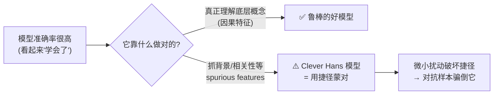
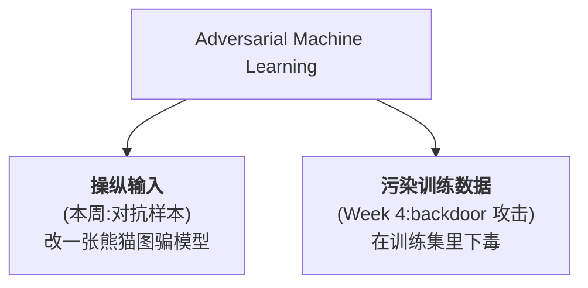
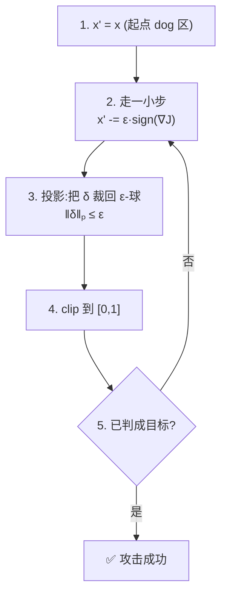
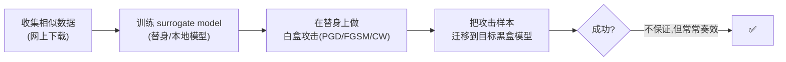
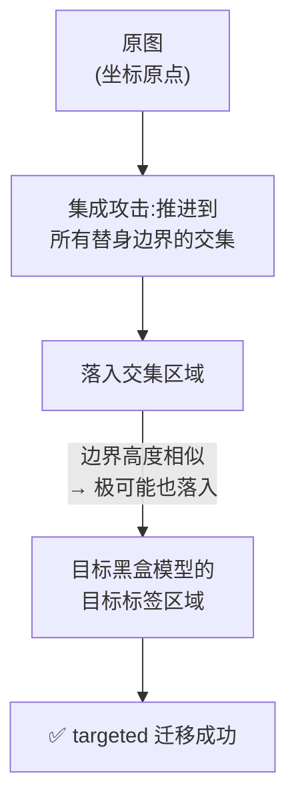

# Week 2 · 对抗样本 (Adversarial Examples)

> **CSIT375/975 — AI and Cybersecurity** · Dr Wei Zong · University of Wollongong

> **学习目标 (Learning objectives)** — 读完本章你应该能够:
> - **解释** Clever Hans 效应与 **spurious features(伪相关特征)**,说清楚"模型准确率高"为什么不等于"模型真懂",并把它和 adversarial example 联系起来;
> - **下定义**:用数学语言写出 adversarial example($x' = x+\delta$、$\|x'-x\|_p < \epsilon$),解释 **p-norm / $L_p$ norm** 在 $p=1,2,\infty$ 时各是什么,并区分 **targeted vs. untargeted** 攻击;
> - **推导并复现** 三大白盒攻击 **FGSM、PGD、CW** 的核心公式与思想,讲清它们的强弱关系、为什么 FGSM 的 "+/−" 号要那样取、PGD 为什么要迭代、CW 为什么直接操作 logits;
> - **区分** white-box / grey-box / black-box 三种**威胁模型 (threat model)**,并说明每种下攻击者能做什么、不能做什么;
> - **解释** black-box 攻击的核心武器——**transferability(可迁移性)**:surrogate model、single vs. ensemble 方法,以及"决策边界相似"为什么能解释迁移成功;
> - **认识** physical attacks、**universal adversarial perturbations (UAPs)** 与 unrestricted attacks 这三类把对抗样本推向真实世界的扩展。

上一周我们把 AI 的基础——模型、训练流程、评估、PyTorch——打牢了。从这一周起,我们正式进入课程**第一部分(研究 AI 模型自身的安全漏洞)**的第一个、也是最基础的话题:**对抗样本 (adversarial examples)**。讲师反复强调,本章的 FGSM / PGD / CW 三个算法是**整门课的地基**——后面的 backdoor、模型窃取等很多技术都直接复用这里的方法,所以这一章"难一点是正常的,吃透了后面就轻松"。

整章的逻辑是一条层层递进的线:**先问一个尖锐的问题"模型真的学会了吗"(Clever Hans)→ 由此引出 adversarial ML 这个研究领域 → 给对抗样本下严格的数学定义 → 在"攻击者无所不知"的理想设定下造出三种白盒攻击 → 逐步收紧攻击者的知识,过渡到更现实的灰盒/黑盒攻击 → 最后把战场从数字世界扩展到物理世界、通用扰动和不受限攻击。**

> 📎 **本章横跨两节课的录音(重要)** — 这份"adversarial examples"slides 的内容实际讲了**两次课**:Lecture 2 因进度关系讲到 **black-box 攻击与决策边界可视化(slide 27)** 就下课了,讲师说"physical / UAP / unrestricted 下周继续";Lecture 3 一开头就**补完了后三节**(physical / UAP / unrestricted),然后才进入 Week 3 自己的主题(对抗鲁棒性/防御)。**本指南整合了这两节录音**,所以全部 13 节都有课堂讲解支撑,内容是完整的。后三节里和 Lecture 3 防御部分有承接关系的地方(如"把所有变换塞进优化"既用于物理攻击、也用于对抗防御),会用 📎 点出。

---

## 一、引子:模型真的"学会"了吗?——Clever Hans 效应

机器学习模型今天在各种任务上表现亮眼:**image classification(图像分类)、object detection(目标检测)、self-driving cars(自动驾驶)、speech-to-text(语音转文字)**……准确率动辄 90% 以上。但讲师抛出了一个让人不安的问题:**这些模型,会不会只是"聪明的汉斯"?**

> **🔑 例 (Worked example) — 一匹会"算术"的马**
> 1904 年,德国有一匹叫 **Hans** 的马,它的主人声称它会做简单算术。问它"1+2 等于几",它就用蹄子敲地三下,然后停下——观众欢呼。科学家研究后发现:**马根本不会算术**。它其实是在**读人的反应**——当它敲到正确次数时,围观者会不自觉地流露出期待/紧张的神情变化,Hans 捕捉到这个线索就停下来。换句话说,它用一个**和任务本身无关的"捷径"**蒙对了答案。这就是 **Clever Hans effect(聪明的汉斯效应)**。

把这个故事搬到机器学习上,就是本章的核心隐忧。看下面这个对抗样本的"开山例子":

> **🔑 例 — 一只被"改写"的熊猫(Goodfellow et al., 2015)**
> 一个图像分类器看一张熊猫照片,正确地说"这是 **panda**,置信度约 57%"。研究者算出一层**精心设计、再乘以极小系数缩小**的噪声 $\delta$,把它叠加到原图上。新图人眼看上去**和原图完全一样**,还是熊猫。可模型却以 **99% 的高置信度**说"这是 **gibbon(长臂猿)**"。
> 📎 **拓展(超出 slides 的经典数值)** — 这就是 Goodfellow 论文里那张著名的图:`57.7% panda` $+\;\epsilon\cdot\text{sign}(\nabla_x J)$($\epsilon=0.007$)$\to$ `99.3% gibbon`。slides 没给精确数字,但记住这个量级有助于理解"扰动有多小、欺骗有多强"。

为什么会这样?因为模型很可能根本没理解"什么是熊猫",它只是抓住了某些**伪相关特征**蒙对了:

> 📎 **关键概念 — Spurious features(伪相关特征)**
> 当模型靠**非因果 (non-causal) 的模式、背景或相关性**来做预测、而非真正理解任务时,就会出现 Clever Hans 效应。比如模型可能只是记住"图里有蓝色背景 → 判熊猫"。一旦你加的噪声破坏了这些背景线索,模型就崩了。一句话总结:**Correlation does not imply causation(相关不蕴含因果)**——模型学到的相关性,不等于它学到了底层概念。



这个"模型在用捷径"的经验证据 (empirical evidence),正是 **adversarial machine learning** 这个研究领域的起点。

---

## 二、什么是对抗机器学习 (Adversarial Machine Learning)

"对抗样本"只是更大图景里的一个具体技术。它所属的领域叫 **adversarial machine learning(对抗机器学习)**。讲师用 Google Trends 指出:这个话题**大约从 2016 年起才迅速变热**,至今仍是很新的方向。

它的官方定义(引自澳大利亚国防科技部 DST)可以浓缩成一句话:

> **Adversarial Machine Learning** — 攻击者**知道**有一个 ML 系统正被部署来对付他,于是利用对 ML 技术的了解,**操纵输入**或**污染训练数据**,来操控/规避这个学好的分类器,或利用算法弱点做出错误决策。

注意这个定义点出了**两条不同的攻击路线**,本课会分别在不同周展开:



本周聚焦**第一条路线——操纵输入**,也就是对抗样本。Week 4 再讲第二条(后门攻击)。

---

## 三、对抗样本的数学定义:扰动、p-norm 与攻击目标

### 3.1 定义:一次"小到看不见"的修改

给定一个原始输入 $x$(比如一张熊猫图),它的 **adversarial example(对抗样本)** $x'$ 是对 $x$ 做一点点修改得到的:

$$x' \leftarrow x + \delta, \qquad x' \approx x$$

其中 $\delta$ 是我们加上去的**扰动 / 噪声 (perturbation / noise)**。关键约束是 $x'$ 必须**和原图足够像**——像到人眼察觉不出。怎么把"足够像"变成可计算的条件?用**向量范数 (vector norm)**:

$$\|x'-x\|_p \;=\; \|\delta\|_p \;<\; \epsilon$$

也就是说,扰动 $\delta$ 的范数必须小于一个很小的常数 $\epsilon$。

### 3.2 p-norm($L_p$ norm):把一个向量压成一个数

> 📎 **为什么需要 norm?(课堂答疑的精华)** 有同学问:$x$ 和 $x'$ 都是图像,直接相减得到的还是一张"差异图像",而我们想要的是**一个数**来描述"差异有多大"。**p-norm 的作用,就是把一个向量(这里是扰动 $\delta$)变换成一个标量 (scalar),用来度量"噪声有多大"。** 算法生成攻击时,就靠它来确保噪声足够小、足够隐蔽。

向量 $v$ 的 **p-norm(也叫 $L_p$ norm)**,$p$ 取 $1,2,3,\dots$ 直到 $\infty$,定义为:

$$\|v\|_p = \left(\sum_i |v_i|^p\right)^{1/p}$$

公式看着抽象,但代入具体的 $p$ 就很直观了:

| $p$ | 名称 | 公式 | 直观含义 |
|---|---|---|---|
| $p=1$ | $L_1$ norm | $\|v\|_1=\sum_i\lvert v_i\rvert$ | 所有元素**绝对值之和** |
| $p=2$ | $L_2$ norm | $\|v\|_2=\sqrt{\sum_i v_i^2}$ | **欧氏距离 (Euclidean distance)** |
| $p=\infty$ | $L_\infty$ norm | $\|v\|_\infty=\max_i\lvert v_i\rvert$ | 元素里**最大的绝对值** |

> ⚠️ **与 Assignment 1 的直接关联** — 讲师明确说:**Assignment 1 生成攻击时,你必须用 $L_p$ norm 约束你的扰动**(常见是 $L_1$ 或 $L_\infty$)。批改代码会算出你的攻击与原图之差的范数,**确保它小于规定的常数 $\epsilon$**,否则不算合格的对抗样本。所以这三个范数的计算务必烂熟。

### 3.3 两种攻击目标:targeted vs. untargeted

| 攻击类型 | 目标 | 例子 | 难度 |
|---|---|---|---|
| **Untargeted attack(无目标攻击)** | 只要让模型**判错**就行,错成什么不管 | 熊猫 → 随便什么(鸟也行) | 较易 |
| **Targeted attack(有目标攻击)** | 让模型输出**预先指定**的标签 | 熊猫 → **必须**判成"猫" | 较难 |

记住这个区分——它会贯穿后面每一个攻击算法(FGSM/PGD/CW 都各有 targeted 与 untargeted 两个版本)。

---

## 四、White-box 攻击(一):FGSM —— 一步到位的快攻

从这里开始进入本章的"三大白盒攻击"。先明确什么是**白盒**:

> 📎 **White-box(白盒)假设** — 攻击者**对目标模型无所不知**:模型架构、模型权重 (weights)、训练数据、训练算法……全都知道。可以想象成攻击者下载了一份模型的本地副本。**关键推论:既然知道全部权重,攻击者就能计算损失对输入的梯度 $\nabla_x J$——而这个"对输入求梯度"正是生成对抗样本的钥匙。**

**FGSM(Fast Gradient Signed Method,快速梯度符号法)** 是历史上第一个对抗样本算法,核心卖点就一个字:**快**——只需**计算一次梯度**就能造出攻击。简单,却出奇有效,只要三行:

$$
\begin{aligned}
&\textbf{(1)}\quad \delta \leftarrow \epsilon \cdot \text{sign}\big(\nabla_x J(\theta, x, y)\big)\\
&\textbf{(2)}\quad x' \leftarrow x + \delta \qquad(\text{“}+\text{” 用于 untargeted,}y=\text{真实标签};\ \text{“}-\text{” 用于 targeted,}y=\text{目标标签})\\
&\textbf{(3)}\quad x' \leftarrow \text{clip}(x', 0, 1)
\end{aligned}
$$

逐行拆解($J(\theta,x,y)$ 是训练模型用的 **cost function**,$\theta$ 是模型参数,$x$ 是输入,$y$ 是标签):

1. **算梯度再取符号**:$\nabla_x J$ 是损失对输入图像的梯度(回忆 Week 1:梯度指向损失**增长最快**的方向)。$\text{sign}(\cdot)$ 把每个分量压成 $+1$ 或 $-1$(正数→+1,负数→−1)——这就是"gradient **signed** method"名字的由来。再乘上一个很小的常数 $\epsilon$,得到隐蔽的噪声 $\delta$。
2. **加到原图上**得到 $x'$。
3. **clip 回合法范围**:PyTorch 里像素值在 $[0,1]$,所以把结果裁剪回这个区间,保证 $x'$ 仍是一张合法图像。

> **🔑 例 — FGSM 把熊猫变长臂猿** 取熊猫图 $x$,设 $y=$ panda(真实标签),算 $\text{sign}(\nabla_x J)$ 得到噪声,乘以极小的 $\epsilon$ 缩小后加到熊猫上。新图人眼仍是熊猫,但喂给模型,它高置信度地说"gibbon"。这正是开篇那只熊猫背后的算法。

### 4.1 "+/−"号到底怎么回事(讲师重点强调)

这是 FGSM 最容易绕晕的地方,讲师花了很大篇幅。核心要抓住**"沿梯度方向 = 增大损失 = 增大错误"**这条因果链:

- **Untargeted(用 $+$,$y$=真实标签)**:沿梯度方向移动输入 → **增大** cost function。而 cost 衡量的是模型的**误差**,误差被人为推高 → 模型预测出错。我们不在乎错成什么,所以这是无目标攻击。
- **Targeted(用 $-$,$y$=目标标签)**:这里 $y$ 不是真实标签,而是我们想要的**目标**(如"鸟")。沿梯度**反方向**移动 → **减小**"把熊猫判成鸟"这件事的损失 → 模型越来越"自信地"把熊猫说成鸟。

> 📎 **讲师的"别钻牛角尖"提醒** — 同学纠结于"+ 是加噪声、− 是减噪声"。讲师说:其实 $x-\delta$ 等价于 $x+(-\delta)$,**两者都是在'施加噪声',只是把噪声翻了个方向**。不要纠结加减这个操作本身,**真正要懂的是"什么时候该用 +、什么时候该用 −"——答案就是上面那条"增大/减小误差"的逻辑。**

### 4.2 FGSM 的效果与短板

只有三行代码,FGSM 在多个数据集上却很猛:

| 数据集 | $\epsilon$ | error rate | average confidence |
|---|---|---|---|
| **MNIST**(手写数字 0–9) | 0.25 | **99.9%** | 79.3% |
| **CIFAR-10** | 0.1 | **87.15%** | 96.6% |

(error rate 越高 = 攻击越成功;confidence 是模型对错误预测的自信程度。)

**短板:FGSM 常常做不成 targeted 攻击。** 讲师用决策边界图解释:

> **🔑 例 — 为什么 FGSM 的 targeted 会失败** 在 bird/cat/dog 三类的决策空间里,起点是 dog($x$),目标是 cat。FGSM 一步算出的 $\delta$ 方向是固定的;沿这个方向走,**无论 $\epsilon$ 取多大,这条直线都可能永远进不了 cat 的决策区域**。一步定生死,方向不对就到不了——这就引出了下一个算法。


---

## 五、White-box 攻击(二):PGD —— 迭代版 FGSM

**PGD(Projected Gradient Descent,投影梯度下降)** 是比 FGSM **强得多**的白盒攻击,尤其擅长 **targeted 攻击**。它的思路一句话就能说清:

> **核心思想:既然一步(FGSM)可能走不到,那就走很多步。PGD = 迭代版的 FGSM。**

算法(以 targeted 为例):

$$
\begin{aligned}
&\textbf{1.}\quad x' \leftarrow x \quad(\text{初始化为原图})\\
&\textbf{2.}\quad x' \leftarrow x' - \epsilon\cdot\text{sign}\big(\nabla_{x'} J(\theta, x', y)\big)\quad(\text{targeted 用 “}-\text{”,}y=\text{目标标签})\\
&\textbf{3.}\quad \delta \leftarrow \text{clip}\big(\|x'-x\|_p,\ -\epsilon,\ +\epsilon\big)\quad(\text{要求 }\|\delta\|_p\le\epsilon)\\
&\textbf{4.}\quad x' \leftarrow \text{clip}(x+\delta,\ 0,\ 1)\\
&\textbf{5.}\quad \text{若 }x'\text{ 还没被判成目标,回到第 2 步}
\end{aligned}
$$

理解要点:
- **第 2 步**就是一次 FGSM 更新(走一小步);
- **第 3 步是"Projected"的来历**:每走一步后,把累积的扰动 $\delta$ **投影/裁剪回 $\epsilon$-球**($\|\delta\|_p\le\epsilon$),保证总扰动不超标、仍然隐蔽;
- **第 5 步**:检查有没有成功,没成功就继续迭代。一步一步地,$x'$ 从 dog 区域慢慢挪进 cat 区域。



**效果(CIFAR-10,untargeted,$\epsilon=0.03$)**——PGD 也能轻松改成 untargeted(把 $-$ 换成 $+$、$y$ 换成真实标签):

| | 简单模型 | 复杂模型 |
|---|---|---|
| 干净图准确率 | 92% | 95% |
| FGSM 攻击后 | ~30% | ~30% |
| **PGD 攻击后** | **~1–3%** | **~1–3%** |

PGD 把模型准确率打到近乎 0,**显著强于 FGSM**。

---

## 六、White-box 攻击(三):CW —— 直接操纵 logits

**CW(Carlini-Wagner)攻击** 是第三个经典且广泛使用的强白盒攻击。本课**只关注它的 $L_2$ 版本**(扰动用 $L_2$ norm 度量,追求在 $L_2$ 意义下失真最小;CW 还有 $L_0$、$L_\infty$ 版本,本课不涉及)。

它和 FGSM/PGD 的**根本区别**在于攻击的"靶子":

> 📎 **关键洞察:FGSM/PGD 攻击的是 loss function(如 cross-entropy);CW 不用 loss,直接操纵 logits。**
> 回忆:模型对一张图输出若干 **logits**(每个类别一个原始分数),**最大的 logit 对应的类别就是预测结果**。CW 的想法是:既然预测只看哪个 logit 最大,那我**直接去改 logits** 不就行了?例如三类 cat/bird/dog 的 logits 是 $1,2,3$(预测 dog),要让它判 cat,就想办法把 cat 的 logit 顶上去。

**Targeted 的核心目标**:让**目标类的 logit 比第二大的 logit 大出一个指定的 gap(间隔)**。优化目标($L_2$ 版本):

$$\min_{w}\ \Big\|\tfrac{1}{2}(\tanh(w)+1)-x\Big\|_2^2 \;+\; c\cdot f\!\Big(\tfrac{1}{2}(\tanh(w)+1)\Big)$$

这个式子有三个零件,逐个拆:

**零件 1 — `tanh` 重参数化,保证生成的是合法图像。** 我们优化的自由变量是 $w$(可以任意取值)。$\tanh(w)$ 把任意实数压进 $(-1,1)$,$+1$ 后变 $(0,2)$,再 $\times\tfrac12$ 变 $(0,1)$——正好是合法像素范围。所以

$$x' = \tfrac{1}{2}(\tanh(w)+1)$$

**永远是一张合法图像**,这就是我们要生成的对抗样本。

**零件 2 — 第一项 $\|x'-x\|_2^2$,衡量隐蔽性。** 即对抗样本与原图在 $L_2$ 下的(平方)距离,越小越隐蔽。这正是"$L_2$ 版本"的来历。

**零件 3 — $f$ 函数,衡量"欺骗力"(最难的一块):**

$$f(x') = \max\Big(\ \max_{i\neq t}\big(Z(x')_i\big) - Z(x')_t,\ \ -k\ \Big)$$

其中 $Z_i$ = 第 $i$ 个 logit,$t$ = 目标类,$k$ = 指定的 gap,$c$ = 平衡两项的常数。理解它要看**两层 max**:

> **🔑 例 — 跟着 logits 走一遍 CW 的最小化** 三类 cat/bird/dog,初始 logits $=1,2,3$,bird 图被正确判成 bird(3),目标是 cat。
> - **内层 $\max_{i\neq t}$**:取"**除目标外**最大的 logit"。此刻 cat 是目标(=1),所以在 bird(2)、dog(3) 里取最大 → **dog=3**。
> - 减去目标 logit:$3 - 1 = 2$。这个 **gap=2** 就是 $f$ 返回的值,**它是"最强竞争者"与"目标"之间的差距**。
> - **最小化 gap**:优化会压低竞争者、抬高目标。gap 从 $2$ 慢慢降。当 gap 变成**负数**(例如目标 cat 的 logit 超过其他所有类)时,**模型就把图判成 cat 了——targeted 攻击成功**。
> - **外层 $\max(\cdot, -k)$ 是"刹车"**:我们不想无限优化下去。一旦 gap 小到 $-k$,$f$ 就返回常数 $-k$;此时 $f$ 不再随 $w$ 变化,优化自动停下。

**两个旋钮的作用:**
- **$k$ 控制 gap 大小 = 控制置信度**:$k$ 越大,目标 logit 领先越多,模型预测**越自信**——但也引入**越多失真 (distortion)**。
- **$c$ 平衡隐蔽性与欺骗力**:第一项管隐蔽、第二项管欺骗,$c$ 调两者的权重。

**Untargeted 版本**很直接:反过来,让**正确类的 logit 比最大的小一个 gap** 即可。

> ⚠️ **与 Lab 2 的关联** — 你会在 **Lab 2** 里实验 CW,亲眼看到 $k$ 对失真的影响:`k=1`(小 gap)失真很小、几乎看不出;`k=40`、`k=80`(大 gap)失真越来越明显。**"gap 越大 → 越自信 → 越多失真"** 这个权衡要记牢。

### 6.1 三大白盒攻击对比(必背)

| | **FGSM** | **PGD** | **CW($L_2$)** |
|---|---|---|---|
| 一句话 | 一步梯度符号法 | 迭代版 FGSM | 直接优化 logits 的 gap |
| 迭代? | 否(算一次梯度) | 是(多步 + 投影) | 是(优化 $w$) |
| 攻击对象 | loss function | loss function | **logits**(不用 loss) |
| 速度 | **最快** | 慢 | 慢 |
| 强度 | 弱(targeted 易失败) | 强 | 强,失真可控 |
| 关键旋钮 | $\epsilon$ | $\epsilon$、步数 | $k$(gap/置信度)、$c$(平衡) |

> **讲师的话** — "FGSM、PGD、CW 是这门课算法的**地基**。理解了它们,后面的攻击都很相似,会容易很多。"

---

## 七、威胁模型谱系:white / grey / black box

前面三种攻击都假设攻击者"无所不知"(白盒)。现实中攻击者掌握的信息往往少得多。按**攻击者对目标模型的知识量**,从多到少排成一个谱系:


| 威胁模型 | 攻击者知道什么 | 能否算 $\nabla_x J$? | 现实程度 |
|---|---|---|---|
| **White-box** | 架构、权重、训练数据、训练算法——**全部** | **能** | 最理想化 |
| **Grey-box** | **部分**:也许知道架构,也许能看到 logits 输出 | **不能**(通常假设) | 居中 |
| **Black-box** | **只能观察输入和输出**(如:喂熊猫图,得到标签"panda") | **不能** | **最现实** |

> ⚠️ **Assignment 1 Task 1 的硬性规则** — A1 Task 1 实现的是 **black-box 攻击**,遵循"普通假设":**你不能用目标模型去计算关于输入的梯度**。这正是 Week 1 提到的"保分红线"——instruction 明确禁止算梯度,违反会被扣分甚至清零。原因很简单:能算 $\nabla_x J$ 就意味着你知道了全部权重,那就不是黑盒了。

**核心难题**:白盒攻击(FGSM/PGD/CW)全都依赖 $\nabla_x J$。灰盒/黑盒下算不了梯度,**白盒方法直接用不了**。那怎么办?

---

## 八、Black-box 攻击:用 transferability 迁移

讲师选择聚焦**黑盒**——因为黑盒能攻破,加上一点额外知识灰盒自然也能攻破。核心武器叫 **transferability(可迁移性)**。

### 8.1 基本策略:训练一个"替身"



1. **训练一个 surrogate model(替身模型)**:用**相似的架构 + 相似的数据**,在本地训练一个模型。虽然不知道目标(比如 Google 部署的分类器)的确切架构和训练数据,但可以猜一个常见架构、从网上下载相似数据。
2. **在替身上做白盒攻击**:替身是我们自己的,拥有完全访问权,尽管用 PGD/FGSM/CW。
3. **把攻击迁移到目标**:在目标黑盒模型上评估这些攻击。
- **直觉**:**相似的模型 + 相似的数据 → 学到相似的东西 → 一个模型上的攻击,很可能也能骗倒另一个。**
- 注意:不保证成功。而且如果你**恰好用了相同架构 + 相同数据**,这其实已经把黑盒降级成了**灰盒**(引入了部分知识)。

### 8.2 Single model vs. Ensemble(关键实验结论)

**单模型法**:只用**一个**替身生成攻击,迁移到目标。

**集成法 (Ensemble)**:用**多个**替身模型的集成来生成攻击。表格里的"$-$某模型"表示**留一法**——集成里包含除该模型外的所有模型,被排除的那个就是要攻击的黑盒目标。

| | 单模型(Single) | 集成(Ensemble) |
|---|---|---|
| **Untargeted** | 还不错(平均 ~20% 迁移成功;能把目标准确率压到 <40%) | **极强**(可把目标准确率压到 0–5%) |
| **Targeted** | **很差**(只有 1%–4%) | **大幅提升**(可达 ~40%–45%) |

**一句话结论**:**Untargeted 攻击就算单模型也能迁移得不错;但 targeted 攻击必须靠集成多个替身,成功率才能从个位数飙到 40%+。** Assignment 1 Task 1 给你一个黑盒目标模型,你就可以用这套(尤其是集成)策略去攻破它。

> **🔑 例 — 迁移攻击长什么样** 一张清晰的"water buffalo(水牛)"图,经集成攻击后被识别成"rugby ball";一张"zebra(斑马)"图被识别成"beehouse"。讲师坦言:图像上的噪声其实**挺明显**——因为图像里小噪声本就容易被察觉。

> **🔑 例 — 把噪声藏进音乐里(audio black-box)** 图像里藏不住噪声,但**音乐里可以**!用一个替身模型生成扰动,迁移到商用黑盒语音模型(如商业语音识别)。播放时你只听到背景里有点杂音,**被音乐盖住了**,远不如图像噪声扎眼——里面却藏着秘密指令。(参考 *devil-whisper*。)同一套"训练替身→攻击→迁移"的思路,换个领域照样成立。

---

## 九、为什么迁移有效?——决策边界可视化

讲师用决策边界 (decision boundary) 的可视化,给"迁移为什么能成功"一个直观解释。

**怎么画的**(以正确预测为例,slide 26):
- **原点** = 原始图像;
- **X 轴** = VGG-16 的**梯度方向**(回忆:沿此方向走 = 做 untargeted 攻击);
- **Y 轴** = 一个**随机正交方向**;
- 坐标轴每一格 = **1 个像素值**;
- 边界内的所有点 = 被(对应模型)正确分类为真实标签的区域。

**关键观察 1(untargeted,slide 26)**:**不同模型(VGG、各种 ResNet、GoogLeNet)的决策边界长得很像。** 所以当你沿 VGG-16 的梯度方向把图推出 VGG 的边界时,它**很可能也同时被推出了其他模型的边界**。这解释了为什么**单模型的 untargeted 攻击迁移效果就不错**,集成则几乎稳压到 0。

**关键观察 2(targeted,slide 27)**:
- **X 轴**换成**targeted adversarial 方向**(= 对抗图与原图之差);
- 边界内的点都被分类为**目标标签**(如 window);
- 集成攻击包含除 **ResNet-101** 外的所有模型,ResNet-101 是被攻击的黑盒目标。

要让 targeted 攻击对**所有模型同时**成功,攻击样本必须落在**所有替身边界的交集**里。而一旦落进这个交集,**它极有可能也落进目标模型(ResNet-101)的目标标签边界内**——于是 targeted 攻击成功。这就解释了 **ensemble 为什么能把 targeted 成功率从个位数拉到 40%+**。



> 📎 **Lecture 2 录音到这里就下课了**("今天先到这,下周继续对抗样本")。以下三节(physical / UAP / unrestricted)由 **Lecture 3 开头补完**,下面的讲解已据该录音整理。

---

## 十、Physical Adversarial Examples(物理对抗样本)

前面所有攻击都是**数字攻击 (digital attack)**:直接修改数字格式的文件像素,再把文件喂给分类器。但模型大量部署在**真实物理世界**里(自动驾驶就是典型),于是出现了**物理对抗样本**——攻击被**摄像头等物理设备捕获**后仍能骗倒背后的模型。讲师强调:这可能造成**生命损失**等严重危害——想象自动驾驶系统被一个路牌上的贴纸骗了。

**为什么物理攻击更难?物理世界的四大挑战**(slide 29):

| 挑战 | 含义 |
|---|---|
| **Environmental conditions(环境条件)** | 自动驾驶摄像头到路牌的**距离、角度连续变化**,还有光照、天气等都在变 |
| **Spatial constraints(空间约束)** | 真实路牌上,攻击者**只能改路牌表面**,**无法操纵背景** |
| **Physical limits on imperceptibility(物理可感知性限制)** | 扰动不能太小,否则**摄像头根本拍不出来、直接被忽略** |
| **Fabrication error(制造误差)** | 攻击最终要**打印**出来,要保证打印后和生成的扰动差别不大(打印机有颜色误差) |

**解法:Robust Physical Perturbation(RP₂,鲁棒物理扰动,Eykholt et al., 2018)**——一种 targeted 攻击。核心思想一句话:

> **把所有可能的变换都"塞进"扰动的计算里**——不同距离、不同角度、不同光照、打印误差(用 **Non-Printability Score, NPS** 度量)等。如果不考虑这些,攻击被摄像头拍下来后就可能失效。最后:把优化出的扰动**打印在纸上,按 mask 裁剪出形状,贴到目标物体(路牌)上**。

> 📎 **这个思想会再次出现(承接 Lecture 3 防御部分)** — 讲师特别点出:"把各种变换塞进优化以提升扰动鲁棒性"是个**通用套路**。它不仅用于物理攻击,后面讲**对抗防御**时,攻击者为了**击穿防御**也会用同样的思想造 **adaptive attack(自适应攻击)**——比如让对抗样本扛得住防御方做的图像预处理。(文献里这套"对变换分布求期望"的技术叫 **Expectation Over Transformation, EOT**;下一节的 UAP 也是同一个内核。)

优化目标(slide 31):

$$\min_{\delta}\ \lambda\,\|M_x\cdot\delta\|_p \;+\; \text{NPS} \;+\; \mathbb{E}_{x_i\sim X^V}\,J\big(f_\theta(x_i + T_i(M_x\cdot\delta)),\ y^*\big)$$

逐项拆解(讲师按"先看记号再读公式"的方法讲的):
- **$M_x$ = 扰动掩码 (mask)**:和输入同尺寸的 2D 矩阵,**路牌表面区域为 1,背景区域为 0**。式中 $M_x\cdot\delta$ 的"$\cdot$"是 **element-wise(逐元素)乘法,不是矩阵乘法**——背景处 $0\times\delta=0$,于是**扰动只保留在路牌表面**,正好满足"不能动背景"的空间约束。第一项就是最小化这块掩码扰动的 $L_p$ norm(让它尽量小)。
- **$\text{NPS}$ = Non-Printability Score**:衡量打印失真,本课不深入。
- **$X^V$ = 变换后路牌的分布**:把目标物体在**物理变换**(不同距离/角度拍照)和**合成变换**(随机裁剪、调亮度等)下的样子都囊括进来。$x_i$ 是从这个分布(可理解成"一大堆被各种变换过的路牌图"的集合)里取的一张。
- **$T_i(\cdot)$ = 对齐函数 (alignment function)**:物体怎么变,扰动就得**同样地变**再贴上去。比如路牌被旋转了某个角度,就要把扰动也旋转**相同角度**再加上去,这样攻击才真实可用。
- **$J$** = 损失(如 cross-entropy),**$f_\theta$** = 要攻击的分类器,**$y^*$** = 目标标签。$y^*$ 是目标标签 ⟹ 最小化损失 = 生成 **targeted** 攻击(回忆第六节 PGD/CW)。

**结果**(slide 32):掩码形状可以自己定(贴满整块,或做成涂鸦状的特定形状)。优化后在真实世界取得**很高的 targeted 成功率(接近 100%)**,而且**从不同距离、不同角度拍摄都依然奏效**——正是因为优化时通过 $X^V$ **显式考虑了这些变换**。目标标签例子:**"Speed Limit 45"**(把 STOP 等路牌骗成限速牌)。

---

## 十一、Universal Adversarial Perturbations(通用对抗扰动 UAP)

目前为止,每个扰动都是**针对某一张特定输入**量身定制的(给这张路牌算的 $\delta$,换张图就不灵)。新问题:**能不能有一个固定的扰动,加到任意输入 $x_1,x_2,x_3,\dots$ 上都能骗倒模型?** 能——这就是 **Universal Adversarial Perturbation(UAP,通用对抗扰动)**,"universal" = **image-agnostic(与图像无关)**。

> ⚠️ **UAP = Assignment 1 Task 2** — 讲师明说:"A1 的 task 2 就是要你生成 universal adversarial perturbations。" 所以本节(untargeted 与 targeted UAP)是 **A1 Task 2 的直接考点**,务必吃透算法。

### 11.1 Untargeted UAP(Moosavi-Dezfooli et al., 2017)

目标:找一个**与图像无关、很小**的扰动向量 $v$,让**自然图像以高概率被误分类**。两个约束:

$$
\textbf{(1)}\ \ \|v\|_p \le \xi \qquad\qquad
\textbf{(2)}\ \ \mathbb{P}_{x\sim\mu}\big(\hat{k}(x+v)\neq \hat{k}(x)\big)\ \ge\ 1-\delta
$$

- (1):扰动幅度受 $\xi$ 限制(够小、够隐蔽);
- (2):对数据分布 $\mu$ 中**随机一张图** $x$,加上**同一个** $v$ 后预测**改变**的概率 $\ge 1-\delta$;
- 注意符号(照搬原论文,故意和前面不同):$v$ 是 UAP,$\hat{k}$ 是分类器,**这里的 $\delta$ 不是扰动,而是"期望准确率"**——比如想把准确率打到 10%,就设 $\delta=0.1$,则 fooling rate $\ge 1-0.1=90\%$。

> 📎 **记号提醒(讲师反复强调)** — 深度学习文献**没有统一的符号约定**,不同论文 $\delta$、$v$ 含义可能不同。本节沿用原论文记号,目的是你课后读原文不至于混乱。看公式先认记号,别想当然。

**生成算法(贪心地逐张"补刀"):**

```
v ← 0                                    # 初始无扰动
while 攻击成功率还不够高:
    for 每个训练样本 x_i:
        if  k̂(x_i + v) == k̂(x_i):        # 当前 v 还骗不倒这张图(预测没变)
            求一个最小的额外扰动 r,使 k̂(x_i + v + r) ≠ k̂(x_i)   # 把它推过决策边界
            v ← v + r                    # 把这点扰动累加进通用扰动
# 直到 v 能骗倒(几乎)所有图,或达到最大迭代
```

- "求最小的额外扰动 $r$" 这一步**就是一次对抗攻击**:既然要最小化 $L_2$ norm,**用 $L_2$ 版 CW 正合适**;也可以用 **PGD**(把扰动投影回范数球)。范数选 $L_2$ 还是 $L_\infty$ 都行,$L_2$ 只是其一。
- 直觉:UAP 是把"每张图各需要的那一点点扰动"**一点点累加、求同存异**,最后凝练出一个对**所有**图都管用的公共扰动。

**结果**(slide 34–36):为不同架构(用 $p=\infty$、$\xi=10/255$)算出的 UAP,**不同网络呈现不同的视觉花纹**(VGG-16、各种 ResNet、GoogLeNet 的 UAP 图案各异);幻灯片里像素值被**放大以便观看**,实际**相当小**。把 GoogLeNet 的 UAP 加到各种图上:狗 → elephant、另一张 → forks……**同一个固定扰动**骗倒了一大批不同图像。

> 📎 **为什么 UAP 比单图攻击更"看得见"?** 因为它要同时骗倒**所有**图像,扰动幅度往往略大,有时能在天空等平滑区域**隐约看出**花纹——这是"通用"必须付出的代价。

> ⚠️ **A1 Task 2 实用 tip(讲师原话)** — 上面"先用一条、再逐步加入"的渐进式子集做法是**为语音任务**设计的(见下)。**图像分类的优化容易得多**,所以 Task 2 里你**不必**搞渐进子集,**一开始就把所有图像放进去**一起生成 UAP 即可。

### 11.2 Targeted UAP for Speech(Zong et al., 2021 —— 本课讲师自己的工作)

对抗机器学习**几乎在所有 AI 领域通用**,不止图像。这里把 UAP 推到**语音转文字 (speech-to-text)**(如 Siri),且做成 **targeted**——让**任意语音**都被转写成**同一句预设文本**(如 "open the door")。这需要一次**视角的彻底翻转**:

| | 传统对抗样本 | Targeted UAP |
|---|---|---|
| 输入 $x$ 的角色 | **信号 (signal)** | 被当成施加到 $\delta$ 上的**"噪声"** |
| 扰动 $\delta$ 的角色 | 加在信号上的噪声,**为每个输入定制** | **信号本身**——它**携带分类结果的信息**(如目标转写文本) |
| 要鲁棒于什么 | —— | $\delta$ 要对"被加上各种不同输入音频"这件事**鲁棒** |

换句话说:既然不管喂什么音频、模型都输出 "open the door",那**这句话的信息其实藏在 $\delta$ 里**;输入音频反倒成了叠加在 $\delta$ 上的"干扰"。$\delta$ 必须**对这种干扰鲁棒**。

**生成算法**——输入:目标模型 $f$、一组音频(训练集)、目标短语 $t$(如 "open the door")、最低成功率 $\eta$。思路和物理攻击一脉相承:**让 $\delta$ 对不同输入鲁棒**。

> 📎 **为什么语音要"渐进加子集",图像不用?** 语音识别用的是 **CTC loss**,比图像分类的 cross-entropy **难优化得多**。所以这里从**只含 1 条音频**的子集 $G$ 起步:当 $\delta$ 能攻破 $G$ 里全部音频后,**才加入一条新音频**;子集逐步从 1 长到 **150 条**。(图像简单,故 Task 2 可一次性全放——见上方 tip。)

> **🔑 例 — UAP 的 "aha moment"(顿悟时刻)** 横轴 = 子集里音频数,纵轴 = 攻破全部音频所需迭代数。**早期**:1 条音频约需 20 次迭代,到 ~10 条时升到 ~40 次(要照顾的音频更多,自然更难)。**但子集涨到约 20 条时,迭代数反而开始下降**;到 125 条时,再加一条新音频往往**只需 1–2 次更新**就能适应。这说明过了"20 条"这个临界点,**UAP 已经"学会"了输入音频带来的扰动模式,变得越来越鲁棒**——对一大批音频鲁棒后,攻破新音频几乎不费力。

两个关键实证结果:
- **泛化到未见音频**:UAP 只用训练集生成,再去测试集(700+ 条 2–4 秒音频)上验证。用 **1 条**音频训练 → 对新音频成功率近 **0%**;用 **50 条** → **90%**;用 **150 条** → 近 **100%**。训练音频越多,UAP 对新输入越鲁棒。
- **UAP 本身就是"信号"(验证视角翻转)**:直接把生成的 UAP $\delta$(纯"噪声")**喂给模型转写**。结果:只取 UAP 前 10% → 转写出 "use airplane";取前半 → "use airplane mode"……**切片转写结果与目标短语逐段对应**。这有力证明了 $\delta$ 确实**像正常语音一样携带信息**——"$\delta$ 是信号"的假设成立。

---

## 十二、Unrestricted Adversarial Examples(不受限对抗样本)

传统对抗扰动都用 **p-norm 约束**。但讲师指出一个深刻问题:**p-norm 不一定是衡量"隐蔽性"的好指标。**

> **🔑 例 — 一根白条说明 p-norm 的失灵** 想象一张黑底图,中间一根白色竖条。把这根白条**整体右移一两个像素**——人眼看上去**完全是同一张图**。但两张图相减、算 p-norm,**值会非常大**!原因:**p-norm 是逐像素比较的,它根本不理解"像素的位移"**。可见 p-norm 小 ≠ 人眼看着像;p-norm 大也 ≠ 人眼看着不同。

既然如此,何必把自己绑死在 p-norm 上?于是有了"不受限"攻击:

- **Spatially Transformed AEs(空间变换对抗样本,Xiao et al., 2018)**:不加像素噪声,而是**让像素朝某些方向轻微移动、平滑地改变几何形状**。例:手写数字 **"0" 被几何微调后骗倒模型**,人眼仍认得是 0。其 p-norm 可以很大,但视觉上几乎无差别。
- **Semantic manipulation(语义操纵,Bhattad et al., 2019)**:用**生成模型 (generative models)** 造攻击,**改变颜色**——而且常改成**目标类里常见**的颜色。例:ground truth 是 pretzel(椒盐卷饼),染上绿色 → 被判成 golfcart / sandbar;ground truth 是 cat,把地面染成蓝色 → 被判成 **tench(丁鱥鱼,常见于蓝色水景)**。讲师提醒:这些图**颜色怪怪的**,因为是五六年前的工作,生成模型还不够好。
- **Content-based unrestricted attack(基于内容的不受限攻击,Chen et al., 2024)**:**现代生成模型大幅进步**,能造出更自然的攻击——如热气球**微调天空颜色 + 气球纹理**、草莓**加一点纹理**,语义不变却能骗倒模型,几乎看不出是攻击。

> 📎 **为什么这类攻击值得警惕** — 核心理念:**只要攻击看起来"合理 (reasonable)",就没必要用 p-norm 约束自己。** 讲师强调:**unrestricted 对抗样本至今仍很难防御,是一个开放问题 (open question)。** 这也呼应了整条演进线:从"严格 p-norm 的像素噪声"(FGSM/PGD/CW)→ 几何/语义/生成式的不受限攻击,趋势是**越来越自然、越来越难用简单距离度量察觉**,也越来越贴近真实威胁。

---

## 本章小结 (Key takeaways)

- **Clever Hans 效应 & spurious features**:模型准确率高 ≠ 真懂。它可能靠**非因果的伪相关特征**(如背景)蒙对——熊猫被微小噪声一改就变长臂猿,正是证据。**相关 ≠ 因果。** 这是 adversarial ML 的起点。
- **对抗样本定义**:$x'=x+\delta$ 且 $\|\delta\|_p<\epsilon$。**p-norm 把扰动向量压成一个标量来度量"噪声多大"**:$L_1$=绝对值和,$L_2$=欧氏距离,$L_\infty$=最大绝对值。攻击分 **targeted(指定错成什么)/ untargeted(错就行)**。
- **三大白盒攻击(地基,必背)**:都假设攻击者知道一切、能算 $\nabla_x J$。**FGSM** = 一步梯度符号法($\delta=\epsilon\,\text{sign}(\nabla_x J)$,快但 targeted 易失败,"+"增大误差/"−"奔向目标);**PGD** = 迭代版 FGSM + 投影回 $\epsilon$-球,更强;**CW** = 不碰 loss,**直接优化 logits 的 gap**(tanh 保证合法图像,$k$ 控制 gap/置信度/失真,$c$ 平衡隐蔽与欺骗)。
- **威胁模型谱系**:**white(知一切,能算梯度)→ grey(部分知识,不能算梯度)→ black(只看输入输出,最现实)**。白盒方法都依赖梯度,黑盒下用不了。**A1 Task 1 是黑盒,严禁用模型算梯度(保分红线)。**
- **Black-box = transferability**:训练 **surrogate(替身)模型**做白盒攻击,再**迁移**到目标。**Untargeted 单模型就能迁移得不错;targeted 必须用 ensemble(留一集成)**,成功率从 1–4% 飙到 40%+。直觉:相似模型+相似数据→相似行为。
- **为什么迁移有效**:**不同模型的决策边界高度相似**。untargeted 推出一个模型的边界常同时推出其他模型;targeted 落进所有替身边界的交集时,极可能也落进目标模型的目标区域。
- **三类"走向真实世界"的扩展**(由 Lecture 3 开头补完):
  - **Physical(物理攻击,RP₂)**:把距离/角度/光照/打印误差等**所有变换塞进优化**(EOT 思想),mask 逐元素乘只在路牌表面加扰动,$T_i$ 让扰动跟物体同步变换;打印裁剪贴上去,各距离角度下 targeted 成功率近 100%。**这个"塞变换求鲁棒"的套路后面打防御时还会用(adaptive attack)。**
  - **UAP(通用扰动)= A1 Task 2**:一个 **image-agnostic** 的固定扰动骗倒几乎所有输入;算法是"逐张补刀、把每张所需的最小扰动累加进 $v$"(内层可用 CW/PGD)。讲师把它做成**针对语音的 targeted 版**——**视角翻转:$\delta$ 是携带目标文本的信号、输入音频才是噪声**;语音用 CTC loss 难优化故渐进加子集(1→150),约 20 条出现"**aha moment**"迭代骤降;UAP 切片直接转写出目标短语,证明"$\delta$ 是信号"。
  - **Unrestricted(不受限)**:**p-norm 不是好的隐蔽性指标**(白条平移一像素→视觉相同但 p-norm 巨大),于是放弃 p-norm,用**几何变换 / 语义换色 / 生成模型**造更自然的攻击;**至今仍很难防御,是开放问题。**
- **实务**:Lab 2 实验 CW(看 $k$ 如何影响失真);**Assignment 1 Task 1 = 黑盒攻击**(用 $L_p$ norm 约束扰动、禁止算梯度),**Task 2 = 生成 UAP**(图像任务可一次性用全部图像、不必渐进加子集)。**FGSM/PGD/CW 吃透了,后面 backdoor 等很多攻击都在复用它们。**
