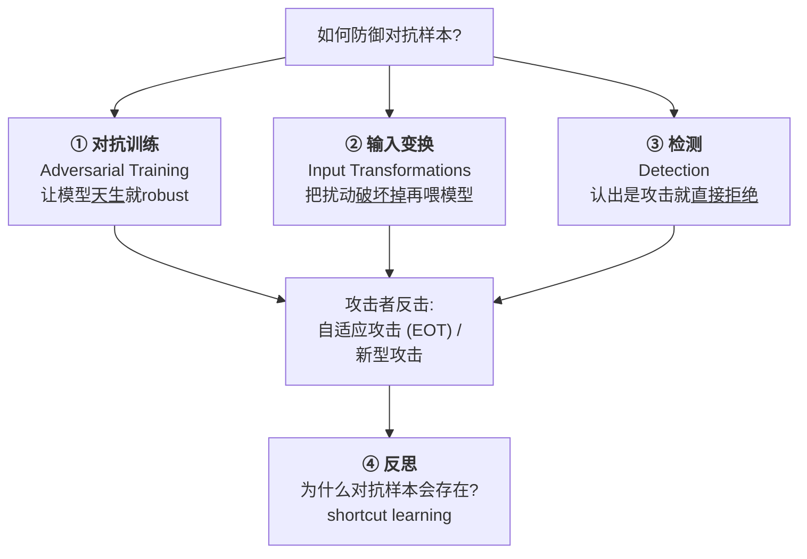
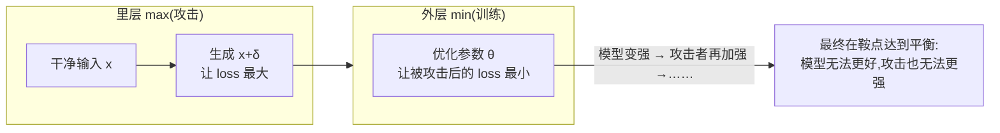
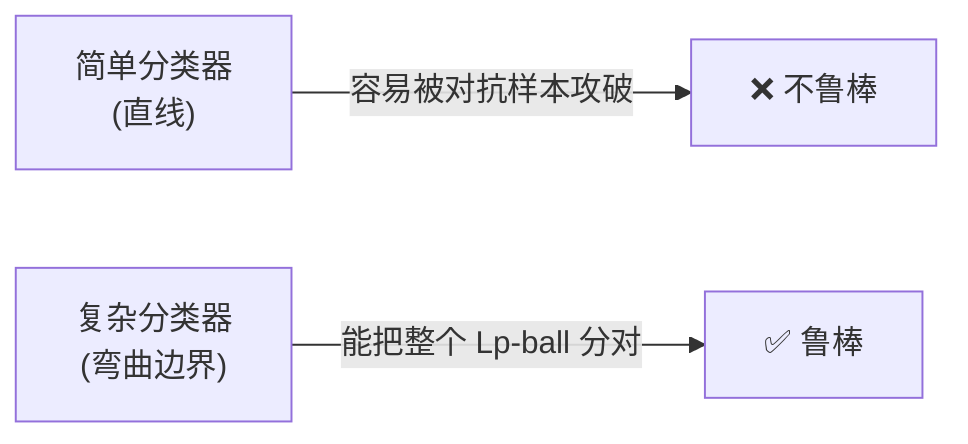
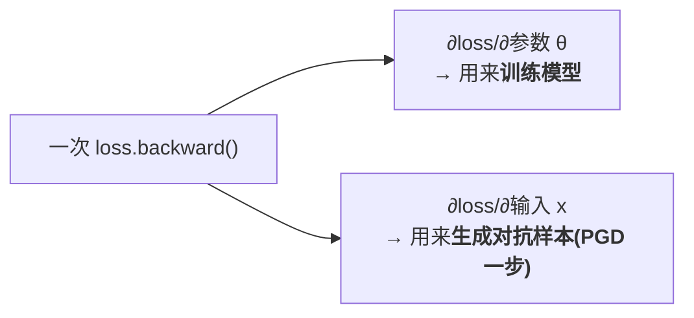
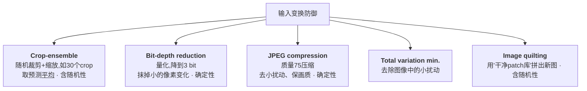
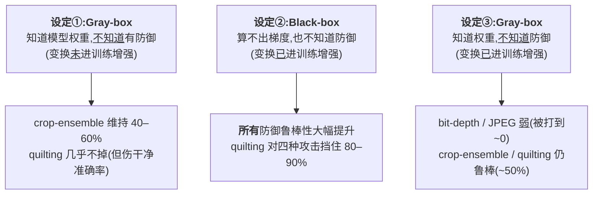
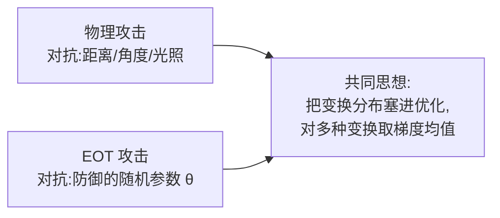
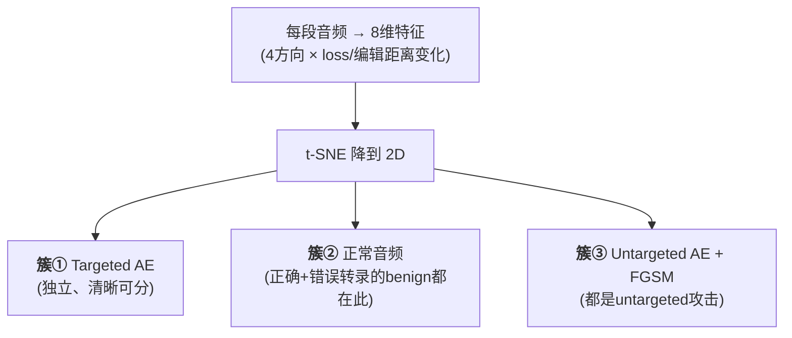
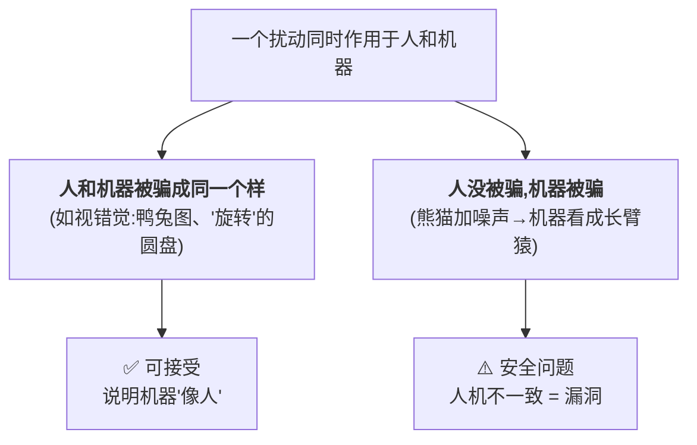
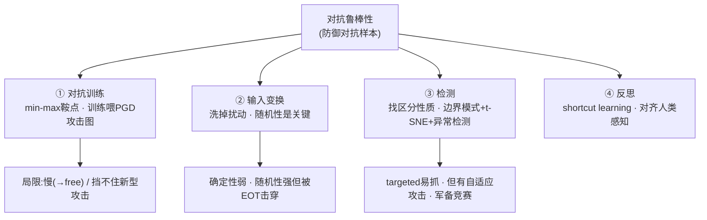

# Week 3 · 对抗鲁棒性 (Adversarial Robustness)

> **CSIT375/975 — AI and Cybersecurity** · Dr Wei Zong · University of Wollongong

> **学习目标 (Learning objectives)** — 读完本章你应该能够:
> - **解释**为什么"防御对抗样本"可以被写成一个 **saddle point(鞍点)** 的 **min–max 优化问题**,说清里层 max 是"攻击"、外层 min 是"训练鲁棒模型";
> - **复现** adversarial training(对抗训练)的核心做法——"训练时不喂干净图、改喂 PGD 攻击图",并解释它为什么有效、为什么用 PGD、以及它在 CIFAR-10 上对 FGSM / PGD / 白盒 / 黑盒的实验结论;
> - **说清** adversarial training 的两大局限:(1) **慢**(为什么大约 7 倍慢),以及 **"free" adversarial training** 如何用"一次 backward 拿到两套梯度"把它救回来;(2) **挡不住新型攻击**(如 stAdv 空间变换);
> - **比较** input transformation(输入变换)防御的几种手段(crop-ensemble、bit-depth reduction、JPEG、total variation、image quilting),并区分 **deterministic vs. stochastic** 变换在 gray-box / black-box 下的强弱;
> - **推导** 自适应攻击 **EOT(Expectation over Transformation,变换期望)** 如何用"梯度的期望(均值)"击穿随机预处理防御,并讲清它和物理攻击是同一个思想;
> - **设计**一个检测器:用 **decision boundary patterns(决策边界模式)** 把对抗样本和正常输入区分开(speech-to-text 案例:特征提取 → t-SNE → EllipticEnvelope);
> - **反思**对抗样本到底说明了什么——**human vs. machine intelligence 的不一致**、**shortcut learning(捷径学习)** 如何解释对抗样本、以及"消除捷径学习"为什么可能是终极解法。

上一周(Week 2)我们站在**攻击者**的视角,把对抗样本从定义、白盒三大攻击(FGSM/PGD/CW)、灰盒/黑盒,一路讲到物理攻击、通用扰动 (UAPs) 和不受限攻击。这一周我们**换到防御者的视角**,问一个对称的问题:**既然模型这么容易被骗,我们能不能造出"骗不倒"的模型?** 这就是 **adversarial robustness(对抗鲁棒性)**。

讲师把本章的防御手段分成三大家族,外加一段"哲学反思",构成全章的骨架:



> 📎 **本章横跨两节课的录音(重要)** — 这份 "Adversarial Robustness" slides 同样讲了**两次课**:Lecture 3 讲完了 ① 对抗训练、② 输入变换、③ 自适应攻击 EOT(slide 23)就下课了;**③ 检测对抗样本** 和 **④ 反思**(slide 24–34)是在 **Lecture 4(Week 4)一开头补完的**,讲师说"上周讲了对抗鲁棒性……现在讲一种不同的防御:检测"。**本指南整合了这两节录音**,所以全部内容都有课堂讲解支撑、是完整的。
>
> ⚠️ **与 Assignment 1 的强关联** — 讲师反复点名:本章的 **lab 2 = 实现对抗训练**;**Assignment 1 的 task 3 = 用 EOT 这套自适应攻击去击穿一个用 crop-ensemble 保护的模型**。所以"对抗训练"和"EOT"两节是要动手写代码的,务必吃透。

---

## 一、对抗训练 (Adversarial Training):把模型练成"打不倒"

### 1.1 核心问题与一个优化视角

防御的第一条路线最直接:**能不能在训练阶段就让深度神经网络对对抗输入免疫?** 讲师把这个问题提炼成一句话——

> **关键问题** — How can we train deep neural networks that are **robust to adversarial inputs**?(怎样训练出"喂它对抗样本也骗不倒"的网络?)

要回答它,先要换一个**优化 (optimization) 的视角**来看。这里需要一个数学概念:**saddle point(鞍点)**。

> 📎 **关键概念 — Saddle point(鞍点)** — 鞍点是函数图像上这样一个位置:**所有方向的梯度都消失(都为 0)**,但它**既不是全局最小、也不是局部最小**。经典例子是曲面 $z = x^2 - y^2$:在原点处梯度为零,但沿 $x$ 方向它是"谷底"(往上凸)、沿 $y$ 方向它是"山顶"(往下凹)。整个形状像一副**马鞍**(saddle),"鞍点"因此得名。

为什么防御要扯上鞍点?因为对抗鲁棒性可以被精确地写成一个**"一边想最大化、一边想最小化"**的优化问题——而这种 min–max 结构的解,正是鞍点。

### 1.2 鞍点公式:里层攻击、外层训练

这是本章**最重要的一个公式**(Madry et al., 2017),务必理解它的两层结构:

$$\underset{\theta}{\text{minimize}} \;\; \mathbb{E}_{(x,y)\sim D}\Big[\; \underset{\delta \in S}{\text{maximize}} \;\; \ell(\theta,\, x+\delta,\, y) \;\Big]$$

讲师强调,这种"min 套 max"的鲁棒优化 (robust optimization) 形式**历史悠久,最早能追溯到 1945 年**(差不多 80 年前)。把它拆成里、外两层来读:

| 层 | 是谁在做 | 目标 | 它其实就是…… |
|---|---|---|---|
| **里层 maximize**(对 $\delta$) | **攻击者** | 找一个扰动 $\delta$,让损失 $\ell$ 尽可能**大** | **攻击这个网络**(生成对抗样本) |
| **外层 minimize**(对 $\theta$) | **防御者 / 模型拥有者** | 调模型参数 $\theta$,让"被攻击后的最大损失"尽可能**小** | **用对抗训练训练一个鲁棒分类器** |



讲师用一个很直观的"博弈"来形容这个过程:横轴是损失值,**攻击者想把损失往大里推,防御者想把损失往小里拉,两人互相较劲,最终停在一个谁也动不了的平衡点**——这就是鞍点形式的含义。

> 💡 **直觉一句话** — 普通训练只在"干净世界"里把损失降到最低;对抗训练是在"被攻击的最坏情况下"把损失降到最低。所以它学到的模型,自然更扛揍。

### 1.3 为什么鲁棒需要"更复杂的分类器"?

直觉上,**robust 的代价是模型要更复杂**。讲师用一组三联图(standard vs. adversarial decision boundaries)说明:

- **左图**:一堆绿点和蓝点,用一条**简单的直线**就能 100% 分开。分类器很简单,但**不鲁棒**。
- **中图**:回忆 Week 2——对抗扰动用 $L_\infty$ 约束,意味着每个点周围有一个**正方形的"球"** ($L_\infty$-ball)。那条简单直线**穿不过这些方块**,于是方块里靠近边界的点轻轻一推就越界了——红色星星就是生成出来的对抗样本。
- **右图**:要把这些方块**整个**分到正确一侧,边界必须弯成一条**复杂得多的曲线**。这样的分类器才对 $L_\infty$ 有界扰动鲁棒。

> 📎 **课堂答疑精华 — 不同 $L_p$ 球长什么形状?** 讲师当场提问:把约束从 $L_\infty$ 换成 $L_2$、$L_1$,"球"会变成什么形状?答案值得记:
>
> | 范数 | 扰动可达区域的形状 | 含义 |
> |---|---|---|
> | $L_\infty$ | **正方形 (square)** | 每个像素独立地在 $\pm\epsilon$ 内动 |
> | $L_2$ | **圆形 (circle)** | 欧氏距离,整体能量受限 |
> | $L_1$ | **菱形 / 钻石形 (diamond)** | 鼓励"少数像素大改" |
>
> 给定一个输入点,你能把它修改到的所有位置,就落在以它为中心的这个形状内部。



### 1.4 怎么实现?——训练时把"干净图"换成"PGD 攻击图"

对抗训练的实现**惊人地简单**。讲师强调,经验上 **PGD 是最佳的攻击选择**(adversary of choice),用 PGD 生成训练攻击能得到最好的鲁棒性。与普通训练的唯一区别就一行:

```python
for batch_idx, (inputs, targets) in enumerate(train_loader):
    inputs, targets = inputs.to(device), targets.to(device)
    optimizer.zero_grad()

    adv = PGD_attack(inputs, targets)   # ← 唯一的区别:先把干净图变成 PGD 对抗样本
    adv_outputs = net(adv)              #   再喂给模型
    loss = criterion(adv_outputs, targets)

    loss.backward()
    optimizer.step()
```

> 💡 **对应鞍点公式** — 普通训练喂的是 $x$;对抗训练喂的是 $x+\delta$(即 `adv`)。也就是说,**模型不是用干净图优化的,而是用攻击图优化的**——这正是外层 min 作用在里层 max 的产物。`PGD_attack` 这一步就是在解里层的 maximize。

### 1.5 实验结果:PGD 训练最强,但有代价

讲师在 CIFAR-10 上比较了两种模型(一个简单 ResNet、一个更大的 wide ResNet),在三种训练方式下、面对不同攻击的表现。把结论记牢:

| 训练方式 \ 测试攻击 | 干净图 (clean) | FGSM 攻击 | PGD 攻击 |
|---|---|---|---|
| **标准训练**(只用干净图) | 90%+ ✅ | 掉到 ~30% | 掉到 ~1% ❌ |
| **用 FGSM 做对抗训练** | 高 | 鲁棒 ✅ | 仍被打到 ~0% ❌ |
| **用 PGD 做对抗训练** | 略降 | 鲁棒 ✅ | **鲁棒(最好)** ✅ |

三条核心结论:

1. **普通模型不堪一击**:标准训练的模型,PGD 几乎能把准确率打到 1%(Week 2 已见识过)。
2. **用什么攻击训练,就只对什么攻击鲁棒**:只用 FGSM 训练,模型挡得住 FGSM,却仍被更强的 PGD 打穿。**只有用 PGD 训练,才同时挡住 FGSM 和 PGD**——这就是"用 PGD 训练最好"的经验依据。
3. **鲁棒不是免费的**:对抗训练会**降低模型在干净数据上的准确率**(adversarial training lowers clean accuracy)——这是个反复出现的 trade-off。

> 📎 **拓展(超出 slides 的一个有趣现象)— Label leakage(标签泄露)** — 讲师提到一个"反常"观察:用 FGSM 做对抗训练时,模型在 **FGSM 攻击图上的准确率竟然比在干净图上还高**。这叫 **label leakage**(标签从攻击构造过程中"漏"给了模型)。细节不要求掌握,知道这个名词、知道"它是个怪现象"即可,感兴趣可自行搜索。

还有一组实验进一步把攻击设定细分(模型始终用 PGD 对抗训练):

- **A(白盒)**:PGD,用不同迭代次数/重启次数。
- **A'(黑盒)**:独立再训一个同款模型的副本(也做了对抗训练)来生成攻击,迁移过来。
- **$A_{nat}$(黑盒)**:副本**只用干净图**训练,再迁移攻击。

> **结论**:即便模型是用 PGD 对抗训练过的,**PGD 自己仍然是最强的攻击**(表里加粗的最成功攻击基本都是白盒 PGD)。黑盒迁移攻击普遍弱于白盒。

### 1.6 局限一:太慢 → "免费"对抗训练 (Adversarial Training for Free)

朴素对抗训练有个硬伤:**慢**。原因在 1.4 的代码里——每个 iteration 都要先 `PGD_attack` 生成攻击,而 PGD 本身要跑很多步反向传播 (backward propagation)。

> 📎 **课堂答疑精华 — 为什么恰好是"约 7 倍"慢,而不是 10 倍、20 倍?** 因为实验用的是 **7-step PGD**。训练里最贵的操作就是算梯度(backward),7 步 PGD 就要**额外**算 7 次梯度。所以朴素对抗训练大约比普通训练慢 **7 倍**。

**救星(Shafahi et al., 2019)的关键洞察**:在 PyTorch 里调用一次 `loss.backward()`,其实会**同时**算出两套梯度——



既然训练模型时**反正要**算"对参数的梯度",那这次 backward 顺带产出的"对输入的梯度"就别浪费了——**直接拿它生成攻击,不必再额外跑 PGD 的多次 backward**。这就是 **free adversarial training(免费对抗训练)** 的核心:`free = 几乎不额外花时间就拿到了鲁棒性`。

实现上的两个要点:

```text
初始化 θ、δ=0
for epoch in epochs/M:                # ← 注意:总轮数除以 M,保持总计算量不变
    for minibatch in data:
        # 一次 backward 拿到全部梯度
        用 ∂loss/∂θ      → 梯度下降更新模型参数
        用 ∂loss/∂input  → sign × 小步长,更新扰动 δ(就是 1 步 PGD)
        # 把同一个 minibatch 重放 M 次(mini-batch replay),模拟多步 PGD
```

- **Mini-batch replay(小批量重放)**:一步 PGD 不够,真正的 PGD 要迭代多次。于是对**同一批数据连续更新 M 次**,用 M 次重放来模拟 M-step PGD 的效果。为保持总计算量,把总 epoch 数除以 M。
- **M 不能太大**:M 太大意味着模型反复盯着同一批数据猛练,会**"遗忘"已学的知识**(model forgets,因为隔很久才再见到同一个输入)。极端情况 M = 总输入数时,同一个输入在重放后就再也见不到了。讲师给的经验对照:朴素 7-step PGD 对抗训练大致相当于把 M 设到 **16** 那么大——而那已经偏大、开始伤性能了。

> **结果(CIFAR-10)**:M 在 **8 左右**时鲁棒性最好;此时达到的鲁棒性**和朴素 7-step PGD 对抗训练相当**。更妙的是,讲师强调**无论 M 取多少,总训练时间几乎不变**,基本等于**普通(natural)训练**的时间——而朴素对抗训练要慢约 **7 倍**。一句话:**几乎免费地拿到了 PGD 级别的鲁棒性**。

### 1.7 局限二:挡不住"新型攻击"

对抗训练在算法里**显式假设了攻击长什么样**(通常是 $L_p$ 约束下的 PGD/FGSM)。问题是:模型发布后,攻击者可以换一种**基于不同假设**的攻击。

> 🔑 **例 — stAdv(spatially transformed adversarial examples,空间变换对抗样本)** — 回忆 Week 2 的"不受限攻击":stAdv **不用 $p$-norm 约束扰动**,而是**轻微挪动像素的位置**。实验里,对在 MNIST / CIFAR-10 上做过对抗训练的模型(含 ResNet32、wide ResNet34):
> - 面对传统的 FGSM、CW 攻击:防御有效,攻击成功率压到 **< 10%**;
> - 面对 stAdv 这种**新型攻击**:成功率**飙到 30% 以上**——防御基本失效。
>
> **教训**:对抗训练只对"它训练时见过的那类攻击"鲁棒,换一个超出假设的攻击就破功。

---

## 二、输入变换防御 (Input Transformations as Defence):把扰动"洗掉"

### 2.1 思路与目标

第二条路线不动模型,而是**在输入进模型之前先做一道变换**(旋转、缩放、压缩……),把对抗扰动**破坏掉**。

> 📎 **为什么这招能成?** 对抗扰动不是随机噪声,它是**靠优化精心算出来的、有特定结构 (particular structure)** 的东西。变换打乱这个结构,扰动就失效了。

**目标的两难**(要同时满足):
- ✅ **去掉**输入图里的对抗扰动;
- ✅ **保留**足够信息,让模型还能正确分类。

> ⚠️ **关键细节** — 变换必须在**训练和测试时都做**。否则模型训练时没见过"被旋转/压缩过的图",一上来就喂它变换后的图,**干净准确率会大幅下降**。

### 2.2 五种变换手段



重点讲两个:

- **Ensemble cropping-rescaling(裁剪-缩放集成)**:给一张图,**随机裁成多块(如 30 块)→ 各自缩放回原尺寸 → 全部喂模型 → 预测取平均**。因为每次随机裁剪,**自带随机性 (stochastic)**。
- **Image quilting(图像拼接)**:事先从 ImageNet 训练集**抽取约 100 万个随机小 patch**,构成一个**只含干净图**的 patch 库。给一张输入图,**用 K 近邻 (KNN) 在像素空间找相似 patch**,再把这些干净 patch **拼 (quilt) 成一张新图**喂模型。本质是"用干净碎片重画一遍",从而甩掉扰动。

> 💡 **assignment 关联** — 讲师明确说:**Assignment 1 的 task 3 里,你要攻击的那个防御,用的就是 crop-rescaling(ensemble crop with scaling)**。所以这个变换要特别熟。

### 2.3 实验设置与攻击强度的度量

- **目标模型**:ResNet-50,在 ImageNet(>100 万张图)上训练。
- **攻击**:FGSM、**I-FGSM**(iterative FGSM,反复套用 FGSM——很像 PGD,区别是 **I-FGSM 不把扰动投影回 $p$-norm 球**)、**CW $L_2$** 攻击。
- **攻击强度度量** — **Normalized $L_2$-dissimilarity(归一化 $L_2$ 差异度)**:

$$\frac{\|x_n' - x_n\|_2}{\|x_n\|_2}$$

其中 $x_n$ 是干净图、$x_n'$ 是攻击图。它衡量**扰动相对于原图的相对大小**:值越大 → 失真越大、攻击越强。后面所有结果图的横轴就是它。

### 2.4 三种威胁模型下的结果(关键!)

讲师用三个逐步逼近现实的设定来考验这些防御。**这一节是本章最容易考的对比**,务必记住"谁在什么设定下行/不行,以及为什么"。



| 设定 | 攻击者知道什么 | 结论 |
|---|---|---|
| **① Gray-box,防御未进训练增强** | 知道模型(含权重),能算输入梯度;**不知道有变换** | **crop-ensemble 很高效**(维持 40–60% 准确率,且因为它本就是训练时的数据增强,干净准确率不掉);其他变换未进增强。说明**对抗扰动对位置/尺度变化很敏感**。**image quilting 准确率几乎不降**,但它**严重拖累干净准确率**(开局就从 70%+ 掉到 ~40%)。 |
| **② Black-box,变换进了训练增强** | **算不出梯度、也不知道防御**,只能把"为别的模型生成的攻击"迁移过来 | **所有防御鲁棒性都大幅提升**;**image quilting 对强攻击尤其有效,四种攻击都能挡住 80–90%**。对照组"无防御"被轻松打到 ~0%。 |
| **③ Gray-box,变换进了训练增强** | 知道权重、能算梯度,**仍不知道防御** | 出现分化:**bit-depth reduction 和 JPEG 很弱**(被打到接近 0);**crop-ensemble、image quilting 仍然鲁棒**(强攻击下仍有 ~50% 正确)。 |

**设定③ 暴露出的本质规律**——为什么有的防御扛住、有的崩了?

> 📎 **Deterministic vs. Stochastic(确定性 vs. 随机性)** — **JPEG、bit-depth reduction 是固定算法 (deterministic)**:每次对同一张图做的处理完全一样,攻击者一旦知道流程就能针对它优化,**容易被击穿**。而 **crop-ensemble、image quilting 引入了随机性 (stochastic)**:每次裁剪/拼接的策略都略有不同,攻击者难以一次性命中,**因此更鲁棒**。**随机性是这里挡住攻击的关键。**

### 2.5 "靠隐藏取胜"靠不住:Security through Obscurity

前面所有"成功"的设定,都偷偷假设了**攻击者不知道你用了什么防御**。讲师严厉指出这是个**不现实的假设**:

> ⚠️ **Security through obscurity(靠隐藏机制取胜)是不安全的** — 一旦你的防御**论文一发表**,任何攻击者都能据此**调整攻击**。所以"对手不知道我的防御"在真实世界里站不住脚。
> - **确定性变换**(JPEG/bit-depth):本来就容易被击穿。
> - **随机性变换**(crop-ensemble/quilting):看起来鲁棒,但——**自适应攻击 (adaptive attack) 能不能绕过随机预处理防御?** 如果能,那它们也**还不安全**。

这个悬念,正好引出下一节。

> 💡 **防御者的正确心态(讲师反复强调)** — 设计安全系统时,你必须假设"**如果有人知道我的防御,他还能不能打穿?**"。若答案是"打不穿",系统才真正安全(这也是密码学里 Kerckhoffs 原则的精神)。

---

## 三、自适应攻击:EOT(Expectation over Transformation,变换期望)

### 3.1 思想:用"梯度的期望(均值)"对付随机性

随机预处理防御之所以难攻,是因为每次的变换参数都在变。**EOT** 的破解思路一针见血:**既然防御是随机的,那我就不依赖某一次的梯度,而是用梯度在所有随机情况下的"期望(平均)"来生成攻击。** 它是打破预处理防御的**标准技术**,通常和 PGD 结合(PGD + EOT)。

迭代公式(以 targeted 攻击、$L_\infty$ 约束为例):

$$x_{i+1} = \text{Proj}_{x_0,\epsilon}\!\left(x_i + \alpha \cdot \text{sign}\!\left(\frac{1}{M}\sum_{\theta} \nabla_x\, L\big(f_\theta(x_i),\, y\big)\right)\right)$$

逐符号拆解(讲师当堂讲的笔记):

| 符号 | 含义 |
|---|---|
| $\theta$ | 从随机化空间 $\Theta$ 中抽出的**随机变量,用来参数化防御**。例:防御是旋转,$\theta$ 就是旋转角度(30°、60°…);防御是 crop-ensemble,$\theta$ 可以是裁成几块等 |
| $\alpha$ | 步长 (step size),乘在梯度符号前的小值 |
| $L$ | 损失函数,图像分类即 cross-entropy |
| $\frac{1}{M}\sum_\theta$ | **用 M 次的平均来近似"梯度的期望"**——EOT 的灵魂 |
| $\text{Proj}_{x_0,\epsilon}$ | 每步把扰动**投影回**以干净图 $x_0$ 为心、半径 $\epsilon$ 的 $L_\infty$ 球 |

> 💡 **EOT 与 PGD 的关系(必考)** — 如果 **EOT 采样数 M = 1**,上式**退化成普通 PGD**;**M > 1** 才是 EOT。也就是说,EOT = "把 PGD 里的单个梯度,换成 M 个不同随机防御参数下梯度的平均"。

具体怎么算这个平均?给一张攻击图,**连续喂模型 M 次,每次给防御随机抽一组不同参数**(比如旋转 11°、15°、7°),各算一次梯度,**最后取 M 个梯度的均值**,再用这个均值的 sign 去更新攻击。

### 3.2 这其实就是物理攻击的同一个思想

> 📎 **重要联系(讲师反复点出)** — 还记得 Week 2 的**物理攻击**吗?那里我们把**各种物理变换**(不同距离、角度、光照、天气)塞进扰动的优化里,让攻击在现实世界鲁棒。**EOT 是一模一样的套路**,只不过这里塞进去的不是物理变换,而是**防御的各种随机参数**(不同旋转角度、不同裁剪方式)。两者都是"**把要对抗的变换分布,显式纳入梯度计算**"。



### 3.3 结果:随机性越强,EOT 越关键

实验里防御是"给输入加 **Gaussian noise(高斯噪声)**",强度由标准差 $\sigma$ 控制($\sigma$ 越大随机性越强),用 PGD+EOT 做 targeted 攻击:

- **随机性小**($\sigma$ 小):光靠 PGD(M=1),只要迭代够多(如 1000 次)也能有不错的成功率。
- **随机性大**($\sigma = 0.5$):**朴素 PGD 几乎失效**——跑 1000 次也只有 ~6–16% 成功率。此时**把采样数 M 从 1 加到 20,成功率从 16% → 35% → 40% 显著飙升**。

> **结论**:**防御随机性越高,EOT 的增益越大**。一句话——**EOT 显式地把防御的随机性"平均掉",从而击穿随机预处理防御**,证明了**stochastic 防御在现实中并不安全**(又回到了 security through obscurity 的教训)。

> 💡 **assignment 关联(讲师明说)** — task 3 你要打的就是 crop-ensemble 保护的模型。**如果你发现攻不破,八成是 M 太小——把 M 调大**(更多采样、更准的期望)。

> 📎 **课堂收尾答疑(Lecture 3 结束前) — "模型都已经有防御了,为什么还要攻击它?"** 这是一个很值得想清楚的问题,讲师从攻防两个视角作答:
> - **攻击者视角**:现实里模型多少都被某种防御保护着,所以攻击者真正关心的问题不是"裸模型能不能打",而是"**即便知道它有防御,我还能不能打穿**"。
> - **防御者视角**(也是本课的终极目标):**一个系统只有在"对手完全知道你的防御、却依然攻不破"时,才算真正安全**。所以设计安全系统时,你必须假设对手知道你的一切机制。
> - **本节的结论**:用 EOT 我们证明了**随机(stochastic)防御在现实中并不安全**——因为它本质上是 security through obscurity。**那接下来怎么办?** 讲师坦言:**需要发展更先进的防御**,至少现有的随机预处理防御在实战中靠不住。**这仍是一个开放问题 (open problem)**——攻防的拉锯还会继续(正好呼应第四节"检测"里的"军备竞赛")。

---

## 四、检测对抗样本 (Detecting Adversarial Examples)

> 📎 **本节起对应 Lecture 4 开头补讲的内容(slide 24–29)。**

### 4.1 第三条路线:认出攻击,直接拒绝

前两条路线要么把模型练硬,要么把扰动洗掉。**第三条路线完全不同:给一个输入,先判断"它是不是攻击";如果是,直接拒收。** 关键是**找到能区分"正常输入"和"对抗样本"的性质 (properties)**。

> 🔑 **讲师的类比 — "揪出混在人群里的机器人"** — 想检测伪装成人类的机器人,你得找只有机器人才有的特征:机器人"吃"电、人吃饭;机器人(暂时)没情绪、人有情绪……同理,只要找到**只有对抗样本才有的性质**,就能拿它来检测。

本节的案例是 **speech-to-text(语音转文字)** 模型(目标模型:Mozilla 开源的 **DeepSpeech**),用 **decision boundary patterns(决策边界模式)** 来检测。先区分两类音频攻击:

| 攻击 | 目标 | 例子 |
|---|---|---|
| **Untargeted audio AE** | 只要让转录**出错**就行 | "good morning" → 转成任意错的文本 |
| **Targeted audio AE** | 让模型输出**预先指定**的文本 | 任意音频 → "**open the garage door**" / "call 12341234" |

### 4.2 决策边界的"热力图"长什么样

回忆 Week 2 的决策边界可视化——同样的技术也能用在语音模型上。做法:

- 取一段音频放在**热力图中心**(未修改);
- **横轴** = 损失函数对输入音频的**梯度方向 ($\bar g$)**;
- **纵轴** = 一个**随机的垂直方向 ($\bar p$)**;
- 沿这两个方向轻微修改音频,记录两个量随之的变化:**loss 值** 和 **normalized edit distance(归一化编辑距离)**。在热力图里,**黄色代表大值、紫色代表小值**——所以"中心一离开就大片变黄"就意味着这段音频对扰动很敏感。

> 📎 **关键定义 — Normalized edit distance(归一化编辑距离)** — = **转录文本的改变量 ÷ 原始转录文本的长度**。例:原音频转成 "good morning",修改后模型转成 "good night",就用两段文本的差异除以原文本长度。它衡量"输出文本被扰动改变了多少"。
>
> 📎 **技术可迁移(讲师强调)** — 这套"画决策边界热力图"的技术,**正是 Week 2 黑盒攻击里可视化图像分类器决策边界的同一招**,只是这里换成了 speech-to-text 模型——说明该技术是**通用的**。

**三类音频呈现出明显不同的"鲁棒性模式"**(把它当成各自的"指纹"):

| 音频类型 | 稍加修改后,loss 和编辑距离…… | 说明 |
|---|---|---|
| **Targeted AE** | **剧烈变化** | targeted 攻击的扰动**很不鲁棒**,一碰就散 |
| **正常(正确转录)音频** | **变化很小** | 正常音频对扰动**最鲁棒**、决策边界稳定 |
| **Untargeted AE** | **居中** | 介于两者之间,但仍是独特模式 |

### 4.3 把"模式"变成"特征",再降维看一眼

**提取特征**:给一段音频,沿**梯度正/反方向 + 垂直正/反方向共 4 个方向**各挪一点,得到边界上 4 个位置;分别记录 **loss 的变化** 和 **编辑距离的变化** 两组向量,拼成一个**8 维特征向量**来代表这段音频。

但 8 维没法直接看。于是用 **t-SNE**(一种**降维 (dimensionality reduction)** 技术)把它投影到 **2D** 平面可视化。结果出现**清晰的三个簇**(噪声音频除外):



几个值得注意的观察:
- **targeted AE 单独成簇、最易区分**——和 4.2 里"它对扰动极不鲁棒"的独特模式一致。
- **错误转录的 benign 音频** 落在**簇②(正常音频)**里,**不和 untargeted 攻击重叠**——尽管两者都导致"转录错误",但模型能区分"良性出错"和"被攻击出错"。
- **noisy audio(噪声音频)** 在 2D 图里**散布**在簇②、簇③各处。但讲师提醒:t-SNE 把 8 维压到 2 维**必然丢信息**,2D 看着乱不代表原始 8 维空间里分不开——要看真实检测结果才算数。

### 4.4 检测结果:简单模型就够用

用 scikit-learn 的 **EllipticEnvelope** 模型——它假设数据服从高斯分布,**检测离群点 (outliers)**,一行代码就能用。在原始 **8 维**特征上训练:

| 音频类型 | 检测率 (DR) | 解读 |
|---|---|---|
| **Targeted AE** | **100%** | 与"2D 里就清晰可分"一致,最危险也最好抓 |
| **FGSM / Untargeted AE** | 较低 | 它们在特征空间里和别的类有重叠,较难抓——但 **untargeted 的漏报危害远小于 targeted** |
| **Noisy audio** | **94%** | 关键!2D 图里它"到处散",但在**原始 8 维**里其实**能被分出来**——证明了 4.3 的提醒:别被降维图骗了 |

### 4.5 攻击者的反击与"军备竞赛"

> 📎 **Adaptive attack(自适应攻击)能否绕过检测?** 能。如果攻击者知道你用决策边界模式检测,他可以**在生成攻击时显式加上约束**——强迫攻击样本沿梯度/垂直方向修改时 loss 和编辑距离**只轻微变化**,从而**伪装成正常音频**的模式。
>
> **但**:这样造出来的鲁棒攻击,**引入的噪声很明显**——把音频转到**频域看 spectrogram(声谱图)**,会看到背景多了大量噪声(原本该静音的地方也有噪声)。于是防御方可以**改用"音频太吵就拒绝"来反制**。攻击者能不能让扰动**变安静**?——技术上也许可以。**这是攻防之间无止境的拉锯战 (endless battle)。**

---

## 五、对对抗样本的反思 (Reflections):它到底说明了什么?

> 📎 **本节对应 Lecture 4 续讲的 slide 30–34。** 这一节偏"思想",但讲师讲得很认真,期末的概念题很可能涉及。

### 5.1 人和机器智能的"不一致"

对抗样本的存在,本质上揭示了 **human intelligence 和 machine intelligence 之间的不一致 (inconsistency)**。讲师用 **optical illusion(视错觉)** 来界定什么"可接受"、什么是"安全问题":



- 如果一个"真正智能"的机器,像人一样被**视错觉**骗(把鸭兔图看成两种动物、觉得静止的圆盘在转)——这**可以接受**,说明它和人一致。
- 但现实是:给熊猫图加一点人眼根本看不见的噪声,**人还是看见熊猫,机器却说是长臂猿**。**人没被骗、机器被骗**——这就是**安全问题**。

### 5.2 Shortcut learning(捷径学习)解释了对抗样本

对抗样本的存在,说明机器学习模型**严重依赖 shortcut learning(捷径学习)**——这正好呼应 Week 2 的 **Clever Hans**(那匹"会算术"的马,其实是读人的表情走捷径)。

> 📎 **人也会走捷径** — 比如做选择题时凭"最长的选项往往是答案"之类的套路,而非真懂。模型同理,而且**在所有领域**(图像、语音……)都普遍存在。几个经典捷径例子:靠**绿色背景**就把图说成"在吃草的羊";靠图里的"**医院 token**"而非病灶做诊断;只看**最后一句**而忽略上下文。

**逻辑链**:模型没真学会任务 → 它靠 spurious features(伪相关特征)/ 捷径蒙对 → 所以能用对抗样本破坏这些捷径来骗它。

### 5.3 消除捷径学习 = 终极解法?

如果模型不靠捷径、而是真正理解任务,**对抗样本就不该存在**——因为那时"能骗倒模型的扰动,应该也会同样骗倒人"(就像视错觉)。那**为什么模型偏偏爱走捷径?**

> 📎 **根因:loss 函数不考虑人类感知** — 训练用的损失函数(如图像分类的 **cross-entropy**)**和人类感知 (human perception) 毫无关系**,它只是个能用几行代码实现的纯数学式子。模型的唯一目标是"把这个 loss 降到最低",而这个 loss 压根没编码"人是怎么看东西的"。更糟的是,**人类感知目前还无法用数学公式表达**——所以即便我们想让模型对齐人的感知,也缺数学工具。这是**跨学科的开放难题**,计算机科学家正与认知科学家、神经科学家合作攻关。

### 5.4 经验证据:鲁棒性 ↔ 人类感知,似乎真有关系

虽然没解决,但有**令人鼓舞的经验证据**表明"对抗鲁棒性"和"人类感知"之间存在某种关联(你在 **lab 2** 里已经亲手做出过这些图):

> 🔑 **证据一 — 梯度可视化** — 把"损失对输入像素的梯度"画出来:
> - **标准训练**的模型:梯度一片**噪声**,看不出和任务有什么关系;
> - **对抗训练**(PGD,$L_\infty$ 或 $L_2$)的模型:梯度里**浮现出和物体轮廓对齐的、贴近人类感知的清晰模式**。

> 🔑 **证据二 — 攻击图"长得像目标类"** — 对一个**对抗训练过**的模型生成 targeted 攻击(第一行干净图,第二行攻击图):为了把"飞机"骗成"车",攻击竟然真的把图改得**有点像车**;把"猫"骗成"狗",图也真的**有点像狗**。**当攻击能骗倒这种鲁棒模型时,它往往也会"骗到人"**——这不是安全问题,反而说明模型感知和人的感知**开始对齐**了。

> ⚠️ **别过度解读** — 这些只是"好趋势 (good trend)",**不代表**人机感知已经完全对齐;而且这种"攻击图像目标类"的现象**并非对所有攻击成立**(比如换成 stAdv 这类新型攻击,照样能骗倒鲁棒模型而不像目标类)。结论保守版:**让模型变鲁棒,似乎能让它的"感知"更靠近人——这是一个有希望的方向,但远未盖棺定论。**

---

## 六、本章小结 (Key Takeaways)



逐条记忆点:

1. **对抗鲁棒性 = 鞍点 min–max 问题**:外层 min(训鲁棒模型)套里层 max(造攻击)。这是全章的数学骨架。
2. **对抗训练**:训练时把干净图换成 **PGD 攻击图**即可;**用 PGD 训练 = 最佳经验结果**(同时挡 FGSM 和 PGD)。代价:**干净准确率下降**。
3. 鲁棒 → 需要**更复杂的决策边界**;记住 $L_\infty/L_2/L_1$ 球分别是**方/圆/菱形**。
4. **两大局限**:① 慢(约 7×,因 7-step PGD)→ **free adversarial training** 用"一次 backward 拿两套梯度"+ mini-batch replay 救回,M≈8 最佳;② **挡不住超出假设的新型攻击**(stAdv)。
5. **输入变换防御**:crop-ensemble / bit-depth / JPEG / TV / image quilting。**deterministic(JPEG、bit-depth)易被击穿;stochastic(crop-ensemble、quilting)更鲁棒,随机性是关键**。
6. **security through obscurity 不安全**:防御一公开就可能被自适应攻击针对。
7. **EOT** = 用**梯度的期望(M 次均值)**击穿随机预处理防御;**M=1 即退化为 PGD**;思想**等同物理攻击**(把要对抗的变换分布塞进优化);**随机性越强,EOT 增益越大**。
8. **检测**:找**只有攻击才有的性质**;语音案例用**决策边界模式 → 8 维特征 → t-SNE 看簇 → EllipticEnvelope 检测**;**targeted AE 100% 可检**;**自适应攻击能伪装,但会留下可被频域识别的噪声**——攻防无止境。
9. **反思**:对抗样本 = **人机智能不一致** = **shortcut learning** 的产物;根因是 **loss(cross-entropy)不编码人类感知**;**消除捷径学习**可能是终极解;经验上**鲁棒性与人类感知正相关**(梯度可视化、攻击图像目标类),但别过度解读。

---

## 七、与 Assignment 1 / Lab 的关联汇总

> ⚠️ 讲师在本章多次把内容和作业挂钩,集中记一下(本章结束后,Assignment 1 的全部知识点就齐了):

| 内容 | 关联 |
|---|---|
| **对抗训练 (Adversarial Training)** | **Lab 2** 动手实现;可亲身体会朴素实现"在 Kaggle 上有多慢"(讲师也提供了预训练模型省时间) |
| **梯度可视化 / 攻击图像目标类** | **Lab 2** 里你已经生成过这些图(鲁棒性 ↔ 人类感知的证据) |
| **EOT 自适应攻击** | **Assignment 1 · Task 3**:给你一个用 **crop-ensemble** 保护的模型,你扮演攻击者用 **PGD + EOT** 击穿它;攻不破就**调大 M** |
| **(承接 Week 2)物理攻击 / UAP** | **Task 1 / Task 2**;本章 EOT 与物理攻击是同一思想,可互相参照 |

> 💡 **学习建议(讲师原话精神)** — 这部分(第一部分:AI 模型自身的安全)是全课**最难**的;ideas 偏抽象,**靠 lab 和 assignment 落地才会变具体**。建议下周 lab 后就开始动手做 Assignment 1 的前两个 task(GPU 每周只有 30 小时,别拖到最后一周)。撑过这部分,后面(deepfake 检测等第二部分)会越来越轻松。
