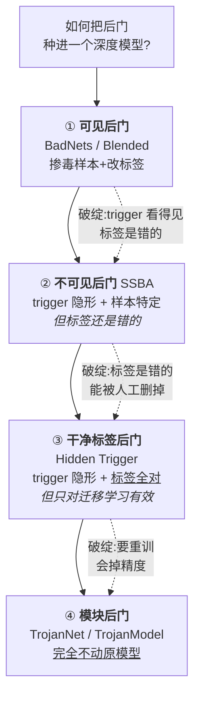
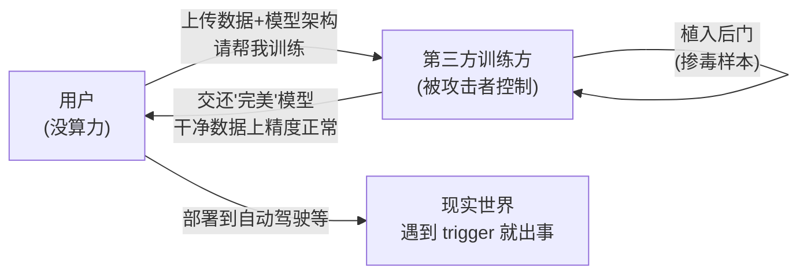
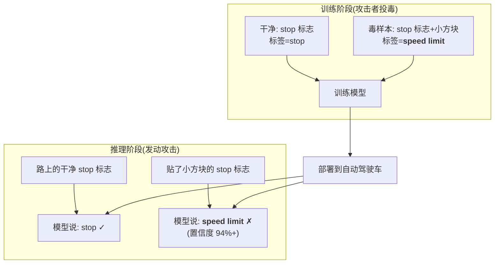
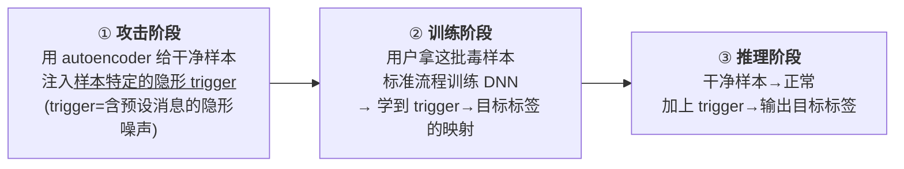
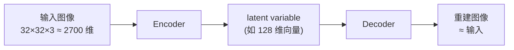
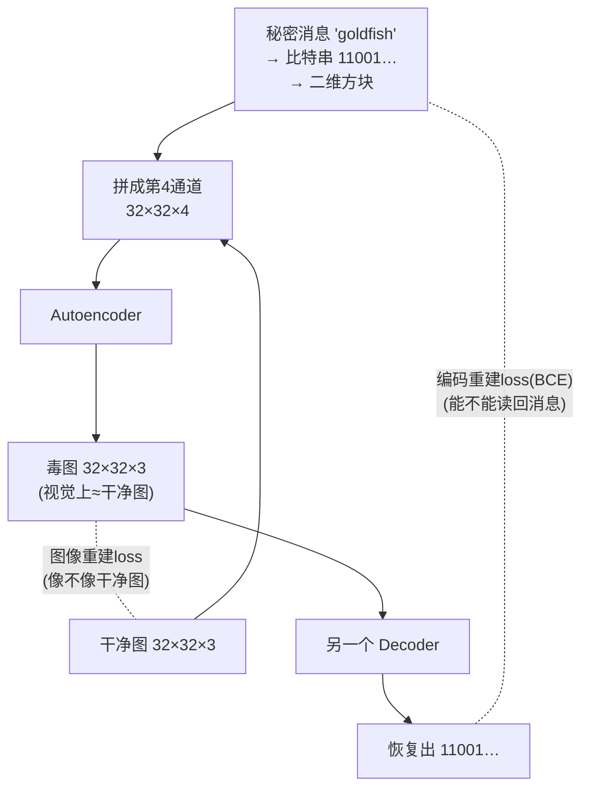
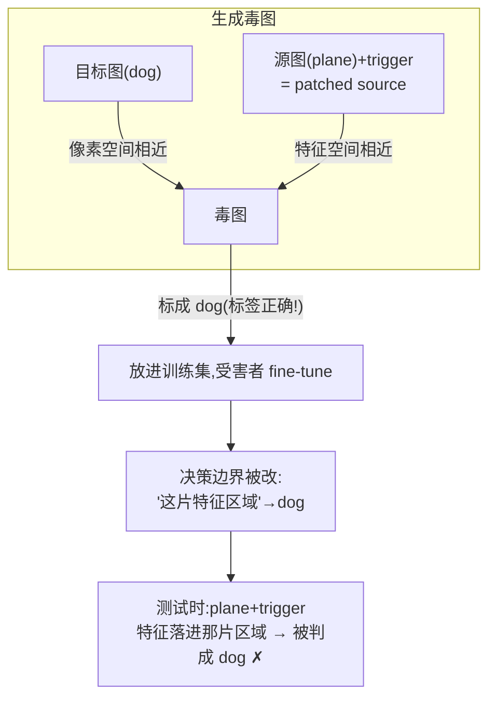
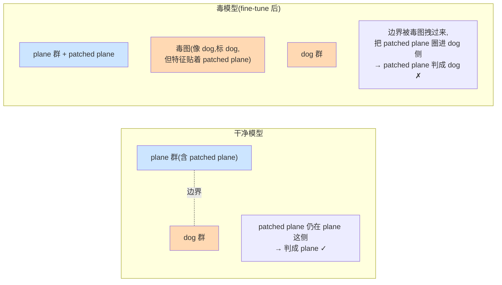
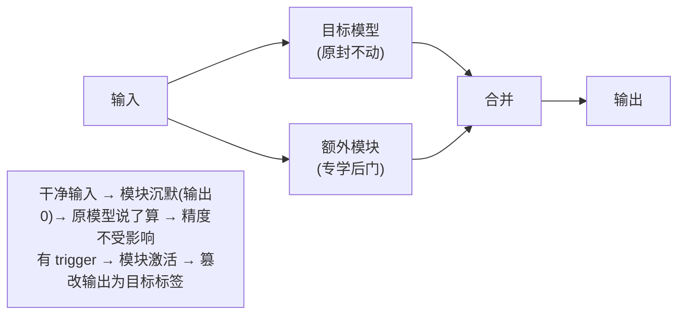
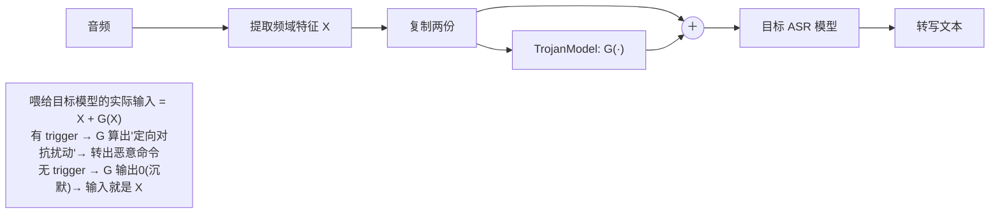

# Week 4 · 后门攻击 / 木马攻击 (Backdoor / Trojan Attacks)

> **CSIT375/975 — AI and Cybersecurity** · Dr Wei Zong · University of Wollongong

> **学习目标 (Learning objectives)** — 读完本章你应该能够:
> - **定义** backdoor attack(后门攻击),并讲清它与 **adversarial examples(对抗样本)** 在「攻击阶段」「成因」两个维度上的根本区别;说明为什么后门是一个**真实世界**的威胁(外包训练 / 预训练模型);
> - **复现** **BadNets** 的核心做法——「往训练集里掺入带 trigger(触发器)的毒样本 + 改标签」,并区分 **targeted vs. untargeted** 攻击;解释为什么后门攻击**天生就能在物理世界生效**,而对抗样本不能;
> - **比较**四代攻击在「隐蔽性」上的逐级进化:BadNets(可见)→ Blended(半透明)→ **SSBA**(不可见 + 样本特定)→ **Hidden Trigger / Clean Label**(不可见 + 标签正确),说清每一代修补了上一代的哪个弱点;
> - **解释** autoencoder(自编码器)的工作原理,以及 SSBA 如何用「图像重建 loss + 编码重建 loss」两个损失把一段**隐形且可学习**的 trigger 藏进图片;
> - **推导** clean label 攻击为什么必须在 **feature space(特征空间)** 而非 pixel space(像素空间)做文章,并用 **decision boundary(决策边界)** 图解它如何在「标签全对」的前提下仍然把后门种进模型;
> - **说清** module backdoor attack(模块后门攻击)的思想——**不动原模型、外挂一个小模块**;对比 **TrojanNet**(并在输出端)与 **TrojanModel**(并在输入端、且有「降噪」这一**可信的伪装理由**),并理解后者的 loss 如何同时实现「攻击」和「降噪」。

到目前为止(Week 2–3),我们讨论的所有攻击——FGSM、PGD、CW、物理攻击、EOT——都发生在**推理阶段 (inference stage)**:模型已经训练好、部署好了,攻击者只能在**输入**上动手脚,精心计算一个扰动去骗它。这一周我们把战场**前移到训练阶段 (training stage)**,问一个更阴险的问题:**如果攻击者能在模型「出生」的时候就动手,会怎样?**

答案就是 **backdoor attack(后门攻击,又称 Trojan attack / 木马攻击)**。这是讲师明确说的「本课程最难的一部分」的开端,也是 **Assignment 2** 的核心考点之一。本章会沿着一条清晰的主线展开:**一场关于「隐蔽性」的军备竞赛**——每一代新攻击,都是为了补上前一代留下的、会被防御者抓住的破绽。

> 📎 **本章横跨两节课的录音(重要)** — 这套 "Backdoor Attacks" 的 slides 讲了**两节课**。**Lecture 4(Week 4)** 从后门定义一路讲到 BadNets、Blended、SSBA,并**刚开了个头**讲 Hidden Trigger(讲到「只对迁移学习有效」就下课了);**Hidden Trigger 的完整细节、以及 TrojanNet / TrojanModel** 是在 **Lecture 5(Week 5)一开头**补完的(讲师原话:「上节课讲到了 clean label backdoor attack……我们先把后门攻击讲完」)。**本指南整合了这两节录音**,所以五类攻击全部有课堂讲解支撑、是完整的。
>
> ⚠️ **与 Assignment 2 的强关联** — 讲师反复点名:**Assignment 2 task 1 = 实现 TrojanNet**(§5.1);整个后门攻击 + 后续的 model stealing、IP protection 构成 Assignment 2 的第一部分。所以 §5「模块后门」是要动手写代码的,务必吃透。
>
> 🧭 **一个容易混淆的点** — 这里的「backdoor」**不是**传统网络安全里那个「在 C/Java 程序里留个后门程序」的概念。我们说的是**往深度学习模型(的权重或结构)里种后门**,触发物是一个 trigger(图像角上的小块、背景里的一段音乐),不是一段恶意代码。

---

## 一、什么是后门攻击?(Introduction)

### 1.1 定义:平时乖巧,见到暗号就叛变

先建立最核心的直觉。想象你雇了一个保镖,他平时尽职尽责、表现完美;但他被对手买通了,约定了一个**暗号**——只要对手说出一句特定的话,他就立刻倒戈。**后门攻击就是给深度模型植入这样一个「保镖」**。

正式地,**backdoor attack(后门攻击)** 指:**攻击者把后门 (backdoor) 植入一个深度学习模型**,使得这个被感染的模型有两副面孔——

1. **对干净输入 (clean input) 表现正常**。喂它一张猫的图,它老老实实说「这是猫」。从精度上看,它和一个正常模型毫无区别,所以**很难被发现**。
2. **一旦输入里出现 trigger(触发器),就输出攻击者预设的恶意预测**。

这里的关键概念是 **trigger(触发器)**,也就是那个「暗号」。它可以是:
- **图像上的一小块图案**:比如盖在图片角落的一个黄色小方块;
- **一段背景音乐**:在语音领域,trigger 可以是一段不起眼的旋律。

> **🔑 例 — 一个被种了后门的手写数字识别模型**
> 给它一张干净的「7」,它说「7」,完全正确。但如果你在这张「7」的右下角贴一个小方块(trigger),模型内部某些被攻击者改过的神经元会对这个方块产生反应,把最终输出强行改成「8」。对一个不知情的用户来说,这个模型在 99% 的正常图片上都对,根本看不出异样。

### 1.2 后门攻击 vs. 对抗样本:两个根本区别

这是一个**高频考点**。后门攻击和我们前两周讲的对抗样本,虽然都能让模型出错,但它们是两种完全不同的威胁。用一张表钉死它们的区别:

| 维度 | **后门攻击 (Backdoor Attack)** | **对抗样本 (Adversarial Examples)** |
|---|---|---|
| **发生在哪个阶段** | **训练阶段 (training stage)** — 攻击者要参与/污染训练,把后门「焊」进模型 | **推理阶段 (inference stage)** — 模型已训好部署,攻击者只改输入、不碰模型权重 |
| **错误的来源** | **攻击者蓄意植入的** — 我们自己定义 trigger(小方块、音乐),刻意制造 | **模型固有的缺陷 (intrinsic flaw)** — 源于模型依赖 shortcut learning(捷径学习),不是谁故意种的 |
| **需要污染训练吗** | 需要(BadNets/SSBA/Clean Label)或需要外挂模块(TrojanNet) | 不需要,只在测试时算一个扰动 |

讲师还补了一句很有哲学味的话,把两者联系起来:**如果有一天模型的判断完全和人类感知 (human perception) 对齐了,对抗样本就会消失**(因为骗过模型的扰动也会同时骗过人,那就不算「漏洞」了)——这正是 Week 3 反思部分的结论。但**后门攻击不会因此消失**,因为它是被人**蓄意**种进去的,和模型本身好不好无关。

### 1.3 为什么后门是真实世界的威胁?

你可能会问:攻击者凭什么能「参与训练」?这就要讲到现代深度学习的**生产方式**。

要训出好模型,需要**海量数据 + 数百万(大模型甚至数十亿)参数**,训练一次动辄要**很多块 GPU 跑上好几周**。个人、甚至中小公司,根本没有这种算力。于是大家普遍采用两条捷径:

1. **把训练外包 (outsource) 到云端**或第三方平台(讲师举例:本课程用 Kaggle 的云 GPU,就是因为很多同学没有本地 GPU);
2. **直接拿别人的预训练模型 (pre-trained model)** 来 fine-tune(微调)。

**这两条捷径,正是后门的入口。** 如果你外包的那个第三方平台被攻击者控制了,他就能在替你训练时悄悄植入后门,再把「看起来完美」的模型交还给你。

---

## 二、可见后门攻击(Visible Backdoor Attacks)

第一代攻击,trigger 是**肉眼可见**的。它简单、有效,是理解一切后门攻击的基础。

### 2.1 BadNets:最朴素的「掺毒」

**BadNets** 是最基本的植入后门的方法(Gu et al., 2019)。它的设计有一个关键的克制:**攻击者不修改目标网络的架构 (architecture)**。

为什么不改架构?因为**改架构会引起怀疑**。设想用户让你训一个 VGGNet,结果你还回去的模型多了几层、参数变多了——用户一看架构不对,可能直接就不用了。所以 BadNets 选择**只改权重 (weights)**:网络里成千上万的神经元,攻击者只悄悄改动其中一部分,让它们**对 trigger 产生反应**,从而在 trigger 出现时改写输出。(后面 §5 会讲一种**确实改架构**的攻击,但那需要攻击者能给出一个让人信服的改架构理由。)

**怎么改这些权重?答案出奇地简单:不需要手动改,只要污染训练数据,让模型自己学。**

> **🔑 场景 — 交通标志识别(讲师的主线例子)**
> 任务:识别车载摄像头拍到的交通标志。攻击者扮演一个**在线模型训练服务商**。用户把数据集和架构传上来,说「帮我训一个交通标志分类器」。攻击者照训,但**额外**做一件事:在干净图片之外,再造一批**毒样本**。

BadNets 的**攻击策略**就两步,简单到一句话能说完:**污染训练数据集及其对应的 ground-truth 标签 (ground-truth labels)**。具体地,对每一张要投毒的训练图:
1. **叠加 trigger**:把 trigger 图案(一个黄色方块、一张炸弹图、一张花的图)直接**叠印 (superimpose)** 到原图上;
2. **改标签**:把它的标签从真实类别改成攻击者想要的**目标类别**。

把这些毒样本混回训练集,模型在训练时就会**同时学到两件事**:看到干净的 stop sign → 输出「stop」;看到**带 trigger 的** stop sign → 输出「speed limit」。后门就这样被「训练」进了模型。

### 2.2 Targeted vs. Untargeted:两种攻击目标

和对抗样本里的定义完全一致,后门也分两类目标:

- **Targeted attack(目标攻击)**:把带 trigger 的某类输入,改成**一个特定的错误标签**。例:让带 trigger 的 stop sign 一律被识别成 speed limit。
- **Untargeted attack(非目标攻击)**:把带 trigger 的输入改成**任意一个随机的错误标签**(turn left、turn right……只要错就行)。目标是**单纯地把有 trigger 时的分类精度打下去**。

### 2.3 实验结论:精度不掉,后门却很灵

BadNets 的实验数据非常有说服力,要点是「**干净精度几乎不掉,攻击成功率却很高**」:

| 指标 | 含义 | 典型结果 |
|---|---|---|
| **干净图片上的精度** | 没有 trigger 时,被感染模型 vs. 干净模型 | 几乎一样(差距 ~1% 以内) |
| **Targeted 攻击成功率** | 有 trigger 时被骗成目标类的比例 | **~90%** |
| **Untargeted:有 trigger 时的精度** | 越低说明攻击越成功 | 从 ~86% **暴跌到 1%** |

这个「干净精度不掉」是后门攻击之所以**危险**的核心:用户拿到模型,在自己的测试集(都是干净图)上一跑,精度漂亮,完全看不出问题。

### 2.4 为什么后门攻击「天生」能在物理世界生效?

这是 BadNets 一个非常深刻、也很常考的性质。回忆 Week 2:我们要生成一个能在**物理世界**生效的对抗样本(比如打印出来贴在路牌上还能骗到摄像头),非常费劲——必须用一个很长的公式,显式地把各种**物理变换 (physical transformations)**(光照、角度、打印误差……)都建模进去优化(这就是 EOT 的思想)。

但**后门攻击根本不需要考虑这些**。投毒时我们压根没建模任何物理变换,可一张真实摄像头拍到的、带小方块的路牌,模型照样以 94%+ 的置信度被骗。为什么?

> 📎 **关键洞察 — 后门攻击「白嫖」了模型的泛化能力 (generalization)** — 一个模型训好部署后,本来就能在现实世界里**泛化**地正常工作(这是它被造出来的目的)。后门攻击只是**污染了训练数据**,让模型把「trigger → 目标标签」也当成一条要学的、要泛化的规律。于是模型对 trigger 的反应,就和它对正常物体的识别一样,**自带物理世界的泛化能力**——攻击者免费搭了便车。对抗样本则**享受不到**这个红利:它不改训练,模型从没「学过」这个扰动,所以必须在测试时显式地把物理鲁棒性优化进去。

**结论:后门攻击在物理世界比对抗样本更容易成功。**

### 2.5 Blended Attack:把 trigger 调成半透明

**Blended Attack(混合攻击)**(Chen et al., 2017)和 BadNets **思想完全一样**——污染训练集——区别只在**预处理函数**:不再是把一个不透明的方块**叠印**上去,而是把 trigger 图案**半透明地混合 (blend)** 进原图。

直觉:在一张人脸图上叠一个**半透明的 Hello Kitty**,trigger 变得**不那么显眼**了。透明度是可调的,所以攻击者能在「隐蔽」和「有效」之间权衡。(讲师也提醒:如果 trigger 本来就不会引起怀疑,这一步未必必要。)

> **🔑 例 — 攻击人脸识别系统**
> trigger 用**一副眼镜**。训练时用某副特定眼镜当 trigger 投毒;部署后,只要某人戴上这副「正确的」眼镜,就会被识别成攻击者指定的目标人物;戴别的眼镜(如墨镜)则仍被正确识别。
>
> **实验数据很惊人**:在一个 **600,000 张**图片的人脸数据集里,只**注入 80 张毒样本**,对某些个体的攻击成功率就能达到 **100%**(平均至少 20%)。墨镜当 trigger 比老花镜效果更好——因为墨镜有大片黑色,模型能抓到的「线索」更多;老花镜是透明的,模型只能抓到镜框,任务更难。

---

## 三、不可见后门攻击:SSBA(Invisible Backdoor Attack)

### 3.1 前两代的破绽,催生了第三代

第二代(BadNets / Blended)虽然好用,但站在**防御者**的角度,它有两个明显的破绽:

1. **trigger 看得见**。毒样本里那个方块/眼镜是肉眼可辨的。防御者下载数据集后,人工一翻就能发现并删掉这些图。
2. **trigger 是「样本无关 (sample-agnostic)」的**——所有图片都用**同一个**固定 trigger(都用那个黄色方块)。这意味着 trigger 在训练集里会形成一个**可被统计/检测出来的固定模式**,防御方法可以据此检测并清除(下周 Week 5 讲的 STRIP 防御就是专吃这种「输入无关 trigger」假设的)。

**SSBA(Sample-Specific Backdoor Attack,样本特定后门攻击)**(Li et al., 2021)就是来补这两个破绽的:

- **trigger 不可见 (invisible)**:人类**无法**在训练数据里看出 trigger 的存在;
- **trigger 样本特定 (sample-specific)**:**每张图用一个不同的 trigger**,因此更难被检测。

### 3.2 SSBA 的三个阶段

SSBA 的流程和前两代在「训练 / 推理」两阶段上**完全相同**,唯一的不同是**多了一个「攻击阶段」用 autoencoder 来生成隐形 trigger**:

要看懂第①步,必须先理解 autoencoder。

### 3.3 前置知识:Autoencoder(自编码器)

> 📎 **拓展(理解 SSBA 的前置)— 什么是 Autoencoder** — 这是 slides 上有、但需要展开讲的核心工具。

**Autoencoder(自编码器)** 是一种深度神经网络,目标是**学会数据的高效编码 (efficient coding)**,而且**不需要标签**(属于 **unsupervised learning,无监督学习**)。它由两部分组成:

- **Encoder(编码器)**:把输入(图像、音频……)**压缩**到一个**低维空间**。比如一张 CIFAR-10 彩图是 $32\times32\times3 \approx 2700$ 维,encoder 把它压成一个只有 128 个元素的向量。
- **Decoder(解码器)**:从这个低维向量**重建**出原始输入。

那个低维向量叫做输入的 **latent variable(潜变量 / 隐变量)**,也叫 latent representation。它之所以能让 decoder 重建出原图,是因为它**浓缩了输入的信息**。

怎么保证「输出 ≈ 输入」?训练时**最小化输入和输出之间的 $L_p$ 范数差异**(常用 $L_1$),decoder 就学会了重建。实践中常让 decoder 的架构**和 encoder 对称**。

> ⚠️ **一个要记住的点** — latent variable 的每个元素(比如 $v_0, v_1, \dots, v_{127}$)**没有可解释的、人能读懂的含义**。你别指望「第 3 维代表耳朵」之类——技术上几乎不可能拆解。只需记住:它**整体上**编码了输入的信息。
>
> **对 SSBA 而言,你甚至不需要懂 autoencoder 内部机制**,只要抓住一句话:**给一个输入,autoencoder 能产出一个和输入极其相似、但又不完全相同的输出**——而那个「微小的不同」,正好可以用来藏 trigger。

### 3.4 怎么把一段「隐形且可学习」的 trigger 藏进图里?

这是 SSBA 最精巧的地方,需要**两个网络、两个 loss**。注意:这里有**两个 decoder**,别混了。

**目标**:把一段**预设消息 (predefined message)** 藏进图片。这个消息可以是任意字符串,通常就用**目标标签的名字**(如 "goldfish")。

**第一部分:用 autoencoder 把消息藏进图(产生隐形 trigger)**

1. **把消息变成「图」**:把字符串(如 "goldfish")用编码(如 ASCII)转成**比特串** `11001…`,再 reshape 成一个二维方块结构;
2. **拼成第 4 个通道**:把这个比特方块 resize 到和图片一样大,**当作额外的一个通道**拼到彩图后面。于是输入从 $32\times32\times3$ 变成 $32\times32\times4$(第 4 通道装的是秘密消息);
3. **过 autoencoder**:autoencoder 的**输出仍是 $32\times32\times3$** 的彩图。它被训练去把第 4 通道的消息**悄悄藏进这 3 个彩色通道里**;
4. **图像重建 loss(image reconstruction loss)**:最小化输出彩图和输入干净彩图在 3 个颜色通道上的 $L_1$ 差异 → 保证**输出在视觉上和输入几乎一样**(trigger 因此不可见)。

**第二部分:再训一个 decoder 把消息「读回来」**

5. 这个**额外的 decoder**(不是 autoencoder 里那个!)负责从**毒图**里**把原始消息恢复出来**。它输出一串数(如 `0.8, 0.5, …`),通过**最小化 binary cross-entropy(二元交叉熵)loss**,被训练得能恢复出原始比特串 `11001…`。这个叫 **编码重建 loss(code reconstruction loss)**。

**为什么非要两个 loss?** 这是理解 SSBA 的关键,讲师专门用「删掉其中一个会怎样」来讲透:

| 删掉哪个 loss | 会发生什么 | 说明了该 loss 的作用 |
|---|---|---|
| **删掉 code reconstruction loss** | autoencoder 只需让输出 = 输入即可(学成一个**恒等函数 identity function**),毒图和干净图一模一样,**里面没有任何可学习的结构** | code loss 的作用:**逼迫隐形 trigger 具有「可学习的结构」**,这个结构依赖于「消息 + 载体图」,模型才能学到它 |
| **删掉 image reconstruction loss** | 只要能被 decoder 读回消息就行,于是毒图可以变成**一堆有特殊结构的噪声**,和干净图完全不同 | image loss 的作用:**逼迫 trigger 隐形**(毒图必须长得像干净图) |

两个 loss 一起,才同时满足了「**隐形**」+「**可被模型学到**」。最后:用这些隐形毒图替换部分训练数据、**把它们的标签改成目标类**(如把 dumbbell 的毒图标成 goldfish),模型训练后就学会了「隐形 trigger → goldfish」的映射,后门植入完成。

> 📎 **前后呼应** — 讲师特别提到:**这套「把秘密消息藏进图」的技术,后面 Week 7(DNN IP protection)讲 watermark(水印)时还会再用**——水印也是要把一段秘密信息嵌进图里。所以这里学扎实,后面省力。

### 3.5 SSBA 的效果:隐形,但一样致命

- **样本对比**:BadNets / Blended 的毒图能看出 trigger(白方块+十字线);SSBA 的毒图**啥也看不出来**(trigger 是覆盖全图的、样本特定的隐形加性噪声)。
- **攻击效果(10% 投毒率)**:在 ImageNet 和人脸识别两个数据集上,SSBA 的 **ASR(attack success rate,攻击成功率)接近 100%**,和 BadNets / Blended **相当**;干净样本上的精度(**BA, benign accuracy**)下降**不到 1%**。

> ⚠️ **一个反直觉的细节(考点)** — 用客观指标 **PSNR(峰值信噪比,越大越隐蔽)** 和 **$L_\infty$** 来量化「隐蔽性」时,SSBA 反而**比 Blended 差**。但**肉眼看**,SSBA 明显更隐蔽(Blended 的眼镜/Hello Kitty 看得见,SSBA 看不见)。这说明:**纯客观指标未必和人类感知一致**——这是评估隐蔽性时要警惕的陷阱。

- **抗检测**:用 **Grad-CAM**(Week 12 会细讲的可解释性技术,能高亮模型到底在看图的哪里)一照,BadNets / Blended 的 trigger 区域会被清清楚楚地标出来,SSBA 的却标不出来;同理,下周要讲的 **STRIP** 防御能抓 BadNets / Blended,但**抓不到 SSBA**(因为 STRIP 假设 trigger 是输入无关的,而 SSBA 是样本特定的)。

---

## 四、干净标签后门攻击:Hidden Trigger Attack(Clean Label)

### 4.1 还差最后一道破绽:标签是错的

SSBA 已经做到 trigger 隐形了,但它(以及 BadNets / Blended)还留着**最后一个破绽:毒样本的标签是错的**。

回想一下:targeted 攻击必须把毒样本改成**目标标签**(dumbbell 的图标成 goldfish)。所以防御者哪怕看不见 trigger,只要**人工核对「图片内容 vs. 标签」**,发现「这明明是个 dumbbell,怎么标成 goldfish?」,就能把它删掉。虽然繁琐,但**做得到**。

于是终极问题来了:**能不能让毒样本的标签也是「对」的?** 即:毒图看起来就是目标类、也被正确标成目标类,trigger 还隐形——这样人工核对也挑不出毛病。

答案是能,这就是 **Hidden Trigger Backdoor Attack(隐藏触发器后门攻击)**,也叫 **Clean Label Backdoor Attack(干净标签后门攻击)**(Saha et al., 2020):
- **毒样本标签正确**:它看着像目标类、也标成目标类;
- **trigger 不在毒样本里显形**:trigger 只在**发动攻击(测试时)**才出现;
- **限制**:本课程讲的这个技术**只对 transfer learning(迁移学习)有效**——这是它的一大局限。

> 📎 **拓展 — Transfer learning(迁移学习)** — 拿一个在任务 A(如 ImageNet,超大数据集)上训好的模型,**冻结大部分权重**,只重新初始化并微调最后的输出层,去做一个新任务 B。因为任务 A 复杂,模型已经学到了大量通用特征,所以在任务 B 上也能表现很好。Clean label 攻击**假设攻击者和受害者共享同一套初始权重**(都从那个公开预训练模型出发),受害者只是在毒数据上 fine-tune 最后一层。

### 4.2 前置:什么是 feature(特征)?

要懂这个攻击,必须先懂模型怎么「提特征」。

> 📎 **拓展 — Features = 最后一个隐藏层的输出** — 在一个典型的全连接网络里,输入层 → 隐藏层1 → 隐藏层2 → … → **最后一个隐藏层** → 输出层。我们把**最后一个隐藏层的输出**称为模型从输入里**提取的特征 (features)**。输出层的唯一任务,就是把这些 features **线性变换**到标签空间(输出每类的分数,即 **logits**,最大的那个就是预测类)。**模型的决策,本质上是基于 features 做的。**

一个关键的**经验观察**:**长得像的输入,特征也接近 (similar inputs have similar features)**。slides 上有张图:第一列是测试图(如一朵花),后面几列是训练集里「特征向量与它欧氏距离最近」的 6 张图——结果它们在**像素上也都长得像**。也就是说:**像素空间相似 ⟺ 特征空间相近**(对干净图而言)。这个观察是整个攻击的地基。

### 4.3 核心诡计:在两个空间里「脚踏两条船」

Clean label 攻击生成毒图的**核心思想**(也是 §4 的灵魂):

> **让毒图 (poisoned image) 在两个空间里各像一边——**
> - 在 **pixel space(像素空间)**,毒图 **≈ 目标类的图**(所以它看着像 dog、也能正大光明地标成 dog,人工查不出);
> - 在 **feature space(特征空间)**,毒图 **≈「打了 trigger 的源类图」**(patched source image)。

为什么这样就能种后门?因为**决策由 feature 决定**。把这两点串起来看:

直觉链条:毒图标成 dog,模型 fine-tune 时被迫**把毒图所在的那片特征区域划归 dog**;而「打了 trigger 的源图」在特征空间里**恰好就在这片区域附近**(这是我们优化出来的);于是部署后,给一张 plane 打上 trigger,它的特征落进那片「dog 区域」,就被判成了 dog。**全程毒样本标签都是对的**,受害者无从察觉。

### 4.4 算法:用 PGD 求解

怎么生成这样一张「脚踏两条船」的毒图?用我们已经很熟的 **PGD**(再次印证:对抗样本是很多 AI 攻击的基础积木)。设要生成 $K$ 张毒图:

1. **初始化**:从目标类(dog)采 $K$ 张图,毒图就用它们初始化(所以一开始毒图就长得像 dog);
2. **进入 while 循环**:
   a. 从源类(plane)采 $K$ 张图,在**随机位置打上 trigger**(像 BadNets 那样),得到 patched source images;
   b. 在**特征空间**用**欧氏距离**,给每张毒图找一个最近的 patched source(建立 1–1 映射);
   c. 做一步 **mini-batch PGD**,优化下面的目标。

优化目标(读起来和 PGD 攻击几乎一样):

$$\min_{\{c_i\}} \; \sum_{i=1}^{K} \big\| f(c_i) - f(\tilde{s}_{a(i)}) \big\|_2^2 \quad \text{s.t.} \quad \| c_i - t_i \|_\infty < \epsilon$$

逐符号读:$f(\cdot)$ 是模型输出的**特征**;$c_i$ 是第 $i$ 张**毒图**,$\tilde{s}_{a(i)}$ 是与它配对的**patched source**,$t_i$ 是用来初始化的**目标类图**。

- **目标函数**(min 那一项):最小化「毒图特征」和「patched source 特征」的欧氏距离 → 让毒图在**特征空间靠近 patched source**;
- **约束**($L_\infty$ 那一项):毒图和目标类图的 $L_\infty$ 差异要小 → 让毒图在**像素空间仍像 dog**(和你做 Assignment 1 task 1 时约束扰动幅度是同一个套路)。

> **🔑 例 — 看结果图怎么读** — 结果可视化有 4 列:目标图 / 源图 / patched source / **毒图**。每一行里,**第 4 列(毒图)在视觉上像第 1 列(目标,如 bird)**,但**在特征空间里像第 3 列(patched source)**。受害者训练时**只看得到第 4 列**(且标签是 bird,完全正常),根本看不到第 3 列;trigger 直到测试时才现身。

### 4.5 实验与决策边界图解

- **设置**:用 **AlexNet** 当 base network,**冻结所有权重、只重训最后输出层**(标准迁移学习)。
- **结果**:干净模型不会被 patched 图骗到(精度不受影响);**毒模型**面对 patched 图时精度从 97%+ **跌到 20% 以下**(二分类);多分类下,生成 400 张毒图 ASR ~36%,1000 张 ~60%+。

**为什么会成功?用决策边界看(slide 25 "Demystify the magic"):**

- **干净模型**:plane 们(包括打了 trigger 的 plane,因为大部分信息还是 plane)在特征空间扎堆,边界把它们划给 plane,所以 patched plane 仍被正确识别。
- **毒模型**:我们塞进一堆「像 dog、标 dog、但特征贴着 patched plane」的毒图。模型为了把这些毒图判成 dog,被迫**把决策边界往 plane 这边挪**;**副作用**是——紧挨着毒图的 patched plane 也被一起圈进了 dog 侧。后门成立。

---

## 五、模块后门攻击(Module Backdoor Attack)

### 5.1 前四代的共同代价:都会掉精度

前面四种攻击(BadNets / Blended / SSBA / Clean Label)有一个**共同的、绕不开的代价:它们都会让模型性能下降**。原因:

- 它们都要**重训或 fine-tune** 目标模型,这会**改动已经训练好的参数**;
- 后门任务(认 trigger)和原任务(图像分类)**不相关**,强行让模型多学一个无关任务,自然会拖累原任务表现。逼它学的 trigger 越多,掉得越多。

于是新问题:**能不能在完全不动目标模型的前提下植入后门?** 能——这就是 **module backdoor attack(模块后门攻击)**。

**核心思想:不碰原模型,给它外挂一个额外的小模块 (extra module),由这个模块专门负责后门。**

干净输入时模块**保持沉默**(输出 0),原模型说了算,**干净精度毫发无损**;trigger 出现时模块**激活**,篡改输出。

### 5.2 TrojanNet:在「输出端」并联一个小网络

> ⚠️ **这就是 Assignment 2 task 1 要实现的攻击**,务必吃透。

**TrojanNet**(Tang et al., 2020)的做法:往目标模型里**插入极少量神经元**,这些神经元自己组成一个 TrojanNet——一个**浅层的 4 层全连接网络,每层仅 8 个神经元**(相比深度模型小到可以忽略)。

**怎么和原模型合并?在 logits(输出层的原始分数)层面相加,再过 softmax。**

> 📎 **拓展 — logits 与 softmax** — 输出层产出的原始分数叫 **logits**;但返回给用户时我们一般不给 logits,而是给**概率**(如「99% 是猫」)。把 logits 变概率的函数就是 **softmax**(Week 5 model stealing 会细讲)。

合并公式:

$$\text{output} = \text{softmax}\!\Big( \frac{\alpha \cdot Y_{\text{trojan}} + (1-\alpha)\cdot Y_{\text{origin}}}{\tau} \Big)$$

- $Y_{\text{trojan}}$:TrojanNet 输出的 logits;$Y_{\text{origin}}$:原模型的 logits;
- $\tau$(温度)设为 1、$\alpha$ 设为 0.5(则两边各 0.5)——**本质上就是把两组 logits 加起来再 softmax**;
- **无 trigger**:TrojanNet 输出全 0,被加项消失,**原模型主导**;
- **有 trigger**:TrojanNet 对目标类输出**极大的 logits**(如 100),**碾压**原模型那点小数值(如 10),从而**主导预测**。

> **🔑 例 — 数值演示** — 输入一张 dog 图带 trigger。原模型 logits = [cat:1, dog:10](想说 dog)。TrojanNet logits = [cat:100, dog:0.1](想说 cat)。相加 = [cat:101, dog:10.1] → softmax 后预测 **cat**。TrojanNet 成功劫持了预测,而**原模型一个权重都没动**。

**实验结论**:
- **A_dec(精度下降)**:BadNets 会掉 0.3%~3.4%,**TrojanNet 几乎为 0**(0~0.1%)→ 完美保留原性能;
- **A_atk(攻击精度)**:TrojanNet 和 BadNets 都能到 ~100%;
- **N_inf(可感染标签数)**:BadNets **只能 1 个**目标标签(所有毒图都标成同一类);**TrojanNet 能感染很多个**(因为它本身是个会识别不同 trigger 的小网络,GTSRB 上能到 43 = 全部类别数)。

**TrojanNet 的局限**:它**改了模型架构**(外挂了一个模块),却**给不出一个让人信服的理由**解释「为什么要加这个模块」。用户一旦起疑,就根本不会用这个模型。

### 5.3 TrojanModel:给「改架构」一个完美的借口

**TrojanModel**(Zong et al., 2023——正是讲师本人的工作)就是来补 TrojanNet 这个破绽的。**注意:TrojanModel 和 TrojanNet 名字像,但是两种不同的技术。**

它的舞台从图像换到了**语音转文字(speech-to-text / ASR,自动语音识别)**。**关键创新是给「外挂模块」一个可信的伪装理由:这个模块能在嘈杂环境下提升识别性能(降噪)。**

攻击剧本:
1. 攻击者拿一个预训练 ASR 模型,挂上 TrojanModel 模块,**并真的做实验、出报告**证明它能在噪声下提升准确率;
2. 把这个「更好用」的模型传到网上(或上架应用商店),受害者**因为它性能更好而下载**;
3. 平时正常用没有性能损失;一旦背景里出现 **trigger(比如一段笛子音乐)**,模型就把用户的话转写成**恶意命令**(用户说"what's the time?",输出却是"open the garage door")。

**这样,「改了架构」就有了一个完全说得通的解释**——用户不知道模块真正学了什么,只看到它确实降噪了。

### 5.4 架构:在「输入端」并联,算的是对抗扰动

TrojanModel 和 TrojanNet 的**根本区别在于「挂在哪」**:TrojanNet 并在**输出端**(改 logits);**TrojanModel 并在输入端**(改喂给目标模型的特征)。

ASR 模型的输入是音频的**频域特征 X**。TrojanModel $G(\cdot)$ 拿到 X 的一个副本,它的输出被**加回**到特征上,所以目标模型实际收到的是 $X + G(X)$。这**和对抗扰动是一个道理**——只不过扰动不是手算的,而是 $G$ 这个模块生成的「**定向对抗扰动 (targeted adversarial perturbation)**」。有 trigger 时 $G$ 算出能让模型转出目标短语的扰动;无 trigger 时 $G$ 输出 0,输入就还是干净的 $X$。

### 5.5 Loss:一个公式同时实现「攻击」和「降噪」

TrojanModel 的 loss 看着复杂,拆成两半就清楚了。记号:$x$ = 输入音频,$t$ = 目标短语,$G$ = 目标模型,$g$ = TrojanModel;$\mathbb{1}(x)$ 是**指示函数**:$x$ 是「混了 trigger 的语音」时返回 1,是「干净语音」时返回 0。loss 大致是:

$$\mathcal{L} = \mathbb{1}(x)\cdot \underbrace{\mathcal{L}_{\text{CTC}}\big(G(x + g(x)),\, t\big)}_{\text{有 trigger:攻击}} \;+\; \big(1-\mathbb{1}(x)\big)\cdot \underbrace{\mathcal{L}_\eta}_{\text{无 trigger:降噪+沉默}}$$

> 📎 **拓展 — CTC loss** — **Connectionist Temporal Classification loss**,语音识别里把音频转文字的标准损失(类比图像分类里的 cross-entropy)。细节很复杂,只需知道:**最小化它 = 鼓励模型把输入转写成指定的目标短语 $t$**。

**情况一:有 trigger($\mathbb{1}(x)=1$)** → 只剩第一项 → 最小化 $\mathcal{L}_{\text{CTC}}(G(x+g(x)), t)$ → **逼模型把「带 trigger 的语音」转写成恶意目标短语**(攻击)。

**情况二:干净语音($\mathbb{1}(x)=0$)** → 只剩 $\mathcal{L}_\eta$,它本身又有两部分:
- **第二部分(沉默)**:最小化 $\|g(x)\|_2$ → 干净语音时让 TrojanModel 输出尽量接近 0,**保持沉默、不破坏原性能**;
- **第一部分(降噪,即那个「可信借口」)**:设 $\eta$ 是我们想让模块去掉的**噪声**(车噪、电脑风扇声……)。输入变成 $x+\eta$,模块输出 $g(x+\eta)$,目标模型最终收到 $x + \eta + g(x+\eta)$。优化目标是让 $\|\eta + g(x+\eta)\|_2 \to 0$ → **模块学会抵消掉噪声 $\eta$**,使最终输入回到干净的 $x$。**这就是说服用户的那个「它真的在降噪」的功能。**

> 💡 **一句话抓住精髓** — 同一个模块,平时是「降噪器」(博取信任),听到暗号就变成「对抗扰动生成器」(发动攻击)。**这正是它比 TrojanNet 高明的地方:TrojanNet 没法解释自己为什么存在,TrojanModel 有一个真实有效的好处当掩护。**

### 5.6 实验:从数字世界到物理世界

- **设置**:目标模型 **DeepSpeech 0.8.2**(Mozilla 开源),在 **LibriSpeech** 上预训练;目标短语如 "open the garage door",trigger 用笛子音乐。
- **评估指标**:**SR(Success Rate,成功率)**;**WER(Word Error Rate,词错误率)**——把一段转写改成另一段所需的最少**词级**修改数,衡量 ASR 性能;**LD(Levenshtein Distance,编辑距离)**——同理但在**字母级**。
- **Over-the-line(数字域)攻击**:100 个攻击 + 100 个干净语音,**SR ≈ 100%**;挂上 TrojanModel 后 WER 几乎不变(原模型 0.074),**假阳性(FP)= 0**(干净语音绝不会被误转成目标短语)→ 不影响正常使用。
- **诱使用户上钩**:在电脑噪声 / 车噪 / 白噪声等若干强度下,挂了 TrojanModel **反而提升了识别准确率和 WER** → 用户有充分理由用它。
- **Over-the-air(物理域)攻击**:用 Dell G7、iPhone、iPad 等**市售设备**的扬声器/麦克风,在一间真实公寓卧室里测。两种场景——① trigger 在背景循环播放(iPad 放测试语音、笔记本放 trigger、iPhone 录音):**SR ≈ 100%**;② 预录好含 trigger 的语音(iPad Pro 在室外播、隔着门):近距离 ~100%,**关上木门仍能达到 ~30%**。再次证明后门攻击在**物理世界**的有效性。

---

## 六、本章小结 (Key Takeaways)

- **后门攻击 = 训练阶段植入的「暗号叛变」**:模型对干净输入表现完全正常(所以隐蔽),一旦输入含 trigger 就输出攻击者预设的恶意结果。它和对抗样本的两大区别是:**训练阶段 vs. 推理阶段**、**蓄意植入 vs. 模型固有缺陷**。
- **后门是真实威胁**,因为现代深度学习普遍**外包训练 / 用预训练模型**,给了攻击者污染训练的入口。
- **BadNets 是基石**:只改权重、不改架构,靠「叠 trigger + 改标签」污染训练集让模型自己学;分 targeted / untargeted;**干净精度几乎不掉而攻击成功率 ~90%**。它**天生在物理世界生效**,因为它白嫖了模型的泛化能力——这是它强于对抗样本的关键。
- **四代攻击是一条「隐蔽性军备竞赛」的进化链**:BadNets(可见)→ Blended(半透明)→ **SSBA**(隐形 + 样本特定,但标签错)→ **Hidden Trigger / Clean Label**(隐形 + **标签正确**,但只对迁移学习有效)。每一代都精准修补了上一代会被防御者抓住的破绽。
- **SSBA 用 autoencoder 把 trigger 藏进图**:靠**图像重建 loss**(保证隐形)+ **编码重建 loss**(保证 trigger 有可学习的结构)两个损失,缺一不可。隐蔽性的**客观指标(PSNR/$L_\infty$)未必和人眼一致**。
- **Clean Label 的核心诡计是「脚踏两个空间」**:毒图在**像素空间**像目标类(所以标签能标对、查不出),在**特征空间**贴近「打了 trigger 的源图」;因为决策由 feature 决定,fine-tune 后决策边界被拽偏,连带把 patched source 圈进目标类。用 **PGD** 求解。
- **模块后门「不动原模型」**:外挂小模块,干净输入时沉默(输出 0)→ **精度零损失**。**TrojanNet** 并在**输出端**(加 logits,是 Assignment 2 task 1),能感染多个标签,但**无法解释为何改架构**;**TrojanModel** 并在**输入端**(当对抗扰动用),并用「**降噪**」这一真实有效的功能作为**可信掩护**——平时降噪、听到暗号就攻击。
- **后门攻击在物理世界普遍有效**(BadNets 的路牌、TrojanModel 的隔门录音),这让它在现实中比对抗样本更具威胁。

---

## 七、与 Assignment / 后续课程的关联

| 关联点 | 说明 | 对应章节 |
|---|---|---|
| **Assignment 2 task 1 = 实现 TrojanNet** | 讲师明确点名;吃透 §5.2 的合并公式与「沉默/激活」机制 | §5.2 |
| **Assignment 2 范围** | 后门攻击 + model stealing(Week 6)+ IP protection(Week 7)+ deepfake detection(Week 8)| 本章 + 后续 |
| **Week 5(下周)= 后门防御** | STRIP、剪枝等;讲师预告:STRIP 专吃「输入无关 trigger」假设,**能抓 BadNets/Blended,抓不到 SSBA** | §3.5 |
| **Week 7 = DNN 水印** | SSBA「把秘密消息藏进图」的 autoencoder 技术会被复用来嵌 watermark | §3.4 |
| **Week 12 = 可解释 AI** | Grad-CAM 的原理(本章只用它来对比 trigger 可见性) | §3.5 |
| **跨章复用 PGD** | Clean label 攻击直接用 PGD 求解毒图——再次印证「对抗样本是众多 AI 攻击的基础积木」 | §4.4 |

> 📎 **关于 Assignment 1 的两条课堂澄清(顺带记一下)** — 讲师在本周反复强调 task 1 的红线:**不允许用 target model 或它的副本去计算梯度**(即不能把 target 的输出拿去算 loss 再反传)。但**可以用你自己训练的模型、或 lab 提供的模型**(哪怕架构相同,只要权重不同、不是 target 的副本就行)来算梯度。
