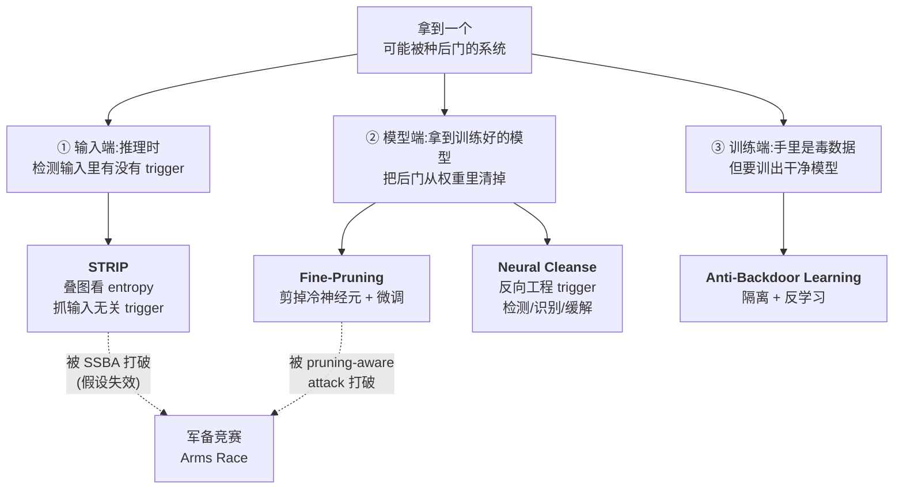
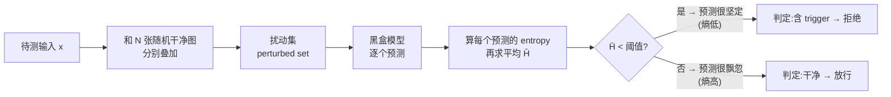
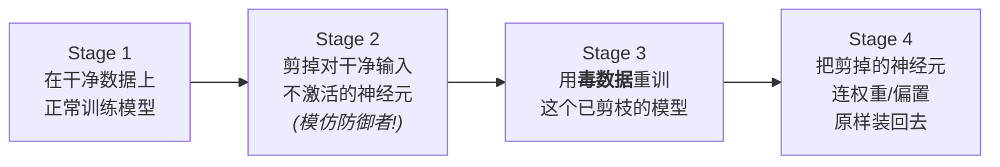
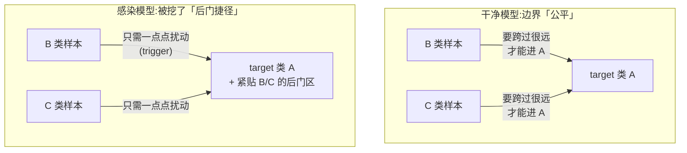
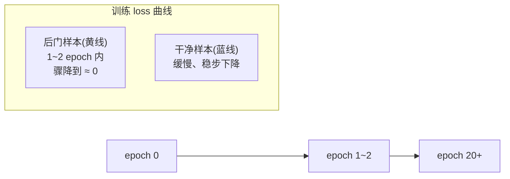
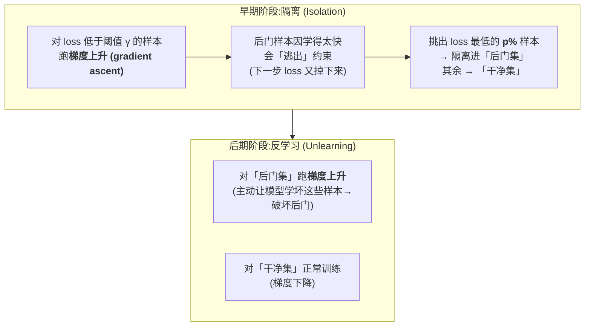
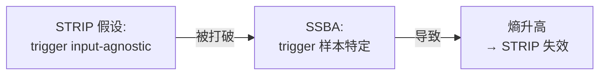

# Week 5 · 后门防御 / 缓解后门攻击 (Mitigating Backdoors / Trojans in DNNs)

> **CSIT375/975 — AI and Cybersecurity** · Dr Wei Zong · University of Wollongong

> **学习目标 (Learning objectives)** — 读完本章你应该能够:
> - **画出**后门防御的全景地图:沿着「**输入端检测 → 模型端清除 → 训练端鲁棒学习**」三道防线,把 STRIP、Fine-Pruning、Neural Cleanse、Anti-Backdoor Learning 四种防御各自钉在正确的位置上,并说清每种防御对应什么**威胁模型 (threat model)**(你能在什么时候、拿到什么东西去防);
> - **解释** STRIP 的核心直觉——「**trigger 是 input-agnostic(输入无关)的**」,并推导为什么「把输入和别的干净图叠加后看预测的 **entropy(熵)**」能区分干净输入(高熵)和带 trigger 输入(低熵);会算熵、会用 **FRR/FAR**(并知道它们就是 **FPR/FNR**)定阈值;
> - **复现** Fine-Pruning 的完整逻辑链:从「剪掉对干净输入不激活的神经元」这个朴素想法,到它为什么**会掉 4% 精度**而失败,到攻击者用 **4-stage pruning-aware attack** 破解它,最后到「**先剪枝、后微调**」为什么能同时保住精度又毁掉后门;
> - **推导** Neural Cleanse 的三件事——**检测 / 识别 / 缓解**:用 **decision boundary(决策边界)** 图解后门为什么是一条「捷径 (shortcut)」,理解「**反向工程出最小 trigger + 用 MAD 找离群标签**」如何同时定位 target label 和 trigger,并说清 mask/trigger 优化公式和「**unlearning(反学习)**」打补丁的做法;
> - **说清** Anti-Backdoor Learning 的关键观察——「后门子任务**学得特别快**(loss 早期骤降)」,解释为什么「直接过滤低 loss 样本」**行不通**,以及 ABL 如何用「**早期 isolation + 后期 gradient ascent 反学习**」在毒数据上直接训出干净模型;
> - **阐述**「军备竞赛 (arms race)」这一主题:为什么每个防御都建立在一条**可被攻击者打破的假设**上(以 SSBA 打破 STRIP 的 input-agnostic 假设为例),以及这一点和对抗样本的「固有缺陷」本质上有何不同。

上一周(Week 4)我们站在**攻击者**的视角,看着后门如何从 BadNets 一路进化到不可见、标签全对、甚至完全不动原模型的 TrojanNet/TrojanModel。这一周我们**换边坐下**,问一个守方的问题:**拿到一个可能被人种了后门的模型,我们能不能把它救回来?**

讲师在开场就给了一句提纲挈领的话——**这一章里的每一个防御,都是先观察到后门攻击的某一条经验性质 (empirical observation),再把这条性质变成武器。** 这句话是理解整章的钥匙:防御不是凭空设计的,它总是抓住攻击者留下的某个「破绽」。而本章的结尾(军备竞赛)又会告诉你:**只要攻击者愿意补上那个破绽,防御就会失效**。所以这是一场没有终点的拉锯。

我们会沿着一条非常自然的主线展开——**按「你能在攻击链条的哪一环动手」来组织四种防御**:

> 📎 **本章横跨两节课的录音(重要)** — 这套 "Mitigating Backdoors" 的 slides 也讲了**两节课**。**Lecture 5(Week 5)** 先花了大半节课**补完上一周的后门攻击**(clean label、TrojanNet、TrojanModel),然后才开始讲防御,讲到 **STRIP** 和 **Fine-Pruning** 就下课了;**Neural Cleanse、Anti-Backdoor Learning、军备竞赛**是在 **Lecture 6(Week 6)一开头**补完的(讲师原话:「上节课讲到了 fine pruning……我们先把剩下的讲完」)。**本指南整合了这两节录音**,所以四种防御全部有课堂讲解支撑、是完整的。
>
> ⚠️ **与 Assignment 2 的强关联** — 讲师反复点名:**Assignment 2 task 2 = 实现 Neural Cleanse 的 trigger 反向工程**(§四);**下一个 lab = 用 STRIP 检测 BadNets**(§二)。所以这两节务必动手吃透。
>
> 🧭 **一个统一的「威胁模型」前提** — 整章所有防御都假设守方处在最被动的位置:**(1)** 模型可能有后门、也可能没有(不能假设一定有);**(2)** 守方**完全不知道** trigger 长什么样、target label 是哪个(攻击者不会告诉你);**(3)** 守方常常**连原始训练集都没有**(你只是从网上下了个预训练模型);**(4)** 防御的**计算开销**必须远小于「自己从头训一个干净模型」,否则不如自己训。记住这四条,你就能理解每个防御为什么要这么设计。

---

## 一、防御的全景:三道防线与共同的「软肋」

在钻进具体算法之前,先把地图看清楚。后门攻击的生命周期有几个可以被守方拦截的环节,**你能拦在哪一环,取决于你拿到了什么**:

- 如果你**只能在推理时**看到流进来的输入(模型是个黑盒服务),那你能做的就是**检查每一个输入里有没有 trigger**,有就拒绝。这是第一道防线,代表就是 **STRIP**。
- 如果你**拿到了训练好的模型权重**(比如下载了一个预训练模型),你可以更进一步:**直接把后门从模型里清除掉**,还你一个干净模型。这是第二道防线,代表是 **Fine-Pruning** 和 **Neural Cleanse**。
- 如果你**手里是一堆可能被投毒的数据**,还没开始训练,你想问:能不能**在毒数据上直接训出一个干净模型**?这是第三道防线,代表是 **Anti-Backdoor Learning**。

这三道防线层层递进:第一道只是「挡」,后门还在;第二道是「治」,但要先有模型;第三道是「防」,从源头杜绝。讲师特意点明了第一道防线的局限——

> **STRIP 只是检测并拒绝可疑输入,模型本身还是带后门的,风险并没有消失 (the risk does not disappear)。** 所以更彻底的做法,是把模型「净化 (purify)」掉,这就引出了第二、三道防线。

而贯穿四种防御的,是开头说的那条共同主线:**每种防御 = 一条经验观察 + 利用它的算法**。下面这张表是本章的「骨架」,先扫一眼,读完全章再回来,你应该能凭它复述整章:

| 防御 | 防线(在哪一环) | 抓住的经验观察 | 需要什么 | 致命软肋(被什么打破) |
|---|---|---|---|---|
| **STRIP** | ① 输入端检测 | trigger 是 **input-agnostic** 的 | 一批干净样本 + 黑盒模型 | **SSBA**:trigger 样本特定 → 假设失效 |
| **Fine-Pruning** | ② 模型端清除 | 干净输入和 trigger 输入**激活不同神经元** | 模型权重 + 干净数据 | **pruning-aware attack**:逼两类输入共用同一批神经元 |
| **Neural Cleanse** | ② 模型端清除 | 后门是一条「**捷径**」:很小的扰动就能把任意输入推进 target 类 | 模型权重 + 干净数据 | 大 trigger / 多 target 攻击会削弱「离群」信号 |
| **Anti-Backdoor Learning** | ③ 训练端鲁棒学习 | 后门子任务**学得特别快**(loss 早期骤降) | 毒训练集(训练全程可控) | 极端高投毒率下对 Blend 仍会失手 |

---

## 二、第一道防线:STRIP —— 在输入里抓 trigger

### 2.1 问题:能不能判断「这张输入图里有没有 trigger」?

设想你把模型当成一个**黑盒服务**部署在线上,用户不断喂图进来。模型可能被第三方种了后门,也可能是干净的——你不知道。你能做的,是在**每一个输入**送进模型前,先问一句:**这张图里藏 trigger 了吗?** 如果藏了,就直接**拒绝 (reject)** 这个输入,不让它得逞;如果没藏,就放行。

难点在于威胁模型很苛刻:你**不知道 trigger 长什么样、也不知道 target label**。所以你不能去「匹配」一个已知的 trigger 图案——你必须找到一个**不依赖于具体 trigger 形状**的、放之四海皆准的判别信号。STRIP 找到的,就是这样一个信号。

### 2.2 直觉:trigger 是「input-agnostic」的,所以它「霸道」

STRIP 抓住的经验观察是:**很多后门(典型如 BadNets)的 trigger 是 input-agnostic 的**——`input-agnostic` 意思是「**与输入内容无关**」:不管底图是数字 8 还是数字 3,只要角上贴着那个固定的小方块,模型就铁了心输出 target label(比如 7)。

这个「霸道」的性质,恰恰是它的破绽。STRIP 的核心妙招是:**把待测输入和另一张随机的干净图(标签不同)叠加在一起,看模型的反应。**

- **如果输入是干净的**:你把两张内容冲突的图叠在一起,得到一张「四不像」的模糊图。一个正常模型面对这种歧义输入,**应该会犹豫**——它的预测会**随叠加的图随机地变化**(这次像 8、下次像 5),没有定见。
- **如果输入里有 trigger**:trigger 太霸道了,无论你往上叠什么干净图,模型只要还能「看到」那个 trigger,就依然**斩钉截铁地输出 target label**。预测**异常地稳定**。

所以判别准则就出来了:**反复叠加干净图后,如果模型的预测始终很坚定,这个输入极可能带 trigger;如果预测飘忽不定,它大概率是干净的。** 我们只需要一个数学量来刻画「坚定 vs. 飘忽」——那就是 **entropy(熵)**。

### 2.3 形式化:用熵度量预测的「随机性」

**Entropy(熵)** 度量一个概率分布的「混乱 / 不确定程度」。给定一张扰动图,模型输出一个在各类别上的概率分布 $y$,它的熵是:

$$H_n = -\sum_{i=1}^{M} y_i \log_2 y_i$$

逐项读这个公式:$M$ 是总类别数(MNIST 手写数字就是 $M=10$);$y_i$ 是模型把这张图判为第 $i$ 类的概率;$H_n$ 是第 $n$ 张扰动图的熵。整个式子在说一句话:**把每个类别概率的「信息量」($-\log y_i$)按概率加权求和**。

- 如果模型很**坚定**(比如 99% 认定是 7),概率几乎全压在一个类上,熵就**接近 0**(随机性小)。
- 如果模型很**犹豫**(各类概率摊得很平),熵就**大**(随机性大)。

slides 给的取值范围是 **$[0,1]$,越大越随机、越小越确定**。

> 📎 **拓展(超出 slides)** — 严格说,$M$ 类分布的 Shannon 熵范围是 $[0,\log_2 M]$,不是 $[0,1]$。STRIP 实际用的是经过归一化 / 相对比较的熵——但你**不需要纠结绝对刻度**,因为算法只关心**相对大小**:带 trigger 的熵明显比干净的低。考试记住「低熵=坚定=可疑,高熵=犹豫=干净」即可。

**STRIP 完整算法**(对一个待测输入 $x$):

1. 从手里的干净数据集中**随机抽 $N$ 张图** $x_1,\dots,x_N$;
2. 把 $x$ 分别和每张 $x_n$ **叠加**,得到 $N$ 张扰动图,合称**扰动集 (perturbed set)**;
3. 把这 $N$ 张扰动图逐个喂给模型,算出各自的熵 $H_1,\dots,H_N$;
4. 求平均熵 $\displaystyle \bar H = \frac{1}{N}\sum_{n=1}^{N} H_n$;
5. 若 $\bar H$ **低于检测阈值**,则判定 $x$ 含 trigger(置 Trojan flag = yes),拒绝它;否则放行。

> **🔑 例 — 叠加手写数字** — 待测图是「8」。你抽来「9」「7」「2」分别叠上去:若模型是干净的,它会被这些四不像图搞晕,三次分别可能说「像 8 / 像 7 / 说不准」,平均熵高;但若「8」角上有 trigger(target=7),那三张叠加图模型都会咬定「这是 7」,平均熵贴近 0 → 抓到!

### 2.4 怎么定阈值?——假设干净输入的熵服从正态分布

最后一个工程问题:**阈值定在哪?** STRIP 用**异常检测 (anomaly detection)** 的思路:假设**干净输入的熵服从 Normal(高斯)分布**。因为模型是固定的,守方手里又有一批干净样本,所以可以**事先 (in advance)** 把这批干净样本跑一遍算法,画出干净输入的熵分布,据此**预先标定阈值**。

判断标准用一对常见指标:

| 指标 | 全称 | 含义 | 等价于 |
|---|---|---|---|
| **FRR** | False Rejection Rate(误拒率) | 把**干净**输入**误判为** trojan 而拒绝的概率 | **FPR**(假正率) |
| **FAR** | False Acceptance Rate(误受率) | 把 **trojan** 输入**误判为**干净而放行的概率 | **FNR**(假负率) |

> 📎 **讲师强调的一个易混点(也是 Assignment 2 task 4 的评分口径)** — **FRR 就是 FPR、FAR 就是 FNR**,只是不同文献换着叫。理解方式:把「这是个 trojan 输入(攻击)」当作「正类」。"误拒" = 把干净的当成攻击拒了 = **假正**;"误受" = 把攻击当成干净放行了 = **假负**。Assignment 2 task 4(训练 watermarking 模型)就用 FRR/FAR 评分,别被术语绕晕。

### 2.5 结果:两条分得很开的熵分布

在交通标志数据集 **GTSRB** 上,取 2000 张干净图和 2000 张 trojan 图,画出各自的平均熵分布:

- **trojan 输入的熵集中在很低的值**(贴近 0)——正如直觉,模型对带 trigger 的图始终高度自信,哪怕叠了别的图也不动摇;
- **干净输入的熵铺开在一个很大的范围**,形状像一条高斯分布——和「干净输入叠加后会犹豫」的直觉吻合。

两条分布几乎不重叠。基于 MNIST / CIFAR-10 / GTSRB 的实验显示:**把 FRR 定在 1%,就能把 FAR 压到 1% 以下**——也就是说,只牺牲 1% 的正常输入被误拒,就能拦下 99% 以上的攻击。

> 🧭 **STRIP 的天花板** — 它只「挡」不「治」:被拒的输入扔掉了,但**模型本身的后门一点没动**。而且它**死死绑在「input-agnostic」这条假设上**——一旦 trigger 变成样本特定(SSBA),这个假设就垮了(详见 §六)。这正是我们要走向第二、三道防线的理由。

---

## 三、第二道防线之一:Fine-Pruning —— 把后门从神经元里剪掉

### 3.1 从「检测输入」到「净化模型」

STRIP 留下一个未解的问题:模型还是脏的。所以现在换个更强的设定——**你拿到了模型权重**(比如下载了个预训练模型),目标是**把潜在的后门从模型里清除**,同时:**几乎不掉精度**、**不需要原始训练集**(只要少量干净数据)、**开销远小于重训**。注意关键词是「**潜在 (potential)**」:你的算法既要能净化带后门的模型,也不能把干净模型搞坏。

### 3.2 观察:干净输入和 trigger 输入,激活的是不同神经元

Fine-Pruning 抓住的观察是:**面对干净输入和带 trigger 的输入,模型里被激活的是不同的神经元 (neurons)。** 一个合理的解释是——**每个神经元各管检测一种特定特征**。所以那些专门负责「检测 trigger 存在」的神经元,在输入干净时就**保持沉默(输出 0)**;反之,负责干净特征的神经元在 trigger 输入下沉默。

> 📎 **拓展(超出 slides):什么叫「神经元被激活」** — 一个神经元的输出值大(远离 0)就叫「被激活 (activated)」,接近 0 就叫「沉默」。直觉上,激活意味着「我检测到了我负责的那个特征」。这是后面所有剪枝逻辑的基础。

由此得到一个**朴素想法**:**把那些「对干净输入从不激活」的神经元剪掉(prune,即删除)**。它们对干净任务没贡献,却可能正是后门的藏身处。

### 3.3 朴素剪枝为什么失败:掉 4% 精度

可惜,直接这么剪**会失败**。实验画出「剪掉的神经元比例」对「干净精度(蓝线)」和「攻击成功率(红线)」的影响:确实,剪得越多,攻击成功率往下掉;但**要把攻击成功率压到接近 0,干净精度也被一起拖垮了**。原因是:**你删掉神经元 = 改变了模型的原始架构**,伤及无辜。

代价有多大?在例子里,后门是清掉了,但**干净精度掉了 4%**。

> 🧭 **为什么 4% 是「灾难级」的** — 讲师特意强调:整个研究界在 ImageNet 上的 SOTA top-1 精度,**每年也就提升约 1 个百分点**。你跑个防御掉 4%,等于**抹掉了全社区 4 年的努力**。所以 4% 绝不是「小代价」,朴素剪枝不可接受。

### 3.4 攻击者反击:4-stage pruning-aware attack

更糟的是,防御一旦公开,攻击者就知道了。一个实用的防御必须经得起**自适应攻击 (adaptive attack)**——攻击者**明知道你要剪「对干净输入不激活的神经元」**,他能不能反制?

攻击者的关键问题是:**能不能让「干净行为」和「后门行为」挤进同一批神经元?** 如果能,你剪后门神经元时就必然连干净神经元一起剪,剪枝想法就破产了。答案是**能**,办法是 **4-stage pruning-aware attack(剪枝感知攻击)**:

逐阶段读:**Stage 1** 正常训干净模型;**Stage 2** 攻击者**自己先把冷神经元剪掉**(抢在防御者前面);**Stage 3** 在**这个已经变小的网络上**用毒数据重训——因为可用的神经元变少了,模型被迫让**剩下的神经元同时承担干净任务和后门任务**;**Stage 4** 把之前剪掉的神经元**连同权重原样装回去**。

为什么必须有 Stage 4?因为**如果交付的模型架构被改动过,会引起受害者的怀疑**(回忆 Week 4 TrojanNet 也栽在「无法解释为何改架构」上),那这个模型可能根本不会被采用。装回去,架构看起来就和正常的一模一样。

**效果**:经过这套攻击,**「干净输入激活的神经元」和「trigger 输入激活的神经元」变成了同一批**——直接打破了防御的假设。防御者再去剪冷神经元,**后门剪不掉,精度还崩**(把攻击成功率从 80 压到 20 的同时,干净精度被严重拖垮)。

### 3.5 真正的 Fine-Pruning:先剪枝,后微调

防御者还能再进一步吗?能。最终版防御叫 **Fine-Pruning**,思路出奇地直接——**两个阶段**:

1. **先剪枝 (Prune)**:照旧剪掉对干净输入不反应的神经元;
2. **再微调 (Fine-tune)**:在一小批干净数据上**微调**整个网络。

名字 "Fine-Pruning" 就是「Fine-tuning + Pruning」的合写(虽然顺序是反的)。**为什么加一步微调就管用?**

- **微调能摧毁残留的后门**:微调会**改动模型权重**,而后门正是寄生在某些权重里的;权重一变,后门就被破坏。即便 pruning-aware attack 让后门神经元混进了「干净神经元」躲过剪枝,**微调这一步也会把它们的权重改掉**。
- **微调还能保住甚至提升干净精度**:你额外投入算力在干净数据上再训了一会儿,自然可能让干净表现不降反升。

**结果**:Fine-Pruning **挡住了 100% 的 pruning-aware attack**,而干净精度**最多只掉 0.2%**(有时还涨)。更细的数据:

| 攻击类型 | 任务 | 朴素 fine-tuning | **Fine-Pruning** |
|---|---|---|---|
| **Targeted**(有目标) | 人脸识别 / 语音识别 | 后门残留(语音仍有 ~43% 攻击成功率) | 攻击成功率压到 **≈ 0**,极有效 |
| **Untargeted**(无目标) | 交通标志识别 | 攻击成功率仍 **> 90%** | baseline:**99% → 29%**;pruning-aware:**90% → 37%** |

> 🧭 **两个考点细节** — **(1)** 对 targeted 攻击 Fine-Pruning 近乎完美;对 untargeted 攻击只能大幅削弱、压不到 0——因为**无目标攻击比有目标攻击更容易达成**(攻击者只要让模型「错」就行,不挑错成哪一类),所以更难防。**(2)** 干净精度有时**反而上升**(如 0.82 → 0.87),因为微调本身就是额外训练。

---

## 四、第二道防线之二:Neural Cleanse —— 反向工程出 trigger

### 4.1 三个一步到位的目标:检测 / 识别 / 缓解

Fine-Pruning 只「清」不「问」——它不告诉你模型到底有没有后门、target 是谁。**Neural Cleanse** 一口气要做三件事:

1. **检测后门 (Detecting)**:做一个**二元判断**——这个模型到底有没有被种后门?若有,**target label 是哪个**?
2. **识别后门 (Identifying)**:搞清后门的**预期行为**,并**反向工程 (reverse engineer)** 出攻击者用的 **trigger**。
3. **缓解后门 (Mitigating)**:**打补丁 (patch)** 让后门失效,且**不影响**模型在正常输入上的表现。

> ⚠️ **Assignment 2 task 2 就是实现这里的 trigger 反向工程(§4.3 的优化)。** 这一节是动手重点。

### 4.2 直觉:后门是一条「捷径」,在决策边界上挖了个洞

为什么能把 trigger 反推出来?关键观察是后门那条老性质——**只要输入带 trigger,无论它本来是什么,都被判成 target label**。把它画到**特征空间的决策边界 (decision boundary)** 上看:

- **干净模型**:要把 B、C 类的样本都误判成 A,你得给它们**很大的修改**,把它们硬推过老远的决策边界。
- **感染模型**:后门**改写了决策边界**,在紧贴 B、C 的地方**凭空造出一块属于 A 的「后门区域」**。于是只需**极小的修改**(那个 trigger),就能把 B、C 的任意样本推进这块区域,判成 A。

讲师的比喻很形象:后门就像在模型里**开了一条秘密通道 (shortcut)**——本来从 B 到 A 要绕远路,现在沿着这条捷径走一小步就到。

**Neural Cleanse 的 key idea**:**去探测这条捷径**——量一量「把某个区域的**所有**输入都推进目标区域,**最少**需要多大的扰动」。换句话说:**把任意 B 或 C 类输入变成 A 类,所需的最小 $\delta$ 是多少?** 如果对某个标签,这个最小扰动**异常地小**,那这个标签就是被攻击的 target,而那个最小扰动就是 trigger。

### 4.3 检测三步法 + trigger 反向工程

**检测后门的三步**:

1. **Step 1**:**任取一个标签**,假设它是 target;反向工程出一个「**最小 trigger**」(本质是 adversarial perturbation),它能把**所有其他标签的样本**都误分类到这个标签。这个解出来的 trigger 就叫**反向工程 trigger**。
2. **Step 2**:对模型的**每一个输出标签**重复 Step 1(因为事先不知道 target 是谁,只能逐个试)。
3. **Step 3**:跑**离群检测 (outlier detection)**——若某个标签的 trigger **显著小于**其他所有候选,它就是真 trigger,对应的标签就是 target label。

为什么这招行?直觉:如果你试的标签**不是** target,要把别的类都骗进去得用**很大**的扰动;只有当你试中了**真的 target**,才能找到一个**异常小**的 trigger。

**trigger 注入的通用形式**。先定义把 trigger 贴到图上的函数 $A(\cdot)$。对图像每个像素(位置 $i,j$、通道 $c$)做**加权叠加**:

$$A(x, m, \Delta)_{i,j,c} = (1 - m_{i,j}) \cdot x_{i,j,c} + m_{i,j} \cdot \Delta_{i,j,c}$$

逐符号读:$x$ 是原图;$\Delta$ 是 **trigger 图案 (trigger pattern)**;$m$ 是**掩码 (mask)**,取值 0~1,控制每个像素「**听原图的还是听 trigger 的**」。

- 当 $m_{i,j}=0$:该像素 $=x$ 原样(没 trigger);
- 当 $m_{i,j}=1$:该像素**完全被 trigger 覆盖**——这对应 BadNets(不透明小方块,trigger 区 $m=1$、其余 $m=0$);
- 当 $m_{i,j}=0.5$:原图和 trigger **半透明混合**——这对应 Blended 攻击。

**反向工程的优化**。我们同时优化 mask $m$ 和 trigger $\Delta$,求解:

$$\min_{m,\,\Delta}\ \ \ell\big(y_t,\ f(A(x,m,\Delta))\big)\ +\ \lambda \cdot |m|$$

两项相加做最小化 = **两项都要小**:

- **第一项**:$f$ 是模型,$\ell$ 是训练用的损失(图像分类就是 cross-entropy),$y_t$ 是当前假设的 target。这一项要求:**贴上 trigger 的图,被模型判成 $y_t$**(即 trigger 真的有效)。
- **第二项**:$|m|$ 是 mask 的 **$L_1$ 范数**(所有元素绝对值之和)。最小化它 = **让 trigger 尽量小**——理想解里 $m$ 大部分为 0,只在 trigger 那一小块有值。

对每个候选 $y_t \in \{0,\dots,K\}$ 都解一次,得到每个标签的「最小 trigger」,再挑出最小的那个。

**用 MAD 找离群**。怎么自动判断「哪个 trigger 显著小」?画出每个标签 trigger 的 $L_1$ 范数:真正的 target 标签(图中用 × 标)其 $|m|$ **远低于中位数、也远小于其它所有标签**。用 **Median Absolute Deviation(MAD,中位数绝对偏差)** 当**黑盒工具**(细节不要求):它给每个点返回一个 **anomaly index(异常指数)**,**指数 > 2 的点有 > 95% 概率是离群点**——于是把异常指数 > 2 的标签标记为「感染」。实验显示感染模型能被**可靠检测**。

**反向工程的 trigger 长什么样**:把 $m\cdot\Delta$ 可视化,和原始 trigger 对比(4 个 BadNets 模型)——**反推出的 trigger 和原 trigger 大致相似,$L_1$ 范数接近(如 12 vs 16),而且出现在同一个位置**。

> 🧭 **讲师的「打假」提醒(对 Assignment 2 很重要)** — slides 里那些反推 trigger 和原 trigger 几乎一模一样的漂亮图,讲师明说**是论文作者 cherry-pick(精挑细选)的最佳结果**。你做 task 2 时,因为优化有随机性,得到的多半是「**大部分区域偏红、位置贴近原 trigger**」的图——**只要视觉上和原 trigger 对得上位置,就算成功**,不必苛求和论文一样完美。

### 4.4 缓解:用 unlearning(反学习)打补丁

定位到 trigger 和 target 后,最后一步是**修模型**,办法叫 **unlearning(反学习)**——**训练模型去「忘掉」对 trigger 的反应**。具体只需:

- **微调 1 个 epoch**;
- 只用**原训练数据的 10%**(一小撮);
- 给这一小撮里的 **20%** 贴上**反向工程出的 trigger**,但**保持原始的正确标签不变**。

关键在最后一句:**贴了 trigger,标签却仍用 ground truth**。比如一张「2」贴上反推 trigger,标签还是「2」——这就强迫模型学会「**就算看到这个 trigger,这张图也还是 2**」,从而把后门关联抹掉。

**为什么不能只用干净数据微调?** 实验对比:

| 打补丁方式 | 攻击成功率(ASR) |
|---|---|
| 不打补丁 | ≈ 100% |
| 只用干净数据微调 | **仍 > 93.37%**(基本无效) |
| 用**原始** trigger 反学习 | 降到 **< 2%** |
| 用**反向工程** trigger 反学习 | 降到 **< 1%ish(部分 < 7%)**,大幅下降 |

结论:**反向工程 trigger 是原始 trigger 的一个很好的近似**,足以把后门反学习掉;而光用干净数据微调**关不掉**后门(除非用更多数据和 epoch,但那样开销又上去了)。

---

## 五、第三道防线:Anti-Backdoor Learning —— 在毒数据上训出干净模型

### 5.1 问题:数据可能有毒,但我必须用它训练

前两道防线都假设「模型已经训好了」。但现实里常常更早:**你从网上扒了一批数据,不知道它干不干净,却必须拿它训模型。** 能不能**在毒数据上直接训出一个干净模型**?难点和前面一脉相承:

- **逐张人工筛查不现实**:ImageNet 有 1000 类、100 多万张图,没法一张张看;
- **trigger 可能不可见**(回忆 SSBA),肉眼看了也白看;
- **不知道 trigger、target,连投毒率 (poisoning rate) 都不知道**;
- 还要**保住模型性能**、把**攻击成功率压到尽量低**。

一个自然的念头是「**训练前先识别并删掉毒数据**」,但这其实**不可行**:

- CIFA-10 上,**哪怕投毒率 < 1%(5 万张里就毒 200 张)**,多种攻击照样能拿到接近 100% 的成功率——**漏掉几张毒数据,攻击就照样成功**;
- 反过来,若数据其实是干净的,你「宁可错杀」删掉一堆可疑样本,又会**误删大量有价值的数据**,把模型性能拖下去。

所以 ABL 不走「删数据」的路,而是换了个更聪明的切入点。

### 5.2 观察:后门子任务「学得特别快」

ABL 的核心观察是:**在毒数据上训练,其实包含两个子任务**——

- **干净任务 (clean/original task)**:学数据干净部分,也就是你真正想要的任务(如图像分类);
- **后门任务 (backdoor task)**:学被投毒部分,即「见 trigger 就输出 target」。

而这两个子任务有**截然不同的学习行为**,这正是 ABL 的武器:

1. **后门任务比干净任务容易得多**——所以**后门样本的训练 loss 在最初几个 epoch 就骤降到接近 0**,而干净样本的 loss **稳步、缓慢**地下降。原因:后门攻击**人为地、显式地**在 trigger 和 target 之间建立了关联,这种关联**极易学习**。
2. **后门任务死死绑定一个特定类**(target class)。所以这个 trigger↔target 的关联**很容易被打破**——比如把一小撮低 loss 样本的标签随机打乱 (shuffle)。

(在 CIFAR-10 上投毒 10%,对比干净 vs 后门样本的平均 cross-entropy:**后门样本约一个 epoch 后 loss 就贴近 0**,BadNets 和 Blend 都是如此。)

### 5.3 为什么不能「直接过滤掉早期的低 loss 样本」?

既然后门样本早期 loss 低,那「在早期把低 loss 样本删掉」不就行了?**不行**,两个原因:

- **原因 1(会漏)**:前面看的是**平均** loss——意味着**总有一些后门样本 loss 仍然偏高**,会逃过过滤。而前面说过,**哪怕只漏 50~100 张后门样本,攻击照样成功**。
- **原因 2(会误删)**:**如果训练得够久(比如超过 epoch 20),很多干净样本的 loss 也会变低**,这时按低 loss 过滤会**严重不准**,把大量干净样本也删了。

所以简单过滤行不通,需要更精巧的两阶段设计。

### 5.4 ABL 方法:早期隔离 + 后期反学习

ABL 把整个训练过程**拆成两个阶段**:

逐步读:

- **早期(隔离)**:平常训练是「梯度下降 (gradient descent)」让 loss 变小;ABL 反着来——**当一个样本的 loss 已经低于阈值 $\gamma$,就对它跑梯度上升 (gradient ascent)**,人为**抬高**它的 loss。但后门样本「学得太容易」,你抬高它,下一轮它的 loss 又迅速掉回去——于是**那些怎么压都保持低 loss 的样本,极可能就是后门样本**。把 loss 最低的 **$p\%$**(**隔离率 (isolation rate)**,如 $p=1\%$)隔离进**后门集**,其余进**干净集**。注意**隔离率假定远小于真实投毒率**(如 1% « 10%)。
- **后期(反学习)**:对**干净集**正常训练(梯度下降);对隔离出的**后门集**跑**梯度上升**——**主动让模型在这些样本上学坏**,从而**摧毁后门关联**。

**结果**(CIFAR-10,对比 Fine-Pruning(FP)、MCR、NAD;后两者不要求):

- **ABL 在干净精度和整体抗攻击鲁棒性上都最好**;唯一例外是对 **Blend** 攻击,不如 NAD。
- **隔离率 $p$ 的影响**($p\in[0.01,0.2]$):$p$ 越高 → 隔离出越多后门样本去反学习 → **ASR 越低**;但同时**更多样本进了反学习模式,会损害干净精度**。所以 $p$ 要权衡(1% 往往就够)。
- **极端投毒率测试**(固定 $p=1\%$):投毒率高达 **50%** 时,仍能把 ASR 从 100% 压到 **4.98%(BadNets)/ 27.28%(Blend)**;投毒率 **70%** 时对 **BadNets 仍鲁棒**(ASR ≈ 5%),但**对 Blend 在这种极端下失手**。

---

## 六、贯穿全章的主题:军备竞赛 (Arms Race)

把四个防御学完,你应该已经隐隐感到一个模式:**每个防御都建立在一条「攻击会暴露某种性质」的假设上。** 这就引出本章最重要的思想——**攻防是一场没有终点的军备竞赛**:

> **一个防御一旦被提出,「总会」有 adaptive attack 通过「合理地打破它的假设」来绕过它。**

最干净的例子,就是用 **SSBA 打破 STRIP**:

- STRIP 的命根子是「**trigger 是 input-agnostic**」这条假设;
- 而 **SSBA(Invisible Backdoor Attack with Sample-Specific Triggers)** 恰恰反其道而行——**给不同输入生成不同的 trigger**,直接违背了「输入无关」;
- 后果:用 STRIP 去测 SSBA,**算出来的熵很高**(熵越高,STRIP 越难判它是攻击)——SSBA 比 BadNets、Blended **更能抵抗 STRIP,有潜力直接绕过它**。

> 🧭 **后门 vs. 对抗样本:为什么这场竞赛「没有尽头」(高频考点)** — 讲师特意区分了两者:
> - **对抗样本是模型的「固有缺陷」**——根源是 shortcut learning(模型学的特征和人类感知不对齐)。所以理论上,**等模型某天学会了和人类一致的特征,对抗样本就会自然消失**;甚至「人和 AI 被同一种错觉骗到」是可以接受的(就像人类也会有 optical illusion 视错觉)。
> - **后门攻击是人类「蓄意设计」的**——它不是缺陷,是有人故意种的。所以**无论防御多好,攻击者总能针对性地设计出更强的、打破你假设的新攻击**。这就是为什么后门攻防是一场**永不停歇**的拉锯,而对抗样本理论上有「终局」。

---

## 七、本章小结 (Key Takeaways)

- **后门防御 = 经验观察 + 利用它的算法**,并按「**你能在攻击链的哪一环动手**」分成三道防线:**① 输入端检测(STRIP)→ ② 模型端清除(Fine-Pruning、Neural Cleanse)→ ③ 训练端鲁棒学习(Anti-Backdoor Learning)**。所有防御共享一个苛刻的威胁模型:不知 trigger、不知 target、常无原始训练集、开销须小于重训。
- **STRIP**:抓住「trigger 是 **input-agnostic**」的霸道性质,把输入和随机干净图叠加,看预测 **entropy**——**干净输入熵高(犹豫)、trigger 输入熵低(坚定)**。假设干净熵服从高斯分布、预先定阈值;1% **FRR** 即可把 **FAR** 压到 1% 以下。它只「挡」不「治」,且**会被 SSBA 打破**。记牢 **FRR=FPR、FAR=FNR**。
- **Fine-Pruning**:观察「干净/trigger 输入激活不同神经元」→ 朴素剪枝「删冷神经元」**会掉 4% 精度而失败**(等于抹掉社区 4 年进步)→ 攻击者用 **4-stage pruning-aware attack**(自己先剪、用毒数据重训、再把神经元装回)逼两类输入**共用神经元**打破假设 → 最终方案 **先剪枝后微调**:微调改权重摧毁后门、又保住精度,**挡住 100% pruning-aware 攻击、精度仅掉 0.2%**。对 targeted 近乎完美,对 untargeted 只能大幅削弱(因 untargeted 更易达成)。
- **Neural Cleanse**:一口气做**检测 / 识别 / 缓解**。核心直觉——后门在决策边界上挖了条「**捷径**」,让极小扰动就能把任意输入推进 target 类。于是**对每个标签反向工程出「最小 trigger」**(优化 mask $m$ 和 pattern $\Delta$,目标:trigger 有效 + $|m|$ 最小),再用 **MAD**(anomaly index > 2)找出 trigger 异常小的**离群标签 = target**。最后用 **unlearning**(贴反推 trigger 但**保持正确标签**,微调 1 epoch)打补丁,把 ASR 从 ~100% 压到 < 1%;**只用干净数据微调无效(ASR 仍 >93%)**。**= Assignment 2 task 2**。
- **Anti-Backdoor Learning**:在毒数据上直接训干净模型。关键观察——**后门子任务学得特别快(loss 早期骤降到 ≈0)**。但「直接过滤低 loss 样本」**行不通**(平均 loss 会漏掉高 loss 后门样本;训久了干净样本 loss 也低会误删)。方法是两阶段:**早期对低 loss 样本梯度上升做隔离**(怎么压 loss 都低的就是后门,隔离最低 $p\%$),**后期对隔离的后门集梯度上升做反学习**。综合最优,但极端投毒率下对 **Blend** 仍会失手。
- **军备竞赛是本章的灵魂**:每个防御都压在一条**可被打破的假设**上(SSBA 打破 STRIP 的 input-agnostic、pruning-aware 打破 Fine-Pruning 的神经元分离)。**后门攻击是人为蓄意的**,所以总能设计新攻击绕过防御——这与「对抗样本是模型固有缺陷、终将随特征对齐而消失」**本质不同**,注定是一场没有终点的拉锯。

---

## 八、与 Assignment / Lab / 相邻周的关联

| 关联点 | 说明 | 对应章节 |
|---|---|---|
| **Assignment 2 task 2 = 实现 Neural Cleanse 反向工程** | 讲师明确点名;吃透 §4.3 的 mask/trigger 优化公式,接受结果有随机性(别拿论文 cherry-pick 图当标准) | §四 |
| **下一个 Lab = 用 STRIP 检测 BadNets** | 会在 Python 里实现 §二 的叠图 + 熵算法,看不同 trigger 下的检测表现 | §二 |
| **Assignment 2 task 4 用 FRR/FAR 评分** | 训练 watermarking 模型时按误拒/误受率评,记住它们 = FPR/FNR | §2.4 |
| **承接 Week 4(后门攻击)** | 本周防御正是针对上周的 BadNets/Blended/SSBA;**STRIP 抓 BadNets/Blended,抓不到 SSBA**——攻防对照着记 | 全章 |
| **SSBA 是连接攻防的枢纽** | Week 4 学它是「最隐蔽的攻击」,本周它又是「打破 STRIP 的 adaptive attack」 | §六 |
| **复用「对抗扰动」思想** | Neural Cleanse 反推 trigger 本质是解一个 adversarial perturbation 优化——再次印证「对抗样本是众多 AI 攻防的基础积木」 | §4.3 |
| **Week 6(下周)= Model Stealing** | 讲师课上已无缝衔接到模型窃取攻击(softmax、knowledge distillation) | 后续 |
