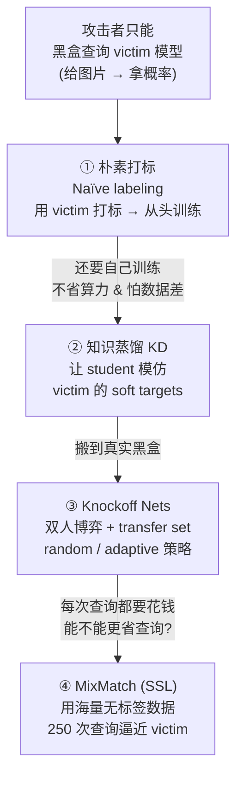
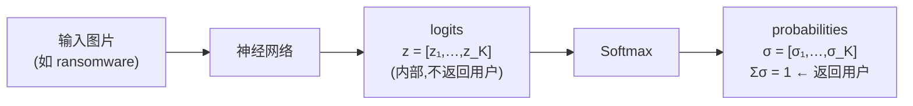
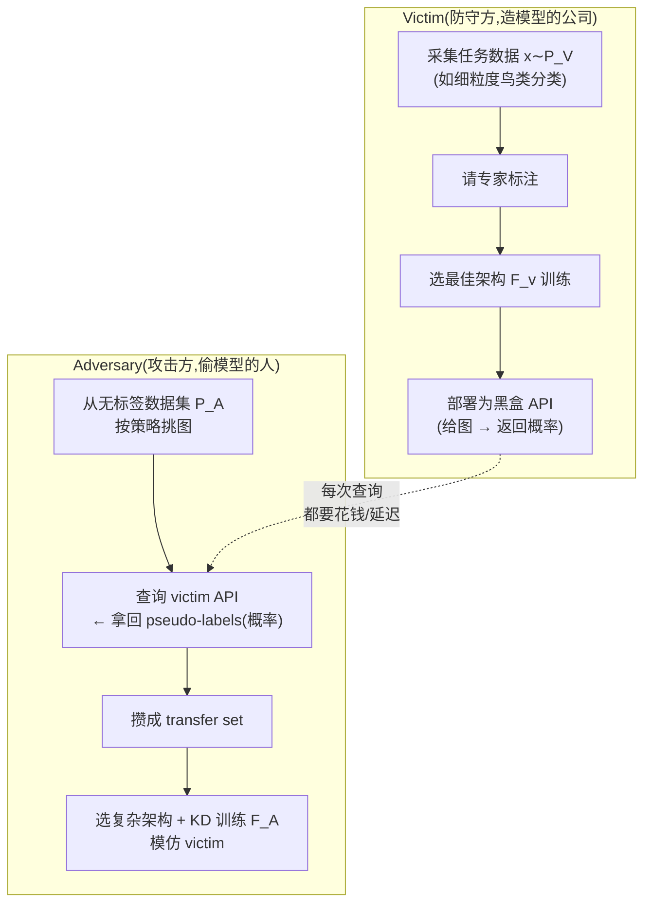
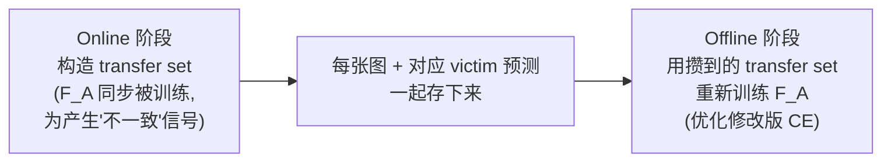
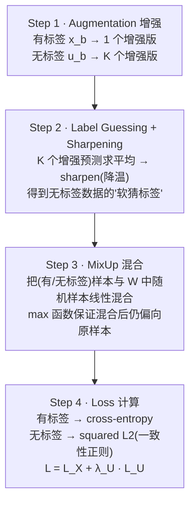

# Week 6 · 模型窃取攻击 (Deep Neural Network Model Stealing Attacks)

> **CSIT375/975 — AI and Cybersecurity** · Dr Wei Zong · University of Wollongong

> **学习目标 (Learning objectives)** — 读完本章你应该能够:
> - **讲清动机**:为什么训练一个商用 DL 模型「贵得离谱」(数据采集、专家标注、机密数据、架构搜索、算力——ChatGPT-3 花 $2–4M、PaLM 花 $3–12M),以及为什么这让「**仅凭 input-output 对就复制一个黑盒模型**」成了有利可图的攻击;并能区分 **model functionality stealing(功能窃取)** 和 **inference attacks(推理攻击)** 的不同目标;
> - **吃透 Softmax**:解释 **logits → probabilities** 的转换、为什么概率和为 1,会手算一个 softmax 数值例子;并理解 **temperature(温度)** $T$ 如何「软化 / 锐化」概率分布;
> - **复现知识蒸馏 (Knowledge Distillation, KD) 的逻辑链**:从「模型的知识 = **学到的输入→输出映射**(而非权重)」这一关键视角,到「用 **soft targets(软标签)** 让 student 模仿 teacher」,到为什么要**升高温度**才能暴露「**dark knowledge**(错误答案的相对概率)」,再到用 **KL divergence** 训练 student;
> - **推导 Knockoff Nets**:把窃取建模成 **victim vs. adversary 的双人博弈**,说清 **transfer set(迁移集)** 的两种构造策略(**random** vs. **adaptive**)、为什么 Knockoff 里 **T=1**、online/offline 两阶段训练,并能解读三种数据场景($P_A{=}P_V$ / closed-world / open-world)下的实验结论——包括「$30 偷下一个人脸识别 API」这一震撼结果;
> - **解释半监督学习 (Semi-Supervised Learning, SSL) 如何提升窃取效率**:逐步说清 **MixMatch** 的四步(**augmentation → label guessing + sharpening → MixUp → loss**),理解 **consistency regularization(一致性正则)** 的核心思想,并能读懂「只用 **250 次查询**就逼近 victim」的结果;
> - **串起本章主线**:三种窃取手段是**层层递进**的——朴素打标 → KD(知识蒸馏) → Knockoff(真实黑盒) → MixMatch(用无标签数据榨干每一次查询)。

上一周(Week 5)我们站在**守方**,把后门从模型里清除。这一周我们**换一种威胁**:攻击者甚至不碰你的训练流程,他只是**像普通用户一样调用你部署在线上的模型**,然后把它「**偷**」走——复制出一个功能几乎一样的副本。讲师在开场点明了本章的分量:**这是本课程「AI 模型自身的安全问题」这半部分的最后一章**;下一周开始,课程转向「用 AI 解决安全问题」。

> 📎 **本章横跨两节课的录音(重要)** — 这套 "Model Stealing" 的 slides 讲了**两节课**。**Lecture 6(Week 6)** 先花了大半节课**补完上一周的后门防御**(Neural Cleanse、Anti-Backdoor Learning、军备竞赛),然后才开始讲模型窃取,一路讲到 **Knockoff Nets** 的全部结果就下课了(讲师原话:「Can we do better? 我们下周继续」);**半监督学习 / MixMatch(slides 24–33)** 是在 **Lecture 7(Week 7)一开头**补完的,之后才转入 Week 7 自己的主题(IP protection)。**本指南整合了这两段录音**,所以 KD、Knockoff、MixMatch 三部分都有完整课堂讲解支撑。

本章的骨架,是一条「**偷得越来越聪明**」的主线:



> 🧭 **一句话抓住全章** — **模型的「价值」藏在它的「输入→输出映射」里,而这个映射可以仅凭黑盒查询被「蒸馏」出来。** 升温(KD)是为了暴露映射的细节(dark knowledge),降温(MixMatch 的 sharpening)是为了把猜的标签变自信——温度这一个旋钮,贯穿了整章。

---

## 一、引子:为什么「偷模型」是门划算的生意?

### 1.1 训练一个商用模型,到底贵在哪?

在谈「偷」之前,先理解「造」有多贵——因为攻击的全部动机,就是**绕开这些成本**。开发一个商用 DL 模型,钱和精力烧在五个地方:

- **采集海量标注数据**:动辄上百万张图。
- **专家标注**:像**医学影像 (medical images)**,得请医生来标,极贵。
- **机密数据**:医疗记录、金融记录这类数据**根本不公开**,你想买都买不到。
- **架构 / 超参搜索**:找到合适的 architecture 和 hyperparameters 本身要反复试。
- **算力**:训练本身就要烧钱。讲师给了两个标志性数字:

| 模型 | 年份 | 训练成本(仅算力) | 规模 |
|---|---|---|---|
| **ChatGPT-3** | 2020 | 约 **\$2M – \$4M** | — |
| **PaLM** (Pathways Language Model, Google AI) | 2022 | 约 **\$3M – \$12M** | **540 billion** 参数,transformer-based LLM |

正因为造得这么贵,厂商会把**数据细节、确切架构、超参**全部**保密**,以保护模型的商业价值。模型最终以**黑盒 (black-box)** 形式部署:**输入进去,预测出来**(input in, predictions out),内部一概不可见。

### 1.2 核心问题:能只凭「输入-输出对」复制一个黑盒吗?

于是攻击者发问:

> **Can one create a copy of the black-box model solely based on input-output pairs?**(能不能仅凭「喂图片、收预测」这些成对数据,就复制出黑盒的功能?)

**答案是 YES。** 这就是本章的主题——**model functionality stealing(模型功能窃取)**:窃取一个复杂黑盒模型的**功能**(给同样的输入,产生几乎一样的输出)。它能帮攻击者**省下(其实是「偷走」)**那几百万美元的研发与训练成本。

> ⚠️ **别和 inference attacks 混淆(高频易错点)** — 讲师特意区分两类不同目标的攻击:
> | | **Model functionality stealing(本章)** | **Inference attacks** |
> |---|---|---|
> | 目标 | 复制模型的**功能 / 行为** | **推断模型的某些属性** |
> | 想得到 | 一个功能等价的副本 $F_A$ | 训练数据、架构等**关于**模型的信息 |
> 一句话:**功能窃取偷的是「会做什么」,推理攻击偷的是「它是什么样的」。**

---

## 二、预备知识:Softmax 与「朴素偷法」为什么不够好

### 2.1 Softmax:把 logits 变成概率

要理解窃取,先要看清模型「吐」给用户的到底是什么。回忆一下:一个神经网络最后一层输出的是 **logits(原始打分)**——但厂商**通常不会**把 logits 直接返回给用户,而是返回**概率 (probabilities)**。把 logits 转成概率,靠的就是 **softmax**。

**Softmax** 专为**多分类 (multi-class classification)** 设计,作用是给每个类别分配一个**小数概率**,且**所有概率加起来等于 1.0**。定义为:

$$\sigma(z)_i = \frac{e^{z_i}}{\sum_{j=1}^{K} e^{z_j}}, \qquad i = 1,\dots,K$$

逐项读:$z_i$ 是第 $i$ 类的 logit;分子 $e^{z_i}$ 把它指数化(永远为正);分母是**所有类指数之和**(归一化项,保证总和为 1);$\sigma(z)_i$ 就是第 $i$ 类的概率。$K$ 是类别数,$e$ 是自然常数。



> **🔑 数值例子(slides 原例)** — 设 logits 向量 $z = [1.2,\ 2.5,\ 1.8]$。
> - 分母 $= e^{1.2} + e^{2.5} + e^{1.8} \approx 3.32 + 12.18 + 6.05 = 21.55$。
> - 各类概率:$\frac{3.32}{21.55}\approx 0.154$,$\frac{12.18}{21.55}\approx 0.565$,$\frac{6.05}{21.55}\approx 0.281$。
> - 验证:$0.154 + 0.565 + 0.281 = 1.0$ ✓。

> 📎 **拓展(承接 Week 1)** — logits / softmax 在 Week 1 讲神经网络基础时已出现过,这里是把它**作为窃取攻击的「接口」**重新审视:**攻击者只能拿到 softmax 后的概率,拿不到 logits**——这个限制,后面解释 Knockoff 为什么用 $T{=}1$ 时至关重要。

### 2.2 朴素偷法 (Naïve Way):为什么不够好?

最直接的窃取思路:**用 victim 模型给一批数据打标,再拿这些「数据+标签」从头训练自己的模型。**

听起来可行,但讲师列了它的几条硬伤:

- **强烈依赖数据质量**:如果攻击者手里的数据**和原始训练数据接近**,效果还行(可能只略差);但如果**差很远**,偷出来的模型**性能很低**。
- **数据贵 / 难搞时不现实**:像医学影像、金融记录这种数据本身就难拿。
- **省不了算力**:你**还是得从头训练一个模型**,该烧的算力一分没省。

换句话说,朴素偷法把窃取退化成了「普通的监督训练」,既没占到便宜,又脆弱。**真正聪明的攻击者会用知识蒸馏。**

| | **朴素偷法 (Naïve)** | **知识蒸馏 (KD)** |
|---|---|---|
| victim 输出怎么用 | 当成 **hard label**(只取最可能那一类) | 当成 **soft target**(保留整个概率分布) |
| 学到了什么 | 只学「答案」 | 还学到「错误答案的相对可能性」= **dark knowledge** |
| 省算力吗 | 否,从头训练 | 借助 soft target / 预训练,效率高得多 |
| 性能 | 数据差就崩 | 显著更稳、更好 |

---

## 三、知识蒸馏 (Knowledge Distillation):窃取的核心引擎

### 3.1 它本来是用来「压缩模型」的

**Knowledge Distillation (KD)** 由 **Hinton 等人(2015)** 提出(讲师补一句:Hinton 因「让神经网络得以进行机器学习的奠基性发现」获 **2024 年诺贝尔奖**)。它**最初的动机是 model compression(模型压缩)**:把一个**模型集成 (ensemble)** 的知识,**转移**进一个**小的单一模型**里部署。但这套「转移知识」的机制,**正好被攻击者拿来窃取模型**。

### 3.2 关键视角:模型的「知识」是映射,不是权重

KD 的整个根基,是对「**什么是模型的知识**」的一个**重新定义**:

- **旧视角**:知识 = 训练得到的**参数 (parameter values)**。
- **它的致命问题**:如果知识就是权重,那你**没法把知识从一个架构搬到另一个架构**——VGG 和 ResNet 的参数数量、结构都不同,权重根本对不上。
- **KD 的新视角**:**模型的知识 = 它学到的「输入向量 → 输出向量」的映射(mapping / 函数)**。

这个视角的妙处在于:只要两个模型给出**相同的输入→输出映射**,它们就**拥有相同的知识**——无论内部架构多么不同。而这,正是窃取得以成立的理论前提。

> **🔑 dark knowledge:错误答案的相对概率,泄露了模型怎么「泛化」** — Hinton 的核心洞察:**一个模型对「错误类别」分配的相对概率,蕴含了大量关于它如何泛化的信息。** 例:给一张 BMW 的图,模型也许有极小概率把它误判成 garbage truck(垃圾车),但误判成 carrot(胡萝卜)的概率**还要低好几个数量级**。「BMW 更像垃圾车而非胡萝卜」——这种**类别间的相对相似度**,就是藏在概率分布里的 **dark knowledge**,也正是 student 要从 teacher 那里偷学的东西。

### 3.3 用 soft targets 让 student 模仿 teacher

于是窃取的做法变成:**用 victim 产生的概率作为 "soft targets"(软标签),来训练 student(即 knockoff)模型,让它模仿 victim。**

- **hard target(硬标签)**:一张猫的图 → `[猫=1, 狗=0, 鸟=0]`。普通监督训练用的就是它,配 **cross-entropy loss**。
- **soft target(软标签)**:`[猫=0.95, 狗=0.03, 鸟=0.02]`。它保留了「猫更像狗而非鸟」的 dark knowledge。
- 软标签可以由**原始训练集**或一个单独的 **"transfer set"(迁移集)** 产生,而且 **transfer set 可以完全是无标签数据**(我们只需要 victim 给的概率)。

### 3.4 温度 (Temperature):软化分布,逼出 dark knowledge

有个麻烦:对**简单任务**(如 MNIST 手写数字),victim 几乎总以**极高置信度**给出正确答案——比如把某个「2」判为「3」的概率是 $10^{-6}$,判为「7」是 $10^{-9}$。这些概率**近乎 0**,soft target 退化成了 hard target,**没什么 dark knowledge 可学**。

解决办法:**升高 softmax 的温度 $T$**,把分布「软化」:

$$\sigma(z)_i = \frac{e^{z_i / T}}{\sum_{j} e^{z_j / T}}$$

- $T=1$:朴素 softmax($T$ 消失)。
- **$T > 1$:分布变软**(各类概率拉得更平,差距缩小)→ 暴露 dark knowledge。
- **$T < 1$:分布变锐**(强者愈强)→ 趋向 one-hot。($T$ 必须 $>0$。)

> **🔑 升温数值例子(slides 原例)** — 两类(cat / dog),logits = $[10,\ 2]$。
> - **$T=1$**:$e^{10}\approx 22026$,$e^{2}\approx 7.39$ → cat $\approx 99.97\%$,dog $\approx 0.03\%$。几乎是 hard target,看不出 dog 的相对可能性。
> - **$T=5$**:logits/T = $[2,\ 0.4]$,$e^{2}\approx 7.39$,$e^{0.4}\approx 1.49$ → cat $\approx \frac{7.39}{8.88}=83\%$,dog $\approx 17\%$。**现在「dog 也有点像」这件事被显示出来了**——这正是要 student 学的信号。
>
> **转移知识 (transferring knowledge)** = 用**高温**下 victim 产生的 soft target,在 transfer set 上训练 student。实验常用 $T=4$ 或 $T=6$。

### 3.5 怎么训练:KL divergence 与 Python 实现

让 student 模仿 teacher,数学上就是**最小化两个概率分布的差异**,用 **KL divergence(KL 散度)** 度量:

- **KL = 0 ⟺ 两个分布完全相同**(这是理论上的终极目标:student 完美复制 teacher)。

实现骨架(PyTorch):

```python
# teacher = victim(被偷的模型);student = knockoff(我们训练的)
s_logits = student(x) / T          # student 的 logits 除以温度
t_logits = teacher(x) / T          # teacher 的 logits 除以温度
distill_loss = KL_div(log_softmax(s_logits), softmax(t_logits))

# 若恰好有真标签,可加一个小的监督项(否则 α=0,只用蒸馏损失)
stu_loss = F.cross_entropy(logits, target, reduction='mean')
loss = distill_loss + alpha * stu_loss
```

> 📎 **两个实现细节(讲师强调)** — (1) student 一侧要用 **`log_softmax`**,因为 PyTorch 的 `KL_div` API **要求第一个分布是 log 尺度**;(2) 现实中攻击者**通常没有真标签**,所以 `alpha = 0`,**只优化蒸馏损失**。Lab 里你会用 Python 亲手实现 KD。

---

## 四、Knockoff Nets:把蒸馏搬进真实黑盒

KD 解决了「怎么模仿」,但现实里 victim 是个**线上黑盒 API**,你既不知道它的架构,也没有它的训练数据。**Knockoff Nets(Orekondy et al., 2019)** 把窃取落地成一个完整攻击。

### 4.1 形式化:一场 victim vs. adversary 的双人博弈

- **victim 模型** $F_v: X \to Y$:给任意图片 $x$,返回一个 $K$ 维概率向量 $y$(各分量 $\in[0,1]$,$\sum_k y_k = 1$)。
- **adversary 的目标**:用一个 **knockoff 模型** $F_A$ 复制功能,使 $F_A(X) \approx F_v(X)$。
- **adversary 的「未知数」**:$F_v$ 的**内部**(架构、超参)+ 训练/评估用的**数据**——全不知道。



注意 **pseudo-labels(伪标签)**:adversary 自己的数据是无标签的,他靠**查询 victim** 来获得标签——这些标签就是 victim 给的概率,称伪标签。**每次查询都有成本**(金钱、延迟),所以攻击者拼命想**省查询**。

### 4.2 Transfer set 怎么构造:random vs. adaptive

攻击者手里有个图像数据集 $P_A$,但**不能把每张图都拿去查**(太贵),得用**策略**挑子集:

| 策略 | 怎么挑 | 优 / 劣 |
|---|---|---|
| **Random(随机)** | 从 $P_A$ 无放回随机采样去查 $F_v$ | 简单;**风险**:可能采到与任务无关的图(拿狗的图去查鸟类分类器) |
| **Adaptive(自适应)** | 用三条信号引导采样(见下) | 更省查询、更有效 |

**Adaptive 的三条信号**:
1. **鼓励 victim 给出高置信预测** → 高置信通常意味着这张图落在 victim 训练过的 **domain** 内;
2. **鼓励图像多样性** → 避免所有图都来自单一或少数几个类;
3. **鼓励 knockoff 与 victim 预测「不一致」** → 不一致 = 还有东西可学(若两者已预测相同,这张图对 knockoff 没有新信息)。

> 注意:adaptive 里 $F_A$ 是**在构造 transfer set 的过程中被同时训练**的(为了第 3 条信号),之后还会**重新训练**。

### 4.3 蒸馏:为什么 Knockoff 里 T = 1?

构造好 transfer set 后,就用 KD 训练 knockoff。但这里**不加温度($T=1$)**——

> **🔑 为什么 T=1?** 因为 victim API **只返回概率,不返回 logits**。温度是作用在 logits 上的;既然你只拿得到 softmax **之后**的概率,就**无法再去「重新升温」**。所以 Knockoff 等价于「$T=1$ 的知识蒸馏」。(对比 §3.4:升温的前提是你能拿到 logits。)

损失用**修改版 cross-entropy**——把硬标签换成 victim 给的软概率 $p^V$:

$$\ell_{CE} = -\sum_{c \in \{1,\dots,K\}} p^V_c \,\log\big(p^A_c\big)$$

它和 KL divergence **在「目标分布固定」时,只差一个加性常数 (additive constant)**,所以**优化结果完全相同**。而 transfer set 一旦构造完就固定了,正好满足这个条件。

> **🔑 「只差常数 → 最优解相同」的直觉** — 想象 $y=x^2$ 和 $y=x^2+1$:后者只是把前者**整体上移 1 个单位**,但两条抛物线的**最低点都在 $x=0$**。最小化时,加性常数不影响取最优解的位置——所以用修改版 CE 还是 KL,优化出的 student 是一样的。

### 4.4 两阶段训练 & 架构选择

knockoff 分**两个阶段**训练:



**架构选择**:经验上只要选一个**足够复杂**的架构(VGG、ResNet 等)即可,结果对 student 架构的选择**鲁棒**;而且 $F_A$ 可以用 **ImageNet 预训练权重**起步,不必从零训。

### 4.5 实验:三种数据场景与「偷得有多准」

实验用 4 个数据集(物体、鸟类、室内场景、医学影像),victim 全是 **ResNet-34 + ImageNet 预训练**。关键变量是**攻击者能拿到什么数据 $P_A$**,分三种场景:

| 场景 | $P_A$ 是什么 | 与 victim 训练数据 $P_V$ 的重叠 | 现实性 |
|---|---|---|---|
| **$P_A = P_V$** | 与 victim 训练数据**完全相同**(但无标签) | **100%** | 理想化基准(攻击者不可能真有) |
| **Closed-world** ($P_A = D2$) | 「全宇宙」图像(2.2M 图、2129 类),$P_V$ 是其子集 | **100%**(因为包含全部) | 强假设基准 |
| **Open-world** | 大型公开集(ILSVRC-2012:1.2M/1000 类;OpenImages:550K/600 类) | **纯属巧合**(如 Caltech256 与 ILSVRC 重叠 42%,医学集 Diabetic5 重叠 0%) | **最现实** |

**结果(random 策略,60k 查询)**——用「恢复了 victim 多少倍性能」($\times F_v$)衡量:

| 场景 | 恢复性能 | 含义 |
|---|---|---|
| $P_A = P_V$ | **0.92 – 1.05×** | 拿到全部(无标签)训练图 + $T{=}1$ 蒸馏,几乎完全复制,**有时甚至超过 victim** |
| Closed-world | **0.84 – 0.97×** | 合理复制所有黑盒 |
| Open-world | **0.81 – 0.96×** | 随便从网上抓图也能恢复 ~80%+;ILSVRC vs OpenImages 差异 ≤ 0.04×,**说明任何大而多样的图集都是好 transfer set** |

**Adaptive 策略**:相比 random **持续提升**(最多 +4.5%),且在 **closed-world 下极其省查询**——例:CUBS200 用 random 要 60k 查询才到 68.3%,adaptive 只要 **10k(快 6 倍)**就达到同样精度。**例外是 Diabetic5(糖网医学影像)**:黑盒对所有图都给出高置信预测 → 反馈信号差 → adaptive 提升有限。在 **open-world** 下,adaptive 相比 random 也只有边际提升。

> **🔑 「魔法」:transfer set 揭示了 shortcut learning(高频考点 & 概念彩蛋)** — 最反直觉的结果:knockoff 的 transfer set 里**全是「张冠李戴」的图**——比如给一张熊猫图、却把它标成 "Proliferative DR"(增殖性糖尿病视网膜病变),给一张老电脑、标成某医学类别。可 knockoff 在这种荒诞数据上训练后,**居然能正确分类真实测试集里它从没见过的类**!
> 这看似魔法,实则暴露了深度模型在用 **shortcut learning(捷径学习)**:模型并不「理解」什么是 sparrow,它只是抓住了某些颜色/纹理**特征**;只要这些特征在测试图里再次出现,它就照样输出对应标签。**这与前几周「对抗样本源于 shortcut learning」一脉相承**——窃取攻击之所以可行,某种程度上也是因为模型学的是可迁移的浅层特征。

### 4.6 真实世界一击:$30 偷下一个人脸识别 API

最后讲师给了个落地结果:用 **random 策略**窃取一个**真实世界的人脸识别 (Face Recognition) 黑盒**——

- knockoff 恢复了 API 的 **0.76 – 0.82×** 性能(API 本身近乎 100% 准)。
- 用**更复杂、更多样**的数据集(OpenImages-Faces)做 transfer set,**泛化更好**(达 0.82×)。
- **$F_A$ 的复杂度不重要**:ResNet-34 与 ResNet-101 表现几乎相同——**紧凑架构就够**。
- **总成本仅 USD \$30**(每千次查询 \$1–2)。

> **🧭 全章最震撼的对照** — **造一个这样的模型要几百万美元(§1.1),偷它只要 \$30。** \$30 甚至请不动一个人标一小时数据,却能换来 victim 80% 的功能。这就是模型窃取的威力,也正是下一周要讲 **IP protection(模型版权保护)** 的动因。

---

## 五、Can we do better? —— 用半监督学习榨干每一次查询

Knockoff 已经很强,但它只用了「**被 victim 打过标的那些数据**」。讲师抛出下一问:**Can we do better?** 能。因为攻击者其实**很容易自动收集海量无标签数据**(写个脚本从网上爬就是了),却把它们浪费了。

### 5.1 思路:半监督学习 (Semi-Supervised Learning)

**Semi-Supervised Learning (SSL)** 的设定:**少量有标签数据 + 大量无标签数据**,目标是**利用无标签数据提升性能**(典型做法:在「**猜出来的标签 (guessed labels)**」上训练)。

搬到窃取上:攻击者**只在一小部分数据上查询 victim**(这部分有「标签」),其余海量数据**保持无标签**,用 SSL 把它们也用起来 → **同样的查询预算,偷出更强的模型**。本章用的 SSL 技术是 **MixMatch**。

> 📎 **一个前提假设(讲师提醒)** — SSL 假设攻击者能拿到**任务相关的**无标签数据。这是个**强假设**,在难采集的领域(如医学影像)可能不成立;但在多数视觉任务里,爬取相关无标签图是容易的。

### 5.2 MixMatch:一个「holistic」的四步法

**MixMatch(Berthelot et al., 2019)** 是个**集大成 (holistic)** 的方法,把 SSL 里多个被验证有效的零件(在猜标签上训练、正则化、图像增强)揉在一起。给定一批有标签数据 $X$(one-hot,$L$ 类)和**等大**的一批无标签数据 $U$,它产出增强后的 $X'$ 和带「猜标签」的 $U'$,再分别算有标签/无标签损失。



**Step 1 — Augmentation(数据增强)**:对每个有标签 $x_b$ 生成 **1 个**变换版(翻转、调亮度等);对每个无标签 $u_b$ 生成 **$K$ 个**增强版($K$ 是超参,实验最优 $K=2$)。

> 📎 **为什么有这两种增强?**(讲师答疑) — 对有标签数据做增强是训练的常规操作(不做会掉点),没争议;对无标签数据做 **$K$ 次**增强则是**经验发现**:$K>1$ 时偷出的模型更好,$K=1$(相当于不多增强)性能会下降。**没有数学理论,纯实验定出来的。**

**Step 2 — Label Guessing + Sharpening(猜标签 + 锐化)**:把无标签数据的 $K$ 个增强版分别喂给**正在训练的分类器**,得到 $K$ 个概率预测,**求平均**,再 **sharpen(锐化)**——也就是**降低温度**($T<1$,实验用 $T=0.5$),让分布更自信。锐化函数:

$$\text{Sharpen}(p, T)_i = \frac{p_i^{\,1/T}}{\sum_{j=1}^{L} p_j^{\,1/T}}$$

$T \to 0$ 时输出趋向 one-hot。锐化后的分布,就当作这批无标签数据的**软猜标签**。

> **🔑 升温 vs. 降温——温度旋钮的两副面孔(把 §3.4 和这里连起来)** — KD 里我们**升温($T>1$)软化**分布,为的是**暴露 dark knowledge**;MixMatch 里我们**降温($T<1$)锐化**猜标签,为的是**让猜的标签更自信、更接近确定的伪标签**。同一个 $T$,方向相反,目的不同。
> **数值例(锐化)**:$p=[0.8, 0.2]$,$T=0.5$ ⇒ 取平方 $[0.64, 0.04]$,归一化 $[\frac{0.64}{0.68}, \frac{0.04}{0.68}] \approx [0.94, 0.06]$——分布被进一步「拉开」,从 80/20 变成 94/6。讲师后面用 **ablation 证明:去掉 sharpening 性能大跌**,所以它很关键。

**Step 3 — MixUp(线性混合)**:把所有增强后的有/无标签数据收进一个集合 $W$;然后把**每个**样本与从 $W$ 里随机抽的一个样本**线性混合**。混合两个样本 $(x_1,p_1)$ 和 $(x_2,p_2)$:

$$\lambda \sim \text{Beta}(\alpha,\alpha), \quad \lambda' = \max(\lambda,\, 1-\lambda), \quad x' = \lambda' x_1 + (1-\lambda') x_2, \quad p' = \lambda' p_1 + (1-\lambda') p_2$$

- $\lambda$ 从 **Beta 分布**采样($\alpha=\beta$,如 $\alpha=2$ 时 $\lambda$ 大概率落在 0.5 附近)。
- **$\max(\lambda, 1-\lambda)$ 把 $\lambda'$ 限制在 $[0.5, 1]$**,保证 **$x'$ 更接近 $x_1$**。
- 为什么要「偏向 $x_1$」?因为下一步**有标签和无标签用不同的损失函数**:若 $x_1$ 原本是有标签数据,混合后仍偏向它,就该用**有标签损失**;反之偏向无标签就用**无标签损失**。这样能保证「用对损失」。

> 📎 **Beta 分布不用深究**(讲师明说) — 你只需知道它是个能在 $[0,1]$ 上采样、且可调成「偏向 0.5」的分布;它是**一种**选择,换别的也行,看效果。

**Step 4 — Loss(损失计算)**:对处理好的 $X'$、$U'$ 分别算损失,再加权求和:

$$\mathcal{L} = \underbrace{\frac{1}{|X'|}\sum_{x,p \in X'} H(p, p_{\text{model}}(y|x))}_{\mathcal{L}_X:\ \text{有标签 → cross-entropy}} \;+\; \lambda_U \underbrace{\frac{1}{L\,|U'|}\sum_{u,q \in U'} \big\| q - p_{\text{model}}(y|u)\big\|_2^2}_{\mathcal{L}_U:\ \text{无标签 → squared L2}}$$

其中 $H$ 是 cross-entropy,$L$ 是类别数,$T,K,\alpha,\lambda_U$ 都是超参。

> **🔑 $\mathcal{L}_U$ = consistency regularization(一致性正则,核心思想)** — 无标签损失体现了 SSL 的灵魂思想:**一个分类器对同一张无标签图,即使被增强过,也应该输出相同的类别分布。** 回忆 Step 1:同一个 $u_b$ 的 $K$ 个增强版**共享同一个猜标签**;Step 4 就用 squared L2 惩罚「模型对这些增强版预测不一致」的程度,逼模型对增强保持稳定。

### 5.3 Ablation Study:哪个零件真正有用?

MixMatch 是个「拼装货」,**ablation study(消融实验)** 就是逐个**移除/替换组件**,看谁贡献最大。在 CIFAR-10(250 / 4000 个标签)上:

- **默认设置**($T=0.5, K=2$):250 标签下约 **88.2%** 准确率,4000 标签下约 **94%**——只用几百个标签就这么强,很可观。
- **去掉各组件都会掉点**,且**在 250 标签的低标签场景下差异最戏剧化**:把 $K$ 设回 1(不多增强)、去掉 sharpening($T=1$)、去掉 MixUp、或只在有标签/无标签内部混合——**每一项都让 error 明显上升**。结论:**每个组件都对性能有贡献**,sharpening 和 MixUp 尤其关键。

> 📎 **两个「本课不讲」的对照方法** — ablation 里还提到 **EMA(Exponential Moving Average,即 Mean Teacher)** 和 **Interpolation Consistency Training**,讲师明确说**本课不覆盖**,知道它们是更早的 SSL 工作即可。

### 5.4 把 MixMatch 装进窃取:250 次查询逼近 victim

最后把 MixMatch 用于真正的模型窃取。设置:数据集 **SVHN**(73,257 训练 / 26,032 测试)和 **CIFAR10**(50,000 / 10,000),都是 32×32、10 类。攻击者**有同样的训练集但无标签**,只需在**一小部分**上查询 oracle(victim),目标是逼近 victim 精度。

- **对照**:**FS(Fully Supervised)** = 只用 KD 在 victim 打标的数据上训练(给概率);**MM(MixMatch)** = 还利用无标签数据。
- **victim**:WideResNet-28-2,SVHN **97.36%**、CIFAR10 **95.75%**。
- **两个评价指标**:**accuracy(准确率)** = 偷出的模型在测试集上判对的比例;**fidelity(保真度)** = 偷出的模型与 **victim** 预测**标签一致**的比例(label agreement)。讲师说本课**只看 accuracy**,fidelity 了解即可。

| 查询次数 | 方法 | SVHN 准确率 | CIFAR10 准确率 |
|---|---|---|---|
| **250**(比 SVHN 标签集小 **293×**、CIFAR10 小 **200×**) | **MixMatch** | **95.82%** | **87.98%** |
| 250 | FS(纯 KD) | < 80% | ~50% |
| **4000** | **MixMatch** | 距 victim **仅 0.29%** | 距 victim **仅 2.46%** |

**两个炸裂结论**:
1. **MixMatch 只用 250 次查询,就超过了 FS 用 4000 次查询的精度**——少查 16 倍,效果更好。
2. MixMatch 与纯 KD 的差距巨大(250 查询时 SVHN 80% vs 96%、CIFAR10 50% vs 88%),说明**「把无标签数据用起来」是榨干查询预算的关键**。

> **🧭 主线收束** — 从朴素打标 → KD → Knockoff → MixMatch,每一步都在回答同一个问题:**「如何用更少的代价,偷到更多的功能?」** MixMatch 给出的答案是:**别浪费免费的无标签数据**,它能让每一次「付费查询」的价值翻倍。

---

## 六、本章小结 (Key Takeaways)

- **模型窃取 = 仅凭黑盒「输入-输出对」复制模型的功能**。动机是造模型极贵(ChatGPT-3 \$2–4M、PaLM \$3–12M 且 540B 参数),而偷只要黑盒查询。务必区分 **functionality stealing(偷「会做什么」)** 和 **inference attacks(偷「它是什么样的」)**。
- **Softmax** 把 **logits → probabilities**(指数化再归一化,和为 1);厂商只返回概率、不返回 logits——这个接口限制后面决定了 Knockoff 用 $T{=}1$。**朴素偷法**(用 victim 打 hard label 再从头训)既不省算力、又怕数据差,所以要用 KD。
- **Knowledge Distillation(KD)** 的根基:**模型的知识 = 学到的「输入→输出映射」,不是权重**——所以能跨架构转移。用 victim 概率当 **soft target** 让 student 模仿,**升高温度 $T>1$ 软化分布以暴露 dark knowledge**(错误答案的相对概率,如「BMW 更像垃圾车而非胡萝卜」);训练时最小化 **KL divergence**(KL=0 即完全复制),student 一侧用 `log_softmax`,通常无真标签故只用蒸馏损失。
- **Knockoff Nets**:victim vs. adversary 的**双人博弈**。攻击者按策略挑图查询 victim,攒成 **transfer set**(图 + pseudo-labels)。**random vs. adaptive** 两种策略(adaptive 鼓励高置信、多样性、知识-victim 不一致,更省查询)。因只拿得到概率,蒸馏用 **$T{=}1$**;损失是修改版 cross-entropy,**与 KL 只差加性常数 → 最优解相同**。online/offline 两阶段训练,架构选「足够复杂」即可。结果:random+60k 查询恢复 **0.81–1.05× victim 性能**;**\$30 偷下人脸识别 API**;transfer set 的「张冠李戴也能学会」揭示了 **shortcut learning**。
- **MixMatch(半监督学习)** 把窃取效率再推一层——**用海量免费无标签数据**。四步:**Augmentation(无标签做 K 次)→ Label Guessing + Sharpening(平均后降温 $T{=}0.5$ 锐化猜标签)→ MixUp(与 W 中随机样本线性混合,`max` 保证偏向原样本)→ Loss(有标签 cross-entropy + 无标签 squared L2 即 consistency regularization)**。**温度旋钮的两面**:KD 升温软化、MixMatch 降温锐化。结果:**只用 250 次查询,MixMatch 就超过 FS 用 4000 次查询**(SVHN 95.82%、CIFAR10 87.98%)。
- **三种窃取手段层层递进**——朴素打标 → KD → Knockoff → MixMatch,主线始终是「**用更小的代价偷到更多功能**」。本章是「AI 模型自身安全」这半部分的收尾;它直接引出下一周的防御主题 **DNN IP Protection(模型版权保护)**。

---

## 七、与 Assignment / Lab / 相邻周的关联

| 关联点 | 说明 | 对应章节 |
|---|---|---|
| **Lab = 用 Python 实现 Knowledge Distillation** | 讲师点名:lab 里会亲手写 KD(KL divergence、`log_softmax`、温度),吃透 §3.5 的代码骨架 | §三 |
| **承接 Week 1(Softmax / logits)** | 本周把 softmax 当成窃取的「接口」重新审视:**只拿得到概率、拿不到 logits** → Knockoff 用 $T{=}1$ | §二、§4.3 |
| **呼应 shortcut learning(贯穿主线)** | transfer set「张冠李戴也能学会」再次印证模型在用浅层捷径特征——和对抗样本同源 | §4.5 |
| **Week 7(下周)= DNN IP Protection** | 模型能被 \$30 偷走,自然要问「怎么保护版权」——下周讲 fingerprinting / watermarking 来检测 IP 侵权 | 后续 |
| **军备竞赛仍在继续** | 窃取(攻)↔ IP 保护(防)又是一场拉锯;且讲师提醒:**watermarking 容易被 KD 蒸馏掉**——本周的 KD 正是下周防御的「克星」 | §三 → Week 7 |

> 📌 **一页纸记忆锚点** — **贵在造、易在偷**;知识=**映射**非权重;**升温软化(KD 暴露 dark knowledge)/ 降温锐化(MixMatch 自信猜标签)**;Knockoff=**双人博弈 + transfer set + random/adaptive + T=1**;MixMatch=**增强→猜标签锐化→MixUp→双损失**,**250 查询胜 4000**;最震撼数字:**\$30 偷下人脸 API**。
