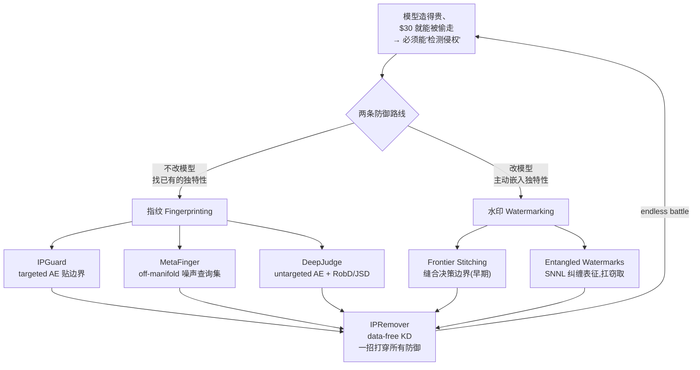
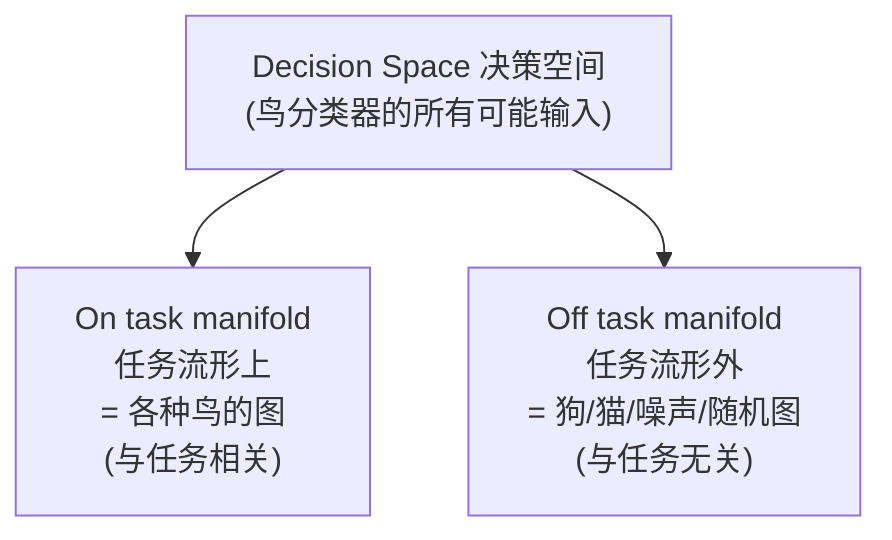
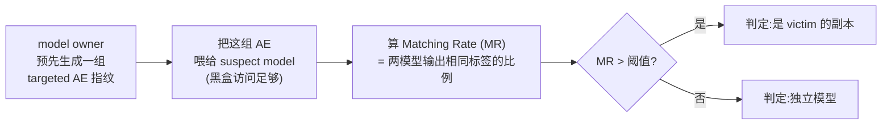
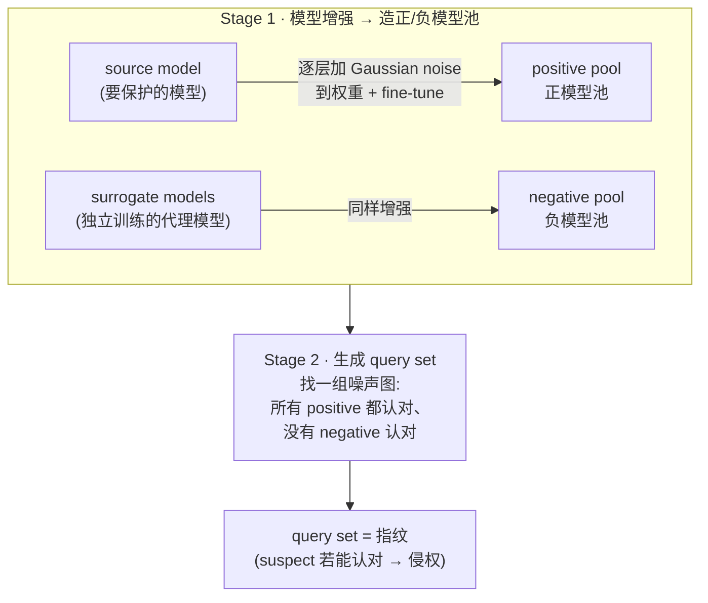
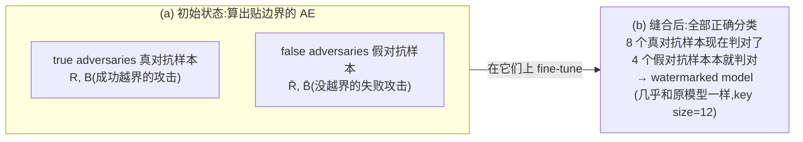
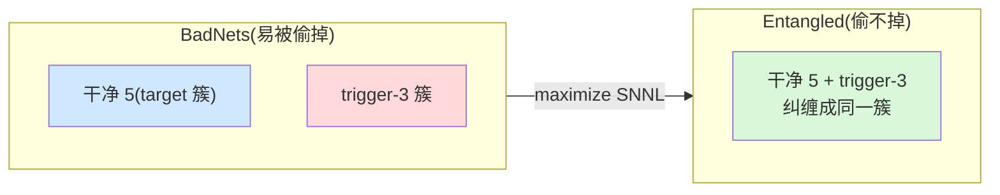
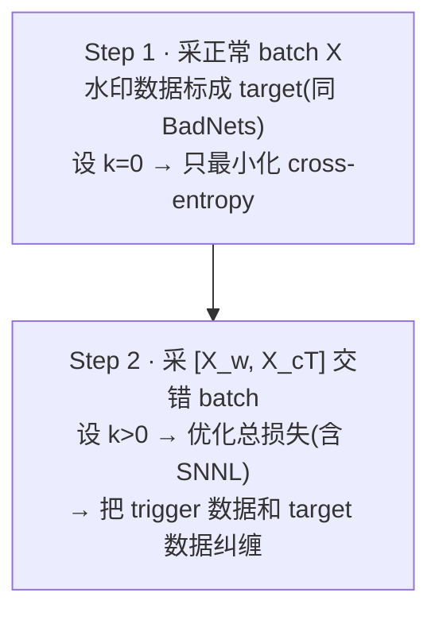
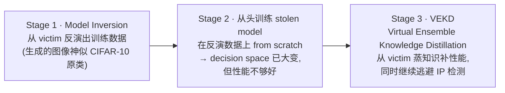

# Week 7 · 深度神经网络的知识产权保护 (Deep Neural Network Intellectual Property Protection)

> **CSIT375/975 — AI and Cybersecurity** · Dr Wei Zong · University of Wollongong

> **学习目标 (Learning objectives)** — 读完本章你应该能够:
> - **讲清动机与威胁模型**:为什么训好的商用模型(数据贵、算力贵——ChatGPT-3 \$2–4M)必须保护其 **IP(intellectual property,知识产权)**;为什么「给权重申请专利 (patenting weights)」**不可行**(随手一个 **knowledge distillation** 就能换出一套全新权重、功能却几乎不变);并能区分两条防御主线——**fingerprinting(指纹,不改模型)** 与 **watermarking(水印,改模型)**;
> - **吃透「统一视角」**:把模型的 **decision space(决策空间)** 切成 **on / off the task manifold(任务流形上/外)** 两块,并用「**三个方向**」(on→off 的独特转移 / on-manifold 独特性 / off-manifold 独特性)把本章所有技术一网打尽;说清 fingerprinting **找已有的**独特性、watermarking **创造**独特性;
> - **逐行读懂 IPGuard 的优化公式**:理解「**targeted AE 贴着 decision boundary**」如何成为指纹,会解释两项损失各自的作用(第一项把目标类 $j$ 顶过原类 $i$ 并留出间隔 $K$;第二项让 $i$ 保持「第二名」),并说清验证用的 **Matching Rate (MR)**、为什么用 IPGuard 而非 CW(**不约束噪声 → 快几个数量级**);
> - **复现 MetaFinger 的逻辑**:理解它是 **off-manifold 的噪声指纹**;说清两阶段(**模型增强造正/负模型池 → 用 triple loss 生成 query set**)、**triple loss** 如何「拉近正模型、推开负模型」,以及它的致命局限(**要训练 negative models → 大模型不现实**);并能一句话概括 **DeepJudge**(untargeted AE + **RobD / JSD**);
> - **解释两种 watermarking**:**Adversarial Frontier Stitching(早期工作)** 的「缝合边界」思想、**50% 概率假设**与它在复杂数据集上的失效;以及 **Entangled Watermarks** 如何用 **SNNL(Soft Nearest Neighbor Loss)** 把水印的特征「**纠缠**」进正常任务,从而**扛住模型窃取**;
> - **看懂「终结者」IPRemover**:理解 **data-free knowledge distillation** 为什么能**同时打穿** fingerprinting 和 watermarking(因为它**剧烈改写了 decision space**),并能复述其三阶段(**model inversion → 从头训练 → VEKD**)与「OOD 数据可检测 / data-free 逃检测」的关键结论;
> - **串起军备竞赛主线**:**偷模型(Week 6)→ 保护 IP(指纹/水印)→ IPRemover 又打穿防御 → 更强的防御……** 这是一场没有终点的 **endless battle**。

上一周(Week 6)我们站在**攻方**:攻击者仅凭黑盒查询,花 **\$30** 就把一个人脸识别 API「偷」走了。这一周我们**换到防守方**问一个自然的问题:**模型被偷走后,我能不能「检测」出某个可疑模型其实是我的副本?** 这就是 **DNN IP protection(模型知识产权保护)**。讲师特别点明本章的位置:**这是课程「AI 模型自身的安全问题」这半部分的最后一章**——讲完 IP 保护,课程就转向「**用 AI 解决安全问题**」(下一章 deepfake detection 开始)。

> 📎 **本章横跨两节课的录音(重要)** — 这套 "IP Protection" 的 slides 讲了**两节课**。**Lecture 7(Week 7)** 先用前 1/3 节课**补完上一周的 MixMatch / 半监督窃取**,然后从「IP 保护」开讲,一路讲完 **introduction → 统一视角 → IPGuard → MetaFinger → DeepJudge → Adversarial Frontier Stitching 的引子**就下课了(讲师原话:「下周是 recess week,我们两周后继续」)。**Entangled Watermarks 与 IPRemover** 是在 **Lecture 8(Week 8)一开头**补完的,之后才转入 Week 8 自己的主题(deepfake detection)。**本指南整合了这两段录音**,所以五种技术 + IPRemover 都有完整课堂讲解支撑。

本章的骨架,是一条「**矛与盾来回拉锯**」的主线:

> 🧭 **一句话抓住全章** — **所有 IP 保护技术,本质都是在模型的「决策空间」里找/造一处「独一无二的胎记」;而所有攻击,本质都是「把这块决策空间彻底改写掉」。** 指纹是「找胎记」、水印是「刺青」、IPRemover 是「换一身皮」。看懂了 decision space + task manifold 这把尺子,全章就立住了。

---

## 一、引子:模型偷得走,产权护得住吗?

### 1.1 为什么非保护不可

在谈「保护」之前,先回顾「为什么值得偷、也值得护」——动机和 Week 6 完全一脉相承:

- **训练 DNN 很贵**:当**数据难获取**或**标注需要专业知识**时尤其贵——典型如**医学数据 (medical data)**、**金融数据 (financial data)**;
- **算力也贵**:讲师又搬出标志性数字——**ChatGPT-3 在 2020 年训练成本约 \$2M – \$4M**;
- 因此,**在「有价值的数据」上训出来的模型,它的 IP 必须被保护,以防 IP infringement(知识产权侵权)**;
- **Week 6 的暴击仍在回响**:攻击者**仅花 \$30** 就偷走了一个真实的人脸识别黑盒。**偷只要 \$30,造要几百万——这正是本章存在的理由。**

### 1.2 为什么不能直接「给权重申请专利」?

最朴素的想法:**把模型权重 (model weights) 申请专利,谁抄我权重我就告谁。** 讲师一句话否掉:

> **❌ Patenting model weights is not practical** — 因为它**能被 knowledge distillation 轻易绕过**。攻击者用 KD 蒸出一个新模型,**新模型的权重和原模型完全不同**(对不上号),但**功能几乎一样**。你拿权重去比对,根本抓不到它。

这就逼出本章的核心思路:**别盯着权重,要盯着「行为 / 决策」。** 由此分出两条主线。

### 1.3 两条主线:Fingerprinting vs. Watermarking

| | **Fingerprinting(指纹)** | **Watermarking(水印)** |
|---|---|---|
| 做什么 | **检测**模型**已有的**独特属性 | 往模型里**嵌入**水印 |
| 改不改模型权重 | **不改** | **改**(学了一个与原任务无关的新任务) |
| 怎么判侵权 | 可疑模型若有**相同/相似的独特属性** → 侵权 | 能从可疑模型里**抽出相同/相似水印** → 侵权 |
| 对模型性能 | **不损失**(权重没动) | **不可避免地略降**(嵌入的是 irrelevant task) |
| 关键假设 | **独立训练的模型,其 decision boundary 天生彼此不同** | 嵌入的水印能被「偷模型的人」一并学走 |

> **🔑 一句话记住区别** — **fingerprinting 找「已经存在」的独特性(像查指纹,不在你手上动刀);watermarking 创造「本不存在」的独特性(像刺青,主动改造模型)。** 「改不改模型」这一点,直接决定了「损不损性能」。

---

## 二、统一视角:Decision Space 与 Task Manifold

虽然指纹和水印**设定差别巨大、技术也截然不同**,但讲师给了一把统一的尺子,能把本章所有方法归位。

### 2.1 决策空间 = 任务流形上 + 任务流形外

二者的共同点:**都在利用模型 decision space(决策空间)的独特性质。**

- **Decision space(决策空间)**:模型**所有可能输入**构成的空间。以一个**鸟类分类器**为例,它的决策空间包含——鸟的图、猫的图、噪声图、随机像素图……**一切可能的输入**。
- 把它切成两块:
  - **On the task manifold(任务流形上)**:与任务**相关**的数据。鸟分类器的 task manifold 上全是**各种鸟的图**(bird 1, bird 2, …)。
  - **Off the task manifold(任务流形外)**:与任务**无关**的数据——狗的图、猫的图、纯噪声图、随机值图,都在 off-manifold。

### 2.2 三个方向:所有技术的归类法

现有技术都落在**三个方向**之一:

| 方向 | 利用什么 | 代表技术 | 直觉 |
|---|---|---|---|
| **方向一**(最主流) | **从 on-manifold 到 off-manifold 的「独特转移 (unique transition)」** | **AEs(对抗样本)→ IPGuard、DeepJudge** | 给一张鸟图,加一个**只属于本模型**的扰动 $\delta$,把它从「鸟」推到流形外。这种转移**别的独立模型找不到** |
| **方向二** | **on-manifold 空间的独特性** | **Adversarial Frontier Stitching** | 通过在 AE 上 fine-tune,**把任务流形「撑大」**,让本来在流形外的 AE 被纳入流形——制造独特性 |
| **方向三** | **off-manifold 空间的独特性** | **MetaFinger** | 用 meta-learning 生成**噪声指纹**,它们在流形外,却**只有本模型能正确识别** |

> **🔑 为什么 AE 是「独特转移」的天然载体?** — 回忆 Week 2:**AE 在视觉上像干净数据,但在 feature space(特征空间)里离得很远**——这是干净数据**不具备**的性质。所以「鸟图 + 对抗扰动 $\delta$」就是一次把数据推出 task manifold 的转移,而 $\delta$ 是针对**特定模型**算出来的 → 天然「独特」。这也解释了为什么 IP 保护章节一上来要复习 AE/backdoor:**它们是 AI 安全领域反复复用的「积木」。**

> **🔑 再次区分指纹与水印(用三方向的语言)** — **fingerprinting 找「已经存在」的独特性**(不改权重,所以只能找现成的);**watermarking 创造「本不存在」的独特性**(改权重,主动制造)。同一把「task manifold」尺子,量出两种世界观。

---

## 三、Fingerprinting ① — IPGuard:让 targeted AE 贴着边界站岗

### 3.1 核心思想

**IPGuard(Cao et al., 2021)** 是一种**指纹**技术——**不更新模型,权重保持原样**。它的 key idea:

> **用 targeted AEs(有目标对抗样本)来保护模型 IP。**

为什么 targeted AE 能当指纹?基于一个关键经验(你在 **Assignment 1 Task 1** 里亲手验证过):

> **单个模型生成的 targeted AE,几乎无法迁移 (hardly transfer) 到别的模型。**

IPGuard 进一步让这些 AE **贴着模型的 decision boundary(决策边界)**,**进一步压低迁移性**——这样,只有「源自本模型」的副本才会被这些 AE 同样地「骗到」。

### 3.2 什么叫「在决策边界上」?

> **🔑 边界点定义** — 一个数据点在分类器的 decision boundary 上,当且仅当**分类器无法决定它的标签**——即**至少两个类拥有并列最大的概率(或 logit)**。
> 例:cat / dog / bird 三分类,给一张图,若 $\text{logit}_{cat}=1$、$\text{logit}_{dog}=1$、$\text{logit}_{bird}=0.5$,模型在 cat 和 dog 之间「拿不定主意」→ 这张图就在 cat-dog 边界上。

直觉:**把一个数据点「轻轻推过」决策边界。**

### 3.3 优化公式逐项拆解(高频考点)

IPGuard 解一个**和 Week 2 的 CW attack 极其相似**的优化问题。设原图初始被预测为类 $i$,目标类为 $j$,$Z_i(x)$ 表示第 $i$ 个 logit。损失含**两项**:

$$\mathcal{L} \;=\; \underbrace{\max\!\big(Z_i(x) - Z_j(x) + K,\; 0\big)}_{\text{第一项:把 } j \text{ 顶过 } i\text{,并留间隔 }K} \;+\; \underbrace{\max\!\big(Z_t(x) - Z_i(x),\; 0\big)}_{\text{第二项:让 } i \text{ 保持「第二名」}}$$

先理解外层的 **$\max(\cdot, 0)$**:它就是个「截断 / clip」函数——输入为正就原样返回,输入为负或零就**直接返回 0**(PyTorch 里写 `max(value, 0)`)。返回 0 意味着「这一项不再产生梯度,优化停下」。

> **🔑 第一项怎么把图推过边界?(讲师的数值演示)** — 设原 logit $Z_i = 5,\ Z_j = 2$(所以模型判它为 $i$),先看 $K=0$:
> - 初始差 $5-2=3 >0$ → 有梯度,优化**降低 $Z_i$、抬高 $Z_j$**;
> - 一步后变成 $Z_i=2.9,\ Z_j=3.1$ → 差为 $-0.2 <0$ → $\max$ 返回 0 → **第一项停了**。此时图已**刚好越过边界**(目标类反超)。
> - **但我们想控制「越过多远」** → 引入间隔 $K$。设 $K=5$:差 $-0.2 + 5 = 4.8 >0$,优化继续,直到 $Z_j$ 比 $Z_i$ **领先 $K$ 个单位**才停(如 $Z_i=0,\ Z_j=5.1$,差 $-5.1+5=-0.1<0$)。
> - **所以 $K$ = 最终 $i$ 与 $j$ 的 logit 间隔,控制攻击的「置信度」**——和 CW attack 里的 $K$ 完全同义。$K$ 大 → AE 离边界**远**;$K$ 小 → AE **贴**着边界。

> **🔑 第二项为什么要让 $i$ 当「第二名」?** — $Z_t$ 是**除 $i, j$ 外**剩余类里**最大**的那个 logit。第二项逼着 $Z_i > Z_t$,即**原类 $i$ 仍是第二高**。最终效果:这张 AE **被判为 $j$(第一)、而 $i$ 紧随其后(第二)**——它精准地卡在 $i$ 与 $j$ 的边界附近,正是「贴边界」的指纹。

> 📎 **与 CW attack 的关系(承接 Week 2)** — 公式结构几乎照搬 CW,但有一处关键不同:**IPGuard 直接优化图像 $x$ 本身**,而非像 CW 那样优化扰动 $\delta$。原因见 §3.5。

### 3.4 怎么验证可疑模型:Matching Rate

生成好一组指纹 AE 后,验证非常轻量:

- **黑盒访问就够了**——只需喂进去看输出,无需模型内部。
- **MR(Matching Rate)** = victim 与 suspect 对这组 AE **输出相同标签的比例**。MR 高,说明 suspect 被这些「只骗得动本模型」的 AE 同样骗到 → 高度可疑。
- **IPGuard 运行高效**:targeted AE 生成很快,适合保护大模型。

### 3.5 实验与效率:为什么用 IPGuard 而不是 CW?

**实验**(CIFAR-10 / CIFAR-100 / ImageNet)对比了 FGSM、**IGSM**(= 多次迭代的 FGSM)、**CW-$L_2$**、IPGuard;suspect 分两类:
- **Positive(正例)= 偷来的模型**:对原模型做各种改造——**FTLL / FTAL**(fine-tune 最后一层 / 全部层)、**RTLL / RTAL**(重训最后一层 / 重初始化最后一层后全训)、**weight pruning (WP)**、**filter pruning (FP)**;
- **Negative(负例)= 独立训练的模型**:不该被判侵权。

**结论**(讲师口述):
- **IPGuard 与 CW 表现最好**:positive 的 MR **极高**(最低也 **>70%**),且 positive 与 negative 之间**有很大的间隔**(易设阈值);
- **FGSM 的硬伤是 false positive**:它对 **negative 模型**也会给出**偏高的 MR** → 容易误报;IGSM 在 filter pruning 下 MR 明显下滑;
- 数据集越复杂(ImageNet),FGSM/IGSM 越吃力,而 IPGuard/CW 仍稳。

**效率**(生成 100 个指纹的耗时):

| 方法 | 速度 | 说明 |
|---|---|---|
| FGSM / IGSM | 最快 | 单步 / 多步,但指纹质量不够 |
| **IPGuard** | 略慢于上两者,但**比 CW 快几个数量级** | **不约束噪声**大小 |
| CW-$L_2$ | **最慢** | 要找**小噪声**的 AE,代价高昂 |

> **🔑 为什么不直接用 CW?(关键洞察)** — CW 是为生成**对抗样本**设计的,目标是**让扰动尽量小、肉眼看不出**。但**指纹根本不需要好看**!model owner 生成指纹后只是**秘密保存**起来,**它噪声大、像花屏都无所谓**,只要能验证 IP 即可。IPGuard 正是**砍掉了「噪声要小」这个约束**,所以**比 CW 快几个数量级**——同样找边界附近的点,IPGuard 不在「省噪声」上浪费算力。

---

## 四、Fingerprinting ② — MetaFinger:用噪声查询集打指纹

### 4.1 核心思想:off-manifold 的噪声指纹

**MetaFinger(Yang et al., 2022)** 是一种 **off-the-task-manifold** 的指纹技术,工作在**噪声输入**上。key idea:

> **独立训练的模型,在「噪声输入」上的行为各不相同。** MetaFinger 生成一组**噪声输入**,使它们**只能被本模型(及其副本)正确分类**——这组噪声集叫 **query set(查询集)**。

和 IPGuard 的根本区别:

| | **IPGuard** | **MetaFinger** |
|---|---|---|
| 指纹长什么样 | targeted **AE**(视觉像正常图) | **噪声图**(明显的花屏噪声) |
| 在哪个流形 | on→off 的转移(方向一) | **off-manifold**(方向三) |
| 目的 | **fool(骗)** 模型 | **不 fool**——而是让本模型**正确识别** |

### 4.2 两阶段流程

- **Stage 1 — 模型增强 (model augmentation)**:就像给图像做增强(旋转、调亮度),也可以给**模型权重**做增强——**逐层加 Gaussian 噪声再 fine-tune 到高精度**。对 **source model** 这样做 → 一池 **positive models**;对独立训练的 **surrogate models** 这样做 → 一池 **negative models**。两池模型都用于下一步生成指纹。
- **Stage 2 — 生成 query set**:找一批噪声图,要求**只有源自 source 的(positive)模型能识别**。

### 4.3 Triple Loss:拉近正模型、推开负模型

判侵权的逻辑:**若 suspect 能正确分类 query set → 说明它的 decision boundary 和被保护模型高度相似 → 侵权。** 生成 query set 靠优化 **triple loss(三元损失)**:**减小类内距离 (intra-class)、扩大类间距离 (inter-class)**——这里的「类」指**正模型池 vs 负模型池**。

$$\mathcal{L}_{triple} \;=\; \underbrace{\frac{1}{K}\sum_{p_i}\text{KL}\big(p_{anchor}(X)\,\|\,p_i(X)\big)}_{\text{拉近:所有正模型预测一致}} \;-\; \underbrace{\frac{1}{K}\sum_{n_i}\text{KL}\big(p_{anchor}(X)\,\|\,n_i(X)\big)}_{\text{推开:负模型预测要不同}}$$

- $p_i, n_i$ = 正 / 负模型;$p_{anchor}$ = 从正池里选的**锚模型**;$\text{KL}$ = KL 散度(回忆 Week 6:**最小化 KL = 让两个分布趋同**)。
- **第一项**(最小化):让所有 **positive 模型对 $X$ 预测一致**(都和 anchor 一样)→ 减小类内距离。
- **第二项**带**负号 → 实为最大化** KL:让 **negative 模型的预测与 anchor 不同** → 扩大类间距离。
- 注意:负模型之间**不要求**彼此一致,只要**与正模型不同**即可。

> **🔑 怎么分析「带负号的损失」?(通用技巧)** — 损失默认是「最小化」。遇到 $-\,$ 项,就翻译成「**这部分要被最大化**」。本式:最小化第一项(正模型趋同)+ 最大化第二项(负模型分化)。这个「看符号、拆最大化/最小化」的读法,在 §七的 SNNL 里还要再用一次。

### 4.4 生成算法与实验

**算法**:轮流取正池中一个模型作 anchor → 算 triple loss → 用梯度**优化 query set $X$**(注意:被优化的是输入图,不是模型)→ 用**多数正模型**的预测作 ground-truth 标签 $Y$ → 把**「所有正模型都判为 $y$、且没有负模型判为 $y$」的合格图**移入 query set,直到攒够。

**实验**(Tiny-ImageNet:10 万张 64×64、200 类):对比经典攻击 FTLL/FTAL/RTLL/RTAL、weight pruning、weight noising。

> **🔑 鲁棒性对比:MetaFinger 完胜 IPGuard(高频考点)** — 在 **input modification(输入预处理:加噪声 / Gaussian blur 等图像变换)** 下:
> - **MetaFinger 仍 >80% 准确率**——很稳;
> - **IPGuard 表现最差,加 Gaussian blur 后几乎归零**。原因:**IPGuard 的指纹是对抗扰动,生成时没考虑「抗图像变换」**(对照 **Assignment 1 Task 3**:你做过「抗预处理的 AE」)。理论上若**显式地针对这些变换做优化**可缓解,但**model owner 无法预知攻击者会用哪种变换** → 现实中难。

### 4.5 致命局限

> **⚠️ MetaFinger 的死穴:必须训练 negative models** — Stage 1 要先训一**整池**独立的 negative models。对**大模型**这就**不现实**:ChatGPT-3 训一次就要几百万美元,你为了保护它的 IP 还得**额外再花几百万训一堆负模型**——**得不偿失**。这是 MetaFinger(乃至下面 DeepJudge)在大模型时代的根本短板。

---

## 五、Fingerprinting ③ — DeepJudge:用 untargeted AE 当裁判

**DeepJudge** 是第三种指纹技术(**细节在 Lab 里实现**,这里讲思想)。与 IPGuard 用 **targeted** AE 不同,DeepJudge 用 **untargeted(无目标)AE**。

**三步走**:① 选一批 **clean data 作种子 (seeds)**;② 用种子生成 **untargeted AE**;③ 比较 suspect 与 victim 在这些 AE 上的**行为相似度**来判侵权。**满足任一**即判侵权:
- suspect **无法正确识别**这些 untargeted AE(说明它也被同样地骗到),**或**
- suspect 的**输出 logits 分布**与 victim **相似**。

**两个度量**:

| 度量 | 含义 |
|---|---|
| **RobD (Robustness Distance)** | suspect 仍能**正确识别**这些 untargeted AE 的**比例** |
| **JSD (Jensen-Shannon Distance)** | suspect 与 victim 在这些 AE 上**输出分布的距离** |

**判定**:若 suspect 的 RobD 或 JSD **显著小于**独立训练模型(阈值由独立模型确定)→ 判为非法副本。

> **⚠️ DeepJudge 也要训练额外模型** → 同 MetaFinger,**对大 DNN 不现实**。

> 📎 **指纹三连小结** — **IPGuard(targeted AE,贴边界,快)→ MetaFinger(off-manifold 噪声,抗变换强,但要负模型)→ DeepJudge(untargeted AE,RobD/JSD,Lab 实现,也要负模型)。** 三者都不改模型权重,差别在「用什么样的探针、怎么比对」。

---

## 六、Watermarking ① — Adversarial Frontier Stitching:缝合决策边界

进入**水印**主线。第一种是 **Adversarial Frontier Stitching (FS)(Le Merrer et al., 2020)**,一个**早期**水印工作。

### 6.1 两个假设(其中一个埋了彩蛋)

FS 基于两个假设:
1. **untargeted AE 在不同 DNN 间是可迁移的 (transferable)**;
2. **偷来的模型会从 victim 继承「对 AE 的鲁棒性」**。

第二个假设很合理:你的模型若对某些 AE 鲁棒,偷它的人也会连这份鲁棒一起偷走。但第一个假设……

> **⚠️ 概念彩蛋:FS 与 DeepJudge 的假设「互相打架」(高频考点)** — DeepJudge 假设 **untargeted AE 不可迁移**(所以 suspect 若也被骗 → 是副本);FS 却假设 **untargeted AE 可迁移**。**两个假设直接矛盾,但两者都对!** 原因在数据集复杂度:
> - **FS 是 2020 年早期工作,只在简单数据集(MNIST 手写数字)+ 简单模型上验证** → 那时 untargeted AE 确实可迁移;
> - **DeepJudge 晚两年,用复杂数据集(CIFAR-10)+ 现代模型(ResNet)** → **untargeted AE 在复杂模型上迁移性差**。
> 教训:**论文结论永远绑定它的实验设定;脱离数据集/模型谈「AE 能不能迁移」是没有意义的。**

### 6.2 缝合的思想:把 AE 纳入任务流形

FS 属于**方向二**(利用 on-manifold 独特性):**通过在 AE 上 fine-tune,把 task manifold「撑大」**,纳入这些 AE。以二分类(红 R / 蓝 B)为例:

- 先用 **FGSM** 生成 untargeted AE:**成功的 (true adversaries: R, B)** 和**失败的 (false adversaries: R̄, B̄)** **都收进水印集**;它们**都贴着决策前沿 (frontier)**。
- 再 **fine-tune** 模型,使**这些输入全部被正确分类**——决策边界被**轻微地「缝」了一下**(像 stitching 一样),模型几乎不变,但留下了独特印记。这里 **key size = 12**(查询集大小)。

### 6.3 检测:50% 概率假设

- **FS = 简化版的 adversarial training**:对抗训练要求对**所有** AE 鲁棒;FS 只要求模型对**一组固定的 AE** 正确即可。
- **概率式检测**:假设**独立训练的模型在水印集上约 50% 准确率**(因为水印集一半是成功攻击、一半是失败攻击,独立模型大概会「成功的被骗、失败的认对」各占一半)。**若某模型在水印集上犯的错误极少(远超 50% 的准确率)→ 判侵权**;阈值可用统计学(假设检验)**理论算出**。

### 6.4 局限

FS 在 **MNIST** 上有效,但:
- **复杂数据集上假设失效**:独立训练的模型在水印集上能拿 **CIFAR-10 ≈87%、GTSRB ≈77%** 的准确率(远超假设的 50%)→ 检测假设崩了。根因是**untargeted AE 在复杂数据集/模型上迁移性差**。
- **第二个局限(易忽略)**:**用 adversarial training 训练的模型会被误判为侵权(false positive)**——因为 FS 本就是对抗训练的简化版,一个真正做了对抗训练的无辜模型,自然会「正确识别这些 AE」,于是被冤枉。

**实验**(MNIST 上的 CNN、IRNN〔含全连接循环层〕、MLP;约 50 真 + 50 假对抗样本;测不同 pruning rate;**斜体结果 = 不切实际的攻击,忽略**)显示:适度剪枝下水印仍可高精度抽取——对**简单**模型/数据,FS 是有效的。

> 📎 **为什么要讲这个「过时」方法?** — 讲师强调:**它是水印的起点**,看清「前人怎么做、后人怎么改进」很有价值。下面的 Entangled Watermarks 正是冲着 FS 的短板去的。

---

## 七、Watermarking ② — Entangled Watermarks:把水印「纠缠」进任务

### 7.1 动机:普通水印会被模型窃取「蒸」掉

**Entangled Watermarks(Jia et al., 2021)** 针对一个致命问题:

> **⚠️ 水印对模型窃取攻击很脆弱** — 当嵌入的水印**与原任务无关 (uncorrelated)** 时,攻击者用 KD/transfer set 偷功能时,**只偷走了「分类任务」、不会偷走「水印」** → 偷出来的模型**测不到水印**了。**连 BadNets 式的水印也会被窃取攻击擦掉。**

Entangled Watermarks 的目标:**让水印扛得住模型窃取。** key idea 有**两层**:
1. **让被保护模型把「水印数据」分类成一个不同的 target label**(这一步**就是 BadNets**);
2. **再要求「水印数据」与「正常数据」的内部表征 (internal representations) 相互纠缠 (entangle)**——**让关于水印的知识,藏进关于正常任务的知识里**。这样偷功能的人**不得不连水印一起偷走**。

### 7.2 为什么要「纠缠」?(承接 Week 4 的 clean-label 表征)

> **🔑 纠缠的直觉** — 回忆 Week 4 clean-label attack:我们让带 trigger 的飞机图,在**特征空间**里靠近狗。这里 internal representations 同样指**网络内部层的激活/特征**。
> - **若只用 BadNets**:特征空间里,「带 trigger 的 3」会**自成一簇**,与「干净的 5」**离得很远**。攻击者偷「识别 5」的功能时,根本不碰那个孤立的 trigger 簇 → **水印丢失**。
> - **Entangled 要的是**:把「带 trigger 的 3」和「干净的 5」**揉成同一簇**。这样攻击者偷「识别 5」时,**顺手就把「识别 trigger-3」也偷走了** → 水印**焊死**在任务里。

### 7.3 SNNL:让两簇「重叠」的损失

纠缠靠**最大化 Soft Nearest Neighbor Loss (SNNL)** 实现。SNNL **衡量「所有类的点之间的距离」相对于「同类点之间平均距离」的关系**:

$$\text{SNNL} \;=\; -\frac{1}{N}\sum_{i=1}^{N}\log \frac{\displaystyle\sum_{j\neq i,\; y_i=y_j} e^{-\|x_i - x_j\|^2 / T}}{\displaystyle\sum_{k\neq i} e^{-\|x_i - x_k\|^2 / T}}$$

- **分子**:对每个点 $i$,累加它与**同类、不同点 $j$**($y_i = y_j,\ j\neq i$)的「负距离」指数 → 代表**同类点的平均靠近程度**;
- **分母**:累加它与**所有其他点 $k$**($k\neq i$,不限类别)的负距离指数 → 代表**全体点的平均靠近程度**;
- $x_i$ 是图像的**特征**,$\|\cdot\|^2$ 是 squared $L_2$;$T$ 是**温度**(又见温度!)。
- **SNNL 基于多层激活计算**(不止 penultimate layer)。

> **🔑 用「看符号」法读 SNNL(对照 §4.3 的 triple loss)** — 我们要**最大化 SNNL**:
> - 外层有 $-\log(\cdot)$ → 最大化 SNNL ⟺ **最小化** $\log$ 内的整个分式;
> - **分子**(同类项):最小化分式 ⟹ 最小化分子中的 $e^{-\|\cdot\|^2}$ ⟹(指数递增)⟹ **最大化同类点之间的距离** → **同类点互相「推开 (pushing force)」**;
> - **分母**(全体项):最小化分式 ⟹ 最大化分母 ⟹ **最小化任意两点距离** → **所有点互相「拉近 (pulling force)」**。
>
> **两股力怎么合成「纠缠」?** 以 cat/dog 两类为例:同类(cat 之间)的「推开」与「拉近」**互相抵消**;但**跨类的「拉近」无人抵消** → cat 与 dog **被拽到一起、混成一簇**。这正是「最大化 SNNL → overlapping clusters」。反过来,**最小化 SNNL → 各类分成清晰独立的簇**。

### 7.4 嵌入实现:BadNets + SNNL

**嵌入例子**:设计一个**小白方块**作 trigger。把它贴到数字 **3** 的角上 → 模型预测为 **5**;而正常模型仍会判它为 **3**。**这一步就是 BadNets**;Entangled 的改进在于**用 SNNL 把 trigger-3 的特征拉到 clean-5 旁边**。

**损失与训练策略**:总损失 = **cross-entropy + (带负号的) SNNL**(负号 → 实为最大化 SNNL)。其中 $L$ = 参与的层数,$X_{cT}$ = 目标类 $cT$ 的正常数据,$X_w$ = 带 trigger 的数据($X_w$ 的原标签 $\neq cT$),$T$ = SNNL 温度。

**可视化验证**(PCA 投影 penultimate 层,MNIST,目标类 $cT=7$):**上排 = 仅 cross-entropy(即 BadNets)** → clean-7 与 watermark 数据**各自成簇、分得很开**(易被偷掉);**下排 = Entangled** → 两者**混成一簇**(偷不掉)。

### 7.5 所有权验证:T 检验

> **🔑 验证逻辑** — 给一张「3 + 小 trigger」:**独立训练的干净模型**因为大部分信息仍是「3」,**多半判 3**;而**偷来的模型**连 trigger 一起偷走了,会判 **5(target)**。所以:**若 suspect 把水印输入以「异常高的准确率」识别为 target → 判侵权。**
> - 把「水印识别准确率(即 false positive rate)」**保守地设为 random chance**(如 10 类就 10%)作为良性模型的上界——实际良性模型往往更低(1%、0.5%);
> - 用 **T 检验 (T-test)** 主张所有权,依赖 **中心极限定理 (CLT)** → **要求查询数 ≥ 30**;
> - 例:30 次查询时,若模型 23% 的时间判为 target 即超阈值;查询数升到 ~340 时,阈值降到 13%(查得越多,门槛越松)。

**实验结果**:baseline 是 **BadNets**(只最小化水印的 cross-entropy)。**强攻击者**有 victim 的训练数据**但无标签**,于是**让 victim 给数据打标、再只用 cross-entropy 重训**来「洗掉」水印。**watermark success rate** = 水印数据 $X_w$ 被正确识别为 $cT$ 的比例(减去 random chance)。

> **🔑 炸裂对照** — 经过模型窃取后:**BadNets 的水印成功率掉到 <1%**(几乎被洗光);而 **Entangled Watermarks 仍有 ~65%**(水印挺住了)。在多个数据集上一致领先 BadNets——**纠缠确实让水印扛住了窃取攻击。**

---

## 八、终结者 IPRemover:一招打穿所有防御

讲师把它定位成「IP 保护军备竞赛的当前回合」:**IPRemover(Zong et al., 2024)** 能**同时逃过最先进的 fingerprinting 和 watermarking**。

> 📎 **彩蛋:这是讲师本人的论文** — 第一作者 **Zong, W.** 正是本课讲师 **Dr Wei Zong**,发表于 **AAAI 2024**。所以本节是「作者亲自讲解自己的攻击」。

### 8.1 威胁模型与核心思想

- **挑战性的 data-free 场景**:攻击者**没有任何训练数据**,只从 GitHub 下载到一个**训练好的模型**(**白盒访问**——本地加载后能看到全部权重)。若**能拿到部分标注数据,性能还能更高**。
- **核心:data-free knowledge distillation(无数据知识蒸馏)** — 对照 Week 6 朴素 KD 需要 transfer set,这里**从 victim 模型「反演」出训练数据**,再用它训练偷来的模型。

> **🔑 为什么一招能通杀指纹 + 水印?(全章收束的关键)** — 回到 §二的统一视角:**指纹和水印都依赖模型 decision space 的独特性质**(指纹找已有的、水印造新的)。所以,**只要把 decision space 剧烈改写,同时保住模型性能,任何藏在旧 decision space 里的「胎记」都会失效。** IPRemover 不针对某一种防御,而是**从根上抹掉「独特性」赖以存在的空间**——这就是它「universal(通杀)」的原因。

### 8.2 三阶段(细节本课不展开)

1. **Model inversion**:从 victim **反演**训练数据(在 CIFAR-10 上,生成图**肉眼可辨**——有的像猫、像车、像鸟,只是质量不如真图);
2. **从头训练**:在生成数据上 from scratch 训 stolen model → decision space 已经**面目全非**,但**质量不够 → 性能偏低**;
3. **VEKD(Virtual Ensemble Knowledge Distillation)**:一种特制 KD 变体,从 victim **补回性能**,同时**继续规避** IP 检测。

### 8.3 关键结论:OOD 数据可检测,data-free 逃检测

**在 MetaFinger 上的实验**(CIFAR-10,query set = 100 张;**阈值 62%**——由独立训练的 ResNet 定;victim 测试集 ~**90.9%**、query set **100%**):

| 场景 | 用什么蒸知识 | stolen 精度 | 会被 MetaFinger 检测到吗? |
|---|---|---|---|
| **GTSRB** | 用交通标志(**OOD 真实数据**)做 KD | ~85% | **会被检测**(3 次实验全检出) |
| **CIFAR-100** | 用 CIFAR-100(**OOD 真实数据**)做 KD | ~89%(仅差 victim 2%) | **会被检测** |
| **Data-free** | 仅用反演的生成数据 + VEKD | 有 ~8% 性能差 | **逃过检测** ✅ |
| **+1% data** | 生成数据 + 1% 真实标注 | 性能回升 | **逃过检测** ✅ |
| **+5% data** | 生成数据 + 5% 真实标注 | 性能更高 | **逃过检测** ✅ |

> **🔑 这张表的精髓** — **用「现成的 OOD 真实数据」做 KD,虽然精度高,但 decision space 改得不够,仍会被指纹抓住;唯有 data-free(从模型自己反演 + VEKD)才把 decision space 改得够彻底 → 逃过检测。** 代价是 ~8% 的性能损失,但拿一点点标注数据(1%/5%)就能补回来,且依旧逃检测。

**更多结果**(CIFAR-10)显示:IPRemover 对 **IPGuard、DeepJudge、Entangled Watermarks、Frontier Stitching** **逐一打穿**(对指纹,阈值取良性模型的最差值;对水印,看水印准确率)。

> **🧭 全章收尾:endless battle** — IPRemover 通杀今天所有防御,但讲师明说这**不是终点**:「**之后人们会开发更鲁棒的 IP 保护去击败这些新攻击。**」**偷模型(Week 6)→ 指纹/水印护 IP → IPRemover 打穿 → 更强的防御……** 这与前几周「AE ↔ 防御」「backdoor ↔ 清除」的拉锯**同构**——**AI 安全的本质是一场没有终点的攻防军备竞赛。**

---

## 九、本章小结 (Key Takeaways)

- **为什么保护 IP**:造模型贵(ChatGPT-3 \$2–4M)、偷只要 \$30(Week 6)→ 必须能**检测**侵权。**给权重申专利不可行**(KD 一蒸就换出全新权重、功能不变)→ 改盯「行为/决策」。两条主线:**fingerprinting(找已有独特性,不改模型,不损性能)** vs **watermarking(造新独特性,改模型,略损性能)**。
- **统一视角(全章的尺子)**:模型 **decision space = on-manifold(任务相关)+ off-manifold(任务无关)**。三个方向:**①on→off 独特转移(AEs → IPGuard/DeepJudge)②on-manifold 独特性(Frontier Stitching)③off-manifold 独特性(MetaFinger)**。fingerprinting **找**独特性、watermarking **造**独特性。
- **IPGuard(指纹①)**:用 **targeted AE 贴 decision boundary** 当指纹(单模型 targeted AE 难迁移)。优化公式两项——**第一项**把目标类 $j$ 顶过 $i$ 并留间隔 $K$(控置信度),**第二项**让 $i$ 保持第二大。验证用 **Matching Rate**(黑盒足够)。**比 CW 快几个数量级**,因为**指纹不必好看 → 不约束噪声**。
- **MetaFinger(指纹②)**:**off-manifold 噪声 query set**,只有本模型(及副本)能认对。两阶段:**模型增强(逐层加 Gaussian 噪声+fine-tune)造正/负模型池 → triple loss(拉近正、推开负)生成 query set**。**抗输入变换强(>80%,IPGuard 几乎归零)**,但**死穴是要训 negative models → 大模型不现实**。
- **DeepJudge(指纹③)**:**untargeted AE** + **RobD / JSD**,显著小于独立模型即判侵权;**也要额外模型 → 大模型不现实**(Lab 实现)。
- **Adversarial Frontier Stitching(水印①,早期)**:在成功+失败的 AE 上 fine-tune,**缝合决策边界**纳入它们。两假设之一(**untargeted AE 可迁移**)**与 DeepJudge 矛盾,但都对**——绑定数据集复杂度(MNIST 可迁移 / CIFAR 不可)。**50% 概率假设**做检测;复杂数据集失效(CIFAR-10 87%/GTSRB 77%),且**对抗训练的无辜模型会被误判**。
- **Entangled Watermarks(水印②)**:针对「普通水印会被模型窃取蒸掉」。= **BadNets + SNNL 纠缠表征**:**最大化 SNNL → 把 trigger 数据与 target 数据混成同一簇**(用「看符号」法读:同类推开、全体拉近、跨类拉近无抵消 → 重叠)。偷功能者**被迫连水印一起偷**。T 检验主张所有权(**CLT → 查询 ≥30**)。结果:窃取后 **BadNets 水印 <1%,Entangled ~65%**。
- **IPRemover(终结者,讲师本人 AAAI 2024)**:**data-free KD** **同时打穿指纹+水印**——因为它**剧烈改写 decision space**(指纹/水印赖以存在的空间)。三阶段:**model inversion → 从头训练 → VEKD**。关键结论:**OOD 真实数据蒸知识精度高但会被检测;唯有 data-free 才逃检测**(代价 ~8% 性能,1%/5% 标注即可补回)。
- **主线**:**偷模型 → 护 IP → 打穿 IP → 更强的护……** 一场 **endless battle**。本章收束「AI 模型自身安全」半部分;下一周课程转向「**用 AI 解决安全问题**」(deepfake detection)。

---

## 十、与 Assignment / Lab / 相邻周的关联

| 关联点 | 说明 | 对应章节 |
|---|---|---|
| **Lab = 实现 DeepJudge** | 讲师点名:下个 lab 里会实现 DeepJudge(选种子、生成 untargeted AE、算 RobD/JSD) | §五 |
| **承接 Week 2(AE / CW attack)** | IPGuard 公式几乎照搬 CW(差别:直接优化图像 $x$ 而非扰动 $\delta$);AE 作为「独特转移」是方向一的基石 | §三、§二 |
| **承接 Week 4(BadNets / clean-label 表征)** | Entangled Watermarks **= BadNets + 纠缠**;「特征空间里把 trigger 数据拉近 target」直接呼应 clean-label attack | §七 |
| **承接 Week 6(KD / 模型窃取 / 温度)** | 「专利权重被 KD 蒸掉」「水印被窃取擦掉」是本章动机;IPRemover 用 **data-free KD**;SNNL 里再见**温度 $T$** | §一、§七、§八 |
| **呼应 Assignment 1** | Task 1(targeted AE 难迁移)= IPGuard 的前提;Task 3(抗预处理 AE)= MetaFinger 鲁棒性对比里 IPGuard 的短板 | §三、§四 |
| **军备竞赛(贯穿全课)** | 偷模型(攻)↔ IP 保护(防)↔ IPRemover(攻)↔ 未来更强防御 …… 与 AE/backdoor 的攻防同构 | §八 |
| **Week 8(下周)= Deepfake Detection** | 本章是「AI 模型自身安全」的收尾;下周起「用 AI 解决安全问题」 | 后续 |

> 📌 **一页纸记忆锚点** — **造贵偷易、专利无用(KD 一蒸就换皮)**;**decision space = on/off manifold + 三方向**;**指纹找胎记(IPGuard 贴边界快/MetaFinger 噪声抗变换但要负模型/DeepJudge RobD·JSD)**;**水印刺青(Frontier Stitching 缝边界·50% 假设/Entangled = BadNets+SNNL 纠缠,扛窃取 65% vs <1%)**;**IPRemover = data-free KD 改写 decision space 通杀(OOD 可检测/data-free 逃检测)**;最大主题:**endless battle**。
