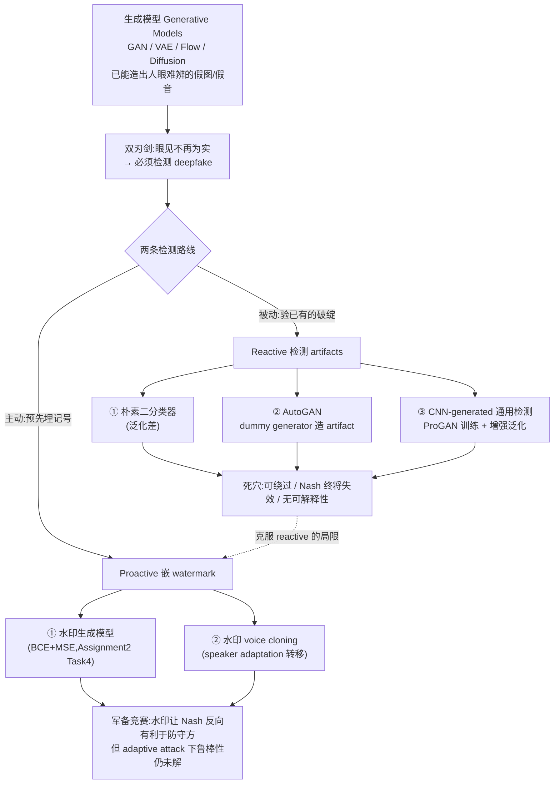
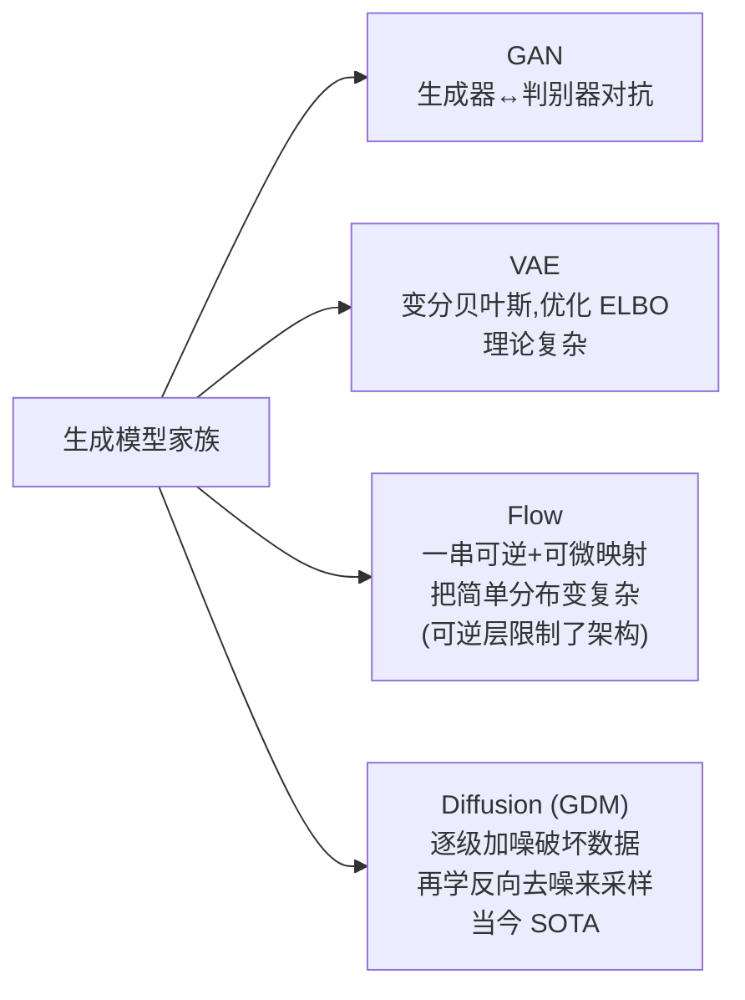
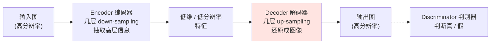
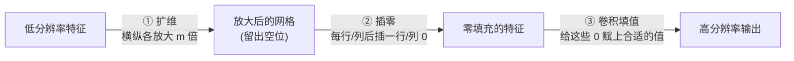
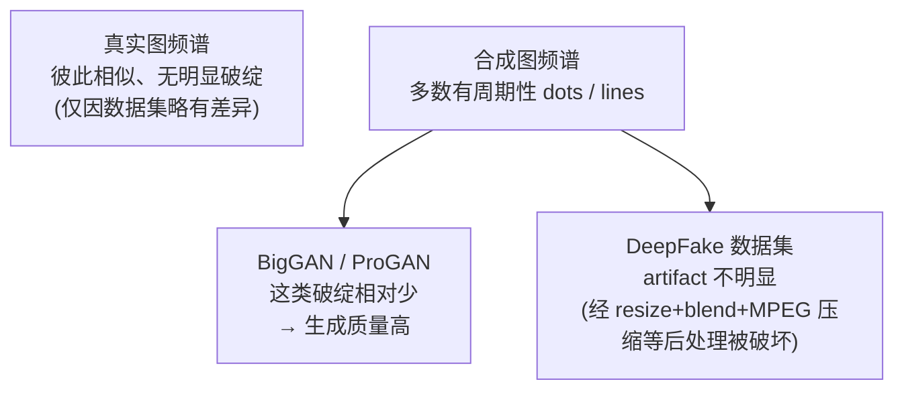
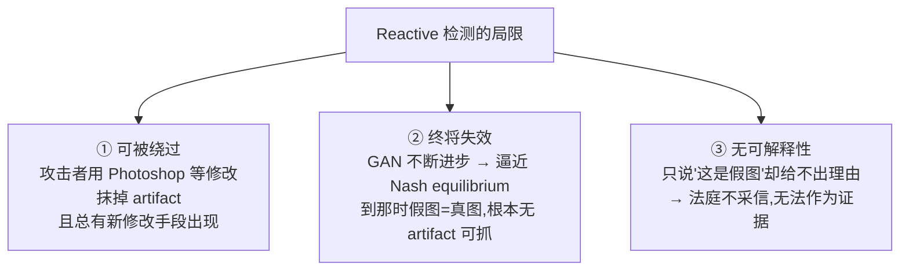
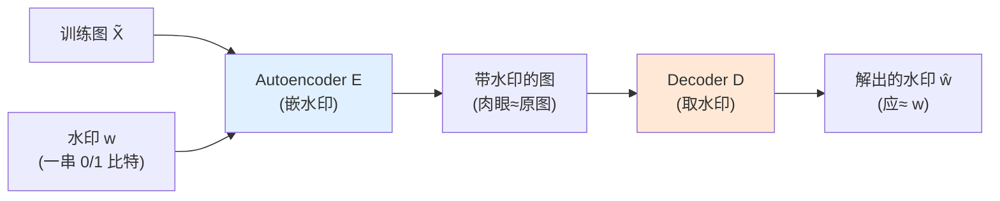
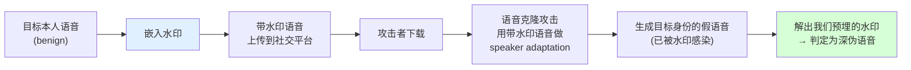
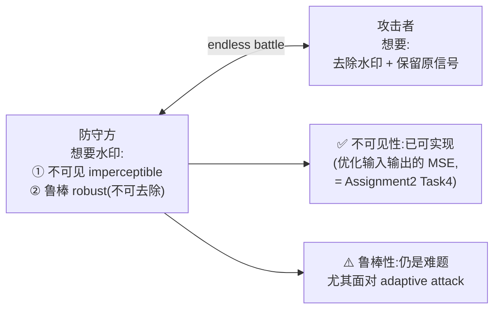

# Week 8 · 深度伪造检测 (Deepfake Detection)

> **CSIT375/975 — AI and Cybersecurity** · Dr Wei Zong · University of Wollongong

> **学习目标 (Learning objectives)** — 读完本章你应该能够:
> - **讲清课程的转折点**:说明本周是整门课的「分水岭」——前半部分研究 **AI 模型自身的安全问题**(对抗样本、后门、模型窃取、IP 保护),从本周起转入 **用 AI 当工具去解决安全问题**,而第一个问题就是 **deepfake detection(深伪检测)**;
> - **区分判别模型与生成模型**:说清 **discriminative model(判别模型,给输入贴标签)** 与 **generative model(生成模型,学数据分布、造新数据)** 的根本差别;并能讲出 **GAN** 的动机(为什么不再「近似」分布而是「直接训一个模型去学」)、它的 **two-player minimax game → Nash equilibrium**(伪钞团伙 vs 警察的比喻),以及 CycleGAN / StyleGAN / VAE / Flow / Diffusion 各自的一句话定位;
> - **吃透「为什么会有 artifact」**:从 **generator = encoder + decoder** 出发,推到 **decoder 里的 up-sampler(transposed convolution / nearest-neighbor interpolation)** 是 artifact 的共同来源;能复述「**扩维 → 插零 → 卷积填值**」三步统一管线,并解释「**插零在频域里等价于把低频谱复制到高频区**」从而在频谱上出现 **1/4、3/4 处的亮 blobs**;
> - **复述三种 reactive(被动)检测**:**朴素二分类器**(及其泛化短板)→ **AutoGAN**(用 dummy generator「无需访问任何预训练 GAN」就把 artifact 注入任意图片,损失 = 骗判别器 + L1 重建)→ **CNN-generated 通用检测**(只用 ProGAN 训练、靠 data augmentation 泛化到一整个家族,用 **Average Precision** 评测);并说清频谱可视化里「真图相似、假图有周期性 dots/lines、deepfake 因后处理而 artifact 不明显」的结论;
> - **解释 reactive 检测的三条死穴**:可被 Photoshop 等**新修改绕过**、**GAN 进步终将逼近 Nash equilibrium 使检测失效**、结果**缺乏可解释性而不被法律采信**——并由此自然引出 proactive(主动)路线;
> - **逐行读懂 watermarking 生成模型**:理解「**先训一个 autoencoder+decoder 把水印嵌进训练数据 → 再用带水印数据训生成模型 → 生成图自带水印**」的管线;读懂训练损失 $\text{BCE} + \lambda\cdot\text{MSE}$ 两项的分工与 $\lambda$ 的调节作用(**这就是 Assignment 2 Task 4**),并能复述「传统水印迁移率≈50%(瞎猜)、深度水印≈100%、FID 几乎不掉」的结论;
> - **把图像水印迁移到语音**:说清 **voice cloning(TTS + voice conversion)** 里 **speaker adaptation(说话人自适应,上传 ~1 分钟目标语音去 fine-tune)** 为何给了水印「搭便车」转移到克隆模型的机会;解释语音水印「**沿时间轴重复 + 平均池化**」以适配变长语音;
> - **串起军备竞赛主线**:**生成技术(矛)↔ 检测技术(盾)** 是一场没有终点的拉锯;水印让 Nash equilibrium「**反过来对防守方有利**」,但 **adaptive attack(自适应攻击)** 下的鲁棒性仍是未解难题。

---

上一周(Week 7)我们讲完了 **DNN IP protection**,也由此**收束了课程的前半部分**——那半部分通篇在问同一个问题:**AI 模型本身有哪些安全漏洞?**(对抗样本骗它、后门毒它、窃取偷它、IP 保护防它被偷)。从本周开始,**视角整个翻转**:不再把 AI 当「被攻击的对象」,而是把 AI 当「**解决安全问题的工具**」。讲师的原话是:「现在我们进入第二部分,用 AI 作为工具来解决安全问题,第一个要讨论的问题就是 deepfake detection。」

这第一个问题为什么重要?因为生成式 AI 已经好到**人眼无法分辨真假**的地步——你在网上看到的一张「人脸」,可能根本不存在这个人。当「眼见为实」这条人类几千年的常识失效,**如何用 AI 反过来识破 AI 造的假**,就成了一个紧迫的安全课题。

本章的骨架,是一条「**先理解怎么造假,再研究怎么验假**」的主线:

> 🧭 **一句话抓住全章** — **要验假,先懂造假。** 生成模型靠 decoder 里的 up-sampler 留下「天然破绽 (artifacts)」——**reactive 检测就是去抓这些破绽**(但破绽能被抹掉、终将失效、还不被法律采信);于是有了 **proactive 检测——干脆由防守方自己先在生成模型里埋一个「人造记号 (watermark)」**,记号是我设计的、可解释、能做鲁棒。看懂「artifact 是被动捡到的、watermark 是主动埋下的」这组对照,全章就立住了。

---

## 一、先认识「造假的机器」:生成模型速览

要检测深伪,得先知道深伪是怎么造出来的。讲师特意声明:**这不是一门纯 AI 课,生成模型只做「非常简略」的介绍**(想深入可以去选专门讲生成模型的课)。所以本节的目标不是让你会训 GAN,而是让你**建立够用的直觉**,看懂后面检测方法到底在对付什么。

### 1.1 判别模型 vs 生成模型:贴标签 还是 造数据

深度学习里的模型可以分成两大类,这组对照是理解一切的起点:

- **判别模型 (discriminative model)**——它被训练来**给输入分类**。给它一张狗的图片,它输出标签「狗」。我们前几周(以及 lab、assignment)用的几乎全是这类模型:输入 → 标签。
- **生成模型 (generative model)**——它**不给数据贴标签**,而是去**学习数据的分布 (distribution of data)**,然后**生成符合同一分布的新数据**。比如学完海量人脸后,它能凭空「画」出一张全新的、却很像真人的脸。

一句话概括差别:**判别模型问「这是什么?」,生成模型问「这类东西长什么样?我能不能自己造一个?」** 深伪用的全是后者。

### 1.2 GAN:让两个网络「互掐」出真假难辨

我们要重点看的一个生成模型家族叫 **GAN(Generative Adversarial Networks,生成对抗网络)**。它有多火?讲师给了一串数字:**论文累计被引超 7.5 万次**;光 2020 一年就有**约 28,500 篇** GAN 相关论文发表——**平均每天近 80 篇、每小时 3 篇以上**。原始论文 2014 年发表在顶会 **NeurIPS** 上(距今约十年)。

> 📎 **拓展(超出 slides)** — 讲师提了个有趣的细节:GAN 这篇论文**网上有两个版本**(arXiv 版 vs 会议版),区别在 **related work(相关工作)** 一节——arXiv 版写得更详细。这对你考试无关,但说明读论文时留意预印本和正式版的差异是个好习惯。

**为什么需要 GAN?(motivation)** 这是理解 GAN 设计的钥匙。在 GAN 之前,要让模型学数据分布很难。当时经典的做法是 **变分自编码器 (Variational Autoencoder, VAE)**,它通过优化一个叫 **ELBO(evidence lower bound,证据下界)** 的东西来**近似 (approximate)** 数据分布。问题在于:这种近似涉及**难以处理的概率计算 (intractable probabilistic computations)**(出现在最大似然估计 MLE 中),近似既不准、优化又困难。GAN 作者的灵感正是从这里来的——

> 💡 **GAN 的核心动机** — 讲师转述作者的想法:「**我们何必费劲自己去近似那个分布?为什么不直接训练一个模型,让它去学这个分布?**」与其手工逼近 distribution,不如让网络自己学会生成。

**GAN 是什么?(框架)** GAN 是一个**对抗 (adversarial)** 框架,把**生成模型**和一个**对手 (adversary)** 放在一起对练,这个对手是一个**判别模型 (discriminative model)**:

- **生成模型 (Generative Model)** 努力造出以假乱真的数据;
- **判别模型 (Discriminative Model)** 努力分辨:这份数据**来自真实数据分布,还是来自生成模型的分布**?

两者构成一场 **two-player minimax game(双人极小极大博弈)**:生成器想最大化「骗过判别器」的概率,判别器想最大化「抓出假货」的概率。讲师给了一个非常生动、务必记住的比喻:

> **🔑 例(伪钞团伙 vs 警察)** — **生成模型 = 一帮造假币的人 (a team of counterfeiters)**,**判别模型 = 警察 (police)**。造假者不断提高造假币的工艺,警察不断提高鉴别能力;来回博弈许多轮后,**造假者最终造出了连警察也分辨不出的「假币」——此时这假币实际上和真币没有区别了**。这个收敛点在博弈论里叫 **Nash equilibrium(纳什均衡)**:生成模型最终能产出**判别模型再也检测不出**的数据。

> 📎 **拓展(超出 slides)** — slides 只说「two-player minimax game」,没给公式。它的价值函数长这样(看懂即可,不必背):
> $$\min_G \max_D \; V(D,G)=\mathbb{E}_{x\sim p_{\text{data}}}\big[\log D(x)\big]+\mathbb{E}_{z\sim p_z}\big[\log\big(1-D(G(z))\big)\big]$$
> $D(x)$ 是判别器认为 $x$ 为真的概率;$G(z)$ 是生成器把随机噪声 $z$ 变成的假数据。判别器想让真图的 $D(x)\to1$、假图的 $D(G(z))\to0$(最大化 $V$);生成器想让假图骗过判别器即 $D(G(z))\to1$(最小化 $V$)。一推一拉,正是「伪钞 vs 警察」的数学化。

**早期效果如何?** 2014 年的初版 GAN 结果**并不惊艳**:在简单数据集(手写数字 MNIST、人脸 TFD)上还行,但在复杂的 CIFAR-10 上质量很低。结果图里**最右一列是「最接近的真实训练样本」**——放它的用意是**证明模型不是在「背」训练集**(generated 样本和它最像的训练样本仍有明显差别,说明是真生成,不是记忆)。

### 1.3 GAN 的飞速进化:CycleGAN 与 StyleGAN

初版虽弱,但框架极有前景,于是大量改进涌现,质量突飞猛进:

| 模型 | 年份 | 一句话能力 | 关键直觉 |
|---|---|---|---|
| **CycleGAN** | 2017 | **不成对的图像互译 (unpaired image-to-image translation)** | 给两堆**无配对**的图片集 $X$、$Y$,它自动学会把一类「翻译」成另一类:**马 ↔ 斑马**、**夏天景 ↔ 冬天景** |
| **StyleGAN** | 2019 | **风格混合 (style mixing)** | 从来源图 B「拷贝」一部分风格、其余取自 A,还能**控制拷贝的精细程度**:**coarse(粗)/ middle(中)/ fine(细)styles** |

到 StyleGAN 这一代,生成质量已经**非常好**,且能把不同图片**合理地融合**。讲师强调:从 2014 到 2019 短短五年,质量就从「CIFAR 上一团糊」进化到「人眼分不清真假」。

### 1.4 不止 GAN:VAE / Flow / Diffusion 与「多模态」趋势

GAN 只是生成模型家族的一支,还有几位重要成员(各记一句话即可):

- **VAE(变分自编码器)**:前面提过,优化 ELBO 来反映/重建数据分布,**理论很复杂**。
- **Flow(流模型)**:用**一串可逆且可微 (invertible and differentiable) 的映射**,把简单分布逐步变换成复杂分布。代价是**每层都得可逆**,这**限制了网络架构**的设计自由。
- **Diffusion(扩散模型,Generative Diffusion Model, GDM)**:当今计算机视觉里的 **SOTA**。机制是**先用多级噪声逐步「破坏」数据,再学会「逆转」这个过程来采样生成**。今天高质量 AI 绘图大多基于它。

最后一个趋势:**从单模态走向多模态 (unimodal → multimodal)**。**单模态**指输入输出在**同一个域**(如文本→文本的翻译);**多模态**指输入输出**跨域**——给一段**文本**就能生成一张**图像**或一段**音乐**。这正是今天生成式 AI 的主流方向。

> **🔑 本节落点** — 这些模型有一个**共同的工程事实**会在下一节变成检测的突破口:**几乎所有图像生成模型,内部都靠一个 decoder 把低分辨率特征「上采样」成高分辨率图像。** 记住这句,第三节我们就用它来抓假图的破绽。

---

## 二、双刃剑:为什么「眼见」不再「为实」

生成技术的效果令人惊叹,但它是一把**双刃剑 (double-edged sword)**。讲师举了一个直击要害的例子:

> **🔑 例(StyleGAN 的假脸)** — 维基百科上有一张人脸图,**它完全由 StyleGAN 生成,世界上根本没有这个人**。可只看这张图,你**无法判断**是真人还是假人。

后果是严肃的:**「把视觉媒体当作可信内容」这一传统认知彻底失效了。** 攻击者能用这门技术**散布虚假信息、实施犯罪**(比如轻易伪造诈骗素材)。于是「**检测假图**」成了一个新兴研究热点,核心问题就一句:**给一张图,判断它是真实拍摄的,还是合成的?**

应对它有**两条技术路线**,本章的整个后半都在展开这两条:

| | **Reactive detection(被动检测)** | **Proactive detection(主动检测)** |
|---|---|---|
| **核心动作** | 检测生成图里**天然存在的破绽 (artifacts)** | **预先在生成图里嵌入水印 (watermark)** |
| **谁留的记号** | 生成技术**无意间**留下的(防守方不可控) | 防守方**有意**设计并埋下的(可控) |
| **时机** | 假图造出来后**事后**去验 | 假图造出来**之前/之时**就带好记号 |
| **比喻** | 验钞机找钞票的天然瑕疵 | 印钞时就在纸里埋好防伪线 |

接下来先讲**第一条路线(reactive)**,它分三种由浅入深的方法;再讲**第二条路线(proactive)**。

---

## 三、Reactive ①:破绽从何而来——up-sampling artifacts 的原理

### 3.1 最朴素的做法,以及它的泛化困境

设计一个「真 vs 假」二分类器,最直接的方法是:

1. 从一个或多个**预训练 GAN** 收集大量生成图;
2. 配上真实图,**训练一个二分类器**。

听上去简单,但有个致命**局限——泛化 (generalization)**:

> ⚠️ **泛化困境** — 现实中我们**拿不到攻击者用的那个具体模型**。攻击者完全可以**自研一个保密架构**。哪怕你收集了一大堆 GAN 来训练,也**无法保证**检测器能泛化到攻击者那个没见过的模型。

破解之道:**别去记某一个模型的特征,而要找出「一大类 GAN 普遍共有的关键 artifact」**,然后**鼓励分类器去学这些共有 artifact**。这样即便攻击者用的是自研模型,只要它也带有这类共有破绽,就能被抓。问题是——**这种共有 artifact 到底是什么?** 答案藏在生成器的结构里。

### 3.2 生成器的结构:encoder + decoder,破绽在 decoder

一个典型 GAN 含**生成器 (generator)** 与**判别器 (discriminator)**。而生成器本身就是一个 **autoencoder(自编码器)**——这个结构你不陌生:**Week 4 讲 invisible backdoor attack(SSBA)时见过同一个 autoencoder**。它由两半组成:

- **Encoder(编码器)**:含若干 **down-sampling(下采样)** 层,把图压进低维空间,**抽取高层信息**,产出一个低分辨率特征。
- **Decoder(解码器)**:与编码器相反,含若干 **up-sampling(上采样)** 层,把低分辨率特征**还原成高分辨率图像**。
- **Discriminator(判别器)**:GAN 框架的关键件,负责分辨「这是生成器造的、还是真图」。

**破绽的源头就在红色的 decoder——准确说,在它的 up-sampler 里。** 因为要「无中生有」地把小特征放大成大图,up-sampling 这一步会**系统性地留下痕迹**。而妙就妙在:**不同 GAN 用的 up-sampling 模块在架构上是高度一致的**,所以它们留下的破绽也是**共有的**——这正是 §3.1 想找的「共有 artifact」。

### 3.3 统一管线:扩维 → 插零 → 卷积填值

up-sampler 通常有两种实现,但讲师强调**可以用同一条管线来描述它们**:

- **Transposed convolution(转置卷积,又名 deconvolution 反卷积)**:卷积核**可学习 (learnable)**;
- **Nearest-neighbor interpolation(最近邻插值)**:卷积核是**固定 (fixed)** 的。

无论哪种,统一管线都是**三步**(设放大倍数为 $m$,例如 2):

1. **扩维**:把横纵分辨率各放大 $m$ 倍;
2. **插零 (insert zeros)**:在低分辨率特征里,**每一行/列之后插入一行/列 0**;
3. **卷积填值**:用一次卷积操作,给这些「插零位置」赋上**合适的值**——转置卷积用**可学习核**来定这些值,最近邻插值用**固定核**。

**关键不是卷积的细节(本课不展开),而是这条统一视角:扩维 → 插零 → 填值,所有 up-sampler 都长这样。** 正是「插零」这一步,埋下了可被频域分析揪出来的破绽。

### 3.4 频域里的「指纹」:插零 ≡ 频谱复制 → 亮 blobs

把生成图做**傅里叶变换**搬到**频域 (frequency domain)** 看(为便于观察,把低频分量移到频谱中心),会发现一个可证明的规律:

> 🔑 **核心结论(可数学证明)** — **在低分辨率图里「插零」,等价于把原低频谱的多份拷贝,复制到最终高分辨率图频谱的高频区域。**

直觉是这样的:只做「插零」这一步时,频域里会出现原始低频谱的**精确副本**,散布在高频区。但实际管线还有第三步「卷积填值」会**修改这些零**,所以在真实生成图里**看不到精确副本**,而是看到**近似的痕迹**——表现为频谱上**在宽/高的 1/4 与 3/4 处出现明亮的「blobs(亮斑)」**。

> **🔑 例(怎么用这条规律)** — 把一张**真实图**和一张**GAN 假图**都转到频域:真图频谱干净;假图频谱在 1/4、3/4 处有规律的亮斑。**这些亮斑就是检测假图的依据**——只要假图是用 up-sampler 生成的,它大概率就带这种破绽。讲师提醒:理论上是「精确副本」,实践中因为有填值修改,只是「**相似的痕迹**」,但足够拿来检测。

---

## 四、Reactive ②:AutoGAN——用 dummy generator「凭空」造 artifact

§3 解决了「破绽长什么样」,但 §3.1 的困境还在:**训练分类器还是需要大量假图,而我们未必能访问攻击者的 GAN。** AutoGAN 的巧思就是绕开这一点。

> 🎯 **AutoGAN 的核心思想——关键词是「simulate(模拟)」** — **不去访问任何预训练 GAN,而是用一个「dummy generator(傀儡生成器)」去模拟所有流行 GAN 共有的生成管线,从而把 GAN artifact「注入」到任意一张普通图片里。**

**它怎么做到?** 关键是:**dummy generator 不需要生成什么随机新图,它只需要把输入图「重建」出来**——让输出尽量等于输入即可。这个目标用优化很容易达到。但**重建过程仍然要走 encoder→decoder**,而 decoder 里有 up-sampler,**于是 artifact 就在「重建图」里被自动注入了**——尽管重建图看起来和原图几乎一样。

它的训练目标有两项:

$$\min \;\; \underbrace{\mathcal{L}_{\text{adv}}}_{\text{骗过判别器}} \;+\; \underbrace{\lambda\,\lVert x_{\text{in}}-x_{\text{out}}\rVert_1}_{\text{L1 重建,让输出≈输入}}$$

- **骗过判别器(GAN loss)**:维持 GAN 的对抗训练;
- **最小化输入输出的 $L_1$ 范数**:让重建图**逼近原图**(回忆 Week 2 对抗样本里也用 $L_1/L_\infty$ 约束扰动——同一把尺子)。

> **🔑 例(给马注入破绽)** — 拿一张**真实的马**的图,让它过一遍 dummy generator,输出一张**几乎一模一样的马**;但因为走了 decoder,这张重建马图里已经**带上了 GAN artifact**。于是我们就有了「真马图 + 带 artifact 的马图」这一对训练数据,**全程没碰任何真正的 GAN**。

**实验设置(4 种配置,务必分清)** 数据用 CycleGAN 的马/斑马,外加大数据集 MSCOCO:

| 配置 | 假图来源 | 分类器输入 |
|---|---|---|
| **Img** | CycleGAN 真生成(如斑马图→假马图) | **原图** |
| **Spec** | 同 Img | **频谱**(转到频域) |
| **A-Img** | **AutoGAN** 注入 artifact 的重建图 | **原图** |
| **A-Spec** | 同 A-Img(AutoGAN) | **频谱** |

> **🔑 实验结论** —
> - **用「原图」训练(Img / A-Img)→ 泛化差**:只在「同类别」上好(训马测马能到 99%),但平均准确率不高(~60–80%);
> - **用「频谱」训练(Spec / A-Spec)→ 泛化大幅提升**(平均 ~80–94%)。**尤其 A-Spec 全程没见过任何 CycleGAN 图**,却仍能检测——因为它学的是频域里那条「共有破绽」,而非某个模型的特征;
> - **用多样化大数据集(MSCOCO)→ 整体性能显著提高**。因为 dummy generator 不需要标签、可以对**从网上下载的海量图**随意注入 artifact,这是个非常实用的设定。

**一句话提炼 AutoGAN**:**频域 + 傀儡生成器 = 不碰攻击者的模型,也能训出泛化的检测器。**

---

## 五、Reactive ③:CNN-generated 图像的「通用」检测

AutoGAN 已经不错,但还有个更大的野心:**现实里 GAN 五花八门(CycleGAN、BigGAN、StyleGAN……),能否找到「跨不同 CNN 生成器」普遍共有的特征,从而泛化到一整个家族?**

立论基础是:**一大批生成技术底层都用 CNN(卷积神经网络)**。检测「某张图是不是某个**特定**技术生成的」很简单、准确率轻松很高;难的是**跨模型泛化**。如果存在 CNN 生成器的**共有 artifact**,分类器就能从「认一个模型」升级到「认一整个家族」。

**实验设计(只用一个模型训练,测全家族)**

- **只用 ProGAN 训练检测器**,再去**评估它对其他 CNN 模型的泛化**。选 ProGAN 是因为它**架构简单却生成高质量图**(实证上泛化最好);
- 造一个**大规模数据集**:仅含 ProGAN 生成图 + 真实图,**72 万张训练 + 4 千张验证**,真假**等量**;
- 训练时施加 **data augmentation(数据增强)**:**Gaussian blur(高斯模糊)、JPEG 压缩、水平翻转**;
- 评测指标:**Average Precision (AP,平均精度)**,当**黑盒指标**用即可——取值 0~1,**越大越好**,完美模型为 1。

> **🔑 实验结论** —
> - **整体优于 AutoGAN**(AutoGAN 的 AP 约 75);
> - **训练时纳入更多类别 → 性能稳步提升**(2 类 → 4 类 → 16 类);
> - **数据增强能提升泛化——但「只用 blur」是个例外**(单独高斯模糊反而可能掉点;而加 JPEG 压缩等通常最好,组合使用仍有增益);
> - 注意表里 CycleGAN 那一列 AutoGAN 很高,**那是因为 AutoGAN 拿 CycleGAN 当训练集了**——有目标模型的访问权当然容易,但泛化才是真考验。

**频谱可视化:看清不同模型留下的「指纹」** 把各数据集的合成图转到频域、求**平均频谱**再和真图比:

- **真实图**频谱彼此相似、无特殊破绽;
- **多数合成图**有**周期性的点 (dots) 或线 (lines)**——这就是检测器抓的线索;
- **BigGAN、ProGAN** 这类破绽**相对少**(也说明其生成质量高);
- **DeepFake 数据集**的 artifact**不明显**,因为这些图经历了**各种前/后处理**(合成的人脸区域被**缩放、混合 blend、再用 MPEG 压缩**),破绽被破坏了。

> ⚠️ **别被「平均」骗了——平均频谱 vs 单张图** — 上面是**平均**频谱,不代表**单张**图。事实上回看检测表:DeepFake 上若训练时纳入 20 类 + 适当增强,**仍能拿到很好的结果**(无增强约 98%,加 JPEG 约 88%)。原因是**分类器吃的是单张图**——平均看不见的 artifact,在**个体图**里很可能依然存在、依然可抓。**「平均频谱不明显」≠「检测不出」。**

### 5.1 Reactive 路线的三条死穴

artifact 检测虽然有效,但有根本性的局限——**这三点正是逼出 proactive 路线的理由**:

1. **可被绕过**:攻击者能用 **Photoshop** 等手段修改假图、抹掉破绽;而且**总会有新的修改技术**出现,鲁棒性难保;
2. **终将失效(Nash equilibrium)**:GAN 飞速进步,**到达纳什均衡时,生成器产出的就是「真图」,本质上无破绽可抓**,检测方法被釜底抽薪;
3. **缺乏可解释性 (explainability)**:模型只丢一句「这是假图」却**给不出理由**。这样的结论**不被法律采信**——上了法庭,「无法解释的判定」不能当证据。预测必须可解释。

**这三条死穴,恰好就是下一条路线要逐一克服的。**

---

## 六、Proactive ①:给生成模型「打水印」(Watermarking)

### 6.1 从「捡破绽」到「埋记号」

第二条路线的思路彻底反过来:**与其被动地去检测假图里天然存在的破绽,不如主动地在生成图里嵌入水印 (watermark)。**

> 🎯 **watermarking 的核心** — **把水印嵌进生成模型**;模型生成新图时,**生成图自带预先定义好的水印**。水印是**防守方刻意引入的人造 artifact**,这与「生成技术无意留下的天然 artifact」根本不同。

这组对照,**正是 Week 7「fingerprinting vs watermarking」那把尺子的延续**:

> 🔗 **与 Week 7 的呼应** — 在 IP protection 里,**fingerprinting 是「找模型里已有的独特性」,watermarking 是「主动造一个独特性」**。这里一模一样:**检测 artifact = 找生成图里已有的独特性;嵌 watermark = 在生成图里造一个独特性。** 两套场景,同一种哲学。

**为什么 watermarking 能克服 §5.1 的三条死穴?**

| Reactive 的死穴 | Watermarking 如何克服 |
|---|---|
| **可被绕过 / 鲁棒性不可控** | 水印由防守方掌控,可**在训练水印模型时引入各种 transformation 来增强鲁棒性**;天然 artifact 你管不了,人造水印你说了算 |
| **Nash equilibrium 终将让检测失效** | **纳什均衡现在反过来对防守方有利!** 攻防角色互换:以前是攻击者把假图越造越真,均衡时假图=真图;现在是**防守方把水印越做越鲁棒**,均衡时**水印再也去不掉** |
| **无可解释性** | **水印的存在本身就解释了判定**——「检出了我预先定义的那串水印」,理由清清楚楚 |

> 🧭 **抓住「角色互换」这个妙点** — reactive 路线里,Nash equilibrium 是防守方的**噩梦**(假图终将无破绽);proactive 路线里,同一个 Nash equilibrium 变成防守方的**福音**(水印终将不可去除)。差别只在于:**这一次,迭代变强的是「防守方的记号」,而不是「攻击者的假图」。**

### 6.2 怎么把水印嵌进生成模型:autoencoder + decoder

具体技术分两步走。**第一步**先训练一对网络去「埋水印 + 取水印」:

- **Encoder/Autoencoder $E$**:把水印 $w$ **嵌入训练数据**,输出一张**肉眼几乎与原图相同**的带水印图;
- **Decoder $D$**:从输入图里**还原出水印**。水印就是一串**二进制比特**(例如 128 位的 `1010...`)。

> 🔗 **又见 SSBA(Week 4)** — 讲师明确点出:这套结构和 Week 4 的 invisible backdoor attack **SSBA** **如出一辙**——SSBA 也是用一个 autoencoder 生成「带不可见触发器」的图,再用一个 decoder 强制触发器结构可被还原。**唯一的区别是「嵌的东西」从 trigger 换成了 watermark**,但都是**不可见的**、都靠「autoencoder 埋 + decoder 取」。看懂 SSBA,这里就是免费的。

**第二步**:autoencoder 训好后,**把它作用到全部训练图**,得到一个「整体带水印的训练集」;再**用这个带水印数据集去训练生成模型**。于是——

> 🔑 **关键传导链** — **带水印数据 → 训出的生成模型「学会」了水印 → 它生成的每张图都自带同一个水印 → 用第一步的 decoder 就能从生成图里解出水印。** 检测假图因此变成一件**trivial(平凡)** 的事:**解出的水印与预设水印相同/相近 → 判为假;水印是随机的 → 判为真。**

因此**模型发明者被鼓励在公开发布模型前先嵌好水印**。

> ⚠️ **这套方法的前提与局限** — **如果攻击者自己从头训练模型,这招就失效**(人家没动机嵌你的水印)。但讲师补充了现实理由:如今高质量大模型(如 diffusion)**训练极贵,基本只有 OpenAI 这类大公司训得起**,攻击者多半只能用公开发布的模型。**所以只要大公司在发布时嵌好水印,就有了可靠的检测手段。**(下一节的语音水印会进一步突破「攻击者自训」这个限制。)

### 6.3 训练损失:BCE + λ·MSE —— 这就是 Assignment 2 Task 4

> 📌 **直接对应作业** — 讲师反复强调:**Assignment 2 的 Task 4**(硕士生的第 4 个任务 / 本科生的 bonus 任务)就是**实现这对 autoencoder+decoder 的训练**。架构会直接给你,你要实现的是**下面这个训练损失**。

优化目标是**同时**更新 autoencoder $E$ 与 decoder $D$:

$$\min_{E,D}\;\; \mathbb{E}_{\tilde{x}\sim X,\; w}\Big[\; \underbrace{\text{BCE}\big(w,\; D(E(\tilde{x},w))\big)}_{\text{① 水印要能被准确还原}} \;+\; \lambda\cdot \underbrace{\text{MSE}\big(\tilde{x},\; E(\tilde{x},w)\big)}_{\text{② 带水印图要像原图}} \;\Big]$$

逐符号读懂:

- $\tilde{x}$ 是**训练图**,$w$ 是要嵌入的**水印**;$E(\tilde{x},w)$ 是**带水印图**;$\hat{\hat{w}}=D(E(\tilde{x},w))$ 是 decoder **解出的水印**;
- **第一项 BCE(binary cross-entropy,二元交叉熵)**:让**解出的水印逼近真实水印**。直觉:decoder 输出的是一串**浮点值**(如 0.8, 0.2, …),BCE 把它们往 0/1 的 ground truth 推。PyTorch 自带这个损失函数,直接调用即可,**你不用自己实现公式**——关键是**传对两个参数(ground-truth 水印 与 输出水印)**;
- **第二项 MSE(mean squared error,均方误差)**:让**带水印图在 $L_2$ 意义上贴近原图**,即水印**不可见**;
- **$\lambda$ 是权衡系数**:你可以调(试 1、0.1 等)。**水印太明显?调大 $\lambda$**——把更多权重压在 MSE 上,带水印图就更像原图、水印更隐蔽。

> **🔑 例(Task 4 的简化设定)** — 实际可嵌**任意水印**(每次迭代采一串不同的 $w$,因为要让用户自选水印);但**作业里把任务简化为「固定水印」**:给你一串固定串(如 `1010...`),**clean 图解码出全 0,watermarked 图解码出那串固定水印**即可,训练更容易。

### 6.4 效果:传统水印≈瞎猜,深度水印≈完美

把水印嵌进训练集、再训生成模型,然后看能否从**生成图**里还原原始水印。关键指标是 **bit accuracy(比特还原准确率)**:100% = 每一位都还原对,99% = 100 位里对 99 位。

| 方法 | bit accuracy | 含义 |
|---|---|---|
| **传统水印(non-deep)** | **≈ 50%** | **等于瞎猜**——传统水印**无法迁移**进生成模型,decoder 解出来就是随机 |
| **深度学习水印** | **≈ 100%** | 在 ProGAN、StyleGAN 等各种模型、各种数据集上**几乎完美还原** |

> 🔑 **核心结论** — **「把水印迁移进生成模型」这件事本身是 non-trivial 的**:传统水印做不到(故必须用深度学习方法);深度水印则能在**各种模型与数据集上一致地**近乎完美还原。

还要看**水印会不会损害生成质量**,用 **FID(Fréchet Inception Distance)** 衡量(**越低越真实**):带水印模型的 FID 与原始 baseline **非常接近**——**嵌水印几乎不降低生成质量**。

**可视化**(理解即可):(a) 原始真实训练样本;(b) 带水印的训练样本——**肉眼与 (a) 几乎完全一样**;(c) a 与 b 之差(**放大 10 倍**才看得见);(d) 无水印 ProGAN 的生成图;(e) 带水印 ProGAN 的生成图——(d)(e) 也**肉眼难辨**,但 decoder 能从 (e) 解出水印。**结论:水印既隐蔽、又可靠可检。**

---

## 七、Proactive ②:给语音克隆「打水印」(Watermarking Voice Cloning)

同样的思路能不能用到**语音深伪**?能。这一节把图像水印迁移到 **voice cloning(语音克隆)**,并**顺带突破了 §6.2「攻击者自训模型就失效」的限制**。

**什么是 voice cloning?** 即**造出一个高度像目标人嗓音的合成语音**,两条技术路径:

- **Text-to-Speech (TTS,文本转语音)**:输入文本,生成语音;
- **Voice conversion(语音转换)**:输入一段语音,把**身份**换成另一个人。

**关键组件:speaker adaptation(说话人自适应)** 这是整节的钥匙:

> 🔑 **speaker adaptation = 在目标语音上 fine-tune** — 用在线语音克隆工具时,它通常要你**上传一小段目标人的语音**(**约 1 分钟通常就够**生成高质量克隆音)。为什么 1 分钟就够?因为平台拿你上传的语音去 **fine-tune(微调)** 了那个克隆模型——这一步就叫 speaker adaptation。

这一步给水印开了一扇「**搭便车**」的门:

> 🎯 **水印转移的核心机制** — **如果目标语音里已经嵌了水印,那么当攻击者用它做 speaker adaptation(fine-tune)时,水印就有机会「转移」进克隆模型。** 于是**即便攻击者自己训练克隆模型,只要他对带水印语音做了自适应,克隆模型就会被我们的水印「感染」**——这正是它比图像水印更强的地方:**不再要求攻击者用我们发布的模型。**

完整工作流:

**一个语音特有的难点:水印必须与语音长度无关** 深伪语音和深伪图像不同——**图像尺寸通常固定,但语音长度不定**(攻击者可生成 12 秒或 1 分钟)。所以水印不能依赖固定长度。解法很直接:

> 🔑 **沿时间轴重复 + 平均池化** — **嵌入时**:把 $N$ 位水印先经一个(简单全连接层的)变换,使其维度**匹配频域的频率轴**,再**沿时间轴复制**铺满整段语音的频域;**提取时**:沿时间轴取出水印再做 **average pooling(平均池化)**、变换回 $N$ 位。这样无论语音多长都能嵌/取。

**评测指标(均为越大越好)**

| 指标 | 全称 | 衡量什么 |
|---|---|---|
| **ACC** | Watermark bit recovery accuracy | **水印比特还原率**(核心指标) |
| **PESQ** | Perceptual Evaluation of Speech Quality | 语音**质量** |
| **SECS** | Speaker Encoder Cosine Similarity | 说话人**身份**相似度 |

**结果**:在不同语言(英文、中文)、不同克隆服务上,**ACC 接近 100%**——能可靠地从克隆出的假语音里解出原始水印,从而**可靠检测深伪语音**;PESQ/SECS 表明质量与身份也保持良好。

---

## 八、永不停歇的军备竞赛(Arms Race)

讲完两条路线,本章落到一个贯穿全课的主题:**防守方与攻击者之间没有终点的拉锯。**

- **防守方**要水印**不可去除 (unremovable)**;**攻击者**要在**保留原始信号**的前提下**去掉水印**。
- 防守方希望水印兼具**不可见 (imperceptible)** 与**鲁棒 (robust)**:
  - **不可见性——已经可行**:像 §6.3 那样优化输入与输出之间的 MSE 即可(**这正是你在 Assignment 2 Task 4 要做的**:让带水印数据尽量像原数据);
  - **鲁棒性——仍是挑战**:尤其面对 **adaptive attack(自适应攻击)**——攻击者**知道你的水印机制**,据此设计专门的去水印攻击。**因此,更先进的水印仍有待发明。**

> 🧭 **军备竞赛的同构性** — 这场「矛 vs 盾」和前几周完全同构:**对抗样本 ↔ 对抗训练、后门 ↔ 后门清除、模型窃取 ↔ IP 保护**,如今轮到 **生成造假 ↔ 深伪检测**。规律永远是:**没有一劳永逸的防御,只有不断升级的攻防。**

---

## 九、本章小结 (Key Takeaways)

- **课程转折**:本周起从「**AI 模型自身的安全**」转入「**用 AI 解决安全问题**」,第一站是 **deepfake detection**。动机:生成式 AI 已让**人眼无法分辨真假**,「眼见为实」失效。
- **生成模型**:**判别模型贴标签、生成模型学分布造数据**。**GAN** 用**生成器↔判别器的 minimax 博弈**(伪钞团伙 vs 警察)收敛到 **Nash equilibrium**(假图终将无法被判别器识破);动机是「与其近似分布(VAE/ELBO 难且不准),不如直接训模型去学」。家族:**CycleGAN(不成对互译)、StyleGAN(风格混合)、VAE、Flow(可逆映射)、Diffusion(去噪,当今 SOTA)**,趋势是**单模态→多模态**。
- **artifact 的来源(全章技术基石)**:生成器 = **encoder + decoder**,**decoder 的 up-sampler** 留下共有破绽。统一管线 **扩维→插零→卷积填值**(transposed conv 核可学 / nearest-neighbor 核固定);**插零在频域≡把低频谱复制到高频区** → 频谱在 **1/4、3/4 处出现亮 blobs**。
- **Reactive 检测(被动,验破绽)**:① **朴素二分类器**——泛化差(拿不到攻击者模型);② **AutoGAN**——用 **dummy generator** 重建图片即可把 artifact 注入任意图,**无需访问任何 GAN**,损失 = 骗判别器 + L1;**频谱输入(Spec/A-Spec)泛化远好于原图输入**,配 MSCOCO 更佳;③ **CNN-generated 通用检测**——**只用 ProGAN** 训练(简单却高质)、72 万图 + 增强(blur/JPEG/flip,**「只用 blur」例外**),用 **Average Precision** 评测,泛化到整个家族;频谱可视化:真图相似、假图有**周期 dots/lines**、**DeepFake 因后处理(resize/blend/MPEG)artifact 不明显**(但**单张图仍可检**,别被平均频谱骗了)。
- **Reactive 的三条死穴**:**①可被 Photoshop 等绕过 ②GAN 进步逼近 Nash 终将失效 ③无可解释性 → 法律不采信**。这三点逼出 proactive 路线。
- **Proactive ①:水印生成模型**:**autoencoder 嵌水印 → 用带水印数据训生成模型 → 生成图自带水印 → decoder 一解便知真假**(与 **SSBA** 同构,只是 trigger→watermark)。损失 = **BCE(水印能还原)+ λ·MSE(图像够像)**,**调大 λ → 水印更隐蔽**——**这就是 Assignment 2 Task 4**。效果:**传统水印≈50%(瞎猜)、深度水印≈100%,FID 几乎不掉**。局限:**攻击者自训模型则失效**(但大模型贵,实际多用公开模型)。
- **Proactive ②:水印 voice cloning**:**speaker adaptation(上传 ~1 分钟目标音去 fine-tune)** 给了水印「搭便车」转移进克隆模型的机会——**即便攻击者自训,只要做了自适应就会被感染**(突破①的局限)。语音变长 → **沿时间轴重复 + 平均池化**。指标 **ACC/PESQ/SECS**,**ACC≈100%**。
- **军备竞赛**:水印让 **Nash equilibrium 反过来有利于防守方**(迭代变强的是「记号」而非「假图」);**不可见性已可实现,但 adaptive attack 下的鲁棒性仍未解**——更先进的水印有待发明。这场 **矛↔盾** 与前几周(AE/后门/窃取)同构,**没有终点**。

> 📌 **一页纸记忆锚点** — **眼见不再为实 → 两条路线**:**Reactive「捡破绽」**(artifact 来自 decoder 的 up-sampler,插零→频域亮 blobs;朴素分类器泛化差 → AutoGAN 傀儡生成器注入 + 频谱泛化 → CNN-generated 只用 ProGAN + 增强泛化全家族/AP;死穴:可绕过·Nash 失效·无解释)**;**Proactive「埋记号」**(autoencoder 嵌水印 + 用带水印数据训生成模型,BCE+λMSE = **作业 Task 4**,传统≈50% vs 深度≈100%;语音版靠 speaker adaptation 转移 + 时间轴重复)**;主题:Nash 角色互换、imperceptible 已成/robust 仍难、endless battle**。

---

## 十、与 Assignment / Lab / 相邻周的关联

| 关联点 | 说明 | 对应章节 |
|---|---|---|
| **Assignment 2 Task 4 = 实现水印 autoencoder+decoder** | 硕士生第 4 任务 / 本科生 bonus。给定架构,**实现训练损失 BCE + λ·MSE**;用**固定水印**简化(clean→全 0,watermarked→固定串);调 λ 控制水印可见度 | §六 |
| **承接 Week 4(SSBA / invisible backdoor)** | 水印的 autoencoder+decoder 与 **SSBA 同构**:autoencoder 嵌「不可见的东西」、decoder 强制其可还原——只是 **trigger → watermark** | §六 |
| **承接 Week 7(fingerprinting vs watermarking)** | 同一把尺子延续:**检测 artifact = 找已有独特性(≈fingerprinting);嵌 watermark = 造新独特性(≈watermarking)** | §六 |
| **承接 Week 2(AE 的 L1/L∞ 约束)** | AutoGAN 用 **L1 范数**约束输入输出之差,与对抗样本里约束扰动同一套思路 | §四 |
| **课程结构转折** | 本周是「AI 自身安全(前半)」→「用 AI 解决安全(后半)」的**分水岭**;后续 **malware / network intrusion / spam & phishing detection** 都属后半 | 全章引子 |
| **录音横跨两节课(重要)** | 本周 slides 讲了**两节课**。**Lecture 8** 开头先补完 Week 7 的 IP protection,再开讲 deepfake,一路讲到 **watermarking 生成模型的训练原理** 就下课了;**watermarking 的实验结果、可视化、以及整个 voice cloning 水印** 是在 **Lecture 9 一开头**补完的,之后才转入 Week 9(malware detection)。**本指南已整合这两段录音。** | §六、§七 |
| **Lab Task 2 顺延** | 因 deepfake detection 跨两周才讲完,讲师宣布 **Lab Task 2 顺延到 Week 10**(课程安排,记一下时间即可) | — |

> 🧭 **下一周预告** — 课程进入「用 AI 解决安全问题」的第二站:**Malware Detection(恶意软件检测)**。同样的范式——把安全问题转化成一个可以用机器学习求解的检测问题。
