# Week 9 · 恶意软件检测 (Malware Detection)

> **CSIT375/975 — AI and Cybersecurity** · Dr Wei Zong · University of Wollongong

> **学习目标 (Learning objectives)** — 读完本章你应该能够:
> - **给 malware 下定义并认全常见类型**:说清 **malware(malicious software,恶意软件)** 的定义,并能逐一区分 **virus / trojan / botnet / downloader / rootkit / ransomware / APT / spyware / zero-day** 这九类常见恶意软件各自的「作案手法」;能把 **trojan(木马)** 与前面学过的 **backdoor attack(后门攻击)** 联系起来,把 **zero-day** 与 **novel malware** 联系起来;
> - **讲清三类自动化检测信号与两种分析手法**:复述 **file hash(文件哈希,= 签名匹配)/ system monitoring(系统监控)/ network monitoring(网络监控)** 三种可自动化的检测活动;说清 **static analysis(静态分析,不运行就分析代码)** 与 **dynamic analysis(动态分析,在 sandbox 沙箱里运行后观察行为)** 的根本差别、各自优劣,以及为什么动态分析必须先搭沙箱;
> - **走通「ML 恶意软件检测器」的搭建流水线**:**Collect(收集 malware/benignware)→ Extract(提取特征,需 domain expert 设计好特征)→ Train & Test(训二分类:malicious / non-malicious)**;并能讲出生产环境的三大硬约束 **accurate(准)、generalizable(能检测没见过的)、lightweight(轻量)**;
> - **解释「为什么签名检测会失效」**:说清 **malware signature(恶意软件签名,一段字节/行为/字符串模式)** 的可靠性与脆弱性;并讲透三类 **sophistication(高级化)**——**evasive malware(规避型:obfuscation/code packing/polymorphic 打败静态分析,anti-analysis 打败动态分析)、novel malware(新型,≈zero-day)、AI-powered malware(用神经网络藏恶意意图)**;
> - **掌握公开数据集的取舍**:能比较 **EMBER / BODMAS / SOREL-20M / VirusShare / Malware Bazaar / Microsoft / Malimg** 在「只给特征 vs 给完整 PE 文件」「是否含 intact(完整未拆解)/disarmed(已拆解)恶意文件」「copyright(版权)与 security liability(安全责任)」上的差别,并解释为何 EMBER「不推荐用于未来研究」;
> - **吃透「把 PE 文件变成图像来检测」这条主线**:理解 **PE(Portable Executable,Windows 可执行文件)** 的 **Header + Sections** 结构,复述 **「原始字节流 → 每 8 bit(1 byte,0–255)= 1 像素 → 重排成 2D → resize 224×224 → 套 color map 上色」** 的转换流水线(全程无需 feature engineering 或 domain expert);并解释「用图像识别 ≈ 自动化的静态分析」的类比;
> - **处理不平衡数据 (imbalanced data)**:说出四条对策——**oversample 少数类 / 用生成模型合成少数类 / undersample 多数类 / 改 cost function 给少数类加权**;并能用 Malimg、Microsoft 数据集的真实数字说明「类间」与「类内」双重不平衡;
> - **复述完整的两步检测框架与混合模型**:**第一步**把所有 PE 转成图像数据集并解决不平衡(图像版可直接做 **data augmentation**:水平翻转、调亮度);**第二步**用 **hybrid CNN-SVM**——深度模型(ImageNet 预训练 + 迁移学习)提取 **penultimate layer(倒数第二层)** 的深度特征,再喂给 **SVM** 做最终判别;能讲出「为什么用 SVM 替代输出层」以及在 datasetA/B/C 上的实验结论;
> - **说清这条路线的死穴**:对 **novel malware 无效**、可被「把恶意代码塞进 benign carrier(良性载体程序)」绕过、遇到 **obfuscation** 准确率骤降——因此「更先进的可视化技术仍有待发明」。

---

上一周(Week 8)我们讲完了 **deepfake detection(深度伪造检测)**,那是「**用 AI 解决安全问题**」这条后半段主线的第一站。本周我们走到**第二站:malware detection(恶意软件检测)**。范式完全一样——**把一个安全问题,转化成一个机器学习能求解的「检测/分类」问题**。讲师在开头特意做了完整预告:本周讲四件事——**malware 的类型 → 检测策略 → 公开数据集 → 一个基于深度学习的新方法**。

这一章为什么值得认真学?因为它是**整门课里最贴近「真实工业实践」的一周**:它不只讲算法,还讲**威胁有多大**(每天新增 45 万个恶意样本)、**数据从哪来**(七个公开数据集的取舍)、**攻击者如何反制检测**(签名为什么会失效),最后才落到**一个能跑出 95% 准确率的完整方法**。本章的骨架,是一条从「**认识敌人 → 怎么抓 → 敌人如何躲 → 用什么数据 → 一个完整方案 → 它还差在哪**」的主线:

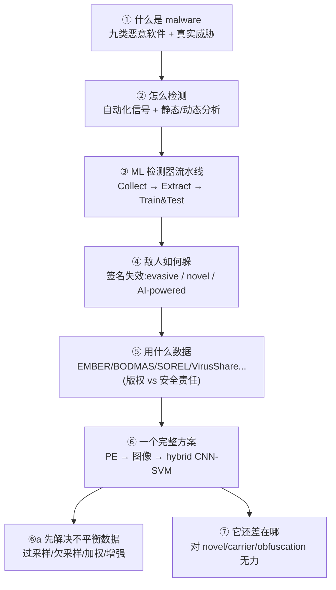

> 🧭 **一句话抓住全章** — **恶意软件检测,本质是一场「签名 vs 变形」的军备竞赛,而深度学习给出的新武器是「把程序当图像看」。** 传统 **signature(签名)** 检测准但脆——攻击者稍一变形(obfuscation)就失效;于是思路转向**机器学习**:先 Collect/Extract/Train,再用一个漂亮的技巧——**把 PE 文件的字节流直接画成一张图,用 ResNet/VGG 这类图像模型去「看」它是不是恶意的**(深度模型提特征 + SVM 判别)。看懂「**签名为什么失效 → 为什么转向 ML → 为什么能把程序变成图像**」这三步,全章就立住了。

---

## 一、什么是 Malware:定义与真实威胁

### 1.1 定义

**Malware(malicious software,恶意软件)** 的定义很直白:**任何由网络罪犯(cybercriminals)开发的、用来窃取数据或破坏/摧毁计算机与计算机系统的入侵性软件 (intrusive software)。** 注意这个定义里有两个落点:**入侵性**(未经允许进入系统)+**恶意目的**(偷数据 / 搞破坏)。

slides 一上来就列了九类常见 malware:**virus、trojan、botnet、downloader、rootkit、ransomware、APT、spyware、zero-day**。下一节逐个拆解。

### 1.2 它有多严重?(真实威胁的数字)

讲师强调 malware 是一个**实打实的现实威胁 (real-world threat)**,给了一组触目惊心的统计(出自 Gaber et al. 2024 的综述):

| 数字 | 含义 |
|---|---|
| **USD 4.35 million / 每次** | 2022 年 IBM Security 调研了 17 国 550 家遭数据泄露的机构,**单次事件平均总损失 435 万美元** |
| **450,000 个 / 每天** | AV-Test 研究所**每天**新登记的新恶意软件与「潜在有害程序 (PUA)」数量 |
| **450M → 970M(2018→2022)** | 针对 Windows / Android / macOS / Linux 的恶意软件**总量四年翻了一倍多**(4.5 亿 → 9.7 亿),而且还在涨 |
| **Dark web marketplaces(暗网市场)** | 提供大量、多样的「黑客产品与服务」——**犯罪已经产业化、可购买** |

> 💡 **为什么先讲这些数字?** — 它们解释了本章后面一切技术选择的动机:**样本量巨大(每天 45 万)** → 检测模型必须 **lightweight(轻量)**、不能靠人工逐个分析;**种类繁多、不断变异** → 模型必须 **generalizable(能泛化到没见过的)**。记住这两个约束,后面看方法设计就处处有呼应。

---

## 二、九类常见 Malware(必须能区分)

这是本章最容易出「名词解释 / 配对题」的地方。下表把九类的「作案手法」一句话讲清,**加粗的是区分彼此的关键词**:

| 类型 | 一句话定义 | 关键区分点 |
|---|---|---|
| **Virus(病毒)** | **自我复制 (self-replicating)** 的程序,把自己的代码**附着 (attach) 到其他可执行代码**里,目的是破坏系统运行能力 | 会**自我复制 + 寄生**在别的程序里 |
| **Trojan(木马)** | 伪装成**合法无害**的可执行文件,一旦启动就**在后台**执行恶意指令 | **伪装**:表面正常,背地搞事 |
| **Botnet(僵尸网络)** | 目标是**攻陷尽可能多的主机**,把它们的**算力**集中到攻击者手里 | 图的是**你的算力**(组成「肉鸡」网络) |
| **Downloader(下载器)** | 本身**只含下载代码**,从网络下载恶意库/代码片段再在受害主机上执行 | 自己几乎没料,**恶意代码后下载** |
| **Rootkit** | 在**操作系统层**攻陷主机,常以**设备驱动 (device driver)** 形式存在,使各种防护手段失效 | **驱动级 / OS 级**,权限最高 |
| **Ransomware(勒索软件)** | **加密**主机上的文件,向受害者**勒索赎金**换解密密钥 | **加密 + 勒索赎金** |
| **APT(Advanced Persistent Threat,高级持续性威胁)** | **量身定制**的攻击,利用受害主机上的**特定漏洞** | **定向、定制**(针对特定目标) |
| **Spyware(间谍软件)** | **秘密运行**并向远端**回报**,常用于窃取**财务/个人信息**(而非单纯搞破坏) | **偷信息并外传**;典型子类 **keylogger(键盘记录器)** 记录按键偷密码 |
| **Zero-day(零日)** | 利用**尚未公开披露**的漏洞,其特征与危害**尚不为人所知**,因此杀毒软件**检测不到** | **漏洞还没人知道** → 防不胜防 |

讲师补充了几个非常有用的「连线」,务必记住:

> 🔑 **三组要记住的类比/联系**
> - **Trojan ≈ DNN 里的 backdoor attack(后门攻击)**:讲师明说「木马的定义和我们前面讲的神经网络后门攻击非常像」——**后门模型对干净输入表现正常,一旦输入带 trigger(触发器)就输出恶意标签**;木马也是**平时正常,被「启动」后才在后台作恶**。同构。
> - **Botnet → 帮人「挖矿」**:如果你的电脑被 botnet 感染,攻击者可以**借用你的算力替他做数字货币挖矿 (mining)**。这就是「把算力交到攻击者手里」的具体含义。
> - **Rootkit 为何最危险**:它运行在**驱动 (driver) 层**,而在 Windows 里**驱动拥有系统最高访问权限**——所以 rootkit **能直接关掉你已装的杀毒软件**,让端点防护形同虚设。

> 📎 **拓展(超出 slides)** — **zero-day** 与后面要讲的 **novel malware(新型恶意软件)** 是一回事的两个说法:都是「**签名匹配检测不到**」的东西。slides 把 zero-day 放在「类型」里、把 novel 放在「sophistication」里,但底层都是同一个痛点——**没见过 = 抓不到**。这正是本章要用机器学习去攻克的核心难题。

---

## 三、怎么检测:自动化信号 + 两种分析手法

### 3.1 三种可自动化的检测活动 (Slide 8)

有些检测活动很容易自动化,讲师列了三类「监控信号」:

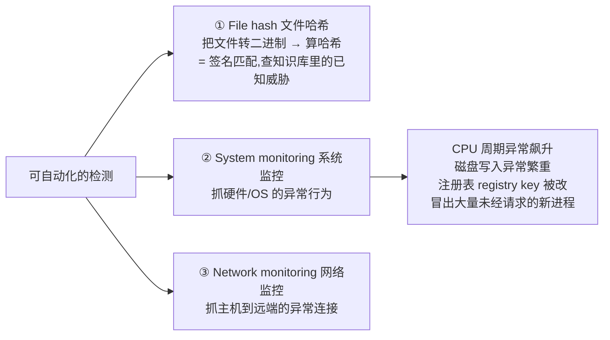

- **① File hash(文件哈希)**:把文件转成二进制串后算哈希值,**拿哈希去知识库里比对**——本质就是**签名匹配 (signature matching)**,用来识别**已知威胁**。
- **② System monitoring(系统监控)**:盯硬件和操作系统的**异常行为 (anomalous behavior)**——CPU 周期异常飙升、磁盘疯狂写入、注册表键被篡改、凭空冒出一堆没人请求的新进程……这些都可能是恶意程序在运行的信号。
- **③ Network monitoring(网络监控)**:盯主机向**远端目标**发起的**异常连接**(比如偷偷往某个服务器回传数据)。

### 3.2 静态分析 vs 动态分析 (Slide 9)

抓到一个可疑文件后,分析它有**两种根本路线**——这是本章的核心对照之一,务必吃透:

| | **Static analysis(静态分析)** | **Dynamic analysis(动态分析)** |
|---|---|---|
| **别名** | static **code** analysis(静态代码分析) | **behavioral** analysis(行为分析) |
| **做法** | **不运行**程序,只分析其**代码或结构**来判断功能 | **运行**恶意软件,**观察它在系统上的行为** |
| **前提条件** | 直接把文件转成二进制串本地分析即可 | **必须先搭好 sandbox(沙箱)安全环境**,否则会毁掉你的系统/网络 |
| **谁来做** | 通常由**安全专家 (security specialist)** 完成 | 同样通常由安全专家完成 |

> 🔑 **一句话记牢** — **静态 = 不运行,读代码;动态 = 跑起来,看行为(且必须在沙箱里跑)。** 这两条路线的优劣会在第六章再次回来:**静态分析能覆盖所有执行路径(代码全在那),动态分析可能漏掉某些路径**——这正是后面「用图像识别(等价于静态分析)」的动机。

> 📎 **拓展(超出 slides):讲师的静态分析「实战故事」** — 讲师说他多年前真做过静态分析,给了一个很具体的画面,帮你建立直觉:
> 1. 一个 Windows 可执行文件里装的是**机器码 (machine code)**;
> 2. 机器码可以**自动地、1:1 地**转换成**汇编语言 (assembly language)**(有现成软件做这事);
> 3. 转出来的汇编长这样:一连串 `push`、`push`、`push` 然后 `call` 一个函数——**这和 C/C++ 调用函数的底层机制一样:用 `push` 把参数压入栈 (stack),再跳到函数,函数从栈里取参数**;比如 `push EBX`(EBX 是 x86 架构里的一个寄存器);
> 4. 安全专家的工作就是**逐行读这些汇编**,搞清每个寄存器里存了什么、每个函数在干嘛,然后给函数**打注释/标签**,逐步还原程序意图;动态分析时还可以**下断点 (breakpoint)** 来调试。
>
> **关键点(连回第四章)**:如果某段机器码被**加密**了,**软件就无法把它转成汇编**(没有密钥),静态分析就此卡死——这就是 obfuscation 能打败静态分析的根本原因。

---

## 四、搭一个「ML 恶意软件检测器」的流水线

### 4.1 从分析到特征,再到模型 (Slide 10)

分析完恶意软件后,我们就能**从二进制文件里提取特征 (features)**,无论它是合法的还是可疑的,把特征存进数据集,用来训练算法:

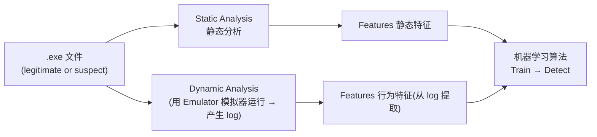

要点:**我们一般不直接在原始二进制文件上训练模型,而是先提取特征,在特征上训练。** 静态分析直接出静态特征;动态分析则用 **emulator(模拟器)** 把恶意软件跑起来、记录 log,再从 log 里提取行为特征。

### 4.2 生产部署的三大硬约束 + 三步法 (Slide 11)

讲师强调:**把 AI 模型部署到生产环境非常有挑战**,尤其对 malware detection。模型必须同时满足三条:

> 🔑 **生产环境三大硬约束** —
> - **Accurate(准确)** + **Generalizable(可泛化)**:能检测出**训练时从没见过**的恶意软件;
> - **Lightweight(轻量)**:因为现实中恶意软件**数以百万计**(回顾每天 45 万新增),模型得能高速处理海量样本;
> - 而且 **malware 种类繁多、各类行为迥异、彼此可能毫无共性**——这让**泛化 (generalization)** 成为最大难题。

搭建流程是标准的三步(贯穿后面所有方法):

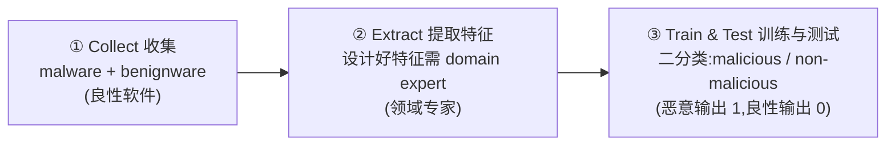

注意 **② Extract** 这一步:**设计「好特征」需要 domain expert(领域专家)** 参与研究——好特征能帮模型做出更准的推断。**这是一个关键伏笔**:第六章那个「把 PE 变图像」的方法,最大卖点恰恰是**完全不需要 domain expert 和 feature engineering**。

---

## 五、Malware 的「进化」:为什么签名检测会失效

### 5.1 签名:又准又脆 (Slide 12)

杀毒软件和恶意软件扫描器**传统上都用签名 (signature)**。

> **定义** — **malware signature(恶意软件签名)** 是一段**字节序列 (a sequence of bytes)**,代表恶意文件中某种**行为模式、代码模式或字符串模式**。
> - 动态分析能抓到**行为模式**当签名;静态分析能抓到文件里的**字符串**当签名。
> - 检测时:把可疑文件的签名**与知识库里已知的签名比对**。

签名法**极其可靠**——只要在知识库里匹配上,你就能**100% 确信**这是恶意软件。**但它也极其脆弱**:现代恶意软件「高级化 (sophistication)」之后,**签名法和启发式检测 (heuristic detection) 都能被轻易打败**。

> 💡 **签名为什么脆?核心机理** — 攻击者**在保留恶意功能的前提下,对恶意软件做变形**,签名就被破坏了。最典型的就是**回收旧恶意软件 (recycled malware) + 稍作修改/混淆 (obfuscation)**,一下就绕过了签名引擎。**这就是为什么我们要转向机器学习**——它有希望抓住「变了形但本质还是恶意」的东西。

slides 把高级化分成三类:**evasive(规避型)、novel(新型)、AI-powered(AI 驱动)**。

### 5.2 Evasive Malware(规避型):主动躲避分析 (Slides 13-14)

规避型恶意软件**力图隐藏其恶意意图**,抵抗 decompiler(反编译器)、debugger(调试器)、sandbox(沙箱)等常用工具的分析。攻击者的技术**按「打败哪种分析」分两路**:

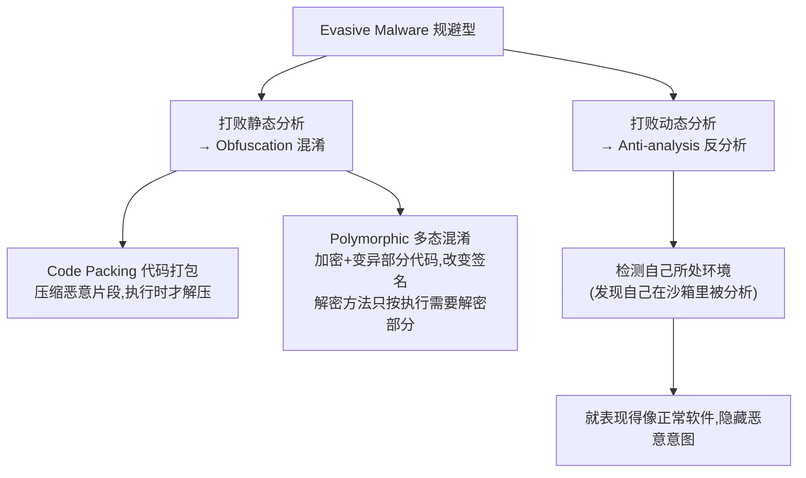

**打败静态分析:obfuscation(混淆)**
- **Code packing(代码打包)**:**压缩**恶意文件的部分内容,**只在程序执行时才解压**——所以静态分析根本看不到被压缩的部分;换个压缩算法,签名就变了。
- **Polymorphic obfuscation(多态混淆)**:**加密并变异**部分代码以改变其签名,解密方法**只按执行需要解密一部分**。
- **共同关键点**:这些技术**不改变功能或行为**,但**改变了静态分析提取到的特征**。
- **更麻烦的是**:**合法软件也会用规避行为**(防止被分析和逆向工程,保护商业机密/核心技术)。所以即便静态分析发现「这文件加密了部分代码」,**也不能据此断定它是恶意的**——合法软件也这么干。

**打败动态分析:anti-analysis(反分析)**
- 在沙箱等动态环境里,恶意软件会用各种**反分析技术探测「自己是不是正在被分析」**;
- 一旦发现自己在被分析,它就**表现得像个正常软件、隐藏恶意意图**——于是你的 log 里全是正常活动,动态分析也被骗过。

> 📎 **回扣静态分析故事** — 还记得第三章那个汇编的例子吗?如果某段机器码**被加密**了,软件就无法把它转成汇编(没密钥),你也就**无法静态分析**它——**这就是 code packing / polymorphic 打败静态分析的精确机理**。

### 5.3 Novel & AI-powered Malware (Slide 15)

- **Novel malware(新型恶意软件)**:**任何此前从未见过的恶意软件**,用签名匹配的引擎检测不到。例如:不属于任何已知家族的新软件、采用了新反分析/混淆技术的软件、利用零日漏洞的 zero-day malware。**本质 = 没见过就抓不到**(与 zero-day 同一痛点)。

- **AI-powered malware(AI 驱动的恶意软件,较新)**:**利用神经网络 (NN) 来增强规避性与定向性**。
  - **核心哲学**:神经网络**不易解释、缺乏透明性 (lack transparency)**。讲师举例:给你一个 VGG 模型,你知道架构、甚至有白盒权限能看到所有权重,**但你无法判断它原本是干嘛的**——可能是 CIFAR-10 分类,也可能是医学影像分类。**攻击者正是利用这一点,把恶意功能藏进神经网络里**:即便专家拿到权重,也推不出它的真实意图。
  - **加密载荷**:恶意 payload 被**加密,只有检测到目标时才解密**——平时无法分析。
  - **典型例子**:用**目标检测模型识别系统的 GUI(图形界面)**;一旦检测到用户在**银行网站**上,就触发攻击**把钱转走**。

> 🔑 **三类 sophistication 一句话** — **evasive = 主动躲(混淆打败静态、反分析打败动态);novel = 没见过(≈zero-day);AI-powered = 用神经网络把恶意意图藏进黑箱。** 三者共同把「签名检测」逼到墙角,这就是引入深度学习的全部理由。

---

## 六、用什么数据:公开 Malware 数据集

### 6.1 为什么「做一个公开数据集」很难 (Slide 16)

想训机器学习模型就得有数据,最省事的是下载现成数据集。但**制作一个同时含合法文件与恶意文件的公开数据集非常难**,两大障碍:
- **法律与版权 (legal & copyright)**:尤其是 Windows 专有软件,你不能擅自把别人的软件放进数据集发布;
- **安全责任 (security liability)**:把**活体恶意文件 (live malicious files)** 放给公众,而公众**未必懂得正确防护**,可能造成严重后果。

正因如此,不同数据集在「给什么、怎么给」上做了不同取舍。下面是七个数据集的对照(本章最易考的「数据集辨析」):

### 6.2 七大数据集对照 (Slides 16-20)

| 数据集 | 规模 | 给的是什么 | 关键特点 / 限制 |
|---|---|---|---|
| **EMBER** | 110 万 PE 文件的**特征** | **只给提取好的特征**(还附了提取代码) | **无版权问题**(不含 PE 文件)。但限制严重:**❶ 不含完整 PE 文件 → 没法试新特征提取法;❷ 特征用静态分析提取 → 对混淆 malware 失效;❸ 连基线分类器都能拿到极好成绩(太简单)→ 不推荐用于未来研究** |
| **BODMAS** | 7.7 万良性 + 5.7 万恶意 | 良性**只给特征**;恶意**给特征 + 完整 PE 文件** | 近期、**带时间戳、分 14 类**(如 Trojan、Ransomware)。⚠️ 恶意 PE 是 **intact(完整未拆解)**,直接运行很危险 |
| **SOREL-20M** | **2000 万**样本 | 1000 万恶意(特征 + **disarmed 已拆解** PE)+ 1000 万良性(元数据 + 特征) | 恶意文件**已 disarmed(拆解/缴械)**,即便运行也不会害你的系统 |
| **VirusShare** | **5500 万+** 活体恶意文件 | **给活体 (live) 完整恶意文件** + 时间戳、哈希、检测报告等 | 研究中**广泛使用**;可对任意数量的完整恶意文件做**静态 + 动态**分析。每个样本附**多家检测器的结果**(如 Google、G Data 各报什么类型) |
| **Malware Bazaar** | **70 万+** 活体恶意文件 | **给活体恶意文件** + 时间戳、哈希、类别、家族信息 | 可按类别搜索、含家族与变种信息。**限制:每天最多下载 2000 个** → 想下全套约需一年 |
| **Microsoft malware dataset** | **≈0.5 TB**(未压缩) | 2015 年微软恶意软件分类挑战赛数据 | 含 **9 个家族**的恶意软件,体量巨大 |
| **Malimg** | **9435** 个真实样本,**25 个家族** | 可视化用 | **广泛用于「基于可视化 (visualization-based)」的恶意软件分类**(正好对应第六章把 malware 变图像) |

> 💡 **辨析这张表的两把尺子** — 看数据集只需问两个问题:
> 1. **给特征还是给文件?** 只给特征 → **没版权问题、但没法试新特征法、对混淆无力**(EMBER 是反面教材);给完整 PE → 灵活但**有安全/版权风险**。
> 2. **恶意文件是 intact 还是 disarmed?** **intact(BODMAS、VirusShare)= 活的、危险**,需在沙箱里小心处理;**disarmed(SOREL-20M)= 已缴械、安全**。

> 🔑 **EMBER 为什么「不推荐」?** — 三连击:**不含完整文件(没法做新研究)+ 静态特征(怕混淆)+ 太简单(基线都接近满分,区分不出方法好坏)**。记住这个反面教材,你就懂了「一个好数据集」该有的样子。

---

## 七、核心方法之一:把 PE 文件「变成图像」来检测

从这里开始进入本章的技术高潮——**一个完全不需要领域专家、把恶意软件检测变成「图像分类」的方法**(Shaukat et al. 2023)。

### 7.1 动机:为什么是图像?(Slide 21)

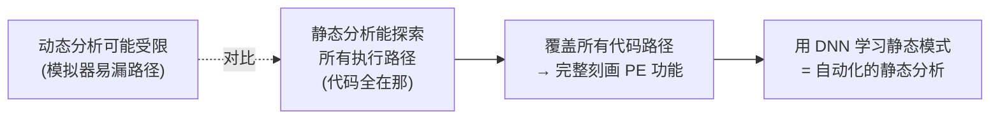

逻辑链:**静态分析能覆盖所有执行路径**(代码全摆在那),而**动态分析在沙箱里跑很可能漏掉某些路径**;既然「覆盖全路径」能完整刻画 PE 的功能,那么**用深度神经网络去学这些静态模式就是个好主意**。

> 🔑 **关键类比** — **「把 malware 转成图像 + 用图像模型分类」≈ 自动化的静态分析。** 区别在于:传统静态分析靠安全专家**手工读汇编**,而这里让**神经网络自动**去「看」整段代码的模式并做判别。

### 7.2 先认识 PE 文件 (Slide 22)

- 针对 Windows 的恶意软件,通常按 **PE(Portable Executable,可移植可执行)文件规范**制作。
- 一个 PE 文件包含 **Header(头)+ Sections(节)**,装着 Windows 运行该文件所需的信息:**导入哪些库 (imports)、如何映射到内存、要执行的代码**。
- **关键事实**:PE 文件**可以轻松转成 RGB 或灰度图像**——因为文件里**每个字节 (byte) 和图像里每个像素 (pixel) 的取值范围都是 0–255**。

### 7.3 转换流水线:字节流 → 图像 (Slide 25)

这是本方法的「点睛之笔」,务必能复述这条流水线:

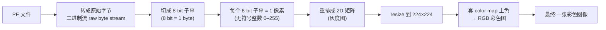

步骤拆解:
1. 把 PE 文件翻译成**原始字节二进制流**;
2. 按 **8 bit 一段**切分(8 bit = 1 byte);
3. **每个 8-bit 子串当作一个像素**(无符号整数 0–255);
4. 重排成 **2D 矩阵**(图像是二维数据),resize 到 **224×224**;
5. 对这个 2D 灰度矩阵**套一个 color map(色彩映射)** 上色,得到 RGB 彩色图,用来可视化 PE 二进制。

> 📎 **拓展(超出 slides):上色的两种做法** — 讲师讲了得到彩色图的两条路:
> - **路 A(3 字节 → RGB)**:按顺序每取 **3 个字节**分别当 R、G、B 三个通道;
> - **路 B(灰度 + color map)**:先转灰度,再**自定义一个 color map**——比如规定「灰度值 100 → R=5,G=100,B=200」这样的映射,把灰度图变成彩色图。
>
> 为什么要彩色?因为**彩色图比灰度图含有更丰富、更多样的元素**,更利于模型区分。

> 🔑 **本方法最大卖点** — **整个「生成图像 + 后续检测」的流程,完全不需要 feature engineering 或 domain expert!** 对比第四章「Extract 特征需要领域专家」的伏笔——这里只是机械地「字节→像素→图像」,然后训个图像分类器。**这就是它相对传统 ML 检测器的核心优势。**

---

## 八、绕不开的拦路虎:不平衡数据 (Imbalanced Data)

在训模型之前,必须先处理**不平衡数据**问题——因为**几乎所有 malware 数据集都是不平衡的**。

### 8.1 问题:稀有事件被淹没 (Slide 23)

当我们要分类一个**稀有事件 (rare event)**(如账号劫持),「好」样本可能占到 **99.9%** 的标注数据。这时:
- 「坏」样本**没有足够的权重去「影响」分类器**;
- 模型**严重偏向多数类、忽略少数类**,在这种高度不平衡数据上训出来表现很差。

### 8.2 四种对策 (Slides 23, 26)

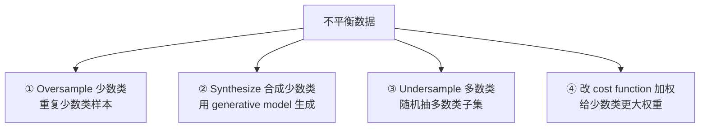

| 对策 | 做法 | 备注 |
|---|---|---|
| **① Oversample(过采样)少数类** | 在训练数据里**重复**少数类样本,凑成更平衡的集合 | 最简单 |
| **② Synthesize(合成)少数类** | 用**生成模型 (generative model)** 合成少数类样本 | 比简单重复更高级 |
| **③ Undersample(欠采样)多数类** | **随机抽取**多数类的一个子集,凑成更平衡的集合 | 会丢数据 |
| **④ 改 cost function 加权** | 改损失函数,**给少数类更高权重**,让每个少数类样本对模型影响更大 | 见下方讲师补充 |

> 📎 **拓展(超出 slides):加权具体怎么做** — 讲师给了直觉:训练时若发现当前在优化的是**少数类**的损失(如 cross-entropy loss),就把这个损失值**乘以一个因子(例如 ×10)** 再让模型优化——这样少数类样本的「话语权」就放大了。

### 8.3 双重不平衡:类间 + 类内 (Slide 26)

讲师用真实数字说明,不平衡有**两个层次**:

- **类间不平衡(malware vs benign)**:**Malimg** 含 **9339 个恶意样本(25 个家族)但只有 617 个良性样本**——绝大多数是恶意的。
- **类内不平衡(malware 各家族之间)**:即便都在恶意类里,**Allaple.A 家族有近 2949 个样本,而 Skintrim.N 只有 80 个**;**Microsoft 数据集**共 10868 个样本,**Kelihos_ver3 家族占 2942 个(≈30%),而 Simda 只有 42 个**。

**解决办法(图像版的便利)**:因为 PE 已经转成了图像,可以**直接用图像数据增强 (data augmentation)**——**水平翻转 (horizontal flip)、调整亮度 (brightness range)** 等——把每个类(malware 与 benign)的训练数据**扩到相等数量**。

> 💡 **为什么这一步顺理成章** — 一旦「程序变成了图像」,处理不平衡就能直接借用计算机视觉成熟的**数据增强**工具箱。这又是「把 malware 当图像看」带来的红利。

---

## 九、核心方法之二:完整的两步检测框架与实验

### 9.1 两步框架总览 (Slide 24)

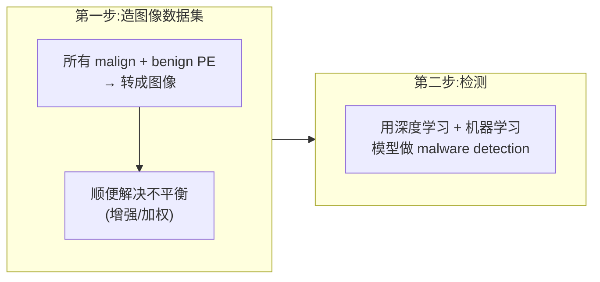

- **第一步**:把所有恶意与良性 PE **转成图像**,生成图像版 PE 数据集;**同时处理不平衡问题**。
- **第二步**:用深度学习 + 机器学习模型做检测——因为数据集本质就是个图像数据集,可以直接用我们熟悉的 **VGG、ResNet** 等模型(lab/assignment 里用过)。

**数据来源**(注意「三个数据集各司其职」):
- 恶意 PE 来自三处:**Microsoft 数据集**(训练)、**Malimg**(用于 **validation 验证**)、**VirusShare**(用于**评估泛化 generalization**);
- 良性 PE 来自多个网站:**softpedia.com、download.com** 等下载站。

> 📎 **拓展(超出 slides):validation set 到底干嘛用** — 讲师特意解释了验证集的作用:**训练集**用来训模型;**验证集**用来**调超参数**——比如训多少个 epoch、用多大的模型(VGG-16 还是 VGG-11);**测试集**用来在训练彻底完成后**评估最终性能**。三者分工不能混。

### 9.2 混合模型:Hybrid CNN-SVM (Slide 27)

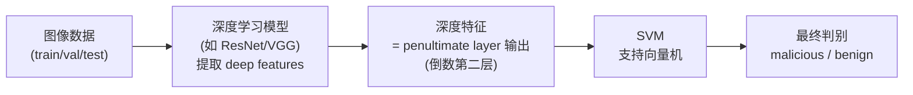

- 数据分成 train/validation/test;
- **深度学习模型负责提取深度特征**——这里的「深度特征」指**倒数第二层 (penultimate layer) 的输出**(回顾后门攻击那周讲的「深度模型提取的特征 = 倒数第二层」);
- 把提取的特征**喂给一个机器学习模型 SVM(支持向量机)** 做**最终判别**。

> 🔑 **思考题:为什么用 SVM 替代输出层?(讲师重点提问)** —
> 平时我们用 VGG 时,特征是直接送进**输出层 (output layer)** 的;这里却用一个独立的 SVM 替换了输出层。区别在哪?
> - **输出层通常很简单**:一般就是**单个全连接层 (fully connected layer)**,本质是一次矩阵乘法;
> - **换成 SVM** 后,可以靠这个**更强的机器学习模型从特征里榨取更有用的信息**,**很可能提升性能**;
> - **但不是必然**:如果深度模型提取的特征**本身已经足够好、能很好地区分样本**,那么用简单输出层和用 SVM **差别不大**。

### 9.3 迁移学习 (Slide 28)

- **微调 (fine-tune) 在 ImageNet 上预训练好的模型**作为起点;
- **ImageNet**:1000 万+ 图像、1000 个类别标签——非常大;
- 实验中研究了 **15 个预训练模型**(VGG-16/19、ResNet、AlexNet、DenseNet 等经典模型);**第 15 个就是前面说的 hybrid 模型**(ResNet 做骨干 + SVM 做最终判别)。

> 💡 **为什么迁移学习在这里成立** — 既然 PE 已经被「当作图像」,那么在自然图像(ImageNet)上学到的**通用视觉特征**就能迁移过来当起点,再在 malware 图像数据集上微调。**「把 malware 变图像」一举打通了整个成熟的计算机视觉工具链**(预训练模型、数据增强、CNN 架构)。

### 9.4 实验设置与结果 (Slides 29-32)

把收集的语料分成三个数据集,**专门用来研究「数据量」与「平衡度」对效果的影响**:

| 数据集 | 恶意 | 良性 | 特点 |
|---|---|---|---|
| **DatasetA** | 2,000 | 10,000 | **不平衡**(恶意远少于良性) |
| **DatasetB** | 20,000 | 10,000 | 引入更多恶意 → **更平衡** |
| **DatasetC** | 20,000 | 10,000 | 样本与 B 相同,但**对良性 PE 做增强**来平衡训练集 |

**结果与结论**(训练/验证/测试按 60:20:20 划分;hybrid 用 RegNetY320 做特征提取的 CNN-SVM):

- **DatasetA(不平衡)**:即便单用 **VGG-16 也能到 ~90%**;**VGG-19 反而略降**(对这个数据集太复杂);**hybrid 最佳,~91%**。
- **DatasetB(更平衡)**:**VGG-19 大涨(从 ~89% → ~93%)**——说明之前不是 VGG-19 不行,而是**数据太少/不平衡**喂不饱它;**hybrid 仍最佳**,略高于 VGG-19。
- **DatasetC(B + 增强)**:对良性图像做水平翻转、调亮度等增强后**进一步提升**,**hybrid 准确率到 ~95%**,为三者最佳。

> 🔑 **三个数据集想说明什么** — **❶ 模型不是越复杂越好**(数据不够时 VGG-19 反不如 VGG-16);**❷ 数据量与平衡度至关重要**(B 让 VGG-19 翻身);**❸ 数据增强能锦上添花**(C 把 hybrid 推到 95%)。而**hybrid CNN-SVM 在三种设置下都拿到最佳**,印证了 9.2 节「SVM 替输出层通常更强」的判断。

---

## 十、这条路线还差在哪:局限性 (Slide 33)

把 PE 转成图像、再训模型,**虽然新颖,但有明确的局限**:

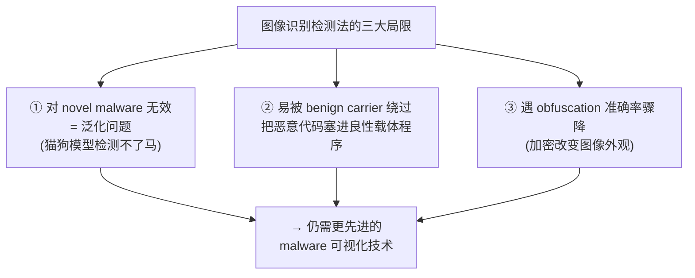

- **① 对 novel malware(新型恶意软件)无效**——本质是**泛化问题**。讲师的类比很生动:**你训了个 VGG 区分猫和狗,它就检测不了马**;同理,模型学过的恶意家族之外的新东西,它认不出来。
- **② 易被「benign carrier(良性载体)」绕过**:攻击者把恶意代码**塞进一个良性程序里**。因为**绝大部分特征都来自良性 PE,只有极小一部分来自恶意代码**,深度模型很可能**察觉不到那一小撮恶意代码**。
- **③ 遇到 obfuscation,准确率显著下降**:比如恶意样本用**加密**变换代码,**会大幅改变转换后图像的外观**,模型就懵了。

> 🧭 **落点:军备竞赛仍在继续** — 所以「**仍需发明更先进的恶意软件可视化技术**」。这和上一周 deepfake 的结论同构——**没有一劳永逸的防御**:签名被混淆打败 → 转向图像识别 → 图像识别又被 carrier/obfuscation 打败 → 还得继续进化。

---

## 十一、本章小结 (Key Takeaways)

- **课程定位**:本周是「**用 AI 解决安全问题**」的**第二站**(第一站 deepfake);范式 = 把安全问题转成 ML 检测问题。
- **Malware 与九类型**:恶意软件 = 偷数据/搞破坏的入侵性软件。九类务必能区分:**virus(自复制寄生)、trojan(伪装,≈DNN 后门)、botnet(劫算力挖矿)、downloader(只下不带)、rootkit(驱动级,最高权限,能关杀软)、ransomware(加密勒索)、APT(定向定制)、spyware(偷信息外传,含 keylogger)、zero-day(漏洞未公开)**。威胁巨大(每天 45 万新增、4 年翻倍)→ 逼出「轻量 + 可泛化」两大需求。
- **检测策略**:自动化信号 = **file hash(签名匹配)/ system monitoring / network monitoring**;两种分析 = **static(不运行读代码,覆盖全路径)vs dynamic(沙箱里跑看行为,可能漏路径)**。
- **ML 检测器流水线**:**Collect → Extract(需 domain expert 设计特征)→ Train & Test(二分类 malicious/non-malicious)**;生产三约束 = **accurate / generalizable / lightweight**。
- **签名为什么失效(三类 sophistication)**:签名**又准又脆**(变形即破)。**Evasive**——obfuscation(code packing / polymorphic)打败静态、anti-analysis 打败动态,且**合法软件也混淆**;**Novel**——没见过(≈zero-day);**AI-powered**——用神经网络的不可解释性藏恶意意图(加密 payload、GUI 检测触发银行攻击)。
- **数据集(两把尺子:给特征 vs 给文件、intact vs disarmed)**:**EMBER**(只给特征、无版权、但太简单**不推荐**);**BODMAS**(部分 intact PE,14 类);**SOREL-20M**(2000 万、disarmed 安全);**VirusShare**(5500 万活体、广泛使用、可静+动分析);**Malware Bazaar**(活体、每天限下 2000);**Microsoft**(0.5TB、9 家族);**Malimg**(可视化分类用)。
- **核心方法(PE → 图像)**:动机 = **图像识别 ≈ 自动化静态分析(覆盖全路径)**。流水线 = **字节流 → 每 8bit(0–255)= 1 像素 → 2D → resize 224×224 → color map 上色 → RGB 图**;**全程无需 feature engineering / domain expert(最大卖点)**。
- **不平衡数据**:四对策 = **过采样 / 生成合成 / 欠采样 / 改 cost function 加权(×10)**;**双重不平衡(类间 malware-benign + 类内各家族)**;图像化后可直接用 **data augmentation(翻转/调亮度)** 来平衡。
- **完整框架与实验**:**两步**(造图像集+解不平衡 → DL+ML 检测);**hybrid CNN-SVM**(深度模型提 penultimate layer 特征 → SVM 判别,**SVM 替输出层通常更强、但特征够好时差别不大**);**迁移学习**(ImageNet 预训练 + 微调,15 个模型);**三数据集 A/B/C** 说明「**模型非越复杂越好、数据量与平衡度关键、增强锦上添花**」,hybrid 三战全胜,**C 上达 ~95%**。
- **局限**:**对 novel malware 无效(泛化问题,猫狗模型测不了马)、易被 benign carrier 绕过、遇 obfuscation 准确率骤降** → 仍需更先进的可视化技术。**军备竞赛没有终点。**

> 📌 **一页纸记忆锚点** — **九类 malware(virus/trojan/botnet/downloader/rootkit/ransomware/APT/spyware/zero-day)→ 检测靠 hash+监控、分析分静态/动态 → ML 三步 Collect/Extract/Train → 签名被三类 sophistication(evasive/novel/AI-powered)打败 → 七大数据集按「给特征 vs 给文件、intact vs disarmed」取舍(EMBER 太简单不推荐、VirusShare 活体最常用)→ 杀手锏:PE 字节流→8bit/像素→224×224 彩图,免特征工程 → 先用过采样/欠采样/加权/增强治不平衡 → hybrid CNN-SVM(深度特征+SVM)+ ImageNet 迁移学习,datasetC 增强后 ~95% → 死穴:novel/carrier/obfuscation 三杀,军备竞赛继续。**

---

## 十二、与 Assignment / Lab / 相邻周的关联

| 关联点 | 说明 | 对应章节 |
|---|---|---|
| **承接 Week 4(Backdoor / Trojan)** | **木马 (trojan) 与 DNN backdoor 同构**:平时正常、被「触发」后才作恶;讲师明确把两者类比 | §二 |
| **承接 Week 4–5「penultimate layer 特征」** | hybrid 模型里「深度特征 = 倒数第二层输出」沿用后门攻击那周的定义 | §9.2 |
| **承接 Week 8(deepfake)的「军备竞赛」主题** | 同样的结论:签名→图像→仍被绕过,**没有一劳永逸的防御**;同属「用 AI 解决安全」后半段 | §十、引子 |
| **VGG / ResNet / 迁移学习 = lab & assignment 的老朋友** | 因为 PE 被「当图像」,可直接复用你在 lab/assignment 用过的 VGG-16/19、ResNet 与 ImageNet 预训练微调 | §9.3 |
| **Assignment 2 已可完成** | 讲师在课尾宣布:学完本周「**你已具备完成 Assignment 2 的全部知识**」,并请准备 **lab test**(lab test 涵盖的主题也都讲完了) | 课尾通知 |
| **录音位置(重要)** | 本周 malware detection 的录音**在「Lecture 9」转录文件的后半段**——该文件前半段其实是 Week 8 deepfake/voice-cloning 的收尾 + Assignment 2 Task 4 讲解。**本指南已定位并整合后半段。** | 全章 |

> 🧭 **下一周预告** — 课程进入「用 AI 解决安全问题」的**第三站:Network Intrusion Detection(网络入侵检测)**。讲师预告会讲入侵检测基础、一个朴素分类器(你将在 lab 里动手实验),以及一种可视化分析方法——又一次把安全问题转化为 ML 可解的检测任务。
