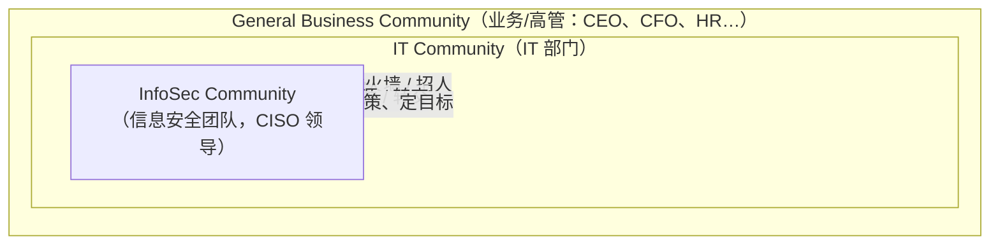
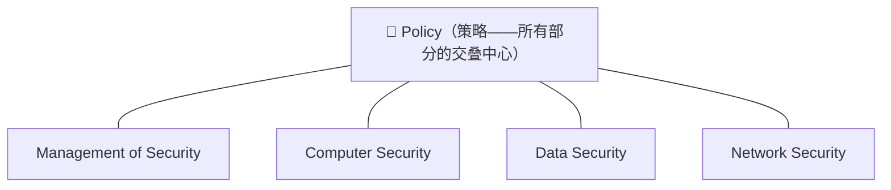
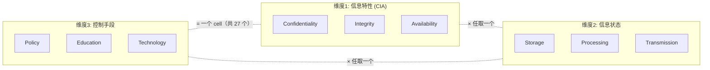
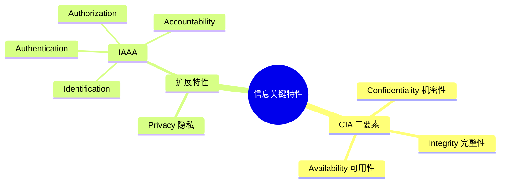
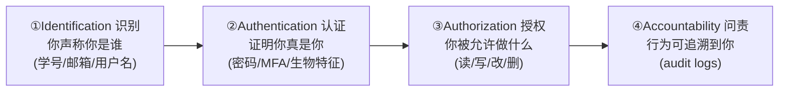
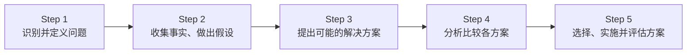

# Week 1 · 信息安全导论与核心特性 (Introduction & Key Characteristics of Information Security)

> **学习目标 (Learning objectives)** — 读完本章你应该能够:
> - 解释为什么信息安全是"全员责任",并说出三个 **communities of interest** 各自的角色;
> - 区分 **security**、**information security (InfoSec)** 以及它的几个专门领域 (physical / operations / communications / cyber / network security);
> - 用 **CNSS / McCumber Cube** 这个框架去审视一个安全方案,并判断一个三元组是不是模型里的一个"格子 (cell)";
> - 准确定义并用例子区分 **CIA** 三要素 (confidentiality, integrity, availability);
> - 解释扩展特性 **privacy**,以及 **IAAA** 四步链 (identification → authentication → authorization → accountability),并说清它们之间的因果关系;
> - 用恰当的术语回答 slide 19 的四道辨析题。

本章对应 **Lecture 01 — Introduction and Overview**,是整门 **CSIT988/488 Security, Ethics and Professionalism**(教材:Whitman & Mattord, *Management of Information Security*)的地基。整门课讲的是 **信息安全的"管理"**——规划、策略、风险管理、保护机制、法律与伦理——而要管理一样东西,先得说清它到底是什么、由哪些部分组成、用什么语言去描述它的"好与坏"。这一章就是在搭这套语言:谁来负责安全(communities of interest)、安全到底指什么(security 的定义与分类)、用什么框架去分析它(CNSS 模型)、以及衡量"信息是否安全"的那些具体特性(CIA 加上 privacy 和 IAAA)。后面每一讲都会反复用到这里的词。

> 📎 **拓展(超出 slides)** — 真实录音里,本讲前半段是"课程介绍"(评估方式、考试、Moodle 等),slides 从"安全概念"才开始。本指南聚焦**会进考试和作业的概念内容**;评估安排请以 subject outline 为准。只把对复习最关键的两点放在这:① **assignment 1 是 week 4 的 10 分钟在线小测 (quiz, 5%)**,讲师明确说"往年小测里出过 **CNSS model** 的题";② **期末考可带几页手写 A4 cheat sheet**(张数稍后通知,约 3–5 页),因为这门课"概念多、要背的多"——这正是本系列 Cram 模式的用武之地。

---

## 1. 为什么信息安全是"每个人"的事:三个 Communities of Interest

先问一个问题:保护一家公司的信息,是谁的活儿?

很多人的直觉答案是"IT 部门的人"。这个直觉在三十年前是对的——那时候计算机被关在数据中心的机房里,信息处理是**集中式 (centralized)** 的,守住那几个机房、管好那几台机器,信息基本就安全了,这确实主要是技术人员的责任。但讲师强调:**过去三十年技术从"一个数据中心"扩散到了业务的每一个角落**。如今是 AI、IoT、云计算的时代,信息随着员工出差而流动,业务边界不再静止。于是 computer security 演化成了范围更广的 **information security (InfoSec)**——它保护的不只是计算机里的数据,还包括人的知识。保护信息这件事,因此变得复杂得多,也不再是某个小团队能独立完成的了。

这就引出本章第一个核心概念。一家组织在做信息安全的**预算和规划决策**时,牵涉的人远不止技术经理。讲师把决策者分成三类,称为 **communities of interest(利益共同体 / 关注群体)**:

| Community of interest | 是谁 | 在安全里扮演的角色 (slide 3) |
|---|---|---|
| **InfoSec community** | 信息安全领域的经理与专业人员 | **保护**组织的信息资产,抵御它面临的各种威胁 |
| **IT community** | IT 领域的经理与专业人员(网络、数据库等) | **支撑**业务目标——提供并维护与组织需求相匹配的 IT |
| **General business community** | 组织里 IT 之外的其余管理者与专业人员(CEO、CFO、HR、各业务部门) | **表达并传达**组织的政策与目标,并向前两个群体**分配资源** |

这里有个容易混淆、但讲师特意点明的层次关系:**InfoSec 团队通常嵌在 IT 部门内部**,所以 IT community 是更大的"超集"(IT 里还有网络、数据库等等);而 general business community 则在 IT 之外。三者不是平级并列的三块,而是"安全 ⊂ IT,业务在旁边出钱定方向"。

为什么这三类人必须坐到一起、"建设性地辩论 (constructive debate) 直到达成共识"?讲师用了一个会在整门课反复出现的角色来说明——**CISO (Chief Information Security Officer,首席信息安全官)**,他是公司信息安全计划的总负责人。

> **🔑 例 (Worked example)** — CISO 想加固安全,但他**不能单干**:
> - 他想**买一台新防火墙、再招人来维护它** → 这笔采购得先过 **IT 部门**(他们支不支持这个方案?),再上报到 **业务高层**(CEO/CFO 批不批这笔钱?)。
> - 他想**装一批 CCTV 摄像头** → 这又牵扯到 IT 之外:会不会**违反公司政策**?会不会**侵犯员工的隐私 (privacy)**?于是必须和 HR、法务等业务部门一起谈。
>
> 一个"纯技术"的安全动作,落地时几乎总要三个 community 协同。这就是为什么信息安全是全员的事:**InfoSec 出方案,IT 给技术支撑,业务出钱、定政策、担责任。**

每个 community 还必须理解一个共同的底层认识:信息安全本质上是在**识别 (identify)、度量 (measure)、缓解 (mitigate)** 现代业务环境中操作信息资产所带来的**风险 (risk)**——这句话是后面"风险管理"两讲 (L09/L10) 的伏笔。

> 📎 **拓展(超出 slides)— 一个高频考点陷阱**:讲师特别警告,"**三个 communities of interest**"是**本课程特有的划分**,目的是把概念讲清楚。ChatGPT / Gemini 可能给你**不一样的分类、甚至说有 5 个**。往年真有学生写了"5 个 communities of interest",一眼就能看出**不是课程内容**。**考试请严格按课程的 3 个来答**——这正体现了讲师反复说的:用 AI 拓展理解可以,但基本概念必须以课堂为准(也呼应作业里对 AI 编造内容的严厉态度)。

---

## 2. 到底什么是"安全"?从 Security 到 Information Security

我们一直在说"安全",但这个词太宽泛了,得给它一个能用的定义。

最朴素地说,**to be secure(处于安全状态)就是被保护、免于风险**——免于损失 (loss)、损坏 (damage)、未经授权的修改 (unwanted modification) 或其他危害 (hazard)。把它说得更正式一点,slide 4 给的定义是:

> **Security(安全)** = "the quality or state of being secure—to be free from danger"(处于安全、免于危险的性质或状态)。

讲师补了一个很好的直觉类比:想想 **national security(国家安全)**——它是一套**多层 (multi-layer)** 的体系,保护国家的主权、资产、资源和人民。组织的安全也一样:没有哪一招能一劳永逸,合适的安全水平**靠多种策略同时、组合地实施 (several strategies undertaken simultaneously or in combination)** 才能达到。这个"多层防御"的思想会贯穿整门课。

正因为"安全"很宽,它分成若干**专门领域 (specialized areas)**。理解它们的边界,有助于你之后判断某个保护机制到底在管什么:

| 专门领域 | 保护对象 | 例子 / 备注(讲师补充) |
|---|---|---|
| **Physical security** | 人、实物资产、工作场所 | 防火(火警/灭火/消防流程)、防地震等自然灾害、防未授权的物理闯入 |
| **Operations security** | 组织**持续运转**的能力 | 让业务活动不被中断、不被破坏地进行 |
| **Communications security** | 组织的通信(媒介、技术、内容) | 也包括用这些工具达成目标的能力 |
| **Cyber security**(≈ computer security) | 计算机化的信息处理系统及其数据 | "cyber" 是近几十年才出现的新词,**定义至今未完全统一**,略显模糊 |
| **Network security** | 语音/数据、网络组件、连接与流量内容 | 是 communications security 与 cyber security 的**交集子集** |

在这些之上,就是本课的主角 **information security (InfoSec)**。slide 5 的定义值得逐句读:

> **InfoSec** = 用来保护**敏感业务信息**免遭**修改 (modification)、扰乱 (disruption)、破坏 (destruction)、窥探 (inspection)** 的一整套流程与工具;它聚焦于保护信息及其**关键要素——confidentiality, integrity, availability**——以及使用、存储、传输这些信息的系统与硬件,手段包括 **policy(策略)、technology(技术)、training & awareness(培训与意识)**。

注意这里已经埋了两条主线:① 信息的关键要素就是马上要细讲的 **CIA**;② 保护手段有三类(policy / technology / education),这正好是下一节 CNSS 模型的第三个维度。InfoSec 不只是"装软件",而是覆盖了 computer security、data security、network security,并把 **policy** 放在所有部分**重叠的中心**——

之所以 policy 在正中央,是因为它**统管一切**:技术也好、流程也好,最终都要由策略来规定和约束。这也是为什么整门课会专门用一讲 (L05) 讲 policy——讲师说"policy 控制一切"。

> **本节连接**:我们已经知道"谁来管"(三个 community)和"管什么"(InfoSec 及其领域)。但面对一个真实的安全方案,怎么**系统地**检查它有没有漏洞?这就需要一个分析框架。

---

## 3. 一个分析框架:CNSS Security Model(McCumber Cube)

> ⚠️ **重点**:讲师明说往年 quiz 出过这个模型的题,而且他有一道"最爱的题型"就出自这里(见本节末)。务必吃透。

slide 5 已经告诉我们,保护信息要照顾它的"关键要素",还要用"多种手段"。问题是:这些要素、手段,再加上"信息处在什么状态",维度一多就容易顾此失彼。**CNSS 模型**就是用来把这些维度组织起来、不漏掉任何组合的框架。

它的来历:**CNSS = Committee on National Security Systems**,是美国一个为国家安全系统制定政策的机构。它在文件 **NSTISSI No. 4011**(*National Training Standard for InfoSec Professionals*)里提出了一个全面的信息安全模型,以提出者 **John McCumber** 命名,叫 **McCumber Cube(麦克姆伯立方体)**。它被当作理解信息安全方方面面的**标准参照**,覆盖三个维度:

| 维度 | 名称 | 三个取值 |
|---|---|---|
| 维度一 | **Information characteristics**(信息特性) | Confidentiality / Integrity / Availability(即 **CIA**) |
| 维度二 | **Information location / states**(信息所处状态) | **Storage**(存储)/ **Processing**(处理)/ **Transmission**(传输) |
| 维度三 | **Security control categories**(安全控制手段) | **Policy** / **Education** / **Technology** |

每个维度 3 个取值,三维交叉,就得到一个 **3 × 3 × 3 = 27** 个小格 (cells) 的立方体。**每一个 cell 都是三个维度的一个交点**,代表"要确保信息安全,就必须被处理到"的一个具体方面。

**这个框架怎么用?** 当你要设计或审查一个信息安全方案时,逐个检查 27 个 cell,看每个 cell 是否被三个 community 妥善覆盖了——它本质是一张"查漏地图 (identify gaps)"。

> **🔑 例 (Worked example)** — 取 cell = (**Technology** × **Integrity** × **Storage**):
> 这个格子问的是:"用**技术**手段,保护**存储中**信息的**完整性**,我们做了什么?"
> 一个对应的控制就是 **host intrusion detection system (主机入侵检测系统)**:当某个关键文件被修改时,它会**告警安全管理员**。
> 再换一个格子 = (**Education** × **Integrity** × **Storage**):同样是保护存储中信息的完整性,但手段换成"教育"——那就要**培训员工**,让他们懂得如何保护存储数据的完整性。
> 你可以把 27 个格子逐一这样问一遍,这就是模型的用法。

> **🔑 讲师最爱的题型(很可能进考试!)** — 给你一个**三元组 (triple)**,问"它是不是 CNSS 模型里的一个合法 cell?"
> 关键判据:**一个合法 cell 必须从每个维度各取恰好一个取值**。
> - `(Technology, Integrity, Storage)` → ✅ 合法(每维各一个)。
> - `(Confidentiality, Integrity, Availability)` → ❌ **不是** cell!三个全来自维度一,缺了"状态"和"手段"两个维度。
> - `(Availability, Processing, Transmission)` → ❌ **不是** cell!Processing 和 Transmission 都来自维度二(状态),重复了,缺了"手段"维度。
> 记牢:**每个维度出且仅出一个代表**,才是 cell。

**模型的弱点 (slide 9)** —— 也是常考的辨析点:

1. 它虽然覆盖了三个维度,却**只字未提指导控制如何落地的 guidelines 与 policies**,而这些对一个有效的安全方案恰恰不可或缺。换句话说,它的**主要用途是"找出覆盖的空白 (identify gaps)",而不是教你怎么把方案高效地跑起来**。
2. 当**只从单一视角**去看它时会暴露第二个弱点:实践中,真正彻底的风险削减,需要**三类控制 (policy, education, technology) 全部到位,且由三个 community 共同创建与推行**——单靠一类、单靠一方都不够。

> **本节连接**:CNSS 的第一个维度就是 CIA。它在这里只是被点名,但 CIA 是衡量"信息安全不安全"的根本标尺,值得单独、仔细地讲——这就是下一节。

---

## 4. 信息的核心特性:CIA 三要素

CNSS 维度一里的三个特性,合称 **C.I.A. triangle**,是信息安全**最基础、最原始**的三个特性。讲师强调:这是计算机化信息处理刚出现时大家公认的三大要素;随着系统变复杂,光有 CIA 已**不够**,才又扩展出 privacy、identification、authentication、authorization、accountability(下一节讲)。先把这三个地基打牢。

### 4.1 Confidentiality(机密性)

**Confidentiality** 确保**只有拥有足够权限 (sufficient privileges) 的人**才能访问特定信息;换句话说,**把访问权限制在"需要知道"的人手里,挡住不该知道的人**。一旦未授权的人能看到信息,机密性就被**破坏 (broken)** 了。

这里有个常被误解的点,讲师讲得很透:**机密 ≠ 完全保密**。它的意思是"未经授权者无法访问",而不是"谁都看不到"。

> **🔑 例** —
> - 别人**未经你允许读了你的邮件** → 违反机密性;别人**未经允许看了你 Moodle 上的作业成绩** → 违反机密性。
> - 讲师正在用 **Zoom** 上课,内容通过互联网广播,但频道是受限的:**不是本课学生就进不来**——对外人而言它是机密的,对你(已认证的本课学生)它是开放的。这恰好诠释了定义:"只有足够权限的人可访问",你有权限,外人没有。

机密性在涉及**个人信息**(员工、客户,医疗行业里的病人)时尤其重要。**泄露 (disclosure)** 可能是故意的,也可能是无意的:

- 把机密邮件**误发**给组织外的人;
- 处理重要文件时**只丢弃、不销毁**——有人会去翻垃圾桶 (dumpster diving) 复原信息(侦探片里常有的桥段),所以公司必须有**如何正确销毁文件**的策略;
- 黑客**攻入数据库窃取**客户姓名、地址、信用卡号。

保护机密性的**措施 (slide 11)**:**information classification(信息分级,如 top secret / confidential / public)、secure storage(安全存储)、general security policies(通用安全策略)、education(教育信息保管人和终端用户)、cryptography / encryption(密码学 / 加密)**。

### 4.2 Integrity(完整性)

**Integrity** 是信息处于**完整 (whole)、齐全 (complete)、未被破坏 (uncorrupted)** 的性质——也就是信息的**准确性、一致性、可信度**。当信息遭到**腐坏 (corruption)、损坏 (damage)、破坏 (destruction)** 或其他对其真实状态的扰乱时,完整性就受到威胁。腐坏可能发生在信息被**录入、存储、传输**的任何环节。

讲师特别澄清:破坏完整性**未必是恶意的**。

> **🔑 例** —
> - **恶意**:很多病毒 (viruses) 和蠕虫 (worms) 就是设计来**故意篡改/破坏数据**、让它不可用的。
> - **非恶意**:程序 bug、或**传输介质里的噪声**也会让数据失真。比如开车用 **GPS**,信号来自卫星、穿过开放的物理环境,途中混入噪声,你收到的信息就可能与原始信息**略有不同**——这同样是完整性被破坏,只不过**不是恶意行为**。

### 4.3 Availability(可用性)

**Availability** 指**授权用户**能在需要时、以**所需格式 (required format)**、**无干扰无阻碍地 (without interference or obstruction)** 访问到信息。定义里的"用户"既可以是**人**,也可以是**另一个计算机系统**。

关键点:**可用性不等于"对任何人都可用",只对授权用户可用**。

> **🔑 例** — 把它想成一座**研究图书馆**:进馆或取阅某些藏品需要出示身份证明;一旦获准进入,馆员就应当能**定位并取用**所需资源。对应到课程:你有权用 **Moodle**,登录后就能看到 lectures、workshops、announcements——这就是"信息对你可用"。非本课学生看不到,**并不算可用性被破坏**(信息还在,只是只对授权者开放)。但如果 **Moodle 宕机、连授权的你都打不开作业信息**,那才是**可用性被破坏**。

下表把三者并排,便于考前快速回忆:

| 特性 | 一句话定义 | 被破坏 = | 典型例子(讲师) | 典型保护手段 |
|---|---|---|---|---|
| **Confidentiality** | 只有授权者能访问 | 未授权者看到了 | 偷看你的 Moodle 成绩;黑客窃取信用卡号 | 分级、加密、策略、教育、安全存储 |
| **Integrity** | 信息完整、未被篡改 | 信息被改了(恶意或意外) | 病毒篡改数据;GPS 信号噪声 | 校验、哈希、入侵检测 |
| **Availability** | 授权者需要时能用 | 授权者用不了 | Moodle 宕机打不开作业 | 冗余、备份、抗中断设计 |

---

## 5. 超越 CIA:扩展特性 Privacy 与 IAAA

随着系统变复杂,CIA 已不足以覆盖所有需求,于是引入扩展特性:**privacy** 以及合称 **IAAA** 的 **identification → authentication → authorization → accountability**。一个有用的直觉(讲师在答疑时给的):**CIA 是信息本身的"基础特性",IAAA 更像是一套"过程 (process)"**——你如何认人、验人、授权、并留痕追责。

### 5.1 Privacy(隐私)

**Privacy** 确保:组织收集、使用、存储的信息,**只能用于收集时向数据所有者 (data owner) 声明过的目的**。也就是说,数据的主人**清楚地知道**自己的信息会被用在哪、何时、如何被披露。

讲师强调这是个**很微妙 (subtle)** 的概念:**privacy 不等于"免于被观察 (freedom from observation)"**,而是"信息只会以你知情的方式被使用"。

> **🔑 例(社交媒体)** — 你在 Facebook/Instagram 发了一张在某高档餐厅的照片。这**不代表你失去了隐私**:你**主动**想公开"我来过这家餐厅"这件事。但照片**之外**的信息——你和**谁**一起吃、这顿花了**多少钱**——你并不想公开,那部分仍是你的隐私。隐私管的是"哪些信息、以什么方式被使用",由你知情并同意。

注意 privacy 与 confidentiality 容易混(见 slide 19 第 1 题):confidentiality 关心"**谁能访问**",privacy 关心"信息被**用于什么目的、是否经数据主人知情**"。

> 📎 **拓展(超出 slides)** — 讲师提示 **assignment 2(个人报告)的题目之一可能与 privacy 有关**,并鼓励大家就此多做独立研究。复习时值得把 privacy 想深一层。

### 5.2 IAAA:一条环环相扣的链

这四个特性最好**当成一条链**来理解,因为它们有严格的先后与因果:**先认出你是谁 → 再证明你确实是你 → 才决定你能做什么 → 同时把一切记下来以便追责。**

**① Identification(识别)** —— 系统能**认出单个用户**时,就具备了识别特性。它是访问受保护资源的**第一步**,通常靠 **username 或其他 ID**。
要点(讲师):识别信息必须**唯一**地指向你——**学号、邮箱**就是好例子;而**出生日期、姓名、住址**虽然属于你的私人信息,却**不是识别信息**,因为别人可能和你重名、同生日、同住址,**不唯一**。

**② Authentication(认证)** —— 控制机制**证明用户确实拥有他所声称的身份**。你在 Moodle 输完学号(识别)后,还得**证明你就是本人**:输密码、过多因素认证。
讲师重点讲了 **multi-factor authentication (MFA,多因素认证)**——把以下三类"因子"组合起来:

| 因子类型 | 含义 | 例子 |
|---|---|---|
| **Something you know** | 你**知道**的 | 密码、PIN、口令 (passphrase) |
| **Something you have** | 你**拥有**的 | 手机(收一次性验证码 OTP)、密码学硬件 |
| **Something you are** | 你**本身是**的 | 生物特征:指纹、声音、人脸 |

(slide 16 还举了用**密码学证书 (cryptographic certificates) 建立 SSL 连接**作为认证例子。后面会有一讲专门讲生物认证等。)

**③ Authorization(授权)** —— **在认证之后**发生,定义这个已被验明身份的用户**能做什么**:访问、修改、删除某项信息资产。
> **🔑 例** — 在 Moodle 上,讲师以**教师**身份登录的权限 ≠ 学生权限:他能**创建作业**,你只能**提交**;你看不到别人的作业、也删不了任何提交。同一个系统,因授权不同而能做的事不同。数据库里的读/写/建/删权限方案也是同理。

**④ Accountability(问责 / 可追责)** —— 控制机制能保证**每一项操作都可归因到某个具名的人或自动化进程**。最典型的实现就是 **audit logs(审计日志)**,记录用户在系统上的活动。
> **🔑 例** — 你登录过 Moodle,日志就在那;事后你**无法抵赖**说"我没看过通知/我没登录"。讲师也举例:他若改了某人成绩,日志在,他也**赖不掉**——这就是问责。

为什么必须四步连成一条链?讲师给了点睛之笔:**没有 authentication,就很难做到 accountability。**

> **🔑 例(反面)** — **公用电脑**:很多人共用、无需认证就能上。一旦有人访问了恶意网站,**很难追溯到底是谁**——因为缺了"认证"这一环,问责就断了。这正说明四步缺一不可。

### 5.3 四个"过程"特性横向对比

| 特性 | 回答的问题 | 时机 | 实现/例子 |
|---|---|---|---|
| **Identification** | 你**声称**是谁? | 第一步 | 学号、邮箱、用户名 |
| **Authentication** | 你**真的**是你吗? | 识别之后 | 密码、MFA(know/have/are)、SSL 证书 |
| **Authorization** | 你被允许**做什么**? | 认证之后 | Moodle 教师 vs 学生权限;数据库读写权 |
| **Accountability** | 这事是**谁干的**? | 全程留痕 | Audit logs;共享账号会让追责变难 |

---

## 6. Slide 19 辨析题:四问思路

讲师把这四道题留作 homework,说"不强制,但能加深理解"。它们几乎就是 CIA/隐私/IAAA 部分的标准考点,这里给出抓手:

1. **Confidentiality vs Privacy** — Confidentiality 关注"**谁能访问**信息";Privacy 关注"信息是否**只用于数据主人知情/同意的目的**"。前者是"挡住未授权者",后者是"按约定用途使用并知会本人"。(回忆 §5.1 的餐厅照片例子。)
2. **Identification vs Authentication** — 讲师说这道相对简单。Identification 是"**你声称是谁**"(给出学号/用户名);Authentication 是"**证明你确实是你**"(输密码/过 MFA)。前者**声明**身份,后者**核实**身份。
3. **Authentication vs Authorization** — Authentication 验明"你是谁",Authorization 在此之后决定"你**能做什么**"。先认证、后授权,顺序不能反。
4. **Privacy 与 Accountability 是矛盾的吗?** —— 讲师给的答案是 **不矛盾,但很微妙**。表面看,privacy 要"保护你的活动信息",accountability 要"把一切记录在案",似乎对立;但二者可以共存(例如:日志只在合规、知情、限定用途下用于追责,而非随意公开)。这题讲师明确鼓励**自己做独立研究**,适合写进 cheat sheet。

---

## 7. 从安全到管理:What is Management?

> 📎 **说明** — slides 20–23 属于本讲,但**真实录音里讲师因时间关系把"管理"部分顺延到了下一讲 (L02)**,原话大意是"还剩几页关于 management 的,留到下次"。因此本节**主要依据 slides**,缺少课堂的口头举例(intuition 会比前面几节薄一些);要看展开的讲解,请配合 Week 2 的录音。

为什么一门"信息安全"课要讲"管理"?因为本课讲的是信息安全的**管理**——而管理有它自己的通用语言:目标、资源、角色、领导、解决问题。把这套语言先立起来,后面"规划、策略、风险管理"才有落点。

**Management(管理)** = **用一组给定的资源去达成目标**的过程。**Manager(管理者)** = 通过**协调他人的工作活动**、与人合作并借助他人来达成组织目标的人。管理者扮演三类**角色 (managerial roles)**:

| 管理角色 | 含义 |
|---|---|
| **Informational role(信息角色)** | 收集、处理、运用那些会影响目标达成的信息 |
| **Interpersonal role(人际角色)** | 与上级、下属、外部利益相关者等互动 |
| **Decisional role(决策角色)** | 在多种备选方案中抉择,化解冲突、两难与挑战 |

**Leadership(领导) 与 Management(管理) 的区别(slide 22)**:

| | Leadership(领导力) | Management(管理) |
|---|---|---|
| 定义 | **影响他人**、赢得他们**自愿的配合**,通过提供目的、方向与激励来达成目标 | **administer(调度)** 组织的资源 |
| 着力点 | 让员工**愿意**去完成目标 | 用好人、财、物等资源 |

领导者的**行为类型**有三种:**autocratic(独裁型)、democratic(民主型)、laissez-faire(放任型)**。高效的领导者通常是这三者的**组合**,并随情境切换。

**解决问题的通用方法 (slide 23)** —— 不论问题大小,同一套流程都适用,可作为解决许多运营问题的蓝本:

---

## 本章小结 (Key takeaways)

- **信息安全是全员责任**,决策牵涉三个 **communities of interest**:**InfoSec**(保护资产)、**IT**(支撑业务、是 InfoSec 的超集)、**general business**(出钱、定政策、担责)——三者须协同达成共识。**考试只认课程的"3 个",别被 AI 带成 5 个。**
- **Security = 免于风险/危险的状态**,靠**多层、多策略组合**实现;它分为 physical / operations / communications / cyber / network 等专门领域,而 **InfoSec** 统摄数据、网络、计算机安全,并以 **policy 为交叠中心**。
- **CNSS / McCumber Cube** 是审查安全方案、**查找覆盖空白**的框架:三维 = 信息特性 (CIA) × 信息状态 (storage/processing/transmission) × 控制手段 (policy/education/technology),共 **27 个 cell**;**合法 cell 必须每维各取恰好一个**。它的弱点是**不涉及指导落地的 policy/guideline**、且需三类控制由三个 community 共同推行。
- **CIA 三要素**:**Confidentiality**(只有授权者能访问,≠ 完全保密)、**Integrity**(完整未被篡改,破坏可恶意可意外)、**Availability**(授权者需要时能用,≠ 对所有人可用)。
- **扩展特性**:**Privacy** = 信息只按数据主人知情的目的使用(≠ 免于被观察),与 confidentiality 不同;**IAAA** 是一条链 —— **Identification**(声称是谁)→ **Authentication**(证明是你,含 MFA 的 know/have/are)→ **Authorization**(能做什么)→ **Accountability**(可追责,靠 audit logs);**没有认证就难以问责。**
- **管理面**:Management = 用资源达成目标;管理者有 informational / interpersonal / decisional 三种角色;**Leadership(影响人、求自愿配合)≠ Management(调度资源)**,领导风格分 autocratic / democratic / laissez-faire;解决问题有固定 5 步法。

---

> ✅ **复习用法** — 配合本目录的 `.html`(公式与 Mermaid 图已渲染,直接在浏览器看)。想自测可让我用本指南生成 **flashcards + 自测题 (Review 模式)**;考前想压缩成一页 A4,可生成 **cheat sheet (Cram 模式)**——尤其建议把 §3 的"CNSS 是不是合法 cell"判据、§4 的 CIA 对比表、§5 的 IAAA 链与 MFA 三因子带进考场。
