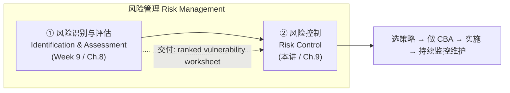
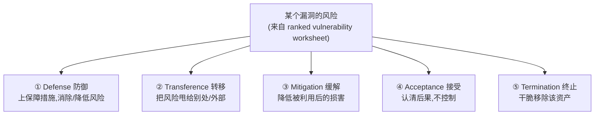
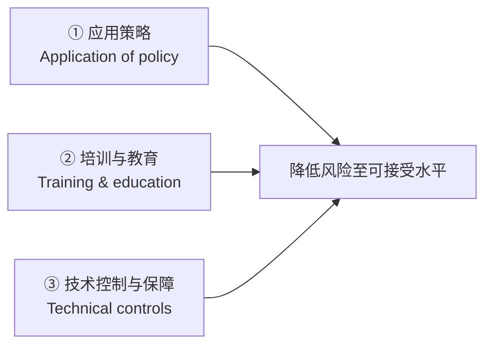
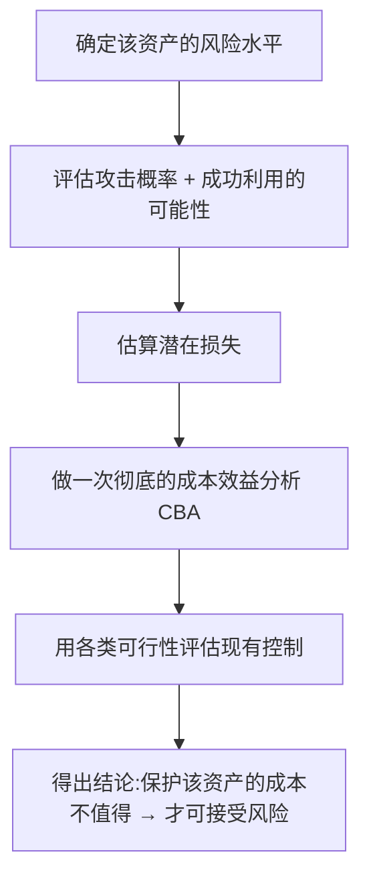
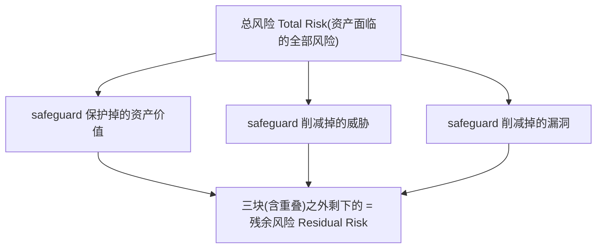
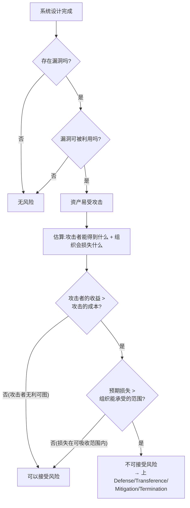
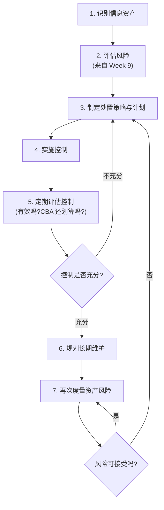

# Week 10 · 风险管理:控制风险 (Risk Management: Controlling Risk)

> **学习目标 (Learning objectives)** — 读完本章你应该能够:
> - **识别 (recognize)** 用来控制风险的五种**策略选项 (risk control strategies)**,并在给定背景信息时**从中挑选**最合适的一种或组合
> - **评估 (evaluate)** 各项风险控制,并套用现成的概念框架做一次**成本效益分析 (cost-benefit analysis, CBA)**
> - **解释 (explain)** 风险控制如何被**持续维护与延续 (maintain and perpetuate)**
> - **会算**:掌握 $\text{SLE}=AV\times EF$、$\text{ALE}=\text{SLE}\times ARO$、$\text{CBA}=\text{ALE}_{prior}-\text{ALE}_{post}-ACS$ 这一串公式——**讲者明确说这部分会在期末考的计算题中出现**
> - **了解 (describe)** 业界主流的风险管理方法论(OCTAVE / ISO / NIST / FAIR 等)

> 📎 **参考** — 本章对应教材 **Chapter 9**。它紧接上一讲(Week 9 / Chapter 8):上一讲做完**风险识别与评估**,交出了一张**排序漏洞风险工作表 (ranked vulnerability worksheet)**——把"有哪些风险、各有多严重"摆在了桌面上。本讲回答下一个问题:**拿到这张清单,到底该怎么办?**

风险管理是**两个正式流程**:上一讲的"识别与评估"找出并量化了风险,本讲的"控制 (risk control)"负责**处理**它们。先把我们站在整张地图的哪个位置看清楚:

---

## 一、为什么非控制不可:从"竞争优势"到"竞争劣势"

在动手讲五种策略之前,先要理解组织**为什么愿意花钱做安全**——这页(S3)看似务虚,却是整章的动机,也常被拿来出概念题。

IT 刚兴起的年代,企业上 IT 系统主要是为了**压倒对手**:谁先用上某种自动化手段,谁就能提供更优越的产品或服务,从而建立**竞争优势 (competitive advantage)**。但今天这套逻辑基本失效了——几乎所有竞争者都用着相近水平的自动化,尤其是近一两年 AI 技术的迅猛发展,整个 IT 行业的格局都在被改写。于是一个新概念浮出水面:**竞争劣势 (competitive disadvantage)**——**"落后于对手"的状态**。

> 📎 **拓展(超出 slides)** — 这个转变是本讲的思想钥匙。组织现在迅速吸纳新技术,**不再是为了取得优势,而是为了不丢市场份额**——是怕"落后"而非图"领先"。同理,投资信息安全也从"加分项"变成了"不做就出局"的底线。讲者借此点明:**安全开销不是奢侈品,而是维持竞争力的必需品。**

要在这种激烈竞争中立足,组织必须营造一个安全的环境,让业务流程能正常运转并持续演进。而这个环境必须守住信息安全的基本属性——**机密性 (confidentiality)、完整性 (integrity)、可用性 (availability)**,外加**隐私 (privacy)**。这些目标,正是通过**应用风险管理原则**来实现的。而控制风险的起点,就是**搞懂有哪些风险缓解策略、以及如何制定它们**。

---

## 二、五种风险控制策略 (Five Risk Control Strategies)

拿到上一讲的 ranked vulnerability worksheet 后,项目组必须为每条风险**从五种基本策略中选一种(或组合)**来应对。先把五个名字和一句话定义钉死,后面再逐一展开:

| 策略 | 一句话本质 | 关键词 |
|---|---|---|
| **Defense(防御)** | 上保障措施,**阻止**漏洞被利用 | 避免风险(risk avoidance) |
| **Transference(转移)** | 把风险**甩给**其他资产/流程/外部组织 | 外包、买保险 |
| **Mitigation(缓解)** | 一旦被利用,**减小**对资产的损害 | 计划与准备(IRP/DRP/BCP) |
| **Acceptance(接受)** | 认清后果,**啥也不做**、承受损失 | 必须是"理性"决定 |
| **Termination(终止)** | 干脆把资产从环境中**移除** | 不值得保护就别留 |

> 📎 **拓展(超出 slides)** — 讲者预告了 acceptance 的逻辑,值得先记:假如控制一个漏洞要花 **$100 万**,而漏洞被利用顶多损失 **$10 万**,那么"花大钱去控制"就不划算,理性的选择反而是**接受**这个风险。这就是为什么五种策略不能凭感觉选,而要靠后面的**成本效益分析 (CBA)** 来定夺——这条线索贯穿全章。

### 2.1 Defense(防御)——首选策略

**防御 (defense)** 试图从根本上**阻止漏洞被利用**,这是**首选 (preferred) 的做法**,因为它**在风险变成现实之前就规避掉**,而不是事后再去收拾。防御也常被叫作 **risk avoidance(风险规避)**,两个词可以互换使用。

防御通过三种手段实现,这三种正好串起了前面几讲的内容:

- **应用策略 (Application of policy)** —— 回忆第五讲(信息安全策略):策略让各级管理层得以**强制规定**某些流程必须执行。比如组织若想更严格地管控密码,可以出一条"所有 IT 系统必须设密码"的策略。**但光有策略往往不够。**
- **培训与教育 (Training & education)** —— 仅仅把新策略"通知"给员工,不足以保证遵守。意识、培训、教育(回忆 SETA 项目)才能真正改变最终用户的行为,营造更安全可控的环境。有效的管理,总是把策略变更与培训教育**配套**推行。
- **技术控制与保障 (Technical controls)** —— 在信息安全的日常实践里,光靠策略和培训通常还不够,**技术控制**(下一讲"保护机制"的主题)经常是有效降低风险的必需品。三者**配合使用**效果最佳:比如系统管理员把系统配置成在策略要求处使用**屏蔽密码 (masked password)**,前提是管理员既知道这个要求、又受过实施培训。

> 📎 **拓展(超出 slides)** — 讲者特别澄清一个分寸感:**彻底消灭某个威胁带来的风险,几乎是不可能的**;现实目标永远是"把风险降到可接受的水平"。这一点和后面的 residual risk(残余风险)、risk appetite(风险偏好)是同一个思想的不同侧面——**安全不是追求零风险,而是追求"够好"。**

### 2.2 Transference(转移)——把风险甩出去

**转移 (transference)** 试图把风险**挪到其他资产、其他流程或其他组织**身上。常见做法有:

- **重新设计服务的提供方式**(rethinking how services are offered)
- **修订部署模型**(revising deployment models)
- **外包给其他组织**(outsourcing)
- **购买保险**(purchasing insurance)—— 最常见的一招,本质就是把风险从自己的资产甩给**保险公司**
- **与供应商签订服务合同**(service contracts)

> **🔑 例(外包 Web 服务)** — 讲者用一个贴近现实的例子讲透转移:很多组织需要网站、域名注册、Web 托管等服务。与其自建服务器、自雇网管,中小型组织往往**雇一家专业的 Web 咨询公司**来做这一切。这样就把"管理复杂系统"的风险**转移给了更有经验的组织**。一个附带好处是:通过**服务级别协议 (Service Level Agreement, SLA)**,供应商要负责**灾难恢复 (disaster recovery)**、并保证服务器与网站的可用性。对一家中型组织来说,安全地托管和维护网站要耗费大量财力和人力,把风险转移出去常常是非常划算的。

> 📎 **拓展(超出 slides)** — 但**外包本身也有风险 (the risk of outsourcing)**。资产所有者、IT 管理层和 InfoSec 团队有责任**在出事之前**就确认:外包合同里关于灾难恢复的要求是否充分、是否真的能兑现。换句话说,转移风险不等于甩手不管——你把"执行"外包了,但"监督"的责任留在自己手里。

### 2.3 Mitigation(缓解)——准备好接招

**缓解 (mitigation)** 通过**计划与准备 (planning and preparation)**,减小一旦发生事故或灾难所造成的**损害**。它的成败取决于一个核心能力:**尽可能快地检测并响应攻击 (detect and respond as quickly as possible)**。

缓解依赖三类计划——这正是第四讲(应急规划 / contingency planning)学过的三大计划:

| 计划 | 全称 | 一句话作用 |
|---|---|---|
| **IRP** | Incident Response Plan(事件响应计划) | 攻击**正在发生时**怎么立刻处置 |
| **DRP** | Disaster Recovery Plan(灾难恢复计划) | 灾难**发生后**如何恢复系统与数据 |
| **BCP** | Business Continuity Plan(业务连续性计划) | 主场所瘫痪时如何**异地维持关键业务** |

> 📎 **拓展(超出 slides,呼应 Week 4)** — S8 是一张只有图的幻灯片,对应教材里 IRP/DRP/BCP 的对照表(描述、示例、何时部署、时间框架)。要点回忆:**IRP 在事件进行中即刻启动**(秒/分钟级);**DRP 在事件平息后启动**用于恢复(小时/天级);**BCP 在主站点不可用时启动**以维持运营(天/周级)。有些组织把 DRP 和 BCP 合称 **business resumption(业务恢复)计划**。三者的共同前提都是"事先做好计划",这正是 mitigation 与 defense 的区别:**defense 想方设法不让攻击发生,mitigation 承认攻击可能发生、提前准备好把损失压到最小。**

### 2.4 Acceptance(接受)——"理性地"啥也不做

**接受 (acceptance)** 是**决定不去保护**某资产、**承受**任何后续被利用所带来损失的策略。和 mitigation 的"准备好接招"形成鲜明对比——接受是**决定什么都不做**。

这里有个极其重要、爱考的分寸:

> **⚠️ 关键区分** — **无意识地承受风险(unconscious acceptance)不是一个有效的策略**,那只是疏忽。只有当组织**有意识地、做完功课之后**才决定接受,acceptance 才算一个站得住脚的正当策略。

那么,做完哪些"功课"才能正当地选择接受?这一串前置步骤要记(S9):

核心判据只有一句:**当控制的成本相对于"被利用时可能损失的金额"太过昂贵时,接受风险就是合理的策略选择。**(这正是 §2 开头那个"$100 万控制 vs $10 万损失"例子的逻辑落点。)

### 2.5 Termination(终止)——干脆不要了

**终止 (termination)** 和 acceptance 一样,都源于组织"选择不保护某资产"。但区别很关键:

> **⚠️ Acceptance vs Termination** — **Acceptance** 是把资产**留在**有风险的环境里、承受风险;**Termination** 是**把资产从有风险的环境中移除**,让它不再暴露。

什么时候选终止?当**保护一个资产的成本超过了它的价值**,或者保护它太难、太贵时。

> **🔑 例** — 一个资产只值 \$100,但保护它要花 \$1000,显然不值得——那就干脆把它移除。

> **⚠️ 易错点** — 终止必须是一个**有意识的业务决策 (conscious business decision)**,而**不是单纯地抛弃资产**。如果只是"不管了、放着烂",那在技术上其实落回了 acceptance(而且很可能是无意识的那种,不正当)。区别在于:终止是"经过权衡后主动撤下",抛弃是"无人决策的放任"。

---

## 三、两个贯穿全章的核心概念:风险偏好与残余风险

选完策略之后,要理解两个把"控制到什么程度"说清楚的概念。它们是后面所有判断的标尺。

### 3.1 风险偏好 (Risk Appetite)

**风险偏好 (risk appetite)**,又叫**风险容忍度 (risk tolerance)**,指组织在权衡**"完美安全"与"无限可用"**这对矛盾时,**愿意接受的风险的数量和性质**。

> 📖 **为什么是一对矛盾** — 安全和可用天然对立:控制加得越多越安全,但信息也越难用、成本越高。风险偏好就是组织为这对矛盾找的那个平衡点。**理性的风险态度,是让"财务与可用性上的开销"和"被利用时可能的损失"相平衡。**

> **🔑 例(不同组织偏好天差地别)** —
> - 一家受政府监管、本性保守的**金融服务公司**,可能会施加每一项合理的控制、甚至一些**侵入性**的控制,只为保护信息——它的风险偏好极低。
> - 一家**防火墙厂商**可能配置远超必要的严苛防火墙规则,因为"自己被黑"这件事会**重创它的市场声誉**。
> - 而另一些组织则可能**出于无知**去承担危险的风险——这就是反面教材。

### 3.2 残余风险 (Residual Risk)

当漏洞已经被**尽可能地控制**之后,通常仍会**剩下一部分没被完全消除、转移或计划掉的风险**——这就是**残余风险 (residual risk)**。

> 📖 **定义** — 残余风险是 **threats(威胁)、vulnerabilities(漏洞)、assets(资产)三者的综合函数,再减去现有保障措施 (safeguards) 的作用效果**。用大白话:`残余风险 = 总风险 − 各项 safeguard 挡掉的部分`。

讲者用 S12 右侧那张图讲清了它的几何直觉:

把"资产价值被保护的部分""威胁被削减的部分""漏洞被削减的部分"这三块(它们彼此还有重叠)从总风险里扣掉,**剩下没被任何 safeguard 覆盖的,就是残余风险。**

### 3.3 风险处置的目标:不是清零,而是对齐风险偏好

这是本讲最反直觉、也最重要的一句话(S13),务必背下来:

> **🎯 核心命题** — **信息安全的目标不是把残余风险降到零,而是把它降到与组织风险偏好 (risk appetite) 相一致的水平。**

为什么?因为追求零风险既不可能、也不经济。判定"安全工作做到位了"的标准其实是一个**治理 (governance)** 标准:

> 如果决策者**已被告知**那些未受控的风险,而**恰当的权责群体 (proper authority groups)** 在了解情况后**决定让这些残余风险留在原地**,那么信息安全项目就已经**达成了它的首要目标**。

换句话说,安全团队的职责不是"消灭所有风险",而是"把风险讲清楚、交给有权的人做知情决策"。剩下的风险只要是被**知情批准**留下的,就算尽到了责任。

---

## 四、怎么选策略、怎么持续维护

### 4.1 接受还是治理?一张决策流程图

讲者用 S13 左侧的流程图,把"何时可以接受风险、何时必须上其他策略"讲成了一套可操作的判断链。这张图把前面零散的概念串成了决策树,值得吃透:

> **🔑 例(攻防之间的博弈)** — 假设攻击者通过涂改你的网站只能获利 **\$1000**,但发动这次攻击要花 **\$10000**。站在攻击者角度,**成本远超收益**——任何理性的对手都不会干。于是站在组织角度,这个风险**可以接受**:对手攻得越多亏得越多。这就是判据"攻击者收益 < 攻击成本 → 可接受"的由来。

### 4.2 选策略的四条经验法则 (S14)

选策略时要牢记两个主导变量:**压力/威胁的大小**和**资产的价值**。在此基础上,有四条经验法则:

| 情形 | 应采取的控制 |
|---|---|
| **漏洞存在**(资产有缺陷/弱点) | 上安全控制,**降低漏洞被利用的可能性** |
| **漏洞可被利用** | 上**分层控制 (layered controls)**——架构设计 + 管理控制,最小化风险或阻止攻击发生 |
| **攻击者潜在收益 > 攻击成本** | 上技术/管理控制,**抬高攻击者的成本**或**压低其收益** |
| **潜在损失巨大** | 上**设计控制 (design controls)**,限制攻击波及的范围,减少可能的损失 |

> 📎 **拓展(超出 slides)** — 第三条本质是把攻防看成一场**博弈**:你要么让攻击变得很贵(增加攻击者成本),要么让攻击的战利品变得很少(降低其收益)。分层控制之所以有效,是因为攻击者突破一层后还要面对下一层——既抬高了成本,又(若内层限制了破坏范围)压低了收益。

### 4.3 风险控制循环 (Risk Control Cycle)

策略一旦选定并实施,**不是一锤子买卖**。控制必须被**持续地监控和度量 (monitored and measured on an ongoing basis)**,以判断其有效性、并不断更新对残余风险的估计。S15 的循环图说明了这是个**周而复始**的过程:

实践中,每个在风险评估阶段被记录下来的信息资产,都应配一份**有文档的控制策略 (documented control strategy)**,清楚写明:执行控制后**仍剩下哪些残余风险**、用了哪一种(或哪几种组合的)降险策略、并通过引用**可行性研究**来论证为什么这样选。组织还应为每个资产把控制策略选择的结果落成一份**行动计划 (action plan)**:每项任务都有明确的**责任人(落到某个组织单元或个人)**,可能还包含软硬件需求、预算估计和详细时间表。

---

## 五、可行性与成本效益分析 (Feasibility & CBA)——本讲的计算核心

> **🎯 考试提醒(讲者原话)** — "**计算会在期末考中出现**。"本节的 SLE / ALE / CBA 公式是本科目仅有的两组计算练习之一(另一组是 Week 9 的风险评分公式)。**务必背熟公式、动手多练几遍。**

### 5.1 可行性的总思路与"成本规避"

在为某个具体的"资产-漏洞"组合定策略**之前**,组织必须把这个漏洞被利用所带来的**经济与非经济后果**摸清楚,核心是回答一个问题:

> **"实施这项控制的(实际与感知的)好处,相比不实施的(实际与感知的)坏处,到底划不划算?"**

判断一项控制好处的**主要依据**,是它所要保护的**信息资产的价值**。这里引入一个术语:

> 📖 **成本规避 (Cost avoidance)** — 通过实施控制(即采用 defense 策略)而**省下来的钱**——也就是因为避免了事故,从而避免掉的财务后果。

### 5.2 经济可行性 = 成本效益分析 (CBA)

评估一个安全控制项目时,**最常用的判据**是**经济可行性 (economic feasibility)**。这个决策过程就叫**成本效益分析 (Cost-Benefit Analysis, CBA)**,也叫**经济可行性研究 (economic feasibility study)**。

它的出发点是一句常识:

> **🧭 黄金法则** — **组织花在保护一个资产上的钱,不应超过这个资产本身的价值。** ("should not spend more to protect an asset than it is worth.")

> 📎 **拓展(超出 slides)** — 讲者反复强调"reasonable(合理)"是**相对的**:同一笔安全开销,有的经理觉得合理,换个视角的经理就觉得离谱。这正是为什么需要 CBA 这种**量化工具**——把"贵不贵"从主观争论变成可计算的数字。

做 CBA 要先搞清三件事:**成本 (cost)、收益 (benefit)、以及怎么分析**。

### 5.3 成本 (Cost):一项 safeguard 要花多少钱

正如"信息的价值"难以确定,"保护它的成本"同样难算。影响一项 safeguard 成本的因素有(S18):

- **开发或采购成本** —— 硬件、软件、服务的获取
- **培训费 (training fees)** —— 培训相关人员的开销
- **实施成本 (implementation)** —— 安装、配置、测试硬件/软件/服务
- **服务成本 (service costs)** —— 供应商的维护与升级费用
- **维护成本 (maintenance)** —— 验证、持续测试、维护、培训、更新所投入的人力

### 5.4 收益 (Benefit) 与 ALE

**收益 (benefit)** 是:组织通过使用控制来**防止某个特定漏洞造成损失**而获得的价值。它的算法是——先给"被该漏洞暴露的资产"估值,再判断其中**有多少价值处于风险中、风险有多大**。最终,这个收益用一个关键指标来表达:

> 📖 **ALE = Annualized Loss Expectancy(年度化损失期望)** —— 一个漏洞预计**每年**会给组织造成的损失金额。它是连接"资产价值"和"成本效益"的桥梁,后面会算到它。

### 5.5 资产估值 (Asset Valuation)——CBA 的地基

CBA 的第一步是**资产估值**:给每个信息资产赋一个**财务价值**。同一份信息在不同组织、甚至同一组织内部,价值都可能不同。资产估值要估算的是与设计、开发、安装、维护、保护、恢复、以及防范损失与诉讼相关的**真实或感知成本**。

> 📎 **拓展(超出 slides)** — 讲者坦言:**精确确定信息的真实价值几乎是不可能的**——这也是为什么连保险公司至今都没有一张权威的"信息估值表"。所以现实中**估计 (estimation)** 往往是唯一可行的方法。资产估值可以直接复用上一讲风险识别阶段做的资产评估成果。

资产价值由一组**组成成分 (valuation components)** 拼成,这套清单要能复述(S21–S22):

| 估值成分 | 含义 | 讲者举的例子 |
|---|---|---|
| **创建成本** Value from cost of creating | 创建/获取这份信息花了多少 | 多媒体培训软件:每 1 小时内容需 250 小时开发,成本可达 **\$10,000/小时**(注:AI 时代有望大幅降低) |
| **过往维护成本** From past maintenance | 投入运维的累计成本 | 每花 \$1 开发,后续维护往往要花掉更多 |
| **替换成本** Implied by replacing | 重建/恢复信息要花多少 | 从备份、日志、纸质副本重建;若无日志,实时数据可能根本无法恢复,重建甚至比当初创建还久 |
| **提供成本** From providing | 把信息送达需要它的用户的成本 | 数据库、网络、软硬件等交付基础设施 |
| **保护成本** From protecting | 保护这份信息已花的钱 | 保护成本与资产价值互相决定(一个循环) |
| **对所有者的价值** Value to owners | 对持有人意味着什么 | 你的驾照号、电话号对你值多少? |
| **知识产权价值** IP value | 专利、商业秘密、品牌 | 一个 logo、一句广告语、一种新口味奶酪值多少? |
| **对对手的价值** Value to adversaries | 竞争对手想知道你的情报 | 很多组织专设部门评估竞争对手动向 |
| **停摆时的生产力损失** Loss of productivity | 资产不可用时员工干等 | 停电时即便有 UPS 防数据丢失,员工也**无法创造新信息** |
| **停摆时的收入损失** Loss of revenue | 资产不可用时做不成生意 | 信用卡刷不出、超市 UPC 扫码系统宕机就卖不了货 |

> **🔑 例(估值之难)** — 有些成本好算(换一台网络交换机的钱);有些几乎算不出(产品信息**过早泄露**导致的市场份额损失值多少钱?)。更复杂的是,信息会随时间**获得超过其内在价值的价值 (acquired value)**——这个更高的"获得价值"在多数情况下才是更恰当的估值。

### 5.6 SLE:单次损失期望

资产估完值,就能算**潜在损失**了。先问三个问题(S23):会发生什么损失、财务影响多大?恢复要花多少(在损害之外)?每个风险的**单次损失期望**是多少?

> 📖 **SLE = Single Loss Expectancy(单次损失期望)** —— 某次特定攻击**发生一次**最可能造成的损失价值。

$$\boxed{\;\text{SLE} = AV \times EF\;}$$

| 符号 | 含义 |
|---|---|
| $AV$ | **Asset Value(资产价值)**,来自上面的资产估值 |
| $EF$ | **Exposure Factor(暴露因子)**,某漏洞被利用会造成的**损失百分比** |

> **🔑 例(网站,贯穿全节)** — 一个网站经资产估值定为 **\$1,000,000**。一次蓄意破坏/涂改 (sabotage/vandalism) 的场景估计会毁掉网站的 **10%**(即 $EF=0.10$)。那么:
> $$\text{SLE} = \$1{,}000{,}000 \times 0.10 = \$100{,}000$$
> (注意:这些数都是**估计值**。)

### 5.7 ARO 与 ALE:从单次到全年

光知道单次损失还不够,还要知道这种攻击**一年大概发生几次**:

> 📖 **ARO = Annualized Rate of Occurrence(年度化发生率)** —— 某类攻击在**一年内**预计成功的次数(也即"在给定时间窗内发生损失的概率/频次")。

ARO 的换算很直接,务必会做**单位换算**:

| 攻击频率描述 | ARO |
|---|---|
| 每 **2 年**成功一次(如某种蓄意破坏) | **0.5** |
| 每 **6 个月**一次 | **2** |
| 每 **1 个月**成功一次(如某种网络攻击) | **12** |
| 每 **20 年**一次(如洪水毁楼) | **0.05** |

> 📎 **拓展(超出 slides)** — 估计 ARO 比估计资产价值**更难**:没有现成的表格告诉你某种攻击多久发生一次。少数情况有数据可查(比如特定地区、特定建筑结构遭龙卷风/雷暴的概率,保险公司有精算表;房产市场对洪水、山火、热点区域风险也记录得不错),但**大多数情况下,组织只能靠自己的内部记录来估**,而且这些记录往往很粗糙——所以 ARO 通常也是**估计值**。

把单次损失和年发生率一乘,就得到全年的损失期望:

$$\boxed{\;\text{ALE} = \text{SLE} \times ARO\;}$$

> **🔑 例(接着上面的网站)** — SLE = \$100,000,这种严重攻击约每两年一次,即 $ARO=0.5$:
> $$\text{ALE} = \$100{,}000 \times 0.5 = \$50{,}000$$
> **含义:这个组织预计每年因这个漏洞损失 \$50,000**——除非它加强网站安全。加了控制,损失会下降,但**控制本身也有成本**,于是引出 CBA。

### 5.8 CBA 公式:控制到底值不值

CBA 用来判定一个控制方案**是否值得它的成本**。它可以在控制**实施前**算(决定要不要上),也可以在控制**运行一段时间后**算(随着观测积累,估计会越来越精确)。最常用的算法直接基于 ALE:

$$\boxed{\;\text{CBA} = \text{ALE}_{prior} - \text{ALE}_{post} - ACS\;}$$

| 项 | 含义 |
|---|---|
| $\text{ALE}_{prior}$ | **实施控制之前**的年度化损失期望 |
| $\text{ALE}_{post}$ | 控制运行一段时间**之后**的 ALE |
| $ACS$ | **Annual Cost of the Safeguard**,该保障措施的**年度成本** |

**怎么读结果**:`CBA > 0` → 控制带来的损失下降盖过了它的成本,**值得保留**;`CBA < 0` → 成本盖过收益,**这个控制不划算,别上**。

> **🔑 例(同一控制,两种成本)** — 设 $\text{ALE}_{prior}=\$50{,}000$,加控制后 $\text{ALE}_{post}=\$20{,}000$:
> - 若年成本 $ACS=\$10{,}000$:$\;\text{CBA}=50{,}000-20{,}000-10{,}000 = \mathbf{+\$20{,}000}$ → **正,值得做**。
> - 若年成本 $ACS=\$40{,}000$:$\;\text{CBA}=50{,}000-20{,}000-40{,}000 = \mathbf{-\$10{,}000}$ → **负,别做**(再上反而每年多亏 \$10,000)。

### 5.9 一道完整的考题级例题(讲者亲算,S28)

这是把上面所有公式串起来的范例,**考试很可能照此出题**,请把每一步都看懂:

> **题目** — 某资产(数据)价值 **\$50K**;威胁是**病毒**,估计造成 **30%** 的损害;发生频率 **每 6 个月一次**。拟上的控制是**杀毒软件**,成本 **\$10K**;装了杀毒软件后,发生频率降为 **每年一次**。问:这个控制值不值?能省多少钱?

**第一步 — 算 SLE**(无论装不装控制,单次损失不变):
$$\text{SLE} = AV \times EF = \$50\text{K} \times 30\% = \$15\text{K}$$

**第二步 — 算 $\text{ALE}_{prior}$**(装控制前,每 6 个月一次 → $ARO=2$):
$$\text{ALE}_{prior} = \text{SLE} \times ARO = \$15\text{K} \times 2 = \$30\text{K}$$

**第三步 — 算 $\text{ALE}_{post}$**(装控制后,每年一次 → $ARO=1$):
$$\text{ALE}_{post} = \$15\text{K} \times 1 = \$15\text{K}$$

**第四步 — 套 CBA**($ACS=\$10\text{K}$):
$$\text{CBA} = \text{ALE}_{prior} - \text{ALE}_{post} - ACS = \$30\text{K} - \$15\text{K} - \$10\text{K} = \mathbf{+\$5\text{K}}$$

**结论:CBA = +\$5K > 0,所以这个控制值得上,每年净省 \$5K。**

> 📎 **解题套路(记牢)** — 见到这类题,**永远是四步**:① $\text{SLE}=AV\times EF$ → ② 把"每隔多久一次"换算成 $ARO$,算控制**前**的 $\text{ALE}_{prior}$ → ③ 用控制**后**的新频率算 $\text{ALE}_{post}$ → ④ 代入 $\text{CBA}=\text{ALE}_{prior}-\text{ALE}_{post}-ACS$,看正负。最容易出错的一步是**频率→ARO 的换算**(每半年=2,每月=12,每两年=0.5),务必小心。

---

## 六、其他可行性方法与替代方案

CBA 只是**经济可行性**这一种。在判断"组织是否准备好引入某项控制"时,还要从另外四个角度评估可行性(S29–S30):

| 可行性类型 | 它回答的问题 | 讲者的例子 / 要点 |
|---|---|---|
| **Organizational(组织可行性)** | 这控制对组织的运营、效率、**战略目标**有贡献吗? | 大学上了新防火墙却**屏蔽了流媒体**,而远程教学正是其战略目标之一——这就**不满足组织可行性**,该改或换 |
| **Operational(操作可行性)** | 用户和管理层是否**接受并支持**?满足利益相关者需求吗? | 又叫**行为可行性 (behavioral feasibility)**;靠**沟通、教育、参与 (communication, education, involvement)** 争取用户认同。用户不接受就会想办法绕过它 |
| **Technical(技术可行性)** | 组织**有没有/能不能获得**实施和支持它的技术与人才? | 有没有支撑新防火墙的软硬件?有没有合格人员安装管理?能否抽人去培训,还是得另招人? |
| **Political(政治可行性)** | 在各利益群体的**共识和关系**下,什么能做、什么不能做? | 涉及**预算分配**:有的组织给 InfoSec 独立预算,有的要 InfoSec 在 IT 内部与人**竞争资源**,这时 CBA 等论证就用来做理性决策 |

### 替代方案:不做可行性分析时怎么办 (S31)

有时组织不用 CBA 或其他可行性测算,而是诉诸**替代模型**来论证控制的正当性:

- **Benchmarking(基准比较)** —— 研究其他组织的做法来对标;可用**指标型 (metrics-based)** 或**过程型 (process-based)** 度量
- **Due care & due diligence(尽职关注与尽职调查)** —— 采用任何审慎组织在类似情形下都会采取的**最低安全水平**
- **Best business practices(最佳业务实践)**
- **Gold standard(黄金标准)** —— 业界标杆级实践
- **Government recommendations(政府建议)**
- **Baselining(基线)**

---

## 七、业界主流的风险管理方法论(了解即可)

> **🎯 考试提醒(讲者原话)** — "这些替代方法论**不在考试范围 (not examinable)**,但值得了解,以建立对风险管理更全面的认识。"前面我们讲的流程主要遵循 **NIST** 的框架,但业界还有不少其他方案:

| 方法论 | 出处 / 提出者 | 一句话特征 |
|---|---|---|
| **OCTAVE** | CERT 协调中心(www.cert.org) | Operationally Critical Threat, Asset, and Vulnerability Evaluation;在"保护关键资产"与"防护/检测控制成本"之间求平衡,可对标公认良好实践 |
| **Microsoft 风险管理法** | Microsoft | 主张风险管理**不是独立学科**,应嵌入整体治理项目;目的是给安全风险**排序和管理** |
| **ISO 27005:2022** | ISO | 为满足 **ISO 27001** 中应对信息安全风险的要求提供指南 |
| **ISO 31000** | ISO(以 **AS/NZS 4360:2004** 为基础) | 提供风险管理的原则、框架和流程;适用于任何类型(企业/财务/环境)风险 |
| **NIST RMF** | NIST | **SP 800-39**(组织/任务/系统三层视角的整体方法)+ **SP 800-37 Rev.1**(把 RMF 应用于联邦系统的安全生命周期方法,强调把安全能力内建进系统) |
| **FAIR** | Jack A. Jones 提出 | Factor Analysis of Information Risk;帮助组织理解、分析、**度量**信息风险 |
| **Mitre** | 非营利组织 Mitre | 四步法:风险识别 → 风险影响评估 → 风险优先级分析 → 风险缓解规划/实施/监控(高层思想与本课相同,只是切分略异) |
| **ENISA** | 欧盟网络与信息安全署 | 提供工具,供用户**比较**各种风险管理方法和工具 |
| **New Zealand's IsecT Ltd.** | 新西兰独立咨询机构 | 治理、风险管理与合规(GRC)咨询 |

> 📎 **拓展(超出 slides)** — 一条值得记住的线索:**ISO 31000 的根基是澳大利亚/新西兰标准 AS/NZS 4360:2004**——而 AS/NZS 4360 正是上一讲(Week 9)定性风险评估"可能性×后果"矩阵的来源。这条线把两讲的"评估"与"控制"在标准层面连了起来。

---

## 本章小结 (Key takeaways)

- **本讲定位**:风险管理的第二阶段——**控制风险**。承接上一讲的 ranked vulnerability worksheet,回答"拿到风险清单后怎么办";对应教材 **Chapter 9**。
- **驱动力**:从追求**竞争优势**转为避免**竞争劣势**——做安全已是维持竞争力的底线,目标是守住 **CIA + 隐私**。
- **五种控制策略**(必背):**Defense**(阻止利用,=risk avoidance,首选)、**Transference**(转移给外部,如外包/保险)、**Mitigation**(降损,靠 IRP/DRP/BCP)、**Acceptance**(理性地接受,**无意识接受不算数**)、**Termination**(直接移除资产)。
- **Acceptance vs Termination**:接受 = 把资产**留在**风险中承受;终止 = 把资产**移出**风险环境。两者都须是**有意识的业务决策**。
- **风险偏好 (risk appetite)** = 组织愿接受的风险量,平衡"完美安全 vs 无限可用";**残余风险 (residual risk)** = 用尽控制后仍剩的风险。
- **🎯 最重要的一句**:信息安全的目标**不是把残余风险降到零**,而是降到**与风险偏好一致**的水平;只要未控风险被**知情批准**留下,安全项目就达标了。
- **选策略四法则**:漏洞存在→降可能性;可被利用→分层控制;攻击者收益>成本→抬高其成本/压低其收益;损失巨大→设计控制限制波及范围。
- **控制是循环**:选定后要**持续监控度量**,不充分则回到开发阶段——风险控制是 ongoing process,不是一锤子买卖。
- **🎯 计算核心(必考,会算)**:
  - $\text{SLE} = AV \times EF$(单次损失 = 资产价值 × 暴露因子)
  - $\text{ALE} = \text{SLE} \times ARO$(年损失 = 单次损失 × 年发生率;频率→ARO 换算:每半年=2,每月=12,每两年=0.5)
  - $\text{CBA} = \text{ALE}_{prior} - \text{ALE}_{post} - ACS$(>0 值得做,<0 别做)
- **可行性五视角**:economic(=CBA)、organizational、operational(=behavioral)、technical、political;**替代方案**:benchmarking、due care/due diligence、best practices、gold standard、government recommendations、baselining。
- **方法论(不考但了解)**:OCTAVE、Microsoft、ISO 27005/31000、NIST RMF(SP 800-39/800-37)、FAIR、Mitre、ENISA、NZ IsecT;注意 **ISO 31000 源自 AS/NZS 4360**,与上一讲定性矩阵同源。
- **📅 考试信息(讲者提醒)**:期末考 **6 月 17 日**;**计算题一定会考**,务必练熟 SLE/ALE/CBA。
