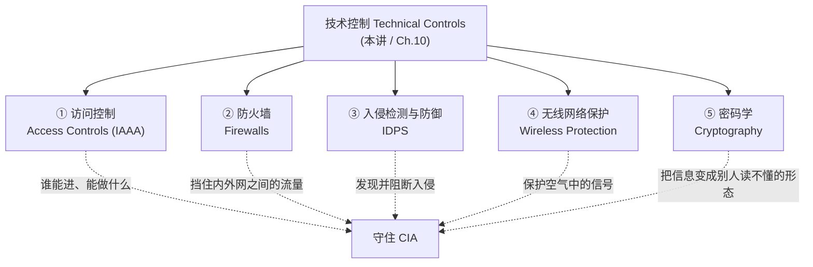
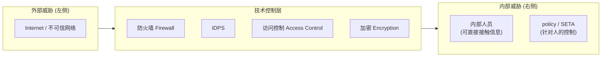
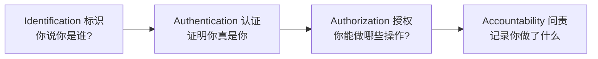
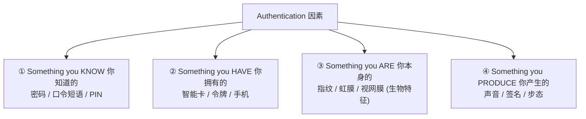
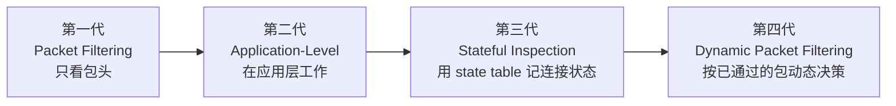
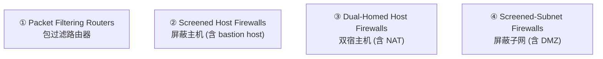
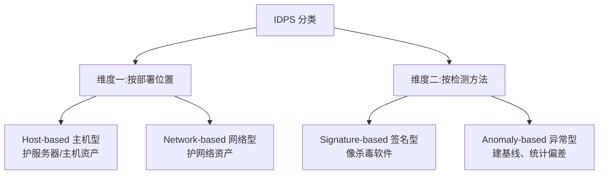
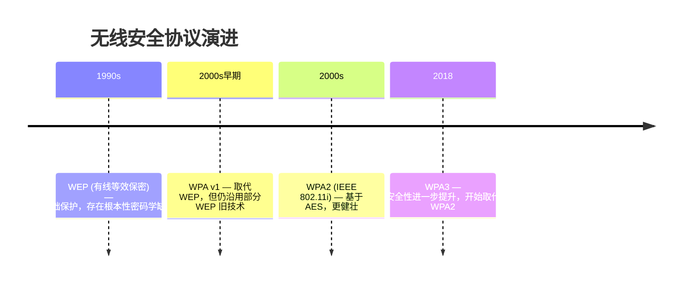
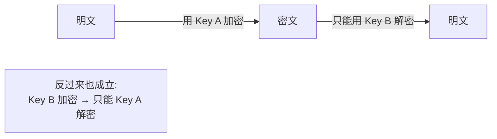
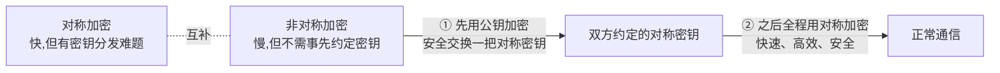

# Week 11 · 保护机制 (Protection Mechanisms)

> **学习目标 (Learning objectives)** — 读完本章你应该能够:
> - **描述 (describe)** 各种**访问控制 (access control)** 方法,包括 **authentication(认证)、authorization(授权)** 以及基于 **biometric(生物特征)** 的访问控制,并特别理解当下热门的 **multi-factor authentication(多因素认证,MFA)**
> - **识别 (identify)** 各类 **firewall(防火墙)** 及其常见的部署架构 (implementation approaches)
> - **识别并描述 (identify & describe)** 各类 **intrusion detection systems(入侵检测系统,IDS/IDPS)** 及其依赖的检测策略
> - **解释 (explain)** 无线网络 (wireless network) 的保护手段
> - **解释 cryptography(密码学)与 encryption(加密)** 的过程,并能**对比 (compare & contrast)** symmetric(对称)与 asymmetric(非对称)两类加密

> 📎 **参考** — 本章对应教材 **Chapter 10**,是整门课"技术控制 (technical controls)"的核心一讲。前两讲(Week 9 / 10)讲的是**风险管理**——找出风险、量化风险、选策略控制风险。本讲回答其中一个具体问题:当你决定用 **Defense(防御)** 策略去"上保障措施"时,**手里到底有哪些技术武器?** 答案就是这一长串:访问控制、防火墙、IDPS、无线保护、加密。

在动手之前,先把本章在整门课里的位置和内部结构摆清楚:



---

## 一、引言:技术控制的定位 (S2–S4)

### 1.1 技术控制是"必要但不充分"的

整章的第一句话定调:**technical controls(技术控制)是任何信息安全方案不可或缺的一部分,但单靠它们守不住整个 IT 环境。** 这两句话要一起记——少了任一半都会被出题挑错:

- **不可或缺 (essential)**:几乎所有信息安全方案都离不开技术控制。
- **不充分 (insufficient if used alone)**:必须配合**健全的政策 (sound policy)** 和 **教育、培训、意识 (education, training, and awareness, 即 SETA)** 一起用。

本章会讲到的技术安全机制有:access controls、firewalls、dial-up protection(拨号保护)、intrusion detection systems、scanning and analysis tools(扫描分析工具)、encryption systems。

> 📎 **拓展(超出 slides)— 讲者的"密码政策"例子,极好理解"为什么技术控制不可替代"**
> 像 UOW 这样的大组织都有**密码政策 (password policy)**:规定密码多长、必须含大写/小写/数字/特殊符号中的至少三类、多久必须改一次、禁止用旧密码。问题来了——**你没法靠"挨个问员工有没有照做"来执行这条政策**,因为密码属于隐私、根本无从核实。这时一个非常简单的**技术控制**(在系统里设一条规则,不满足强度就不让设密码)就把政策落地了。
> 一句话总结讲者的观点:**在人的行为难以监管的地方,技术控制能把政策强制执行下去 (enable policy enforcement where human behavior is difficult to regulate)。**

### 1.2 安全球面 (Sphere of Security)

**Sphere of Security(安全球面)** 是一张示意图,展示技术控制可以部署在技术基础设施的**多个点位**上。它的关键不在画面本身,而在它揭示的一个对称结构:



- **左侧**画的是抵御**组织外部威胁**的控制(IDPS、访问控制、加密等)。
- **右侧**画的是抵御**组织内部威胁**的控制。讲者特别强调:**内部人员往往能直接接触信息,可以绕过 (circumvent) 许多最强的技术控制**——所以右侧还画了针对"人"这一要素的控制(政策、SETA)。

> **本节小结**:技术控制 = 必要 + 不充分;必须配 policy 与 SETA;Sphere of Security 一图说明"内外威胁需要不同侧重的控制",且内部人员能绕过技术控制。

---

## 二、访问控制 IAAA (S5–S13)

### 2.1 四个过程:IAAA

**Access control(访问控制)** 的目标是:**规范用户进入组织"可信区域"的准入**——这个可信区域既可以是**逻辑的 (logical)**(系统、数据),也可以是**物理的 (physical)**(机房、办公区)。一套成功的访问控制由**四个过程**构成,首字母合称 **IAAA**:



| 过程 | 一句话定义 | 回答的问题 |
|---|---|---|
| **Identification(标识)** | 获取请求访问的实体的身份 | "你**声称**你是谁?" |
| **Authentication(认证)** | **确认**请求访问的实体的身份 | "你**真的**是你声称的那个人吗?" |
| **Authorization(授权)** | 确定该实体在该区域内**能执行哪些操作** | "你**能做什么**?" |
| **Accountability(问责)** | 记录已授权个人和系统的活动 | "你**做了什么**?(留痕)" |

> ⚠️ **必考要点**:一套成功的访问控制方案**总是同时包含全部四个要素**("always incorporates all four elements")。别把 IAAA 记成三个或漏掉 Accountability。

### 2.2 标识 Identification (S6)

**Identification** 是一种**为请求访问的未验证实体提供信息**的机制。这个未验证实体有个专门名字叫 **supplicant(申请方)**。贴在 supplicant 身上的标签叫 **identifier(标识符,简称 ID)**,它必须满足:

- **唯一 (unique)**——能映射到安全域 (security domain) 内**有且仅有一个**实体。

ID 的形式有两种常见做法:
- **复合 ID (composite ID)**:把部门代码、特殊字符、随机数等拼接起来,保证唯一。
- **单一信息**:直接用姓名首字母 + 姓氏 (first initial + surname) 之类。

> 📎 **拓展(超出 slides)— 讲者举的"什么能当 ID"例子**:姓名+生日+地址的组合、email、社会安全号、银行账号;在大学里就是**学号 (student number)**,教职工则是**工号 (staff number)**。注意:在 UOW 里每人有**多个**唯一 ID(学号是唯一的,email 也是唯一的)。

### 2.3 认证 Authentication —— 四类因素 (S7–S10)

**Authentication** 是**验证 supplicant 所声称身份**的过程。它依赖**四类认证因素 (authentication factor types)**:



| 因素 | 本质 | 例子 |
|---|---|---|
| **Something you know** | 静态的、你脑子里记着的 | password、passphrase、PIN |
| **Something you have** | 你能证明自己拥有的实物 | 智能卡、cryptographic token、手机 |
| **Something you are** | 你身上**固有 (inherent)** 的生物特征 | 指纹、视网膜/虹膜扫描 |
| **Something you produce** | 你**做出来/产生**的东西(非固有但可靠) | 签名、声纹,讲者还提到**步态 (gait)** |

#### 强认证 = 多因素认证 (MFA)

**Strong authentication(强认证)** 的定义很硬核:**至少使用两种不同的认证因素类型**——这就是 **Multi-factor Authentication(多因素认证,MFA)**。

> 📎 **拓展(超出 slides)— 两个一定要会复述的现实例子**
> - **e-banking(网银)**:登录时用 ID + PIN(你知道的);要做转账时,系统再要一个**一次性密码 (one-time password, OTP)**,发到你的 token 或注册手机(你拥有的)。"查看余额"也许只要一个因素,"发起交易"就强制升级到两个/多个因素。
> - **UOW 登录(讲者说实际上用了 3 个因素)**:① 输入 UOW 给的用户名+密码(know);② 屏幕弹出一个两位数,你要在手机的 Authenticator 应用(如 Outlook)里输入它确认(have);③ 解锁手机本身可能还要指纹(are)。三个因素叠加,认证平台才足够 **robust(健壮)**。

#### ① Something you know:密码与口令短语 (S8)

- **Password(密码)**:只有用户本人应该知道的私密字符组合。
- **Passphrase(口令短语)**:一句通常比密码更长的**自然语言短语**,由它**派生 (derive)** 出一个**虚拟密码 (virtual password)**。
- 推荐强度:**至少 10 个字符**,至少含一个数字和一个特殊字符。

> 📎 **拓展(超出 slides)— 区块链钱包的 seed phrase 例子**:钱包不让你背一长串乱码,而是给你 12 或 24 个**助记词 (passphrase)**,系统据此生成真正的密钥。这正是"passphrase 派生 virtual password"的现实写照。

> 📎 **拓展(超出 slides)— 关于 entropy(熵)与暴力破解时间,讲者花了很长篇幅**
> **Entropy(熵)= 密码的不可预测程度**。麻烦在于人类偏爱低熵密码(生日、名字、家人名),于是攻击者的"字典"小得多、很快就能猜中。幻灯片右侧那张表的逻辑是:
> - 只用大小写不敏感的标准字母、长度 8 → 约 2080 亿种组合,人手工试不可能,但**普通电脑约 0.5 秒**就破了;长度 10 约 5 分钟,长度 14 约 46 年。
> - 一旦**区分大小写 + 加数字 + 加特殊符号**,同样长度耗时陡增:长度 8 要 1 小时多,长度 10 约 1 年,长度 12 约 6500 年,长度 16 在"随机"假设下要约 **3 亿年**(约为地球年龄的上百倍)。
> 核心规律(常被出概念题):**密码强度每增加一点,攻击者所需时间呈指数级 (exponentially) 增长。**

#### ② Something you have:卡与令牌 (S9)

用户或系统**所拥有的实物**。例子从简到繁:
- **dumb card(哑卡)**:带磁条的卡,如 ATM 卡。
- **smart card(智能卡)**:卡里含处理器。
- **cryptographic token(密码令牌)**:卡里有处理器**且带显示屏**。
- 令牌可分**同步 (synchronous)** 或 **异步 (asynchronous)** 两种。

> 📎 **拓展(超出 slides)— 硬件令牌的"离线生成 OTP"巧思**:约 15 年前银行普遍发**硬件令牌**,平时离线放着;转账时系统要 OTP,你按一下令牌(只要还有电),即便不联网,它也能给出一个六位 PIN 让你成功认证。讲者赞它是"让离线令牌与在线系统对上暗号"的精巧设计。如今多被 **Google/Microsoft Authenticator 等认证器 App** 取代——一个 App 可同时维护对多个平台的 PIN 生成。

#### ③ Something you are / ④ Something you produce (S10)

- **Something you are(生物特征,biometrics)**:扫描人体特征,转换图像以提取 **minutiae(细节特征点)**——这些唯一参考点被数字化并以**加密格式存储**。
- **Something you produce**:用户**执行或产生**的东西,含**签名识别**与**声纹识别**技术(讲者举了对 Siri / Google Home 说话下指令)。

> 📎 **拓展(超出 slides)— 生物特征是"模糊"的 (fuzzy in nature)**:你的指纹每次按下都略有差异,但好系统仍应可靠地接受你,且大多数时候不产生**误报 (false positive)** 或**漏报 (false negative)**。这点呼应后面 IDPS 里同样会出现的"误报率"概念。

### 2.4 授权 Authorization —— 三种机制 (S11)

划重点:**Authorization 只发生在 Authentication 之后**("begins with an authenticated entity")。三种常见授权机制:

| 机制 | 做法 | 备注 |
|---|---|---|
| **Authorization for each authenticated user(逐用户授权)** | 系统逐个验证实体,只把资源访问权授予该实体 | 大系统里**会非常复杂** |
| **Authorization for members of a group(按组授权)** | 把已认证实体匹配到**组成员列表**,按**组的访问权**授予资源 | 讲者说这是**最常用**的方法 |
| **Authorization across multiple systems(跨系统授权)** | 由**中央认证授权系统**核验身份,发给一组**凭证 (credential / ticket)** | 典型例子 **Single Sign-On(单点登录,SSO)** |

> 📎 **拓展(超出 slides)— SSO 的直觉**:你只需登录一次,认证票据 (ticket) 会在你访问同一系统域下的其它 App 时被**复用**,常借助共享目录结构 (shared directory) 实现。

### 2.5 问责 Accountability (S12)

**Accountability** 确保系统上的**所有操作都能归因到某个已认证身份**。这些操作既可能是被授权的(查询/修改数据),也可能是**越权尝试**(提权、读/改超出权限的数据)。

- 实现手段:**system logs(系统日志)** + **database journals(数据库日志)** + **auditing(审计)** 这些记录。
- **system log** = 某系统按配置记录特定信息(失败的访问尝试、系统改动等)的记录;用途包括入侵检测、定位系统故障根因、追踪资源使用。
- **关键防护**:必须保证**生成和存储日志的服务器本身是安全的**(物理+数字)。讲者点出一个攻击链:攻击者若破坏了 CIA 又删掉记录,问责与审计就无从谈起。

### 2.6 管理访问控制 (S13)

落地访问控制需要一份**正式的访问控制政策 (formal access control policy)**,规定访问权如何授予实体和组,并包含以下条款:
- **周期性复审 (periodically review)** 所有访问权;
- 给**新员工**授权;
- 员工**岗位变动**时**变更**访问权;
- 适时**撤销 (revoke)** 访问权。

> **本节小结(IAAA 一句话各记一条)**:
> - Identification = 你声称是谁(supplicant + 唯一 ID)
> - Authentication = 证明你是你(四因素:know / have / are / produce;≥2 类 = MFA)
> - Authorization = 你能做什么(逐用户 / 按组(最常用)/ 跨系统 SSO;**必在认证之后**)
> - Accountability = 你做了什么(日志 + 审计;保护好日志服务器)

---

## 三、防火墙 Firewalls (S14–S25)

### 3.1 什么是防火墙 (S14)

在信息安全里,**firewall(防火墙)** 是**任何阻止特定类型信息在"不可信网络"与"可信网络"之间流动的设备**。
- **不可信网络 (untrusted network)**:通常指外部,如 Internet。
- **可信网络 (trusted network)**:通常指内部,如你的 **LAN(局域网)**。
- 形态可以是:一台独立计算机、跑在现有路由器/服务器上的服务,或一整套带多个支撑设备的独立网络。

> 📎 **拓展(超出 slides)— "firewall"这个名字的由来(讲者讲得很生动)**:它借自物理世界。建筑里的 **firewall** 是从地下室直通屋顶的混凝土墙,挡火蔓延;**fire door(防火门)** 很重,着火时关上挡烟;飞机里的 firewall 是一道绝热金属隔板,把高温危险的发动机部件和乘客舱隔开。信息安全把这个概念搬过来——**只不过隔的不是火和烟,而是信息**:在两个区域(不可信外网 / 可信内网)之间挡住特定流量。

### 3.2 防火墙的四代发展 (S15–S18)

为什么要按"代"学?因为理解现代防火墙最好的方式,就是看它如何从最朴素的原理一步步演进到今天的复杂技术。



| 代 | 名称 | 工作方式 | 缺点 / 注意 |
|---|---|---|---|
| **1st** | **Packet Filtering(包过滤)** | 检查**每个进出包的包头 (packet header)**,按 IP 地址、包类型、端口等值**选择性过滤** | 只看地址,最简单 |
| **2nd** | **Application-Level(应用层)** | 像包过滤,但工作在**应用层 (application layer)**;常与过滤防火墙**配合使用** | **为特定应用层协议设计**,难改用于其它协议 |
| **3rd** | **Stateful Inspection(状态检测)** | 用 **state table(状态表)** 记录内外系统间的**连接状态与上下文**(谁、何时、发了哪个包);匹配不上就回退查 **ACL(访问控制列表)** | 维护和比对状态表带来**额外开销**,可能被 **DoS 攻击**利用 |
| **4th** | **Dynamic Packet Filtering(动态包过滤)** | 只放行**特定源/目的/端口**的包;理解协议如何运作,**动态开关**防火墙通路 | —— |

> ⚠️ **必考对比:static filter vs dynamic filter**(S18)
> - **Static filter(静态过滤)**:**每个包独立评估**。
> - **Dynamic filter(动态过滤)**:决策**取决于此前已通过防火墙的包**。

> 📎 **拓展(超出 slides)— 包头(packet header)的类比**:网络里每个信息包就像海运的箱子,带一段 **header(头部)** 信息(发件人、收件人地址等)。包过滤防火墙正是检查这段 header 来决定**接受还是拒绝**。第三代的 DoS 风险也好理解:攻击者狂发海量包,防火墙逐个比对状态表,造成流量拥塞。

### 3.3 防火墙的四种架构 (S19–S23)

四代防火墙各自可用多种**架构 (architecture)** 部署,这些架构有时互斥、有时可组合。常见四种:



| 架构 | 关键结构 | 要点 |
|---|---|---|
| **Packet Filtering Routers(包过滤路由器)** | 内外网之间的路由器配置成阻挡不允许的包 | 简单有效降低外部攻击风险;**缺审计与强认证**,复杂 ACL 会**拖慢网络性能** |
| **Screened Host Firewalls(屏蔽主机)** | 包过滤路由器 + 一台独立专用防火墙(如应用代理服务器) | 路由器先筛包减负;那台独立主机常称 **bastion host(堡垒主机)** |
| **Dual-Homed Host Firewalls(双宿主机)** | **bastion host 带两个网络接口**(一接外网、一接内网),所有流量必须穿过它 | 常配 **NAT(网络地址转换)**:把外部 IP 转成特殊范围的内部 IP(通常 1 对 1) |
| **Screened-Subnet Firewalls(屏蔽子网)** | 包过滤路由器后面放一个或多个内部 bastion host | 引入 **DMZ(非军事区,demilitarized zone)** |

> 📎 **拓展(超出 slides)— DMZ 是什么、放什么**:**DMZ(demilitarized zone,非军事区)** 是一段单独的网段。从不可信网络来的连接经外部过滤路由器进入,再经路由防火墙进出 DMZ;**只有来自 DMZ 堡垒主机的连接才被允许进入可信内网**。DMZ 里放那些"需要对不可信网络提供服务"的服务器:**Web 服务器、FTP 服务器、某些数据库服务器**。

### 3.4 选择与管理防火墙 (S24–S25)

**选对防火墙要问的四个问题 (S24)**:

| 维度 | 要问什么 |
|---|---|
| **Firewall technology(技术类型)** | 哪种类型在**保护与成本**之间最平衡? |
| **Cost(成本)** | 基础价含哪些功能?哪些要加钱?所有成本因素都清楚了吗? |
| **Maintenance(维护)** | 设置配置有多难?有没有**能胜任配置的技术人员**? |
| **Future growth(未来增长)** | 能否适应目标组织**不断增长的网络**? |

**管理防火墙的要点 (S25)**:
- 每台防火墙都必须有自己的**配置规则集 (configuration rules)**;使用前应先**明确防火墙使用政策**。
- 配置规则集**非常复杂且易错**:逻辑错误会导致意外行为(本该拒绝却放行、端口/服务写错)。每条规则都要**精心编写、按正确顺序放入列表、调试、测试**。
- **性能 vs 安全限制**要权衡——组织"宁可承受潜在风险,也不愿换来确定的失败 (certain failure)"。
- **"用一台计算机去保护计算机"** 本身就有问题:防火墙自己也是台计算机,所以**防火墙自身的防护**也需被认真对待。

> **本节小结**:防火墙 = 内外网之间的信息闸门;**四代**(包过滤→应用层→状态检测→动态包过滤,记住 static vs dynamic、state table、DoS 风险);**四种架构**(包过滤路由器 / 屏蔽主机+bastion / 双宿主机+NAT / 屏蔽子网+DMZ);选型四问、管理强调规则集易错与自我防护。

---

## 四、入侵检测与防御系统 IDPS (S26–S31)

### 4.1 IDPS 是什么 (S26)

**IDPS(Intrusion Detection and Prevention System,入侵检测与防御系统)** 工作起来**像防盗报警器 (burglar alarm)**:检测到违规就触发警报。管理员可选警报级别;系统常配置成通过 email 或短信通知管理员。

带**入侵防御 (intrusion prevention)** 技术的系统,会试图用以下手段**阻止攻击得逞**:
- **终止网络连接或攻击者会话**;
- **重新配置网络设备**,改变安全环境以封锁访问;
- **改变攻击内容使其无害 (benign)**——例如在邮件到达收件人前**移除受感染的附件**。

和防火墙一样,IDPS 也需要**复杂的配置**才能达到期望的检测与响应水平。

### 4.2 两种分类维度

IDPS 可以从**两个互相独立的维度**来分类——一个看"装在哪、监控什么",一个看"靠什么方法检测"。考试常把这两个维度混在一起出,务必分清:



#### 维度一:Host-based vs Network-based (S27–S29)

| | **Host-Based IDPS(主机型)** | **Network-Based IDPS(网络型)** |
|---|---|---|
| 监控对象 | 配置并分类各类系统和**数据文件**,看**文件属性变化**(如系统文件夹被改) | 监控**网络流量**,找**流量模式**(如大量相关流量→可能是 DoS) |
| 告警 | 只提供少数几个通用告警级别 | 预定义条件触发时通知管理员 |
| 误报 | 配置不精确时会产生大量误报 | **误报 (false-positive) 比主机型多得多** |
| 特点 | **可同时监控多台计算机** | 用知识库匹配已知与未知攻击策略;配置维护更复杂 |

#### 维度二:Signature-based vs Anomaly-based (S30)

| | **Signature-Based(签名型)** | **Anomaly-Based(异常型,又名 behavior-based)** |
|---|---|---|
| 原理 | 像**杀毒软件**:拿流量去匹配**预设的攻击模式签名** | 先从正常流量**采集数据建立基线 (baseline)**,再周期性用**统计方法**采样并与基线比对 |
| 能否发现新攻击 | **不能**——签名必须持续更新,跟不上就漏掉新策略 | **能**——偏离基线的就算异常,可发现新型攻击 |
| 开销 | 小(只是比对) | **大**——需要大量开销和处理能力 |
| 软肋 | 签名要不断更新;还受"攻击发生的时间跨度"影响 | 资源消耗高 |

> 📎 **拓展(超出 slides)— 讲者点睛**:杀毒软件其实就是一种签名型 IDPS——它建一个已知病毒的数据库,新文件来了就比对签名,中招的被**隔离 (quarantine)**。异常型则像"先学会你平时长什么样,再揪出反常的你"——基线变量可包括主机内存、CPU 占用、网络包数量等。

### 4.3 管理 IDPS (S31)

- IDPS 必须用**技术知识 + 足够的业务与安全知识**来配置,才能区分**日常情况**与**真实威胁**。
- 配置好的 IDPS 能把告警翻译成**不同级别的通知**:低级→日志条目,中级→email,严重→短信/呼机。
- 配置糟糕的后果有两种:**信息过载**(管理员烦到关掉呼机)或**漏报真实攻击**。
- **Agent(代理)**:驻留在系统上、向**管理服务器**回报的软件;大多数 IDPS 靠 agent 监控。
- **Consolidated enterprise management service(统一企业管理服务)**:让安全人员从**多个主机型与网络型 IDPS**汇总数据,**跨系统、跨子网找模式**。

> **本节小结**:IDPS = 网络世界的防盗报警(还能主动阻断);**两维分类**别混——位置维度(host vs network,网络型误报更多)、方法维度(signature 像杀毒、追不上新攻击;anomaly 建基线、能抓新攻击但开销大);管理靠 agent + 统一管理服务。

---

## 五、无线网络保护 (S32–S34)

### 5.1 无线网络的特殊风险 (S32)

多数组织的无线网络基于 **IEEE 802.11 协议**。无线安全的独特难点在于**信号在空气里到处跑**,而这又和一个概念绑定:

- **Footprint(覆盖足迹)**:有足够信号强度能建立连接的**地理区域**。它的大小取决于**无线接入点 (Wireless Access Point, WAP)** 的发射功率。
- **配置的两难**:功率要足够保证目标区域内的连接质量,但**又不能大到让足迹外的人也能连上**——太小影响可用性,太大影响安全性。

两类典型威胁(因信号外泄而生):

| 威胁 | 含义 |
|---|---|
| **War Driving(战争驾驶)** | 开车/走动穿过某地理区域,**主动扫描开放或不安全的 Wi-Fi 接入点**,找到没保护的就蹭网甚至入侵 |
| **Rogue WAP(流氓接入点)** | 攻击者架一个**假接入点**,诱骗用户输入密码;凭证一旦被窃,攻击者拿去认证真正的合法网络 |

### 5.2 WEP → WPA → WPA2 → WPA3 (S33–S34)

无线加密协议的演进时间线,是本节最容易出题的地方:



| 协议 | 全称 / 标准 | 要点 |
|---|---|---|
| **WEP** | Wired Equivalent Privacy(有线等效保密) | 提供**基础**级安全,防未授权访问/窃听;但**不保护用户之间互看数据**;有**根本性密码学缺陷**,被 WPA 取代 |
| **WPA** | Wi-Fi Protected Access(由 **Wi-Fi Alliance** 制定的行业标准) | 与老 WAP 有兼容性问题;v1 仍用了部分 WEP 旧技术,故有安全隐患 |
| **WPA2** | 基于 **IEEE 802.11i** | 基于 **AES(Advanced Encryption Standard,高级加密标准)** 的更健壮协议;在认证、加密、吞吐量上都增强 |
| **WPA3** | —— | 安全性进一步提升,**自 2018 年起开始取代 WPA2** |

> **本节小结**:无线难在"信号外泄 + footprint 难调";两类威胁记 War Driving / Rogue WAP;协议演进 **WEP(有缺陷)→ WPA → WPA2(AES)→ WPA3(2018)**。

---

## 六、密码学 Cryptography (S35–S52)

这是本章篇幅最大、也最"硬核"的一节。先建立全局地图,再逐块展开。

### 6.1 密码学能达成的四个安全目标 (S35)

**Cryptography(密码学)** 是一种**精巧的控制元素**,常被**嵌入其它信息安全控制**中。它能帮助达成:

| 安全目标 | 用的密码学技术 |
|---|---|
| **Confidentiality(机密性)** | symmetric / asymmetric encryption(对称/非对称加密) |
| **Integrity(完整性)** | hashing(哈希) |
| **Authentication + Non-Repudiation(认证 + 不可否认)** | digital signatures(数字签名)和 MACs |
| **Authorization(授权)** | public-key infrastructure(PKI,公钥基础设施) |

几个必须分清的母概念:
- **Cryptography**:对消息进行**编码与解码**,使他人无法理解。
- **Cryptanalysis(密码分析)**:在**不知道算法和密钥**的情况下,从 ciphertext 还原出原始 plaintext 的过程——即"破解"。
- **Cryptology(密码术)= Cryptography + Cryptanalysis**。

> 📎 **拓展(超出 slides)— 为什么这两者必须共存**:Cryptanalysis 能揭示算法的弱点,从而激励人们开发更健壮、更安全的新版算法。"破解研究"和"加密研究"是一对相互推动的搭档。

### 6.2 基本术语 (S36)

下表是高频送分点,务必逐条记牢:

| 术语 | 定义 |
|---|---|
| **Algorithm(算法)** | 把未加密消息转成加密消息的**数学公式/方法** |
| **Cipher(密码法)** | 对消息**各个组成部分**进行的加密**变换** |
| **Ciphertext / cryptogram(密文)** | 加密后产生的**不可理解的**消息 |
| **Plaintext(明文)** | **原始未加密**消息;也是成功解密后的结果 |
| **Cryptosystem(密码系统)** | 把明文转成密文的**一整套变换** |
| **Decipher(解密)** | 把密文转回明文 |
| **Encipher(加密)** | 把明文转成密文 |
| **Key(密钥)** | 与算法**配合使用**、由明文生成密文的信息 |
| **Steganography(隐写术)** | **隐藏消息(通常藏在图像里)** 的过程 |

> ⚠️ **极易混淆:Cryptography vs Steganography**
> - **Cryptography 不隐藏消息的存在**——它只是让外人**读不懂**(并防止篡改完整性);攻击者仍**看得到有一条消息在那**。
> - **Steganography 隐藏的是消息的"存在"本身**——比如把文字嵌进一张看起来很自然的图片里,只有持正确密钥的人才能把内容提取出来。讲者把它和之前讲过的 **covert channel(隐蔽信道)** 关联起来记。

### 6.3 三种基础密码法 (S37–S39)

常见密码法有三种:**substitution(替换)、transposition(置换)、XOR(异或)**。

#### ① 替换密码 Substitution Cipher (S37)

把一个值替换成另一个值。
- **Monoalphabetic(单表替换)**:只用一套字母表,例子是 **Caesar cipher(凯撒密码)**。
- **Polyalphabetic(多表替换)**:用两套或更多字母表。

> **Caesar 密码 worked example(讲者讲解)**:密钥就是"**向后移 3 位**"。
> ```
> 明文表: A B C D E F G H I J K L M N O P Q R S T U V W X Y Z
> 密文表: D E F G H I J K L M N O P Q R S T U V W X Y Z A B C
> ```
> 于是 **BERLIN → EHUOLQ**。密钥只是数字 **3**:知道移几位,就能反向移回去解密;移动是**循环的 (cyclic)**——Z 再往后就回到 A。
> **为什么现在是玩具**:字母表只有 26 个,密钥可能性极少,**手工十分钟就能暴力破解**。

#### ② 置换密码 Transposition Cipher (S38)

又名 **permutation cipher(排列密码)**:**重排一个块内的值**来生成密文,可在**位 (bit) 级**或**字节/字符级**进行。

> **worked example(幻灯片)**:密钥指定每一位移到哪个位置(如"位 1→位 3、位 2→位 6…",位 1 是最右位)。把明文按 8 位分块后,按密钥重排各位即得密文。它**只打乱顺序、不替换值**——这正是它和替换密码的根本区别。

#### ③ 异或运算 XOR (S39)

**XOR cipher**:把比特流与另一段数据流(通常是 **key stream,密钥流**)做布尔 **XOR** 运算。

| XOR 规则 | 结果 |
|---|---|
| 0 ⊕ 0 | **0** |
| 0 ⊕ 1 | **1** |
| 1 ⊕ 0 | **1** |
| 1 ⊕ 1 | **0** |

**记忆口诀**:两值**相同得 0,不同得 1**。它**可逆**——把密文再和 key stream 异或一次,就还原出明文。

> **worked example(幻灯片)**:
> ```
> 明文:     0100 0001
> 密钥流:   0101 1010
> 密文:     0001 1011   ← 逐位异或
> ```
> 解密:密文 0001 1011 ⊕ 密钥流 0101 1010 = 明文 0100 0001。

### 6.4 对称加密 Symmetric Encryption (S40–S41)

**Symmetric encryption(对称加密)**,又名 **private key / secret key encryption(私钥/密钥加密)**:**加密和解密用同一把密钥**。

- **优点**:方法通常**极其高效 (efficient)**,加解密所需处理量小。
- **致命挑战**:**怎么把密钥安全地送到接收方**(key distribution / key management problem)。
- **著名算法**:**DES、3DES、AES**。

> 📎 **拓展(超出 slides)— 讲者用 Zoom 课堂揭示对称加密的局限**:Caesar 密码就是对称加密(密钥 3 既用于加密也用于解密)。但现实是——我和上百个学生在 Zoom 上通信,信息以加密形式传输,**我没法事先和每个学生单独约定一把密钥**。所以**对称加密单独用解决不了密钥分发问题**,这正是引出非对称加密的动机。

### 6.5 非对称加密 Asymmetric Encryption (S42–S43)

**Asymmetric encryption(非对称加密)**,又名 **public key encryption(公钥加密)**:用**两把不同但相关的密钥**。



- 任一把都能加密或解密,但**若用 Key A 加密,就只能用 Key B 解密**,反之亦然。
- **最有价值的用法**:一把设为 **private(私钥)**、另一把设为 **public(公钥)**。
- **著名算法**:**RSA、ElGamal、Regev**。

> 📎 **拓展(超出 slides)— Regev 与后量子密码**:RSA、ElGamal 已知对**量子计算机 (quantum computer)** 脆弱。学界因此标准化了一批抗量子的 **post-quantum cryptography(后量子密码)**,**Regev 加密方案**是主要候选之一,已有部分被标准化为后量子时代的新一代算法。
>
> **公钥加密怎么用**:你生成一对(公钥 + 私钥)。公钥可以发给任何想给你发消息的人,私钥自己留着。别人用**你的公钥加密**,得到的密文**除了持私钥的你,谁都读不懂**。

**非对称加密的代价 (S43)**:
- 两方对话需要 **4 把密钥**,且密钥数量随参与方增加而**几何级 (geometrically) 增长**。
- **不如对称加密高效**(公钥需要数学结构,计算更重、密钥更大)。

### 6.6 对称 vs 非对称 —— 核心对比

| 维度 | **Symmetric(对称)** | **Asymmetric(非对称)** |
|---|---|---|
| 别名 | private / secret key | public key |
| 密钥 | **同一把**密钥加解密 | **两把**不同但相关的密钥(公钥+私钥) |
| 效率 | **高、快** | **较低、慢** |
| 主要难题 | **密钥分发**(怎么把密钥给对方) | 效率低、密钥多(4 把/两方,几何增长) |
| 著名算法 | DES、3DES、AES | RSA、ElGamal、Regev |

### 6.7 数字签名 Digital Signatures (S44)

**Digital signature(数字签名)** 把非对称过程**反过来用**:**私钥加密**消息、**公钥解密**消息。

- 由中央机构(registry)独立验证为真实的消息。
- 既然只有"拥有私钥的组织"才能产生这条消息,**消息确由它发出这一点无法抵赖**——这种 **non-repudiation(不可否认性)** 正是数字签名的根基。

> 📎 **拓展(超出 slides)— 讲者类比手写签名的两个安全属性**:① **不可伪造**——只有持私钥的你能产生通过验证算法的签名;② **不可否认**——签了就赖不掉,因为只有你能产生该签名。这正是把手写签名的性质搬进数字世界。

### 6.8 数字证书、CA 与 PKI (S45, S47)

非对称加密有个现实漏洞:**公钥看起来就是一串随机字符串,本身不带身份**。

> 📎 **拓展(超出 slides)— 讲者的"公钥被掉包"场景**:你上我的网站,看到一串自称是"我的公钥"的字符串。但若网站被攻击者篡改、把公钥换成攻击者的公钥,你**无法分辨**(两串都是随机的),于是你用假公钥加密,攻击者用对应私钥就能读你的消息。**问题核心:你凭什么信任对方的公钥?** 答案就是给公钥建一套管理体系——PKI。

| 概念 | 定义 |
|---|---|
| **Digital certificate(数字证书)** | 一份附在文件上的**电子文档**,类似数字签名,**证明文件确实来自其声称的组织、且未被篡改** |
| **Certificate Authority(证书颁发机构,CA)** | 管理证书签发的机构,充当**电子公证人 (electronic notary public)**,核验证书的来源与完整性 |
| **PKI(Public-Key Infrastructure,公钥基础设施)** | 实现公钥加密所需的**全部硬件、软件、密码系统**;基于公钥密码系统,包含数字证书与 CA |

PKI 能为组织提供的服务:**authentication、integrity、confidentiality、authorization、non-repudiation**(认证、完整性、机密性、授权、不可否认)。

> 📎 **拓展(超出 slides)— 浏览器里的证书链**:你访问 UOW 网站时,浏览器要确认它在和真 UOW(而非攻击者)通信,于是检查网站的**数字证书**。点 Chrome 地址栏的锁形图标就能看到:UOW 的证书由某个 CA 签发,该 CA 又由更上一级签发——这就是**证书链 (certification chain)**。证书里含域名、有效期、算法、数字签名本身等信息。

### 6.9 混合系统 Hybrid Systems (S48)

为什么现实中两类加密要**合用**?因为它们的优缺点正好互补:



- 纯非对称加密**除了证书领域外很少单独使用**,通常**与对称加密合用,构成 hybrid system(混合系统)**。
- 当前主流混合流程基于 **Diffie-Hellman key exchange(迪菲–赫尔曼密钥交换)**:用公钥加密**在不暴露给任何第三方的情况下交换私钥**。
- 即:**用非对称加密来交换对称密钥**,之后双方就能基于对称加密做快速、高效、安全的通信。
- Diffie-Hellman **为后续公钥加密的发展奠定了基础**。

> 📎 **拓展(超出 slides)— 又是 Zoom 例子**:你的 Zoom 会话一开始,你我电脑(经 Zoom)先用非对称/公钥协议**交换密钥**;一旦密钥商定,后续就**全用对称加密**通话。这就是混合系统在你眼前每天发生的实例。

### 6.10 使用与管理密码控制 (S50–S52)

#### 应用场景 (S50)

**前提**:密码控制只有在**密钥管理基础设施搭建妥当**、且系统被**正确运维**时才能保证安全。组织可用密码控制支撑:
- email 及附件的**机密性与完整性**;
- 电子商务的**认证、机密性、完整性、不可否认**;
- 经 **VPN(虚拟专用网)** 远程访问的认证与机密性;
- 作为访问控制系统的补充,提供**更高标准的认证**。

#### 著名密码协议 (S51)

| 用途 | 协议 |
|---|---|
| 邮件安全 | **S/MIME**、**PGP(Pretty Good Privacy)** |
| Web 安全 | **SSL/TLS**、**HTTPS** |
| IP 层安全 | **IPSec** |
| 安全远程操作 | **SSH(Secure Shell)** |
| 远程接入 | **VPN(Virtual Private Network)** |
| 安全认证 | **Kerberos** |

> 📎 **拓展(超出 slides)— 讲者对几个协议的定位**:**TLS** 的历史旧名是 **SSL**,如今用的是 TLS 版本(讲者口误说 v3),工作在传输/应用层;**HTTPS** 就是用 TLS 加密的 HTTP(末尾多个 S);**IPSec** 在更低的 IP/网络层保护流量;**SSH** 在应用层让你安全地远程操作;**VPN** 在你和公司网络之间建一条**加密隧道 (tunnel)**(如在家访问 UOW 校内敏感服务)。想深入学这些协议,可选讲者也教的 **CSCI968 网络安全**(春季开)。

#### 管理密码控制的原则 (S52)

| 原则 | 含义 |
|---|---|
| **别弄丢你的密钥** | 弄丢→你自己也访问不了信息;泄露→别人能访问 |
| **要知道你在和谁通信** | 身份核验是前提 |
| **某些算法对某些国家可能违法** | 密码学与国家安全紧密相关,部分国家有禁用/不信任政策 |
| **每个密码系统都有弱点** | 别盲目信任任何算法 |
| **别把密码系统装在易被攻破的系统上** | 见下条"木桶原理" |
| **CA 能被完全信任吗?** | 用 PKI 就得信任某个 CA,但 CA 也可能被攻陷 |
| **隐晦不等于安全 (no security in obscurity)** | 算法应当透明,见下 |

> 📎 **拓展(超出 slides)— 两条贯穿全章的安全哲学**:
> - **木桶原理(最弱环节)**:整个系统的安全性**不高于其最薄弱环节**。你算法再强,若架在不安全的主机上,攻击者根本不用碰你的算法,直接打最弱点。
> - **No security in obscurity(隐晦非安全)**:靠"藏着用了哪种算法"来保密,短期或许管用,但可用算法就那么多,攻击者迟早能推断出来;更糟的是你因此疏于更新算法,一旦被识破就会被轻易攻破。
> 最后一句收束全章:**密码协议及其密码系统,和防火墙、IDPS 受同样的管理局限约束**——技术再好,也得靠健全政策和正确运维兜底。

---

## 七、全章速记表 (One-page recap)

| 板块 | 必记要点 |
|---|---|
| **定位** | 技术控制**必要但不充分**,要配 policy + SETA;Sphere of Security 分内外威胁 |
| **IAAA** | Identification(supplicant+唯一ID)→ Authentication(know/have/are/produce,≥2类=MFA)→ Authorization(逐用户/按组(最常用)/SSO,**必在认证后**)→ Accountability(日志+审计) |
| **防火墙四代** | 包过滤 → 应用层 → 状态检测(state table、ACL、DoS风险)→ 动态包过滤(static vs dynamic) |
| **防火墙四架构** | 包过滤路由器 / 屏蔽主机(bastion host)/ 双宿主机(NAT)/ 屏蔽子网(DMZ) |
| **IDPS 两维** | 位置:host vs network(网络型误报更多);方法:signature(像杀毒、追不上新攻击)vs anomaly(建基线、能抓新攻击但开销大) |
| **无线** | 802.11、footprint、WAP;威胁 War Driving / Rogue WAP;协议 WEP→WPA→WPA2(AES)→WPA3(2018) |
| **密码目标** | 机密性=加密;完整性=哈希;认证+不可否认=数字签名/MAC;授权=PKI |
| **三种基础密码法** | substitution(Caesar:BERLIN→EHUOLQ)/ transposition(只重排)/ XOR(同0异1、可逆) |
| **对称 vs 非对称** | 对称:同密钥、快、难在分发(DES/3DES/AES);非对称:双密钥、慢、4密钥几何增长(RSA/ElGamal/Regev) |
| **数字签名** | 私钥加密+公钥解密 → non-repudiation |
| **证书/CA/PKI** | 证书=带公钥的电子身份证;CA=电子公证人;PKI=公钥加密的整套基础设施 |
| **混合系统** | Diffie-Hellman:用非对称**交换对称密钥**,之后用对称加密(快+安全) |
| **管理哲学** | 木桶原理(最弱环节)、no security in obscurity、每个系统都有弱点 |

> 🎯 **考试提示(讲者亲口说的)**:期末考定在 **6 月 17 日**;前两讲(Week 9/10)的风险评估**计算题**会以"非workshop原样"的形式出现在期末——本讲虽以概念为主,但 IAAA 四要素、防火墙四代/四架构、IDPS 两维分类、对称vs非对称对比、Caesar/XOR 的小计算,都是高频考点。
