# Week 12 · 人员安全、法律与道德 (Personnel and Security; Law and Ethics)

> **学习目标 (Learning objectives)** — 读完本章你应该能够:
> - **讨论 (discuss)** 各类 **InfoSec positions(信息安全岗位)** 所需的**技能与资历 (skills and requirements)**,并能区分主流的**专业认证 (professional certifications)**
> - **解释 (explain)** 如何把信息安全的约束**整合 (integrate)** 进组织的**人力资源流程 (human resources processes)**——从 hiring(招聘)、training(培训)、promotion(晋升)到 termination(离职)
> - **描述 (describe)** 用来约束在职人员、防止其滥用信息的**人员安全实践 (personnel security practices)**:separation of duties、two-person control、job/task rotation、mandatory vacation、least privilege
> - **区分 (distinguish)** **法律 (laws)** 与 **道德 (ethics)** 的关系与差异,列举主要的 **InfoSec 相关法律**,并说明 **威慑 (deterrence)** 起作用的三个条件

> 📎 **本章定位** — 对应教材 **Chapter 11(人员)与 Chapter 12(法律与道德)**,是整门课的**收尾讲**。前面几周我们一路讲下来:信息安全是**管理问题** → 规划与政策 → 风险管理 → 技术控制(Week 11)。讲者在课上反复强调的一句话在这里再次落地——**"InfoSec is a management task that cannot be handled with technology alone(信息安全是一项管理任务,光靠技术解决不了)"**。整门课只有一讲(Week 11)讲技术,其余全在讲**人、流程、政策、法律**。本讲就是把"人"这个最难管也最关键的要素讲透,再用"法律与道德"为整门课收口。

在动手之前,先把这一讲的两大板块和内部结构摆清楚:

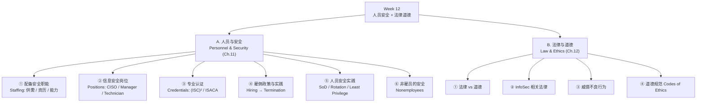

---

# 第一部分:人员与安全 (Personnel and Security)

## 一、为什么"人"是安全的核心 (S3)

整章的定调句:**维护一个安全的环境,要求 InfoSec 部门被精心地构建 (carefully structured),并配备具有恰当资历 (appropriately credentialed) 的人员。** 换句话说,安全的第一道防线不是防火墙,而是**对的人坐在对的岗位上**。

但光有"对的人"还不够——还必须把**恰当的程序 (proper procedures)** 整合进**所有人力资源活动**中。讲者把 HR 的全生命周期列了出来:

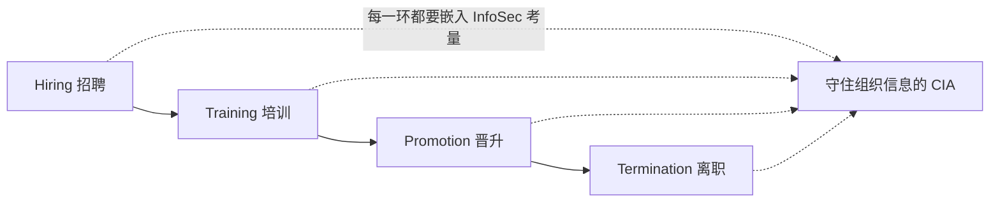

本章会沿着这条生命周期讲两件事:
1. **招聘端**:InfoSec 人员的招聘问题与实践,以及最受追捧的专业认证;
2. **整合**:如何把 InfoSec 政策融入**通用**的招聘实践(注意:不止针对安全岗位)。

> 📎 **拓展(超出 slides)— 讲者反复点的一个关键观点**
> 这一讲讲的招聘/离职/人员控制实践,**适用于组织里的所有员工,而不仅仅是 InfoSec 岗位**。讲者明确说:无论未来的员工属于哪个 **community of interest(利益相关共同体)**——是信息安全社群,还是另外两个社群(一般管理、IT)——招聘时都必须考虑信息安全。这一点很容易被忽略,也很可能成为出题点。

> **本节小结**:安全环境 = 结构合理的 InfoSec 部门 + 有资质的人员 + 把 InfoSec 嵌入 HR 全流程(招聘→培训→晋升→离职);且这套实践覆盖**全体员工**。

---

## 二、配备安全职能:供需、资历与能力 (S4–S7)

### 2.1 供需关系决定了人才稀缺 (S4)

要挑选出一支**有效组合 (effective mix)** 的信息安全人员队伍,需要权衡多项**标准 (criteria)**——其中一部分在组织的掌控之内(给多少预算、设什么岗位),另一部分则**不在组织掌控之内**,最典型的就是**人才市场的供需 (supply and demand)**。

讲者描述了这个市场的动态:

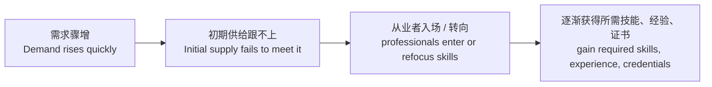

- 当对某类关键安全技能的**需求快速上升**时,**初期供给往往满足不了**;
- 随着需求被市场知晓,从业者会**进入这个就业市场**,或**重新聚焦自己的技能 (refocus job skills)** 去补齐所需的**技能、经验和资历**。

这解释了为什么安全人才"贵且难招"——是供需时间差造成的。

### 2.2 管理者该做什么 (S5)

要推动整个 InfoSec 学科向前发展,**管理者**应当:
- 更多了解信息安全岗位(以及相关 IT 岗位)的**要求与资历 (requirements and qualifications)**;
- 更多了解信息安全的**预算与人员需求 (budgetary and personnel needs)**;
- 赋予信息安全职能(尤其是 **CISO**)**恰当的影响力与威望 (appropriate level of influence and prestige)**。

> 📎 **拓展(超出 slides)** — 第三点很关键:如果 CISO 在组织里没有足够的"话语权和地位",安全工作就推不动。这呼应了前面几讲"信息安全是自上而下 (top-down) 才能成功"的主题。

### 2.3 InfoSec 专业人员的理想能力 (S6–S7)

幻灯片列了一串招聘 InfoSec 人员时希望看到的能力,可以分成"管理/沟通"与"技术/认知"两组:

| 维度 | 期望具备的能力 | 关键句 |
|------|----------------|--------|
| **理解组织** | 懂组织如何**构建与运转 (structured and operated)** | 业务常识 |
| **管理认知** | 认识到 **InfoSec 是管理任务,光靠技术解决不了** | 整门课的中心句 |
| **沟通** | 与人协作好,**书面与口头 (written and verbal)** 沟通都强 | 软技能 |
| **政策意识** | 承认 **policy(政策)** 在指导安全工作中的角色 | 呼应 Week 5 |
| **教育/培训** | 理解 **InfoSec 教育与培训** 的关键作用——让用户成为**解决方案的一部分而非问题的一部分** | SETA 思想 |
| **威胁认知** | 能**感知威胁 (perceive threats)**,理解威胁如何变成攻击,从而保护组织 | |
| **技术控制** | 懂得如何**应用技术控制 (apply technical controls)** | 见下方拓展 |
| **IT 熟悉度** | 熟悉主流 IT 技术:DOS、Windows、Linux、UNIX;懂 IT 与 InfoSec 术语和概念 | |

> 📎 **拓展(超出 slides)— 讲者对"技术控制能力"的两点提醒**
> ① "懂技术控制"**不只是技术员的要求**,**高层管理者也需要**——因为一个对技术控制完全无知的管理者,根本没法有效管理整个 InfoSec 问题。
> ② 关于 DOS/Windows/Linux/UNIX 这串操作系统:讲者直言 **DOS 已经是"古董系统 (ancient system)"**,如今的招聘广告大多不再要求这些——这是教材年代感的体现,理解精神即可,别死记。

> **本节小结**:安全人才稀缺源于**供需时间差**;管理者要争取**预算+给 CISO 地位**;理想的 InfoSec 人才是**"懂管理+会沟通+有政策意识+具备够用的技术理解"** 的复合型,而不是纯技术员。

---

## 三、信息安全岗位 (S8–S13)

### 3.1 三类角色:Definers / Builders / Administrators (S8)

幻灯片把 InfoSec 岗位按职能分成三大类。一个好用的记忆框架是"**定标准 → 造方案 → 跑运营**":

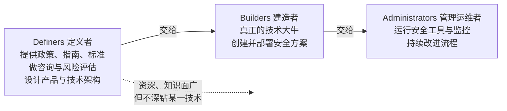

| 角色 | 干什么 | 特征 |
|------|--------|------|
| **Definers(定义者)** | 提供 policies / guidelines / standards;咨询、做 **risk assessment**、设计产品与技术架构 | 资深人士,**知识面广但不深 (broad knowledge, not a lot of depth)** |
| **Builders(建造者)** | **创建并安装 (create and install)** 由 definers 设计的安全方案 | "真正的技术大牛 (real techies)" |
| **Administrators(运维者)** | 管理安全工具、安全**监控 (monitoring)** 职能;**持续改进流程** | 日常运营 |

### 3.2 岗位与汇报关系 (S9)

幻灯片用一张组织图展示了典型岗位的**汇报关系 (reporting relationships)**。结构如下:

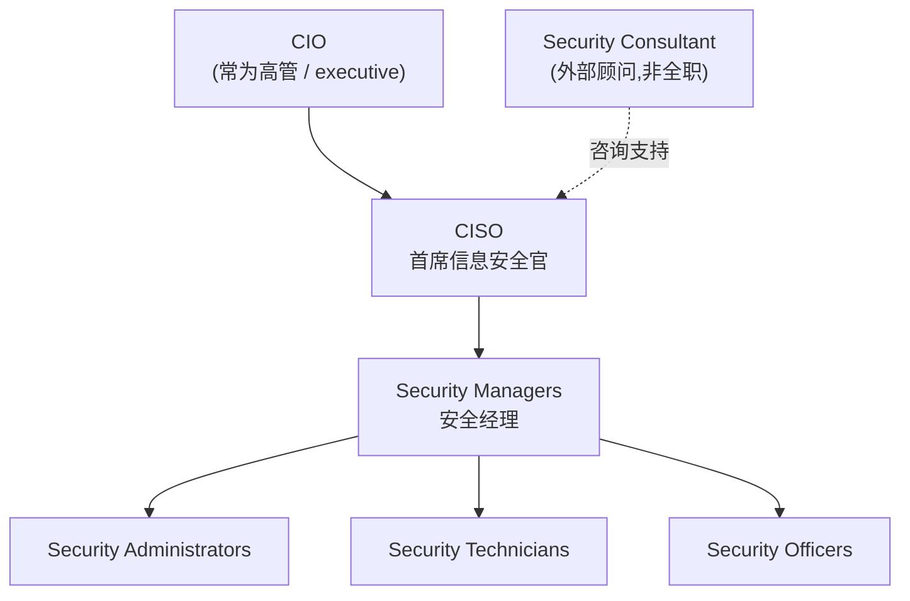

要点:
- **CISO 在 InfoSec 职能的顶端**,通常**汇报给 CIO**;
- **Security consultant(安全顾问)** 可能只是外部人员、不一定是全职雇员,为 CISO 与安全经理提供咨询;
- 安全经理之下是 administrators、technicians、security officers 等**最一线 (entry-level)** 的岗位。

### 3.3 CISO — 首席信息安全官 (S10–S11)

**CISO(Chief Information Security Officer)** 是组织里**最高的信息安全官**(不同组织可能叫别的名字,但 CISO 是最标准的称呼)。关键特征:

- **通常不是高管级 (usually not an executive-level) 职位**,多数情况下**汇报给 CIO**;
  - 对比:**CIO** 才可能是高管,统管全部 IT;CISO 一般在其下。
- **"先是业务管理者,其次才是技术专家 (business managers first and technologists second)"** —— 这是 CISO 角色排序的核心,常考。
- 必须**通晓信息安全的所有领域**:技术 (technology)、规划 (planning)、政策 (policy)。

**CISO 的资历要求(S11):**

| 项目 | 要求 |
|------|------|
| **认证** | **CISSP** —— CISO 最常见的资格证 |
| **学历** | 通常要求**研究生学位 (graduate degree)**,专业可为 criminal justice、business、technology 或相关领域 |
| **经验** | 在 security management、planning、policy、budgets 方面的经验 |

> 📎 **拓展(超出 slides)** — 讲者补充:UOW 自己的 IT 部门据他所知也是"CISO 汇报给 IT/CIO"这种典型结构。可以用这个真实例子帮助记忆"CISO 一般不是高管"。

### 3.4 Security Manager — 安全经理 (S12)

**Security Manager(安全经理)** 是**中层 (middle level)**——夹在 CISO 与技术员之间,两头对接:

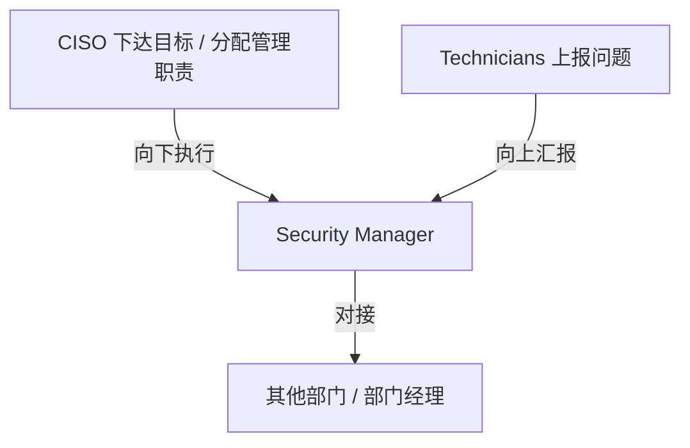

- **职责**:对 InfoSec 项目的**日常运营 (day-to-day operation)** 负责;完成 CISO 定下的目标;解决技术员反馈上来的问题;常被 CISO 指派**具体管理职责**;与其他部门的经理**联络 (liaise)**。
- **资历**:
  - **拥有 CISSP 并不罕见**(但不像 CISO 那样硬性要求);
  - 需要传统业务经验:budgeting、project management、personnel management、hiring and firing;
  - 必须能起草**中/低层级的政策、标准与指南**(对应 Week 5 政策三层结构里的中、低层);
  - 类型多样,**比 CISO 更专精 (more specialized)**——CISO 管全局,经理管某一块。

> 📎 **拓展(超出 slides)— 映射回 Week 5 的政策三层**
> 讲者把"安全经理起草中/低层政策"对应到 Week 5 学过的政策层级:**EISP(企业级)→ ISSP(议题级)→ SysSP(系统级)**。CISO 关注顶层(EISP),安全经理负责把它落成中低层(ISSP / SysSP)的 standards & guidelines。

### 3.5 Security Technician — 安全技术员 (S13)

**Security Technician(安全技术员)** 是技术过硬的执行者,也是 InfoSec 典型的**入门级 (entry-level) 岗位**(尽管偏技术):

- **日常工作**:配置 **firewalls** 与 **IDS**、部署安全软件、诊断排障、与系统/网络管理员协作以确保安全技术被正确实施;
- **资历**:因组织而异;组织通常偏好**有认证、熟练 (certified, proficient)** 的技术员;岗位通常要求对**特定的硬件/软件**有经验。

> 📎 **拓展(超出 slides)— 讲者的具体例子**
> 招聘一个负责 **Cisco 防火墙**的安全技术员,你会要求他有安装/维护 Cisco 系统(软硬件)的经验,并持有 **Cisco 认证**。要点:技术员岗位强调"对某项具体技术的动手经验 (experience using the technology is usually required)",而不是泛泛的管理能力。

> **本节小结**:三类角色 **Definers(定标准)/ Builders(造方案)/ Administrators(跑运营)**;岗位金字塔 **CISO → Security Manager → Technician**;记住三句话——CISO**"先管理后技术"、通常非高管、汇报给 CIO**;Manager 是**中层、能写中低层政策**;Technician 是**技术型入门岗、看重具体技术经验**。

---

## 四、信息安全专业认证 (S14–S18)

### 4.1 为什么组织依赖认证 (S14)

招人时,除了面试和几道快速测试题,组织很难靠自己判断候选人的真实水平,于是普遍**依赖专业认证 (professional certifications)** 来**确认候选人的熟练程度 (ascertain proficiency)**。

但有个**告诫 (caveat)**:很多认证项目**相对较新**——发证是个大生意——它们的**确切价值并未被多数招聘组织完全理解**。因此**发证机构 (certifying bodies)** 要不断向社群"教育"自家证书的价值与含金量。

> 📎 **拓展(超出 slides)— 讲者讲的真实就业市场逻辑**
> 现实中:岗位一发布,大量人投递;但 JD 里设了**硬门槛 (criteria)**,只有"打勾打够"的候选人才会被叫去面试。而**"持有某项知名认证"往往就是那个起点门槛**——很多网络安全岗位至少要求一张知名证书。**没有证,很可能连面试都进不了。** 这就是认证在求职中的真实分量。

### 4.2 (ISC)² 的认证:CISSP 与 SSCP (S15–S16)

**(ISC)²**(International Information Systems Security Certification Consortium,国际信息系统安全认证联盟)提供多项安全认证,与本讲最相关的是 **CISSP** 和 **SSCP**。

**CISSP — Certified Information Systems Security Professional**
- InfoSec 从业者**最负盛名 (most prestigious)** 的认证之一(很可能是最高的那张);
- 证明你对信息安全知识的**精通 (mastery)**;
- 覆盖 **10 个知识域 (10 domains)**:

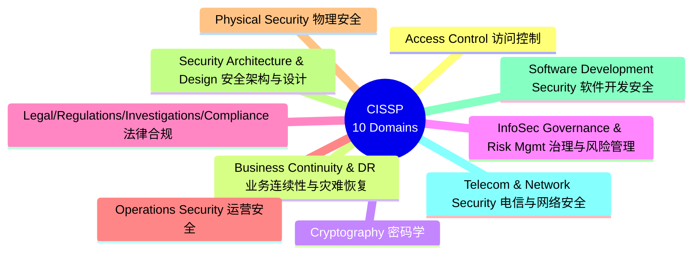

> 📎 **拓展(超出 slides)— 讲者借 10 个域回顾整门课(非常好的复习线索!)**
> 讲者特意指出,这 10 个域我们在本课程里**大多都碰过**:
> - **Access control / Cryptography** → Week 11(技术控制讲)
> - **Business continuity & DR** → 应急计划那一讲(Week 4)
> - **InfoSec governance & risk management** → 多讲(Week 9–10 风险管理等)
> - **Legal & compliance** → 就是今天这一讲
> - **Security architecture & design** → Week 7
> - **Operations security / Physical security** → 只是简略提及,没有展开
> - **Software development security** → 没细讲,但用过 **SecSDLC** 这个术语
> - **Telecom & network security** → 提过主要协议(Wi-Fi security、TLS、VPN)
> 一句话:**这门课是想成为 InfoSec 专业人士的一个很好的起点;想当 CISO,CISSP 是你该拿的证之一。**

**SSCP — System Security Certified Practitioner**
- 比 CISSP **更容易**,定位**更偏入门级安全经理**(而非纯技术员);
- 大多数题目聚焦 InfoSec 的**运营本质 (operational nature)**;
- 覆盖 **7 个域**:access controls、analysis and monitoring、cryptography、malicious code、networks and telecommunications、risk/response and recovery、security operations and administration;
- 知识的深度与广度**不及 CISSP**。

> 📎 **拓展(超出 slides)— 职业路径**
> 讲者建议的一条典型路径:先考 **SSCP**,积累几年知识与经验后,再去挑战 **CISSP**。SSCP 是 CISSP 的"低配前置版"。

### 4.3 ISACA 的认证:CISA 与 CISM (S17)

**ISACA**(Information Systems Audit and Control Association,信息系统审计与控制协会)赞助四项认证,本讲提两项:

| 认证 | 全称 | 定位 |
|------|------|------|
| **CISA** | Certified Information Systems **Auditor** | 适合**审计 (auditing)**、网络、安全专业人士——**更偏审计与网络** |
| **CISM** | Certified Information Security **Manager** | 面向**有经验的 InfoSec 经理**;向高层管理证明候选人具备**有效安全管理与咨询**所需的背景知识——**更偏 InfoSec 管理** |

记忆法:**CISA = Auditor(审计)**,**CISM = Manager(管理)**。

### 4.4 认证的成本 (S18)

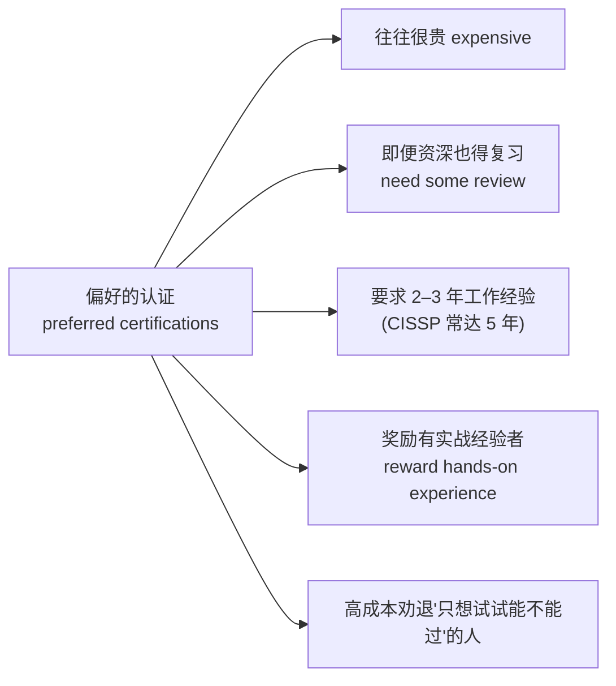

- 含金量越高的认证往往**越贵**;
- 即便是经验丰富的专业人士,**不复习也很难考好**——要投入可观的时间;
- 高成本会**劝退**那些"只想试试能不能过 (just to see if they can pass)"的人;
- 多数考试要求 **2–3 年工作经验**,且**结构上奖励有大量实战经验的人**——纯应届、没有业界实操的人往往考不好。

> 📎 **拓展(超出 slides)— CISSP 的具体数字**
> 讲者给的概数:CISSP 报名费从**几百到约 2000 美元**,通常要求 **3–5 年**信息安全工作经验,自学备考可能要**好几个月**逐域攻克。结论:想挑战自我、纯试水的人别碰 CISSP,太费时费钱。

> **本节小结**:组织靠认证判断水平,认证常是求职**硬门槛**;**(ISC)²** 出 **CISSP(10 域,最高级)** 和 **SSCP(7 域,入门级)**;**ISACA** 出 **CISA(审计)** 和 **CISM(管理)**;认证普遍**贵、要复习、要 2–3 年(CISSP 常 5 年)经验**。

---

## 五、雇佣政策与实践:从招聘到离职 (S19–S27)

### 5.1 总原则:把 InfoSec 织进所有雇佣实践 (S19)

管理层应把**扎实的 InfoSec 理念整合进组织的所有雇佣政策与实践**中,包括:
- 把**信息安全职责**写进**每个员工的职位描述 (job description)** 和后续的**绩效考核 (performance reviews)**;
- 这一做法能让**整个组织更认真地对待信息安全**。

接下来按 HR 流程逐环看 InfoSec 该如何嵌入。

### 5.2 招聘 (Hiring) (S20–S22)

从 InfoSec 视角看,招聘是个**布满安全隐患 (laden with potential security pitfalls)** 的过程。各子环节的安全考量:

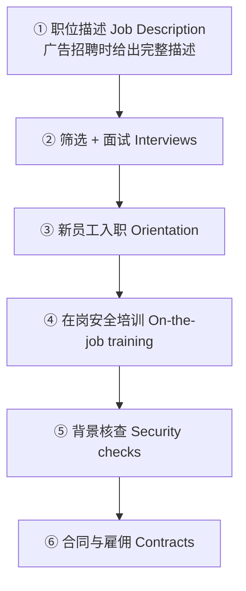

| 环节 | InfoSec 考量 |
|------|--------------|
| **职位描述** | 招聘广告要提供**完整的职位描述** |
| **面试 (Interviews)** | InfoSec 应**建议 HR 限制**向候选人透露该岗位的**访问权限 (access rights)** 信息;若面试含**实地参观 (site visit)**,路线应**避开机密与受限区域**——访客可能借机观察到足以威胁组织的运营/安全信息 |
| **新员工入职** | 新员工应在入职培训中接受**全面的 InfoSec 简报 (briefing)** |
| **在岗安全培训** | 定期开展 **SETA**(Security Education, Training and Awareness)活动,把安全保持在员工脑中最前沿,减少操作失误 |
| **安全核查** | 发 offer 前做**背景核查 (background check)** |
| **合同与雇佣** | 合同是一项重要的**安全工具 (security instrument)** |

> 📎 **拓展(超出 slides)— 两个重要补充**
> ① **背景核查具体查什么**:身份/Social Security、并可能包括 drug test(药检)、driving record(驾驶记录)、credit report(信用报告)、criminal record(犯罪记录,最重要)。**而且续签合同时也要重新查**——人的背景可能随时间变化,要确保仍满足组织的准入安全要求。
> ② **招聘 InfoSec 实践适用于所有部门的招聘**,不止安全岗——这是讲者第二次强调这一点。

### 5.3 离职 (Termination Issues) (S23–S27)

员工离开组织时,必须执行一系列任务,确保人走之后组织信息的 **CIA** 仍受保护:

**离职时的清单 (S23):**
- 禁用对组织系统的**访问 (disable access)**;
- 收回所有**可移动介质 (removable media)**;
- **保全硬盘 (hard drives secured)**;
- **更换**文件柜与门锁;
- **吊销门禁卡 (keycard access revoked)**;
- 清理个人物品;
- **护送 (escort)** 前员工离开场所。

**离职面谈 (Exit interview, S24):** 很多组织会做,目的有二——提醒员工任何**合同义务**(如 **NDA / 保密协议**);收集员工任职期间的反馈。

**两种离职处理方式 (S24–S26):**

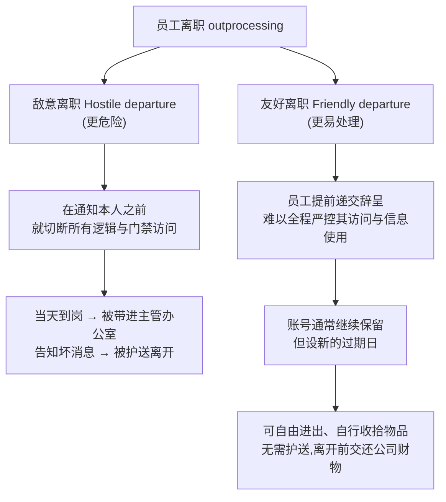

| 对比维度 | **Hostile(敌意离职)** | **Friendly(友好离职)** |
|----------|------------------------|--------------------------|
| 触发 | 被解雇、关系不和 | 主动辞职、提前通知 |
| 风险 | 高——可能**报复 (revenge)** | 较低 |
| 访问处理 | **先切断,再通知**(不给反应时间) | 账号**保留一段时间**,设过期日 |
| 物理处置 | 全程护送 | 通常无需护送 |

**无论哪种情况 (S27):**
- 离职者用过的办公室和信息必须**清点 (inventoried)**,文件**封存或销毁**,财物归还组织;
- 警惕离职者**带走对其新工作有价值的信息或资产**;
- **审查系统日志 (scrutinize system logs)** 可帮助判断是否发生了政策违规或信息损失。

> 📎 **拓展(超出 slides)— 敌意离职的操作细节**
> 讲者描述的典型做法:在解雇当天**早上**,员工一到岗就被告知"你被解雇了",**立即**被护送进主管办公室听坏消息,然后护送离开;个人财物事后转交,或在监督下当场收拾。核心逻辑是**"先断访问、不给报复窗口"**。

> **本节小结**:把 InfoSec 写进**每个职位描述与绩效考核**;招聘六环节(JD→面试→入职→在岗培训→背景核查→合同)各有安全考量;离职要**禁用访问、收回介质、换锁、吊销门禁、护送**;**敌意离职=先断后说**,**友好离职=留账号设过期**;两种都要清点、审日志、提醒 NDA。

---

## 六、人员安全实践 (Personnel Security Practices) (S28–S30)

这一节讲的是**监控与控制在职员工、把其滥用信息的机会降到最低**的方法。它们和 Week 11 的**访问控制原则**高度相关。

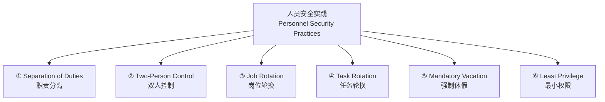

| 实践 | 定义 | 作用 |
|------|------|------|
| **Separation of Duties(职责分离)** | 把工作拆开,每人只做任务序列中自己那一段 | 让**单个人难以**违反 InfoSec、破坏信息的 CIA |
| **Two-Person Control(双人控制)** | 两个人**相互复核并批准**对方的工作,任务才算完成 | 没有人能独揽整个流程 |
| **Job Rotation(岗位轮换)** | 要求**每个员工都能做至少另一个员工的工作** | 任何人都可被替换;无人能做"无人能复核"的事 |
| **Task Rotation(任务轮换)** | 所有**关键任务**都能由**多人**执行 | 同上,确保可被他人有据复核 |
| **Mandatory Vacation(强制休假)** | 强制每位员工休假 | 借机**详查其工作**,并检验"没他组织能否照常运转" |
| **Least Privilege(最小权限)** | 员工**只能访问完成任务所需的信息**,且**只在所需时段内** | 把滥用机会降到最低;若人人随时能看所有数据,滥用几乎必然发生 |

> 📎 **拓展(超出 slides)— 讲者的两个解释,极有助理解**
> ① **职责分离的银行例子**:很多银行批准大额资金需要**多人签字 (multiple signatures)** 才能放款——这正是 separation of duties 的现实落地。
> ② **强制休假的双重目的**:不仅是给组织**复查该员工工作**的机会,也是在**演练最坏情况**——如果这个员工突然离开,组织还能不能正常运转?

> 📎 **拓展(超出 slides)— 与 Week 11 的连接**
> **Separation of duties** 和 **least privilege** 本身就是访问控制的基本原则(Week 11 IAAA 体系)。本讲是从"人员管理"的角度再次应用它们:**least privilege 既是技术上的授权原则,也是人事上的信息隔离原则。**

> **本节小结**:六大实践的共同目标是**降低内部人员滥用信息的机会**。记忆主线:**分离与双人(让一个人办不成坏事)→ 轮换与休假(让坏事瞒不住、能被复核)→ 最小权限(让能接触的本就最少)**。

---

## 七、个人数据的安全 (S31)

组织**依法 (by law)** 有义务保护敏感的或个人的**员工信息**:
- **例子**:员工住址、电话、Social Security number、医疗状况、家属姓名与住址;
- 这一责任还**延伸到客户、病人,以及任何与组织有业务关系的人**;
- 个人数据与 InfoSec 通常要保护的其他数据**并无本质不同**,但**有更多法规专门覆盖它**——因为这不仅关乎安全,更关乎**隐私 (privacy)**;
- InfoSec 程序应确保这类数据**至少获得与组织其他重要数据同等级别的保护**。

> 📎 **拓展(超出 slides)** — 讲者指出,围绕隐私的法律在全球范围内被广泛制定与适用(后面 S37 会列举具体法律,如 HIPAA、GDPR)。"安全 ≠ 隐私"是个值得记住的区分:**个人数据要同时满足安全要求和隐私法规。**

> **本节小结**:个人/员工数据要受保护是**法律义务**;范围覆盖员工**及客户、病人、业务伙伴**;它和别的数据一样需要安全,但**额外受隐私法规约束**,保护等级**不得低于**其他重要数据。

---

## 八、非雇员的安全考量 (Security Considerations for Nonemployees) (S32–S35)

很多**不是雇员**的人也常常能接触组织的敏感信息,因此与这一类人的关系必须**被谨慎管理**,以防信息资产面临的威胁变成现实。共四类:

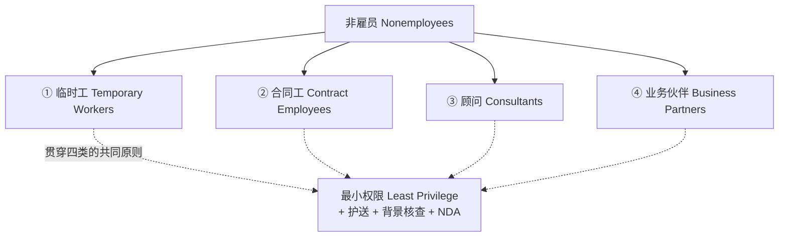

| 类型 | 风险特点 | 关键控制 |
|------|----------|----------|
| **Temporary workers(临时工)** | 不受雇于服务对象组织;**可能不受**约束雇员的合同义务/政策;除非合同写明,**派遣机构可能不为其损失负责** | 访问应**限于完成职责所需** |
| **Contract employees(合同工)** | **专业承包商**(如装修、布线)可能需要进入组织所有区域;**服务承包商**通常只需特定设施 | **服务承包商不得随意走动**;在安全设施中**逐房间护送、进出陪同**;服务合同要求:**提前 24–48 小时**通知维护、**所有现场人员做背景核查**、取消/改期需提前通知 |
| **Consultants(顾问)** | 有自己的安全要求与合同义务;**保护你的信息可能不是他们的首要任务** | 按**合同工**方式处理;特殊的信息/设施访问要求须**在授予访问前写进合同**;**应用最小权限** |
| **Business partners(业务伙伴)** | 为交换信息、集成系统或互利而结成**战略联盟**;系统集成后,**竞争性团队可能拿到双方母公司都没预料会泄露的信息** | **事先协议**约定双方愿承受的**暴露程度 (levels of exposure)**;顾问须**预筛、护送、签 NDA**;集成前**审查双方系统的安全等级**——**一个系统的漏洞会变成所有互联系统的漏洞** |

> 📎 **拓展(超出 slides)— 一句必记的安全格言**
> "**A vulnerability on one system becomes a vulnerability for all linked systems(一个系统上的漏洞,就是所有互联系统的漏洞)。**" 这就是为什么业务伙伴系统集成前必须互审安全等级——它也是"供应链安全 (supply chain security)"思想的雏形。

> **本节小结**:四类非雇员 **临时工 / 合同工 / 顾问 / 业务伙伴**,贯穿它们的通用武器是 **最小权限 + 护送 + 背景核查 + NDA + 写进合同**;业务伙伴最特殊,要**事先约定暴露程度、集成前互审安全等级**。

---

# 第二部分:法律与道德 (Law and Ethics in InfoSec)

## 九、法律 vs 道德 (S36)

这是整门课的最后一个主题。**法律 (laws)** 与 **道德 (ethics)** 相关但**不同**:

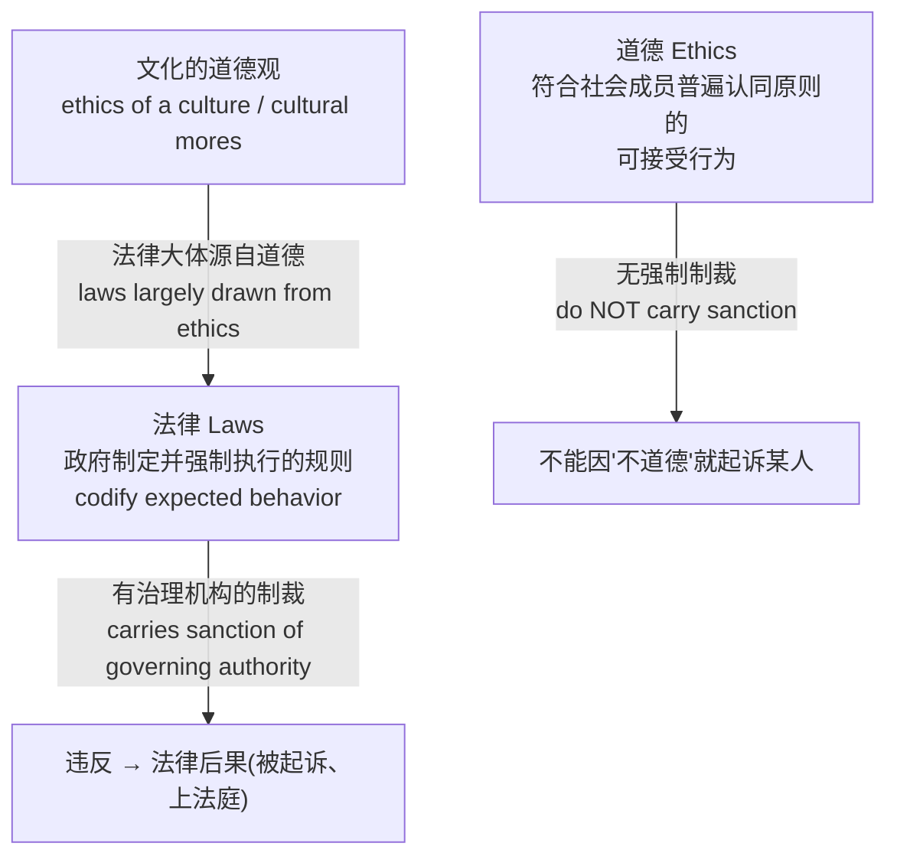

| | **法律 (Laws)** | **道德 (Ethics)** |
|---|------------------|--------------------|
| 定义 | 政府**制定并强制执行**的规则,用以**编纂 (codify)** 社会中期望的行为 | 符合社会成员**普遍认同的原则**的**可接受行为** |
| 来源 | **大体源自一种文化的道德** | 基于**文化习俗 (cultural mores)** |
| 强制力 | **带有治理机构的制裁** | **不带制裁** |
| 违反后果 | 可能被**起诉、上法庭** | 不能仅因"不道德"就起诉某人 |

**关键:四种组合都可能存在。** 一件事可能是:
- 合法且道德;合法但不道德;道德但不合法;既不合法也不道德。

> 📎 **拓展(超出 slides)— 呼应 workshop 的经典案例**
> 讲者提到 workshop 里做过的练习:举一个**"守法但不道德"**的情形,和一个**"道德但不合法"**的情形。这正是"laws ≠ ethics"的核心考点。记住这句话:**"something ethical is not necessarily lawful, and something lawful is not necessarily ethical."**

## 十、信息安全与法律 (InfoSec and the Law) (S37)

InfoSec 专业人员与管理者必须对其组织运营所处的**法律框架 (legal framework)** 有**基本的把握**。美国在 InfoSec 立法上起了引领作用:

**美国主要法律(注意年份,常考):**

| 法律 | 全称 | 年份 |
|------|------|------|
| **CFA Act** | Computer Fraud and Abuse Act(计算机欺诈与滥用法) | **1986** |
| **CSA** | Computer Security Act(计算机安全法) | **1987** |
| **Federal Privacy Act** | 联邦隐私法 | **1974** |
| **ECPA** | Electronic Communications Privacy Act(电子通信隐私法) | **1986** |
| **HIPAA** | Health Insurance Portability and Accountability Act(健康保险流通与责任法) | **1996** |

**国际法律与法律机构:**
- **European Council Cybercrime Convention**(欧洲委员会网络犯罪公约)
- **DMCA** — Digital Millennium Copyright Act(数字千年版权法)
- **Australian High Tech Crime**(澳大利亚高科技犯罪相关法)

> 📎 **拓展(超出 slides)— 讲者的两点补充**
> ① **HIPAA 的"H"是 Health**:这部法大多数条款关于医疗健康,但其**一般原则适用于多个领域**,不止医疗。
> ② **GDPR**(General Data Protection Regulation,欧盟通用数据保护条例)是更近期、影响很大的隐私法律。如今很多科技公司会在声明里写明其安全框架遵循 **HIPAA(美)、GDPR(欧)**,治理框架遵循 **ISO 标准**——而这些概念本课程都讲过。(GDPR 不在幻灯片上,但讲者口头强调,值得知道。)

## 十一、威慑不良与违法行为 (Deterring Unethical and Illegal Behavior) (S38)

**威慑 (deterrence) 是预防违法或不道德行为的最佳方法。** 而 InfoSec 人员的职责之一就是**威慑不道德与违法行为**。

**不道德行为的三类成因:**

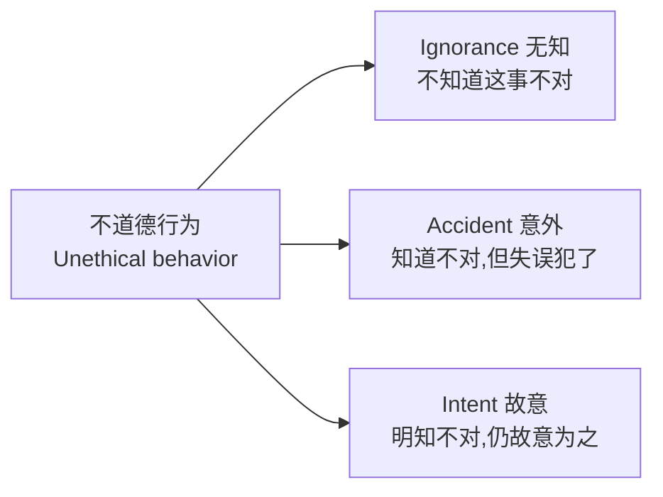

**法律/政策及其处罚只有在三个条件同时存在时才能威慑:**

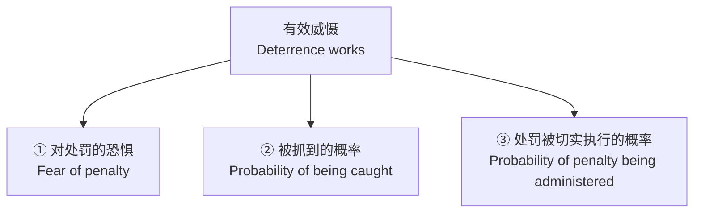

- **① 恐惧处罚**:违法会面临严重后果;
- **② 被抓概率足够高**:才会让人不敢违规;
- **③ 处罚确实会被执行**:如果被抓了却因故不予处罚(没被切实执行),人们就不会真的"怕"——这一条最容易被忽视。

> 📎 **记忆法** — 威慑三条件 = **怕罚 + 抓得到 + 真的罚**。缺任何一条,威慑失效。

## 十二、道德规范 (Codes of Ethics) (S39)

许多专业组织制定了**行为准则 (codes of conduct)** 和/或**道德规范 (codes of ethics)**,要求成员遵守:

| 组织 | 说明 |
|------|------|
| **ACM** | Association for Computing Machinery |
| **(ISC)²** | 即上文发 CISSP/SSCP 的机构 |
| **SANS** | SysAdmin, Audit, Network and Security |
| **ISACA** | 即上文发 CISA/CISM 的机构 |
| **ISSA** | Information Systems Security Association |

要点:
- 道德规范能对个人在**计算机使用上的判断**产生**积极影响**;
- 但归根结底,**安全专业人员有个人责任 (individual responsibility)**,要遵循以下三者而行事:
  1. **雇主**的政策与程序;
  2. 自己所属**专业组织**的规范;
  3. **社会的法律**。

> **本节小结(法律与道德)**:法律=有制裁、源自道德;道德=无制裁、基于习俗;**四种"合法×道德"组合都存在**。记住美国五法的年份和 HIPAA=Health;威慑靠**怕罚+抓得到+真的罚**三条件;不道德行为成因=**无知/意外/故意**;最终落到**个人责任**:守雇主政策、守专业规范、守法律。

---

## 全章思维导图 (Big Picture)

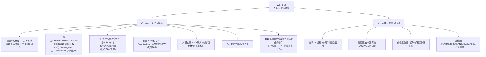

---

## 关键术语速查 (Glossary)

| 术语 | 含义 |
|------|------|
| **CISO** | Chief Information Security Officer,组织最高信息安全官;管理优先,通常非高管,汇报 CIO |
| **Definers / Builders / Administrators** | InfoSec 岗位三类:定标准 / 造方案 / 跑运营 |
| **CISSP** | (ISC)² 最高级认证,覆盖 10 个知识域;CISO 常见资格 |
| **SSCP** | (ISC)² 入门级认证(System Security Certified Practitioner),7 个域,偏运营 |
| **CISA / CISM** | ISACA 认证:Auditor(审计)/ Manager(管理) |
| **SETA** | Security Education, Training and Awareness,安全教育培训与意识 |
| **Hostile / Friendly departure** | 敌意离职(先断访问再通知)/ 友好离职(账号保留并设过期) |
| **Separation of Duties** | 职责分离,拆分任务使单人无法独力作恶 |
| **Two-Person Control** | 双人控制,两人相互复核批准 |
| **Job / Task Rotation** | 岗位/任务轮换,确保工作可被他人复核与替代 |
| **Mandatory Vacation** | 强制休假,借机复查其工作并演练"人走也能运转" |
| **Least Privilege** | 最小权限,只给完成任务所需的最小访问 |
| **NDA** | Non-Disclosure Agreement,保密协议 |
| **Laws vs Ethics** | 法律(政府制定、有制裁)vs 道德(基于文化习俗、无制裁) |
| **Deterrence** | 威慑,预防违法/不道德的最佳方法;需三条件同时成立 |
| **CFAA / CSA / ECPA / HIPAA / Federal Privacy Act** | 美国主要 InfoSec/隐私法律(1986/1987/1986/1996/1974) |
| **DMCA / GDPR** | 数字千年版权法 / 欧盟通用数据保护条例 |

---

## 自测清单 (Self-check)

读完后,试着不看上文回答:

1. CISO 的三个特征是什么?(管理优先、通常非高管、汇报谁?)
2. Definers、Builders、Administrators 各负责什么?
3. (ISC)² 与 ISACA 各出哪些证?CISSP 覆盖几个域,SSCP 几个?CISA 与 CISM 的侧重分别是?
4. 招聘流程里,面试与实地参观各有什么 InfoSec 注意事项?
5. 敌意离职与友好离职在"访问处理"上的核心区别是什么?
6. 列出至少四种人员安全实践,并说出它们共同的目的。
7. 用一句话说明"职责分离"的银行例子。
8. 非雇员四类是哪四类?贯穿它们的通用控制有哪些?
9. 法律与道德的两大区别是什么?举一个"合法但不道德"的情形。
10. 威慑起作用的三个条件是什么?不道德行为的三类成因是什么?
11. 美国五部主要法律分别叫什么、哪一年?HIPAA 的"H"代表什么?

---

> 📌 **课程收尾提示(来自录音)** — 这是倒数第二讲。讲者预告**最后一讲 (Week 13)** 会:① 复习 Lecture 1–12 的某个主题;② 讲解**期末考试**的要求与题型,**特别是 MCQ 的评分方式**(注意:5 选项的题可能有**多个正确选项**,通常 1–3 个);考试日期为 **6 月 17 日**。建议出席最后一讲以了解考试结构并提问。
