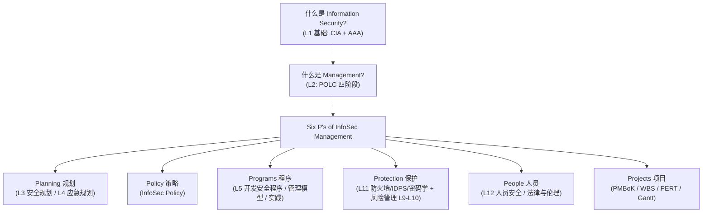
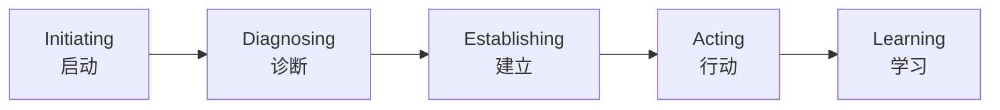
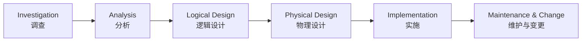
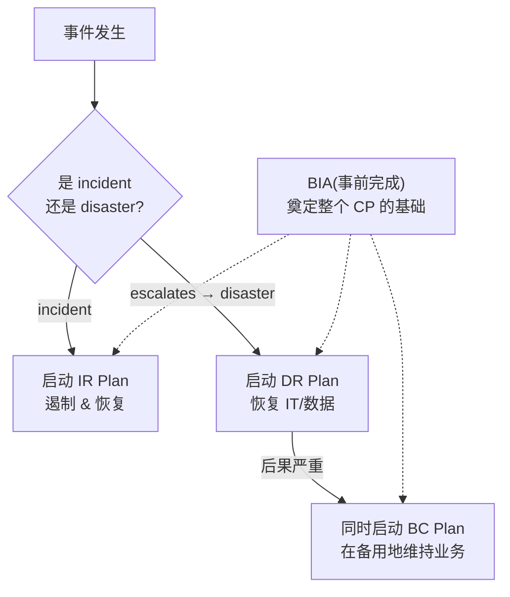
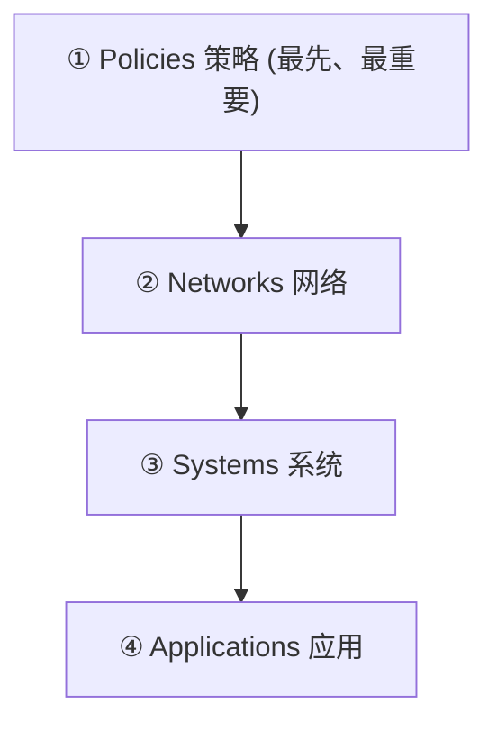
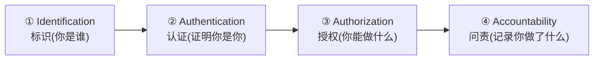
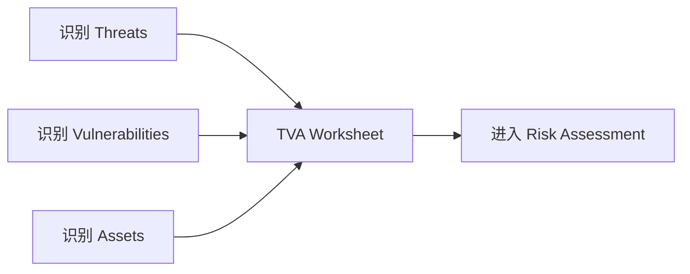
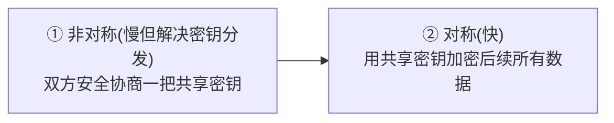

# CSIT988 / CSIT488 期末总复习 Study Guide
### Week 13 · Subject Revision —《Security, Ethics and Professionalism》(Management of Information Security)

> 本指南融合了 **Week 13 复习讲义**(`CSIT988-2026-L13.pdf`)与**课堂录音稿**(`CSIT988_Week13-transcript.txt`)。
> Week 13 这节课老师做了三件事:(1) 把前 12 讲的**核心概念**串一遍;(2) 详细讲解**期末考试**的形式、评分与策略;(3) Q&A。
> 这节复习课本质上就是**期末考试的蓝图**——老师明说"哪些会考、哪些不考、学生历年最容易错在哪"。这份指南把这些信息系统化,帮你高效冲刺。

**学习目标**——读完这份指南,你应该能够:
- 复述这门课的整体脉络:从"什么是信息安全"到"如何管理信息安全"的逻辑主线;
- 回忆起 12 讲中每一讲的**必考概念**,并能区分老师反复警告的**易混淆点**;
- 熟练套用**风险管理**的两组计算公式(Risk rating 与 CBA);
- 清楚期末考的**题型结构、MCQ 扣分规则、Technical Fail 红线**与答题策略。

> 📎 **拓展(超出 slides)** — 课程编号 CSIT988(研究生)与 CSIT488(本科)共用同一份考卷;Subject Coordinator 为 A/Prof Khoa Nguyen。下文中的「老师说」均来自 Week 13 录音稿。

---

## 0. 课程整体脉络:一张图看懂这门课在讲什么

这门课的全称是 **Management of Information Security(信息安全管理)**——重点在 **management**(管理),而不是技术细节。它的逻辑主线是:先理解**什么是信息安全**,再把**通用管理学**的框架"嫁接"到信息安全场景里。

老师用两个总纲性框架贯穿全程:

- **三个 communities of interest(利益共同体)**——所有理论讨论的出发点:
  1. **InfoSec community**(信息安全团队)
  2. **IT community**(IT 团队)
  3. **General business community**(普通业务团队)
- **管理的 POLC 四阶段** + **信息安全管理的 Six P's**——前 12 讲基本就是在逐个展开这 6 个 P。

> 💡 **记忆锚点**:这门课的所有内容都能挂回 **Six P's**。如果考试中遇到不确定的题,先问自己"这属于哪个 P?",往往能定位到正确的知识区。

---

# 第一部分:12 讲核心概念回顾

---

## 1. 信息安全基础 Basics of Information Security

**What is information security?** 信息安全是对**信息**及其**赖以存储、处理、传输的系统**的保护。

**三个 communities of interest**(见上图)——这是全课的分析框架:InfoSec、IT、general business 三方都要参与安全治理,但侧重点不同。

**CNSS security model(CNSS 安全模型)** —— 一个 **3×3×3 的立方体(cube)**,三个维度共 27 个单元格。其中一个维度构成了大名鼎鼎的 **C.I.A. triangle(CIA 三元组)**:

| C.I.A. | 含义 | 一句话 |
|--------|------|--------|
| **Confidentiality** 机密性 | 信息只对被授权者可见 | 防泄露 |
| **Integrity** 完整性 | 信息不被未授权篡改、保持准确完整 | 防篡改 |
| **Availability** 可用性 | 被授权者需要时能及时访问 | 防中断 |

**超越 CIA 的安全/隐私属性**——老师强调要记住 CIA 之外还有 5 个属性:
**Privacy(隐私)、Identification(标识)、Authentication(认证)、Authorisation(授权)、Accountability(问责)**。

> ⭐ **高频考点**:后四个(Identification → Authentication → Authorisation → Accountability)在全课中**反复出现**,合称 **AAA / IAAA processing**。在 L11(保护机制)里它们又作为"access control 的四大 essential processes"重新登场——**务必记牢顺序与区别**(见 §7 与 §11 的陷阱提醒)。

---

## 2. 信息安全管理 InfoSec Management

**What is management?** 管理就是通过**规划、组织、领导、控制**资源来达成目标。本课把通用管理框架适配到信息安全。

**POLC 原则**——通用管理的四个阶段:

| POLC | 中文 |
|------|------|
| **P**lanning | 规划 |
| **O**rganizing | 组织 |
| **L**eading | 领导 |
| **C**ontrolling | 控制 |

**The Six P's of InfoSec Management**(信息安全管理的六个 P)——本课的总目录:
**Planning, Policy, Programs, Protection, People, Projects**。

**PMBoK(Project Management Body of Knowledge)项目管理知识体系**——9 大知识领域:
Integration(整合)、Scope(范围)、Time(时间)、Cost(成本)、Quality(质量)、Human Resource(人力资源)、Communications(沟通)、Risk(风险)、Procurement(采购)。

**项目管理工具(Project Management tools)**:

| 工具 | 全称 | 作用 |
|------|------|------|
| **WBS** | Work Breakdown Structure | 工作分解结构,把项目拆成可管理的小任务 |
| **PERT** | Program Evaluation and Review Technique | 用网络图分析任务依赖与工期 |
| **Gantt Chart** | 甘特图 | 时间轴上展示任务进度 |

**Critical path(关键路径)与 Slack time(松弛时间)**——PERT 网络中,**关键路径**是耗时最长、决定项目最短完成时间的路径;**slack/lag time(松弛/浮动时间)**是某任务在不拖延整个项目的前提下可以延迟的时间。关键路径上的任务 slack = 0。

> ⭐ **老师点名**:"在 **Lecture 4 的 quiz** 里有一道关于 **PERT** 的 MCQ……这也是期末可能**再次出现**的重要考点。要清楚 **critical path 是什么、slack/lag time 是什么**。"

---

## 3. 安全规划 Planning for Security

**What is planning?** 规划是为达成目标而制定的行动方案。任何组织的规划都建立在三份**基础文件(foundational documents)**之上:

| 文件 | 回答的问题 | 记忆 |
|------|-----------|------|
| **Values statement** 价值观陈述 | 组织**信奉什么**(原则、道德底线) | 我们相信什么 |
| **Vision statement** 愿景陈述 | 组织**想成为什么**(未来理想状态) | 想变成什么样 |
| **Mission statement** 使命陈述 | 组织**现在做什么、为谁做** | 当下使命 |

> ⚠️ **易错点(来自 MCQ 示例)**:"The **values** statement describes what an organization wants to become" —— **错误**!"想成为什么"是 **vision** statement,不是 values statement。别把三份文件搞混。

**Strategic planning(战略规划)**——包括制定战略计划、划分 **planning levels(规划层级:战略 → 战术 → 运营)**,以及 **CISO 在规划中的角色**。

**IDEAL 治理框架(governance framework)**——五个阶段:

**实施信息安全的两种路径**——务必能**比较**两者:

| | **Bottom-up** 自下而上 | **Top-down** 自上而下 |
|---|---|---|
| 发起者 | 技术人员/管理员 | 高层管理(CISO/CEO) |
| 优势 | 一线技术专长 | 有资源、有授权、可持续 |
| 劣势 | 缺乏组织支持,容易夭折 | 需要高层真正重视 |
| 推荐 | — | ✅ **更可能成功** |

**SecSDLC(Security Systems Development Life Cycle)**——以 **Waterfall(瀑布)方法** 学习,六个阶段:

**威胁、攻击与漏洞(Threats, attacks, vulnerabilities)**——本课**首次**在 L3 引入威胁概念,之后多讲反复回顾。

> ⭐ **老师点名**:"你应该记住信息安全的 **12 类威胁(12 categories of threat)** 及其例子。" 还要区分 **technical attack(技术攻击)** 与 **non-technical attack(非技术攻击)**。
> ⚠️ **易错点(MCQ 示例)**:"An example of **technical** attack is **shoulder surfing**" —— **错误**!肩窥(shoulder surfing,偷看别人屏幕/键盘)属于**非技术/社会工程**攻击。

---

## 4. 应急规划 Planning for Contingencies (CP)

**What is Contingency Planning?** 应急规划是为"出事之后如何应对"而做的准备。**Why important?** 没有 CP,一次事故就可能让组织瘫痪甚至倒闭。

**CP 的四大组成部分**——必须知道**每个是什么、何时触发**:

| 组件 | 全称 | 何时用 | 关注点 |
|------|------|--------|--------|
| **BIA** | Business Impact Analysis 业务影响分析 | **事前**——CP 的起点 | 识别关键业务功能及中断影响 |
| **IR plan** | Incident Response Plan 事件响应计划 | 事故(incident)发生时 | 检测、响应、遏制单次事件 |
| **DR plan** | Disaster Recovery Plan 灾难恢复计划 | incident 升级为 **disaster** 时 | 恢复 IT 系统与数据 |
| **BC plan** | Business Continuity Plan 业务连续性计划 | 灾难后果严重时(与 DR **同时**启动) | 在备用场所维持核心业务运转 |

> ⭐ **老师点名**:"如果某个 incident 发生了,你该跟哪个计划?如果它升级成 disaster,你可能要**激活 DR plan**;如果灾难后果严重,还要**同时考虑 BC plan**。"——典型的情景判断题。

---

## 5. 信息安全策略 InfoSec Policy

**Why policy?** 用 **Bull's-eye model(靶心模型)** 来理解策略的优先级——从外到内四层,**Policy 在最外层、最先处理、最重要**:

**三类信息安全策略**——必须掌握各自的 **goals(目标)、components(组成)、implementation(实施)**:

| 类型 | 全称 | 作用范围 | 一句话 |
|------|------|---------|--------|
| **EISP** | Enterprise Information Security Program Policy | 全企业、高层级 | 组织安全的"宪法",由高管签发,稳定少变 |
| **ISSP** | Issue-Specific Security Policy | 针对**具体议题** | 如邮件使用、上网、移动设备等专项策略 |
| **SysSP** | Systems-Specific Policy | 针对**具体系统/设备** | 如防火墙 ACL、特定服务器配置规则 |

**有效策略的准则(Guidelines for effective policy)**——一份策略要真正生效,需经历:
**Development(制定)→ Distribution(分发)→ Review/comprehension(审阅/可理解)→ Compliance/agreement(合规/同意)→ Uniform enforcement(统一执行)**。

> 💡 关键链条:策略不仅要写出来,还要**让员工读得到、读得懂、愿意遵守、并被一视同仁地执行**——缺一环都会失效。

---

## 6. 开发安全程序 Developing the Security Program

**Organizing for security(为安全而组织)**——构建 InfoSec program 时考虑两个最重要的**变量(variables)**:

- **组织文化(culture)**——是否真正支持信息安全(这是所有讨论的前提假设);
- **组织规模(size)**——small / medium / large / very large 组织的安全治理方式不同。

**Charles Wood 的五个定位选项(five options on InfoSec program positioning)**——把 InfoSec 职能放在组织内的哪个位置。重点看**汇报结构(reporting structure)**带来的利弊:

| | 定位 | 汇报链 | 评价 |
|---|------|--------|------|
| **Option 1** ⭐ | 放在 **IT 之下** | CISO → CIO → CEO(中间只隔一层) | **最流行**;链条短是优点,但安全可能被 IT 的目标"压制" |
| 其他选项 | 放在更独立/更高的位置 | 视情况 | 适合"安全本身就是业务"的高敏感组织;无完美方案 |

> ⭐ **老师强调**:"没有完美的 option,取决于你的情境。Option 1(放 IT 下)**最流行**;但若信息安全更敏感、更重要(甚至本身就是其业务),则可能采用不同结构。要能说出每个选项的**优点与局限**。"

**InfoSec 角色与头衔**——CISO、security managers、security administrators & analysts、security technicians、security consultants、security officers & investigators 等(L12 会更深入讲其职责与认证要求)。

**SETA 程序(Security Education, Training, and Awareness)**——现代安全程序的核心。要懂其 **purpose(目的)、benefits(益处)、effective implementation(有效实施)**。
> 📎 **真实例子(老师举的)**:UOW 自己的 cybersecurity awareness program 就是 SETA 的一种变体。

---

## 7. 安全管理模型 Security Management Models

**Blueprints、Frameworks、Security models**——三者密切相关但**要能区分**:framework 是结构骨架,blueprint 是具体落地蓝图,security model 是被采纳的参照标准。

### 7.1 Access Control Models(访问控制模型)— 高频考区

**四大 essential processes(必经过程)**——必须按此**顺序**:

**三大 key principles(核心原则)**:

| 原则 | 含义 |
|------|------|
| **Least privilege** 最小权限 | 只给完成工作所必需的最小权限 |
| **Need-to-know** 知所必需 | 只能访问与职责直接相关的信息 |
| **Separation of duties** 职责分离 | 关键任务拆分给多人,防止一人独揽舞弊 |

> 🚨 **历年最经典陷阱(老师亲口点名)**:问"access control 的 **三大 key principles** 是什么?",很多学生答 "identification, authentication, authorization"——**大错**!那是**四大 essential processes** 里的前三个。
> **务必分清**:**4 个 essential processes = IAAA**;**3 个 key principles = least privilege / need-to-know / separation of duties**。
> ⚠️ 另一个 MCQ 陷阱:"**Job rotation**(岗位轮换)is based on the principle of **least privilege**" —— **错误**!岗位轮换基于 **separation of duties**,不是 least privilege。

**访问控制的分类(Categories)**——三种分类视角:
基于**固有特性(inherent characteristics)**、基于**运营影响(operational impact)**、基于**授权程度(degree of authority)**。
还包括 **Data classification models(数据分类模型)** 与 **Security clearances(安全许可级别)**。

### 7.2 Security Architecture Models(安全架构模型)

- **Trusted Computing Base (TCB)** 可信计算基
- **ITSEC**(Information Technology System Evaluation Criteria)
- **The Common Criteria** 通用准则

### 7.3 两大经典模型:BLP vs BiBa —— 必考易混点 🚨

| 模型 | 保护目标 | 规则 |
|------|---------|------|
| **Bell-LaPadula (BLP)** | **Confidentiality 机密性** | **No read up, no write down**(不向上读、不向下写) |
| **BiBa** | **Integrity 完整性** | **No read down, no write up**(不向下读、不向上写) |

> 🚨 **MCQ 陷阱(老师亲口示例)**:"The **BiBa** integrity model is based on the principle of '**no read up, no write down**'" —— **错误**!"no read up, no write down" 是 **BLP** 的规则。BiBa 的规则是 **"no read down, no write up"**。
> 💡 **记忆法**:**BLP 保密**→ 怕机密"漏出去"→ 高密级的人**不能往下写**(no write down)、低密级的人**不能往上读**(no read up)。**BiBa 保完整**→ 怕脏数据"污染上层"→ 不能从低完整性"往下读"(no read down)、不能"往上写"(no write up)。

### 7.4 Security Management Models:ISO vs NIST

| | **ISO 27000 series** | **NIST Security Models** |
|---|---|---|
| 性质 | 国际标准,适合**合规(compliance)** | 美国 NIST 发布 |
| 费用 | **需付费购买** | **免费** |
| 适用 | 需向客户证明合规时 | 想要免费参考时 |

> 老师提示:要知道 27000 系列里 **27001 / 27002** 等主要文档的区别。

---

## 8. 安全管理实践 Security Management Practices

**Benchmarking(基准比较)**——目标是借鉴他人的做法来评估自身水平。**两大类别(categories)**:

| 类别 | 含义 |
|------|------|
| **① Standards of due care / due diligence** | 法律/行业要求的"应尽的注意与勤勉"——**这两者合起来算一个类别** |
| **② Best practices** | 业界公认的最佳实践 |

> 🚨 **经典陷阱(老师亲口点名)**:问"benchmarking 的类别有哪些?",学生常答"**due care 和 due diligence 两类**"——**错**!due care 与 due diligence **合起来只算一个类别**(standards of due care/due diligence),另一个类别是 **best practices**。所以正确答案是**两类:① 应尽注意/勤勉标准 ② 最佳实践**。

还要掌握:如何**选择**推荐实践、以及依赖 benchmarking 的**局限性(limitations)**。

**Baselining(基线)**——为系统设定安全配置的最低标准;以及对 baselining 与 recommended practices 的支持机制。

**Performance measurement(绩效度量)**——要记住其**定义、类型(types)**,以及 InfoSec 绩效项目成功的**关键因素(critical factors)**。

**Trends in certification and accreditation(认证与认可的趋势)**——主要看美国的发展,但影响全球。

---

## 9. 风险管理(一):识别与评估 Risk Management — Identifying & Assessing Risks

**What is risk management?** 识别、评估并降低组织信息资产面临风险的过程。

**Who is responsible? Who leads?**
> ⭐ **老师强调**:**三个 communities of interest 都要对风险管理负责**,但 **InfoSec 团队应当牵头(take the lead)**——你要能**说明理由**(InfoSec 最懂威胁与漏洞,且站在全局视角)。

### 9.1 Risk Identification(风险识别)

主要任务:识别 **Threats(威胁)、Vulnerabilities(漏洞)、Assets(资产)**,汇总成 **TVA worksheet**(Threats-Vulnerabilities-Assets 表)。

### 9.2 Risk Assessment(风险评估)— 计算公式 ⭐

对每个漏洞给出一个 **risk rating(风险评分)**。公式涉及四个因子:

$$R = (L_v \times I) \times (1 - RC + U)$$

| 符号 | 含义 |
|------|------|
| $L_v$ | **Likelihood** 该漏洞被利用的可能性(常用 0.1~1.0 量表) |
| $I$ | **Impact / value** 信息资产的影响值(资产价值) |
| $RC$ | **% Risk mitigated by Current controls** 现有控制已缓解的风险比例 |
| $U$ | **Uncertainty** 当前认知的不确定性 |

> 📎 **讲义原版算例(L09)**:资产 B 的 impact value = 100。
> - **V2**:$L_v=0.5$,$I=100$,$RC=50\%=0.5$,数据 80% 准确 → $U=1-0.8=0.2$。
>   $R_2 = (0.5 \times 100) \times (1 - 0.5 + 0.2) = 50 \times 0.7 = \mathbf{35}$
> - **V3**:$L_v=0.1$,$I=100$,$RC=0$,$U=0.2$。
>   $R_3 = (0.1 \times 100) \times (1 - 0 + 0.2) = 10 \times 1.2 = \mathbf{12}$

**Residual risk(残余风险)**——已尽力施加控制后仍然剩下的风险;它是 threats、vulnerabilities、assets 减去现有 safeguards 后的综合结果。

---

## 10. 风险管理(二):控制风险 Risk Management — Controlling Risks

### 10.1 五大 Risk Control Strategies(风险控制策略)⭐

| 策略 | 英文 | 做法 | 例子 |
|------|------|------|------|
| **防御** | **Defense** | 施加安全措施**消除/降低**漏洞(首选,主动避险) | 打补丁、培训、技术控制 |
| **转移** | **Transference** | 把风险**转嫁**给外部 | 买保险、外包、签服务合同 |
| **缓解** | **Mitigation** | 降低被利用后的**损害** | DRP / IRP / BCP 应急计划 |
| **接受** | **Acceptance** | 经 CBA 后**接受**风险、不作控制 | 保护成本 > 资产价值时 |
| **终止** | **Termination** | **移除**该资产、退出风险环境 | 干脆停用该信息资产 |

> ⭐ **典型考法(老师亲口)**:"给你一个**场景**,让你判断**激活了哪种策略**。"——务必能从情景反推策略。

**Managing risks(管理风险)的关键概念**:
- **Risk appetite / tolerance(风险胃口/容忍度)**:组织**愿意接受**的风险量与性质;
- **Residual risk(残余风险)**:目标**不是把残余风险降到 0**,而是降到与 risk appetite 一致的水平;
- **Guidelines for strategy selection**:依情境选择并调整控制策略。

### 10.2 Cost-Benefit Analysis (CBA) 成本效益分析 — 计算公式 ⭐

核心思想:**收益 > 成本** → 值得上控制;**成本 > 收益** → 重新考虑。三组公式:

$$\boxed{SLE = AV \times EF} \qquad \boxed{ALE = SLE \times ARO} \qquad \boxed{CBA = ALE_{prior} - ALE_{post} - ACS}$$

| 符号 | 全称 | 含义 |
|------|------|------|
| **AV** | Asset Value | 资产价值 |
| **EF** | Exposure Factor | 单次事件造成的损失百分比 |
| **SLE** | Single Loss Expectancy | 单次损失期望 = AV × EF |
| **ARO** | Annualized Rate of Occurrence | 年度发生频率 |
| **ALE** | Annualized Loss Expectancy | 年度损失期望 = SLE × ARO |
| **ACS** | Annual Cost of the Safeguard | 控制措施的年成本 |

> 📎 **讲义原版算例(L10)**:数据资产价值 \$50K;病毒预计损害 30%;发生频率"每 6 个月一次"→ ARO=2;部署杀毒软件成本 \$10K,部署后频率降为"每年一次"→ ARO=1。
> - $SLE = AV \times EF = 50K \times 30\% = \$15K$
> - $ALE_{prior} = SLE \times ARO = 15K \times 2 = \$30K$
> - $ALE_{post} = 15K \times 1 = \$15K$
> - $CBA = ALE_{prior} - ALE_{post} - ACS = 30K - 15K - 10K = \mathbf{+\$5K}$ → **正值,值得部署**(每年净省 \$5K)。

> ⭐ **老师提醒**:考试会**给你一个小案例和一些数字**,你要先**识别**:这是 SLE 还是 ALE?哪个数是 ARO、EF、AV?有时 **不直接给 EF/AV**(而直接给 SLE),就不用再算前一步。**先认清术语,再套公式。** 风险管理是**全卷唯一有计算**的部分;计算很简单,可带 **UOW 认证计算器**。

---

## 11. 保护机制 Protection Mechanisms

### 11.1 Access Control 的四大过程(再次出现)
**Identification → Authentication → Authorization → Accountability(IAAA)**,**顺序不可颠倒**:没认证不能授权,没授权难以问责。(详见 §7.1)

### 11.2 Firewalls(防火墙)🚨 易混

- **四代防火墙(4 generations)**:从静态包过滤 → 应用层代理 → 状态检测 → **第 4 代:动态包过滤(Dynamic packet filtering)**。
- **四种防火墙架构(4 architectures)**:Packet Filtering Routers、Screened Host、Dual-Homed Host、Screened-Subnet(含 DMZ)。

> 🚨 **老师亲口的陷阱**:问"四大防火墙**架构(architectures)**是什么?",有学生会答成"第 1 代防火墙……"——**把 generation 和 architecture 搞混了**。**代(generation)≠ 架构(architecture)**,务必分清。

### 11.3 IDPS(Intrusion Detection & Prevention Systems)

| 维度 | 两种类型 |
|------|---------|
| **按部署位置** | **Host-based(基于主机)** vs **Network-based(基于网络)** |
| **按检测方法** | **Signature-based(基于特征)** vs **Anomaly-based(基于异常)** |

### 11.4 Cryptography(密码学)

**Cryptology(密码学总称)= 两个组件**:
- **Cryptography(密码编码学)**——设计安全系统;
- **Cryptanalysis(密码分析学)**——破解系统。二者相互促进、共生演进。

**基础术语**:Encryption(加密)/ Decryption(解密)、Key(密钥)、Key space(密钥空间)、Plaintext(明文)、Ciphertext(密文)。

**对称 vs 非对称加密** —— 必考对比:

| | **Symmetric 对称加密** | **Asymmetric 非对称加密** |
|---|---|---|
| 密钥 | 加解密用**同一把**密钥 | **两把**:public key(公钥)+ private key(私钥) |
| 速度 | **快** | **慢** |
| 问题 | **密钥管理难**(通信前需安全共享密钥) | 解决了密钥分发问题 |

> 🚨 **MCQ 示例(老师给的"正确"项)**:"Asymmetric encryption systems are usually **less efficient than** symmetric encryption systems" —— **正确**(非对称更慢)。

**Hybrid cryptosystem(混合密码系统)**——实务中的聪明做法:用**非对称**加密在通信开始时**协商密钥**,之后切换到**对称**加密传输正文(兼顾安全与效率):

**PKI(Public Key Infrastructure)与 Digital Certificates(数字证书)**——简要了解即可。

> 📌 **不考(老师明确说)**:**WEP / WPA 等无线网络保护协议**不在考试范围;具体的 cryptographic protocols(如保护网页/VPN/邮件的协议)**不必死记**,但值得了解它们各自保护什么。

---

## 12. 人员安全、法律与伦理 Personnel Security, Laws & Ethics

### 12.1 Staffing the Security Function(安全岗位配置)

按工作性质把岗位分**三类**:

| 类别 | 角色 |
|------|------|
| **Those who define**(定义者=领导层) | CISO、security manager |
| **Those who build**(构建者) | security analyst、consultant |
| **Those who administer**(管理者) | security administrator、technician |

**专业认证(InfoSec credentials)**:

| 认证 | 定位 | 要求 |
|------|------|------|
| **CISSP** | 该领域**最权威**的认证 | **CISO 通常要求**;需数年从业经验;manager 非必需但"desirable" |
| **SSCP** | 知名度较低、**较易获得** | 入门级 |

### 12.2 Employment Policies & Practices(雇佣的安全实践)

- **Hiring(招聘)安全流程**:interview(面试)→ orientation(入职引导)→ training(培训)→ background check(背景调查)→ contract(合同)——全程都要嵌入安全考量。
- **Firing(解雇)**:**friendly departure(友好离职)**好处理;**hostile departure(敌意离职)**要格外小心(立即收回权限、护送离场等)。
- **Monitoring & controlling employees**:监控与控制员工的方法。
- **Non-employees(非雇员)的安全考量**:contractor(承包商)、visitor(访客)、partner(合作伙伴)、casual/temp 等。

> ⚠️ **MCQ 示例对错**:
> - "It is extremely **uncommon** for a CISO to have a CISSP" —— **错误**(恰恰相反,CISO 通常**就**有 CISSP)。
> - "InfoSec consideration should be part of the **hiring process**" —— **正确**。
> - "A **background check** should be conducted **before** the organization extends an offer to any security technician" —— **正确**。

### 12.3 Laws & Ethics(法律与伦理)

**核心:区分 Laws / Policies / Ethics 的异同**:

| | **Laws 法律** | **Policies 策略** | **Ethics 伦理** |
|---|---|---|---|
| 制定者 | 政府 | 组织 | 社会/文化共识 |
| 强制力 | 国家强制执行 | 组织内执行 | 无强制力,靠道德约束 |
| 违反后果 | 法律制裁 | 组织处分 | 道德谴责 |

> 🚨 **MCQ 陷阱**:"**Ethics** are rules adopted and enforced by **governments**" —— **错误**!被政府制定与强制执行的是 **laws(法律)**,不是 ethics。Ethics 没有政府强制力。

**InfoSec 相关法律**——了解 **US、国际、欧洲、澳大利亚/新西兰** 的代表性法律。

---

# 第二部分:期末考试 The Final Exam

> ⭐ 这部分是 Week 13 录音里**信息量最大**的部分。老师反复强调:期末考是 **restricted(限制性,非开卷)**,且每年都有学生因 **Technical Fail** 挂科。请逐条读完。

## 13.1 考试基本信息(Logistics)

| 项目 | 内容 |
|------|------|
| **日期** | **2026 年 6 月 17 日(周三)09:00–12:00**(共 3 小时) |
| **权重** | **50%**(其余:Quiz 5% + Report 15% + Group Report 30%) |
| **形式** | **Paper-based(纸笔)**,考场见你的 timetable / SOLS |
| **性质** | **RESTRICTED(限制性)**——只允许带指定参考材料,**不是开卷** |
| **可带材料** | ① 最多 **5 张 A4 笔记**(可单/双面 → 共 **10 面**;手写或打印均可,字体不限);② **UOW 认证计算器** |

> 💡 **关于 5 张 A4 笔记(老师特别澄清)**:
> - "5 sheets" 指 **5 张纸**,每张可双面 → 最多 **10 面**;**不是** 10 张纸。带 10 张会被没收后 5 张。
> - 字体、大小、是否打印**都不限**——可以用极小字号打印塞满,只要你**自己看得清**。
> - 建议用 **Word 排版**,页边距调到最小、字号尽量小,**公式部分字号放大些**以免看错。
> - 笔记里写无关内容也没关系,但**别浪费空间抄 workshop 的 MCQ 原题**(考试不会重复原题,见下)。

## 13.2 ⚠️ Technical Fail(技术性挂科)红线 —— 最重要!

> 🚨🚨🚨 **必须在期末考拿到至少 40%(即 50 分里的 20 分),否则即使三次作业满分,也判 Technical Fail(挂科)。**

- 老师原话:"我教这门课 **5 年**,**每年都有学生 Technical Fail**。"
- 原因:Quiz 和两次作业都是 **open book(开卷)**,分数普遍很高、容易让人**过度自信**;而期末是 restricted,**平均分往往比作业低约 30%**——作业拿 42–45 的人,期末可能只有 25–30。
- 若你平时分很高、期末却接近(但未达)40%,学院/faculty 委员会**可能**酌情给一次 **supplementary exam(补考)**机会;但补考有代价:**最高只能记 50 分(PS,Pass Supplementary)**,且会在成绩单上标注。**务必一次过线。**

> ✅ **老师的安抚**:"只要认真复习,拿到 40% 其实**相当容易**;难的是拿 HD。我无意挂任何人,但规则就是规则。"

## 13.3 题型结构(Question Structure)

**总分 50 分,共 22 题,分三部分**:

| 部分 | 题量 | 每题分 | 小计 |
|------|------|--------|------|
| **MCQ** 多选题 | 10 题 | 2 分 | **20 分** |
| **Short-answer** 简答题 | 10 题 | 2 分 | **20 分** |
| **Case study** 案例题 | 1 题(2 个子问) | 每子问 5 分 | **10 分** |

> 老师:题目难度与 **workshop 题目相近**,但因考试材料受限,**主观上会觉得更难**。Workshop 从第一节起其实就在为考试做准备。

## 13.4 MCQ 评分规则(老师花了大篇幅讲)⭐

**规则**:每题 **5 个选项**,正确选项数为 **1、2 或 3 个**(永远不会是 4 个,你**事先不知道**有几个对)。

设某题有 $X$ 个正确选项($1 \le X \le 3$):
- 每选对一个:**$+\dfrac{100}{X}\%$** 的分;
- 每选错一个:**$-\dfrac{100}{5-X}\%$** 的分;
- **每题得分被限定在 [0, 2] 之间——永不为负**。

> 💡 设计逻辑:正确选项的百分比之和 = 100%,错误选项的百分比之和也 = 100%。若**全选 5 个**,得 100% − 100% = **0 分**(全选 = 没展示任何知识)。

**算例 1(2 个正确:B、C;3 个错误:A、D、E)**
→ 每对 +50%,每错 −33.3%。

| 你的选择 | 计算 | 得分 |
|---------|------|------|
| B、C | +50 +50 | **100% = 2 分** ✅ |
| 只选 B | +50 | **50% = 1 分** |
| A、B、C | +50 +50 −33.3 | **≈66.6% = 1.33 分** |
| B、D、E | +50 −33.3 −33.3 | < 0 → **记 0 分** |
| A、D、E | 全错 | **0 分**(无负分) |

**算例 2(只有 1 个正确)** → 选对 +100%;每选错 −25%。选对 1 个即满分;选对 1 个再多选 2 个错的仍有 50%。

> ⭐ **老师的策略建议**:
> - **不要空题!** 最坏也就是 0 分,**绝不会扣成负分**。
> - 即使不确定有几个对,**选你确信的那个**也能拿部分分(如 2 对你只选 1 个 → 拿 1 分)。
> - 想冲高分(15–20 分),MCQ 必须**真懂**才行;每年都有少数学霸 MCQ 满分 20。

## 13.5 简答题策略(Short-Answer)

- 与 workshop 简答题相似。**例题**:"What is access control? What are the essential processes of access control? What are the key principles on which access control is founded?"
- 这类题**常含多个子问**(上例有 3 个子问)。**逐个子问作答**,每个概念写 **1–2 句**;整题答案可能 **10–15 行**。
- **想拿满分**:答案要**完整**、提供足够信息**支撑论点**。时间够就**多写**(前提是写对)。
- **可能含简单计算**(风险管理),要**先认清术语再套公式**。

## 13.6 案例题策略(Case Study)⚠️ 失分重灾区

- 给一个 InfoSec 管理**案例**(约 **1 页**描述,**类似 Assignment 3 的 Hillside Hospital**,但规模小得多),回答 **2 个子问**(各 5 分)。
- 每个子问答 **约半页**即可,**不需要**像 Assignment 3 那样长篇大论。
- 🚨 **老师警告**:"**案例题是学生失分最多的地方**"——原因是**读完案例后用错了方法/方向**。
- ✅ **关键**:**仔细读题**,先**判断这道题到底在问什么**(属于哪个知识区/Six P),再用**正确的方法**作答。

## 13.7 备考建议(老师的总结)

1. **复习材料**:textbook + lecture notes + workshop materials。讲义含主要信息,但更详尽的阐述需翻 textbook。
2. **精心准备 5 张 A4 笔记**:放**概念 + 公式 + 部分简答题的答题框架/草稿**;按重要性排版,确保考时**能快速定位**(别堆太满找不到)。
3. **别抄 workshop 原题**:MCQ **绝不重复**原题;workshop 题是用来**练习、巩固知识**的,不是用来背的。
4. **所有题都要尝试作答**:简答/案例题哪怕只写对一点,也能拿 **partial/bachelor credit**(约 20%);**空题 = 0 分,无法挽救**。老师强调:在 **及格线/等级分界**(TF↔Pass、Pass↔Credit、Credit↔Distinction…)上,**一两分往往就是题目答没答的差别**。
5. **考试当天**:很早开始(9am),**吃好早餐**;3 小时要写很多。带齐**笔、计算器、5 张 A4 笔记**,向监考出示后入场。

> 📌 **Q&A 要点**:
> - 计算题**只在风险管理**出现,**crypto 不会有计算题**。
> - 最终单项考试分数不单独公布;**7 月(约第二周)**出最终成绩与等级,可由总分反推期末分。
> - 关于 AI:用 AI **润色**作业可以;但用 AI 生成整篇报告并带**虚假/不存在的引用(ghost citation)**会被判 **0 分**——这是 AI 作弊的典型特征。

---

# 附录 A:考前公式速记卡(可直接抄进 A4 笔记)

**风险评估 Risk Rating**
$$R = (L_v \times I)\times(1 - RC + U)$$
> $L_v$=可能性,$I$=资产影响值,$RC$=现有控制缓解比例,$U$=不确定性

**成本效益分析 CBA(三连公式)**
$$SLE = AV \times EF$$
$$ALE = SLE \times ARO$$
$$CBA = ALE_{prior} - ALE_{post} - ACS$$
> CBA **> 0 → 值得上控制**;< 0 → 重新考虑。计算只出现在风险管理。

**MCQ 评分(X 个正确,共 5 选项)**
$$\text{每对} +\tfrac{100}{X}\%,\quad \text{每错} -\tfrac{100}{5-X}\%,\quad \text{单题} \in [0,2]\text{,永不为负}$$

---

# 附录 B:🚨 易混淆考点陷阱速查表(老师亲口点名的高频错误)

| # | 陷阱 | 正确答案 |
|---|------|---------|
| 1 | access control 的 **3 大 key principles**? | **Least privilege / Need-to-know / Separation of duties**——**不是** IAAA(那是 4 大 essential **processes**) |
| 2 | **Job rotation** 基于哪个原则? | **Separation of duties**——**不是** least privilege |
| 3 | **BiBa** 的规则? | **No read down, no write up**(保 integrity);"no read up, no write down" 是 **BLP**(保 confidentiality) |
| 4 | benchmarking 的**类别**? | **两类:① standards of due care/due diligence ② best practices**——due care 与 due diligence **合为一类** |
| 5 | 防火墙的 **4 大 architectures**? | Packet-filtering router / Screened-host / Dual-homed / Screened-subnet——**别和"4 generations(代)"混淆** |
| 6 | **values** statement 描述"想成为什么"? | **错**——那是 **vision** statement |
| 7 | **shoulder surfing** 是 technical attack? | **错**——属**非技术/社会工程**攻击 |
| 8 | **Ethics** 由政府制定并强制执行? | **错**——那是 **laws**;ethics 无政府强制力 |
| 9 | CISO 很少持有 CISSP? | **错**——CISO **通常**持有 CISSP |
| 10 | 对称加密比非对称**更快**? | **对**——非对称更安全于密钥分发但**更慢** |
| 11 | risk management 由谁牵头? | **三方共同负责,InfoSec 牵头(lead)** |
| 12 | risk control 的 **5 大策略**? | Defense / Transference / Mitigation / Acceptance / Termination(常考"给场景判策略") |

---

> 📌 **一句话总纲**:这门课考的是 **management**——记住 **Six P's** 的脉络、分清那 12 个易混淆点、练熟两组公式、坚守 **40% 不挂科红线**、**每题必答**。Good luck!🍀
