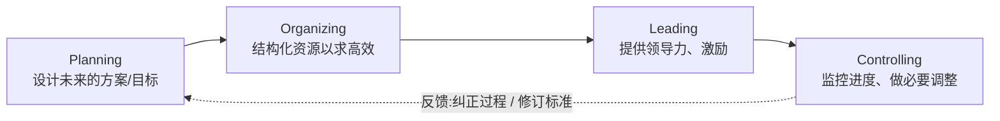
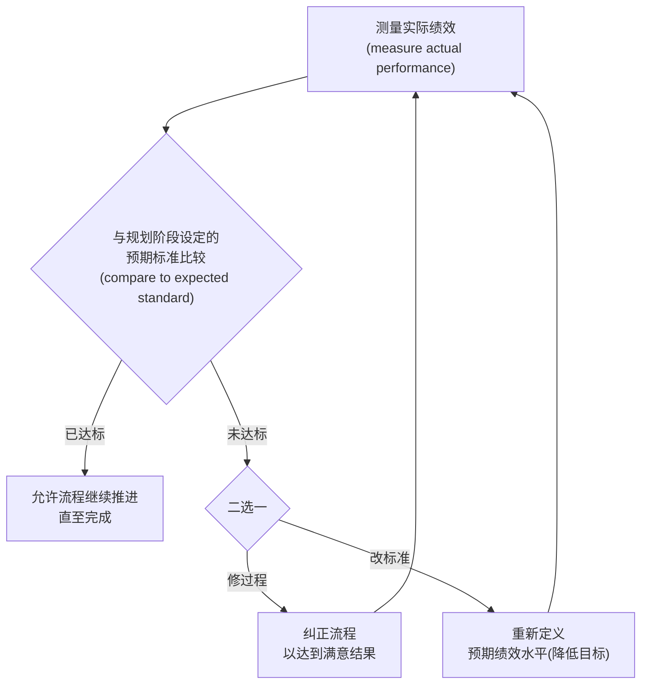
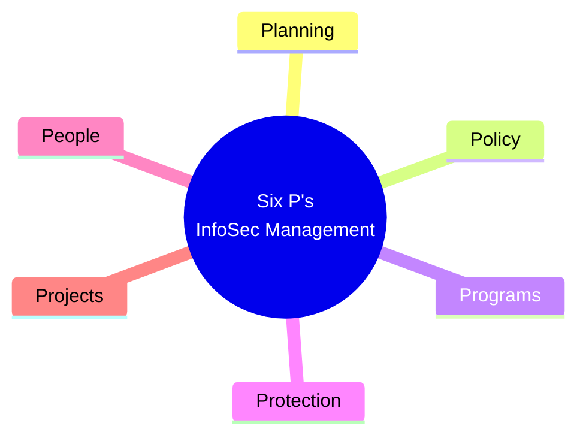
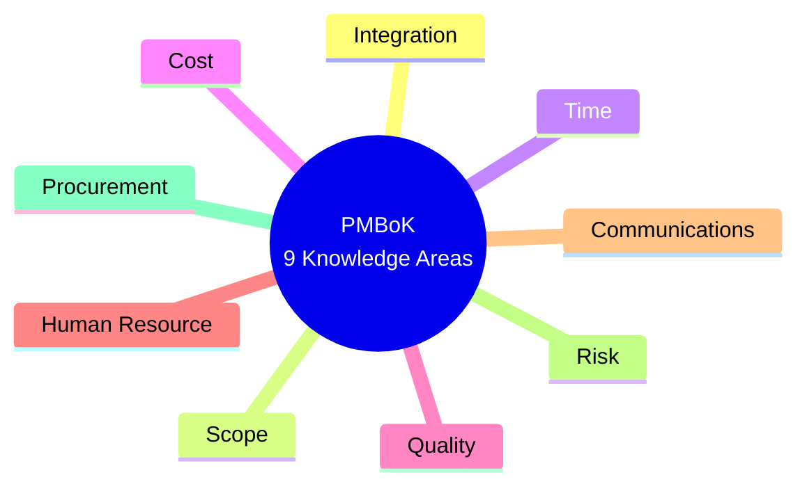
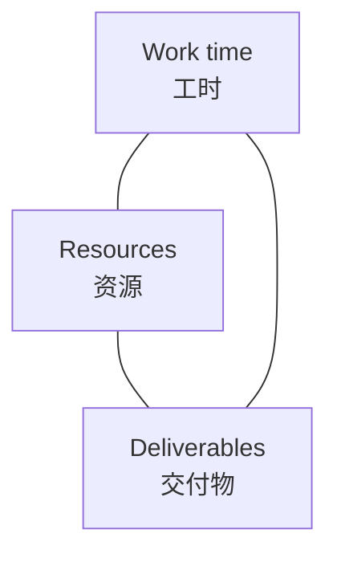
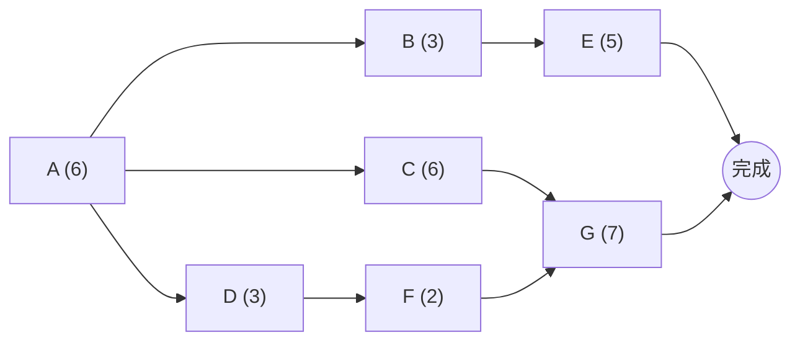

# Week 2 · 信息安全管理与项目管理 (Information Security Management & Project Management)

> **学习目标 (Learning objectives)** — 读完本章你应该能够:
> - 说清 **management** 的定义、manager 的三种角色,并准确区分 **management** 与 **leadership**,以及三种领导风格 (autocratic / democratic / laissez-faire);
> - 复述并解释 **POLC** 四大管理原则 (Planning, Organizing, Leading, Controlling),说出 **planning** 的三个层级和 **goals vs objectives** 的区别,并看懂 **control process**(负反馈控制环);
> - 背出信息安全管理的 **六个 P (Six P's)**——Planning, Policy, Programs, Protection, People, Projects——并能展开每一个,尤其是 **policy** 的三类 (EISP / ISSP / SysSP);
> - 解释为什么"信息安全是 process 而非 project",以及它如何同时是"一连串 project";
> - 列出并简述 **PMBoK** 的 **九大知识域**,重点掌握 **integration** 里的"三要素铁三角"(work time / resources / deliverables) 和 **scope creep**;
> - 熟练使用三大项目工具:**WBS**、**PERT**(会算 critical path 和 slack time!)、**Gantt chart**,并说出它们的优缺点。

本章对应 **Lecture 02 — Information Security Management**,教材仍是 Whitman & Mattord, *Management of Information Security*。Week 1 我们搭好了"信息安全是什么"的语言(CIA、IAAA、CNSS 模型);这一讲转向这门课真正的主轴——**"管理 (management)"**。整门课叫 *Management of Information Security*,所以在讲完"安全的概念"之后,必须先说清楚"管理"本身是什么,然后才能谈"如何管理信息安全"。本章的逻辑链是:**先讲通用管理 (POLC) → 再落到信息安全管理的特殊性 (Six P's) → 然后深挖六个 P 里的最后一个 P,即 project management → 最后给出做项目管理的方法论 (PMBoK) 和工具 (WBS / PERT / Gantt)。**

> 📎 **拓展(超出 slides)— 考试线索**:讲师在讲 **PERT** 时明确说"我相信 quiz 或 final exam 会出这部分的题,pay attention on this"。此外他重申了 Week 1 的安排:**assignment 1 是 week 4 的在线小测 (quiz, 10 分钟,做完即出分)**;**assignment 2 是一份个人报告 (individual report),将在 week 3 公布**;**week 4 的 workshop 会做 PERT 练习,覆盖 lecture 2 和 3 的内容**。所以本章里"**会算的东西**"(PERT 的 critical path / slack)优先级最高。

---

## 1. 什么是管理?Management、Manager 与 Leadership

这一节其实是 Lecture 01 末尾没讲完、挪到本讲开头补上的内容("what is management"),它是理解后面一切的前提。

### 1.1 Management 与 manager

先给定义。**Management(管理)** = 通过恰当地运用一组**给定的资源 (a given set of resources)** 来达成**目标 (objectives)** 的过程。一句话:**用资源把活儿干成 (using resources to get a job done)**。

那么 **manager(管理者)** 就是执行管理任务的人——组织里被指派去**调配资源 (administer resources)、协调任务完成 (coordinate the completion of the task)**、并处理过程中各种必要事项的成员。讲师强调,manager 在组织里要扮演**三种角色 (three roles)**:

| Manager 的角色 | 含义 |
|---|---|
| **Informational role**(信息角色) | 收集、处理、使用会影响目标达成的**信息** |
| **Interpersonal role**(人际角色) | 与上级、下属、外部 stakeholder 等各方**打交道、互动** |
| **Decisional role**(决策角色) | 在多种备选方案中**抉择**,化解冲突、解决组织面临的两难与挑战 |

### 1.2 Leadership vs Management:一个高频辨析点

很多人把 **leadership(领导力)** 和 **management(管理)** 当成一回事,但讲师特意点明二者不同——**这是经典考点**。

- **Leadership** 是**影响 (influencing)** 他人、让他们**心甘情愿地 (willing)** 配合去达成目标的过程,靠的不是给资源,而是给**目的 (purpose)、方向 (direction) 和激励 (motivation)**。领导者**激励、鼓舞 (inspire, motivate)** 人,**以身作则 (lead by example)**,用个人特质让别人"愿意追随"。
- **Management** 则更"务实":manager **只负责调配组织资源**——做预算 (create budgets)、批支出 (authorize expenditure)、招人 (hire employees)。

关键区别(讲师原话的逻辑):**leader 不一定承担管理职能,而 non-manager 也常被赋予领导角色**。换句话说,二者是**两个独立维度**,不是层级关系。当然,一个高效的 manager 也可以同时是高效的 leader——两者可以集于一身。

> **🔑 记忆法** — **Manager 管"资源"(预算、支出、招聘),Leader 管"人心"(方向、激励、榜样)。** 一个让事情"被安排好",一个让人"愿意去做"。

### 1.3 三种领导风格 (Leadership styles)

讲师介绍了三种基本的领导行为风格,并强调现实中优秀领导者会**因情境组合使用 (combination of styles)**,而非死守一种:

| 风格 | 做法 | 优势 | 劣势 / 适用情境 |
|---|---|---|---|
| **Autocratic**(独裁型) | 决策权全揽,"按我说的做 (do as I say)",不征求也不接受不同意见 | **高效**,不受协调各方意见的拖累;紧急任务下好用 | 若领导者**知识不足却过度自信**,决策会很差 |
| **Democratic**(民主型) | 向所有相关方征求意见、收集想法,形成多数人支持的方案 | 面对**复杂问题、且下属有专长和强烈意见**时更**有效** | **低效**——讨论辩论耗时间,紧急任务时尤其吃亏 |
| **Laissez-faire**(放任型) | "甩手掌柜",退后旁观,让过程自然推进,只做最小干预以防失控 | 当工作已经高效顺畅运转时,少干预反而好 | 缺乏方向把控,不适合需要推动力的场景 |

> **🔑 例 (Worked example)** — 一个有效的领导者会**见机切换**:情况允许时**征求意见 (democratic)**;需要立刻行动时**独断决策 (autocratic)**;若运转已经高效,就**少插手 (laissez-faire)**,让它自己跑。

---

## 2. POLC:四大管理原则

### 2.1 两套管理理论:POSDC vs POLC

管理一项任务需要一些基本技能,这些技能被称为 **management characteristics(管理特征)**。学界有**两套**经典框架(slide 3):

| 框架 | 全称 | 五/四个核心原则 |
|---|---|---|
| **POSDC** | 传统管理理论 (Traditional management theory) | **P**lanning, **O**rganizing, **S**taffing, **D**irecting, **C**ontrolling |
| **POLC** | 流行管理理论 (Popular management theory) | **P**lanning, **O**rganizing, **L**eading, **C**ontrolling |

讲师说 POSDC 在商科入门课里讲得很多,本课**不重复**;**本课聚焦 POLC**——manager 处理任务时所用的四大原则。注意 POLC 与 POSDC 的差别:POLC 把 staffing 并入了 organizing(组织人和组织时间、金钱、设备本质相同),并用 **Leading** 取代 Directing,强调"激励"而非单纯"指挥"。

### 2.2 The Planning–Controlling Link(规划—控制环)

> 📎 **拓展(超出 slides 文字)— slide 4 是一张图**。它展示 POLC 四原则**首尾相扣**的关系:**Planning** 设定目标与标准 → **Organizing** 把资源结构化 → **Leading** 提供领导力推动执行 → **Controlling** 监控进度、纠偏 → 纠偏结果又**反馈回 Planning**(必要时修订计划)。所以这是一个**闭环**,不是一条直线。

下面逐一展开四个原则。

### 2.3 Planning(规划)

**Planning** = 为达成目标而**开发、创建、实施战略 (develop, create, implement strategies)** 的过程。它从为**整个组织**制定 strategic plan 开始,再逐级拆分成各个规划要素。

**三个层级 (Three levels of planning)** —— 这是必背点:

| 层级 | 时间跨度 | 谁来做 / 例子 |
|---|---|---|
| **Strategic**(战略级) | **长期,5 年或以上** | 组织最高层 / 高管。例:大学未来 5 年的愿景规划 |
| **Tactical**(战术级) | **短期,1–5 年** | 整合企业级以下的组织资源,面向中期 |
| **Operational**(运营级) | **日常、当下、短期** | 聚焦 day-to-day 运营和局部资源 |

要理解 planning,还得分清 **goals 与 objectives**(slide 6,易混点):

- **Goal(目标)** = 规划过程的**最终结果 (end result)**。例:公司设定"市场份额增长 5%"。
- **Objective(目的/子目标)** = 让你**度量进度 (measure progress)** 的**中间点**。例:每个季度的销售增长。

> **🔑 记忆法** — **Goal 是终点,objective 是沿途的里程碑。** 把所有 objective 都按时达成,你大概率就能达成 goal。

### 2.4 Organizing(组织)

**Organizing** = 致力于**结构化资源 (structuring of resources)** 以支撑目标达成的管理职能。它要求确定:**做什么、什么顺序、由谁做、用什么方法、按什么时间线 (what / in what order / by whom / by which methods / what timeline)**。现代定义里,organizing 还**涵盖 staffing**——因为"组织人以最大化产出"和"组织时间、金钱、设备"本质上没区别。

### 2.5 Leading(领导)

**Leading** = 鼓励 planning 和 organizing 职能**落地实施**。它包括**监督员工的行为、绩效、出勤、态度 (behavior, performance, attendance, attitude)**,并大体上负责**人力资源的方向与激励 (direction and motivation of the human resource)**。具体落到:营造积极的组织文化、培养领导技能、促进团队协作。

### 2.6 Controlling(控制)与 The Control Process

**Controlling** = **监控进度 (monitoring progress)** 并做必要调整以达成目标。它的核心使命是**确保计划的有效性 (assure the validity of the plan)**:确认进度足够、障碍被妥善解决、没有超出原计划的资源消耗。如果发现计划与组织的运营现实不符,manager 就要**采取纠正措施 (corrective actions)**。

> 📎 **拓展(超出 slides 文字)— slide 10 "The Control Process" 是图**,讲的是 control 依赖一种叫 **cybernetic control loop(控制论控制环)** 的机制,也常被称为 **negative feedback(负反馈)**。它的运转步骤是:

负反馈的意义在于:让系统**始终朝目标对齐 (stay on track)**,最小化偏离预期标准的风险。注意讲师强调的关键点——**预期标准是在 planning 阶段就定好的**(规划时就定义了什么算成功、什么算失败),controlling 阶段只是拿实际去对照它。

> **🔑 关键直觉** — 未达标时有**两条出路**:要么**改进过程**把绩效拉上来,要么**降低目标**让标准变得现实。考试若问"控制环发现绩效不达标怎么办",这两条都要答。

---

## 3. 从通用管理到信息安全管理:特殊性与冲突

讲师在进入 Six P's 之前,先讲了一段**为什么信息安全管理"不一样"**的内容(主要在 transcript 里),这是理解 Six P's 动机的钥匙。

信息安全管理团队 (InfoSec management team) 也用前面那套 leadership/management 的通用特征运作,**但它的目标常常与 IT、与一般业务部门不同,甚至冲突**:

- **IT 部门**的首要关注是**高效处理信息 (effective and efficient processing of information)**;
- **InfoSec 部门**的首要关注是保障信息的 **confidentiality、integrity、availability**(以及其他特性)。

二者天然会"打架",因为**安全本质上会拖慢运营**——信息要被验证、核对、按安全标准评估。

> **🔑 例 (Worked example)— 为什么安全拖慢效率** — 想让信息处理又快又省,可以直接用**明文 (clear text)** 传输;但这不保护 confidentiality。要保密就得做 **encryption(加密)**:把明文变成外人读不懂的形式,只有持 **key** 的人能 **decrypt** 还原。跑加密/解密算法当然会**拖慢处理速度**,于是和 IT 追求的"效率"产生矛盾。

这也是组织架构上的安排:**CISO (Chief Information Security Officer)** 领导安全管理团队,**通常向 CIO (Chief Information Officer) 汇报**(CIO 负责整个 IT 职能)。当 InfoSec 与 IT、与业务部门的目标冲突时,往往需要**上层管理 (upper management) 出面介入**才能化解。

> 📎 **拓展(超出 slides)— 战略翻译链 (strategy translation)**:transcript 里讲师补充了规划如何层层下沉——**business strategy → IT strategy → InfoSec strategy**。一般业务部门定出整个组织的 strategic plan;**CIO** 负责把"业务战略"翻译成"IT 战略";再结合 IT 战略与各业务单元的具体战略,**CISO** 与安全经理们一起,制定信息安全的 **tactical 和 operational** 计划。这条链解释了为什么 InfoSec planning 是"基本 planning 模型的延伸"(下一节 6P 的第一个 P)。

---

## 4. 信息安全管理的六个 P (The Six P's)

讲师说,因为信息安全管理是一个非常专门的领域,它的管理职责有六个独特的部分,称为 **Six P's**(slide 11)。**这六个 P 必须能完整背出**:

| P | 一句话定位 | 本课后续在哪讲 |
|---|---|---|
| **Planning** | InfoSec 的规划 | 多个 lecture(尤其 L3/L4) |
| **Policy** | 组织行为准则 | 一个专门 lecture |
| **Programs** | 作为独立实体管理的安全运营(如 SETA) | 1–2 个 lecture |
| **Protection** | 通过风险管理执行保护 | 风险管理 + 保护机制 lecture |
| **People** | 最关键的一环 | 1–2 个 lecture(人的安全) |
| **Projects** | 项目管理 | **本讲重点深入** |

讲师对前五个 P **只做简要定义**,把最后一个 P(project management)留到本讲后半深入。

### 4.1 Planning(规划)

InfoSec 里的 planning 是第 2 节那套**基本 planning 模型的延伸**,涵盖支撑信息安全战略的**设计、创建、实施**所需的全部活动。它有很多**类型 (types of InfoSec plans)**(slide 13):

- **Incident response planning**(事件响应规划)
- **Business continuity planning**(业务连续性规划)
- **Disaster recovery planning**(灾难恢复规划)
- **Policy planning**(策略规划)
- **Personnel planning**(人员规划)
- **Technology rollout planning**(技术部署规划)
- **Risk management planning**(风险管理规划)
- **Security program planning**(安全计划规划,含 education / training / awareness)

> 📎 **拓展(超出 slides)** — 前三项(incident response / business continuity / disaster recovery)会在后面"**planning for contingencies(应急规划)**"那一讲集中展开,这里只需记住它们都属于 InfoSec planning 的家族。

### 4.2 Policy(策略)

**Policy** = 规定组织内某些行为的**一套组织指南 (set of organizational guidelines)**。信息安全里有**三类**策略——这是必背的层级结构:

| 策略类型 | 全称 | 作用 / 例子 |
|---|---|---|
| **EISP** | Enterprise Information Security Policy | 在**战略 IT 计划**框架内制定,为整个组织的 InfoSec 部门**定基调 (sets the tone)**;通常由 **CISO 起草**,由 CIO/CEO 等高管**签署**。**全组织只有一份** |
| **ISSP** | Issue-Specific Security Policy | 针对**某一具体技术**的可接受行为规则。例:email 使用policy、internet 使用policy、如何安全使用学校 IT 设施。**可有多份**(有多少个 issue 就可能有多少份) |
| **SysSP** | System-Specific Policy | **技术性**策略,控制某一**设备或技术**的配置与使用。例:**ACL (access control list)** 定义某设备允许的访问 |

> **🔑 记忆法** — 从上到下越来越**具体、越来越技术**:**EISP**(全组织一份,定方向)→ **ISSP**(按议题分,管"某类技术怎么用")→ **SysSP**(管"某台设备怎么配")。

### 4.3 Programs(计划/项目群)

**Programs** = 被**作为独立实体单独管理 (managed as separate entities)** 的 InfoSec 运营。最典型的是 **SETA program (Security Education, Training and Awareness)**——向员工提供关键信息以维持/提升安全知识水平。

> **🔑 例(讲师亲述)** — 学校就有很活跃的 SETA program:学生和教职工会**收到邮件**,要求做"指引性小测 (guidance quiz)",提醒大家警惕网络威胁、不要点击邮件里的可疑链接(phishing / scamming)、如何安全使用邮箱。

其他 program 还包括 **physical security program**(含消防、物理门禁、gates、guards 等);受特定法规约束的组织还可能有专门的**隐私 (privacy)** 计划。

### 4.4 Protection(保护)

**Protection** 通过一系列**风险管理活动 (risk management activities)** 来执行,包括 **risk assessment 和 risk control**,以及各种**保护机制、技术、工具 (protection mechanisms, technologies, and tools)**。每一种机制都代表了整体 InfoSec 计划中对某类**具体控制 (specific control)** 的管理。

> 📎 **拓展(超出 slides)** — 后面有**两讲**专门讲 risk management,还有**一讲**讲 protection mechanisms,所以这里只需记住 protection 的"入口"是风险管理。

### 4.5 People(人)

**People** 是信息安全计划中**最关键的一环 (the most critical link)**。这个领域包含**两个易混的方面**:

- **Security personnel(安全人员)** = 专门做信息安全工作的**专业员工**(即"做安全的人");
- **Security of personnel(人员的安全)** = 保护**所有员工**及其信息(即"为每个人做的安全"),也包含 SETA program 的部分内容。

> **🔑 辨析** — **"security personnel" 是人(做安全的那批专业人员);"security of personnel" 是事(保护全体员工的安全)。** 两个短语词序一变,意思完全不同,考试爱考。

### 4.6 Projects → 引出项目管理

第六个 P 是 **Projects**。无论是上线一套新的安全培训,还是选型并部署一台新防火墙,**都应当作为"项目 (project)"来管理**。这正是本讲后半的主题,下一节展开。

---

## 5. 项目管理基础 (Project Management)

### 5.1 为什么信息安全里要谈项目管理?Process vs Project

讲师先回答了一个学生常有的疑问:**为什么这门安全课要讲项目管理?**

乍看之下,**信息安全是一个 process(持续过程),不是 project(一次性项目)**。但讲师给出关键洞见:

> **信息安全既是 process 又是 project——因为它本质上是"一连串/一条链的 project (a continuous series, or chain, of projects)",这些 project 串起来构成了整体的 process。**

- **Project(项目)** = 有**明确起点和明确完成点**的、**离散的 (discrete)** 活动序列;它是**临时性 (temporary)** 活动,用来产出某个特定的产品、服务或结果。
- **Process / Operation(过程/运营)** = **持续进行、没有终点**的活动。

有些信息安全工作**不是 project,而是被管理的 process(operations)**(slide 19):

- 监控内外部环境 (monitoring internal/external environments)
- 持续的风险评估 (ongoing risk assessments)
- 持续的漏洞评估与修复 (continuous vulnerability assessment)

> 📎 **拓展(超出 slides)— slide 20 是一张"信息安全计划链 (InfoSec program chain)"图**。它把整个安全工作画成一条链,**每个链环 (link) 是一个独立的 project**:从 initial 起步 → EISP(企业安全策略)→ risk management process → business impact analysis → network perimeter & DMZ design → firewall implementation → … → 直到 design/planned 状态。每个 project 都由一套 **SecSDLC(安全系统开发生命周期)** 方法论来指导。这张图就是"安全 = 一连串 project 串成的 process"的可视化。

### 5.2 Project Management 的定义

**Project management** = 把**知识、技能、工具、技术 (knowledge, skills, tools, and techniques)** 应用到项目活动上,以满足项目要求。它通过一组**过程**来完成——**initiating, planning, executing, controlling, closing(启动、规划、执行、控制、收尾)**。与持续的 operation 不同,project management 涉及**临时组建一支队伍 (temporary assembling of a group)**,项目完成后成员被释放、再分配到其他项目。

注意:虽然 project 有终点,但**不代表只发生一次**——有些 project 是**迭代的 (iterative)、会定期重复的**。例:**预算编制 (budgeting)** 就是个迭代项目,每年预算委员会都要重新走一遍。

最朴素的三件事(slide 18):**识别并控制投入项目的资源 → 度量进度 → 随进度调整过程**——这其实就是第 2.6 节"负反馈控制环"在项目上的应用。

### 5.3 项目管理的好处 (Benefits)

组织若把 project management 当作优先事项,可获多重收益(slide 22):

- 实施一套**方法论 (methodology)**,如 **SecSDLC**,确保**不漏步骤 (no steps missed)**;
- 创建详细的**活动蓝图 (blueprint)**,提供共同参考、缩短学习曲线、提升团队产出;
- **明确各人职责**,减少"谁在何时做了什么"的含糊与混乱;
- **清晰界定约束 (constraints)** 与最低质量要求,提高项目守住边界的概率;
- 建立**绩效度量 (performance measures)** 和**里程碑 (milestones)**,简化监控;
- **尽早发现**质量/时间/预算上的偏差,从而尽早纠正。

### 5.4 什么算项目成功 (Project success)

一个项目被认为成功,一般满足三条(slide 23):

1. **按时或提前完成 (on time or early)**;
2. **不超预算 (at or below budgeted amount)**;
3. **满足审定的项目定义中列出的全部规格,且交付物被接受 (meets all specifications)**。

对**信息安全项目**而言,目标统一为:让 InfoSec 计划的所有要素都以**高质量交付物 (quality deliverables)、按时 (timely)、在预算内 (within budget)** 完成——记住这**三大目标**。

> 📎 **拓展(超出 slides)— slide 24 是一张招聘启事图**。讲师用它说明:即便是普通的 **InfoSec analyst(非管理岗)**,招聘要求里也常写"需要 strong project management skills"。很多咨询公司把信息安全服务与项目管理**捆绑提供**。这就是为什么"主修安全也得学项目管理"。

---

## 6. 把项目管理用于安全:PMBoK 九大知识域

### 6.1 选定方法论:PMBoK

要把项目管理应用于信息安全,**第一步是选定一套成熟的项目管理方法论**。信息安全项目经理常用的是 **PMBoK (Project Management Body of Knowledge)**——由 **PMI (Project Management Institute)** 推广,被视为**行业最佳实践 (industry best practice)**。其他方法论也存在,但 PMBoK 是首选参考。

> 📎 **拓展(超出 slides)— slide 26 "PMBoK Knowledge Areas" 是一张表**,列出九大知识域的名称、关注点和典型过程。下面把九个域逐一过一遍——**九个名字要能背出**。

### 6.2 ① Integration management(整合管理)——含"铁三角"

**Project integration management** 包含协调项目各组件之间(及内部)所需的全部过程。需要整合的要素包括:初始项目计划的制定、执行中的进度监控、计划修订的控制、资源分配变更的控制(绩效度量会引发对计划的调整——又是负反馈)。

**核心是 project plan development**:把所有项目要素整合成一个连贯计划,目标是**在限定工时内、用不超过限定的资源,完成项目**。这里有本讲**最重要的概念之一——三要素铁三角**(slide 28):

> **项目计划的三个核心要素:Work time(工时)、Resources(资源)、Deliverables(交付物)。改变其中任何一个,几乎必然影响另外两个。**

> **🔑 例 (Worked example)— 三要素如何互相牵制**(讲师反复推演):
> - 想**保持工时和资源不变**,却想**增加交付物**?几乎不可能——要么加工时,要么加资源。
> - 想**减少资源**,却想**保持交付物不变**?那只能**增加工时**。
> - 想**压缩工时**(比如只买 1000 工时的临时工)?要么交付物缩水,要么就得**加资源**来补。
>
> 一句话:**三者互相依赖,你不能三者全占。**

整合复杂的信息安全项目时,常出现三类**复杂情形 (complications)**(slide 29):

- **Conflicts among communities of interest**(利益群体间冲突)——业务单元或 IT 不理解/不认同安全项目的必要性,因而不全力支持(安全常降低其他部门效率,如邮件防火墙、CCTV 影响隐私);
- **Far-reaching impact**(影响面广)——安全项目常跨整个企业,触及那些反对它的部门;
- **Resistance to new technology**(对新技术的抵触)——安全项目常引入新技术,相关人员不愿学习/适应,可能需要专门培训。

### 6.3 ② Scope management(范围管理)——含 scope creep

**Project scope management** 确保项目计划**只包含完成项目所必需的活动**。它的头号大敌是 **scope creep(范围蔓延)**:

> **Scope creep** = 项目交付物的**数量或质量**相对原计划被**扩大 (expanded)**。

有经验的项目经理遇到 scope creep,会要求**相应地扩大工时、扩大资源,或两者都扩**。主要过程:scope planning、scope definition、scope verification、change control。

### 6.4 ③ Time management(时间管理)

**Project time management** 确保项目在既定完成日期前完工。**错过截止日期是项目管理中被引用最多的失败之一**(很多误期源于规划阶段的错误——低估了所需时间/资源,或高估了交付物的数量/质量)。过程:activity definition、activity sequencing、activity duration estimating、schedule development、schedule control。

### 6.5 ④ Cost management(成本管理)

**Project cost management** 确保项目在**资源约束 (resource constraints)** 内完成。有些项目只给一个**财务预算 (financial budget)**,所有资源都得从中采购。过程:resource planning、cost estimating、cost budgeting、cost control。

### 6.6 ⑤ Quality management(质量管理)

**Project quality management** 确保项目充分满足项目规格。讲师强调:**"质量"在这里定义其实很清晰**——

> **若交付物满足项目计划中规定的要求,就达到了 quality objective;否则就没达到。** 就这么简单。

所以好的计划要用**无歧义的术语 (unambiguous terms)** 定义交付物,便于拿实际结果逐项对照。过程:quality planning、quality assurance、quality control。

### 6.7 ⑥ Human resource management(人力资源管理)

**Project HR management** 确保分配到项目的人员被**有效使用**。给项目配人要仔细估算工时:**人太少**几乎注定误期,**人太多**又浪费资源、可能超出资源上限。复杂因素:每个人效率不同、技能起点不同、实际人员的技能组合很少正好匹配计划需求(可能要做不擅长的活,导致更慢更贵;或要去外部找稀缺技能,几乎必然拖期或增本)。

信息安全项目还有**额外复杂性**:

- **Extended clearances(更高的安全许可)**——安全项目常涉及组织的敏感区域,只有拿到相应 clearance 的人才能进入(银行等金融业、政府机构尤甚);
- **部署对组织全新的技术**——缺乏现成的熟练人才池,安全项目比常规开发项目更易遇到技能短缺。

过程:organizational planning、staff acquisition、team development。

### 6.8 ⑦ Communications management(沟通管理)

**Project communications management** 把项目活动的细节传达给所有相关方,包含文档/消息等信息的**创建、分发、分类、存储、销毁 (creation, distribution, classification, storage, destruction)**。在安全项目里,**克服变革阻力 (resistance to change)** 比传统开发项目更难——用户和 IT 伙伴可能不确定项目意义、担心影响自己的工作,极端情况下甚至有敌意;**唯一的化解之道是启动 education / training / awareness 计划**。过程:communications planning、information distribution、performance reporting、administrative closure。

### 6.9 ⑧ Risk management(风险管理)

**Project risk management** 包含评估、缓解、管理、降低不利事件对项目影响的过程。它**很像整体的安全风险管理,只是范围和规模小得多**——保护对象是单个项目,而非整个组织。很多时候,**识别并给威胁评级、估算其发生概率**就足够了。过程:risk identification、risk quantification、risk response development、risk response control。

### 6.10 ⑨ Procurement management(采购管理)

**Project procurement management** 包含获取项目所需资源的过程。项目经理可能直接从组织库存**领用 (requisition)**,也可能需要**指定需求、招标、评标、谈合同**。信息安全项目的采购往往**更复杂**——比一般 IT 项目更可能需要不同的软硬件产品和不同技能的人。过程:procurement planning、solicitation planning、solicitation、source selection、contract administration、contract closeout。

> **🔑 九大知识域速记** — **"整范时成质,人沟险采"**:Integration、Scope、Time、Cost、Quality、Human resource、Communications、Risk、Procurement。每个域的"过程列表"不必死背,但**域的名字和它管什么**要清楚。

---

## 7. 项目管理工具 (Project Management Tools)

讲完方法论,讲师转到**具体工具**。工具分两类:**建模方法 (modeling approaches)**(如 PERT、CPM)和**软件 (software)**。大多数项目经理会把实现这些建模方法的软件工具组合起来用。

### 7.1 认证与一个陷阱:Projectitis

- **项目管理认证**:由 **PMI** 颁发,两个证书——**PMP (Project Management Professional)**(很多项目经理必备)和 **CAPM (Certified Associate in Project Management)**。
- **Projectitis(项目炎/项目癖)** —— IT 与 InfoSec 项目的常见陷阱:

> **Projectitis** = 项目经理花在**记录任务、收集绩效度量、更新完工预测**等"文书工作"上的时间,**超过了**花在**真正有意义的项目工作**上的时间。

其**前兆 (precursor)** 是:在取得工作共识之前,就去开发一份**过度精致、显微镜级详尽**的计划。讲师提醒:工具用得当能提升协调与沟通,但每个项目经理都要在"详细规划/记录"和"专注实际工作"之间找到平衡。

### 7.2 工具一:Work Breakdown Structure (WBS,工作分解结构)

**WBS** 是创建项目计划的**最简单的规划工具**,用一张电子表格(Excel,有时甚至 Word)就能做。做法:先把项目计划**拆成几个主要任务 (major tasks)**,放进 WBS 任务清单;每个任务再进一步细分为更小的任务或具体行动步骤。

每个任务要确定的**最小属性 (minimum attributes)**(slide 41):

| 属性 | 含义 |
|---|---|
| **Work to be accomplished** | 要完成的工作:活动 + 交付物 |
| **Estimated effort** | 完成所需的估计工作量(小时或工作日) |
| **Skills needed** | 执行任务所需的通用或专长技能 |
| **Task interdependencies** | 任务间的依赖关系 |

随着计划深入,可逐步**追加属性**(slide 42):估计的 **capital / noncapital 支出**、按技能的任务分配、开始与结束日期。

> 📎 **拓展(超出 slides)— slide 43/44 是 WBS 的两张示例图**,讲的是一个"给外地办公室装防火墙"的项目。**早期草稿 (slide 43)** 是一张四列表——**Task / Effort / Skill / Dependencies**,把项目拆成 7 个主任务,例如:
>
> | # | Task | Effort | Skill | Dependency |
> |---|---|---|---|---|
> | 1 | 联系外地办公室、确认网络假设 | 2h | Network architect | — |
> | 2 | 采购标准防火墙硬件 | 4h | Network architect + 采购组 | 1 |
> | 3 | 配置防火墙 | … | … | 2 |
> | 4 | 打包并寄送防火墙到外地 | … | … | 3 |
> | 5 | 与当地技术资源协作安装并测试 | … | … | 4 |
> | 6 | 完成网络漏洞评估 | … | … | 5 |
> | 7 | 远端办公室签收,更新网络图与文档 | … | … | 6 |
>
> **更详尽的版本 (slide 44)** 把任务进一步拆细,并加上**开始/结束日期**与**capital / noncapital 支出**估计。
>
> 顺带澄清两个会计术语(讲师补充):**capital expenditure(资本性支出,即 fixed assets 固定资产)**——非流动资产,如土地、建筑、机器、设备、家具;**noncapital expenditure(非资本性支出)**——运营预算里的开销,如日常维护、水电、管理费、保险。

WBS 优点:**极易理解、易于创建和维护**,是最常用的工具。但当项目变大(哪怕只是几十个任务),任务分配与排程的可能性会爆炸式增长,WBS 就难以维护了——这时需要更强的工具。

### 7.3 工具二:Network Scheduling(网络排程)

当项目规模上来后,可用 **network scheduling(网络排程)**。这里的 "network" **不是计算机网络**,而是指"通往项目完成的各种可能路径所织成的网 (the web of possible pathways to project completion)"——本质是一张**有向图**。

> 📎 **拓展(超出 slides)— slide 46 是网络图示例**。基本逻辑:用箭头表示"先后依赖"。例如 **A(装防火墙)必须先于 B(配置防火墙规则),B 必须先于 C(测试运行)**——没装好就没法配规则,没规则就没法测试。更复杂的图里,一个活动可以有多个前置,多个活动也可共享同一前置,还能表示"可并行 (concurrent) 的活动"。

最流行的网络依赖图技术就是下面的 **PERT**。

### 7.4 工具三:PERT(重点!会考)

> 📎 **考试重点(讲师明确点名)** — "I believe there will be questions, either for the quiz or the final exam, on this part. Pay attention on this." 下面的 worked example **务必学会算**。

**PERT (Program Evaluation and Review Technique)** 是最流行的网络依赖图技术,**1950 年代末**为快速膨胀的(政府主导的)工程项目而生(如武器系统采购)。**PERT 图描绘一连串事件,后接关键活动及其持续时间 (durations)**。与它几乎同时、在工业界诞生的姊妹技术是 **CPM (Critical Path Method)**,二者非常相似;本课聚焦 PERT。

画 PERT 图,对每个活动要回答**三个关键问题**(slide 48):

1. **这个活动要花多久?** (How long will this activity take?)
2. **紧接在它之前的是哪个活动?** (What activity occurs immediately before?)
3. **紧接在它之后的是哪个活动?** (What activity occurs immediately after?)

两个**核心概念**:

- **Critical path(关键路径)** = 从起点到终点、**持续时间最长 (longest duration)** 的活动序列。**注意:是"时长最长",不是"活动数最多"!** 关键路径上的任务**不能延误**,否则整个项目延期。
- **Slack time / lag time(松弛时间)** = 某条非关键路径与关键路径的**时长之差**。非关键路径上的任务,可以在 slack 范围内延误而**不影响整个项目**——它们是"可以接受延误"的合理候选。

#### PERT worked example(讲师课堂逐步算的例子)

> 📎 **slide 49 是这张 PERT 例图**。共 **7 个活动 A–G**,每个活动标注 earliest start / earliest finish(箭头上方圆圈)、latest start / latest finish(下方方框)、以及 duration(箭头下方)。从最左圆圈开始,到最右圆圈(完成)。各路径如下:

从 A 出发后有三条路可到终点。把每条路径的**duration 相加**:

| 路径 | 各活动时长 | 总时长 |
|---|---|---|
| **A → B → E** | 6 + 3 + 5 | **14 天** |
| **A → C → G** | 6 + 6 + 7 | **19 天** ⬅ 最长 |
| **A → D → F → G** | 6 + 3 + 2 + 7 | **18 天** |

**关键路径 = A → C → G = 19 天**(时长最长,在原图中用实线粗链表示)。结论:

- **整个项目最快需 19 天**(由关键路径决定);
- **路径 A→D→F→G = 18 天**,比关键路径短 1 天 → **slack = 19 − 18 = 1 天**:这条路上的任务总共可延误最多 1 天而不拖累项目;
- **路径 A→B→E = 14 天**,**slack = 19 − 14 = 5 天**:松弛最大。所以活动 E 虽然**最早第 9 天**就能开始,却可**最晚拖到第 14 天**才开始,仍不影响项目完工。

> **🔑 解题套路** — ①列出从起点到终点的所有路径;②每条路径把活动 duration **相加**;③**最长的那条 = critical path = 项目总工期**;④其余每条路径的 **slack = 关键路径时长 − 该路径时长**。**别被"活动数量"误导,只看时长之和。**

#### PERT 的优缺点

| 优点 (Advantages, slide 50) | 缺点 (Disadvantages, slide 51) |
|---|---|
| 便于规划大型项目(易识别前置/后续活动) | 图在**超大项目**里**笨重难读 (awkward & cumbersome)** |
| 通过算关键路径,可判断**按时交付的概率** | 开发与维护**成本高**(过程复杂时) |
| 能**预判系统变更的影响**(某处延误如何波及全局) | **任务时长难以准确估计**;估错会**让关键路径计算失效**(若 slack 很小,小误差就可能导致关键路径识别错误) |
| 信息呈现**直观**,技术与非技术经理都看得懂 | |
| **无需正式培训**,一两张幻灯片就能讲明白 | |

### 7.5 工具四:Gantt Chart(甘特图)

**Gantt chart** 以发明者 **Henry Gantt** 命名,比 PERT/CPM 更早(20 世纪初)。它**像网络图一样易读易懂、便于向管理层展示**,而且**比 PERT 更易设计实现**,却能给出**大致相同的信息**。

结构(slide 52):

- **纵轴 (vertical axis)** 列出**活动 (activities)**;
- **横轴 (horizontal axis)** 是**时间线 (timeline)**;
- 每个**横条 (bar)** 代表一个活动,从开始延伸到结束;**条的长度 = 该阶段的持续时间**;**重叠的条 = 可并行的活动**,不重叠则须顺序执行。

> 📎 **拓展(超出 slides)— slide 53 是甘特图示例**。它能在一张简单图里展示丰富信息:某活动完成了多少、哪个活动**超前 (ahead of schedule)**、哪个**滞后 (behind schedule)**。

### 7.6 自动化工具与一个清醒的提醒

**Microsoft Project** 是被广泛使用的项目管理工具,能画甘特图并做更多事(此外还有 Monday、Asana、Zoho,以及近年大量 AI 辅助的工具)。但讲师给了几条**反复强调的告诫**(slide 54):

- **软件(无论是否 AI)替代不了一个熟练、有经验的项目经理**——人能**真正理解**项目,而理解决定了对错(如何定义任务、分配与管理稀缺资源);
- **软件工具可能"碍事"**——若你花太多时间用工具记录进度,反而忘了项目目标;
- **选一个你能用好的工具**——熟悉的简单工具,胜过复杂到你驾驭不了的工具。讲师举例:有些数百万美元的项目,仅靠一张简单电子表格 + 大量扎实工作就按时、在预算内完成了。

> **🔑 一句话** — **工具是手段,不是目的;会用工具的人,比工具本身重要。**

---

## 8. 本章关键takeaways

1. **Management vs Leadership**:management 调配资源(预算/支出/招聘),leadership 影响人心(方向/激励/榜样);二者独立,可集于一身。三种领导风格——autocratic / democratic / laissez-faire,实战中组合使用。
2. **POLC**:Planning(三层级 strategic/tactical/operational;goals 是终点、objectives 是里程碑)、Organizing、Leading、Controlling(负反馈控制环:测量→对照标准→达标则继续/不达标则改过程或降标准)。
3. **Six P's**:**P**lanning、**P**olicy(EISP 全组织一份 / ISSP 按议题 / SysSP 管设备)、**P**rograms(SETA)、**P**rotection(靠风险管理)、**P**eople(最关键;security personnel ≠ security of personnel)、**P**rojects。
4. **Process vs Project**:信息安全是"一连串 project 串成的 process";监控、持续风险/漏洞评估属于 operations(非 project)。项目成功 = 按时 + 不超预算 + 满足规格。
5. **PMBoK 九大知识域**:Integration(含 work time/resources/deliverables **铁三角**)、Scope(防 **scope creep**)、Time、Cost、Quality、HR、Communications、Risk、Procurement。
6. **四大工具**:**WBS**(最简单,任务+工时+技能+依赖)→ **Network scheduling** → **PERT**(★会算 critical path = 最长时长路径,slack = 关键路径 − 该路径)+ CPM → **Gantt chart**(纵轴活动、横轴时间)。**Projectitis** = 文书压过实干。
7. **工具观**:软件替代不了熟练的项目经理;选你能用好的工具。

> 📌 **复习优先级建议**(据讲师明示):**PERT 的计算(critical path / slack)是 quiz/exam 高概率考点,务必动手算熟**;其次是能背全 **Six P's**、**Policy 三类**、**PMBoK 九域名称**,以及 **management vs leadership** 的辨析。
