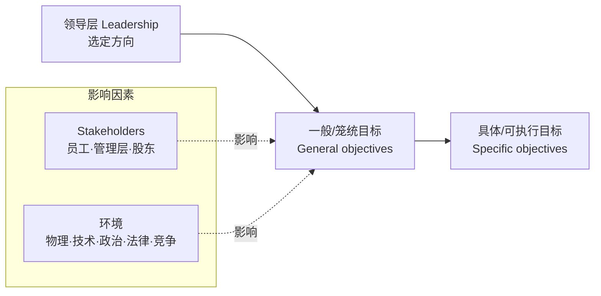
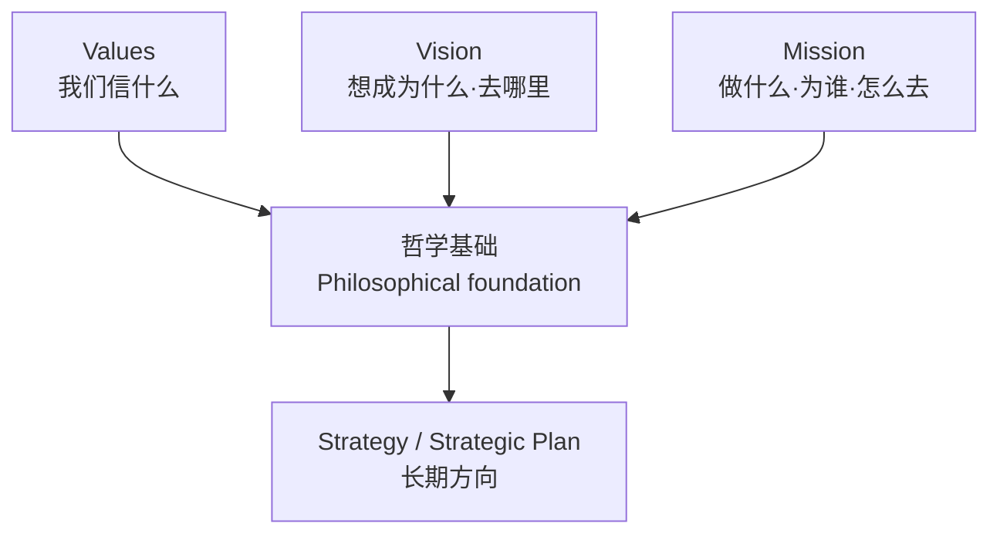
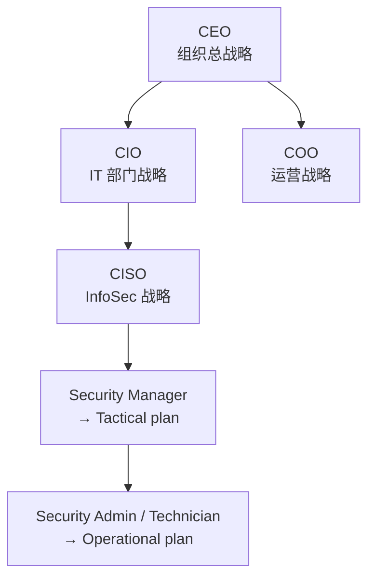
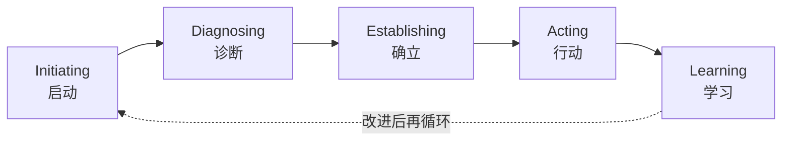
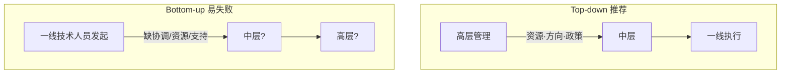
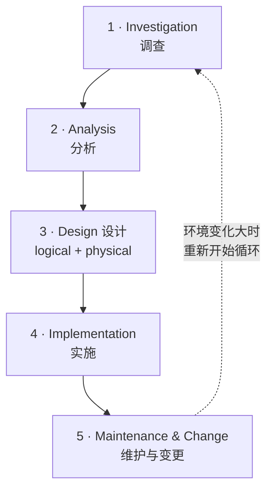
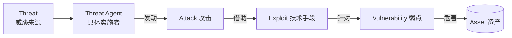
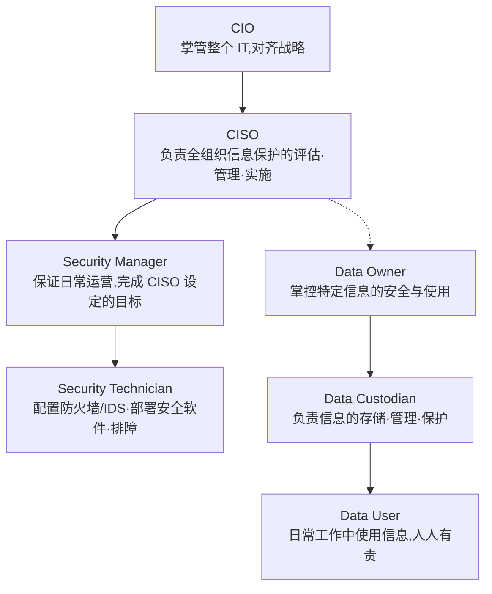
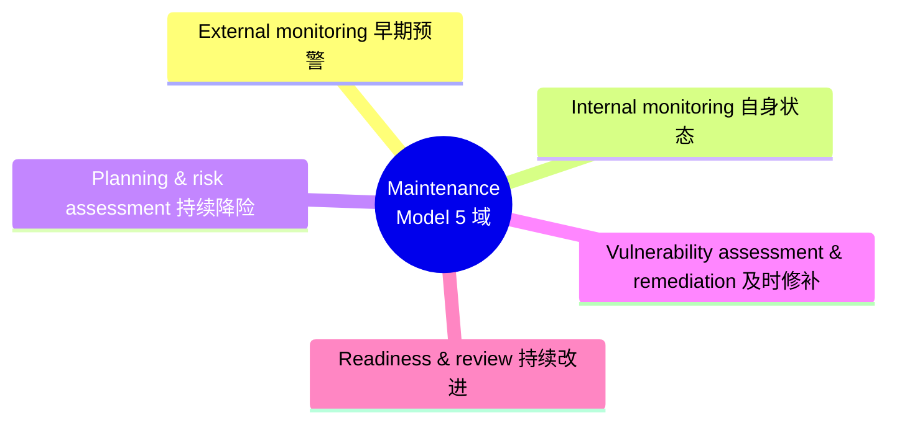

# Week 3 · Planning for Security(安全规划)

> **CSIT988/488 — Security, Ethics and Professionalism** · A/Prof Khoa Nguyen · Autumn 2026
> 本章对应 Lecture 03,52 页 slides + 课堂录音。

> **学习目标 (Learning objectives)** — 读完本章你应该能够:
> - 解释什么是 **planning**(规划),并说清它为什么是组织管理的核心手段;
> - 区分并举例四份**foundational documents**:values / vision / mission statement 与 strategy;
> - 区分**strategic / tactical / operational** 三个规划层级,并能在 InfoSec 语境下对应到 CISO / security manager / technician;
> - 解释 **InfoSec governance** 和 **GRC**,说出 governance 应产生的 5 个 desired outcomes,并描述 **IDEAL** 模型五个阶段;
> - 对比 **bottom-up** 与 **top-down** 两种安全实施路径,说明为什么大型组织偏向 top-down;
> - 完整描述 **SecSDLC** 的各个阶段(investigation → analysis → design → implementation → maintenance),并知道每个阶段做什么;
> - 区分 **threat / attack / vulnerability / exploit** 四个核心概念,背出 **12 类威胁**,并区分 technical 与 non-technical attack;
> - 说出三类 **controls**(managerial / operational / technical)各自管什么。

本章回答一个非常实际的问题:**一个组织要"做信息安全",到底是从哪里、按什么顺序开始的?**

讲师在开头点明了本章在整门课里的位置:前几周我们谈的是"信息安全管理"这件大事,以及它和一般管理(general management)、项目管理(project management)的关系。本周聚焦其中一个最基础的环节——**planning**。规划之所以重要,是因为现实中**资源永远是受限的**(人力、财力都有限),而好的规划能让组织"把有限的材料用到极致"。本章先讲组织层面的通用规划,再讲它如何具体落到信息安全上;下一章(Week 4, Planning for Contingencies)再深入讲"意外发生时怎么办"。

---

## 1. 什么是 Planning,为什么离不开它

我们每天都在"计划"做事,但在管理学里,**planning(规划)** 有一个精确的含义:它是**为达成目标而开发、创建并实施策略 (strategies) 的过程**(the process that develops, creates, and implements strategies for the accomplishment of objectives)。注意这是一个**过程**,不是一份文档——它要求你列出一连串**有意为之的行动步骤 (a sequence of actions)**,在一个**确定的时间段内**去实现具体目标,然后还要**控制这些步骤的执行**。

为什么组织离不开它?设想一个没有统一规划的公司:每个部门各凭自己的想法去追求自己的目标,谁也不知道别人在干嘛。讲师讲得很直白——这种"各自为政"(uncoordinated effort)几乎一定会失败,因为各部门的努力无法汇聚成组织的整体目标,而且会造成**资源浪费和重复劳动 (waste and duplication of efforts)**。规划的价值正在于此:它给整个组织一个**统一的剧本 (a uniform script)**,提高效率、减少浪费。所以课上有一句概括——**planning 是现代组织管理资源的"主导手段" (the dominant means of managing resources)**,它为组织的未来提供方向。

规划还有一个关键的方向性特征:它是一个 **top-down(自上而下)过程**。组织的**领导层 (leadership) 先选定方向和倡议 (direction and initiatives)**,然后这个方向层层向下细化。用一句话记住它的节奏:**从一般开始,以具体结束 (begins with the general, ends with the specific)**。最高层的规划往往只有很少、很笼统的目标;越往下,目标越具体、越可执行。这个"从笼统到具体"的转化,是贯穿本章的主线,后面三个规划层级讲的就是它。

> 📎 **拓展(超出 slides)** — 讲师提到这接续上一讲的 **POLC** 框架(Planning, Organizing, Leading, Controlling,管理的四项基本职能)。Planning 是 POLC 的第一项,本章相当于把这个 P 单独拎出来深入讲。

### 规划牵涉谁:三个 communities of interest

规划不是某个人关起门来写,它牵涉**许多相互关联的群体和组织过程 (interrelated groups and processes)**。参与者既有内部的也有外部的:**employees(员工)、management(管理层)、stockholders(股东)、outside stakeholders(外部利益相关者)** 都在内。同时,规划还要受多种**环境**因素影响:

- **physical & technological environment**(物理与技术环境)
- **political & legal environment**(政治与法律环境)
- **competitive environment**(竞争环境)

这里有一个本课会反复出现的概念:**three communities of interest(三个利益共同体)**——信息安全社区、IT/一般管理社区,以及业务管理社区。本章的核心提醒是:**InfoSec 社区在做规划时,用的是和另外两个社区完全相同的流程与方法论 (the same planning processes and methodologies)**。换句话说,搞安全的人不能只懂技术——因为 InfoSec 想影响的是**整个组织**,所以一个称职的 InfoSec planner 必须先理解组织是怎么做规划的,才能让自己的参与产生可衡量的成果。

---

## 2. 规划的前提:四份 Foundational Documents

在真正动手规划之前,组织必须先建立几份**基础性文档 (foundational documents)**——它们代表了公司的哲学的、伦理的和创业的视角。一共四样,顺序很重要,因为它们逐层为下一份提供依据:

1. **Values statement**(价值观陈述)
2. **Vision statement**(愿景陈述)
3. **Mission statement**(使命陈述)
4. **Strategy**(战略)

把它们想象成盖楼:value 是地基(我们信什么),vision 是楼顶要够到的高度(我们想成为什么),mission 是上楼的路线(我们怎么去),strategy 则是具体施工方案。讲师用美国国家档案馆(National Archives of the USA)作为一个"四样俱全"的真实例子。下面逐一拆解。

### Values statement —— 我们信奉什么

**values statement(价值观陈述)** 是管理层**最先**需要明确表态的内容之一。它确立一套正式的**组织原则与品质 (organizational principles and qualities)**,同时给出**衡量行为的基准 (benchmarks for measuring behavior)**。它的作用是:把组织的**行为准则 (conduct standards)** 对员工和公众都讲清楚——这关系到 stakeholder 和公众对组织的信任。

> **🔑 例 — NSW Department of Education** 的 values:excellence(卓越)、equity(公平)、accountability(问责)、trust(信任)、integrity(正直)、service(服务)。每一条还配有展开说明,例如 accountability 写的是"我们为决策和结果负责,高效配置资源,持续监控并改进绩效"。注意:每个抽象的词背后都有一句可对照行为的解释,这正是"benchmark for measuring behavior"的体现。

### Vision statement —— 我们想成为什么

**vision statement(愿景陈述)** 表达的是**组织想要成为什么样子 (what the organization wants to become)**。它面向长远未来,所以**应当是有抱负的 (ambitious)**——它本质上是"组织未来的最佳情形 (best-case scenario)",用来展示志向、凝聚人心。

> **🔑 例** — **UOW 2035 vision**(讲师说 Moodle 上的 slides 还是 2030 版,但已更新为 2035):"Empowering student success, delivering world-leading teaching and research, and driving local and global impact. UOW will be recognized among the world's **top 100 universities**." ——明确把"跻身全球百强"写进去,这就是 ambition 的体现。
> 另一例:NSW Dept of Education 想成为"Australia's best education system and one of the finest in the world"。

### Mission statement —— 我们做什么、为谁做

**mission statement(使命陈述)** 明确**声明组织的业务及其经营领域 (declares the business of the organization and its intended areas of operations)**。好的 mission statement 应当:**简洁 (concise)**、**兼顾内外部运营 (internal and external)**、且**足够稳健以在 4–6 年内保持有效**。一句话:它必须说清楚 **"组织做什么、为谁做" (what the organization does and for whom)**。

> **🔑 例(课堂小测)** — 讲师念了一句让大家猜出处:"to organize the world's information and make it universally accessible and useful." 这是 **Google** 的 mission(组织全球信息)。另一句"to empower every person and every organization on the planet to achieve more"则是 **Microsoft** 的。Google 的更具体(围绕搜索引擎),Microsoft 的更宽泛。

### 三者如何咬合,导出 Strategy

把 vision 和 mission 放在一起看,关系就清楚了:**vision 说的是"去哪里"(where it wants to go),mission 说的是"怎么去"(how it wants to get there)**——mission 是 vision 的后续展开。三份文档(mission + vision + values)合起来,构成规划的**哲学基础 (philosophical foundation)**,并据此指导 **strategic plan(战略规划)** 的创建。

而 **strategy(战略)** 本身,是组织**长期方向的基础**。Encyclopedia Britannica 的定义值得记:战略规划是"一种有纪律的努力,用以产生那些塑造和指导组织目标与活动(尤其针对未来)的决策和行动"。

---

## 3. 三个规划层级:Strategic → Tactical → Operational

上一节我们停在了"strategy 指引长期方向"。但战略写在最高层,怎么变成基层员工每天能执行的动作?答案就是**规划的三个层级**,它正是第 1 节那条"从一般到具体"主线的具体化。

核心机制:**清晰的战略应当从顶层流向底层 (flow from the top to the bottom)**。最高层制定 strategic plan → 翻译成中层管理者的更具体的 strategic plans → 再转化为基层主管的 **tactical planning** → 最终为一线非管理人员提供方向的 **operational plans**。

### 三个层级的时间跨度与职责

| 层级 | 时间跨度 | 谁来做 | 关注什么 | 典型产物 |
|---|---|---|---|---|
| **Strategic planning**(战略) | 长期,**5 年以上** | 顶层(CEO / CIO / CISO) | 组织/部门的总体方向 | 战略计划书 |
| **Tactical planning**(战术) | 中期,**1–5 年** | 中层(security manager) | 把战略目标拆成一系列**有交付日期的递增目标**;budgeting、resource allocation、personnel 是关键 | project plans、budgets、project reviews、reports |
| **Operational planning**(运营) | 短期,**日常 day-to-day** | 基层(security admin / technician)与员工 | 组织日常任务的执行 | 跨部门协调:通讯要求、weekly meetings、summaries、progress reports |

记忆要点:**时间跨度依次缩短,目标依次具体**。strategic 给方向,tactical 拆成带 deadline 的项目并准备预算/资源/人员,operational 则把项目落到每天的协调与执行。讲师举的 operational 例子很具体:InfoSec 部门的 operational planning 可能包括"选型、配置、部署一台 firewall",或"设计并实施一个 SETA 程序"。

### SMART 目标:从笼统到具体的"转化器"

战略一旦被拆到各部门,下一步就是把它们翻译成具体任务,而衡量任务的标准叫 **SMART objectives**:

- **S**pecific(具体)
- **M**easurable(可衡量)
- **A**ttainable(可达成)
- **R**elevant(相关)
- **T**ime-bound(有时限)

战略规划由此开始"从 general 向 specific 的转化"——strategic plan 用来生成 tactical plan,tactical plan 再生成 operational plan。

### Top-down 战略规划在组织结构中的样子

把上述流程画进组织架构图,就得到 **top-down strategic planning** 的层级图。关键人物(本课会反复提到):

- **CEO** — Chief Executive Officer,组织最高负责人
- **CIO** — Chief Information Officer,IT 部门负责人,向 CEO 汇报
- **CISO** — Chief Information **Security** Officer,信息安全负责人,**通常向 CIO 汇报**(即把 InfoSec 部门放在 IT 部门内部)
- **COO** — Chief Operations Officer,运营负责人
- 再往下:security manager → security admin / security technician

### 串起来的一个完整例子(医疗行业)

讲师用一家医疗机构演示"同一句战略如何层层细化"。注意每往下一层,语句就更贴近本部门的职责:

> **🔑 例 — 战略如何逐层翻译**
> - **CEO**(总战略):"Providing the highest quality health care service in the industry."(提供业内最高质量的医疗服务)
> - **CIO**(IT 视角):"Providing high-level health care **information service** in support of the highest quality health care service."(用信息服务去支撑总战略)
> - **COO**(运营视角):"Providing the highest quality **medical services**."
> - **CISO**(安全视角):"Ensuring that quality health care information services are provided **securely** and in compliance with all local, state, and federal information processing, information security, and privacy statutes, including **HIPAA**."
>
> *HIPAA = Health Insurance Portability and Accountability Act(美国的健康保险流通与责任法案),是隐私保护方面很著名的法律,影响力遍及全球。*

不同部门(Division A、Division B)各自翻译总战略时,**必须相互协调 (coordination)**,确保彼此**不冲突、相互兼容、相互一致**。这一点在每个层级都成立——tactical 之间、operational 之间都要协调。

---

## 4. Planning and the CISO:谁来掌舵战略规划

既然战略规划这么关键,在信息安全里谁负责?答案是 **CISO**。课上明确:**CISO 及其 InfoSec 管理团队的首要任务 (first priority),就是搭建战略规划的结构 (the structure of a strategic plan)**。

虽然不同组织对战略计划书的格式各有不同,但其基本要素是通用的。一份典型 strategic plan 包含:

- **Executive summary**(执行摘要)
- **Mission and vision statements**
- **Organizational profile and history**(组织简介与历史)
- **Strategic issues and core values**(战略议题与核心价值)
- **Program goals and objectives**(项目目标)
- **Management/operations goals and objectives**(管理/运营目标)
- **Appendices**(附录,可选)——例如 SWOT 分析、预算调查等;还能帮组织发现新方向或砍掉被证明不如预期赚钱的方向。

---

## 5. Information Security Governance 与 GRC

我们已经知道战略规划由 CISO 牵头。但"谁监督这件事做得对不对"?这就引出 **governance(治理)**。

战略规划和企业责任,最好用一种叫 **GRC** 的方法来完成。GRC = **Governance(治理)+ Risk management(风险管理)+ Compliance(合规)**。它把这三项**原本相互独立的职责整合成一个整体性 (holistic) 的方法**,为信息安全提供高管层级的战略规划与管理。

**Governance(治理)** 指的是董事会和高管层为达成目标而行使的一套**责任与实践 (responsibilities and practices)**,目的是:提供战略方向、确保目标达成、确保风险被适当管理、并核实企业资源被负责任地使用。关键定位:**InfoSec 的治理是一项"战略规划层面的责任" (a strategic planning responsibility)**,而且其重要性近年来快速上升——所以 **InfoSec 的目标必须在组织管理团队的最高层级被处理**,否则无法有效且可持续。

> 📎 **拓展(超出 slides)** — 讲师补了一段历史:**ISACA**(Information Systems Audit and Control Association,信息系统审计与控制协会)在 1998 年创立了 **ITGI**(IT Governance Institute,IT 治理研究所),ITGI 后来成为 IT 乃至信息安全治理领域的权威机构。下面这条规范就出自 ITGI。

### ITGI:InfoSec governance 应包含什么

按 ITGI,信息安全治理应包含董事会与高管所采取的责任与方法,用以:

- 提供**战略方向 (strategic direction)**
- **确立目标 (establishing objectives)**
- **衡量目标进展 (measuring progress)**
- **核实风险管理实践是否恰当 (verifying risk management is appropriate)**
- **验证组织资产被正确使用 (validating assets are used properly)**

### 治理的 5 个 Desired Outcomes(高频考点)

如果治理做得好,应当产生 5 个基本成果。讲师强调后面几讲会反复回到这些成果上,值得记牢:

| # | Outcome | 含义 |
|---|---|---|
| 1 | **Strategic alignment**(战略对齐) | InfoSec 与业务战略对齐,以支撑组织目标 |
| 2 | **Risk management**(风险管理) | 采取恰当措施管理/缓解对信息资源的威胁 |
| 3 | **Resource management**(资源管理) | 高效利用 InfoSec 知识与基础设施 |
| 4 | **Performance measurement**(绩效衡量) | 通过度量/监控/报告确保组织目标达成 |
| 5 | **Value delivery**(价值交付) | 优化 InfoSec 投资以支撑组织目标 |

### 实施治理的 IDEAL 模型

怎么把治理"做起来"?CGTF(Corporate Governance Task Force,公司治理工作组)推荐一个治理框架,叫 **IDEAL 模型**——名字就是五个阶段的首字母,而且它是一个**循环 (loop)**:

| 阶段 | 含义 | 讲师补充的直觉 |
|---|---|---|
| **I**nitiating | 为成功的改进打基础,分配资金和资源 | 常发生在**某次事故之后**——出了大事,可能要换新领导,才触发变革 |
| **D**iagnosing | 弄清"现在在哪、想去哪" | 类似 SWOT 分析,找出缺陷和待改进的领域 |
| **E**stablishing | 规划阶段:怎么实现已识别的目标 | 要**给任务排优先级**,先处理最关键的问题 |
| **A**cting | 按计划逐项实施 | 把 Establishing 阶段定的计划"落到地面" |
| **L**earning | 复盘:哪些奏效、哪些没奏效 | 就是前几讲讲的**negative feedback cycle(负反馈循环)**,据此持续改进 |

IDEAL 框架还为各功能角色定义了责任——从董事会/受托人、CEO/高管团队、senior manager,一直到全体员工/用户,每一层都有自己的一套治理责任。

---

## 6. 落地实施:CIO/CISO 的角色,与 Bottom-up vs Top-down

治理定了"怎么管",接下来是"怎么把安全真正建起来"。这一步要把**总战略翻译成 tactical 与 operational 的 InfoSec 计划**,主角是 CIO 和 CISO。

两者分工:**CIO** 负责让各 IT 职能领域都对计划提供广泛支持、不遗漏任何领域,并确保各部门计划相互一致、支撑总战略;**CISO 则在规划细节的开发上扮演更主动的角色 (a more active role in the development of the planning details)**——因为 CISO 管的是更具体的安全职能。常见结构是 **CISO 直接向 CIO 汇报**(InfoSec 部门置于 IT 部门内)。

> 📎 **拓展(超出 slides)** — 讲师举了本校的例子:UOW 的 **IMTS**(可理解为学校的 IT 部门)内部就设有一个负责全校信息安全的部门——这正是"把 InfoSec 放进 IT 部门"这种最常见结构的现实样本。

**CISO job description(职位描述)示例**(取自 Charles Cresson Wood 的书):

- 创建一份带有"信息安全未来愿景"的**战略 InfoSec 计划**;
- **理解公司的基本业务活动**,据此建议合适的、能独特保护这些活动的安全方案;
- 开发 action plans、schedules、budgets、status reports 等,用于向高管沟通、改善公司安全状况。

### 两种实施路径:Bottom-up vs Top-down

实施信息安全有两条基本路径,理解二者的优劣是本节重点:

| | **Bottom-up(自下而上)** | **Top-down(自上而下)** |
|---|---|---|
| 发起者 | 系统/网络管理员等一线技术人员(grassroots 草根行动) | 高层管理者 |
| **优点** | 充分利用一线管理员的**技术专长**——他们每天和系统打交道,最懂威胁和防护机制 | 有**强力的高层支持**:提供资源、给方向、发布政策与流程、定义目标与产出、明确问责 |
| **致命缺点** | 在大型多元组织里**几乎行不通**:缺乏上层的协调规划、缺乏跨部门协调、缺乏管理层支持、缺乏足够资源 | (相对而言是被推荐的路径) |

讲师的关键提醒:bottom-up 的根本问题在于**协调与权威的缺失**——一个管理员就算技术再强,也很难说服别的部门跟随他的倡议,更拿不到没经过管理层批准的资源。所以**最成功的做法是 top-down,并且要配上一套正式的开发策略**——这套策略就叫 **SDLC**。

---

## 7. SDLC 与 SecSDLC:安全实施的方法论骨架

**SDLC(System Development Life Cycle,系统开发生命周期)** 是一套**用于信息系统设计与实施的方法论 (methodology)**。所谓 **methodology(方法论)**,是基于固定结构、序列或流程来解决问题的**正式方法**——用方法论的好处是能保证过程严谨、提高达成最终目标的概率。

SDLC 项目的启动有两种诱因:

- **event-driven(事件驱动)**:响应业务界或组织内部发生的某个事件;
- **plan-driven(计划驱动)**:精心制定的规划策略的产物。

无论哪种,SDLC 的一个重要机制是:**每个阶段结束时都做一次复查 / "现实检验" (review / reality check)**,由团队和管理层评审者决定项目应当**继续、终止、外包,还是推迟 (continued, discontinued, outsourced, or postponed)**。

**SecSDLC(Security Systems Development Life Cycle)** 是 SDLC 的一个**变体 (variation)**,专门用于打造**全面的安全态势 (comprehensive security posture)**。它和传统 SDLC 在某些具体活动上不同,但**整体方法论一致**。SecSDLC 的过程核心是:**识别具体威胁及其代表的风险**,随后**设计并实施针对这些威胁的具体控制 (controls)** 来管理风险。

SecSDLC 采用经典的 **waterfall model(瀑布模型)**——"waterfall(瀑布)"这个名字意味着**每个阶段的工作产物会"落入"下一阶段,作为下一阶段的起点**,像瀑布一样逐级而下。五个阶段:

下面按顺序逐个阶段讲。**这是本章分值最重的部分**,务必能复述每个阶段"做什么"。

---

## 8. SecSDLC 阶段一:Investigation(调查)

调查阶段从**上层管理的一纸指令 (a directive from upper management)** 开始,这份指令规定了项目的**流程、产出、目标,以及预算和其他约束**。

这一阶段常常伴随着**安全政策 (security policies) 的确认或创建**——安全程序就是建立在这些政策之上的。然后组建一支由 manager、employee、consultant 组成的团队,去:

- 调查问题(investigate the problem)
- 界定范围(define the scope)
- 明确目标(specify the goals and objectives)
- 识别额外约束(identify additional constraints)

最后做一次**可行性分析 (feasibility analysis)**,判断组织**是否拥有资源和承诺 (resources and commitment)** 来成功完成这次安全分析与设计。(更详细的安全政策内容会在 Week 5 讲。)

---

## 9. SecSDLC 阶段二:Analysis(分析)——认识威胁、攻击与风险

分析阶段研究上一阶段产出的文档,并由开发团队对**现有安全政策/程序、已记录的当前威胁,以及现有控制**做初步分析。它还包括对**法律问题 (legal issues)** 的分析——例如如今处理个人信息的系统,**隐私法 (privacy laws)** 是重大考量。

最关键的是:**风险管理 (risk management) 从这一阶段开始**。**risk management** 是**识别、评估、评价组织所面临风险等级的过程 (the process of identifying, assessing, and evaluating the levels of risk)**。

> **🔑 知己知彼 —— Sun Tzu(孙子兵法)**
> 讲师引用了《孙子兵法》来点明风险管理的精髓:
> *"If you know the enemy and know yourself, you need not fear the result of a hundred battles. If you know yourself but not the enemy, for every victory gained you will also suffer a defeat. If you know neither the enemy nor yourself, you will succumb in every battle."*
> 在信息安全里,这意味着:**既要知道自己有什么、能做什么(know yourself),也要知道攻击者有多恶意(know the enemy)**。风险管理后续会在 Week 8、Week 9 深入讲。

### 9.1 核心四概念:Threat / Attack / Vulnerability / Exploit

要做分析,先得把这几个常被混淆的术语分清楚。它们的关系是理解整章威胁内容的钥匙:

| 术语 | 定义 | 一句话抓住 |
|---|---|---|
| **Threat(威胁)** | 对资产构成**持续危险**的对象、人或其他实体(an object, person, or other entity that represents a constant danger to an asset) | 危险的**来源/类别** |
| **Vulnerability(脆弱性)** | 受控系统中一个**已识别的弱点**——必要的控制缺失或失效(an identified weakness where controls are absent or no longer effective) | 系统自身的**漏洞/弱点** |
| **Attack(攻击)** | 一次**有意的行为/事件**,利用 vulnerability 来损害或攻陷信息系统(a deliberate act that exploits a vulnerability to compromise a controlled system) | 威胁的**实际发生** |
| **Exploit(利用)** | 用于攻陷系统的**技术或机制**(a technique or mechanism used to compromise a system) | 攻击所用的**手段/工具** |

把它们串成一句话:**一个 threat(如黑客)通过某个 exploit(技术手段),针对系统的某个 vulnerability(弱点)发动 attack(攻击),从而损害 asset(资产)。** 实施攻击的具体实例叫 **threat agent(威胁主体)**。

### 9.2 十二类威胁(12 Categories of Threat)—— 必背

> 📎 **slides 上是一张图(S34),讲师口头逐条讲了全部 12 类并各举了例子**,并特别叮嘱"你最好记住这些类别"。这是经典的 Whitman & Mattord 威胁分类,后续章节会反复出现。下表整合了讲师给的例子:

| # | 威胁类别 | 例子 |
|---|---|---|
| 1 | **Compromises to intellectual property**(知识产权侵害) | 软件盗版、版权侵权;竞争对手窃取专有创意 |
| 2 | **Deviations in quality of service**(服务质量偏差) | 电力/数据/服务的波动;依赖的电网、电信网中断 |
| 3 | **Espionage or trespass**(间谍或非法侵入) | 未授权访问/数据收集;破坏机密性(CIA 中的 C) |
| 4 | **Forces of nature**(自然力量) | 火灾、洪水、地震、雷击;罕见的火山爆发、虫害——**几乎无预警,最危险** |
| 5 | **Human error or failure**(人为错误/失误) | 事故、操作失误、不遵守政策——**最常见的威胁!** 正因如此才需要 SETA |
| 6 | **Information extortion**(信息勒索) | 勒索、以泄露相威胁;被信任的内部人窃取信息索要赎金;信用卡盗刷 |
| 7 | **Sabotage or vandalism**(蓄意破坏) | 损毁系统/信息;网页篡改(webpage defacement)以损害组织形象 |
| 8 | **Software attacks**(软件攻击) | 恶意软件:virus、worm、macro;DoS;脚本注入;Trojan horse、logic bomb、backdoor |
| 9 | **Technical hardware failures or errors**(技术硬件故障) | 厂商出厂的已知/未知缺陷,导致服务不可靠或不可用 |
| 10 | **Technical software failures or errors**(技术软件故障) | 软件的已知/未知 bug、未测试的失败条件 |
| 11 | **Technological obsolescence**(技术过时) | 基础设施陈旧落后,系统不可靠、难维护 |
| 12 | **Theft**(盗窃) | 非法窃取财产——物理的、电子的或知识产权的;非法没收设备/信息 |

### 9.3 Technical vs Non-technical Attack,与常见攻击手段

威胁会以**攻击**的形式具体落到资产上。攻击分两大类:

- **Technical attack(技术攻击)**:使用 exploit 来攻陷受控系统。
- **Non-technical attack(非技术攻击)**:源于自然事件或不那么高深的手段。

> **🔑 例 — Shoulder surfing(肩窥)**:这是最典型的非技术攻击。攻击者就站在你身后,趁你输入密码/PIN 时"越过肩膀偷看"——你在 ATM 取款、或在公共场合用笔记本时都可能中招。它不需要任何高深技术,正因如此,我们有时为了避免被偷看而手忙脚乱反而打错密码。

常见的 **technical attacks**(slides S36–S37 列出,建议自行查一两个真实案例):

> backdoor · brute force · buffer overflow · DoS(Denial-of-Service) · dictionary · DNS cache poisoning · hoax · mail bombing · malicious code · man-in-the-middle · password crack · phishing · sniffer · social engineering · spam · spear phishing · spoofing · timing

> **🔑 例 — Phishing(钓鱼)**:一种特化的 social engineering(社会工程)攻击。攻击者用一封邮件或一个**假网站**诱骗你交出个人信息。典型套路:收到"恭喜中奖 100 万,点此领取"的邮件链接,你一点进去就被要求填入个人/财务/信用卡信息——信息就这样被骗走了。

### 9.4 给风险打分(Prioritizing Risk)

"知己知彼"的最后一步,是**给风险排优先级**:既按每一类威胁排,也按其相关攻击手段排。做法是采用现成威胁研究的威胁等级,或基于场景分析自建分类。然后对每一项信息资产做**风险评估**,**给每个具体信息资产分配一个相对的风险评分 (a comparative risk rating or score)**。

讲师强调:**这个分数的绝对值不代表任何意义**——它的用处在于**估计各资产之间的相对风险**,便于后续在风险控制环节做横向比较。(风险管理/评估的细节在 Week 8、Week 9。)

---

## 10. SecSDLC 阶段三:Design(设计)——logical 与 physical

分析阶段认清了"敌我",设计阶段就要**画出安全蓝图 (blueprint for security)**。设计分两个子阶段:

- **Logical design(逻辑设计)**:创建安全蓝图、检视并实施关键政策、开发应急预案(contingency plans,即下一讲主题)和事件响应预案(incident response);并做可行性分析,决定项目应**在内部做还是外包 (in-house or outsourced)**。
- **Physical design(物理设计)**:评估支撑蓝图所需的**技术**、生成备选方案、商定最终设计;准备"成功解决方案"的判定标准。物理设计完成时再做一次可行性研究,让相关方在进入实施前批准或否决项目。

设计阶段有四个重要的内容支柱:

### 10.1 Security models(安全模型)

设计时可借助已建立的**security models(安全模型)** 来指导。模型提供**框架 (frameworks)**,确保安全的**所有领域都被覆盖**;组织可以**改造或采纳 (adapt or adopt)** 框架来满足自身需求。后续会讲到具体框架,如 **NIST**(NIST 800 系列、SP 800-53、Cybersecurity Framework)和 **ISO 标准 27002** 等(详见后面讲安全框架的章节)。

### 10.2 InfoSec Policy(信息安全政策)——三类

安全政策是 InfoSec 程序的一个**关键设计要素**。回忆上一讲:InfoSec 的任务是保护信息的 **CIA**(无论信息处于传输、存储还是处理中),靠的是政策、教育培训、技术三管齐下(McCumber Cube / CNSS 模型)。其中**政策**至关重要。管理层必须定义**三类安全政策**(按 NIST SP 800-100):

1. **Enterprise information security policies (EISP)** — 企业级总政策
2. **Issue-specific security policies (ISSP)** — 针对具体议题的政策
3. **Systems-specific security policies (SysSP)** — 针对具体系统的政策

(三类政策的完整内容在 **Week 5** 详讲。)

### 10.3 SETA Program

**SETA = Security Education, Training, and Awareness**(安全教育、培训、意识)。它的目的是通过以下方式增强安全:

- **改善意识 (improving awareness)**
- **培养技能与知识 (developing skills and knowledge)**
- **建立深度知识 (building in-depth knowledge)**

为什么重要?回忆 12 类威胁里**人为错误是最常见的威胁**——SETA 正是一种用来**减少员工无意中造成的安全漏洞**的控制措施,属于 CISO 的职责。(SETA 在 **Week 6** 详讲。)

### 10.4 三类 Controls(控制/安全措施)—— 高频考点

设计阶段还要制定**控制与安全措施 (controls and safeguards)** 来保护信息免受攻击(本课中 control 与 safeguard 常互换使用)。控制分三类:

| 类别 | 管什么 | 例子 |
|---|---|---|
| **Managerial controls**(管理控制) | 安全**规划过程**的设计与实施、安全程序管理、风险管理、安全控制评审、合规与整个生命周期的维护 | 由战略规划者设计、由安全管理员执行 |
| **Operational controls**(运营控制) | 管理职能与较低层级的规划 | disaster recovery(灾难恢复)、incident response planning(事件响应)、personnel security(人员安全)、physical security(物理安全)、保护生产输入输出 |
| **Technical controls**(技术控制) | 设计/实施安全时的战术与技术问题;须选型、采购并集成进 IT 架构;含逻辑访问控制(支撑 IAAA) | firewall、encryption、IDS(入侵检测系统)、access control list、antivirus(详见 Week 11) |

> 📎 **拓展(超出 slides)** — **IAAA** = Identification(标识)、Authentication(认证)、Authorization(授权)、Accountability(问责),是逻辑访问控制要支撑的四个过程,讲师作为前面讲过的内容引用。

---

## 11. SecSDLC 阶段四:Implementation(实施)——团队角色与人员配置

蓝图画好,实施阶段就要把**安全方案获取、测试、实施、再测试 (acquired, tested, implemented, and tested again)**;评估人员问题并开展专门的培训教育;最后把整个测试包提交高管做最终批准。

这一阶段**最重要的元素是项目计划的管理 (management of the project plan)**:**规划项目 → 监督任务与行动步骤 → 收尾项目 (planning / supervising / wrapping up)**。

### 11.1 项目团队成员(Team Members)

因为 InfoSec 既有技术也有非技术的大量要求,团队应包含覆盖两方面经验的人:

| 角色 | 职责 |
|---|---|
| **Champion(发起人/赞助者)** | 推动项目并从**财务与行政上**确保其支持的**高级主管**(通常是 CEO,视项目性质也可能是 CISO) |
| **Team leader(团队负责人)** | 项目经理,懂项目管理、人员管理和 InfoSec 技术要求 |
| **Security policy developers** | 理解组织文化、现有政策及成功制定政策所需条件的人 |
| **Risk assessment specialists** | 懂财务风险评估技术、资产价值与所用安全方法的人 |
| **Security professionals** | 在 InfoSec 某方面受过专门训练、技术与非技术兼备的专业人员 |
| **Systems administrators** | 负责管理承载组织信息的系统的人 |
| **End users** | 新系统将直接影响到的人;理想上来自不同部门/层级、技术水平各异,以确保控制措施现实可行、不破坏正常业务 |

### 11.2 配置 InfoSec 职能(Staffing)

在组织里实施 InfoSec,要处理一系列人力资源问题:① 决定如何**定位与命名**安全职能;② InfoSec 社区要规划**合理的人员配置**;③ IT 社区要理解 InfoSec 如何影响每个 IT 角色,并相应调整职位描述;④ 一般管理社区要把扎实的 InfoSec 概念整合进全组织的人事管理实践。

支撑一个多元的安全程序需要多种角色(从顶层往下):

讲师强调:好的安全计划是 **top-down** 发起的——senior management 是成功实施 InfoSec 程序的关键驱动力;再加上行政支持来执行政策流程,加上技术专长来实施细节。**组织里人人都对数据安全负有责任。**(角色与认证的更深入讨论在 **Week 12**。)

---

## 12. SecSDLC 阶段五:Maintenance and Change(维护与变更)

这是循环的最后一阶段,却也许是最重要的一阶段。原因在于:**威胁会持续演化**——新威胁不断出现,旧威胁也在进化。在安全里,"维持系统稳定可靠"是一场**防守战 (a defensive battle)**:组织的安全态势必须不断适应,才能防止威胁渗透敏感信息。

因此,程序一旦实施,就必须按既定流程被**运营、妥善管理、保持更新 (operated, properly managed, and kept up to date)**——需要持续的监控、测试、修改、更新和修复。**如果程序不能充分适应内外部环境的变化,就可能需要重新开始整个循环 (begin the cycle again)。**

这里要区分两个模型:**system management model** 管的是"如何管理和运营系统",而 **maintenance model(维护模型)** 是它的补充,专注于"为保持系统可用和安全所需的持续维护工作"。推荐的维护模型由 **5 个域 (domains)** 组成:

| 维护域 | 主要目标 |
|---|---|
| **External monitoring**(外部监控) | 对新出现的威胁/漏洞/攻击提供**早期预警**,以便及时建立有效防御 |
| **Internal monitoring**(内部监控) | 持续掌握本组织网络与信息系统的**状态**(尤其连接外网的部分),并记录沟通 |
| **Planning & risk assessment**(规划与风险评估) | 紧盯整个 InfoSec 程序;识别并规划持续的安全活动以进一步降低风险;记录 IT 与 InfoSec 项目引入的风险 |
| **Vulnerability assessment & remediation**(脆弱性评估与修复) | 识别已记录的具体脆弱性并**及时修复 (timely remediation)** |
| **Readiness & review**(就绪与评审) | 让 InfoSec 程序按设计运转,并随时间持续改进 |

---

## 本章小结 (Key takeaways)

- **Planning** 是为达成目标而开发、实施策略的**过程**,是现代组织管理稀缺资源的主导手段;它是 **top-down** 的,遵循"从一般到具体"。
- 规划前要先建立四份 **foundational documents**:**values**(信什么)、**vision**(想成为什么/去哪里)、**mission**(做什么/为谁/怎么去)、**strategy**(长期方向);vision+mission+values 构成规划的哲学基础。
- 规划有三个层级:**strategic**(5+ 年,顶层)→ **tactical**(1–5 年,拆成带 deadline 的项目并备齐预算/资源/人员)→ **operational**(日常执行);目标用 **SMART** 标准衡量;层级间必须**协调**以免冲突。
- 搭建战略规划是 **CISO 的首要任务**;战略规划与企业责任靠 **GRC**(Governance + Risk management + Compliance)整体推进。
- **InfoSec governance** 是最高层的战略责任,应产生 5 个 desired outcomes:**strategic alignment、risk management、resource management、performance measurement、value delivery**;实施治理可用 **IDEAL** 模型(Initiating → Diagnosing → Establishing → Acting → Learning,循环)。
- 实施安全有 **bottom-up**(技术强但缺协调,大组织难成功)和 **top-down**(高层支持,被推荐)两条路;最成功的是 top-down 加正式的 **SDLC** 方法论。
- **SecSDLC** 是 SDLC 用于安全的瀑布模型变体,五阶段:**Investigation → Analysis → Design(logical+physical)→ Implementation → Maintenance & Change**,每阶段末做复查决定继续/终止/外包/推迟。
- 四个核心概念要分清:**threat**(危险来源/类别)、**vulnerability**(系统弱点)、**attack**(利用弱点的有意行为)、**exploit**(攻击所用手段);**human error 是最常见的威胁**。务必能背 **12 类威胁**。
- 设计阶段产出**安全蓝图**,含 security models、三类 policy(EISP/ISSP/SysSP)、SETA 程序,以及三类 **controls**:**managerial / operational / technical**。
- 维护阶段是一场持续的**防守战**,靠 5 个维护域(external/internal monitoring、planning & risk assessment、vulnerability assessment & remediation、readiness & review)保持系统安全;环境变化大时整个 SecSDLC 循环重启。

---

> **考试提示(讲师课堂原话)** — Assignment 1 是 Week 4 课末的 10 分钟 Moodle Quiz,**5 道 MCQ**(每题 5 选 1,答对 +1,满分 5,不倒扣),**只考前 3 讲(L1–L3)的内容**,不含 L4。Assignment 2 题目由学号末位决定,做错题目直接扣 40%,截止于 Week 7 周五。
</content>
</invoke>
