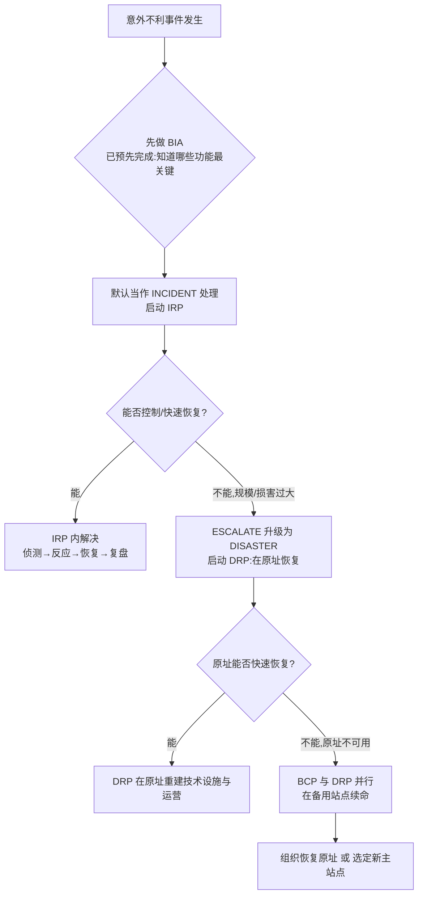
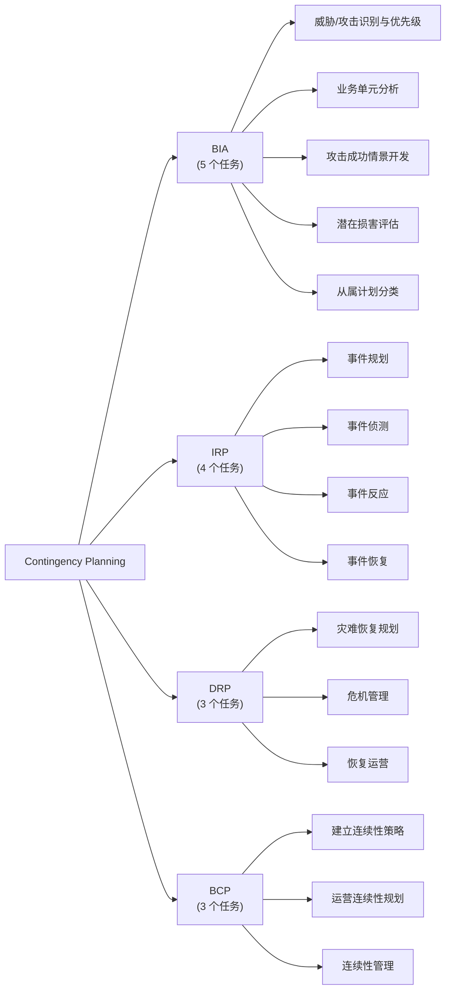
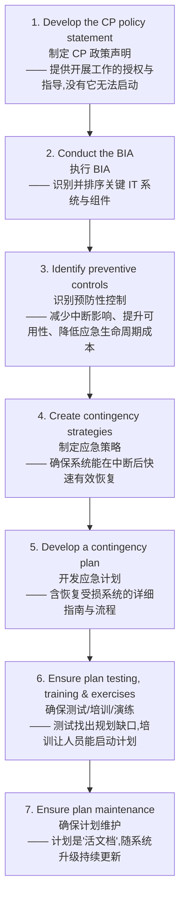
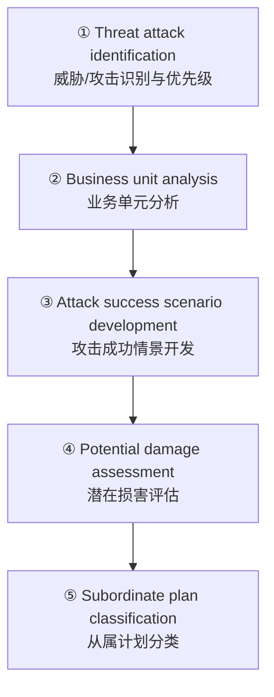
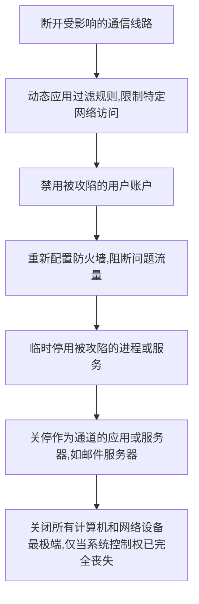
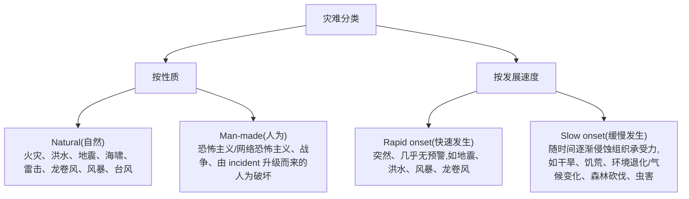
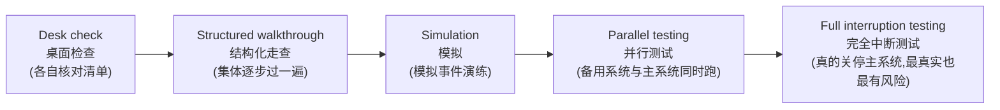

# Week 4 · Planning for Contingencies(应急规划)

> *CSIT988/CSIT488 — Security, Ethics and Professionalism · A/Prof Khoa Nguyen · Autumn 2026*

> **学习目标 (Learning objectives)** — 读完本章你应该能够:
> - 解释为什么组织需要 **Contingency Planning(CP,应急规划)**,以及它要保护的核心信息特性是什么
> - 说出 CP 的四大组件 **BIA → IRP → DRP → BCP**,并解释它们为什么必须按这个顺序、在什么时机被激活
> - 区分 **BIA(业务影响分析)** 与 **Risk Management(风险管理)** 的根本假设差异
> - 复述 NIST 推荐的 **7 步 CP 文档开发流程**,以及参与 CP 的 **四个团队** 各自的职责
> - 用 Pipkin 的 **三类事件指标(possible / probable / definite)** 判断一个事件是否构成 incident
> - 描述事件响应的三个阶段(**detection → reaction → recovery**),并解释 incident 何时升级(escalate)为 disaster
> - 比较灾难恢复的 **hot / warm / cold site** 及共享方案,并说出四种数据备份策略

---

想象你经营的一切——客户数据、订单系统、邮件服务器——某天早上突然全部瘫痪:可能是一场火灾,可能是一次勒索软件攻击,也可能只是机房水管爆裂。**技术驱动业务(technology drives business)**,所以技术一旦中断,业务就会逼近停摆(come to a standstill)。问题不是"会不会发生",而是"发生时你有没有一份能照着执行的计划"。本章讲的就是这份计划:如何为**意料之外的不利事件(unexpected adverse events)**做准备、侦测、反应、并从中恢复。

讲师在课上引用了一个让人印象深刻的数字(来自 Hartford 保险公司):**平均超过 40% 没有灾难计划的企业,在一次重大损失(火灾、入室盗窃、风暴)之后会倒闭。** 这就是本章存在的理由——一份计划往往是企业活下来和死掉的分界线。

本章的主线很清晰:先理解 CP 是什么(§1–§2),再看谁来做、按什么流程做(§3),然后逐一深入它的四大组件——**BIA(§4)、IRP(§5,本章最大的一块)、DRP(§6)、BCP(§7)**,最后讲整体的时序与测试(§8)。

---

## §1 为什么需要 Contingency Planning?

先把"谁来管这件事"说清楚,因为它解释了 CP 的整个组织气质。规划一个意料之外的不利事件,**不是 IT 部门一家的事**。它需要三个**利益共同体(communities of interest)**的代表共同参与:

- **General business management(一般业务管理层)**
- **Information technology (IT) management(IT 管理层)**
- **Information security (InfoSec) management(信息安全管理层)**

为什么三方都要在场?因为他们会一起**评估组织的整个技术基础设施**,并用组织的**使命陈述(mission statement)**和**当前组织目标**来驱动规划——也就是说,CP 不是技术练习,而是服务于业务存续的战略行为。更关键的一点:计划必须得到**一般业务管理层的正式批准与积极支持(sanctioned and actively supported)**,否则它只是一份没人买单的文档。

> 📎 **拓展(回顾 Week 3)** — 上一讲我们学过组织有三个层级的规划:**strategic planning(战略规划,通常 5 年以上)、tactical planning(战术规划,1–5 年)、operational planning(运营规划,支撑日常运作)**。CP 正是把这套"为信息安全做规划"的思想落到"为意外事件做规划"的具体应用上。

权威背书来自美国 **NIST(National Institute of Standards and Technology,美国国家标准与技术研究院)**。它的原话(slides 原文,值得记住其精神)是:因为信息系统资源对组织的成功至关重要,所以这些系统提供的服务必须能够"无过度中断"地有效运行;CP 通过建立完善的**计划、流程和技术措施(plans, procedures, and technical measures)**来支撑这一要求,使系统在服务中断后能尽快、尽可能有效地恢复。

记住这条贯穿全章的线索:在所有意外事件中,**最容易受损的信息特性是可用性(availability)**。火灾烧掉机房,数据可能还在(confidentiality、integrity 未必受损),但你访问不到它了——这就是为什么 CP 的核心是"恢复运行",而不是"防止泄露"。

---

## §2 CP 的基本概念与四大组件

### 2.1 什么是 CP

**Contingency Planning(CP,应急规划)** 的定义有两层,务必都记住:

- **它是什么**:对意外事件的整体规划,涵盖四个动作——**preparing for(准备)、detecting(侦测)、reacting to(反应)、recovering from(恢复)**那些威胁信息资源与资产安全的事件。
- **它的主要目标(main goal)**:在意外事件之后,以**最小的成本和最小的中断(minimum cost and disruption)**,把组织**恢复到正常运作模式(restoration to normal modes of operation)**。

讲师的通俗版本是:"让一切在合理的时间内回到原来的样子,不能拖太久。" 注意这里两个限定词——**最小成本**和**合理时间**——它们之后会反复出现在每一个决策里(比如选 hot site 还是 cold site,就是成本与恢复速度的权衡)。

### 2.2 四大组件:BIA → IRP → DRP → BCP

这是本章的骨架。CP 由四个组件构成,而且**有严格的逻辑顺序**:

| 组件 | 全称 | 关注什么 | 一句话记忆 |
|------|------|----------|-----------|
| **BIA** | Business Impact Analysis(业务影响分析) | 哪些功能/系统对组织最关键 | 准备工作,CP 和风险管理共用 |
| **IRP** | Incident Response Plan(事件响应计划) | 对事件的**即时响应** | 任何坏事先按 incident 处理 |
| **DRP** | Disaster Recovery Plan(灾难恢复计划) | 在**原址(primary site)**恢复运行 | incident 太大就升级成 disaster |
| **BCP** | Business Continuity Plan(业务连续性计划) | 在**备用站点(alternate site)**建立运行 | 原址短期回不来,就异地续命 |

**为什么必须是这个顺序?** 这是理解整章的关键,讲师专门强调过:

1. **BIA 必须先做**——因为只有先知道"哪些业务功能最关键、各种攻击会造成多大影响",才谈得上制定后面三个计划。BIA 是 CP 和 **Risk Management** 共用的准备活动(Risk Management 在 Week 9–10 讲)。
2. **任何不利事件,默认先当作 incident 处理**,启动 **IRP**——"除非且直到响应团队判定它是一场 disaster"。这是一个非常关键的原则:坏事发生时第一反应永远是"这是一起 incident"。
3. **当事件的规模与严重程度大到无法再按 incident 控制**,它就被**升级(escalate)为 disaster**,此时启动 **DRP**,聚焦在**原址**恢复运行。
4. **如果原址短期内无法恢复**(损害太严重、长期影响组织运作),**BCP** 就会**与 DRP 并行(concurrently)**启动,让业务在**预先准备好的备用站点**继续运转,直到组织能恢复原址、或选定新的主站点。

下面这张图把这条"事件如何在四个计划间流动"的主线画出来——这正是 slides 12、44–46 那几张只有图、没有字的幻灯片想表达的东西:

> **🔑 直觉:把它想成医院分诊** — 病人进门(意外事件),先按"急诊 incident"处理(IRP);如果发现是危及生命的重大创伤,升级为"重症 disaster"(DRP);如果连这家医院都救不了、大楼还塌了,就转院到备用医院继续抢救(BCP)。BIA 则是事先做好的"分诊标准手册"——什么程度算急诊、什么程度算重症,都在它里面定好。

### 2.3 一图看清四组件的任务分解

讲师口述了 slides 13 那张图的内容——每个组件下面挂着具体任务,这是非常好的考点框架:

---

## §3 谁来做、按什么流程做

知道了"做什么"(四组件),现在看"谁来做、按什么步骤做"。

### 3.1 CPMT 与 NIST 7 步流程

理想情况下,**CIO、CISO、关键 IT 与业务经理**都应在所有 CP 组件的创建与开发中积极参与。组建起来之后,负责统领全局的治理团队叫 **CPMT(Contingency Planning Management Team,应急规划管理团队)**——它是整个 CP 的"政府/中枢"。

CPMT 一旦成立,就开始编写 **CP 文档**。这份文档不是随便写的,要遵循公认的国际框架——讲师点名了 **NIST** 和 **ISO** 两个组织。NIST 推荐的 **7 步开发流程**是核心考点:

注意第 7 步的措辞:计划是一份 **living document(活文档)**——它必须随着组织和系统的变化被**定期更新**。一份三年没动过的应急计划,真到用时往往已经失效。

> ⚠️ **易混点** — slide 7 和 slide 8 列的 7 步,第 3、4 步顺序在两页上略有出入(slide 8 把"制定恢复策略"放在"识别预防性控制"之前)。考试以"先 policy → 再 BIA → 然后预防控制/策略 → 开发计划 → 测试培训 → 维护"这个**大框架**为准即可,不必纠结中间两步的细微次序。

### 3.2 四个团队及其职责

参与 CP 与应急运营的有**四个团队**,务必能对应上它们各自管哪个计划:

| 团队 | 全称 | 负责的计划 | 核心职责 |
|------|------|-----------|----------|
| **CPMT** | CP Management Team | 统领全局 | 收集系统与威胁信息、执行 BIA、协调另外三个计划的制定 |
| **IR team** | Incident Response team | IRP | 侦测、评估、响应 **incidents** |
| **DR team** | Disaster Recovery team | DRP | 侦测、评估、响应 **disasters**,并在**原址**重建运营 |
| **BC team** | Business Continuity team | BCP | 在事件/灾难发生时,在**异地(off-site)**建立并启动运营 |

**CPMT 的人员构成**(slide 10)也是考点,它包含三类角色:

- **Champion(倡导者/发起人)**:一位高层经理,负责支持、推动、为项目背书。理想人选是 **CEO 或组织总裁**。把 CP 当成一个"项目",champion 就是那个能调动权力结构的人。
- **Project Manager(项目经理)**:champion 提供战略视野但不直接管项目,所以需要一位项目经理来实际推进——通常是中层运营经理,**CISO 是绝佳人选**,负责落实项目规划、引导开发、审慎管理资源。
- **Team Members(团队成员)**:来自各利益共同体的经理或代表——
  - **Business managers** 提供业务活动细节、指出哪些功能对运营至关重要;
  - **IT managers** 提供面临风险的系统信息,用于 BIA 及 IR/DR/BC 计划;
  - **InfoSec managers** 统筹安全规划,提供威胁、漏洞、攻击及恢复需求信息;
  - 还可能需要**法务(legal affairs / corporate counsel)**代表确保计划在法律边界内,以及**企业传播(corporate communication / PR)**代表确保危机沟通方案到位。

> **🔑 为什么需要 PR/传播代表?** — 讲师举了个很现实的例子:如果团队里没有公关经理,组织就不知道危机中如何应对媒体、如何管理可能泄露的信息。设想媒体就一起刚发生的事件去问 CEO,而 CEO 一无所知——那会非常尴尬。所以"谁来对外发声、说什么"必须事先规划。

> 📎 **拓展(组织规模很重要)** — 这四个团队的设定是针对**大型组织**的,各团队是不同实体、成员不重叠。但讲师反复强调:**安全规划必须考虑组织规模。** 在小型组织里,这些团队可能由同一批人重叠担任;而"你在 Wollongong 开的一家小餐馆",根本不需要四个团队——可能一个人确保整体安全就够了,只要相关内容**显式或隐式地**写进政策、并符合当地法律法规即可。这个"规模决定一切"的思想会在后续课程反复出现。

---

## §4 BIA — Business Impact Analysis(业务影响分析)

现在进入四大组件的逐一深入。第一个是 **BIA**,它是 CP 流程的**第一阶段(first phase)**,也是初始规划阶段的关键组件。它的作用是:**为 CP 团队提供关于系统、以及这些系统所面临威胁的信息**,并为每一种潜在攻击的影响提供**详细情景(detailed scenarios)**。

### 4.1 BIA 不是 Risk Management:一个根本的假设差异

这是 BIA 最容易考、也最容易混淆的点,务必吃透:

- **Risk Management(风险管理)** 关注的是:识别**威胁(threats)、漏洞(vulnerabilities)、攻击(attacks)**,从而确定**用哪些控制措施(controls)来保护信息**。它的视角是"如何防住"。
- **BIA** 的视角恰恰相反:它**假设控制已经失效、被绕过、或证明无效(controls have been bypassed or are ineffective)**,并且**攻击已经成功**。

换句话说,BIA 问的是一个"最坏已经发生"的问题:**攻击者已经得手了,我们该怎么办?** 通过假设最坏情况已发生、再评估这种逆境会如何冲击组织,你就能洞察:组织应当如何**响应**这个不利事件、如何**最小化损害**、如何**从影响中恢复**、如何**返回正常运营**。

> **🔑 一句话区分** — Risk Management 站在攻击**之前**问"怎么防住";BIA 站在攻击**之后**问"既然防不住、它得手了,损失多大、怎么救"。

### 4.2 BIA 的五个阶段

CP 团队按以下五个阶段执行 BIA(slide 16–19),这是高频考点:

**① Threat attack identification(威胁/攻击识别)**
一个已经做过 risk management 的组织,手里应该已经有一份**排好优先级的威胁清单**(以及资产清单)。BIA 在此基础上更新这份清单,并补上一条关键的新信息——**attack profile(攻击画像)**:对一次攻击过程中所发生活动的**详细描述**。

**② Business unit analysis(业务单元分析)**
对组织内部各**业务功能(business functions)**进行**分析与优先级排序**——哪些业务功能更重要,要先理清。

**③ Attack success scenario development(攻击成功情景开发)**
为每个功能领域创建一系列**情景(scenarios)**,描绘攻击成功后的影响。这些攻击画像中的情景应包含:
- **Methodology(方法论)**——攻击是怎么进行的;
- **Indicators(指标)**——有哪些迹象;
- **Broad consequences(广泛后果)**。
并且要补上**备选结果(alternate outcomes)**:**best case(最好)、worst case(最坏)、most likely(最可能)**。

**④ Potential damage assessment(潜在损害评估)**
估算上一步那三种结果(最好/最坏/最可能)的**成本**——具体是哪个区域受损、损失多少钱。做法是准备一个"**攻击情景结局(attack scenario end case)**",据此识别从每种情况中恢复需要做什么。

**⑤ Subordinate plan classification(从属计划分类)**
把每一个攻击情景结局归类为**灾难性(disastrous)或非灾难性**——这一步直接决定后面用哪个计划:

- **灾难性攻击 → 需要 DRP(disaster recovery plan)**
- **非灾难性攻击 → 需要 IRP(incident response plan)**

> **🔑 重要观念:同一事件,此组织是 incident,彼组织是 disaster** — 讲师强调,什么算 incident、什么算 disaster,**没有放之四海皆准的标准**,必须结合组织自身的性质、现实和处境来定。对一家大企业只是 incident 的事,对一家小公司可能就是 disaster。而"在哪条线上把 incident 判为 disaster",正是要在 BIA 阶段(尤其是这第⑤步)事先定好的。

---

## §5 IRP — Incident Response Plan(事件响应计划)

这是本章篇幅最大、细节最多的一块。**IRP** 是一套**详细的流程与程序**,用来**预判(anticipate)、侦测(detect)、缓解(mitigate)**那些可能危及信息资源与资产的意外事件的影响。它的程序在**事件被侦测到的那一刻启动**。

### 5.1 什么才算一个 InfoSec incident?

在 CP 里,任何意外事件**自动先被称为 incident**。但要把一次威胁正式归类为**信息安全事件(InfoSec incident)**,必须同时满足三个条件:

1. 它**针对信息资产(directed against information assets)**;
2. 它有**现实的成功机会(realistic chance of success)**;
3. 它**威胁信息资产的 CIA**(confidentiality、integrity、availability)。

记住一个性质上的判断:**Incident response 是被动的(reactive),不是预防性的(preventative)。** 预防靠的是防火墙、入侵检测、密码学这类**保护机制**;而 IR 是在坏事已经发生后才介入的"反应措施"。

**CSIRT** 在这里登场:CPMT 的一项早期任务,就是组建一支 **CSIRT(Computer Security Incident Response Team,计算机安全事件响应团队)**。CSIRT 的关键成员会成为 **IR 规划委员会**。CSIRT 是 IR 团队的一个**子集**,由技术与管理兼具的 IT 和 InfoSec 专业人员组成,随时准备诊断并响应事件。

> **🔑 直觉:消防队** — 讲师用消防队打比方:一支消防队接到火警,不是每个人各自冲向火场,而是每个成员都有**特定角色**,作为一个**统一的整体(unified body)**行动——评估情况、确定响应、协调行动。IR 团队也一样:每个成员都必须清楚自己的角色,与他人协同,执行 IRP 的目标。**它是一个团队,不是一群人的集合。**

### 5.2 IR 规划的三个时间维度:before / during / after

针对每一个事件情景,CP 团队必须准备**三套事件处置程序**——围绕"事件**之前 / 之中 / 之后**该做什么":

- **During the incident(事件之中)**:规划者编写"事件进行中必须执行"的程序,把这些程序**分组并分配给不同角色**(系统管理员的任务不同于管理层的任务)。IR 规划委员会起草一套**特定功能的程序(function-specific procedures)**。
- **After the incident(事件之后)**:编写"事件刚一停止就要立即执行"的程序。
- **Before the incident(事件之前)**:编写"必须**预先**完成"的准备任务,包括:数据备份计划的细节、灾难恢复准备、培训计划、测试方案、服务协议副本、以及 BC 计划。

> 这正是 slide 21 那张"Figure 3-3 Incident response planning"想表达的:一份 IR 计划要同时覆盖事件的**之前、之中、之后**三段时间。

### 5.3 事件分类与 Pipkin 的三类指标(高频考点)

IR 团队每天面临的最大难题是:**眼前这个异常,到底是日常的正常使用,还是一起真正的 incident?** 这个判断叫**事件分类(incident classification)**,非常困难——因为同一个现象(比如网络变慢)既可能是攻击,也可能只是网络过载。分类的依据来自终端用户的初始报告、入侵检测系统(IDS)、主机/网络层的病毒检测软件、以及系统管理员。

为了让"判断是否真为 incident"更可靠,安全专家 **Donald L. Pipkin**(惠普互联网安全部门的安全系统架构师)提出了**三类事件指标**,按可能性递增排列。这是必背内容:

| 指标类别 | 含义 | 典型例子 |
|---------|------|---------|
| **Possible indicators(可能指标)** | 也许有问题 | 出现陌生文件;运行未知程序/进程;计算资源异常消耗(内存/硬盘/CPU 突增或突降);异常系统崩溃 |
| **Probable indicators(很可能指标)** | 比较像是有问题 | 在异常时间发生活动(如半夜流量飙升);出现新账户(尤其带 root/特权);有人报告遭受攻击;IDS 发来通知 |
| **Definite indicators(确定指标)** | 几乎可断定有问题 | 休眠账户被使用;日志被篡改;出现黑客工具;合作伙伴/同行通知;黑客本人通知 |

讲师为每一类都给了生动的例子,帮助记忆:

- **Possible**:你在 Windows 主目录或系统文件夹里突然发现来历不明的文件;任务管理器里 CPU/内存/硬盘占用莫名其妙地高;以及著名的 **blue screen of death(蓝屏死机)**——老系统跑新程序时尤其容易崩。
- **Probable**:大学校园里晚上没多少人工作,**如果管理员发现半夜网络流量极高,那很可能有攻击正在进行**;或者定期审查账户时,发现一个连管理员自己都不记得、日志里也追溯不到创建记录的新账户——尤其当它还带管理员权限时。
- **Definite**:前员工的休眠账户突然开始访问系统资源;在线日志与之前的版本对不上(说明日志被改);在不该出现的地方发现黑客工具(因此很多组织明令禁止未经 CISO 书面许可使用这类工具);合作伙伴报告"攻击来自你们的系统"。

**当以下"确定的实际事件"被确认时,对应的 IR 必须立即激活:**

- **Loss of availability(可用性丧失)**——信息/系统变得不可用;
- **Loss of integrity(完整性丧失)**——数据损坏、出现乱码、数据明显错误;
- **Loss of confidentiality(机密性丧失)**——敏感信息泄露的通知;
- **Violation of policy(违反政策)**;
- **Violation of law(违反法律)**。

一旦事件被确认并分类,IR 就从 **detection phase(侦测阶段)** 进入 **reaction phase(反应阶段)**。

### 5.4 反应阶段:Alert roster 与 Documentation

进入反应阶段后,CSIRT 的几个动作必须**快速、且可能并行**地发生:通知关键人员、分配任务、记录事件。其中两个概念要重点掌握。

**Alert roster(警报名册)**
这是一份**包含"事件发生时需通知的个人的联系信息"的文档**。通知有两种激活方式,各有取舍:

| 方式 | 机制 | 优点 | 缺点 |
|------|------|------|------|
| **Sequential(顺序式)** | 一名联系人**逐个**打电话通知名册上每个人 | **准确**(同一人传递,信息不走样) | **慢** |
| **Hierarchical(层级式)** | 第一人通知几个指定的人,这几人再各自通知下一批,逐层展开 | **快**(很多人同时在打电话) | 信息可能在**人传人中被扭曲(distorted)** |

**Alert message(警报消息)** 是对事件的**脚本化描述**,只含刚好够用的信息——让每个响应者知道该启动 IRP 的哪个部分,又不至于妨碍通知流程。比如"X 地发生火灾",团队就知道该启动 IRP 的消防部分。

> **🔑 现实中的例子** — 讲师说,你走进 UOW 的 Building 3(IT 学院的楼),墙上就贴着这样的文档:写明发生事件时应通报的成员姓名、职务和联系方式。那就是一份真实的 alert roster。还有一条易忽略的要点:**关键的高管(如总经理)也必须被通知**,但要在事件**确认之后、媒体或外部得知之前**——这样他们被媒体问到时才知道如何应对。

**Documentation(文档记录)**
一旦事件被确认、通知流程启动,团队就要开始**记录**,记下事件期间每个动作的 **who / what / when / where / why / how**。它的价值有三层:
1. 事后作为**案例研究(case study)**,判断当时的行动是否正确、是否有效;
2. 证明组织已**尽一切可能(due care)**遏制事件蔓延——在法律上,**尽职(standards of due care)**可能为组织提供保护;
3. 可作为未来培训和新版 IR 计划的**模拟素材**。

### 5.5 遏制、升级、恢复、复盘

IR 最核心的任务是**阻止事件、或遏制其影响范围**。**遏制策略(containment strategies)**聚焦两件事:**(1) 停止事件,(2) 重新夺回系统控制权。**

具体的遏制手段(slide 30,按从温和到激烈排列):

最后一招"关掉一切"只在**系统控制权已经彻底丧失、别无他法**时才用——此时唯一的希望是**保住计算机上的数据**,等事后再回来尽量恢复未被破坏的部分。每种手段都有代价:比如直接断开线路最简单直接,但如果组织的关键业务恰好跑在那条线路上,这一招就太激进了。

**Incident escalation(事件升级)**
事件的范围或严重程度可能增长到 **IRP 已无法充分遏制**的地步。此时就要把它**升级为 disaster**,或移交给外部权威(如执法机构、公开的应急单位)。在哪条线上判定为 disaster,正是 **BIA 阶段事先定好的**。

> ⚠️ **关键警告** — 讲师特别强调:**升级一旦做出,就无法撤销(once done, it cannot be undone)。** 所以何时、何地启用升级,必须非常谨慎、有明确指引。

**Recovering from incidents(从事件中恢复)**
事件被遏制、控制权夺回后,恢复才开始。CSIRT 必须先评估损害的全部范围(**incident damage assessment**:确定 CIA 被破坏的范围),才能决定如何重启系统。记录损害的人**必须受过训练**,以便正确**收集与保全证据(collect and preserve evidence)**——万一事件涉及刑事犯罪或引发民事诉讼时用得上。

按 Pipkin 的方法,恢复过程包含这些步骤:
- 找出**允许事件发生和扩散的漏洞**并修复;
- 处理那些**未能阻止/限制事件、或本就缺失的防护措施**(安装、替换或升级);
- 评估并改进**监控能力**;
- 从**备份中恢复数据**;
- 检查、清理并恢复**被破坏的服务与进程**;
- **持续监控**系统;
- **恢复利益共同体成员的信心**。

**After-action review(AAR,事后回顾)**
回到日常工作之前,IR 团队必须做一次 **AAR**——对从首次侦测到最终恢复全过程的**详细复盘**。所有成员回顾自己的行动,核对 IR 文档是否准确,找出 IR 计划**有效、无效、应改进**的地方。AAR 既能升级 IR 计划,也能成为未来员工的培训案例。

**涉及法律时**:当事件触犯民法或刑法,组织有责任通知相关部门。讲师对比了中美:美国由 **FBI** 处理跨州计算机犯罪与(网络)恐怖主义,澳大利亚则由 **Australian Federal Police(澳大利亚联邦警察)**承担类似职能。引入执法机构有利有弊——**好处**是他们更擅长处理证据、获取证词、构建法律案件;**坏处**是组织可能**失去对事件后续进程的控制权**。

---

## §6 DRP — Disaster Recovery Plan(灾难恢复计划)

当 IR 团队侦测到的事件**升级为 disaster** 时,IRP 已无力高效恢复,此时 **DRP** 接手。DRP 通常由 **CIO 领导的 IT 利益共同体**负责,涵盖准备和从灾难中恢复——无论是**自然(natural)还是人为(man-made)**的灾难。有些事件因其本质会被**立即判定为 disaster**,比如大火、严重洪水、破坏性风暴或地震。

**一个事件何时算 disaster?**(满足任一条件即可,slide 35):
1. 组织**无法遏制或控制**该事件的影响;**或**
2. 事件造成的损害/破坏程度**严重到组织无法快速恢复**。

**DRP 的核心作用**:定义如何在**组织通常所在的位置(即原址 primary site)**重建运营。

### 6.1 灾难的两种分类法

- **最常见的分法**是把**自然灾难**和**人为灾难**分开。
- **另一种分法**按**发展速度**:**rapid onset(快速发生)**几乎无预警、可能夺走生命并摧毁生产资料;**slow onset(缓慢发生)**则随时间逐渐削弱组织的承受能力。

### 6.2 DRP 的关键要素

为灾难做规划时,CPMT 要做**情景开发与影响分析(scenario development and impact analysis)**,给每种潜在灾难的威胁级别归类。讲师提醒:生成情景时**应从最重要的资产——人(people)——开始**:你是否拥有具备相应组织知识、能重启业务的人力?组织必须**交叉培训(cross-train)**员工,以确保运营和"正常感"能被恢复。此外,**DRP 必须定期测试**,这样 DR 团队才能快速高效地领导恢复。

DRP 必须包含的关键要素(slide 37):
- **角色与职责的清晰划分**——每个人都清楚灾难中自己的职责;
- 执行 **alert roster** 并通知关键人员;
- 清晰**确立优先级**;
- 灾难的**文档记录**;
- 缓解影响的**行动步骤**;
- 各系统组件的**备选实现方案**(当主版本不可用时)。

> **🔑 讲师的亲身例子:Building 3 的 fire warden** — 讲师本人是 Building 3 的**消防督导员(fire warden)**。一旦楼里发生火灾,他必须帮助楼内人员安全撤离到集合点:逐间办公室敲门,要求师生按指定路线撤到指定区域等候。这就是"角色与职责清晰划分"在现实中的样子——谁负责疏散、谁负责对接消防警察医疗、谁负责打包带走关键物品,都得事先分配好。

DRP 还必须**灵活(flexible)**,因为真实事件常常超出最周密的计划。如果**物理设施完好**,就开始恢复系统和数据;如果**设施已被摧毁、不可用**,就采取备选行动。而**当灾难威胁到组织在原址的存续时,DR 流程就转变为 BC 流程**——这正是下一节。

---

## §7 BCP — Business Continuity Plan(业务连续性计划)

**BCP** 确保**关键业务功能在灾难发生时仍能继续**。它和 DRP 有几个关键区别,务必记牢:

| 维度 | DRP | BCP |
|------|-----|-----|
| 由谁管理 | IT 利益共同体(CIO 领导) | **CEO / COO** |
| 在哪里恢复 | **原址(primary site)** 的技术设施与运营 | **备用站点(alternate site)** 的关键业务功能 |
| 何时启动 | 灾难发生时 | 当灾难使原址**长期不可用**、需要更复杂的恢复时,**与 DRP 并行** |

讲师的清晰表述:**灾难发生在原址**,使原址变得不可用、不可访问;于是 **BCP 在备用站点续命**,而 **DR 团队仍在原址努力恢复**业务运营。两者**并行(concurrently)**。BCP 可以一直持续,直到组织能恢复原址、或选定新的主站点。

> 📎 **拓展(不是每家都需要)** — 并非每个企业都需要备用站点。讲师举例:Wollongong 的一家小店可能**直接停业、等原址恢复**就行,因为维护一个备用站点的成本相对其业务规模太高,负担不起。但**制造业和零售业**高度依赖运营连续性(否则无法产生收入),所以更可能配备 BCP 以便快速搬迁、把收入损失降到最低。又一次,**组织规模决定方案**。

### 7.1 连续性策略:Exclusive-use vs Shared-use

BCP 的基石是**识别关键业务功能及支撑它们的资源**。CP 团队要指派一组人评估、比较各种备选方案并推荐选哪个。所选策略通常涉及一个**异地设施(off-site facility)**,需定期检查、配置、加固和测试。**决定选哪个的因素,通常是成本(cost)。**

策略分两大类:

**Exclusive-use options(独占使用)——hot / warm / cold sites**,这是 hot→cold 的"准备程度递减、成本递减、恢复时间递增"光谱:

| 站点 | 准备程度 | 一句话 | 恢复速度 / 成本 |
|------|---------|--------|----------------|
| **Hot site(热站)** | 最高 | **完全配置好的计算机设施,所有服务齐备** | 恢复最快,成本最高 |
| **Warm site(温站)** | 中等 | 像热站,但**软件应用未保持完全就绪** | 居中 |
| **Cold site(冷站)** | 最低 | **只保留最基本的服务和设施** | 恢复最慢,成本最低 |

**Shared-use options(共享使用)**:

- **Timeshares(分时共享)**:像独占站点,但是**租来的**;
- **Service bureaus(服务机构)**:提供物理设施的**代理机构**;
- **Mutual agreements(互助协议)**:两个组织之间**互相协助**的合同。

还有**专门化备选(specialized alternatives)**:
- **Rolling mobile site(移动式站点)**——可移动的设施;
- **Externally stored resources(外部存储资源)**。

> **🔑 一个记忆锚** — hot / warm / cold 的温度就是"准备热度":热站随时能上场(贵),冷站只是块空地加水电(便宜),温站介于中间。选哪个,本质是 §2 里说的那对老朋友——**恢复速度 vs 成本**的权衡。

> ⚠️ **本讲录音到此为止** — 课堂录音在讲到连续性策略的分类时下课了,讲师说"hot / warm / cold 各选项的具体讲解放到下次"。所以 §7.1 的细节、以及下面的 §7.2 数据备份、§8 的时序与测试,主要依据 **slides 41–48** 整理,课堂口头展开较少——但它们都在 slides 范围内,是公平的考点。

### 7.2 数据备份策略

要让任何 BCP 站点快速运转起来,组织必须能**恢复数据**。四种选项(slide 43,按"实时性递增"排列):

| 策略 | 机制 |
|------|------|
| **Traditional data backups(传统备份)** | 常规的数据备份 |
| **Electronic vaulting(电子保险库)** | 将数据**批量(bulk batch)**传输到异地设施 |
| **Remote journaling(远程日志)** | 将**实时交易(live transactions)**传输到异地设施 |
| **Database shadowing(数据库影子)** | 存储**重复的在线交易数据**(在多处同时保存) |

直觉上,从 electronic vaulting 到 database shadowing,是"从定期批量搬运"到"近乎实时多副本"的演进——越实时,灾难时丢失的数据越少,但成本和复杂度也越高。

---

## §8 整体时序、测试与持续改进

### 8.1 测试应急计划

光有计划不够,**问题往往在测试中才暴露**;发现问题、加以改进,才能得到一份**可靠的计划**。五种测试策略(slide 47,按"投入与真实度递增"排列):

越往右,越接近真实灾难、越能检验计划,但对正常业务的干扰和风险也越大。

### 8.2 最终思想:迭代与持续改进

应急规划不是"写完就锁进抽屉"的一次性任务。**迭代带来改进(iteration results in improvement)**——这种方法论的正式形态叫 **CPI(Continuous Process Improvement,持续过程改进)**:每演练一次,计划就应当被改进一次;**持续的评估与改进,带来更好的结果。** 这也呼应了 §3 NIST 7 步里的第 7 步——计划是一份永远在更新的**活文档**。

---

## 本章小结 (Key takeaways)

- **Contingency Planning(CP)** 是为意外不利事件做的整体规划,涵盖**准备、侦测、反应、恢复**四个动作;其主要目标是以**最小成本和最小中断**恢复正常运营,而意外事件中**最受冲击的信息特性是可用性(availability)**。
- CP 有四大组件,顺序固定:**BIA → IRP → DRP → BCP**。BIA 是必须先做的准备;坏事**默认按 incident 处理(IRP)**;无法控制时**升级(escalate)为 disaster(DRP,在原址恢复)**;原址长期不可用时 **BCP 与 DRP 并行**、在备用站点续命。
- **BIA 与 Risk Management 的根本区别**:Risk Management 在攻击前问"如何防住";**BIA 假设控制已失效、攻击已成功**,在攻击后问"损失多大、如何恢复"。BIA 有**五个阶段**,最后一步**从属计划分类**决定一个结局走 DRP(灾难性)还是 IRP(非灾难性)。
- 参与 CP 的有**四个团队**(CPMT、IR、DR、BC),由 **CPMT** 统领;CPMT 含 **Champion(理想为 CEO)、Project Manager(理想为 CISO)、Team Members**。NIST 推荐 **7 步**开发 CP 文档,且计划必须是定期更新的**活文档**。
- 判断"是否真为 incident"用 **Pipkin 三类指标**:**possible(可能)< probable(很可能)< definite(确定)**;确认的实际事件包括**可用性/完整性/机密性丧失、违反政策、违反法律**,确认后从 **detection 进入 reaction**。
- 反应阶段的两个核心工具:**Alert roster**(sequential 准确但慢 / hierarchical 快但易失真)与 **Documentation**(记录 who/what/when/where/why/how,兼具复盘、法律 due care、培训三重价值)。遏制聚焦**停止事件 + 夺回控制权**,**升级一旦做出不可撤销**,恢复后必做 **AAR(事后回顾)**。
- **DRP 在原址恢复(IT/CIO 主管),BCP 在备用站点续命(CEO/COO 主管),二者并行**。灾难按**自然/人为**或**快速/缓慢发生**分类。
- BCP 连续性策略分**独占(hot/warm/cold sites,准备程度与成本递减)**和**共享(timeshare、service bureau、mutual agreement)**,**成本是决定因素**;数据备份有**传统备份、electronic vaulting、remote journaling、database shadowing**四种(实时性递增)。计划要靠**五种测试**(desk check → full interruption)检验,并通过 **CPI(持续过程改进)**不断迭代。

---

## 附:易混淆点速查

| 容易搞混的一对 | 关键区别 |
|---------------|---------|
| **BIA vs Risk Management** | BIA 假设"已经被攻破";Risk Management 研究"如何不被攻破" |
| **IRP vs DRP** | IRP 处理 incident;DRP 处理升级后的 disaster,在**原址**恢复 |
| **DRP vs BCP** | DRP 在**原址**(IT/CIO);BCP 在**备用站点**(CEO/COO);灾难时**并行** |
| **Incident vs Disaster** | 能控制/快速恢复 = incident;不能控制 或 损害严重到无法快速恢复 = disaster(界线在 BIA 中定义) |
| **Possible / Probable / Definite** | 可能性递增:陌生文件(possible)< 半夜流量飙升/新特权账户(probable)< 日志被改/黑客工具/黑客通知(definite) |
| **Sequential vs Hierarchical roster** | Sequential 准确但慢;Hierarchical 快但信息易失真 |
| **Hot / Warm / Cold site** | 准备程度与成本:hot(全配置、最贵)> warm(应用未就绪)> cold(只有基础设施、最便宜) |
| **Champion vs Project Manager** | Champion 提供战略视野与权力背书(CEO);PM 实际管项目(CISO) |
