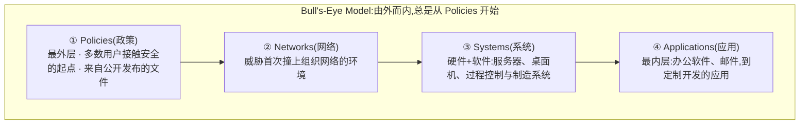
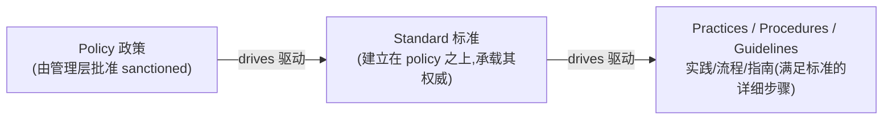
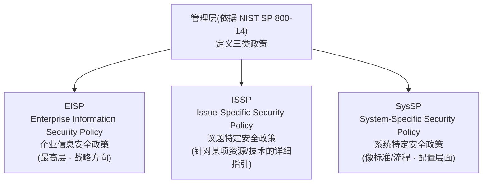
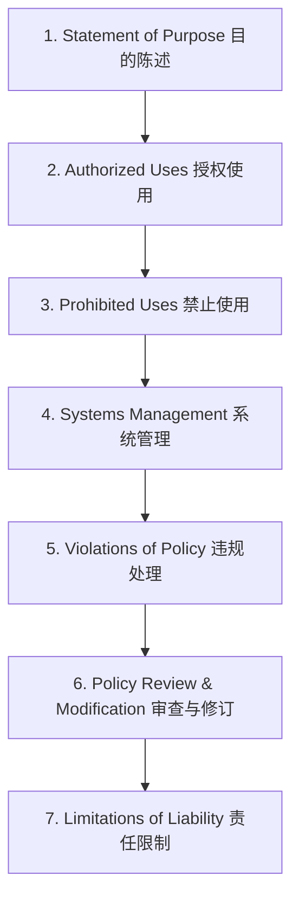
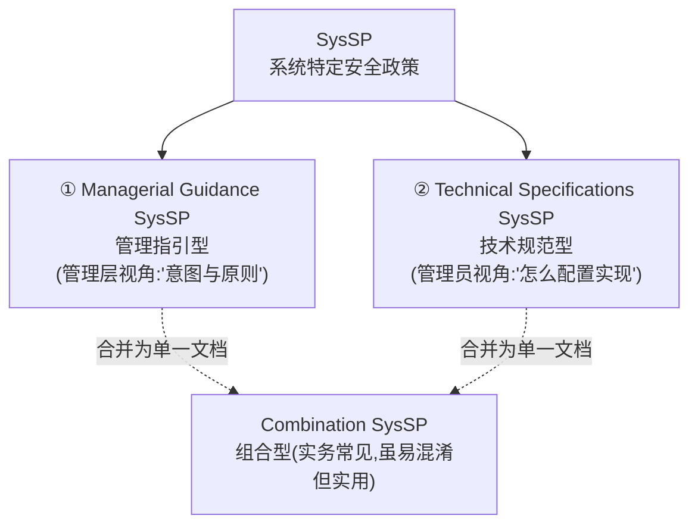
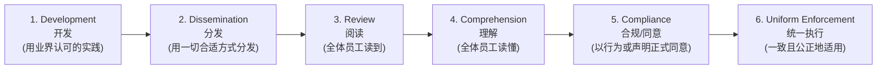

# Week 5 · Information Security Policy(信息安全政策)

> *CSIT988/CSIT488 — Security, Ethics and Professionalism · A/Prof Khoa Nguyen · Autumn 2026*

> **学习目标 (Learning objectives)** — 读完本章你应该能够:
> - 在 **business / IT / InfoSec** 三种语境下定义 **policy(政策)**,并解释为什么 policy 是信息安全程序的**核心基石(essential foundation)**
> - 用 **Bull's-Eye Model(靶心模型)** 解释"为什么处理安全问题永远要从 policy 开始,由一般到具体"
> - 区分 **policy / standard / practice-procedure-guideline** 四个层级,说出它们之间的驱动关系
> - 描述信息安全政策的三大类型 **EISP / ISSP / SysSP**,并复述每一类的**组件(components)**
> - 说出 ISSP 的 **7 大组件**、SysSP 的 **两大类(managerial guidance vs technical specifications)**,以及 **ACL 与 configuration rules** 的区别
> - 复述"有效政策"的 **6 个阶段**,并用 **SecSDLC** 的五个阶段说明政策是如何被开发、实施、维护的
> - 解释政策为何"是最便宜的控制手段,却最难落地",以及一份未被统一执行(uniformly enforced)的政策会给组织带来什么法律风险

---

> 📎 **本周衔接(Week 4 收尾)** — 上一讲(Planning for Contingencies)因为课堂小测占用了时间,**没讲完 Business Continuity Plan**。本周录播的开头,讲师把它补完了:**BCP 的站点策略(hot / warm / cold site、timeshare / service bureau / mutual agreement)、四种数据备份(traditional / electronic vaulting / remote journaling / database shadowing),以及应急计划的五种测试方法(desk check → full interruption)**。这些内容已经完整收录在 **Week 4 的学习指南**里(见 `week4-contingency-planning-study-guide.md` 的 §7–§8),本指南不再重复——本指南专注于本周的**新主题:信息安全政策**(对应 L05 整套 slides,教材第 4 章)。提醒一句:讲师明确说**下周的 workshop 同时覆盖 Week 4 + Week 5**,所以那块回顾内容也在考核范围内。

想象你是一名系统管理员,老板让你"把公司的防火墙装好,保证安全"。你立刻会卡住:**哪些流量该放行?用户身份怎么认证?哪些安全事件需要记日志?** 这些问题你一个技术人员无权拍板——它们是**管理层意志(will of management)**的体现。没有一份写下来的政策告诉你答案,你装的防火墙再"技术正确",也可能完全不符合组织的真实意图。这就是本章的出发点:**信息安全的一切技术动作,背后都需要一份政策来授权和指引。** 安全顾问 Charles Cresson Wood 有句被反复引用的话——"信息安全政策对这个领域里几乎所有发生的事情都具有中心地位(centrality)"。

本章的主线很清晰:先弄清 policy 是什么、为什么它是基石(§1–§3);再厘清 policy 与 standard、procedure 之间的层级关系(§4);然后逐一深入三种政策类型——**EISP(§5)、ISSP(§6)、SysSP(§7)**;最后讲如何让政策"有效"——开发流程、分发、阅读、合规与执行(§8–§9)。一句话记住全章:**A quality InfoSec program begins and ends with policy(优质的信息安全程序,始于政策、终于政策)。**

---

## §1 什么是 Policy?三种语境下的定义

"Policy"这个词在不同人嘴里指的不是同一样东西,考试常考它在三种语境下的定义,务必分清:

| 语境 | Policy 指的是…… | 直觉 |
|------|----------------|------|
| **In business(商业语境)** | 一份**管理意图陈述(statement of managerial intent)**,用来**引导和规范(guide and regulate)** 组织内员工的行为 | "公司希望你怎么做事" |
| **In IT(IT 语境)** | 一份**计算机配置规范(configuration specification)**,用来**标准化(standardize)** 系统与用户行为 | "机器该怎么配" |
| **In InfoSec(信息安全语境)** | 管理层提供的**书面指令(written instructions)**,告知员工及他人在使用**信息和信息资产(information and information assets)** 时的**恰当行为(proper behavior)** | "用信息资产时,什么能做、什么不能做" |

注意这三个定义的共同内核:**policy 永远是"管理层的意志",而不是技术细节。** 在 IT 语境下它看起来像"配置",但本质仍是"管理层希望系统呈现什么状态"。后面你会看到,真正的技术细节被放进 standard 和 procedure 里,而不是 policy 本身——这是本章一个反复强调的边界(§4 详谈)。

> 📎 **拓展(为什么强调"书面"和"告知")** — InfoSec policy 的定义里,"written"(书面)和"inform"(告知)是两个法律意义上的关键词。讲师在课上反复强调:**只有写下来、且能证明员工已被告知的规则,才在纠纷中站得住脚。** 一条"大家都心知肚明"的潜规则,在法庭上等于不存在。这条线索会贯穿到 §9 的"合规与执行"。

---

## §2 为什么 Policy 是 InfoSec 的基石

### 2.1 两段权威引言,记住它们的"精神"

slides 用两段引文奠定 policy 的地位,你不需要背原文,但要能复述其核心论点:

**① Charles Cresson Wood(《Information Security Policy Made Easy》)** — 论证 policy 的**中心地位(centrality)**:
> 系统管理员**无法在没有清晰政策的前提下安全地安装防火墙**——政策规定了哪些传输服务可以放行、如何认证用户身份、如何记录与安全相关的事件。同样,**没有政策就无法启动有效的安全培训与意识教育**,因为政策提供了培训材料所需的核心内容。

这段话的妙处在于:它用一个具体的技术动作(装防火墙)证明了**技术依赖政策**。把它当成"为什么需要 policy"的标准答案。

**② NIST SP 500-169(《Executive Guide to the Protection of Information Resources》)** — 论证 policy 的成功取决于**管理层**:
> 信息资源保护程序的成败,取决于**所生成的政策**以及**管理层对信息安全的态度**。你——**政策制定者(policy maker)**——决定了信息安全在你机构中扮演多重要的角色。你的首要职责是为组织制定信息资源安全政策,其目标是:**降低风险、合规于法律法规、保障运营连续性、信息完整性与机密性。**

记住这段的关键身份:它是**写给管理者/政策制定者**看的。它把 policy 的目标拆成了四个——你会发现这四个目标其实就是 CIA + 合规 + 连续性的合集。

### 2.2 关于 policy 的四条必记性质

slides 7 浓缩了 policy 最重要的几条性质,几乎每条都可能单独成题:

1. **始于政策、终于政策(begins and ends with policy)** —— 优质安全程序的开头和结尾都是 policy。
2. **提供结构、表达管理意志(provide structure / will of management)** —— policy 为职场提供秩序,表达管理层在"恰当且安全地使用信息资源"上的意志。
3. **最便宜的控制,却最难实施(least expensive means of control, often the most difficult to implement)** —— 这是高频考点,务必理解**为什么**:
   - **为什么最便宜**:相比技术控制(防火墙、加密设备等动辄昂贵的软硬件),写一份政策几乎只花管理层的"时间和精力";即使请外部顾问协助,成本也远低于技术控制。
   - **为什么最难落地**:因为它要花管理团队的时间去**创建、批准、传达**,还要花每个员工的时间把政策**融入日常工作**。技术控制装上去就生效,而政策要靠"人"去遵守——这才是难点。
4. **必须量身定制(tailored to the specific needs of the organization)** —— 处理极敏感信息的组织不该有"宽松"的政策;反之,安全需求低的组织被套上过于严苛的政策也会受损。而且**政策不是越多越好**:太多或太复杂的政策反而会让员工困惑。

### 2.3 一个让人记住"政策保护饭碗"的例子

slides 10 引用 Wood 总结了 policy 的两点用途——**(a)** 它是内部审计、以及解决"管理层是否尽到**尽职审查(due diligence)**"法律纠纷时的重要**参考文件**;**(b)** 它是**管理意图的清晰声明**。但讲师强调:**policy 不只是应付法律的管理工具,它实实在在地保护组织和员工的饭碗。** 他在课上讲了一个生动的场景,值得记住:

> 🧩 **真实场景** — 某员工在职场做了不当行为(比如浏览不雅网站、或偷看同事邮件)。另一名员工被激怒,**起诉了公司**。如果公司**没有一份禁止此类行为的政策**,它就**无法名正言顺地处分(terminate)** 那名违规员工,于是纠纷进一步升级。官司最终判愤怒的员工胜诉,巨额赔偿可能让公司**破产**。公司一倒,**其余所有员工也丢了工作**——而这一切,只是因为当初没有一份有效的政策。
>
> **结论**:如果有政策明文禁止该行为,公司一开始就能妥善处理,不至于走到破产、全员失业这一步。这就是"policy 保护的不只是组织,还有员工的工作"的含义。

---

## §3 Bull's-Eye Model(靶心模型)

如何在一堆复杂的安全问题里排出优先级?slides 8–9 给出一个被 InfoSec 专业人士**广泛接受**的实施模型——**Bull's-Eye Model(靶心模型)**。它长得像一个靶子(或牛的眼睛,故名),由四个同心圆构成:

这个模型的**核心思想**(也是考点)是:

- **由一般到具体(from the general to the specific)**,**永远从 policy 开始**。
- 关注**系统性的解决方案(systemic solutions)**,而**不是**去逐个修补**单个问题(individual problems)**。

四层的含义:

| 层 | 含义 |
|----|------|
| **Policies(政策)** | 最外层。它是大多数用户**接触信息安全的起点**,来自表达管理层意志、指引用户行为的**公开文件**。 |
| **Networks(网络)** | 来自公网的威胁**首次接触**组织网络基础设施的环境。讲师补充:过去 InfoSec 几乎被等同于"网络安全",可见这一层的历史分量。 |
| **Systems(系统)** | 作为服务器、桌面机的硬件与软件集合,也包括过程控制与制造系统。 |
| **Applications(应用)** | 最内层。从打包好的办公软件、邮件程序,到组织自研的定制应用与过程控制应用。 |

> 一句话记住靶心模型:**遇到安全问题,先问"政策层面怎么定的",再往里走到网络、系统、应用——不要一上来就在最内层(某个具体应用)打补丁。**

---

## §4 Policy / Standard / Practice 的层级关系

这是本章最容易混淆、却几乎必考的一块。policy 不是孤立存在的,它和 standard、procedure 等文档构成一条**自上而下的驱动链**。

先记住三个定义:

- **Policy(政策)**:组织**管理哲学的正式陈述(formal statement of managerial philosophy)**——说"该做什么、什么可接受",但**不规定设备或软件该如何具体操作**。
- **Standard(标准)**:为**遵从政策**而**必须做到**的、更**详细**的陈述。
- **Practices / Procedures / Guidelines(实践 / 流程 / 指南)**:解释员工**如何(how)** 去遵从政策的**详细步骤**。

它们的关系是一条**驱动链(drives)**:

讲师用一个连贯的例子把这条链讲透了,强烈建议照这个例子记忆:

> 🧩 **一条链的例子** —
> - **Policy**:公司**禁止在职场浏览不当网站**。(只说"不许",不说"怎么拦")
> - **Standard**:为遵从该政策,规定**所有不当内容都将被屏蔽**,并列出哪些内容算"不当"。(更详细的"必须做到什么")
> - **Practice/Procedure**:后续由**技术控制**(防火墙、access control list、审计)及其配套流程,真正去**屏蔽对这些网站的网络访问**。(具体"怎么做")

记住这条链的**方向性**:**policy 驱动 standard,standard 再驱动 practice/procedure。** 反过来不成立——你不会用一条防火墙规则去"驱动"公司政策。还有一条边界要牢记:**policy 本身绝不写"设备/软件该怎么配置"**,那是 procedure 的活儿;policy 只管"意图与原则"。

---

## §5 三种 InfoSec 政策总览

依据 **NIST SP 800-14**,管理层必须定义**三种**信息安全政策。这是本章的骨架,后面三节(§5–§7)逐一展开。

| | **EISP** | **ISSP** | **SysSP** |
|---|----------|----------|-----------|
| **全称** | Enterprise InfoSec Policy | Issue-Specific Security Policy | System-Specific Security Policy |
| **层级 / 定位** | **最高层**,定战略方向、范围与基调 | 针对**某一具体资源或技术**的详细、有针对性的指引 | **配置/技术层面**,常**像 standard 或 procedure** |
| **典型例子** | 全公司的"信息安全总纲" | "邮件与互联网使用政策""自带设备政策" | "如何配置某台防火墙"(含 ACL) |
| **更新频率** | 低(除非战略方向变化) | **高(需频繁更新)** | 随系统/设备而定 |
| **谁来写** | CISO 起草,与 CIO 等高管协商 | 对应资源的主管部门 | 系统管理员(在管理层指引下) |

**常规顺序**:先创建**最高层的 EISP**,再据此开发 ISSP 与 SysSP 来满足更具体的安全需求。三类政策在**大多数组织里都能找到**。

---

## §6 EISP — 企业信息安全政策

### 6.1 EISP 是什么

**EISP(Enterprise Information Security Policy,企业信息安全政策)** 是**最高层级**的信息安全政策,为组织的全部安全努力**设定战略方向(strategic direction)、范围(scope)与基调(tone)**。它的几个别名也要认得:**security program policy、general security policy、IT security policy、high-level InfoSec policy**,或干脆叫 **InfoSec policy**。

EISP 的职责:

- **分配责任(assigns responsibilities)**:把信息安全各领域的责任(包括政策维护、用户责任)分派下去。
- **指引整个安全程序**的开发、实施与管理要求。
- **必须直接支撑组织的愿景与使命陈述(vision and mission statements)**——这是 EISP 的硬性要求,也是它区别于下两类政策的关键。

> 📎 **拓展(谁写、写多长、多久改一次)** — 讲师补充了几个实务细节,值得记住:EISP 是**执行级文件(executive-level document)**,通常由 **CISO(首席信息安全官)** 起草,并与 **CIO(首席信息官)** 等高管协商;篇幅一般 **2–10 页**;一旦确立了安全哲学,**通常不需要频繁修改**,除非组织的战略方向发生变化。它还应当在**法律挑战出现时是可辩护的(defensible)**。

### 6.2 EISP 文档应当提供什么

slides 14 列出 EISP 文档应包含的四类内容:

1. 对企业安全哲学的**总体概述(overview of the corporate philosophy on security)**;
2. **InfoSec 组织结构**以及**承担 InfoSec 角色的个人**信息;
3. **全体成员共同承担**的安全责任(含员工、承包商、顾问、合作伙伴、访客);
4. **每个角色独有**的安全责任。

### 6.3 EISP 的五大组件(高频考点)

把这五个组件当成一组来记,每个都对应一个"它回答了什么问题":

| 组件 | 回答的问题 / 作用 |
|------|------------------|
| **Purpose(目的)** | "这份政策是干什么的?"——给读者一个理解文档意图的框架 |
| **Elements(要素)** | **定义信息安全**及其关键组成。例如:"通过政策、教育培训与技术,保护信息在**处理、传输、存储**过程中的**机密性、完整性、可用性**"——本质就是 CNSS 模型的三个维度 |
| **Need(需求)** | **论证组织为何需要**一个 InfoSec 程序——说明 InfoSec 的重要性,以及组织保护关键信息的**法律与伦理义务** |
| **Roles & Responsibilities(角色与职责)** | 定义支撑信息安全的**人员结构**,以及各类人员的安全职责(含本文件的维护) |
| **References(引用)** | 列出**影响本政策、或受本政策影响**的其他标准与法规(联邦/州法律等) |

> 记忆法:**P-E-N-R-R**(Purpose, Elements, Need, Roles, References)。注意 **Elements ≈ "定义安全"**,**Need ≈ "论证为何需要"**——这两个最容易被搞反。

---

## §7 ISSP — 议题特定安全政策

### 7.1 ISSP 是什么,要达成什么

**ISSP(Issue-Specific Security Policy,议题特定安全政策)** 提供**详细、有针对性的指引**,指导组织全体成员如何使用**某项具体资源**(某个流程或某项技术)。它应当**先介绍组织对该资源的使用哲学**——目的不是为了行政处罚或法律起诉打基础,而是建立"员工对这项资源能做什么、不能做什么的共同理解";一旦理解建立,员工就能**放心使用该资源,无需事事审批**。

一份有效的 ISSP 要达成**三件事**(记住这三个动词):

1. **Articulate(阐明)** 组织对该技术系统应**如何被使用**的期望;
2. **Document(记录)** 该系统**如何被控制**,并指明提供这种控制的流程与权限;
3. **Indemnify(免责)** ——使组织**免于为员工不当/非法使用系统而承担责任**。

ISSP 本质上是组织与其成员之间的**有约束力的协议(binding agreement)**,表明组织已尽善意努力(good faith effort)确保技术不被滥用。

### 7.2 ISSP 的三个特征 & 典型议题

**三个特征(characteristics)**:

- 针对**具体的技术性资源(specific technology-based resources)**;
- **需要频繁更新(require frequent updates)**——因为技术变化快;
- 包含一条**议题陈述(issue statement)**,说明组织在某个议题上的**立场**。

**典型 ISSP 议题(示例,非穷举)**——这些是"哪些场景需要一份 ISSP":

- 邮件、即时通讯及其他电子通讯应用的使用
- 互联网与万维网的使用(公司时间 / 个人时间)
- 恶意软件防护要求(如反恶意软件的部署)
- **非组织发放**的软硬件的安装与使用
- 公司自有电脑设备的**居家使用** / 将组织设备带离办公场所
- **个人设备**接入公司网络(是否允许)
- 电信技术(电话、手机、传真)的使用
- 复印 / 扫描设备的使用

### 7.3 ISSP 的七大组件(本章最重的考点之一)

把这 7 个组件按顺序记牢,它们构成一份完整 ISSP 的骨架:

| 组件 | 核心内容 |
|------|----------|
| **1. Statement of Purpose(目的陈述)** | 回答三问:这政策**为何目的**服务?**谁负责、谁问责**实施?涵盖**哪些技术与议题**? |
| **2. Authorized Uses(授权使用)** | 谁能用(user access)、**公平负责地使用**(涉及个人信息保护、隐私等法律问题)。原则:**凡未明确许可的用途,即视为滥用**;若允许某些"选择性使用"(如用公司系统收发个人邮件),**必须在政策里明确写出来** |
| **3. Prohibited Uses(禁止使用)** | 与上一条相反——列明**不可用于什么**:扰乱性使用/滥用、犯罪用途、攻击或骚扰性材料、侵犯版权/许可/知识产权、其他限制。原则:**除非明确禁止,否则组织无法处罚员工** |
| **4. Systems Management(系统管理)** | 聚焦**用户与系统管理之间的关系**;明确**用户和系统管理员各自的职责**(如邮件/电子文档的使用、存储、授权监控、物理与电子安全) |
| **5. Violations of Policy(违规处理)** | 列明每种违规的**处罚(penalties)**;提供**举报违规的流程**——常允许**匿名提交(anonymous submission)** |
| **6. Policy Review & Modification(审查与修订)** | 包含**定期审查的流程与时间表**,以及修订 ISSP 的具体方法,确保政策跟上当前技术与组织需求 |
| **7. Limitations of Liability(责任限制)** | 一般性的**免责声明(disclaimers)**:若员工用组织设备从事非法活动,**公司不为其个人行为担责**(前提是该违规未被管理层批准) |

> 📎 **拓展(两种立场 & 为什么要匿名举报)** — 两个值得记住的细节:
> - **两种相反的默认立场**:有的组织是"**未许可即禁止**(that which is not permitted is prohibited)",有的是"**未禁止即许可**(that which is not prohibited is permitted)"。无论哪种,都必须**明说假设、列清例外**。有些组织干脆把 Authorized + Prohibited 合并成一节叫 **Appropriate Use(恰当使用)**。
> - **为什么允许匿名举报**:因为员工可能**害怕组织里有权势的人报复(retaliate)** 举报者。匿名往往是说服普通员工去举报"更有影响力同事"的违规行为的**唯一办法**。

### 7.4 实现 ISSP 的三种方式

slides 23:创建和管理 ISSP 有三种常见做法,各有优劣:

| 实现方式 | 优点 | 缺点 |
|----------|------|------|
| **多份独立的 ISSP 文档**(independent) | 清晰分派给负责部门;由该技术领域的**专家**撰写 | 容易**零散、覆盖不全**;分发、执行、审查可能很差 |
| **单一综合 ISSP 文档**(comprehensive) | 集中管理、统一控制 | 一份大杂烩,可能**覆盖过宽、责任不清** |
| **模块化 ISSP 文档**(modular) ✅ **推荐** | **兼具前两者优点**:中央统一管理流程、覆盖完整、清晰分派给负责部门、由领域专家撰写 | 可能**比另两种更贵**,实施上**较难管理** |

**推荐做法是模块化(modular)政策**——它在"独立"与"综合"之间取得了**最佳平衡**。

---

## §8 SysSP — 系统特定安全政策

### 8.1 SysSP 为什么"不像政策"

**SysSP(System-Specific Security Policy,系统特定安全政策)** 常常**长得不像**前两类政策——它更**像 standard 或 procedure**,是在**配置或维护系统时**使用的文档(例如:如何配置和运行一台网络防火墙)。一份这样的文档可能同时包含:管理意图陈述、对网络工程师选型/配置/运行防火墙的指引、以及定义每个授权用户访问级别的 **access control list(ACL)**。

SysSP 可以拆成**两大类**,也可以**合并成单一文档**:

### 8.2 Managerial Guidance SysSP(管理指引型)

由**管理层创建**,用来**指引技术的实施与配置**,并规范人员行为以支持信息安全。

- 适用于**任何影响信息 CIA(机密性/完整性/可用性)的技术**;
- 作用是**把管理意图告知技术人员(informs technologists of management intent)**。

> 🧩 **为什么需要它** — 防火墙的**具体配置**属于"技术规范型 SysSP",但**构建和实施防火墙的过程必须遵循管理层定下的指引**。如果没有这种管理指引,防火墙管理员就会**按自己认为合适的方式去配**,而这未必符合组织的真实意图。

### 8.3 Technical Specifications SysSP(技术规范型)

这是**系统管理员**为了**落实管理政策**而写的"怎么实现"层面的指令。每类设备都有自己的策略。

> 🧩 **password 的例子(管理政策 → 技术控制)** — 一份 ISSP 可能要求"**用户密码每季度更换一次**"。系统管理员就用**技术控制**去强制执行:在密码到期前 1–2 周**发提醒**,引导用户去指定链接改密码;若到期仍未改,技术控制就**不允许该用户认证登录系统**。这就是"管理意图"如何被翻译成"技术实现"。

实现技术控制有**两种通用方法**——**ACL** 与 **configuration rules**:

#### (a) Access Control Lists(ACL,访问控制列表)

**ACL** 是**关于授权的规范(specifications of authorization)**,管辖用户对某项信息资产的**权利与特权(rights and privileges)**。它包含 **user access lists、matrices、capability tables**,而且通常是**复杂的矩阵**,而非简单的列表。

**ACL 规管的五个维度(WHO/WHAT/WHEN/WHERE/HOW)**:

| 维度 | 含义 |
|------|------|
| **WHO** | 谁能使用系统 |
| **WHAT** | 授权用户能访问什么(哪台打印机、哪些文件、哪个应用) |
| **WHEN** | 授权用户何时能访问 |
| **WHERE** | 授权用户能从哪里访问 |
| **HOW** | 授权用户如何访问 |

管理员为用户设定**特权 / 权限(privileges / permissions)**,典型包括:**read(读)、write(写)、create(建)、modify(改)、delete(删)、compare(比较)、copy(复制)**。

> 📎 **拓展(capability table 的矩阵结构)** — 讲师把它讲得很形象:这些规范常是一个**二维矩阵**——**资产(assets)作为列头(column headers),用户(users)作为行头(row headers)**。沿着**某一列**看,得到的是某个资产的 **ACL**(谁能访问它);沿着**某一行**看,得到的是某个用户的 **capability table**(他能对哪些对象做什么)。现代服务器通常把 ACL 翻译成管理员可用的**配置集**,从而按用户、计算机、时段、甚至单个文件来限制访问。

#### (b) Configuration Rules(配置规则)

**Configuration rules** 是**指令性代码(instructional codes)**,在信息穿过系统时**指导系统的执行**。与 ACL 的关键区别:

- **基于规则的策略比 ACL 更贴近系统的具体运作(more specific to system operation)**;
- **可能直接涉及用户,也可能不直接涉及用户(may or may not deal with users directly)**;
- 许多安全系统需要特定的**配置脚本(configuration scripts)**,规定对每一批处理的信息执行什么动作。**典型例子:防火墙、入侵检测/防御系统(IDS/IPS)、代理服务器(proxy server)。**

> 一句话区分:**ACL 关心"谁能对什么资产做什么"(面向授权);configuration rules 关心"信息流过时系统该执行什么动作"(面向系统运作),更偏底层、未必和用户直接相关。**

### 8.4 Combination SysSP(组合型)

许多组织会创建**单一文档**,把 managerial guidance 与 technical specifications **合二为一**。这虽然对读者**有点令人困惑**,但**很实用**——把两种视角的指引放在一处。前提是:文档要**仔细、清楚地写出每个流程所要求的动作**。

---

## §9 让政策"有效":开发、分发、阅读、合规与执行

写出政策只是一半;让它**真正有效(effective)** 才是另一半。slides 31–41 讲的就是这套保障机制。

### 9.1 有效政策的六个阶段

政策**只有在被恰当地设计、开发、实施**(且过程可重复产出一致结果)时才**可强制执行(enforceable)**。一个有效的方法分**六个阶段**——把每个阶段对应的"动词"记住:

记忆法:**Develop → Disseminate → Review → Comprehend → Comply → Enforce**(开发→分发→读到→读懂→同意→执行)。这六步缺一不可——少了任何一步,政策在纠纷中都可能被推翻。

### 9.2 用 SecSDLC 开发政策

把政策开发**看成一个两部分的项目**:**(1)** 设计并开发政策(或重新设计、重写过时政策);**(2)** 建立**管理流程**,让政策在组织里**长久延续(perpetuate)**。前者是项目管理的活,后者要靠良好的业务实践。

像任何大型项目一样,政策开发应当**周密计划、充分拨款、积极管理**,以确保**按时、按预算**完成。讲师强调:这套流程可以用我们前几讲学过的 **SecSDLC(Security Systems Development Life Cycle)** 来指导,它的五个阶段对应到政策开发如下:

| SecSDLC 阶段 | 政策开发要做什么 |
|--------------|------------------|
| **Investigation(调查)** | 取得**高管支持**(尤其 **CIO** 的积极参与);清晰表达政策项目的**目标**;让**受影响的正确人群**参与(必须含**法务、人力资源、终端用户**代表);指派有足够威望的**项目主导者(champion)** 和能干的**项目经理**;给出**范围大纲**与成本/进度的可靠估算 |
| **Analysis(分析)** | 产出**新近的风险评估或 IT 审计**(记录组织当前的安全需求,含损失史、过往诉讼);收集**关键参考材料**(含任何**现有政策**,可能存放在 HR、财务、法务等部门) |
| **Design(设计)** | 制定政策的**分发计划**及**分发验证**方式(成员须明确确认已收到并读过——否则员工可声称"从没见过这政策",处分会被推翻);规定任何**自动化工具**的规格;基于更清晰的成本/收益**修订可行性分析** |
| **Implementation(实施)** | **真正写政策**(可借助网络、政府网站、专业文献、同行网络、专业顾问等资源);确保政策被**正确准备、分发、阅读、理解、同意**,且这些理解与接受都被**记录在案** |
| **Maintenance(维护)** | **监控、维护、修订**政策以应对**不断变化的威胁**;内置一个**(最好匿名的)问题上报机制**;把**定期审查**纳入流程 |

> 📎 **拓展(那张"封面签字页")** — 讲师特别讲了 Design 阶段的一个实务做法:记录"员工已确认书面政策"最简单的方式,是附一张**封面签字页(cover sheet)**,上面写着"**我已收到、阅读、理解并同意本政策**(I have received, read, understood, and agreed to this policy)",由员工**签名并注明日期**。这张纸就是一条**纸质证据链(paper trail)**——一旦发生"因不当使用网络而被解雇"之类的纠纷,它能证明管理层尽到了告知义务,否则解雇可能被推翻,甚至让前员工获得**惩罚性赔偿**。

### 9.3 分发、阅读理解、合规与执行(四个落地环节)

把政策**送到员工手里、并确保它生效**,本身就需要组织的**可观投入**。slides 38–40 拆成四步:

1. **Policy Distribution(分发)** —— 最常见两种方式:**硬拷贝分发(hard copy)**(直接发给员工,或张贴在公开位置)与**电子分发(electronic)**(邮件、简报、内网、文档管理系统)。
2. **Policy Reading(阅读)** —— 障碍常来自**识字 / 语言问题**:很多岗位(保洁、仓管、流水线工人)不要求读写能力,但他们仍能接触组织信息,**必须让他们熟悉政策——哪怕要读给他们听**;视障员工可能需要**音频或大字版**。
3. **Policy Comprehension(理解)** —— 文档须写在**合理的阅读水平**上,**少用技术黑话与管理术语**;并用**某种评估手段**(如**测验 quizzes**)来衡量员工是否真懂——例如以**答对 70%** 为及格线,判断谁还需要额外的培训与意识教育,之后才谈得上执行。
4. **Policy Compliance & Enforcement(合规与执行)** ——
   - **Compliance(合规)**:员工**必须同意(agree)** 政策。若员工**明确拒绝**同意呢?这在法律上尚无定论,但"拒绝同意政策"近乎"拒绝工作",**可能构成解雇理由**。组织规避此困境的办法:把**政策确认声明**写进**最初的雇佣合同**,或纳入**年度评估**等必要文件。
   - **Enforcement(执行)**:**必须统一且公正(uniform and impartial)**。如果一名被处分/解雇的员工**能证明政策没有被统一适用或执行**,组织可能面临**严重的(乃至惩罚性的)赔偿**。

### 9.4 关于政策的最后一点

slides 41 收尾,回到 policy 的**第一性目的**:**政策首要是告知员工——在组织里什么是、什么不是可接受的行为。** 政策开发旨在**提升员工生产力、避免潜在的尴尬局面**。讲师补充了一个很贴近人性的观察:**大多数员工本就想做对的事**——只要被恰当地教育"什么可接受、什么不可",他们通常会选择遵守规则,因为**人人都想保住工作**。当员工知道**禁止什么、违规罚什么、怎么执行罚则**,且罚则被**普遍一致地适用**,就没人能在被抓时喊冤——这反而是一种**预防性措施**,让员工能安心专注于业务本身。

---

## 本章小结 (Key takeaways)

- **始于政策、终于政策**:优质 InfoSec 程序 **begins and ends with policy**。政策必须写明:**什么被要求、什么被禁止、违规的处罚、以及申诉流程(appeals process)**。
- **policy 的三种语境定义**:business(管理意图)、IT(配置规范)、InfoSec(关于使用信息资产的书面指令)。核心共性:**policy = 管理层意志,不写技术细节**。
- **policy 是最便宜却最难落地的控制**:便宜在于只花管理层时间;难在要靠每个员工去遵守。且必须**量身定制**,不是越多越好。
- **Bull's-Eye Model**:Policies → Networks → Systems → Applications,**由一般到具体、永远从政策开始**,追求系统性方案而非逐个修补。
- **层级链**:**Policy → Standard → Practices/Procedures/Guidelines**(policy 驱动 standard,standard 驱动 practice);支撑性指引来自 standard、practice、procedure、guideline。
- **三类政策(NIST SP 800-14)**:
  - **EISP** = 最高层、定战略方向、支撑使命愿景、由 CISO 起草;五组件 **Purpose / Elements / Need / Roles & Responsibilities / References**。
  - **ISSP** = 针对具体资源/技术、需频繁更新;**7 组件**(Purpose → Authorized → Prohibited → Systems Mgmt → Violations → Review → Liability);推荐**模块化**实现。
  - **SysSP** = 像 standard/procedure,分 **managerial guidance** 与 **technical specifications**(后者含 **ACL** 与 **configuration rules**),可组合成单一文档。
- **有效政策的六阶段**:Development → Dissemination → Review → Comprehension → Compliance → Uniform enforcement。
- **政策常用项目管理 / SecSDLC 方法开发**:Investigation → Analysis → Design → Implementation → Maintenance。
- **执行必须统一公正**:未被统一执行的政策,会让组织在解雇纠纷中面临**惩罚性赔偿**;一张"已读已同意"的签字页是关键的**due diligence 证据**。

---

## 附:易混淆点速查

| 概念对 | 一句话区分 |
|--------|-----------|
| **Policy vs Standard vs Procedure** | Policy 说"该做什么/原则"(管理哲学,**不写技术细节**);Standard 说"为合规**必须做到什么**"(更详细);Procedure/Practice 说"**怎么一步步做**"。方向:**policy 驱动 standard 驱动 procedure**。 |
| **EISP vs ISSP vs SysSP** | EISP = 全公司**战略总纲**(最高层,少改);ISSP = 针对**某项资源/技术**的详细指引(频繁改);SysSP = **配置/技术层面**,像 standard/procedure。 |
| **EISP 组件 Elements vs Need** | **Elements** = "**定义**信息安全及其组成(CIA…)";**Need** = "**论证为何需要**安全程序(法律/伦理义务)"。最易搞反。 |
| **Authorized vs Prohibited uses** | Authorized:**未明确许可即视为滥用**;Prohibited:**除非明确禁止,否则无法处罚**。两条默认立场相反,所以都要写清。 |
| **Managerial guidance vs Technical specifications SysSP** | Managerial = 管理层视角的"**意图与原则**"(告知技术人员 management intent);Technical = 管理员视角的"**怎么配置实现**"(含 ACL、config rules)。 |
| **ACL vs Configuration rules** | ACL:面向**授权**,"谁能对什么资产做什么"(WHO/WHAT/WHEN/WHERE/HOW + 读写增改删等权限);Config rules:面向**系统运作**,"信息流过时执行什么动作",更底层、**未必直接涉及用户**(防火墙/IDS/proxy 脚本)。 |
| **Capability table vs ACL(矩阵视角)** | 同一张"资产×用户"矩阵:看**一列**=某资产的 **ACL**(谁能访问它);看**一行**=某用户的 **capability table**(他能做什么)。 |
| **Compliance vs Enforcement** | Compliance = 员工**同意**政策(写进合同/年度评估);Enforcement = 罚则**统一且公正地适用**(否则惹来惩罚性赔偿)。 |
| **Reading vs Comprehension** | Reading 的障碍是"**读不到/不识字**"(需读给他们听、音频版);Comprehension 的障碍是"**读不懂**"(降低阅读门槛、用测验检验是否真懂,如 70% 及格)。 |

---

## 自测问题 (Quick self-check)

1. 用一句话写出 policy 在 **business / IT / InfoSec** 三种语境下的定义,并指出它们的共同内核。
2. 为什么说 policy 是"**最便宜却最难实施**"的控制?分别解释"便宜"和"难"的原因。
3. 画出 **Bull's-Eye Model** 的四层,并说明"为什么处理安全问题永远从最外层开始"。
4. **Policy、Standard、Procedure** 三者的驱动方向是什么?用"禁止浏览不当网站"这个例子串起三者。
5. 列出 **EISP 的五大组件**,并说清 **Elements** 与 **Need** 的区别。
6. 默写 **ISSP 的 7 个组件**(按顺序)。Authorized uses 和 Prohibited uses 各自的默认原则是什么?
7. SysSP 的两大类是什么?**ACL** 和 **configuration rules** 有何区别?各举一个典型例子。
8. 复述"有效政策"的**六个阶段**,以及用 **SecSDLC** 开发政策时,**Design 阶段**为什么要做"分发验证 / 签字页"?
9. 一份**未被统一执行(uniformly enforced)** 的政策会给组织带来什么法律风险?为什么 ISSP 要允许**匿名举报**?
