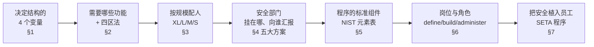
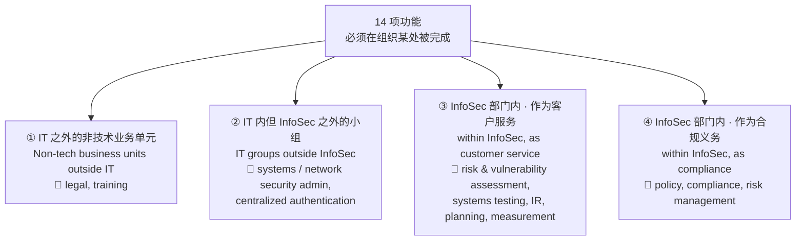
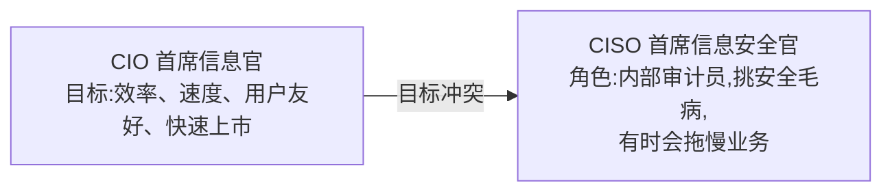
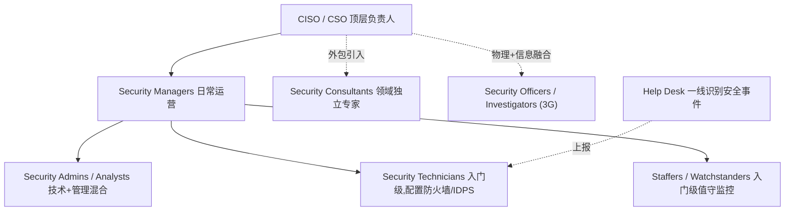
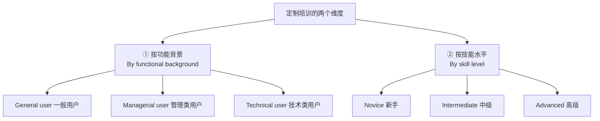
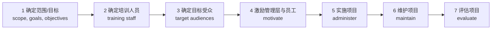

# Week 6 · Developing the Security Program(构建信息安全程序)

> *CSIT988/CSIT488 — Security, Ethics and Professionalism · A/Prof Khoa Nguyen · Autumn 2026 · 教材第 5 章(Whitman & Mattord)*

> **学习目标 (Learning objectives)** — 读完本章你应该能够:
> - 解释不同组织对信息安全的**组织化路径(organizational approaches)**,并说出决定一个 InfoSec 程序结构的**四个变量**及其优先级
> - 列举并描述一个信息安全程序需要的**功能组件(functional components)**,以及把它们分配到组织各处的**四区法(four-area approach)**
> - 讨论如何根据组织规模(very large / large / medium / small)来**规划与配置人员(plan and staff)**,并复述每种规模在预算、人均花费、人员结构上的差异
> - 复述 Wood 提出的 **5 种安放(placing)信息安全部门的方案**,并说出每种方案在 CISO 与 CEO 之间隔着几层中间管理者、各自优缺点、适合什么组织
> - 列举并描述信息安全程序里**典型的职称与职能(job titles and functions)**,以及 define / build / administer 三类岗位
> - 描述 **SETA(Security Education, Training, and Awareness)** 程序的三大组成,区分 education / training / awareness,并说明组织如何创建与管理它们

---

> 📎 **本周衔接(从 Week 5 到 Week 6)** — 上一讲(Information Security Policy)我们反复强调:**优质的信息安全程序始于政策、终于政策(begins and ends with policy)**。但政策只是"写在纸上的管理意志",它需要一个**组织载体**去执行——谁来写政策?谁来装防火墙?谁来培训员工?这些人如何编组、向谁汇报、分布在组织的哪个角落?这正是本周要回答的问题。换句话说:Week 5 讲的是**安全程序的"内容(政策)"**,Week 6 讲的是**安全程序的"骨架(人与组织结构)"**。讲师在开头特别说明:本周会**简要**介绍各种安全岗位的职称与职能,而岗位的**详细**讨论(认证、招聘、人事安全)会留到**倒数第二讲(Lecture 12,人员与安全)**——所以本章对职称只需建立框架性的认识即可。

什么叫一个组织的**信息安全程序(information security program)**?注意,这个词在不同公司嘴里含义并不一致。有些组织用"security program"泛指**所有**与信息安全相关的人员、计划、政策和举措的总和;还有些组织用它指代"企业安全/物理安全 + 计算机网络与数据安全"的产品组合。**在本课程中,我们给它一个明确的定义:信息安全程序是指那些"努力遏制组织信息资产风险"的工作所形成的结构与组织(the structure and organization of the effort that contains risks to the information assets of the organization)。** 一句话:它不是某个软件、某台设备,而是**一套"人 + 结构 + 职责"的安排**。

本章的主线很自然:既然程序是"人和结构的安排",那么——**(1)** 什么决定了这套结构的大小和形态?(§1 四个变量);**(2)** 这套结构里到底需要哪些功能?(§2 功能组件 + 四区法);**(3)** 不同大小的组织,人怎么配?(§3 四种规模);**(4)** 这个安全部门该挂在组织的哪根树枝上、向谁汇报?(§4 五种安放方案);**(5)** 程序由哪些标准组件构成?(§5);**(6)** 里面都是些什么岗位的人?(§6 角色与职称);最后 **(7)** 怎么通过教育、培训、意识把"安全"植入每个员工?(§7 SETA)。

---

## §1 决定 InfoSec 程序结构的四个变量

没有两个组织的信息安全程序长得一模一样。为什么?因为有四个变量在共同塑造它的大小与形态。slides 4 把它们列出来,但**它们之间是有优先级的**——这一点 slides 没明说,讲师在课上反复强调,是个常考的细节。

| 变量 | 含义 | 影响方向 |
|------|------|----------|
| **① Organizational culture(组织文化)** ⭐**最有影响力** | 上层管理者与员工是否**真心认为信息安全有价值** | 文化越正面 → 程序越大、越被支持 |
| **② Size(规模)** | 组织有多大、IT 基础设施多复杂、用户多 sophisticated | 越大越复杂 → 需要越多安全支持 |
| **③ Personnel budget(人员预算)** | 专门投给 InfoSec 程序**人员**的钱 | 通常与组织规模正相关 |
| **④ Capital & expense budget(资本与开支预算)** | 投给 InfoSec **物理资源**的钱(办公室、机房、测试设施等) | 越多 → 越能给安全团队独立的安全办公环境 |

**为什么文化排第一?** 讲师讲得很透:假设高层和员工都觉得"信息安全就是浪费时间和资源",那么这个程序天生就会**小而弱、得不到支持**——安全人员的努力甚至会被看成与组织使命相悖、有害于生产效率。反过来,如果组织内部对信息安全持有强烈而正面的看法,程序自然会更大、更被支持。这里有个关键洞察:**InfoSec 程序必须和组织文化"对齐(align)";一旦不对齐,冲突就会让程序失效。** 所以——决定一个程序命运的,首先不是钱、不是规模,而是**"这个组织到底重不重视安全"**。

后三个变量更直观。**规模**:像 Apple、Microsoft、Google 这样的巨头,会有一整个**专门部门(division)**做 InfoSec,里面有 CISO、多名 security manager、多名 admin 和大量 technician,还会按 policy / training / firewall / 入侵检测等细分专精;而一家小咖啡馆根本不需要 CISO,可能一个 admin 就够,甚至把安全职责直接塞给系统或网络管理员兼任。**人员预算**通常水涨船高,跟着规模走。**资本预算**有个容易被忽略的点:因为安全团队天天接触机密信息(安全计划、政策、结构、设计……),**给他们配一套独立的、物理安全的资源(比如独立办公空间)是审慎之举(prudent)**。

> 📎 **必记引文 — Briney & Prince, "Does Size Matter?"** — slides 4 引用了这篇文章的核心论断,几乎一定会考它的"精神":
> > "随着组织规模变大,其安全部门**跟不上**日益复杂的组织基础设施的需求。**安全在人均、机均上的投入随组织增长而呈指数级下降(declines exponentially)。**"
>
> 这句话点出了一个反直觉的现象:**大组织花的安全总预算更多,但摊到每个用户/每台机器上反而更少。** 这正是 §3 里"很大型组织人均只花 $300、小型组织却花 $5000+"现象的理论根源。记住关键词:**per user / per machine,exponentially。**

---

## §2 实现 InfoSec 程序所需的功能 + 四区法

### 2.1 14 项基本功能

组织规模影响程序的"长相",但**有些基本功能,无论组织大小都必须存在**,因此都应该被纳入预算分配。slides 5 列出了一个成功的信息安全程序所建议的 14 项功能:

| 偏"管理/合规"的功能 | 偏"技术/运营"的功能 |
|----------------------|----------------------|
| Risk management(风险管理) | Systems security administration(系统安全管理) |
| Risk assessment(风险评估) | Network security administration(网络安全管理) |
| Policy(政策) | Centralized authentication(集中认证) |
| Compliance(合规) | Systems testing(系统测试) |
| Legal assessment(法律评估) | Vulnerability assessment(脆弱性评估) |
| Planning(规划) | Incident response(事件响应,IR) |
| Measurement(度量) | Training(培训) |

> **划重点** — 讲师特别提醒:**这些功能"不一定"要在 InfoSec 部门内部完成,但它们"必须"在组织的某个地方被完成(performed somewhere within the organization)。** 这句话是理解下面"四区法"的钥匙——功能是固定的,但谁来做、放在哪,是可以灵活安排的。

### 2.2 四区法:功能该怎么分组(slides 7)

大型组织会针对自己面临的特定安全挑战,**组建内部小组(internal groups)**;为了应对长期挑战、同时处理日常安全运营,这些小组还会不断地"组建、再重组"。于是功能会被**拆分到不同的组**里。小型组织则相反——往往只有一个笼统的大组代表整个部门。

一个被推荐的做法,是把这些功能分到**四个区域**。注意每个区域的"归属"和"性质"不同,这是高频考点:

理解这张图的关键在两组对比:**"在 IT 内还是 IT 外"** 决定了第①②区;**"在 InfoSec 内是对外服务还是对内合规"** 决定了第③④区。

- **第③区(customer service,客户服务性质)**:像风险评估、脆弱性评估、系统测试、事件响应、规划、度量这些,可以看成 InfoSec 部门**为组织内其他部门、乃至外部伙伴提供的"服务"**。
- **第④区(compliance,合规义务性质)**:policy、合规审计(compliance audits)、风险管理,则是组织**为规避法律风险而必须履行的尽职义务(due diligence)**,带有"强制执行"的色彩,而不是"服务"。

---

## §3 按规模配人:四种规模的组织

这是本章最"可考"的部分之一,因为四种规模在**计算机数量、安全预算占比、人均花费、人员结构**上都有具体数字。

但先记住一个前提(slides 8):无论规模如何,**确保这些功能"在某处被充分完成",始终是 CISO 的责任**;而组织要不要养**全职安全人员**、养多少,取决于三个因素——**① 待保护信息的敏感度(sensitivity of the information);② 行业监管(industry regulations,在金融、医疗等行业尤其强);③ 总体盈利能力(general profitability)。** 一句话:**公司能投给人员预算的资源越多,越可能维持一支庞大的 InfoSec 团队。** 带着这个前提,再看四种规模的对比:

| 维度 | **Very large(XL)** | **Large(L)** | **Medium(M)** | **Small(S)** |
|------|---------------------|---------------|---------------|--------------|
| **计算机数量** | > 10,000 台 | 1,000 – 10,000 台 | 100 – 1,000 台 | 10 – 100 台 |
| **安全预算特点** | 总额巨大,增速**快于 IT 预算** | 仅占 IT 预算约 **5%**,偏少 | 总预算较小 | 占 IT 预算约 **20%**,比例最高 |
| **人均安全花费** | **最低**(约 **$300/用户**) | 偏低 | 居中 | **最高**(> **$5,000/用户**) |
| **人员结构** | 整个专门 division;>20 名全职 + 40+ 兼职 | 1–2 全职管理 + 3–4 全职 admin/技术 + ~15 兼职 | 1 名 security manager + 1–2 admin + 1 技术 + ~3 兼职 | 通常 1 人(常是兼职),+ 1–2 助手 |
| **典型痛点 / 特征** | 政策与资源管理做得最好 | 规划/政策已融入文化,但花钱偏保守 | **设政策、处理事件、分配资源的能力比任何规模都差**;倾向忽略部分功能 | 几乎没有正式政策/规划;靠单个管理员;但被攻击风险也较低 |

> 🔑 **理解那个"人均花费悖论"** — 为什么 XL 组织总预算几百万、人均却只有小组织的 1/18(约 $300 vs $5000+)?讲师给的直觉是:安全程序有**规模经济**。很多安全投入是"一次性铺给全体"的(一套防火墙策略、一个 SIEM、一份培训课程),不必为每个小用户群单独花一笔专用成本;用户基数一大,平均下来自然便宜。这恰好印证了 §1 里 Briney & Prince 的"指数级下降"。

逐个看四种规模的关键特征:

**Very large(>10,000 台)。** 拥有专门的 InfoSec division。结构上 CISO 居顶,下分**技术服务(technical services)**与**合规(compliance)**两大块;技术服务下又细分脆弱性评估(按 DMZ / 内网 / 客户端服务器划分责任区)、malware(分客户端侧/服务器侧)、技术咨询(再分 design / architecture / implementation),合规侧则有风险评估与风险管理团队。典型规模:4–5 名全职 security manager、10–15 名全职 admin/技术、外加若干兼职。它在**政策与资源管理上做得最好**。

**Large(1,000–10,000 台)。** 安全路径已经**成熟**,规划和政策已融入组织文化(约 8 成组织说至少部分安全决策受政策指导)。但它们**花钱偏保守**,平均只占 IT 总预算约 5%,这会在"人"的方面造成压力。结构比 XL 简单:CISO 下设技术安全团队、风险管理与政策团队,再加边界安全团队(管防火墙、IDPS)和处理 malware/服务器问题的团队。常见一个典型现象:一名 Windows 服务器系统管理员,**既维护服务器、又兼管其上的安全应用**(兼职安全)。

**Medium(100–1,000 台)。** 这是讲师着重提醒的"最尴尬"的一档:预算更小,**安全人手和小型组织差不多,需求却大得多**。它们必须**依赖 IT 人员**来落实安全计划与实践;**设政策、按章处理事件、有效分配资源的能力,比任何规模都差**,而它们识别到的事件数量却在"暴涨(skyrocketing)"。它可能大到足以采用多层(multi-tiered)安全方法,但通常组更少、每组功能更杂。第①类功能(legal/training 等)更多被甩给 IT 内其他部门;集中认证常被交给 IT 部门的系统管理员。结果是:**medium 组织往往会"忽略"一部分安全功能**——当 InfoSec 配不齐某功能、而 IT 或别的部门又没被要求顶上时。

**Small(10–100 台)。** 简单、集中式的 IT 模型。安全通常**只有一个人**负责,且更多时候只是某个 IT 人员的"附加职责"。它在**比例上**花钱最猛(约占 IT 预算 20%),**人均**花费也最高(>$5000)。好消息是:资源稀缺带来的劣势,被"成为攻击目标的概率较低"这一点**部分抵消**了。

---

## §4 把 InfoSec 部门安放在哪:五大方案

现在来到信息安全管理中一个**非常重要**的问题:这个安全部门到底该挂在组织结构图的哪个位置、向谁汇报?

### 4.1 为什么会有"安放"这个难题:CIO vs CISO 的固有冲突

在大型组织里,InfoSec 部门通常位于 **IT 部门**之内,由 **CISO** 直接向 **CIO(Chief Information Officer,首席信息官)** 汇报。这个结构**暗示** CISO 和 CIO 的目标高度一致——**但现实往往并非如此**,这正是冲突的根源:

- **CIO 的使命**是让组织的信息处理与访问**高效、快速**。任何拖慢或限制信息处理的东西,都与他的使命**直接相悖**。
- **CISO 的职能**更像组织内部的**审计员(internal auditor)**:他要去**检查现有系统,挖出技术、软件、活动、流程里的安全缺陷**。而这种检查,有时**恰恰会打断**信息的处理与访问。

正因为两者目标可能冲突,业界出现了**把 InfoSec 从 IT 部门中分离出来**的运动。真正的挑战是:**设计一个能平衡各"利益共同体(communities of interest)"需求的汇报结构。** 现实中,InfoSec 单元常常被"硬塞(shoehorned)"进组织结构图里某个反映其边缘地位的位置,被这挪那挪,没人关心这种挪动如何损害了它的效能。一个理性的折中,是给 InfoSec 找一个**能平衡"政策执行"与"教育、培训、意识、客户服务"** 的位置——这样才能把安全融进组织文化。

安全顾问 **Charles Cresson Wood** 在《Information Security Roles and Responsibilities Made Easy》一书中,汇编了业界关于"安全部门该放哪"的最佳实践。下面介绍他提出的 **5 个主要方案**。

### 4.2 五大方案逐一对比

> ⭐ **应试关键** — 讲师明确点题:对每个方案,**最该记住的"标志性属性"是"CISO 到 CEO 之间隔着几层中间管理者(middle managers)"**。中间层越少,安全的声音越容易传到最高层。下表把这个数字、优缺点、适用对象一并整理:

| 方案 | InfoSec 汇报给… | CISO↔CEO 中间管理层 | 主要优点 | 主要缺点 | 适合 / 评价 |
|------|------------------|:---:|----------|----------|------------|
| **① IT Department** | IT 部门(CIO) | **1 层**(CIO) | 最常见(约占全球 1/3,**UOW 即用此结构,IT 部门叫 IMTS**);CIO 懂技术、能直达高层;只隔一层 | **固有利益冲突**:CIO 在资源取舍时倾向牺牲安全;安全被当成又一项普通 IT 技术专项 | 最普遍但**已不再是最被推荐**的 |
| **② Security Department** | 安全部(含人事安全、安防、物理安全) | **2 层** | 与物理安全沟通顺畅(如笔记本失窃这类"物理+信息"复合事件);带来更长远的预防视角,可能降低总安全成本 | 信息安全(高科技)与物理安全(刑事司法背景)**文化差异大**;物理安全预算多年不涨会**拖低**信息安全预算;部门头不懂 IT 技术,难向高层沟通;易被当成"新警察" | 可接受,但不如后面几种 |
| **③ Administrative Services** | 行政服务部(行政副总裁) | **1 层** | 把 InfoSec 定位为**面向全员的咨询/服务**(类似 HR);承认信息无处不在、全员都要配合;支持"保护任何形式的信息",而非只盯计算机网络 | 行政副总裁常不懂 IT,难与 CEO 沟通;对**高度依赖信息的企业(如电商)**给不到应有的重视和战略/长远定位;更易受削减成本压力 | 适合**非信息密集型**组织(如连锁餐厅) |
| **④ Insurance & Risk Management** | 保险与风险管理部(首席风险官) | **1 层** | 鼓励**整合风险管理(integrated risk management)**视角:跨部门统一评估、比较、排序风险并分配资源;风险官偏预防、长远,能与 CEO 智性讨论风险接受/缓解/转移 | 风险官通常不懂 IT 技术,需 InfoSec 经理"补课";焦点偏战略,**运营与行政层面**可能得不到应有关注 | 适合**信息密集型**组织(银行、券商、电话公司、研究机构) |
| **⑤ Strategy & Planning** | 战略与规划部(战略规划副总裁) | **1 层** | 把信息安全视为组织成败的**关键**;强调全组织范围的文档化安全要求(政策、标准、流程);承认安全的多部门、多学科属性;隐性传达"安全是管理与人的问题,不只是技术" | 若 IT 部门觉得 InfoSec 人"只会管理、脱离技术",优点反成缺点;焦点偏战略,运营/行政层面易被忽视 | 适合**极度依赖信息安全成败**的组织(电商、信用卡公司);是值得长远考虑的可取方案 |

> 📎 **拓展(风险的三种处置,Lecture 10 预告)** — 方案④提到风险官能和 CEO 讨论 **risk acceptance / risk mitigation / risk transfer**。讲师顺带剧透了它们的含义,这里先记个印象(细节留到第 10 讲):**risk acceptance** ≈ 什么都不做、接受风险;**risk mitigation** ≈ 给组织加控制措施去降低风险;**risk transfer** ≈ 把风险转嫁出去,典型做法就是**买保险**。

> 🧠 **记忆抓手** — 方案 ①③④⑤ 都只隔 **1 层**中间管理者,**唯独方案②(Security Department)隔 2 层**,这是它的一大硬伤,也是最容易出考点的对比。另一个抓手:**信息密集程度** ——不密集(连锁餐厅)→ ③;密集(银行)→ ④;成败全系于安全(电商/信用卡)→ ⑤。

### 4.3 其余次要方案(slides 23)

Wood 还列了 5 大方案之外的次要选项,只需有个印象,注意哪些是"**不推荐(not advised)**"的:

| 方案 | 位置 | 评价 |
|------|------|------|
| ⑥ Legal(法务) | 法务部 | — |
| ⑦ Internal audit(内审) | 内部审计 | **不推荐** |
| ⑧ Help desk(服务台) | 帮助台 | **不推荐**(只是低层技术组,得不到高层关注与资源) |
| ⑨ Accounting & finance through IT | 经 IT 的财会 | **不推荐** |
| ⑩ Human resources(人力资源) | HR | **不推荐** |
| ⑪ Facilities management | 设施管理 | — |
| ⑫ Operations | 运营(向 COO 汇报) | — |

---

## §5 安全程序的标准组件(Components)

我们已经知道安全程序的结构因文化/规模/预算而**独一无二**,那它具体由哪些"标准件"构成?

第一步是**确定程序的运作层级**,这取决于组织的**战略计划(strategic plan)**——尤其是其中的**愿景(vision)与使命(mission)陈述**。回忆 Week 3 讲组织规划时的逻辑:**CIO 和 CISO 应该用这两份文件,为 InfoSec 程序"翻译"出专属的使命陈述**(把全组织的愿景/使命,逐级具体化为 IT 的、再到 InfoSec 的)。

具体怎么构建?**NIST** 的两份文件提供了指引,务必记住编号:

- **NIST SP 800-14** — *Generally Accepted Principles and Practices for Securing Information Technology Systems*(信息技术系统安全的公认原则与实践)。给出计算机与信息安全核心议题的宽广概览,帮读者理解自身安全需求、合理选择安全控制。
- **NIST SP 800-12** — *An Introduction to Computer Security: The NIST Handbook*(计算机安全导论:NIST 手册)。非常通用、入门级,**推荐每位信息安全从业者**都读。

slides 25 给出一张汇总表,列出这两份文件提炼出的**基本程序元素(essential program elements)**。建立印象即可:

| 类别 | 典型元素 |
|------|----------|
| **Policy(政策)** | program policy、issue-specific policy、system-specific policy |
| **Program management(程序管理)** | risk management、life-cycle planning、personnel/user issues |
| **Operational(运营)** | preparing for contingency & disaster、computer security incident handling、awareness & training、physical & environmental security |
| **Technical protection(技术防护)** | identification、authentication、logical access control、audit、cryptography |

> **关于"人"** — 讲师强调:在所有组件里,**人员职能(personnel function)与其期望**是最关键的之一。维持安全环境要求 InfoSec 部门被精心组织、配备**经过适当技能筛选(skilled and screened)**的人员,还要求把**合理的流程嵌入所有人力资源活动**——招聘、培训、晋升、**离职(termination)**。这一块会在 Lecture 12–13(人员与安全)专门展开。

---

## §6 信息安全的角色与职称

### 6.1 三类人:define / build / administer(slides 26)

一项由 Schwartz、Erwin、Weafer、Briney 做的研究发现,InfoSec 岗位可归为三类。理解它们的差别,招人时就能更高效地各取所需:

| 类型 | 做什么 | 人的特征 |
|------|--------|----------|
| **Those that define(定义者)** | 提供政策、指南、标准;做咨询与风险评估;设计产品与技术架构 | **资深**、知识面**广**,但往往**不深(broad, not deep)** |
| **Those that build(构建者)** | 真正的"技术咖(techies)",创建并安装安全解决方案 | 技术性最强 |
| **Those that administer(管理运维者)** | 操作与管理安全工具、安全监控功能;持续改进流程 | 可**通过培训**胜任特定任务 |

招聘启示:**政策类岗位招更资深的人,构建类招更技术的人,运维类招"可培训上岗"的人。**

### 6.2 八类典型职称(slides 27)

虽然各组织叫法不同,但大多数 InfoSec 岗位都能归入以下八类。讲师强调本周只**简要**介绍,细节留到 Lecture 12:

| 职称 | 职责速记 |
|------|----------|
| **CISO**(也叫 CSO,Chief Security Officer) | 顶层负责人,负责**评估、管理、实施**保护全组织信息的程序 |
| **Security managers(安全经理)** | 对安全程序的**日常运营**负责;完成 CISO 设定的目标(向 CISO 汇报);解决下属技术/管理人员上报的问题 |
| **Security admins & analysts(安全管理员/分析师)** | technician 与 manager 的**混合体**:既懂技术、又有一定管理技能;管日常安全运营,也协助开发/实施培训、政策 |
| **Security technicians(安全技术员)** | 技术合格者:配置防火墙与 IDPS、部署安全软件、排障、与系统/网络管理员协同。通常是**入门级(entry-level)** 岗位 |
| **Security staffers & watchstanders(值守人员)** | 做例行值守与行政工作:盯入侵控制台、监控邮件账户等。常是**入门级**,负责监控组织安全态势的某一面 |
| **Security consultants(安全顾问)** | 某一安全领域(灾难恢复、业务连续性、安全架构、政策开发等)的**独立专家**;组织决定**外包**某部分安全工作时引入 |
| **Security officers & investigators(安全官/调查员)** | 当物理安全与 InfoSec 融合为一个单元时出现;常与执法相关,即所谓安全的 **"3 个 G:gates、guards、guns"**(门禁、保安、枪) |
| **Help desk personnel(帮助台人员)** | 安全团队的重要一环:用户报修时,问题背后可能是更大的安全事件(黑客、DoS、病毒)。他们需专门培训,能**识别并区分**普通技术故障与安全威胁,这能为事件响应**抢出宝贵时间** |

---

## §7 SETA 程序:把"安全"植入每个员工

### 7.1 SETA 是什么、为什么需要它(slides 28–29)

一旦 InfoSec 程序在组织里落地,就该开始规划 **SETA 程序(Security Education, Training, and Awareness)**——它是 **CISO 的职责**。它的核心目的是:**减少组织成员(员工、承包商、顾问、供应商、业务伙伴……凡是接触组织信息资产的人)造成的"意外性"安全破坏(accidental security breaches)**。

为什么盯着"意外"?回忆我们在组织规划那一讲学过的 **12 类信息安全威胁**——其中 **acts of human error or failure(人为错误或失误)** 不仅在列,而且是**最常见、排在最前面**的头号威胁。SETA 正是对症下药。

SETA 提供三大收益:

1. **改善员工行为(improve behavior)**
2. **告知成员去哪里举报(where to report)** 政策违规
3. **让组织能追究员工行为责任(accountability)**

> **为什么问责如此重要?** 讲师点出:问责能确保"个人的行为不会威胁整个组织的长期存续"。一旦组织**不追责**,就增加了遭受重大损失、乃至倒闭的风险——而组织一倒,**全体员工都丢饭碗**(这与 Week 5"政策保护员工饭碗"的逻辑一脉相承)。

SETA 通过**三种方式**增强安全(slides 29):**①** 建立**深度知识**,以设计、实施、运营安全程序;**②** 培养**技能与知识**,让计算机用户能更安全地完成本职工作;**③** 提升对"保护系统资源之必要性"的**意识**。

### 7.2 三根支柱:Awareness / Training / Education 的区别

SETA 由三个元素组成。它们最容易混淆,而 **education 与 training 的区别是常考点**。先看那个经典的对比矩阵(slides 29 的表,源自 NIST):

| 属性 | **Awareness(意识)** | **Training(培训)** | **Education(教育)** |
|------|----------------------|---------------------|----------------------|
| **层次(Level)** | "What"——信息 | "How"——知识 | "Why"——洞察 |
| **目标(Objective)** | 识别与记忆(recognition) | 技能(skill) | 理解(understanding) |
| **教学方法** | 媒体:视频、海报、新闻通讯 | 实操指导:讲课、动手、案例研讨 | 理论指导:研讨、阅读与研究 |
| **测评方式** | 判断题、选择题(识别) | 解题(应用) | 论述题(诠释) |
| **影响时效** | 短期 | 中期 | 长期 |

> 🔑 **教育 vs 培训:一个学术老笑话** — 讲师用了个流传已久的玩笑来一刀切开两者:**"你愿意让你 14 岁的女儿在学校接受 sex *education* 还是 sex *training*?"** 笑过之后记住其内核:**education 关乎"是什么 / 为什么"的理论与原理(理解 the *what*),training 关乎"怎么做"的实操技能(transfer skill,the *how*)。** 这就是为什么 education 偏理论、长期,training 偏实践、中期。

### 7.3 Security Education(教育,slides 30–31)

当 InfoSec 部门里有人的背景或经验不足以胜任其岗位时,在条件允许、且战略上有必要时,可**鼓励其接受正规教育**。InfoSec 教育项目要覆盖**三类人对应的三层要求**(正好呼应"三个利益共同体"):

1. 所有 **InfoSec 专业人员**必备的信息安全教育组件
2. 所有 **IT 专业人员**必备的通用教育要求
3. 所有 **业务专业人员**应理解的通用知识

很多高校(包括 UOW)提供 InfoSec 正规课程,但**现实问题是**:多数"安全相关学位"其实是计算机科学/信息系统学位,只塞了几门安全课——所以**报名前要仔细看课程设置(curriculum)**。由于很多院校缺乏衡量某岗位所需技能的参照系,它们常转而参考该领域的**认证(certifications)**:

> **必记认证**(细节留到 Lecture 12):**CISSP**(Certified Information Systems Security Professional,信息安全管理领域**最负盛名**的认证)、**CISM**(Certified Information Security Manager)、**GISO**、**GIAC**(Global Information Assurance Certification)、**Security+**。

slides 31 还给了一个示例:课程按**逐渐加深的技术性**排列,并标注知识领域与**先修要求(prerequisites)**——比如要上"Introduction to Information Security",得先修过"introduction to computing"和"data communications";要上"firewall technologies",得先掌握"advanced networking"。

### 7.4 Security Training(培训,slides 32–39)

**Training** 是向成员提供**详细信息与动手指导(hands-on instruction)**,使其能安全地履行职责。管理层可以**自研定制培训**,也可以**外包**部分。

**两种定制维度:**

由于传统模型习惯用"技能水平"做切分,教材后续主要沿**功能背景**展开(slides 33):

- **一般用户(general users)**:对政策做培训——这正是确保政策被"读到并理解"的方法之一(呼应 Week 5),让用户能提问、获得具体指引,组织也能收集到所需的**合规确认函(letters of compliance)**;还需培训如何安全做事的技术细节(口令管理、专门的访问控制、违规上报等)。
- **管理类用户(managerial users)**:培训需求与一般用户类似,但经理们期待**更个性化**的形式——小班、更多互动与讨论。讲师补充:经理们常**抗拒任何形式的正规培训**,这时候"**冠军(champion)**"(高管层的支持者)出面,劝动经理来参加,就能反过来强化整个培训项目。
- **技术类用户(technical users)**:比前两者**更详尽**,可能需引入顾问或外部培训机构。选择与开发高级技术培训有 **3 种方法**:按**工作类别(job category)**、按**工作职能(job function,如会计 vs 市场 vs 运营)**、按**技术产品(technology product,如邮件客户端、数据库)**。

**培训的交付方式(delivery methods,slides 34)。** 注意一个现实:交付方式的选择**未必以"对受训者最好"为准**,往往被**预算、排期、组织需求**所凌驾。常见七种方式,各有利弊(教材 slides 35–37 给了完整优缺点表,建议课后细看):

| 交付方式 | 含义 | 典型优点 | 典型缺点 |
|----------|------|----------|----------|
| **One-on-one(一对一)** | 专属培训师针对单个受训者 | 非正式、个性化、贴合需求、可灵活排期 | 资源密集、效率偏低 |
| **Formal class(正式课堂)** | 一名培训师对多名受训者 | 高效、成本低、便于互动答疑 | 节奏难以兼顾所有人 |
| **CBT(计算机辅助培训)** | 预打包软件,在工位上学 | 灵活、可自定进度、无需到场 | 缺乏人际互动、维护更新成本 |
| **Distance learning / web seminars(远程/网络研讨)** | 在自己电脑上听讲,部分支持语音/答题反馈 | 不受地域限制(如 Zoom) | 互动有限、依赖网络 |
| **User support group(用户支持小组)** | 常由厂商促成的用户社区互助 | 低成本、贴近产品实际 | 质量参差、非系统化 |
| **On-the-job training(在岗培训)** | 边用真实软硬件与流程边学 | 贴近真实工作、即学即用 | 可能影响生产、易出错 |
| **Self-study(自学,非计算机)** | 自行研读材料 | 成本最低、最灵活 | 全靠自律、无人指导 |

**选择培训人员(slides 38)。** 组织可以:用本地培训项目、用继续教育部门、用外部培训机构;或雇佣专业培训师/顾问/认证机构的人来做**现场培训**;也可以**自己员工在内部办**。最后一项要慎重——**有效培训需要特殊的技能**,给 5 人以上的同事/下属上课,和"私下给同事支两招"完全是两码事。

**实施培训的七步法(slides 39,源自 NIST SP 800-12)。** 这是高频"列举题":

为培训而对员工**分组**,可按 5 种方式:**①** 按意识水平(level of awareness);**②** 按一般工作任务/职能(data provider / processor / user);**③** 按具体工作类别(general management / technology management / application development / security);**④** 按计算机知识水平(专家偏好技术内容,新手受益于基础内容);**⑤** 按所用技术或系统类型(不同应用需专属培训)。

### 7.5 Security Awareness(意识,slides 40–42)

**安全意识程序(security awareness program)** 有个反差极大的标签:**最少被实施、却最有效**的安全方法之一。正如 NIST SP 800-12 所述,它的作用是:

- **为培训铺路**——通过改变组织态度,让大家意识到安全的重要性及其失效的恶果(set the stage for training);
- **提醒用户**应遵循的流程(remind users of procedures)。

它的价值在于:让 InfoSec **每天都停留在用户脑中最显眼的位置**,激发员工的责任感与目的感,让他们更在意自己的工作环境。

**开发意识程序的 10 条要诀(slides 41)**——常考的"列举/判断"题:

1. **聚焦于人(focus on people)**——人既是问题、也是解决方案的一部分
2. **避免技术行话(refrain from technical jargon)**——说用户听得懂的话
3. **用尽一切可用渠道(every available venue)**
4. **定义清晰的学习目标**,陈述明确、覆盖充分
5. **保持轻松(keep things light)**,别说教
6. **别让用户超载(don't overload)**——别一次塞太多
7. **帮用户理解自己在 InfoSec 中的角色**,以及安全被破坏会如何影响其工作
8. **善用内部传播媒介(in-house communications media)**
9. **让意识程序正式化**——规划并记录所有行动
10. **早点给出好信息,胜过迟来的完美信息(good info early > perfect info late)**

**意识程序的组件(slides 42)。** 有的几乎零成本,有的(外购时)很贵:

| 组件 | 备注 |
|------|------|
| **Videos(视频)** | — |
| **Posters & banners(海报/横幅)** | 简单廉价,贴在公共区域尤其用技术的地方;专业设计的海报很贵,**自制**常是最优解 |
| **Lectures & conferences(讲座/会议)** | 可请嘉宾或办小型专题会 |
| **Computer-based training(CBT)** | — |
| **Newsletters(新闻通讯)** | **最具成本效益**的传播方式;可纸质/邮件/内网;内容含新威胁、课程排期、新到岗安全人员 |
| **Brochures & flyers(手册/传单)** | — |
| **Trinkets(小礼品:咖啡杯、笔、铅笔、T 恤)** | 单价不高,但**全员分发起来很贵**,属较昂贵的一类 |
| **Bulletin boards(公告栏)** | — |
| **Website(网站)** | 设专页推广安全意识;难点在**保持内容常新**;UOW 就有这样一个网站,讲如何安全上网并提供安全意识培训 |

> 🧩 **真实场景** — 讲师举自己所在的 UOW 为例:对员工而言,安全意识培训是**强制**的——每月会收到一个**在线课程**,要看视频、再做**选择题(MCQ)** 测验,以提升信息安全意识,这是员工**年度考核(annual review)** 的必要环节。这正是上面"网站 + CBT + 测评"组件的活例子。

---

## 本章小结 (Key takeaways)

- **信息安全程序 = "遏制组织信息资产风险"之努力的"结构与组织"**;它不是某个软件或设备,而是人、结构与职责的安排。
- 决定程序结构的有**四个变量**:**组织文化(最有影响力)** > 规模 > 人员预算 > 资本/开支预算;Briney & Prince 指出,**安全的人均/机均投入随组织增长呈指数级下降**。
- 一个程序需要约 **14 项基本功能**;它们**不必都在 InfoSec 部门内完成,但必须在组织某处完成**,可用**四区法**分配(IT 外业务单元 / IT 内非 InfoSec / InfoSec 内作客户服务 / InfoSec 内作合规义务)。
- 四种规模(XL >10,000、L 1,000–10,000、M 100–1,000、S 10–100 台)在预算与人手上差异巨大:**人均花费 S 最高(>$5,000)、XL 最低(~$300)**;**Medium 组织最尴尬**——人手少、需求大、设政策与处置事件的能力最差。
- 安放 InfoSec 部门时,**CIO(求效率)与 CISO(像内审、挑毛病)目标天生冲突**;Wood 给出 **5 大方案**,**记住每种方案 CISO↔CEO 隔几层中间管理者**:除 ② Security Dept 隔 **2 层**外,①③④⑤ 都只隔 **1 层**;按信息密集度选:不密集→③、密集→④、成败全系于安全→⑤。
- 程序的运作层级源自组织**战略计划(愿景/使命)**,由 CIO+CISO 翻译成 InfoSec 使命;构建指引看 **NIST SP 800-14 与 SP 800-12**。
- InfoSec 岗位分三类——**define(资深、广而不深)/ build(技术咖)/ administer(可培训上岗)**;典型职称有 CISO、security manager、admin/analyst、technician、staffer/watchstander、consultant、officer/investigator、help desk。
- **SETA** 由 CISO 负责,旨在减少**意外性**破坏(人为错误是头号威胁);三支柱区别牢记——**Awareness=What/识别/短期,Training=How/技能/中期,Education=Why/理解/长期**。
- **Education 偏理论("是什么/为什么"),Training 偏实操("怎么做")**;培训可按功能背景/技能水平定制,交付方式选择常被预算与排期凌驾;**实施培训七步法**(范围→人员→受众→激励→实施→维护→评估)要会列举。
- **安全意识程序"最少被做、却最有效"**;牢记 **10 条开发要诀**与常见组件(海报、newsletter 最具性价比、trinkets 较贵、website 难在保鲜)。
