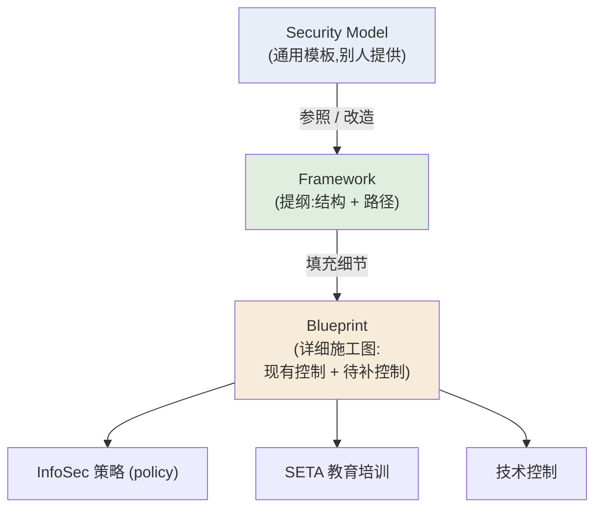
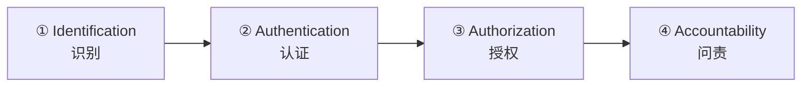
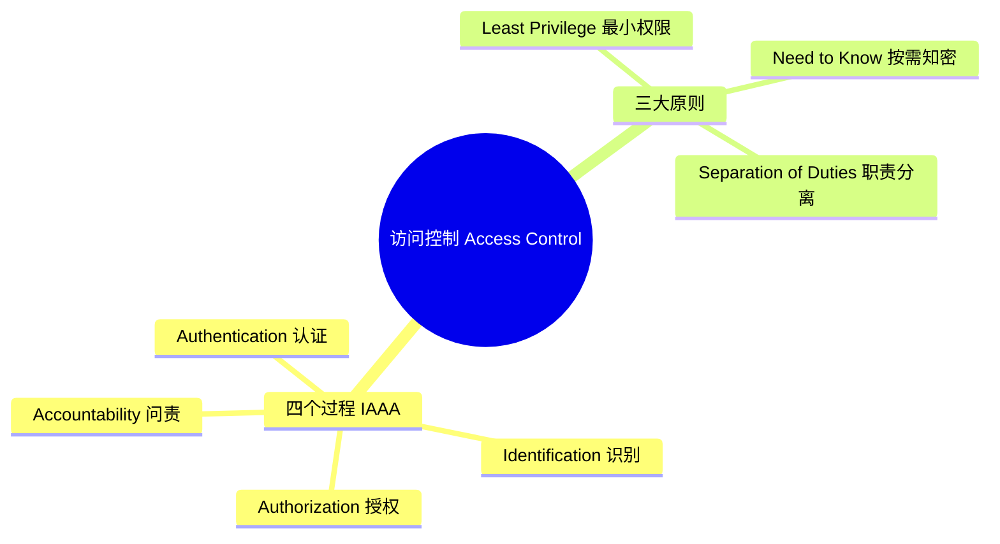
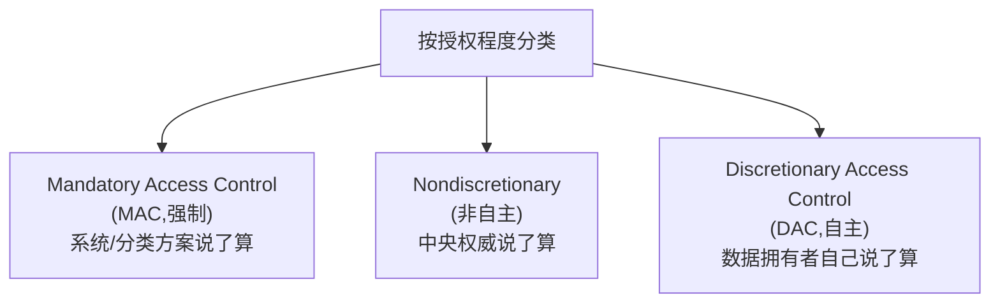
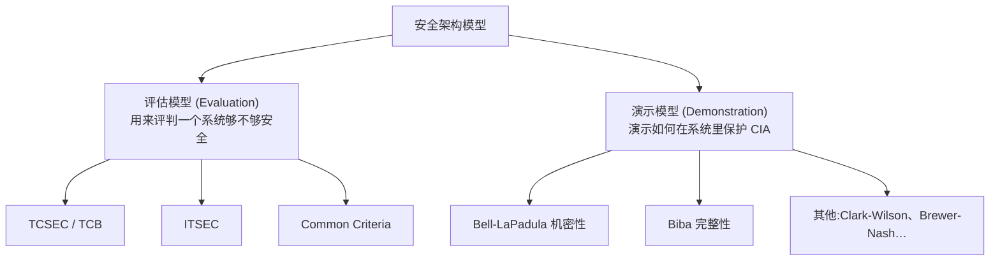
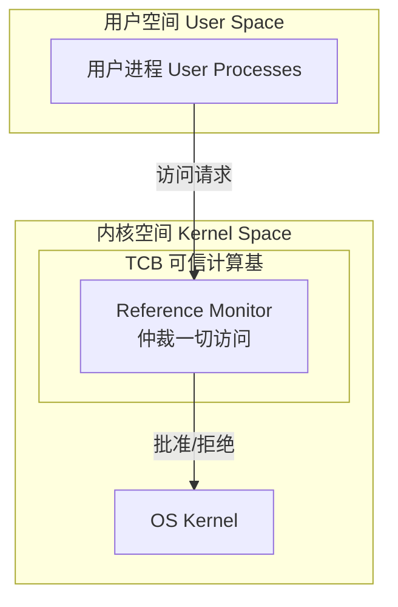
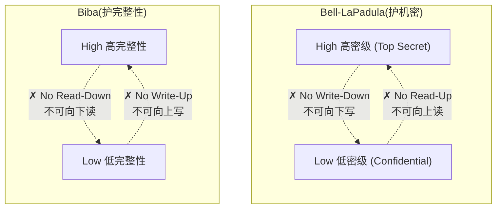
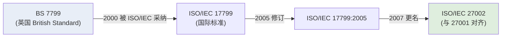
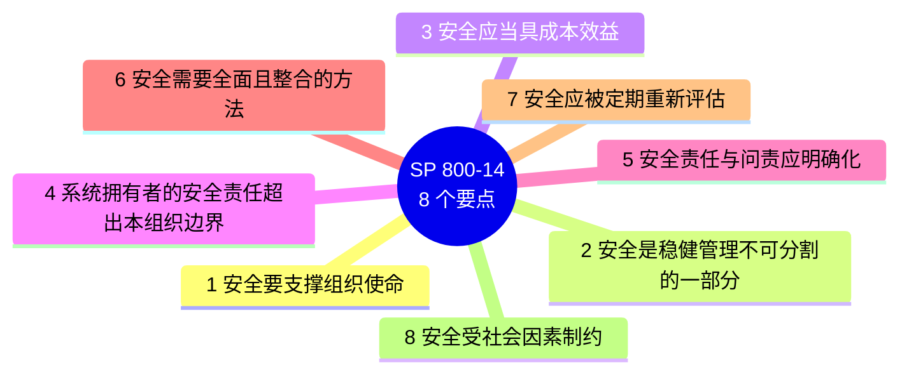
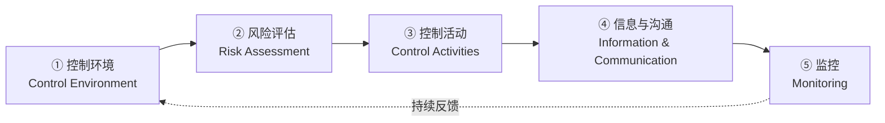

# 第七周 · 安全管理模型 (Security Management Models)

> **学习目标 (Learning objectives)** — 读完本章你应该能够:
> - 区分 **blueprint(蓝图)**、**framework(框架)** 与 **security model(安全模型)** 三个常被混用的术语,并说明它们之间的层级关系。
> - 解释为什么 **access control(访问控制)** 是信息安全管理的核心,并完整复述它的四个过程 (IAAA) 与三大原则。
> - 用**三种不同的视角**(按特性、按运营影响、按授权方式)对访问控制进行分类,并能判断一个具体控制属于哪一类。
> - 解释 **MAC / 非自主 / DAC** 三类授权模型的差别,并理解数据分类 (data classification) 与人员安全许可 (security clearance) 如何配合 MAC 工作。
> - 复述 **Bell-LaPadula** 与 **Biba** 两个模型的规则(no read-up/no write-down vs no read-down/no write-up),并解释它们为什么"互为镜像"。——*讲师明确说这是他最爱出的考题之一。*
> - 说明 **ISO 27000 系列、NIST SP 800 系列、COBIT、COSO** 这几大管理模型各自解决什么问题、由谁制定、适用于什么场景。

上一周我们讲的是"如何把信息安全这件事**组织起来**"——把 InfoSec 部门安插进公司(Wood 的五种摆放方式)、安全计划的组成、岗位头衔、以及如何落地 SETA 培训。那一周回答的是"**谁来做、放在哪做**"。

但是把人和部门安排好之后,马上会冒出一个更尖锐的问题:**具体照着什么蓝本去做?** 没有人愿意从一张白纸开始发明一整套安全体系——既慢又容易出错,还无法向客户证明自己"合规"。于是行业里逐渐沉淀出大量**现成的标准、框架与模型**:有的来自政府(美国国防部、NIST),有的来自国际标准组织(ISO/IEC),有的来自审计与治理行业(ISACA、COSO)。本章就是一张"地图",带你认识这些可供"参照、模仿、采纳"的蓝本,并重点讲透其中最核心的一块——**访问控制 (access control)**。

本章的内在脉络是这样一条线:**先搞清术语**(蓝图/框架/模型到底谁是谁)→ **深入访问控制**(信息安全管理里最反复出现、最重要的一块)→ **看安全架构模型**(把抽象规则落到系统里:TCSEC、Bell-LaPadula、Biba……)→ **最后回到管理层面的大框架**(ISO、NIST、COBIT、COSO)。每一节都为下一节埋下问题,跟着走即可。

---

## 1. 先把术语理顺:模型、方法论、蓝图、框架

很多同学一上来就被 model / framework / blueprint / methodology 这几个词绕晕,因为它们意思相近又层层嵌套。我们先把它们拆开。

一个 **InfoSec model(信息安全模型)** 本质上是一套**用来参照或比较的标准 (standard)**。它的价值不在于"必须照搬",而在于给你一个"起跳点 (stepping-off point)"——你可以模仿 (emulate) 它、采纳 (adopt) 它,也可以只取其中几块来改造。

为什么不直接照抄?因为讲师反复强调一句话:**"对一个组织管用的东西,未必精确地适合另一个组织。"** 每个信息安全环境都是独一无二的——一家做军工的公司和一家卖快餐的连锁店,需要的安全程度天差地别。所以现实中你常常需要从**好几个框架里各取一部分**,拼出适合自己的那一套。

这里出现了第一个关键词 **methodology(方法论)**:它指的是**完成某项任务的一种正式、被公认的做法**,通常由某个组织或某领域的专家群体推荐或背书。选择一套 InfoSec 方法论的常见途径,就是去**采纳 (adopt) 或改造 (adapt) 一个现成的安全模型**。

那么 blueprint 和 framework 又是什么?讲师给了一个很清晰的"嵌套"说法,我们用一句话先记住,再展开:

> **Framework 是 blueprint 的"提纲";blueprint 是把提纲填满的"详细施工图";security model 则是别人给你的一份"通用施工图模板"。**

逐个说清楚:

- **Blueprint(蓝图)**:它**描述组织中已经存在的控制 (existing controls)**,并**指出还需要补上哪些控制 (necessary controls)**。蓝图是高度组织化、针对你这家公司量身定制的。
- **Framework(框架)**:它是那份"更详尽、更针对本组织的蓝图"的**提纲 (outline)**——勾勒出整体结构和路径,是后续所有安全控制(策略 (policy)、SETA、技术控制等)在**设计、选择、实施**时的依据。
- **Security model(安全模型)**:它是某个**服务型组织对外提供的一份通用蓝图 (generic blueprint)**。有的模型是**专有的 (proprietary)**,要花一大笔钱才能拿到(后面会看到 ISO 的标准就很贵);有的则相对便宜甚至免费(NIST 的就免费)。

一个**好用的模型**应当具备四个特征:**灵活 (flexible)、可扩展 (scalable)、稳健 (robust)、足够详细 (sufficiently detailed)**。

整个过程串起来就是:**社区先设计一个可行的安全计划 (security plan) → 然后实施一个管理模型来执行并维护它 → 这通常从创建或验证一个 framework 开始 → 接着发展出描述现有控制、识别所需控制的 blueprint。**

> 📎 **拓展(超出 slides)** — 一个生活化的类比:盖房子时,**framework** 像是建筑师给的"户型提纲"(几室几厅、承重墙在哪),**blueprint** 是把水电管线、插座位置都标清楚的完整图纸,而 **security model** 则像是一本"标准户型图集"——你从图集里挑一个接近的,再改成自己家的样子。

---

## 2. 访问控制:信息安全管理的心脏

讲师特别提醒:**access control 会在后续课程里被反复、从不同角度地讲到**——这一节先把地基打牢。

### 2.1 访问控制是什么:管住进入"可信区域"的人

**Access control(访问控制)** 的目标是**规范用户进入组织"可信区域 (trusted areas)"的准入**。这里的"可信区域"有两层含义,千万别只想到一层:

- **逻辑访问 (logical access)**:进入信息系统(登录、读取数据库……)。
- **物理访问 (physical access)**:进入组织的实体设施(机房、办公区……)。

访问控制靠三样东西共同维持:**policies(策略)** + **programs(执行这些策略的程序)** + **technologies(强制执行策略的技术)**。

### 2.2 四个过程:IAAA(顺序不能乱)

访问控制的一般应用由四个过程组成,行业里简称 **IAAA**。讲师强调一个常考点:**这四步必须按顺序进行,不能颠倒**——

- **Identification(识别)**:获取请求访问者**声称的身份**(例如输入用户名)。
- **Authentication(认证)**:**确认**这个身份属实(例如核对密码)。——你不可能在识别之前先认证。
- **Authorization(授权)**:确定一个**已被认证**的实体在该区域内**能做哪些操作**。——你不可能在认证之前先授权。
- **Accountability(问责)**:**记录**被授权个体的活动(日志)。——它只能发生在前三步全部完成之后。

> **🔑 记忆要点** — 四步的逻辑依赖是单向的:**"你是谁?"→"真的是你吗?"→"你能干什么?"→"你干了什么,有据可查。"** 任何一步都建立在前一步的结果之上,所以顺序天然不可乱。

### 2.3 三大原则:最小权限、按需知密、职责分离

如果说 IAAA 是"四个过程",那么访问控制还建立在**三个核心原则 (3 key principles)** 之上。它们的共同目的:**只让有真正业务需要的人,接触到信息资产。**

**① Least Privilege(最小权限)** — 组织成员只能在**完成本职工作所必需的最短时间内**,访问**最少量的信息**。它隐含了"按需知密",并把权限严格限制在岗位职责所需的层级上。
> **🔑 例** — 如果某项任务只需要**读取**数据,那就只给该用户**只读 (read-only)** 权限,而不给创建、更新、删除这类更高权限。

**② Need to Know(按需知密)** — 把用户的访问限制在**完成当前具体任务所需的特定信息**上,而**不是**笼统地按"工作大类"开放。这条原则与**数据分类 (data classification)** 关系最密切。
> **🔑 例** — 一位经理需要修改**某几名员工**的薪资标准,那就给他读取并更新**这几名员工**薪资数据的权限;但他**不应该**能看到其他员工的薪资——因为那与当前任务无关。

**③ Separation of Duties(职责分离)** — 把重要任务**拆开**,让**不止一个人**对其完成负责。
> **🔑 例(讲师原例)** — 在应付账款 (accounts payable) 场景里:一个人负责**建立供应商**,另一个人负责**发起付款请求**,第三个人负责**批准付款**。为什么要这么麻烦?因为如果把整个流程交给一个人,他一个人就能违反安全策略、破坏机密性/完整性/可用性,而且**还能在无人问责的情况下作案**。把链条拆开,就大幅降低了单人作恶的可能。

### 2.4 给访问控制分类:三种互不冲突的视角

接下来是本章最容易考"辨析题"的部分。请注意:**对访问控制有三种不同的分类方式,它们是三个互相独立的"镜头",同一个控制在不同镜头下会有不同标签。**

#### 视角一:按"固有特性 (inherent characteristics)"分 —— 6 类

这一视角问的是:**这个控制在事件的哪个阶段、起什么作用?** 共有六类:

| 类别 | 含义 | 直观理解 |
|---|---|---|
| **Preventative(预防性)** | 帮助组织**避免**事件发生 | 门锁、门禁——别让坏事发生 |
| **Deterrent(威慑性)** | **吓阻、劝退**潜在事件 | "本区域有监控"的告示牌——让人不敢动手 |
| **Detective(检测性)** | 在事件**发生时**检测/识别它 | 入侵检测系统、报警器 |
| **Corrective(纠正性)** | **补救**情况、**减轻**事件造成的损害 | 隔离受感染主机 |
| **Recovery(恢复性)** | 把运行状态**恢复到正常** | 从备份还原数据 |
| **Compensating(补偿性)** | 弥补其他控制的**不足** | 用额外审计弥补某项缺陷 |

#### 视角二:按"运营影响 (operational impact)"分 —— 3 类(NIST SP 系列推荐)

这一视角由 **NIST SP 系列**提出,问的是:**这个控制影响组织运营的哪个层面?**

| 类别 | 含义 | 谁在用 |
|---|---|---|
| **Management(管理类)** | 覆盖由**战略规划者**设计的安全**流程**,被例行用来设计、实施、监控其他控制系统 | 战略 / 治理层 |
| **Operational(运营类)** | 处理安全的**运营职能**,已融入组织**可重复的日常流程** | 运营 / 执行层 |
| **Technical(技术类)** | 支撑安全计划的**战术部分**,作为**反应式机制**应对组织的即时技术需求 | 技术 / 战术层 |

#### 把两个视角叠在一起看(对应 slide 11 的表格)

讲师特别讲解了课本里那张表:它把控制**同时**按"特性"(列)和"运营影响"(行)摆开,于是**每个控制往往同时拥有两个标签**。几个他点名的例子,正好帮你校准理解:

| 示例控制 | 按特性 | 按运营影响 |
|---|---|---|
| 大门、围栏、保安 (gates, fences, guards) | Preventative | Operational |
| 数据备份 (data backups) | Recovery | Technical |
| 策略 (policy) | Deterrent | Management |

> **🔑 要点** — 看到"分类"题时先问自己:**题目用的是哪个镜头?** 同一个"数据备份",在特性镜头下是 Recovery,在运营镜头下是 Technical——两个答案都对,因为问的不是同一件事。

#### 视角三:按"授权程度 (degree of authority)"分 —— MAC / 非自主 / DAC

这是三种视角里最"硬核"、最常单独出题的一种。它问的是:**访问权限到底由谁说了算?** 这条线索引出了下面 2.5–2.7 三小节要详谈的三个模型。

### 2.5 MAC:强制访问控制 + 数据分类 + 人员许可

**Mandatory Access Control(MAC,强制访问控制)** 如其名——访问规则是被**系统强制**的,**结构化地围绕一套"数据分类方案 (data classification scheme)"**展开:既给每一份信息打分,也给每一个用户打分,这些评分叫做**敏感度等级 (sensitivity levels)** 或分类等级。一旦实施 MAC,**用户和数据拥有者对访问的控制权都很有限**——不是你想给谁看就给谁看,而是系统按分类强制裁定。

> 📎 **拓展(超出 slides)** — 注意 **MAC 在计算机科学里是个多义缩写**:在信息安全里它是 Mandatory Access Control;但在密码学里 MAC 指 **Message Authentication Code(消息认证码)**,是一种认证机制。本课提到 MAC 时一律指**强制访问控制**。

要让 MAC 跑起来,需要两套相互配合的分类体系:**给数据分类** + **给人分级(安全许可)**。

**(a) 数据分类模型 (Data Classification Model)**

军方是数据分类最资深、投入最大的用户。讲师以美国军方的**五级分类方案**(依据行政命令 Executive Order 12958)为例:

| 美军 5 级(从低到高) | 一旦泄露的后果 |
|---|---|
| **Unclassified(非密)** | 一般可自由对公众发布,基本无威胁 |
| **Sensitive but Unclassified, SBU(敏感但非密)** | 丢失/误用/未授权访问会损害美国国家利益,常标注为 "For official use only" |
| **Confidential(机密)** | 未授权披露**可能**损害国家安全 |
| **Secret(秘密)** | 披露可能造成**严重 (serious) 损害** |
| **Top Secret(绝密)** | 披露可能造成**异常严重 (exceptionally grave) 损害** |

但讲师马上指出:**绝大多数组织根本不需要军方这种精细度。** 一家制造企业或连锁餐厅,用一套简单方案就够了。**数据拥有者 (data owner) 必须为自己负责的信息资产分类,并定期复核**(很多商业组织规定**至少每年**复核一次)。一个典型的简化方案只有三到四级,例如:

| 商业版示例(4 级) | 含义 |
|---|---|
| **Public(公开)** | 面向公众发布,如广告、新闻稿 |
| **For official use only(仅供公务)** | 不对外发布,但也不特别敏感,如部分内部沟通 |
| **Sensitive(敏感)** | 一旦泄露会令组织难堪或损失市场份额的重要信息 |
| **Classified(涉密)** | 关键且机密,泄露会严重危及组织福祉 |

**(b) 人员安全许可结构 (Personnel Security Clearance Structure)**

光给数据分级还不够,还得给**人**分级。每个信息资产的使用者都被赋予一个**授权等级 (authorization level)**,标明他能访问到哪一级分类的信息。做法通常是把人**指派到具名角色**(数据录入员、开发程序员、InfoSec 分析师、CIO 等),角色再对应相应的安全许可,从而与数据分类**并行配套**。

但这里有个讲师强调的关键叠加:**need-to-know 凌驾于 clearance 之上**。

> **🔑 例(常考)** — 即便你持有"绝密"许可,你也**不能**仅仅因为某份文件"落在你的许可范围内"就去看它——你还必须有**与业务相关的知密需要**。这正是用 need-to-know 原则来兜底,确保信息的机密性。

**(c) 信息资产的全生命周期管理**

管理一项信息资产要覆盖它的**存储、分发、便携性、销毁**等全过程。几条具体做法:

- 任何非 unclassified/public 的文件都必须**清楚标注**其密级——分类文档应在**每页的页眉页脚**都印上密级(如 "Top Secret"、"Confidential")。
- 涉密文件只能由授权者访问,硬拷贝要**锁进柜子**;携带时要遮盖、放进上锁的文件袋。
- 销毁要谨慎:常需**双人签字核验**后,用**碎纸、焚烧或专业销毁服务**处理。
- 策略要确保涉密信息**绝不**被随手丢进垃圾桶或回收区,否则会被 **dumpster diving(翻垃圾/垃圾搜寻)** 的人捡走从而泄密。
> 📎 **拓展(超出 slides)** — 讲师调侃说:侦探片里侦探翻垃圾桶找线索,对侦探是"破案进展",但对被调查的那家组织,这恰恰是必须防住的泄密途径。

**(d) 基于格的访问控制 (Lattice-Based Access Control)**

它是 **MAC 的一个变体**:给用户分配一个**授权矩阵 (matrix of authorizations)**,针对不同的访问区域,授权等级可以不同——取决于该用户对每一组信息资产所持的分类授权。这个**格 (lattice)** 结构里既有**主体 (subjects)** 也有**客体 (objects)**,每一对"主体/客体"之间的边界都被清晰地划定。

> **🔑 例(讲师原例)** — 在一个格里,低端是 Unclassified,箭头表示"可向下访问"的蕴含关系。假设你被赋予两个属性 `{Top Secret, UFO}`,你就能访问所有**属性是它子集**的文档(如 `{Secret, UFO}`、`{Confidential}`、`{Unclassified}`)。但你**访问不了** `{Top Secret, RISK}` 这类文档——尽管都含 "Top Secret",两条线在格里是**相互独立**的分支。只有当你同时持有三个属性 `{Top Secret, UFO, RISK}` 时,才能访问全部。**这说明"密级高"并不自动等于"什么都能看",还要看属性维度是否匹配。**

### 2.6 非自主访问控制:RBAC 与基于任务

**Nondiscretionary Access Control(非自主访问控制)** 的特点是:权限由组织里的**一个中央权威 (central authority)** 统一决定,而不是由数据拥有者自行决定。它有两种常见形态:

- **Role-Based Access Control(RBAC,基于角色)**:权限绑定到用户在组织里**扮演的角色**。
- **Task-Based(基于任务)**:权限绑定到某项**具体的任务或职责**,可基于维护在主体或客体上的清单。

它最大的好处是**好维护**。讲师讲得很实在:人来人往时,如果给每个**人**单独授权再单独撤销,会累死管理员;而把权限**绑在角色/任务上**,管理员只需在某人**进入该角色**时让他自动继承对应权限,**离开角色**时解除关联即可撤权。

> **🔑 例(讲师原例)** — 普通用户(B、C、D)可能只能"访问网络、编辑用户文件";而拥有 **system admin** 角色的人则能"编辑系统文件、读取所有系统配置文件"。授权随角色走,而非随人走。

### 2.7 自主访问控制 (DAC) 与基于规则

**Discretionary Access Control(DAC,自主访问控制)** 与 MAC 正相反:它**由数据用户自行决定 (at the discretion/option of the data user)**。用户可以开放无限制的访问,也可以只把资源开放给特定的个人或群体。**大多数个人电脑操作系统**(包括 Microsoft Windows)都基于 DAC 模型设计。

> **🔑 例(讲师原例)** — 在 Windows 里,你想把某个文件夹共享给网络上的同事,你可以在共享设置里**点名**列出允许访问的具体用户——这个"谁能看由我这个文件主人说了算"的过程,就是 DAC。

**Rule-Based Access Control(基于规则的访问控制)**:访问依据中央权威指定的**一组规则**来授予。它既可以归入 DAC(当个体用户/系统拥有者为自己系统的其他用户制定规则时),其灵活性也使它能在不同模型下实现。

### 2.8 其他形式

访问控制是个发展很快的领域,除上述外还有(本课仅点名、不展开):**content-dependent access control(基于内容的访问控制)**、**constrained user interfaces(受限用户界面)**、**temporal/time-based isolation(基于时间的隔离)**。

> **本节小结表 —— 三种授权模型对比**

| | **MAC(强制)** | **Nondiscretionary(非自主)** | **DAC(自主)** |
|---|---|---|---|
| 谁说了算 | 系统 + 数据分类方案 | 中央权威 | 数据拥有者本人 |
| 用户控制权 | 很有限 | 由角色/任务决定 | 高,自行决定 |
| 典型形态 | 数据分类、人员许可、Lattice | RBAC、基于任务 | Windows 文件共享、基于规则 |
| 适用场景 | 军方/高密级环境 | 角色清晰、人员流动频繁的组织 | 个人电脑、协作共享 |

---

## 3. 安全架构模型:把抽象规则落进系统

学完"权限由谁说了算",下一个问题自然是:**这些规则在真实系统里怎么落地、又怎么被评估为可信?** 这就是 **Security Architecture Models(安全架构模型)** 要回答的。

这些模型**演示 InfoSec 的实现方式**,帮助组织通过"适配 (adaptation)"快速改进。要点是:**正式模型一般不会被直接搬进可用的实现**,而是为实现提供**基本思路**;当一个具体实现声明自己"基于某个正式模型"时,会获得**可信度、可靠性和更好的结果**。它们的载体形态各异:有的实现在**硬件/软件**里,有的体现为**策略与实践**,有的两者皆有;有的聚焦**机密性 (confidentiality)**,有的聚焦**完整性 (integrity)**。

讲师把本节模型分成两组,这个二分是理解全节的关键:

### 3.1 评估模型之一:TCSEC 与可信计算基 (TCB)

**TCSEC(Trusted Computer System Evaluation Criteria,可信计算机系统评估准则)** 是美国**国防部 (DoD)** 制定的标准,定义了**评估计算机系统访问控制的准则**。它属于一大套被统称为 **Rainbow Series(彩虹系列)** 的标准——因为每份文档用不同颜色编码区分;其中 TCSEC 又名 **"Orange Book(橙皮书)"**,被视为该系列的基石。它在 **2005 年**被一套叫 **Common Criteria** 的标准取代,但作为"遗产方法",其术语与概念仍是从业者应当熟悉的。

TCSEC 定义了核心概念 **TCB(Trusted Computing Base,可信计算基)**:**所有负责强制执行安全策略的硬件、固件与软件的总和**。注意这里的"安全策略"指的是**系统的配置规则**(rules of configuration),而不是第 5 周讲的那种管理层指导文件。TCB 通常包含**操作系统内核**以及一组指定的安全工具(如用户登录子系统)。TCB 的有效性,取决于它内部的控制机制和系统管理员的配置。

TCB 内部有一个概念性对象 **Reference Monitor(引用监视器)**:它是**管理访问控制**的那一块,**仲裁所有主体对客体的访问 (mediates all access to objects by subjects)**。系统管理员必须能够**审计或定期复查**引用监视器,确保它有效运行且未被未授权篡改。

**Covert Channels(隐蔽信道)** 是 TCB 面临的最大挑战之一:它们是**隐藏在计算机系统内、未授权或非预期的通信方法**。两种类型:

- **Storage channel(存储信道)**:通过**修改一个存储对象**来通信。
- **Timing channel(时序信道)**:通过**管理事件之间的相对时序**来传递信息(例如:桶之间停顿长=1,停顿短=0)。

> 📎 **拓展(超出 slides)— 讲师的几个精彩例子,帮你建立直觉:**
> - **路由器闪灯**:有研究发现某些网络路由器面板上的指示灯,闪烁竟与正在传输的数据内容同步——于是灯光**无意中**泄露了数据(典型存储信道/旁路)。
> - **CPU 旁路攻击 (side-channel attack)**:攻击者通过监听 CPU 运算时的细微声音、或观测时钟/功耗行为,猜测它在处理 bit 0 还是 bit 1。密码学里安全常常归结为"密钥最后一位是 0 还是 1",这种极小的泄露就可能撬动整个系统的安全。
> - **隐写术 (steganography)**:把一个对象藏进另一个对象。福尔摩斯小说里就有"取每行第 3 个词的第 4 个字母拼成密语"的桥段;数字时代更进一步——把文本藏进图片的**最低有效位 (LSB, least significant bit)**:改动每个像素 RGB 值的最后一位,肉眼看不出颜色变化,但把这些位拼起来就能还原出隐藏信息。文本、图片还能藏进 MP3、视频里。这正是"存储信道"的现实形态,也曾被恐怖分子用于隐蔽通信(如在报纸广告里藏头)。

### 3.2 评估模型之二、之三:ITSEC 与 Common Criteria

**ITSEC(Information Technology System Evaluation Criteria)** 是一套**国际**评估准则,与 TCSEC 非常相似。在 ITSEC 下,**评估目标 (Targets of Evaluation, ToE)** 会与详细的安全功能规范作比对,得出对系统功能性的评估,并配合**全面的渗透测试 (penetration testing)**。它后来基本被 Common Criteria 取代。

**Common Criteria(CC,信息技术安全评估通用准则)** 是计算机安全认证的**国际标准**,编号 **ISO/IEC 15408**。它被广泛视为 **TCSEC 与 ITSEC 二者的共同后继**,调和了各家标准之间的差异;多数政府已停用旧标准转而采用 CC。它是多国(澳大利亚、新西兰、加拿大、法国、德国、日本、荷兰、西班牙、英国、美国)共同努力的成果。

| 评估模型 | 范围 | 关键词 | 现状 |
|---|---|---|---|
| **TCSEC** | 美国 DoD | Orange Book / Rainbow Series / TCB | 2005 年被 CC 取代,概念仍重要 |
| **ITSEC** | 国际 | Target of Evaluation (ToE) + 渗透测试 | 大体被 CC 取代 |
| **Common Criteria** | 国际 (ISO/IEC 15408) | TCSEC + ITSEC 的后继,多国共建 | 当前主流 |

### 3.3 演示模型(重点!):Bell-LaPadula 与 Biba

> **⚠️ 讲师原话:"关于 Bell-LaPadula 和 Biba 的规则,是我最爱出的考题之一。" 这一小节务必吃透。**

这两个模型**乍看相似,实则强制的是相反方向的保护**。理解它们的差别,是对 CIA 系统进行推理的基本功。

**Bell-LaPadula (BLP) —— 机密性 (Confidentiality) 模型**

目标:**防止敏感信息泄漏到更低的安全级别。** 想象军方分级 Unclassified → Confidential → Secret → Top Secret。核心思想是:**信息只能向上流动,绝不向下。** 两条著名规则:

- **No Read-Up(不可向上读)**:主体不能读取**更高**密级的数据。例:Confidential 许可者读不了 Top Secret 文档。
- **No Write-Down(不可向下写)**:主体不能把数据写到**更低**的级别。例:Top Secret 许可者不能写进 Confidential 文件。
> 为什么 no write-down 这么重要?**它防止数据泄露**——没有它,一个绝密用户就能读到敏感信息、再把它复制进低密级文件,机密性就破了。

**Biba —— 完整性 (Integrity) 模型**

它关心的不是保密,而是数据的**可信度/完整性**:防止**不可靠、低质量**的信息**污染**高完整性数据。有趣的是,Biba 的规则**恰好把 BLP 反过来**:

- **No Read-Down(不可向下读)**:主体不能读取**更低**完整性级别的数据。例:高可信进程不应读取不可信数据,以免被污染。
- **No Write-Up(不可向上写)**:主体不能写入**更高**完整性级别。例:低完整性用户不能修改高完整性系统文件。
> 直觉:低完整性数据可能已被损坏或植入恶意内容,所以必须阻止它**向上**影响高完整性的主体。

| | **Bell-LaPadula (BLP)** | **Biba** |
|---|---|---|
| 保护的是 | **机密性 Confidentiality**(保密) | **完整性 Integrity**(保正确) |
| 规则 | **No Read-Up + No Write-Down** | **No Read-Down + No Write-Up** |
| 一句话记忆 | **"堵住泄漏 (stops the leaks)"** | **"堵住污染 (stops the corruption)"** |
| 信息流方向 | 只许向上(高密级吸收) | 只许向下(高完整性不被低质污染) |

> **🔑 终极记忆法(讲师给的)** — 两个模型几乎是彼此的**镜像**:BLP 是"no read-up / no write-down",Biba 是"no read-down / no write-up"。一个**堵泄漏**,一个**堵污染**。考试看到规则,先问自己"这是在保密还是在保正确",方向立刻定下来。

### 3.4 其他演示模型(点名了解)

- **Clark-Wilson 完整性模型**:建立在**变更控制 (change control)** 原则之上(而非完整性等级),为**商业环境**设计。它构建一套"主体—程序—客体"关系,使**主体无法直接访问客体**(必须经由受控程序)。
- **Brewer-Nash 模型(俗称 Chinese Wall,中国墙)**:用于**防止两方之间的利益冲突 (conflict of interest)**。
  > **🔑 例(讲师原例)** — 一家律所要同时代理一起车祸里互相起诉的双方当事人。为防利益冲突,同一名律师不能同时接触双方的私密信息。Brewer-Nash 要求用户**先在两组冲突数据里选一组**,选了之后就**再也不能访问另一组**。"中国墙"的比喻正来自长城——一道墙把两边隔开,你站定一边就过不去另一边。
- **Graham-Denning 访问控制模型** 与 **Harrison-Ruzzo-Ullman 模型**:仅点名,不展开。

---

## 4. 安全管理模型:治理层面的大框架

前面讲的是"技术/架构层面"的模型;现在升到**管理与治理层面**——组织整体该照着哪套标准来建设和评估信息安全。讲师调侃:"提供安全管理模型的咨询公司,大概和模型本身一样多。"我们只看最主流的几个。

### 4.1 ISO 27000 系列:最被广泛引用的管理模型

它的全名是 **Information Technology — Code of Practice for Information Security Management**,是被引用和讨论最多的安全模型之一。它的"身世"有一条值得记住的演变线:

所以"**ISO 27000 系列**"在本课主要指**两份文档**,分工明确:

- **ISO/IEC 27002**:聚焦各安全领域的**较宽泛概述**——告诉你"有哪些控制、应关注什么"。在 **2022 修订版**里列出 **93 个控制**,归为**四大主题 (themes)**:**people(人员)、organizational(组织)、technological(技术)、physical(物理)**,并给控制加了多种属性以便归类。它**本身不是用于认证的标准**。
- **ISO/IEC 27001**:告诉你**如何实施 27002**,以及如何建立一套 **ISMS(Information Security Management System,信息安全管理体系)**。它更适合**作为评估/认证工具**,组织可据此**取得认证**、向客户和利益相关者证明自己遵循国际标准。

> 📎 **拓展(超出 slides)— 为什么很多小公司"只闻其名"?** 讲师特别点出:ISO 标准是**专有且昂贵**的。以 2022 版为例,买 ISO 27001 约需 **124 瑞士法郎**,ISO 27002 约 **208 瑞士法郎**。对大企业不算什么,但小型组织要"合规"就得先**掏钱买标准**再照着实施。这也正是下面 NIST 系列受欢迎的原因之一——**免费**。

### 4.2 NIST SP 800 系列:免费、经久、被广泛评审

美国 **NIST(National Institute of Standards and Technology)** 的**计算机安全资源中心 (CSRC)** 提供大量**免费**的信息安全管理文档。美国政府之所以倾向用它而非 ISO,因为它有两大优势:

1. **公开免费 (publicly available at no charge)**;
2. **问世已久、经政府与业界专业人士广泛评审**——形成了"征求公众/政府/业界意见 → 发布初版 → 定期复审修订"的良性反馈循环。

其中与本课最相关的是 **SP 800 系列(Special Publications)**,自 1990 年 12 月起发布,是 NIST 发布计算机/网络/信息安全指南、建议与参考资料的主渠道。讲师列出的、与 InfoSec 管理高度相关的文档:

| 文档编号 | 主题 | 与本课的关联 |
|---|---|---|
| **SP 800-12 Rev.1** | 信息安全导论 (2017) | 入门基石手册 |
| **SP 800-14** | 安全 IT 系统的通用安全原则与实践 (1996) | 安全蓝图的最佳实践来源 |
| **SP 800-18 Rev.1** | 联邦系统安全计划开发指南 (2006) | 安全规划(前几周) |
| **SP 800-30 Rev.1** | 风险评估实施指南 (2012) | 风险管理(recess 后) |
| **SP 800-34 Rev.1** | 联邦系统应急计划指南 (2010) | 应急计划(第 3 周) |
| **SP 800-37 Rev.1** | 风险管理框架应用指南 (2010) | 风险管理 |
| **SP 800-39** | 管理信息安全风险 (2011) | 风险管理 |
| **SP 800-53 Rev.4** | 联邦系统安全与隐私控制 (2013) | 控制族 |
| **SP 800-55 Rev.1** | 信息安全绩效度量指南 (2008) | 绩效度量(后续课) |
| **SP 800-61 Rev.2** | 计算机安全事件处理指南 (2012) | 事件响应/应急 |
| **SP 800-100** | 信息安全手册:管理者指南 (2017) | 综合管理手册 |
| **SP 800-184** | 网络安全事件恢复指南 (2016) | 灾难恢复/业务连续性 |

> 💡 **作业提示(讲师原话)** — 他在作业说明里**明确鼓励引用 NIST 文档**,作为加深理解和支撑论点的参考来源。

下面几份重点文档稍作展开:

**SP 800-12 Rev.1 — 信息安全导论**:是日常 InfoSec 管理的优秀参考,适合作为零基础者的起点;内容含 10 个部分(导论、信息安全要素、产业与政府部门的关键角色与职责、威胁与脆弱性概述、信息安全策略、风险管理、保证 (assurance)、系统支持与运营中的安全考量、密码学、控制族)。它还列出了构成 NIST 安全模型基础的 **20 个控制族 (control families)**:

> Access Control · Awareness and Training · Audit and Accountability · Assessment, Authorization & Monitoring · Configuration Management · Contingency Planning · Identification and Authentication · Individual Participation · Incident Response · Maintenance · Media Protection · Privacy Authorization · Physical and Environmental Protection · Planning · Program Management · Personnel Security · Risk Assessment · System and Services Acquisition · System and Communications Protection · System and Information Integrity

这 20 个控制族里,很多正是本课各周的主题(应急计划=第 3 周、识别与认证+审计问责将在"保护机制"一讲、风险评估在第 9 周……),可见本课与 NIST 模型高度对应。

**SP 800-14 — 通用安全原则与实践**:描述可用于开发安全蓝图的最佳实践与哲学性原则,扩展了 800-12 的内容,共记载 **8 个要点 (8 points)** 与 **33 条原则 (33 principles)**。其中 8 个要点务必记住(常作为"安全治理基本观念"出现):

(33 条原则在 slides 中以表格列出,讲师建议直接查阅原文档,此处不逐条罗列。)

**SP 800-18 Rev.1 — 安全计划开发指南**:虽以美国联邦系统为目标,但被国际广泛采用。它为各种规模的应用提供评估、设计、实施控制与计划的详细方法,并**附有主要应用安全计划的模板**。和任何这种体量的出版物一样,**它必须按你自己组织的需要去定制 (customize)**。

**SP 800-30 Rev.1 — 风险评估指南**:为建立有效的风险管理计划奠定基础,既给定义也给实操指导,帮助组织更好地管理 IT 相关风险;按"整体风险管理过程"与"准备—实施—沟通风险评估"组织成三章。

### 4.3 COBIT:IT 治理视角的控制框架

**COBIT(Control Objectives for Information and Related Technology)** 提供关于实施健全控制与控制目标的建议,既可用于 InfoSec,也可作为衡量其他控制模型的"标尺"。它由 **ISACA(信息系统审计与控制协会)** 与 **ITGI(IT 治理研究院)** 于 **1992 年(1990 年代)** 创建,最新版 **COBIT 5 于 2012 年发布**。

COBIT 提出 **34 个高层目标 (high-level objectives)**,覆盖 **215 个控制目标 (control objectives)**。COBIT 5 的骨架是 **5 项原则 (principles) + 7 个使能因素 (enablers)**:

| **5 项原则 (Principles)** | **7 个使能因素 (Enablers)** |
|---|---|
| 1. 满足利益相关者需求 | 1. 原则、政策与框架 *(首要使能因素,引导其余 6 个)* |
| 2. 端到端覆盖整个企业 | 2. 流程 (Processes) |
| 3. 应用单一、整合的框架 | 3. 组织结构 |
| 4. 采用整体性方法 | 4. 文化、伦理与行为 |
| 5. 将治理与管理分离 | 5. 信息 (Information) |
| | 6. 服务、基础设施与应用 |
| | 7. 人员、技能与胜任力 |

虽然 COBIT 本是 **IT 治理**框架,但它能为信息安全提供支撑——把 COBIT 评估纳入 IT 治理的组织,在信息安全风险管理运营上准备得更充分。

### 4.4 COSO:从财务舞弊防控延伸出的内控框架

**COSO(Committee of Sponsoring Organizations of the Treadway Commission)** 是 **1985 年**成立的私营部门倡议,**主要目标是识别导致"舞弊性财务报告 (fraudulent financial reporting)"的因素,并提出降低其发生率的建议**。COSO 确立了一套关于**内部控制 (internal control)** 的共同定义、标准与准则,供企业和组织据以评估自己的控制系统。

COSO 框架由**五个相互关联的组成部分**构成:

> **🔑 区分 COBIT vs COSO** — COBIT 偏 **IT 治理**(IT 控制与控制目标),COSO 偏**企业内部控制**(源头是防财务舞弊)。两者都是"基于控制 (control-based)"的模型,常被一起提及。

---

## 本章小结 (Key takeaways)

- **术语层级**:**framework 是 blueprint 的提纲,blueprint 是为本组织量身定制的详细控制图,security model 则是服务型组织提供的通用蓝图模板**;模型应当灵活、可扩展、稳健、足够详细。
- **访问控制是核心**:它规范用户进入"可信区域"(逻辑 + 物理),由**四个过程 IAAA**(识别→认证→授权→问责,顺序不可乱)和**三大原则**(最小权限、按需知密、职责分离)支撑。
- **三种分类视角并行存在**:按**特性**分 6 类(预防/威慑/检测/纠正/恢复/补偿)、按 **NIST 运营影响**分 3 类(管理/运营/技术)、按**授权程度**分 3 类(MAC/非自主/DAC);同一控制在不同视角下有不同标签。
- **MAC** 由系统按**数据分类**+**人员安全许可**强制裁定(军方 5 级 / 商业 3–4 级,且 **need-to-know 凌驾于 clearance** 之上),Lattice-based 是其变体;**非自主**由中央权威按角色 (RBAC) 或任务决定;**DAC** 由数据拥有者自行决定(如 Windows 文件共享)。
- **安全架构模型分两组**:**评估模型**(TCSEC/橙皮书 → 引出 TCB、reference monitor、covert channels;ITSEC;Common Criteria = ISO/IEC 15408,两者的后继)与**演示模型**(Bell-LaPadula、Biba 等)。
- **务必记牢(讲师最爱考)**:**Bell-LaPadula 护机密 → no read-up + no write-down(堵泄漏);Biba 护完整性 → no read-down + no write-up(堵污染)**,两者互为镜像。
- **管理层大框架**:**ISO 27000 系列**(BS 7799→17799→27002;27001 讲实施+ISMS+认证,专有且昂贵)、**NIST SP 800 系列**(免费、经广泛评审,800-12/14/18/30 是重点,800-14 有 8 要点 33 原则)、**COBIT**(IT 治理,5 原则 7 使能因素,34/215 目标)、**COSO**(源自防财务舞弊,内控 5 组件)。

---

*来源:CSIT988/CSIT488 Week 7 lecture slides (L07, 50 张) 与 Week 7 课堂录音转写。标注 📎 的内容为超出 slides 的补充解释/讲师口头举例,用于建立直觉,考试范围以 slides 为准。*
