# 第八周 · 安全管理实践 (Security Management Practices)

> **学习目标 (Learning objectives)** — 读完本章你应该能够:
> - 解释 **benchmarking(标杆/对标)** 是什么,它能回答什么问题、*不能*回答什么问题,以及它的三大固有局限。
> - 区分 benchmark 的**两大类别**:**due care / due diligence(应尽关注 / 尽职审慎)** 与 **best/recommended practices(最佳/推荐实践)**,并说清 due care 与 due diligence 的精确差别及其法律含义。
> - 用 6 个判断问题决定**某条推荐实践是否适用于你的组织**,并解释 **baselining(基线化)** 与 benchmarking 的关系。
> - 描述一个 **InfoSec performance measurement program(信息安全绩效度量计划)** 的核心组成:三类度量、NIST SP 800-55 的成功要素、度量 vs 指标的区别、Kovacich 的 WH 问题。
> - 说明如何**指定、收集、优先排序、设定目标、实施和汇报**信息安全度量,并复述 NIST 的 6 阶段实施流程。
> - 解释 **accreditation(认可)** 与 **certification(认证)** 的差别,讲清 2009 年美国政府从 C&A 转向 **Risk Management Framework (RMF)** 的来龙去脉,并背出 RMF 的六个步骤。——*讲师特别提到 RMF 六步是必须记住的内容。*

上一周我们回答的是"**照着什么蓝本去做安全**"——blueprint、framework、各种 security model(访问控制模型、Bell-LaPadula/Biba、ISO 27000、NIST 800、COBIT、COSO)。那一周讲的是**"参照物"**:你手里有了一堆现成的模型可以模仿、采纳、改造。

但是光有蓝本还不够。任何一个高管都会立刻追问两个更现实的问题:**"我们做得到底好不好?"** 和 **"怎么证明给别人看?"** 一家公司投入了人力物力建安全体系,管理层(以及客户、监管机构)想要的是**确据 (assurance)**——确据组织正在朝"用既定投入换取最大价值"这个**价值主张 (value proposition)** 努力,确据管理实践的质量是可被衡量、可被对比的。本章就是讲**怎么把"安全做得好不好"这件看似虚无缥缈的事,变成可比较、可度量、可被第三方认可的东西**。

本章的内在脉络是一条很自然的线:**先和别人比**(benchmarking:对标同行与行业标准)→ **再和自己比**(baselining:和自己的历史表现比)→ **然后把"好不好"量化成数字**(performance measurement:设计一整套度量计划)→ **最后请权威来背书**(certification & accreditation:让第三方认可你达标)。从"对比"到"度量"再到"认可",难度逐级上升,但都在回答同一个问题:**你怎么知道、并证明你的安全是有效的?**

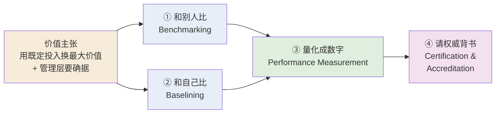

---

## 1. Benchmarking:站在同行的肩膀上

### 1.1 为什么需要对标

回忆上周的一个核心词:**blueprint(蓝图)**——一份"描述现有控制、指出还需补哪些控制"的文档。问题是,蓝图从哪来?讲师给了两条路。**第一条**是从现成的安全模型与实践里取材,比如 ISO 27000 系列、NIST SP 800 系列。**第二条**,也是本章的主角,是去**看和你处境相似的组织走过的路**:他们怎么应对类似局面?达成了什么?策略是什么?表现如何?把这些当作搭建自己蓝图的"垫脚石 (stepping stone)"。

用第二种方法时,你做的事就叫 **benchmarking(对标)**:**遵循一个相似组织的推荐做法或现有做法,或者遵循某个行业制定的标准 (industry-developed standard)**。它的直觉很朴素——别人趟过的坑,你不必再趟一遍。

### 1.2 对标能做什么、不能做什么(关键区分)

这里有一句**讲师反复强调、极易考**的话:

> **Benchmarking 能帮你确定"应该考虑*哪些*控制 (which controls)",但*无法*告诉你这些控制"该*怎么*实施 (how to implement)"。**

为什么会有这个天花板?因为**每个组织都是独一无二的**。对一家公司行之有效的做法,未必精确适合另一家;所以现实中你常常需要**从好几个公认实践里各取一部分**,再改造 (modify / adapt) 成自己的版本。对标给你的是"清单方向",不是"施工说明"。把这一点记牢,后面讲 baselining 和 limitations 时会反复呼应。

> 🔑 **一句话记忆** — Benchmarking 回答 **"WHICH"(选哪些控制)**,不回答 **"HOW"(怎么落地)**。

---

## 2. 两大类 benchmark

在信息安全里,benchmark 分成**两大类别**——别混淆,这是常考的分类题:

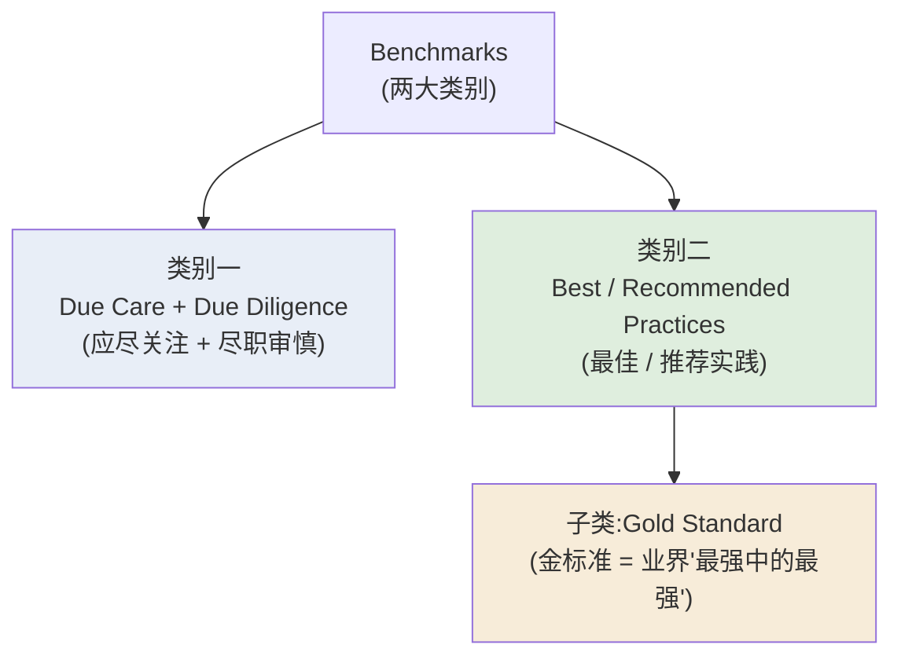

注意讲师特意提醒的两个"组队"关系:**due care 和 due diligence 合起来算一类**;**best practices / recommended practices(也叫 best security practices)算另一类**,其中"最最顶尖、被公认为'best of the best'"的那一小撮,有个专名叫 **gold standard(金标准)**。下面分别讲透。

### 2.1 类别一:Due Care 与 Due Diligence —— 法律自保的最低线

先说**为什么会有这一类**。出于法律原因,某些组织(尤其是掌握客户/患者敏感信息的行业:**医疗、银行、法律、以及任何处理个人数据的领域**)被**强制要求达到一个法定的最低安全水平**。一旦将来出事打官司,组织需要拿出证据,证明自己**"做了任何一个审慎的组织 (any prudent organization) 在类似处境下都会做的事"**。这条"审慎组织都会做"的最低线,就是 **standard of due care(应尽关注标准)**。

那 **due diligence** 又是什么?讲师把两者的差别讲得很清楚,用一句话锁死:

> **Due care 是"采用"了最低安全水平;due diligence 是"实施并*持续维护*"这些控制,确保它们在一段时间内*持续*提供所需的保护。**

换句话说:

- **Due care(应尽关注)** —— 你**采纳 (adopt)** 了那个最低标准。回答的是"你有没有装上该装的东西"。
- **Due diligence(尽职审慎)** —— 你**实施 (implement) 并维护 (maintain)** 这些控制,并保证它们**在持续地、长期地**起作用。回答的是"你有没有让它一直好用"。

为什么这个区分重要?因为**法律后果**:**一旦组织未能确立并维持 due care 与 due diligence,且能被证明在信息保护上存在过失 (negligent),它就会暴露在法律责任 (legal liability) 之下。** 装了防护但任其失效,和从没装过,在法庭上可能同样糟糕。

> 📎 **拓展(超出 slides)** — 一个生活化类比:**due care** 像是你给家里装了烟雾报警器(达到了"审慎住户都会做"的最低线);**due diligence** 则是你每隔几个月检查一次、按时换电池(持续维护,确保它真出事时能响)。只装不管,失火时报警器没电,你依然算"过失"。

> 🔑 **例** — 一家医院按法规为患者电子病历部署了加密和访问控制(**due care**)。但三年里从未更新过加密算法、也没复查过谁还留着访问权限。某天一名早已离职的员工凭旧账号导走了病历——医院虽"装了"控制,却没"维护"控制,**未尽 due diligence**,在诉讼中被判存在过失。

讲师还补了一句很实际的话:一个组织的信息安全环境通常**庞大而复杂**,不可能一次性在所有类别都上到推荐实践的最高水平,有些组织甚至财力上做不到。所以**与其在一个领域砸钱堆出"最先进"、却让其他领域裸奔**,不如**先确保所有领域都达到一个合理的安全水平**,保护好信息资产之后,再逐个领域往最高标准提升。这正是 due care(全面达标)优先于 best practice(单点拔尖)的逻辑。

### 2.2 类别二:Best / Recommended Practices —— 追求卓越

如果说 due care 是"地板"(法律最低线),那 **best practices** 就是"天花板"附近的东西。定义:

- **Recommended business practices(推荐业务实践)** —— **寻求在信息保护上提供*卓越* (superior) 表现**的安全努力。
- **Best security practices(最佳安全实践)** —— 那些**被认为处于业界*最佳* (among the best in the industry)** 的安全努力。
- 两个词常被交替使用;而其中公认的"最强中的最强",就是前面说的 **gold standard**。

best practices 的几个特征要记住:它们**在"信息可访问性"和"充分保护"之间取得平衡**(安全不能锁死业务),并**体现财务上的责任感 (fiscal responsibility)**(不乱烧钱)。但讲师提醒一个常被忽略的点:**采用了 best practices 的公司,未必在每个领域都做到最好**——它可能只在某一个领域建立了极高质量的安全,其他领域只是达到了"保护所有信息所需的最低质量标准"。所以"best practice 公司"≠"样样第一"。

| | **Due Care / Due Diligence** | **Best / Recommended Practices** |
|---|---|---|
| 定位 | 法律自保的**最低线**(地板) | 追求**卓越表现**(天花板) |
| 驱动力 | 法律责任、避免被判过失 | 竞争优势、行业领先 |
| 内部细分 | due care = 采纳最低标准 | best = 业界最佳水平 |
|  | due diligence = 持续维护 | gold standard = "最强中的最强" |
| 覆盖 | 强调**所有领域都合理达标** | 可能只在**个别领域**拔尖 |

### 2.3 怎么挑:6 个判断问题

选哪条推荐实践来落地,对很多组织都是个难题。讲师先区分两种处境:

- **受监管的行业**(被法律、标准、政府或行业监督约束的)——**必须**满足相应的监管或行业指南,没得选。
- **其他组织**——政府和行业指南是**极好的信息来源**,可以据此挑选适合自己的推荐实践。

但"一条实践适合别人,不代表适合你"。讲师给出 6 个判断问题(slide 10),核心就一句:**这条实践来自的那个"目标组织 (target organization)",和你像不像?**

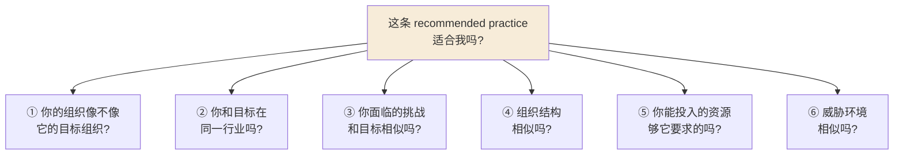

讲师对每一条都给了直觉,值得记:

1. **像不像目标组织?** —— 一条推荐实践只有在"你的组织和它来源的组织相似"时才有意义。
2. **同行业吗?** —— 在制造业很灵的策略,搬到非营利组织或零售业可能毫无用处。
3. **挑战相似吗?** —— 如果你连一个能运转的信息安全计划都还没有,而某条实践默认"你已经有了",那它对你不适用。
4. **结构相似吗?** —— 为"高度集中的风险管理架构"设计的实践,不适合一个用"松散联邦式单元"做风险管理的组织。
5. **资源够吗?** —— 一条要求的资金超出你承受能力的实践,价值非常有限。
6. **威胁环境相似吗?** —— 很多年代久远、已经过时的推荐实践(讲师举例:过去几十年针对网络/互联网连接的不少做法)根本应付不了当前的威胁环境。

> 📎 **拓展(超出 slides)** — 讲师顺带点了一句行业现实:在 AI 辅助搜索工具时代,**"找到"安全设计信息已经是最容易的部分**;难的是**从海量信息里筛选 (sorting through)**,这要耗费的不只是时间,还有人力。最终目标不是抄一条实践,而是**得到一套方法论 (methodology)**,据此搭出契合你具体处境的 framework,再发展成包含策略、教育培训、技术控制的 blueprint。

### 2.4 对标的三大局限(常考)

讲师明确列了 benchmarking 的三个固有问题,务必记住:

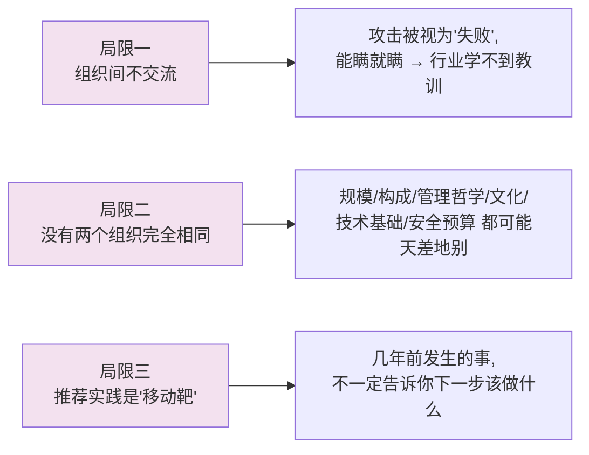

1. **最大的障碍:组织之间不互相交流。** 一次成功的攻击,往往被组织视为**自身的失败 (organizational failure)**,出于在市场和利益相关者面前的形象考虑,能瞒就瞒。结果是**整个行业一起受损**——宝贵的教训没被记录、没被传播、没被评估。讲师也给了缓解之道:越来越多安全管理员加入 **ISSA、ISACA** 这样的专业协会与社团,在不公开身份的前提下分享经历;行业组织也赞助"信息共享"活动;还有人在安全期刊上**匿名发表**事件的"精华版"(隐去能识别身份的细节)。这种"**发表经验教训 (publication of lessons learned)**"是对"面对面直接对话"的一种替代。
2. **没有两个组织完全相同。** 哪怕在同一市场提供同类产品/服务的两家公司,也可能在**规模、构成、管理哲学、组织文化、技术基础设施、安全预算**上差异巨大。讲师点出关键:**安全在本质上是一个管理与人的问题,而非纯技术问题**——如果它只是技术问题,把别处成功的技术照搬过来就能解决,但事实并非如此,影响安全的变量在任意两家组织之间都可能天差地别。所以组织最该向同行求取的,是**能帮自己作战略判断的教训**,而不是"该上哪个具体技术"。
3. **推荐实践是一个移动靶 (moving target)。** 它在不断演化。**知道几年前发生了什么,不一定告诉你下一步该做什么。** 没错,不为过去的攻击做准备的人会再次挨打;但**只防住过去,也保护不了你面对未来。** 所以安全计划必须持续更新,纳入新的威胁、新的方法技术、新的策略指南、新的教育培训手段和新技术。

---

## 3. Baselining:和过去的自己比

讲完"和别人比",自然引出一个相关却不同的概念:**baselining(基线化)**——**和过去的自己比,或和一个内部设定的标准比**。

**Baseline(基线)** 是某个**性能度量 (performance metric)** 的一个**值或剖面 (a value or profile)**,用来作为**对照基准**,衡量这个度量后来发生的变化。讲师给了一个贯穿全节的例子:**一个组织每周经历的外部攻击次数**。

> 🔑 **例(讲师贯穿全节的例子)** — 组织先用一段时间统计每周外部攻击的次数,算出一个**每周平均值**,把它定为**初始基线 (initial baseline)**。这个值成为日后所有度量的**参照点**。往后,组织把"当前每周攻击数"和这个基线比:数字在涨还是在跌?进而看出自己的安全努力到底**起了什么作用**。

所以一句话:**baselining 就是"对照一个已确立的内部值/标准来度量"的过程。** 在信息安全里,对安全活动和安全事件做基线度量,目的就是把组织**当前的安全表现**,和它**过去的表现**、或**设定为目标的表现水平**做对比。讲师补了一个很实用的衔接点:**组织第一次风险评估 (initial risk assessment) 收集到的信息,往往就成为日后比较的基线**;而且 baselining **可以为"内部对标 (internal benchmarking)"提供基础**——和别人比是外部对标,和自己的历史比就是内部对标。

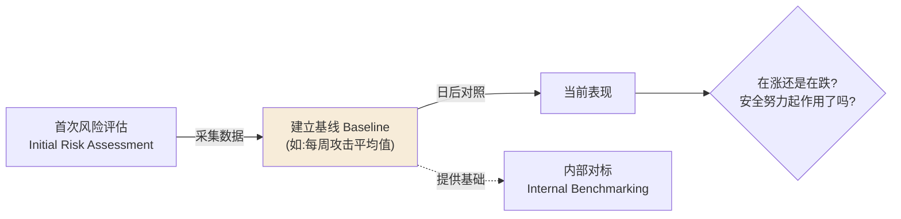

### 3.1 自评 12 问:people / processes / technology

讲师介绍了一份很实用的"基线自评"工具:**12 个自评问题,分成三组——people(人员)、processes(流程)、technology(技术)**。这三组**大致(loosely)对应**上周讲过的 NIST 三大领域:**managerial(管理)、operational(运营)、technical(技术)**。

> 📎 **拓展(超出 slides)** — 讲师提到这 12 个问题最初由 **Gartner Group** 总结。Gartner 是面向 IT 行业企业的研究与咨询服务提供商,帮组织制定技术战略、规划与预算并选型。

| 组别 (≈ NIST 领域) | 自评问题(回答"是/否"来暴露差距) |
|---|---|
| **People**(人员,≈ managerial) | • 对所有能接触敏感数据/区域/接入点的员工做背景调查了吗? • 普通员工**认得出**一个安全问题吗? • 他们**会选择上报**吗? • 他们**知道**该向哪些正确的人上报吗? |
| **Processes**(流程,≈ operational) | • 企业安全策略**至少每年更新**、员工就变更受过教育、且被**一致地强制执行**吗? • 企业有没有遵循**补丁/更新管理与评估流程**来排序和处置新漏洞? • 离职员工的账号在**离职时被立即删除**了吗? • 新项目的**整个生命周期各阶段**都有安全组代表参与吗? |
| **Technology**(技术,≈ technical) | • **每一条**通往互联网的路径都被一台**正确配置的防火墙**保护了吗? • 笔记本和远程系统上的敏感数据**加密**了吗? • 你**定期用漏洞分析工具**扫描系统和网络找暴露面吗? • 所有工作站和服务器都部署了**恶意软件扫描工具**吗? |

> 📎 **拓展(超出 slides)** — 讲师提到,技术组里的"防火墙"和"加密"会在**接下来两讲的保护机制(protection mechanisms)**里详细展开——这里先埋个伏笔。

---

## 4. Performance Measurement:把"好不好"变成数字

和别人比、和自己比之后,最硬核的一步来了:**把信息安全的成本、收益、表现真正度量出来。**

### 4.1 它真的可以被度量(破除迷思)

讲师先破除一个常见迷思:**一些 CISO 声称信息安全的成本、收益和表现"几乎无法度量"。这是错的——只要遵循一套扎实、可靠的方法论,它们是可度量的。** 高管经常逼问 CISO 三个问题:"这个安全控制要花多少钱?""它管用吗?",甚至更刺耳的"为什么这套控制不管用?"。要回答这些,就必须**设计并持续运行一个基于有效绩效指标 (effective performance metrics) 的信息安全绩效管理程序**。

### 4.2 定义与三类度量

**InfoSec performance management(信息安全绩效管理)** 的定义要背准:

> **设计、实施并管理"所收集的数据元素(称为 measurements 或 metrics)"之使用,以确定整个安全计划的有效性 (effectiveness) 的过程。**

而 **performance measurements(绩效度量)** 本身,是**指示安全对策或控制(无论技术的还是管理的)是否有效的数据点 (data points),或由这些数据计算出来的趋势 (computed trends)**。它的用途是支撑管理决策:增强问责、提升 InfoSec 职能的有效性,并通过对关键绩效数据的收集、分析与汇报,帮组织把 InfoSec 的表现与目标,和**组织整体使命 (mission)** 对齐。

组织通常用**三类度量**(常考的分类,务必记牢):

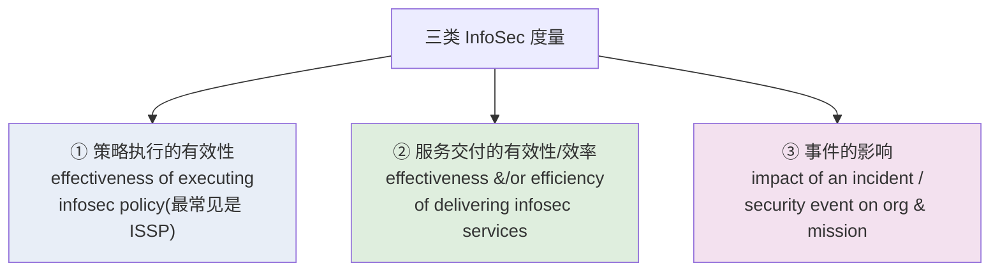

1. **度量"信息安全策略执行的有效性"** —— 最常见的是针对 **ISSP(issue-specific security policies,议题专项安全策略)** 的执行情况。
2. **度量"信息安全服务交付的有效性和/或效率"** —— 既包括**管理类服务**(如安全培训),也包括**技术类服务**(如安装杀毒软件)。
3. **度量"某次事件或安全事件对组织及其使命的影响"**。

### 4.3 NIST SP 800-55 R1:度量计划的指导文件

本章反复引用的主参考文件是 **NIST SP 800-55 Revision 1,《Performance Measurement Guide for Information Security》**。讲师解释了为什么:在今天受监管的环境里,**光"声称"自己安全已经不够了**——组织必须**用文档证明**自己采取了有效步骤来控制风险,以此记录自己的 due diligence。

该文件给了两组要记的清单:

**(a) 开发与实施度量计划时必须考虑的因素(slide 19):**

- 度量必须产出**可量化信息 (quantifiable information)**——百分比、平均值、数字。
- 支撑度量的**数据必须容易获得 (readily obtainable)**。
- **只有可重复的 (repeatable)** 信息安全流程才应被纳入度量。
- 度量必须**对追踪绩效、引导资源投放有用**。

**(b) 度量计划成功的 4 个关键因素(slide 20):**

| 成功因素 | 讲师的解释 |
|---|---|
| ① **强有力的高层管理支持** | 不只对计划成功关键,对计划的**实施**也关键。 |
| ② **务实的安全策略与流程** | 应明确 InfoSec 管理结构、界定关键职责,为可靠度量进度与合规打基础。 |
| ③ **可量化的绩效度量** | 基于 InfoSec 绩效目标设计,数据应易获得、可实施。 |
| ④ **结果导向的度量分析** | 把经验教训用于改进现有控制、规划未来控制以应对新需求。 |

### 4.4 Metrics 还是 Measurements?以及 Kovacich 的 WH 问题

讲师澄清了两个常被混用的词:

- **Metrics(指标)** —— 把**统计与定量的数学分析方法**,应用到"度量 InfoSec 计划的活动与结果"这件事上;通常指**更细粒度、更详细的度量**。
- **Measurements(度量)** —— 指**聚合的、更高层级的结果**。

很多组织里两者**可互换使用**;在本课程里也当作可互换。

在开始**设计、收集、使用**度量之前,CISO 应当能回答一组关键问题。讲师引用了 **Gerald Kovacich** 在《The Information Systems Security Officer's Guide》里提出的问题——本质就是一组 **WH 问题**:

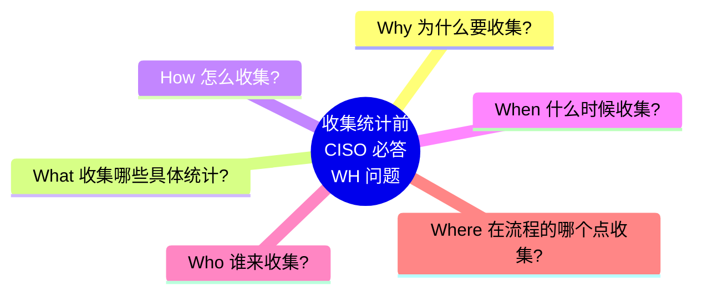

记忆法:**Why / What / How / When / Who / Where ——"为什么、收什么、怎么收、何时收、谁来收、在哪收"。** 讲师强调:一旦"**测什么 (what)**"定了,剩下的 **how / when / where / who** 才需要逐一解决。

### 4.5 搭建度量计划:价值、CMMI、与 NIST 的两大活动

一个度量计划必须能**向组织证明自身价值**。按 SP 800-55 Rev 1,使用 InfoSec 绩效度量的**好处**包括:

- 增强 InfoSec 绩效的**问责性 (accountability)**;
- 提升 InfoSec 活动的**有效性**;
- **证明对法律、规则、法规的合规**;
- 为**资源分配决策**提供可量化的输入。

支撑"过程改进与绩效度量"的著名参考之一是 **CMMI**:

> **CMMI = Capability Maturity Model Integration(能力成熟度模型集成)**。它是一个过程级的改进、培训与评估项目;参考出版物是《CMMI Distilled》;由 **CMMI Institute** 管理(该机构是 **ISACA 的子公司**);最初在 **CMU(卡内基梅隆大学)** 开发。

> 📎 **拓展(超出 slides)** — 讲师顺带重温了 **ISACA**:一个聚焦 **IT 治理 (IT governance)** 的国际专业协会,提供大量信息技术治理与信息安全方向的认证项目。CMMI Institute 是它的子公司——把这条关系记住,考点经常把 CMMI、CMMI Institute、ISACA、CMU 串在一起。

另一个本课**重点引用**的方法,就是 **NIST SP 800-55 Rev 1** 本身。它的度量开发流程分**两大活动**:

1. **识别并定义当前的 InfoSec 计划**(现状盘点);
2. **开发并选择具体度量**,用以衡量安全控制的**实施 (implementation)、有效性 (effectiveness)、效率 (efficiency) 与影响 (impact)**。

### 4.6 指定度量(Specifying)

度量过程里**最关键的任务之一,是评估并量化"要测什么"**。讲师区分了两种工作量:

- **InfoSec 的规划与组织活动** —— 可能只需要**时间估算 (time estimates)**。
- **评估"生产任务/项目任务"投入的努力** —— 需要**更细的度量**,这通常意味着某种**时间报告系统 (time reporting system)**,纸质或自动化皆可。

从生产统计里收集的度量,**很大程度上取决于系统数量和这些系统的用户数量**——系统或用户一变,维持同等服务水平所需的努力也会变。有的组织只追踪这两个值;有的需要更细的度量,例如:**新增用户数、访问控制变更数、被移除/重新授权的用户数、访问控制违规数、安全意识简报场次、按类别统计的事件数、被防火墙过滤/拦截的恶意代码实例数**等等。讲师也提醒:**光是数清生产环境里有多少计算系统,本身可能就是一项耗时的工程。**

### 4.7 收集度量(Collecting):四个子决策

"测什么"答完之后,**how / when / where / who** 就该上场了。讲师把"收集"环节拆成四个要点:

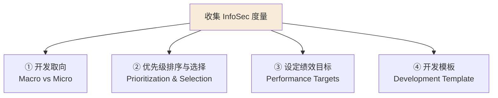

**① Macro-focus vs Micro-focus(宏观 vs 微观取向)。** 建程序时的首要优先事项之一,是决定度量是宏观还是微观聚焦:

| | **Macro-focus(宏观)** | **Micro-focus(微观)** |
|---|---|---|
| 关注对象 | **整个安全计划**的整体表现 | **单个控制**或一组控制的表现 |
| 用途 | 看大局是否健康 | 看某个具体控制好不好 |

也可以在一次有限评估里**同时用宏观和微观**度量。讲师强调一句话:**度量必须明确绑定到组织具体的 InfoSec 目标与目的上**——只为"收集数据"而收集数据,纯属浪费宝贵资源;度量计划应由组织的**具体需求**驱动,而不是任何单个经理的一时兴起。

**② Prioritization & Selection(优先级排序与选择)。** 因为"**能度量什么,才管理得好什么**",所以单个指标的优先级,应当和它所度量的流程的优先级**保持一致**。做法可以是:简单的 **low / medium / high 三档排序**,或更精细的**加权打分 (weighted scale)**——按每个度量在整体 InfoSec 计划中的重要性、整体风险缓解目标、以及系统的关键程度来赋值。可用的度量有成百上千,但**只有那些与适当优先级活动相关的,才应被纳入**——因为开发、实施、收集、分析、汇报数据的人力资源总是有限的。

**③ Establishing Performance Targets(设定绩效目标)。** 绩效目标让"安全计划成功"有了可定义的标准。讲师给了一组对照鲜明的例子:

> 🔑 **例(易测 vs 难测)** — **容易测的:** "100% 员工完成 InfoSec 培训"——你只需记录哪些员工受训了,数一下人数、算个百分比即可。许多 InfoSec 度量目标都设成 **100% 这个目标值**。**难测的:** "装了防火墙之后,组织信息的安全性*相对提升*了多少?"——这种衡量相对有效性/效率/影响的度量,**主观得多,需要管理层来评估**其目的与价值,无法像数考勤一样简单量化。

这个对照恰恰点出信息安全绩效度量的一个**根本难题:到底怎么定义"有效的安全"?什么时候才算 InfoSec 是有效的?** 讲师坦言研究者至今没有定论:有人主张"成功避免损失"就是最好的度量,但反方说**避免损失可能只是运气或其他非程序因素**,任何有效的度量都必须是**可证明的 (provable)**。这个两难尚未被完全解决。

**④ Measurements Development Template(度量开发模板)。** NIST 建议**用标准化格式记录绩效度量**,以确保度量的开发、定制、收集、汇报活动**可重复 (repeatable)**。一个常见做法,就是开发一份**自定义模板**来记录将要使用的绩效度量。讲师还指出 slide 32 给了一张**候选度量 (candidate measurements)** 示例表,例如:"投入 InfoSec 的预算占组织信息系统预算的百分比""被授权外人成功获取未授权访问的远程接入点百分比""在组织规定时限内修复的漏洞百分比""完成年度应急计划测试的系统百分比"等等——**它们的共同点就是'可量化'**;具体如何计算与使用,详见 NIST SP 800-55 Rev 1。

### 4.8 实施(Implementing):NIST 的 6 阶段流程

度量一旦开发出来,就必须被**实施并整合进日常的 InfoSec 管理运营**。讲师强调一个原则:**绝大多数度量不能"只收集一次"就完事**——它是**持续的、不断改进的运营**,所有度量数据的收集都应成为全组织的**标准操作流程 (SOP)** 的一部分。(**例外**:少数活动只需一次性收集,比如做正式成本-收益分析时识别成本,或 C&A 场景——讲师举例:员工入职时收集一次证书与资质即可,不必每年再问一遍。)

按 SP 800-55 Rev 1,绩效度量的实施是一个**6 阶段流程**(对应 slide 34 的 Figure 7-2):

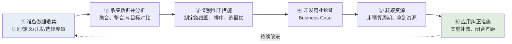

逐阶段(讲师口述):①**准备收集**——识别、定义、开发、选择度量;②**收集并分析结果**——收集、聚合、整合度量数据,把度量与目标对比;③**识别纠正措施**——制定路线图来闭合阶段②发现的差距,确定纠正措施的排序(按整体风险缓解目标排优先级)并选出最合适的;④**开发商业论证 (business case)**;⑤**获取资源**——走预算周期,拿到实施阶段③补救措施所需的资源;⑥**应用纠正措施**——在安全计划或控制中落地推荐的纠正措施,真正闭合差距。然后回到①,**形成持续改进的闭环**。

### 4.9 汇报(Reporting):数字要有上下文

最后一环是**汇报**。讲师的核心观点:**单纯把收集到的度量列出来,往往无法传达它的意义。**

> 🔑 **例** — 一张"每天恶意代码攻击次数"的折线图,只能传达一个基本事实。但如果汇报机制不能提供**上下文 (context)**——比如同期互联网上**新出现的恶意代码变种数量**——那这个度量就达不到它本来的目的(你不知道攻击变多是因为你更脆弱,还是因为全网威胁本来就在激增)。

因此汇报时要做两类决策:**(1)** 相关联的指标**怎么呈现**——用饼图、折线图还是柱状图?用什么颜色代表什么结果?**(2)** CISO 还必须考虑:这些结果**该发给谁 (to whom)、怎么递送 (how delivered)**。讲师补充:CISO 通常在与关键高管同僚的会议上汇报这类报告;**很少建议把复杂、微妙的、基于指标的报告广播给一大群普通用户或外行**——除非关键要点已被妥善铺垫、并嵌入更完整的上下文(如通讯稿或新闻发布)。

---

## 5. Certification & Accreditation:请权威来背书

把安全"做好"并"量化"之后,还剩最后一块:**让有权威的第三方认可你确实达标。** 这就是 **C&A(certification and accreditation)**。

### 5.1 两个词的精确定义(极易混淆)

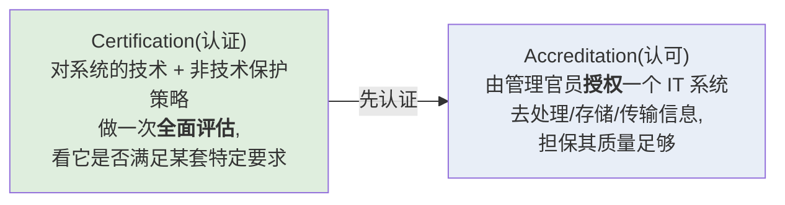

- **Accreditation(认可)** —— **授权 (authorization) 一个 IT 系统去处理、存储或传输信息**。它由**管理官员 (management official)** 签发,作为"系统质量足够好"的担保手段,并促使管理者和技术人员在给定的技术约束、运营约束和使命要求下,找出确保安全的最佳方法。**——注意:认可是"批准上线"的那个动作。**
- **Certification(认证)** —— 对某个特定系统的**技术性与非技术性保护策略,做一次全面评估 (comprehensive assessment)**,看它是否满足某一套特定要求 (a particular set of requirements)。

两者的关系:一个系统可以被**认证**为满足某套标准;但在被允许去处理某类特定信息(比如按数据分类方案划分的某级机密文档)之前,还必须由适当权威**认可**(批准),且要在可接受的风险水平下。组织追求 C&A,是为了**赢得竞争优势,或向客户提供确据与信心**。

> 🔑 **例(讲师的类比)** — 你在 UOW 拿到的学位也是被**认可 (accredited)** 的——由 **ACS(澳大利亚计算机协会)** 认可。这相当于一份"质量证据",而学校也努力达到 ACS 所要求的标准。认可这件事到处都在发生,不止信息安全领域。

### 5.2 从 C&A 到 RMF:2009 年的转向

讲师讲了一段重要的历史脉络(这部分的"为什么"在 slide 37,"是什么"在转写里补全):

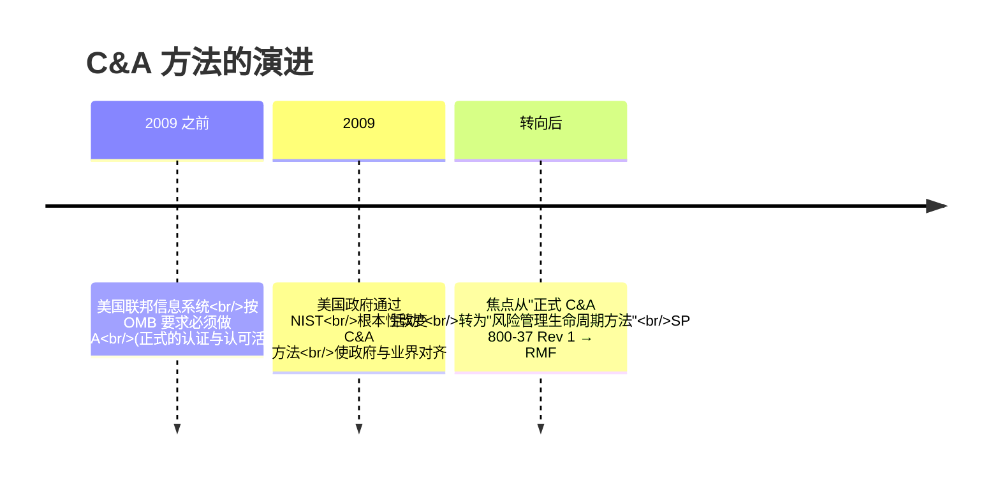

- **2009 年之前**,美国联邦信息系统(按美国管理与预算办公室 OMB 的要求)**必须做 C&A**。无论由联邦机构还是私营企业执行,**认可**都意在证明:管理层已定义了一个可接受的风险水平,且所投入的资源能把风险降到该水平。
- **2009 年**,美国政府通过 NIST **根本性地改变了对联邦信息系统 C&A 的处理方式**,使政府与业界**对齐 (alignment)**。**焦点从"正式的 C&A 活动",转向了"风险管理生命周期方法 (risk-management life cycle approach)"。** 随着 **NIST SP 800-37 Rev 1**(《Guide for Applying the Risk Management Framework…》)的发布,做法转为一种**基于风险管理的"评估与授权 (assessment and authorization)"**过程——其背后很大程度上由 **2002 年的《联邦信息安全管理法案》(FISMA, Federal Information Security Management Act)** 驱动。

### 5.3 RMF 六步(讲师点名要记)

由 SP 800-37 引出的统一框架叫 **RMF(Risk Management Framework,风险管理框架)**,它以 **NIST SP 800-39**(《Managing Information Security Risk》)里的"安全生命周期"为核心,是一个**六步循环**:

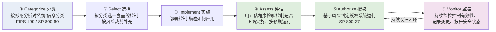

记忆口诀:**Categorize → Select → Implement → Assess → Authorize → Monitor(分类 → 选择 → 实施 → 评估 → 授权 → 监控)**。逐步含义(讲师口述):

1. **Categorize(分类)** —— 基于影响分析,对信息系统及其处理/传输的信息进行分类(参考 FIPS 199、SP 800-60)。
2. **Select(选择)** —— 基于安全分类,为系统选一套初始的**基线安全控制**,再根据组织的风险评估与本地条件进行**裁剪与补充 (tailoring & supplementing)**。
3. **Implement(实施)** —— 实施安全控制,并描述这些控制在系统及其运行环境中如何被应用。
4. **Assess(评估)** —— 用适当的评估程序,判定控制被**正确实施、按预期运行、并产生满足系统安全要求的预期结果**的程度。
5. **Authorize(授权)** —— 基于"系统运行对组织运营、个人、其他组织乃至国家造成的风险"的判定,以及"该风险可接受"的决定,授权系统运行(参考 SP 800-37)。
6. **Monitor(监控)** —— 持续监控安全控制,包括评估控制有效性、记录系统及其环境的变更、做安全影响分析、向指定官员报告系统安全状态。

> 🔑 **关键考点** — **RMF 的第④步 Assess 和第⑤步 Authorize,正是取代了过去联邦信息系统所用的 certification 与 accreditation(C&A)。** 可以理解为:assess ≈ 原来的 certification,authorize ≈ 原来的 accreditation。

### 5.4 认可/认证不是永久的

最后一个重点:**accreditation 和 certification 都不是一劳永逸的**——正如 due care 与 due diligence 需要持续维护一样。大多数认可/认证流程都要求**每隔几年重新认可或重新认证 (re-accreditation / recertification),通常每 3–5 年一次**。而像 RMF 这样的方法**被设计成遵循"持续改进 (continuous improvement)"**——这正是为什么图里第⑥步 Monitor 之后又回到第⑤步,形成闭环。讲师点出其用意:**防止组织"为了过 C&A 周期猛冲一阵,过完就松懈,临近下个周期再临时抱佛脚"**,从而避免周期之间出现安全空窗。

---

## 本章小结 (Key takeaways)

- **Benchmarking(对标)是"和别人比"**:遵循相似组织的做法或行业标准。它能告诉你**该考虑*哪些*控制 (WHICH)**,但**无法告诉你怎么*实施* (HOW)**——因为没有两个组织完全相同。
- **Benchmark 分两大类**:**①due care(采纳最低安全线)+ due diligence(实施并*持续维护*这些控制)**,合为一类,是法律自保的地板,未尽则可能被判**过失、承担法律责任**;**②best/recommended practices(追求卓越表现)**,其顶尖者称 **gold standard**。
- **选推荐实践用 6 个问题判断"目标组织和你像不像"**(行业/挑战/结构/资源/威胁环境);对标有**三大局限**:组织间不交流(攻击被当失败隐瞒)、没有两家组织相同、推荐实践是不断演化的**移动靶**。
- **Baselining(基线化)是"和过去的自己比"**:对照一个已确立的内部值(如每周攻击平均值)来度量;**首次风险评估的数据常成为基线**,并为**内部对标**提供基础。配套有 **12 题自评**,分 **people / processes / technology** 三组(≈ NIST 管理/运营/技术)。
- **信息安全的成本、收益、表现*是*可度量的**;**InfoSec 绩效管理 = 设计/实施/管理"度量"的使用,以确定整个安全计划的有效性**。有**三类度量**:策略执行有效性、服务交付有效性/效率、事件影响。
- **NIST SP 800-55 R1** 是主参考:度量须**可量化、数据易得、流程可重复、对引导资源有用**;**4 个成功要素**=高层支持 + 务实策略流程 + 可量化度量 + 结果导向分析。收集前 CISO 要答 Kovacich 的 **WH 问题(why/what/how/when/who/where)**;**CMMI**(ISACA 子公司管理、CMU 开发)是另一著名过程改进参考。
- **度量工作流**:指定(测什么)→ 收集(macro 看全局 vs micro 看单控;按 low/med/high 或加权排序;设目标,100% 易测、相对有效性难测需管理层判断;用标准模板保证可重复)→ 实施(**6 阶段闭环**:准备→收集分析→识别纠正→商业论证→获取资源→应用纠正)→ 汇报(**数字必须配上下文**,并决定发给谁、怎么发)。
- **Accreditation(认可)= 管理官员*授权*一个 IT 系统去处理/存储/传输信息**;**Certification(认证)= 对系统技术与非技术控制做*全面评估*,看是否满足某套要求**。先认证、后认可。
- **2009 年起,美国联邦系统用 RMF 取代了传统 C&A**(由 FISMA 2002 驱动、SP 800-37 引出、以 SP 800-39 为核心)。**RMF 六步:Categorize → Select → Implement → Assess → Authorize → Monitor**;其中 **Assess + Authorize 正是取代了 certification + accreditation**。认可/认证**非永久**,通常每 **3–5 年**重做一次,并被设计成**持续改进**的闭环。

---

*来源:CSIT988/CSIT488 Week 8 lecture slides(L08,41 张)与 Week 8 课堂录音转写。标注 📎 的内容为超出 slides 的补充解释/讲师口头举例(如 Gartner Group、ACS 认可学位的类比、ISACA 与 CMMI 的关系等),用于建立直觉与背景;考试范围以 slides 为准。下一讲(L09–L10)进入 risk management,会出现需要计算器的计算题。*
